# [BIM_EVENTS]

`Rasm.Bim` announces settled facts through the kernel CloudEvents mechanics and generated `event.Extensions`. This page owns the one Bim projection from domain handling and causal values onto that generated message; it maintains no peer extension roster.

Announcement is a SUBSCRIPTION, never an emit inside a domain fold: a dispatcher fires its hook point and this projection observes, so a fact reaches a broker exactly when the registry already carried it in-process and a dispatcher carries no envelope custody. `Model/observability#HOOKS` owns the fact family, its address slots, and its closed vocabularies; this page owns the wire body and the attribute projection over it.

Wire posture is HOST-LOCAL, envelope-only: the `CloudNative.CloudEvents` envelope type crosses this folder's signatures and every codec identity is the kernel's. Transport bindings, broker retry, and delivery policy stay app-tier — the `Rasm.Persistence/Version/egress` sinks compose `CloudNative.CloudEvents.Kafka` and `.Amqp` against the kernel `EventFormat` rows, and the MQTT 5.0 leg is branch-owned at `Rasm.Compute/Runtime/ingest#BROKER_INGEST` because the CNCF MQTT binding is retired here. Faults route the `Model/faults#FAULT_BAND` `BimFault` arms BARE — every payload, subject, and slot defect lifts `Refused/BimReason.Codec` under one `event-<subject>-<defect>` detail grammar the raising site composes, while grammar, roster, and validator refusals stay the kernel's own `Fault` band.

## [01]-[INDEX]

- [02]-[EVENT_PROJECTION]: `BimAnnounce` the announced-fact roster over the kernel `EventType` grammar, the flat camelCase wire payloads over one source-generated `BimEventContext`, `BimEventPort` the composition contract a minted envelope leaves through, and `BimEventing` the observe subscription with its mint and its inverse admission.

## [02]-[EVENT_PROJECTION]

- Owner: `BimAnnounce` the closed `[SmartEnum<string>]` roster over the facts this package announces, each row carrying its kernel `EventType` and the hook point it observes; `BimEventPort` the composition contract carrying the producing `EventSource`, the handling grade, and the sink a minted envelope leaves through; `BimEventing` the projection owner — `Observe` the subscription set, `Mint` the total `BimFact`-to-envelope projection, and `Admit` its inverse; `BimEventExtensions` the one generated-message contract and value constructor; `BimEventContext` the source-generated STJ context over the flat wire payload records; `BimEventWire` the Mapperly outbound shape half beside `EventCodec`, its per-type converter set — named for the MESSAGE roster it serves, the codec mechanism staying the shared `Rasm.Element/Graph/wire#WIRE_CODEC` owner's (E-B4).
- Cases: five announced rows over the fourteen-case fact family — `committed` off `BimPoint.Committed`, `issue-mutated` off `BimPoint.IssueMutated`, `verdict-issued` off `BimPoint.Verdict`, `artifact-minted` off `BimPoint.Exported`, and `energy-minted` off `BimPoint.Emitted`. Every remaining case answers `None` on the same total projection: the three `Progress` streams are in-flight operator feedback rather than settled facts, the two veto points are decisions still under consultation, and `Imported`, `Lowered`, `Textured`, and `Degraded` are local-quality evidence whose consumer is the meter beside them — an announcement over any of them publishes a fact no peer acts on and no settled result stands behind.
- Entry: `BimEventing.Observe(BimEventPort port, IClock clock)` returns the ONE kernel `HookTap` row a composition hands `BimHooks.Live`, its `Scope` column naming the five announced seats so the dispatcher attaches them ahead of the first fire and its own detach custody closes what the composition opened, the clock threaded so a fake-clock composition stamps deterministically; `BimEventing.Mint(BimFact fact, BimEventPort port, Instant at)` returns `Fin<Option<CloudEvent>>` — total over the family, an announced case projecting one typed `RasmEventMint<Extensions>` through `RasmEventEnvelope.Mint` and every other answering `None`; `BimEventing.Admit(CloudEvent envelope, Op key)` returns `Fin<BimFact>` — the inverse re-enters through `RasmEventEnvelope.Admit`, dispatches on the admitted profile type, re-admits every body slot through its canonical gate, and re-proves the subject against the normalized body content, landing the SAME case a fire produced because every wire record carries every slot its case holds.
- Auto: `BimEventExtensions.Contract` delegates declaration, descriptor-total projection, inverse reconstruction, and generated-rule admission to `EventExtensionContract<Extensions>`. `BimEventExtensions.Of` contributes only the creation-time trace, `recordedtime`, and deployment grade to the whole generated message. Verdict severity stays in the Bim body because no transport processor reads it. Mapperly still proves the outbound body correspondence while the inbound half retains its typed admission gates.
- Law: `id` derives the port source's capability namespace over UUIDv7 and mints once when the hook projects the settled fact. Retries retain the envelope; a replay mints a new announcement. A content digest would collapse distinct announcements of one payload.
- Law: `subject` is the content key of the normalized source-generated JSON body for every announcement. Entity, commit, model, and artifact identifiers remain typed body fields; none aliases the payload identity or creates a second subject grammar. Admission reserializes the admitted fact through the same generated shape before comparing the digest, so insignificant input formatting cannot re-key the fact.
- Law: every Bim announcement carries its complete event body. Artifact and entity keys remain typed body fields; they are not `dataref`, which requires a location from which the event payload itself can be retrieved. A binding externalizing this JSON body owns that storage write and the resulting URI-reference.
- Law: `dataclassification` arrives as one `DataGrade` on the port rather than per row, because handling class is a property of the COMPOSITION's deployment and not of which fact fired — a per-row grade lets one deployment publish a commit at one class and a verdict at another with nothing reconciling them.
- Law: the announced `BimFact` IS the projection of the owning dispatcher's result (`BimCommit`, the board mutation, `IdsAudit`, `ExportArtifact`, `EnergyCensus`); the envelope adds address, trace, and handling facts alone, and a parallel event ledger beside those results is the deleted form.
- Growth: a new announced fact is one `BimAnnounce` row, one wire record, one generated Mapperly signature, and one arm in each direction. A new extension changes `event.proto` first and reaches this page only when Bim produces or consumes it.
- Boundary: fire sites are the owning dispatchers and each names its point in place — `Review/versioning#VERSION_GRAPH` fires `Committed` at the one `BimRepository.Seal` funnel, `Review/issues#BCF_ARCHIVE` fires `IssueMutated` per board mutation, `Review/validation#IDS_FACETS` fires `Verdict` per issued outcome, `Exchange/export#EXPORT_PIPELINE` fires `Exported` per sealed artifact, `Energy/exchange#ENERGY_EXCHANGE` fires `Emitted` per energy artifact — so this page holds zero fire calls and a dispatcher reaching an envelope directly is the rejected form; encode, decode, framing, batch arity, and the formatter identity are `Rasm/Domain/event#FORMAT_CONTRACT`'s whole, so a body reaches a wire only through `EventEnvelope.Encode` at its consuming binding; the durable outbox row is `Rasm.Persistence`'s and the in-process fan is `Rasm.AppHost/Wire/topics`'s; the Python and TypeScript peers consume the structured-mode JSON body as plain CloudEvents, so no Bim type crosses and the envelope is the contract.

| [INDEX] | [ANNOUNCE]        | [POINT]                      | [SUBJECT]                   |
| :-----: | :---------------- | :--------------------------- | :-------------------------- |
|  [01]   | `committed`       | `rasm.bim.review.committed`  | normalized body content key |
|  [02]   | `issue-mutated`   | `rasm.bim.review.issue`      | normalized body content key |
|  [03]   | `verdict-issued`  | `rasm.bim.review.verdict`    | normalized body content key |
|  [04]   | `artifact-minted` | `rasm.bim.exchange.exported` | normalized body content key |
|  [05]   | `energy-minted`   | `rasm.bim.energy.emitted`    | normalized body content key |

```csharp
// --- [IMPORTS] -------------------------------------------------------------------------
using System.Collections.Immutable;
using System.Diagnostics;
using System.Globalization;
using System.Net.Mime;
using System.Numerics;
using System.Text.Json;
using System.Text.Json.Serialization;
using System.Text.Json.Serialization.Metadata;
using CloudNative.CloudEvents;
using LanguageExt;
using NodaTime;
using Riok.Mapperly.Abstractions;
using Thinktecture;
using Rasm.Bim.Model;
using Rasm.Domain;
using Rasm.Element.Projection;
using BimObserver = Rasm.Domain.HookTap<Rasm.Bim.Model.BimPoint, Rasm.Bim.Model.BimFact, Rasm.Domain.TelemetrySource>;
using static LanguageExt.Prelude;

namespace Rasm.Bim;

// --- [TYPES] ---------------------------------------------------------------------------
[SmartEnum<string>]
[KeyMemberEqualityComparer<ComparerAccessors.StringOrdinal, string>]
[KeyMemberComparer<ComparerAccessors.StringOrdinal, string>]
public sealed partial class BimAnnounce {
    public static readonly BimAnnounce Committed = new("committed", Of("review", "committed"));
    public static readonly BimAnnounce IssueMutated = new("issue-mutated", Of("review", "issue-mutated"));
    public static readonly BimAnnounce VerdictIssued = new("verdict-issued", Of("review", "verdict-issued"));
    public static readonly BimAnnounce ArtifactMinted = new("artifact-minted", Of("exchange", "artifact-minted"));
    public static readonly BimAnnounce EnergyMinted = new("energy-minted", Of("energy", "artifact-minted"));

    const string Domain = "bim";

    const int Major = 1;

    public EventType Type { get; }

    static EventType Of(string subject, string fact) =>
        EventType.Of(domain: Domain, subject: subject, fact: fact, major: Major);

    public static Option<BimAnnounce> Resolve(string spelled) =>
        toSeq(Items).Find(row => StringComparer.Ordinal.Equals(row.Type.Value, spelled));
}

// --- [MODELS] --------------------------------------------------------------------------
public sealed record CommittedWire(string CommitKey, ImmutableArray<string> Parents, string Branch, int Elements);
public sealed record IssueMutatedWire(string Topic, string Mutation, string? Comment, ImmutableArray<string> GlobalIds);
public sealed record VerdictIssuedWire(
    string Specification,
    int Spec,
    string Model,
    string Tier,
    string Outcome,
    string Severity,
    int Findings,
    ImmutableArray<string> GlobalIds);
public sealed record ArtifactMintedWire(string ContentKey, string Format, long Bytes, long ElapsedNanoseconds);
public sealed record EnergyMintedWire(string ArtifactKey, string Leg, string Format, int Warnings);

[JsonSourceGenerationOptions(PropertyNamingPolicy = JsonKnownNamingPolicy.CamelCase, DefaultIgnoreCondition = JsonIgnoreCondition.WhenWritingNull)]
[JsonSerializable(typeof(CommittedWire))]
[JsonSerializable(typeof(IssueMutatedWire))]
[JsonSerializable(typeof(VerdictIssuedWire))]
[JsonSerializable(typeof(ArtifactMintedWire))]
[JsonSerializable(typeof(EnergyMintedWire))]
public sealed partial class BimEventContext : JsonSerializerContext;

// --- [SERVICES] ------------------------------------------------------------------------
public sealed record BimEventPort(EventSource Source, DataGrade Grade, Func<CloudEvent, Fin<Unit>> Emit);

public static class BimEventExtensions {
    public static readonly EventExtensionContract<global::Rasm.Contracts.Event.Extensions> Contract = new(
        global::Rasm.Contracts.Event.Extensions.Parser,
        global::Rasm.Contracts.Event.Extensions.Descriptor,
        new global::Celly.Protovalidate.Validator([
            global::Rasm.Contracts.Event.EventReflection.Descriptor,
        ]));

    public static global::Rasm.Contracts.Event.Extensions Of(
        TraceCarrier trace,
        DataGrade grade,
        Instant recorded) {
        global::Rasm.Contracts.Event.Extensions message = new() {
            Dataclassification = grade.Key,
            Recordedtime = global::Google.Protobuf.WellKnownTypes.Timestamp.FromDateTimeOffset(
                recorded.ToDateTimeOffset()),
        };
        Optional(trace.TraceParent).Iter(value => message.Traceparent = value);
        Optional(trace.TraceState).Filter(static value => value.Length > 0).Iter(value => message.Tracestate = value);
        trace.Baggage.Iter(value => message.Baggage = value.Value);
        return message;
    }
}

// --- [BOUNDARIES] ----------------------------------------------------------------------
[Mapper(RequiredMappingStrategy = RequiredMappingStrategy.Both)]
[UseStaticMapper(typeof(EventCodec))]
public static partial class BimEventWire {
    [MapperIgnoreSource(nameof(BimFact.Committed.Key))]
    public static partial CommittedWire Wire(BimFact.Committed fact);

    [MapperIgnoreSource(nameof(BimFact.IssueMutated.Key))]
    public static partial IssueMutatedWire Wire(BimFact.IssueMutated fact);

    [MapperIgnoreSource(nameof(BimFact.Verdict.Key))]
    public static partial VerdictIssuedWire Wire(BimFact.Verdict fact);

    [MapperIgnoreSource(nameof(BimFact.Exported.Key))]
    [MapProperty(nameof(BimFact.Exported.Elapsed), nameof(ArtifactMintedWire.ElapsedNanoseconds))]
    public static partial ArtifactMintedWire Wire(BimFact.Exported fact);

    [MapperIgnoreSource(nameof(BimFact.Emitted.Key))]
    [MapProperty(nameof(BimFact.Emitted.Artifact), nameof(EnergyMintedWire.ArtifactKey))]
    public static partial EnergyMintedWire Wire(BimFact.Emitted fact);
}

public static class EventCodec {
    public static string Hex(UInt128 contentKey) => ContentHash.Hex(contentKey);
    public static string Hex(ContentAddress content) => content.ToValue();
    public static string Key(BimIssueMutation mutation) => mutation.Key;
    public static string? Text(Option<string> value) => value.Match(static v => v, static () => (string?)null);
    public static ImmutableArray<string> Keys(ContentKeySet keys) => [.. keys.Value.Map(Hex)];
    public static ImmutableArray<string> Texts(GlobalIdSet values) => [.. values.Value];
    public static long Nanos(Duration elapsed) => elapsed.ToInt64Nanoseconds();
}

// --- [OPERATIONS] ----------------------------------------------------------------------
public static class BimEventing {
    public static readonly string PayloadMedia = MediaTypeNames.Application.Json;

    public static BimObserver Observe(BimEventPort port, IClock clock) =>
        new(Name: Op.Of(name: "rasm.bim.announce"),
            Observe: fact => Mint(fact: fact, port: port, at: clock.GetCurrentInstant())
                .Bind(held => held.Match(Some: port.Emit, None: static () => Fin.Succ(unit))),
            Scope: Some(Seq(BimPoint.Committed, BimPoint.IssueMutated, BimPoint.Verdict, BimPoint.Exported, BimPoint.Emitted)));

    public static Fin<Option<CloudEvent>> Mint(BimFact fact, BimEventPort port, Instant at) => fact.Switch(
        state:        (Port: port, At: at),
        progress:     static (_, _) => Fin.Succ(Option<CloudEvent>.None),
        imported:     static (_, _) => Fin.Succ(Option<CloudEvent>.None),
        lowered:      static (_, _) => Fin.Succ(Option<CloudEvent>.None),
        admission:    static (_, _) => Fin.Succ(Option<CloudEvent>.None),
        egress:       static (_, _) => Fin.Succ(Option<CloudEvent>.None),
        textured:     static (_, _) => Fin.Succ(Option<CloudEvent>.None),
        degraded:     static (_, _) => Fin.Succ(Option<CloudEvent>.None),
        committed:    static (s, c) => Announce(BimAnnounce.Committed, c, s.Port, s.At,
                          Body(BimEventWire.Wire(c), BimEventContext.Default.CommittedWire, c.Key)),
        issueMutated: static (s, i) => Announce(BimAnnounce.IssueMutated, i, s.Port, s.At,
                          Body(BimEventWire.Wire(i), BimEventContext.Default.IssueMutatedWire, i.Key)),
        verdict:      static (s, v) => Announce(BimAnnounce.VerdictIssued, v, s.Port, s.At,
                          Body(BimEventWire.Wire(v), BimEventContext.Default.VerdictIssuedWire, v.Key)),
        exported:     static (s, e) => Announce(BimAnnounce.ArtifactMinted, e, s.Port, s.At,
                          Body(BimEventWire.Wire(e), BimEventContext.Default.ArtifactMintedWire, e.Key)),
        emitted:      static (s, m) => Announce(BimAnnounce.EnergyMinted, m, s.Port, s.At,
                          Body(BimEventWire.Wire(m), BimEventContext.Default.EnergyMintedWire, m.Key)));

    static Fin<Option<CloudEvent>> Announce(
        BimAnnounce row,
        BimFact fact,
        BimEventPort port,
        Instant at,
        Fin<(JsonElement Data, UInt128 Content)> body) =>
        from normalized in body
        from id in EventId.Of(
            value: Guid.CreateVersion7(at.ToDateTimeOffset()).ToString("N", CultureInfo.InvariantCulture),
            key: fact.Key)
        from envelope in RasmEventEnvelope.Mint(
            new RasmEventMint<global::Rasm.Contracts.Event.Extensions>(
                Type: row.Type,
                Source: port.Source,
                Id: id,
                Subject: Some(normalized.Content),
                Time: at,
                DataSchema: None,
                DataContentType: Some(PayloadMedia),
                Data: normalized.Data,
                Extensions: BimEventExtensions.Of(
                    TraceCarrier.Of(Activity.Current),
                    port.Grade,
                    at)),
            contract: BimEventExtensions.Contract,
            key: fact.Key)
        select Some(envelope);

    static Fin<(JsonElement Data, UInt128 Content)> Body<T>(T wire, JsonTypeInfo<T> shape, Op key) =>
        key.Catch(() => {
            byte[] normalized = JsonSerializer.SerializeToUtf8Bytes(wire, shape);
            using JsonDocument document = JsonDocument.Parse(normalized);
            return Fin.Succ((Data: document.RootElement.Clone(), Content: ContentHash.Of(normalized)));
        });

    static Fin<Option<UInt128>> Content(BimFact fact, Op key) => fact.Switch(
        state:         key,
        progress:      static (_, _) => Fin.Succ(Option<UInt128>.None),
        imported:      static (_, _) => Fin.Succ(Option<UInt128>.None),
        lowered:       static (_, _) => Fin.Succ(Option<UInt128>.None),
        admission:     static (_, _) => Fin.Succ(Option<UInt128>.None),
        egress:        static (_, _) => Fin.Succ(Option<UInt128>.None),
        textured:      static (_, _) => Fin.Succ(Option<UInt128>.None),
        degraded:      static (_, _) => Fin.Succ(Option<UInt128>.None),
        committed:     static (op, c) => Body(BimEventWire.Wire(c), BimEventContext.Default.CommittedWire, op).Map(body => Some(body.Content)),
        issueMutated:  static (op, i) => Body(BimEventWire.Wire(i), BimEventContext.Default.IssueMutatedWire, op).Map(body => Some(body.Content)),
        verdict:       static (op, v) => Body(BimEventWire.Wire(v), BimEventContext.Default.VerdictIssuedWire, op).Map(body => Some(body.Content)),
        exported:      static (op, e) => Body(BimEventWire.Wire(e), BimEventContext.Default.ArtifactMintedWire, op).Map(body => Some(body.Content)),
        emitted:       static (op, m) => Body(BimEventWire.Wire(m), BimEventContext.Default.EnergyMintedWire, op).Map(body => Some(body.Content)));

    public static Fin<BimFact> Admit(CloudEvent envelope, Op key) =>
        from admitted in RasmEventEnvelope.Admit(
            envelope: envelope,
            contract: BimEventExtensions.Contract,
            key: key)
        from fact in Admit(admitted.Type, admitted.Subject, admitted.Data, key)
        select fact;

    static Fin<BimFact> Admit(EventType type, Option<UInt128> subject, object? body, Op key) =>
        from row in BimAnnounce.Resolve(type.ToString()).ToFin(new BimFault.Refused(
            key,
            BimScope.Events,
            BimReason.Codec,
            string.Join(':', new object?[] { "event-type-miss", type.ToString() })))
        from fact in body is JsonElement data
            ? Admitted(row, data, key)
            : Fin.Fail<BimFact>(new BimFault.Refused(
                key,
                BimScope.Events,
                BimReason.Codec,
                string.Join(':', new object?[] { "event-body-miss", type.ToString() })))
        from content in Content(fact, key)
        from expected in content.ToFin(new BimFault.Refused(
            key,
            BimScope.Events,
            BimReason.Codec,
            string.Join(':', new object?[] { "event-type-unannounced", type.ToString() })))
        from _subject in subject == Some(expected)
            ? Fin.Succ(unit)
            : Fin.Fail<Unit>(new BimFault.Refused(
                key,
                BimScope.Events,
                BimReason.Codec,
                string.Join(':', new object?[] {
                    "event-subject-mismatch",
                    subject.Map(ContentHash.Hex).IfNone(""),
                    ContentHash.Hex(expected),
                })))
        select fact;

    static Fin<BimFact> Admitted(BimAnnounce row, JsonElement data, Op key) => row.Switch(
        state: (Data: data, Key: key),
        committed: static s => Wire(s.Data, BimEventContext.Default.CommittedWire, s.Key).Bind(w =>
            from commit in ContentHash.Admit(hex: w.CommitKey, key: s.Key)
            from parents in ContentKeys(w.Parents, "parents", s.Key)
            from branch in Required(w.Branch, "branch", s.Key)
            from elements in NonNegative(w.Elements, "elements", s.Key)
            select (BimFact)new BimFact.Committed(s.Key, commit, parents, branch, elements)),
        issueMutated: static s => Wire(s.Data, BimEventContext.Default.IssueMutatedWire, s.Key).Bind(w =>
            from topic in GuidText(w.Topic, "topic", s.Key)
            from mutation in IssueMutation(w.Mutation, s.Key)
            from comment in OptionalGuid(w.Comment, "comment", s.Key)
            from globalIds in GlobalIdSet.Admit(w.GlobalIds, s.Key)
            select (BimFact)new BimFact.IssueMutated(s.Key, topic, mutation, comment, globalIds)),
        verdictIssued: static s => Wire(s.Data, BimEventContext.Default.VerdictIssuedWire, s.Key).Bind(w =>
            from specification in Required(w.Specification, "specification", s.Key)
            from spec in NonNegative(w.Spec, "spec", s.Key)
            from model in Address(w.Model, s.Key)
            from tier in Required(w.Tier, "tier", s.Key)
            from outcome in VerdictOutcome(w.Outcome, s.Key)
            from severity in Severity(w.Severity, s.Key)
            from findings in NonNegative(w.Findings, "findings", s.Key)
            from globalIds in GlobalIdSet.Admit(w.GlobalIds, s.Key)
            select (BimFact)new BimFact.Verdict(
                s.Key, specification, spec, model, tier, outcome.Key, severity.Key, findings, globalIds)),
        artifactMinted: static s => Wire(s.Data, BimEventContext.Default.ArtifactMintedWire, s.Key).Bind(w =>
            from content in ContentHash.Admit(hex: w.ContentKey, key: s.Key)
            from spelled in Required(w.Format, "format", s.Key)
            from format in InterchangeFormat.Detect(spelled, s.Key)
            from bytes in NonNegative(w.Bytes, "bytes", s.Key)
            from elapsed in NonNegative(w.ElapsedNanoseconds, "elapsed", s.Key)
            select (BimFact)new BimFact.Exported(
                s.Key, content, format.Key, bytes, Duration.FromNanoseconds(elapsed))),
        energyMinted: static s => Wire(s.Data, BimEventContext.Default.EnergyMintedWire, s.Key).Bind(w =>
            from artifact in ArtifactKey.Admit(w.ArtifactKey, s.Key)
            from leg in Required(w.Leg, "leg", s.Key)
            from spelled in Required(w.Format, "format", s.Key)
            from format in InterchangeFormat.Detect(spelled, s.Key)
            from _ in ArtifactFormat(artifact, format, s.Key)
            from warnings in NonNegative(w.Warnings, "warnings", s.Key)
            select (BimFact)new BimFact.Emitted(s.Key, artifact.Value, leg, format.Key, warnings)));

    static Fin<Unit> ArtifactFormat(ArtifactKey artifact, InterchangeFormat format, Op key) =>
        StringComparer.Ordinal.Equals(artifact.FormatKey, format.Key)
            ? Fin.Succ(unit)
            : Fin.Fail<Unit>(new BimFault.Refused(
                key, BimScope.Events, BimReason.Codec,
                string.Join(':', new object?[] { "event-artifact-format-mismatch", artifact.FormatKey, format.Key })));

    static Fin<IdsOutcome> VerdictOutcome(string? value, Op key) =>
        value is not null && IdsOutcome.TryGet(value, out var outcome)
            ? Fin.Succ(outcome)
            : Fin.Fail<IdsOutcome>(new BimFault.Refused(key, BimScope.Events, BimReason.Codec, string.Join(':', new object?[] { "event-slot-malformed", "outcome" })));

    static Fin<RuleSeverity> Severity(string? value, Op key) =>
        value is not null && RuleSeverity.TryGet(value, out var severity)
            ? Fin.Succ(severity)
            : Fin.Fail<RuleSeverity>(new BimFault.Refused(key, BimScope.Events, BimReason.Codec, string.Join(':', new object?[] { "event-slot-malformed", "severity" })));

    static Fin<T> Wire<T>(JsonElement data, JsonTypeInfo<T> shape, Op key) where T : class =>
        key.Catch(() => data.Deserialize(shape))
            .Bind(wire => wire is null
                ? Fin.Fail<T>(new BimFault.Refused(key, BimScope.Events, BimReason.Codec, string.Join(':', new object?[] { "event-body-miss", "payload-null" })))
                : Fin.Succ(wire));

    static Fin<BimIssueMutation> IssueMutation(string? value, Op key) =>
        value is not null && BimIssueMutation.TryGet(value, out var mutation)
            ? Fin.Succ(mutation)
            : Fin.Fail<BimIssueMutation>(new BimFault.Refused(key, BimScope.Events, BimReason.Codec, string.Join(':', new object?[] { "event-mutation-miss", value ?? "" })));

    static Fin<string> Required(string? value, string slot, Op key) =>
        value?.Trim() is { Length: > 0 } trimmed
            ? Fin.Succ(trimmed)
            : Fin.Fail<string>(new BimFault.Refused(key, BimScope.Events, BimReason.Codec, string.Join(':', new object?[] { "event-slot-malformed", slot })));

    static Fin<T> NonNegative<T>(T value, string slot, Op key) where T : INumber<T> => value >= T.Zero
        ? Fin.Succ(value)
        : Fin.Fail<T>(new BimFault.Refused(key, BimScope.Events, BimReason.Codec, string.Join(':', new object?[] { "event-slot-negative", slot, value.ToString() ?? "" })));

    static Fin<string> GuidText(string? value, string slot, Op key) =>
        value is not null
        && Guid.TryParseExact(value, "D", out Guid parsed)
        && StringComparer.Ordinal.Equals(value, parsed.ToString("D"))
            ? Fin.Succ(value)
            : Fin.Fail<string>(new BimFault.Refused(key, BimScope.Events, BimReason.Codec, string.Join(':', new object?[] { "event-slot-malformed", slot, value ?? "" })));

    static Fin<Option<string>> OptionalGuid(string? value, string slot, Op key) => value is null
        ? Fin.Succ(Option<string>.None)
        : GuidText(value, slot, key).Map(Some);

    static Fin<ContentKeySet> ContentKeys(ImmutableArray<string> values, string slot, Op key) =>
        WireSet.Ordered(values)
            ? toSeq(values).TraverseM(value => ContentHash.Admit(hex: value, key: key)).As().Map(ContentKeySet.Of)
            : Fin.Fail<ContentKeySet>(new BimFault.Refused(key, BimScope.Events, BimReason.Codec, string.Join(':', new object?[] { "event-set-malformed", slot })));

    static Fin<ContentAddress> Address(string? hex, Op key) =>
        ContentAddress.Validate(hex, CultureInfo.InvariantCulture, out ContentAddress? address) is null
            ? Fin.Succ(address!)
            : Fin.Fail<ContentAddress>(new BimFault.Refused(key, BimScope.Events, BimReason.Codec, string.Join(':', new object?[] { "event-key-malformed", hex ?? "" })));
}
```

```mermaid
---
config:
  layout: elk
  flowchart:
    curve: linear
    padding: 25
---
flowchart LR
    accTitle: Bim announcements as observe subscriptions over the one fact family
    accDescr: An owning dispatcher fires its declared hook point with a BimFact; the events projection is mounted at composition as five observe subscriptions beside the telemetry tap, each arm projecting its fact onto a BimAnnounce row, a normalized flat camelCase wire body, that body's content key, and the whole generated extension message; the profile mint funnels grammar, generated validation, and the SDK envelope validator onto one path, and the consuming binding owns encode and framing. The inverse profile admission reserializes the admitted fact and re-proves the same body key.
    Hooks["owning dispatcher — Seal, board mutation, verdict, export, energy emit"] -->|Fire| Point["BimPoint — the declared hook point"]
    Point -->|observe| Tap["BimTelemetry.Tap — instrument projection"]
    Point -->|observe| Project["BimEventing.Observe — announcement subscription"]
    Project -->|BimAnnounce row + body content key + generated Extensions| Mint["RasmEventEnvelope.Mint — profile funnel"]
    Mint -->|Fin CloudEvent| Port["BimEventPort.Emit — composition sink"]
    Port -.->|encode + framing| Binding["consuming binding owner"]
    Binding -.->|EventEnvelope.Decode| Admit["BimEventing.Admit — subject re-proof"]
```



## [03]-[RESEARCH]

(none)
