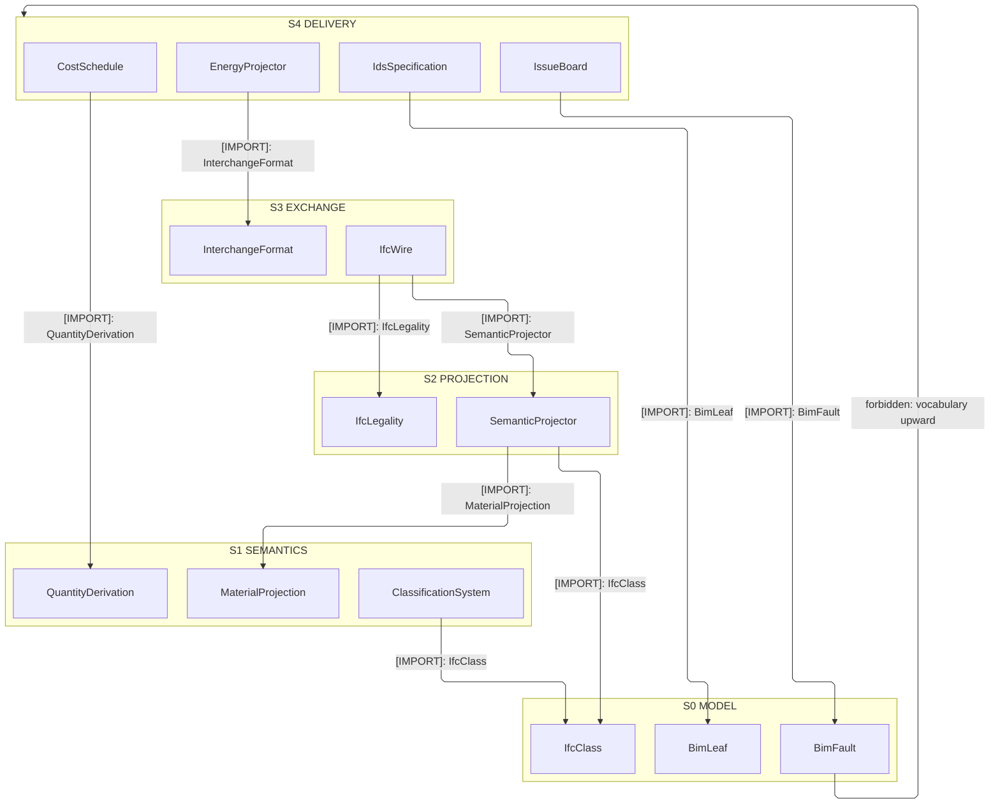
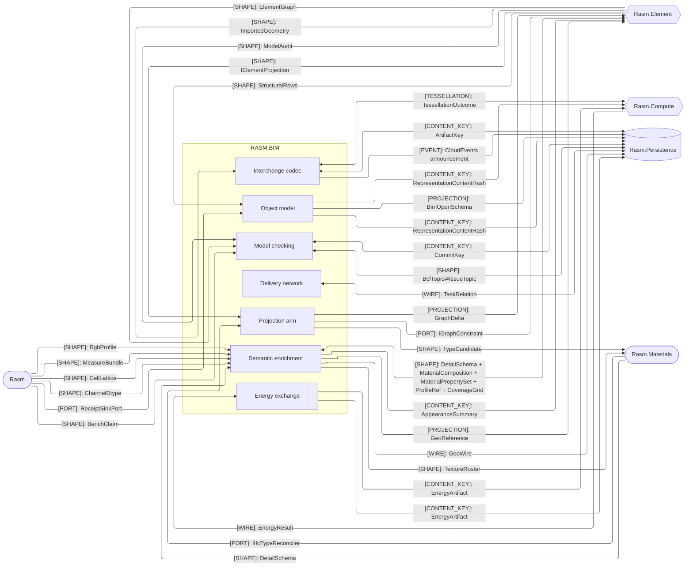
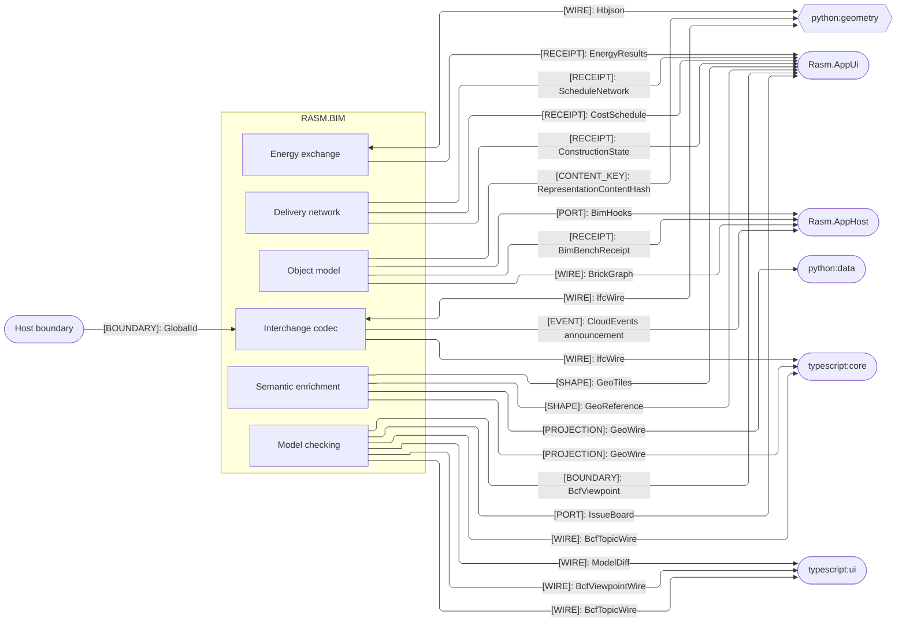
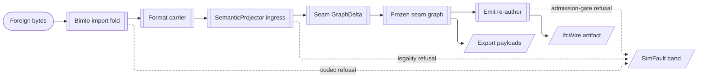

# [RASM_BIM_ARCHITECTURE]

`Rasm.Bim` owns the host-neutral BIM/IFC domain and the IFC arm of the `Rasm.Element` seam, lowering GeometryGym models into the canonical `ElementGraph` under its own IFC-semantic legality. Terminal BIM refusals land on the compact `BimFault` band and captured foreign errors retain their cause. Consumers reach the domain through the seam `Bake(objectNode)` fold; Bim references no AEC peer, aligns through the shared seam graph and content-keyed wire, and cedes simulation to Compute.

## [01]-[DOMAIN_MAP]

```text
Rasm.Bim/                  # Host-neutral openBIM owner; sole GeometryGym/IFC surface, no AEC peer reference
├── Model/                 # Host-neutral BIM object model and analytical model
│   ├── Elements.cs        # Generated IfcClass [SmartEnum<string>] region committed by the offline emitter at full published-schema breadth
│   ├── Emitter.cs         # IfcVocabularyEmitter reflects the pinned assembly closure and INTERSECTS it with published EXPRESS schemas
│   ├── Query.cs           # BimLeaf wraps the seam leaf in one arm beside IFC-vocabulary leaves; ElementQuery binds one Selection<NodeId>
│   ├── Spatial.cs         # SpatialStructure VIEW derived from neutral Compose edges; ancestry resolves under Contain-then-Aggregate
│   ├── Zones.cs           # BimZone grouping VIEW derived from neutral Assign/Compose edges; BimZoneKind closes the vocabulary
│   ├── Systems.cs         # MEP connectivity VIEW over the seam graph; the projector already lowered every distribution entity
│   ├── Structural.cs      # StructuralProjection lowers analysis entities onto neutral attribute bags a Compute frame reads
│   ├── Eurocode.cs        # AnnexRegime national bridge, the EurocodePolicy composition value, and the psi mint per action
│   ├── Faults.cs          # Direct Refused and BoundaryFailed fault leaves with generated numeric identity
│   └── Observability.cs   # BimPoint roster onto the kernel IHookRoster floor; BimTelemetry projects facts as a rail subscriber
├── Semantics/             # Element-bound semantic enrichment
│   ├── Properties.cs      # Offline Xbim.Properties template floor: schema-versioned, scope-selected, network-free; bSDD types the classifier
│   ├── Classification.cs  # ClassificationSystem [SmartEnum<string>] beside a Project row whose identity arrives as composition data
│   ├── Composition.cs     # MaterialProjection.Project discriminates the relating-material entity across layer, profile, constituent arms
│   ├── Appearance.cs      # AppearanceProjection.Project extracts front-face surface styles onto the neutral summary the seam node holds
│   ├── Connection.cs      # Whole realizing-element surface, fasteners to accessories, lowered onto seam detail bags
│   ├── GeoReference.cs    # GeoReferenceProjector.Project switches the one HasCoordinateOperation onto Header and Coverage
│   ├── Feature.cs         # GeoFeature row: NTS Geometry, attributes, seam CRS, typed IsValidOp verdict, on-shape Anchor, H3 Cell
│   ├── Model.cs           # GeoModel set over one precision/SRID root and one STRtree broad phase; DGGS buckets key bit-for-bit with the store
│   ├── Vector.cs          # GeoVectorSource rows carry decode/encode codec pairs; managed codecs beside the OGR universal reader
│   └── Raster.cs          # Windowed multi-band reads re-anchor the affine to the pixel window; band schema and DEM legs ride the dataset
├── Planning/              # 4D/5D/6D delivery network
│   ├── Schedule.cs        # ScheduleNetwork record: ConstructionTask rows fold IfcTaskTime onto NodaTime Intervals over the work calendar
│   ├── Progress.cs        # Compare joins a reconstruction-authored graph to the as-designed graph and the schedule into one report
│   └── Cost.cs            # CostItem lines join applied rates to takeoff MeasureValues resolved at projection from element quantity bags
├── Exchange/              # Universal interchange codec
│   ├── Format.cs          # InterchangeFormat rows carry a CapabilitySet<InterchangeCapability> joined by codec-and-extension columns
│   ├── Import.cs          # BimIo lowers each format row to its canonical carrier: pooled geometry, live DatabaseIfc, STEP model, display graph
│   ├── Export.cs          # ExportPayload seals every emit; Author mints the GlbScene GlobalId→Node index TileMetadata and AnimateSchedule bind
│   ├── Tessellation.cs    # TessellationRequest crosses to the IfcOpenShell companion; the outcome receipt carries dual keys and mesh evidence
│   ├── Reconstruct.cs     # ReconstructionProjector lowers a segmented cloud into occurrence nodes carrying typed Pset_Reconstruction bags
│   ├── Saf.cs             # SafCodec validates and executes both workbook directions, realizing imports as authored GeometryGym entities
│   ├── Wire.cs            # One raw artifact: format key, IFC bytes, schema key, ContentAddress.OfGraph, mint instant
│   └── Events.cs          # Announcement roster and host-free payloads; an observe subscription projects fired facts onto the kernel mint
├── Energy/                # Building-energy-model exchange
│   ├── Exchange.cs        # EnergyExchange.Apply(EnergyOp) raises documents onto the graph and lowers graph content to the authoring schemas
│   ├── Projector.cs       # Five decode arms converge on ONE projection the Compute energy runner simulates
│   ├── Derive.cs          # EnergyDerive folds IfcSpace nodes to honeybee rooms; EnergyTranslate runs the frozen (source, target) matrix
│   └── Results.cs         # EnergyResults.Admit lands the run receipt as producer-authored Pset_EnergyResults bags bound per subject
├── Review/                # Model-checking and coordination
│   ├── Validation.cs      # Seam ModelAudit composes WHOLE by value; stored receipts compare structurally, so a re-load reads as no change
│   ├── Issues.cs          # BcfFile/BcfTopic/BcfComment/BcfViewpoint family at full schema surface, anchored on IFC GlobalIds
│   ├── Diff.cs            # ModelDiff carries baseline and revision graph identities; ElementChange arms join by stored GlobalId
│   ├── Coordination.cs    # If-X-then-Y rule engine, clash-resolution proposal fold, A/B impact report, and the BCF sign-off state machine
│   └── Versioning.cs      # BimCommit identity IS its ElementFingerprint set; BimRepository threads the DAG by ParentKey
└── Projection/            # IFC arm of the Rasm.Element seam
    ├── Semantic.cs        # INGRESS half: a live DatabaseIfc lowers to a seam delta; IfcLegality decides relationship legality
    ├── Foreign.cs         # Deserialized dotbim and Speckle trees lower per host object; Reingest reconciles against a prior snapshot
    ├── Fidelity.cs        # Drop facts return BESIDE values on the WriterT<FidelityLog, Fin, A> carrier, never as side effects
    ├── Wireform.cs        # IfcSerialization × IfcContainer with the published (form, release) matrix and the byte-level release sniff
    ├── Value.cs           # No IfcValue or dataType string crosses the seam signature; both narrowing halves live here
    ├── Raise.cs           # Exact inverse of the property lowering; every typed case re-authors into the IFC entity that carried it
    ├── Relations.cs       # IfcRelKind rows carry relating/related inverse names and the neutral edge constructor each lowers through
    └── Egress.cs          # SemanticProjector.Emit re-authors the graph into IFC bytes at the named wire form behind railed release gates
```

Sub-domain dependency graph is acyclic: every sub-domain projects onto or reads the one seam `ElementGraph`, consuming the `Model/Query` `BimLeaf` term algebra and the `Semantics/Classification` axis as settled vocabulary, with residual and verdict state carried forward as input, never a return edge. Per-page wiring each projector composes lives on the owning implementation pages.

## [02]-[STRATA]

Strata order the sub-domains under the acyclic law: every cross-stratum consumption edge points down, and `Review` and `Planning` co-seat on the delivery stratum, coordination reading the estimate and the schedule as same-stratum input, never a return edge.

- S0 `Model` — settled vocabulary consuming no sibling: the `BimFault` union, the `BimLeaf`/`ElementQuery` query algebra over the seam closure.
- S0 rail — the observability rail seats at the vocabulary floor, so every stratum fires typed facts downward and none returns.
- S0 offline — `IfcVocabularyEmitter` PRODUCES that roster at design time and no runtime fence reaches it; the region markers are the seam.
- S0 regime — `EurocodePolicy` is a composition-elected VALUE the projector threads down, so no stratum reads a national default.
- S0 law — `BimFact` payloads carry closed-vocabulary KEY strings, so no upper-stratum type leaks down.
- S1 law — enrichment owners read the seam graph; the geospatial ingest fronts admit site context alone, and no S1 owner touches IFC bytes.
- S2 law — projector ingress and legality stand as the only writers onto the seam; every other stratum reads.
- S2 `Projection` — `Reingest` reconciles a re-projection to a prior snapshot and reads back its unresolved type candidates.
- S2 wire form — `IfcSerialization` x `IfcContainer` and the published `(form, release)` matrix; an S3 codec row NAMES a form, never a ladder.
- S2 ports — the Materials-implemented `IIfcTypeReconciler` and the folder-internal `IIfcProfileStore` capture the egress re-author reads.
- S3 seat — the exchange codec reads the S2 wire-form matrix and the projector arms; delivery alone composes it.
- S3 events — the announcement projection over the `BimFact` roster; case slots carry closed-vocabulary KEY strings, so S4 fire sites project down.
- S4 law — delivery owners read the graph, the estimate, and the schedule as INPUT; verdict state carries forward, never a return edge.



## [03]-[SEAMS]





Two fences partition by counterpart role: the same-branch AEC peers with Compute and Persistence carry domain construction, analysis, and storage; the Python geometry and data runtimes, the TypeScript peers, the app shell, the app composition root, and the host boundary carry cross-runtime wire, presentation, and host interchange.

`Rasm.AppHost` composes the `BimHooks` rail per instance, admits the `Rasm.Bim` meter and the `BimPoint.Scopes` trace planes at its telemetry root, and binds the announced message envelope its `Exchange/events#EVENT_PROJECTION` subscription mints onto its broker transports. Span custody stays the kernel `SpanBand` that root owns and the meter scope stays `TelemetrySource.Bim`; neither grammar derives from the other.

That same root owns the `BrickGraph` leg's other half: it supplies the `BrickBinding` class election, persists the returned JSON-LD, and binds each Brick point to its external source through the `Wire/livewire` transport axis, so `Rasm.Bim` mints the operations topology and names no live transport.

`GeoWire` produces every `GeoFeature` crossing, its `ToGeoJson` text and `ToGpkgBlob` blob the only two wire forms `Semantics/feature` publishes, so each cross-runtime geo edge carries `[PROJECTION]` and never `[WIRE]`: `libs/contracts/manifest.json` `BIM_WIRE` records `GeoFeatureWire` ABSENT because no typed family crosses, and an edge naming that family claims a decoder roster, a parity gate, and a producer row no fence on either side holds.

`typescript:core` decodes that projection behind its own `interchange/codec` `WkbParser` port over raw bytes and mints a `Wire.GeoFeature` landing its family roster excludes; `typescript:ui` reaches the landing through `@rasm/core` alone, so no geo edge runs from here to it. Persistence's geo-store takes the GeoPackage blob leg without a runtime crossing, and `GeoWkb` stays the interior OGR-to-NTS bridge, never a seam wire.

Every `[CONTENT_KEY]` edge derives its typed `UInt128` through `ContentHash.Of` over the seam `CanonicalWriter` fold, joining the Compute content-addressing space; per-page key tuples live on the owning implementation pages.

## [04]-[INTERNAL]

One ingress law rules the interior: every foreign source lowers once through a projector onto the seam `GraphDelta`, every egress re-authors from the frozen seam graph, and round-trip drop facts accumulate on the `FidelityLog` `Writer` carrier beside their values, never as side effects. Per-arm wiring lives on the owning implementation pages.



## [05]-[ROUTING]

| [INDEX] | [CHANGE]                      | [OWNER_SURFACE]           | [SHAPE_OF_THE_EDIT]                                 |
| :-----: | :---------------------------- | :------------------------ | :-------------------------------------------------- |
|  [01]   | new interchange format        | `Exchange/format.md`      | one `InterchangeFormat` row with its capability set |
|  [02]   | new IFC relationship lowering | `Projection/relations.md` | one `IfcRelKind` row naming its inverse attributes  |
|  [03]   | new refusal axis              | `Model/faults.md`         | one closed scope, reason, or boundary row           |
|  [04]   | new energy translation        | `Energy/derive.md`        | one `(source, target)` row on the frozen matrix     |
|  [05]   | new IFC entity class          | `Model/emitter.md`        | one regenerated `IfcClass` region commit            |
|  [06]   | new geospatial vector source  | `Semantics/vector.md`     | one `GeoVectorSource` row carrying its codec pair   |

## [06]-[BOUNDARIES]

[HOST_BOUNDARY_EDGE]: `Host boundary → Exchange` is single-sided, not an interior dependency: `Rasm.Bim` never names `Rasm.Rhino`, and the edge resolves only where the app root binds the live host, projecting a `RhinoDoc` import to a host-neutral mesh with `GlobalId` the `Exchange/import` fold admits as a wire payload. Bim owns the payload, Rhino the host-side production. Because Rhino FileIO and the managed readers decode the same OBJ/STL/PLY/3MF/glTF/STEP bytes to divergent meshes, the app root declares per path the authoritative reader; the two coexist, neither gutted for the other.
