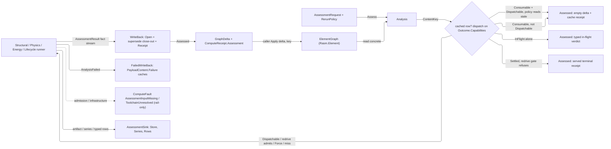

# [COMPUTE_DISPATCH]

Rasm.Compute assessment spine: the content-key, cache-dispatch, write-back, egress, and reconciliation half of the analysis rail, over the `Analysis/assessment` algebra it never re-declares. `Analysis.Assess` content-keys the `(input subgraph, route, discipline policy)` triple through the seam `ContentAddress`, resolves the content-addressed `Node.Assessment` through a LIFECYCLE dispatch reading the seam `AssessmentOutcome`'s own capability set, and — on a miss — routes the request through the generated total `Switch` to its discipline runner, folding the returned fact stream into ONE seam `AssessmentPayload` attached to every target through the neutral `Assign` edge. `Analysis.Sweep` reconciles the whole graph: stale-marking drifted rows, closing the drift over the recorded `DependsOn` DAG in ONE QuikGraph walk, recovering a dead worker's orphans, dispatching every dispatchable row over the `Runtime/scheduling#JOB_GRAPH` `JobGraph`, and folding every `Analysis/assessment#COMMISSIONING` commissioning ask in the same pass.

The dedup predicate is the seam's DOUBLE-DISPATCH GUARD — the EXISTENCE of a non-terminal sibling node on the same `(Discipline, Route)`, never a flag on the stale node — so a `Stale` row already carrying a live successor is never re-dispatched under its own retired key. Cache policy is a stated value: `RerunPolicy` rows PUBLISH a kernel `RedrivePolicy` curve and the `JobGraph` root EXECUTES it, so no arm on this page runs an attempt loop or a clock window of its own. Every heavy artifact, every temporal point, and every typed result row leaves through the ONE `AssessmentSink` egress port the composition root binds.

## [01]-[INDEX]

- [02]-[DISPATCH_WRITEBACK]: `Analysis.Assess` content-keys and dispatches one request through the lifecycle switch, `AssessmentSink` is the three-leg egress port, and one `ComputeReceipt.Assessment` fold mints every disposition's receipt.
- [03]-[SWEEP]: `Analysis.Sweep` reconciles the graph in one pass — stale-marking, the QuikGraph staleness closure over `DependsOn`, orphan recovery, streamed dispatch, and the commissioning fold.

## [02]-[DISPATCH_WRITEBACK]

- Owner: `Analysis` the static partial carrying the rail entries and the shared content-key, node-id, supersede, and receipt spine the `Analysis/assessment#COMMISSIONING` partial composes; `RerunPolicy` the `[SmartEnum<string>]` cache-and-redrive axis (`CacheFirst`/`AllowStale`/`Force`, each row its stale-reading column and its published kernel `RedrivePolicy` curve); `AssessmentDisposition` the disposition vocabulary; `Assessed` the one-pass outcome; `AssessmentSink` the THREE-leg egress port (`Store` the heavy artifact bytes, `Series` the typed temporal points, `Rows` the typed result rows, which land on the Persistence `Query/datasets#ASSESSMENT_ROWS` `AssessmentLane.Ingest` arm under the `assessment_rows` dataset); `AssessmentRow` the neutral typed row every discipline's own result estate lowers into once; the three analysis `ComputeFault` cases; the `ComputeReceipt.Assessment` case with its failure/retry/seismic columns.
- Entry: `Assess(graph, request, geometry, sink, rerun, correlation, clock)` proves the case↔route correspondence and the non-empty target set, content-keys the triple, derives the assessment `NodeId`, and dispatches on the cached row's capability set — the 412-noop, the policy-gated stale read, the typed in-flight verdict, the redrive-gated retry, the served terminal, or a fresh run. A fresh run folds runner success through `WriteBack` (fresh node + `Assign` edges + supersede close-out) and a runner `AnalysisFailed` through `FailedWriteBack` (the typed fault lowered through the seam `Diagnostic.Of` into a `PayloadContent.Failure` under the same id). `Sweep` is `[03]`'s.
- Auto: the content key STREAMS through the seam's ONE tolerance-bound `ContentAddress.Of<TState>` entry — the route `Key`, the route `SolverVersion`, the target count, then per target in `NodeId` order a present/absent tag plus either the present target's own `CanonicalBytes` contribution and its count-prefixed incident edges or the absent target's id, then the request's discipline policy — hashed over the one kernel seed-zero `XxHash128` rail, with NO writer constructed and NO preimage materialized. The assessment `NodeId` is the seam self-hash `NodeSeed.Content` over the `(Discipline, Route, InputKey)` projection (the form `ContentAddress.Verify` recomputes, NEVER a `NodeSeed.Precomputed` wrap of the `InputKey` whose stored id `Verify` cannot reproduce), so a re-assessment of an unchanged subgraph addresses the same node and dedups; the verdict rides the `Results` bag as an `Enumerated` and the ratio as a dimensionless `Measure`, both derived so the receipt and stored verdicts cannot diverge.
- Receipt: the `ComputeReceipt.Assessment` case carries the discipline/route/content/verdict keys, the OPTIONAL governing ratio, the admitted flag, and the failure (`Phase`/`FailureKind`/`Transient`), retry (`Attempt`), and seismic (`Participation`/`Combination`) columns — the seismic pair PROJECTS off the runner's own fact stream through the two `Analysis`-owned fact names, so the receipt column and the stored `Results` entry read one source and a non-seismic route leaves both `None` rather than a zero; `Participation` is the DIRECTIONAL effective-mass fraction along the excitation axis the request named, the axis itself riding the fact stream so the scalar column carries one honest number rather than a cross-axis total; faults cross the wire through AppHost `Runtime/ports#WIRE_LAW` `FaultWire.Raise`, the one producer leg.
- Packages: Thinktecture.Runtime.Extensions, LanguageExt.Core (`Fin`/`Option`/`Seq`/`Map`/`Set`/`IO`/`TraverseM`), NodaTime, Rasm (kernel — `RedrivePolicy` the published redrive curve, `Op` the diagnostic key, `CapabilitySet`), Rasm.Element (project — `ElementGraph`, `Node`, `NodeId.Of`/`NodeSeed.Content`/`NodeSeed.Placement`, `GraphDelta`, `Relationship`, `AssignKind`, `AssessmentPayload.Open`/`.Land`/`.Advance`/`.IsStaleFor`, `PayloadContent`, `AssessmentOutcome`/`OutcomeCapability`, `AnalysisRoute.Of`, `BlobKey`, `EvidenceRun`, `SolvePhase`, `FailureKind`, `Diagnostic`/`Diagnostic.Of`, `GeometrySource`, `PropertyName`, `PropertyValue`, `MeasureValue`, `Dimension`, `ContentAddress.Of<TState>`), Rasm.Persistence (project — the `Query/datasets#SERIES_ROSTER` `SeriesPoint` the temporal leg lands, the `#ASSESSMENT_ROWS` `AssessmentLane.Ingest` arm the row leg lands), the `Runtime/admission#DISPATCH_SPINE` `ComputeFault`/`[FaultCase]`/`AssessmentInputReason`, BCL inbox — the content hash composes the seam `ContentAddress`, so the page admits no `System.IO.Hashing`.
- Growth: a new discipline runner is one `Run` arm (the `Switch` breaks until it exists); a new fault is one `ComputeFault` case with its `[FaultCase]` ordinal (the wire crossing automatic — AppHost `FaultWire.Pack` reads `domain` and `case` off the band); a new under-specification witness is one `AssessmentInputReason` row, never a new interpolated stem; a new cache modality is one `RerunPolicy` row publishing its own curve, a new disposition one `AssessmentDisposition` row, a new receipt column one init member, a new egress modality one `AssessmentSink` leg every artifact-bearing runner inherits; a parallel fault union, a second receipt union, or a parallel re-solve engine beside the `JobGraph` is the rejected form.
- Boundary: the runner reads the CONCRETE `ElementGraph` directly — Compute is APP-PLATFORM above the AEC-domain seam, so it consumes `Rasm.Element` upward and never goes through `IElementProjection`; the write-back produces a `GraphDelta` the CALLER applies so this owner never mutates a graph in place. Every payload crosses the seam's ONE `Open` admission or the ONE `Land` landing — the retired `Computed`/`Pending`/`Failed` factory family and the separate `Rehydrate` collapsed there, and the seam's IDENTITY PRESERVATION law makes `Land` the landing a solver that OPENED a node takes while `Open` is the fresh mint a producer holding no prior node takes, so a re-spelled triple can never key a different node than the one the sweep watches. The `AssessmentInputMissing` fault carries an `AssessmentInputReason` ROW beside its witness — a caller recovers on the reason and the detail carries only the route, node, or share the reason names, never a free-form stem a consumer parses by prefix; `AnalysisFailed` carries the foreign exit/HTTP `Status` (the generated `Code` is the band derivation and never a payload column). The cache dispatch is LIFECYCLE-AWARE through the seam row's OWN `CapabilitySet<OutcomeCapability>` — `Consumable` gates readability, `Settled` marks the key settled, `Dispatchable` marks re-solvability, `InFlight` marks a worker's claim — so the four capability reads PARTITION the roster and a new outcome row lands in the arm its own capability set names rather than falling silently to a default; every flip runs through the seam `Advance` against the row's `Next()` adjacency, and a Compute-side lifecycle enum is the deleted form. A runner `AnalysisFailed` CACHES as a `PayloadContent.Failure` under the same content-keyed id so the deterministic failure is a first-class cached fact the next `Assess` serves without re-running, while `AssessmentInputMissing`/`ToolchainUnresolved` (admission/infrastructure) stay rail-only and never cache. The retry gate is BOUNDED and PUBLISHED, never executed here: the `RerunPolicy` row carries a kernel `RedrivePolicy` whose `Curve` yields the per-attempt delay and whose `Exhausted` bounds the count, the seam `Diagnostic.Kind.Transient` column supplies the retriability, and the `JobGraph` root is the only executor — a hand `transient && underCap && pastBackoff` conjunction re-derived the verdict at the call site and flattened a growth curve into one constant. The supersede close-out holds the seam one-usable-node law; the persisted payload is a content-keyed artifact in the Persistence `Version/retention#RETENTION_CLASSES` `blob` class; the baked-bag and edge reads are `Analysis/assessment#ANALYSIS_READS` `AnalysisReads`' alone.

```csharp
// --- [TYPES] ---------------------------------------------------------------------------
[SmartEnum<string>]
[KeyMemberEqualityComparer<ComparerAccessors.StringOrdinal, string>]
public sealed partial class RerunPolicy {
    public static readonly RerunPolicy CacheFirst = new("cache-first", readsStale: false,
        redrive: RedrivePolicy.Of(Schedule.exponential(Duration.FromMinutes(5)), bound: 3));
    public static readonly RerunPolicy AllowStale = new("allow-stale", readsStale: true,
        redrive: RedrivePolicy.Of(Schedule.exponential(Duration.FromMinutes(5)), bound: 3));
    public static readonly RerunPolicy Force      = new("force",       readsStale: false, redrive: RedrivePolicy.None);

    public bool ReadsStale { get; }
    public RedrivePolicy Redrive { get; }
}

[SmartEnum<string>]
[KeyMemberEqualityComparer<ComparerAccessors.StringOrdinal, string>]
public sealed partial class AssessmentDisposition {
    public static readonly AssessmentDisposition Fresh = new("fresh");
    public static readonly AssessmentDisposition CacheHit = new("cache-hit");
    public static readonly AssessmentDisposition StaleRead = new("stale-read");
    public static readonly AssessmentDisposition CachedFailure = new("cached-failure");
    public static readonly AssessmentDisposition Retry = new("retry");
    public static readonly AssessmentDisposition InFlight = new("in-flight");
    public static readonly AssessmentDisposition Superseded = new("superseded");
}

// --- [MODELS] --------------------------------------------------------------------------
public readonly record struct AssessmentRow(UInt128 Key, Discipline Discipline, Seq<string> Facets, AssessmentFact Fact);

public sealed record AssessmentSink(
    Func<ReadOnlyMemory<byte>, IO<Fin<ArtifactContent>>> Store,
    Func<Seq<SeriesPoint>, IO<Fin<Unit>>> Series,
    Func<Seq<AssessmentRow>, IO<Fin<Unit>>> Rows) {
    public static readonly AssessmentSink None = new(
        static _ => IO.pure(Fin.Fail<ArtifactContent>(Unbound)),
        static _ => IO.pure(Fin.Fail<Unit>(Unbound)),
        static _ => IO.pure(Fin.Fail<Unit>(Unbound)));

    public static readonly AssessmentSink Discarding = new(
        static _ => IO.pure(Fin.Fail<ArtifactContent>(Unbound)),
        static _ => IO.pure(Fin.Succ(unit)),
        static _ => IO.pure(Fin.Succ(unit)));

    static ComputeFault Unbound => new ComputeFault.AssessmentInputMissing(AssessmentInputReason.SinkUnbound, string.Empty);
}

public abstract partial record ComputeReceipt {
    public sealed record Assessment(string Discipline, string Route, UInt128 Key, string Verdict, Option<double> GoverningRatio, bool Admitted) : ComputeReceipt {
        public Option<string> Phase { get; init; }
        public Option<string> FailureKind { get; init; }
        public bool Transient { get; init; }
        public int Attempt { get; init; }
        public Option<double> Participation { get; init; }
        public Option<string> Combination { get; init; }
    }
}

public sealed record Assessed(GraphDelta Delta, ComputeReceipt.Assessment Receipt, AssessmentDisposition Disposition) {
    public bool CacheHit => Disposition == AssessmentDisposition.CacheHit;
}

// --- [ERRORS] --------------------------------------------------------------------------
public abstract partial record ComputeFault {
    [FaultCase(16)] public sealed partial record AssessmentInputMissing(AssessmentInputReason Reason, string Witness) : ComputeFault($"{Reason.Key}:{Witness}");

    [FaultCase(17)] public sealed partial record ToolchainUnresolved(string Detail) : ComputeFault(Detail);

    [FaultCase(18)] public sealed partial record AnalysisFailed(SolvePhase Phase, FailureKind Kind, string Detail, Option<int> Status = default)
        : ComputeFault($"{Phase.Key}:{Kind.Key}:{Detail}") {
        public override Retriability Retriability => Kind.Transient ? Retriability.Transient : Retriability.Terminal;
    }
}

// --- [OPERATIONS] ----------------------------------------------------------------------
public static partial class Analysis {
    static readonly PropertyName VerdictKey = PropertyName.Create("verdict");
    static readonly PropertyName GoverningRatioKey = PropertyName.Create("governing-ratio");
    static readonly Op WriteBackKey = Op.Of(name: nameof(WriteBack));

    public const string ParticipationFact = "modal-mass-participation";
    public const string CombinationFact = "modal-combination";
    static readonly PropertyName ParticipationKey = PropertyName.Create(ParticipationFact);
    static readonly PropertyName CombinationKey = PropertyName.Create(CombinationFact);

    public static Fin<Assessed> Assess(ElementGraph graph, AssessmentRequest request, GeometrySource geometry, AssessmentSink sink, RerunPolicy rerun, CorrelationId correlation, IClock clock) =>
        from _targets in request.Targets.IsEmpty
            ? Fin.Fail<Unit>(new ComputeFault.AssessmentInputMissing(AssessmentInputReason.TargetsEmpty, request.Route.Key))
            : Fin.Succ(unit)
        from _route in request.AdmitRoute()
        from route in AnalysisRoute.Of(request.Route.Key, WriteBackKey)
        let key = ContentKey(graph, request)
        from nodeId in AssessmentNodeId(request.Route.Discipline, route, key.Value, graph.Header.Tolerance)
        from assessed in (rerun == RerunPolicy.Force ? None : graph.Find<Node.Assessment>(nodeId)).Match(
            Some: hit => Cached(graph, request, hit, key, geometry, sink, rerun, correlation, clock),
            None: () => Fresh(graph, request, key, geometry, sink, correlation, clock, attempt: 0, AssessmentDisposition.Fresh))
        select assessed;

    static Fin<Assessed> Cached(ElementGraph graph, AssessmentRequest request, Node.Assessment hit, ContentAddress key, GeometrySource geometry, AssessmentSink sink, RerunPolicy rerun, CorrelationId correlation, IClock clock) {
        AssessmentPayload payload = hit.Payload;
        CapabilitySet<OutcomeCapability> held = payload.Outcome.Capabilities;
        Fin<Assessed> Recompute(int attempt, AssessmentDisposition how) =>
            Fresh(graph, request, key, geometry, sink, correlation, clock, attempt, how);
        Fin<Assessed> Served(AssessmentDisposition how) =>
            CacheReceipt(payload, key, correlation).Map(receipt => new Assessed(GraphDelta.Empty, receipt, how));

        return held.Admits(OutcomeCapability.Consumable) && !held.Admits(OutcomeCapability.Dispatchable) ? Served(AssessmentDisposition.CacheHit)
            : held.Admits(OutcomeCapability.Consumable) ? rerun.ReadsStale ? Served(AssessmentDisposition.StaleRead) : Recompute(payload.Provenance.Attempt, AssessmentDisposition.Fresh)
            : held.Admits(OutcomeCapability.Dispatchable) ? Recompute(payload.Provenance.Attempt, AssessmentDisposition.Fresh)
            : held.Admits(OutcomeCapability.InFlight) ? Fin.Succ(new Assessed(GraphDelta.Empty, Terminal(payload, key, correlation), AssessmentDisposition.InFlight))
            : Redriven(payload, rerun, clock.GetCurrentInstant()).Match(
                Some: _ => Recompute(payload.Provenance.Attempt + 1, AssessmentDisposition.Retry),
                None: () => Fin.Succ(new Assessed(GraphDelta.Empty, Terminal(payload, key, correlation),
                    payload.Diagnostic.IsSome ? AssessmentDisposition.CachedFailure : AssessmentDisposition.Superseded)));
    }

    static Option<AssessmentDisposition> Redriven(AssessmentPayload payload, RerunPolicy rerun, Instant now) =>
        payload.Diagnostic
            .Filter(static diagnostic => diagnostic.Kind.Transient)
            .Filter(_ => !rerun.Redrive.Exhausted(payload.Provenance.Attempt))
            .Bind(_ => rerun.Redrive.Next(payload.Provenance.Attempt))
            .Filter(after => now - payload.Provenance.At >= after)
            .Map(static _ => AssessmentDisposition.Retry);

    static Fin<Assessed> Fresh(ElementGraph graph, AssessmentRequest request, ContentAddress key, GeometrySource geometry, AssessmentSink sink, CorrelationId correlation, IClock clock, int attempt, AssessmentDisposition disposition) {
        Instant started = clock.GetCurrentInstant();
        return Run(graph, request, geometry, sink, key, clock)
            .Bind(result => WriteBack(graph, request, result, key)
                .Map(delta => new Assessed(delta,
                    Receipt(result, key, correlation, clock.GetCurrentInstant() - started) with { Attempt = attempt },
                    disposition)))
            .BindFail(error => error is ComputeFault.AnalysisFailed failed
                ? FailedWriteBack(graph, request, failed, key, attempt, correlation, clock)
                : Fin.Fail<Assessed>(error));
    }

    static Fin<AssessmentResult> Run(ElementGraph graph, AssessmentRequest request, GeometrySource geometry, AssessmentSink sink, ContentAddress key, IClock clock) =>
        request.Switch(
            structural:  r => StructuralAnalysis.Run(graph, r, geometry, sink, clock),
            seismic:     r => StructuralAnalysis.Run(graph, r, geometry, sink, clock),
            thermal:     r => BuildingPhysics.RunThermal(graph, r, clock),
            acoustic:    r => BuildingPhysics.RunAcoustic(graph, r, clock),
            fire:        r => BuildingPhysics.RunFire(graph, r, clock),
            energy:      r => EnergySimulation.Run(graph, r, geometry, sink, key, clock),
            carbon:      r => LifecycleAssessment.RunCarbon(graph, r, clock),
            cost:        r => LifecycleAssessment.RunCost(graph, r, clock),
            circulation: r => CirculationAnalysis.Run(graph, r, geometry, clock),
            daylight:    r => DaylightAnalysis.Run(graph, r, geometry, sink, key, clock));

    static Fin<GraphDelta> WriteBack(ElementGraph graph, AssessmentRequest request, AssessmentResult result, ContentAddress key) =>
        from route in AnalysisRoute.Of(result.Route.Key, WriteBackKey)
        from nodeId in AssessmentNodeId(result.Discipline, route, key.Value, graph.Header.Tolerance)
        from bag in Banded(result.Facts
                .Fold(Map<PropertyName, PropertyValue>(), static (held, fact) => held.AddOrUpdate(fact.Name, fact.Value))
                .AddOrUpdate(VerdictKey, Chosen(result.Verdict)),
            result.GoverningRatio)
        from content in PayloadContent.Results(bag, result.ResultArtifact, WriteBackKey)
        from payload in AssessmentPayload.Open(result.Discipline, route, key.Value, AssessmentOutcome.Computed,
            content, result.Provenance, WriteBackKey, DependsOnOf(graph, request))
        from delta in Supersede(graph, result.Discipline, route, nodeId,
            GraphDelta.Empty.Put(new Node.Assessment(nodeId, payload)))
        select Attach(delta, request.Targets, nodeId);

    static Fin<Assessed> FailedWriteBack(ElementGraph graph, AssessmentRequest request, ComputeFault.AnalysisFailed failed, ContentAddress key, int attempt, CorrelationId correlation, IClock clock) =>
        from route in AnalysisRoute.Of(request.Route.Key, WriteBackKey)
        from nodeId in AssessmentNodeId(request.Route.Discipline, route, key.Value, graph.Header.Tolerance)
        from diagnostic in Diagnostic.Of(failed.Phase, failed.Kind, failed.Detail, WriteBackKey, failed.Status)
        from provenance in EvidenceRun.Of("rasm.compute", request.Route.Key, request.Route.SolverVersion,
            clock.GetCurrentInstant(), WriteBackKey, correlation: Some(correlation), attempt: attempt)
        from payload in AssessmentPayload.Open(request.Route.Discipline, route, key.Value, AssessmentOutcome.Failed,
            PayloadContent.Failure(diagnostic), provenance, WriteBackKey, DependsOnOf(graph, request))
        from delta in Supersede(graph, request.Route.Discipline, route, nodeId,
            GraphDelta.Empty.Put(new Node.Assessment(nodeId, payload)))
        select new Assessed(
            Attach(delta, request.Targets, nodeId),
            new ComputeReceipt.Assessment(request.Route.Discipline.Key, request.Route.Key, key.Value, AssessmentOutcome.Failed.Key, None, Admitted: false) {
                Scope = Scope(correlation, Duration.Zero),
                Phase = Some(failed.Phase.Key), FailureKind = Some(failed.Kind.Key), Transient = failed.Kind.Transient, Attempt = attempt,
            },
            AssessmentDisposition.Fresh);

    static GraphDelta Attach(GraphDelta delta, Seq<NodeId> targets, NodeId nodeId) =>
        targets.Fold(delta, (current, target) => current.Link(new Relationship.Assign(target, nodeId, AssignKind.Assessment)));

    static PropertyValue Chosen(AssessmentVerdict verdict) =>
        new PropertyValue.Enumerated(
            Seq<PropertyValue>(new PropertyValue.Text(verdict.Key)),
            toSeq(AssessmentVerdict.Items).Map(static row => (PropertyValue)new PropertyValue.Text(row.Key)));

    static Fin<Map<PropertyName, PropertyValue>> Banded(Map<PropertyName, PropertyValue> bag, Option<double> ratio) =>
        ratio.Match(
            Some: value => MeasureValue.OfSi(Dimension.Dimensionless, value)
                .Map(banded => bag.AddOrUpdate(GoverningRatioKey, new PropertyValue.Measure(banded))),
            None: () => Fin.Succ(bag));

    public static ContentAddress ContentKey(ElementGraph graph, AssessmentRequest request) =>
        ContentAddress.Of((graph, request), graph.Header.Tolerance, static (state, w) => {
            (ElementGraph graph, AssessmentRequest request) = state;
            double tolerance = graph.Header.Tolerance;
            w.Double(tolerance).String(request.Route.Key).String(request.Route.SolverVersion).Ordinal(request.Targets.Count);
            foreach (NodeId id in request.Targets.OrderBy(static t => t.Value, StringComparer.Ordinal)) {
                graph.Find(id).Match(
                    Some: node => {
                        w.Bool(true);
                        node.CanonicalBytes(w);
                        Seq<ContentAddress> edges = toSeq(toSeq(graph.EdgesAt(id))
                            .Map(edge => ContentAddress.Of(edge, tolerance))
                            .OrderBy(static address => address.Value));
                        w.Ordinal(edges.Count);
                        foreach (ContentAddress edge in edges) { w.U128(edge.Value); }
                    },
                    None: () => w.Bool(false).String(id.Value));
            }
            request.CanonicalBytes(w);
        });

    static Set<NodeId> DependsOnOf(ElementGraph graph, AssessmentRequest request) =>
        toSet(request.Targets.Filter(id => graph.Find<Node.Assessment>(id).IsSome));

    static Fin<GraphDelta> Supersede(ElementGraph graph, Discipline discipline, AnalysisRoute route, NodeId fresh, GraphDelta delta) =>
        Rows(graph, discipline, route)
            .Filter(row => row.Id != fresh && row.Payload.Outcome.Capabilities.Admits(OutcomeCapability.Consumable))
            .TraverseM(static row => row.Payload.Advance(AssessmentOutcome.Superseded, WriteBackKey)
                .Map(superseded => new Node.Assessment(row.Id, superseded)))
            .As()
            .Map(flipped => flipped.Fold(delta, static (current, node) => current.Put(node)));

    static Seq<Node.Assessment> Rows(ElementGraph graph, Discipline discipline, AnalysisRoute route) =>
        graph.Assessments().Filter(row => row.Payload.Discipline == discipline && row.Payload.Route == route);

    static readonly Fin<EvidenceRun> ProbeRun =
        EvidenceRun.Of("rasm.compute", "assessment-probe", "1", Instant.FromUnixTimeTicks(0L), WriteBackKey);

    static Fin<NodeId> AssessmentNodeId(Discipline discipline, AnalysisRoute route, UInt128 inputKey, double tolerance) =>
        from run in ProbeRun
        from payload in AssessmentPayload.Open(discipline, route, inputKey, AssessmentOutcome.Pending,
            PayloadContent.Empty, run, WriteBackKey)
        select NodeId.Of(new NodeSeed.Content(
            new Node.Assessment(NodeId.Of(new NodeSeed.Placement()), payload), tolerance));

    static ComputeReceipt.Assessment Receipt(AssessmentResult result, ContentAddress key, CorrelationId correlation, Duration elapsed) =>
        new(result.Discipline.Key, result.Route.Key, key.Value, result.Verdict.Key, result.GoverningRatio, Admitted: !result.Verdict.Critical) {
            Scope = Scope(correlation, elapsed),
            Attempt = result.Provenance.Attempt,
            Participation = Fact(result, ParticipationKey).Bind(static value => value is PropertyValue.Measure measure ? Some(measure.Value.Si) : None),
            Combination = Fact(result, CombinationKey).Bind(static value => value is PropertyValue.Text text ? Some(text.Value) : None),
        };

    static Option<PropertyValue> Fact(AssessmentResult result, PropertyName name) =>
        result.Facts.Find(fact => fact.Name == name).Map(static fact => fact.Value);

    static ReceiptScope Scope(CorrelationId correlation, Duration elapsed) =>
        new ReceiptScope.Execution(correlation, WorkLane.Background, Substrate.CpuTensor, AllocationClass.PooledMemory, elapsed);

    static Fin<ComputeReceipt.Assessment> CacheReceipt(AssessmentPayload payload, ContentAddress key, CorrelationId correlation) =>
        payload.ResultMeasure(GoverningRatioKey)
            .Map(static measure => measure.Si)
            .ToFin(new ComputeFault.AssessmentInputMissing(AssessmentInputReason.CacheRatioAbsent, $"{payload.InputKey:x32}"))
            .Map(ratio => {
                AssessmentVerdict verdict = AssessmentVerdict.FromRatio(Some(ratio));
                return new ComputeReceipt.Assessment(payload.Discipline.Key, payload.Route.Value, key.Value, verdict.Key, Some(ratio), Admitted: !verdict.Critical) {
                    Scope = Scope(correlation, Duration.Zero),
                    Attempt = payload.Provenance.Attempt,
                };
            });

    static ComputeReceipt.Assessment Terminal(AssessmentPayload payload, ContentAddress key, CorrelationId correlation) =>
        new(payload.Discipline.Key, payload.Route.Value, key.Value, payload.Outcome.Key, None, Admitted: false) {
            Scope = Scope(correlation, Duration.Zero),
            Phase = payload.Diagnostic.Map(static d => d.Phase.Key),
            FailureKind = payload.Diagnostic.Map(static d => d.Kind.Key),
            Transient = payload.Diagnostic.Map(static d => d.Kind.Transient).IfNone(false),
            Attempt = payload.Provenance.Attempt,
        };
}
```

## [03]-[SWEEP]

- Owner: `Swept` the reconciliation outcome (the delta, the streamed per-dispatch `Assessed` set, the commissioning verdicts, and the three counters); `SweepContext` the sweep boundary (intent/tenant identity, per-node memory budget, the reconciler's prior live-job map, the commissioning roster, and the `RunJobs` adapter binding a `JobGraph.Reconcile` run to the per-node closures); `SweepMarks` the reconciler fold accumulator; `Analysis.Sweep` and its `Closure` staleness walk.
- Entry: `Sweep(graph, requests, geometry, sink, jobs, context, correlation, clock)` returns `IO<Fin<Swept>>` — the run reaches the `JobGraph` and the sink, so the effect wears its own signature rather than hiding inside a `Fin`. Three legs run in order: STALE-MARK folds every baked row against the current graph and flips the drifted `Consumable` rows through the legal edge; the CLOSURE walks the recorded `DependsOn` DAG once and flips the whole downstream cone; ORPHAN-RECOVER advances a live-job-less in-flight row through `Cancelled` to `Pending` so it re-enters THIS sweep; DISPATCH streams every dispatchable row plus every never-assessed request through the `JobGraph`; and the commissioning fold lands every `SweepContext.Commissionings` ask in the same pass.
- Auto: the seam route token mints ONCE per request and rides the keyed tuple, so the reconciliation fold, the node-id derivation, and the per-route row read all key on it rather than re-admitting the same string three times over a corpus-scale sweep. The staleness closure composes QuikGraph: the recorded `DependsOn` set IS a DAG, so the sweep projects a `DelegateVertexAndEdgeListGraph` whose adjacency is the REVERSE dependency relation, seeds a `BreadthFirstSearchAlgorithm` at the drifted frontier, and collects the whole downstream cone in ONE walk with one `DiscoverVertex` observer — the hand fixpoint it replaces re-scanned every node in the graph once per recursion level. Dispatch membership joins through a keyed SET, never a pairwise `Exists` scan, and the per-dispatch outcomes STREAM rather than materializing the whole set before the first result is readable.
- Receipt: `Swept` carries the reconciliation delta beside the counters an operator reads — how many rows flipped stale, how many orphans recovered, and how many predecessors the dispatch ACTUALLY superseded, read off each returned delta's own flips rather than a pre-dispatch projection counting runs that could still fail, cache-hit, or return in-flight.
- Packages: LanguageExt.Core (`IO`/`Fin`/`Seq`/`Set`/`HashMap`/`Map`/`TraverseM`), QuikGraph (`DelegateVertexAndEdgeListGraph`, `SEquatableEdge`, `BreadthFirstSearchAlgorithm`, `TryFunc`), NodaTime, Rasm.Element (project — the seam lifecycle and delta vocabulary), the `Runtime/scheduling#JOB_GRAPH` `JobGraph`/`JobNode`/`JobState`, the `Analysis/assessment#COMMISSIONING` `CommissioningAsk`/`Commissioned`, BCL inbox (`BinaryPrimitives`).
- Growth: a new reconciliation leg is one `SweepMarks` member the one fold absorbs; a new dispatch modality is one `JobNode` column; a new sweep-visible counter one `Swept` column read off the same delta; never a parallel reconciler and never a sweep that only dispatches.
- Boundary: the DOUBLE-DISPATCH GUARD is the seam's and this sweep is its enforcer — the dedup predicate is the EXISTENCE of a non-terminal sibling node on the same `(Discipline, Route)`, never a capability flag on the stale row read alone. A re-solve mints a FRESH node under the current `InputKey` and flips the old to `Superseded`, so the successor node IS the in-flight marker; a `Stale` row already carrying one must NOT re-dispatch, because its own key is stale by definition and the work is already in flight under the current one. Reading `Dispatchable` alone re-dispatched exactly that retired key and paid for one assessment twice. `JobState` (job lifecycle) and `AssessmentOutcome` (node lifecycle) stay ORTHOGONAL, mapped at this boundary only. Every transition runs through the seam `Advance`, and an illegal transition fails the reconciliation rail rather than being silently skipped. A job node's `InputBytes` buffer ESCAPES into the `JobGraph` run, so it is an owned array and never a pooled rental — a returned rental the run outlives is a use-after-return the pool cannot see.

```csharp
// --- [MODELS] --------------------------------------------------------------------------
public sealed record Swept(
    GraphDelta Reconciliation, Seq<Assessed> Dispatched, Seq<Commissioned> Commissioned,
    int StaleMarked, int Orphaned, int Superseded);

public sealed record SweepContext(
    AdmittedIntent Intent,
    TenantId Tenant,
    long MemoryBudgetBytes,
    HashMap<string, JobState> LiveJobs,
    Seq<(NodeId Element, CommissioningAsk Ask)> Commissionings,
    Func<JobGraph, Seq<JobNode>, Seq<Func<Fin<Assessed>>>, IO<Fin<Seq<Assessed>>>> RunJobs);

// --- [OPERATIONS] ----------------------------------------------------------------------
public static partial class Analysis {
    static readonly Op SweepKey = Op.Of(name: nameof(Sweep));

    public static IO<Fin<Swept>> Sweep(ElementGraph graph, Seq<AssessmentRequest> requests, GeometrySource geometry, AssessmentSink sink, JobGraph jobs, SweepContext context, CorrelationId correlation, IClock clock) {
        Fin<Seq<Keyed>> keyed = requests.TraverseM(request =>
            from route in AnalysisRoute.Of(request.Route.Key, SweepKey)
            let key = ContentKey(graph, request)
            from nodeId in AssessmentNodeId(request.Route.Discipline, route, key.Value, graph.Header.Tolerance)
            select new Keyed(request, route, key, nodeId)).As();

        return keyed.Bind(entries => Reconcile(graph, entries, context))
            .Map(marks => Dispatch(graph, marks, context))
            .Match(
                Succ: plan => plan.Run(graph, geometry, sink, jobs, context, correlation, clock),
                Fail: error => IO.pure(Fin.Fail<Swept>(error)));
    }

    readonly record struct Keyed(AssessmentRequest Request, AnalysisRoute Route, ContentAddress Key, NodeId NodeId);

    static Fin<SweepMarks> Reconcile(ElementGraph graph, Seq<Keyed> keyed, SweepContext context) =>
        keyed.Fold(Fin.Succ(SweepMarks.Empty with { Roster = keyed }), (acc, entry) =>
                Rows(graph, entry.Request.Route.Discipline, entry.Route)
                    .Fold(acc, (state, row) => state.Bind(current => current.Absorb(row, entry.Key, context))))
            .Bind(marks => Closure(graph, marks, marks.Drifted + toSet(graph.Assessments()
                .Filter(static row => row.Payload.Outcome == AssessmentOutcome.Stale || row.Payload.Outcome == AssessmentOutcome.Superseded)
                .Map(static row => row.Id))));

    static Fin<SweepMarks> Closure(ElementGraph graph, SweepMarks marks, Set<NodeId> frontier) {
        if (frontier.IsEmpty) { return Fin.Succ(marks); }
        HashMap<NodeId, Node.Assessment> rows = graph.Assessments()
            .Fold(HashMap<NodeId, Node.Assessment>(), static (held, row) => held.AddOrUpdate(row.Id, row));
        HashMap<NodeId, Seq<NodeId>> dependents = rows.Values.Fold(
            HashMap<NodeId, Seq<NodeId>>(),
            static (held, row) => row.Payload.DependsOn.Fold(held,
                (index, upstream) => index.AddOrUpdate(upstream, existing => existing.Add(row.Id), () => Seq(row.Id))));
        DelegateVertexAndEdgeListGraph<NodeId, SEquatableEdge<NodeId>> cone = new(
            rows.Keys,
            (NodeId vertex, out IEnumerable<SEquatableEdge<NodeId>> edges) => {
                edges = dependents.Find(vertex).IfNone(Seq<NodeId>()).Map(target => new SEquatableEdge<NodeId>(vertex, target));
                return true;
            });
        BreadthFirstSearchAlgorithm<NodeId, SEquatableEdge<NodeId>> walk = new(cone);
        Set<NodeId> reached = default;
        walk.DiscoverVertex += vertex => reached = reached.TryAdd(vertex);
        foreach (NodeId root in frontier) { walk.Compute(root); }
        return reached.Fold(Fin.Succ(marks), (acc, id) => acc.Bind(current =>
            rows.Find(id)
                .Filter(row => row.Payload.Outcome == AssessmentOutcome.Computed && !current.Drifted.Contains(id))
                .Match(Some: current.Flip, None: () => Fin.Succ(current))));
    }

    static DispatchPlan Dispatch(ElementGraph graph, SweepMarks marks, SweepContext context) {
        Map<UInt128, AssessmentRequest> admitted = marks.Roster
            .Filter(entry => marks.Redispatch.Contains(entry.NodeId) || Dispatchable(graph, marks, entry))
            .Fold(Map<UInt128, AssessmentRequest>(), static (held, entry) => held.AddOrUpdate(entry.Key.Value, entry.Request));
        return new DispatchPlan(marks, admitted, context);
    }

    static bool Dispatchable(ElementGraph graph, SweepMarks marks, Keyed entry) =>
        graph.Find<Node.Assessment>(entry.NodeId).Match(
            Some: row => row.Payload.Outcome.Capabilities.Admits(OutcomeCapability.Dispatchable)
                && !Rows(graph, entry.Request.Route.Discipline, entry.Route).Exists(sibling =>
                    sibling.Id != entry.NodeId
                    && sibling.Payload.Outcome.Capabilities.Admits(OutcomeCapability.InFlight)),
            None: static () => true);

    readonly record struct DispatchPlan(SweepMarks Marks, Map<UInt128, AssessmentRequest> Admitted, SweepContext Context) {
        public IO<Fin<Swept>> Run(ElementGraph graph, GeometrySource geometry, AssessmentSink sink, JobGraph jobs, SweepContext context, CorrelationId correlation, IClock clock) {
            Seq<JobNode> nodes = toSeq(Admitted.Keys).Map(key => new JobNode(
                $"{key:x32}", context.Intent, Seq<string>(), context.Tenant,
                Speculative: false, Preemptible: true, FairShareWeight: 1, AcceleratorAffinity: None,
                MemoryBudgetBytes: context.MemoryBudgetBytes, InputBytes: ContentBytes(key)));
            return context.RunJobs(jobs, nodes, toSeq(Admitted.Values).Map(request =>
                    fun(() => Assess(graph, request, geometry, sink, RerunPolicy.Force, correlation, clock))))
                .Map(dispatched => dispatched.Bind(runs =>
                    context.Commissionings
                        .TraverseM(ask => graph.Bake(ask.Element, SweepKey).Bind(element => Commission(graph, element, ask.Ask, correlation, clock)))
                        .As()
                        .Map(commissioned => new Swept(Marks.Reconciliation, runs, commissioned,
                            Marks.Stale, Marks.Orphaned,
                            runs.Fold(0, static (count, run) => count + run.Delta.AddedNodes.Count(static node =>
                                node is Node.Assessment row && row.Payload.Outcome == AssessmentOutcome.Superseded))))));
        }
    }

    readonly record struct SweepMarks(GraphDelta Reconciliation, Set<NodeId> Drifted, Set<NodeId> Redispatch, Seq<Keyed> Roster, int Stale, int Orphaned) {
        public static readonly SweepMarks Empty = new(GraphDelta.Empty, default, default, Seq<Keyed>(), 0, 0);

        public Fin<SweepMarks> Absorb(Node.Assessment row, ContentAddress key, SweepContext context) =>
            row.Payload.Outcome.Capabilities.Admits(OutcomeCapability.Consumable) && row.Payload.IsStaleFor(key.Value)
                ? Flip(row)
                : row.Payload.Outcome.Capabilities.Admits(OutcomeCapability.InFlight)
                  && !row.Payload.Outcome.Capabilities.Admits(OutcomeCapability.Dispatchable)
                  && !context.LiveJobs.ContainsKey($"{row.Payload.InputKey:x32}")
                    ? from abort in Diagnostic.Of(SolvePhase.Solve, FailureKind.Resource, "<sweep-orphan:worker-lost>", SweepKey)
                      from cancelled in row.Payload.Advance(AssessmentOutcome.Cancelled, SweepKey, Some(abort))
                      from pending in cancelled.Advance(AssessmentOutcome.Pending, SweepKey)
                      select this with {
                          Reconciliation = Reconciliation.Put(new Node.Assessment(row.Id, pending)),
                          Redispatch = Redispatch.TryAdd(row.Id),
                          Orphaned = Orphaned + 1,
                      }
                    : Fin.Succ(this);

        public Fin<SweepMarks> Flip(Node.Assessment row) =>
            row.Payload.Advance(AssessmentOutcome.Stale, SweepKey)
                .Map(flipped => this with {
                    Reconciliation = Reconciliation.Put(new Node.Assessment(row.Id, flipped)),
                    Drifted = Drifted.TryAdd(row.Id),
                    Stale = Stale + 1,
                });
    }

    static ReadOnlyMemory<byte> ContentBytes(UInt128 key) => ContentHash.Wire(key).Memory;
}
```



## [04]-[RESEARCH]

(none)
