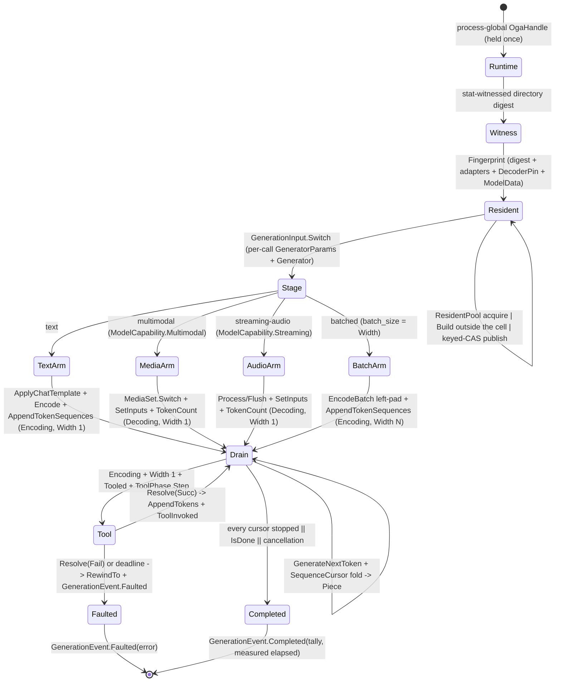

# [COMPUTE_GENERATIVE]

Rasm.Compute model generative run: the ORT-GenAI token-streaming owner emits one polymorphic `GenerationEvent` stream — incremental `Piece`, resolved `ToolInvoked`, typed `Faulted`, terminal `Completed` carrying the run tally and its measured span — over `GenerationInput.Text`/`Multimodal`/`StreamingAudio`/`Batched` shapes from ONE staged drain both the one-shot run and the conversation turn instantiate, with per-sequence cursor state, the genai provider/decoder-device override, content-admitted in-memory model and LoRA assets, a `ToolPhase` row machine that detects a free-text call, awaits the consumer resolver under a bounded deadline, and re-feeds the typed result, and a conversation-scoped `GenerativeSession` that retains the live KV prefix across turns.

It owns the `GenerationPolicy` search/prompt policy with its `SearchKey`/`GenerationMode`/`RuntimeOption` axes, the `GenerationInput` payload family with its narrowed `MediaSet` media arm and staged `Width`, the `ModelClass` native-capability table over one frozen `ModelCapability` set, the `ChatRole`/`ChatTurn` message vocabulary under a source-generated wire context, the `DecoderPin`/`ModelData`/`StopOracle`/`ToolPolicy` carriers, the `GenerationEvent` `[Union]` + `GenerationTally`/`GenerationOutcome` result family, the `AdapterSet` LoRA registry, and the `GenerativeRun` boundary capsule whose process-global `OgaHandle`, fingerprint-keyed resident `Config`→`Model`→`AdapterSet` lease, per-call `GeneratorParams`→`Generator` chain, `Stage` fold, `Drain`, `Collect`, and `Receipt` ride `Microsoft.ML.OnnxRuntimeGenAI`.

The `ExecutionProvider` from `Model/providers#EP_AXIS` and `ModelIdentity` from `Model/identity#MODEL_IDENTITY` ride the `Generate` receipt; the AppHost `CancelScope`, the kernel `CorrelationId` (`Rasm/Domain/frame#SOURCE`), `ContentHash`/`CanonicalWriter` (`Rasm/Domain/identity#CONTENT_KEY`), the kernel `MonotonicTimeline`, and `NodaTime` `Duration`/`Instant` arrive settled. `Generate` is the catalogued receipt case at `Runtime/receipts#RECEIPT_UNION` (whose `GuidanceKind` and `StagedTokens` fields this page owns), `ModelSessions.Faulted` is the ONE native-fault classifier this page composes rather than re-deriving, the cold-build-outside-lock-publish-under-lock resident discipline arrives settled from `Model/sessions#SESSION_CAPSULE`, and a remote generative run crosses solely through the `Runtime/wire#PROTO_VOCABULARY` `Generate` rpc (`GenerateRequest` → `TokenChunk`).

## [01]-[INDEX]

- [02]-[GENERATIVE_RUN]: ORT-GenAI owner emitting one `GenerationEvent` stream from one staged drain; fingerprint-keyed resident `Config`/`Model`/`AdapterSet` lease over a stat-witnessed directory digest; per-sequence cursor state; genai provider/decoder pins; in-memory model admission; the behavior-complete search-option table with its mandatory derived `batch_size`; the structural guidance-or-tools mode; the `ModelClass` capability set gating the multimodal, streaming-audio, and batched shapes.
- [03]-[TOKEN_DRAIN]: ONE `Drain` loop over `GenerateNextToken`/`GetNextTokens` that the one-shot run and the conversation turn both instantiate; the `ToolPhase` row machine and its `ToolStep` decisions; `Collect`'s total fold and the `Receipt` projection.
- [04]-[GENERATIVE_SESSION]: conversation-scoped KV retention — one live `Generator` per conversation, turns appended through `AppendTokens`, the conversation-wide budget, the drain participant row, and the idle-sweep schedule row.
- [05]-[RESEARCH]: closed.

## [02]-[GENERATIVE_RUN]

- Owner: `GenerationPolicy` is the one search-option and prompt-assembly policy — the behavior-bearing `SearchKey` recognized-key/value-domain axis, `SearchRows`, the `GenerationMode` guidance-or-tools column, admitted `RuntimeOption` rows, text stop rows, prompt-assembly columns, `DecoderPin`, admitted `ModelData`, the `MediaTokenReserve` staging column, and the admitted `AdapterAsset` roster. `GenerationInput` is the case-correct per-run payload family deriving both the receipt `Key` and the staged `Width`; `MediaSet` narrows the multimodal arm to the three inhabited media shapes; `ModelClass` is the native-capability table keyed on `Model.GetModelType()` over one frozen `ModelCapability` set; `ChatRole`/`ChatTurn` own the message vocabulary and its wire row; `GenerationEvent` is the one streamed unit; `GenerationOutcome` is the one collected result; `AdapterSet` is the LoRA hot-swap registry over `Adapters : SafeHandle`; `GenerativeRun` owns the process-global `OgaHandle`, the stat-witnessed directory-digest memo, the `GenerativeResident` payload over a `UInt128` content fingerprint, the per-call chain, the `Stage` fold, one `Lease`/`Unload`/`Drain`, and the entries the later clusters spell; `GenerativeRefusal` names this owner's shared contract refusals without a string-key roster. Residency itself is NOT owned here — both this page's fleets instantiate the `Model/sessions#SESSION_CAPSULE` `ResidentPool`.
- Cases: `GuidanceKind` rows none · json-schema · regex · lark-grammar — the COMPLETE native vocabulary, verified against the shipped runtime's own refusal (`only json_schema, regex, and lark_grammar are supported`); no `choice` type exists, so an enumerated choice rides a `json-schema` enum or a `regex` alternation; `SearchKey` rows batch_size · num_beams · num_return_sequences · length_penalty · repetition_penalty · no_repeat_ngram_size · top_k · top_p · temperature · diversity_penalty · do_sample · random_seed · max_length · min_length · chunk_size · blank_penalty · early_stopping · past_present_share_buffer — the COMPLETE recognized roster the shared native search parser accepts, catalogued with per-key evidence at `.api/api-onnxruntimegenai.md`; `GenerationMode` cases `Plain` · `Guided` · `Tooled`; `GenerationInput` cases text · multimodal · streaming-audio · batched; `MediaSet` cases `Images` · `Audios` · `Both`; `ModelClass` rows generic · vision-language · speech-stream; `ChatRole` rows system · user · assistant · tool; `GenerationEvent` cases `Piece` · `ToolInvoked` · `Faulted` · `Completed`; `StagedRun` cases `Decoding` · `Encoding`.
- Entry: `Stream(modelDir, policy, input, clock, timeline, cell, token)` leases the fingerprint-keyed resident, stages the payload case, yields incremental `Piece(sequence, index, text)`, surfaces a resolved `ToolInvoked(sequence, tool)`, carries every refusal as `Faulted(error)`, and closes with `Completed(tally, elapsed)`; it carries no `ModelIdentity`/`ExecutionProvider` — the provider rides the model's `genai_config.json` or the `DecoderPin` and identity/EP ride the `Receipt`, so a `Stream` re-deriving a provider string from an `ExecutionProvider.Key` is the deleted form.
- Law: residency has ONE owner and this page holds NONE of it. Both fleets here — the `Config`/`Model`/`AdapterSet` model fleet and the `[04]` conversation registry — instantiate the `Model/sessions#SESSION_CAPSULE` `ResidentPool`, so `Acquire`, `Publish`, `Release`, the eviction fold, the race-loser disposal, and the lease refcount delete from this page whole. NAMED LOSS: the page-local `ResidentLease` and `Seat` retire, and `GenerativeChat.Open` now hands back a POOL LEASE its caller releases. WITNESS: the conversation registry was the copy carrying no refcount at all — `Sweep` filtered on `LastUsed` and disposed what it found, so an idle sweep could close a `Generator` mid-drain while the `turning` interlock, which guards only two concurrent turns, saw nothing. Both fleets also inherit the pool's per-key eviction CAS and its bracketed LIFO disposal, closing a snapshot-then-remove window and an `Iter` that stranded every handle behind the first throwing `Dispose`.
- Law: the STREAM ELEMENT carries the rail. `IAsyncEnumerable<GenerationEvent>` is the correct lane form for a single-producer token drain — `concurrency.md` `[BLOCK_ADMISSION]` admits a channel row only on topology completion, batch grouping, broadcast latest-value, or ordered parallel transform, and a native cursor pump has none, so `Channel<T>` is NOT owed — and the defect was never the carrier but the element type: an event family that cannot carry a fault forced ten typed rails back through exceptions and then a six-arm ladder to re-admit them. `Faulted(Error)` closes that loop, and a refusal is the FIRST element rather than an outer `Fin<IAsyncEnumerable<…>>` wrapper because the lease, the generator, and every staged handle must live exactly as long as the enumeration: a wrapper validating outside the iterator would have to acquire them to do it, and a caller that never enumerated would leak every one.
- Law: guidance and tools are MUTUALLY EXCLUSIVE by CONSTRUCTION, not by three agreeing checks. Under `SetGuidance` the native `AppendTokens` admits only grammar-derived spans and rejects a free-text tool result with a parser error, so `GenerationMode` carries `Plain`, `Guided`, and `Tooled` as one closed column and the combination is unspellable — where the exclusion previously lived as a conjunct in `Conforms`, a gate in `Stage`, and a refusal in `OpenSession`, three sites that could disagree.
- Law: admission ACCUMULATES. Nine independent invariants `&&`-folded into ONE prose fault told a caller breaking four of them nothing about any of the four, on a page where every other refusal is a keyed slug. Each is an `IConstraint<PolicyCandidate>` conformance folded applicatively, so the refusal names every invariant the policy broke and the prose message deletes.
- Law: `IsDone()` answers the WHOLE batch, never one sequence — a sequence that emits EOS at step 1 leaves it false while the batch runs on, and every finished sequence then emits PAD at full batch width for every remaining step. Per-sequence stop therefore rides the drain's own `SequenceCursor` roster, `GetNextTokens().Length` equals the staged width on every step, and a terminal EOS or PAD is consumed without advancing the tally, so a stop token never counts as generated text.
- Law: `batch_size` is a MANDATORY recognized `SetSearchOption` key — absent, staging faults `input sequences count does not match batch size` — and it is DERIVED from `GenerationInput.Width`, never declared: the batched arm sets the staged width and every other arm sets one. `EncodeBatch` left-pads a ragged batch to its longest member, `TokenCount()` is one batch-wide scalar rather than a per-sequence read, and `RewindTo` on a batch wider than one admits only `0` while any restart faults — so a batched run has NO restart and the tool arm's `Width == 1` gate is what keeps the rewind rail reachable.
- Law: `ModelClass` gates every native processor the shape reaches, through a MEMBERSHIP SET rather than three parallel bools. Three booleans spell eight states of which three are inhabited and leave the `Streaming ⇒ Multimodal` implication every row satisfies unstated; one frozen `ModelCapability` set makes the gates membership tests and the implication a roster fact. `StreamingProcessor` binds the speech-stream row alone, `MultiModalProcessor` binds only a row carrying multimodal, and a model type the table does not carry falls to the generic row — so an unrostered multimodal model REFUSES staging rather than reaching a processor the native layer never registered. Neither media row carries rewind, which is why tools admit only on a rewinding class. Batched multimodal is unreachable by construction — one image tag admits one prompt — and refuses typed rather than staging a batch the graph cannot carry.
- Law: `max_length` is the native TOTAL sequence length and a multimodal stage commits its media tokens at `SetInputs`, BEFORE the first step, so a budget shorter than the staged total faults at staging rather than at the drain. `MediaTokenReserve` is the measured per-media staged-token reserve — resolution-invariant and linear in media count — and the effective row set widens the multimodal and streaming rows by it while every other arm passes the declared budget through.
- Law: genai provider names are case-sensitive native strings the packaged runtime resolves at `Model` construction. `CoreML` builds and generates on this runtime; `XNNPACK` refuses `not supported in this build` on osx-arm64; an unresolvable name faults at construction. `DecoderPin` therefore carries the native name verbatim and never a translated `ExecutionProvider.Key`.
- Law: a sampled run is replayable EXACTLY WHEN the policy declares `random_seed`, and never by default. The runtime recognizes the key — verified in the shipped native parser, integral, default `-1` meaning "seed from the random device", and readable back through `GetSearchNumber` — so replay is a caller's declaration rather than a property the lane can assert or deny wholesale. It stays UNSEEDED because a default seed silently collapses every concurrent request onto one draw. A run without it produces tokens the `Generate` receipt records and never claims reproduce; a run with it reproduces under identical model bytes, policy rows, and prompt. The `Generate` receipt carries the declared seed as `Option<int>` — `Some` is the replay claim, `None` the unseeded default — so replayability is legible in the receipt itself.
- Auto: `Conforms(input)` accumulates finite `SearchRows` through each delegate-backed `SearchKey.Accepts`, ordered `min_length <= max_length`, nonblank unique stop sequences, case-local assets, content-verified unique adapters, mode-consistent guidance and tool rosters, and the run-shape gate — `batch_size` is derived, so a caller row declaring it is refused. The effective row set folds the declared rows with two DERIVED columns through the roster's own `Seeded` column; `Apply` invokes each row's own `Apply` arm and `Echo` each row's own `Echo` arm, so the numeric-versus-bool overload choice is a row property rather than a branch at two call sites facing opposite directions. `DecoderPin.Apply` clears packaged providers before appending its override, so the pin never becomes an accidental fallback. `Generator.SetRuntimeOption` folds every admitted `RuntimeOption` after generator construction. Owned in-memory bytes enter through `Config.AddModelData` and retract through `RemoveModelData` after `Model` construction. `Fingerprint` folds the memoized directory digest with every adapter content key, decoder option, and in-memory identity through the kernel canonical writer. Non-copyable pool leases count active streams on one keyed cell; `Unload` composes the pool's own idle eviction and then drops the witness of every path no resident still backs. Prompt assembly rides `ApplyChatTemplate` then `Encode`; `StopOracle` reads model EOS, pad, and turn-boundary ids and withholds the maximal text-stop prefix per sequence so a stop split across token pieces never leaks.
- Receipt: the `Generate` `ComputeReceipt` case carries model checksum, EP (whose `Precision.Key` rides the `ExecutionProvider` key so a quantized run is receipt-distinct), model type from `Model.GetModelType()`, generated-token count, tokens-per-second over the drain's OWN measured span, the `GuidanceKind` dimension, the constrained-token count, the tool-call count, and the `StagedTokens` media column — all read from `GenerationOutcome`, never caller-supplied, so a receipt hardcoding `0, 0` for the constrained/tool slots is structurally impossible and the elapsed denominator is a value this page observed rather than one its caller asserted; the run rides `Substrate.GenAi` (never the `Onnx` inference row), the caller's own `WorkLane`, and `AllocationClass.NativeOrt`; the `Mode` and `Adapter` receipt columns carry the input's own key and the active LoRA adapter, and the `Runtime/receipts` projection fan tags `rasm.compute.generate.tokens` from them (`run.mode`, `lora.adapter`, `guidance`) so every instrument dimension derives from a receipt field; the run advances the injected `Runtime/progress#PROGRESS_CELL` cell to the `Streaming` `ProgressPhase` with the running token count on the `ProgressMark.Segments` slot — a call the drain makes rather than a contract the card claims — while the terminal `Generate` receipt carries the token total, so a per-chunk `StreamSegment` receipt is the rejected form (that receipt addresses a content-keyed artifact stream — the windowed-inference `Chunked` run — which a token stream never produces).
- Packages: Microsoft.ML.OnnxRuntimeGenAI, Microsoft.ML.OnnxRuntime, NodaTime, Thinktecture.Runtime.Extensions, LanguageExt.Core (`AtomHashMap.SwapKey`), Rasm (project, `Domain.ContentHash`/`Domain.CanonicalWriter`/`Domain.Custody.Rollback`/`Parametric.MonotonicTimeline`), Rasm.AppHost (project), BCL inbox (System.Text.Json, System.Collections.Frozen)
- Growth: a new search option is one behavior-complete `SearchKey` row carrying its own default, apply, and echo columns; a new output constraint is one `GuidanceKind` row; a new generative shape is one payload-bearing `GenerationInput` case whose `Stage` arm rides the one drain; a new media shape is one `MediaSet` case; a model type whose native capability differs from the generic floor is one `ModelClass` row naming its capability members; a new fine-tune is one admitted `AdapterAsset` row loaded once on the resident's `AdapterSet` and selected by `Adapter` name; a new stream observation is one `GenerationEvent` case folded into the total `Switch`; a new tool is one name + one `ToolPolicy.Resolve` arm; a new refusal is one named `GenerativeRefusal` over the shared contract vocabulary, never a free slug or new `ComputeFault` case; an in-memory model is one admitted `ModelData` value; zero new surface.
- Boundary: token-streaming is a run mode on this host-local lane; the cluster carries no `TS_PROJECTION`, and remote generation crosses solely through `Runtime/wire#PROTO_VOCABULARY` `Generate`. `OgaHandle` is process-global on `GenerativeRun.Runtime`, while every per-call genai handle is disposed LIFO. Cold `Config`/`Model`/`AdapterSet` construction runs OUTSIDE the residency cell and publishes through one keyed CAS, so a race costs one redundant build instead of a serialized fleet and the loser disposes its own build; every acquire chain rides `Fin` with the kernel `Rasm/Domain/rails#RESOURCE_RAIL` `Custody.Rollback` carrying the partial handle set — the correct member on every arm here because the success value TAKES custody, where `Bracket`'s unconditional release would double-dispose what the pool then holds — so the four per-site `catch { X.Dispose(); throw; }` blocks the failure path used to spell are the deleted form. `Config`/`Model`/`AdapterSet` residents stay alive while the pool row holds a lease; the idempotent lease `Dispose` decrements the hold once, so an idle sweep cannot dispose a model under an active `Generator`. Recognized `SetSearchOption` keys and value domains live on `SearchKey`, which is COMPLETE against the shipped native parser both overloads share; a literal key or unconstrained numeric row is rejected, and an unrecognized key would throw a messageless native `unknown_value_error` a call site cannot attribute. `SetGuidance` validates neither its type nor the type-plus-data pairing, deferring both to `Generator` construction, so `GuidanceKind` and the policy's mode column are what keep a bad guidance string from failing a whole acquire chain instead of its own call. `SetRuntimeOption` accepts an unknown key SILENTLY and `terminate_session` ABORTS the process uncatchably mid-drain, so `RuntimeOption.Admit` refuses the banned key and no other construction path exists — the abort is structurally unspellable rather than documented. `Generator.GetOutput`/`GetInput` SIGSEGV on a name the live graph does not carry, so the drain surface spells neither. `Generator.GetSequence(index)` performs no native range check — an out-of-range index returns sequence 0 — so any read gates on the cursor's own width; the drain reads `GetNextTokens()` alone. `GenerationPolicy.FastForwardTokens` has no spelling: `enableFFTokens` COMMITS tokens `GetNextTokens()` never surfaces (a measured 85-token count over 83 steps, the streamed decode missing schema keys the committed sequence held), so the flag is pinned false at the one `SetGuidance` call. Genai provider selection rides `genai_config.json` or `DecoderPin`, never `ExecutionProvider.Key`. Prompt assembly and tool-call detection cross a SOURCE-GENERATED `GenerativeWireContext`: an anonymous type cannot carry a generated context, which is exactly why the anonymous-projection form was the tell, and the tool-call wire keys are a typed record rather than string literals read through null propagation. `Microsoft.Extensions.AI.Abstractions` names NO member on any signature here and its `IChatClient` port is unbound, so the package rides no `Packages` line on this page — an anchor naming an unlanded consumer reads as aspiration wearing verification's clothes, and the row returns the moment a conformance lands.

```csharp signature
// --- [TYPES] ---------------------------------------------------------------------------
[SmartEnum<string>]
[KeyMemberEqualityComparer<ComparerAccessors.StringOrdinal, string>]
[KeyMemberComparer<ComparerAccessors.StringOrdinal, string>]
public sealed partial class GuidanceKind {
    public static readonly GuidanceKind None = new("none", type: "");
    public static readonly GuidanceKind JsonSchema = new("json-schema", type: "json_schema");
    public static readonly GuidanceKind Regex = new("regex", type: "regex");
    public static readonly GuidanceKind LarkGrammar = new("lark-grammar", type: "lark_grammar");

    public string Type { get; }
}

[SmartEnum<string>]
[KeyMemberEqualityComparer<ComparerAccessors.StringOrdinal, string>]
[KeyMemberComparer<ComparerAccessors.StringOrdinal, string>]
public sealed partial class ChatRole {
    public static readonly ChatRole System = new("system");
    public static readonly ChatRole User = new("user");
    public static readonly ChatRole Assistant = new("assistant");
    public static readonly ChatRole Tool = new("tool");

    public static Option<ChatRole> FromWire(string wire) => TryGet(wire, out ChatRole? row) ? Some(row!) : None;
}

[SmartEnum<string>]
[KeyMemberEqualityComparer<ComparerAccessors.StringOrdinal, string>]
[KeyMemberComparer<ComparerAccessors.StringOrdinal, string>]
public sealed partial class SearchKey {
    public static readonly SearchKey BatchSize = new("batch_size", None, Number, ReadNumber, static value => value >= 1.0 && value == Math.Truncate(value));
    public static readonly SearchKey NumBeams = new("num_beams", Some(1.0), Number, ReadNumber, static value => value >= 1.0 && value == Math.Truncate(value));
    public static readonly SearchKey NumReturnSequences = new("num_return_sequences", None, Number, ReadNumber, static value => value >= 1.0 && value == Math.Truncate(value));
    public static readonly SearchKey LengthPenalty = new("length_penalty", Some(1.0), Number, ReadNumber, static value => value != 0.0);
    public static readonly SearchKey RepetitionPenalty = new("repetition_penalty", Some(1.0), Number, ReadNumber, static value => value > 0.0);
    public static readonly SearchKey NoRepeatNgramSize = new("no_repeat_ngram_size", None, Number, ReadNumber, static value => value >= 0.0 && value == Math.Truncate(value));
    public static readonly SearchKey TopK = new("top_k", Some(50.0), Number, ReadNumber, static value => value >= 0.0 && value == Math.Truncate(value));
    public static readonly SearchKey TopP = new("top_p", Some(0.9), Number, ReadNumber, static value => value is >= 0.0 and <= 1.0);
    public static readonly SearchKey Temperature = new("temperature", Some(0.7), Number, ReadNumber, static value => value > 0.0);
    public static readonly SearchKey DiversityPenalty = new("diversity_penalty", None, Number, ReadNumber, static _ => false);
    public static readonly SearchKey DoSample = new("do_sample", Some(1.0), Flag, ReadFlag, static value => value is 0.0 or 1.0);
    public static readonly SearchKey RandomSeed = new("random_seed", None, Number, ReadNumber, static value => value >= -1.0 && value == Math.Truncate(value));
    public static readonly SearchKey MaxLength = new("max_length", Some(512.0), Number, ReadNumber, static value => value >= 1.0 && value == Math.Truncate(value));
    public static readonly SearchKey MinLength = new("min_length", Some(0.0), Number, ReadNumber, static value => value >= 0.0 && value == Math.Truncate(value));
    public static readonly SearchKey ChunkSize = new("chunk_size", None, Number, ReadNumber, static value => value >= 1.0 && value == Math.Truncate(value));
    public static readonly SearchKey BlankPenalty = new("blank_penalty", None, Number, ReadNumber, static value => value >= 0.0);
    public static readonly SearchKey EarlyStopping = new("early_stopping", Some(0.0), Flag, ReadFlag, static value => value is 0.0 or 1.0);
    public static readonly SearchKey PastPresentShareBuffer = new("past_present_share_buffer", None, Flag, ReadFlag, static value => value is 0.0 or 1.0);

    private SearchKey(
        string key, Option<double> seeded,
        Action<GeneratorParams, string, double> apply, Func<GeneratorParams, string, double> echo,
        Func<double, bool> accepts) : this(key) =>
        (Seeded, apply_, echo_, accepts_) = (seeded, apply, echo, accepts);

    public static FrozenDictionary<SearchKey, double> Canonical =>
        toSeq(Items).Choose(static row => row.Seeded.Map(value => (row, value))).ToFrozenDictionary(
            static pair => pair.row, static pair => pair.value);

    public Option<double> Seeded { get; }

    public void Apply(GeneratorParams parameters, double value) => apply_(parameters, Key, value);

    public double Echo(GeneratorParams parameters) => echo_(parameters, Key);

    public bool Accepts(double value) => accepts_(value);

    static void Number(GeneratorParams parameters, string key, double value) => parameters.SetSearchOption(key, value);
    static void Flag(GeneratorParams parameters, string key, double value) => parameters.SetSearchOption(key, value != 0.0);
    static double ReadNumber(GeneratorParams parameters, string key) => parameters.GetSearchNumber(key);
    static double ReadFlag(GeneratorParams parameters, string key) => parameters.GetSearchBool(key) ? 1.0 : 0.0;
}

[SmartEnum<string>]
[KeyMemberEqualityComparer<ComparerAccessors.StringOrdinal, string>]
[KeyMemberComparer<ComparerAccessors.StringOrdinal, string>]
public sealed partial class ModelCapability {
    public static readonly ModelCapability Multimodal = new("multimodal");
    public static readonly ModelCapability Streaming = new("streaming");
    public static readonly ModelCapability Rewinds = new("rewinds");
}

[SmartEnum<string>]
[KeyMemberEqualityComparer<ComparerAccessors.StringOrdinal, string>]
[KeyMemberComparer<ComparerAccessors.StringOrdinal, string>]
public sealed partial class ModelClass {
    public static readonly ModelClass Generic = new("<generic>", [ModelCapability.Rewinds]);
    public static readonly ModelClass VisionLanguage = new("phi3v", [ModelCapability.Multimodal]);
    public static readonly ModelClass SpeechStream = new("nemotron_speech", [ModelCapability.Multimodal, ModelCapability.Streaming]);

    private ModelClass(string key, params ReadOnlySpan<ModelCapability> capabilities) : this(key) =>
        Capabilities = capabilities.ToFrozenSet();

    public FrozenSet<ModelCapability> Capabilities { get; }

    public bool Carries(ModelCapability capability) => Capabilities.Contains(capability);

    public static ModelClass Of(Model session) =>
        TryGet(session.GetModelType(), out ModelClass? row) ? row : Generic;
}

[Union(ConversionFromValue = ConversionOperatorsGeneration.None)]
public abstract partial record MediaSet {
    private MediaSet() { }

    public sealed record Images(Seq<string> Paths) : MediaSet;
    public sealed record Audios(Seq<string> Paths) : MediaSet;
    public sealed record Both(Seq<string> ImagePaths, Seq<string> AudioPaths) : MediaSet;

    public int Count => Switch(
        images: static set => set.Paths.Count,
        audios: static set => set.Paths.Count,
        both: static set => set.ImagePaths.Count + set.AudioPaths.Count);

    public Seq<string> Files => Switch(
        images: static set => set.Paths,
        audios: static set => set.Paths,
        both: static set => set.ImagePaths + set.AudioPaths);

    public static Option<MediaSet> Of(Seq<string> images, Seq<string> audios) =>
        (images.IsEmpty, audios.IsEmpty) switch {
            (false, false) => Some<MediaSet>(new Both(images, audios)),
            (false, true) => Some<MediaSet>(new Images(images)),
            (true, false) => Some<MediaSet>(new Audios(audios)),
            _ => None,
        };
}

[Union(ConversionFromValue = ConversionOperatorsGeneration.None)]
public abstract partial record GenerationInput {
    private GenerationInput() { }

    public sealed record Text(string Prompt) : GenerationInput;
    public sealed record Multimodal(string Prompt, MediaSet Media) : GenerationInput;
    public sealed record StreamingAudio(string Prompt, Seq<float[]> Chunks, FrozenDictionary<string, string> ProcessorOptions) : GenerationInput;
    public sealed record Batched(Seq<string> Prompts) : GenerationInput;

    public string Key => Switch(
        text: static _ => "text",
        multimodal: static _ => "multimodal",
        streamingAudio: static _ => "streaming-audio",
        batched: static _ => "batched");

    public int Width => Switch(
        text: static _ => 1,
        multimodal: static _ => 1,
        streamingAudio: static _ => 1,
        batched: static assets => assets.Prompts.Count);

    public int Media => Switch(
        text: static _ => 0,
        multimodal: static assets => assets.Media.Count,
        streamingAudio: static assets => assets.Chunks.Count,
        batched: static _ => 0);
}

[Union(ConversionFromValue = ConversionOperatorsGeneration.None)]
public abstract partial record GenerationMode {
    private GenerationMode() { }

    public sealed record Plain : GenerationMode;
    public sealed record Guided(GuidanceKind Kind, string Data) : GenerationMode;
    public sealed record Tooled(ToolPolicy Tools) : GenerationMode;

    public static readonly GenerationMode Free = new Plain();

    public GuidanceKind Guidance => Switch(
        plain: static _ => GuidanceKind.None,
        guided: static mode => mode.Kind,
        tooled: static _ => GuidanceKind.None);

    public ToolPolicy Tools => Switch(
        plain: static _ => ToolPolicy.None,
        guided: static _ => ToolPolicy.None,
        tooled: static mode => mode.Tools);
}

[SmartEnum<string>]
[KeyMemberEqualityComparer<ComparerAccessors.StringOrdinal, string>]
[KeyMemberComparer<ComparerAccessors.StringOrdinal, string>]
public sealed partial class StopScope {
    public static readonly StopScope Completion = new("completion", static (oracle, token) => oracle.Reached(token));
    public static readonly StopScope Turn = new("turn", static (oracle, token) => oracle.Ends(token));

    [UseDelegateFromConstructor]
    public partial bool Halts(StopOracle oracle, int token);
}

// --- [MODELS] --------------------------------------------------------------------------
public sealed record DecoderPin(
    string Provider,
    string HardwareDeviceType,
    uint HardwareDeviceId,
    uint HardwareVendorId,
    FrozenDictionary<string, string> ProviderOptions) {
    public Fin<Unit> Apply(Config config) =>
        Op.Of(name: "generative.decoder-pin").Catch(() => {
            config.ClearProviders();
            config.AppendProvider(Provider);
            ProviderOptions.Iter(option => config.SetProviderOption(Provider, option.Key, option.Value));
            config.SetDecoderProviderOptionsHardwareDeviceType(Provider, HardwareDeviceType);
            config.SetDecoderProviderOptionsHardwareDeviceId(Provider, HardwareDeviceId);
            config.SetDecoderProviderOptionsHardwareVendorId(Provider, HardwareVendorId);
            return Fin.Succ(unit);
        });
}

public sealed record RuntimeOption {
    static readonly FrozenSet<string> Banned = FrozenSet.Create(StringComparer.Ordinal, "terminate_session");

    private RuntimeOption(string key, string value) => (Key, Value) = (key, value);

    public string Key { get; }
    public string Value { get; }

    public static Fin<RuntimeOption> Admit(string key, string value) =>
        string.IsNullOrWhiteSpace(key) || string.IsNullOrWhiteSpace(value) || Banned.Contains(key)
            ? GenerativeRefusal.RuntimeOption.Fault<RuntimeOption>()
            : Fin.Succ(new RuntimeOption(key, value));
}

public sealed class ModelData {
    private ModelData(string filename, byte[] bytes, string overlayJson, UInt128 contentKey) =>
        (Filename, Bytes, OverlayJson, ContentKey) = (filename, bytes, overlayJson, contentKey);

    public string Filename { get; }
    public ReadOnlyMemory<byte> Bytes { get; }
    public string OverlayJson { get; }
    public UInt128 ContentKey { get; }

    public static Fin<ModelData> Admit(string filename, ReadOnlyMemory<byte> bytes, string overlayJson) {
        if (string.IsNullOrWhiteSpace(filename) || bytes.IsEmpty) { return GenerativeRefusal.ModelData.Fault<ModelData>(); }
        byte[] owned = bytes.ToArray();
        return overlayJson.Length is 0
            ? Fin.Succ(new ModelData(filename, owned, overlayJson, ContentHash.Of(owned)))
            : Op.Of(name: "generative.model-overlay").Catch(() => Fin.Succ(JsonNode.Parse(overlayJson) is JsonObject))
                .Bind(valid => valid
                    ? Fin.Succ(new ModelData(filename, owned, overlayJson, ContentHash.Of(owned)))
                    : GenerativeRefusal.ModelOverlay.Fault<ModelData>());
    }
}

public sealed class AdapterAsset {
    private AdapterAsset(string name, string path, UInt128 contentKey) => (Name, Path, ContentKey) = (name, path, contentKey);

    public string Name { get; }
    public string Path { get; }
    public UInt128 ContentKey { get; }

    public static Fin<AdapterAsset> Admit(string name, string path) =>
        string.IsNullOrWhiteSpace(name) || !File.Exists(path)
            ? Fin.Fail<AdapterAsset>(new ComputeFault.ExtensionAssetMissing(path))
            : Op.Of(name: "generative.adapter-admit").Catch(() => Fin.Succ(new AdapterAsset(name, path, ContentHash.Of(File.ReadAllBytes(path)))));

    public Fin<Unit> Verify() =>
        Op.Of(name: "generative.adapter-verify").Catch(() => Fin.Succ(ContentHash.Of(File.ReadAllBytes(Path))))
            .Bind(current => current == ContentKey
                ? Fin.Succ(unit)
                : Fin.Fail<Unit>(new ComputeFault.ExtensionAssetMissing($"{Path}:content-changed")));
}

public sealed record ToolCallWire(string Name, JsonElement Arguments);

public sealed record ChatTurn(string Role, string Content) {
    public static ChatTurn Of(ChatRole role, string content) => new(role.Key, content);
}

[JsonSourceGenerationOptions(GenerationMode = JsonSourceGenerationMode.Default)]
[JsonSerializable(typeof(ChatTurn[]))]
[JsonSerializable(typeof(ToolCallWire))]
public sealed partial class GenerativeWireContext : JsonSerializerContext;

public sealed record ToolRequest(string Name, string Arguments);

public sealed record ToolPolicy {
    private ToolPolicy(string schemas, Set<string> names, Func<ToolRequest, CancellationToken, ValueTask<Fin<string>>> resolve, Duration deadline) =>
        (Schemas, Names, Resolve, Deadline) = (schemas, names, resolve, deadline);

    public string Schemas { get; }
    public Set<string> Names { get; }

    public Func<ToolRequest, CancellationToken, ValueTask<Fin<string>>> Resolve { get; }

    public Duration Deadline { get; }

    public static readonly ToolPolicy None =
        new("", Set<string>(), static (_, _) => ValueTask.FromResult(Fin.Succ("")), Duration.FromSeconds(30));

    public static Fin<ToolPolicy> Admit(string schemas, Set<string> names, Func<ToolRequest, CancellationToken, ValueTask<Fin<string>>> resolve, Duration deadline) =>
        names.IsEmpty || resolve is null || names.Exists(string.IsNullOrWhiteSpace) || deadline <= Duration.Zero
            ? GenerativeRefusal.ToolRoster.Fault<ToolPolicy>()
            : Op.Of(name: "generative.tool-schemas").Catch(() => Fin.Succ(JsonNode.Parse(schemas) is not null))
                .Bind(valid => valid
                    ? Fin.Succ(new ToolPolicy(schemas, names, resolve, deadline))
                    : GenerativeRefusal.ToolSchemas.Fault<ToolPolicy>());

    public Option<ToolRequest> Detect(string text) {
        int open = text.IndexOf('{', StringComparison.Ordinal);
        return Names.IsEmpty || open < 0
            ? Option<ToolRequest>.None
            : Op.Of(name: "generative.tool-detect").Catch(() => Fin.Succ(JsonSerializer.Deserialize(text[open..], GenerativeWireContext.Default.ToolCallWire))).Match(
                Succ: call => call is { } wire && Names.Contains(wire.Name)
                    ? Some(new ToolRequest(wire.Name, wire.Arguments.GetRawText()))
                    : Option<ToolRequest>.None,
                Fail: static _ => Option<ToolRequest>.None);
    }
}

public readonly record struct StopOracle(Set<int> EosIds, Set<int> TurnIds, FrozenSet<string> Text, int MaxTextLength, int BosId, int PadId) {
    public static StopOracle Read(Tokenizer tokenizer, Seq<string> text) =>
        new(toSet(tokenizer.GetEosTokenIds().ToArray()), Probe(tokenizer), text.ToFrozenSet(StringComparer.Ordinal),
            text.Fold(0, static (length, value) => Math.Max(length, value.Length)), tokenizer.GetBosTokenId(), tokenizer.GetPadTokenId());

    static Set<int> Probe(Tokenizer tokenizer) =>
        Seq<Func<int>>(tokenizer.GetEotTokenId, tokenizer.GetEorTokenId)
            .Fold(Set<int>(), static (ids, read) => Op.Of(name: "generative.stop-token-probe").Catch(() => Fin.Succ(read())).Match(Succ: ids.Add, Fail: static _ => ids));

    public bool Reached(int token) => EosIds.Contains(token) || token == PadId;
    public bool Ends(int token) => Reached(token) || TurnIds.Contains(token);
    public bool Skips(int token) => token == BosId;

    public (string Emit, string Tail, bool Reached) Feed(string tail, string piece) {
        string combined = tail + piece;
        int stop = Text.Fold(-1, (earliest, candidate) => {
            int index = combined.IndexOf(candidate, StringComparison.Ordinal);
            return index >= 0 && (earliest < 0 || index < earliest) ? index : earliest;
        });
        if (stop >= 0) { return (combined[..stop], "", true); }
        int retained = Math.Min(Math.Max(0, MaxTextLength - 1), combined.Length);
        return (combined[..(combined.Length - retained)], combined[(combined.Length - retained)..], false);
    }
}

public sealed record GenerationTally(int Tokens, int ConstrainedTokens, int ToolCalls, string ModelType, Option<int> StagedTokens) {
    public static readonly GenerationTally Empty = new(0, 0, 0, "", None);
}

[Union(ConversionFromValue = ConversionOperatorsGeneration.None)]
public abstract partial record GenerationEvent {
    private GenerationEvent() { }

    public sealed record Piece(int Sequence, long Index, string Text) : GenerationEvent;

    public sealed record ToolInvoked(int Sequence, string Tool) : GenerationEvent;

    public sealed record Faulted(Error Fault) : GenerationEvent;

    public sealed record Completed(GenerationTally Tally, Duration Elapsed) : GenerationEvent;
}

public sealed record GenerationOutcome(HashMap<int, Seq<string>> Sequences, GenerationTally Tally, Duration Elapsed) {
    public string Text => string.Concat(Sequences.Find(0).IfNone(static () => Seq<string>()));
}

public readonly record struct PolicyCandidate(GenerationPolicy Policy, GenerationInput Input);

[Equatable]
public sealed partial record GenerationPolicy(
    [property: OrderedEquality] FrozenDictionary<SearchKey, double> SearchRows,
    [property: OrderedEquality] Seq<RuntimeOption> RuntimeOptions,
    GenerationMode Mode,
    [property: OrderedEquality] Seq<string> StopSequences,
    int MediaTokenReserve,
    Option<string> Adapter,
    [property: OrderedEquality] Seq<AdapterAsset> AdapterPaths,
    string SystemPrompt,
    string ChatTemplate,
    [property: OrderedEquality] Seq<ChatTurn> History,
    [property: OrderedEquality] Seq<string> RetrievedContext,
    Option<DecoderPin> Decoder,
    Option<ModelData> InMemory) {
    public static readonly GenerationPolicy Canonical = new(
        SearchRows: SearchKey.Canonical,
        RuntimeOptions: Seq<RuntimeOption>(),
        Mode: GenerationMode.Free,
        StopSequences: Seq<string>(),
        MediaTokenReserve: 2600,
        Adapter: None,
        AdapterPaths: Seq<AdapterAsset>(),
        SystemPrompt: "", ChatTemplate: "", History: Seq<ChatTurn>(), RetrievedContext: Seq<string>(),
        Decoder: None, InMemory: None);

    public GuidanceKind Guidance => Mode.Guidance;

    public ToolPolicy Tools => Mode.Tools;

    static readonly Seq<IConstraint<PolicyCandidate>> Gates = Seq<IConstraint<PolicyCandidate>>(
        new RowsAdmitted(), new RowsOrdered(), new AdaptersDistinct(), new GuidanceComplete(),
        new StopsDistinct(), new ToolsPlaceable(), new DecoderComplete(), new ShapeInhabited(), new ModelDataShaped());

    public Fin<Unit> Conforms(GenerationInput input) =>
        Gates.Traverse(gate => gate.Check(new PolicyCandidate(this, input))).As().ToFin()
            .Bind(_ => AdapterPaths.Traverse(asset => asset.Verify().ToValidation()).As().ToFin().Map(static _ => unit));

    public static GenerationPolicy Beam(int beams, double lengthPenalty = 1.0) =>
        Canonical with {
            SearchRows = Canonical.SearchRows.SetItems([
                KeyValuePair.Create(SearchKey.NumBeams, (double)beams),
                KeyValuePair.Create(SearchKey.DoSample, 0.0),
                KeyValuePair.Create(SearchKey.LengthPenalty, lengthPenalty),
                KeyValuePair.Create(SearchKey.EarlyStopping, 1.0),
            ]),
        };

    public FrozenDictionary<SearchKey, double> Effective(GenerationInput input) =>
        SearchRows.SetItems([
            KeyValuePair.Create(SearchKey.BatchSize, (double)input.Width),
            KeyValuePair.Create(SearchKey.MaxLength,
                SearchRows.Find(SearchKey.MaxLength).IfNone(0.0) + ((double)MediaTokenReserve * input.Media)),
        ]);

    public Fin<Unit> Apply(GeneratorParams parameters, GenerationInput input) =>
        Op.Of(name: "generative.search-apply").Catch(() => {
            Effective(input).Iter(row => row.Key.Apply(parameters, row.Value));
            if (Mode is GenerationMode.Guided guided) {
                parameters.SetGuidance(guided.Kind.Type, guided.Data, enableFFTokens: false);
            }
            return Fin.Succ(unit);
        });

    public FrozenDictionary<SearchKey, double> Echo(GeneratorParams parameters, GenerationInput input) =>
        Effective(input).Keys.ToFrozenDictionary(static key => key, key => key.Echo(parameters));

    public Fin<Config> OpenConfig(string modelDir) =>
        Op.Of(name: "generative.config-open").Catch(() => Fin.Succ(new Config(modelDir)))
            .Bind(config =>
                Op.Of(name: "generative.config-populate").Catch(() => {
                    InMemory.Iter(data => {
                        config.AddModelData(data.Filename, data.Bytes.ToArray());
                        if (data.OverlayJson.Length > 0) { config.Overlay(data.OverlayJson); }
                    });
                    return Fin.Succ(config);
                })
                    .Bind(opened => Decoder.Match(
                        Some: pin => pin.Apply(opened).Map(_ => opened),
                        None: () => Fin.Succ(opened)))
                    .Rollback(config));

    public string Messages(string prompt) =>
        JsonSerializer.Serialize(
            ((SystemPrompt.Length > 0 ? Seq(ChatTurn.Of(ChatRole.System, SystemPrompt)) : Seq<ChatTurn>())
                + History
                + (RetrievedContext.IsEmpty
                    ? Seq<ChatTurn>()
                    : Seq(ChatTurn.Of(ChatRole.System, string.Join('\n', RetrievedContext))))
                + Seq(ChatTurn.Of(ChatRole.User, prompt))).ToArray(),
            GenerativeWireContext.Default.ChatTurnArray);

    sealed class RowsAdmitted : IConstraint<PolicyCandidate> {
        public Validation<Error, PolicyCandidate> Check(PolicyCandidate candidate) =>
            candidate.Policy.SearchRows.ForAll(static row => double.IsFinite(row.Value) && row.Key.Accepts(row.Value))
            && !candidate.Policy.SearchRows.ContainsKey(SearchKey.BatchSize)
                ? candidate
                : GenerativeRefusal.SearchRows.Fault();
    }

    sealed class RowsOrdered : IConstraint<PolicyCandidate> {
        public Validation<Error, PolicyCandidate> Check(PolicyCandidate candidate) =>
            candidate.Policy.SearchRows.Find(SearchKey.MinLength).IfNone(0.0)
            <= candidate.Policy.SearchRows.Find(SearchKey.MaxLength).IfNone(double.PositiveInfinity)
                ? candidate
                : GenerativeRefusal.LengthOrder.Fault();
    }

    sealed class AdaptersDistinct : IConstraint<PolicyCandidate> {
        public Validation<Error, PolicyCandidate> Check(PolicyCandidate candidate) =>
            candidate.Policy.AdapterPaths.Map(static row => row.Name).Distinct().Count == candidate.Policy.AdapterPaths.Count
            && candidate.Policy.Adapter.ForAll(name => candidate.Policy.AdapterPaths.Exists(row => row.Name == name))
                ? candidate
                : GenerativeRefusal.AdapterRoster.Fault();
    }

    sealed class GuidanceComplete : IConstraint<PolicyCandidate> {
        public Validation<Error, PolicyCandidate> Check(PolicyCandidate candidate) =>
            candidate.Policy.Mode is not GenerationMode.Guided guided || guided.Data.Length > 0
                ? candidate
                : GenerativeRefusal.GuidanceData.Fault();
    }

    sealed class StopsDistinct : IConstraint<PolicyCandidate> {
        public Validation<Error, PolicyCandidate> Check(PolicyCandidate candidate) =>
            candidate.Policy.StopSequences.ForAll(static value => !string.IsNullOrEmpty(value))
            && candidate.Policy.StopSequences.Distinct().Count == candidate.Policy.StopSequences.Count
                ? candidate
                : GenerativeRefusal.StopRows.Fault();
    }

    sealed class ToolsPlaceable : IConstraint<PolicyCandidate> {
        public Validation<Error, PolicyCandidate> Check(PolicyCandidate candidate) =>
            candidate.Policy.Mode is not GenerationMode.Tooled tooled
            || (candidate.Input is GenerationInput.Text && tooled.Tools.Schemas.Length > 0 && candidate.Policy.StopSequences.IsEmpty)
                ? candidate
                : GenerativeRefusal.ToolShape.Fault();
    }

    sealed class DecoderComplete : IConstraint<PolicyCandidate> {
        public Validation<Error, PolicyCandidate> Check(PolicyCandidate candidate) =>
            candidate.Policy.Decoder.ForAll(static pin => !string.IsNullOrWhiteSpace(pin.Provider)
                && !string.IsNullOrWhiteSpace(pin.HardwareDeviceType)
                && pin.ProviderOptions.ForAll(static row => row.Key.Length > 0 && row.Value.Length > 0))
                ? candidate
                : GenerativeRefusal.DecoderPin.Fault();
    }

    sealed class ShapeInhabited : IConstraint<PolicyCandidate> {
        public Validation<Error, PolicyCandidate> Check(PolicyCandidate candidate) =>
            candidate.Policy.MediaTokenReserve > 0 && candidate.Input.Switch(
                text: static _ => true,
                multimodal: static assets => assets.Media.Files.ForAll(File.Exists),
                streamingAudio: static assets => !assets.Chunks.IsEmpty
                    && assets.Chunks.ForAll(static chunk => chunk.Length > 0 && Array.TrueForAll(chunk, float.IsFinite))
                    && assets.ProcessorOptions.ForAll(static row => row.Key.Length > 0 && row.Value.Length > 0),
                batched: static assets => !assets.Prompts.IsEmpty && assets.Prompts.ForAll(static prompt => prompt.Length > 0))
                ? candidate
                : GenerativeRefusal.RunShape.Fault();
    }

    sealed class ModelDataShaped : IConstraint<PolicyCandidate> {
        public Validation<Error, PolicyCandidate> Check(PolicyCandidate candidate) =>
            candidate.Policy.InMemory.ForAll(static data => data.Filename.Length > 0 && !data.Bytes.IsEmpty)
                ? candidate
                : GenerativeRefusal.ModelData.Fault();
    }
}

// --- [ERRORS] --------------------------------------------------------------------------
public static class GenerativeRefusal {
    public static readonly ContractRefusal SearchRows = new(ComputeArea.Model, ComputeContract.Valid);
    public static readonly ContractRefusal LengthOrder = new(ComputeArea.Model, ComputeContract.Valid);
    public static readonly ContractRefusal AdapterRoster = new(ComputeArea.Model, ComputeContract.Valid);
    public static readonly ContractRefusal AdapterUnloaded = new(ComputeArea.Model, ComputeContract.Valid);
    public static readonly ContractRefusal GuidanceData = new(ComputeArea.Model, ComputeContract.Valid);
    public static readonly ContractRefusal StopRows = new(ComputeArea.Model, ComputeContract.Valid);
    public static readonly ContractRefusal ToolRoster = new(ComputeArea.Model, ComputeContract.Valid);
    public static readonly ContractRefusal ToolSchemas = new(ComputeArea.Model, ComputeContract.Valid);
    public static readonly ContractRefusal ToolShape = new(ComputeArea.Model, ComputeContract.Compatible);
    public static readonly ContractRefusal ToolDeadline = new(ComputeArea.Model, ComputeContract.Valid);
    public static readonly ContractRefusal ToolsNeedRewind = new(ComputeArea.Model, ComputeContract.Valid);
    public static readonly ContractRefusal DecoderPin = new(ComputeArea.Model, ComputeContract.Valid);
    public static readonly ContractRefusal RuntimeOption = new(ComputeArea.Model, ComputeContract.Valid);
    public static readonly ContractRefusal ModelData = new(ComputeArea.Model, ComputeContract.Valid);
    public static readonly ContractRefusal ModelOverlay = new(ComputeArea.Model, ComputeContract.Valid);
    public static readonly ContractRefusal RunShape = new(ComputeArea.Model, ComputeContract.Compatible);
    public static readonly ContractRefusal ResidentChanged = new(ComputeArea.Model, ComputeContract.Consistent);
    public static readonly ContractRefusal MultimodalUnregistered = new(ComputeArea.Model, ComputeContract.Supported);
    public static readonly ContractRefusal StreamingUnbound = new(ComputeArea.Model, ComputeContract.Complete);
    public static readonly ContractRefusal BatchedMultimodal = new(ComputeArea.Model, ComputeContract.Valid);
    public static readonly ContractRefusal TokenWidth = new(ComputeArea.Model, ComputeContract.Compatible);
    public static readonly ContractRefusal ConversationTurnInFlight = new(ComputeArea.Model, ComputeContract.Valid);
    public static readonly ContractRefusal ConversationBudget = new(ComputeArea.Model, ComputeContract.Valid);
    public static readonly ContractRefusal ConversationPolicy = new(ComputeArea.Model, ComputeContract.Valid);
    public static readonly ContractRefusal ConversationKey = new(ComputeArea.Model, ComputeContract.Valid);

}

// --- [SERVICES] ------------------------------------------------------------------------
public sealed class AdapterSet : IDisposable {
    readonly Adapters adapters;
    readonly Atom<Set<string>> loaded = Atom(Set<string>());

    public AdapterSet(Model model) => adapters = new Adapters(model);

    public Fin<AdapterSet> Load(AdapterAsset asset) =>
        loaded.Value.Contains(asset.Name)
            ? Fin.Succ(this)
            : asset.Verify().Bind(_ => Op.Of(name: "generative.adapter-load").Catch(() => {
                adapters.LoadAdapter(asset.Path, asset.Name);
                loaded.Swap(held => held.Add(asset.Name));
                return Fin.Succ(this);
            }));

    public Fin<Unit> Unload(string name) =>
        !loaded.Value.Contains(name)
            ? Fin.Succ(unit)
            : Op.Of(name: "generative.adapter-unload").Catch(() => {
                adapters.UnloadAdapter(name);
                loaded.Swap(held => held.Remove(name));
                return Fin.Succ(unit);
            });

    public Fin<Unit> Activate(Generator generator, string name) =>
        loaded.Value.Contains(name)
            ? Op.Of(name: "generative.adapter-activate").Catch(() => { generator.SetActiveAdapter(adapters, name); return Fin.Succ(unit); })
            : GenerativeRefusal.AdapterUnloaded.Fault<Unit>();

    public void Dispose() => adapters.Dispose();
}
```

<!-- SPIKE: the POSITIVE LoRA hot-swap path — `LoadAdapter` succeeding on a real `.onnx_adapter` payload and `SetActiveAdapter` measurably changing the drained tokens mid-run — is asset-gated and converges only on an operator-provisioned fine-tune. Its deterministic floor above ships whole: loaded-set guard, typed unload/activate refusals, and content-verified asset roster are all proven on the failure rails. -->

```csharp signature
// --- [COMPOSITION] ---------------------------------------------------------------------
public static partial class GenerativeRun {
    public sealed record GenerativeResident(string ModelDir, Config Config, Model Session, AdapterSet Adapters) : IDisposable {
        public void Dispose() {
            Adapters.Dispose();
            Session.Dispose();
            Config.Dispose();
        }
    }

    readonly record struct DirectoryWitness(UInt128 Digest, int Files, long Bytes, long NewestTicks);

    static readonly OgaHandle Runtime = new();
    static readonly ResidentPool<UInt128, GenerativeResident> Residents = new();
    static readonly AtomHashMap<string, DirectoryWitness> Witnesses = AtomHashMap<string, DirectoryWitness>();

    static Fin<DirectoryWitness> Witness(string modelDir) =>
        Witnesses.Find(modelDir).Match(
            Some: Fin.Succ,
            None: () => Measured(modelDir).Map(fresh => {
                Witnesses.SwapKey(modelDir, held => held.IfNone(fresh));
                return Witnesses.Find(modelDir).IfNone(fresh);
            }));

    static Fin<DirectoryWitness> Measured(string modelDir) =>
        Op.Of(name: "generative.resident-measure").Catch(() => {
            Seq<string> files = toSeq(Directory.EnumerateFiles(modelDir, "*", SearchOption.AllDirectories)
                .Order(StringComparer.Ordinal).ToArray());
            UInt128 digest = ContentHash.Of(
                files,
                static (roster, writer) => roster.Iter(path => writer
                    .Text(Path.GetRelativePath(Path.GetDirectoryName(path) ?? "", path))
                    .Text($"{ContentHash.Of(File.ReadAllBytes(path)):x32}")));
            Seq<FileInfo> stats = files.Map(static path => new FileInfo(path));
            return Fin.Succ(new DirectoryWitness(
                digest, stats.Count,
                stats.Sum(static info => info.Length),
                stats.Fold(0L, static (newest, info) => Math.Max(newest, info.LastWriteTimeUtc.Ticks))));
        });

    static Fin<bool> Unchanged(string modelDir, DirectoryWitness witness) =>
        Op.Of(name: "generative.resident-verify").Catch(() => {
            Seq<FileInfo> stats = toSeq(Directory.EnumerateFiles(modelDir, "*", SearchOption.AllDirectories)
                .Select(static path => new FileInfo(path)).ToArray());
            return Fin.Succ(stats.Count == witness.Files
                && stats.Sum(static info => info.Length) == witness.Bytes
                && stats.Fold(0L, static (newest, info) => Math.Max(newest, info.LastWriteTimeUtc.Ticks)) == witness.NewestTicks);
        });

    static UInt128 Fingerprint(UInt128 digest, GenerationPolicy policy) =>
        ContentHash.Of((Digest: digest, Policy: policy), static (state, writer) => {
            writer.Text("model").Text($"{state.Digest:x32}");
            state.Policy.Decoder.Iter(pin => {
                writer.Text("provider").Text(pin.Provider)
                    .Text("hw-type").Text(pin.HardwareDeviceType)
                    .Text("hw-device").Ordinal(unchecked((int)pin.HardwareDeviceId))
                    .Text("hw-vendor").Ordinal(unchecked((int)pin.HardwareVendorId));
                toSeq(pin.ProviderOptions.OrderBy(static row => row.Key, StringComparer.Ordinal).ToArray())
                    .Iter(row => writer.Text($"provider-option:{row.Key}").Text(row.Value));
            });
            state.Policy.InMemory.Iter(data => writer
                .Text("model-data").Text(data.Filename)
                .Text("model-hash").Text($"{data.ContentKey:x32}")
                .Text("overlay").Text(data.OverlayJson));
            toSeq(state.Policy.AdapterPaths.OrderBy(static row => row.Name, StringComparer.Ordinal))
                .Iter(row => writer.Text($"adapter:{row.Name}").Text($"{row.ContentKey:x32}"));
        });

    static Fin<ResidentPool<UInt128, GenerativeResident>.Lease> Lease(string modelDir, GenerationPolicy policy, IClock clock, CancelScope scope) =>
        from witness in Witness(modelDir)
        let key = Fingerprint(witness.Digest, policy)
        from held in Residents.Hold(
            key,
            Option<int>.None,
            () => Build(modelDir, witness, policy),
            clock,
            scope)
        select held;

    static Fin<GenerativeResident> Build(string modelDir, DirectoryWitness witness, GenerationPolicy policy) =>
        policy.OpenConfig(modelDir).Bind(config =>
            Op.Of(name: "generative.model-open").Catch(() => Fin.Succ(new Model(config)))
                .Bind(session =>
                    from fresh in Unchanged(modelDir, witness)
                    from _ in guard(fresh, (Error)GenerativeRefusal.ResidentChanged.Fault()).ToFin()
                    from __ in Op.Of(name: "generative.model-data-release").Catch(() => {
                        policy.InMemory.Iter(data => config.RemoveModelData(data.Filename));
                        return Fin.Succ(unit);
                    })
                    let set = new AdapterSet(session)
                    from ___ in policy.AdapterPaths.Traverse(row => set.Load(row).ToValidation()).As().ToFin().Rollback(set)
                    select new GenerativeResident(modelDir, config, session, set))
                    .Rollback(session))
            .Rollback(config));

    public static Fin<Seq<UInt128>> Unload(Instant idleBefore) =>
        Residents.Unload(idleBefore).Map(evicted => {
            Seq<string> live = Residents.Seated().Map(static row => row.Held.ModelDir);
            Witnesses.ToSeq()
                .Map(static pair => pair.Key)
                .Filter(path => !live.Exists(held => held == path))
                .Iter(path => Witnesses.Remove(path));
            return evicted;
        });

    public static Fin<int> Drain() => Unload(Instant.MaxValue).Map(static keys => keys.Count);

    public static DrainParticipantPort DrainRow(ReceiptSurface receipts, CorrelationId correlation, MonotonicTimeline timeline) =>
        new("compute-model-generative", DrainBand.Compute, Rank: 10, _ =>
            from mark in IO.lift(timeline.Capture)
            from swept in IO.lift(() => GenerativeChat.Sweep(Instant.MaxValue))
            from drained in IO.lift(Drain)
            from span in IO.lift(() => mark.Bind(start => timeline.Capture().Bind(settled => timeline.Elapsed(start, settled))))
            from sent in (from conversations in swept
                          from residents in drained
                          from elapsed in span
                          select new ComputeReceipt.Drain(residents + conversations.Count, 0, 0) {
                              Scope = new ReceiptScope.Execution(
                                  correlation, WorkLane.Background, Substrate.GenAi, AllocationClass.NativeOrt, Duration.FromTimeSpan(elapsed)),
                          }).Match(
                Succ: receipts.Emit,
                Fail: static fault => IO.fail<Unit>(fault))
            select unit);

    public static ScheduleEntry SweepRow(Duration idle, IClock clock) =>
        new("compute-model-generative-sweep", new OccurrenceSpec.Every(idle), DeadlineClass.Background,
            Option<LeasePolicy>.None, RedrivePolicy.None,
            () => IO.lift(() => {
                Instant cutoff = clock.GetCurrentInstant() - idle;
                return GenerativeChat.Sweep(cutoff).Bind(_ => Unload(cutoff)).Map(static _ => unit);
            }).Bind(outcome => outcome.Match(Succ: static _ => IO.pure(unit), Fail: IO.fail<Unit>)));

    [Union(ConversionFromValue = ConversionOperatorsGeneration.None)]
    public abstract partial record StagedRun : IDisposable {
        private StagedRun(Seq<TokenizerStream> decoders, StopOracle stop, StopScope scope, Option<int> stagedTokens, Seq<IDisposable> owned, int width, string modelType) =>
            (Decoders, Stop, Scope, StagedTokens, Owned, Width, ModelType) = (decoders, stop, scope, stagedTokens, owned, width, modelType);

        public sealed record Decoding(
            Seq<TokenizerStream> Decoders, StopOracle Stop, StopScope Scope, Option<int> StagedTokens, Seq<IDisposable> Owned, int Width, string ModelType)
            : StagedRun(Decoders, Stop, Scope, StagedTokens, Owned, Width, ModelType);

        public sealed record Encoding(
            Tokenizer Encoder,
            Seq<TokenizerStream> Decoders, StopOracle Stop, StopScope Scope, Option<int> StagedTokens, Seq<IDisposable> Owned, int Width, string ModelType)
            : StagedRun(Decoders, Stop, Scope, StagedTokens, Owned, Width, ModelType);

        public Seq<TokenizerStream> Decoders { get; }
        public StopOracle Stop { get; }
        public StopScope Scope { get; }
        public Option<int> StagedTokens { get; }
        public Seq<IDisposable> Owned { get; }
        public int Width { get; }

        public string ModelType { get; }

        public void Dispose() => Owned.Rev().Iter(static handle => handle.Dispose());
    }

    sealed class StageScope : IDisposable {
        Seq<IDisposable> owned = Seq<IDisposable>();

        public T Hold<T>(T handle) where T : IDisposable {
            owned = owned.Add(handle);
            return handle;
        }

        public Seq<IDisposable> Transfer() {
            Seq<IDisposable> transferred = owned;
            owned = Seq<IDisposable>();
            return transferred;
        }

        public void Dispose() => owned.Rev().Iter(static handle => handle.Dispose());
    }

    static Fin<StagedRun> Stage(Model session, Generator generator, GenerationPolicy policy, GenerationInput input, StopScope scope, CancelScope cancel) =>
        input.Switch(
            state: (Session: session, Generator: generator, Policy: policy, Class: ModelClass.Of(session), Scope: scope, Cancel: cancel),
            text: static (s, text) => Staged(s.Cancel, () => {
                using StageScope held = new();
                if (s.Policy.Mode is GenerationMode.Tooled && !s.Class.Carries(ModelCapability.Rewinds)) {
                    return GenerativeRefusal.ToolsNeedRewind.Fault<StagedRun>();
                }
                Tokenizer tokenizer = held.Hold(new Tokenizer(s.Session));
                StopOracle stop = StopOracle.Read(tokenizer, s.Policy.StopSequences);
                TokenizerStream stream = held.Hold(tokenizer.CreateStream());
                using Sequences encoded = tokenizer.Encode(tokenizer.ApplyChatTemplate(
                    s.Policy.ChatTemplate, s.Policy.Messages(text.Prompt), s.Policy.Tools.Schemas, add_generation_prompt: true));
                s.Generator.AppendTokenSequences(encoded);
                return Fin.Succ<StagedRun>(new StagedRun.Encoding(
                    tokenizer, Seq(stream), stop, s.Scope, None, held.Transfer(), 1, s.Session.GetModelType()));
            }),
            multimodal: static (s, multimodal) => Staged(s.Cancel, () => {
                using StageScope held = new();
                if (!s.Class.Carries(ModelCapability.Multimodal)) {
                    return GenerativeRefusal.MultimodalUnregistered.Fault<StagedRun>();
                }
                Tokenizer tokenizer = held.Hold(new Tokenizer(s.Session));
                StopOracle stop = StopOracle.Read(tokenizer, s.Policy.StopSequences);
                MultiModalProcessor processor = held.Hold(new MultiModalProcessor(s.Session));
                TokenizerStream stream = held.Hold(processor.CreateStream());
                string prompt = tokenizer.ApplyChatTemplate(
                    s.Policy.ChatTemplate, s.Policy.Messages(multimodal.Prompt), s.Policy.Tools.Schemas, add_generation_prompt: true);
                using NamedTensors batch = multimodal.Media.Switch(
                    state: (Scope: held, Processor: processor, Prompt: prompt),
                    images: static (m, set) => m.Processor.ProcessImages(m.Prompt, m.Scope.Hold(Images.Load(set.Paths.ToArray()))),
                    audios: static (m, set) => m.Processor.ProcessAudios(m.Prompt, m.Scope.Hold(Audios.Load(set.Paths.ToArray()))),
                    both: static (m, set) => m.Processor.ProcessImagesAndAudios(
                        m.Prompt,
                        m.Scope.Hold(Images.Load(set.ImagePaths.ToArray())),
                        m.Scope.Hold(Audios.Load(set.AudioPaths.ToArray()))));
                s.Generator.SetInputs(batch);
                return Fin.Succ<StagedRun>(new StagedRun.Decoding(
                    Seq(stream), stop, s.Scope, Some(checked((int)s.Generator.TokenCount())), held.Transfer(), 1, s.Session.GetModelType()));
            }),
            streamingAudio: static (s, streamingAudio) => Staged(s.Cancel, () => {
                using StageScope held = new();
                if (!s.Class.Carries(ModelCapability.Streaming)) {
                    return GenerativeRefusal.StreamingUnbound.Fault<StagedRun>();
                }
                Tokenizer tokenizer = held.Hold(new Tokenizer(s.Session));
                StopOracle stop = StopOracle.Read(tokenizer, s.Policy.StopSequences);
                using Sequences prompt = tokenizer.Encode(tokenizer.ApplyChatTemplate(
                    s.Policy.ChatTemplate, s.Policy.Messages(streamingAudio.Prompt), s.Policy.Tools.Schemas, add_generation_prompt: true));
                s.Generator.AppendTokenSequences(prompt);
                StreamingProcessor processor = held.Hold(new StreamingProcessor(s.Session));
                streamingAudio.ProcessorOptions.Iter(option => processor.SetOption(option.Key, option.Value));
                MultiModalProcessor decode = held.Hold(new MultiModalProcessor(s.Session));
                TokenizerStream stream = held.Hold(decode.CreateStream());
                streamingAudio.Chunks.Iter(chunk => {
                    if (processor.Process(chunk) is NamedTensors ready) { using (ready) { s.Generator.SetInputs(ready); } }
                });
                if (processor.Flush() is NamedTensors tail) { using (tail) { s.Generator.SetInputs(tail); } }
                return Fin.Succ<StagedRun>(new StagedRun.Decoding(
                    Seq(stream), stop, s.Scope, Some(checked((int)s.Generator.TokenCount())), held.Transfer(), 1, s.Session.GetModelType()));
            }),
            batched: static (s, batched) => Staged(s.Cancel, () => {
                using StageScope held = new();
                if (s.Class.Carries(ModelCapability.Multimodal)) {
                    return GenerativeRefusal.BatchedMultimodal.Fault<StagedRun>();
                }
                Tokenizer tokenizer = held.Hold(new Tokenizer(s.Session));
                StopOracle stop = StopOracle.Read(tokenizer, s.Policy.StopSequences);
                using Sequences encoded = tokenizer.EncodeBatch(batched.Prompts.ToArray());
                s.Generator.AppendTokenSequences(encoded);
                int width = (int)encoded.NumSequences;
                Seq<TokenizerStream> decoders = toSeq(Enumerable.Range(0, width).Select(_ => held.Hold(tokenizer.CreateStream())).ToArray());
                return Fin.Succ<StagedRun>(new StagedRun.Encoding(
                    tokenizer, decoders, stop, s.Scope, None, held.Transfer(), width, s.Session.GetModelType()));
            }));

    static Fin<StagedRun> Staged(CancelScope scope, Func<Fin<StagedRun>> arm) =>
        Op.Of(name: "generative.stage").Catch(arm, scope.Source.Token).MapFail(error => ModelSessions.Faulted(scope, error));
}
```



## [03]-[TOKEN_DRAIN]

- Owner: `ToolPhase` the `[SmartEnum<string>]` whose two rows own the whole free-text tool state machine as delegate-backed behavior; `ToolStep` the `[Union]` decision each row returns; `SequenceCursor` the per-sequence drain state; `GenerativeRun.Drain` the ONE loop both entrypoints instantiate; `GenerativeRun.Collect` the total fold onto `Fin<GenerationOutcome>`; `GenerativeRun.Receipt` the outcome projection onto `ComputeReceipt.Generate`.
- Cases: `ToolPhase` rows free (no candidate span open — text leaves as it decodes) · buffering (a `{` opened a candidate span — nothing leaves until it parses or the drain flushes it); `ToolStep` cases `Pass(Lead, Next, Pending)` · `Invoke(Lead, Call)`.
- Entry: `Drain(generator, staged, policy, cell, timeline, token)` is the one loop; `Stream` and `GenerativeSession.Turn` are its two instantiations; `phase.Step(policy, pending, piece)` is the one tool decision, and the loop owns exactly the three effects a row cannot: the `yield`, the awaited `Resolve`, and the native `AppendTokens`/`RewindTo` pair.
- Law: there is ONE drain. A one-shot run and a conversation turn ran two `while (!IsDone())` loops over the same `GenerateNextToken`/`GetNextTokens`/`Skips`/`Feed`/`yield Piece` body, differing only in width, in which stop member they called, and in whether the tool arm engaged — so a stop-token fix landing on one was invisible to the other and to any test on either. The turn is the drain's width-1, `Plain`-mode, turn-scoped instantiation; the differences are staged COLUMNS, never a second body.
- Law: per-sequence state is ONE record, never four parallel arrays. `next`, `indices`, `stopped`, and `tails` were four arrays plus a fifth decoder roster indexed by one loop variable, with `tails.Length` and `staged.Width` two names for one bound and a pending flush that indexed sequence zero regardless of which sequence produced it. `SequenceCursor` carries them together, so the bound is the roster's own count and a cursor cannot be half-advanced.
- Law: the outer loop is a MEASURED NATIVE CURSOR PUMP and takes the expression-spine exemption by name; the inner per-sequence body does not. Advancing one cursor against one token is a pure function of the cursor, the token, and the oracle, so it folds — and the six `continue`s and two `break`s the inner body carried collapse into the fold's own arms.
- Law: the span is MEASURED here. Tokens-per-second divided by a `Duration` the caller passed in, so the receipt's rate column was computed from a value this owner never observed; the drain captures its own monotone pair and `Completed` carries it, which is also what lets a caller that never timed anything still publish an honest rate.
- Law: the tool resolver is AWAITED UNDER A DEADLINE inside a `using`-bracketed native generator holding a live KV prefix. An unbounded await parks that native state for as long as a consumer takes, so the bound is the tool policy's own column; a rewind-then-fault on a declined resolution happens as ONE expression on the `Faulted` arm rather than as a side effect followed by a throw that unwinds a rewound generator.
- Auto: the loop copies `GetNextTokens()` before the next native iteration, skips BOS, consumes a stop token without advancing the tally, folds each decoded piece through `StopOracle.Feed` for the withheld text-stop prefix, advances the injected progress cell with the running token count, and breaks the moment every cursor is stopped rather than waiting on the batch-wide `IsDone()`. Tool handling engages only on an `Encoding` stage at width 1 under a `Tooled` mode, so the batched and media arms reach `Piece` directly.
- Receipt: `Receipt` projects the collected outcome whole — token count, tokens per second over the drain's OWN measured span, guidance dimension, constrained and tool counts, and the `StagedTokens` media column that stays absent on a text-only run. Both optional columns cross as `Option`, because the receipt case declares them that way; the `Match` into a nullable that this projection used to spell collapsed a carrier the target already had.
- Packages: Microsoft.ML.OnnxRuntimeGenAI, Thinktecture.Runtime.Extensions, LanguageExt.Core, NodaTime, Rasm (project, `Parametric.MonotonicTimeline`), Rasm.AppHost (project, `CancelScope`), BCL inbox (System.Text.Json)
- Growth: a new tool-detection posture is one `ToolPhase` row with one `ToolStep` arm; a new terminal classification is one named `GenerativeRefusal` over the shared contract vocabulary or one existing `ComputeFault` case reached through `ModelSessions.Faulted`; a new stop scope is one `StopScope` row both drains inherit; zero new surface.
- Boundary: the phase rows are PURE — they read the policy and the buffered text and return a decision, so no row yields, awaits, or touches native state, and the loop is the one effectful seat. Rewind floor stamps at the transition INTO a candidate span (`TokenCount() - 1`, the token that opened it), so a declined resolution rewinds exactly the call span and never the turn before it; the floor rides a value object whose non-negativity is a construction guard rather than a ternary at the one site that computes it. Any buffered span still open when the drain ends FLUSHES as a `Piece` on the sequence that opened it: an unfinished `{…` was never a call, and withholding it silently drops generated text. `RewindTo` is reachable only because the tool leg gates on width 1 and on a `ModelClass` carrying rewind; a batched run admits only `RewindTo(0)` and faults on restart, and a non-rewinding class refuses the roster at `Stage`. `Collect` carries NO `try`: the stream's element type carries every refusal, so the fold is a total `Switch` and the six-arm ladder — one arm of which existed solely to unwrap an `Error` thrown a frame earlier — deletes whole. Residual foreign throws classify at the native boundary inside `Stage` and `Build` through `ModelSessions.Faulted`, the one classifier this branch declares. The receipt projection is NOT a Mapperly correspondence: its target is a positional record assembled from five distinct sources with three computed columns, and Mapperly constructs a positional target from ONE source, so the pure subset cannot be generated independently — the `[Mapper]`-earning gap on this lane is the `Runtime/wire#PROTO_VOCABULARY` `GenerateRequest` flattening, which drops thirteen policy columns with no transcription owner at all.

```csharp signature
// --- [TYPES] ---------------------------------------------------------------------------
[Union(ConversionFromValue = ConversionOperatorsGeneration.None)]
public abstract partial record ToolStep {
    private ToolStep() { }

    public sealed record Pass(string Lead, ToolPhase Next, string Pending) : ToolStep;

    public sealed record Invoke(string Lead, ToolRequest Call) : ToolStep;

    public bool Opens => Switch(
        pass: static step => step.Next != ToolPhase.Free,
        invoke: static _ => true);
}

[SmartEnum<string>]
[KeyMemberEqualityComparer<ComparerAccessors.StringOrdinal, string>]
[KeyMemberComparer<ComparerAccessors.StringOrdinal, string>]
public sealed partial class ToolPhase {
    public static readonly ToolPhase Free = new("free", static (policy, _, piece) =>
        piece.IndexOf('{', StringComparison.Ordinal) switch {
            < 0 => new ToolStep.Pass(piece, Free, ""),
            var open when policy.Detect(piece[open..]).Case is ToolRequest call => new ToolStep.Invoke(piece[..open], call),
            var open => new ToolStep.Pass(piece[..open], Buffering, piece[open..]),
        });

    public static readonly ToolPhase Buffering = new("buffering", static (policy, pending, piece) => {
        string span = pending + piece;
        return policy.Detect(span).Case is ToolRequest call
            ? new ToolStep.Invoke("", call)
            : new ToolStep.Pass("", Buffering, span);
    });

    [UseDelegateFromConstructor]
    public partial ToolStep Step(ToolPolicy policy, string pending, string piece);
}

// --- [MODELS] --------------------------------------------------------------------------
[ValueObject<ulong>]
public readonly partial struct RewindFloor {
    public static RewindFloor Below(ulong current) => Create(current is 0UL ? 0UL : current - 1UL);
}

public readonly record struct SequenceCursor(int Index, long Emitted, bool Stopped, string Tail, TokenizerStream Decoder) {
    public static Seq<SequenceCursor> Of(StagedRun staged) =>
        staged.Decoders.Map((decoder, index) => new SequenceCursor(index, 0L, false, "", decoder));
}

public readonly record struct CursorStep(SequenceCursor Cursor, Option<string> Piece, bool Counted);

internal sealed record Opened(
    ResidentPool<UInt128, GenerativeRun.GenerativeResident>.Lease Lease,
    GeneratorParams Params, Generator Generator, StagedRun Staged) : IDisposable {
    public void Dispose() {
        Staged.Dispose();
        Generator.Dispose();
        Params.Dispose();
        Lease.Dispose();
    }
}


// --- [OPERATIONS] ----------------------------------------------------------------------
public static partial class GenerativeRun {
    static async IAsyncEnumerable<GenerationEvent> Drain(
        Generator generator, StagedRun staged, GenerationPolicy policy, Option<ProgressCell> cell,
        MonotonicTimeline timeline, [EnumeratorCancellation] CancellationToken token) {
        Fin<MonotonicStamp> opened = timeline.Capture();
        Seq<SequenceCursor> cursors = SequenceCursor.Of(staged);
        bool tooling = staged is StagedRun.Encoding && staged.Width is 1 && policy.Mode is GenerationMode.Tooled;
        ToolPhase phase = ToolPhase.Free;
        string pending = "";
        RewindFloor floor = RewindFloor.Create(generator.TokenCount());
        int tokens = 0;
        int constrained = 0;
        int toolCalls = 0;
        int[] next = new int[staged.Width];
        while (!generator.IsDone() && !cursors.ForAll(static cursor => cursor.Stopped)) {
            if (token.IsCancellationRequested) {
                yield return new GenerationEvent.Faulted(new ComputeFault.Cancelled(nameof(Drain)));
                yield break;
            }
            generator.GenerateNextToken();
            if (generator.GetNextTokens().Length != staged.Width) {
                yield return new GenerationEvent.Faulted(
                    GenerativeRefusal.TokenWidth.Fault());
                yield break;
            }
            generator.GetNextTokens().CopyTo(next);
            Seq<CursorStep> stepped = cursors.Map(cursor => Advance(cursor, next[cursor.Index], staged));
            cursors = stepped.Map(static step => step.Cursor);
            tokens += stepped.Count(static step => step.Counted);
            if (policy.Mode is GenerationMode.Guided) { constrained += stepped.Count(static step => step.Counted); }
            cell.Iter(held => held.Advance(ProgressPhase.Streaming, segments: Some(SegmentCount.Create(tokens))));
            foreach (CursorStep step in stepped) {
                if (step.Piece.Case is not string piece || piece.Length is 0) { continue; }
                if (!tooling) {
                    yield return new GenerationEvent.Piece(step.Cursor.Index, step.Cursor.Emitted - 1, piece);
                    continue;
                }
                ToolStep decided = phase.Step(policy.Tools, pending, piece);
                if (phase == ToolPhase.Free && decided.Opens) { floor = RewindFloor.Below(generator.TokenCount()); }
                if (decided is ToolStep.Pass pass) {
                    phase = pass.Next;
                    pending = pass.Pending;
                    if (pass.Lead.Length > 0) { yield return new GenerationEvent.Piece(step.Cursor.Index, step.Cursor.Emitted - 1, pass.Lead); }
                    continue;
                }
                ToolStep.Invoke invoke = (ToolStep.Invoke)decided;
                if (invoke.Lead.Length > 0) { yield return new GenerationEvent.Piece(step.Cursor.Index, step.Cursor.Emitted - 1, invoke.Lead); }
                Fin<string> resolved = await Resolved(policy.Tools, invoke.Call, token).ConfigureAwait(false);
                if (resolved.Case is Error declined) {
                    generator.RewindTo(floor.Value);
                    yield return new GenerationEvent.Faulted(declined);
                    yield break;
                }
                using (Sequences encoded = ((StagedRun.Encoding)staged).Encoder.Encode(resolved.IfFail(""))) {
                    generator.AppendTokens(encoded[0UL]);
                }
                floor = RewindFloor.Create(generator.TokenCount());
                toolCalls++;
                phase = ToolPhase.Free;
                pending = "";
                yield return new GenerationEvent.ToolInvoked(step.Cursor.Index, invoke.Call.Name);
            }
        }
        foreach (SequenceCursor cursor in cursors) {
            if (cursor.Tail.Length > 0) { yield return new GenerationEvent.Piece(cursor.Index, cursor.Emitted, cursor.Tail); }
        }
        if (pending.Length > 0 && cursors.HeadOrNone().Case is SequenceCursor first) {
            yield return new GenerationEvent.Piece(first.Index, first.Emitted + 1, pending);
        }
        Fin<Duration> elapsed = opened.Bind(start => timeline.Capture()
            .Bind(settled => timeline.Elapsed(start, settled)))
            .Map(Duration.FromTimeSpan);
        yield return elapsed.Match<GenerationEvent>(
            Succ: span => new GenerationEvent.Completed(
                new GenerationTally(tokens, constrained, toolCalls, staged.ModelType, staged.StagedTokens), span),
            Fail: static fault => new GenerationEvent.Faulted(fault));
    }

    static CursorStep Advance(SequenceCursor cursor, int token, StagedRun staged) {
        if (cursor.Stopped) { return new CursorStep(cursor, None, false); }
        if (staged.Stop.Skips(token)) { return new CursorStep(cursor, None, false); }
        if (staged.Scope.Halts(staged.Stop, token)) {
            return cursor.Tail.Length > 0
                ? new CursorStep(cursor with { Stopped = true, Tail = "", Emitted = cursor.Emitted + 1 }, Some(cursor.Tail), false)
                : new CursorStep(cursor with { Stopped = true }, None, false);
        }
        (string Emit, string Tail, bool Reached) fed = staged.Stop.Feed(cursor.Tail, cursor.Decoder.Decode(token));
        SequenceCursor advanced = cursor with {
            Tail = fed.Tail,
            Stopped = fed.Reached,
            Emitted = fed.Emit.Length > 0 ? cursor.Emitted + 1 : cursor.Emitted,
        };
        return new CursorStep(advanced, fed.Emit.Length > 0 ? Some(fed.Emit) : None, true);
    }

    static async ValueTask<Fin<string>> Resolved(ToolPolicy policy, ToolRequest call, CancellationToken token) {
        using CancellationTokenSource bounded = CancellationTokenSource.CreateLinkedTokenSource(token);
        bounded.CancelAfter(policy.Deadline.ToTimeSpan());
        return await policy.Resolve(call, bounded.Token).ConfigureAwait(false) is { } answered && answered.IsSucc
            ? answered
            : bounded.IsCancellationRequested && !token.IsCancellationRequested
                ? GenerativeRefusal.ToolDeadline.Fault<string>()
                : answered;
    }

    internal static Fin<Opened> Open(string modelDir, GenerationPolicy policy, GenerationInput input, IClock clock, CancelScope scope, StopScope stop) =>
        from _ in policy.Conforms(input)
        from lease in Lease(modelDir, policy, clock, scope)
        from opened in (
            from parameters in Op.Of(name: "generative.parameters-open").Catch(() => Fin.Succ(new GeneratorParams(lease.Held.Session)), scope.Source.Token)
            from applied in (
                from __ in policy.Apply(parameters, input)
                from generator in Op.Of(name: "generative.generator-open").Catch(() => Fin.Succ(new Generator(lease.Held.Session, parameters)), scope.Source.Token)
                from held in (
                    from ___ in Op.Of(name: "generative.runtime-options").Catch(() => {
                        policy.RuntimeOptions.Iter(option => generator.SetRuntimeOption(option.Key, option.Value));
                        return Fin.Succ(unit);
                    }, scope.Source.Token)
                    from ____ in policy.Adapter.Map(name => lease.Held.Adapters.Activate(generator, name)).IfNone(Fin.Succ(unit))
                    from staged in Stage(lease.Held.Session, generator, policy, input, stop, scope)
                    select new Opened(lease, parameters, generator, staged))
                    .Rollback(generator)
                select held)
                .Rollback(parameters)
            select applied)
            .Rollback(lease)
        select opened;

    public static async IAsyncEnumerable<GenerationEvent> Stream(
        string modelDir, GenerationPolicy policy, GenerationInput input, IClock clock, MonotonicTimeline timeline,
        Option<ProgressCell> cell, CancelScope scope, [EnumeratorCancellation] CancellationToken token) {
        _ = Runtime;
        Fin<Opened> admitted = Open(modelDir, policy, input, clock, scope, StopScope.Completion);
        foreach (Error refused in admitted.FailAsEnumerable()) {
            yield return new GenerationEvent.Faulted(refused);
        }
        foreach (Opened held in admitted.ToSeq()) {
            using (held) {
                await foreach (GenerationEvent produced in
                    Drain(held.Generator, held.Staged, policy, cell, timeline, token).ConfigureAwait(false)) {
                    yield return produced;
                }
            }
        }
    }

    public static async Task<Fin<GenerationOutcome>> Collect(
        string modelDir, GenerationPolicy policy, GenerationInput input, IClock clock, MonotonicTimeline timeline,
        Option<ProgressCell> cell, CancelScope scope) {
        HashMap<int, Seq<string>> map = HashMap<int, Seq<string>>();
        GenerationTally tally = GenerationTally.Empty;
        Duration elapsed = Duration.Zero;
        Option<Error> refused = None;
        await foreach (GenerationEvent produced in Stream(modelDir, policy, input, clock, timeline, cell, scope, scope.Source.Token)) {
            produced.Switch(
                piece: p => map = map.AddOrUpdate(p.Sequence, acc => acc.Add(p.Text), Seq(p.Text)),
                toolInvoked: static _ => { },
                faulted: f => refused = Some(f.Fault),
                completed: c => { tally = c.Tally; elapsed = c.Elapsed; });
        }
        return refused.Match(
            Some: Fin.Fail<GenerationOutcome>,
            None: () => Fin.Succ(new GenerationOutcome(map, tally, elapsed)));
    }

    public static ComputeReceipt.Generate Receipt(
        ModelIdentity model, ExecutionProvider ep, GenerationPolicy policy, GenerationInput input,
        GenerationOutcome outcome, CorrelationId correlation, WorkLane lane) =>
        new(model.Key, ep, outcome.Tally.ModelType, input.Key, policy.Adapter,
            outcome.Tally.Tokens,
            outcome.Elapsed.TotalSeconds > 0.0 ? outcome.Tally.Tokens / outcome.Elapsed.TotalSeconds : 0.0,
            policy.Guidance, outcome.Tally.ConstrainedTokens, outcome.Tally.ToolCalls,
            policy.SearchRows.TryGetValue(SearchKey.RandomSeed, out double seed) && seed >= 0.0
                ? Some((int)seed) : None) {
            Scope = new ReceiptScope.Execution(correlation, lane, Substrate.GenAi, AllocationClass.NativeOrt, outcome.Elapsed),
            StagedTokens = outcome.Tally.StagedTokens,
        };
}
```

## [04]-[GENERATIVE_SESSION]

- Owner: `GenerativeSession` the conversation-scoped capsule holding one live `Generator`, its staged shape, and its cumulative tally beside the resident lease that keeps its `Model` alive; `GenerativeChat` the conversation-keyed registry, which is the `Model/sessions#SESSION_CAPSULE` `ResidentPool`'s third instantiation and owns no residency machinery of its own.
- Law: a chat turn re-sent through `Stream` re-encodes and re-prefills EVERY prior turn, so turn N costs the whole transcript and a conversation costs O(turns²) prefill. This capsule keeps the `Generator` — and with it the native KV prefix — alive between turns and appends only the new turn's tokens through `AppendTokens`, so turn N costs turn N.
- Law: a turn is the ONE drain at a turn-scoped stop. The capsule stages once at open with `StopScope.Turn` and every turn then runs the shared drain over the retained generator, so a chat model that marks turn ends stops on its own token and a fix to the drain reaches both entrypoints at once.
- Entry: `GenerativeChat.Open(conversation, modelDir, policy, clock, scope)` admits one session per conversation key and hands back a POOL LEASE the caller releases when its turn ends; `lease.Held.Turn(prompt, timeline, cell, token)` yields the same `GenerationEvent` stream one turn at a time; `GenerativeChat.Sweep(idleBefore)` disposes idle ZERO-LEASE conversations and returns the keys it drained, so a held conversation survives the sweep by construction rather than by timing.
- Auto: `OpenSession` refuses any mode but `Plain`, because a grammar spans one completion and the tool arm needs a rewind floor, and neither survives a handle deliberately outliving the run — one refusal against one column, where the guidance and tool checks were two. Opening turns render the whole preamble through `GenerationPolicy.Messages` since nothing is resident yet; every later turn renders its own delimiters and the generation prompt alone, and the decoded pieces append to `History` as typed `ChatTurn` rows rather than as material to re-encode.
- Receipt: each turn projects its own `ComputeReceipt.Generate` through `GenerativeRun.Receipt` over the turn's outcome; the session's cumulative `Total` is the conversation's running tally and lands no receipt of its own.
- Packages: Microsoft.ML.OnnxRuntimeGenAI, NodaTime, LanguageExt.Core, Thinktecture.Runtime.Extensions, Rasm (project, `Parametric.MonotonicTimeline`)
- Growth: a new conversation-scoped column is one field on the capsule; a new eviction posture is one predicate on `Sweep`; zero new surface.
- Boundary: `Width` is 1 BY CONSTRUCTION — the session never stages a batch, because `RewindTo` on a wider batch admits only `0` and a restart faults, so a batched conversation has no recovery rail at all. There is NO restart and NO rewind on this handle: a conversation that must fork or retract a turn opens a second session against the same resident rather than rewinding a prefix whose media-class models refuse to rewind. `max_length` is the CONVERSATION budget, not a per-turn one, because the native counter spans the retained prefix; an exhausted budget ends the session and the next turn refuses typed rather than silently producing nothing. One turn at a time: a `Generator` is one native cursor, so a second concurrent turn on one session refuses through the stream's own fault case instead of interleaving two token streams into one prefix. `Sweep` disposes the session's handles LIFO and then releases the resident lease, so a swept conversation can never leave a `Generator` outliving its `Model`, and the sweep is reachable from the capsule's own `ScheduleEntry` row and its `DrainParticipantPort` row rather than from a member nothing calls. Both of those rows sweep CONVERSATIONS BEFORE RESIDENTS: a live conversation holds a resident lease, so the reverse order finds every conversation-backed resident still held and releases nothing.

```csharp signature
// --- [SERVICES] ------------------------------------------------------------------------
public sealed class GenerativeSession : IDisposable {
    readonly Opened opened;
    readonly GenerationPolicy policy;
    int turning;
    int disposed;

    internal GenerativeSession(Opened opened, GenerationPolicy policy) => (this.opened, this.policy) = (opened, policy);

    Generator generator => opened.Generator;

    StagedRun staged => opened.Staged;

    public Seq<ChatTurn> History { get; private set; } = Seq<ChatTurn>();

    public GenerationTally Total { get; private set; } = GenerationTally.Empty;


    public ulong Prefix => generator.TokenCount();

    public async IAsyncEnumerable<GenerationEvent> Turn(
        string prompt, MonotonicTimeline timeline, Option<ProgressCell> cell, [EnumeratorCancellation] CancellationToken token) {
        if (Interlocked.Exchange(ref turning, 1) is not 0) {
            yield return new GenerationEvent.Faulted(GenerativeRefusal.ConversationTurnInFlight.Fault());
            yield break;
        }
        try {
            if (generator.IsDone()) {
                yield return new GenerationEvent.Faulted(GenerativeRefusal.ConversationBudget.Fault());
                yield break;
            }
            Tokenizer encoder = ((StagedRun.Encoding)staged).Encoder;
            using (Sequences encoded = encoder.Encode(encoder.ApplyChatTemplate(
                policy.ChatTemplate,
                History.IsEmpty
                    ? policy.Messages(prompt)
                    : JsonSerializer.Serialize(new[] { ChatTurn.Of(ChatRole.User, prompt) }, GenerativeWireContext.Default.ChatTurnArray),
                policy.Tools.Schemas,
                add_generation_prompt: true))) {
                generator.AppendTokens(encoded[0UL]);
            }
            Seq<string> spoken = Seq<string>();
            int tokens = 0;
            await foreach (GenerationEvent produced in GenerativeRun.Drain(generator, staged, policy, cell, timeline, token).ConfigureAwait(false)) {
                if (produced is GenerationEvent.Piece piece) { spoken = spoken.Add(piece.Text); }
                if (produced is GenerationEvent.Completed done) { tokens = done.Tally.Tokens; }
                yield return produced;
            }
            History = History.Add(ChatTurn.Of(ChatRole.User, prompt)).Add(ChatTurn.Of(ChatRole.Assistant, string.Concat(spoken)));
            Total = Total with { Tokens = Total.Tokens + tokens };
        }
        finally {
            Interlocked.Exchange(ref turning, 0);
        }
    }

    public void Dispose() {
        if (Interlocked.Exchange(ref disposed, 1) is not 0) { return; }
        opened.Dispose();
    }
}

// --- [COMPOSITION] ---------------------------------------------------------------------
public static partial class GenerativeRun {
    public static Fin<GenerativeSession> OpenSession(string modelDir, GenerationPolicy policy, IClock clock, CancelScope scope) {
        GenerationInput shape = new GenerationInput.Text("");
        if (policy.Mode is not GenerationMode.Plain) {
            return GenerativeRefusal.ConversationPolicy.Fault<GenerativeSession>();
        }
        return Open(modelDir, policy, shape, clock, scope, StopScope.Turn)
            .Map(opened => new GenerativeSession(opened, policy));
    }
}

public static class GenerativeChat {
    static readonly ResidentPool<string, GenerativeSession> Conversations = new();

    public static Fin<ResidentPool<string, GenerativeSession>.Lease> Open(
        string conversation, string modelDir, GenerationPolicy policy, IClock clock, CancelScope scope) =>
        guard(!string.IsNullOrWhiteSpace(conversation), (Error)GenerativeRefusal.ConversationKey.Fault())
            .ToFin()
            .Bind(_ => Conversations.Hold(
                conversation,
                Option<int>.None,
                () => GenerativeRun.OpenSession(modelDir, policy, clock, scope),
                clock,
                scope));

    public static Fin<Seq<string>> Sweep(Instant idleBefore) => Conversations.Unload(idleBefore);
}
```

## [05]-[RESEARCH]

<!-- source-only: research row template:
[TOKEN]-[OPEN|BLOCKED]: <exact question>; <verification route>.
-->

(none)
