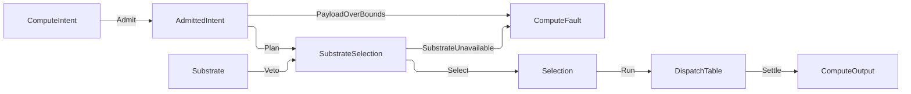

# [COMPUTE_ADMISSION]

Rasm.Compute admits every substrate-routed execution request through one `ComputeIntent` union under the spine-declared `Spec` policy record it adopts whole, routes it over one `Substrate` axis (cpu-tensor, device-wgpu, onnx, genai, remote-grpc) whose capability needs, browser exclusion, provider gates, cost ranks, payload caps, and load tie-breaks are row columns, and dispatches through generated total Switches — selection folds over row data, never an if-ladder, and every walk settles one `Selection`. Each intent's eligible chain IS its degrade order (device->cpu->remote, onnx->remote, genai->remote), so a vetoed row degrades to the next without a parallel per-row fallback successor. This owner holds the intent vocabulary, the substrate axis, the direct `ComputeFault` family on `FaultBand.Core`, and the dispatch spine.

Discipline lanes own their own typed entry folds — `Solver/contract` `Solve`, `Stats/estimator` `Fit`, `Symbolic/expression` `Compile`, `Analysis/assessment` `Assess` — never re-entering this boundary; they rejoin the package only at the `ComputeOutput` family the dispatch spine settles, the 2200-band `ComputeFault`, and the `Runtime/scheduling` `LaneRuntime`. Dispatch composes Thinktecture vocabularies, LanguageExt result types, NodaTime instants, and the settled AppHost vocabulary — `Spec`, `WorkLane`, `DeadlineClass`, and `SubscriptionPolicy` among them, each declared at the spine and reached through this package's legal upward reference; `ComputeIntent` never crosses the other way, so the platform compiles INTO this pipeline and never names the union it targets.

## [01]-[INDEX]

- [02]-[INTENT_FAMILY]: `ComputeIntent` closes the intent roster over the adopted `Spec` record and one boundary admission fold.
- [03]-[SUBSTRATE_AXIS]: five substrate rows (incl. device-wgpu GPGPU); capability needs, browser exclusion, provider gates, ranks, caps, load as columns.
- [04]-[DISPATCH_SPINE]: `ComputeFault` owns the direct `[FaultCase]` family over `FaultBand.Core`; `AssessmentInputReason` closes the analysis witness vocabulary; the ordered selection fold settles one `Selection` and `DispatchTable` runs it onto the one `ComputeOutput` family.

## [02]-[INTENT_FAMILY]

- Owner: `ComputeIntent` `[Union]` cases; `AdmittedIntent` the evidence carrier whose private constructor makes `Admit` the only mint — the admission fold lives ON the carrier, so an unadmitted intent structurally cannot reach `Plan`, `Enqueue`, or `DispatchTable.Run`, which all take `AdmittedIntent`. `Spec` is NOT declared here: the request policy a capability descriptor answers at projection declares at `Rasm.AppHost` `Agent/capability#DESCRIPTOR_AXIS` and this fold adopts it WHOLE onto the carrier — one record, one seat, so the descriptor's declared posture and the value this admission gates on can never be two shapes that agree by convention.
- Cases: TensorOp | ModelInfer | RemoteCall | UnitProject | SymbolicProject | SensorAdmit | Pipeline | Generate; the adopted `Spec` carries deadline row, lane row, allocation row, cache-policy row, payload caps, forced-substrate `Option`, progress-subscription `Option`, and one inseparable `(Allotted, Provenance)` override.
- Entry: `public static Fin<AdmittedIntent> AdmittedIntent.Admit(ComputeIntent intent, Spec spec, CorrelationId correlation, CancelScope parent, ClockPolicy clocks)` — `Fin<T>` aborts; admission runs exactly once at the boundary and interiors never re-validate; the byte and element caps are independent gates, so `Bounded` accumulates both violations through the `Validation` applicative pair before `ToFin` widens once, and a shape's axes accumulate the same way so a rank-3 request with two bad axes names both — a first-fail gate that hides the second breach is the rejected form.
- Auto: the intent digest derives from the operation symbol and payload bytes and rides every `Selection`; the admitted `CancelScope` child binds the allotted deadline so expiry rides the linked token.
- Packages: Thinktecture.Runtime.Extensions, LanguageExt.Core, NodaTime, System.IO.Hashing, Rasm (project), Rasm.AppHost (project), BCL inbox
- Growth: one intent case breaks every total Switch at compile time; a new shared policy value lands as one column on the spine's `Spec` and reaches every fold here untouched; zero new surface.
- Boundary: arity discriminates on the case payload shape — one value, a buffered span handle, or a stream handle — so name suffixes and mode flags never arise; payload spans admit at the edge into `ReadOnlyMemory<byte>` handles owned by the declared allocation row; `Budget` couples every deadline override to non-empty provenance and admission rejects non-positive durations; a pipeline shares one `Spec`, digest, deadline, scope, and correlation while `Projected` re-measures each child for substrate payload gates without minting new boundary evidence; the adopted `Spec` crosses DOWNWARD only — this owner reads its columns and never widens them, so a Compute-only policy axis is a column on a Compute shape rather than a field on the platform's request record; the intent's model field is the XxHash128 checksum, its rich identity record a model-lane concern; `Generate` carries that checksum, the prompt, and the model-lane `GenerationPolicy` (search options, guidance constraint, prompt-assembly inputs) so token streaming admits through the one fold like every intent — a separate remote generate request or a chat-client surface never arises; the boundary takes the one `ClockPolicy` record its AppHost owner declares rather than a hand-picked `(IClock, TimeProvider)` pair, because `CancelScope.Derive` reads that record and the derived deadline source, the semantic instant, and the kernel `MonotonicTimeline` — minted once off the provider at the app root — are three legs of one temporal fact that must not disagree; a raw provider mark/elapsed pair below the root is the deleted form, an admission-latency reading brackets through `ClockPolicy.Gauged` on its own `DeadlineClass` lane, and the semantic instant stays NodaTime's alone.

```csharp
[Union(ConversionFromValue = ConversionOperatorsGeneration.None)]
public abstract partial record ComputeIntent {
    private ComputeIntent() { }

    public sealed record TensorOp(TensorOpFamily Family, ReadOnlyMemory<byte> Operands, ImmutableArray<nint> Shape) : ComputeIntent;

    public sealed record ModelInfer(UInt128 Model, ReadOnlyMemory<byte> Input, ImmutableArray<nint> Shape) : ComputeIntent;

    public sealed record RemoteCall(ComputeEndpoint Endpoint, string Method, ReadOnlyMemory<byte> Payload) : ComputeIntent;

    public sealed record UnitProject(QuantityFamily Family, double Value, string Unit, string TargetUnit) : ComputeIntent;

    public sealed record SymbolicProject(SymbolicExpr Formula, Map<string, string> Dimensions, Map<string, double> Bindings, string TargetUnit) : ComputeIntent;

    public sealed record SensorAdmit(SensorReading<TwinSignal> Reading) : ComputeIntent;

    public sealed record Pipeline(Seq<ComputeIntent> Stages) : ComputeIntent;

    public sealed record Generate(UInt128 Model, string Prompt, GenerationPolicy Policy) : ComputeIntent;
}

public sealed record AdmittedIntent {
    private AdmittedIntent(
        ComputeIntent intent,
        Spec spec,
        AllocationClass allocation,
        CachePolicy cache,
        Option<Substrate> forced,
        UInt128 digest,
        long payloadBytes,
        Instant deadlineAt,
        CorrelationId correlation,
        CancelScope scope) {
        Intent = intent;
        Spec = spec;
        Allocation = allocation;
        Cache = cache;
        Forced = forced;
        Digest = digest;
        PayloadBytes = payloadBytes;
        DeadlineAt = deadlineAt;
        Correlation = correlation;
        Scope = scope;
    }

    public ComputeIntent Intent { get; }

    public Spec Spec { get; }

    public AllocationClass Allocation { get; }

    public CachePolicy Cache { get; }

    public Option<Substrate> Forced { get; }

    public UInt128 Digest { get; }

    public long PayloadBytes { get; }

    public Instant DeadlineAt { get; }

    public CorrelationId Correlation { get; }

    public CancelScope Scope { get; }


    public static Fin<AdmittedIntent> Admit(
        ComputeIntent intent,
        Spec spec,
        CorrelationId correlation,
        CancelScope parent,
        ClockPolicy clocks) =>
        from measured in Measured(intent)
        from bytes in Bounded(measured, spec)
        from allotted in Budgeted(spec)
        from allocation in Keyed<AllocationClass>(nameof(Spec.Allocation), spec.Allocation)
        from cache in Keyed<CachePolicy>(nameof(Spec.Cache), spec.Cache)
        from forced in spec.Forced.Match(
            Some: static key => Substrate.Admit().Map(Some),
            None: static () => Fin.Succ(Option<Substrate>.None))
        select new AdmittedIntent(
            intent,
            spec,
            allocation,
            cache,
            forced,
            Derived(intent),
            bytes,
            clocks.Clock.GetCurrentInstant() + allotted,
            correlation,
            parent.Derive(Segment, clocks, Some(spec.Deadline)));

    private static Fin<T> Keyed<T>(string axis, string key)
        where T : IObjectFactory<T, string, ValidationError> =>
        T.Validate(provider: null, out T? row) is null && row is { } admitted
            ? Fin.Succ(admitted)
            : Fin.Fail<T>(new ComputeFault.Violation(ComputeArea.Runtime, new ComputeViolation.Contract(ComputeContract.Rostered, new ContractEvidence.Keys(axis))));

    private static Fin<Duration> Budgeted(Spec spec) =>
        spec.Budget.Match(
            Some: budget => budget.Allotted <= Duration.Zero || string.IsNullOrWhiteSpace(budget.Provenance)
                ? Fin.Fail<Duration>(new ComputeFault.Violation(ComputeArea.Runtime, new ComputeViolation.Range(RangeRequirement.Positive, new ScalarEvidence.DurationValue(budget.Allotted))))
                : Fin.Succ(budget.Allotted < spec.Deadline.Allotted ? budget.Allotted : spec.Deadline.Allotted),
            None: () => Fin.Succ(spec.Deadline.Allotted));

    internal Fin<AdmittedIntent> Projected(ComputeIntent child) =>
        Measured(child).Map(measured => new AdmittedIntent(
            child, Spec, Allocation, Cache, Forced, Digest, measured.Bytes, DeadlineAt, Correlation, Scope));

    private static Fin<long> Bounded((long Bytes, long Elements) measured, Spec spec) =>
        (Gate(spec.ByteCap, measured.Bytes, "bytes"), Gate(spec.ElementCap, measured.Elements, "elements"))
            .Apply(static (bytes, _) => bytes).As().ToFin();

    private static K<Validation<Error>, long> Gate(Option<long> cap, long measured, string axis) =>
        cap.Match(
            Some: bound => bound < 0L
                ? Fin.Fail<long>(new ComputeFault.PayloadOverBounds($"<cap-negative:{axis}:{bound}>")).ToValidation()
                : measured > bound
                    ? Fin.Fail<long>(new ComputeFault.PayloadOverBounds($"<payload-over-cap:{axis}:{measured}:{bound}>")).ToValidation()
                    : Fin.Succ(measured).ToValidation(),
            None: () => Fin.Succ(measured).ToValidation());

    private static Fin<(long Bytes, long Elements)> Measured(ComputeIntent intent) =>
        intent.Switch(
            tensorOp: static op => Shaped(op.Operands.Length, op.Shape),
            modelInfer: static op => Shaped(op.Input.Length, op.Shape),
            remoteCall: static op => Fin.Succ(((long)op.Payload.Length, 0L)),
            unitProject: static _ => Fin.Succ((0L, 1L)),
            symbolicProject: static op => Fin.Succ((0L, (long)Math.Max(1, op.Bindings.Count))),
            generate: static op => Fin.Succ(((long)Encoding.UTF8.GetByteCount(op.Prompt), 0L)),
            sensorAdmit: static op => Fin.Succ((0L, (long)op.Reading.Data.OperatingPoint.Length + 1L)),
            pipeline: static line => line.Stages.IsEmpty
                ? Fin.Fail<(long, long)>(new ComputeFault.PayloadOverBounds("<pipeline-empty>"))
                : line.Stages.TraverseM(static child => Measured(child)).As().Bind(Summed));

    private static Fin<(long Bytes, long Elements)> Shaped(int bytes, ImmutableArray<nint> shape) =>
        toSeq(shape).Traverse(Axis).As().ToFin().Bind(axes => Counted(bytes, axes));

    private static K<Validation<Error>, long> Axis(nint dimension) =>
        dimension > 0
            ? Fin.Succ((long)dimension).ToValidation()
            : Fin.Fail<long>(new ComputeFault.PayloadOverBounds($"<shape-axis-non-positive:{dimension}>")).ToValidation();

    private static Fin<(long Bytes, long Elements)> Counted(int bytes, Seq<long> axes) =>
        Try.lift(() => Fin.Succ((
            Bytes: (long)bytes,
            Elements: axes.Fold(1L, static (product, dimension) => checked(product * dimension))))).Run().Bind(static inner => inner)
            .MapFail(static _ => new ComputeFault.PayloadOverBounds("<shape-overflow>"));

    private static Fin<(long Bytes, long Elements)> Summed(Seq<(long Bytes, long Elements)> measured) =>
        Try.lift(() => Fin.Succ(measured.Fold(
            (Bytes: 0L, Elements: 0L),
            static (sum, next) => (checked(sum.Bytes + next.Bytes), checked(sum.Elements + next.Elements))))).Run().Bind(static inner => inner)
            .MapFail(static _ => new ComputeFault.PayloadOverBounds("<pipeline-overflow>"));

    private static UInt128 Derived(ComputeIntent intent) =>
        intent.Switch(
            tensorOp: static op => ContentHash.Of(static (o, w) => w.String(o.Family.Key).Raw(o.Operands.Span)),
            modelInfer: static op => ContentHash.Of(static (o, w) => w.U128(o.Model).Raw(o.Input.Span)),
            remoteCall: static op => ContentHash.Of(static (o, w) => w.String(o.Method).Raw(o.Payload.Span)),
            unitProject: static op => ContentHash.Of(static (o, w) =>
                w.String(o.Family.Key).String(o.Unit).String(o.TargetUnit).Bits(o.Value)),
            symbolicProject: static op => ContentHash.Of(static (o, w) => w
                .U128(o.Formula.ContentKey)
                .Sorted(toSeq(o.Dimensions), static d => d.Key, StringComparer.Ordinal, static (d, x) => x.String(d.Key).String(d.Value))
                .String(o.TargetUnit)
                .Sorted(toSeq(o.Bindings), static b => b.Key, StringComparer.Ordinal, static (b, x) => x.String(b.Key).Bits(b.Value))),
            generate: static op => ContentHash.Of(static (o, w) => w.U128(o.Model).String(o.Prompt)),
            sensorAdmit: static op => ContentHash.Of(op.Reading.Data, static (d, w) => w
                .String(d.SignalId).I64(d.At.ToUnixTimeTicks()).Doubles(d.OperatingPoint.AsSpan()).Bits(d.Measured)),
            pipeline: static line => ContentHash.Of(line.Stages.Map(Derived), static (digests, w) =>
                w.Rows(digests, static (digest, x) => x.U128(digest))));
}
```

## [03]-[SUBSTRATE_AXIS]

- Owner: `Substrate` `[SmartEnum<string>]` rows under the `ComparerAccessors.StringOrdinal` accessor, each carrying the capability-need, browser-exclusion, provider-gate, rank, sheddable, and payload-cap columns its one derived `Veto` folds; `SelectionContext` resolved selection inputs; `BenchmarkRank` boot-frozen rank projection.
- Cases: cpu-tensor, device-wgpu (GPGPU compute-shader dispatch over the shared `ONE_WGPU_DEVICE`, ordered before `cpu-tensor` in the tensor-op eligible chain), onnx (one EP-parameterized row — EP variance is model-lane row data, never substrate-row twins), genai (token-streaming over the model-lane GenAI session), remote-grpc.
- Entry: `public Option<string> Veto(SelectionContext context)` — `Option<T>` carries the rejection reason, `None` admits; one derived body folds the browser-exclusion, capability-need, and provider-gate columns so the five rows share one veto and onnx/device/genai availability is the one `!Providers.Contains(Key)` shape, never five parallel delegates.
- Auto: `EffectiveRank` reads the boot-frozen `BenchmarkRank` projection, falling through to the static cost rank on a host-fingerprint mismatch; `SelectionContext.Providers` arrives boot-frozen from the host probe — the ORT probe contributes `onnx` when the runtime reports an execution provider, the device boot `device-wgpu`, the GenAI dylib probe `genai`; warm-start affinity reorders the eligible chain so a cold companion routes to the node holding the matching EP-context blob, one column picking host-vs-companion-vs-farm exactly as it picks cpu-vs-onnx, never an `if (warm)` branch; `LoadRank` is the third tie-break key (rank -> warm-affinity -> load), reading per-node load from the AppHost `PeerRoster` health so the least-loaded of rank-equal-and-warm nodes wins; `Forecast` is the duration-forecast column the composition root binds to the one query owner, `Runtime/claims#CLAIM_ROW` `HostClaims.Forecast(index, claims, row, admitted.PayloadBytes)` — band by `BenchmarkClaim.BandOf`, substrate by row key, fingerprint and recency closed inside `ModelResultIndex.Claim` — so `DeadlineVeto` answers "can this finish inside its allotment" before dispatch and an unmeetable local row degrades down the same chain every other veto rides.
- Packages: Thinktecture.Runtime.Extensions, LanguageExt.Core, Microsoft.ML.OnnxRuntime, BCL inbox
- Growth: one substrate row — key, capability need, browser exclusion, provider gate, rank, payload cap, sheddable flag — absorbs a new execution substrate; `device-wgpu` is exactly that one row (ordered before `cpu-tensor` in the tensor-op chain, sheddable, provider-gated on its `Providers` key), so the device thrust spawns no parallel device-state machine and no second `Selection` — admission, dispatch, and result read device-ness from the same `OrtResidency.DeviceResident` discriminant the CPU path uses; warm-start affinity and `LoadRank` are columns the fold already reads, so farm load-and-offload needs no `FarmRouter`; zero new surface.
- Boundary: wasm is a platform predicate column — `OperatingSystem.IsBrowser` excludes the onnx and device-wgpu rows while cpu-tensor and remote-grpc admit it, so a wasm substrate row never arises; the boot-frozen `Providers` set carries the available keys (`onnx` iff the ORT runtime reports an execution provider, `device-wgpu` iff the shared `ONE_WGPU_DEVICE` adapter resolves, `genai` iff the GenAI dylib loads), so those rows share the one `!Providers.Contains(Key)` gate and a differently-shaped set read never arises; each provider-gated row vetoes itself when its key is absent and a second health probe beside that gate is the named defect, so a device-unavailable tensor intent degrades to the CPU GEMM and a genai-unavailable token stream degrades remote — both through the same ordered `Chain` fold, the tensor chain ordering `device-wgpu` before `cpu-tensor` and the generate chain ordering `genai` before `remote-grpc` and never `cpu-tensor`, keeping the degrade total.
- Boundary: `SubstrateSelection` consumes the one per-`WorkLane` `Admission` the AppHost `LaneGuard` mints from the atomic `DegradationReading` (the `Runtime/admission ← dotnet:Rasm.AppHost` `ONE_DEGRADATION_SHED_VERDICT` boundary) — resolved once by the governor for the admitted `Spec.Lane` and carried on `SelectionContext.Shed` exactly as `DegradationLevel` rides `SelectionContext.Level`, so the boundary couples to the `Admission` = `AdmittedCase(LaneReading)` | `ShedCase(LaneReading, ShedCause)` union and the interior switches on the case and reads `Reading.Lane`/`Reading.Level`, never the `DegradationCell` it derives from (governor interior stays AppHost-side); `Sheddable` marks the local-compute rows (cpu-tensor, device-wgpu), and `SelectionContext.ShedVeto` folds the lane-shed-AND-sheddable veto into the same `Routed` composition the `Veto`/`VetoPayload` rejections ride, carrying lane, level, and the refusal's own `ShedCause` into the hop reason (`shed:{Lane}:{Level}:{Cause}`) on the `Selection` hop trail, so a shed lane degrades a sheddable device op to `remote-grpc` or, when no row admits, reuses `SubstrateUnavailable` with the full hop trail — a device-only backpressure path, a whole-op short-circuit that discards the chain evidence, a bare-`bool` projection that drops the lane/level facts, and a Compute-side re-derivation of the shed all reject, the verdict minted once at the governor and consumed here as a column, never an `if (shed)` ladder.
- Boundary: the same device descriptor gates the ONNX Runtime Mac execution-provider residency so a model-lane device tensor and a tensor-lane device kernel resolve one allocator on one physical device; substrate predicates read the retained `Faculty` set so remote health rides the AppHost degradation fold — Rhino-absent folds to `DegradationLevel.LocalOnly` and the remote row vetoes through `Faculty.RemoteCompute`; the remote payload cap composes `GrpcChannelPolicy.Canonical.MaxSendBytes`, never a re-declared literal; warm-start affinity reorders only within the rank-equal tier (a tie-breaker, never a rank override) and `LoadRank` breaks ties only beneath affinity.
- Boundary: the spine's `Spec` crosses its allocation, cache, and substrate posture as smart-enum KEYS because those three rosters are this package's, so `AdmittedIntent.Admit` is the one seat that decodes them — `Substrate.Admit` lifts the generated `TryGet` onto `Fin<Substrate>` for the forced selector and the one `Keyed<T>` helper lifts the static-abstract `IObjectFactory<T, string, ValidationError>.Validate` for the other two — and the resolved rows ride the admitted intent, so a reader taking `Spec.Allocation`/`Spec.Cache`/`Spec.Forced` as a typed value is the deleted form that re-decodes a key admission already refused.

```csharp
public sealed record BenchmarkRank(string HostFingerprint, HashMap<string, int> Ranks) {
    public Option<int> For(Substrate row, string fingerprint) =>
        string.Equals(HostFingerprint, fingerprint, StringComparison.Ordinal) ? Ranks.Find(row.Key) : None;
}

public sealed record SelectionContext(
    DegradationLevel Level,
    Admission Shed,
    FrozenSet<string> Providers,
    string Fingerprint,
    Option<BenchmarkRank> Ranks,
    FrozenSet<string> WarmAffinity,
    FrozenDictionary<string, double> Loads,
    Func<Substrate, AdmittedIntent, Option<Duration>> Forecast,
    IClock Clock) {
    public int EffectiveRank(Substrate row) => Ranks.Bind(ranks => ranks.For(row, Fingerprint)).IfNone(row.Rank);

    public int AffinityRank(Substrate row) => WarmAffinity.Contains(row.Key) ? 0 : 1;

    public double LoadRank(Substrate row) =>
        Loads.TryGetValue(row.Key, out double load) && double.IsFinite(load) && load >= 0d ? load : double.PositiveInfinity;

    public Option<string> ShedVeto(Substrate row) =>
        Shed is Admission.ShedCase refused && row.Sheddable
            ? Some($"shed:{refused.Reading.Lane}:{refused.Reading.Level.Key}:{refused.Cause.Key}")
            : None;

    public Option<string> DeadlineVeto(Substrate row, AdmittedIntent admitted) {
        Duration remaining = admitted.DeadlineAt - Clock.GetCurrentInstant();
        return remaining <= Duration.Zero
            ? Some($"deadline:expired:{remaining}")
            : Forecast(row, admitted).Filter(median => median > Duration.Zero && remaining < median)
                .Map(median => $"deadline:forecast:{median}:remaining:{remaining}");
    }
}

[SmartEnum<string>]
[KeyMemberEqualityComparer<ComparerAccessors.StringOrdinal, string>]
[KeyMemberComparer<ComparerAccessors.StringOrdinal, string>]
public sealed partial class Substrate {
    public static readonly Substrate CpuTensor = new("cpu-tensor", needs: Faculty.LocalCompute, browserExcluded: false, providerGated: false, rank: 0, payloadCap: None, sheddable: true);
    public static readonly Substrate DeviceWgpu = new("device-wgpu", needs: Faculty.LocalCompute, browserExcluded: true, providerGated: true, rank: 0, payloadCap: None, sheddable: true);
    public static readonly Substrate Onnx = new("onnx", needs: Faculty.LocalCompute, browserExcluded: true, providerGated: true, rank: 1, payloadCap: None, sheddable: false);
    public static readonly Substrate GenAi = new("genai", needs: Faculty.LocalCompute, browserExcluded: true, providerGated: true, rank: 1, payloadCap: None, sheddable: false);
    public static readonly Substrate RemoteGrpc = new("remote-grpc", needs: Faculty.RemoteCompute, browserExcluded: false, providerGated: false, rank: 2, payloadCap: Some((long)GrpcChannelPolicy.Canonical.MaxSendBytes), sheddable: false);

    public Faculty Needs { get; }

    public bool BrowserExcluded { get; }

    public bool ProviderGated { get; }

    public int Rank { get; }

    public bool Sheddable { get; }

    public Option<long> PayloadCap { get; }

    public static Fin<Substrate> Admit(string key) =>
        TryGet(out Substrate? row) && row is { } admitted
            ? Fin.Succ(admitted)
            : Fin.Fail<Substrate>(new ComputeFault.SubstrateUnavailable($"<substrate-unrostered:{key}>"));

    public Option<string> Veto(SelectionContext context) =>
        BrowserExcluded && OperatingSystem.IsBrowser() ? Some(nameof(OperatingSystem.IsBrowser))
        : !context.Level.Retains.Admits(Needs) ? Some(Needs.Key)
        : ProviderGated && !context.Providers.Contains(Key) ? Some(Key)
        : None;

    public Option<string> VetoPayload(long bytes) =>
        PayloadCap is { IsSome: true, Case: long cap } && bytes > cap ? Some($"{bytes}:{cap}") : None;
}
```

## [04]-[DISPATCH_SPINE]

- Owner: `ComputeFault` is the partial direct family on `FaultBand.Core`; every leaf declares one `[FaultCase]` ordinal. `AssessmentInputReason`, `SelectionHop`, `Selection`, `SubstrateSelection`, `ComputeOutput`, and `DispatchTable` retain their existing ownership — `ComputeOutput` is the closed result family of the intent family, one case per `ComputeIntent` case carrying that lane's own typed value.
- Cases: `Violation` replaces the generic text/shape/range/capacity family with typed evidence; the remaining runtime, symbolic, analysis, scheduling, model, ingest, and tensor leaves extend the same partial family at their raising fence.
- Law: the generated numeric `Code` is the sole case identity. No category roster, mirrored band map, string case key, or offset arithmetic exists, and `Runtime/wire#FAULT_PROJECTION` transports that numeric identity directly.
- Law: `FaultBand.Core` is 2200/30 and offsets 0..29 are contiguous; widening the family requires widening the kernel band first.
- Law: HDF5 shape and capacity refusals use `Violation` or `PayloadOverBounds`; PureHDF throws retain their original `Error`.
- Law: intent-specific eligibility owns fallback MEMBERSHIP and row policy owns ORDERING inside that closed set — the unit, symbolic, and decoded-sensor cases ride the local chain alone because shipping one measurement to a farm costs more than the fold it asks for, while the tensor, model, and generate chains open on their accelerated row and close on `remote-grpc`.
- Law: the 2216 `AssessmentInputMissing` arm carries an `AssessmentInputReason` row beside its witness detail — a caller recovers on the reason and the detail carries only the ply, route, sensor, or share the reason names, so the twenty-six free-form stems the analysis lane once spelled stop being a grammar a consumer parses.
- Law: `FaultBand.Items` is the one band authority; Compute declares no mirror.
- Entry: `public static Fin<Seq<Selection>> Plan(AdmittedIntent admitted, SelectionContext context)` — `Fin<T>` aborts; the pipeline case folds its stages sequentially with short-circuit and the stage selections share the parent correlation and digest. `DispatchTable.Run(Selection selection, AdmittedIntent admitted)` — `IO<Fin<ComputeOutput>>`, the selected substrate arm's own settled value.
- Auto: every selection walk settles one `Selection` — evaluated rows, rejection reasons, fallback hops, forced bypass, warm-affinity influence, and final route — which `DispatchTable.Run` consumes directly.
- Packages: Thinktecture.Runtime.Extensions, LanguageExt.Core, NodaTime, Rasm (project), BCL inbox
- Growth: one fault arm costs one typed leaf and one justified `[FaultCase]` ordinal after the band has capacity; one new substrate row costs one delegate field on `DispatchTable` and the generated row Switch breaks until it exists.
- Boundary: every fault case projects through the remote-lane FaultDetail wire family at the server edge, never a bare status-code-plus-string terminal; cancellation classifies in one conversion arm from `CancelScope` provenance and the deadline instant so user cancel, deadline expiry, and shutdown drain stay distinct, drain-derived scopes carrying `RuntimePhase.Draining.Key` as a provenance segment; a detected second retry owner raises `RetryOwnerConflict` on the error channel — the AppHost keyed Polly hop owns retry, stacking never occurs here; forced substrate replaces the ordered preference chain but still rides every capability, shed, payload, and deadline veto, so policy cannot bypass safety; dispatch delegates bind at composition through `DispatchTable` because execution capsules carry runtime state no static row column owns; substrate ranking chooses the execution family only — `Runtime/channels#TRANSPORT_AXIS` owns endpoint selection inside `remote-grpc`, and substrate-keyed load or affinity never claims node-level farm routing.

```csharp
public static class Refusal {
    public static Validation<Error, Unit> Unless(bool holds, ComputeArea area, ComputeViolation evidence) =>
        holds ? Success<Error, Unit>(unit) : Fail<Error, Unit>(new ComputeFault.Violation(area, evidence));
}

public readonly record struct ContractRefusal(ComputeArea Area, ComputeContract Contract) {
    public ComputeFault Fault() =>
        new ComputeFault.Violation(Area, new ComputeViolation.Contract(Contract, new ContractEvidence.None()));

    public Fin<T> Fault<T>() => Fin.Fail<T>(Fault());
}

[SmartEnum<string>]
[KeyMemberEqualityComparer<ComparerAccessors.StringOrdinal, string>]
public sealed partial class AssessmentInputReason {
    // --- [COMPOSITION]
    public static readonly AssessmentInputReason SiteAbsent           = new("site-absent");
    public static readonly AssessmentInputReason DesignDaysEmpty      = new("design-days-empty");
    public static readonly AssessmentInputReason MemberInputAbsent    = new("member-input-absent");
    public static readonly AssessmentInputReason MemberClassUnhandled = new("member-class-unhandled");
    public static readonly AssessmentInputReason CompositionShape     = new("composition-shape");
    public static readonly AssessmentInputReason CompositionEmpty     = new("composition-empty");
    public static readonly AssessmentInputReason PlyPropertyAbsent    = new("ply-property-absent");
    public static readonly AssessmentInputReason DeclaredUnitBasis    = new("declared-unit-basis");
    public static readonly AssessmentInputReason CurrencyMismatch     = new("currency-mismatch");
    public static readonly AssessmentInputReason WindowFieldAbsent    = new("window-field-absent");
    public static readonly AssessmentInputReason WindowZeroArea       = new("window-zero-area");
    // --- [ASSESSMENT]
    public static readonly AssessmentInputReason RouteUnrouted        = new("route-unrouted");
    public static readonly AssessmentInputReason SinkUnbound          = new("sink-unbound");
    public static readonly AssessmentInputReason TargetsEmpty         = new("targets-empty");
    public static readonly AssessmentInputReason CacheRatioAbsent     = new("cache-ratio-absent");
    // --- [COMMISSIONING]
    public static readonly AssessmentInputReason WindowUnbounded      = new("window-unbounded");
    public static readonly AssessmentInputReason AssessmentUnusable   = new("assessment-unusable");
    public static readonly AssessmentInputReason MeasureAbsent        = new("measure-absent");
    public static readonly AssessmentInputReason SeriesAbsent         = new("series-absent");
    public static readonly AssessmentInputReason QuantityDisagreement = new("quantity-disagreement");
    public static readonly AssessmentInputReason CoverageUnanswerable = new("coverage-unanswerable");
    public static readonly AssessmentInputReason UnderCovered         = new("under-covered");
}

[SmartEnum<string>]
[KeyMemberEqualityComparer<ComparerAccessors.StringOrdinal, string>]
[KeyMemberComparer<ComparerAccessors.StringOrdinal, string>]
public sealed partial class ComputeArea {
    public static readonly ComputeArea Analysis = new("analysis");
    public static readonly ComputeArea Model = new("model");
    public static readonly ComputeArea Runtime = new("runtime");
    public static readonly ComputeArea Solver = new("solver");
    public static readonly ComputeArea Stats = new("stats");
    public static readonly ComputeArea Symbolic = new("symbolic");
    public static readonly ComputeArea Tensor = new("tensor");
}

[SmartEnum<string>]
public sealed partial class ComputeSubject {
    public static readonly ComputeSubject Input = new("input");
    public static readonly ComputeSubject Payload = new("payload");
    public static readonly ComputeSubject Value = new("value");
    public static readonly ComputeSubject Resource = new("resource");
}

[SmartEnum<string>]
public sealed partial class ShapeRequirement {
    public static readonly ShapeRequirement Arity = new("arity");
    public static readonly ShapeRequirement Dimensions = new("dimensions");
    public static readonly ShapeRequirement Schema = new("schema");
}

[SmartEnum<string>]
public sealed partial class RangeRequirement {
    public static readonly RangeRequirement Positive = new("positive");
    public static readonly RangeRequirement WithinBounds = new("within-bounds");
}

[SmartEnum<string>]
public sealed partial class CapacityRequirement {
    public static readonly CapacityRequirement NonEmpty = new("non-empty");
    public static readonly CapacityRequirement Sufficient = new("sufficient");
    public static readonly CapacityRequirement WithinLimit = new("within-limit");
}

[SmartEnum<string>]
public sealed partial class ComputeCapability {
    public static readonly ComputeCapability Dataset = new("dataset");
    public static readonly ComputeCapability ElasticMaterial = new("elastic-material");
    public static readonly ComputeCapability EigenSystem = new("eigen-system");
    public static readonly ComputeCapability Factorization = new("factorization");
    public static readonly ComputeCapability Group = new("group");
    public static readonly ComputeCapability IterativeSolver = new("iterative-solver");
    public static readonly ComputeCapability MilpSolver = new("milp-solver");
    public static readonly ComputeCapability NeuralField = new("neural-field");
    public static readonly ComputeCapability ScalarMaterial = new("scalar-material");
    public static readonly ComputeCapability SelectorClosure = new("selector-closure");
    public static readonly ComputeCapability SparseTensor = new("sparse-tensor");
}

[SmartEnum<string>]
public sealed partial class ComputeContract {
    public static readonly ComputeContract Compatible = new("compatible");
    public static readonly ComputeContract Complete = new("complete");
    public static readonly ComputeContract Consistent = new("consistent");
    public static readonly ComputeContract Converged = new("converged");
    public static readonly ComputeContract Feasible = new("feasible");
    public static readonly ComputeContract Initialized = new("initialized");
    public static readonly ComputeContract Reachable = new("reachable");
    public static readonly ComputeContract Rostered = new("rostered");
    public static readonly ComputeContract Supported = new("supported");
    public static readonly ComputeContract Unique = new("unique");
    public static readonly ComputeContract Valid = new("valid");
    public static readonly ComputeContract Witnessed = new("witnessed");
}

[Union(ConversionFromValue = ConversionOperatorsGeneration.None)]
public abstract partial record ShapeEvidence {
    private ShapeEvidence() { }
    public sealed record Count(long Observed, long Required) : ShapeEvidence;
    public sealed record Counts(long First, long Second, long Required) : ShapeEvidence;
    public sealed record Rank(long Observed, long Required) : ShapeEvidence;
    public sealed record Alignment(long Size, long Multiple) : ShapeEvidence;
    public sealed record Key(string Observed) : ShapeEvidence;
}

[Union(ConversionFromValue = ConversionOperatorsGeneration.None)]
public abstract partial record ScalarEvidence {
    private ScalarEvidence() { }
    public sealed record Value(double Observed) : ScalarEvidence;
    public sealed record Sequence(long Count) : ScalarEvidence;
    public sealed record DurationValue(Duration Observed) : ScalarEvidence;
    public sealed record Interval(double Observed, double Minimum, double Maximum) : ScalarEvidence;
}

[Union(ConversionFromValue = ConversionOperatorsGeneration.None)]
public abstract partial record CapacityEvidence {
    private CapacityEvidence() { }
    public sealed record Count(long Observed, long Limit) : CapacityEvidence;
    public sealed record Extent(long Offset, long Count, long Limit) : CapacityEvidence;
    public sealed record Scalar(double Observed, double Limit) : CapacityEvidence;
}

[Union(ConversionFromValue = ConversionOperatorsGeneration.None)]
public abstract partial record GraphWitness {
    private GraphWitness() { }
    public sealed record Node(long Value) : GraphWitness;
}

[Union(ConversionFromValue = ConversionOperatorsGeneration.None)]
public abstract partial record ContractEvidence {
    private ContractEvidence() { }
    public sealed record None() : ContractEvidence;
    public sealed record Count(long Observed, long Required) : ContractEvidence;
    public sealed record Counts(long First, long Second, long Third) : ContractEvidence;
    public sealed record Index(long Observed, long Limit) : ContractEvidence;
    public sealed record Scalar(double Observed) : ContractEvidence;
    public sealed record Scalars(double First, double Second, double Third) : ContractEvidence;
    public sealed record Key(string Observed) : ContractEvidence;
    public sealed record Keys(string First, string Second) : ContractEvidence;
    public sealed record Type(Type Observed) : ContractEvidence;
    public sealed record Digest(UInt128 Observed) : ContractEvidence;
    public sealed record Status(int Observed) : ContractEvidence;
    public sealed record Extent(ImmutableArray<long> Observed) : ContractEvidence;
}

[Union(ConversionFromValue = ConversionOperatorsGeneration.None)]
public abstract partial record ComputeViolation {
    private ComputeViolation() { }
    public sealed partial record Required(ComputeSubject Subject) : ComputeViolation;
    public sealed partial record Shape(ShapeRequirement Requirement, ShapeEvidence Evidence) : ComputeViolation;
    public sealed partial record NonFinite(ComputeSubject Subject, ScalarEvidence Evidence) : ComputeViolation;
    public sealed partial record Range(RangeRequirement Requirement, ScalarEvidence Evidence) : ComputeViolation;
    public sealed partial record Unsupported(ComputeCapability Capability) : ComputeViolation;
    public sealed partial record Capacity(CapacityRequirement Requirement, CapacityEvidence Evidence) : ComputeViolation;
    public sealed partial record Cycle(GraphWitness Evidence) : ComputeViolation;
    public sealed partial record Contract(ComputeContract Contract, ContractEvidence Evidence) : ComputeViolation;
}

[Union(ConversionFromValue = ConversionOperatorsGeneration.None)]
public abstract partial record ComputeFault : Fault {
    private static readonly FaultBand FamilyBand = FaultBand.Core;
    private ComputeFault(string message) => Message = message;

    public sealed override string Message { get; }

    [FaultCase(0)] public sealed partial record Violation(ComputeArea Area, ComputeViolation Evidence) : ComputeFault($"{Area.Key}:{Evidence}");
    [FaultCase(1)] public sealed partial record SubstrateUnavailable(string Detail) : ComputeFault(Detail);
    [FaultCase(2)] public sealed partial record PayloadOverBounds(string Detail) : ComputeFault(Detail);
    [FaultCase(3)] public sealed partial record DeadlineExpired(string Detail) : ComputeFault(Detail);
    [FaultCase(4)] public sealed partial record Cancelled(string Detail) : ComputeFault(Detail);
    [FaultCase(5)] public sealed partial record ShutdownDrained(string Detail) : ComputeFault(Detail);
    [FaultCase(6)] public sealed partial record ExtensionAssetMissing(string Detail) : ComputeFault(Detail);
    [FaultCase(7)] public sealed partial record EndpointUnreachable(string Detail) : ComputeFault(Detail) { public override Retriability Retriability => Retriability.Transient; }
    [FaultCase(8)] public sealed partial record RetryOwnerConflict(string Detail) : ComputeFault(Detail);
    [FaultCase(9)] public sealed partial record AllocationOverClass(string Detail) : ComputeFault(Detail);
    [FaultCase(10)] public sealed partial record EquivalenceMiss(string Detail) : ComputeFault(Detail);
    [FaultCase(11)] public sealed partial record CacheCorrupt(string Detail) : ComputeFault(Detail);

    public static ComputeFault OfCancellation(CancelScope scope, Instant deadlineAt, Instant now) =>
        now >= deadlineAt ? new DeadlineExpired(scope.Path)
        : scope.Path.Contains(RuntimePhase.Draining.Key, StringComparison.Ordinal) ? new ShutdownDrained(scope.Path)
        : new Cancelled(scope.Path);
}

public readonly record struct SelectionHop(Substrate Row, Option<string> Rejection);

public sealed record Selection(
    CorrelationId Correlation,
    UInt128 Digest,
    Substrate Route,
    Seq<SelectionHop> Hops,
    Option<Substrate> Forced,
    bool WarmAffinity,
    Instant At);

public static class SubstrateSelection {
    static readonly Seq<Substrate> TensorChain = Seq(Substrate.DeviceWgpu, Substrate.CpuTensor, Substrate.RemoteGrpc);
    static readonly Seq<Substrate> ModelChain = Seq(Substrate.Onnx, Substrate.RemoteGrpc);
    static readonly Seq<Substrate> GenerateChain = Seq(Substrate.GenAi, Substrate.RemoteGrpc);
    static readonly Seq<Substrate> RemoteChain = Seq(Substrate.RemoteGrpc);
    static readonly Seq<Substrate> LocalChain = Seq(Substrate.CpuTensor);
    static readonly Seq<Substrate> NoChain = Seq<Substrate>();

    public static Seq<Substrate> Eligible(ComputeIntent intent) =>
        intent.Map(
            tensorOp: TensorChain,
            modelInfer: ModelChain,
            remoteCall: RemoteChain,
            unitProject: LocalChain,
            symbolicProject: LocalChain,
            generate: GenerateChain,
            sensorAdmit: LocalChain,
            pipeline: NoChain);

    public static Fin<Seq<Selection>> Plan(AdmittedIntent admitted, SelectionContext context) =>
        admitted.Intent is ComputeIntent.Pipeline line
            ? line.Stages.TraverseM(stage => admitted.Projected(stage).Bind(projected => Plan(projected, context))).As()
                .Map(static nested => nested.Fold(Seq<Selection>(), static (acc, stage) => acc + stage))
            : Select(admitted, context).Map(static selection => Seq(selection));

    public static Fin<Selection> Select(AdmittedIntent admitted, SelectionContext context) =>
        Routed(
            admitted,
            context,
            admitted.Forced.Map(static forced => Seq(forced)).IfNone(() => Chain(Eligible(admitted.Intent), context)),
            admitted.Forced);

    private static Seq<Substrate> Chain(Seq<Substrate> eligible, SelectionContext context) =>
        toSeq(eligible.OrderBy(context.EffectiveRank).ThenBy(context.AffinityRank).ThenBy(context.LoadRank));

    private static Fin<Selection> Routed(
        AdmittedIntent admitted,
        SelectionContext context,
        Seq<Substrate> chain,
        Option<Substrate> forced) =>
        Settled(admitted, context, forced, chain.Fold(
            (Route: Option<Substrate>.None, Hops: Seq<SelectionHop>()),
            (acc, row) => acc.Route.IsSome ? acc
                : (row.Veto(context) | context.ShedVeto(row) | row.VetoPayload(admitted.PayloadBytes) | context.DeadlineVeto(row, admitted)) is { IsSome: true, Case: string reason }
                    ? (acc.Route, acc.Hops.Add(new SelectionHop(row, Some(reason))))
                    : (Some(row), acc.Hops.Add(new SelectionHop(row, None)))));

    private static Fin<Selection> Settled(
        AdmittedIntent admitted,
        SelectionContext context,
        Option<Substrate> forced,
        (Option<Substrate> Route, Seq<SelectionHop> Hops) walked) =>
        walked.Route
            .ToFin(new ComputeFault.SubstrateUnavailable($"<substrate-chain-exhausted:{string.Join(',', walked.Hops.Map(static hop => hop.Row.Key))}>"))
            .Map(route => new Selection(
                admitted.Correlation,
                admitted.Digest,
                route,
                walked.Hops,
                forced,
                context.AffinityRank(route) == 0,
                context.Clock.GetCurrentInstant()));
}

[Union(ConversionFromValue = ConversionOperatorsGeneration.None)]
public abstract partial record ComputeOutput {
    private ComputeOutput() { }

    public sealed record Tensor(DeviceBuffer Buffer) : ComputeOutput;

    public sealed record Model(ReadOnlyMemory<byte> Value) : ComputeOutput;

    public sealed record Remote(RemoteReply Reply) : ComputeOutput;

    public sealed record Converted(double Value) : ComputeOutput;

    public sealed record Evaluated(double Value) : ComputeOutput;

    public sealed record Sensor(TwinVerdict Verdict) : ComputeOutput;

    public sealed record Pipeline(Seq<ComputeOutput> Stages) : ComputeOutput;

    public sealed record Generated(GenerationOutcome Outcome) : ComputeOutput;
}

public sealed record DispatchTable(
    Func<AdmittedIntent, IO<Fin<ComputeOutput>>> CpuTensor,
    Func<AdmittedIntent, IO<Fin<ComputeOutput>>> DeviceWgpu,
    Func<AdmittedIntent, IO<Fin<ComputeOutput>>> Onnx,
    Func<AdmittedIntent, IO<Fin<ComputeOutput>>> GenAi,
    Func<AdmittedIntent, IO<Fin<ComputeOutput>>> RemoteGrpc) {
    public IO<Fin<ComputeOutput>> Run(Selection selection, AdmittedIntent admitted) =>
        selection.Route.Switch(
            state: (Table: this, Work: admitted),
            cpuTensor: static s => s.Table.CpuTensor(s.Work),
            deviceWgpu: static s => s.Table.DeviceWgpu(s.Work),
            onnx: static s => s.Table.Onnx(s.Work),
            genAi: static s => s.Table.GenAi(s.Work),
            remoteGrpc: static s => s.Table.RemoteGrpc(s.Work));
}
```


