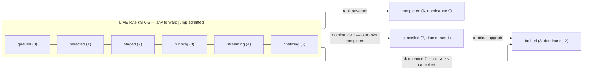

# [COMPUTE_CELL]

Rasm.Compute observation is one monotonic `ProgressPhase` family, one Atom-backed `ProgressCell` capsule committing `ProgressMark` structs under rank and terminal-dominance guards, one delivery gate applying the spine-declared `SubscriptionPolicy` cadence thresholds to consecutive marks, and one seam fold projecting the identical family onto AppUi presentation, the served progress stream, the mounted instrument set, and an aggregate parent cell. This owner holds the phase vocabulary, the cadence predicate, read-side throughput and ETA derivations, aggregate roll-up, the observation seams, and the `ProgressService.Watch` server this branch is the sole producer of.

Correlation identity, cancellation provenance, `IClock`, the scheduler marshal delegate, the mounted `InstrumentSet`, and the `PhaseSubscription` LIFO detacher composite arrive settled at composition; `SubscriptionPolicy` and its three cadence rows arrive settled from `Rasm.AppHost` `Agent/capability`, `FaultWire`/`FaultContext`/`HostWire` from `Rasm.AppHost` `Runtime/ports#WIRE_LAW`, the `ComputeInstrument` rows and their dimension slots from `Runtime/receipts#RECEIPT_UNION`, the bounded generated-message admission from `Runtime/wire#PROTO_VOCABULARY`, and the `ComparerAccessors.StringOrdinal` accessor and the `AdmittedIntent` progress option from `Runtime/admission`.

## [01]-[INDEX]

- [02]-[PHASE_FAMILY]: monotonic phase rows with rank and terminal columns; the aggregate bottleneck resolver.
- [03]-[PROGRESS_CELL]: atom-backed capsule; CAS rank guard; the `Due` cadence gate over the spine-declared policy; throughput/ETA derivation; child roll-up.
- [04]-[OBSERVATION_SEAMS]: AppUi marshal seam; instrument tap; the `ProgressWireMap` transcription and the `ProgressStream` server-stream this branch serves; sink-edge receipt law.
- [05]-[TS_PROJECTION]: the browser's `ProgressService.Watch` dial over the generated `WatchResponse` schema.

## [02]-[PHASE_FAMILY]

- Owner: `ProgressPhase` `[SmartEnum<string>]` rows under the `ComparerAccessors.StringOrdinal` accessor, carrying the monotonic rank column, the terminal column, the terminal-precedence `Dominance` column, and the `Resolve` bottleneck fold the aggregate cell reads.
- Cases: queued, selected, staged, running, streaming, finalizing, completed, cancelled, faulted.
- Law: the wire vocabulary is AUTHORED at `libs/contracts/proto/rasm/contracts/compute/progress.proto` as `ProgressPhase`, not generated off this roster, and the correspondence proves at the generated total `Map` in `[04]-[OBSERVATION_SEAMS]` — a tenth row here breaks that projection until its enum value lands at the corpus, so neither end can drift and no key roster stands between them.
- Packages: Thinktecture.Runtime.Extensions, LanguageExt.Core, BCL inbox
- Growth: one phase row with its rank and terminal column values, landing beside its `progress.proto` enum value in the same change; zero new surface.
- Boundary: rank order is the page law — the guard compares rank, never adjacency, so forward jumps are admitted; running carries the fraction field and streaming the segment count, both lane-written through `Advance` and never mutating rank; cancelled and faulted stay single terminal rows, their evidence riding the fault rail and joining observers through the correlation, never extra phase rows; the shipped `ComparerAccessors.StringOrdinal` accessor is shared with `WorkLane`/`JobState`, so a second ordinal string accessor for the phase key never arises; `Resolve` folds a child phase set to one parent by the terminal `Dominance` column — the highest-`Dominance` fault-like terminal (Faulted over Cancelled) locks the aggregate, Completed requires unanimity, an otherwise-live set falls to the least-advanced non-terminal rank — so a new fault terminal lands as one `Dominance` row untouched by prior consumers, and an aggregate never reports completed while a part runs nor a rank ahead of its slowest part.

```csharp signature
[SmartEnum<string>]
[KeyMemberEqualityComparer<ComparerAccessors.StringOrdinal, string>]
[KeyMemberComparer<ComparerAccessors.StringOrdinal, string>]
public sealed partial class ProgressPhase {
    public static readonly ProgressPhase Queued = new("queued", rank: 0, terminal: false, dominance: 0);
    public static readonly ProgressPhase Selected = new("selected", rank: 1, terminal: false, dominance: 0);
    public static readonly ProgressPhase Staged = new("staged", rank: 2, terminal: false, dominance: 0);
    public static readonly ProgressPhase Running = new("running", rank: 3, terminal: false, dominance: 0);
    public static readonly ProgressPhase Streaming = new("streaming", rank: 4, terminal: false, dominance: 0);
    public static readonly ProgressPhase Finalizing = new("finalizing", rank: 5, terminal: false, dominance: 0);
    public static readonly ProgressPhase Completed = new("completed", rank: 6, terminal: true, dominance: 0);
    public static readonly ProgressPhase Cancelled = new("cancelled", rank: 7, terminal: true, dominance: 1);
    public static readonly ProgressPhase Faulted = new("faulted", rank: 8, terminal: true, dominance: 2);

    public int Rank { get; }

    public bool Terminal { get; }

    public int Dominance { get; }

    // Three tiers of terminal precedence resolved in ONE traversal: the highest-Dominance terminal locks (Faulted
    // over Cancelled), unanimous completion answers Completed, otherwise the least-advanced live rank. The prior
    // form walked the set twice with two seeded folds; a single ordered comparator cannot replace them, because
    // unanimity is a QUANTIFIER over the whole set rather than a relation between two rows.
    public static ProgressPhase Resolve(Seq<ProgressPhase> parts) =>
        parts.IsEmpty
            ? Queued
            : parts.Fold(
                (Locked: Option<ProgressPhase>.None, Slowest: Option<ProgressPhase>.None, Unanimous: true),
                static (acc, part) => (
                    Locked: part.Dominance > 0 && acc.Locked.Map(held => part.Dominance > held.Dominance).IfNone(true) ? Some(part) : acc.Locked,
                    Slowest: !part.Terminal && acc.Slowest.Map(held => part.Rank < held.Rank).IfNone(true) ? Some(part) : acc.Slowest,
                    Unanimous: acc.Unanimous && part == Completed))
                switch {
                    (Locked: { Case: ProgressPhase locked }, _, _) => locked,
                    (_, _, Unanimous: true) => Completed,
                    (_, Slowest: { Case: ProgressPhase slowest }, _) => slowest,
                    // All terminal, none dominating, none unanimous — unreachable while every terminal row past
                    // Completed carries Dominance above zero, and the arm a Dominance-zero terminal row would open.
                    _ => Finalizing,
                };
}
```



## [03]-[PROGRESS_CELL]

- Owner: `ProgressMark` readonly record struct hot-path capsule carrying the `Rate`/`Eta` read-side derivations and the `Roll` aggregate fold; `ProgressCadence` the one `extension(SubscriptionPolicy)` member applying the spine-declared interval, fraction, and segment thresholds to a mark pair; `ProgressCell` Atom-backed boundary capsule with the `Aggregate` parent-fold factory and first typed observer failure.
- Cases: the cadence rows `SubscriptionPolicy.Immediate` | `.Interactive` | `.Wire` are the spine's, and a caller composing its own thresholds mints one more value of that same carrier rather than a policy shape here.
- Entry: `public Transition<ProgressMark> Advance(ProgressPhase phase, Option<UnitInterval> fraction = default, Option<SegmentCount> segments = default)` — the kernel transition IS the commit verdict, so `Committed` and `Refused` separate a landed advance from a refused one where an unchanged snapshot let no caller tell them apart, and `Current` projects the held mark for a caller that wants only the value; the payload is `Option`-shaped because a phase that measured nothing must not publish a zero.
- Auto: range and sign refuse at CONSTRUCTION — `UnitInterval` and `SegmentCount` carry them — so `ProgressMark.Accept` holds the two relational refusals alone, rank regression and a terminal write that is not a dominance upgrade; same-phase fractions and all segment counts rise monotonically through one `Rising` fold serving both columns, absence never overwriting a measurement, timestamps never move backward, correlation stays cell-owned, and a higher-`Dominance` terminal can replace a lower terminal under a concurrent race. Each observer gate applies the same order through `Due`; a failed observer effect stores its first `Error` in `LatestFailure` and advances the cell to `Faulted`. `Aggregate` subscribes before its initial child fold, then re-folds `Roll` on change, so no advance can fall between snapshot and registration; an empty child set returns `None` rather than minting an unrequested parent. DAG-wide aggregation rides Wire-cadence coalescing — `Runtime/scheduling#JOB_GRAPH` binds every part cell at `SubscriptionPolicy.Wire`, so a wide fan re-folds off the coalesced stream and `Immediate` re-folding never serves one. `Roll` averages the fractions of the parts that MEASURED one, unweighted, and sums their segments exactly: a part carries no cost column, so a weighted mean rests on a per-part share nothing measured — the honest aggregate reports equal parts and the phase resolver carries the truth a mean cannot, which is why `Resolve` and not the fraction decides what the parent says. A sum exceeding the 64-bit carrier reports ABSENT rather than saturating at `long.MaxValue`, because a saturated total is a fabricated count a consumer reads as measured.
- Receipt: none minted here — every mark carries the intent correlation that keys receipt evidence at the sink edge, so terminal marks join observers to evidence in one hop.
- Packages: LanguageExt.Core, NodaTime, Thinktecture.Runtime.Extensions, Rasm (project — kernel `Cell`/`Transition` the branch's ONE lock-free transition mechanism, and the `UnitInterval` atom), Rasm.AppHost (project), BCL inbox
- Growth: a new cadence row or threshold column lands at the spine's `SubscriptionPolicy` and reaches `Due` as one more clause on the one predicate; a new observed axis is one field on `ProgressMark` mirrored by one numbered `WatchResponse` field; the aggregate reuses `Subscribe`/`Advance`/`Roll` with zero new surface.
- Boundary: `ProgressCell` is the boundary capsule for subscription wiring and event registration. Its constructor is private; `Mint` is the only leaf factory and reads the admitted intent's `Spec.Progress` column — the spine-declared `Option<SubscriptionPolicy>` the capability descriptor stamped and the command algebra carried onto the intent verbatim, so a `None` row structurally has no cell for its producer to advance and no cadence is ever re-derived at dispatch — while `Aggregate` is the only parent factory. `Subscribe` accepts an effectful observer, so UI marshal and wire-write failures remain on `Fin` and terminate the cell instead of disappearing behind `ignore`. `IProgress<T>` plumbing, null checks, and consumer-side reminting never arise. `Advance` builds a candidate ONCE before the transition, because a compare-and-swap body re-runs on every contended retry and a candidate minted inside one would stamp a fresh instant per attempt. `Rate` and `Eta` derive from a mark pair and BOTH answer `Option`: no interval or no measurement on either side is absence, and a zero throughput is a measured stall riding `Some(0)` — one absence spelling across the pair, where a `0d` rate beside an `Option` ETA made an unmeasurable interval and a stalled producer indistinguishable. Producers are FOREIGN-THREAD by contract: a native search worker, a companion pump, or a lane task all publish through `Advance`, so the Atom commit IS the concurrency contract and the cell holds no affinity — `Change` then fans every subscriber on that producer's own thread, which is why each seam marshals or writes non-blockingly and never re-enters the cell. `Fail` is the ONE sanctioned re-entry, bounded by its own terminal probe: it advances to `Faulted` from inside a `Change` handler, the second pass reads the terminal phase and stops, so an observer failing under a foreign producer terminates once instead of recursing. Observer cancellation rides `CancelScope`; composite jobs reuse the identical `ProgressMark` and observation seams. `IClock` supplies the semantic stamp and kernel `MonotonicTimeline` the mark/elapsed pair a phase transition reads, both threaded directly because App-owned `ClockPolicy` never crosses into this owner.

```csharp signature
// A streamed segment total is 64-bit by wire declaration and never negative, so the width and the floor ride the
// value rather than a `Math.Max(0L, …)` clamp at every read.
[ValueObject<long>]
public readonly partial struct SegmentCount {
    static partial void ValidateFactoryArguments(ref ValidationError? validationError, ref long value) =>
        validationError = value >= 0L ? validationError : new ValidationError("<segment-count-range>");
}

// Fraction and segments are PHASE-CONDITIONAL payload, so both are `Option`-shaped: a `Queued` mark measured
// neither, and a zero in either slot is a measurement — a stalled producer reporting zero segments per second is
// a real reading and must not share a spelling with "nothing measured". The kernel `UnitInterval` carries the
// `[0, 1]` law the old finite-and-in-range guard re-proved on every commit.
public readonly record struct ProgressMark(
    ProgressPhase Phase,
    Option<UnitInterval> Fraction,
    Option<SegmentCount> Segments,
    Instant At,
    CorrelationId Correlation) {
    public int Rank => Phase.Rank;

    // Both derivations answer absence the SAME way: no interval, no measurement. A zero throughput is a measured
    // stall and rides `Some(0)`, where the prior `0d` return made an unmeasurable interval and a stalled producer
    // one value no consumer could separate.
    public Option<double> Rate(ProgressMark prior) =>
        (At - prior.At).TotalSeconds is var seconds and > 0d
            ? from now in Segments
              from before in prior.Segments
              select Math.Max(0L, now.Value - before.Value) / seconds
            : None;

    public Option<Duration> Eta(ProgressMark prior) =>
        (At - prior.At).TotalSeconds is var seconds and > 0d
            ? from now in Fraction
              from before in prior.Fraction
              where now.Value > before.Value && now.Value < 1d
              select Duration.FromSeconds((1d - now.Value) * seconds / (now.Value - before.Value))
            : None;

    // The candidate DECLINES with `None`, so the kernel transition owner answers `Refused` and the caller reads a
    // verdict rather than a mark identical to the one it already held. Rank regression and a terminal write that
    // is not a dominance upgrade are the two refusals; range and sign refuse at construction and never reach here.
    public static Option<ProgressMark> Accept(ProgressMark prior, ProgressMark next) =>
        prior.Phase.Terminal
            ? next.Phase.Terminal && next.Phase.Dominance > prior.Phase.Dominance ? Some(Merged(prior, next)) : None
            : next.Rank < prior.Rank ? None : Some(Merged(prior, next));

    // Monotone merge: fraction, segments, and the stamp all rise, completion pins the fraction whole, and the
    // correlation stays cell-owned so a foreign producer cannot re-address the cell it publishes into.
    private static ProgressMark Merged(ProgressMark prior, ProgressMark next) =>
        next with {
            Fraction = next.Phase == ProgressPhase.Completed ? Some(UnitInterval.Create(1d)) : Rising(prior.Fraction, next.Fraction, static (a, b) => a.Value >= b.Value),
            Segments = Rising(prior.Segments, next.Segments, static (a, b) => a.Value >= b.Value),
            At = next.At < prior.At ? prior.At : next.At,
            Correlation = prior.Correlation,
        };

    // Absence never overwrites a measurement and a measurement never regresses: one fold serving both columns,
    // where two hand `Math.Max` calls could disagree about which slot absorbs an unmeasured advance.
    private static Option<T> Rising<T>(Option<T> prior, Option<T> next, Func<T, T, bool> atLeast) =>
        (prior, next) switch {
            ({ Case: T held }, { Case: T candidate }) => Some(atLeast(held, candidate) ? held : candidate),
            (_, { IsSome: true }) => next,
            _ => prior,
        };

    // The parent's fraction is the UNWEIGHTED mean of the parts that measured one — a part carries no cost column,
    // so a weighted mean would rest on a share nothing measured — and its segment total is the exact sum. An
    // overflowing sum reports UNMEASURED rather than a saturated `long.MaxValue` a consumer reads as a real count.
    public static ProgressMark Roll(Seq<ProgressMark> parts, CorrelationId correlation, Instant at) =>
        parts.IsEmpty
            ? new ProgressMark(ProgressPhase.Completed, Some(UnitInterval.Create(1d)), None, at, correlation)
            : new ProgressMark(
                ProgressPhase.Resolve(parts.Map(static m => m.Phase)),
                parts.Choose(static m => m.Fraction) is { IsEmpty: false } measured
                    ? Some(UnitInterval.Create(measured.Fold(0d, static (sum, held) => sum + held.Value) / measured.Count))
                    : None,
                parts.Fold(Option<SegmentCount>.None, AddSegments),
                at,
                correlation);

    // A part that measured nothing leaves the running total alone; a total that cannot be represented in 64 bits
    // becomes absent. NAMED LOSS: absence no longer separates "no part reported segments" from "the sum exceeded
    // the carrier", and the witness is per-part — every child's own `Latest.Segments` still reads, so a consumer
    // that needs the distinction reads the parts the aggregate rolled rather than the aggregate.
    private static Option<SegmentCount> AddSegments(Option<SegmentCount> accumulated, ProgressMark mark) =>
        (accumulated, mark.Segments) switch {
            (_, { IsNone: true }) => accumulated,
            ({ IsNone: true }, var only) => only,
            ({ Case: SegmentCount held }, { Case: SegmentCount segment }) =>
                long.MaxValue - held.Value >= segment.Value ? Some(SegmentCount.Create(held.Value + segment.Value)) : None,
            _ => None,
        };
}

// The cadence THRESHOLDS declare at `Rasm.AppHost` `Agent/capability#DESCRIPTOR_AXIS`, beside the
// descriptor column that carries them, because an op declares its reporting posture where it declares itself —
// and the platform's command algebra seats that same value on the intent it compiles. The delivery PREDICATE
// lands here because it reads a `ProgressMark` pair, and `ProgressMark` is this owner's hot-path capsule that
// never crosses downward. So one value is declared once at the spine and decides exactly one thing, here: a
// second cadence record at either end would let a descriptor advertise thresholds this gate never applied.
// Only COMMITTED marks reach a subscriber — `Accept` refuses a rank regression before any `Change` fires — so the
// gate carries no rank-order clause of its own; the retired `next.Rank >= prior.Rank` head could never be false
// at this seam and read as a guard over a path the commit already closed.
public static class ProgressCadence {
    extension(SubscriptionPolicy policy) {
        public bool Due(ProgressMark prior, ProgressMark next) =>
            next.Phase.Terminal
            || next.Rank > prior.Rank
            || next.At - prior.At >= (policy.MinInterval < Duration.Zero ? Duration.Zero : policy.MinInterval)
            || Moved(next.Fraction, prior.Fraction, static (a, b) => Math.Abs(a.Value - b.Value)) >= Math.Max(0d, policy.MinFraction)
            || Moved(next.Segments, prior.Segments, static (a, b) => (double)(a.Value - b.Value)) >= Math.Max(0L, policy.MinSegments);
    }

    // A threshold over an unmeasured pair has no movement to compare, so it contributes NOTHING rather than a zero
    // delta that would read as "held still" — the same distinction the mark's own optional payload carries.
    private static double Moved<T>(Option<T> next, Option<T> prior, Func<T, T, double> delta) =>
        (from now in next from before in prior select delta(now, before)).IfNone(double.NegativeInfinity);
}

public sealed class ProgressCell {
    private readonly IClock clock;
    private readonly Atom<ProgressMark> cell;
    private readonly Atom<Option<Error>> failure;

    private ProgressCell(CorrelationId correlation, CancelScope scope, IClock clock, ProgressMark initial) {
        Correlation = correlation;
        Scope = scope;
        this.clock = clock;
        cell = Atom(initial);
        failure = Atom(Option<Error>.None);
    }

    public CorrelationId Correlation { get; }
    public CancelScope Scope { get; }
    public ProgressMark Latest => cell.Value;
    public Option<Error> LatestFailure => failure.Value;

    // Admitted progress policy is the only leaf-mint gate.
    public static Option<ProgressCell> Mint(AdmittedIntent intent, IClock clock) =>
        intent.Spec.Progress.Map(_ => new ProgressCell(
            intent.Correlation,
            intent.Scope,
            clock,
            Seeded(intent.Correlation, clock)));

    private static ProgressMark Seeded(CorrelationId correlation, IClock clock) =>
        new(ProgressPhase.Queued, None, None, clock.GetCurrentInstant(), correlation);

    // `Option` payload, never a zero default: a `Queued` or `Selected` advance measured no fraction and no segment
    // count, and a defaulted `0d`/`0L` published both as measurements the wire then carried verbatim.
    public Transition<ProgressMark> Advance(ProgressPhase phase, Option<UnitInterval> fraction = default, Option<SegmentCount> segments = default) =>
        Advance(new ProgressMark(phase, fraction, segments, clock.GetCurrentInstant(), Correlation));

    // The VERDICT rides the transition. A rejected advance and an idempotent re-advance returned byte-identical
    // marks, so a producer that just published a rank regression learned nothing; `Committed` and `Refused` are
    // the kernel transition owner's own cases and no local outcome union re-states them.
    public Transition<ProgressMark> Advance(ProgressMark next) =>
        Cell.Step(
            cell: cell,
            step: prior => ProgressMark.Accept(prior, next),
            declined: new ComputeFault.PayloadOverBounds($"<progress-regressed:{next.Phase.Key}>"));

    public PhaseSubscription Subscribe(SubscriptionPolicy policy, Func<ProgressMark, IO<Unit>> observer) {
        Atom<ProgressMark> gate = Atom(cell.Value);
        AtomChangedEvent<ProgressMark> handler = mark => Forward(gate, policy, observer, mark);
        cell.Change += handler;
        return new PhaseSubscription([() => cell.Change -= handler]);
    }

    public static Option<(ProgressCell Cell, PhaseSubscription Wiring)> Aggregate(
        CorrelationId correlation, CancelScope scope, IClock clock, Seq<ProgressCell> parts, SubscriptionPolicy cadence) {
        if (parts.IsEmpty) { return None; }

        ProgressCell parent = new(correlation, scope, clock, Seeded(correlation, clock));
        // ONE roll expression both the subscriber body and the eager seed read. Written twice verbatim, a later
        // edit to either copy forked the fold silently — the subscription would coalesce on one law and the
        // initial snapshot on another.
        Func<ProgressMark> rolled = () => ProgressMark.Roll(parts.Map(static child => child.Latest), correlation, clock.GetCurrentInstant());
        Seq<PhaseSubscription> wiring = parts.Map(part => part.Subscribe(
            cadence,
            _ => IO.lift(() => ignore(parent.Advance(rolled())))));
        // Subscribe BEFORE the seed, so no advance falls between the snapshot and the registration.
        ignore(parent.Advance(rolled()));
        return Some((parent, new PhaseSubscription(wiring.Bind(static sub => sub.Detachers))));
    }

    private Unit Forward(Atom<ProgressMark> gate, SubscriptionPolicy policy, Func<ProgressMark, IO<Unit>> observer, ProgressMark mark) =>
        gate.Value != mark && Cell.Step(gate, prior => policy.Due(prior, mark) ? Some(mark) : None, Undue) is Transition<ProgressMark>.Committed
            ? Op.Of(name: "progress.forward").Catch(() => Fin.Succ(observer(mark).Run())).Match(Succ: static _ => unit, Fail: Fail)
            : unit;

    private static readonly ComputeFault Undue = new ComputeFault.PayloadOverBounds("<progress-under-cadence>");

    // The ONE sanctioned re-entry: the failure seat is first-writer-wins on the kernel transition, and the
    // terminal probe bounds the second pass — an observer failing under a foreign producer terminates once.
    // Exemption: statement-shaped because two cells move under one decision and the terminal probe reads the
    // second, so no fold or expression spine states the pair.
    private Unit Fail(Error error) {
        ignore(Cell.Seat(failure, () => error));
        if (Latest.Phase != ProgressPhase.Faulted) { ignore(Advance(ProgressPhase.Faulted)); }
        return unit;
    }
}
```

## [04]-[OBSERVATION_SEAMS]

- Owner: `ProgressSeams` extension fold over `ProgressCell` — one member per in-process observation seam, each binding one cadence row to one observer shape; `ProgressWireMap` the ONE `[Mapper]` lowering `ProgressMark` onto the generated `WatchResponse`; `ProgressPorts` the two composition-bound legs the served endpoint reads — the correlation-to-cell resolver and the producer fault evidence; `ProgressStream` the generated `ProgressService.ProgressServiceBase` override this branch serves.
- Entry: `public PhaseSubscription Observe(UiSchedulerPort scheduler, SubscriptionPolicy cadence, Action<ProgressMark> render)` and `public PhaseSubscription Instrument(InstrumentSet set, SubscriptionPolicy cadence)` — the two members that ADD to `Subscribe`, each taking its cadence as an argument; the returned detacher composite disposes LIFO. `public override Task Watch(WatchRequest request, IServerStreamWriter<WatchResponse> responseStream, ServerCallContext context)` is the served entry, and it composes `Subscribe` at the frozen `SubscriptionPolicy.Wire` directly rather than through a seam member that would add only that argument.
- Law: the served endpoint's whole admission is `Runtime/wire#PROTO_VOCABULARY` — `ParseGuard.Validated` proves the request against the rostered descriptor set and its protovalidate rules, `HostWire.Correlation` admits the 16-byte RFC 4122 form, and the resolver answers `Option<ProgressCell>`; a correlation naming no live cell leaves through AppHost `FaultWire.Raise` on the kernel `InvalidContext` refusal, which the ONE producer status table answers as `FailedPrecondition`. No second validator, correlation parser, or status spelling exists here.
- Law: the phase correspondence is the SmartEnum's generated total `Map` — one arm per `ProgressPhase` row, so a tenth row fails this build until its value lands at `progress.proto`. Compute never reads the wire enum inbound, so this family carries the outbound half alone and no `(key, enum)` table stands between the two rosters.
- Exemption: `ProgressStream.Watch` and the two presence writes in `ProgressWireMap.ToWire` are platform-forced statement seams. gRPC hands a writer plus a completion `Task` and forbids two `WriteAsync` calls in flight, so the stream's lifetime IS the override's body; and a proto3 `optional` scalar target is a nullable-oblivious `Has*`/`Clear*` pair behind a null-rejecting setter, so an `Option`-to-nullable carrier draws RMG007 and the presence write stays a hand `IfSome`. Every decision on both seams still leaves as a value — admission is a `Fin`, the resolve an `Option`, the pump's latest mark a register read.
- Packages: Riok.Mapperly (`[Mapper]` under `RequiredMappingStrategy.Both`, `[UserMapping]`, `[MapperIgnoreSource]`, `[MapperIgnoreTarget]`, `[UseStaticMapper]`), Rasm.Contracts (project — `ProgressService`, `WatchRequest`, `WatchResponse`, `ProgressPhase`), Grpc.Core.Api (`ServerCallContext`, `IServerStreamWriter<T>`), Rasm.AppHost (project — `HostWire`, `FaultWire`, `FaultContext`, `PhaseSubscription`, `SubscriptionPolicy`), NodaTime.Serialization.Protobuf (`NodaExtensions.ToTimestamp`), LanguageExt.Core, BCL inbox
- Growth: one seam member binding a cadence row to one observer shape; one numbered `WatchResponse` field beside the `ProgressMark` column it transcribes, which `RequiredMappingStrategy.Both` then forces; zero new surface.
- Boundary: every in-process seam body runs on the PRODUCER's thread — the `Change` fan is synchronous, so a native solver worker, a companion pump, or a lane task carries each observer to completion before its own `Advance` returns; AppUi presentation therefore marshals through the port delegate so no Compute type touches a UI thread, `Instrument` writes through thread-safe meter handles, and a seam that blocks or fans out is the deleted form the `docs/stacks/csharp/boundaries#HANDOFF_DRAIN` law owns. `ProgressStream` obeys that law rather than excepting itself: the subscription SEATS the latest mark in a register, releases a re-armed completion gate, and returns, while the override's own pump reads the register and owns every `WriteAsync` — so no producer thread ever blocks on a socket, no two writes overlap on one writer, and the cell is never re-entered. That register is the correct carrier because the wire consumer is a latest-value reader: the phase ladder is monotone and each column rises, so a mark superseded before the pump reached it carries nothing the successor does not. NAMED LOSS: intermediate marks coalesce onto the newest under a slow peer, and the witness is the terminal guarantee — a terminal mark is always the newest, so the stream's final frame is the verdict and never a stale one. Every seam returns `IO<Unit>` into `ProgressCell.Subscribe`; a readback consumer polling `Latest` for a terminal mark composes its own cadence as one more `SubscriptionPolicy` value on the spine's carrier — cadence growth is a spine row, never a seam member here, and the in-flight ceiling it reads against is `Runtime/scheduling#SOLVE_GUARD`-owned. The stream ends on the terminal mark or on `ServerCallContext.CancellationToken`, and an intent whose own `CancelScope` cancels reaches a `Cancelled` terminal that ends it through the same door, so no token linking is composed. Aggregate parents use these identical seams because their rolled value is a `ProgressMark`. Receipts materialize only at the sink edge. `Instrument` writes the two `rasm.compute.progress.*` rows through the `Runtime/receipts#RECEIPT_UNION` mounted `InstrumentSet` — `ComputeInstrument.ProgressMarks` per delivered mark, `ComputeInstrument.ProgressCadence` per consecutive-mark interval, both tagged on `ComputeInstrument.PhaseSlot` — so progress telemetry is one more subscriber under the identical cadence gate and the cell never touches a meter; the prior-mark register reads before it swaps and advances only once both writes land, so no instrument write runs inside the CAS body and a refused row never becomes observable history, and the writer returns the kernel rail so that refusal raises on the subscription's own error channel rather than vanishing at the seam.

```csharp signature
using ProgressPhaseWire = Rasm.Contracts.Compute.ProgressPhase;
using ProgressService = Rasm.Contracts.Compute.ProgressService;
using WatchRequest = Rasm.Contracts.Compute.WatchRequest;
using WatchResponse = Rasm.Contracts.Compute.WatchResponse;

// --- [SERVICES] ---------------------------------------------------------------------------
// The served endpoint holds NO registry: the composing root already owns the live intent map and the one HLC mint
// the fault evidence stamps, so both arrive as legs. A cell registry declared here would be a second seat for a
// correspondence `Runtime/scheduling#JOB_GRAPH` already keeps.
public sealed record ProgressPorts(
    Func<CorrelationId, Option<ProgressCell>> Resolve,
    Func<FaultContext> Evidence);

// --- [OPERATIONS] -------------------------------------------------------------------------
// A seam member earns its name by ADDING something to `Subscribe`: the UI arm adds the marshal, the instrument
// arm adds the write register. A wire arm added only a frozen cadence argument, so the served endpoint spells
// `cell.Subscribe(SubscriptionPolicy.Wire, seat)` — one hop, and the cadence reads at the call site instead of
// hiding inside a rename. Both survivors take their cadence as an argument, so the arity disagreement that let
// two members freeze a row while a third took one is gone.
public static class ProgressSeams {
    extension(ProgressCell cell) {
        public PhaseSubscription Observe(UiSchedulerPort scheduler, SubscriptionPolicy cadence, Action<ProgressMark> render) =>
            cell.Subscribe(cadence, mark => scheduler.Marshal(() => render(mark)));

        public PhaseSubscription Instrument(InstrumentSet set, SubscriptionPolicy cadence) {
            Atom<Option<ProgressMark>> prior = Atom(Option<ProgressMark>.None);
            return cell.Subscribe(cadence, mark => IO.lift(() => Written(set, prior, mark)));
        }
    }

    // Instrument name and dimension slot are the `Runtime/receipts` owner's consts, and `InstrumentSet.Tags` mints
    // exactly the `TagList` its own `in TagList` write overload consumes, so declared row, writer, and
    // materialization owner stay one vocabulary; `Advance` requires a phase on every mark, so this axis carries no
    // absence arm and never omits its dimension. Cadence needs a predecessor, so the FIRST mark this subscription
    // observes records none — the register carries the subscription's own history and no phase flip resets it.
    // Returning the kernel rail binds `IO.lift`'s railed overload at the subscribe seam above, so a refused
    // write raises on the subscription's error channel instead of dying one frame short of it. The predecessor
    // advances on the SUCCESS path alone and outside the CAS body, so a refused pair leaves the register on the
    // last mark that actually recorded and the next interval spans the real gap instead of dropping it.
    static Fin<Unit> Written(InstrumentSet set, Atom<Option<ProgressMark>> prior, ProgressMark mark) {
        Option<ProgressMark> held = prior.Value;
        TagList phase = InstrumentSet.Tags((ComputeInstrument.PhaseSlot, mark.Phase.Key));
        return set.Write(ComputeInstrument.ProgressMarks.Row, 1L, phase)
            .Bind(_ => held.Match(
                Some: previous => set.Write(ComputeInstrument.ProgressCadence.Row, (mark.At - previous.At).TotalSeconds, phase),
                None: () => Fin.Succ(unit)))
            .Map(_ => ignore(prior.Swap(_ => Some(mark))));
    }
}

// --- [BOUNDARIES] -------------------------------------------------------------------------
// `RequiredMappingStrategy.Both` makes the mirror COMPILER-HELD on every column Mapperly can carry: a capsule
// field with no wire member and a wire member with no capsule field each fail this build. The two `optional`
// scalars are the columns it cannot carry — a proto3 `optional` scalar target is a nullable-oblivious presence
// pair behind a null-rejecting setter, so the shell names both sides in its ignore rosters and writes presence by
// hand. The mapping stays READER-FREE, which is what keeps that source-side roster compiler-proved inventory
// rather than an authored list (`libs/dotnet/.api/api-mapperly.md`).
[Mapper(RequiredMappingStrategy = RequiredMappingStrategy.Both)]
[UseStaticMapper(typeof(NodaExtensions))]
[UseStaticMapper(typeof(HostWire))]
public static partial class ProgressWireMap {
    [UserMapping(Default = true)]
    public static WatchResponse ToWire(ProgressMark mark) {
        WatchResponse wire = Projected(mark);
        mark.Fraction.Iter(fraction => wire.Fraction = fraction.Value);
        // `SegmentCount` refuses a negative at construction, so the widening to the wire's `uint64` is total.
        mark.Segments.Iter(segments => wire.Segments = (ulong)segments.Value);
        return wire;
    }

    // `Rank` derives from `Phase` and does not cross, so it is named here rather than mirrored as a column a peer
    // could publish contradicting its own phase row.
    [MapperIgnoreSource(nameof(ProgressMark.Rank))]
    [MapperIgnoreSource(nameof(ProgressMark.Fraction))]
    [MapperIgnoreSource(nameof(ProgressMark.Segments))]
    [MapperIgnoreTarget(nameof(WatchResponse.Fraction))]
    [MapperIgnoreTarget(nameof(WatchResponse.Segments))]
    private static partial WatchResponse Projected(ProgressMark mark);

    // The row's GENERATED total projection is the whole correspondence: one arm per row, discovered by Mapperly on
    // the unique `ProgressPhase` → `ProgressPhaseWire` pair, so a tenth row breaks HERE until its enum value lands
    // at `progress.proto`. `At` crosses through the registered `NodaExtensions.ToTimestamp` and `Correlation`
    // through the registered `HostWire.Correlation`, so neither column carries a per-member configuration.
    [UserMapping]
    private static ProgressPhaseWire Phase(ProgressPhase row) => row.Map(
        queued: ProgressPhaseWire.Queued,
        selected: ProgressPhaseWire.Selected,
        staged: ProgressPhaseWire.Staged,
        running: ProgressPhaseWire.Running,
        streaming: ProgressPhaseWire.Streaming,
        finalizing: ProgressPhaseWire.Finalizing,
        completed: ProgressPhaseWire.Completed,
        cancelled: ProgressPhaseWire.Cancelled,
        faulted: ProgressPhaseWire.Faulted);
}

// --- [ENTRY] ------------------------------------------------------------------------------
// The one Compute-served endpoint. The app root maps it beside `Rasm.AppHost/Wire/companion#CONTROL_SERVICE`
// `ControlServiceImpl` and binds both legs; the peer client is `typescript:core/interchange/invoke#PROGRESS_WATCH`.
public sealed class ProgressStream(ProgressPorts ports) : ProgressService.ProgressServiceBase {
    public override Task Watch(WatchRequest request, IServerStreamWriter<WatchResponse> responseStream, ServerCallContext context) =>
        Admit(request, Op.Of(context.Method)).Match(
            Succ: cell => Pump(cell, responseStream, context.CancellationToken),
            Fail: error => throw FaultWire.Raise(error, ports.Evidence()));

    // Three refusals on ONE rail: an unrostered or rule-breaking message, a correlation that is not the 16-byte
    // RFC 4122 form, and a correlation naming no live cell. The producer status table carries no `NotFound` arm,
    // so the third answers the kernel `InvalidContext` — a watched intent whose cell has been released is a
    // live-state gate, and the peer reads `FailedPrecondition` with the detail the one fault wire packed.
    private Fin<ProgressCell> Admit(WatchRequest request, Op key) =>
        from message in ParseGuard.Validated(request)
        from correlation in HostWire.Correlation(message.Correlation, key)
        from cell in ports.Resolve(correlation).ToFin(Fail: key.InvalidContext())
        select cell;

    // The gate re-arms BEFORE the register is read, so a mark landing in that window completes the gate the pump
    // is about to await rather than being lost between the two reads; the equality test then absorbs the one
    // redundant pass that ordering buys. A terminal mark is written and ENDS the stream, because the phase family
    // admits no advance past a dominance upgrade the peer would still be waiting on.
    private static async Task Pump(ProgressCell cell, IServerStreamWriter<WatchResponse> writer, CancellationToken token) {
        Atom<ProgressMark> register = Atom(cell.Latest);
        Atom<TaskCompletionSource> gate = Atom(Armed());
        using PhaseSubscription subscription = cell.Subscribe(
            SubscriptionPolicy.Wire,
            mark => IO.lift(() => Seat(register, gate, mark)));

        Option<ProgressMark> written = None;
        while (true) {
            Task next = gate.Swap(static _ => Armed()).Task;
            ProgressMark mark = register.Value;
            if (written != Some(mark)) {
                await writer.WriteAsync(ProgressWireMap.ToWire(mark), token).ConfigureAwait(false);
                if (mark.Phase.Terminal) { return; }
                written = Some(mark);
            }

            await next.WaitAsync(token).ConfigureAwait(false);
        }
    }

    // Submit-and-return on the producer's own thread: seat the latest mark, release the pump, touch neither the
    // socket nor the cell. `RunContinuationsAsynchronously` keeps the pump's continuation off that thread, which
    // is the whole point of the hand-off — without it the awaiting write would resume inline on the solver worker.
    private static Unit Seat(Atom<ProgressMark> register, Atom<TaskCompletionSource> gate, ProgressMark mark) {
        ignore(register.Swap(_ => mark));
        return ignore(gate.Value.TrySetResult());
    }

    private static TaskCompletionSource Armed() => new(TaskCreationOptions.RunContinuationsAsynchronously);
}
```

## [05]-[TS_PROJECTION]

- Law: the browser dials `ProgressService.Watch` at `typescript:core/interchange/invoke#PROGRESS_WATCH` and reads the generated `WatchResponseSchema` over the connect-es server-stream for-await; this page mints no TS interface, alias, or key roster. `phase` crosses as the generated `ProgressPhase` enum — nine members mirroring the `[02]-[PHASE_FAMILY]` rows, and a row added at that owner lands its enum value at `progress.proto` in the same change because the `Map` arm in `[04]-[OBSERVATION_SEAMS]` breaks the build until it does.
- Boundary: `fraction` and `segments` cross OPTIONAL so an unmeasured phase publishes absence rather than a zero a chart reads as a stall; `at` crosses as `google.protobuf.Timestamp` and `correlation` as the 16-byte RFC 4122 form the request echoed; `rank` does NOT cross, because it derives from the phase row through the vocabulary both ends generate and a denormalized column can contradict the key beside it. Aggregate marks cross the identical message, since a rolled value IS a `ProgressMark`. Consumer cadence stays observer-side policy, while throughput and ETA derive from consecutive frames.

```proto signature
// Transcribed verbatim from `libs/contracts/proto/rasm/contracts/compute/progress.proto`; the rules are the
// corpus source's own and a hand mirror of them here forks what it transcribes.
message WatchResponse {
  ProgressPhase phase = 1 [(buf.validate.field).enum = {
    defined_only: true
    not_in: [0]
  }];
  optional double fraction = 2 [(buf.validate.field).double = {
    gte: 0
    lte: 1
  }];
  optional uint64 segments = 3;
  google.protobuf.Timestamp at = 4 [(buf.validate.field).required = true];
  bytes correlation = 5 [(buf.validate.field).bytes.len = 16];
}
```

## [06]-[RESEARCH]

<!-- source-only: research row template:
[TOKEN]-[OPEN|BLOCKED]: <exact question>; <verification route>.
-->

(none)
