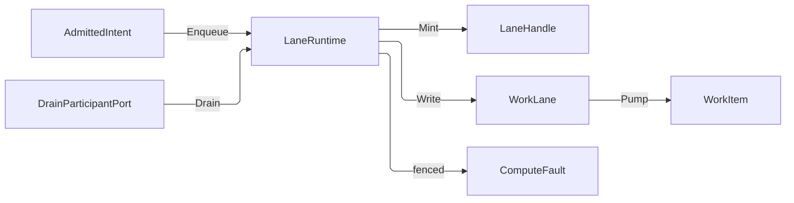
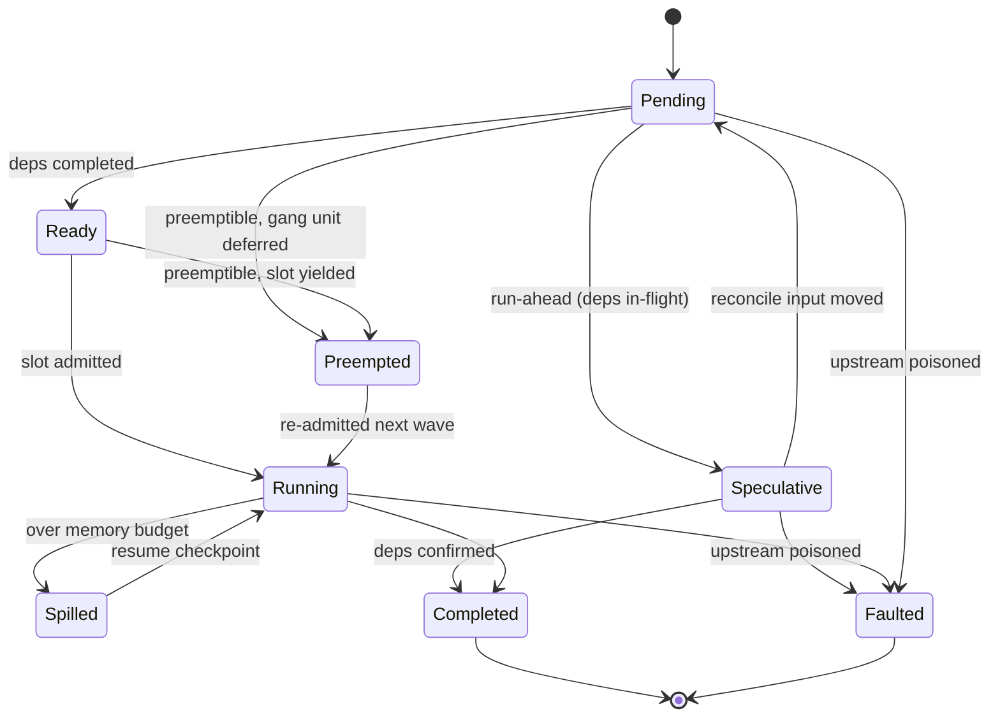

# [COMPUTE_RUNTIME]

Rasm.Compute schedules every admitted intent through bounded `WorkLane` channel rows behind one `LaneRuntime` enqueue capsule: lane choice is an intent field, full-mode and backpressure are row data, drops emit a correlated `Backpressure` receipt, queue depth reads `ChannelReader.Count`, and solve-path dispatch structurally returns a `LaneHandle` instead of executing work.

One `JobGraph` dependency-DAG scheduler layers speculative, preemptible, fair-share, accelerator-affinity, and spill-to-store orchestration bounded by the shared `CpuBudget`, keys every node on its admitted-intent and input-content digest so a re-run reconciles semantic changes and recomputes only the moved subgraph, and rolls subscribed node cells into one live parent `ProgressCell`.

Clusters own the `WorkLane` axis, the work-item and handle shapes, the GH2 async-result ceiling, the `CpuBudget` record shared by lane, model, and tensor concurrency, and band-200 drain participation, composed over bounded System.Threading.Channels pipes, Thinktecture vocabulary, LanguageExt rails, NodaTime instants, and the AppHost drain, cancellation, clock, and schedule spine.

## [01]-[INDEX]

- [02]-[LANE_AXIS]: channel rows over one closed `LaneBound` family; parked, shedding, and ranked bounds as row data.
- [03]-[SOLVE_GUARD]: one enqueue capsule; solve threads receive handles, never execute work.
- [04]-[CPU_BUDGET]: one processor-budget record shared by lane, model, tensor, and optimizer concurrency; utilization-governed re-resolution at collection cadence.
- [05]-[JOB_GRAPH]: batch-wave dependency scheduler; speculative run-ahead, QoS-weighted fair-share and gang admission, per-wave accelerator claims, cooperative spill, content-key reactive reconcile, rolled-up live DAG progress aggregate, and the shard-partition fold placing a block-decomposed solve across the remote farm.
- [06]-[DRAIN_CANCEL]: band-200 drain participation; one linked cancellation chain with provenance.

## [02]-[LANE_AXIS]

- Owner: `LaneBound` the closed parked/shedding/ranked channel-bound family; `LossClass` the two-row disjoint drop vocabulary the shedding arm derives off its own full-mode; `LanePressure` the closed parked-versus-dropped write-evidence family; `LaneProfile` the per-lane row carrying that bound beside the reader fan-out a `CpuBudget` affords and the continuation-inlining column; `LaneProfiles` the frozen `HashMap<WorkLane, LaneProfile>` keyed on the spine's lane roster with `Closed` its composition-time totality proof; `LaneHandle` readback handle; `WorkItem` channel element carrying the lane-monotone arrival ordinal. `WorkLane` itself — identity, `Rank`, and the generated `Validate`/`TryGet` key seam — declares at `Rasm.AppHost` `Runtime/laneguard#LANE_GUARD` and reaches this owner through the package's legal upward reference to that spine, so the roster and its cross-lane precedence are app-platform dispatch vocabulary while only the columns this domain measures live here.
- Cases: one `LaneProfile` per spine lane row — interactive, ranked, background, bulk, benchmark, capture-ingest.
- Entry: `public static Fin<HashMap<WorkLane, LaneProfile>> LaneProfiles.Closed()` — the keyed fold over `WorkLane.Items` proving every declared lane carries a profile, and the value `LaneRuntime` takes; `public Channel<WorkItem> LaneProfile.Open(CpuBudget budget, Action<WorkItem, LossClass> dropped)` — the ONE construction, a total `Switch` over the row's `LaneBound` building a parked, a shedding, or a rank-ordered channel, the shedding arm closing over its own derived `Loss` so no caller decides a loss class; `Bounded`/`Prioritized` are its private per-arm projections. Capacity, drop policy, loss class, admission ceiling, comparer, reader fan-out, and continuation inlining are row data, never call-site arguments.
- Auto: cadence-driven work (compute-model-warmup, scheduled equivalence sweeps) enters as `ScheduleEntry` rows whose `Work` delegate enqueues onto its declared lane — the schedule port owns when, lanes own throughput; the shedding arm alone receives the drop sink so every drop lands as a `Backpressure` receipt carrying the dropped item's correlation under the row's derived `LossClass`, never a silent loss and never a merged tally; the queue-depth slot reads `ChannelReader<WorkItem>.Count` behind the reader's own `CanCount` capability probe, so a reader that publishes no count answers absence instead of a fabricated zero, and never a hand-tracked counter; a parked write times through `WaitToWriteAsync`, which returns when capacity frees, so the park is measured exactly against the kernel `MonotonicTimeline` and a lane deadline cancels the WAIT rather than aborting a write already in flight.
- Receipt: Backpressure — lane row, queue depth from `ChannelReader.Count` read only where `CanCount` admits it, and the `LanePressure` case the write produced: `Parked` carrying the wait measured across `WaitToWriteAsync` alone (timing `WriteAsync` conflates the park with the write and leaves cancellation no seam), or `Dropped` carrying the dropped item's correlation beside the row's own `LossClass` — materialized at the sink edge on the package receipt union; a ranked row's ceiling refusal never reaches this receipt because it precedes execution, riding the typed `ComputeFault.LaneSaturated` onto `Refusal.Of` instead.
- Packages: BCL inbox, Thinktecture.Runtime.Extensions, LanguageExt.Core, NodaTime, Rasm.AppHost (project)
- Growth: a new lane is one row at the spine roster and one `LaneProfile` row here — the keyed fold refuses the composition until both land, the loud break a silently-unsized lane never gives; a genuinely new bound mechanism is one `LaneBound` case with its `Open` arm, and every consumer breaks loudly at that `Switch`; a new drop semantics is one `LossClass` row the `Of` fold seats off the primitive's own full-mode; a new write-evidence shape is one `LanePressure` case; zero new surface.
- Boundary: the `WorkLane` name is the spine's and `DrainQueue` stays its process-level altitude. The platform decides which lanes exist and their cross-lane rank; this owner decides each lane's channel bound and reader budget against the shared `CpuBudget`. Capture-ingest drops oldest because the latest geometry state wins. Ranked work orders by admitted `DeadlineAt` with write-time `Sequence` as the equal-deadline tiebreak. An external lane selector admits through the generated `WorkLane.Validate`/`TryGet` seam, never a raw-string comparison.

```csharp
// --- [TYPES] ---------------------------------------------------------------------------

[SmartEnum<string>]
[KeyMemberEqualityComparer<ComparerAccessors.StringOrdinal, string>]
[KeyMemberComparer<ComparerAccessors.StringOrdinal, string>]
public sealed partial class LossClass {
    public static readonly LossClass Evicted = new("evicted");
    public static readonly LossClass Refused = new("refused");

    public static LossClass Of(BoundedChannelFullMode mode) =>
        mode is BoundedChannelFullMode.DropOldest or BoundedChannelFullMode.DropNewest ? Evicted : Refused;
}

[Union(ConversionFromValue = ConversionOperatorsGeneration.None)]
public abstract partial record LaneBound {
    private LaneBound() { }

    public sealed record Parked(int Capacity) : LaneBound;

    public sealed record Shedding(int Capacity, BoundedChannelFullMode Mode) : LaneBound {
        public LossClass Loss => LossClass.Of(Mode);
    }

    public sealed record Ranked(int Ceiling) : LaneBound;
}

[Union(ConversionFromValue = ConversionOperatorsGeneration.None)]
public abstract partial record LanePressure {
    private LanePressure() { }
    public sealed record Parked(Duration Waited) : LanePressure;
    public sealed record Dropped(LossClass Loss) : LanePressure;
}

// --- [MODELS] --------------------------------------------------------------------------

public readonly record struct LaneHandle(CorrelationId Correlation, WorkLane Lane, CancelScope Cancel);

public readonly record struct WorkItem(AdmittedIntent Intent, LaneHandle Handle, long Sequence);

public sealed record LaneProfile(LaneBound Bound, Func<CpuBudget, int> Fanout, bool InlineContinuations = false) {
    public Option<int> Ceiling => Bound.Switch(
        state: unit,
        parked: static (_, _) => Option<int>.None,
        shedding: static (_, _) => Option<int>.None,
        ranked: static (_, row) => Some(row.Ceiling));

    public int Readers(CpuBudget budget) => Math.Min(Fanout(budget), budget.ReaderCeiling);

    public LaneChannel<WorkItem> Spec(CpuBudget budget, Action<WorkItem, LossClass> dropped) =>
        new(Readers(budget), InlineContinuations, dropped, Some(Deadline));

    private static readonly IComparer<WorkItem> Deadline = Comparer<WorkItem>.Create(static (left, right) =>
        left.Intent.DeadlineAt.CompareTo(right.Intent.DeadlineAt) switch {
            0 => left.Sequence.CompareTo(right.Sequence),
            int ordered => ordered,
        });

    public Fin<Channel<WorkItem>> Open(CpuBudget budget, Action<WorkItem, LossClass> dropped) =>
        Bound.Open(Spec(budget, dropped));
}

public sealed record LaneChannel<T>(int Readers, bool InlineContinuations, Action<T, LossClass> Dropped, Option<IComparer<T>> Rank);

public static class LaneChannels {
    extension(LaneBound bound) {
        public Fin<Channel<T>> Open<T>(LaneChannel<T> spec) =>
            bound.Switch(
                state: spec,
                parked: static (s, row) => Fin.Succ(Channel.CreateBounded<T>(Bounded(row.Capacity, BoundedChannelFullMode.Wait, s))),
                shedding: static (s, row) => Fin.Succ(Channel.CreateBounded(Bounded(row.Capacity, row.Mode, s), item => s.Dropped(item, row.Loss))),
                ranked: static (s, row) => s.Rank.Match(
                    Some: order => Fin.Succ(Channel.CreateUnboundedPrioritized(new UnboundedPrioritizedChannelOptions<T> {
                        Comparer = order,
                        SingleReader = s.Readers is 1,
                        SingleWriter = false,
                        AllowSynchronousContinuations = s.InlineContinuations,
                    })),
                    None: () => Fin.Fail<Channel<T>>(new ComputeFault.LaneUnprofiled($"<lane-unranked:{row.Ceiling}>"))));
    }

    private static BoundedChannelOptions Bounded<T>(int capacity, BoundedChannelFullMode mode, LaneChannel<T> spec) => new(capacity) {
        FullMode = mode,
        SingleReader = spec.Readers is 1,
        SingleWriter = false,
        AllowSynchronousContinuations = spec.InlineContinuations,
    };
}

public static class LaneProfiles {
    private static readonly Func<CpuBudget, int> Serial = static _ => 1;

    private static readonly HashMap<WorkLane, LaneProfile> Rows = toHashMap(Seq(
        (WorkLane.Interactive, new LaneProfile(new LaneBound.Parked(16), Serial, InlineContinuations: true)),
        (WorkLane.Ranked, new LaneProfile(new LaneBound.Ranked(256), Serial)),
        (WorkLane.Background, new LaneProfile(new LaneBound.Parked(256), static budget => budget.ReaderCeiling)),
        (WorkLane.Bulk, new LaneProfile(new LaneBound.Shedding(1024, BoundedChannelFullMode.DropWrite), Serial)),
        (WorkLane.Benchmark, new LaneProfile(new LaneBound.Parked(4), Serial)),
        (WorkLane.CaptureIngest, new LaneProfile(new LaneBound.Shedding(256, BoundedChannelFullMode.DropOldest), Serial))));

    public static Fin<HashMap<WorkLane, LaneProfile>> Closed() =>
        toSeq(WorkLane.Items).Filter(row => Rows.Find(row).IsNone) is { IsEmpty: false } absent
            ? Fin.Fail<HashMap<WorkLane, LaneProfile>>(new ComputeFault.LaneUnprofiled($"<lane-unprofiled:{absent.Count}>{string.Join(',', absent.Map(static row => row.Key))}"))
            : Fin.Succ(Rows);

    public static Fin<HashMap<WorkLane, Channel<WorkItem>>> Opened(
        HashMap<WorkLane, LaneProfile> profiles, CpuBudget budget, Action<WorkLane, WorkItem, LanePressure> pressure) =>
        toSeq(profiles.AsIterable())
            .Traverse(row => row.Value
                .Open(budget, (item, loss) => pressure(row.Key, item, new LanePressure.Dropped(loss)))
                .Map(channel => (row.Key, Channel: channel)))
            .As()
            .Map(static opened => toHashMap(opened));
}
```

## [03]-[SOLVE_GUARD]

- Owner: `LaneRuntime` — the one enqueue capsule over the bounded lane channels, the `LaneGate` admission-lifecycle family, and the guard-bracketed pump readers; `LaneGate` is the closed open-versus-fenced `[Union]` whose `Fenced` case carries provenance and the fence instant, so a refused enqueue names which drain fenced it and a boolean lifecycle flag never arises.
- Entry: `public IO<LaneHandle> Enqueue(AdmittedIntent intent)` — `IO` carries the enqueue effect, awaits fullness on Wait rows, and aborts fenced admission with `ComputeFault.ShutdownDrained` carrying the gate's `Fenced` provenance; the gate read runs inside the effect, so an enqueue composed before the fence and run after it still refuses. `public Transition<LaneGate> Fence(string provenance)` — first-fence-wins under the kernel `Cell.Step`, the verdict riding the returned transition so a losing drain reads `Refused` beside the provenance that held. `public Option<int> Depth(WorkLane lane)` — the queue-depth read behind the reader's own `CanCount` probe. `public static Fin<HashMap<WorkLane, Channel<WorkItem>>> LaneProfiles.Opened(HashMap<WorkLane, LaneProfile>, CpuBudget, Action<WorkLane, WorkItem, LanePressure>)` — channel construction on the rail at composition, so `LaneRuntime` takes a set already proven open.
- Auto: composition proves the profile map through `LaneProfiles.Closed`, OPENS every lane channel on the same rail through `LaneProfiles.Opened`, and proves the lane pipelines through `LaneGuard.Proven` before it constructs the runtime, then forks `LaneProfile.Readers`-many `Pump` effects per lane beneath the spine scope; every pumped item executes inside `LaneGuard.Run`, so the spine's per-lane bulkhead, breaker, allotment deadline, re-drive, and chaos block bracket the one in-process solve-path executor rather than standing declared with nothing under them; dispatch from GH2 and UI threads structurally enqueues and returns the handle — synchronous model or remote execution on a solve path is unrepresentable by this seam, not by discipline.
- Receipt: wait evidence rides the pressure delegate as `LanePressure.Parked` only when the write parks; a synchronously completed write emits nothing, keeping the uncontended path allocation-free, and a shedding drop arrives as `LanePressure.Dropped` carrying its row's own loss class.
- Packages: BCL inbox, LanguageExt.Core, NodaTime, Rasm (project — kernel `Cell`/`Transition`, `MonotonicTimeline`, `Op`), Rasm.AppHost (project — `LaneGuard`, `ClockPolicy`, `CancelScope`)
- Growth: one lane row reuses the same enqueue, write, and pump members; zero new surface.
- Boundary: `LaneRuntime` is the named boundary capsule for the statement carve-out — channel construction, the parked-write window, and the pump loop carry language-owned statement forms; no blocking wait exists on the public surface and completion is observed only through progress states and receipts — handle to correlation to receipt join is the readback, and the GH2 async-result ceiling is the `Interactive` lane capacity of sixteen in-flight handles a GH2 `SolveInstance` readback never exceeds because the seventeenth `Enqueue` parks on the `Wait` full-mode rather than dropping a solve result; the dispatch delegate is total on the fault rail, so the pump never interprets failures. The fence is a kernel `Cell.Step` returning its own `Transition`, so a second drain reads `Refused` beside the standing provenance instead of the success every contender reads off a bare swap. `ClockPolicy` arrives WHOLE rather than as a semantic clock beside a raw provider: `CancelScope.Derive` binds the policy, and its `Line` is the one `MonotonicTimeline` the app root minted, so a park span here orders against every other measured crossing in the process — a second timeline below the root, a `Stopwatch`, or a raw `GetTimestamp`/`GetElapsedTime` pair are the kernel-deleted forms.

```csharp
// --- [TYPES] ---------------------------------------------------------------------------

[Union(ConversionFromValue = ConversionOperatorsGeneration.None)]
public abstract partial record LaneGate {
    private LaneGate() { }
    public sealed record Open : LaneGate;
    public sealed record Fenced(string Provenance, Instant At) : LaneGate;
}

// --- [SERVICES] ------------------------------------------------------------------------

public sealed class LaneRuntime(
    ClockPolicy clocks,
    HashMap<WorkLane, LaneProfile> profiles,
    HashMap<WorkLane, Channel<WorkItem>> channels,
    LaneGuard.Runtime guard,
    Func<WorkItem, IO<Unit>> dispatch,
    Action<WorkLane, WorkItem, LanePressure> pressure)
{
    private static readonly Op Segment = Op.Of(nameof(LaneRuntime));

    private readonly Atom<LaneGate> gate = Atom<LaneGate>(new LaneGate.Open());

    private long arrivals;

    public IO<LaneHandle> Enqueue(AdmittedIntent intent) =>
        from item in IO.lift(() => gate.Value.Switch(
                state: (Runtime: this, Work: intent),
                open: static (s, _) => Fin.Succ(s.Runtime.Mint(s.Work)),
                fenced: static (s, f) => Fin.Fail<WorkItem>(new ComputeFault.ShutdownDrained($"<drain-shed:{s.Work.Spec.Lane.Key}:{f.Provenance}>"))))
            .Bind(static admitted => admitted.Match(Succ: IO.pure, Fail: IO.fail<WorkItem>))
        from landed in Write(item)
        select item.Handle;

    public IO<Unit> Pump(WorkLane lane) =>
        IO.liftAsync(async env => {
            await foreach (WorkItem item in channels[lane].Reader.ReadAllAsync(env.Token).ConfigureAwait(false)) {
                await LaneGuard.Run(guard, lane, _ => dispatch(item)).RunAsync(env).ConfigureAwait(false);
            }
            return unit;
        });

    public Option<int> Depth(WorkLane lane) =>
        channels[lane].Reader is { CanCount: true } reader ? Some(reader.Count) : None;

    public Transition<LaneGate> Fence(string provenance) =>
        Cell.Step(
            cell: gate,
            step: held => held is LaneGate.Open ? Some<LaneGate>(new LaneGate.Fenced(provenance, clocks.Now)) : None,
            declined: new ComputeFault.ShutdownDrained($"<drain-fenced:{provenance}>"));

    public IO<Unit> Drain(WorkLane lane, CancellationToken token) =>
        from fenced in IO.lift(() => Fence($"{nameof(Drain)}/{lane.Key}"))
        from closed in IO.lift(() => channels[lane].Writer.TryComplete())
        from settled in IO.liftAsync(async _ => {
            await channels[lane].Reader.Completion.WaitAsync(token).ConfigureAwait(false);
            return unit;
        })
        select unit;

    private WorkItem Mint(AdmittedIntent intent) =>
        new(intent,
            new LaneHandle(
                intent.Correlation,
                intent.Spec.Lane,
                intent.Scope.Derive(Op.Of($"{intent.Spec.Lane.Key}/{intent.Correlation}"), clocks)),
            Interlocked.Increment(ref arrivals));

    private IO<Unit> Write(WorkItem item) =>
        IO.liftVAsync(async _ => {
            (WorkLane lane, Channel<WorkItem> channel) = (item.Handle.Lane, channels[item.Handle.Lane]);
            if (profiles[lane].Ceiling.Case is int ceiling && Depth(lane).Case is int depth && depth >= ceiling) {
                return Fin.Fail<Unit>(new ComputeFault.LaneSaturated($"<lane-saturated:{lane.Key}:{ceiling}:{depth}>"));
            }

            Fin<MonotonicStamp> entered = clocks.Line.Capture(Segment);
            bool parked = false;
            while (!channel.Writer.TryWrite(item)) {
                parked = true;
                if (!await channel.Writer.WaitToWriteAsync(item.Handle.Cancel.Token).ConfigureAwait(false)) {
                    return Fin.Fail<Unit>(new ComputeFault.ShutdownDrained($"<drain-shed:{lane.Key}:writer-completed>"));
                }
            }

            if (!parked) { return Fin.Succ(unit); }
            return from mark in entered
                   from settled in clocks.Line.Capture(Segment)
                   from waited in clocks.Line.Elapsed(mark, settled, Segment)
                   select fun(() => pressure(lane, item, new LanePressure.Parked(waited.ToDuration())))();
        }).Bind(static landed => landed.Match(Succ: IO.pure, Fail: IO.fail<Unit>));
}
```



## [04]-[CPU_BUDGET]

- Owner: `CpuBudget` — the one live resource-budget record lane, model, tensor, optimizer, and job runners read, including the pressure-derived memory scale and the `Spilling` posture both the governor flag and the receipt column derive from; `Percent`/`SpillScale` — the two admitted magnitude value objects that keep a percentage and a `(0, 1)` reduction ratio from standing in each other's slots; `PressureBand` — the three-row shed/hold/restore verdict both governed axes read through one `Of` hysteresis fold; `UtilizationSample` — the `[ComplexValueObject]` process/container snapshot admitted at the listener boundary, and `UtilizationSeries` the instrument roster carrying each stream's UCUM unit beside the kernel `InstrumentKind`/`MeasureForm` pair, with `Admit` the gate a listener refuses an unrostered stream through; `GovernorPolicy` — the `[ComplexValueObject]` threshold policy whose factory proves both hysteresis bands ordered; `ResourceGovernor` — the utilization fold re-resolving the live budget at collection cadence, with only a landed transition carrying a `Governor` fact.
- Entry: `public static CpuBudget Resolve(int processors, int hostReserve, double memoryScale = 1d)` — pure clamp; every derived field is arithmetic over those inputs. `public static Fin<UtilizationSample> UtilizationSample.Of(double cpuRatio, double memoryRatio, ulong memoryBytes, Instant at)` — the ONE listener-boundary admission, scaling the instruments' `[0, 1]` ratios into the record's percent scale and accumulating both range breaches so a doubly-bad sample names both axes. `public (CpuBudget Budget, Option<ComputeReceipt.Governor> Fact) ResourceGovernor.Steer(UtilizationSample sample, CorrelationId correlation)` — one PROVED sample advances the effective reserve and memory scale under the band product, re-resolves the record, and swaps the live cell; the return carries no rail because admission already ran and nothing here can refuse, and `Fact` is absent when neither posture changes. `JobGraph` reads `Current` at invocation, and the optimizer binds it at entry.
- Auto: the composition root resolves the posture record once from `Environment.ProcessorCount` and the posture row, then mints one `ResourceGovernor` over it; utilization samples arrive as admitted `UtilizationSample` values the AppHost composition sources from the `Microsoft.Extensions.Diagnostics.ResourceMonitoring` observable instruments (one `MeterListener` on `UtilizationSeries.Meter` at collection cadence, resolving each published stream through `UtilizationSeries.Admit` so a renamed stream refuses by name instead of reporting a healthy zero, because the package's own `ResourceUtilizationInstruments` consts are `internal` — the `IResourceMonitor`/`ResourceUtilization` snapshot API is obsolete `EXTOBS0001` and never composed); lane readers clamp through `Readers`, the model lane sizes its one global ORT thread pool from `OrtIntraOp` and `OrtInterOp` with per-session threads disabled and binds `OrtThreadingOptions.GlobalSpinControl` from `SpinControl`, the tensor-lane `Partition` execution column reads `PartitionCap` for its `ParallelHelper.For` partition count behind a winning benchmark claim — this record owns the cap, Tensor/dispatch#KERNEL_DISPATCH owns the fan-out — and `Optimizer.Optimize` projects `Workers` into its executor policy at entry; spill scale admits only the strict reduction interval `(0, 1)`, memory spill enters at `SpillMemoryPercent`, holds through the hysteresis band, and restores only at `RestoreMemoryPercent`.
- Receipt: Governor — cpu and memory percentages, the re-resolved `Workers`/`ReaderCeiling`/`PartitionCap`, the effective memory scale, and the budget's own `Spilling` posture (the one authority the governor's `SpillPressure` also reads, so flag and receipt cannot disagree), process-scoped and emitted only when an adjustment or spill transition lands, so a steady host stays silent.
- Packages: BCL inbox, Thinktecture.Runtime.Extensions, LanguageExt.Core, NodaTime, Rasm (project — kernel `InstrumentKind`/`MeasureForm`, `Dimension`), Rasm.AppHost (project)
- Growth: one posture row per new host-profile row, one policy value per new concurrency axis, one `GovernorPolicy` column plus one `PressureBand` arm per new pressure axis, and one `UtilizationSeries` row per new subscribed stream; zero new surface — a second scheduler, a `LoadShedder` sibling, or a governor mutating lane rows directly is the rejected form because every consumer already reads the one budget record.
- Boundary: every concurrency axis derives from this record, but binding cadence stays honest: `JobGraph.Run` and `Optimizer.Optimize` read the governed value per invocation; `LaneRuntime`, the ORT global pool, and tensor partitions read it when their owning capsule constructs. AppHost rebuilds those capsules after a transition when live rebinding is required. Any `ParallelHelper.For` degree, a second `Partitioner`/`ParallelRunner` owner, or a `Parallel.For` partition sized off the host total rejects because `PartitionCap` owns tensor fan-out. Plugin rows reserve host cores for Rhino UI and solver threads; service rows own the machine. `ReaderCeiling` halves the worker pool because readers park on kernel and remote completions while the global pool carries arithmetic. `SpinControl` derives from `HostReserve`: co-tenanted hosts surrender ORT spin, while machine-owning service rows retain it. `processors` comes from the AppHost `PressurePolicy` container-limit grade when present, so one constraint re-caps every axis. Governance moves the effective reserve and memory scale through ONE `PressureBand` product rather than two hand-written ladders — `Steer` widens reserve one `ReserveStep` on the CPU `Shed` band, decays it toward the posture reserve on `Restore`, and holds otherwise; memory is a LATCH on the same three rows, entering the spill scale on `Shed`, keeping whatever posture stands on `Hold`, and releasing to one on `Restore`. Both hysteresis bands are proved ORDERED at `GovernorPolicy` construction, so a policy whose leave bound crossed its enter bound is unrepresentable rather than caught by a nine-clause predicate reporting "something", and `Steer` re-validates neither sample nor policy. `JobGraph` seals the scaled `MemoryBudgetBytes` onto each `JobRun`, so its runner receives the effective limit that triggers an earlier `JobSignal.Spilled`. Mid-wave budget stays stable; a running wave completes under its planned value, and the next invocation rebinds. `Total` is COMPOSITION-FROZEN — the governor moves the effective reserve and the memory scale and nothing else — because `Runtime/claims#HOST_FORECAST` `HostFingerprint.Effective` substitutes `Processors` with exactly this `Total`: a `Total` moving mid-process silently re-fingerprints the running host, and every claim measured under the prior figure reads stale against a machine that never changed.

```csharp
// --- [TYPES] ---------------------------------------------------------------------------

[SmartEnum<string>]
[KeyMemberEqualityComparer<ComparerAccessors.StringOrdinal, string>]
[KeyMemberComparer<ComparerAccessors.StringOrdinal, string>]
public sealed partial class PressureBand {
    public static readonly PressureBand Shed = new("shed");
    public static readonly PressureBand Hold = new("hold");
    public static readonly PressureBand Restore = new("restore");

    public static PressureBand Of(double reading, Percent enter, Percent leave) =>
        reading >= enter.Value ? Shed : reading <= leave.Value ? Restore : Hold;
}

[ValueObject<double>]
public readonly partial struct Percent {
    static partial void ValidateFactoryArguments(ref ValidationError? validationError, ref double value) =>
        validationError = double.IsFinite(value) && value is >= 0d and <= 100d ? validationError : new ValidationError("percent-range");
}

[ValueObject<double>]
public readonly partial struct SpillScale {
    static partial void ValidateFactoryArguments(ref ValidationError? validationError, ref double value) =>
        validationError = double.IsFinite(value) && value is > 0d and < 1d ? validationError : new ValidationError("spill-scale-range");
}

// --- [MODELS] --------------------------------------------------------------------------

public sealed record CpuBudget {
    private CpuBudget(int total, int hostReserve, double memoryScale) {
        Total = total;
        HostReserve = hostReserve;
        MemoryScale = memoryScale;
    }

    public int Total { get; }

    public int HostReserve { get; }

    public double MemoryScale { get; }

    public int Workers => Math.Max(1, Total - HostReserve);

    public int OrtIntraOp => Workers;

    public int OrtInterOp => 1;

    public int ReaderCeiling => Math.Max(1, Workers / 2);

    public int PartitionCap => Workers;

    public bool SpinControl => HostReserve is 0;

    public bool Spilling => MemoryScale < 1d;

    public long MemoryLimit(long admittedBytes) {
        if (admittedBytes <= 0L) { return 0L; }
        double scaled = Math.Floor(admittedBytes * MemoryScale);
        return scaled >= long.MaxValue ? long.MaxValue : Math.Max(1L, (long)scaled);
    }

    public static CpuBudget Resolve(int processors, int hostReserve, double memoryScale = 1d) {
        int total = Math.Max(1, processors);
        double scale = double.IsFinite(memoryScale) ? Math.Clamp(memoryScale, double.Epsilon, 1d) : 1d;
        return new(total, Math.Clamp(hostReserve, 0, total - 1), scale);
    }
}

[SmartEnum<string>]
[KeyMemberEqualityComparer<ComparerAccessors.StringOrdinal, string>]
[KeyMemberComparer<ComparerAccessors.StringOrdinal, string>]
public sealed partial class UtilizationSeries {
    public const string Meter = "Microsoft.Extensions.Diagnostics.ResourceMonitoring";

    public static readonly UtilizationSeries ProcessCpu = new("process.cpu.utilization", unit: "1", kind: InstrumentKind.Level, form: MeasureForm.Real);
    public static readonly UtilizationSeries ProcessMemory = new("dotnet.process.memory.virtual.utilization", unit: "1", kind: InstrumentKind.Level, form: MeasureForm.Real);
    public static readonly UtilizationSeries ContainerCpuLimit = new("container.cpu.limit.utilization", unit: "1", kind: InstrumentKind.Level, form: MeasureForm.Real);
    public static readonly UtilizationSeries ContainerCpuRequest = new("container.cpu.request.utilization", unit: "1", kind: InstrumentKind.Level, form: MeasureForm.Real);
    public static readonly UtilizationSeries ContainerMemoryLimit = new("container.memory.limit.utilization", unit: "1", kind: InstrumentKind.Level, form: MeasureForm.Real);
    public static readonly UtilizationSeries ContainerMemoryRequest = new("container.memory.request.utilization", unit: "1", kind: InstrumentKind.Level, form: MeasureForm.Real);
    public static readonly UtilizationSeries ContainerMemoryBytes = new("container.memory.usage", unit: "By", kind: InstrumentKind.Balance, form: MeasureForm.Whole);

    public string Unit { get; }

    public InstrumentKind Kind { get; }

    public MeasureForm Form { get; }

    public static Fin<UtilizationSeries> Admit(string stream) =>
        TryGet(stream, out UtilizationSeries? row) && row is { } admitted
            ? Fin.Succ(admitted)
            : Fin.Fail<UtilizationSeries>(new ComputeFault.EquivalenceMiss($"<utilization-unrostered:{stream}>"));
}

[ComplexValueObject]
public readonly partial struct UtilizationSample {
    public Percent CpuPercent { get; }
    public Percent MemoryPercent { get; }
    public ulong MemoryBytes { get; }
    public Instant At { get; }

    public static Fin<UtilizationSample> Of(double cpuRatio, double memoryRatio, ulong memoryBytes, Instant at) =>
        (Percent.Validate(cpuRatio * 100d, out Percent cpu), Percent.Validate(memoryRatio * 100d, out Percent memory)) switch {
            (null, null) => Fin.Succ(Create(cpu, memory, memoryBytes, at)),
            _ => Fin.Fail<UtilizationSample>(
                new ComputeFault.PayloadOverBounds($"<utilization-sample:{cpuRatio:R}:{memoryRatio:R}>")),
        };
}

[ComplexValueObject]
public readonly partial struct GovernorPolicy {
    public Percent ShedCpu { get; }
    public Percent RestoreCpu { get; }
    public Percent SpillMemory { get; }
    public Percent RestoreMemory { get; }
    public SpillScale SpillMemoryScale { get; }
    public Dimension ReserveStep { get; }

    static partial void ValidateFactoryArguments(
        ref ValidationError? validationError,
        ref Percent shedCpu, ref Percent restoreCpu, ref Percent spillMemory, ref Percent restoreMemory,
        ref SpillScale spillMemoryScale, ref Dimension reserveStep) =>
        validationError = restoreCpu.Value < shedCpu.Value && restoreMemory.Value < spillMemory.Value
            ? validationError
            : new ValidationError($"<governor-band:{restoreCpu.Value}:{shedCpu.Value}:{restoreMemory.Value}:{spillMemory.Value}>");

    public static readonly GovernorPolicy Canonical = Create(
        shedCpu: Percent.Create(85d), restoreCpu: Percent.Create(55d),
        spillMemory: Percent.Create(80d), restoreMemory: Percent.Create(65d),
        spillMemoryScale: SpillScale.Create(0.5d), reserveStep: Dimension.Create(1));
}

// --- [SERVICES] ------------------------------------------------------------------------

public sealed class ResourceGovernor(CpuBudget posture, GovernorPolicy policy) {
    private readonly record struct GovernorState(CpuBudget Budget, bool Changed);

    private readonly Atom<GovernorState> live = Atom(new GovernorState(posture, Changed: false));

    public CpuBudget Current => live.Value.Budget;

    public bool SpillPressure => live.Value.Budget.Spilling;

    public (CpuBudget Budget, Option<ComputeReceipt.Governor> Fact) Steer(UtilizationSample sample, CorrelationId correlation) {
        GovernorState next = live.Swap(held => {
            (PressureBand cpu, PressureBand memory) = (
                PressureBand.Of(sample.CpuPercent.Value, policy.ShedCpu, policy.RestoreCpu),
                PressureBand.Of(sample.MemoryPercent.Value, policy.SpillMemory, policy.RestoreMemory));
            int reserve = cpu.Switch(
                state: (Held: held.Budget, Floor: posture.HostReserve, Step: policy.ReserveStep.Value),
                shed: static s => Math.Min(s.Held.HostReserve + s.Step, s.Held.Total - 1),
                hold: static s => s.Held.HostReserve,
                restore: static s => Math.Max(s.Held.HostReserve - s.Step, s.Floor));
            double scale = memory.Switch(
                state: (Held: held.Budget.MemoryScale, Spill: policy.SpillMemoryScale.Value),
                shed: static s => s.Spill,
                hold: static s => s.Held,
                restore: static _ => 1d);
            CpuBudget budget = CpuBudget.Resolve(held.Budget.Total, reserve, scale);
            return new GovernorState(
                budget,
                budget.HostReserve != held.Budget.HostReserve || budget.MemoryScale != held.Budget.MemoryScale);
        });
        return (next.Budget, next.Changed
            ? Some(new ComputeReceipt.Governor(
                sample.CpuPercent.Value, sample.MemoryPercent.Value, next.Budget.Workers, next.Budget.ReaderCeiling,
                next.Budget.PartitionCap, next.Budget.MemoryScale, next.Budget.Spilling) {
                    Scope = new ReceiptScope.Process(correlation, AllocationClass.SpanStack),
                })
            : None);
    }
}
```

Each posture row supplies `hostReserve` per host-profile row at composition:

| [INDEX] | [PROFILE_ROW]      | [HOST_RESERVE] |
| :-----: | :----------------- | :------------: |
|  [01]   | rhino-plugin       |       2        |
|  [02]   | gh2-plugin         |       2        |
|  [03]   | standalone-desktop |       1        |
|  [04]   | companion          |       1        |
|  [05]   | sidecar            |       1        |
|  [06]   | headless-service   |       0        |
|  [07]   | web-service        |       0        |
|  [08]   | test-host          |       0        |

## [05]-[JOB_GRAPH]

- Owner: `JobNode` the dependency-graph node keyed on its input content seed, its identity, gang, device token, weights, and byte budget each an admitted value so blank ids and non-positive weights are unrepresentable rather than guarded at admission; `JobId`/`GangKey`/`DeviceToken`/`ByteBudget` those four value objects, `JobId` owning the reserved `shard`/`merge`/`scc` prefix grammar this fold mints under; `JobTopology` the memoized graph algebra — one frozen adjacency snapshot, its Kahn order, and its transitive closure — every structural read shares; `CheckpointReason`/`StallReason`/`AdmitReason` the three closed witness vocabularies the checkpoint, stall, and admission refusals lead their details with; `JobState` `[SmartEnum<string>]` the node-lifecycle rows with `Terminal`, `Resumable`, and `Phase` (the `Runtime/progress#PROGRESS_CELL` `ProgressPhase` projection) columns; `JobSignal` `[Union]` the per-node execution outcome the runner returns; `CheckpointPort` the spill-to-store persist/resume pair over the Persistence blob lane; `JobLedger` the orchestration result; `JobGraph` the batch-wave dependency scheduler driving speculative run-ahead, QoS-weighted fair-share and gang admission, accelerator-affinity ordering, and cooperative memory-spill bounded by the shared `CpuBudget`, executing each node through the injected `runner`, keying every node on the suite `XxHash128` input digest so a re-run recomputes only the moved subgraph, and folding one coarse per-node `ProgressCell` through `ProgressCell.Aggregate` into one rolled parent cell so the whole DAG surfaces a single live monotonic `ProgressMark`; `ShardFanout`/`ShardJob` the composition's shard-policy row and its placed-node pairing, and `ShardPartition` the fold turning a block-decomposed solve into per-shard nodes and the one merge node they feed.
- Cases: `JobState` rows pending · ready · running · speculative · preempted · spilled · completed · faulted; `JobSignal` cases completed · faulted · spilled.
- Entry: `public (Option<ProgressCell> Progress, IO<Fin<JobLedger>> Ledger) Run(Seq<JobNode> nodes, CpuBudget budget, CorrelationId correlation, CancelScope scope, ClockPolicy clocks)` — `Progress` is absent when no admitted node requested observation, while `Ledger` carries graph admission and execution; `GraphRejected`, `GraphCyclic`, and `GraphStalled` abort on the typed rail, and `Reconcile` mirrors the pair shape. `public static IO<Fin<(Seq<ShardJob> Shards, JobNode Merge)>> ShardPartition.Partition(AdmittedIntent intent, ShardPlan.Blocked plan, int rows, PlacementContext placement, ShardFanout fanout, Func<int, int, IO<Fin<ReadOnlyMemory<byte>>>> block)` derives the shard node set and its merge node from the plan's own block structure, ranking each shard's hop through the placement context's own `Select`.
- Auto: `Run` accumulates every graph invariant on `Validation` before execution — six independent structural families reporting together rather than a first-fail string join — then `Fill` repeatedly chooses the highest-ranked eligible gang unit against the evolving wave state, so launching an upstream node makes its speculative descendants eligible in the same wave; each unit admits all-or-none under the global and tenant shares, and the drive stops on two TYPED terminals: an empty launch frontier with nonterminal nodes faults `GraphStalled` under `StallReason.Frontier`, and a drive that spends its declared `waveCeiling` with live nodes standing faults the same code under `StallReason.WaveBudget` rather than recurring without bound. Admission CONTRACTS each strong component into one gang over the acyclic quotient through the package's own `CondensateStronglyConnected`, whose quotient vertices ARE the component subgraphs, so a mutually-dependent region schedules as a unit and only a mixed-tenant cycle — which cannot gang — survives as `GraphCyclic`; the acyclicity read, the source-degree order, the condensation, and the transitive closure all read ONE `JobTopology` frozen per admitted roster rather than three rebuilt containers and a hand fixpoint. Wave admission holds a per-wave accelerator CLAIM set: admitting a unit claims every `AcceleratorAffinity` token its nodes name, and a later unit naming a held token defers WHOLE to the next wave while free slots remain, so co-launching two nodes onto one device is unrepresentable rather than merely unranked — a rank ordering alone only seats contenders adjacent and lets the slot budget launch them together; a token-free node claims nothing and is unrestricted, and `affinityRank` orders the units, resolving each key against the composition-owned device roster instead of treating every present key alike. Each launch carries its computed `NodeKey`; resume accepts only a checkpoint with the same node id and content key, and a runner-emitted mismatched checkpoint becomes `CheckpointRejected` before persistence. Each wave projects `JobState.Phase` onto subscribed cells, forks admitted runners, advances reports, and poisons fault cones. `ShardPartition.Partition` reads the `Tensor/factor#KERNEL_LOWERING` `ShardPlan.Blocked` `Tile` height as the block structure, mints one node per row block carrying that block's bytes, ranks each onto a farm hop through `NodeSelection.Select` with the shard ORDINAL as the rotation so the round-robin, load, and warm tiers all answer one call, and seats the resolved hop as the node's own affinity token; the merge node depends on every shard id, so the fault cone, the reconcile re-key, and the parent intent's `DeadlineAt` reach it with no rule of its own.
- Receipt: shard evidence is the sibling's — `Runtime/receipts#RECEIPT_UNION` `Solve`/`Factorization` already carry `Shards`, `ShardNode`, and `Merged`, so a partitioned solve is auditable through the receipt each sub-solve already emits and this fold declares no evidence column. `JobGraph` itself emits no `ComputeReceipt` case of its own — each node's execution rides its lane's existing receipts (`Backpressure` and the substrate-lane facts the runner emits), and the `JobLedger` carries the graph-level fact: node count, the completed/faulted split, and the speculated/preempted/spilled tally with its measured checkpoint mass and elapsed; a `Sweep`/`JobReceipt` case on the per-execution receipt union — whose required `(Lane, Substrate)` spine no whole graph carries — is the rejected form, and the live DAG progress rides the rolled-up parent `ProgressCell` (a monotonic `ProgressMark`, not a receipt fact) orthogonal to the post-hoc `JobLedger` count.
- Packages: QuikGraph (`AdjacencyGraph`/`ArrayAdjacencyGraph` over `SEdge<JobId>`, `ToArrayAdjacencyGraph` the frozen memo snapshot, `IsDirectedAcyclicGraph`/`SourceFirstTopologicalSort` ordering, `CondensateStronglyConnected` the published contraction, `ComputeTransitiveClosure` the reachability graph both cones read), PureHDF (`HyperslabSelection`, `NativeDataset.Read<T>(H5DatasetAccess, Span<T>, …)` — the corpus-backed shard block provider), Generator.Equals (`[Equatable]`+`[UnorderedEquality]` — the GraphKeys one-walk reconcile diff), Thinktecture.Runtime.Extensions, BCL inbox, LanguageExt.Core, NodaTime, Rasm (project — kernel `ContentHash`/`CanonicalWriter`, `MonotonicTimeline`, `Dimension`, `Op`), Rasm.AppHost (project), Rasm.Persistence (project)
- Growth: a new node lifecycle is one `JobState` row carrying its `Phase` column; a new scheduling policy is one column on `JobNode` the planning fold reads; a new structural refusal is one `AdmitReason` row and one accumulating `Rejects` clause; a new stall or checkpoint cause is one row on its own reason vocabulary rather than a second arm sharing a code; the reactive recompute is the one `Reconcile` content-key diff over the existing edges; the transitive downstream closure is the one memoized `JobTopology.Closure` shared by `MarkDirty` and `Poison`; a new device-contention axis is one more token an `AcceleratorAffinity` value spells, absorbed by the same wave claim set, never a second scheduler pass; a new shard-placement tier is one `Runtime/channels#TRANSPORT_AXIS` `NodeSelection` row the partition fold already calls, never a second ranking fold here; zero new surface — a `JobScheduler`/`WorkflowEngine`/`DagRunner`/`IncrementalEngine` sibling surface is the rejected form collapsed onto the one `JobGraph` over the shared `CpuBudget` and the injected runner.
- Boundary: the job graph forks each node's injected `runner` and owns only dependency order; a node never also enters `LaneRuntime`. Graph admission ACCUMULATES empty graphs, duplicate ids, missing or self dependencies, duplicate edges, and mixed-tenant gangs before a runner executes — six independent families on one `Validation`, each leading a typed `AdmitReason` row, where a consumer once parsed a joined detail string to learn which invariant broke — and contracts every remaining cycle rather than refusing it; a hand-carried Kahn queue, a hand-rolled strong-component walk, a hand contraction beside `CondensateStronglyConnected`, or a hand transitive fixpoint beside `ComputeTransitiveClosure` is the named reimplementation defect, and the pattern-graph decomposition of a sparse operator stays on the CSparse `SymbolicColumnStorage` rail, never round-tripped through a vertex-and-edge container. Fair-share reads the per-tenant `QosWeight` slice of `CpuBudget.Workers`; a gang admits as one unit, and a unit larger than every available slice faults through `GraphStalled`. Accelerator exclusivity is per WAVE and never per graph: the claim set is the wave's own accumulator and dies with it, so two nodes contending for one device cost two waves rather than a standing serialization, and a graph naming no token plans exactly as it did before the claim existed. `Preempted` means a preemptible node yielded before launch, while `Spilled` means its runner returned a content-keyed checkpoint; resume never accepts a checkpoint from another semantic node revision, and a deferred wave never demotes a resumable state — a spilled node's checkpoint survives deferral because `Spilled`/`Preempted` hold until launch. `NodeKey` folds `AdmittedIntent.Digest`, input bytes, and ordered upstream keys through the KERNEL `ContentHash.Of` writer, which frames every variable-width member — the hand accumulator appended raw input bytes unframed between two fixed words, so a payload whose tail spelled a dependency key was preimage-identical to a graph that genuinely held one. `MarkDirty` consumes the ONE `GraphKeys.Diff` walk — the Added side seeds the dirty closure and the Removed-only side drops stale state, every moved id live by construction because it names a pair in the current map, so a removed id reappearing in state is unrepresentable rather than filtered. The three clock coordinates arrive WHOLE as `ClockPolicy` because `CancelScope.Derive` binds it and `AdmittedIntent.Admit` already carried it: its `Clock` supplies semantic instants, its `Line` is the one `MonotonicTimeline` the app root minted, and the ledger span is a `Capture`/`Elapsed` pair on that line — a `Stopwatch`, a second timeline below the root, or a raw `GetTimestamp` mark are the kernel-deleted forms. `ShardPartition` owns NO block arithmetic — `Tensor/factor#KERNEL_LOWERING` `ShardPlan.Blocked` owns the row-block structure and this fold reads its `Tile`, because a second block arithmetic here forks the row bounds a sub-solve dials against the ones the merge joins; a farm hop is an exclusive execution resource exactly as a device is, so placement seats the resolved endpoint on the node's own `AcceleratorAffinity` token and the wave claim set already forecloses two shards co-launching onto one node, a second placement-exclusion rule beside it the deleted form; `JobGraph` takes ONE runner, so the endpoint travels beside its node on `ShardJob` and the composition closes that runner over the pairing rather than this owner growing a per-node dispatch column. Archive reads and writes run as GRAPH NODES keyed by the corpus content key and the declared selection — one `NativeFile` per job, opened inside the node and disposed at its boundary (driver, chunk cache, and global-heap map all hang off it), so a long-lived handle crossing jobs is the rejected form and `ShardPartition.ArchiveBlocks` brackets one `HdfArchive.Session` per call by construction, the dataset resolving on `Fin` rather than dereferencing.

```csharp
// --- [TYPES] ---------------------------------------------------------------------------

[SmartEnum<string>]
[KeyMemberEqualityComparer<ComparerAccessors.StringOrdinal, string>]
[KeyMemberComparer<ComparerAccessors.StringOrdinal, string>]
public sealed partial class CheckpointReason {
    public static readonly CheckpointReason ResumeMissing = new("resume-missing");
    public static readonly CheckpointReason MintMismatch = new("mint-mismatch");
}

[SmartEnum<string>]
[KeyMemberEqualityComparer<ComparerAccessors.StringOrdinal, string>]
[KeyMemberComparer<ComparerAccessors.StringOrdinal, string>]
public sealed partial class StallReason {
    public static readonly StallReason Frontier = new("frontier");
    public static readonly StallReason WaveBudget = new("wave-budget");
}

[SmartEnum<string>]
[KeyMemberEqualityComparer<ComparerAccessors.StringOrdinal, string>]
[KeyMemberComparer<ComparerAccessors.StringOrdinal, string>]
public sealed partial class AdmitReason {
    public static readonly AdmitReason Empty = new("empty");
    public static readonly AdmitReason DuplicateId = new("duplicate");
    public static readonly AdmitReason SelfEdge = new("self");
    public static readonly AdmitReason MissingEdge = new("missing");
    public static readonly AdmitReason DuplicateEdge = new("duplicate-edge");
    public static readonly AdmitReason MixedTenantGang = new("mixed-tenant-gang");
}

[SmartEnum<string>]
[KeyMemberEqualityComparer<ComparerAccessors.StringOrdinal, string>]
[KeyMemberComparer<ComparerAccessors.StringOrdinal, string>]
public sealed partial class JobState {
    public static readonly JobState Pending = new("pending", terminal: false, resumable: false, phase: ProgressPhase.Queued);
    public static readonly JobState Ready = new("ready", terminal: false, resumable: false, phase: ProgressPhase.Selected);
    public static readonly JobState Running = new("running", terminal: false, resumable: false, phase: ProgressPhase.Running);
    public static readonly JobState Speculative = new("speculative", terminal: false, resumable: false, phase: ProgressPhase.Running);
    public static readonly JobState Preempted = new("preempted", terminal: false, resumable: true, phase: ProgressPhase.Selected);
    public static readonly JobState Spilled = new("spilled", terminal: false, resumable: true, phase: ProgressPhase.Running);
    public static readonly JobState Completed = new("completed", terminal: true, resumable: false, phase: ProgressPhase.Completed);
    public static readonly JobState Faulted = new("faulted", terminal: true, resumable: false, phase: ProgressPhase.Faulted);

    public bool Terminal { get; }

    public bool Resumable { get; }

    public ProgressPhase Phase { get; }
}

[Union]
public abstract partial record JobSignal {
    public sealed record Completed(ReadOnlyMemory<byte> Result) : JobSignal;
    public sealed record Faulted(Error Reason) : JobSignal;
    public sealed record Spilled(JobCheckpoint Checkpoint) : JobSignal;
}

[ValueObject<string>]
[KeyMemberEqualityComparer<ComparerAccessors.StringOrdinal, string>]
[KeyMemberComparer<ComparerAccessors.StringOrdinal, string>]
public sealed partial class JobId {
    public const string Shard = "shard";
    public const string Merge = "merge";
    public const string Component = "scc";

    private static readonly FrozenSet<string> Reserved = new[] { Shard, Merge, Component }.ToFrozenSet(StringComparer.Ordinal);

    static partial void ValidateFactoryArguments(ref ValidationError? validationError, ref string value) =>
        validationError = !string.IsNullOrWhiteSpace(value) ? validationError : new ValidationError("<job-id-blank>");

    internal static JobId Of(string head, string tail) => Create($"{head}:{tail}");

    public static Fin<JobId> Admit(string value) =>
        !string.IsNullOrWhiteSpace(value) && value.Split(':') is [var head, ..] && Reserved.Contains(head)
            ? Fin.Fail<JobId>(new ComputeFault.GraphRejected($"<job-id-reserved:{head}>"))
            : Fin.Succ(Create(value));
}

[ValueObject<string>]
[KeyMemberEqualityComparer<ComparerAccessors.StringOrdinal, string>]
public sealed partial class GangKey {
    static partial void ValidateFactoryArguments(ref ValidationError? validationError, ref string value) =>
        validationError = !string.IsNullOrWhiteSpace(value) ? validationError : new ValidationError("<gang-key-blank>");
}

[ValueObject<string>]
[KeyMemberEqualityComparer<ComparerAccessors.StringOrdinal, string>]
public sealed partial class DeviceToken {
    static partial void ValidateFactoryArguments(ref ValidationError? validationError, ref string value) =>
        validationError = !string.IsNullOrWhiteSpace(value) ? validationError : new ValidationError("<device-token-blank>");
}

[ValueObject<long>]
public readonly partial struct ByteBudget {
    static partial void ValidateFactoryArguments(ref ValidationError? validationError, ref long value) =>
        validationError = value > 0L ? validationError : new ValidationError("<byte-budget-range>");
}

// --- [MODELS] --------------------------------------------------------------------------

public sealed record JobCheckpoint(JobId NodeId, UInt128 ContentKey, ReadOnlyMemory<byte> State, Instant At) {
    public long Bytes => State.Length;
}

public sealed record CheckpointPort(
    Func<JobCheckpoint, IO<Unit>> Persist,
    Func<JobId, UInt128, IO<Option<JobCheckpoint>>> Resume);

public readonly record struct JobReport(JobId NodeId, JobSignal Signal);

public readonly record struct JobRun(JobNode Node, Option<JobCheckpoint> Resume, long MemoryBudgetBytes);

public readonly record struct JobTally(int Speculated, int Preempted, int Spilled, long SpilledBytes);

public readonly record struct JobLedger(HashMap<JobId, JobState> States, int Nodes, int Completed, int Faulted, JobTally Tally, Duration Elapsed);

public sealed record JobNode(
    JobId Id,
    AdmittedIntent Intent,
    Seq<JobId> DependsOn,
    TenantId Tenant,
    bool Speculative,
    bool Preemptible,
    Dimension FairShareWeight,
    Option<DeviceToken> AcceleratorAffinity,
    ByteBudget MemoryBudget,
    ReadOnlyMemory<byte> InputBytes,
    Dimension QosWeight,
    Option<GangKey> Gang = default) {
    public string UnitKey => Gang.Match(Some: static gang => gang.Value, None: () => Id.Value);

    public bool Ready(HashMap<JobId, JobState> states) =>
        DependsOn.ForAll(dep => states.Find(dep).Map(static state => state == JobState.Completed).IfNone(false));

    public bool Speculable(HashMap<JobId, JobState> states) =>
        Speculative && !Ready(states)
        && DependsOn.ForAll(dep => states.Find(dep).Map(static state =>
            state == JobState.Completed || state == JobState.Running || state == JobState.Speculative).IfNone(false));

    public UInt128 NodeKey(HashMap<JobId, UInt128> upstreamKeys) =>
        ContentHash.Of((Node: this, Keys: upstreamKeys), static (state, writer) => writer
            .U128(state.Node.Intent.Digest)
            .Ordinal(state.Node.InputBytes.Length)
            .Raw(state.Node.InputBytes.Span)
            .Sorted(
                rows: state.Node.DependsOn,
                key: static id => id.Value,
                order: StringComparer.Ordinal,
                field: (id, framed) => framed.U128(state.Keys.Find(id).IfNone(UInt128.Zero))));
}

// --- [OPERATIONS] ----------------------------------------------------------------------

public sealed record JobTopology {
    private JobTopology(ArrayAdjacencyGraph<JobId, SEdge<JobId>> directed, Seq<JobId> order, BidirectionalGraph<JobId, SEdge<JobId>> closure) {
        Directed = directed;
        Order = order;
        Closure = closure;
    }

    public ArrayAdjacencyGraph<JobId, SEdge<JobId>> Directed { get; }

    public Seq<JobId> Order { get; }

    public BidirectionalGraph<JobId, SEdge<JobId>> Closure { get; }

    public static JobTopology Of(Seq<JobNode> nodes) {
        AdjacencyGraph<JobId, SEdge<JobId>> mutable = new(allowParallelEdges: false);
        mutable.AddVertexRange(nodes.Map(static node => node.Id));
        mutable.AddEdgeRange(nodes.Bind(node => node.DependsOn.Map(dependency => new SEdge<JobId>(dependency, node.Id))));
        return new(
            mutable.ToArrayAdjacencyGraph(),
            mutable.IsDirectedAcyclicGraph() ? toSeq(mutable.SourceFirstTopologicalSort()) : Seq<JobId>(),
            mutable.ComputeTransitiveClosure(static (source, target) => new SEdge<JobId>(source, target)));
    }

    public Seq<JobId> Descendants(LanguageExt.HashSet<JobId> seed) =>
        toSeq(seed).Bind(id => Closure.ContainsVertex(id)
            ? toSeq(Closure.OutEdges(id)).Map(static edge => edge.Target)
            : Seq<JobId>()).Distinct();
}

public sealed class JobGraph(
    Func<JobRun, IO<JobSignal>> runner,
    CheckpointPort checkpoints,
    Func<Option<DeviceToken>, int> affinityRank,
    Dimension waveCeiling) {
    private static readonly Op Segment = Op.Of(nameof(JobGraph));

    private readonly record struct JobLaunch(JobNode Node, UInt128 Key, bool Resume);

    private readonly record struct JobWave(
        HashMap<JobId, JobState> States,
        Seq<JobLaunch> Launches,
        int Global,
        HashMap<TenantId, int> Tenant,
        LanguageExt.HashSet<DeviceToken> Claims,
        int Speculated,
        int Preempted);

    private readonly record struct DriveState(
        Seq<JobNode> Nodes,
        JobTopology Topology,
        HashMap<JobId, JobState> States,
        HashMap<JobId, UInt128> Keys,
        JobTally Tally,
        int Wave,
        MonotonicStamp Started);

    public (Option<ProgressCell> Progress, IO<Fin<JobLedger>> Ledger) Run(Seq<JobNode> nodes, CpuBudget budget, CorrelationId correlation, CancelScope scope, ClockPolicy clocks) =>
        Observed(nodes, correlation, scope, clocks, admitted => Started(clocks, started =>
            Drive(new DriveState(admitted.Nodes, admitted.Topology, Seed(admitted.Nodes), Keys(admitted), default, 0, started), budget, clocks, admitted.Cells)));

    public (Option<ProgressCell> Progress, IO<Fin<JobLedger>> Ledger) Reconcile(
        Seq<JobNode> nodes, HashMap<JobId, UInt128> prior, HashMap<JobId, JobState> priorStates,
        CpuBudget budget, CorrelationId correlation, CancelScope scope, ClockPolicy clocks) =>
        Observed(nodes, correlation, scope, clocks, admitted => Started(clocks, started => {
            GraphKeys current = new(Keys(admitted));
            (Seq<JobId> moved, Seq<JobId> removed) = current.Diff(new GraphKeys(prior));
            return Drive(
                new DriveState(admitted.Nodes, admitted.Topology, MarkDirty(admitted, priorStates, moved, removed), current.Keys, default, 0, started),
                budget, clocks, admitted.Cells);
        }));

    private readonly record struct Admitted(Seq<JobNode> Nodes, JobTopology Topology, HashMap<JobId, ProgressCell> Cells);

    private (Option<ProgressCell> Progress, IO<Fin<JobLedger>> Ledger) Observed(
        Seq<JobNode> nodes, CorrelationId correlation, CancelScope scope, ClockPolicy clocks,
        Func<Admitted, IO<Fin<JobLedger>>> drive) {
        HashMap<JobId, ProgressCell> cells = Cells(nodes, clocks.Clock);
        Option<(ProgressCell Cell, PhaseSubscription Wiring)> aggregate =
            ProgressCell.Aggregate(correlation, scope, clocks.Clock, toSeq(cells.Values), SubscriptionPolicy.Wire);
        IO<Fin<JobLedger>> ledger = AdmitGraph(nodes)
            .Match(
                Succ: contracted => drive(new Admitted(contracted, JobTopology.Of(contracted), cells)),
                Fail: fault => IO.pure(Fin.Fail<JobLedger>(fault)));
        return (aggregate.Map(static rolled => rolled.Cell), Wired(aggregate.Map(static rolled => rolled.Wiring), ledger));
    }

    private IO<Fin<JobLedger>> Started(ClockPolicy clocks, Func<MonotonicStamp, IO<Fin<JobLedger>>> drive) =>
        clocks.Line.Capture(Segment).Match(
            Succ: drive,
            Fail: fault => IO.pure(Fin.Fail<JobLedger>(fault)));

    private static IO<A> Wired<A>(Option<PhaseSubscription> wiring, IO<A> effect) =>
        wiring.Match(
            Some: subscription => IO.pure(subscription).Bracket(Use: _ => effect, Fin: static held => IO.lift(fun(held.Dispose))),
            None: () => effect);

    private static HashMap<JobId, JobState> Seed(Seq<JobNode> nodes) =>
        nodes.Fold(HashMap<JobId, JobState>(), static (acc, node) => acc.Add(node.Id, JobState.Pending));

    private static HashMap<JobId, ProgressCell> Cells(Seq<JobNode> nodes, IClock clock) =>
        nodes.Fold(HashMap<JobId, ProgressCell>(), (acc, node) =>
            ProgressCell.Mint(node.Intent, clock).Match(Some: cell => acc.SetItem(node.Id, cell), None: () => acc));

    private static Unit Mark(Seq<JobNode> nodes, HashMap<JobId, ProgressCell> cells, HashMap<JobId, JobState> states) {
        nodes.Iter(node => cells.Find(node.Id).Iter(cell => states.Find(node.Id).Iter(state => ignore(cell.Advance(state.Phase)))));
        return unit;
    }

    private IO<Fin<JobLedger>> Drive(DriveState state, CpuBudget budget, ClockPolicy clocks, HashMap<JobId, ProgressCell> cells) =>
        from marked in IO.lift(() => Mark(state.Nodes, cells, state.States))
        from settled in state.States.Values.ForAll(static row => row.Terminal)
            ? Settled(state, clocks)
            : state.Wave >= waveCeiling.Value
                ? IO.pure(Fin.Fail<JobLedger>(Stalled(state.States, StallReason.WaveBudget)))
                : Continue(state, budget, clocks, cells)
        select settled;

    private IO<Fin<JobLedger>> Settled(DriveState state, ClockPolicy clocks) =>
        IO.pure(from now in clocks.Line.Capture(Segment)
                from elapsed in clocks.Line.Elapsed(state.Started, now, Segment)
                select Settle(state, elapsed.ToDuration()));

    private IO<Fin<JobLedger>> Continue(DriveState state, CpuBudget budget, ClockPolicy clocks, HashMap<JobId, ProgressCell> cells) {
        JobWave wave = Plan(state, budget);
        return wave.Launches.IsEmpty
            ? IO.pure(Fin.Fail<JobLedger>(Stalled(state.States, StallReason.Frontier)))
            : from reports in Execute(wave.Launches, budget)
              from done in Drive(
                  state with {
                      States = Poison(state.Topology, Advance(wave.States, reports)),
                      Tally = new JobTally(
                          state.Tally.Speculated + wave.Speculated,
                          state.Tally.Preempted + wave.Preempted,
                          state.Tally.Spilled + reports.Filter(static report => report.Signal is JobSignal.Spilled).Count,
                          reports.Fold(state.Tally.SpilledBytes, static (bytes, report) =>
                              report.Signal is JobSignal.Spilled spilled ? bytes + spilled.Checkpoint.Bytes : bytes)),
                      Wave = state.Wave + 1,
                  },
                  budget, clocks, cells)
              select done;
    }

    private JobWave Plan(DriveState state, CpuBudget budget) {
        Seq<JobNode> active = state.Nodes.Filter(node => state.States.Find(node.Id).Map(static row => !row.Terminal).IfNone(false));
        HashMap<TenantId, int> weights = active.Fold(HashMap<TenantId, int>(), static (acc, node) =>
            acc.AddOrUpdate(node.Tenant, held => Math.Max(held, node.QosWeight.Value), node.QosWeight.Value));
        int mass = Math.Max(1, toSeq(weights.Values).Fold(0, static (total, weight) => total + weight));
        HashMap<TenantId, int> shares = weights.Map(weight => Math.Max(1, (budget.Workers * weight) / mass));
        Seq<Seq<JobNode>> units = Units(toSeq(active
            .OrderBy(node => affinityRank(node.AcceleratorAffinity))
            .ThenByDescending(static node => node.FairShareWeight.Value)));
        return Fill(
            units,
            new JobWave(state.States, Seq<JobLaunch>(), budget.Workers, HashMap<TenantId, int>(), LanguageExt.HashSet<DeviceToken>.Empty, 0, 0),
            state.States,
            shares,
            state.Keys);
    }

    private static Seq<Seq<JobNode>> Units(Seq<JobNode> active) =>
        toSeq(active.GroupBy(static node => node.UnitKey, StringComparer.Ordinal)).Map(static unit => toSeq(unit));

    private static JobWave Fill(
        Seq<Seq<JobNode>> remaining,
        JobWave acc,
        HashMap<JobId, JobState> initial,
        HashMap<TenantId, int> shares,
        HashMap<JobId, UInt128> keys) =>
        remaining.Filter(unit => unit.ForAll(node => Eligible(node, acc.States))).Head.Match(
            Some: unit => Fill(
                remaining.Filter(candidate => !StringComparer.Ordinal.Equals(candidate[0].UnitKey, unit[0].UnitKey)),
                Admit(acc, unit, initial, shares, keys),
                initial,
                shares,
                keys),
            None: () => acc);

    private static JobWave Admit(JobWave acc, Seq<JobNode> unit, HashMap<JobId, JobState> initial, HashMap<TenantId, int> shares, HashMap<JobId, UInt128> keys) {
        JobNode lead = unit[0];
        int share = shares.Find(lead.Tenant).IfNone(1);
        return acc.Global >= unit.Count && (acc.Tenant.Find(lead.Tenant).IfNone(0) + unit.Count) <= share && Free(unit, acc.Claims)
            ? unit.Fold(acc with { Claims = acc.Claims.AddRange(Tokens(unit)) }, (run, node) => Launch(run, node, initial, keys[node.Id]))
            : unit.Fold(acc, static (run, node) => run.States.Find(node.Id).Map(static held => held.Resumable).IfNone(false)
                ? run
                : node.Preemptible
                    ? run with { States = run.States.SetItem(node.Id, JobState.Preempted), Preempted = run.Preempted + 1 }
                    : run with { States = run.States.SetItem(node.Id, JobState.Ready) });
    }

    private static bool Free(Seq<JobNode> unit, LanguageExt.HashSet<DeviceToken> claims) =>
        Tokens(unit).ForAll(token => !claims.Contains(token));

    private static Seq<DeviceToken> Tokens(Seq<JobNode> unit) =>
        unit.Choose(static node => node.AcceleratorAffinity);

    private static JobWave Launch(JobWave acc, JobNode node, HashMap<JobId, JobState> initial, UInt128 key) {
        bool speculative = initial.Find(node.Id).Map(static state => state == JobState.Pending).IfNone(false) && node.Speculable(acc.States);
        bool resume = initial.Find(node.Id).Map(static state => state == JobState.Spilled).IfNone(false);
        return acc with {
            States = acc.States.SetItem(node.Id, speculative ? JobState.Speculative : JobState.Running),
            Launches = acc.Launches.Add(new JobLaunch(node, key, resume)),
            Global = acc.Global - 1,
            Tenant = acc.Tenant.AddOrUpdate(node.Tenant, static c => c + 1, 1),
            Speculated = acc.Speculated + (speculative ? 1 : 0),
        };
    }

    private static bool Eligible(JobNode node, HashMap<JobId, JobState> states) =>
        states.Find(node.Id).Map(state =>
            ((state == JobState.Pending || state == JobState.Ready) && node.Ready(states))
            || (state == JobState.Pending && node.Speculable(states))
            || state.Resumable).IfNone(false);

    private IO<Seq<JobReport>> Execute(Seq<JobLaunch> launches, CpuBudget budget) =>
        toSeq(launches.Chunk(Math.Max(1, budget.Workers)))
            .Map(toSeq)
            .TraverseM(slice => Slice(slice, budget)).As()
            .Map(static slices => slices.Bind(static reports => reports));

    private IO<Seq<JobReport>> Slice(Seq<JobLaunch> launches, CpuBudget budget) =>
        from forks in launches.TraverseM(launch =>
            from resume in launch.Resume
                ? checkpoints.Resume(launch.Node.Id, launch.Key).Map(checkpoint => checkpoint.Filter(row => row.NodeId == launch.Node.Id && row.ContentKey == launch.Key))
                : IO.pure(Option<JobCheckpoint>.None)
            from fork in (launch.Resume && resume.IsNone
                ? IO.pure(new JobReport(launch.Node.Id, new JobSignal.Faulted(Rejected(launch, CheckpointReason.ResumeMissing))))
                : runner(new JobRun(launch.Node, resume, budget.MemoryLimit(launch.Node.MemoryBudget.Value)))
                    .Map(signal => new JobReport(launch.Node.Id, Verified(launch, signal))))
                .Fork()
            select fork).As()
        from reports in forks.TraverseM(static fork => fork.Await).As()
        from settled in reports.TraverseM(report =>
            report.Signal is JobSignal.Spilled spilled ? checkpoints.Persist(spilled.Checkpoint) : IO.pure(unit)).As()
        select reports;

    private static ComputeFault.CheckpointRejected Rejected(JobLaunch launch, CheckpointReason reason) =>
        new($"<checkpoint-rejected:{reason.Key}:{launch.Node.Id.Value}:{launch.Key:x32}>");

    private static JobSignal Verified(JobLaunch launch, JobSignal signal) =>
        signal is JobSignal.Spilled spilled
            && (spilled.Checkpoint.NodeId != launch.Node.Id || spilled.Checkpoint.ContentKey != launch.Key)
                ? new JobSignal.Faulted(Rejected(launch, CheckpointReason.MintMismatch))
                : signal;

    private static HashMap<JobId, JobState> Advance(HashMap<JobId, JobState> states, Seq<JobReport> reports) =>
        reports.Fold(states, static (acc, report) => report.Signal.Switch(
            completed: _ => acc.SetItem(report.NodeId, JobState.Completed),
            faulted: _ => acc.SetItem(report.NodeId, JobState.Faulted),
            spilled: _ => acc.SetItem(report.NodeId, JobState.Spilled)));

    private static HashMap<JobId, JobState> Poison(JobTopology topology, HashMap<JobId, JobState> states) =>
        topology.Descendants(toHashSet(states.Filter(static (_, state) => state == JobState.Faulted).Keys))
            .Fold(states, static (acc, id) => acc.SetItem(id, JobState.Faulted));

    public static HashMap<JobId, JobState> MarkDirty(Admitted admitted, HashMap<JobId, JobState> states, Seq<JobId> moved, Seq<JobId> removed) {
        HashMap<JobId, JobState> aligned = admitted.Nodes.Fold(
            removed.Fold(states, static (acc, id) => acc.Remove(id)),
            static (acc, node) => acc.ContainsKey(node.Id) ? acc : acc.Add(node.Id, JobState.Pending));
        return (toSeq(moved) + admitted.Topology.Descendants(toHashSet(moved)))
            .Fold(aligned, static (acc, id) => acc.SetItem(id, JobState.Pending));
    }

    public static HashMap<JobId, UInt128> Keys(Admitted admitted) {
        HashMap<JobId, JobNode> byId = admitted.Nodes.Fold(HashMap<JobId, JobNode>(), static (acc, node) => acc.Add(node.Id, node));
        return admitted.Topology.Order.Fold(HashMap<JobId, UInt128>(), (acc, id) => acc.Add(id, byId[id].NodeKey(acc)));
    }

    [Equatable]
    public sealed partial record GraphKeys([property: UnorderedEquality] HashMap<JobId, UInt128> Keys) {
        public (Seq<JobId> Moved, Seq<JobId> Removed) Diff(GraphKeys prior) {
            Seq<Inequality> diff = toSeq(EqualityComparer.Default.Inequalities(prior, this));
            Seq<JobId> gained = Parted(diff, MemberPathSegment.Added().Kind, static row => row.Right);
            Seq<JobId> lost = Parted(diff, MemberPathSegment.Removed().Kind, static row => row.Left);
            return (Moved: gained, Removed: lost.Filter(id => !gained.Contains(id)));
        }

        private static Seq<JobId> Parted(Seq<Inequality> diff, MemberPathSegmentKind kind, Func<Inequality, object?> side) =>
            diff.Filter(row => row.Path.Segments[^1].Kind == kind)
                .Choose(row => Optional(side(row)).Bind(static held =>
                    held is KeyValuePair<JobId, UInt128> pair ? Some(pair.Key) : None));
    }

    private static ComputeFault.GraphStalled Stalled(HashMap<JobId, JobState> states, StallReason reason) {
        Seq<JobId> blocked = toSeq(states.Filter(static (_, state) => !state.Terminal).Keys);
        return new ComputeFault.GraphStalled($"<graph-stalled:{reason.Key}:{blocked.Count}>{string.Join(',', blocked.Map(static id => id.Value))}");
    }

    private static JobLedger Settle(DriveState state, Duration elapsed) =>
        new(state.States, state.Nodes.Count,
            toSeq(state.States.Values).Filter(static row => row == JobState.Completed).Count,
            toSeq(state.States.Values).Filter(static row => row == JobState.Faulted).Count,
            state.Tally, elapsed);

    private static Fin<Seq<JobNode>> Condensed(Seq<JobNode> nodes, JobTopology topology) {
        Seq<Seq<JobId>> components = toSeq(topology.Directed.CondensateStronglyConnected<JobId, SEdge<JobId>, AdjacencyGraph<JobId, SEdge<JobId>>>().Vertices)
            .Map(static component => toSeq(component.Vertices))
            .Filter(static component => component.Count > 1);
        HashMap<JobId, JobNode> byId = nodes.Fold(HashMap<JobId, JobNode>(), static (acc, node) => acc.Add(node.Id, node));
        Seq<Seq<JobId>> split = components.Filter(component =>
            component.Map(id => byId[id].Tenant).Distinct().Count > 1);
        return !split.IsEmpty
            ? Fin.Fail<Seq<JobNode>>(new ComputeFault.GraphCyclic(
                $"<graph-cyclic:{split.Count}>{string.Join(',', split.Map(static cycle => string.Join(">", cycle.Map(static id => id.Value))))}"))
            : Fin.Succ(components.Fold(nodes, static (acc, component) => Gang(acc, component)));
    }

    private static Seq<JobNode> Gang(Seq<JobNode> nodes, Seq<JobId> component) {
        LanguageExt.HashSet<JobId> members = toHashSet(component);
        GangKey key = GangKey.Create(JobId.Of(JobId.Component, component.Map(static id => id.Value).Order(StringComparer.Ordinal).Head()).Value);
        return nodes.Map(node => members.Contains(node.Id)
            ? node with { Gang = Some(key), DependsOn = node.DependsOn.Filter(dependency => !members.Contains(dependency)) }
            : node);
    }

    private static Fin<Seq<JobNode>> AdmitGraph(Seq<JobNode> nodes) =>
        nodes.IsEmpty
            ? Fin.Fail<Seq<JobNode>>(new ComputeFault.GraphRejected($"<graph-rejected:{AdmitReason.Empty.Key}:0>"))
            : Structural(nodes).Map(_ => nodes).ToFin().Bind(rows => Condensed(rows, JobTopology.Of(rows)));

    private static Validation<Error, Unit> Structural(Seq<JobNode> nodes) {
        LanguageExt.HashSet<JobId> known = toHashSet(nodes.Map(static node => node.Id));
        return
            Rejects(AdmitReason.DuplicateId, Repeated(nodes.Map(static node => node.Id)))
            & Rejects(AdmitReason.SelfEdge, nodes.Filter(static node => node.DependsOn.Contains(node.Id)).Map(static node => node.Id.Value))
            & Rejects(AdmitReason.MissingEdge, nodes.Bind(node => node.DependsOn
                .Filter(dependency => dependency != node.Id && !known.Contains(dependency))
                .Map(dependency => $"{node.Id.Value}>{dependency.Value}")))
            & Rejects(AdmitReason.DuplicateEdge, nodes.Bind(node =>
                Repeated(node.DependsOn).Map(edge => $"{node.Id.Value}>{edge}")))
            & Rejects(AdmitReason.MixedTenantGang, toSeq(nodes.Choose(static node => node.Gang.Map(gang => (Gang: gang, node.Tenant)))
                .GroupBy(static row => row.Gang))
                .Filter(static gang => gang.Select(static row => row.Tenant).Distinct().Count() > 1)
                .Map(static gang => gang.Key.Value));
    }

    private static Seq<string> Repeated<T>(Seq<T> rows) where T : notnull =>
        toSeq(rows.GroupBy(static row => row)).Filter(static group => group.Count() > 1).Map(static group => $"{group.Key}");

    private static Validation<Error, Unit> Rejects(AdmitReason reason, Seq<string> offenders) =>
        offenders.IsEmpty
            ? Validation<Error, Unit>.Success(unit)
            : Validation<Error, Unit>.Fail(new ComputeFault.GraphRejected(
                $"<graph-rejected:{reason.Key}:{offenders.Count}>{string.Join(',', offenders)}"));
}

public abstract partial record ComputeFault {
    [FaultCase(19)] public sealed partial record GraphCyclic(string Detail) : ComputeFault(Detail);
    [FaultCase(20)] public sealed partial record GraphRejected(string Detail) : ComputeFault(Detail);
    [FaultCase(21)] public sealed partial record GraphStalled(string Detail) : ComputeFault(Detail);
    [FaultCase(22)] public sealed partial record CheckpointRejected(string Detail) : ComputeFault(Detail);

    [FaultCase(23)] public sealed partial record LaneSaturated(string Detail) : ComputeFault(Detail);

    [FaultCase(24)] public sealed partial record LaneUnprofiled(string Detail) : ComputeFault(Detail);
}
```

```csharp
// --- [MODELS] --------------------------------------------------------------------------

public sealed record ShardFanout(TenantId Tenant, ByteBudget ShardMemory, ByteBudget MergeMemory, Dimension QosWeight);

public sealed record PlacementContext(Seq<ComputeEndpoint> Farm, EndpointLoad Loads, NodeSelection Ranking) {
    public Fin<ComputeEndpoint> Select(int ordinal) => Ranking.Select(Farm, Loads, ordinal);
}

public readonly record struct ShardJob(JobNode Node, ComputeEndpoint Placement);

// --- [OPERATIONS] ----------------------------------------------------------------------

public static class ShardPartition {
    public static IO<Fin<(Seq<ShardJob> Shards, JobNode Merge)>> Partition(
        AdmittedIntent intent,
        ShardPlan.Blocked plan,
        int rows,
        PlacementContext placement,
        ShardFanout fanout,
        Func<int, int, IO<Fin<ReadOnlyMemory<byte>>>> block) =>
        plan.Tile > 0 && rows > 0
            ? toSeq(Enumerable.Range(0, (rows + plan.Tile - 1) / plan.Tile))
                .TraverseM(ordinal => Placed(intent, plan, rows, placement, fanout, block, ordinal)).As()
                .Map(placed => placed.Traverse(static shard => shard).As()
                    .Map(shards => (shards, Merge(intent, fanout, shards.Map(static shard => shard.Node.Id)))))
            : IO.pure(Fin.Fail<(Seq<ShardJob>, JobNode)>(new ComputeFault.GraphRejected($"<shard-partition:{rows}:{plan.Tile}>")));

    static IO<Fin<ShardJob>> Placed(
        AdmittedIntent intent, ShardPlan.Blocked plan, int rows, PlacementContext placement,
        ShardFanout fanout, Func<int, int, IO<Fin<ReadOnlyMemory<byte>>>> block, int ordinal) {
        int start = ordinal * plan.Tile;
        int height = Math.Min(plan.Tile, rows - start);
        return block(start, height).Map(read =>
               from endpoint in placement.Select(ordinal)
               from bytes in read
               select new ShardJob(
                   new JobNode(
                       Id: JobId.Of(JobId.Shard, $"{intent.Correlation}:{ordinal}"),
                       Intent: intent,
                       DependsOn: Seq<JobId>(),
                       Tenant: fanout.Tenant,
                       Speculative: false,
                       Preemptible: true,
                       FairShareWeight: Dimension.Create(height),
                       AcceleratorAffinity: Some(DeviceToken.Create(endpoint.Address.AbsoluteUri)),
                       MemoryBudget: fanout.ShardMemory,
                       InputBytes: bytes,
                       QosWeight: fanout.QosWeight),
                   endpoint));
    }

    public static Func<int, int, IO<Fin<ReadOnlyMemory<byte>>>> ArchiveBlocks(string path, string dataset, int cols) =>
        (start, height) => (long)height * cols is var count && count > int.MaxValue
            ? IO.pure(Fin.Fail<ReadOnlyMemory<byte>>(new ComputeFault.GraphRejected($"<shard-block:{count}>")))
            : HdfArchive.Session(new HdfSource.Path(path), HdfArchivePolicy.Interchange, archive =>
                IO.lift(() => archive.Dataset(dataset).Map(resolved => {
                    double[] block = new double[(int)count];
                    resolved.Read<double>(archive.Access, block.AsSpan(),
                        new HyperslabSelection(2, [(ulong)start, 0UL], [(ulong)height, (ulong)cols]));
                    return (ReadOnlyMemory<byte>)MemoryMarshal.AsBytes<double>(block.AsSpan()).ToArray();
                })));

    static JobNode Merge(AdmittedIntent intent, ShardFanout fanout, Seq<JobId> shards) =>
        new(Id: JobId.Of(JobId.Merge, $"{intent.Correlation}"),
            Intent: intent,
            DependsOn: shards,
            Tenant: fanout.Tenant,
            Speculative: false,
            Preemptible: false,
            FairShareWeight: Dimension.Create(shards.Count),
            AcceleratorAffinity: None,
            MemoryBudget: fanout.MergeMemory,
            InputBytes: ReadOnlyMemory<byte>.Empty,
            QosWeight: fanout.QosWeight);
}
```



## [06]-[DRAIN_CANCEL]

- Owner: `LaneDrain` — the participant fold projecting lane rows onto the drain conductor.
- Cases: user cancel (handle scope), deadline expiry (scope deadline at the execution edge), shutdown drain (spine under the conductor) — provenance-preserved end to end through `CancelScope` path segments.
- Entry: `public Seq<DrainParticipantPort> Participants()` — one band-200 registration row per lane, rank-ordered inside the band.
- Auto: the draining phase receipt fences admission through one subscription row at composition, and every per-lane `Drain` re-fences idempotently so band order never races the gate; cooperative and forced budgets arrive from the drain deadline rows through the conductor — no duration literal lives here.
- Receipt: Drain — per-lane flushed and dropped counts at the sink edge; step timing and straggler evidence ride the AppHost conductor receipt.
- Packages: Rasm.AppHost (project), LanguageExt.Core, BCL inbox
- Growth: one participant row per new lane row; zero new surface.
- Boundary: one linked token chain runs intent to lane to the execution edges — the model lane maps the token onto the Terminate latch and the remote lane onto call deadlines — and a free-floating CancellationTokenSource below the spine is the named defect; late arrivals abort `ComputeFault.ShutdownDrained`, and the residual fence race between a gated write and writer completion lands on the IO error channel as evidence, never as silent loss.

```csharp
public static class LaneDrain {
    extension(LaneRuntime lanes) {
        public Seq<DrainParticipantPort> Participants() =>
            toSeq(WorkLane.Items).Map(row => new DrainParticipantPort(
                Name: $"compute-{row.Key}",
                Band: DrainBand.Compute,
                Rank: row.Rank,
                Drain: token => lanes.Drain(row, token)));
    }
}
```

## [07]-[RESEARCH]

<!-- source-only: research row template:
[TOKEN]-[OPEN|BLOCKED]: <exact question>; <verification route>.
-->

(none)
