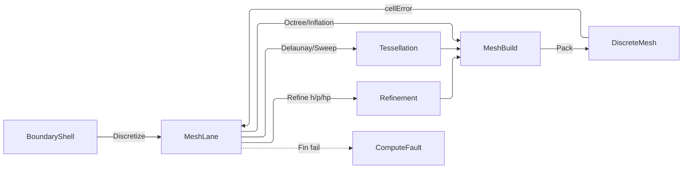

# [COMPUTE_DISCRETIZATION]

Rasm.Compute volumetric mesh generation: one `MeshLane` owner turning a boundary `BoundaryShell` into a frozen `Solver/field#DISCRETE_FIELD` `DiscreteMesh` through real Delaunay/octree/sweep/inflation cores, then refining it adaptively on the Dörfler-marked cell set. The element axis, its quality vocabulary, and the frame family are `Solver/element#ELEMENT_TOPOLOGY`'s; the frozen carrier and its field representation are `Solver/field`'s; this page owns the GENERATION half alone — the shell, its inclusion index, the strategy vocabulary, the four cores, the mesh policy, and the refinement fold.

Exact tessellation is the kernel's. `Rasm/Meshing/delaunay#TESSELLATION` owns exact constrained triangulation AND tetrahedralization behind one `Tessellation.Build` over one `SimplexStore` arena, with `Implicit` defining-point carriage, Morton insertion order, constraint recovery, and typed exhaustion — every capability a hand Bowyer-Watson lacks — so the Delaunay and sweep cores compose it and this page keeps its genuine contribution: the interior seeding, the `Encloses` centroid filter, the section extrusion, and the wall-normal inflation. The FE cell rosters are likewise the kernel's through `Solver/element`. `MeshLane.Discretize` is the mesh producer of the `Solver/contract#SOLVE_REQUEST` solve fold — the Discretize-solve-optimize-sweep spine's first stage — so the generation half is reached by the same entry every analysis route already runs, never by a caller hand-building a mesh past the quality gate.

## [01]-[INDEX]

- [02]-[MESH_GENERATION]: boundary shell, inclusion index, strategy vocabulary, the four generation cores, mesh policy admission, and the build carrier.
- [03]-[ADAPTIVE_REFINEMENT]: Dörfler marking, red subdivision with its edge-conforming closure, order elevation, and the mesh result.

## [02]-[MESH_GENERATION]

- Owner: `BoundaryShell` the admitted boundary-triangulation carrier with its extent; `ShellIndex` the per-generation inclusion index every core probes; `MeshStrategy` `[SmartEnum]` the four generation cores as row delegates; `PointSource` `[SmartEnum]` the interior-seed density gradations; `MeshAlgorithm` `[SmartEnum<string>]` generation-strategy rows carrying their core, seed, and base element; `MortarPolicy` the non-conforming interface admission whose PRESENCE is the constraint row a hanging node needs; `MeshPolicy` the admitted generation policy; `MeshBuild` the mutable build carrier the cores fill and `Pack` freezes; `FaceKey` the packed sorted-node face identity; `MeshTopology` the octree and red-subdivision table owner; `MeshLane` the generation and refinement fold.
- Cases: `MeshAlgorithm` rows delaunay · frontal-delaunay · advancing-front · octree · sweep · boundary-layer over four `MeshStrategy` cores (Delaunay/Octree/Sweep/Inflation), each row carrying its own base element; `PointSource` seeds uniform · frontal · front.
- Entry: `public static Fin<DiscreteMesh> Discretize(BoundaryShell boundary, MeshPolicy policy, IClock clock)` — the shell and the policy arrive ADMITTED (both mint through `Of` on a private constructor, so an invalid one is unrepresentable and no fold re-validates), `ShellIndex.Of` builds the one inclusion index every core probes, and `Fin<T>` aborts on a refused tessellation, on a measured hanging-node set no mortar policy carries, or on an element failing the quality threshold through `CellQuality.Admits`.
- Auto: `Discretize` routes the `MeshStrategy` core by the algorithm row — a closed manifold solid routes the kernel `Tessellation` tetrahedralization over the boundary surface nodes with the `PointSource` interior seeds, a feature-graded fill routes the `Octree` hex recursion under origin-relative double-precision welding, a sweepable prism routes `Sweep` extrusion of the kernel-triangulated footprint section into one prism per section triangle per layer, and a floor-walled domain routes `Inflation` prism layers offset along PER-NODE averaged wall normals; every core filters cells by the indexed `Encloses` parity ray and packs the mesh whose conformity the build MEASURED.
- Result: `DiscreteMesh` carries the algorithm, element class, node and element counts, boundary-layer count, worst-element quality, chosen metric, and timestamp.
- Packages: Rasm (project — `Tessellation`/`TessellationOp`/`TessellationKind`/`TessellationPolicy`, `Implicit`, `Axis`, `EpsilonPolicy`, `Op`), QuikGraph (`AdjacencyGraph`/`BreadthFirstSearchAlgorithm`/`VertexPredecessorRecorderObserver` — the edge-conforming closure walk), CommunityToolkit.HighPerformance (`MemoryOwner<T>`/`SpanOwner<T>` the pooled scratch planes), System.Numerics.Tensors, System.Numerics (`Vector2`/`Vector3`), Thinktecture.Runtime.Extensions, LanguageExt.Core, NodaTime, BCL inbox
- Growth: a new generation strategy is one `MeshAlgorithm` row carrying its `MeshStrategy`/`PointSource`/base-element columns and its core; a new seeding density is one `PointSource` row; zero new surface.
- Boundary: the mesher is the volumetric discretization owner the FEA/CFD solve consumes — the boundary triangulation enters as the `BoundaryShell` triangle soup the host tessellation produces, wrapped through the `Rasm.Meshing` `MeshSpace.Of` owner and flattened to the vertex/triangle soup at the boundary, so this lane never re-derives a surface mesher and never leaks a host geometry type into a solve signature.
- Boundary: inclusion is ONE `ShellIndex` per `Discretize`, threaded to every core: the shell is immutable across a generation while seeding, octree recursion, and section rasterization each drive millions of probes, so a per-probe scan over the whole triangle soup makes generation quadratic in the boundary it meshes. `BoundaryShell.Of` proves the soup closed, manifold, and consistently wound before the index builds, which is what makes an odd crossing count interiority rather than a heuristic. `ShellIndex` stays this page's owner by query shape, never package availability — the `Solver/clash#CLASH_AND_TWIN` `AccelerationStructure` answers boolean occlusion over admitted host-typed scenes while generation needs a parity-crossing COUNT over its own shell facets, and widening the clash surface to serve one sibling's interior couples two lanes the strata keep separate.
- Boundary: admission is a CONSTRUCTION refusal and it ACCUMULATES. `BoundaryShell.Of` and `MeshPolicy.Of` return `Fin` from private constructors over a `Validation` fold, so a caller fixing the target edge length learns about the grading ratio in the same round trip instead of the next one, and no interior fold re-tests a column the mint already proved. The quadrature election binds HERE: a policy naming an element whose declared integration order exceeds its kernel reference domain's ceiling refuses BY NAME at admission, and the proven rule rides the frozen mesh so no assembly fold re-elects.
- Boundary: conformity is MEASURED on the built mesh, never inherited from an algorithm row's declared intent — the octree weld counts the nodes sitting mid-edge of a coarser neighbour and the entry refuses a mesh carrying them unless a `MortarPolicy` is present, because a hanging node without a constraint row is a solve whose interface equations are silently absent. Presence IS the constraint set, so the bool that once gated both the conformity bypass and the closure skip cannot be set for one and not the other. Weld keys quantize in double precision relative to the shell's own origin, so a model in a site coordinate system welds by its extent instead of losing the deciding bits to coordinate magnitude.
- Boundary: the tessellation TOPOLOGY is the kernel's, not merely its sign path. `Tessellation.Build` owns incremental insertion, cavity flood, boundary re-fan, Morton locality order, constraint recovery, and typed exhaustion over exact `Implicit` carriage; a page-local Bowyer-Watson has none of them, re-derives its own super-simplex scaling, inserts in seed order, and reports an exhausted budget as a silently thin mesh. NAMED LOSS: the page's own paraboloid-lift in-circle argument and its centroid-constrained section law retire into the kernel owner that already states both — genuine edge recovery arrives with the kernel's `Conform` rows rather than as a rename of a dropped-triangle filter.
- Exemption: the counting-sort index fill, the parity ray, the octree recursion, the wall-normal accumulation, and the layer offset ladder are MEASURED span kernels over pooled planes — each dies with the call that fills it and none crosses a page surface.

```csharp
// --- [TYPES] ---------------------------------------------------------------------------

[SmartEnum]
public sealed partial class MeshStrategy {
    public static readonly MeshStrategy Delaunay = new(static (boundary, index, policy) => DelaunayCore.Fill(boundary, index, policy));
    public static readonly MeshStrategy Octree = new(static (boundary, index, policy) => OctreeCore.Fill(boundary, index, policy));
    public static readonly MeshStrategy Sweep = new(static (boundary, index, policy) => SweepCore.Fill(boundary, index, policy));
    public static readonly MeshStrategy Inflation = new(static (boundary, index, policy) => InflationCore.Fill(boundary, index, policy));

    [UseDelegateFromConstructor]
    public partial Fin<MeshBuild> Fill(BoundaryShell boundary, ShellIndex index, MeshPolicy policy);
}

[SmartEnum]
public sealed partial class PointSource {
    public static readonly PointSource Uniform = new(static (target, _) => target);
    public static readonly PointSource Frontal = new(static (target, _) => target * 0.75);
    public static readonly PointSource Front = new(static (target, grading) => target * grading);

    [UseDelegateFromConstructor]
    public partial double Spacing(double target, double grading);
}

public readonly record struct Aabb(Vector3 Lo, Vector3 Hi) {
    public Vector3 Span => Hi - Lo;
    public Vector3 Center => (Lo + Hi) * 0.5f;

    public static Aabb Of(ReadOnlySpan<float> vertices) {
        Vector3 lo = new(float.MaxValue), hi = new(float.MinValue);
        for (int v = 0; v + 2 < vertices.Length; v += 3) {
            Vector3 p = new(vertices[v], vertices[v + 1], vertices[v + 2]);
            lo = Vector3.Min(lo, p); hi = Vector3.Max(hi, p);
        }
        return new(lo, hi);
    }
}

// --- [MODELS] --------------------------------------------------------------------------

[SmartEnum<string>]
[KeyMemberEqualityComparer<ComparerAccessors.StringOrdinal, string>]
[KeyMemberComparer<ComparerAccessors.StringOrdinal, string>]
public sealed partial class MeshAlgorithm {
    public static readonly MeshAlgorithm Delaunay = new("delaunay", MeshStrategy.Delaunay, PointSource.Uniform, ElementClass.Tet4);
    public static readonly MeshAlgorithm FrontalDelaunay = new("frontal-delaunay", MeshStrategy.Delaunay, PointSource.Frontal, ElementClass.Tet4);
    public static readonly MeshAlgorithm AdvancingFront = new("advancing-front", MeshStrategy.Delaunay, PointSource.Front, ElementClass.Tet4);
    public static readonly MeshAlgorithm Octree = new("octree", MeshStrategy.Octree, PointSource.Uniform, ElementClass.Hex8);
    public static readonly MeshAlgorithm Sweep = new("sweep", MeshStrategy.Sweep, PointSource.Uniform, ElementClass.Wedge6);
    public static readonly MeshAlgorithm BoundaryLayer = new("boundary-layer", MeshStrategy.Inflation, PointSource.Uniform, ElementClass.Wedge6);

    public MeshStrategy Strategy { get; }
    public PointSource Seed { get; }
    public ElementClass BaseElement { get; }
}

public sealed record MortarPolicy(double InterfaceTolerance) {
    public static readonly MortarPolicy Canonical = new(InterfaceTolerance: EpsilonPolicy.SqrtEpsilon);
}

public sealed record MeshPolicy {
    public static readonly MeshPolicy CanonicalTet = new(
        MeshAlgorithm.Delaunay, ElementClass.Tet4, CellQuality.ScaledJacobian,
        targetEdgeLength: 0.05, gradingRatio: 1.4, boundaryLayerCount: 0, boundaryLayerGrowth: 1.2,
        firstLayerThickness: 0.001, refineFraction: 0.1, RefineKind.H, maxRefineLevel: 4, qualityFloor: 0.02, mortar: None);
    public static readonly MeshPolicy CanonicalViscous = CanonicalTet with {
        Algorithm = MeshAlgorithm.BoundaryLayer, Element = ElementClass.Wedge6, BoundaryLayerCount = 12 };
    public static readonly MeshPolicy CanonicalHp = CanonicalTet with {
        RefineAxis = RefineKind.Hp, Metric = CellQuality.Condition, QualityFloor = 50.0 };

    private MeshPolicy(
        MeshAlgorithm algorithm, ElementClass element, CellQuality metric, double targetEdgeLength, double gradingRatio,
        int boundaryLayerCount, double boundaryLayerGrowth, double firstLayerThickness, double refineFraction,
        RefineKind refineAxis, int maxRefineLevel, double qualityFloor, Option<MortarPolicy> mortar) {
        (Algorithm, Element, Metric, TargetEdgeLength, GradingRatio) = (algorithm, element, metric, targetEdgeLength, gradingRatio);
        (BoundaryLayerCount, BoundaryLayerGrowth, FirstLayerThickness) = (boundaryLayerCount, boundaryLayerGrowth, firstLayerThickness);
        (RefineFraction, RefineAxis, MaxRefineLevel, QualityFloor, Mortar) = (refineFraction, refineAxis, maxRefineLevel, qualityFloor, mortar);
    }

    public MeshAlgorithm Algorithm { get; init; }
    public ElementClass Element { get; init; }
    public CellQuality Metric { get; init; }
    public double TargetEdgeLength { get; init; }
    public double GradingRatio { get; init; }
    public int BoundaryLayerCount { get; init; }
    public double BoundaryLayerGrowth { get; init; }
    public double FirstLayerThickness { get; init; }
    public double RefineFraction { get; init; }
    public RefineKind RefineAxis { get; init; }
    public int MaxRefineLevel { get; init; }
    public double QualityFloor { get; init; }
    public Option<MortarPolicy> Mortar { get; init; }

    public QuadratureRule Rule => Element.Quadrature.ThrowIfFail();

    public static Fin<MeshPolicy> Of(
        MeshAlgorithm algorithm, ElementClass element, CellQuality metric, double targetEdgeLength, double gradingRatio,
        int boundaryLayerCount, double boundaryLayerGrowth, double firstLayerThickness, double refineFraction,
        RefineKind refineAxis, int maxRefineLevel, double qualityFloor, Option<MortarPolicy> mortar) =>
        Seq(
            Claim(element == algorithm.BaseElement, new ComputeViolation.Contract(
                ComputeContract.Compatible,
                new ContractEvidence.Keys(element.Key, algorithm.BaseElement.Key))),
            element.Quadrature.Match(Succ: static _ => Success<Error, Unit>(unit), Fail: static fault => Fail<Error, Unit>(fault)),
            Finite(targetEdgeLength),
            Claim(targetEdgeLength > 0.0, new ComputeViolation.Range(RangeRequirement.Positive, new ScalarEvidence.Value(targetEdgeLength))),
            Finite(gradingRatio),
            Claim(gradingRatio >= 1.0, new ComputeViolation.Range(RangeRequirement.WithinBounds, new ScalarEvidence.Interval(gradingRatio, 1.0, double.PositiveInfinity))),
            Claim(boundaryLayerCount >= 0, new ComputeViolation.Range(RangeRequirement.WithinBounds, new ScalarEvidence.Value(boundaryLayerCount))),
            Finite(boundaryLayerGrowth),
            Claim(boundaryLayerGrowth >= 1.0, new ComputeViolation.Range(RangeRequirement.WithinBounds, new ScalarEvidence.Interval(boundaryLayerGrowth, 1.0, double.PositiveInfinity))),
            Finite(firstLayerThickness),
            Claim(firstLayerThickness > 0.0, new ComputeViolation.Range(RangeRequirement.Positive, new ScalarEvidence.Value(firstLayerThickness))),
            Finite(refineFraction),
            Claim(refineFraction is > 0.0 and <= 1.0, new ComputeViolation.Range(RangeRequirement.WithinBounds, new ScalarEvidence.Interval(refineFraction, 0.0, 1.0))),
            Claim(maxRefineLevel >= 0, new ComputeViolation.Range(RangeRequirement.WithinBounds, new ScalarEvidence.Value(maxRefineLevel))),
            Finite(qualityFloor))
            .Traverse(static claim => claim).As()
            .Map(_ => new MeshPolicy(algorithm, element, metric, targetEdgeLength, gradingRatio, boundaryLayerCount,
                boundaryLayerGrowth, firstLayerThickness, refineFraction, refineAxis, maxRefineLevel, qualityFloor, mortar))
            .ToFin();

    public static Fin<MeshPolicy> OfKeys(MeshPolicy template, string algorithm, string element, string metric) =>
        (Resolve(MeshAlgorithm.TryGet, algorithm, "algorithm"),
         Resolve(ElementClass.TryGet, element, "element"),
         Resolve(CellQuality.TryGet, metric, "metric"))
            .Apply(static (a, e, m) => (Algorithm: a, Element: e, Metric: m)).As().ToFin()
            .Bind(row => Of(row.Algorithm, row.Element, row.Metric, template.TargetEdgeLength, template.GradingRatio,
                template.BoundaryLayerCount, template.BoundaryLayerGrowth, template.FirstLayerThickness,
                template.RefineFraction, template.RefineAxis, template.MaxRefineLevel, template.QualityFloor, template.Mortar));

    delegate bool Lookup<T>(string key, [MaybeNullWhen(false)] out T row);

    static Validation<Error, T> Resolve<T>(Lookup<T> lookup, string key, string axis) =>
        lookup(key, out T? row)
            ? Success<Error, T>(row)
            : Fail<Error, T>(new ComputeFault.Violation(ComputeArea.Solver, new ComputeViolation.Contract(ComputeContract.Valid, new ContractEvidence.Keys(axis, key))));

    static Validation<Error, Unit> Claim(bool held, ComputeViolation evidence) =>
        held ? Success<Error, Unit>(unit) : Fail<Error, Unit>(new ComputeFault.Violation(ComputeArea.Solver, evidence));

    static Validation<Error, Unit> Finite(double value) =>
        Claim(double.IsFinite(value), new ComputeViolation.NonFinite(ComputeSubject.Value, new ScalarEvidence.Value(value)));
}

public sealed record BoundaryShell {
    private BoundaryShell(ReadOnlyMemory<float> vertices, ReadOnlyMemory<int> triangles, Aabb bounds) =>
        (Vertices, Triangles, Bounds) = (vertices, triangles, bounds);

    public ReadOnlyMemory<float> Vertices { get; }
    public ReadOnlyMemory<int> Triangles { get; }
    public Aabb Bounds { get; }

    public int VertexCount => Vertices.Length / 3;
    public int TriangleCount => Triangles.Length / 3;

    public Vector3 Vertex(int i) {
        ReadOnlySpan<float> vertices = Vertices.Span;
        return new(vertices[i * 3], vertices[i * 3 + 1], vertices[i * 3 + 2]);
    }

    public static Fin<BoundaryShell> Of(ReadOnlyMemory<float> vertices, ReadOnlyMemory<int> triangles) {
        Aabb bounds = Aabb.Of(vertices.Span);
        double area = Math.Max(bounds.Span.LengthSquared(), EpsilonPolicy.ZeroTolerance) * EpsilonPolicy.SqrtEpsilon;
        BoundaryShell candidate = new(vertices, triangles, bounds);
        return Seq(
            Claim(vertices.Length >= 12, new ComputeViolation.Capacity(CapacityRequirement.Sufficient, new CapacityEvidence.Count(vertices.Length, 12L))),
            Claim(vertices.Length % 3 == 0, new ComputeViolation.Shape(ShapeRequirement.Dimensions, new ShapeEvidence.Alignment(vertices.Length, 3L))),
            Claim(triangles.Length >= 12, new ComputeViolation.Capacity(CapacityRequirement.Sufficient, new CapacityEvidence.Count(triangles.Length, 12L))),
            Claim(triangles.Length % 3 == 0, new ComputeViolation.Shape(ShapeRequirement.Dimensions, new ShapeEvidence.Alignment(triangles.Length, 3L))),
            Claim(TensorPrimitives.IsFiniteAll<float>(vertices.Span), new ComputeViolation.NonFinite(ComputeSubject.Value, new ScalarEvidence.Sequence(vertices.Length))),
            candidate.Facets(area),
            candidate.Manifold())
            .Traverse(static claim => claim).As().Map(_ => candidate).ToFin();
    }

    Validation<Error, Unit> Facets(double areaFloor) =>
        toSeq(Enumerable.Range(0, TriangleCount)).Traverse(facet => {
            ReadOnlySpan<int> triangles = Triangles.Span;
            (int a, int b, int c) = (triangles[facet * 3], triangles[facet * 3 + 1], triangles[facet * 3 + 2]);
            return (uint)a >= VertexCount || (uint)b >= VertexCount || (uint)c >= VertexCount
                ? Fail<Error, Unit>(new ComputeFault.Violation(ComputeArea.Solver, new ComputeViolation.Range(
                    RangeRequirement.WithinBounds,
                    new ScalarEvidence.Value((uint)a >= VertexCount ? a : (uint)b >= VertexCount ? b : c))))
                : Claim(a != b && b != c && c != a
                        && Vector3.Cross(Vertex(b) - Vertex(a), Vertex(c) - Vertex(a)).LengthSquared() > areaFloor,
                    new ComputeViolation.Contract(ComputeContract.Valid, new ContractEvidence.Index(facet, TriangleCount)));
        }).As().Map(static _ => unit);

    Validation<Error, Unit> Manifold() {
        ReadOnlySpan<int> triangles = Triangles.Span;
        Dictionary<(int Lo, int Hi), (int Count, int Balance)> edges = new(triangles.Length);
        for (int offset = 0; offset < triangles.Length; offset += 3) {
            (int a, int b, int c) = (triangles[offset], triangles[offset + 1], triangles[offset + 2]);
            Tally(edges, a, b); Tally(edges, b, c); Tally(edges, c, a);
        }
        return toSeq(edges).Traverse(static edge => Claim(
                edge.Value.Count == 2 && edge.Value.Balance == 0,
                new ComputeViolation.Contract(ComputeContract.Consistent, new ContractEvidence.Counts(edge.Value.Count, edge.Value.Balance, 0L))))
            .As().Map(static _ => unit);

        static void Tally(Dictionary<(int Lo, int Hi), (int Count, int Balance)> edges, int from, int to) {
            (int Lo, int Hi) key = from < to ? (from, to) : (to, from);
            (int Count, int Balance) current = edges.GetValueOrDefault(key);
            edges[key] = (current.Count + 1, current.Balance + (from < to ? 1 : -1));
        }
    }

    static Validation<Error, Unit> Claim(bool held, ComputeViolation evidence) =>
        held ? Success<Error, Unit>(unit) : Fail<Error, Unit>(new ComputeFault.Violation(ComputeArea.Solver, evidence));
}

public sealed class ShellIndex {
    readonly BoundaryShell shell;
    readonly MemoryOwner<int> cellStart;
    readonly MemoryOwner<int> cellTriangles;
    readonly int side;
    readonly float originY, originZ, cellY, cellZ;

    ShellIndex(BoundaryShell shell, int side, float originY, float originZ, float cellY, float cellZ,
        MemoryOwner<int> cellStart, MemoryOwner<int> cellTriangles) {
        (this.shell, this.side) = (shell, side);
        (this.originY, this.originZ, this.cellY, this.cellZ) = (originY, originZ, cellY, cellZ);
        (this.cellStart, this.cellTriangles) = (cellStart, cellTriangles);
    }

    public static ShellIndex Of(BoundaryShell shell) {
        Aabb box = shell.Bounds;
        int side = Math.Max(1, (int)Math.Ceiling(Math.Sqrt(shell.TriangleCount)));
        float floor = (float)EpsilonPolicy.SqrtEpsilon;
        float cellY = Math.Max(box.Span.Y, floor) / side, cellZ = Math.Max(box.Span.Z, floor) / side;
        MemoryOwner<int> start = MemoryOwner<int>.Allocate(side * side + 1, AllocationMode.Clear);
        Span<int> starts = start.Span;
        for (int triangle = 0; triangle < shell.TriangleCount; triangle++) {
            (int loRow, int hiRow, int loColumn, int hiColumn) = Cells(shell, triangle, box, cellY, cellZ, side);
            for (int row = loRow; row <= hiRow; row++)
                for (int column = loColumn; column <= hiColumn; column++) { starts[row * side + column + 1]++; }
        }
        for (int cell = 0; cell < side * side; cell++) { starts[cell + 1] += starts[cell]; }
        using SpanOwner<int> cursor = SpanOwner<int>.Allocate(starts.Length);
        starts.CopyTo(cursor.Span);
        MemoryOwner<int> ids = MemoryOwner<int>.Allocate(starts[^1]);
        for (int triangle = 0; triangle < shell.TriangleCount; triangle++) {
            (int loRow, int hiRow, int loColumn, int hiColumn) = Cells(shell, triangle, box, cellY, cellZ, side);
            for (int row = loRow; row <= hiRow; row++)
                for (int column = loColumn; column <= hiColumn; column++) { ids.Span[cursor.Span[row * side + column]++] = triangle; }
        }
        return new(shell, side, box.Lo.Y, box.Lo.Z, cellY, cellZ, start, ids);
    }

    static (int LoRow, int HiRow, int LoColumn, int HiColumn) Cells(BoundaryShell shell, int triangle, Aabb box, float cellY, float cellZ, int side) {
        ReadOnlySpan<int> triangles = shell.Triangles.Span;
        Vector3 a = shell.Vertex(triangles[triangle * 3]), b = shell.Vertex(triangles[triangle * 3 + 1]), c = shell.Vertex(triangles[triangle * 3 + 2]);
        (int loRow, int hiRow) = Range(Math.Min(a.Z, Math.Min(b.Z, c.Z)), Math.Max(a.Z, Math.Max(b.Z, c.Z)), box.Lo.Z, cellZ, side);
        (int loColumn, int hiColumn) = Range(Math.Min(a.Y, Math.Min(b.Y, c.Y)), Math.Max(a.Y, Math.Max(b.Y, c.Y)), box.Lo.Y, cellY, side);
        return (loRow, hiRow, loColumn, hiColumn);
    }

    public bool Encloses(Vector3 p) {
        int row = Cell(p.Z, originZ, cellZ, side), column = Cell(p.Y, originY, cellY, side);
        if (row < 0 || column < 0) { return false; }
        ReadOnlySpan<int> triangles = shell.Triangles.Span;
        ReadOnlySpan<int> starts = cellStart.Span, ids = cellTriangles.Span;
        float floor = (float)EpsilonPolicy.SqrtEpsilon;
        Vector3 dir = Vector3.UnitX;
        int crossings = 0, cell = row * side + column;
        for (int slot = starts[cell]; slot < starts[cell + 1]; slot++) {
            int t = ids[slot] * 3;
            Vector3 a = shell.Vertex(triangles[t]), e1 = shell.Vertex(triangles[t + 1]) - a, e2 = shell.Vertex(triangles[t + 2]) - a, h = Vector3.Cross(dir, e2);
            float det = Vector3.Dot(e1, h);
            if (Math.Abs(det) < floor) { continue; }
            float inv = 1f / det;
            Vector3 s = p - a; float u = Vector3.Dot(s, h) * inv;
            if (u is < 0f or > 1f) { continue; }
            Vector3 q = Vector3.Cross(s, e1); float v = Vector3.Dot(dir, q) * inv;
            if (v < 0f || u + v > 1f) { continue; }
            if (Vector3.Dot(e2, q) * inv > floor) { crossings++; }
        }
        return (crossings & 1) == 1;
    }

    static (int Lo, int Hi) Range(float lo, float hi, float origin, float size, int side) =>
        (Math.Clamp((int)((lo - origin) / size), 0, side - 1), Math.Clamp((int)((hi - origin) / size), 0, side - 1));

    static int Cell(float value, float origin, float size, int side) {
        int index = (int)((value - origin) / size);
        return index >= 0 && index < side ? index : index < 0 ? -1 : side - 1;
    }
}

public readonly record struct FaceKey(long A, long B, long C, long D) {
    public static FaceKey Of(ReadOnlySpan<long> nodes) {
        Span<long> sorted = stackalloc long[4];
        sorted.Fill(long.MinValue);
        nodes.CopyTo(sorted);
        sorted[..nodes.Length].Sort();
        return new(sorted[0], sorted[1], sorted[2], sorted[3]);
    }
}

public sealed record MeshBuild(ElementClass Element, float[] Nodes, List<long> Cells, long ElementCount, long NodeCount, int Layers) {
    public long BoundaryCount { get; init; }
    public double Quality { get; init; } = 1.0;
    public int HangingNodes { get; init; }

    public bool Conforming => HangingNodes == 0;

    public MeshBuild Scored(CellQuality metric) {
        if (ElementCount == 0) { return this with { Quality = 0.0, BoundaryCount = BoundaryFold() }; }
        int per = Element.Nodes;
        using SpanOwner<double> perElement = SpanOwner<double>.Allocate(checked((int)ElementCount));
        using SpanOwner<double> xyz = SpanOwner<double>.Allocate(per * 3);
        for (int cell = 0; cell < ElementCount; cell++) {
            for (int v = 0; v < per; v++) {
                long node = Cells[cell * per + v];
                xyz.Span[v * 3] = Nodes[(int)node * 3]; xyz.Span[v * 3 + 1] = Nodes[(int)node * 3 + 1]; xyz.Span[v * 3 + 2] = Nodes[(int)node * 3 + 2];
            }
            perElement.Span[cell] = Element.Metric(metric, xyz.Span);
        }
        return this with { Quality = metric.Worst(perElement.Span), BoundaryCount = BoundaryFold() };
    }

    long BoundaryFold() {
        Dictionary<FaceKey, (int Count, long[] Nodes)> facets = new(checked((int)ElementCount) * Math.Max(1, Element.Faces.Length));
        int per = Element.Nodes;
        for (int cell = 0; cell < ElementCount; cell++)
            foreach (ImmutableArray<int> face in Element.Faces) {
                if (face.Length < 3) { continue; }
                long[] ids = new long[face.Length];
                for (int i = 0; i < face.Length; i++) { ids[i] = Cells[cell * per + face[i]]; }
                FaceKey key = FaceKey.Of(ids);
                facets[key] = facets.TryGetValue(key, out (int Count, long[] Nodes) entry) ? (entry.Count + 1, entry.Nodes) : (1, ids);
            }
        return toSet(facets.Values.Where(static facet => facet.Count == 1).SelectMany(static facet => facet.Nodes)).Count;
    }
}

// --- [OPERATIONS] ----------------------------------------------------------------------

public static partial class MeshLane {
    private static readonly Op GenerateKey = Op.Of(name: nameof(Discretize));

    public static Fin<DiscreteMesh> Discretize(BoundaryShell boundary, MeshPolicy policy, IClock clock) =>
        from built in policy.Algorithm.Strategy.Fill(boundary, ShellIndex.Of(boundary), policy)
        from conforming in built.Conforming || policy.Mortar.IsSome
            ? Fin.Succ(built)
            : Fin.Fail<MeshBuild>(new ComputeFault.Violation(ComputeArea.Solver, new ComputeViolation.Contract(ComputeContract.Valid, new ContractEvidence.None())))
        from admitted in policy.Metric.Admits(conforming.Quality, policy.QualityFloor)
            ? Fin.Succ(Pack(conforming, policy, refineLevel: 0, None, clock.GetCurrentInstant()))
            : Fin.Fail<DiscreteMesh>(new ComputeFault.Violation(ComputeArea.Solver, new ComputeViolation.Contract(ComputeContract.Valid, new ContractEvidence.None())))
        select admitted;

    public static double Quality(DiscreteMesh mesh, CellQuality metric) {
        using SpanOwner<double> perElement = SpanOwner<double>.Allocate(checked((int)mesh.ElementCount));
        for (long cell = 0; cell < mesh.ElementCount; cell++) { perElement.Span[(int)cell] = mesh.Element.Metric(metric, mesh.NodalXyz(cell)); }
        return metric.Worst(perElement.Span);
    }

    internal static DiscreteMesh Pack(MeshBuild built, MeshPolicy policy, int refineLevel, Option<double> error, Instant at) =>
        new(built.Element, policy.Algorithm, policy.Rule, built.Nodes.AsMemory(),
            CollectionsMarshal.AsSpan(built.Cells).ToArray().AsMemory(),
            built.NodeCount, built.ElementCount, built.BoundaryCount, built.Layers, refineLevel,
            policy.Metric, built.Quality, error, at);
}

public static class DelaunayCore {
    private static readonly Op TessellateKey = Op.Of(name: "delaunay-core");

    public static Fin<MeshBuild> Fill(BoundaryShell boundary, ShellIndex index, MeshPolicy policy) {
        Seq<Vector3> points = Seed(boundary, index, policy);
        return Tessellation.Build(new TessellationOp.Points(
                TessellationKind.Tetrahedralization,
                toArr(points.Map(static p => (Implicit)new Point3d(p.X, p.Y, p.Z))),
                Seq<Conform>(), TessellationPolicy.Canonical, Axis.Z), TessellateKey)
            .Map(tessellation => Kept(tessellation, points, index, policy));
    }

    static MeshBuild Kept(Tessellation tessellation, Seq<Vector3> points, ShellIndex index, MeshPolicy policy) {
        List<long> cells = new(tessellation.Store.LiveCount * 4);
        long count = 0;
        foreach (int simplex in tessellation.Store.Live) {
            ReadOnlySpan<int> vs = tessellation.Store.SimplexVertices(simplex);
            Vector3 centroid = (points[vs[0]] + points[vs[1]] + points[vs[2]] + points[vs[3]]) * 0.25f;
            if (!index.Encloses(centroid)) { continue; }
            cells.AddRange([vs[0], vs[1], vs[2], vs[3]]);
            count++;
        }
        float[] flat = new float[points.Count * 3];
        for (int i = 0; i < points.Count; i++) { flat[i * 3] = points[i].X; flat[i * 3 + 1] = points[i].Y; flat[i * 3 + 2] = points[i].Z; }
        return new MeshBuild(policy.Element, flat, cells, count, points.Count, 0).Scored(policy.Metric);
    }

    static Seq<Vector3> Seed(BoundaryShell boundary, ShellIndex index, MeshPolicy policy) {
        Aabb box = boundary.Bounds;
        float edge = (float)policy.Seed.Spacing(policy.TargetEdgeLength, policy.GradingRatio);
        Seq<Vector3> surface = toSeq(Enumerable.Range(0, boundary.VertexCount)).Map(boundary.Vertex);
        return surface + toSeq(Lattice(box, edge, offset: edge)).Filter(index.Encloses);
    }

    static IEnumerable<Vector3> Lattice(Aabb box, float edge, float offset) {
        for (float z = box.Lo.Z + offset; z < box.Hi.Z; z += edge)
            for (float y = box.Lo.Y + offset; y < box.Hi.Y; y += edge)
                for (float x = box.Lo.X + offset; x < box.Hi.X; x += edge) { yield return new(x, y, z); }
    }

    public static Fin<(Seq<Vector2> Points, Seq<(int A, int B, int C)> Triangles)> Section(
        BoundaryShell boundary, ShellIndex index, MeshPolicy policy, float z) {
        Aabb box = boundary.Bounds;
        float edge = (float)policy.Seed.Spacing(policy.TargetEdgeLength, policy.GradingRatio);
        Seq<Vector2> rim = toSeq(Enumerable.Range(0, boundary.VertexCount))
            .Map(boundary.Vertex)
            .Filter(vertex => index.Encloses(new(vertex.X, vertex.Y, z)) || Math.Abs(vertex.Z - z) <= edge)
            .Map(static vertex => new Vector2(vertex.X, vertex.Y));
        Seq<Vector2> interior = toSeq(Lattice(box, edge, offset: edge * 0.5f))
            .Filter(point => index.Encloses(new(point.X, point.Y, z)))
            .Map(static point => new Vector2(point.X, point.Y));
        Seq<Vector2> points = rim + interior;
        return Tessellation.Build(new TessellationOp.Points(
                TessellationKind.Triangulation,
                toArr(points.Map(p => (Implicit)new Point3d(p.X, p.Y, z))),
                Seq<Conform>(), TessellationPolicy.Canonical, Axis.Z), TessellateKey)
            .Bind(tessellation => tessellation.Triangles(TessellateKey))
            .Map(projection => (
                Points: points,
                Triangles: toSeq(projection.Faces).Filter(face =>
                    index.Encloses(Centroid(points, face, z)))));
    }

    static Vector3 Centroid(Seq<Vector2> points, (int A, int B, int C) face, float z) {
        Vector2 centre = (points[face.A] + points[face.B] + points[face.C]) / 3f;
        return new(centre.X, centre.Y, z);
    }
}

public static class OctreeCore {
    public static Fin<MeshBuild> Fill(BoundaryShell boundary, ShellIndex index, MeshPolicy policy) {
        Weld weld = new(boundary.Bounds.Lo, (float)policy.TargetEdgeLength);
        List<long> cells = [];
        int count = Recurse(index, boundary.Bounds, policy, weld, cells, depth: 0);
        return Fin.Succ(new MeshBuild(policy.Element, weld.Flat(), cells, count, weld.Count, 0) {
            HangingNodes = weld.Hanging(cells, policy.Element),
        }.Scored(policy.Metric));
    }

    static int Recurse(ShellIndex index, Aabb box, MeshPolicy policy, Weld weld, List<long> cells, int depth) {
        float size = Math.Max(box.Span.X, Math.Max(box.Span.Y, box.Span.Z));
        bool straddles = index.Encloses(box.Center) ^ index.Encloses(box.Lo);
        if (size > policy.TargetEdgeLength && depth < policy.MaxRefineLevel + 6 && (straddles || size > policy.TargetEdgeLength * policy.GradingRatio)) {
            int emitted = 0;
            foreach (Aabb child in MeshTopology.OctreeChildren(box)) { emitted += Recurse(index, child, policy, weld, cells, depth + 1); }
            return emitted;
        }
        if (!index.Encloses(box.Center)) { return 0; }
        foreach ((float X, float Y, float Z) corner in MeshTopology.HexCorners(box)) { cells.Add(weld.Node(corner)); }
        return 1;
    }

    sealed class Weld(Vector3 origin, float targetEdge) {
        readonly Dictionary<(long X, long Y, long Z), long> ids = [];
        readonly List<float> nodes = [];
        readonly double quantum = Math.Max(targetEdge, EpsilonPolicy.SqrtEpsilon) / 1024.0;

        public long Count => ids.Count;

        public long Node((float X, float Y, float Z) p) {
            (long X, long Y, long Z) key = (Key(p.X, origin.X), Key(p.Y, origin.Y), Key(p.Z, origin.Z));
            if (ids.TryGetValue(key, out long held)) { return held; }
            long id = ids.Count;
            ids[key] = id;
            nodes.Add(p.X); nodes.Add(p.Y); nodes.Add(p.Z);
            return id;
        }

        public int Hanging(List<long> cells, ElementClass element) {
            Set<long> hanging = Set<long>();
            int per = element.Nodes;
            for (int cell = 0; cell * per < cells.Count; cell++) {
                foreach ((int a, int b) in element.Edges) {
                    long lo = cells[cell * per + a], hi = cells[cell * per + b];
                    (long X, long Y, long Z) mid = (
                        (Coordinate(lo, 0) + Coordinate(hi, 0)) / 2,
                        (Coordinate(lo, 1) + Coordinate(hi, 1)) / 2,
                        (Coordinate(lo, 2) + Coordinate(hi, 2)) / 2);
                    if (ids.TryGetValue(mid, out long node) && node != lo && node != hi) { hanging = hanging.TryAdd(node); }
                }
            }
            return hanging.Count;
        }

        public float[] Flat() => [.. nodes];

        long Key(double value, double from) => (long)Math.Round((value - from) / quantum);
        long Coordinate(long node, int axis) => Key(nodes[(int)node * 3 + axis], axis == 0 ? origin.X : axis == 1 ? origin.Y : origin.Z);
    }
}

public static class SweepCore {
    public static Fin<MeshBuild> Fill(BoundaryShell boundary, ShellIndex index, MeshPolicy policy) {
        Aabb box = boundary.Bounds;
        int layers = Math.Max(1, (int)Math.Ceiling((box.Hi.Z - box.Lo.Z) / policy.TargetEdgeLength));
        return DelaunayCore.Section(boundary, index, policy, (box.Lo.Z + box.Hi.Z) * 0.5f)
            .Map(section => Extrude(section.Points, section.Triangles, box, layers, index, policy));
    }

    static MeshBuild Extrude(Seq<Vector2> plane, Seq<(int A, int B, int C)> section, Aabb box, int layers, ShellIndex index, MeshPolicy policy) {
        List<Vector3> verts = new((layers + 1) * plane.Count);
        for (int l = 0; l <= layers; l++) {
            float z = box.Lo.Z + (box.Hi.Z - box.Lo.Z) * l / layers;
            foreach (Vector2 point in plane) { verts.Add(new(point.X, point.Y, z)); }
        }
        return Prisms(verts, toSeq(Enumerable.Range(0, layers)), section.Bind(static face => Seq(face.A, face.B, face.C)),
            plane.Count, index, policy, layers);
    }

    internal static MeshBuild Prisms(
        List<Vector3> verts, Seq<int> levels, Seq<int> facets, int stride, ShellIndex index, MeshPolicy policy, int layers) {
        List<long> cells = new(levels.Count * facets.Count * 2);
        long count = 0;
        foreach (int layer in levels)
            for (int facet = 0; facet + 2 < facets.Count; facet += 3) {
                int bottom = layer * stride, top = bottom + stride;
                (int a, int b, int c) = (facets[facet], facets[facet + 1], facets[facet + 2]);
                Vector3 centre = (verts[bottom + a] + verts[bottom + b] + verts[bottom + c]
                    + verts[top + a] + verts[top + b] + verts[top + c]) / 6f;
                if (!index.Encloses(centre)) { continue; }
                cells.AddRange([bottom + a, bottom + b, bottom + c, top + a, top + b, top + c]);
                count++;
            }
        return new MeshBuild(policy.Element, Flatten(verts), cells, count, verts.Count, layers).Scored(policy.Metric);
    }

    internal static float[] Flatten(List<Vector3> verts) {
        float[] flat = new float[verts.Count * 3];
        for (int v = 0; v < verts.Count; v++) { flat[v * 3] = verts[v].X; flat[v * 3 + 1] = verts[v].Y; flat[v * 3 + 2] = verts[v].Z; }
        return flat;
    }
}

public static class InflationCore {
    public static Fin<MeshBuild> Fill(BoundaryShell boundary, ShellIndex index, MeshPolicy policy) {
        (Seq<int> facets, List<Vector3> anchors, List<Vector3> normals) = Wall(boundary);
        Seq<float> offsets = Offsets(boundary.Bounds, policy);
        List<Vector3> verts = new(offsets.Count * anchors.Count);
        foreach (float offset in offsets) {
            for (int node = 0; node < anchors.Count; node++) { verts.Add(anchors[node] + normals[node] * offset); }
        }
        return Fin.Succ(SweepCore.Prisms(verts, toSeq(Enumerable.Range(0, Math.Max(0, offsets.Count - 1))), facets,
            anchors.Count, index, policy, policy.BoundaryLayerCount));
    }

    static (Seq<int> Facets, List<Vector3> Anchors, List<Vector3> Normals) Wall(BoundaryShell boundary) {
        Dictionary<int, int> local = [];
        List<int> facets = [];
        List<Vector3> anchors = [], normals = [];
        ReadOnlySpan<int> triangles = boundary.Triangles.Span;
        for (int t = 0; t < triangles.Length; t += 3) {
            Vector3 a = boundary.Vertex(triangles[t]), b = boundary.Vertex(triangles[t + 1]), c = boundary.Vertex(triangles[t + 2]);
            Vector3 normal = Vector3.Cross(b - a, c - a);
            if (normal.LengthSquared() <= 0f || Vector3.Normalize(normal).Z > -0.5f) { continue; }
            for (int corner = 0; corner < 3; corner++) {
                int vertex = triangles[t + corner];
                if (!local.TryGetValue(vertex, out int id)) {
                    id = anchors.Count;
                    local[vertex] = id;
                    anchors.Add(boundary.Vertex(vertex));
                    normals.Add(Vector3.Zero);
                }
                normals[id] -= normal;
                facets.Add(id);
            }
        }
        for (int node = 0; node < normals.Count; node++) {
            normals[node] = normals[node].LengthSquared() > 0f ? Vector3.Normalize(normals[node]) : Vector3.UnitZ;
        }
        return (toSeq(facets), anchors, normals);
    }

    static Seq<float> Offsets(Aabb box, MeshPolicy policy) {
        List<float> offsets = [0f];
        float thickness = (float)policy.FirstLayerThickness, reach = box.Span.Length();
        for (int layer = 0; layer < policy.BoundaryLayerCount; layer++) {
            offsets.Add(offsets[^1] + thickness);
            thickness *= (float)policy.BoundaryLayerGrowth;
        }
        for (float offset = offsets[^1] + (float)policy.TargetEdgeLength; offset < reach; offset += (float)policy.TargetEdgeLength) { offsets.Add(offset); }
        return toSeq(offsets);
    }
}
```

## [03]-[ADAPTIVE_REFINEMENT]

- Owner: `RefineKind` `[SmartEnum]` the h/p/hp routing axis carrying its own route delegate; `RefineTemplate` `[SmartEnum<string>]` the red-subdivision table keyed on the element row, carrying its sub-cell roster and its extra-node budget; `Refinement` the node-minting accumulator both refinement legs share; `MeshTopology` the octree and red-template tables; `MeshLane.Refine` the fold.
- Cases: `RefineKind` rows h · p · hp — the hp routing rule (elevate where the marked set exceeds a quarter of the mesh, subdivide otherwise) is the ROW's own delegate, so the entry carries no per-axis branch; `RefineTemplate` rows tet4 · hex8 · tri3 · quad4, the four element rows a red template exists for.
- Entry: `public static Fin<DiscreteMesh> Refine(DiscreteMesh mesh, MeshPolicy policy, ReadOnlySpan<double> cellError, IClock clock)` — re-meshes the Dörfler-marked cell set by the policy's `RefineKind` and returns the adapted mesh carrying the marking threshold as its error estimate.
- Auto: `Refine` reads the per-cell error estimator and marks the cells whose estimator exceeds the policy fraction by the Dörfler bulk criterion, then either red-subdivides the marked set expanded to its edge-conforming closure — any cell sharing a split edge joins the set to a fixpoint unless a mortar policy carries the hanging node — or order-elevates through the target row's own node budget so the interior stays conforming. Both legs mint through ONE `Refinement` accumulator, so an edge midpoint minted by subdivision and one minted by elevation are the same node.
- Result: `Refine` stamps the refinement level, the marked-cell count, the marking fraction, and the post-refine error estimator on the returned `DiscreteMesh`, so an adaptive sweep is one result chain by correlation.
- Growth: a new refinement axis is one `RefineKind` row carrying its route; a new red template is one `RefineTemplate` row keyed on its element; zero new surface.
- Boundary: the Dörfler cut is EXACT and stays a sort. A streaming P² quantile sketch answers the same shape in one pass, but its estimate moves the marked set at the margin — the cells whose estimator sits closest to the threshold are exactly the ones an adaptive campaign is deciding about — so the exact cut is the refusal this fold makes deliberately rather than a rung it failed to reach.
- Boundary: the edge-conforming closure is a graph walk over the edge→cell incidence, so each cell enters once. The rescan form re-walked every cell in the mesh per fixpoint round, costing rounds × cells edge tests on a mesh where the marked set is a fraction of a percent; a hand `Queue` plus a visited set beside it is the same walk spelled without its owner.
- Boundary: order elevation reads the TARGET row's own node budget — corners, edge midpoints, quad-facet centres, interior — so `Tet4 → Tet10`, `Hex8 → Hex20`, `Hex20 → Hex27`, and `Wedge6 → Wedge18` all run one body and none carries a per-pair node count. A terminal row elevates to itself, which is how a fully-elevated mesh stays a mesh instead of failing.

```csharp
// --- [TYPES] ---------------------------------------------------------------------------

[SmartEnum]
public sealed partial class RefineKind {
    public static readonly RefineKind H = new(static (mesh, marked, policy) => MeshLane.Subdivide(mesh, marked, policy));
    public static readonly RefineKind P = new(static (mesh, _, policy) => MeshLane.Elevate(mesh, policy));
    public static readonly RefineKind Hp = new(static (mesh, marked, policy) =>
        marked.Count > mesh.ElementCount / 4 ? MeshLane.Elevate(mesh, policy) : MeshLane.Subdivide(mesh, marked, policy));

    [UseDelegateFromConstructor]
    public partial MeshBuild Route(DiscreteMesh mesh, Set<int> marked, MeshPolicy policy);
}

[SmartEnum<string>]
[KeyMemberEqualityComparer<ComparerAccessors.StringOrdinal, string>]
[KeyMemberComparer<ComparerAccessors.StringOrdinal, string>]
public sealed partial class RefineTemplate {
    public static readonly RefineTemplate Tet4 = new("tet4",
        [[0, 4, 6, 7], [1, 5, 4, 8], [2, 6, 5, 9], [3, 7, 9, 8], [4, 5, 6, 9], [4, 9, 7, 8], [4, 8, 9, 5], [4, 6, 9, 7]],
        faceNodes: 0, interior: false);
    public static readonly RefineTemplate Hex8 = new("hex8", [.. MeshTopology.HexOctants()], faceNodes: 6, interior: true);
    public static readonly RefineTemplate Tri3 = new("tri3", [[0, 3, 5], [3, 1, 4], [5, 4, 2], [3, 4, 5]], faceNodes: 0, interior: false);
    public static readonly RefineTemplate Quad4 = new("quad4", [[0, 4, 8, 7], [4, 1, 5, 8], [8, 5, 2, 6], [7, 8, 6, 3]], faceNodes: 1, interior: false);

    public ImmutableArray<ImmutableArray<int>> SubCells { get; }
    public int FaceNodes { get; }
    public bool Interior { get; }

    public static Option<RefineTemplate> For(ElementClass element) =>
        TryGet(element.Key, out RefineTemplate? row) ? Some(row) : None;
}

// --- [MODELS] --------------------------------------------------------------------------

public sealed class Refinement {
    readonly List<float> nodes;
    readonly Dictionary<(long, long), long> edgeMid = [];
    readonly Dictionary<FaceKey, long> faceMid = [];
    long count;

    public Refinement(ReadOnlySpan<float> seed, long seedCount) { nodes = [.. seed]; count = seedCount; }

    public long EdgeMid(long a, long b) {
        (long, long) key = a < b ? (a, b) : (b, a);
        if (edgeMid.TryGetValue(key, out long mid)) { return mid; }
        mid = count++;
        for (int d = 0; d < 3; d++) { nodes.Add(0.5f * (nodes[(int)a * 3 + d] + nodes[(int)b * 3 + d])); }
        edgeMid[key] = mid;
        return mid;
    }

    public Span<long> Pool(ElementClass element, ReadOnlySpan<long> corners, int edges, int faceNodes, bool interior) {
        long[] pool = new long[corners.Length + edges + faceNodes + (interior ? 1 : 0)];
        corners.CopyTo(pool);
        int next = corners.Length;
        foreach ((int a, int b) in element.Edges.Take(edges)) { pool[next++] = EdgeMid(corners[a], corners[b]); }
        foreach (ImmutableArray<int> facet in element.Faces.Where(static face => face.Length == 4).Take(faceNodes)) {
            pool[next++] = FaceMid(corners, facet);
        }
        if (interior) { pool[next] = Centre(corners); }
        return pool;
    }

    long FaceMid(ReadOnlySpan<long> corners, ImmutableArray<int> face) {
        Span<long> ids = stackalloc long[face.Length];
        for (int i = 0; i < face.Length; i++) { ids[i] = corners[face[i]]; }
        FaceKey key = FaceKey.Of(ids);
        if (faceMid.TryGetValue(key, out long mid)) { return mid; }
        mid = count++;
        Span<float> acc = stackalloc float[3];
        foreach (int v in face) for (int d = 0; d < 3; d++) { acc[d] += nodes[(int)corners[v] * 3 + d]; }
        for (int d = 0; d < 3; d++) { nodes.Add(acc[d] / face.Length); }
        faceMid[key] = mid;
        return mid;
    }

    long Centre(ReadOnlySpan<long> corners) {
        long mid = count++;
        Span<float> acc = stackalloc float[3];
        foreach (long v in corners) for (int d = 0; d < 3; d++) { acc[d] += nodes[(int)v * 3 + d]; }
        for (int d = 0; d < 3; d++) { nodes.Add(acc[d] / corners.Length); }
        return mid;
    }

    public float[] Nodes() => [.. nodes];
    public long Count => count;
}

// --- [OPERATIONS] ----------------------------------------------------------------------

public static partial class MeshLane {
    public static Fin<DiscreteMesh> Refine(DiscreteMesh mesh, MeshPolicy policy, ReadOnlySpan<double> cellError, IClock clock) {
        if (mesh.RefineLevel >= policy.MaxRefineLevel) { return Fin.Succ(mesh); }
        if (cellError.Length != mesh.ElementCount) {
            return Fin.Fail<DiscreteMesh>(new ComputeFault.Violation(ComputeArea.Solver, new ComputeViolation.Contract(ComputeContract.Valid, new ContractEvidence.Count(cellError.Length, mesh.ElementCount))));
        }
        if (!TensorPrimitives.IsFiniteAll<double>(cellError) || TensorPrimitives.Min(cellError) < 0.0) {
            return Fin.Fail<DiscreteMesh>(new ComputeFault.Violation(ComputeArea.Solver, new ComputeViolation.Contract(ComputeContract.Valid, new ContractEvidence.None())));
        }
        double threshold = DorflerThreshold(cellError, policy.RefineFraction);
        Set<int> marked = Marked(cellError, threshold);
        MeshBuild built = policy.RefineAxis.Route(mesh, marked, policy);
        return built.ElementCount <= mesh.ElementCount && built.NodeCount <= mesh.NodeCount
            ? Fin.Succ(mesh)
            : policy.Metric.Admits(built.Quality, policy.QualityFloor)
                ? Fin.Succ(Pack(built, policy, mesh.RefineLevel + 1, Some(threshold), clock.GetCurrentInstant()))
                : Fin.Fail<DiscreteMesh>(new ComputeFault.Violation(ComputeArea.Solver, new ComputeViolation.Contract(ComputeContract.Valid, new ContractEvidence.Key(built.Element.Key))));
    }

    static double DorflerThreshold(ReadOnlySpan<double> cellError, double bulkFraction) {
        if (cellError.IsEmpty) { return double.MaxValue; }
        double total = TensorPrimitives.Sum(cellError);
        if (total <= 0.0) { return double.MaxValue; }
        double target = bulkFraction * total, accumulated = 0.0;
        using SpanOwner<double> sorted = SpanOwner<double>.Allocate(cellError.Length);
        cellError.CopyTo(sorted.Span);
        sorted.Span.Sort();
        for (int i = sorted.Span.Length - 1; i >= 0; i--) {
            accumulated += sorted.Span[i];
            if (accumulated >= target) { return sorted.Span[i]; }
        }
        return sorted.Span[0];
    }

    static Set<int> Marked(ReadOnlySpan<double> cellError, double threshold) {
        Set<int> marked = Set<int>();
        for (int cell = 0; cell < cellError.Length; cell++) { if (cellError[cell] >= threshold) { marked = marked.TryAdd(cell); } }
        return marked;
    }

    internal static MeshBuild Elevate(DiscreteMesh mesh, MeshPolicy policy) {
        ElementClass elevated = mesh.Element.Elevate();
        if (elevated == mesh.Element) { return Carry(mesh, policy); }
        Refinement refine = new(mesh.Coordinates, mesh.NodeCount);
        ReadOnlySpan<long> conn = mesh.Indices;
        int per = mesh.Element.Nodes, corners = mesh.Element.Corners;
        List<long> cells = new(checked((int)mesh.ElementCount) * elevated.Nodes);
        Span<long> seed = stackalloc long[corners];
        for (int cell = 0; cell < mesh.ElementCount; cell++) {
            for (int v = 0; v < corners; v++) { seed[v] = conn[cell * per + v]; }
            foreach (long node in refine.Pool(mesh.Element, seed, elevated.MidEdges, elevated.MidFaces, elevated.MidInterior > 0)) { cells.Add(node); }
        }
        return new MeshBuild(elevated, refine.Nodes(), cells, mesh.ElementCount, refine.Count, mesh.BoundaryLayers).Scored(policy.Metric);
    }

    internal static MeshBuild Subdivide(DiscreteMesh mesh, Set<int> marked, MeshPolicy policy) {
        if (RefineTemplate.For(mesh.Element).Case is not RefineTemplate template) { return Carry(mesh, policy); }
        Set<int> closed = policy.Mortar.IsSome ? marked : Closed(mesh, marked);
        Refinement refine = new(mesh.Coordinates, mesh.NodeCount);
        ReadOnlySpan<long> conn = mesh.Indices;
        int per = mesh.Element.Nodes, corners = mesh.Element.Corners;
        List<long> cells = new(conn.Length * 2);
        long count = 0;
        Span<long> seed = stackalloc long[corners];
        for (int cell = 0; cell < mesh.ElementCount; cell++) {
            if (!closed.Contains(cell)) { for (int v = 0; v < per; v++) { cells.Add(conn[cell * per + v]); } count++; continue; }
            for (int v = 0; v < corners; v++) { seed[v] = conn[cell * per + v]; }
            Span<long> child = refine.Pool(mesh.Element, seed, mesh.Element.Edges.Length, template.FaceNodes, template.Interior);
            foreach (ImmutableArray<int> sub in template.SubCells) { foreach (int local in sub) { cells.Add(child[local]); } count++; }
        }
        return new MeshBuild(mesh.Element, refine.Nodes(), cells, count, refine.Count, mesh.BoundaryLayers).Scored(policy.Metric);
    }

    static Set<int> Closed(DiscreteMesh mesh, Set<int> marked) {
        ReadOnlySpan<long> conn = mesh.Indices;
        int per = mesh.Element.Nodes, cells = checked((int)mesh.ElementCount);
        Dictionary<(long Lo, long Hi), List<int>> incident = new(cells * mesh.Element.Edges.Length);
        for (int cell = 0; cell < cells; cell++) {
            foreach ((int a, int b) in mesh.Element.Edges) {
                (long Lo, long Hi) edge = Edge(conn[cell * per + a], conn[cell * per + b]);
                if (!incident.TryGetValue(edge, out List<int>? sharing)) { incident[edge] = sharing = new(2); }
                sharing.Add(cell);
            }
        }
        AdjacencyGraph<int, SEquatableEdge<int>> adjacency = new(allowParallelEdges: false, vertexCapacity: cells);
        adjacency.AddVertexRange(Enumerable.Range(0, cells));
        foreach (List<int> sharing in incident.Values) {
            for (int i = 0; i + 1 < sharing.Count; i++) {
                adjacency.AddEdge(new(sharing[i], sharing[i + 1]));
                adjacency.AddEdge(new(sharing[i + 1], sharing[i]));
            }
        }
        BreadthFirstSearchAlgorithm<int, SEquatableEdge<int>> walk = new(adjacency);
        Set<int> reached = marked;
        walk.DiscoverVertex += vertex => reached = reached.TryAdd(vertex);
        foreach (int root in marked) { walk.Compute(root); }
        return reached;
    }

    static (long Lo, long Hi) Edge(long a, long b) => a < b ? (a, b) : (b, a);

    static MeshBuild Carry(DiscreteMesh mesh, MeshPolicy policy) =>
        new MeshBuild(mesh.Element, [.. mesh.Coordinates], [.. mesh.Indices], mesh.ElementCount, mesh.NodeCount, mesh.BoundaryLayers)
            .Scored(policy.Metric);
}

public static class MeshTopology {
    public static IEnumerable<Aabb> OctreeChildren(Aabb box) {
        Vector3 c = box.Center;
        foreach ((double X, double Y, double Z) corner in ElementTopology.HexRef8) {
            Vector3 lo = new(corner.X < 0 ? box.Lo.X : c.X, corner.Y < 0 ? box.Lo.Y : c.Y, corner.Z < 0 ? box.Lo.Z : c.Z);
            yield return new(lo, lo + (box.Span * 0.5f));
        }
    }

    public static IEnumerable<(float X, float Y, float Z)> HexCorners(Aabb box) {
        foreach ((double X, double Y, double Z) corner in ElementTopology.HexRef8) {
            yield return (corner.X < 0 ? box.Lo.X : box.Hi.X, corner.Y < 0 ? box.Lo.Y : box.Hi.Y, corner.Z < 0 ? box.Lo.Z : box.Hi.Z);
        }
    }

    internal static IEnumerable<ImmutableArray<int>> HexOctants() {
        int[][] octant = [[0, 8, 20, 11, 16, 22, 26, 25], [8, 1, 9, 20, 22, 17, 23, 26], [20, 9, 2, 10, 26, 23, 18, 24], [11, 20, 10, 3, 25, 26, 24, 19],
            [16, 22, 26, 25, 4, 12, 21, 15], [22, 17, 23, 26, 12, 5, 13, 21], [26, 23, 18, 24, 21, 13, 6, 14], [25, 26, 24, 19, 15, 21, 14, 7]];
        foreach (int[] sub in octant) { yield return [.. sub]; }
    }
}
```


