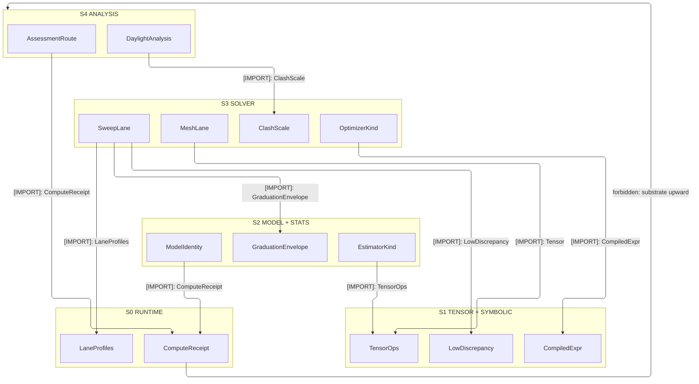
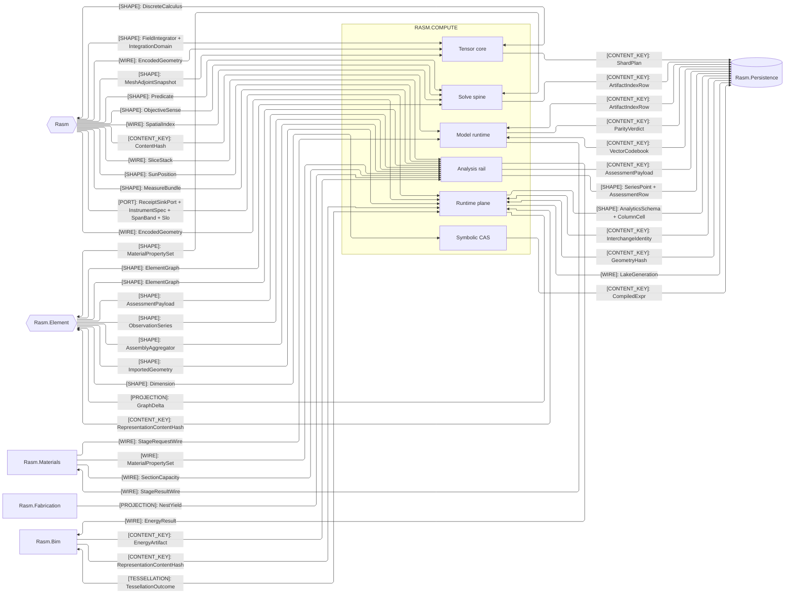
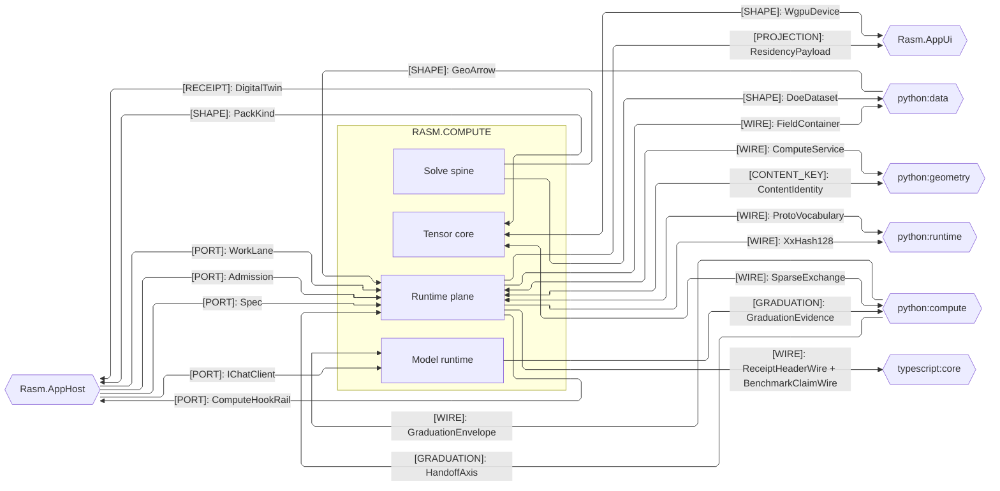
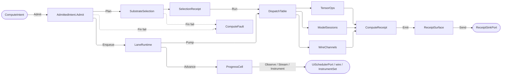

# [RASM_COMPUTE_ARCHITECTURE]

`Rasm.Compute` maps APP-PLATFORM measured execution over `{Rasm, Rasm.Element}`: one intent rail admits work once at the boundary, one substrate axis routes it over row data, bounded lanes carry it, and one `ComputeReceipt` union records every outcome across the Tensor, Symbolic, Model, Solver, Stats, Runtime, and Analysis folders. Each folder maps to exactly one namespace, and one polymorphic owner closes its axis over the `ComputeReceipt`/`ComputeFault` pair.

## [01]-[DOMAIN_MAP]

```text
Rasm.Compute/              # APP-PLATFORM measured execution over {Rasm, Rasm.Element}; one namespace per folder
├── Tensor/                # CPU tensor vocabulary and BLAS-class numeric core
│   ├── Vocabulary.cs      # Tensor<T> the only tensor owner, TensorDtype the CLR/ONNX map, TensorOpFamily the equivalence-keyed table
│   ├── Layout.cs          # LayoutForm named shapes, Contiguity over stride facts, AxisPermutation proving each bijection
│   ├── Dispatch.cs        # Each op-family row binds one arity kernel, claim-gated partition route, equivalence proof, and device lowering
│   ├── Residency.cs       # OrtResidency lattice; TensorBridge ingress/egress, DeviceMemory allocation, BoundFlow steady-state binding
│   ├── Memory.cs          # AllocationClass staging granted once against the intent-declared payload bound; AllocationEvidence fact stream
│   ├── Blas.cs            # Operand shape routes every dense solve — definite, square, overdetermined, symmetric — never the call site
│   ├── Factor.cs          # SparseFormat ingestion over CSR reality; FactoredOp recovers capability from the factor kind
│   ├── Quadrature.cs      # Kernel integration floor composed WHOLE; package-local re-declarations of that surface are the deleted form
│   └── Sampling.cs        # Owned-build Sobol/Halton and scatter kernels; every estimate leaves as a replicate family carrying its spread
├── Symbolic/              # Closed symbolic-expression CAS and unit boundary
│   ├── Expression.cs      # SymbolicExpr [ComplexValueObject] whose identity is the simplified normal-form content key ALONE
│   ├── Dimensional.cs     # DimensionMonomial as one Seq<ERational> of exponents; DimensionProof accumulates every compound mismatch
│   ├── Lowering.cs        # One IL-compiling lower per simplified expression; analytic-Jacobian arm, Enclosure interval pre-gate
│   └── Units.cs           # Frozen QuantityFamily rows admit unit-bearing input once and emit the seam conversion receipt
├── Model/                 # ONNX model identity, sessions, inference, and generative runs
│   ├── Identity.cs        # ModelIdentity checksum, SlotShape trees, and provenance; ModelSource folds the acquisition arms
│   ├── Sessions.cs        # One InferenceSession per policy-complete ResidentKey; capped shape buckets carry measured warm evidence
│   ├── Providers.cs       # ExecutionProvider rows select registration through host-gated discovery over one frozen runtime snapshot
│   ├── Run.cs             # RunOps over one shared session with bracketed native ownership; BatchGate, CacheOps
│   ├── Tiling.cs          # TilePlan binds TileProduct rows to PadMode/TileBlend/TileLayout kernels; TileMosaic the sole arena release
│   ├── Stage.cs           # Stage-execution wire — generated-family admission, StagePorts, plan construction
│   ├── Embedding.cs       # VectorEncoding axis, VectorScore metric axis, and the content-keyed EmbeddingVector over SIMD primitives
│   ├── Generative.cs      # One polymorphic GenerationEvent stream — Piece, ToolInvoked, terminal Completed with the run tally
│   └── Extension.cs       # CustomOps folds registration into session admission and reads the non-tensor model boundary
├── Solver/                # Discretize-solve-optimize-sweep solve spine
│   ├── Element.cs         # ElementClass rows carry reference nodes, Monomial space, and a ShapeFamily discriminant; ShearModel, CellQuality, Member
│   ├── Discretization.cs  # MeshLane tet/hex/boundary-layer generation over kernel Tessellation; Dörfler adaptive refinement
│   ├── Field.cs           # DiscreteMesh freezes nodes, connectivity, proven QuadratureRule, CellQuality; FieldStation × FieldRank seat FieldSpace
│   ├── Contract.cs        # Solve admission + dispatch: physics axis, SolveRoute/Convergence, LanePolicy, SolveSession
│   ├── Assembly.cs        # OperatorAssembly folds cells through one LocalBlock delegate; BoundaryCondition, ConstrainedSystem, InertiaFloor
│   ├── Route.cs           # RouteRequest is the carrier every body takes; RecoveryAction rungs are delegate columns, SolveArchive, CoupledLane
│   ├── Constitutive.cs    # ConstitutiveModel stress-update [Union] and ContactConstraint regularized normal enforcement
│   ├── Optimizer.cs       # One Optimize entry dispatches by OptimizerKind row to a kernel owning its own budget and adaptation
│   ├── Exact.cs           # ExactLane — CP-SAT/MILP/vehicle-routing rails, shadow prices, bound streams
│   ├── Sweep.cs           # SweepGrid DOE orchestration emitting a queryable ParetoFront with the sensitivity tornado
│   ├── Clash.cs           # ClashScale narrow-phase confirmation over the geometry-owned broad-phase wire; DigitalTwin scores live signals
│   ├── Uncertainty.cs     # UncertaintyMethod axis with a keyless UqStrategy driver and its own draw lane
│   └── Satisfy.cs         # Z3 VERIFIES-AND-EXPLAINS where CP-SAT OPTIMIZES; every ComplianceRule lowers to assertions from the CAS
├── Stats/                 # Classical statistics, statistical learning, and DSP
│   ├── Estimator.cs       # Estimator [Union] types the problem; Design/EstimatorPolicy/FitAmbients ingress, EstimatorModel/Prediction egress
│   ├── Families.cs        # [UseDelegateFromConstructor] binds every roster; TemporalSpec/DetectorSpec/CurveSpec, EstimatorKernels, IterativeEngine
│   ├── Signal.cs          # SpectralTransform rows carry transform and inverse delegates; IO<Fin<T>> keeps effect and fault distinct
│   └── Monitor.cs         # StreamMonitor stateful capsules advanced per sample by MonitorLane; every verdict a typed fact
├── Runtime/               # Admit-to-receipt boundary
│   ├── Admission.cs       # ComputeIntent union under the spine Spec policy; the Substrate axis routes with total dispatch
│   ├── Scheduling.cs      # Bounded WorkLane channel rows behind one LaneRuntime capsule; drops emit correlated Backpressure receipts
│   ├── Progress.cs        # Monotonic ProgressPhase family; ProgressCell commits under rank guards; ProgressStream serves Watch
│   ├── Receipts.cs        # ComputeReceipt the only fact vocabulary — payload spine, telemetry projection, folds
│   ├── Claims.cs          # BenchmarkInput admits, BenchDistribution measures, ProfileArtifact addresses, BenchmarkClaim binds, HostClaims forecasts
│   ├── Ledger.cs          # CostVector the per-axis monoid, CostPolicy the admitted rate table proving substrate coverage, ChargebackDataset
│   ├── Board.cs           # FactSelector samples facts, ComputeObjective binds a kernel indicator, PanelRow/ComputeDescriptors and ComputeHookRail
│   ├── Wire.cs            # Proto vocabulary, ParseGuard admission, the WireKeys lowering, and the client fault rail over Rasm.Contracts
│   ├── Channels.cs        # RemoteTransport dial axis warmed by its row's WarmProbe; one GrpcChannelPolicy; WireLimits and the artifact-frame law
│   ├── Ingest.cs          # BrokerBinding carries MQTT 5.0 and NATS whole; CaptureAdmission fans each delivery two ways; BsddTransport the REST leg
│   ├── Observation.cs     # ObservationLane accumulates and flushes per binding; SensorBinding custody, SensorQuality flags, ObservationSink ports
│   ├── Codecs.cs          # DeltaCodec owns FastCDC chunking and the Quantization bit budget; CanonicalForm/InterchangeIdentity, ArrowBatch
│   ├── Archive.cs         # HdfArchive/HdfHandle/HdfWriter bracket the session, HdfArchivePolicy seats DeflateGrade/FilterStage, ChunkGrid inverts
│   ├── Field.cs           # FieldPack encodes the 64-byte header; FieldResidence/Compression/FieldElement gate wire codes; InterchangeIo dispatches
│   ├── Tiles.cs           # Tessellation companion client, 3D-Tiles octree, tileset manifest
│   └── Payload.cs         # Four encode arms on one ResidencyKind axis; cone-cullable clusters and level-clamped quantization
└── Analysis/              # C#-first discipline-assessment rail over the ElementGraph
    ├── Assessment.cs      # Route/request/fact algebra, commissioning, AnalysisReads planar owner
    ├── Dispatch.cs        # RerunPolicy carries the stale read; AssessmentSink three legs, AssessmentRow the neutral row, ComputeReceipt.Assessment
    ├── Aggregator.cs      # AssemblyAggregator folds a seam composition into layered-construction physics; analysis, never authoring
    ├── Frame.cs           # FrameModel folds member axes, SectionProperties, and projected edges; Solve bounds one signed MemberResponse per member
    ├── Capacity.cs        # (DesignCode, LimitState) capacity table with generator-built cells; the response-spectrum seismic route
    ├── Physics.cs         # One BuildingPhysics kernel collapses the thermal, acoustic, and fire arms as closed-form ISO/EN folds
    ├── Energy.cs          # In-process OpenStudio Model build from the graph; local and cloud runs converge on the one SqlFile fold
    ├── Lifecycle.cs       # EN 15978 embodied-carbon takeoff and cost rollup folding the aggregator over seam compositions
    ├── Circulation.cs     # Exit-rooted Dijkstra over a discarded adjacency view governs travel, dead-end, common-path, and RSET
    └── Daylight.cs        # PerezBand carries the published six-coefficient table; SkyState per hour, WeatherSource ingress, DaylightPolicy cadence
```

Implementation collapses to one owner per axis and one entrypoint family per rail: a new feature is a row or case on a budgeted owner, and a public type outside an owner region is the named defect. Rail is named in the return type: `Fin<T>` aborts at admission, `Validation<Error,T>` accumulates (the monoidal `Error` carrier; typed `ComputeFault` arms lift onto it through their `Fault` base, since `ComputeFault` is not itself a monoid), `IO<T>` carries effects, `Option<T>` carries absence.

`ComputeFault` projects through AppHost `FaultWire.Raise` onto one `FaultDetail` at the wire edge; receipts stamp NodaTime `Instant` off the threaded `IClock` and `Duration` off kernel `MonotonicTimeline`, both built at the app root where `ClockPolicy` stays.

## [02]-[STRATA]

Strata rank the interior; `Runtime` seats lowest as the vocabulary mint, its dispatch table routes to the work-lane owners, and every consumption edge points down.

- S0 law — the `ComputeReceipt` union gains cases as partials DECLARED by the owning stratum: co-ownership, never an upward import.
- S0 `Runtime` — `LaneProfiles` keys on the spine `WorkLane` roster.
- S1 law — `Tensor` and `Symbolic` co-seat with no edge between them; numeric lowering and symbolic compilation meet only at the solver stratum.
- S2 law — `Model` guards its rank at the `GraduationEnvelope` gate, so an offline-learned artifact enters as content-keyed evidence, not an import.
- S2 co-seat — `Stats` and `Model` share the rank with no edge between them, each reaching down alone.
- S3 law — the solve spine composes surrogates, symbols, and samplers as values on its own request rows, so no lower stratum names a solver type.
- S4 law — nothing composes `Analysis`; the rail reads the concrete `ElementGraph` above the seam and writes content-keyed deltas back.



## [03]-[SEAMS]

`libs/contracts` owns generated `StageResultWire`: `Model/stage#STAGE_WIRE` mints it from Compute measurements, and `Rasm.Materials` admits it through its registry gate. Materials owns the `ParityFresh`, `Coverage`, and `InferGolden` columns; Compute adds none.





## [04]-[INTERNAL]



Spine admits once, selects substrate over row data, enqueues on bounded lanes, dispatches to the tensor, model, or remote lane, and lands every outcome on a `ComputeReceipt` case at the sink while admission and selection failures fall to `ComputeFault` and `ProgressCell` streams cadence-gated marks. Per-stage guards, conditioning, and rails each lane composes live on the owning implementation pages.

One owner per concern rules the interior: `Tensor<T>` is the tensor and `TensorBridge` the sole `OrtValue` C-data factory feeding the single `BoundFlow` capsule; oracles couple only through the `Func<DesignPoint, Fin<Seq<double>>>` contract; one `HybridCache` binds per cache lane and one session per model identity.

Assessment outcome is the one `ComputeReceipt.Assessment` case `Analysis/assessment` declares as a `Runtime/receipts` partial, every discipline runner returning the uniform `AssessmentResult` stream. `ComputeFault` is one 2200-band union `Runtime/admission` custodies across partial lanes; each lane appends its arm at the band's free frontier, and every fault crosses the wire through the compact `FaultDetail` envelope with `domain` and `case` as its sole identity.

## [05]-[ROUTING]

| [INDEX] | [CHANGE]                         | [OWNER_SURFACE]          | [SHAPE_OF_THE_EDIT]                                            |
| :-----: | :------------------------------- | :----------------------- | :------------------------------------------------------------- |
|  [01]   | new execution device or backend  | `Tensor/residency.md`    | one `Substrate` row                                            |
|  [02]   | new sparse tensor operation      | `Tensor/factor.md`       | one `SparseTensorOpFamily` row                                 |
|  [03]   | new differentiable primitive     | `Tensor/dispatch.md`     | one `DifferentiableOp` case at `[03]-[EQUIVALENCE_INTEROP]`    |
|  [04]   | new estimator, optimizer, or UQ  | `Solver/optimizer.md`    | one `EstimatorKind`/`OptimizerKind`/`UncertaintyMethod` row    |
|  [05]   | new material stress-update law   | `Solver/constitutive.md` | one `ConstitutiveModel` case                                   |
|  [06]   | new discipline assessment        | `Analysis/assessment.md` | one `AssessmentResult` runner over the shared fact stream      |
|  [07]   | new fault arm                    | `Runtime/admission.md`   | one arm at the 2200-band free frontier on its custody lane     |
|  [08]   | new execution provider           | `Model/providers.md`     | one `ExecutionProvider` row; `Resolve` already answers absence |
|  [09]   | new tile border, seam, or layout | `Model/inference.md`     | one `PadMode`, `TileBlend`, or `TileLayout` row                |
|  [10]   | new sparse GEMV modality         | `Tensor/factor.md`       | one `GemvForm` case                                            |

## [06]-[BOUNDARIES]

Seam graph carries which owner exchanges which shape; the load-bearing cross-boundary invariants each Compute owner holds are:
- `Substrate.DeviceWgpu` binds the AppUi-owned wgpu device and holds compute-only resources; no second device or residency lattice.
- `Tensor/residency` consumes the host-neutral `EncodedGeometry` whole as `EncodedTensor` for the model lane.
- `Runtime/codecs` reads the same `EncodedGeometry` carrier for the lake landing.
- Geometry consumers compose the kernel's dtype-dispatched channel readers rather than re-slicing its arena.
- Host geometry folds at the kernel and AppHost capsules; no host type reaches an interior `Tensor`/`Solve`/`Estimator` signature.
- Compute owns the channel and companion-rpc orchestration; `Rasm.Bim` owns every semantic read, and neither crosses the seam.
- Strata run one direction: the AEC peers admit `UnitsNet` in-folder rather than reference the app-platform unit and solve owners downward.
- `Analysis` reads the concrete `ElementGraph` upward and writes a content-keyed assessment `GraphDelta` the caller applies; it mutates nothing.
- C# owns inference and classical fit; Python compute owns offline-learned models exchanged by content key over graduation evidence.
- `Rasm.Materials` SPECIFIES photo-to-PBR inference and `Model/inference` EXECUTES it; the stage crossing is the corpus `stage-crossing` case.
- Stage, model-card, and role identities cross as opaque keys this side dispatches on none of.
- Licence spellings resolve here to a grant verdict on the Compute-owned roster, fail-closed on an unrostered spelling.
- Strata forbid a reference in either direction; admitting a model at the specifying end moves no Compute surface.
- `EnergyToolchain` resolves EnergyPlus by env var, configured path, or bundle; no hardcoded path or token column enters the policy.
- `EnergyRoute` converges local and cloud runs on the one `SqlFile` fold.
- Closed-form ISO/EN folds and the multi-ply `AssemblyAggregator` live in `Analysis`; single-material folds stay seam-owned, composed here.
- Design codes ride the `DesignCode`×`LimitState` capacity table.
- `Analysis/daylight` consumes the kernel `Spatial.Apply(SpatialOp.Wire)` decoded scene as the app-staged `ObstructionScene` payload.
- Daylight content key folds the assessment content key, so a re-shaded site re-keys; site evidence is the EPW header or the explicit `SolarSite`.
- `Runtime/receipts` descriptor and chargeback rows stay Compute-owned data a composition owner encodes onward; Compute owns no IaC surface.
- Every ledger fold reads the kernel `TenantContext` stamped on the message envelope as its tenant partition, never a Compute-minted tenancy.
- `Runtime/ingest` owns ONE pump over both `BrokerBinding` rows; the pump opens no span, and parent adoption stays the kernel causal-frame band's.
- `Runtime/codecs` owns the ONE HDF5 archive session; every composing cluster reaches the library through it and opens no `H5File` of its own.
- Archive artifacts egress content-keyed through `ArtifactIndexRow.Admit`; the Persistence retention owner classes them by `ArtifactKind`.
- `Runtime/codecs` builds every columnar `RecordBatch` Compute produces over the kernel encode.
- Persistence `api-arrow` overlay carries IPC, LZ4/Zstd, ADBC, and Flight-SQL; `Query/lakehouse#FLAT_TABLE_EGRESS` `Land` redeems the batch.
- Row-major lake arms COMPOSE Persistence `Query/residence#COLUMN_VOCABULARY` `ArrowLanding.Build`; geometry alone borrows the kernel arena verbatim.
- Compute holds one core `Apache.Arrow` reference and opens no Flight listener.
