# [RASM_FABRICATION_PRODUCTION]

`Production.Plan` owns additive build admission, orientation search, plate placement, layer-program compilation, and `3MF` publication. One `BuildJob` carries every model and its genealogy, one `OrientedPart` fixes model and slices in the same frame, and one `BuildOutcome` retains machine, packing, orientation, audit, resource, warning, and read-back evidence.

Wire posture: HOST-LOCAL. `BuildJob` and `AdditiveBuild` enter once; `Receipt<PlateLayoutEvidence>` and `RobotEvidence` arrive across the two declared peer ports; `ThreeMfArtifact` leaves through `ContentKey.Of(EgressKind.ThreeMf)`. `Additive/support` publishes the ONE `SupportTopology` this page reads for beam lattices, `Additive/scanpath` publishes `ScanPlan`, `Verify/audit` gates growth through `Audit.Preflight`, and the kernel owns slicing (`Slicing.Apply`), bounds (`Analyze.Run`), and every reproducible draw (`Deterministic`). Native `Lib3MF` handles live and die inside `ThreeMf.Write`; every published shape carries content keys, counts, and typed evidence alone.

## [01]-[INDEX]

- [02]-[PROCESS_AXES]: `AdditiveProcess` capability axes, head, atmosphere, program-kind, layer-channel, and objective vocabularies.
- [03]-[MACHINE_ENVELOPE]: `MachineProfile` operating envelopes, feedstock lot genealogy, and calibration state.
- [04]-[DEMAND]: `BuildPart`, `BuildJob`, `AdditiveBuild`, and the two declared peer ports.
- [05]-[ORIENTATION]: Geometry-generated candidate set, per-axis measurement, `EnvelopeDemand` gating, and verdict selection.
- [06]-[COMPILATION]: One layer-program owner over every additive modality and the robot artifact beside it.
- [07]-[RESOURCE_GRAPH]: `ThreeMfDocument` resource families, sampled implicit fields as data, and the attachment path owner.
- [08]-[NATIVE_WRITE]: The bounded `Lib3MF` writer lease, extension probe, and structural read-back.
- [09]-[DELIVERY]: `Production.Plan`, the declared census projection, and `BuildOutcome`.

## [02]-[PROCESS_AXES]

- Owner: `AdditiveProcess` binds each admitted `ProcessKind` to its head, the carriages it runs on, the atmospheres it admits, its program kind, and the two capability axes a downstream gate reads.
- Law: machine admission is a CAPABILITY-AXES predicate, never row equality. A process names the SET of carriages and atmospheres it admits, so directed energy on a gantry and directed energy on an arm are one row rather than an inexpressible pair; an equality roster made every such pairing a new row and left the pairing it omitted unreachable.
- Law: `Recoated` and `Supported` are the two axes every consuming gate keys on, so `Verify/audit` reads process capability off this owner and mints no parallel modality vocabulary. Binder jetting is recoated and unsupported — its green part is held by the surrounding powder cake — and sheet lamination is neither, its surrounding sheet decubing away. A gate keyed to a recoater alone therefore reaches a modality that builds no support, which is exactly the separation an unsupported-mass trend needs.
- Cases: `LayerChannel` is the one per-layer column vocabulary, each row declaring its UCUM unit and the track FORM that carries it, so a modality's program is a set of declared channels rather than a case per modality.
- Cases: `OrientationAxis` is the one objective vocabulary; each row carries the kernel `Rasm.Solving` `ObjectiveSense` row and the UCUM unit of its physical measure, so weight coverage, cost direction, per-axis admission, and unit provenance all derive from the declaration list — direction spells `Sense.Sign`, never a local minimize/maximize roster.
- Growth: a modality is one `AdditiveProcess` row naming its `BuildProgramKind`; a per-layer column is one `LayerChannel` row on that kind; an objective is one `OrientationAxis` row that `OrientationWeights` demands of every weight table.
- Boundary: `ProcessKind`, `KinematicClass`, and `MachineInstance` belong to `Process/family` and `Kinematics/fleet`, and `ObjectiveSense` to the kernel `Rasm/Solving/solver#LM_FUNCTOR` direction vocabulary; this owner composes them and re-declares none.

```csharp
// --- [RUNTIME_PRELUDE] -----------------------------------------------------------------
using System.Globalization;
using System.Text;
using Lib3MF;
using LanguageExt;
using LanguageExt.Common;
using LanguageExt.Traits;
using NodaTime;
using QuikGraph;
using Rasm.Analysis;
using Rasm.Domain;
using Rasm.Element.Projection;
using Rasm.Fabrication.Kinematics;
using Rasm.Fabrication.Process;
using Rasm.Fabrication.Verify;
using Rasm.Meshing;
using Rasm.Solving;
using Rhino.Geometry;
using Riok.Mapperly.Abstractions;
using Thinktecture;
using UnitsNet;
using static LanguageExt.Prelude;

namespace Rasm.Fabrication.Additive;

// --- [TYPES] ---------------------------------------------------------------------------
[SmartEnum<string>]
public sealed partial class BuildHead {
    public static readonly BuildHead Extruder = new("extruder");
    public static readonly BuildHead Laser = new("laser");
    public static readonly BuildHead ElectronBeam = new("electron-beam");
    public static readonly BuildHead DirectedEnergy = new("directed-energy");
    public static readonly BuildHead VatProjector = new("vat-projector");
    public static readonly BuildHead Binder = new("binder");
    public static readonly BuildHead MaterialJet = new("material-jet");
    public static readonly BuildHead Laminator = new("laminator");
}

[SmartEnum<string>]
public sealed partial class BuildAtmosphere {
    public static readonly BuildAtmosphere Ambient = new("ambient");
    public static readonly BuildAtmosphere Inert = new("inert");
    public static readonly BuildAtmosphere Vacuum = new("vacuum");
    public static readonly BuildAtmosphere Resin = new("resin");
}

[SmartEnum<string>]
public sealed partial class TrackForm {
    public static readonly TrackForm Scalar = new("scalar");
    public static readonly TrackForm Reference = new("reference");
    public static readonly TrackForm Contour = new("contour");
}

[SmartEnum<string>]
public sealed partial class LayerChannel {
    public static readonly LayerChannel Exposure = new("exposure", unit: "s", form: TrackForm.Scalar);
    public static readonly LayerChannel Lift = new("lift", unit: "mm", form: TrackForm.Scalar);
    public static readonly LayerChannel Saturation = new("saturation", unit: "1", form: TrackForm.Scalar);
    public static readonly LayerChannel Recoat = new("recoat", unit: "mm/s", form: TrackForm.Scalar);
    public static readonly LayerChannel Cure = new("cure", unit: "s", form: TrackForm.Scalar);
    public static readonly LayerChannel Tint = new("tint", unit: "{key}", form: TrackForm.Reference);
    public static readonly LayerChannel Bond = new("bond", unit: "{key}", form: TrackForm.Reference);
    public static readonly LayerChannel Sheet = new("sheet", unit: "{contour}", form: TrackForm.Contour);

    public string Unit { get; }
    public TrackForm Form { get; }
}

[SmartEnum<string>]
public sealed partial class BuildProgramKind {
    public static readonly BuildProgramKind Extrusion = new("extrusion", Set<LayerChannel>(), vectors: true);
    public static readonly BuildProgramKind Exposure = new("exposure", Set<LayerChannel>(), vectors: true);
    public static readonly BuildProgramKind Vat = new("vat", Set(LayerChannel.Exposure, LayerChannel.Lift), vectors: false);
    public static readonly BuildProgramKind Deposition = new("deposition", Set<LayerChannel>(), vectors: false);
    public static readonly BuildProgramKind Binder = new("binder", Set(LayerChannel.Saturation, LayerChannel.Recoat), vectors: false);
    public static readonly BuildProgramKind MaterialJet = new("material-jet", Set(LayerChannel.Cure, LayerChannel.Tint), vectors: false);
    public static readonly BuildProgramKind Lamination = new("lamination", Set(LayerChannel.Sheet, LayerChannel.Bond), vectors: false);

    public Set<LayerChannel> Channels { get; }
    public bool Vectors { get; }
}

[SmartEnum<string>]
public sealed partial class OrientationAxis {
    public static readonly OrientationAxis Support = new("support", ObjectiveSense.Minimize, unit: "mm3");
    public static readonly OrientationAxis Height = new("height", ObjectiveSense.Minimize, unit: "mm");
    public static readonly OrientationAxis Footprint = new("footprint", ObjectiveSense.Maximize, unit: "mm2");
    public static readonly OrientationAxis Anisotropy = new("anisotropy", ObjectiveSense.Minimize, unit: "1");
    public static readonly OrientationAxis Thermal = new("thermal", ObjectiveSense.Minimize, unit: "J");
    public static readonly OrientationAxis Stress = new("stress", ObjectiveSense.Minimize, unit: "Pa");
    public static readonly OrientationAxis Recoater = new("recoater", ObjectiveSense.Maximize, unit: "mm");
    public static readonly OrientationAxis Trap = new("trap", ObjectiveSense.Minimize, unit: "mm2");
    public static readonly OrientationAxis Escape = new("escape", ObjectiveSense.Maximize, unit: "1");
    public static readonly OrientationAxis Time = new("time", ObjectiveSense.Minimize, unit: "s");

    public ObjectiveSense Sense { get; }
    public string Unit { get; }
}

[SmartEnum<string>]
public sealed partial class AdditiveProcess {
    public static readonly AdditiveProcess FusedFilament = new("fff",
        ProcessKind.FusedFilament, BuildHead.Extruder, Set(KinematicClass.CartesianGantry),
        Set(BuildAtmosphere.Ambient, BuildAtmosphere.Inert), BuildProgramKind.Extrusion,
        recoated: false, supported: true);
    public static readonly AdditiveProcess PowderBed = new("lpbf",
        ProcessKind.PowderBed, BuildHead.Laser, Set(KinematicClass.CartesianGantry),
        Set(BuildAtmosphere.Inert), BuildProgramKind.Exposure,
        recoated: true, supported: true);
    public static readonly AdditiveProcess ElectronBeam = new("ebm",
        ProcessKind.ElectronBeam, BuildHead.ElectronBeam, Set(KinematicClass.CartesianGantry),
        Set(BuildAtmosphere.Vacuum), BuildProgramKind.Exposure,
        recoated: true, supported: true);
    public static readonly AdditiveProcess Vat = new("vat",
        ProcessKind.VatPolymer, BuildHead.VatProjector, Set(KinematicClass.CartesianGantry),
        Set(BuildAtmosphere.Resin), BuildProgramKind.Vat,
        recoated: false, supported: true);
    public static readonly AdditiveProcess DirectedEnergy = new("ded",
        ProcessKind.DirectedEnergy, BuildHead.DirectedEnergy,
        Set(KinematicClass.ArticulatedArm, KinematicClass.CartesianGantry),
        Set(BuildAtmosphere.Inert, BuildAtmosphere.Ambient), BuildProgramKind.Deposition,
        recoated: false, supported: true);
    public static readonly AdditiveProcess BinderJet = new("binder",
        ProcessKind.BinderJet, BuildHead.Binder, Set(KinematicClass.CartesianGantry),
        Set(BuildAtmosphere.Inert, BuildAtmosphere.Ambient), BuildProgramKind.Binder,
        recoated: true, supported: false);
    public static readonly AdditiveProcess MaterialJet = new("material-jet",
        ProcessKind.MaterialJet, BuildHead.MaterialJet, Set(KinematicClass.CartesianGantry),
        Set(BuildAtmosphere.Ambient), BuildProgramKind.MaterialJet,
        recoated: false, supported: true);
    public static readonly AdditiveProcess SheetLamination = new("sheet-lamination",
        ProcessKind.SheetLamination, BuildHead.Laminator, Set(KinematicClass.CartesianGantry),
        Set(BuildAtmosphere.Ambient), BuildProgramKind.Lamination,
        recoated: false, supported: false);

    public ProcessKind Kind { get; }
    public BuildHead Head { get; }
    public Set<KinematicClass> Carriages { get; }
    public Set<BuildAtmosphere> Atmospheres { get; }
    public BuildProgramKind Program { get; }
    public bool Recoated { get; }
    public bool Supported { get; }

    public bool Admits(MachineProfile profile) =>
        profile.Machine.EnabledProcesses.Contains(Kind)
        && profile.Head == Head
        && Carriages.Contains(profile.Carriage)
        && Atmospheres.Contains(profile.Atmosphere);
}
```

## [03]-[MACHINE_ENVELOPE]

- Owner: `MachineProfile` carries the operating envelope, layer range, thermal chamber, atmosphere, carriage, recoater, source fields, calibration, material, chamber pressure, and throughput facts.
- Owner: `FeedstockBlend` carries lot genealogy, certificates, sieve history, exposure count, reuse count, and refresh composition into every part and receipt.
- Law: a machine states its chamber pressure as a target and a BAND, because a chamber holds a setpoint within a regulator tolerance and never reproduces a float exactly; an equality test against the setpoint refuses every real machine.
- Auto: `Physical.Finite` is the ONE finiteness fold on this page; a second copy beside a validator is the deleted duplicate.
- Packages: `UnitsNet` seats every operating-envelope dimension; `NodaTime` seats calibration age; Thinktecture closes construction.
- Boundary: `MachineInstance` and its enabled-process census belong to `Kinematics/fleet`; the profile composes one instance and re-declares no fleet state.

```csharp
// --- [CONSTANTS] -----------------------------------------------------------------------
public static class Physical {
    public static bool Finite(params ReadOnlySpan<double> values) {
        foreach (double value in values) { if (!double.IsFinite(value)) return false; }
        return true;
    }
}

// --- [MODELS] --------------------------------------------------------------------------
[ValueObject<string>(KeyMemberName = "Value", KeyMemberAccessModifier = AccessModifier.Public)]
public readonly partial struct FeedstockLotKey {
    [BoundaryAdapter]
    static partial void ValidateFactoryArguments(ref ValidationError? validationError, ref string value) {
        value = value.Trim();
        if (!Witness.Keyed(value))
            validationError = new ValidationError("feedstock-lot-key");
    }

    public static Fin<FeedstockLotKey> Admit(string value) => Admission.OfValue<FeedstockLotKey, string>(value);
}

[ComplexValueObject]
public sealed partial class FeedstockLot {
    public FeedstockLotKey Key { get; }
    public MaterialSpec Material { get; }
    public ContentKey Certificate { get; }
    public Mass Received { get; }
    public Mass Available { get; }
    public int ReuseCount { get; }
    public int ExposureCount { get; }
    public Option<ContentKey> SieveHistory { get; }
    public Option<FeedstockLotKey> Parent { get; }

    [BoundaryAdapter]
    static partial void ValidateFactoryArguments(
        ref ValidationError? validationError,
        ref FeedstockLotKey key,
        ref MaterialSpec material,
        ref ContentKey certificate,
        ref Mass received,
        ref Mass available,
        ref int reuseCount,
        ref int exposureCount,
        ref Option<ContentKey> sieveHistory,
        ref Option<FeedstockLotKey> parent) {
        if (!Physical.Finite(received.Kilograms, available.Kilograms)
            || received <= Mass.Zero || available < Mass.Zero || available > received
            || reuseCount < 0 || exposureCount < 0)
            validationError = new ValidationError("feedstock-lot");
    }

    public static Fin<FeedstockLot> Admit(
        FeedstockLotKey key,
        MaterialSpec material,
        ContentKey certificate,
        Mass received,
        Mass available,
        int reuseCount,
        int exposureCount,
        Option<ContentKey> sieveHistory,
        Option<FeedstockLotKey> parent) =>
        Validate(key, material, certificate, received, available, reuseCount, exposureCount, sieveHistory, parent,
            out FeedstockLot lot).Admitted(lot);
}

public readonly record struct FeedstockConstituent(FeedstockLot Lot, Ratio Fraction);

[ComplexValueObject]
public sealed partial class FeedstockBlend {
    public Seq<FeedstockConstituent> Constituents { get; }
    public Ratio VirginFraction { get; }
    public Ratio RefreshFraction { get; }

    public Mass Available => UnitMath.Sum(
        Constituents.Map(static row => row.Lot.Available * row.Fraction.DecimalFractions),
        UnitsNet.Units.MassUnit.Kilogram);

    [BoundaryAdapter]
    static partial void ValidateFactoryArguments(
        ref ValidationError? validationError,
        ref Seq<FeedstockConstituent> constituents,
        ref Ratio virginFraction,
        ref Ratio refreshFraction) {
        double sum = constituents.Sum(static row => row.Fraction.DecimalFractions);
        if (constituents.IsEmpty
            || constituents.Map(static row => row.Lot.Key).Distinct().Count != constituents.Count
            || constituents.Exists(static row => !Physical.Finite(row.Fraction.DecimalFractions) || row.Fraction <= Ratio.Zero)
            || !Physical.Finite(sum, virginFraction.DecimalFractions, refreshFraction.DecimalFractions)
            || Math.Abs(sum - 1.0) > AdditivePolicyRows.CompositionBand
            || virginFraction < Ratio.Zero || refreshFraction < Ratio.Zero
            || virginFraction + refreshFraction > Ratio.FromPercent(100))
            validationError = new ValidationError("feedstock-blend");
    }

    public static Fin<FeedstockBlend> Admit(
        Seq<FeedstockConstituent> constituents, Ratio virginFraction, Ratio refreshFraction) =>
        Validate(constituents, virginFraction, refreshFraction, out FeedstockBlend blend).Admitted(blend);
}

public sealed record BuildEnvelope(Length X, Length Y, Length Z) {
    public bool Contains(BoundingBox bounds) =>
        Physical.Finite(X.Millimeters, Y.Millimeters, Z.Millimeters)
        && bounds.IsValid
        && bounds.Diagonal.X <= X.Millimeters
        && bounds.Diagonal.Y <= Y.Millimeters
        && bounds.Diagonal.Z <= Z.Millimeters;
}

public sealed record LayerEnvelope(Length Minimum, Length Maximum, Length Resolution);
public sealed record ThermalEnvelope(Temperature Minimum, Temperature Maximum, TemperatureDelta Uniformity, Power Available);
public sealed record RecoaterEnvelope(Length Clearance, Speed Traverse, Force MaximumLoad, Length ParticleCeiling);
public sealed record CalibrationState(ContentKey Key, Instant CalibratedAt, Duration MaximumAge, Ratio PowerDrift);

public sealed record AtmosphereEnvelope(Pressure Setpoint, Pressure Band) {
    public bool Holds(Pressure measured) =>
        Physical.Finite(Setpoint.Pascals, Band.Pascals, measured.Pascals)
        && Band >= Pressure.Zero
        && Math.Abs(measured.Pascals - Setpoint.Pascals) <= Band.Pascals;
}

[ComplexValueObject]
public sealed partial class MachineProfile {
    public MachineInstance Machine { get; }
    public AdditiveProcess Process { get; }
    public BuildHead Head { get; }
    public KinematicClass Carriage { get; }
    public BuildAtmosphere Atmosphere { get; }
    public BuildEnvelope Build { get; }
    public LayerEnvelope Layer { get; }
    public ThermalEnvelope Thermal { get; }
    public Option<RecoaterEnvelope> Recoater { get; }
    public Arr<LaserSource> Sources { get; }
    public CalibrationState Calibration { get; }
    public Set<Material> Materials { get; }
    public AtmosphereEnvelope Chamber { get; }
    public MassFlow FeedstockThroughput { get; }

    [BoundaryAdapter]
    static partial void ValidateFactoryArguments(
        ref ValidationError? validationError,
        ref MachineInstance machine,
        ref AdditiveProcess process,
        ref BuildHead head,
        ref KinematicClass carriage,
        ref BuildAtmosphere atmosphere,
        ref BuildEnvelope build,
        ref LayerEnvelope layer,
        ref ThermalEnvelope thermal,
        ref Option<RecoaterEnvelope> recoater,
        ref Arr<LaserSource> sources,
        ref CalibrationState calibration,
        ref Set<Material> materials,
        ref AtmosphereEnvelope chamber,
        ref MassFlow feedstockThroughput) {
        if (!Physical.Finite(build.X.Millimeters, build.Y.Millimeters, build.Z.Millimeters)
            || build.X <= Length.Zero || build.Y <= Length.Zero || build.Z <= Length.Zero
            || !Physical.Finite(layer.Minimum.Millimeters, layer.Maximum.Millimeters, layer.Resolution.Millimeters)
            || layer.Minimum <= Length.Zero || layer.Maximum < layer.Minimum || layer.Resolution <= Length.Zero
            || !Physical.Finite(thermal.Minimum.DegreesCelsius, thermal.Maximum.DegreesCelsius,
                thermal.Uniformity.DegreesCelsius, thermal.Available.Watts)
            || thermal.Minimum >= thermal.Maximum || thermal.Uniformity < TemperatureDelta.Zero
            || thermal.Available <= Power.Zero
            || recoater.Exists(static value => !Physical.Finite(value.Clearance.Millimeters, value.Traverse.MetersPerSecond,
                    value.MaximumLoad.Newtons, value.ParticleCeiling.Millimeters)
                || value.Clearance < Length.Zero || value.Traverse <= Speed.Zero
                || value.MaximumLoad <= Force.Zero || value.ParticleCeiling <= Length.Zero)
            || (process.Program.Vectors && sources.IsEmpty)
            || sources.Exists(static field => field.Id.ToValue() < 0 || !field.Field.IsValid
                || !Physical.Finite(field.MaximumPower.Watts, field.SpotDiameter.Millimeters, field.StitchWidth.Millimeters)
                || field.MaximumPower <= Power.Zero || field.SpotDiameter <= Length.Zero || field.StitchWidth < Length.Zero)
            || sources.Map(static field => field.Id).Distinct().Count != sources.Count
            || !Physical.Finite(calibration.MaximumAge.TotalSeconds, calibration.PowerDrift.DecimalFractions)
            || calibration.MaximumAge <= Duration.Zero
            || calibration.PowerDrift < Ratio.Zero || calibration.PowerDrift >= Ratio.FromPercent(100)
            || !Physical.Finite(chamber.Setpoint.Pascals, chamber.Band.Pascals, (double)feedstockThroughput.Value)
            || materials.IsEmpty || chamber.Setpoint < Pressure.Zero || chamber.Band < Pressure.Zero
            || feedstockThroughput <= MassFlow.Zero)
            validationError = new ValidationError("machine-profile");
    }

    public static Fin<MachineProfile> Admit(
        MachineInstance machine,
        AdditiveProcess process,
        BuildHead head,
        KinematicClass carriage,
        BuildAtmosphere atmosphere,
        BuildEnvelope build,
        LayerEnvelope layer,
        ThermalEnvelope thermal,
        Option<RecoaterEnvelope> recoater,
        Arr<LaserSource> sources,
        CalibrationState calibration,
        Set<Material> materials,
        AtmosphereEnvelope chamber,
        MassFlow feedstockThroughput) =>
        Validate(machine, process, head, carriage, atmosphere, build, layer, thermal, recoater, sources,
            calibration, materials, chamber, feedstockThroughput, out MachineProfile profile).Admitted(profile);
}
```

## [04]-[DEMAND]

- Owner: `BuildJob` is the sole demand shape; `Single` and `Plate` both carry complete `BuildPart` values, so no model travels beside the discriminant.
- Owner: `BuildPorts` carries the TWO peer capabilities this page cannot reach: rectangular plate packing belongs to `Nesting`, and articulated deposition programming belongs to `Kinematics`. Neither stratum grants this page an import edge, so each binds as a declared delegate column under the absent-peer law — and every OTHER algorithm this page charters is a member of this page. An injected objective on a page that owns the objective vocabulary makes the charter unfalsifiable, which is why `Score` is a member here and not a column.
- Law: `AdditivePolicyRows` is the ONE anchor block; a bare literal in a validator or a body is the deleted form, and every anchor names the fact it bounds.
- Law: a metadata key becomes a package URI segment, so it admits through the bounded segment grammar at the job gate — a non-blank check passes a slash, a dot segment, or a percent and forges a path.
- Law: a plate policy states the TURNS it admits, never a free-or-fixed boolean. A packer seats footprints on a quarter-turn or half-turn roster as often as it seats them free, and the placement gate proves the returned bearing against that set — the arm a boolean could not carry because it named no angle.
- Law: `RobotEvidence` carries warnings and no errors. The port already answers on the `Fin` rail, so a success carrying its own failures was a second refusal channel beside the one the caller reads, and the artifact gate refused every value that used it.
- Boundary: `PartTransform` is the S0 placement atom and carries `Mirrored`; a mirrored placement is refused at the write seam rather than silently dropped, because a mirrored component inverts every normal the manifold proof just established.

```csharp
// --- [CONSTANTS] -----------------------------------------------------------------------
public static class AdditivePolicyRows {
    public const double CompositionBand = 1e-9;

    public const double ResolutionStepBand = 1e-6;

    public const double CanonicalGridMm = 1e-6;

    public const int SegmentCeiling = 64;

    public const int PrecisionFloor = 1;
    public const int PrecisionCeiling = 17;
}

// --- [MODELS] --------------------------------------------------------------------------
public sealed record BuildPart(
    Guid Identity,
    MeshSpace Model,
    Material Material,
    sColor Color,
    FeedstockBlend Feedstock,
    Seq<uint> TriangleMaterials,
    Seq<ThreeMfResource> Resources,
    HashMap<string, string> Metadata) {
    public string IdentityText => Identity.ToString("D", CultureInfo.InvariantCulture);
}

[Union(ConversionFromValue = ConversionOperatorsGeneration.None)]
public abstract partial record BuildJob {
    private BuildJob() { }

    public sealed record Single(BuildPart Part) : BuildJob;
    public sealed record Plate(Seq<BuildPart> Parts, PlatePolicy Policy) : BuildJob;

    public Seq<BuildPart> Parts => Switch(
        single: static job => Seq(job.Part),
        plate: static job => job.Parts);
}

[SmartEnum<string>]
public sealed partial class RotationSet {
    public static readonly RotationSet Fixed = new("fixed", Set(Angle.Zero));
    public static readonly RotationSet Quarter = new("quarter", Quarters);
    public static readonly RotationSet Half = new("half", Set(Angle.Zero, Angle.FromDegrees(180.0)));
    public static readonly RotationSet Free = new("free", Quarters);

    private static Set<Angle> Quarters => Set(
        Angle.Zero, Angle.FromDegrees(90.0), Angle.FromDegrees(180.0), Angle.FromDegrees(270.0));

    public Set<Angle> Turns { get; }

    public bool Admits(Angle bearing) =>
        this == Free ? double.IsFinite(bearing.Radians) : Turns.Exists(turn => turn.Equals(bearing));
}

public sealed record PlatePolicy(
    RotationSet Rotations, Ratio MinimumUtilization, Length Clearance, int StockIndex);

public sealed record PlateDemand(Seq<(string Identity, Loop Footprint)> Parts, PlatePolicy Policy);

public sealed record PlateLayoutEvidence(
    Seq<PartTransform> Placements, string Algorithm, string Heuristic,
    Ratio Utilization, Seq<string> Unplaced);

public sealed record RobotBuildDemand(string Part, MeshSpace Model, SliceStack Stack, AdditiveProcess Process);

public sealed record RobotEvidence(
    Seq<Arr<double>> Joints, Seq<Plane> Targets, Seq<string> Code,
    Duration Duration, Seq<RunWarning> Warnings);

// --- [SERVICES] ------------------------------------------------------------------------
public sealed record BuildPorts(
    Func<PlateDemand, Fin<Receipt<PlateLayoutEvidence>>> Pack,
    Func<RobotBuildDemand, Fin<RobotEvidence>> Robot);

// --- [MODELS] --------------------------------------------------------------------------
[ComplexValueObject]
public sealed partial class OrientationWeights {
    public HashMap<OrientationAxis, Ratio> Table { get; }

    public Ratio Of(OrientationAxis axis) => Table[axis];

    [BoundaryAdapter]
    static partial void ValidateFactoryArguments(
        ref ValidationError? validationError, ref HashMap<OrientationAxis, Ratio> table) {
        HashMap<OrientationAxis, Ratio> rows = table;
        double total = rows.Values.Sum(static value => value.DecimalFractions);
        if (rows.Count != OrientationAxis.Items.Count
            || toSeq(OrientationAxis.Items).Exists(axis => !rows.ContainsKey(axis))
            || rows.Values.Exists(static value => !Physical.Finite(value.DecimalFractions) || value < Ratio.Zero)
            || !Physical.Finite(total) || Math.Abs(total - 1.0) > AdditivePolicyRows.CompositionBand)
            validationError = new ValidationError("orientation-weights");
    }

    public static Fin<OrientationWeights> Admit(HashMap<OrientationAxis, Ratio> table) =>
        Validate(table, out OrientationWeights weights).Admitted(weights);
}

[Union(ConversionFromValue = ConversionOperatorsGeneration.None)]
public abstract partial record ChannelLaw {
    private ChannelLaw() { }

    public sealed record Constant(double Value) : ChannelLaw;
    public sealed record LeadIn(double Value, double LeadInValue, int LeadInLayers) : ChannelLaw;
    public sealed record AreaScaled(double PerSquareMillimetre, double Floor) : ChannelLaw;

    public Seq<double> Over(SliceStack stack) => Switch(
        state: stack,
        constant: static (rows, law) => Layers(rows).Map(_ => law.Value),
        leadIn: static (rows, law) => Layers(rows).Map(layer => layer < law.LeadInLayers ? law.LeadInValue : law.Value),
        areaScaled: static (rows, law) => Layers(rows).Map(layer =>
            Math.Max(law.Floor, rows.AreaAt(layer) * law.PerSquareMillimetre)));

    public bool Admits => Switch(
        constant: static law => Physical.Finite(law.Value) && law.Value >= 0.0,
        leadIn: static law => Physical.Finite(law.Value, law.LeadInValue)
            && law.Value >= 0.0 && law.LeadInValue >= 0.0 && law.LeadInLayers >= 0,
        areaScaled: static law => Physical.Finite(law.PerSquareMillimetre, law.Floor)
            && law.PerSquareMillimetre >= 0.0 && law.Floor >= 0.0);

    private static Seq<int> Layers(SliceStack stack) => toSeq(Enumerable.Range(0, stack.LayerCount));
}

public sealed record AdditiveBuild(
    Guid Build,
    MachineProfile Machine,
    LayerPlan Layers,
    SlicePolicy Slicing,
    Plane Datum,
    AuditPolicy Audit,
    SupportPolicy Supports,
    ScanPolicy Scanning,
    ProcessBudget.Powder Budget,
    int OrientationCap,
    OrientationProgram Orientations,
    OrientationWeights Weights,
    HashMap<LayerChannel, ChannelLaw> ChannelLaws,
    BuildPorts Ports,
    ThreeMfPolicy ThreeMf,
    Context Tolerance);
```

## [05]-[ORIENTATION]

- Owner: `OrientationProgram` generates the candidate family; `OrientationMeasurement` fixes model, slices, support, scan, and audit in ONE frame; `OrientationEvidence` carries one measured row per objective axis; `EnvelopeDemand` carries the six operating-envelope facts that are gated rather than scored.
- Law: the candidate set is GENERATED BY THE GEOMETRY, never sampled off a grid. The objective is piecewise-constant in normal space — support, overhang, and recoater terms change only where a face crosses the build-direction threshold — so the mesh's own face normals and their antipodes are exactly the directions at which the objective can change, and scoring that set answers the objective rather than approximating it. The replaced polar/azimuth grid was doubly wrong: it sampled a function that needed no sampling, and it sampled it non-uniformly, because equal-count bands hold shrinking solid angle toward the poles and every score it produced carried the parameterization's bias. The set needs no draw, so determinism is structural rather than enforced, and area-ranked truncation makes the cap select by contribution.
- Law: measurement, normalization, and weighting are three stages with three owners. `Score` measures each axis in the unit the axis declares and shares nothing; `OrientationEvidence.Spans`/`.Normalized` normalize PER AXIS against the widest magnitude any candidate of the part reached, because a span folded across axes ranks a cubic-millimetre volume against a millimetre height and crushes the small-unit axes out of the weight table, and a span taken inside one candidate gives every candidate its own basis; `Cost` folds `OrientationAxis.Items` against `OrientationWeights`, so the objective algebra is recoverable from the vocabulary alone and a new axis is one row that every weight table must then cover.
- Law: `Orient` runs before slice, footprint, audit, scoring, and compilation; `OrientedPart` is the only compiler input, and every consumer reads its `Measured` columns in ONE hop — a forwarding accessor per column is a second name for the measurement's own surface and strands the next column it forgets.
- Auto: `OrientationEvidence` carries ONE row per axis rather than fifteen named unit-typed members beside a parallel normalized map — a measure and its normalization are one fact, and the axis row already declares the unit. Admission folds the rows; no per-member clause exists.
- Receipt: rejected candidates remain `OrientationVerdict.Rejected` rows with typed errors; selection fails only when no admitted row survives, and the refusal appends every rejection error monoidally.
- Packages: `Rasm.Domain` (`Deterministic.OrderKey` — the stateless coordinate key deduping candidate directions), `Rasm.Meshing` (`Slicing.Apply`, `MeshEdit`, `Kernels.Apply`), `Rasm.Analysis` (`Analyze.Run`, `AnalysisQuery.Bounds`).
- Boundary: support generation belongs to `Additive/support`, scan planning to `Additive/scanpath`, and layer-stack pre-flight to `Verify/audit`; this cluster composes all three and regenerates none.

```csharp
// --- [MODELS] --------------------------------------------------------------------------
public readonly record struct BuildOrientation(Transform ModelToBuild);

[Union(ConversionFromValue = ConversionOperatorsGeneration.None)]
public abstract partial record OrientationProgram {
    private OrientationProgram() { }

    public sealed record Fixed(BuildOrientation Value) : OrientationProgram;
    public sealed record Seeded(Seq<BuildOrientation> Values) : OrientationProgram;
    public sealed record Normals(int Cap) : OrientationProgram;

    public Fin<Seq<BuildOrientation>> Generate(MeshSpace model) => Switch(
        state: model,
        @fixed: static (_, value) => Fin.Succ(Seq(value.Value)),
        seeded: static (_, value) => value.Values.IsEmpty
            ? Refusal("orientation:seed-empty")
            : Fin.Succ(value.Values.Distinct()),
        normals: static (mesh, value) => value.Cap <= 0
            ? Refusal("orientation:cap")
            : Fin.Succ(Candidates(mesh, value.Cap)));

    private static Seq<BuildOrientation> Candidates(MeshSpace model, int cap) =>
        model.Faces
            .Map(face => Facet(model, face))
            .Filter(static facet => facet.Area > 0.0)
            .Bind(static facet => Seq((facet.Normal, facet.Area), (-facet.Normal, facet.Area)))
            .GroupBy(static row => Deterministic.OrderKey(new Point3d(row.Item1)))
            .Map(static group => (Direction: group.Head().Item1, Area: group.Sum(static row => row.Item2)))
            .OrderByDescending(static row => row.Area)
            .Take(cap)
            .Map(static row => new BuildOrientation(
                Transform.Rotation(row.Direction, Vector3d.ZAxis, Point3d.Origin)))
            .ToSeq();

    private static (Vector3d Normal, double Area) Facet(MeshSpace model, (int A, int B, int C) face) {
        Vector3d cross = Vector3d.CrossProduct(
            model.Vertices[face.B] - model.Vertices[face.A],
            model.Vertices[face.C] - model.Vertices[face.A]);
        double length = cross.Length;
        return length > 0.0 ? (cross / length, length * 0.5) : (Vector3d.Zero, 0.0);
    }

    private static Fin<Seq<BuildOrientation>> Refusal(string locus) =>
        Fin.Fail<Seq<BuildOrientation>>(new KernelFault.InvalidValue("production", locus));
}

public sealed record OrientationMeasurement(
    BuildPart Part,
    BuildOrientation Orientation,
    MeshSpace Model,
    SliceStack Stack,
    Receipt<AuditEvidence> Audit,
    Option<SupportPlan> Support,
    Option<ScanPlan> Scan,
    Loop Footprint,
    BoundingBox Bounds);

public readonly record struct AxisMeasure(OrientationAxis Axis, Option<double> Physical, Option<Ratio> Normalized);

public sealed record EnvelopeDemand(
    Power PeakPower,
    Temperature ChamberTemperature,
    TemperatureDelta ThermalUniformity,
    Pressure ChamberPressure,
    MassFlow RequiredThroughput,
    Length RecoaterClearance);

public sealed record OrientationEvidence(Seq<AxisMeasure> Rows, EnvelopeDemand Demand) {
    public Option<AxisMeasure> Row(OrientationAxis axis) => Rows.Find(row => row.Axis == axis);

    public static HashMap<OrientationAxis, double> Spans(Seq<OrientationEvidence> candidates) =>
        candidates.Bind(static evidence => evidence.Rows).Fold(
            HashMap<OrientationAxis, double>(),
            static (widest, row) => row.Physical.Match(
                Some: value => widest.AddOrUpdate(row.Axis, held => Math.Max(held, Math.Abs(value)), Math.Abs(value)),
                None: () => widest));

    public OrientationEvidence Normalized(HashMap<OrientationAxis, double> spans) => this with {
        Rows = Rows.Map(row => row with {
            Normalized = row.Physical.Map(value => Ratio.FromDecimalFractions(
                spans.Find(row.Axis)
                    .Filter(static span => span > 0.0)
                    .Map(span => Math.Abs(value) / span)
                    .IfNone(0.0))),
        }),
    };

    public double Cost(OrientationWeights weights) {
        Seq<(double Signed, double Weight)> measured = Rows.Choose(row =>
            row.Normalized.Map(value => (
                Signed: row.Axis.Sense.Sign * weights.Of(row.Axis).DecimalFractions * value.DecimalFractions,
                Weight: weights.Of(row.Axis).DecimalFractions)));
        double mass = measured.Sum(static row => row.Weight);
        return mass > 0.0 ? measured.Sum(static row => row.Signed) / mass : 0.0;
    }

    public Fin<Unit> Admits(MachineProfile machine, OrientationWeights weights) => AdmissionSlots.Accumulate(
        toSeq(OrientationAxis.Items).Map(axis => AdmissionSlots.Gate(Row(axis).Exists(row => row.Physical.Match(
                Some: value => row.Normalized.Exists(share => Physical.Finite(value, share.DecimalFractions)
                    && value >= 0.0 && share >= Ratio.Zero && share <= Ratio.FromPercent(100)),
                None: () => row.Normalized.IsNone && weights.Of(axis) <= Ratio.Zero)), axis.Key, "measure", Refusal))
        + Seq(
            AdmissionSlots.Gate(Demand.PeakPower > Power.Zero && Demand.PeakPower <= machine.Thermal.Available,
                OrientationAxis.Thermal.Key, "peak-power", Refusal),
            AdmissionSlots.Gate(Demand.ChamberTemperature >= machine.Thermal.Minimum
                && Demand.ChamberTemperature <= machine.Thermal.Maximum, OrientationAxis.Thermal.Key, "chamber-temperature", Refusal),
            AdmissionSlots.Gate(Demand.ThermalUniformity >= TemperatureDelta.Zero
                && Demand.ThermalUniformity <= machine.Thermal.Uniformity, OrientationAxis.Thermal.Key, "thermal-uniformity", Refusal),
            AdmissionSlots.Gate(machine.Chamber.Holds(Demand.ChamberPressure), OrientationAxis.Thermal.Key, "chamber-pressure", Refusal),
            AdmissionSlots.Gate(Demand.RequiredThroughput > MassFlow.Zero
                && Demand.RequiredThroughput <= machine.FeedstockThroughput, OrientationAxis.Time.Key, "feedstock-throughput", Refusal),
            AdmissionSlots.Gate(machine.Recoater.ForAll(recoater => Demand.RecoaterClearance >= recoater.Clearance),
                OrientationAxis.Recoater.Key, "recoater-clearance", Refusal)))
        .As()
        .ToFin();

    private static FabricationFault Refusal(string axis, string constraint) =>
        FabricationFault.Inadmissible(FabConcern.Additive, $"orientation:{axis}:{constraint}");
}

public sealed record OrientedPart(OrientationMeasurement Measured, Mass RequiredFeedstock, OrientationEvidence Evidence);

[Union(ConversionFromValue = ConversionOperatorsGeneration.None)]
public abstract partial record OrientationVerdict {
    private OrientationVerdict() { }

    public sealed record Admitted(OrientedPart Part) : OrientationVerdict;
    public sealed record Rejected(BuildOrientation Orientation, Error Error) : OrientationVerdict;
}

// --- [OPERATIONS] ----------------------------------------------------------------------
public static class Score {
    public static OrientationEvidence Of(OrientationMeasurement measured, MachineProfile machine) {
        Seq<(OrientationAxis Axis, Option<double> Physical)> physical = Seq(
            (OrientationAxis.Support, measured.Support.Map(static plan => plan.Receipt.Evidence.Material.CubicMillimeters)),
            (OrientationAxis.Height, Some(measured.Bounds.Diagonal.Z)),
            (OrientationAxis.Footprint, Some(Math.Abs(measured.Footprint.Area()))),
            (OrientationAxis.Anisotropy, Aspect(measured.Bounds)),
            (OrientationAxis.Thermal, measured.Scan.Map(static plan => plan.Receipt.Evidence.Energy.Joules)),
            (OrientationAxis.Stress, measured.Scan.Bind(static plan => plan.Receipt.Evidence.Thermal.StandardDeviation)),
            (OrientationAxis.Recoater, machine.Recoater.Map(static envelope => envelope.Clearance.Millimeters)),
            (OrientationAxis.Trap, measured.Support.Map(static plan => plan.Receipt.Evidence.TrappedArea.SquareMillimeters)),
            (OrientationAxis.Escape, measured.Support.Map(static plan => plan.Receipt.Evidence.Removability.DecimalFractions)),
            (OrientationAxis.Time, measured.Scan.Map(static plan => plan.Receipt.Evidence.Path.Millimeters)));
        return new OrientationEvidence(
            physical.Map(static row => new AxisMeasure(row.Axis, row.Physical, Option<Ratio>.None)),
            new EnvelopeDemand(
                PeakPower: machine.Sources.Fold(Power.Zero, static (peak, source) => peak + source.MaximumPower),
                ChamberTemperature: machine.Thermal.Minimum,
                ThermalUniformity: machine.Thermal.Uniformity,
                ChamberPressure: machine.Chamber.Setpoint,
                RequiredThroughput: machine.FeedstockThroughput,
                RecoaterClearance: machine.Recoater
                    .Map(static envelope => envelope.Clearance)
                    .IfNone(Length.Zero)));
    }

    private static Option<double> Aspect(BoundingBox bounds) {
        double lateral = Math.Max(bounds.Diagonal.X, bounds.Diagonal.Y);
        return lateral > 0.0 ? Some(bounds.Diagonal.Z / lateral) : None;
    }
}
```

## [06]-[COMPILATION]

- Owner: `LayerTrack` carries one per-layer column; `BuildArtifact` closes the two artifact shapes a build produces — one layer program over every planar modality, and one robot program.
- Law: modality rides a declared COLUMN, never a payload shape. A projection that read a modality off whether an optional scan plan was present reported extrusion for every exposure build whose scan plan failed to attach, and the artifact's own admission then proved that fabricated modality against itself.
- Law: every modality has a producer on this page. A per-layer column is a `ChannelLaw` over the stack, so vat exposure, binder saturation, jet cure, and lamination bonding all compile from declared policy rather than from a caller-supplied delegate whose output the census had to trust. The five artifact cases whose only producer was that delegate collapse onto one, and the six-arm key, payload, modality, and admission switches collapse with them.
- Law: a track's declared `LayerChannel.Form` decides which case carries it, and every track carries exactly `LayerCount` rows — one admission clause replaces a per-modality count ladder.
- Entry: `LayerProgram.Compile` dispatches on the machine profile's own `BuildProgramKind`; the deposition kind routes to the robot port and every other kind folds its channel laws.
- Growth: a new modality is one `BuildProgramKind` row naming its channels; a new column is one `LayerChannel` row and one `ChannelLaw` entry.
- Boundary: the scan plan is `Additive/scanpath`'s and enters whole; this cluster reads its bytes and key and re-plans no vectors.

```csharp
// --- [MODELS] --------------------------------------------------------------------------
[Union(ConversionFromValue = ConversionOperatorsGeneration.None)]
public abstract partial record LayerTrack(LayerChannel Channel) {
    public sealed record Scalars(LayerChannel Column, Seq<double> Values) : LayerTrack(Column);
    public sealed record Keys(LayerChannel Column, Seq<ContentKey> Values) : LayerTrack(Column);
    public sealed record Contours(LayerChannel Column, Seq<Loop> Values) : LayerTrack(Column);

    public int Count => Switch(
        scalars: static track => track.Values.Count,
        keys: static track => track.Values.Count,
        contours: static track => track.Values.Count);

    public bool Formed => Switch(
        scalars: static track => track.Channel.Form == TrackForm.Scalar,
        keys: static track => track.Channel.Form == TrackForm.Reference,
        contours: static track => track.Channel.Form == TrackForm.Contour);

    public CanonicalWriter CanonicalBytes(CanonicalWriter writer) => Switch(
        state: writer.Discriminant(Channel),
        scalars: static (row, track) => row.Rows(track.Values, static (cell, value) => cell.Double(value)),
        keys: static (row, track) => row.Rows(track.Values, static (cell, value) => value.CanonicalBytes(cell)),
        contours: static (row, track) => row.Rows(track.Values, static (cell, loop) => loop.CanonicalBytes(cell)));
}

[Union(ConversionFromValue = ConversionOperatorsGeneration.None)]
public abstract partial record BuildArtifact(BuildProgramKind ProgramKind, ContentKey Key, ReadOnlyMemory<byte> Payload) {
    public sealed record LayerProgram(
        BuildProgramKind Kind,
        SliceStack Stack,
        Option<ScanPlan> Scan,
        Seq<LayerTrack> Tracks,
        ContentKey Content,
        ReadOnlyMemory<byte> Bytes) : BuildArtifact(Kind, Content, Bytes);

    public sealed record RobotProgram(
        RobotEvidence Program,
        ContentKey Content,
        ReadOnlyMemory<byte> Bytes) : BuildArtifact(BuildProgramKind.Deposition, Content, Bytes);

    public EgressKind IdentityKind => ProgramKind.Vectors ? EgressKind.ScanVectors : EgressKind.Plan;
}
```

- Owner: `LayerProgram` is the one compile entry; `AdmitArtifact` is the one artifact gate.
- Auto: the artifact's content key re-derives from its own payload at admission, so a program whose bytes and key disagree refuses before it reaches a document.
- Exemption: `Compile` folds a channel table into a track sequence and mints one preimage; the fold body is the named statement kernel.

```csharp
public static class LayerProgram {
    public static Fin<BuildArtifact> Compile(OrientedPart part, AdditiveBuild policy) =>
        policy.Machine.Process.Program == BuildProgramKind.Deposition
            ? Robot(part, policy)
            : Planar(part, policy);

    private static Fin<BuildArtifact> Planar(OrientedPart part, AdditiveBuild policy) {
        BuildProgramKind kind = policy.Machine.Process.Program;
        return toSeq(kind.Channels)
            .Traverse(channel => policy.ChannelLaws.Find(channel)
                .Filter(static law => law.Admits)
                .ToFin(Refusal($"program:{kind.Key}:{channel.Key}"))
                .Bind(law => Track(channel, law, part, policy.Tolerance)))
            .As()
            .Bind(tracks => kind.Vectors && part.Measured.Scan.IsNone
                ? Fin.Fail<Seq<LayerTrack>>(Refusal($"program:{kind.Key}:vectors"))
                : Fin.Succ(tracks))
            .Bind(tracks => CanonicalWriter.Retaining(AdditivePolicyRows.CanonicalGridMm)
                .Discriminant(kind)
                .Ordinal(part.Measured.Stack.LayerCount)
                .Maybe(part.Measured.Scan, static (row, plan) => plan.Receipt.Key.CanonicalBytes(row))
                .Rows(tracks, static (row, track) => track.CanonicalBytes(row))
                .ToBytes(Op.Of(name: nameof(Planar)))
                .Map(bytes => (BuildArtifact)new BuildArtifact.LayerProgram(
                    kind, part.Measured.Stack, part.Measured.Scan, tracks,
                    ContentKey.Of(kind.Vectors ? EgressKind.ScanVectors : EgressKind.Plan, bytes.Span),
                    bytes)));
    }

    private static Fin<LayerTrack> Track(LayerChannel channel, ChannelLaw law, OrientedPart part, Context tolerance) =>
        channel.Form == TrackForm.Scalar
            ? Fin.Succ<LayerTrack>(new LayerTrack.Scalars(channel, law.Over(part.Measured.Stack)))
        : channel.Form == TrackForm.Reference
            ? law.Over(part.Measured.Stack)
                .Traverse(value => FabricationCanon.Keyed(
                    EgressKind.Plan,
                    AdditivePolicyRows.CanonicalGridMm,
                    row => row.Discriminant(channel).String(part.Measured.Part.Material.Key).Double(value),
                    Op.Of(name: nameof(Track))))
                .As()
                .Map(keys => (LayerTrack)new LayerTrack.Keys(channel, keys))
            : Sheets(part, tolerance).Map(loops => (LayerTrack)new LayerTrack.Contours(channel, loops));

    private static Fin<Seq<Loop>> Sheets(OrientedPart part, Context tolerance) =>
        toSeq(Enumerable.Range(0, part.Measured.Stack.LayerCount))
            .Traverse(layer => toSeq(part.Measured.Stack.RootsOf(layer))
                .Map(contour => part.Measured.Stack.ContourAt(contour))
                .Head
                .ToFin(Refusal($"program:lamination:layer:{layer}"))
                .Bind(chain => Outline.Of(chain, tolerance)))
            .As();

    private static Fin<BuildArtifact> Robot(OrientedPart part, AdditiveBuild policy) =>
        policy.Ports.Robot(new RobotBuildDemand(
                part.Measured.Part.IdentityText, part.Measured.Model, part.Measured.Stack, policy.Machine.Process))
            .Bind(static evidence => Canonical.Robot(evidence)
                .Map(bytes => (BuildArtifact)new BuildArtifact.RobotProgram(
                    evidence, ContentKey.Of(EgressKind.Plan, bytes.Span), bytes)));

    public static Fin<BuildArtifact> Admit(BuildArtifact artifact, BuildProgramKind kind) =>
        (AdmissionSlots.Gate(artifact.ProgramKind == kind,
            FabConcern.Additive, "artifact:modality", FabricationFault.Inadmissible),
         AdmissionSlots.Gate(!artifact.Payload.IsEmpty
            && ContentKey.Of(artifact.IdentityKind, artifact.Payload.Span) == artifact.Key,
            FabConcern.Additive, "artifact:identity", FabricationFault.Inadmissible),
         AdmissionSlots.Gate(artifact.Switch(
            layerProgram: static value => value.Stack.LayerCount > 0
                && value.Tracks.Map(static track => track.Channel).Distinct().Count == value.Tracks.Count
                && toSet(value.Tracks.Map(static track => track.Channel)) == value.Kind.Channels
                && value.Tracks.ForAll(track => track.Formed && track.Count == value.Stack.LayerCount)
                && value.Scan.ForAll(scan => scan.Layers.Count <= value.Stack.LayerCount
                    && scan.Layers.Map(static row => row.Layer).Distinct().Count == scan.Layers.Count
                    && scan.Layers.ForAll(row => row.Layer >= 0 && row.Layer < value.Stack.LayerCount)),
            robotProgram: static value => !value.Program.Code.IsEmpty
                && value.Program.Joints.Count == value.Program.Targets.Count),
            FabConcern.Additive, "artifact:program", FabricationFault.Inadmissible))
        .Apply(static (_, _, _) => unit)
        .As()
        .ToFin()
        .Map(_ => artifact);

    private static FabricationFault Refusal(string locus) => FabricationFault.Inadmissible(FabConcern.Additive, locus);
}
```

## [07]-[RESOURCE_GRAPH]

- Owner: `ThreeMfDocument` is the semantic resource graph; material, multi-property, component, beam-lattice, slice-reference, level-set, volume-data, and attachment families are cases of `ThreeMfResource`.
- Law: NO resource carries a native handle or a model callback. An implicit field crosses as a SAMPLED image stack — the format's own field carrier — so the whole resource replays from the document, the read-back census counts what the document declared, and `BuildOutcome` publishes evidence with no `CModel` closure reaching a caller. A resource whose construction was a caller-supplied `Func<CModel, …>` put a native handle on a published receipt and made the census unable to prove what it had written.
- Law: `AttachmentFamily` is the ONE package-path owner. Each row carries its directory, its extension, and the `RelationSlot` it seats under, so no operation body interpolates a URI and a new attachment family is one row. The slot names a KEY alone: `ThreeMfPolicy` admits one total map from slot to relation URI, so a new relation is one vocabulary row rather than a row, a policy column, and a projection delegate over three sibling strings.
- Law: object and triangle property attribution originates from one material table; component transforms and build transforms share the selected oriented frame.
- Law: a slice reference carries its layer program as data — bottom plane, resolution discriminant, and one contour set per top plane — so the writer builds it over one per-slice vertex table.
- Boundary: a genuinely MIRRORED part composes the kernel re-wind and enters as its own admitted `BuildPart`, so every placement transform reaching the write is determinant-positive by construction and the writer re-authors no geometry.

```csharp
// --- [MODELS] --------------------------------------------------------------------------
public sealed record ThreeMfMaterial(string Name, sColor Color, FeedstockBlend Genealogy);
public sealed record ThreeMfComponent(int Part, Transform Transform);
public sealed record ThreeMfBeamPolicy(
    Length MinimumLength, eBeamLatticeBallMode BallMode, Length BallRadius,
    Option<uint> Representation, Option<uint> ClipResource);
public sealed record ThreeMfBeamSet(Seq<uint> Beams, Seq<uint> Balls);
public sealed record ThreeMfAttachment(string Uri, string Relation, ReadOnlyMemory<byte> Payload);
public sealed record ThreeMfSliceLayer(Length TopZ, Seq<Loop> Contours);

public sealed record ThreeMfFieldSheet(string Path, ReadOnlyMemory<byte> Image);

public sealed record ThreeMfField(
    ContentKey Function,
    int Columns,
    int Rows,
    Seq<ThreeMfFieldSheet> Sheets,
    Length VoxelSize,
    eTextureFilter Filter,
    double Offset,
    double Scale) {
    public bool Admits =>
        Columns > 0 && Rows > 0 && !Sheets.IsEmpty
        && Sheets.Map(static sheet => sheet.Path).Distinct().Count == Sheets.Count
        && Sheets.ForAll(static sheet => !sheet.Image.IsEmpty)
        && Physical.Finite(VoxelSize.Millimeters, Offset, Scale)
        && VoxelSize > Length.Zero;
}

[Union(ConversionFromValue = ConversionOperatorsGeneration.None)]
public abstract partial record ThreeMfResource {
    private ThreeMfResource() { }

    public sealed record Mesh(int Part) : ThreeMfResource;
    public sealed record Components(Seq<ThreeMfComponent> Children) : ThreeMfResource;
    public sealed record BeamLattice(
        int Part, ThreeMfBeamPolicy Policy, Seq<Point3d> Nodes,
        Seq<sBeam> Beams, Seq<sBall> Balls, Seq<ThreeMfBeamSet> Sets) : ThreeMfResource;
    public sealed record SliceReference(
        int Part, Length BottomZ, eSlicesMeshResolution Resolution, Seq<ThreeMfSliceLayer> Layers) : ThreeMfResource;
    public sealed record LevelSetReference(
        int Part, ThreeMfField Field, Length MinimumFeature, double FallBack) : ThreeMfResource;
    public sealed record VolumeDataReference(
        int Part, Seq<(string Name, ThreeMfField Field)> Properties) : ThreeMfResource;
    public sealed record Attachment(ThreeMfAttachment Value) : ThreeMfResource;
}

// --- [TYPES] ---------------------------------------------------------------------------
[SmartEnum<string>]
public sealed partial class RelationSlot {
    public static readonly RelationSlot Genealogy = new("genealogy");
    public static readonly RelationSlot Implicit = new("implicit");
    public static readonly RelationSlot Volumetric = new("volumetric");
}

[SmartEnum<string>]
public sealed partial class ThreeMfGrade {
    public static readonly ThreeMfGrade Strict = new("strict", native: true, warningsRefuse: true);
    public static readonly ThreeMfGrade Conformant = new("conformant", native: true, warningsRefuse: false);
    public static readonly ThreeMfGrade Permissive = new("permissive", native: false, warningsRefuse: false);

    public bool Native { get; }
    public bool WarningsRefuse { get; }

    public bool Admits(Seq<string> readWarnings) => !WarningsRefuse || readWarnings.IsEmpty;
}

[SmartEnum<string>]
public sealed partial class AttachmentFamily {
    public static readonly AttachmentFamily Slices = new("slices", "/Slices", ".key", RelationSlot.Genealogy);
    public static readonly AttachmentFamily Genealogy = new("genealogy", "/Genealogy", ".lots", RelationSlot.Genealogy);
    public static readonly AttachmentFamily Metadata = new("metadata", "/Metadata", ".txt", RelationSlot.Genealogy);
    public static readonly AttachmentFamily Programs = new("programs", "/Programs", ".bin", RelationSlot.Genealogy);
    public static readonly AttachmentFamily Implicit = new("implicit", "/Functions", ".key", RelationSlot.Implicit);
    public static readonly AttachmentFamily Volumetric = new("volumetric", "/Functions", ".key", RelationSlot.Volumetric);
    public static readonly AttachmentFamily Field = new("field", "/Fields", ".img", RelationSlot.Volumetric);

    public string Directory { get; }
    public string Extension { get; }
    public RelationSlot Slot { get; }

    public string Uri(params ReadOnlySpan<string> segments) =>
        string.Concat(Directory, "/", string.Join('/', segments.ToArray()), Extension);

    public ThreeMfAttachment At(ThreeMfPolicy policy, ReadOnlyMemory<byte> payload, params ReadOnlySpan<string> segments) =>
        new(Uri(segments), policy.Relations[Slot], payload);
}

// --- [MODELS] --------------------------------------------------------------------------
public sealed record ThreeMfDocument(
    Guid Build,
    Seq<OrientedPart> Parts,
    Seq<ThreeMfMaterial> Materials,
    Seq<ThreeMfResource> Resources);

[ComplexValueObject]
public sealed partial class ThreeMfPolicy {
    public int DecimalPrecision { get; }
    public ThreeMfGrade Grade { get; }
    public HashMap<RelationSlot, string> Relations { get; }

    [BoundaryAdapter]
    static partial void ValidateFactoryArguments(
        ref ValidationError? validationError,
        ref int decimalPrecision,
        ref ThreeMfGrade grade,
        ref HashMap<RelationSlot, string> relations) {
        HashMap<RelationSlot, string> rows = relations;
        if (decimalPrecision < AdditivePolicyRows.PrecisionFloor
            || decimalPrecision > AdditivePolicyRows.PrecisionCeiling
            || !toSeq(RelationSlot.Items).ForAll(slot => rows.Find(slot).Exists(Witness.Keyed)))
            validationError = new ValidationError("3mf-policy");
    }

    public static Fin<ThreeMfPolicy> Admit(
        int decimalPrecision, ThreeMfGrade grade, HashMap<RelationSlot, string> relations) =>
        Validate(decimalPrecision, grade, relations, out ThreeMfPolicy policy).Admitted(policy);
}

public sealed record ReadCensus(int Resources, int Meshes, int BuildItems, int LevelSets, int Functions);

public sealed record DeclaredCensus(
    int Components,
    int Materials,
    int Properties,
    int BeamSets,
    int Attachments,
    int SliceStacks,
    int LevelSets,
    int VolumeData);

public sealed record ThreeMfCensus(ReadCensus Read, DeclaredCensus Declared);

public sealed record ThreeMfEvidence(
    ThreeMfCensus Census,
    Seq<string> WriteWarnings,
    Seq<string> ReadWarnings,
    Set<ThreeMfExtension> Extensions,
    Seq<FeedstockLotKey> Lots,
    int Bytes);

public sealed record ThreeMfArtifact(ContentKey Key, ReadOnlyMemory<byte> Bytes, ThreeMfEvidence Evidence);
```

- Owner: `ThreeMfCensusMap` is the declared-side projection over the document.
- Auto: eight declared columns all read the WHOLE source, so each rides `[MapPropertyFromSource]` with its counting reader; target completeness proves on every column while source completeness is forfeit by construction.

```csharp
// --- [OPERATIONS] ----------------------------------------------------------------------
[Mapper]
[MapperRequiredMapping(RequiredMappingStrategy.Target)]
public static partial class ThreeMfCensusMap {
    [MapPropertyFromSource(nameof(DeclaredCensus.Components), Use = nameof(Components))]
    [MapPropertyFromSource(nameof(DeclaredCensus.Materials), Use = nameof(Materials))]
    [MapPropertyFromSource(nameof(DeclaredCensus.Properties), Use = nameof(Properties))]
    [MapPropertyFromSource(nameof(DeclaredCensus.BeamSets), Use = nameof(BeamSets))]
    [MapPropertyFromSource(nameof(DeclaredCensus.Attachments), Use = nameof(Attachments))]
    [MapPropertyFromSource(nameof(DeclaredCensus.SliceStacks), Use = nameof(SliceStacks))]
    [MapPropertyFromSource(nameof(DeclaredCensus.LevelSets), Use = nameof(LevelSets))]
    [MapPropertyFromSource(nameof(DeclaredCensus.VolumeData), Use = nameof(VolumeData))]
    public static partial DeclaredCensus Of(ThreeMfDocument source);

    private static int Components(ThreeMfDocument source) => Count<ThreeMfResource.Components>(source);
    private static int Materials(ThreeMfDocument source) => source.Materials.Count;
    private static int Properties(ThreeMfDocument source) =>
        source.Parts.Sum(static part => part.Measured.Part.TriangleMaterials.Count);
    private static int BeamSets(ThreeMfDocument source) =>
        source.Resources.Bind(static resource =>
            resource is ThreeMfResource.BeamLattice lattice ? lattice.Sets : Seq<ThreeMfBeamSet>()).Count;
    private static int Attachments(ThreeMfDocument source) => Count<ThreeMfResource.Attachment>(source);
    private static int SliceStacks(ThreeMfDocument source) => Count<ThreeMfResource.SliceReference>(source);
    private static int LevelSets(ThreeMfDocument source) => Count<ThreeMfResource.LevelSetReference>(source);
    private static int VolumeData(ThreeMfDocument source) => Count<ThreeMfResource.VolumeDataReference>(source);

    private static int Count<TResource>(ThreeMfDocument source)
        where TResource : ThreeMfResource => source.Resources.Count(static resource => resource is TResource);
}
```

## [08]-[NATIVE_WRITE]

- Owner: `ThreeMf.Write` owns the whole native lease — model construction, extension probe, manifold proof, write, and structural read-back — and returns evidence alone.
- Law: every `C…` handle is created, used, and released inside this cluster. No handle, iterator, or model callback appears on a published shape, so a downstream consumer holds bytes, keys, counts, and warnings and can never resurrect a native resource.
- Law: `Extensions` derives the required namespace set from the resource graph and INCLUDES the volumetric namespace whenever the document declares a level set or volume data. Omitting it left the reader without the relation, so read-back silently dropped those resources and the census then refused a document that was in fact correct.
- Law: warnings survive BOTH directions. Read warnings are collected immediately after `ReadFromBuffer` and before the census gate, so a census mismatch refuses carrying the reader's own explanation rather than discarding it.
- Auto: `Wrapper.GetSpecificationVersion` capability-probes each namespace; every unsupported namespace accumulates and the refusal names them all.
- Exemption: the writer lease is the named statement kernel — native construction, per-resource emission, and read-back are platform-shaped sequences, and each disposes before egress.
- Packages: `Lib3MF` (`Wrapper`, `CModel`, `CMeshObject`, `CComponentsObject`, `CBaseMaterialGroup`, `CMultiPropertyGroup`, `CBeamLattice`, `CBeamSet`, `CSliceStack`, `CSlice`, `CImageStack`, `CFunctionFromImage3D`, `CLevelSet`, `CVolumeData`, `CAttachment`, `CWriter`, `CReader`).
- Boundary: `Op.Catch` classifies only `Lib3MFException` as `FabricationFault.ThreeMfWriteRejected` with its exact cause; every other captured error remains unchanged.

```csharp
public static class ThreeMf {
    private static readonly Op NativeWrite = Op.Of();

    public static Fin<ThreeMfArtifact> Write(ThreeMfDocument document, ThreeMfPolicy policy) =>
        (AdmissionSlots.Gate(Uris(document).Distinct().Count == Uris(document).Count,
            FabConcern.Additive, "3mf:attachment-uri", FabricationFault.Inadmissible),
         AdmissionSlots.Gate(Fields(document).ForAll(static field => field.Admits),
            FabConcern.Additive, "3mf:field", FabricationFault.Inadmissible))
        .Apply(static (_, _) => unit)
        .As()
        .ToFin()
        .Bind(_ => Native(document, policy));

    private static Set<ThreeMfExtension> Extensions(ThreeMfDocument document) =>
        Set(ThreeMfExtension.Production)
        + When(document.Resources.Exists(static resource => resource is ThreeMfResource.BeamLattice), ThreeMfExtension.BeamLattice)
        + When(document.Resources.Exists(static resource => resource is ThreeMfResource.SliceReference), ThreeMfExtension.Slice)
        + When(document.Resources.Exists(static resource =>
            resource is ThreeMfResource.LevelSetReference or ThreeMfResource.VolumeDataReference), ThreeMfExtension.Volumetric);

    private static Set<ThreeMfExtension> When(bool present, ThreeMfExtension extension) =>
        present ? Set(extension) : Set<ThreeMfExtension>();

    private static Fin<ThreeMfArtifact> Native(ThreeMfDocument document, ThreeMfPolicy policy) =>
        NativeWrite.Catch(() => {
            Set<ThreeMfExtension> extensions = Extensions(document);
            Seq<Error> missing = toSeq(extensions).Choose(extension => {
                Wrapper.GetSpecificationVersion(extension.Namespace, out bool supported, out uint _, out uint _, out uint _);
                return supported
                    ? Option<Error>.None
                    : Some<Error>(new FabricationFault.UnsupportedThreeMfExtension(
                        new FaultSubject.Extension(extension.Namespace, extension.Key), EgressKind.ThreeMf));
            });
            return missing.IsEmpty
                ? Bounded(document, policy, extensions)
                : Fin.Fail<ThreeMfArtifact>(missing.Tail.Fold(missing.Head.Value!, static (faults, fault) => faults + fault));
        }, Provider);

    private static Option<FabricationFault.ThreeMfWriteRejected> Provider(Error cause) =>
        cause.Exception
            .Bind(static raised => Optional(raised as Lib3MFException))
            .Map(_ => new FabricationFault.ThreeMfWriteRejected(EgressKind.ThreeMf, cause.Message, cause));

    private static Fin<ThreeMfArtifact> Bounded(
        ThreeMfDocument document, ThreeMfPolicy policy, Set<ThreeMfExtension> extensions) {
        using CModel model = Wrapper.CreateModel();
        model.SetUnit(eModelUnit.MilliMeter);
        model.SetBuildUUID(Text(document.Build));

        Arr<(CMultiPropertyGroup Multi, uint Property)> materials = document.Materials.Map(material => {
            CBaseMaterialGroup baseGroup = model.AddBaseMaterialGroup();
            uint baseProperty = baseGroup.AddMaterial(material.Name, material.Color);
            CMultiPropertyGroup multi = model.AddMultiPropertyGroup();
            _ = multi.AddLayer(new sMultiPropertyLayer {
                ResourceID = baseGroup.GetUniqueResourceID(),
                TheBlendMethod = eBlendMethod.Mix,
            });
            return (multi, multi.AddMultiProperty([baseProperty]));
        }).ToArr();

        Arr<CMeshObject> meshes = document.Parts.Map((part, index) => {
            CMeshObject mesh = model.AddMeshObject();
            (sPosition[] vertices, sTriangle[] triangles) = MeshOf(part.Measured.Model);
            mesh.SetGeometry(vertices, triangles);
            mesh.SetUUID(part.Measured.Part.IdentityText);
            mesh.SetObjectLevelProperty(materials[index].Multi.GetUniqueResourceID(), materials[index].Property);
            part.Measured.Part.TriangleMaterials
                .Map((material, triangle) => (Triangle: (uint)triangle, Row: materials[(int)material]))
                .Iter(row => mesh.SetTriangleProperties(row.Triangle, new sTriangleProperties {
                    ResourceID = row.Row.Multi.GetUniqueResourceID(),
                    PropertyIDs = [row.Row.Property, row.Row.Property, row.Row.Property],
                }));
            return mesh;
        }).ToArr();

        if (meshes.Exists(static mesh => !mesh.IsManifoldAndOriented()))
            return Rejected("mesh:not-manifold-and-oriented");
        if (Placements(document).Choose(PlacementRefusal).Head.Case is string refusal)
            return Rejected(refusal);

        Arr<(int Part, CMeshObject Mesh)> supports = document.Resources
            .Choose(static resource => resource is ThreeMfResource.BeamLattice lattice ? Some(lattice) : None)
            .Map(lattice => {
                CMeshObject support = model.AddMeshObject();
                support.SetGeometry(lattice.Nodes.Map(Position).ToArray(), []);
                support.SetUUID(Text(Canonical.Derived(document.Parts[lattice.Part].Measured.Part.Identity, "support")));
                CBeamLattice beam = support.BeamLattice();
                beam.SetMinLength(lattice.Policy.MinimumLength.Millimeters);
                beam.SetBallOptions(lattice.Policy.BallMode, lattice.Policy.BallRadius.Millimeters);
                lattice.Policy.Representation.Iter(beam.SetRepresentation);
                lattice.Policy.ClipResource.Iter(id => beam.SetClipping(eBeamLatticeClipMode.Inside, id));
                beam.SetBeams(lattice.Beams.ToArray());
                beam.SetBalls(lattice.Balls.ToArray());
                lattice.Sets.Iter(indices => {
                    using CBeamSet set = beam.AddBeamSet();
                    set.SetReferences(indices.Beams.ToArray());
                    set.SetBallReferences(indices.Balls.ToArray());
                });
                return (lattice.Part, support);
            }).ToArr();

        document.Resources.Iter(resource => resource.Switch(
            state: (Model: model, Meshes: meshes),
            mesh: static (_, _) => unit,
            components: static (_, _) => unit,
            beamLattice: static (_, _) => unit,
            sliceReference: static (state, value) => {
                CSliceStack stack = state.Model.AddSliceStack(value.BottomZ.Millimeters);
                value.Layers.Iter(layer => {
                    CSlice slice = stack.AddSlice(layer.TopZ.Millimeters);
                    slice.SetVertices(layer.Contours
                        .Bind(static contour => contour.Vertices.Map(static point =>
                            new sPosition2D { Coordinates = [(float)point.X, (float)point.Y] }))
                        .ToArray());
                    _ = layer.Contours.Fold(0u, (start, contour) => {
                        _ = slice.AddPolygon([
                            .. Enumerable.Range(0, contour.Count).Select(offset => start + (uint)offset),
                            .. (contour.Closed ? Seq(start) : Seq<uint>()),
                        ]);
                        return start + (uint)contour.Count;
                    });
                });
                state.Meshes[value.Part].SetSlicesMeshResolution(value.Resolution);
                state.Meshes[value.Part].AssignSliceStack(stack);
                return unit;
            },
            levelSetReference: static (state, value) => {
                CLevelSet levelSet = state.Model.AddLevelSet();
                levelSet.SetFunction(Field(state.Model, value.Field));
                levelSet.SetMinFeatureSize(value.MinimumFeature.Millimeters);
                levelSet.SetFallBackValue(value.FallBack);
                levelSet.SetMesh(state.Meshes[value.Part]);
                return unit;
            },
            volumeDataReference: static (state, value) => {
                CVolumeData volume = state.Model.AddVolumeData();
                value.Properties.Iter(row => volume.AddPropertyFromFunction(row.Name, Field(state.Model, row.Field)));
                state.Meshes[value.Part].SetVolumeData(volume);
                return unit;
            },
            attachment: static (state, value) => {
                CAttachment attachment = state.Model.AddAttachment(value.Value.Uri, value.Value.Relation);
                attachment.ReadFromBuffer(value.Value.Payload.ToArray());
                return unit;
            }));

        document.Resources
            .Choose(static resource => resource is ThreeMfResource.Components components ? Some(components) : None)
            .Head.Match(
                Some: components => {
                    CComponentsObject assembly = model.AddComponentsObject();
                    components.Children.Iter(child => {
                        sTransform transform = TransformOf(child.Transform);
                        assembly.AddComponent(meshes[child.Part], transform);
                        supports.Filter(support => support.Part == child.Part)
                            .Iter(support => assembly.AddComponent(support.Mesh, transform));
                    });
                    model.AddBuildItem(assembly, TransformOf(Transform.Identity))
                        .SetUUID(Text(Canonical.Derived(document.Build, "assembly")));
                },
                None: () => {
                    meshes.Map(static (mesh, index) => (Mesh: mesh, Index: index)).Iter(row =>
                        model.AddBuildItem(row.Mesh, TransformOf(Transform.Identity))
                            .SetUUID(Text(Canonical.Derived(document.Build, $"part:{row.Index}"))));
                    supports.Iter(support => model.AddBuildItem(support.Mesh, TransformOf(Transform.Identity))
                        .SetUUID(Text(Canonical.Derived(document.Build, $"support:{support.Part}"))));
                });

        using CWriter writer = model.QueryWriter("3mf");
        writer.SetDecimalPrecision((uint)policy.DecimalPrecision);
        writer.SetStrictModeActive(policy.Grade.Native);
        writer.WriteToBuffer(out byte[] bytes);
        Seq<string> writeWarnings = Warned(writer.GetWarningCount(), writer.GetWarning);

        using CModel readBack = Wrapper.CreateModel();
        using CReader reader = readBack.QueryReader("3mf");
        reader.SetStrictModeActive(policy.Grade.Native);
        toSeq(extensions).Iter(extension => reader.AddRelationToRead(extension.Namespace));
        reader.ReadFromBuffer(bytes);
        Seq<string> readWarnings = Warned(reader.GetWarningCount(), reader.GetWarning);
        DeclaredCensus declared = ThreeMfCensusMap.Of(document);
        ReadCensus read = new(
            readBack.GetResources().Count(), readBack.GetMeshObjects().Count(), readBack.GetBuildItems().Count(),
            readBack.GetLevelSets().Count(), readBack.GetFunctions().Count());
        ReadCensus expected = Expected(document, declared);
        return read == expected && policy.Grade.Admits(readWarnings)
            ? Fin.Succ(new ThreeMfArtifact(
                ContentKey.Of(EgressKind.ThreeMf, bytes),
                bytes,
                new ThreeMfEvidence(
                    new ThreeMfCensus(read, declared), writeWarnings, readWarnings, extensions,
                    document.Materials.Bind(static material =>
                        material.Genealogy.Constituents.Map(static row => row.Lot.Key)).Distinct(),
                    bytes.Length)))
            : Fin.Fail<ThreeMfArtifact>(FabricationFault.Inadmissible(
                FabConcern.Additive,
                $"three-mf:readback:{read.Resources}/{expected.Resources}:{read.Meshes}/{expected.Meshes}:" +
                $"{read.BuildItems}/{expected.BuildItems}:{read.LevelSets}/{expected.LevelSets}:" +
                $"{read.Functions}/{expected.Functions}:warnings={readWarnings.Count}"));
    }

    private static ReadCensus Expected(ThreeMfDocument document, DeclaredCensus declared) {
        int beamMeshes = declared.BeamSets > 0
            ? document.Resources.Count(static resource => resource is ThreeMfResource.BeamLattice)
            : 0;
        int assemblies = declared.Components > 0 ? 1 : 0;
        int functions = declared.LevelSets
            + document.Resources.Bind(static resource =>
                resource is ThreeMfResource.VolumeDataReference volume ? volume.Properties : Seq<(string, ThreeMfField)>()).Count;
        return new ReadCensus(
            Resources: document.Parts.Count + beamMeshes + assemblies + (declared.Materials * 2)
                + declared.SliceStacks + declared.LevelSets + declared.VolumeData + functions,
            Meshes: document.Parts.Count + beamMeshes,
            BuildItems: assemblies > 0 ? 1 : document.Parts.Count + beamMeshes,
            LevelSets: declared.LevelSets,
            Functions: functions);
    }

    private static CFunctionFromImage3D Field(CModel model, ThreeMfField field) {
        CImageStack stack = model.AddImageStack((uint)field.Columns, (uint)field.Rows, (uint)field.Sheets.Count);
        field.Sheets.Iter((sheet, index) =>
            stack.CreateSheetFromBuffer((uint)index, sheet.Path, sheet.Image.ToArray()));
        CFunctionFromImage3D function = model.AddFunctionFromImage3D(stack);
        function.SetFilter(field.Filter);
        function.SetTileStyles(eTextureTileStyle.Clamp, eTextureTileStyle.Clamp, eTextureTileStyle.Clamp);
        function.SetOffset(field.Offset);
        function.SetScale(field.Scale);
        return function;
    }

    private delegate string WarningRead(uint index, out uint code);

    private static Seq<string> Warned(uint count, WarningRead read) =>
        toSeq(Enumerable.Range(0, checked((int)count))).Map(index => {
            string message = read((uint)index, out uint code);
            return FormattableString.Invariant($"{code}:{message}");
        });

    private static (sPosition[] Vertices, sTriangle[] Triangles) MeshOf(MeshSpace model) => (
        model.Vertices.Map(Position).ToArray(),
        model.Faces.Map(static face => new sTriangle { Indices = [(uint)face.A, (uint)face.B, (uint)face.C] }).ToArray());

    private static sTransform TransformOf(Transform transform) => new() {
        Fields = [
            [(float)transform.M00, (float)transform.M10, (float)transform.M20],
            [(float)transform.M01, (float)transform.M11, (float)transform.M21],
            [(float)transform.M02, (float)transform.M12, (float)transform.M22],
            [(float)transform.M03, (float)transform.M13, (float)transform.M23],
        ],
    };

    private static sPosition Position(Point3d point) =>
        new() { Coordinates = [(float)point.X, (float)point.Y, (float)point.Z] };

    private static Option<string> PlacementRefusal(Transform transform) => transform.Determinant switch {
        double determinant when !Physical.Finite(determinant) || determinant == 0.0 => Some("placement:degenerate-transform"),
        < 0.0 => Some("placement:mirroring-transform"),
        _ => Option<string>.None,
    };

    private static Seq<Transform> Placements(ThreeMfDocument document) => document.Resources
        .Choose(static resource => resource is ThreeMfResource.Components components ? Some(components) : None)
        .Bind(static components => components.Children)
        .Map(static child => child.Transform);

    private static Seq<string> Uris(ThreeMfDocument document) => document.Resources
        .Choose(static resource => resource is ThreeMfResource.Attachment attachment ? Some(attachment.Value.Uri) : None);

    private static Seq<ThreeMfField> Fields(ThreeMfDocument document) => document.Resources.Bind(
        static resource => resource switch {
            ThreeMfResource.LevelSetReference levelSet => Seq(levelSet.Field),
            ThreeMfResource.VolumeDataReference volume => volume.Properties.Map(static row => row.Field),
            _ => Seq<ThreeMfField>(),
        });

    private static string Text(Guid value) => value.ToString("D", CultureInfo.InvariantCulture);

    private static Fin<ThreeMfArtifact> Rejected(string reason) =>
        Fin.Fail<ThreeMfArtifact>(FabricationFault.Inadmissible(FabConcern.Additive, $"three-mf:{reason}"));
}
```

## [09]-[DELIVERY]

- Owner: `Production.Plan` is the one entry; `BuildOutcome` pairs the `AdditiveResult` process projection, the `ThreeMfArtifact` package, and the `Receipt<BuildEvidence>` the plan settled on, and nothing leaves the plan through a second shape.
- Owner: `Canonical` composes `FabricationCanon` over the Element codec; the writer is mutable-fluent, so a call site chains or discards the return interchangeably and no fold copies a writer.
- Law: `BuildEvidence.Orientations` retains every `OrientationVerdict` — rejected rows with their typed errors included — so a build that admitted one candidate still reports why the others failed.
- Law: the build's identity IS the package's. The 3MF artifact is the only thing this plan publishes, so its key addresses the receipt and no second mint exists; the preflight, support, and scan keys every selected part consumed ride `Consumed`, so a build states its whole ancestry rather than nesting it inside its evidence.
- Law: the support beam set reads the ONE published `SupportTopology`. An endpoint the published index does not carry means the topology is internally inconsistent, so it refuses on the rail rather than throwing out of an indexer or silently dropping a beam.
- Law: feedstock rows pair required against available mass per part identity, and the plate receipt stays `Option`-carried because a single job has no layout to report.
- Receipt: `Receipt<BuildEvidence>` carries plane, package key, consumed ancestry, and the preflight instant; `BuildEvidence` carries the station, process, orientation verdicts, per-part preflight receipts, feedstock demand, the plate layout, the compiled programs, and the 3MF write evidence. `ThreeMfEvidence` separates native read-back counts from declared resource-family counts and retains warnings, extension support, material genealogy, and canonical bytes.
- Packages: `QuikGraph` (`SEquatableEdge` endpoints off the published topology), `Rasm.Element` `CanonicalWriter` through `FabricationCanon`, `NodaTime` (`Instant` off the preflight policy).
- Boundary: rectangular placement and articulated deposition remain the two peer ports; every other step is a member of this page.

```csharp
// --- [MODELS] --------------------------------------------------------------------------
public sealed record BuildEvidence(
    MachineInstanceKey Machine,
    AdditiveProcess Process,
    Seq<OrientationVerdict> Orientations,
    Seq<Receipt<AuditEvidence>> Audits,
    Seq<(Guid Part, Mass Required, Mass Available)> Feedstock,
    Option<Receipt<PlateLayoutEvidence>> Plate,
    Seq<BuildArtifact> Programs,
    ThreeMfEvidence ThreeMf);

public sealed record BuildOutcome(
    AdditiveResult Process, ThreeMfArtifact Package, Receipt<BuildEvidence> Receipt);

// --- [OPERATIONS] ----------------------------------------------------------------------
public static class Canonical {
    public static Fin<ReadOnlyMemory<byte>> Keys(Seq<ContentKey> keys) =>
        Written(writer => writer.Rows(keys, static (row, key) => key.CanonicalBytes(row)));

    public static Fin<ReadOnlyMemory<byte>> Feedstock(FeedstockBlend blend) => Written(writer => writer
        .Double(blend.VirginFraction.DecimalFractions)
        .Double(blend.RefreshFraction.DecimalFractions)
        .Rows(toSeq(blend.Constituents.OrderBy(static row => row.Lot.Key.Value, StringComparer.Ordinal)),
            static (row, constituent) => row
                .String(constituent.Lot.Key.Value)
                .String(constituent.Lot.Material.Key)
                .U128(constituent.Lot.Certificate.Digest)
                .Double(constituent.Fraction.DecimalFractions)
                .Double(constituent.Lot.Received.Kilograms)
                .Double(constituent.Lot.Available.Kilograms)
                .Ordinal(constituent.Lot.ReuseCount)
                .Ordinal(constituent.Lot.ExposureCount)
                .Maybe(constituent.Lot.SieveHistory, static (cell, key) => cell.U128(key.Digest))
                .Maybe(constituent.Lot.Parent, static (cell, key) => cell.String(key.Value))));

    public static Fin<ReadOnlyMemory<byte>> Robot(RobotEvidence program) => Written(writer => writer
        .Double(program.Duration.TotalSeconds)
        .Rows(program.Code, static (row, line) => row.String(line))
        .Rows(program.Warnings, static (row, warning) => row.Discriminant(warning.Raised).String(warning.Locus))
        .Rows(program.Joints, static (row, joints) => row.Rows(toSeq(joints), static (cell, value) => cell.Double(value)))
        .Rows(program.Targets, static (row, target) => row
            .Coords(target.Origin).Coords(target.XAxis).Coords(target.YAxis)));

    public static Guid Derived(Guid space, string name) => Guid.CreateVersion5(space, Encoding.UTF8.GetBytes(name));

    private static Fin<ReadOnlyMemory<byte>> Written(Func<CanonicalWriter, CanonicalWriter> emit) =>
        emit(CanonicalWriter.Retaining(AdditivePolicyRows.CanonicalGridMm)).ToBytes(Op.Of(name: nameof(Written)));
}

public static class Outline {
    public static Fin<Loop> Of(SliceStack stack, Context tolerance) =>
        toSeq(Enumerable.Range(0, stack.LayerCount))
            .Bind(layer => toSeq(stack.RootsOf(layer)))
            .Traverse(contour => Of(stack.ContourAt(contour), tolerance))
            .As()
            .Bind(loops => loops.Head
                .ToFin(new KernelFault.InvalidValue("production", "production:footprint:empty"))
                .Bind(first => loops.Tail.Fold(
                    Fin.Succ(Flattened(first, first.Plane)),
                    (rail, loop) => rail.Bind(joined => Union(joined, Flattened(loop, first.Plane))))));

    public static Fin<Loop> Of(Chain chain, Context tolerance) => Loop.Admit(
        toSeq(chain.Points).Take(chain.Closed ? chain.Points.Count - 1 : chain.Points.Count).ToArr(),
        chain.Closed,
        Arr<double>(),
        tolerance);

    private static Loop Flattened(Loop loop, double plane) => new(
        loop.Vertices.Map(point => new Point3d(point.X, point.Y, plane)),
        loop.Closed,
        loop.Bulges,
        loop.Tolerance);

    private static Fin<Loop> Union(Loop joined, Loop other) =>
        joined.Apply(new ProfileOp.Boolean(other, BoolKind.Or))
            .Bind(result => result is ProfileResult.Loops loops
                ? loops.Values.Head.ToFin(
                    new KernelFault.InvalidValue("production", "production:footprint:union"))
                : Fin.Fail<Loop>(new KernelFault.InvalidValue("production", "production:footprint:union")));
}

public static class Feedstock {
    private const double CubicMillimetresPerCubicMetre = 1e9;

    public static Mass Required(OrientationMeasurement measured, FeedstockBlend blend) {
        double part = toSeq(Enumerable.Range(0, measured.Stack.LayerCount))
            .Fold(0.0, (total, layer) => total + (measured.Stack.AreaAt(layer) * Height(measured.Stack, layer)));
        double support = measured.Support.Map(static plan => plan.Receipt.Evidence.Material.CubicMillimeters).IfNone(0.0);
        double density = blend.Constituents
            .Map(static row => row.Lot.Material.DensityKgM3 * row.Fraction.DecimalFractions)
            .Sum();
        return Mass.FromKilograms((part + support) * density / CubicMillimetresPerCubicMetre);
    }

    private static double Height(SliceStack stack, int layer) =>
        layer + 1 < stack.LayerCount
            ? stack.Elevations[layer + 1] - stack.Elevations[layer]
            : stack.LayerCount > 1 ? stack.Elevations[^1] - stack.Elevations[^2] : 0.0;
}

public static class Production {
    public static Fin<BuildOutcome> Plan(AdditiveBuild policy, BuildJob job) =>
        from _admission in Admitted(policy, job)
        from candidates in job.Parts.Traverse(part => Oriented(part, policy)).As()
        from selected in candidates.Traverse(rows => Select(rows, policy.Weights)).As()
        from plate in Packed(job, selected, policy.Ports)
        from programs in selected.Traverse(part => LayerProgram.Compile(part, policy)
            .Bind(artifact => LayerProgram.Admit(artifact, policy.Machine.Process.Program))).As()
        from document in Document(selected, programs, plate, policy)
        from package in ThreeMf.Write(document, policy.ThreeMf)
        from station in MachineInstanceKey.Admit(policy.Machine.Machine.Id)
        select new BuildOutcome(
            new AdditiveResult(
                Seq<Move>(), selected.Max(static part => part.Measured.Stack.LayerCount), Seq(package.Key)),
            package,
            new Receipt<BuildEvidence> {
                Evidence = new BuildEvidence(
                    station,
                    policy.Machine.Process,
                    candidates.Bind(static rows => rows),
                    selected.Map(static part => part.Measured.Audit),
                    selected.Map(static part => (
                        part.Measured.Part.Identity, part.RequiredFeedstock, part.Measured.Part.Feedstock.Available)),
                    plate,
                    programs,
                    package.Evidence),
                Concern = FabConcern.Additive,
                Key = package.Key,
                Consumed = Consumed(selected, plate, programs),
                Produced = Seq(package.Key),
                Stamped = policy.Audit.EvaluatedAt,
            });

    private static Seq<ContentKey> Consumed(
        Seq<OrientedPart> selected, Option<Receipt<PlateLayoutEvidence>> plate, Seq<BuildArtifact> programs) =>
        selected.Bind(static part => Seq(part.Measured.Audit.Key)
            + part.Measured.Support.Map(static plan => plan.Receipt.Key).ToSeq()
            + part.Measured.Scan.Map(static plan => plan.Receipt.Key).ToSeq())
        + plate.ToSeq().Bind(static layout => layout.Produced)
        + programs.Map(static program => program.Key);

    private static Fin<Unit> Admitted(AdditiveBuild policy, BuildJob job) =>
        (AdmissionSlots.Gate(!job.Parts.IsEmpty
            && job.Parts.ForAll(static part => part.Identity != Guid.Empty)
            && job.Parts.ForAll(static part => part.Metadata.ForAll(static row => Segment(row.Key)))
            && job.Parts.ForAll(static part => part.TriangleMaterials.Count <= part.Model.Faces.Count)
            && job.Parts.ForAll(part => part.TriangleMaterials.ForAll(material => material < (uint)job.Parts.Count))
            && job.Parts.ForAll(static part => part.Resources.ForAll(static resource => resource is
                ThreeMfResource.SliceReference or ThreeMfResource.LevelSetReference
                or ThreeMfResource.VolumeDataReference or ThreeMfResource.Attachment))
            && job.Parts.Map(static part => part.Identity).Distinct().Count == job.Parts.Count
            && policy.Build != Guid.Empty,
            FabConcern.Additive, "production:job", FabricationFault.Inadmissible),
         AdmissionSlots.Gate(policy.Machine.Process.Admits(policy.Machine),
             FabConcern.Additive, "production:machine-process", FabricationFault.Inadmissible),
         AdmissionSlots.Gate(toSeq(policy.Machine.Process.Program.Channels)
            .ForAll(channel => policy.ChannelLaws.Find(channel).Exists(static law => law.Admits)),
                FabConcern.Additive, "production:channel-laws", FabricationFault.Inadmissible),
         AdmissionSlots.Gate(policy.Audit.EvaluatedAt >= policy.Machine.Calibration.CalibratedAt
            && policy.Audit.EvaluatedAt - policy.Machine.Calibration.CalibratedAt
                <= policy.Machine.Calibration.MaximumAge, FabConcern.Additive, "production:calibration", FabricationFault.Inadmissible))
        .Apply(static (_, _, _, _) => unit)
        .As()
        .ToFin();

    private static Fin<Seq<OrientationVerdict>> Oriented(BuildPart part, AdditiveBuild policy) =>
        from cover in policy.Orientations.Generate(part.Model)
        from _cap in AdmissionSlots.Gate(policy.OrientationCap > 0 && cover.Count <= policy.OrientationCap,
            FabConcern.Additive, "production:orientation-cap", FabricationFault.Inadmissible)
            .As().ToFin()
        let measured = cover.Map(candidate => (Candidate: candidate, Row: Evaluate(part, candidate, policy)))
        let spans = OrientationEvidence.Spans(measured.Choose(static row => row.Row.Match(
            Succ: static value => Some(value.Evidence),
            Fail: static _ => Option<OrientationEvidence>.None)))
        select measured.Map(row => row.Row
            .Bind(value => Shared(value, spans, policy))
            .Match<OrientationVerdict>(
                Succ: static value => new OrientationVerdict.Admitted(value),
                Fail: error => new OrientationVerdict.Rejected(row.Candidate, error)));

    private static Fin<OrientedPart> Shared(
        OrientedPart part, HashMap<OrientationAxis, double> spans, AdditiveBuild policy) =>
        part.Evidence.Normalized(spans) switch {
            var normalized => normalized.Admits(policy.Machine, policy.Weights)
                .Map(_ => part with { Evidence = normalized }),
        };

    private static Fin<OrientedPart> Evaluate(BuildPart part, BuildOrientation orientation, AdditiveBuild policy) =>
        from model in Kernels.Apply(MeshEdit.Of(part.Model), orientation.ModelToBuild).ToSpace(policy.Tolerance)
        from bounds in Analyze.Run<MeshSpace, BoundingBox>(AnalysisQuery.Bounds(), model).ToFin()
            .Bind(rows => rows.Head.ToFin(Refusal("bounds")))
        from _envelope in AdmissionSlots.Gate(policy.Machine.Build.Contains(bounds),
            FabConcern.Additive, "production:build-envelope", FabricationFault.Inadmissible).As().ToFin()
        from _material in AdmissionSlots.Gate(policy.Machine.Materials.Contains(part.Material)
            && part.Feedstock.Constituents.ForAll(row => row.Lot.Material.Key == part.Material.Key)
            && part.Feedstock.Available > Mass.Zero, FabConcern.Additive, "production:material", FabricationFault.Inadmissible).As().ToFin()
        from stack in Slicing.Apply(new SliceOp(model, policy.Datum, policy.Layers, policy.Slicing))
        from _layers in AdmissionSlots.Gate(Layered(stack, policy.Machine.Layer),
            FabConcern.Additive, "production:layer-envelope", FabricationFault.Inadmissible).As().ToFin()
        from audit in Audit.Preflight(stack, policy.Audit)
        from _clean in AdmissionSlots.Gate(audit.Evidence.Clean, FabConcern.Additive, "production:audit", FabricationFault.Inadmissible).As().ToFin()
        from support in policy.Machine.Process.Supported
            ? Support.Grow(stack, policy.Supports).Map(Some)
            : Fin.Succ(Option<SupportPlan>.None)
        from scan in policy.Machine.Process.Program.Vectors
            ? Scan.Plan(stack, policy.Scanning, policy.Budget, support).Map(Some)
            : Fin.Succ(Option<ScanPlan>.None)
        from _sources in AdmissionSlots.Gate(scan.ForAll(plan => plan.Receipt.Evidence.Sources.ForAll(load =>
            policy.Machine.Sources.Exists(source => source.Id == load.Source))),
                FabConcern.Additive, "production:source-envelope", FabricationFault.Inadmissible).As().ToFin()
        from footprint in Outline.Of(stack, policy.Tolerance)
        let measured = new OrientationMeasurement(part, orientation, model, stack, audit, support, scan, footprint, bounds)
        let required = Feedstock.Required(measured, part.Feedstock)
        from _mass in AdmissionSlots.Gate(Physical.Finite(required.Kilograms) && required > Mass.Zero
            && part.Feedstock.Available >= required, FabConcern.Additive, "production:feedstock-mass", FabricationFault.Inadmissible).As().ToFin()
        select new OrientedPart(measured, required, Score.Of(measured, policy.Machine));

    private static FabricationFault Refusal(string locus) =>
        FabricationFault.Inadmissible(FabConcern.Additive, $"production:{locus}");

    private static bool Layered(SliceStack stack, LayerEnvelope envelope) =>
        toSeq(Enumerable.Range(1, Math.Max(0, stack.LayerCount - 1))).ForAll(index => {
            Length height = Length.FromMillimeters(stack.Elevations[index] - stack.Elevations[index - 1]);
            double steps = height.Millimeters / envelope.Resolution.Millimeters;
            return height >= envelope.Minimum && height <= envelope.Maximum
                && Math.Abs(steps - Math.Round(steps)) <= AdditivePolicyRows.ResolutionStepBand;
        });

    private static bool Segment(string value) =>
        !string.IsNullOrEmpty(value) && value.Length <= AdditivePolicyRows.SegmentCeiling
        && value.All(static character => character is (>= 'a' and <= 'z') or (>= '0' and <= '9') or '-' or '_');

    private static Fin<OrientedPart> Select(Seq<OrientationVerdict> verdicts, OrientationWeights weights) =>
        verdicts.Choose(static verdict => verdict is OrientationVerdict.Admitted admitted ? Some(admitted.Part) : None)
            .Map(part => (Part: part, Cost: part.Evidence.Cost(weights)))
            .Fold(Option<(OrientedPart Part, double Cost)>.None, static (best, row) =>
                best.Exists(current => current.Cost <= row.Cost) ? best : Some(row))
            .Map(static row => row.Part)
            .ToFin(Rejections(verdicts));

    private static Error Rejections(Seq<OrientationVerdict> verdicts) =>
        new FabricationFault.OrientationInfeasible(
            verdicts.Count,
            verdicts.Count(static verdict => verdict is OrientationVerdict.Rejected));

    private static Fin<Option<Receipt<PlateLayoutEvidence>>> Packed(BuildJob job, Seq<OrientedPart> parts, BuildPorts ports) =>
        job.Switch(
            state: (Parts: parts, Ports: ports),
            single: static _ => Fin.Succ(Option<Receipt<PlateLayoutEvidence>>.None),
            plate: static (state, plate) =>
                from _policy in AdmissionSlots.Gate(Physical.Finite(plate.Policy.Clearance.Millimeters,
                        plate.Policy.MinimumUtilization.DecimalFractions)
                    && plate.Policy.Clearance >= Length.Zero
                    && plate.Policy.MinimumUtilization >= Ratio.Zero
                    && plate.Policy.MinimumUtilization <= Ratio.FromPercent(100)
                    && plate.Policy.StockIndex >= 0, FabConcern.Additive, "production:plate-policy", FabricationFault.Inadmissible).As().ToFin()
                from layout in state.Ports.Pack(new PlateDemand(
                    state.Parts.Map(static part => (part.Measured.Part.IdentityText, part.Measured.Footprint)), plate.Policy))
                from _complete in AdmissionSlots.Gate(layout.Evidence.Unplaced.IsEmpty
                    && layout.Evidence.Utilization >= plate.Policy.MinimumUtilization
                    && layout.Evidence.Placements.Count == state.Parts.Count
                    && layout.Evidence.Placements.Map(static placement => placement.PartId).Distinct().Count
                        == state.Parts.Count
                    && layout.Evidence.Placements.ForAll(placement =>
                        placement.PartId >= 0 && placement.PartId < state.Parts.Count && !placement.Mirrored
                        && plate.Policy.Rotations.Admits(Angle.FromRadians(placement.RotationRadians))),
                            FabConcern.Additive, "production:plate-placement", FabricationFault.Inadmissible).As().ToFin()
                select Some(layout));

    private static Fin<ThreeMfDocument> Document(
        Seq<OrientedPart> parts, Seq<BuildArtifact> programs, Option<Receipt<PlateLayoutEvidence>> plate, AdditiveBuild policy) =>
        from lattices in parts
            .Map((part, index) => part.Measured.Support.Map(support => Lattice(index, support)).Sequence())
            .Sequence()
            .As()
        from attachments in Attachments(parts, programs, policy)
        select new ThreeMfDocument(
            policy.Build,
            parts,
            parts.Map(static part => new ThreeMfMaterial(
                part.Measured.Part.Material.Key, part.Measured.Part.Color, part.Measured.Part.Feedstock)),
            parts.Map(static (_, index) => (ThreeMfResource)new ThreeMfResource.Mesh(index))
                + parts.Bind((part, index) => part.Measured.Part.Resources.Map(resource => Seated(resource, index)))
                + lattices.Somes().Map(static lattice => (ThreeMfResource)lattice)
                + plate.ToSeq().Map(static layout => (ThreeMfResource)new ThreeMfResource.Components(
                    layout.Evidence.Placements.Map(static placement =>
                        new ThreeMfComponent(placement.PartId, Placed(placement)))))
                + attachments);

    private static Fin<Seq<ThreeMfResource>> Attachments(
        Seq<OrientedPart> parts, Seq<BuildArtifact> programs, AdditiveBuild policy) =>
        (parts.Map((part, index) => Attach(AttachmentFamily.Slices, policy,
                Canonical.Keys(Seq(programs[index].Key)), part.Measured.Part.IdentityText))
            + parts.Map(part => Attach(AttachmentFamily.Genealogy, policy,
                Canonical.Feedstock(part.Measured.Part.Feedstock), part.Measured.Part.IdentityText))
            + parts.Bind(part => part.Measured.Part.Metadata.Map(row => Attach(AttachmentFamily.Metadata, policy,
                Fin.Succ<ReadOnlyMemory<byte>>(Encoding.UTF8.GetBytes(row.Value)),
                part.Measured.Part.IdentityText, row.Key)).ToSeq())
            + parts.Bind(part => part.Measured.Part.Resources.Choose(resource => resource switch {
                ThreeMfResource.LevelSetReference levelSet => Some(Attach(AttachmentFamily.Implicit, policy,
                    Canonical.Keys(Seq(levelSet.Field.Function)), part.Measured.Part.IdentityText)),
                ThreeMfResource.VolumeDataReference volume => Some(Attach(AttachmentFamily.Volumetric, policy,
                    Canonical.Keys(volume.Properties.Map(static row => row.Field.Function)),
                    part.Measured.Part.IdentityText)),
                _ => Option<Fin<ThreeMfResource>>.None,
            }))
            + programs.Map((program, index) => Attach(AttachmentFamily.Programs, policy,
                Fin.Succ(program.Payload), index.ToString(CultureInfo.InvariantCulture))))
        .Traverse(static row => row)
        .As();

    private static Fin<ThreeMfResource> Attach(
        AttachmentFamily family,
        AdditiveBuild policy,
        Fin<ReadOnlyMemory<byte>> payload,
        params ReadOnlySpan<string> segments) {
        string[] parts = segments.ToArray();
        return payload.Map(bytes => (ThreeMfResource)new ThreeMfResource.Attachment(
            family.At(policy.ThreeMf, bytes, parts)));
    }

    private static Fin<ThreeMfResource.BeamLattice> Lattice(int part, SupportPlan support) =>
        toSeq(support.Topology.Graph.Edges)
            .Traverse(edge => Endpoints(support.Topology, edge))
            .As()
            .Map(beams => {
                Seq<SupportNode> nodes = support.Topology.Nodes;
                return new ThreeMfResource.BeamLattice(
                    part,
                    new ThreeMfBeamPolicy(Length.Zero, eBeamLatticeBallMode.Mixed, Length.Zero, None, None),
                    nodes.Map(static node => node.At),
                    beams.Map(static row => row.Beam),
                    nodes.Map(static node => new sBall { Index = (uint)node.Id, Radius = node.Radius }),
                    nodes.Map(static node => node.Role).Distinct().Map(role => new ThreeMfBeamSet(
                        beams.Map(static (row, index) => (row.Role, Index: index))
                            .Choose(row => row.Role == role ? Some((uint)row.Index) : None),
                        nodes.Choose(node => node.Role == role ? Some((uint)node.Id) : None))));
            });

    private static Fin<(sBeam Beam, TreeRole Role)> Endpoints(SupportTopology topology, SEquatableEdge<int> edge) =>
        (from parent in topology.Node(edge.Source)
         from child in topology.Node(edge.Target)
         select (Beam: new sBeam {
             Indices = [(uint)parent.Id, (uint)child.Id],
             Radii = [parent.Radius, child.Radius],
             CapModes = [eBeamLatticeCapMode.Sphere, eBeamLatticeCapMode.Sphere],
         }, child.Role))
        .ToFin(new KernelFault.InvalidValue("production", "support-topology:endpoint"));

    private static ThreeMfResource Seated(ThreeMfResource resource, int part) => resource.Switch(
        state: part,
        mesh: static (index, _) => (ThreeMfResource)new ThreeMfResource.Mesh(index),
        components: static (_, value) => value,
        beamLattice: static (index, value) => value with { Part = index },
        sliceReference: static (index, value) => value with { Part = index },
        levelSetReference: static (index, value) => value with { Part = index },
        volumeDataReference: static (index, value) => value with { Part = index },
        attachment: static (_, value) => value);

    private static Transform Placed(PartTransform placement) =>
        Transform.Translation(placement.Tx, placement.Ty, 0.0)
        * Transform.Rotation(placement.RotationRadians, Vector3d.ZAxis, Point3d.Origin);

}
```



```mermaid
---
config:
  layout: elk
  flowchart:
    curve: linear
    padding: 25
---
flowchart LR
    accTitle: Additive production flow
    accDescr: A build job passes through a geometry-generated orientation candidate set, kernel slicing, audit gating, support and scan composition, selection, plate packing, layer-program compilation, and 3MF publication with structural read-back.
    Job["BuildJob"] --> Cover["OrientationProgram.Normals — mesh face normals + antipodes"]
    Cover --> Frame["OrientedPart: model + SliceStack + bounds"]
    Frame --> Audit["Verify/audit Audit.Preflight"]
    Frame --> Grow["Additive/support SupportTopology"]
    Frame --> Scan["Additive/scanpath ScanPlan"]
    Audit --> Select["Score.Of → per-axis spans → OrientationVerdict"]
    Grow --> Select
    Scan --> Select
    Select --> Pack["BuildPorts.Pack — Nesting"]
    Select --> Program["LayerProgram.Compile over ChannelLaw"]
    Program --> Doc["ThreeMfDocument resource graph"]
    Pack --> Doc
    Doc --> Write["ThreeMf.Write — bounded Lib3MF lease"]
    Write --> Key["ContentKey.Of ThreeMf"]
    Key --> Outcome["BuildOutcome + Receipt<BuildEvidence>"]
```

## [10]-[RESEARCH]

(none)
