# [RASM_FABRICATION_SLICING]

Additive slicing consumes kernel `SliceStack` truth once, reads the layer forest and per-layer figures the kernel already froze, derives planar deposition from parameterized modality seeds, and projects arc-bearing bead paths through caller-owned egress. `SliceRegion` is the shared region atom every `SliceStack` consumer in the folder reads, `AdditivePolicy` is the `owner#POLICY` dispatch, and `Slice.Layers` is the sole planar-or-implicit fold.

The wall ladder is this page's defining law: a slice boundary is the part SURFACE, so wall `k`'s centreline sits at `−(k + ½)·w` inward and the boundary is never itself a deposition path. Region topology arrives from `Meshing/slice` `SliceStack.Parent`/`Depth` and per-layer area, perimeter, and centroid from `AreaAt`/`PerimeterAt`/`CentroidAt`, so no containment fold, point-in-polygon, or measure re-run lives here. Booleans, offsets, open clipping, and cells route `Geometry2D/algebra` `PolygonAlgebra.Apply`; arc-exact measure, closest point, and arc-length sampling route `atoms#GEOMETRY` `Loop.Apply`; every preimage composes `owner#RUN_DISPATCH` `FabricationCanon` over `Loop.CanonicalBytes`.

## [01]-[INDEX]

- [02]-[SLICE_REGION]: `SliceRegion`, its kernel-forest admission, the derived-topology admission, the set algebra, and the per-layer measurement family — `LayerMeasure`, `RecoaterLikelihood`, `LayerMetric`.
- [03]-[BEAD_LAWS]: `BeadSection`, `BeadGeometry`, `ShellBeadLaw`, `ShellOverlap`, `OpenSheetLaw`, `SeamPlacement`, `ShellPolicy`, `DepositionFeature`, `FeedPolicy`, `DensityPolicy`.
- [04]-[INFILL_PATTERN]: `LineFamily`, `LineSeed`, `CellSiteKind`, `CellSites`, `CellPattern`, `InfillPatternKind`, `InfillPattern`, and the pattern preimage.
- [05]-[DEPOSITION_POLICY]: `DepositionSeed`, `DepositionOverride`, `InfillPolicy`, `InfillLayer`, `ShellRun`, `AdditivePolicy`.
- [06]-[LAYER_FOLD]: `Slice.Solve`, `Slice.Layers`, the region table, the wall ladder, skin resolution, and the infill lanes.
- [07]-[DEPOSITION_EGRESS]: `DepositionPath`, seam resolution, the cooling law, and the projection table.
- [08]-[RESEARCH]

## [02]-[SLICE_REGION]

- Owner: `SliceRegion` owns the topology-preserving planar region atom and its set algebra; `LayerMetric` owns EVERY per-layer measurement axis the folder reads, `LayerMeasure` names the axes a modality can be missing, and `RecoaterLikelihood` owns the composed blade-strike index and the terms it was formed from.
- Law: layer topology is the KERNEL's. `SliceStack.Parent` already carries the immediate-parent forest `ComputeTransitiveReduction` settled over exact parity signs, so `Depth(contour)` parity partitions outers from holes in one read — a slice-side containment fold re-decides a verdict the kernel proved exactly and can disagree with the forest that produced it. The admission validator gates STRUCTURE alone; the producing fold owns nesting, so no per-pair containment test runs inside a generated validator once per layer.
- Law: per-layer area, perimeter, and centroid are `AreaAt`/`PerimeterAt`/`CentroidAt` over the frozen channels. `PhysicalArea` survives for a DERIVED region — a Boolean or offset result standing behind no kernel layer — where no channel answers.
- Law: a measurement axis a modality never makes rides `Option` and answers ABSENCE, never zero. A process building no support has no unsupported mass to read, and a zero there depresses every index it feeds below every ceiling — the finding a preflight exists to raise becomes the one it cannot raise. A measured zero is `Some(Area.Zero)` and states at its site why the reading is genuinely zero.
- Law: the measurement family seats HERE rather than at its consumer. `Verify/audit` is its only reader today, but every column is a fact about one slice layer and nothing about a defect, a risk family, or a threshold — so the axes sit at the plane that measures them and the arrow stays one-way, `Verify` reading `Additive` exactly as the audit's stack, region, and support reads already do.
- Entry: `SliceRegion.Of(SliceStack, layer)` reads the kernel forest; `SliceRegion.Of(Seq<Loop>)` admits a loop set through the `PolygonOp.Topology` result; `Admit` is the one construction below both. `LayerMetric.Of(stack, layer)` is the geometry read every consumer starts from and `with` seats the process axes a measuring consumer adds.
- Auto: `Split` is the ONE open-clip result read and `Rays`/`Runs` are its two typed projections — a clipped run is one CONTINUOUS deposition path admitted as an open `Loop`, while an exposure consumer reads independent segments, so flattening happens at the reader that wants it rather than at the result.
- Auto: `RecoaterLikelihood.Of` selects its own arm from the absent set and answers `None` where every term is absent, so a roster with nothing measured carries no index rather than a zero every ceiling clears.
- Result: `LayerMetric` carries filled area, perimeter, centroid, and the optional unsupported, mass, exposure, heat, growth, and blade-strike axes per layer; `SliceRegion` carries outer and hole rings.
- Packages: `Rasm.Meshing` (`SliceStack`, `Chain`, `Slicing.Apply`, `SlicePolicy`, `LayerPlan`); `Geometry2D/algebra` (`PolygonAlgebra.Apply`, `PolygonOp.Topology`/`Boolean`/`Offset`/`ClipOpen`/`Measure`, `PolygonTrace.Regioned`/`Runs`/`Measure`/`Diagram`, `RegionTopology`, `RegionNode`, `PolygonMeasure`, `OffsetField.Uniform`); `atoms#GEOMETRY` (`Loop`, `ProfileOp`, `ProfileResult`, `Edge3`); `UnitsNet`; LanguageExt; Thinktecture.
- Boundary: `Slice` is the one additive slice-stack consumer and an in-page section sweep, triangle crossing kernel, or endpoint chain walker is the deleted form; variable layer height is `LayerPlan`'s and a Fabrication height loop is the sealed-boundary violation; a slice-local Clipper call site or a bare hole-blind `Seq<Loop>` region is the named duplication defect; `Bound` folds `Loop.Bound` because an arc span bulges outside its chord hull. A second per-layer measurement record anywhere in the folder is the deleted duplicate.

```csharp
// --- [IMPORTS] -------------------------------------------------------------------------
using System;
using System.Collections.Generic;
using System.Linq;
using LanguageExt;
using LanguageExt.Common;
using LanguageExt.Traits;
using Rasm.Domain;
using Rasm.Element.Projection;
using Rasm.Fabrication.Geometry2D;
using Rasm.Fabrication.Process;
using Rasm.Meshing;
using Rasm.Numerics;
using Rhino.Geometry;
using Thinktecture;
using UnitsNet;
using static LanguageExt.Prelude;
using AdditiveResult = Rasm.Fabrication.Process.FabricationResult.AdditiveResult;

namespace Rasm.Fabrication.Additive;

// --- [TYPES] ---------------------------------------------------------------------------
[SmartEnum<string>]
public sealed partial class LayerMeasure {
    public static readonly LayerMeasure UnsupportedMass = new("unsupported-mass");
    public static readonly LayerMeasure AreaJump = new("area-jump");
    public static readonly LayerMeasure RecoatExposure = new("recoat-exposure");
}

// --- [MODELS] --------------------------------------------------------------------------
[Union(ConversionFromValue = ConversionOperatorsGeneration.None)]
public abstract partial record RecoaterLikelihood {
    private RecoaterLikelihood(Ratio value) => Value = value;

    public Ratio Value { get; }

    public sealed record Measured : RecoaterLikelihood {
        internal Measured(Ratio value) : base(value) { }
    }

    public sealed record Partial : RecoaterLikelihood {
        internal Partial(Ratio value, Set<LayerMeasure> absent) : base(value) => Absent = absent;

        public Set<LayerMeasure> Absent { get; }
    }

    public Set<LayerMeasure> Missing => Switch(
        measured: static _ => Set<LayerMeasure>(),
        partial: static row => row.Absent);

    public static Option<RecoaterLikelihood> Of(
        Seq<(LayerMeasure Measure, Option<Ratio> Term)> terms, Ratio clearanceFactor) {
        Seq<Ratio> present = terms.Choose(static row => row.Term);
        Set<LayerMeasure> absent = terms.Filter(static row => row.Term.IsNone).Map(static row => row.Measure).ToSet();
        return present.IsEmpty
            ? None
            : Ratio.FromDecimalFractions(Math.Clamp(
                present.Sum(static term => term.DecimalFractions) / present.Count * clearanceFactor.DecimalFractions,
                0.0,
                1.0)) switch {
                var value => Some(absent.IsEmpty
                    ? (RecoaterLikelihood)new Measured(value)
                    : new Partial(value, absent)),
            };
    }
}

public sealed record LayerMetric(
    int Layer,
    Area Filled,
    Length Perimeter,
    Point3d Centroid,
    Option<Area> UnsupportedArea = default,
    Option<Point3d> UnsupportedAt = default,
    Option<Mass> UnsupportedMass = default,
    Option<Mass> UnsupportedMassTrend = default,
    Option<Length> GasExposure = default,
    Option<Length> RecoatExposure = default,
    Option<Point3d> RecoaterAt = default,
    Option<double> HeatIndex = default,
    Option<Ratio> AreaJumpRatio = default,
    Option<RecoaterLikelihood> Recoater = default) {
    public static LayerMetric Of(SliceStack stack, int layer) => new(
        layer,
        Area.FromSquareMillimeters(Math.Abs(stack.AreaAt(layer))),
        Length.FromMillimeters(stack.PerimeterAt(layer)),
        stack.CentroidAt(layer));
}

[ComplexValueObject]
public sealed partial class SliceRegion {
    public static readonly SliceRegion Empty = Create(Seq<Loop>(), Seq<Loop>());

    public Seq<Loop> Outers { get; }
    public Seq<Loop> Holes { get; }

    public bool IsEmpty => Outers.IsEmpty;
    public Seq<Loop> Loops => Outers.Concat(Holes);

    static partial void ValidateFactoryArguments(
        ref ValidationError? validationError,
        ref Seq<Loop> outers,
        ref Seq<Loop> holes) {
        if ((outers.IsEmpty && !holes.IsEmpty)
            || !outers.ForAll(static loop => loop.Closed)
            || !holes.ForAll(static loop => loop.Closed))
            validationError = new ValidationError("slice-region:structure");
    }

    public static Fin<SliceRegion> Admit(Seq<Loop> outers, Seq<Loop> holes) =>
        Validate(outers, holes, out SliceRegion region).Admitted(region);

    public static Fin<SliceRegion> Of(SliceStack stack, int layer) =>
        from tolerance in Context.Millimeters().ToFin()
        from rings in toSeq(Enumerable.Range(stack.LayerPtr[layer], stack.LayerPtr[layer + 1] - stack.LayerPtr[layer]))
            .Filter(contour => !stack.Open[contour])
            .Traverse(contour => Ring(stack, layer, contour, tolerance)
                .Map(loop => (Hole: stack.Depth(contour) % 2 == 1, Loop: loop)))
            .As()
        let split = rings.Partition(static row => row.Hole)
        from region in Admit(
            toSeq(split.False).Map(static row => row.Loop),
            toSeq(split.True).Map(static row => row.Loop))
        select region;

    public static Fin<SliceRegion> Of(Seq<Loop> loops) => loops.IsEmpty
        ? Fin.Succ(Empty)
        : PolygonAlgebra.Apply(new PolygonOp.Topology(loops, PolygonFill.NonZero))
            .Bind(static trace => trace
                .Regioned(new KernelFault.InvalidValue("slicing", "slice-region:topology-result"))
                .Bind(Parted));

    public Fin<SliceRegion> Difference(SliceRegion other) =>
        IsEmpty || other.IsEmpty
            ? Fin.Succ(this)
            : Regions(new PolygonOp.Boolean(Loops, other.Loops, BooleanOp.Difference, PolygonFill.NonZero));

    public Fin<SliceRegion> Intersect(SliceRegion other) =>
        IsEmpty || other.IsEmpty
            ? Fin.Succ(Empty)
            : Regions(new PolygonOp.Boolean(Loops, other.Loops, BooleanOp.Intersection, PolygonFill.NonZero));

    public Fin<SliceRegion> Union(SliceRegion other) =>
        other.IsEmpty ? Fin.Succ(this)
        : IsEmpty ? Fin.Succ(other)
        : Regions(new PolygonOp.Boolean(Loops, other.Loops, BooleanOp.Union, PolygonFill.NonZero));

    public Fin<SliceRegion> Grow(Length delta, OffsetPolicy offset) =>
        IsEmpty
            ? Fin.Succ(Empty)
            : Regions(new PolygonOp.Offset(
                Loops, new OffsetField.Uniform(delta.Millimeters), JoinType.Round, EndType.Closed, offset));

    public Fin<Seq<Edge3>> Rays(Seq<Edge3> rays) => Split(rays).Map(static inside => inside.Bind(identity));

    public Fin<Seq<Loop>> Runs(Seq<Edge3> rays, Context tolerance) =>
        Split(rays).Bind(inside => inside.Filter(static run => !run.IsEmpty).Traverse(run => Run(run, tolerance)).As());

    public Fin<Area> PhysicalArea() => IsEmpty
        ? Fin.Succ(Area.Zero)
        : PolygonAlgebra.Apply(new PolygonOp.Measure(Loops, PolygonFill.NonZero))
            .Bind(static trace => trace
                .Measure(new KernelFault.InvalidValue("slicing", "slice-region:measure-result"))
                .Map(static measured => Area.FromSquareMillimeters(measured.FilledArea)));

    public bool Covers(Point3d point) =>
        Outers.Count(loop => loop.Covers(point)) - Holes.Count(loop => loop.Covers(point)) > 0;

    public BoundingBox Bound() => Outers.Fold(
        BoundingBox.Unset,
        static (box, loop) => box.IsValid ? BoundingBox.Union(box, loop.Bound()) : loop.Bound());

    public CanonicalWriter CanonicalBytes(CanonicalWriter writer) => writer
        .Rows(Outers, static (row, loop) => loop.CanonicalBytes(row))
        .Rows(Holes, static (row, loop) => loop.CanonicalBytes(row));

    private Fin<Seq<Seq<Edge3>>> Split(Seq<Edge3> rays) =>
        IsEmpty
            ? Fin.Succ(Seq<Seq<Edge3>>())
            : PolygonAlgebra.Apply(new PolygonOp.ClipOpen(Seq(rays), Loops, PolygonFill.NonZero))
                .Bind(static trace => trace
                    .Runs(new KernelFault.InvalidValue("slicing", "slice-region:open-clip-result"))
                    .Map(static split => split.Inside));

    private static Fin<SliceRegion> Regions(PolygonOp operation) =>
        PolygonAlgebra.Apply(operation).Bind(static trace => trace
            .Regioned(new KernelFault.InvalidValue("slicing", "slice-region:region-result"))
            .Bind(Parted));

    private static Fin<SliceRegion> Parted(RegionTopology result) => Admit(
        result.Nodes.Filter(static node => !node.IsHole).Map(static node => node.Boundary),
        result.Nodes.Filter(static node => node.IsHole).Map(static node => node.Boundary));

    private static Fin<Loop> Ring(SliceStack stack, int layer, int contour, Context tolerance) =>
        Loop.Admit(
            toArr(stack.ContourAt(layer, contour).Points.SkipLast(1).Select(static point => new Point3d(point.X, point.Y, point.Z))),
            closed: true, Arr<double>(), tolerance);

    private static Fin<Loop> Run(Seq<Edge3> run, Context tolerance) =>
        Loop.Admit(run.Map(static edge => edge.A).Add(run.Last.B).ToArr(), closed: false, Arr<double>(), tolerance);
}
```

## [03]-[BEAD_LAWS]

- Owner: `BeadGeometry` owns the bead cross-section flow law; `ShellPolicy` owns wall count, solid depth, bead law, overlap resolution, seam placement, and the open-sheet law; `DepositionFeature` owns the deposition lane vocabulary and each lane's own feed factor; `FeedPolicy` owns the nominal feed and the minimum-layer-time cooling law; `DensityPolicy` owns spacing from density.
- Law: an open contour is a SHELL question. Rejecting the stack and tracing a single wall are the two things a wall program can do with a boundary that never closes, so `OpenSheetLaw` rides `ShellPolicy` beside the wall count it governs — named loss: the law stops being readable off `InfillPolicy.Planar` without the shell hop; witness: both readers already hold the whole planar policy, and the seed column threads through `ShellPolicy.Admit` as its only producer.
- Cases: `ShellOverlap` carries its coverage floor as a base column, so `Keep` is the row whose floor is one — nothing can be covered more than fully — and `Votes` derives rather than restating the row as a boolean. `SeamPlacement` closes nearest, rear, aligned, anchored, sharpest, and scattered placement.
- Law: a feature's feed is `Default × factor` and the factor rides the feature's OWN row, so the axis is total by construction and a new lane arrives with its rate. A modality that genuinely differs supplies a sparse override; a per-modality table restating every lane strands whichever lane it forgets at the nominal rate silently.
- Law: outer walls run at half nominal for surface finish and bridges below that for melt control over air; skin runs high because it lays over settled material; gap fill runs low because its geometry is short and irregular; travel runs above nominal because it deposits nothing. `Travel` and `SingleWall` deposit no volume and `Travel` sequencing belongs to the egress consumer, which prices its moves through `FeedPolicy.For`.
- Auto: `BeadSection` closes the flow law as a delegate column, so deposited volume is the section's own integral rather than a bounding rectangle; `FeedPolicy.Cooling` scales a layer whose deposition clock falls short of the declared minimum, floored so a thin layer cannot stall.
- Packages: `UnitsNet` (`Length`, `Speed`, `Ratio`, `Duration`, `Area`, `Volume`, `Angle`); Thinktecture (`[SmartEnum]`, `[ComplexValueObject]`, `[Union]`, `[UseDelegateFromConstructor]`); LanguageExt.
- Boundary: every owner here admits through its generated `Validate` onto the one `Admitted` bridge, so no site re-spells the refusal lift and no caller holds an unadmitted policy.

```csharp
// --- [TYPES] ---------------------------------------------------------------------------
[SmartEnum]
public sealed partial class BeadSection {
    public static readonly BeadSection Rectangular = new(
        static (width, height) => width.Millimeters * height.Millimeters);
    public static readonly BeadSection Stadium = new(
        static (width, height) => (width.Millimeters * height.Millimeters)
            - ((4.0 - Math.PI) / 4.0 * height.Millimeters * height.Millimeters));
    public static readonly BeadSection Elliptical = new(
        static (width, height) => Math.PI / 4.0 * width.Millimeters * height.Millimeters);

    [UseDelegateFromConstructor]
    public partial double SquareMillimeters(Length width, Length height);
}

[Union(ConversionFromValue = ConversionOperatorsGeneration.None)]
public abstract partial record ShellBeadLaw {
    private ShellBeadLaw() { }

    public sealed record Constant : ShellBeadLaw;
    public sealed record MedialClearance(Func<Point3d, Length> Radius) : ShellBeadLaw;
}

[Union(ConversionFromValue = ConversionOperatorsGeneration.None)]
public abstract partial record ShellOverlap(Ratio CoveredFloor) {
    public sealed record Keep() : ShellOverlap(Full);
    public sealed record Drop(Ratio Floor) : ShellOverlap(Floor);
    public sealed record GapFill(Ratio Floor, Length MinimumGap) : ShellOverlap(Floor);

    public bool Votes => CoveredFloor < Full;

    private static Ratio Full => Ratio.FromDecimalFractions(1.0);
}

[SmartEnum]
public sealed partial class OpenSheetLaw {
    public static readonly OpenSheetLaw Reject = new();
    public static readonly OpenSheetLaw TraceOnly = new();
}

[Union(ConversionFromValue = ConversionOperatorsGeneration.None)]
public abstract partial record SeamPlacement {
    private SeamPlacement() { }

    public sealed record Nearest : SeamPlacement;
    public sealed record Rear : SeamPlacement;
    public sealed record Aligned(Angle Bearing) : SeamPlacement;
    public sealed record Anchored(Point3d At) : SeamPlacement;
    public sealed record Sharpest(Angle MinimumTurn) : SeamPlacement;
    public sealed record Scattered(Length Stride) : SeamPlacement;
}

[SmartEnum<string>]
public sealed partial class DepositionFeature {
    public static readonly DepositionFeature OuterShell = new("outer-shell", deposits: true, perimeter: true, factor: Ratio.FromPercent(50.0));
    public static readonly DepositionFeature InnerShell = new("inner-shell", deposits: true, perimeter: true, factor: Ratio.FromPercent(100.0));
    public static readonly DepositionFeature BridgeShell = new("bridge-shell", deposits: true, perimeter: true, factor: Ratio.FromPercent(40.0));
    public static readonly DepositionFeature SingleWall = new("single-wall", deposits: true, perimeter: true, factor: Ratio.FromPercent(50.0));
    public static readonly DepositionFeature Skin = new("skin", deposits: true, perimeter: false, factor: Ratio.FromPercent(80.0));
    public static readonly DepositionFeature Infill = new("infill", deposits: true, perimeter: false, factor: Ratio.FromPercent(100.0));
    public static readonly DepositionFeature GapFill = new("gap-fill", deposits: true, perimeter: false, factor: Ratio.FromPercent(35.0));
    public static readonly DepositionFeature Support = new("support", deposits: true, perimeter: false, factor: Ratio.FromPercent(100.0));
    public static readonly DepositionFeature SupportInterface = new("support-interface", deposits: true, perimeter: false, factor: Ratio.FromPercent(60.0));
    public static readonly DepositionFeature SupportContact = new("support-contact", deposits: true, perimeter: false, factor: Ratio.FromPercent(45.0));
    public static readonly DepositionFeature Travel = new("travel", deposits: false, perimeter: false, factor: Ratio.FromPercent(400.0));

    public bool Deposits { get; }
    public bool Perimeter { get; }
    public Ratio Factor { get; }
}

// --- [MODELS] --------------------------------------------------------------------------
[ComplexValueObject]
public sealed partial class BeadGeometry {
    public Length ExtrusionWidth { get; }
    public Length LayerHeight { get; }
    public Ratio ThinWallBeadFloor { get; }
    public BeadSection Section { get; }

    public Length HalfWidth => 0.5 * ExtrusionWidth;

    static partial void ValidateFactoryArguments(
        ref ValidationError? validationError,
        ref Length extrusionWidth,
        ref Length layerHeight,
        ref Ratio thinWallBeadFloor,
        ref BeadSection section) {
        if (!(extrusionWidth.Millimeters > 0.0
            && layerHeight.Millimeters > 0.0
            && layerHeight.Millimeters <= extrusionWidth.Millimeters
            && thinWallBeadFloor.DecimalFractions is > 0.0 and <= 1.0))
            validationError = new ValidationError("bead-geometry");
    }

    public static Fin<BeadGeometry> Admit(Length extrusionWidth, Length layerHeight, Ratio thinWallBeadFloor, BeadSection section) =>
        Validate(extrusionWidth, layerHeight, thinWallBeadFloor, section, out BeadGeometry bead).Admitted(bead);

    public Volume Deposited(Length extent) => Volume.FromCubicMillimeters(
        extent.Millimeters * Section.SquareMillimeters(ExtrusionWidth, LayerHeight));
}

[ComplexValueObject]
public sealed partial class ShellPolicy {
    public int Count { get; }
    public int TopSolidLayers { get; }
    public int BottomSolidLayers { get; }
    public ShellBeadLaw BeadLaw { get; }
    public ShellOverlap Overlap { get; }
    public SeamPlacement Seam { get; }
    public OpenSheetLaw OpenSheets { get; }

    static partial void ValidateFactoryArguments(
        ref ValidationError? validationError,
        ref int count,
        ref int topSolidLayers,
        ref int bottomSolidLayers,
        ref ShellBeadLaw beadLaw,
        ref ShellOverlap overlap,
        ref SeamPlacement seam,
        ref OpenSheetLaw openSheets) {
        if (!(count > 0
            && topSolidLayers >= 0
            && bottomSolidLayers >= 0
            && overlap.CoveredFloor.DecimalFractions is > 0.0 and <= 1.0
            && overlap is not ShellOverlap.GapFill { MinimumGap.Millimeters: <= 0.0 }
            && seam.Switch(
                nearest: static () => true,
                rear: static () => true,
                aligned: static law => double.IsFinite(law.Bearing.Radians),
                anchored: static law => law.At.IsValid,
                sharpest: static law => law.MinimumTurn.Radians is > 0.0 and < Math.PI,
                scattered: static law => law.Stride.Millimeters > 0.0)))
            validationError = new ValidationError("shell-policy");
    }

    public static Fin<ShellPolicy> Admit(
        int count, int topSolidLayers, int bottomSolidLayers, ShellBeadLaw beadLaw, ShellOverlap overlap,
        SeamPlacement seam, OpenSheetLaw openSheets) =>
        Validate(count, topSolidLayers, bottomSolidLayers, beadLaw, overlap, seam, openSheets, out ShellPolicy policy)
            .Admitted(policy);
}

[ComplexValueObject]
public sealed partial class FeedPolicy {
    public Speed Default { get; }
    public HashMap<DepositionFeature, Ratio> Overrides { get; }
    public Duration MinimumLayerTime { get; }
    public Ratio MinimumCoolingFactor { get; }

    static partial void ValidateFactoryArguments(
        ref ValidationError? validationError,
        ref Speed @default,
        ref HashMap<DepositionFeature, Ratio> overrides,
        ref Duration minimumLayerTime,
        ref Ratio minimumCoolingFactor) {
        if (!(@default.MetersPerSecond > 0.0
            && overrides.ForAll(static pair => pair.Value.DecimalFractions > 0.0)
            && minimumLayerTime.Seconds >= 0.0
            && minimumCoolingFactor.DecimalFractions is > 0.0 and <= 1.0))
            validationError = new ValidationError("feed-policy");
    }

    public static Fin<FeedPolicy> Admit(
        Speed @default, HashMap<DepositionFeature, Ratio> overrides, Duration minimumLayerTime, Ratio minimumCoolingFactor) =>
        Validate(@default, overrides, minimumLayerTime, minimumCoolingFactor, out FeedPolicy policy).Admitted(policy);

    public Speed For(DepositionFeature feature) =>
        Scaled(Overrides.Find(feature).IfNone(feature.Factor));

    public Ratio Cooling(Duration deposition) =>
        deposition.Seconds <= 0.0 || MinimumLayerTime.Seconds <= deposition.Seconds
            ? Ratio.FromDecimalFractions(1.0)
            : Ratio.FromDecimalFractions(Math.Max(
                MinimumCoolingFactor.DecimalFractions,
                deposition.Seconds / MinimumLayerTime.Seconds));

    private Speed Scaled(Ratio factor) => Speed.FromMetersPerSecond(Default.MetersPerSecond * factor.DecimalFractions);
}

[ComplexValueObject]
public sealed partial class DensityPolicy {
    public Ratio Model { get; }
    public Ratio SupportSparse { get; }
    public Ratio SupportInterface { get; }
    public Ratio Minimum { get; }
    public Option<Func<Point3d, Ratio>> Field { get; }

    static partial void ValidateFactoryArguments(
        ref ValidationError? validationError,
        ref Ratio model,
        ref Ratio supportSparse,
        ref Ratio supportInterface,
        ref Ratio minimum,
        ref Option<Func<Point3d, Ratio>> field) {
        if (!(Arr(model, supportSparse, supportInterface).ForAll(static ratio => ratio.DecimalFractions is > 0.0 and <= 1.0)
            && minimum.DecimalFractions is > 0.0 and < 1.0
            && model > minimum
            && supportSparse > minimum
            && supportInterface > minimum
            && field.ForAll(static sampler => sampler is not null)))
            validationError = new ValidationError("density-policy");
    }

    public static Fin<DensityPolicy> Admit(
        Ratio model, Ratio supportSparse, Ratio supportInterface, Ratio minimum, Option<Func<Point3d, Ratio>> field) =>
        Validate(model, supportSparse, supportInterface, minimum, field, out DensityPolicy policy).Admitted(policy);

    public Length ModelSpacing(Point3d point, Length width) =>
        Spacing(Field.Map(field => field(point)).IfNone(Model), width);

    public Length Spacing(Ratio density, Length width) =>
        Length.FromMillimeters(width.Millimeters / Math.Clamp(density.DecimalFractions, Minimum.DecimalFractions, 1.0));
}
```

## [04]-[INFILL_PATTERN]

- Owner: `LineFamily` owns the parameterized line-space topology; `LineSeed` owns the common families as declared rows; `CellPattern` owns the site cloud and its tessellation policy; `InfillPattern` owns candidate generation across line, concentric, cell, and caller-generated lanes.
- Law: a `Generated` pattern carries a `ContentKey` alongside its delegate. A candidate generator is caller-owned code whose behaviour no preimage can read, so its IDENTITY enters the key space explicitly — without it, two builds under different generators mint one key and the generated lane is invisible to every artifact that keys off the plan.
- Auto: `InfillPatternKind` and `CellSiteKind` are their unions' own discriminant columns, exactly as the specialized-toolpath rows carry theirs, so every preimage on this page frames a declared row key rather than a bare literal a rename silently re-keys.
- Owner: `CellPattern` is the FOLDER's site-cloud owner — `Additive/support` composes it for the tip field, so the lane-keyed placement body and its preimage exist once.
- Law: the candidate draw composes the kernel `Deterministic.Unit` directly — stateless and lane-keyed on the candidate ordinal and axis — so candidate `i` is a pure function of `(seed, i)` and the admitted box, provably rather than by convention. A draw-law vocabulary sits at `Toolpath` today, which is S4 and upward of this plane; it belongs at the `Process` atoms floor, where four Fabrication consumers across S2 and S4 read one row and the kernel already owns the numerical substrate beneath it. Until it lands there, the inline placement is a composition of the ONE kernel owner and never a page-local draw-law fork.
- Entry: `CellPattern.Seeds(BoundingBox)` resolves a drawn or explicit cloud.
- Packages: `Rasm.Domain` (`Deterministic.Unit`); `Geometry2D/algebra` (`SitePolicy`, `PolygonOp.Cells`, `CellDiagram`, `SiteEdge`); `owner#RUN_DISPATCH` (`FabricationCanon.Discriminant`/`Rows`, `ContentKey.CanonicalBytes`); `UnitsNet`; Thinktecture; LanguageExt.
- Boundary: `Cells` mints no diagram — a page-local tessellator, relaxation loop, or draw stream is the deleted form.

```csharp
// --- [TYPES] ---------------------------------------------------------------------------
[SmartEnum<string>]
public sealed partial class InfillPatternKind {
    public static readonly InfillPatternKind Lines = new("lines");
    public static readonly InfillPatternKind Concentric = new("concentric");
    public static readonly InfillPatternKind Cells = new("cells");
    public static readonly InfillPatternKind Generated = new("generated");
}

// --- [MODELS] --------------------------------------------------------------------------
[ComplexValueObject]
public sealed partial class LineFamily {
    public Arr<Angle> Bearings { get; }
    public Angle LayerAdvance { get; }
    public int PhasePeriod { get; }
    public Ratio PhaseAdvance { get; }

    public int SpanMultiplier { get; }

    static partial void ValidateFactoryArguments(
        ref ValidationError? validationError,
        ref Arr<Angle> bearings,
        ref Angle layerAdvance,
        ref int phasePeriod,
        ref Ratio phaseAdvance,
        ref int spanMultiplier) {
        if (bearings.IsEmpty
            || bearings.Exists(static bearing => !double.IsFinite(bearing.Radians))
            || !double.IsFinite(layerAdvance.Radians)
            || !double.IsFinite(phaseAdvance.DecimalFractions)
            || phasePeriod < 1
            || spanMultiplier < 1
            || phaseAdvance.DecimalFractions is < 0.0 or >= 1.0)
            validationError = new ValidationError("line-family");
    }

    public static Fin<LineFamily> Admit(
        Arr<Angle> bearings, Angle layerAdvance, int phasePeriod, Ratio phaseAdvance, int spanMultiplier) =>
        Validate(bearings, layerAdvance, phasePeriod, phaseAdvance, spanMultiplier, out LineFamily family).Admitted(family);

    public CanonicalWriter CanonicalBytes(CanonicalWriter writer) => writer
        .Rows(toSeq(Bearings), static (row, bearing) => row.Double(bearing.Radians))
        .Double(LayerAdvance.Radians).Ordinal(PhasePeriod)
        .Double(PhaseAdvance.DecimalFractions).Ordinal(SpanMultiplier);
}

[SmartEnum]
public sealed partial class LineSeed {
    public static readonly LineSeed Alternating = new(LineFamily.Create(
        Arr(Angle.Zero), Angle.FromDegrees(90.0), 2, Ratio.Zero, Overspan));
    public static readonly LineSeed Aligned = new(LineFamily.Create(
        Arr(Angle.Zero), Angle.Zero, 1, Ratio.Zero, Overspan));
    public static readonly LineSeed Grid = new(LineFamily.Create(
        Arr(Angle.Zero, Angle.FromDegrees(90.0)), Angle.Zero, 1, Ratio.Zero, Overspan));
    public static readonly LineSeed Triangular = new(LineFamily.Create(
        Arr(Angle.Zero, Angle.FromDegrees(60.0), Angle.FromDegrees(120.0)), Angle.Zero, 1, Ratio.Zero, Overspan));
    public static readonly LineSeed Cubic = new(LineFamily.Create(
        Arr(Angle.Zero), Angle.FromDegrees(60.0), 3, Ratio.FromDecimalFractions(1.0 / 3.0), Overspan));

    private const int Overspan = 4;

    public LineFamily Family { get; }
}

[SmartEnum<string>]
public sealed partial class CellSiteKind {
    public static readonly CellSiteKind Random = new("random");
    public static readonly CellSiteKind Explicit = new("explicit");
}

[Union(ConversionFromValue = ConversionOperatorsGeneration.None)]
public abstract partial record CellSites(CellSiteKind SiteKind) {
    public sealed record Random(int Count, long Seed) : CellSites(CellSiteKind.Random);
    public sealed record Explicit(Arr<Point3d> Points) : CellSites(CellSiteKind.Explicit);

    public CanonicalWriter CanonicalBytes(CanonicalWriter writer) => Switch(
        state: writer.Discriminant(SiteKind),
        random: static (row, source) => row.Ordinal(source.Count).I64(source.Seed),
        @explicit: static (row, source) => row.Rows(toSeq(source.Points), static (cell, point) => cell.Coords(point)));
}

[ComplexValueObject]
public sealed partial class CellPattern {
    public CellSites Sites { get; }
    public SitePolicy Policy { get; }

    static partial void ValidateFactoryArguments(
        ref ValidationError? validationError,
        ref CellSites sites,
        ref SitePolicy policy) {
        if (!sites.Switch(
            random: static source => source.Count > 0,
            @explicit: static source => !source.Points.IsEmpty && source.Points.ForAll(static point => point.IsValid)))
            validationError = new ValidationError("cell-pattern");
    }

    public static Fin<CellPattern> Admit(CellSites sites, SitePolicy policy) =>
        Validate(sites, policy, out CellPattern pattern).Admitted(pattern);

    public Arr<Point3d> Seeds(BoundingBox box) => Sites.Switch(
        state: box,
        random: static (bound, source) => toSeq(Enumerable.Range(0, source.Count))
            .Map(index => Placed(bound, source.Seed, index)).ToArr(),
        @explicit: static (_, source) => source.Points);

    public CanonicalWriter CanonicalBytes(CanonicalWriter writer) => Sites.CanonicalBytes(writer);

    private static Point3d Placed(BoundingBox box, long seed, long index) => new(
        box.Min.X + (Deterministic.Unit([index, 0L], seed) * (box.Max.X - box.Min.X)),
        box.Min.Y + (Deterministic.Unit([index, 1L], seed) * (box.Max.Y - box.Min.Y)),
        box.Min.Z);
}

[Union(ConversionFromValue = ConversionOperatorsGeneration.None)]
public abstract partial record InfillPattern(InfillPatternKind PatternKind) {
    public sealed record Lines(LineFamily Family) : InfillPattern(InfillPatternKind.Lines);
    public sealed record Concentric : InfillPattern(InfillPatternKind.Concentric);
    public sealed record Cells(CellPattern Policy) : InfillPattern(InfillPatternKind.Cells);
    public sealed record Generated(
        ContentKey Key,
        Func<SliceRegion, Length, int, Func<Point3d, Length>, Angle, Fin<Seq<Edge3>>> Candidates)
        : InfillPattern(InfillPatternKind.Generated);

    public CanonicalWriter CanonicalBytes(CanonicalWriter writer) => Switch(
        state: writer.Discriminant(PatternKind),
        lines: static (row, pattern) => pattern.Family.CanonicalBytes(row),
        concentric: static row => row,
        cells: static (row, pattern) => pattern.Policy.CanonicalBytes(row),
        generated: static (row, pattern) => pattern.Key.CanonicalBytes(row));
}
```

## [05]-[DEPOSITION_POLICY]

- Owner: `DepositionSeed` owns every per-modality policy column; `DepositionOverride` owns the three axes whose cases carry caller-owned payload; `InfillPolicy` owns the admitted planar or implicit plan; `AdditivePolicy` owns the `owner#POLICY` dispatch; `ShellRun` owns one wall with its ladder ordinal and grounding verdict; `InfillLayer` owns plane-local evidence.
- Law: a modality is one ROW, never a factory. Every axis the entry once fixed is a column here, so `InfillPolicy.Of` selects nothing and each declared `InfillPattern`, `ShellBeadLaw`, `SeamPlacement`, and `OpenSheetLaw` case reaches a producer.
- Law: arc tolerance is a FRACTION of the admitted bead, never an absolute chord. One millimetre figure is invisible on a forty-millimetre cementitious bead and ruinous on a four-tenths filament bead, so the offset policy derives from the width the caller admitted rather than sitting as a shared constant.
- Law: a wall's feature derives from its ladder ordinal and its grounding verdict — a bridging wall is a bridge whatever its ordinal, otherwise ordinal zero is the outer wall and the rest are inner. Three parallel shell collections restating one stream is the deleted form.
- Cases: `ShellRun` carries `Wall`, `Path`, and `Bridging`; `DepositionOverride` carries pattern, bead law, and seam, each unsupplied slot deriving from the seed's own column.
- Entry: `InfillPolicy.Of(DepositionSeed, …, Option<DepositionOverride>)` admits caller scalars through each owner's own `Validate`, so no boundary value reaches a throwing `Create`; `InfillPolicy.Admitted` gates the couplings no single owner proves.
- Auto: `AdditivePolicy.Admit` is the one gate over every case's caller-owned egress delegate, so no downstream site re-checks it.
- Packages: `Process/owner` (`FabricationPolicy.Additive`, `FabricationInput`, `FabricationResult.AdditiveResult`); `Process/faults` (`FabricationFault`, `Admission`); `Additive/support` (`SupportPlan`, `SupportPolicy`); `Additive/scanpath` (`ScanPolicy`); `Additive/production` (`AdditiveBuild`, `BuildJob`, `BuildOutcome`); `Additive/implicit` (`ImplicitOp`); `Rasm.Element` (`AdmissionSlots`); `Rasm.Meshing` (`LayerPlan`, `SlicePolicy`, `OffsetPolicy.Of`); `Rasm.Domain` (`Context.Canonical`/`Override`, `ToleranceLane.Arc`); `Rasm.Numerics` (`PositiveMagnitude`).
- Boundary: a shell or cell failure flattened to empty geometry is the erased-failure defect; travel sequencing between deposition rows belongs to the egress consumer; result payloads carry owner atoms and content keys only.

```csharp
// --- [MODELS] --------------------------------------------------------------------------
public sealed record ShellRun(int Wall, Loop Path, bool Bridging) {
    public DepositionFeature Feature =>
        Bridging ? DepositionFeature.BridgeShell
        : Wall == 0 ? DepositionFeature.OuterShell
        : DepositionFeature.InnerShell;
}

[SmartEnum<string>]
public sealed partial class DepositionSeed {
    public static readonly DepositionSeed FusedFilament = new(
        "fused-filament", BeadSection.Stadium, shells: 2, top: 4, bottom: 3,
        infillAngle: Angle.FromDegrees(45.0), beadFloor: Ratio.FromPercent(20.0),
        minimumLayerTime: Duration.FromSeconds(8.0),
        pattern: new InfillPattern.Lines(LineSeed.Alternating.Family),
        overlap: new ShellOverlap.GapFill(Ratio.FromPercent(50.0), Length.FromMillimeters(0.05)),
        beadLaw: new ShellBeadLaw.Constant(), seam: new SeamPlacement.Rear(),
        openSheets: OpenSheetLaw.Reject, coolingFloor: Ratio.FromPercent(20.0),
        arcToleranceFraction: Ratio.FromPercent(2.5), groundingAllowance: Ratio.FromPercent(50.0),
        feedOverrides: HashMap<DepositionFeature, Ratio>());
    public static readonly DepositionSeed PelletExtrusion = new(
        "pellet-extrusion", BeadSection.Stadium, shells: 1, top: 2, bottom: 2,
        infillAngle: Angle.FromDegrees(45.0), beadFloor: Ratio.FromPercent(60.0),
        minimumLayerTime: Duration.Zero,
        pattern: new InfillPattern.Lines(LineSeed.Aligned.Family),
        overlap: new ShellOverlap.Drop(Ratio.FromPercent(50.0)),
        beadLaw: new ShellBeadLaw.Constant(), seam: new SeamPlacement.Nearest(),
        openSheets: OpenSheetLaw.Reject, coolingFloor: Ratio.FromPercent(100.0),
        arcToleranceFraction: Ratio.FromPercent(2.5), groundingAllowance: Ratio.FromPercent(50.0),
        feedOverrides: HashMap<DepositionFeature, Ratio>());
    public static readonly DepositionSeed DirectedEnergy = new(
        "directed-energy", BeadSection.Elliptical, shells: 1, top: 0, bottom: 0,
        infillAngle: Angle.FromDegrees(90.0), beadFloor: Ratio.FromPercent(80.0),
        minimumLayerTime: Duration.Zero,
        pattern: new InfillPattern.Lines(LineSeed.Alternating.Family),
        overlap: new ShellOverlap.Keep(), beadLaw: new ShellBeadLaw.Constant(),
        seam: new SeamPlacement.Scattered(Length.FromMillimeters(12.0)),
        openSheets: OpenSheetLaw.Reject, coolingFloor: Ratio.FromPercent(100.0),
        arcToleranceFraction: Ratio.FromPercent(5.0), groundingAllowance: Ratio.FromPercent(100.0),
        feedOverrides: HashMap((DepositionFeature.BridgeShell, Ratio.FromPercent(70.0))));
    public static readonly DepositionSeed CementitiousExtrusion = new(
        "cementitious-extrusion", BeadSection.Rectangular, shells: 2, top: 0, bottom: 0,
        infillAngle: Angle.Zero, beadFloor: Ratio.FromPercent(90.0),
        minimumLayerTime: Duration.FromSeconds(30.0),
        pattern: new InfillPattern.Concentric(), overlap: new ShellOverlap.Keep(),
        beadLaw: new ShellBeadLaw.Constant(), seam: new SeamPlacement.Aligned(Angle.Zero),
        openSheets: OpenSheetLaw.TraceOnly, coolingFloor: Ratio.FromPercent(50.0),
        arcToleranceFraction: Ratio.FromPercent(1.0), groundingAllowance: Ratio.FromPercent(25.0),
        feedOverrides: HashMap((DepositionFeature.OuterShell, Ratio.FromPercent(80.0))));

    public BeadSection Section { get; }
    public int Shells { get; }
    public int Top { get; }
    public int Bottom { get; }
    public Angle InfillAngle { get; }
    public Ratio BeadFloor { get; }
    public Duration MinimumLayerTime { get; }
    public InfillPattern Pattern { get; }
    public ShellOverlap Overlap { get; }
    public ShellBeadLaw BeadLaw { get; }
    public SeamPlacement Seam { get; }
    public OpenSheetLaw OpenSheets { get; }
    public Ratio CoolingFloor { get; }
    public Ratio ArcToleranceFraction { get; }

    public Ratio GroundingAllowance { get; }

    public HashMap<DepositionFeature, Ratio> FeedOverrides { get; }
}

public sealed record DepositionOverride(
    Option<InfillPattern> Pattern = default,
    Option<ShellBeadLaw> BeadLaw = default,
    Option<SeamPlacement> Seam = default);

[Union(ConversionFromValue = ConversionOperatorsGeneration.None)]
public abstract partial record InfillPolicy {
    private InfillPolicy() { }

    public sealed record Planar(
        InfillPattern Pattern,
        BeadGeometry Bead,
        ShellPolicy Shells,
        Angle InfillAngle,
        FeedPolicy Feeds,
        DensityPolicy Density,
        OffsetPolicy Offset,
        Ratio GroundingAllowance,
        Func<Seq<DepositionPath>, int, Fin<AdditiveResult>> Egress,
        Option<SupportPlan> Support = default) : InfillPolicy;

    public sealed record Implicit(ImplicitOp Op) : InfillPolicy;

    public static Fin<Planar> Of(
        DepositionSeed seed,
        Length extrusionWidth,
        Length layerHeight,
        Speed feed,
        DensityPolicy density,
        Func<Seq<DepositionPath>, int, Fin<AdditiveResult>> egress,
        Option<DepositionOverride> overrides = default) =>
        from _egress in AdmissionSlots
            .Gate(egress is not null, FabConcern.Additive, "slice:infill-egress", FabricationFault.Inadmissible)
            .As().ToFin()
        from bead in BeadGeometry.Admit(extrusionWidth, layerHeight, seed.BeadFloor, seed.Section)
        from shells in ShellPolicy.Admit(
            seed.Shells, seed.Top, seed.Bottom,
            overrides.Bind(static row => row.BeadLaw).IfNone(seed.BeadLaw),
            seed.Overlap,
            overrides.Bind(static row => row.Seam).IfNone(seed.Seam),
            seed.OpenSheets)
        from feeds in FeedPolicy.Admit(feed, seed.FeedOverrides, seed.MinimumLayerTime, seed.CoolingFloor)
        from offsetting in Offsetting(seed, bead)
        let policy = new Planar(
            overrides.Bind(static row => row.Pattern).IfNone(seed.Pattern),
            bead, shells, seed.InfillAngle, feeds, density,
            offsetting, seed.GroundingAllowance, egress)
        from _admitted in Admitted(policy)
        select policy;

    internal static Fin<Unit> Admitted(InfillPolicy policy) => policy.Switch(
        planar: static row => (
            AdmissionSlots.Gate(double.IsFinite(row.InfillAngle.Radians), FabConcern.Additive, "slice:infill-angle", FabricationFault.Inadmissible),
            AdmissionSlots.Gate(row.Pattern is not InfillPattern.Generated generated || generated.Key.Digest != UInt128.Zero,
                FabConcern.Additive, "slice:generated-content-key", FabricationFault.Inadmissible),
            AdmissionSlots.Gate(row.Density.Spacing(row.Density.Minimum, row.Bead.ExtrusionWidth) >= row.Bead.ExtrusionWidth,
                FabConcern.Additive, "slice:density-bead-floor", FabricationFault.Inadmissible),
            AdmissionSlots.Gate(row.Feeds.MinimumCoolingFactor.DecimalFractions * row.Feeds.Default.MetersPerSecond > 0.0,
                FabConcern.Additive, "slice:cooling-feed-floor", FabricationFault.Inadmissible),
            AdmissionSlots.Gate(row.GroundingAllowance.DecimalFractions is >= 0.0 and <= 1.0,
                FabConcern.Additive, "slice:grounding-allowance", FabricationFault.Inadmissible))
            .Apply(static (_, _, _, _, _) => unit).As().ToFin(),
        @implicit: static _ => Fin.Succ(unit));

    private static Fin<OffsetPolicy> Offsetting(DepositionSeed seed, BeadGeometry bead) =>
        Context.Canonical.Override(
                ToleranceLane.Arc,
                seed.ArcToleranceFraction.DecimalFractions * bead.ExtrusionWidth.Millimeters,
                UnitsNet.Units.LengthUnit.Millimeter)
            .Map(static context => OffsetPolicy.Of(context) with { MiterLimit = PositiveMagnitude.Create(MiterLimit) });

    private const double MiterLimit = 2.0;

}

public sealed record InfillLayer(
    int Layer,
    Length Elevation,
    SliceRegion Region,
    LayerMetric Metric,
    Seq<ShellRun> Walls,
    Seq<Loop> Skin,
    Seq<Loop> GapFill,
    Seq<Loop> ModelInfill,
    Seq<Loop> SupportInfill,
    Seq<Loop> InterfaceInfill,
    Seq<Loop> ContactInfill,
    Seq<Loop> OpenTraces);

[Union(ConversionFromValue = ConversionOperatorsGeneration.None)]
public abstract partial record AdditivePolicy {
    private AdditivePolicy() { }

    public sealed record Layers(LayerPlan Plan, SlicePolicy Slice, InfillPolicy Infill) : AdditivePolicy;
    public sealed record Scan(
        LayerPlan Plan, SlicePolicy Slice, ScanPolicy Policy,
        ProcessBudget.Powder Budget, Option<SupportPolicy> Support) : AdditivePolicy;
    public sealed record Build(
        AdditiveBuild Policy,
        BuildJob Job,
        Func<BuildOutcome, Fin<FabricationResult>> Egress) : AdditivePolicy;

    public Fin<Unit> Admit() => Switch(
        layers: static row => InfillPolicy.Admitted(row.Infill),
        scan: static _ => Fin.Succ(unit),
        build: static row => row.Egress is not null
            ? Fin.Succ(unit)
            : Fin.Fail<Unit>(new KernelFault.InvalidValue("slicing", "slice:build-egress")));
}
```

## [06]-[LAYER_FOLD]

- Owner: `Slice` owns admission, the region table, the wall ladder, skin resolution, the infill lanes, and dispatch.
- Law: THE WALL LADDER. Wall `k`'s CENTRELINE sits at `−(k + ½)·w` from the slice boundary, because the boundary is the part SURFACE and the bead straddles its own centreline — a wall laid on the boundary puts half a bead outside the part on every side, and the part leaves oversize by `w` across every dimension. The boundary is never itself a deposition path, `Shells` generates all `Count` walls, and the interior available to skin and infill begins at `−Count·w`.
- Law: concentric ring spacing resolves PER RING at the ring's own centre. One sample at the layer centre makes every ring equidistant, so a graded density field grades nothing and the grading is silently uniform.
- Law: concentric rings are `Loop` rows and stay arc-bearing. Exploding an offset result into chord segment pairs destroys exactly the arcs a round-join offset produced, which is the page's own arc-native boundary inverted.
- Law: a planar plan that deposits no volume across the whole stack REFUSES. A stack whose every layer is empty is a degenerate model, and sealing a build that deposits nothing hands the caller a success describing no part.
- Exemption: `Hatch` is a bounded line-generation kernel — a statement fold over the region diagonal — and `Rings` is a bounded ring walk whose ceiling is the diagonal over the bead width; both are measured generators, not domain branching.
- Entry: `Slice.Solve(FabricationPolicy.Additive, FabricationInput, Option<IProgress<double>>)` dispatches; `Slice.Layers(SliceStack, InfillPolicy, Option<IProgress<double>>)` is the sole planar-or-implicit fold.
- Auto: the region table materializes ONCE before any neighbour-reading pass, because skin resolution reads its neighbours and per-layer re-derivation is quadratic. The planar fold publishes the fraction it MEASURED — layers settled over layers planned — and the implicit arm hands its sink to the provider's own trailing parameter.
- Result: `AdditiveResult` carries planar `Move` rows with the kernel layer count, or the implicit `.cli` key with its mask keys; build routes pass complete `BuildOutcome` evidence through `AdditivePolicy.Build.Egress`.
- Boundary: printability belongs to the kernel and a slicer-side mesh-defect classifier is the duplicate gate; gyroid and TPMS belong to `Additive/implicit` and a planar gyroid pattern row is the named false collapse.

```csharp
// --- [OPERATIONS] ----------------------------------------------------------------------
public static partial class Slice {
    public static Fin<FabricationResult> Solve(
        FabricationPolicy.Additive policy,
        FabricationInput input,
        Option<IProgress<double>> progress = default) =>
        policy.Policy.Admit().Bind(_ => policy.Policy.Switch(
            state: (Input: input, Progress: progress),
            layers: static (state, plan) => Sliced(state.Input, plan.Plan, plan.Slice)
                .Bind(stack => Layers(stack, plan.Infill, state.Progress))
                .Map(static result => (FabricationResult)result),
            scan: static (state, plan) =>
                from stack in Sliced(state.Input, plan.Plan, plan.Slice)
                from support in Grown(stack, plan.Support)
                from scanned in Additive.Scan.Plan(stack, plan.Policy, plan.Budget, support)
                select (FabricationResult)new AdditiveResult(Seq<Move>(), scanned.Layers.Count, Seq(scanned.Key)),
            build: static (_, plan) => Production.Plan(plan.Policy, plan.Job)
                .Bind(outcome => Capture(() => plan.Egress(outcome), "slice:build-egress"))));

    public static Fin<AdditiveResult> Layers(
        SliceStack stack,
        InfillPolicy policy,
        Option<IProgress<double>> progress = default) =>
        stack.LayerCount == 0
            ? Fin.Fail<AdditiveResult>(new KernelFault.InvalidValue("slicing", "slice:empty-stack"))
            : from _admitted in InfillPolicy.Admitted(policy)
              from result in policy.Switch(
                  state: (Stack: stack, Progress: progress),
                  planar: static (state, plan) =>
                      from _gate in Gate(state.Stack, plan.Shells.OpenSheets)
                      from settled in Planar(state.Stack, plan, state.Progress)
                      select settled,
                  @implicit: static (state, plan) =>
                      from _gate in Gate(state.Stack, OpenSheetLaw.Reject)
                      from settled in Voxel(plan.Op, state.Progress)
                      select settled)
              select result;

    internal static Fin<Unit> Gate(SliceStack stack, OpenSheetLaw open) =>
        toSeq(Enumerable.Range(0, stack.LayerCount))
            .Map(layer => (Layer: layer, Open: stack.LayerAt(layer).Filter(static chain => !chain.Points.IsClosed).Count))
            .Filter(static row => row.Open > 0)
            .Head
            .Match(
                None: () => Fin.Succ(unit),
                Some: row => open == OpenSheetLaw.Reject
                    ? Fin.Fail<Unit>(new FabricationFault.NonManifoldSlice(row.Layer, row.Open))
                    : Fin.Succ(unit));

    private static Fin<AdditiveResult> Planar(
        SliceStack stack,
        InfillPolicy.Planar policy,
        Option<IProgress<double>> progress) =>
        from tolerance in Context.Millimeters().ToFin()
        from regions in toSeq(Enumerable.Range(0, stack.LayerCount)).Traverse(layer => SliceRegion.Of(stack, layer)).As()
        from layers in toSeq(Enumerable.Range(0, stack.LayerCount))
            .Traverse(layer => Layer(stack, regions, layer, policy, tolerance)
                .Map(row => { Reached(progress, layer + 1, stack.LayerCount); return row; }))
            .As()
        from paths in Paths(layers, policy, tolerance)
        from _deposited in paths.Exists(static row => row.Material > Volume.Zero)
            ? Fin.Succ(unit)
            : Fin.Fail<Unit>(new KernelFault.InvalidValue("slicing", "slice:no-deposition"))
        from result in Capture(() => policy.Egress(paths, layers.Count), "slice:egress")
        select result;

    private static Fin<AdditiveResult> Voxel(ImplicitOp op, Option<IProgress<double>> progress) =>
        Sdf.Cli(op, progress)
            .Map(static cli => new AdditiveResult(Seq<Move>(), cli.Layers, Seq(cli.Key).Concat(cli.Masks)));

    private static Fin<InfillLayer> Layer(
        SliceStack stack,
        Seq<SliceRegion> regions,
        int layer,
        InfillPolicy.Planar policy,
        Context tolerance) =>
        from traces in policy.Shells.OpenSheets == OpenSheetLaw.TraceOnly
            ? OpenTraces(stack, layer, tolerance)
            : Fin.Succ(Seq<Loop>())
        let metric = LayerMetric.Of(stack, layer)
        let elevation = Length.FromMillimeters(stack.Elevations[layer])
        from settled in regions[layer].IsEmpty
            ? Fin.Succ(new InfillLayer(
                layer, elevation, regions[layer], metric, Seq<ShellRun>(), Seq<Loop>(), Seq<Loop>(),
                Seq<Loop>(), Seq<Loop>(), Seq<Loop>(), Seq<Loop>(), traces))
            : Filled(regions, layer, elevation, metric, traces, policy, tolerance)
        select settled;

    private static Fin<InfillLayer> Filled(
        Seq<SliceRegion> regions,
        int layer,
        Length elevation,
        LayerMetric metric,
        Seq<Loop> traces,
        InfillPolicy.Planar policy,
        Context tolerance) =>
        from walls in Shells(regions[layer], policy)
        from resolved in Resolve(walls, policy)
        from grounded in Grounded(regions, layer, resolved.Kept, policy)
        from inner in regions[layer].Grow(-policy.Shells.Count * policy.Bead.ExtrusionWidth, policy.Offset)
        from skin in SkinSplit(regions, layer, inner, policy)
        let bound = regions[layer].Bound()
        from gaps in Fill(
            resolved.Residue, elevation, resolved.Residue.Bound(), new InfillPattern.Lines(LineSeed.Aligned.Family),
            policy, layer, tolerance, _ => policy.Bead.ExtrusionWidth)
        from skinFill in Fill(
            skin.Skin, elevation, bound, new InfillPattern.Lines(LineSeed.Alternating.Family),
            policy, layer, tolerance, _ => policy.Bead.ExtrusionWidth)
        from model in Fill(
            skin.Interior, elevation, bound, policy.Pattern,
            policy, layer, tolerance, point => policy.Density.ModelSpacing(point, policy.Bead.ExtrusionWidth))
        from support in SupportFill(policy.Support, layer, policy, tolerance)
        select new InfillLayer(
            layer, elevation, regions[layer], metric, grounded, skinFill, gaps, model,
            support.Sparse, support.Interface, support.Contact, traces);

    // --- [WALL_LADDER]
    private static Fin<Seq<ShellRun>> Shells(SliceRegion region, InfillPolicy.Planar policy) =>
        toSeq(Enumerable.Range(0, policy.Shells.Count))
            .Traverse(wall => ShellPass(region, policy, wall)
                .Map(loops => loops.Map(path => new ShellRun(wall, path, Bridging: false))))
            .As()
            .Map(static passes => passes.Bind(identity));

    private static Fin<Seq<Loop>> ShellPass(SliceRegion region, InfillPolicy.Planar policy, int wall) =>
        policy.Shells.BeadLaw.Switch(
            state: (Region: region, Policy: policy, Wall: wall),
            constant: static state => state.Region
                .Grow(-Ladder(state.Wall, state.Policy.Bead.ExtrusionWidth), state.Policy.Offset)
                .Map(static grown => grown.Loops),
            medialClearance: static (state, law) => PolygonAlgebra.Apply(new PolygonOp.Offset(
                    state.Region.Loops,
                    new OffsetField.Variable(state.Region.Loops
                        .Map(loop => loop.Vertices
                            .Map(point => -Ladder(state.Wall, BeadWidth(law.Radius(point), state.Policy.Bead)).Millimeters)
                            .ToArr())
                        .ToArr()),
                    JoinType.Round, EndType.Closed, state.Policy.Offset))
                .Bind(static trace => trace
                    .Regioned(new KernelFault.InvalidValue("slicing", "slice:variable-offset-result"))
                    .Map(static topology => topology.Nodes.Map(static node => node.Boundary))));

    private static Length Ladder(int wall, Length width) =>
        Length.FromMillimeters((wall + 0.5) * width.Millimeters);

    private static Length BeadWidth(Length clearanceRadius, BeadGeometry bead) {
        double demanded = Math.Max(2.0 * clearanceRadius.Millimeters, bead.ExtrusionWidth.Millimeters);
        int beads = Math.Max(1, (int)Math.Ceiling(demanded / bead.ExtrusionWidth.Millimeters));
        return Length.FromMillimeters(Math.Clamp(
            demanded / beads,
            bead.ThinWallBeadFloor.DecimalFractions * bead.ExtrusionWidth.Millimeters,
            bead.ExtrusionWidth.Millimeters));
    }

    private static Fin<(Seq<ShellRun> Kept, SliceRegion Residue)> Resolve(
        Seq<ShellRun> walls,
        InfillPolicy.Planar policy) =>
        walls.IsEmpty || !policy.Shells.Overlap.Votes
            ? Fin.Succ((walls, SliceRegion.Empty))
            : walls.Fold(
                    Fin.Succ((Kept: Seq<ShellRun>(), Covered: SliceRegion.Empty, Dropped: SliceRegion.Empty)),
                    (acc, wall) =>
                        from state in acc
                        from band in Annulus(wall.Path, policy)
                        from overlap in band.Intersect(state.Covered)
                        from coveredArea in overlap.PhysicalArea()
                        from bandArea in band.PhysicalArea()
                        from next in coveredArea.SquareMillimeters
                            > bandArea.SquareMillimeters * policy.Shells.Overlap.CoveredFloor.DecimalFractions
                            ? from dropped in state.Dropped.Union(band)
                              select (state.Kept, state.Covered, dropped)
                            : from covered in state.Covered.Union(band)
                              select (state.Kept.Add(wall), covered, state.Dropped)
                        select next)
                .Bind(state => policy.Shells.Overlap.Switch(
                    state: (State: state, Policy: policy),
                    keep: static carrier => Fin.Succ((carrier.State.Kept, SliceRegion.Empty)),
                    drop: static (carrier, _) => Fin.Succ((carrier.State.Kept, SliceRegion.Empty)),
                    gapFill: static (carrier, law) => carrier.State.Dropped
                        .Difference(carrier.State.Covered)
                        .Bind(residue => residue.Grow(-0.5 * law.MinimumGap, carrier.Policy.Offset))
                        .Map(residue => (carrier.State.Kept, residue))));

    private static Fin<SliceRegion> Annulus(Loop wall, InfillPolicy.Planar policy) =>
        from source in SliceRegion.Of(Seq(wall))
        from outer in source.Grow(policy.Bead.HalfWidth, policy.Offset)
        from inner in source.Grow(-policy.Bead.HalfWidth, policy.Offset)
        from band in outer.Difference(inner)
        select band;

    private static Fin<Seq<ShellRun>> Grounded(
        Seq<SliceRegion> regions,
        int layer,
        Seq<ShellRun> walls,
        InfillPolicy.Planar policy) =>
        layer == 0
            ? Fin.Succ(walls)
            : from below in regions[layer - 1].Grow(
                  policy.GroundingAllowance.DecimalFractions * policy.Bead.ExtrusionWidth, policy.Offset)
              from classified in walls.Traverse(wall =>
                  Annulus(wall.Path, policy)
                      .Bind(band => band.Difference(below))
                      .Map(exposed => wall with { Bridging = !exposed.IsEmpty })).As()
              select classified;

    // --- [SKIN]
    private static Fin<(SliceRegion Skin, SliceRegion Interior)> SkinSplit(
        Seq<SliceRegion> regions,
        int layer,
        SliceRegion inner,
        InfillPolicy.Planar policy) =>
        from above in Covered(
            regions, layer + 1,
            Math.Min(policy.Shells.TopSolidLayers, regions.Count - layer - 1), policy.Shells.TopSolidLayers)
        from beneath in Covered(
            regions, layer - policy.Shells.BottomSolidLayers,
            Math.Min(policy.Shells.BottomSolidLayers, layer), policy.Shells.BottomSolidLayers)
        from top in policy.Shells.TopSolidLayers == 0 ? Fin.Succ(SliceRegion.Empty) : inner.Difference(above)
        from bottom in policy.Shells.BottomSolidLayers == 0 ? Fin.Succ(SliceRegion.Empty) : inner.Difference(beneath)
        from skin in top.Union(bottom)
        from interior in inner.Difference(skin)
        select (skin, interior);

    private static Fin<SliceRegion> Covered(Seq<SliceRegion> regions, int start, int count, int demanded) =>
        count < demanded
            ? Fin.Succ(SliceRegion.Empty)
            : toSeq(Enumerable.Range(start, count))
                .Map(index => regions[index])
                .Fold(Fin.Succ(Option<SliceRegion>.None), static (acc, region) =>
                    acc.Bind(prior => prior.Match(
                        None: () => Fin.Succ(Some(region)),
                        Some: held => held.Intersect(region).Map(Some))))
                .Map(static held => held.IfNone(SliceRegion.Empty));

    // --- [INFILL]
    private static Fin<Seq<Loop>> Fill(
        SliceRegion region,
        Length elevation,
        BoundingBox bound,
        InfillPattern pattern,
        InfillPolicy.Planar policy,
        int layer,
        Context tolerance,
        Func<Point3d, Length> spacing) =>
        region.IsEmpty
            ? Fin.Succ(Seq<Loop>())
            : pattern.Switch(
                state: (Region: region, Elevation: elevation, Bound: bound, Policy: policy,
                        Layer: layer, Tolerance: tolerance, Spacing: spacing),
                lines: static (state, row) => state.Region.Runs(
                    LineCandidates(state.Bound, state.Layer, state.Spacing, state.Policy.InfillAngle, row.Family),
                    state.Tolerance),
                concentric: static state => Rings(state.Region, state.Spacing, state.Policy),
                cells: static (state, row) =>
                    from candidates in Cells(state.Region, state.Elevation, row.Policy)
                    from clipped in state.Region.Runs(candidates, state.Tolerance)
                    select clipped,
                generated: static (state, row) =>
                    from candidates in Capture(
                        () => row.Candidates(
                            state.Region, state.Elevation, state.Layer, state.Spacing, state.Policy.InfillAngle),
                        "slice:candidates")
                    from clipped in state.Region.Runs(candidates, state.Tolerance)
                    select clipped);

    private static Fin<Seq<Loop>> Rings(SliceRegion region, Func<Point3d, Length> spacing, InfillPolicy.Planar policy) =>
        toSeq(Enumerable.Range(0, Ceiling(region, policy.Bead.ExtrusionWidth)))
            .Fold(
                Fin.Succ(new RingWalk(Seq<Loop>(), Length.Zero, region, Done: false)),
                (acc, _) =>
                    from walk in acc
                    from next in walk.Done
                        ? Fin.Succ(walk)
                        : Stepped(region, walk, spacing, policy.Offset)
                    select next)
            .Map(static walk => walk.Rings);

    private static Fin<RingWalk> Stepped(
        SliceRegion region,
        RingWalk walk,
        Func<Point3d, Length> spacing,
        OffsetPolicy offset) =>
        (Step: spacing(Centre(walk.From.Bound())), Walk: walk) switch {
            var state => region.Grow(-(state.Walk.At + state.Step), offset).Map(grown => grown.IsEmpty
                ? state.Walk with { Done = true }
                : new RingWalk(state.Walk.Rings + grown.Loops, state.Walk.At + state.Step, grown, Done: false)),
        };

    private static int Ceiling(SliceRegion region, Length width) =>
        Math.Max(1, (int)Math.Ceiling(
            region.Bound().Min.DistanceTo(region.Bound().Max) / width.Millimeters));

    private static Fin<Seq<Edge3>> Cells(SliceRegion region, Length elevation, CellPattern policy) =>
        from boundary in region.Loops.Head
            .ToFin(new KernelFault.InvalidValue("slicing", "slice:cell-boundary"))
        from trace in PolygonAlgebra.Apply(
            new PolygonOp.Cells(policy.Seeds(boundary.Bound()), boundary, policy.Policy),
            Op.Of(name: nameof(Cells)))
        from diagram in trace.Diagram(
            new KernelFault.InvalidValue("slicing", "slice:cell-trace"))
        select toSeq(diagram.Adjacency).Map(edge => new Edge3(
            new Point3d(edge.Start.X, edge.Start.Y, elevation.Millimeters),
            new Point3d(edge.End.X, edge.End.Y, elevation.Millimeters)));

    private static Fin<(Seq<Loop> Sparse, Seq<Loop> Interface, Seq<Loop> Contact)> SupportFill(
        Option<SupportPlan> support,
        int layer,
        InfillPolicy.Planar policy,
        Context tolerance) =>
        support.Map(plan => plan.PlanarRows
                .Filter(row => row.Layer == layer)
                .Traverse(row =>
                    from sparse in Hatched(row.Sparse, policy, row.Density, tolerance)
                    from dense in Hatched(row.Interface, policy, row.ContactDuty, tolerance)
                    from contact in Hatched(row.Contact, policy, row.ContactDuty, tolerance)
                    select (sparse, dense, contact))
                .As()
                .Map(static rows => (
                    rows.Bind(static row => row.sparse),
                    rows.Bind(static row => row.dense),
                    rows.Bind(static row => row.contact))))
            .IfNone(Fin.Succ((Seq<Loop>(), Seq<Loop>(), Seq<Loop>())));

    private static Fin<Seq<Loop>> Hatched(
        SliceRegion region,
        InfillPolicy.Planar policy,
        Ratio density,
        Context tolerance) =>
        region.IsEmpty
            ? Fin.Succ(Seq<Loop>())
            : region.Runs(
                Hatch(
                    region.Bound(),
                    policy.InfillAngle,
                    _ => policy.Density.Spacing(density, policy.Bead.ExtrusionWidth),
                    Length.Zero,
                    LineSeed.Aligned.Family.SpanMultiplier),
                tolerance);

    private static Seq<Edge3> LineCandidates(
        BoundingBox bounds,
        int layer,
        Func<Point3d, Length> spacing,
        Angle origin,
        LineFamily family) =>
        family.Bearings.Bind(bearing => Hatch(
            bounds,
            origin + bearing + (family.LayerAdvance * (layer % family.PhasePeriod)),
            spacing,
            spacing(Centre(bounds)) * family.PhaseAdvance.DecimalFractions * (layer % family.PhasePeriod),
            family.SpanMultiplier));

    private static Seq<Edge3> Hatch(
        BoundingBox bound,
        Angle angle,
        Func<Point3d, Length> spacing,
        Length phase,
        int spanMultiplier) {
        double diagonal = bound.Min.DistanceTo(bound.Max);
        Point3d centre = Centre(bound);
        Vector3d along = new(Math.Cos(angle.Radians), Math.Sin(angle.Radians), 0.0);
        Vector3d across = new(-Math.Sin(angle.Radians), Math.Cos(angle.Radians), 0.0);
        double pitch = spacing(centre).Millimeters;
        int steps = spanMultiplier * Math.Max(1, (int)Math.Ceiling(diagonal / pitch)) + 1;
        return toSeq(Enumerable.Range(0, steps))
            .Fold(
                (Offsets: Seq<double>(), At: (-0.5 * diagonal) + (phase.Millimeters % pitch)),
                (state, _) => state.At > 0.5 * diagonal
                    ? state
                    : (state.Offsets.Add(state.At),
                       state.At + spacing(centre + (state.At * across)).Millimeters))
            .Offsets
            .Map(offset => new Edge3(
                centre + (offset * across) - (0.5 * diagonal * along),
                centre + (offset * across) + (0.5 * diagonal * along)));
    }

    // --- [BOUNDARIES]
    private static Fin<Option<SupportPlan>> Grown(SliceStack stack, Option<SupportPolicy> policy) =>
        policy.TraverseM(row => Support.Grow(stack, row)).As();

    private static Fin<SliceStack> Sliced(FabricationInput input, LayerPlan plan, SlicePolicy slice) =>
        input.Model
            .ToFin(new KernelFault.InvalidValue("slicing", "slice:model-missing"))
            .Bind(model => Slicing.Apply(model, Plane.WorldXY, plan, slice));

    private static Fin<Seq<Loop>> OpenTraces(SliceStack stack, int layer, Context tolerance) =>
        stack.LayerAt(layer)
            .Filter(static chain => !chain.Points.IsClosed)
            .Filter(static chain => chain.Points.Count >= 2)
            .Traverse(chain => Loop.Admit(
                toArr(chain.Points.Select(static point => new Point3d(point.X, point.Y, point.Z))),
                closed: false, Arr<double>(), tolerance))
            .As();

    private static Unit Reached(Option<IProgress<double>> progress, int settled, int planned) =>
        progress.Iter(sink => sink.Report(planned <= 0 ? 1.0 : (double)settled / planned));

    private static Fin<T> Capture<T>(Func<Fin<T>> callback, string locus) =>
        Op.Of(name: locus).Catch(callback);

    private static Point3d Centre(BoundingBox bound) => (bound.Min + bound.Max) * 0.5;
}

internal sealed record RingWalk(Seq<Loop> Rings, Length At, SliceRegion From, bool Done);
```

## [07]-[DEPOSITION_EGRESS]

- Owner: `DepositionPath` owns one deposited run with its physical figures; `Slice.Paths` owns seam resolution, the cooling scale, and the projection table.
- Law: a `DepositionPath` carries the `Loop` itself, so bulge survives to egress — flattening to vertices destroys the arcs the offset produced and the arc-native boundary with them.
- Law: cooling scales DEPOSITING features only. Travel speed is a machine limit rather than a cooling knob, so scaling it slows the move that deposits nothing and lengthens the very layer time the law exists to raise.
- Law: a closed path leaves where it entered — vertex zero after the seam rotation — so the next loop's nearest seam anchors on the real exit rather than the last vertex before closure.
- Law: a loop whose sharpest corner never reaches the demanded turn has NO sharp seam to place; absence is the answer and the rear extremal is the declared fallback. A negative-infinity rank silently returning vertex zero places every such seam at whichever vertex the offset happened to emit first.
- Entry: `Sources` is the one row-source table; a new deposition lane is one row and every arm stays untouched.
- Auto: seam resolution runs in arc space through `ProfileOp.Closest` and `ProfileOp.Sample`, which integrate the true span where a vertex scan reads only chord endpoints; the turn a `Sharpest` seam ranks is the vertex chord angle, which is what a corner means to a bead laid through it.
- Packages: `atoms#GEOMETRY` (`Loop.Apply`, `ProfileOp.Measure`/`Closest`/`Sample`, `ProfileResult`, `Loop.RotateStart`); `UnitsNet`; LanguageExt.
- Boundary: travel sequencing between deposition rows belongs to the egress consumer, which prices its moves through `FeedPolicy.For(DepositionFeature.Travel)`.

```csharp
// --- [MODELS] --------------------------------------------------------------------------
public sealed record DepositionPath(
    Loop Path,
    DepositionFeature Feature,
    int Layer,
    Length Elevation,
    Length Width,
    Length Height,
    Speed Feed,
    Length Extent,
    Volume Material);

// --- [OPERATIONS] ----------------------------------------------------------------------
public static partial class Slice {
    private static Seq<(Seq<Loop> Paths, DepositionFeature Feature)> Sources(InfillLayer layer) =>
        layer.Walls.Map(static wall => (Seq(wall.Path), wall.Feature))
        + Seq(
            (layer.Skin, DepositionFeature.Skin),
            (layer.GapFill, DepositionFeature.GapFill),
            (layer.ModelInfill, DepositionFeature.Infill),
            (layer.SupportInfill, DepositionFeature.Support),
            (layer.InterfaceInfill, DepositionFeature.SupportInterface),
            (layer.ContactInfill, DepositionFeature.SupportContact),
            (layer.OpenTraces, DepositionFeature.SingleWall));

    private static Fin<Seq<DepositionPath>> Paths(
        Seq<InfillLayer> layers,
        InfillPolicy.Planar policy,
        Context tolerance) =>
        layers.Fold(
            Fin.Succ((Rows: Seq<DepositionPath>(), Previous: Option<Point3d>.None)),
            (acc, layer) =>
                from state in acc
                let anchor = state.Previous.IfNone(layer.Region.Bound().Min)
                from raw in Sources(layer)
                    .Traverse(row => row.Paths
                        .Traverse(path => Seam(path, layer, anchor, policy)
                            .Bind(seamed => Row(seamed, layer, row.Feature, policy)))
                        .As())
                    .As()
                    .Map(static rows => rows.Bind(identity))
                let cooling = policy.Feeds.Cooling(Clock(raw))
                select (
                    state.Rows.Concat(raw.Map(row => Cooled(row, cooling))),
                    raw.Last.Map(static row => Exit(row.Path))))
            .Map(static state => state.Rows);

    private static DepositionPath Cooled(DepositionPath row, Ratio cooling) =>
        row.Feature.Deposits
            ? row with { Feed = Speed.FromMetersPerSecond(row.Feed.MetersPerSecond * cooling.DecimalFractions) }
            : row;

    private static Point3d Exit(Loop path) => path.Closed ? path.At(0) : path.At(path.Count - 1);

    private static Duration Clock(Seq<DepositionPath> rows) => Duration.FromSeconds(
        rows.Filter(static row => row.Feature.Deposits)
            .Sum(static row => row.Extent.Meters / row.Feed.MetersPerSecond));

    private static Fin<DepositionPath> Row(
        Loop path,
        InfillLayer layer,
        DepositionFeature feature,
        InfillPolicy.Planar policy) =>
        path.Apply(new ProfileOp.Measure())
            .Bind(static result => result is ProfileResult.Measure measure
                ? Fin.Succ(measure.Path)
                : Fin.Fail<Length>(
                    new KernelFault.InvalidValue("slicing", "slice:path-measure-result")))
            .Map(extent => new DepositionPath(
                path,
                feature,
                layer.Layer,
                layer.Elevation,
                policy.Bead.ExtrusionWidth,
                policy.Bead.LayerHeight,
                policy.Feeds.For(feature),
                extent,
                feature.Deposits ? policy.Bead.Deposited(extent) : Volume.Zero));

    private static Fin<Loop> Seam(
        Loop path,
        InfillLayer layer,
        Point3d previous,
        InfillPolicy.Planar policy) =>
        !path.Closed
            ? Fin.Succ(path)
            : policy.Shells.Seam.Switch(
                state: (Path: path, Layer: layer, Previous: previous),
                nearest: static context => Nearest(context.Path, context.Previous)
                    .Bind(start => context.Path.RotateStart(start.Segment, start.Point)),
                anchored: static (context, law) => Nearest(context.Path, law.At)
                    .Bind(start => context.Path.RotateStart(start.Segment, start.Point)),
                rear: static context => Rotate(context.Path, Rear(context.Path)),
                aligned: static (context, law) => Rotate(context.Path, Extremal(
                    context.Path,
                    point => (point - Centre(context.Layer.Region.Bound()))
                        * new Vector3d(Math.Cos(law.Bearing.Radians), Math.Sin(law.Bearing.Radians), 0.0))),
                sharpest: static (context, law) => Rotate(
                    context.Path,
                    Sharpest(context.Path, law.MinimumTurn).IfNone(() => Rear(context.Path))),
                scattered: static (context, law) => Scattered(context.Path, context.Layer.Layer, law.Stride)
                    .Bind(start => context.Path.RotateStart(start.Segment, start.Point)));

    private static Fin<(int Segment, Point3d Point)> Nearest(Loop path, Point3d anchor) =>
        path.Apply(new ProfileOp.Closest(anchor))
            .Bind(result => result is ProfileResult.Closest closest
                ? Fin.Succ((closest.Value.SegStartIndex,
                    new Point3d(closest.Value.SegPoint.X, closest.Value.SegPoint.Y, path.Plane)))
                : Fin.Fail<(int Segment, Point3d Point)>(
                    new KernelFault.InvalidValue("slicing", "slice:seam-closest-result")));

    private static Fin<(int Segment, Point3d Point)> Scattered(Loop path, int layer, Length stride) =>
        from measured in path.Apply(new ProfileOp.Measure())
        from extent in measured is ProfileResult.Measure measure
            ? Fin.Succ(measure.Path)
            : Fin.Fail<Length>(new KernelFault.InvalidValue("slicing", "slice:seam-measure-result"))
        from sampled in path.Apply(new ProfileOp.Sample(Length.FromMillimeters(
            extent.Millimeters <= 0.0 ? 0.0 : (stride.Millimeters * layer) % extent.Millimeters)))
        from start in sampled is ProfileResult.Sampled row
            ? Fin.Succ((row.Segment, row.Point))
            : Fin.Fail<(int Segment, Point3d Point)>(
                new KernelFault.InvalidValue("slicing", "slice:seam-sample-result"))
        select start;

    private static int Rear(Loop path) => Extremal(path, static point => point.Y);

    private static int Extremal(Loop path, Func<Point3d, double> rank) =>
        toSeq(Enumerable.Range(1, path.Count - 1))
            .Fold(
                (Index: 0, Rank: rank(path.At(0))),
                (best, index) => rank(path.At(index)) > best.Rank
                    ? (index, rank(path.At(index)))
                    : best)
            .Index;

    private static Option<int> Sharpest(Loop path, Angle minimum) =>
        toSeq(Enumerable.Range(0, path.Count))
            .Filter(index => Turn(path, index) >= minimum.Radians)
            .Fold(Option<int>.None, (best, index) => best.Match(
                Some: held => Turn(path, index) > Turn(path, held) ? Some(index) : best,
                None: () => Some(index)));

    private static double Turn(Loop path, int index) =>
        Vector3d.VectorAngle(path.At(index) - path.At(index - 1), path.At(index + 1) - path.At(index));

    private static Fin<Loop> Rotate(Loop path, int start) => path.RotateStart(start, path.At(start));
}
```



```mermaid
---
config:
  layout: elk
  flowchart:
    curve: linear
    padding: 25
---
flowchart LR
    accTitle: Additive slicing dispatch and fill
    accDescr: Additive policy dispatches slicing, scan, or production while planar slicing reads the kernel forest, walks the wall ladder, resolves skin and support, and projects deposition paths.
    Demand["owner#POLICY Additive case"] --> Solve["Slice.Solve — Layers · Scan · Build"]
    Solve --> Kernel["Meshing/slice Slicing.Apply"]
    Kernel --> Stack["SliceStack — LayerPlan heights · Parent forest · typed open rows"]
    Stack --> Gate["open-row gate → NonManifoldSlice"]
    Gate --> Region["SliceRegion.Of — Depth parity: outers / holes"]
    Stack --> Metric["LayerMetric — AreaAt · PerimeterAt · CentroidAt"]
    Region --> Table["region table materialized once — neighbour reads, no re-derivation"]
    Table --> Ladder["wall ladder — centreline at −(k + ½)·w, boundary never a path"]
    Medial["ShellBeadLaw.MedialClearance — caller override"] medial@--> Ladder
    Ladder --> Resolve["coverage floor → kept walls · GapFill residue"]
    Ladder --> Ground["grounding allowance → bridging verdict per wall"]
    Table --> Skin["skin split — inner minus the neighbour intersection"]
    Support["SupportPlan.PlanarRows — Density · ContactDuty"] support@--> Fill
    Algebra["PolygonAlgebra.Apply → typed results"] algebra@--> Region
    Loops["Loop.Apply — measure · closest · sample"] loops@--> Egress
    Resolve --> Fill["infill lanes → continuous Loop runs · per-ring concentric spacing"]
    Skin --> Fill
    Ground --> Egress
    Fill --> Egress["Sources table → seam · cooling → DepositionPath"]
    Egress --> Deposited["deposition gate — zero volume refuses"]
    Deposited --> Result["AdditiveResult moves · layers · content keys"]
    Solve --> ImplicitRoute["Sdf.Cli(op, progress) — mode-routed egress"]
    Solve --> ScanLane["Scan.Plan — Powder budget carried typed"]
    Solve --> Build["Production.Plan → BuildOutcome egress"]
    ImplicitRoute --> Result
    ScanLane --> Result
    Build --> Result
```

## [08]-[RESEARCH]

<!-- source-only: research row template:
[TOKEN]-[OPEN|BLOCKED]: <exact question>; <verification route>.
-->

(none)
