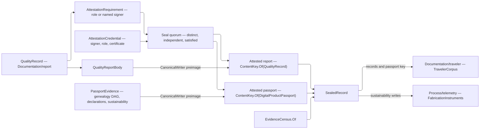

# [RASM_FABRICATION_PASSPORT]

`QualityReport.Seal(QualityReportRequest)` is the release gate: admitted quality records enter, a quorum of credentialed signers is proven against the attestation demands those records published, and a `SealedRecord` leaves carrying the attested report, the optional attested `DigitalProductPassport`, and the folded accountability census. The lifecycle is release-gated rather than continuous — a record admits whenever a shop authors it, an artifact seals once and never again — and the boundary is cryptographic, so this owner is separate from the evidence plane `Documentation/report` admits into.

Every signed artifact is keyed and signed over a `CanonicalWriter` BINARY preimage, never a serializer's output: a quantity enters as its family token and base-unit magnitude, so renaming a display unit cannot invalidate a signature, and every collection carries its count while every optional column carries its presence bit. `CanonicalJson` remains the TRANSPORT rendering the traveler document serializes through, carrying the `[JsonPolymorphic]` rosters, the LanguageExt carrier factory, and the Thinktecture value factory that make that rendering round-trip.

`ECDsa` signs the preimage, signer, role, credential, and instant; the trust callback binds those claims to the certificate before quorum and result verification. `EgressKind.DigitalProductPassport` is this page's own artifact family, distinct from the `EgressKind.QualityRecord` the report body keys under, and the Persistence `ArtifactKind` row of the same spelling federates to it BY VALUE at the content-key boundary — never by a type reference either side holds.

## [01]-[INDEX]

- [02]-[PASSPORT]: `SustainabilityEvidence`, `GenealogyLink`, `PassportEvidence`, `ReportScope` — the product-passport evidence family and the genealogy DAG gate.
- [03]-[SEAL]: `AttestationRequirement`, the credential and signature algebra, the signed-artifact carriers, and `QualityReport.Seal`.

## [02]-[PASSPORT]

- Owner: `PassportEvidence` owns product identity, genealogy, materials, compliance, declarations, service and repair history, lifecycle instants, and sustainability measures; `SustainabilityEvidence` owns the closed measure family and the declared row identity every projection reads; `ReportScope` owns whether a seal carries a passport at all.
- Law: `SustainabilityEvidence.Measure` is the ONE declared row identity — the preimage, the telemetry projection, and any future export read it — so a new measure costs one case and one row here and no second correspondence at a consumer.
- Law: genealogy is a DAG converging on ONE product. `SEdge` carries VALUE identity, so two links naming one parent-child pair are one edge and the acyclicity gate reads the relation the evidence actually states; `Edge<T>` is reference-identity and admits the same pair twice, which inflates the closure a severed-lineage check walks.
- Growth: a sustainability measure is one `SustainabilityEvidence` case naming its quantity, its `Measure` row, its validity clause, and its preimage arm; a scope is one `ReportScope` case.
- Packages: `Documentation/report` (`EvidenceRef`, `EvidenceLinks`, `QualityDeclaration`, `QualityEvidence`), `Rasm.Fabrication.Process` (`ContentKey`, `EgressKind`, `FabConcern`, `FabricationFault`), QuikGraph (`AdjacencyGraph`, `SEdge`, `IsDirectedAcyclicGraph`, `WeaklyConnectedComponents`, `Sinks`), `UnitsNet`, `NodaTime`, Thinktecture.Runtime.Extensions, LanguageExt.Core.
- Boundary: this page authors no measurement. Every quantity it carries arrived on a record its own owner already admitted, so the passport states provenance and period beside a value and re-derives nothing.

```csharp
// --- [IMPORTS] -------------------------------------------------------------------------
using System;
using System.Collections.Generic;
using System.Security.Cryptography;
using System.Security.Cryptography.X509Certificates;
using System.Text.Json;
using System.Text.Json.Serialization;
using LanguageExt;
using LanguageExt.Common;
using LanguageExt.Traits;
using NodaTime;
using NodaTime.Serialization.SystemTextJson;
using QuikGraph;
using QuikGraph.Algorithms;
using Rasm.Domain;
using Rasm.Element.Composition;
using Rasm.Fabrication.Process;
using Thinktecture;
using Thinktecture.Text.Json.Serialization;
using UnitsNet;
using static LanguageExt.Prelude;

namespace Rasm.Fabrication.Documentation;

// --- [MODELS] --------------------------------------------------------------------------
[Union(ConversionFromValue = ConversionOperatorsGeneration.None)]
[JsonPolymorphic(TypeDiscriminatorPropertyName = "kind")]
[JsonDerivedType(typeof(EnergyUse), "energy-use")]
[JsonDerivedType(typeof(Carbon), "carbon")]
[JsonDerivedType(typeof(Waste), "waste")]
[JsonDerivedType(typeof(RecycledContent), "recycled-content")]
[JsonDerivedType(typeof(WaterUse), "water-use")]
[JsonDerivedType(typeof(RenewableEnergy), "renewable-energy")]
[JsonDerivedType(typeof(RecyclableMass), "recyclable-mass")]
[JsonDerivedType(typeof(HazardousSubstance), "hazardous-substance")]
[JsonDerivedType(typeof(Repairability), "repairability")]
[JsonDerivedType(typeof(Durability), "durability")]
public abstract partial record SustainabilityEvidence {
    private SustainabilityEvidence() { }

    public sealed record EnergyUse(Energy Value, EvidenceRef.Source Source, Interval Period) : SustainabilityEvidence;
    public sealed record Carbon(Mass Value, EvidenceRef.Source Source, Interval Period) : SustainabilityEvidence;
    public sealed record Waste(Mass Value, EvidenceRef.Source Source, Interval Period) : SustainabilityEvidence;
    public sealed record RecycledContent(Ratio Value, EvidenceRef.Source Source, Interval Period) : SustainabilityEvidence;
    public sealed record WaterUse(Volume Value, EvidenceRef.Source Source, Interval Period) : SustainabilityEvidence;
    public sealed record RenewableEnergy(Ratio Value, EvidenceRef.Source Source, Interval Period) : SustainabilityEvidence;
    public sealed record RecyclableMass(Mass Value, EvidenceRef.Source Source, Interval Period) : SustainabilityEvidence;
    public sealed record HazardousSubstance(
        EvidenceRef.Material Substance,
        Mass Value,
        EvidenceRef.Source Source,
        Interval Period) : SustainabilityEvidence;
    public sealed record Repairability(Ratio Value, EvidenceRef.Source Source, Interval Period) : SustainabilityEvidence;
    public sealed record Durability(NodaTime.Duration Value, EvidenceRef.Source Source, Interval Period) : SustainabilityEvidence;

    public string Measure => Switch(
        energyUse: static _ => "energy-use",
        carbon: static _ => "carbon",
        waste: static _ => "waste",
        recycledContent: static _ => "recycled-content",
        waterUse: static _ => "water-use",
        renewableEnergy: static _ => "renewable-energy",
        recyclableMass: static _ => "recyclable-mass",
        hazardousSubstance: static _ => "hazardous-substance",
        repairability: static _ => "repairability",
        durability: static _ => "durability");

    public (EvidenceRef.Source Source, Interval Period) Provenance => Switch(
        energyUse: static row => (row.Source, row.Period),
        carbon: static row => (row.Source, row.Period),
        waste: static row => (row.Source, row.Period),
        recycledContent: static row => (row.Source, row.Period),
        waterUse: static row => (row.Source, row.Period),
        renewableEnergy: static row => (row.Source, row.Period),
        recyclableMass: static row => (row.Source, row.Period),
        hazardousSubstance: static row => (row.Source, row.Period),
        repairability: static row => (row.Source, row.Period),
        durability: static row => (row.Source, row.Period));

    public bool Valid => Switch(
        energyUse: static value => value.Value >= Energy.Zero && ValidPeriod(value.Period),
        carbon: static value => value.Value >= Mass.Zero && ValidPeriod(value.Period),
        waste: static value => value.Value >= Mass.Zero && ValidPeriod(value.Period),
        recycledContent: static value => QualityEvidence.Fraction(value.Value) && ValidPeriod(value.Period),
        waterUse: static value => value.Value >= Volume.Zero && ValidPeriod(value.Period),
        renewableEnergy: static value => QualityEvidence.Fraction(value.Value) && ValidPeriod(value.Period),
        recyclableMass: static value => value.Value >= Mass.Zero && ValidPeriod(value.Period),
        hazardousSubstance: static value => value.Value >= Mass.Zero && ValidPeriod(value.Period),
        repairability: static value => QualityEvidence.Fraction(value.Value) && ValidPeriod(value.Period),
        durability: static value => value.Value > NodaTime.Duration.Zero && ValidPeriod(value.Period));

    private static bool ValidPeriod(Interval period) => period.HasStart && period.HasEnd && period.Start < period.End;
}

[ComplexValueObject]
public sealed partial class GenealogyLink {
    public EvidenceRef Parent { get; }
    public EvidenceRef Child { get; }
    public TraceRelation Relation { get; }

    static partial void ValidateFactoryArguments(
        ref ValidationError? validationError,
        ref EvidenceRef parent,
        ref EvidenceRef child,
        ref TraceRelation relation) {
        if (parent == child)
            validationError = QualityEvidence.Validation("genealogy-link");
    }
}

[ComplexValueObject]
public sealed partial class PassportEvidence {
    public EvidenceRef.Product Product { get; }
    public Seq<GenealogyLink> Genealogy { get; }
    public EvidenceLinks Materials { get; }
    public EvidenceLinks Compliance { get; }
    public Seq<QualityDeclaration> Declarations { get; }
    public Seq<SustainabilityEvidence> Sustainability { get; }
    public Seq<ContentKey> ServiceHistory { get; }
    public Seq<ContentKey> RepairHistory { get; }
    public Instant ManufacturedAt { get; }
    public Option<Instant> RetiredAt { get; }

    static partial void ValidateFactoryArguments(
        ref ValidationError? validationError,
        ref EvidenceRef.Product product,
        ref Seq<GenealogyLink> genealogy,
        ref EvidenceLinks materials,
        ref EvidenceLinks compliance,
        ref Seq<QualityDeclaration> declarations,
        ref Seq<SustainabilityEvidence> sustainability,
        ref Seq<ContentKey> serviceHistory,
        ref Seq<ContentKey> repairHistory,
        ref Instant manufacturedAt,
        ref Option<Instant> retiredAt) {
        if (genealogy.IsEmpty
            || !materials.ToValue().ForAll(static value => value is EvidenceRef.Material or EvidenceRef.Lot)
            || !compliance.ToValue().ForAll(static value => value is EvidenceRef.Certificate or EvidenceRef.Requirement)
            || declarations.IsEmpty || declarations.Exists(static value => !value.Valid)
            || sustainability.IsEmpty || sustainability.Exists(static value => !value.Valid)
            || serviceHistory.Distinct().Count != serviceHistory.Count
            || repairHistory.Distinct().Count != repairHistory.Count
            || retiredAt.Exists(value => value <= manufacturedAt)
            || genealogy.Map(static value => (value.Parent, value.Child)).Distinct().Count != genealogy.Count
            || !ValidGenealogy(product, genealogy))
            validationError = QualityEvidence.Validation("passport-evidence");
    }

    private static bool ValidGenealogy(EvidenceRef.Product product, Seq<GenealogyLink> genealogy) {
        AdjacencyGraph<EvidenceRef, SEdge<EvidenceRef>> graph = new(allowParallelEdges: false);
        genealogy.Iter(link => graph.AddVerticesAndEdge(new SEdge<EvidenceRef>(link.Parent, link.Child)));
        Dictionary<EvidenceRef, int> components = new();
        Seq<EvidenceRef> sinks = toSeq(graph.Sinks());
        return graph.IsDirectedAcyclicGraph()
            && graph.WeaklyConnectedComponents(components) == 1
            && sinks.Count == 1
            && sinks[0] == product;
    }
}

[Union(ConversionFromValue = ConversionOperatorsGeneration.None)]
[JsonPolymorphic(TypeDiscriminatorPropertyName = "kind")]
[JsonDerivedType(typeof(Records), "records")]
[JsonDerivedType(typeof(Passport), "passport")]
public abstract partial record ReportScope {
    private ReportScope() { }

    public sealed record Records : ReportScope;
    public sealed record Passport(PassportEvidence Evidence) : ReportScope;
}
```

## [03]-[SEAL]

- Owner: `AttestationRequirement` owns the role-only or named-signer demand a record publishes; `AttestationCredential` owns what a signer brought and `AttestationPayload` what a signature covers; `RecordAttestation` owns one proven signature; `Attested<TBody>` owns one signed artifact; `SealedRecord` owns the release; `QualityReport` owns the preimage close, the transport rendering, and `Seal`.
- Law: `AttestationRole` is the branch vocabulary at `Rasm.Element` `Composition/material` (Element `RULINGS.md:37`) and this package declares no roster of its own — a folder-local role table forks the independence law the seal's quorum gate reads.
- Law: the signed preimage is `CanonicalWriter` BINARY. A serializer's byte stream depends on property order, naming policy, escape choices, and a unit's SPELLING — every one of which can change without any evidence changing — so a signature over it attests to a rendering rather than to the evidence. A quantity enters as its `QuantityInfo.Name` and its base-unit magnitude, so a millimetre reading and its metre spelling address identically and a display rename re-keys nothing.
- Law: the seal closes through `FabricationCanon.Sealed` at a ZERO grid — signed bytes and their address come from ONE close, so they cannot drift — and `Preimage` is the bytes-only mint the unaddressed payload close reads. Measured evidence is exact truth under attestation, so this seal declares no quantization and no column it writes is a `Measure`; `Retaining` is the mint whose close hands back bytes, and `ToBytes` is that close's own typed result — a streaming writer holds no preimage to sign, which is exactly the absence the result states instead of a raise.
- Law: an UPSTREAM result enters the preimage by the columns this attestation covers — its identity, its verdict, and the demands it published. Its own owner keys its full shape, and re-transcribing that shape here forks the two keys the day either page grows a column.
- Law: `CanonicalJson` is the TRANSPORT rendering, not an identity: it carries the `[JsonPolymorphic]` roster per union, `LanguageExtJsonConverterFactory` so `Seq` and `Option` members repopulate on read, and `ThinktectureJsonConverterFactory(skipObjectsWithJsonConverterAttribute: true)` so generator-stamped owners keep their own converters.
- Law: `RecordAttestation` signs and verifies `AttestationPayload(Body, Signer, Role, Credential, SignedAt)` with `ECDsa`, `HashAlgorithmName.SHA384`, and `DSASignatureFormat.Rfc3279DerSequence`; results carry credential identity, certificate PEM, and signature bytes without private-key material.
- Law: quorum is THREE independent gates that accumulate — a signer naming the same role twice, an independent authority who also signed as the manufacturer, and a published demand no credential satisfies are three different refusals a caller acts on differently.
- Law: classification rides definition-time attribute rows from `Process/telemetry#CLASSIFICATION` — `Signer` personal, `Credential` credential — so a log or export boundary redacts these members while the sealed preimage stays domain truth.
- Exemption: the `extension(CanonicalWriter sink)` body is the byte kernel; every other body on this cluster is expression-shaped.
- Entry: `public static Fin<SealedRecord> QualityReport.Seal(QualityReportRequest request, Option<InstrumentSet> set = default)` is the only sealing entrypoint; the trailing set defaults absent.
- Result: `SealedRecord` carries the attested report, the optional attested passport, and the folded census. `QualityReport.Seal` folds every sealed sustainability case through the union's total `Switch` onto the `SustainabilityQuantity` instrument its UCUM unit selects, tagged by the case name; an unsealed measure writes no row.
- Packages: `Documentation/report` (`QualityEvidence` for the record pipeline and every record-plane column writer, `QualityRecord`, `EvidenceCensus`, `RecordRefusal`), `Rasm.Element` (`AttestationRole`, `CanonicalWriter` through `Process/owner#RUN_DISPATCH`, `ContentKey.CanonicalBytes`), `System.Security.Cryptography`, `System.Text.Json`, `NodaTime.Serialization.SystemTextJson`, Thinktecture.Runtime.Extensions.Json.
- Boundary: `TravelerCorpus.Records` consumes `Seq<SealedRecord>` and derives its singleton digital-product-passport projection from those records.

```csharp
// --- [MODELS] --------------------------------------------------------------------------
[Union(ConversionFromValue = ConversionOperatorsGeneration.None)]
[JsonPolymorphic(TypeDiscriminatorPropertyName = "kind")]
[JsonDerivedType(typeof(Role), "role")]
[JsonDerivedType(typeof(Signer), "signer")]
public abstract partial record AttestationRequirement {
    private AttestationRequirement() { }

    public sealed record Role(AttestationRole Value) : AttestationRequirement;
    public sealed record Signer(EvidenceRef.Personnel Identity, AttestationRole Role) : AttestationRequirement;

    internal bool SatisfiedBy(Seq<AttestationCredential> credentials) => Switch(
        state: credentials,
        role: static (values, requirement) => values.Exists(credential => credential.Role == requirement.Value),
        signer: static (values, requirement) => values.Exists(credential =>
            credential.Role == requirement.Role && credential.Signer == requirement.Identity));
}

public sealed record AttestationCredential(
    [property: PersonalData] EvidenceRef.Personnel Signer,
    AttestationRole Role,
    [property: CredentialData] EvidenceRef.Certificate Credential,
    X509Certificate2 Certificate);

public sealed record AttestationPayload(
    ReadOnlyMemory<byte> Body,
    [property: PersonalData] EvidenceRef.Personnel Signer,
    AttestationRole Role,
    [property: CredentialData] EvidenceRef.Certificate Credential,
    Instant SignedAt);

public sealed record RecordAttestation(
    [property: PersonalData] EvidenceRef.Personnel Signer,
    AttestationRole Role,
    [property: CredentialData] EvidenceRef.Certificate Credential,
    string CertificatePem,
    ReadOnlyMemory<byte> Signature,
    Instant SignedAt) {
    public Fin<Unit> Verify(
        ReadOnlyMemory<byte> canonicalBody,
        Func<EvidenceRef.Personnel, AttestationRole, EvidenceRef.Certificate, X509Certificate2, Fin<Unit>> trust) =>
        from payload in QualityReport.Payload(
            new AttestationPayload(canonicalBody, Signer, Role, Credential, SignedAt))
        from verified in QualityEvidence.RecordOp.Catch(() => {
            using X509Certificate2 certificate = X509Certificate2.CreateFromPem(CertificatePem);
            using ECDsa? key = certificate.GetECDsaPublicKey();
            return from _ in trust(Signer, Role, Credential, certificate)
                   from __ in guard(key is not null && key.VerifyData(
                       payload.Span,
                       Signature.Span,
                       HashAlgorithmName.SHA384,
                       DSASignatureFormat.Rfc3279DerSequence), QualityEvidence.Refused(RecordRefusal.Signature)).ToFin()
                   select unit;
        })
        select verified;
}

public sealed record QualityReportRequest(
    ReportScope Scope,
    Seq<QualityRecord> Records,
    Seq<AttestationCredential> Signers,
    Func<EvidenceRef.Personnel, AttestationRole, EvidenceRef.Certificate, X509Certificate2, Fin<Unit>> Trust,
    Instant SealedAt);

public sealed record QualityReportBody(Seq<QualityRecord> Records, Instant SealedAt);

public sealed record DigitalProductPassport(PassportEvidence Evidence, ContentKey QualityRecord);

public sealed record Attested<TBody>(
    TBody Body,
    ReadOnlyMemory<byte> Canonical,
    ContentKey Key,
    Seq<RecordAttestation> Attestations);

public sealed record SealedRecord(
    Attested<QualityReportBody> Report,
    Option<Attested<DigitalProductPassport>> Passport,
    EvidenceCensus Census) {
    public ContentKey Key => Report.Key;
    public Seq<QualityRecord> Records => Report.Body.Records;
    public Seq<RecordAttestation> Attestations => Report.Attestations;
    public Option<ContentKey> DigitalProductPassport => Passport.Map(static artifact => artifact.Key);
}

// --- [OPERATIONS] ----------------------------------------------------------------------
public static class QualityReport {
    private const double ExactGrid = 0.0;

    internal static readonly JsonSerializerOptions CanonicalJson =
        new JsonSerializerOptions(JsonSerializerDefaults.General) {
            PropertyNamingPolicy = JsonNamingPolicy.CamelCase,
            WriteIndented = false,
            Converters = {
                new LanguageExtJsonConverterFactory(),
                new ThinktectureJsonConverterFactory(skipObjectsWithJsonConverterAttribute: true),
            },
        }.ConfigureForNodaTime(DateTimeZoneProviders.Tzdb);

    public static Fin<SealedRecord> Seal(QualityReportRequest request, Option<InstrumentSet> set = default) =>
        from admitted in QualityEvidence.RecordOp.Need(request)
        from _request in (
            AdmissionSlots.Gate(!admitted.Records.IsEmpty, QualityEvidence.Refused(RecordRefusal.Source)),
            AdmissionSlots.Gate(admitted.Scope is not null, QualityEvidence.Refused(RecordRefusal.Scope)),
            AdmissionSlots.Gate(
                admitted.Signers.ForAll(static signer => signer.Certificate is not null) && admitted.Trust is not null,
                QualityEvidence.Refused(RecordRefusal.Credential)))
            .Apply(static (_, _, _) => unit)
            .As()
            .ToFin()
        from _trusted in admitted.Signers.Traverse(signer => admitted.Trust(
            signer.Signer, signer.Role, signer.Credential, signer.Certificate)).As()
        from _quorum in (
            AdmissionSlots.Gate(
                admitted.Signers.Map(static signer => (signer.Signer, signer.Role)).Distinct().Count == admitted.Signers.Count,
                QualityEvidence.Refused(RecordRefusal.Credential)),
            AdmissionSlots.Gate(!admitted.Signers.Exists(independent => independent.Role.IndependentAuthority
                && admitted.Signers.Exists(authority => !authority.Role.IndependentAuthority
                    && authority.Signer == independent.Signer)), QualityEvidence.Refused(RecordRefusal.Independence)),
            AdmissionSlots.Gate(
                Required(admitted).ForAll(requirement => requirement.SatisfiedBy(admitted.Signers)),
                QualityEvidence.Refused(RecordRefusal.Quorum)))
            .Apply(static (_, _, _) => unit)
            .As()
            .ToFin()
        from report in Attest(
            new QualityReportBody(admitted.Records, admitted.SealedAt),
            static (sink, body) => sink
                .Rows(body.Records, static (row, record) => row.Record(record))
                .Moment(body.SealedAt),
            EgressKind.QualityRecord,
            admitted.Signers,
            admitted.Trust,
            admitted.SealedAt)
        from passport in admitted.Scope.Switch(
            records: static _ => Fin.Succ(Option<Attested<DigitalProductPassport>>.None),
            passport: value => Attest(
                    new DigitalProductPassport(value.Evidence, report.Key),
                    static (sink, body) => sink.Passport(body.Evidence).Key(body.QualityRecord),
                    EgressKind.DigitalProductPassport,
                    admitted.Signers,
                    admitted.Trust,
                    admitted.SealedAt)
                .Map(static artifact => Some(artifact)))
        from _measurements in passport.Match(
            None: static () => Fin.Succ(unit),
            Some: artifact => artifact.Body.Evidence.Sustainability.TraverseM(evidence => evidence.Switch(
                energyUse: row => set.Write(SustainabilityQuantity.Energy.Instrument, row.Value.Joules,
                    (FabricationInstruments.MeasureSlot, row.Measure)),
                carbon: row => set.Write(SustainabilityQuantity.Mass.Instrument, row.Value.Kilograms,
                    (FabricationInstruments.MeasureSlot, row.Measure)),
                waste: row => set.Write(SustainabilityQuantity.Mass.Instrument, row.Value.Kilograms,
                    (FabricationInstruments.MeasureSlot, row.Measure)),
                recycledContent: row => set.Write(SustainabilityQuantity.Fraction.Instrument, row.Value.DecimalFractions,
                    (FabricationInstruments.MeasureSlot, row.Measure)),
                waterUse: row => set.Write(SustainabilityQuantity.Volume.Instrument, row.Value.Liters,
                    (FabricationInstruments.MeasureSlot, row.Measure)),
                renewableEnergy: row => set.Write(SustainabilityQuantity.Fraction.Instrument, row.Value.DecimalFractions,
                    (FabricationInstruments.MeasureSlot, row.Measure)),
                recyclableMass: row => set.Write(SustainabilityQuantity.Mass.Instrument, row.Value.Kilograms,
                    (FabricationInstruments.MeasureSlot, row.Measure)),
                hazardousSubstance: row => set.Write(SustainabilityQuantity.Mass.Instrument, row.Value.Kilograms,
                    (FabricationInstruments.MeasureSlot, row.Measure)),
                repairability: row => set.Write(SustainabilityQuantity.Fraction.Instrument, row.Value.DecimalFractions,
                    (FabricationInstruments.MeasureSlot, row.Measure)),
                durability: row => set.Write(SustainabilityQuantity.Lifetime.Instrument, row.Value.TotalSeconds,
                    (FabricationInstruments.MeasureSlot, row.Measure)))).As().Map(static _ => unit))
        select new SealedRecord(
            report,
            passport,
            EvidenceCensus.Of(admitted.Records.Bind(static record => record.Observations)));

    private static Seq<AttestationRequirement> Required(QualityReportRequest request) => (
        request.Records.Bind(static record => record.Requirements)
        + request.Scope.Switch(
            records: static _ => Seq<AttestationRequirement>(),
            passport: static value => value.Evidence.Declarations.Bind(static declaration => declaration.Requirements)
                + Seq<AttestationRequirement>(new AttestationRequirement.Role(AttestationRole.SustainabilityVerifier))))
        .Distinct()
        .ToSeq();

    private static Fin<Attested<TBody>> Attest<TBody>(
        TBody body,
        Func<CanonicalWriter, TBody, CanonicalWriter> write,
        EgressKind kind,
        Seq<AttestationCredential> signers,
        Func<EvidenceRef.Personnel, AttestationRole, EvidenceRef.Certificate, X509Certificate2, Fin<Unit>> trust,
        Instant sealedAt) =>
        from closed in FabricationCanon.Sealed(kind, ExactGrid, sink => write(sink, body), QualityEvidence.RecordOp)
        from attestations in signers.Traverse(credential => Sign(closed.Preimage, credential, sealedAt)).As()
        from _verified in attestations.Traverse(attestation => attestation.Verify(closed.Preimage, trust)).As()
        select new Attested<TBody>(body, closed.Preimage, closed.Key, attestations);

    private static Fin<RecordAttestation> Sign(
        ReadOnlyMemory<byte> canonicalBody,
        AttestationCredential credential,
        Instant signedAt) =>
        from payload in Payload(new AttestationPayload(
            canonicalBody, credential.Signer, credential.Role, credential.Credential, signedAt))
        from signature in QualityEvidence.RecordOp.Catch(() => {
            using ECDsa? key = credential.Certificate.GetECDsaPrivateKey();
            return Fin.Succ(key is null
                ? Option<byte[]>.None
                : Some(key.SignData(payload.Span, HashAlgorithmName.SHA384, DSASignatureFormat.Rfc3279DerSequence)));
        })
        from bytes in signature.ToFin(QualityEvidence.Refused(RecordRefusal.SigningKey))
        select new RecordAttestation(
            credential.Signer,
            credential.Role,
            credential.Credential,
            credential.Certificate.ExportCertificatePem(),
            bytes,
            signedAt);

    internal static Fin<ReadOnlyMemory<byte>> Payload(AttestationPayload payload) => Preimage(sink => sink
        .Ordinal(payload.Body.Length)
        .Raw(payload.Body.Span)
        .Reference(payload.Signer)
        .Discriminant(payload.Role)
        .Reference(payload.Credential)
        .Moment(payload.SignedAt));

    private static Fin<ReadOnlyMemory<byte>> Preimage(Func<CanonicalWriter, CanonicalWriter> frame) =>
        frame(CanonicalWriter.Retaining(tolerance: ExactGrid))
            .ToBytes(QualityEvidence.RecordOp);

    extension(CanonicalWriter sink) {
        internal CanonicalWriter Passport(PassportEvidence evidence) => sink
            .Reference(evidence.Product)
            .Rows(evidence.Genealogy, static (row, link) => row
                .Reference(link.Parent).Reference(link.Child).Discriminant(link.Relation))
            .Rows(evidence.Materials.ToValue(), static (row, link) => row.Reference(link))
            .Rows(evidence.Compliance.ToValue(), static (row, link) => row.Reference(link))
            .Rows(evidence.Declarations, static (row, declaration) => row.Declaration(declaration))
            .Rows(evidence.Sustainability, static (row, measure) => measure.Switch(
                state: row.String(measure.Measure),
                energyUse: static (inner, value) => inner.Amount(value.Value),
                carbon: static (inner, value) => inner.Amount(value.Value),
                waste: static (inner, value) => inner.Amount(value.Value),
                recycledContent: static (inner, value) => inner.Amount(value.Value),
                waterUse: static (inner, value) => inner.Amount(value.Value),
                renewableEnergy: static (inner, value) => inner.Amount(value.Value),
                recyclableMass: static (inner, value) => inner.Amount(value.Value),
                hazardousSubstance: static (inner, value) => inner.Reference(value.Substance).Amount(value.Value),
                repairability: static (inner, value) => inner.Amount(value.Value),
                durability: static (inner, value) => inner.I64(value.Value.BclCompatibleTicks))
                .Reference(measure.Provenance.Source).Window(measure.Provenance.Period))
            .Rows(evidence.ServiceHistory, static (row, key) => row.Key(key))
            .Rows(evidence.RepairHistory, static (row, key) => row.Key(key))
            .Moment(evidence.ManufacturedAt)
            .Maybe(evidence.RetiredAt, static (row, at) => row.Moment(at));
    }
}
```



## [04]-[RESEARCH]

<!-- source-only: research row template:
[TOKEN]-[OPEN|BLOCKED]: <exact question>; <verification route>.
-->

(none)
