# [RASM_FABRICATION_TRAVELER]

`TravelerDocument` is the deterministic shop-execution document assembled from admitted fabrication results and cross-domain results. It preserves each upstream result at its owning type; `FabricationCanon.Keyed(EgressKind.Traveler, …)` mints document and amendment identities over a `CanonicalWriter` binary preimage, and `TravelerArtifact` carries the transport rendering for display and persistence beside that identity.

`Fabrication.Run` remains the sole public package entry. `Traveler.Assemble` is internal, owns identity and encoding, and parameterizes the clock and result projection. The planned route is a DAG: `BindRoutes` gates acyclicity before it sorts, and the step depth, release frontier, and dangling-binding counts it measures ride the document as witness columns rather than being re-derived at every reader.

## [01]-[INDEX]

- [02]-[TRAVELER_IDENTITY]: the four typed text identities, the locus and sampling families, unit dispositions, the control family, and the admitted result corpus.
- [03]-[TRAVELER_DOCUMENT]: sections and their marks reconciliation, the amendment family and its step-state arrow, and the document shape.
- [04]-[TRAVELER_ASSEMBLY]: the route DAG and its witness, the key census harvest, the canonical preimage, the transport codec, amendment sealing, and `Traveler.Assemble`.

## [02]-[TRAVELER_IDENTITY]

- Owner: `TravelerId`, `TravelerName`, `TravelerNote`, and `TravelerActor` own the four text regimes a traveler carries; `TravelerQuantity`, `TravelerStep`, `TravelerOperation`, and `TravelerSetup` own the ordinal regimes; `TravelerLocus` owns binding position; `TravelerControl` owns instructions; `AttributeTag` owns the drawing tag vocabulary and which of its rows reconcile; `TravelerCorpus` owns the admitted fan-in.
- Law: text is typed by ITS OWN REGIME, never by one shared wrapper. An identifier a shop keys on, a human-facing name, a free narrative, and a person are four different admissions with four different transposition risks, and one owner covering all of them makes passing a hazard where an authority belongs a compile-clean mistake.
- Law: a PUBLISHED regime takes its published owner. `TravelerIdentity.Revision` is the drawing revision a traveler is issued against and its sequence is ASME Y14.35 §4.3, so it admits through the kernel `RevisionIndex`; `PartNumber` and `WorkOrder` are shop identities under no naming standard and stay `TravelerId`, because forcing a `SheetNumber` field grammar onto a part number admits under a sequence the shop never issued.
- Law: which drawing tags reconcile is an `AttributeTag` COLUMN, not a pair list at the fold. A const row name beside a hand `Seq((name, declared), …)` puts the vocabulary in two places and lets a new reconciled tag land in one of them.
- Law: `TravelerActor` carries the personal classification at ITS OWN declaration, so every actor and authority column inherits redaction from the type rather than from a per-field attribute a new column can forget.
- Law: `TravelerControl` is one generated family over `TravelerLocus`. Global, step, operation, setup, and characteristic loci bind instructions; `Material` retains unit identity, and `Package` fixes the global locus with label, method, and destination policy. Every case is POSITIONAL over its base locus — a hand constructor beside the record's own is a second construction path.
- Law: only the characteristic locus decides admission here; the routing loci prove membership later against the planned route, where the step, operation, and setup identities exist.
- Law: `TravelerCorpus` derives its digital-product-passport identity from its sealed records, so no writable twin can diverge; an inspection link admits only where the named record actually carries the named feature, and a `HoldRelease` admits only where a carried `ProcedureAssessment` actually planned that hold point.
- Growth: a control modality is one `TravelerControl` case; a sampling regime is one `TravelerSampling` case; a corpus row family is one column and one preimage row.
- Packages: `Rasm.Drawing` (`RevisionIndex`), `Rasm.Element` (`AdmissionSlots`), `Rasm.Fabrication.Process` (`ContentKey`, `EgressKind`, `FabricationResult`, `InspectionFeature`, `PlannedStep`, `FabricationFault`, `Admission`), `Documentation/passport` (`SealedRecord`, `QualityReport.CanonicalJson`), `Documentation/report` (`Disposition`, `CharacteristicId`), `Joining/procedure` (`ProcedureAssessment`, `HoldPoint`, `HoldRelease`, `HoldPointKey`), `Spec` (`CapabilityReport`, `DfmReport`, `FeatureFrame`), `Fixturing/setups` (`SetupSchedule`), `Tooling/magazine` (`ToolChange`, `ToolAssembly`), `Posting/dialect` (`ProgramDelivery`, `PostDialect`), `Verify/estimation` (`CostEstimate`), UnitsNet, NodaTime, Thinktecture, LanguageExt.

```csharp
// --- [IMPORTS] -------------------------------------------------------------------------
using System;
using System.Linq;
using System.Text;
using System.Text.Json;
using System.Text.Json.Nodes;
using System.Text.Json.Serialization;
using LanguageExt;
using LanguageExt.Common;
using LanguageExt.Traits;
using NodaTime;
using QuikGraph;
using QuikGraph.Algorithms;
using Rasm.Domain;
using Rasm.Drawing;
using Rasm.Element.Projection;
using Rasm.Fabrication.Fixturing;
using Rasm.Fabrication.Ingress;
using Rasm.Fabrication.Joining;
using Rasm.Fabrication.Posting;
using Rasm.Fabrication.Process;
using Rasm.Fabrication.Spec;
using Rasm.Fabrication.Tooling;
using Rasm.Fabrication.Verify;
using Rasm.Numerics;
using Thinktecture;
using UnitsNet;
using static LanguageExt.Prelude;

namespace Rasm.Fabrication.Documentation;

// --- [TYPES] ---------------------------------------------------------------------------
[SmartEnum<string>]
public sealed partial class SafetyControlLevel {
    public static readonly SafetyControlLevel Elimination    = new("elimination", rank: 0);
    public static readonly SafetyControlLevel Substitution   = new("substitution", rank: 1);
    public static readonly SafetyControlLevel Engineering    = new("engineering", rank: 2);
    public static readonly SafetyControlLevel Administrative = new("administrative", rank: 3);
    public static readonly SafetyControlLevel Protective     = new("protective", rank: 4);

    public int Rank { get; }
}

[SmartEnum<string>]
public sealed partial class TravelerRelation {
    public static readonly TravelerRelation Sequence = new("sequence");
    public static readonly TravelerRelation Fixture = new("fixture");
}

// --- [MODELS] --------------------------------------------------------------------------
[ValueObject<string>]
public readonly partial struct TravelerId {
    static partial void ValidateFactoryArguments(ref ValidationError? validationError, ref string value) {
        value = value.Trim();
        if (!Witness.Keyed(value) || value.Any(char.IsWhiteSpace))
            validationError = Traveler.Validation("id");
    }

    public static Fin<TravelerId> Admit(string value) => Admission.OfValue<TravelerId, string>(value);
}

[ValueObject<string>]
public readonly partial struct TravelerName {
    static partial void ValidateFactoryArguments(ref ValidationError? validationError, ref string value) {
        value = value.Trim();
        if (!Witness.Keyed(value))
            validationError = Traveler.Validation("name");
    }

    public static Fin<TravelerName> Admit(string value) => Admission.OfValue<TravelerName, string>(value);
}

[ValueObject<string>]
public readonly partial struct TravelerNote {
    static partial void ValidateFactoryArguments(ref ValidationError? validationError, ref string value) {
        value = value.Trim();
        if (!Witness.Keyed(value))
            validationError = Traveler.Validation("note");
    }

    public static Fin<TravelerNote> Admit(string value) => Admission.OfValue<TravelerNote, string>(value);
}

[ValueObject<string>]
[PersonalData]
public readonly partial struct TravelerActor {
    static partial void ValidateFactoryArguments(ref ValidationError? validationError, ref string value) {
        value = value.Trim();
        if (!Witness.Keyed(value))
            validationError = Traveler.Validation("actor");
    }

    public static Fin<TravelerActor> Admit(string value) => Admission.OfValue<TravelerActor, string>(value);
}

[ValueObject<int>]
public readonly partial struct TravelerQuantity {
    static partial void ValidateFactoryArguments(ref ValidationError? validationError, ref int value) {
        if (value < 1)
            validationError = Traveler.Validation("quantity");
    }

    public static Fin<TravelerQuantity> Admit(int value) => Admission.OfValue<TravelerQuantity, int>(value);
}

[ValueObject<int>]
public readonly partial struct TravelerStep {
    static partial void ValidateFactoryArguments(ref ValidationError? validationError, ref int value) {
        if (value < 0)
            validationError = Traveler.Validation("step");
    }

    public static Fin<TravelerStep> Admit(int value) => Admission.OfValue<TravelerStep, int>(value);
}

[ValueObject<int>]
public readonly partial struct TravelerOperation {
    static partial void ValidateFactoryArguments(ref ValidationError? validationError, ref int value) {
        if (value < 0)
            validationError = Traveler.Validation("operation");
    }

    public static Fin<TravelerOperation> Admit(int value) => Admission.OfValue<TravelerOperation, int>(value);
}

[ValueObject<int>]
public readonly partial struct TravelerSetup {
    static partial void ValidateFactoryArguments(ref ValidationError? validationError, ref int value) {
        if (value < 0)
            validationError = Traveler.Validation("setup");
    }

    public static Fin<TravelerSetup> Admit(int value) => Admission.OfValue<TravelerSetup, int>(value);
}

[Union(ConversionFromValue = ConversionOperatorsGeneration.None)]
[JsonPolymorphic(TypeDiscriminatorPropertyName = "kind")]
[JsonDerivedType(typeof(Lot), "lot")]
[JsonDerivedType(typeof(Serialized), "serialized")]
public abstract partial record TravelerUnits {
    private TravelerUnits() { }

    public sealed record Lot(TravelerQuantity Value) : TravelerUnits;
    public sealed record Serialized(Seq<TravelerId> Values) : TravelerUnits;

    public int Count => Switch(
        lot:        static value => value.Value.ToValue(),
        serialized: static value => value.Values.Count);

    public bool Valid => Switch(
        lot:        static _ => true,
        serialized: static value => !value.Values.IsEmpty && value.Values.Distinct().Count == value.Values.Count);
}

[Union(ConversionFromValue = ConversionOperatorsGeneration.None)]
[JsonPolymorphic(TypeDiscriminatorPropertyName = "kind")]
[JsonDerivedType(typeof(Every), "every")]
[JsonDerivedType(typeof(FirstArticle), "first-article")]
[JsonDerivedType(typeof(Skip), "skip")]
[JsonDerivedType(typeof(AttributePlan), "attribute-plan")]
public abstract partial record TravelerSampling {
    private TravelerSampling() { }

    public sealed record Every : TravelerSampling;
    public sealed record FirstArticle : TravelerSampling;
    public sealed record Skip(TravelerQuantity Interval) : TravelerSampling;
    public sealed record AttributePlan(TravelerQuantity SampleSize, int Accept, int Reject) : TravelerSampling;

    public bool Valid => Switch(
        every: static _ => true,
        firstArticle: static _ => true,
        skip: static _ => true,
        attributePlan: static value => value.Accept >= 0
            && value.Reject == value.Accept + 1
            && value.Accept < value.SampleSize.ToValue());
}

[Union(ConversionFromValue = ConversionOperatorsGeneration.None)]
[JsonPolymorphic(TypeDiscriminatorPropertyName = "kind")]
[JsonDerivedType(typeof(Global), "global")]
[JsonDerivedType(typeof(Step), "step")]
[JsonDerivedType(typeof(Operation), "operation")]
[JsonDerivedType(typeof(Setup), "setup")]
[JsonDerivedType(typeof(Characteristic), "characteristic")]
public abstract partial record TravelerLocus {
    private TravelerLocus() { }

    public sealed record Global : TravelerLocus;
    public sealed record Step(TravelerStep Value) : TravelerLocus;
    public sealed record Operation(TravelerStep Step, TravelerOperation Value) : TravelerLocus;
    public sealed record Setup(TravelerSetup Value) : TravelerLocus;
    public sealed record Characteristic(CharacteristicId Value) : TravelerLocus;
}

[ComplexValueObject]
public sealed partial class TravelerIdentity {
    public TravelerId WorkOrder { get; }
    public TravelerId PartNumber { get; }

    public RevisionIndex Revision { get; }
    public TravelerQuantity Quantity { get; }
    public Option<TravelerId> HeatLot { get; }
    public Seq<TravelerId> Serials { get; }

    static partial void ValidateFactoryArguments(
        ref ValidationError? validationError,
        ref TravelerId workOrder,
        ref TravelerId partNumber,
        ref RevisionIndex revision,
        ref TravelerQuantity quantity,
        ref Option<TravelerId> heatLot,
        ref Seq<TravelerId> serials) {
        if (serials.Distinct().Count != serials.Count
            || (!serials.IsEmpty && serials.Count != quantity.ToValue()))
            validationError = Traveler.Validation("identity");
    }
}

[Union(ConversionFromValue = ConversionOperatorsGeneration.None)]
[JsonPolymorphic(TypeDiscriminatorPropertyName = "kind")]
[JsonDerivedType(typeof(Work), "work")]
[JsonDerivedType(typeof(Hold), "hold")]
[JsonDerivedType(typeof(Safety), "safety")]
[JsonDerivedType(typeof(Material), "material")]
[JsonDerivedType(typeof(Resource), "resource")]
[JsonDerivedType(typeof(Inspect), "inspect")]
[JsonDerivedType(typeof(Approve), "approve")]
[JsonDerivedType(typeof(Package), "package")]
public abstract partial record TravelerControl(TravelerLocus Locus) {
    public sealed record Work(TravelerLocus Locus, TravelerNote Instruction) : TravelerControl(Locus);

    public sealed record Hold(TravelerLocus Locus, TravelerActor Authority) : TravelerControl(Locus);

    public sealed record Safety(
        TravelerLocus Locus,
        TravelerNote Hazard,
        SafetyControlLevel Level,
        TravelerNote Control,
        Seq<TravelerName> ProtectiveEquipment) : TravelerControl(Locus);

    public sealed record Material(
        TravelerLocus Locus,
        TravelerId Item,
        TravelerId Lot,
        IQuantity Quantity) : TravelerControl(Locus);

    public sealed record Resource(TravelerLocus Locus, TravelerName Name, TravelerQuantity Quantity) : TravelerControl(Locus);

    public sealed record Inspect(
        TravelerLocus Locus,
        TravelerName Method,
        TravelerId Gauge,
        TravelerSampling Sampling,
        TravelerActor Authority) : TravelerControl(Locus);

    public sealed record Approve(TravelerLocus Locus, TravelerName Role, TravelerActor Authority) : TravelerControl(Locus);

    public sealed record Package(TravelerName Label, TravelerName Method, TravelerName Destination)
        : TravelerControl(new TravelerLocus.Global());

    public bool Valid => Switch(
        work: static _ => true,
        hold: static _ => true,
        safety: static _ => true,
        material: static value => value.Quantity is not null
            && double.IsFinite((double)value.Quantity.Value) && (double)value.Quantity.Value > 0.0,
        resource: static _ => true,
        inspect: static value => value.Sampling.Valid,
        approve: static _ => true,
        package: static _ => true);
}

public sealed record TravelerInspectionLink(InspectionFeature Feature, ContentKey Record);

[ComplexValueObject]
public sealed partial class TravelerCorpus {
    public TravelerIdentity Identity { get; }
    public Seq<ToolChange> ToolChanges { get; }
    public Seq<ToolAssembly> ToolAssemblies { get; }
    public Seq<SetupSchedule> Setups { get; }
    public Seq<FeatureFrame> Frames { get; }
    public Seq<CapabilityReport> Capabilities { get; }
    public Seq<DfmReport> Manufacturability { get; }
    public Seq<ProcedureAssessment> Procedures { get; }
    public Seq<SealedRecord> Records { get; }
    public Option<ContentKey> DigitalProductPassport => Records
        .Bind(static value => value.DigitalProductPassport.ToSeq())
        .Distinct()
        .Head;
    public Seq<TravelerInspectionLink> Inspections { get; }

    public Seq<HoldRelease> Releases { get; }
    public Seq<TravelerControl> Controls { get; }
    public Seq<TravelerAmendment> Amendments { get; }

    public Seq<HoldPoint> UnreleasedHolds => Procedures.Bind(result => result.Plan.Unreleased(Releases));

    static partial void ValidateFactoryArguments(
        ref ValidationError? validationError,
        ref TravelerIdentity identity,
        ref Seq<ToolChange> toolChanges,
        ref Seq<ToolAssembly> toolAssemblies,
        ref Seq<SetupSchedule> setups,
        ref Seq<FeatureFrame> frames,
        ref Seq<CapabilityReport> capabilities,
        ref Seq<DfmReport> manufacturability,
        ref Seq<ProcedureAssessment> procedures,
        ref Seq<SealedRecord> records,
        ref Seq<TravelerInspectionLink> inspections,
        ref Seq<HoldRelease> releases,
        ref Seq<TravelerControl> controls,
        ref Seq<TravelerAmendment> amendments) {
        bool recordsUnique = records.Map(static value => value.Key).Distinct().Count == records.Count;
        bool passportBound = records.Bind(static value => value.DigitalProductPassport.ToSeq()).Distinct().Count <= 1;
        bool inspectionsBound = inspections.Distinct().Count == inspections.Count
            && inspections.ForAll(link => records.Exists(record => record.Key == link.Record
                && record.Records.Bind(static value => value.InspectionFeatures).Contains(link.Feature)));
        Set<HoldPointKey> planned = toSet(procedures.Bind(static result => result.Plan.Holds)
            .Map(static hold => hold.Key));
        bool releasesBound = releases.ForAll(release => planned.Contains(release.Point));
        if (!recordsUnique || !passportBound || !inspectionsBound || !releasesBound
            || !controls.ForAll(static control => control.Valid)
            || !amendments.ForAll(static amendment => amendment.Valid))
            validationError = Traveler.Validation("corpus");
    }
}
```

## [03]-[TRAVELER_DOCUMENT]

- Owner: `TravelerSection` owns the document model; `TravelerMarks` owns drawing-mark reconciliation; `TravelerAmendment` owns execution events and the step-state arrow; `TravelerStepState` owns step lifecycle; `TravelerDocument` owns the assembled shape.
- Law: `TravelerSection.Outputs` retains the complete `FabricationResult` sequence and document dialect instead of reducing program, projection, placement, additive, verification, inspection, plan, forming, motion, or prior-traveler evidence to selected fields. Section order follows construction, so no parallel rank roster restates the closed family.
- Law: `TravelerStepState` carries NOT-STARTED as a real state. A step no one has touched and a step someone opened are different facts, and collapsing them makes the first event on a step indistinguishable from the second — which is exactly the transition a route-precedence gate has to refuse.
- Law: `TravelerAmendment` models execution without mutating the planned document; `Completed`, `Held`, `Released`, `Deviated`, and `Scrapped` record predecessor key, admitted step and actor, timestamp, evidence, and case-specific duration or disposition. Every case is POSITIONAL over its base columns.
- Law: `Released.Delivery` retains the verified controller handoff that authorizes the held-to-open edge, and `Released.Program` names the planned release artifact that handoff must prove — the corpus gate admits a release only when `Delivery.Image` matches `Program` by kind and digest, so a verified transfer of the wrong program never opens a held step.
- Law: `Deviated` and `Scrapped` carry `TravelerUnits`, so a lot-wide disposition and a named-serial disposition are distinct cases and partial scrap of a serialized run records the exact units it consumed.
- Law: `TravelerAmendment.Advance` owns the step-state arrow as one total generated dispatch, and `Disposition.Terminal` with `Accepted` supplies the `Deviated` target: an accepted terminal disposition completes the step, a refused terminal disposition scraps it, and a nonterminal disposition retains prior state.
- Law: marks reconcile by `AttributeTag` ROW against the declared identity, and a row absent from the drawing raises no divergence — the sheet carries no such mark. Every tagged mark under a row is read, so a sheet carrying two values for one key prints both contradictions.
- Growth: an amendment modality is one case with its own `Advance` arm; a section is one case; a reconciled mark row is one entry in the reconcilable roster.

```csharp
// --- [MODELS] --------------------------------------------------------------------------
[Union(ConversionFromValue = ConversionOperatorsGeneration.None)]
[JsonPolymorphic(TypeDiscriminatorPropertyName = "kind")]
[JsonDerivedType(typeof(Completed), "completed")]
[JsonDerivedType(typeof(Held), "held")]
[JsonDerivedType(typeof(Released), "released")]
[JsonDerivedType(typeof(Deviated), "deviated")]
[JsonDerivedType(typeof(Scrapped), "scrapped")]
public abstract partial record TravelerAmendment(
    ContentKey Previous,
    TravelerStep Step,
    TravelerActor Actor,
    Instant At,
    Seq<ContentKey> Evidence) {
    public sealed record Completed(
        ContentKey Previous,
        TravelerStep Step,
        TravelerActor Actor,
        Instant Started,
        Instant At,
        Duration Actual,
        Option<CostEstimate> Estimate,
        Seq<ContentKey> Evidence) : TravelerAmendment(Previous, Step, Actor, At, Evidence) {
        public Option<Duration> Variance => Estimate.Map(value => Actual - value.MachineTime);
    }

    public sealed record Held(
        ContentKey Previous,
        TravelerStep Step,
        TravelerActor Actor,
        Instant At,
        TravelerNote Cause,
        Seq<ContentKey> Evidence) : TravelerAmendment(Previous, Step, Actor, At, Evidence);

    public sealed record Released(
        ContentKey Previous,
        TravelerStep Step,
        TravelerActor Actor,
        Instant At,
        TravelerActor Authority,
        ContentKey Program,
        ProgramDelivery Delivery,
        Seq<ContentKey> Evidence) : TravelerAmendment(Previous, Step, Actor, At, Evidence);

    public sealed record Deviated(
        ContentKey Previous,
        TravelerStep Step,
        TravelerActor Actor,
        Instant At,
        TravelerNote Deviation,
        Disposition Disposition,
        TravelerUnits Units,
        TravelerActor Authority,
        Seq<ContentKey> Evidence) : TravelerAmendment(Previous, Step, Actor, At, Evidence);

    public sealed record Scrapped(
        ContentKey Previous,
        TravelerStep Step,
        TravelerActor Actor,
        Instant At,
        TravelerNote Reason,
        TravelerUnits Units,
        TravelerActor Authority,
        Seq<ContentKey> Evidence) : TravelerAmendment(Previous, Step, Actor, At, Evidence);

    public bool Valid => Switch(
        completed: static value => value.Started <= value.At
            && value.Actual >= Duration.Zero
            && value.Actual <= value.At - value.Started,
        held: static _ => true,
        released: static value => value.Delivery is { Verified: true } delivery
            && delivery.Image.Kind == value.Program.Kind && delivery.Image.Digest == value.Program.Digest,
        deviated: static value => value.Units.Valid,
        scrapped: static value => value.Units.Valid);

    public Fin<TravelerStepState> Advance(TravelerStepState prior) => Switch(
        state: prior,
        completed: static (state, _) => state.Terminal || state == TravelerStepState.Held
            ? Fin.Fail<TravelerStepState>(Traveler.Transition(state, "completed"))
            : Fin.Succ(TravelerStepState.Completed),
        held: static (state, _) => state.Terminal || state == TravelerStepState.Held
            ? Fin.Fail<TravelerStepState>(Traveler.Transition(state, "held"))
            : Fin.Succ(TravelerStepState.Held),
        released: static (state, _) => state == TravelerStepState.Held
            ? Fin.Succ(TravelerStepState.Open)
            : Fin.Fail<TravelerStepState>(Traveler.Transition(state, "released")),
        deviated: static (state, value) => state.Terminal || !state.Started
            ? Fin.Fail<TravelerStepState>(Traveler.Transition(state, "deviated"))
            : Fin.Succ(value.Disposition.Terminal
                ? value.Disposition.Accepted ? TravelerStepState.Completed : TravelerStepState.Scrapped
                : state),
        scrapped: static (state, _) => state.Terminal
            ? Fin.Fail<TravelerStepState>(Traveler.Transition(state, "scrapped"))
            : Fin.Succ(TravelerStepState.Scrapped));
}

[SmartEnum<int>]
public sealed partial class TravelerStepState {
    public static readonly TravelerStepState NotStarted = new(0, terminal: false, started: false);
    public static readonly TravelerStepState Open = new(1, terminal: false, started: true);
    public static readonly TravelerStepState Held = new(2, terminal: false, started: true);
    public static readonly TravelerStepState Completed = new(3, terminal: true, started: true);
    public static readonly TravelerStepState Scrapped = new(4, terminal: true, started: true);

    public bool Terminal { get; }
    public bool Started { get; }
}

public sealed record TravelerAmendmentArtifact(
    TravelerAmendment Amendment,
    TravelerArtifactDescriptor Descriptor,
    ReadOnlyMemory<byte> Rendering,
    ContentKey Key);

public sealed record RouteWitness(
    int Steps,
    int Depth,
    Seq<int> Roots,
    Seq<int> Sinks,
    int DanglingControls,
    int DanglingAmendments,
    int DanglingInspections,
    int DanglingPrograms,
    int UnreleasedHolds);

[Union(ConversionFromValue = ConversionOperatorsGeneration.None)]
[JsonPolymorphic(TypeDiscriminatorPropertyName = "kind")]
[JsonDerivedType(typeof(Header), "header")]
[JsonDerivedType(typeof(Route), "route")]
[JsonDerivedType(typeof(Tooling), "tooling")]
[JsonDerivedType(typeof(Specification), "specification")]
[JsonDerivedType(typeof(Procedure), "procedure")]
[JsonDerivedType(typeof(Outputs), "outputs")]
[JsonDerivedType(typeof(Quality), "quality")]
[JsonDerivedType(typeof(Marks), "marks")]
public abstract partial record TravelerSection {
    private TravelerSection() { }

    public sealed record Header(
        TravelerIdentity Identity,
        ProcessKind Process,
        Machine Machine,
        ProjectionDir View,
        Instant StampedAt,
        Seq<ContentKey> Sources) : TravelerSection;
    public sealed record Route(
        Seq<PlannedStep> Steps,
        Seq<SetupSchedule> Setups,
        Seq<StockSnapshot> Stock,
        Seq<TravelerControl> Controls,
        RouteWitness Witness) : TravelerSection;
    public sealed record Tooling(Seq<ToolChange> Changes, Seq<ToolAssembly> Assemblies) : TravelerSection;
    public sealed record Specification(
        Seq<FeatureFrame> Frames,
        Seq<CapabilityReport> Capabilities,
        Seq<DfmReport> Manufacturability) : TravelerSection;
    public sealed record Procedure(Seq<ProcedureAssessment> Assessments) : TravelerSection;
    public sealed record Outputs(Option<PostDialect> Dialect, Seq<FabricationResult> Results) : TravelerSection;
    public sealed record Quality(
        Seq<SealedRecord> Records,
        Seq<TravelerInspectionLink> Inspections,
        Seq<HoldRelease> Releases) : TravelerSection;
    public sealed record Marks(
        Map<string, Arr<ProfileMarking>> Keyed,
        Seq<ProfileMarking> Free,
        Seq<MarkDivergence> Reconciled) : TravelerSection;
}

[SmartEnum<string>]
public sealed partial class AttributeTag {
    public static readonly AttributeTag PartMark = new("PartMark", reconciled: true);
    public static readonly AttributeTag HeatNumber = new("HeatNumber", reconciled: true);
    public static readonly AttributeTag Assembly = new("Assembly", reconciled: false);
    public static readonly AttributeTag Phase = new("Phase", reconciled: false);
    public static readonly AttributeTag Finish = new("Finish", reconciled: false);

    public bool Reconciled { get; }
}

public sealed record MarkDivergence(AttributeTag Row, string Drawing, string Declared);

internal static class TravelerMarks {
    public static TravelerSection.Marks Of(FabricationInput input, TravelerIdentity identity) {
        Map<string, Arr<ProfileMarking>> keyed = input.Tags;
        return new TravelerSection.Marks(
            keyed,
            input.Markings.ToSeq().Filter(static marking => marking.Tag.IsNone),
            toSeq(AttributeTag.Items)
                .Filter(static tag => tag.Reconciled)
                .Choose(tag => Declared(identity, tag).Map(declared => (Tag: tag, Declared: declared)))
                .Bind(row => Divergence(keyed, row.Tag, row.Declared)));
    }

    static Option<string> Declared(TravelerIdentity identity, AttributeTag tag) =>
        tag switch {
            _ when tag == AttributeTag.PartMark => Some(identity.PartNumber.ToValue()),
            _ when tag == AttributeTag.HeatNumber => identity.HeatLot.Map(static value => value.ToValue()),
            _ => None,
        };

    static Seq<MarkDivergence> Divergence(
        Map<string, Arr<ProfileMarking>> keyed, AttributeTag row, string declared) =>
        keyed.Find(row.Key).ToSeq()
            .Bind(static marks => marks.ToSeq())
            .Choose(static mark => mark.Content is MarkingContent.Tag tag ? Some(tag.Type.Text) : None)
            .Filter(text => !string.Equals(text, declared, StringComparison.Ordinal))
            .Map(text => new MarkDivergence(row, text, declared));
}

public sealed record TravelerDocument(Instant StampedAt, Seq<TravelerSection> Sections, Seq<ContentKey> Composed);

[Union(ConversionFromValue = ConversionOperatorsGeneration.None)]
[JsonPolymorphic(TypeDiscriminatorPropertyName = "kind")]
[JsonDerivedType(typeof(Document), "document")]
[JsonDerivedType(typeof(Amendment), "amendment")]
public abstract partial record TravelerCanonicalSource {
    private TravelerCanonicalSource() { }

    public sealed record Document(TravelerDocument Value) : TravelerCanonicalSource;
    public sealed record Amendment(TravelerAmendment Value) : TravelerCanonicalSource;
}

public sealed record TravelerArtifactDescriptor(string Schema, string MediaType, string Encoding);
public sealed record TravelerEncoding(TravelerArtifactDescriptor Descriptor, ReadOnlyMemory<byte> Rendering);

public sealed record TravelerArtifact(
    TravelerDocument Document,
    TravelerArtifactDescriptor Descriptor,
    ReadOnlyMemory<byte> Rendering,
    ContentKey Key,
    Seq<ContentKey> Consumed,
    Seq<ContentKey> Produced,
    Option<ContentKey> DigitalProductPassport,
    Seq<TravelerAmendmentArtifact> Amendments);
```

## [04]-[TRAVELER_ASSEMBLY]

- Owner: `TravelerPreimage` owns identity bytes; `TravelerCanonicalCodec` owns the transport rendering; `Traveler` owns the route DAG, the key harvest, amendment sealing, and `Assemble`.
- Law: identity rides `FabricationCanon.Keyed` — the ONE keyed mint, which opens the retaining writer, closes on the typed result, and frames `EgressKind` ahead of the payload — never a serializer's bytes and never a hand-opened writer — the same law `Documentation/report` and `Joining/weld` key under, so one document keyed here and the same document keyed through any sibling addresses identically. The JSON rendering stays the TRANSPORT the display and persistence ports read, and its `[JsonPolymorphic]` rosters are what make both codec arms round-trip without a runtime type argument.
- Law: a COMPOSED result enters the preimage by the key census it contributes and by the discriminating ordinals it authored — a result's own owner keys its full shape, and re-transcribing that shape here forks the two keys the day either page grows a column. The traveler's OWN authored rows — identity, controls, marks, amendment payloads, and the route witness — enter in full.
- Law: the planned route is a DAG. `IsDirectedAcyclicGraph` gates BEFORE `SourceFirstBidirectionalTopologicalSort`, so a forged precedence answers a typed fault instead of throwing inside a sort, and `Roots`/`Sinks` are the release frontier a shop reads.
- Law: dangling controls, amendments, inspection links, release programs, and unreleased blocking holds are INDEPENDENT faults that accumulate: a planner correcting one route must see the other four in the same verdict, and their counts ride `RouteWitness` so a passing document still reports the frontier it proved. The hold gate reads `Joining/procedure` `HoldPoint`/`HoldRelease` evidence, so a traveler advances against a party's attested release and never against a hold point it merely printed.
- Law: an amendment obeys ROUTE PRECEDENCE. A step opens only once every predecessor in the sorted route reached a terminal state, so work recorded out of order refuses at the seal rather than producing a chain no route explains.
- Law: the key census reads `FabricationResult.Keys` — the result family's OWN census — so every case contributes its subjects and artifacts, and motion and inspection results stop contributing nothing to lineage while every other case does.
- Exemption: `TravelerCanonicalCodec.Write` is the byte kernel over the rendered node tree; `Traveler.RouteGraph` is the graph-population kernel and only its named witness columns leave.
- Entry: `Traveler.Assemble(request, input, clock, egress, set)` is the one assembly; the set defaults absent for headless assembly.
- Result: `TravelerArtifact` carries the document, descriptor, rendering, minted key, consumed and produced key sets, passport identity, and sealed amendment artifacts. `Traveler.Assemble` writes the sealed chain length through `FabricationInstruments.TravelerAmendments`.
- Packages: QuikGraph (`BidirectionalGraph`, `STaggedEdge`, `IsDirectedAcyclicGraph`, `SourceFirstBidirectionalTopologicalSort`, `Sinks`, `Roots`, `InEdges`), `Rasm.Element` `CanonicalWriter` through `Process/owner#RUN_DISPATCH` `FabricationCanon`, `System.Text.Json` for the transport rendering.

```csharp
// --- [OPERATIONS] ----------------------------------------------------------------------
internal static class TravelerCanonicalCodec {
    static readonly TravelerArtifactDescriptor Descriptor = new(
        "rasm.fabrication.traveler", "application/json", "utf-8");

    public static Fin<TravelerEncoding> Encode(TravelerCanonicalSource source) =>
        Try.lift(() => {
                JsonNode root = JsonSerializer.SerializeToNode(source, QualityReport.CanonicalJson)!;
                using MemoryStream stream = new();
                using (Utf8JsonWriter writer = new(stream, new JsonWriterOptions { Indented = false }))
                    Write(writer, root);
                return Fin.Succ(new TravelerEncoding(Descriptor, stream.ToArray()));
            }).Run().Bind(static inner => inner);

    static void Write(Utf8JsonWriter writer, JsonNode node) {
        switch (node) {
            case JsonObject value:
                writer.WriteStartObject();
                foreach ((string key, JsonNode? item) in value.OrderBy(static pair => pair.Key, StringComparer.Ordinal)) {
                    writer.WritePropertyName(key.Normalize(NormalizationForm.FormC));
                    if (item is null) writer.WriteNullValue(); else Write(writer, item);
                }
                writer.WriteEndObject();
                break;
            case JsonArray value:
                writer.WriteStartArray();
                foreach (JsonNode? item in value)
                    if (item is null) writer.WriteNullValue(); else Write(writer, item);
                writer.WriteEndArray();
                break;
            case JsonValue value when value.GetValue<JsonElement>() is { ValueKind: JsonValueKind.String } element:
                writer.WriteStringValue(element.GetString()!.Normalize(NormalizationForm.FormC));
                break;
            case JsonValue value:
                value.GetValue<JsonElement>().WriteTo(writer);
                break;
        }
    }
}

internal static class TravelerPreimage {
    const double ExactGrid = 0.0;

    public static Fin<ContentKey> Of(TravelerCanonicalSource source) =>
        FabricationCanon.Keyed(
            EgressKind.Traveler,
            ExactGrid,
            sink => source.Switch(
                state: sink,
                document: static (row, value) => row.Ordinal(0).Document(value.Value),
                amendment: static (row, value) => row.Ordinal(1).Amendment(value.Value)),
            Traveler.DocumentOp);

    extension(CanonicalWriter sink) {
        internal CanonicalWriter Key(ContentKey key) => key.CanonicalBytes(sink);

        internal CanonicalWriter Moment(Instant at) => sink.I64(at.ToUnixTimeTicks());

        internal CanonicalWriter Text(string value) => sink.String(value.Normalize(NormalizationForm.FormC));

        internal CanonicalWriter Locus(TravelerLocus locus) => locus.Switch(
            state: sink,
            global: static (row, _) => row.Ordinal(0),
            step: static (row, value) => row.Ordinal(1).Ordinal(value.Value.ToValue()),
            operation: static (row, value) => row.Ordinal(2).Ordinal(value.Step.ToValue()).Ordinal(value.Value.ToValue()),
            setup: static (row, value) => row.Ordinal(3).Ordinal(value.Value.ToValue()),
            characteristic: static (row, value) => row.Ordinal(4).U128(value.Value.ToValue()));

        internal CanonicalWriter Sampling(TravelerSampling sampling) => sampling.Switch(
            state: sink,
            every: static (row, _) => row.Ordinal(0),
            firstArticle: static (row, _) => row.Ordinal(1),
            skip: static (row, value) => row.Ordinal(2).Ordinal(value.Interval.ToValue()),
            attributePlan: static (row, value) => row.Ordinal(3)
                .Ordinal(value.SampleSize.ToValue()).Ordinal(value.Accept).Ordinal(value.Reject));

        internal CanonicalWriter Units(TravelerUnits units) => units.Switch(
            state: sink,
            lot: static (row, value) => row.Ordinal(0).Ordinal(value.Value.ToValue()),
            serialized: static (row, value) => row.Ordinal(1)
                .Rows(value.Values, static (inner, serial) => inner.Text(serial.ToValue())));

        internal CanonicalWriter Control(TravelerControl control) => control.Switch(
            state: sink.Locus(control.Locus),
            work: static (row, value) => row.Ordinal(0).Text(value.Instruction.ToValue()),
            hold: static (row, value) => row.Ordinal(1).Text(value.Authority.ToValue()),
            safety: static (row, value) => row.Ordinal(2)
                .Text(value.Hazard.ToValue()).Discriminant(value.Level).Text(value.Control.ToValue())
                .Rows(value.ProtectiveEquipment, static (inner, item) => inner.Text(item.ToValue())),
            material: static (row, value) => row.Ordinal(3)
                .Text(value.Item.ToValue()).Text(value.Lot.ToValue())
                .String(value.Quantity.QuantityInfo.Name)
                .Double(value.Quantity.As(value.Quantity.QuantityInfo.BaseUnitInfo.Value)),
            resource: static (row, value) => row.Ordinal(4)
                .Text(value.Name.ToValue()).Ordinal(value.Quantity.ToValue()),
            inspect: static (row, value) => row.Ordinal(5)
                .Text(value.Method.ToValue()).Text(value.Gauge.ToValue())
                .Sampling(value.Sampling).Text(value.Authority.ToValue()),
            approve: static (row, value) => row.Ordinal(6)
                .Text(value.Role.ToValue()).Text(value.Authority.ToValue()),
            package: static (row, value) => row.Ordinal(7)
                .Text(value.Label.ToValue()).Text(value.Method.ToValue()).Text(value.Destination.ToValue()));

        internal CanonicalWriter Identity(TravelerIdentity identity) => sink
            .Text(identity.WorkOrder.ToValue()).Text(identity.PartNumber.ToValue()).Text(identity.Revision.ToValue())
            .Ordinal(identity.Quantity.ToValue())
            .Maybe(identity.HeatLot, static (row, lot) => row.Text(lot.ToValue()))
            .Rows(identity.Serials, static (row, serial) => row.Text(serial.ToValue()));

        internal CanonicalWriter Witness(RouteWitness witness) => sink
            .Ordinal(witness.Steps).Ordinal(witness.Depth)
            .Rows(witness.Roots, static (row, order) => row.Ordinal(order))
            .Rows(witness.Sinks, static (row, order) => row.Ordinal(order))
            .Ordinal(witness.DanglingControls).Ordinal(witness.DanglingAmendments)
            .Ordinal(witness.DanglingInspections).Ordinal(witness.DanglingPrograms)
            .Ordinal(witness.UnreleasedHolds);

        internal CanonicalWriter Section(TravelerSection section) => section.Switch(
            state: sink,
            header: static (row, value) => row.Ordinal(0)
                .Identity(value.Identity).Discriminant(value.Process).String(value.Machine.Key)
                .Coords(value.View.Forward).Coords(value.View.ScreenU).Coords(value.View.ScreenV)
                .Moment(value.StampedAt)
                .Rows(value.Sources, static (inner, key) => inner.Key()),
            route: static (row, value) => row.Ordinal(1)
                .Rows(value.Steps, static (inner, step) => inner
                    .Ordinal(step.Order).Discriminant(step.Process).String(step.Machine.Key)
                    .Maybe(step.Instance, static (cell, instance) => cell.Text(instance.ToValue()))
                    .Ordinal(step.Setup)
                    .Rows(toSeq(step.Operations), static (cell, operation) => cell.Ordinal(operation))
                    .Maybe(step.Program, static (cell, key) => cell.Key()))
                .Rows(value.Setups, static (inner, setup) => inner.Key(setup.Key))
                .Rows(value.Stock, static (inner, snapshot) => inner.Ordinal(snapshot.Setup).Key(snapshot.Key))
                .Rows(value.Controls, static (inner, control) => inner.Control(control))
                .Witness(value.Witness),
            tooling: static (row, value) => row.Ordinal(2)
                .Rows(value.Changes, static (inner, change) => inner
                    .Ordinal(change.ProgramTool).Double(change.Retract).Double(change.LengthOffset))
                .Rows(value.Assemblies, static (inner, assembly) => inner
                    .Text(assembly.Key.ToValue()).Text(assembly.SerialNumber)),
            specification: static (row, value) => row.Ordinal(3)
                .Rows(value.Frames, static (inner, frame) => inner.U128(frame.Id.ToValue()).Key(frame.Control.Source))
                .Rows(value.Capabilities, static (inner, report) => inner
                    .U128(report.Identity.Characteristic).Double(report.Verdict.Cpk).Moment(report.At))
                .Rows(value.Manufacturability, static (inner, report) => inner.Key(report.Key)),
            procedure: static (row, value) => row.Ordinal(4)
                .Rows(value.Assessments, static (inner, result) => inner
                    .Text(result.WpsId.ToValue()).Ordinal(result.Revision).Bool(result.Qualified)),
            outputs: static (row, value) => row.Ordinal(5)
                .Maybe(value.Dialect, static (inner, dialect) => inner.Discriminant(dialect))
                .Rows(value.Results, static (inner, result) => inner
                    .Rows(result.Keys, static (cell, key) => cell.Key())),
            quality: static (row, value) => row.Ordinal(6)
                .Rows(value.Records, static (inner, record) => inner.Key(record.Key))
                .Rows(value.Inspections, static (inner, link) => inner.Text(link.Feature.Key.ToValue()).Key(link.Record))
                .Rows(value.Releases, static (inner, release) => inner
                    .Ordinal(release.Point.Joint).Discriminant(release.Point.Family).Discriminant(release.Point.Sampling)
                    .Discriminant(release.By).Moment(release.At).String(release.Discharged.Wire)
                    .Maybe(release.Method, static (cell, method) => cell.Discriminant(method))),
            marks: static (row, value) => row.Ordinal(7)
                .Rows(toSeq(value.Keyed.Keys.OrderBy(identity, StringComparer.Ordinal)),
                    static (inner, name) => inner.Text(name))
                .Ordinal(value.Free.Count)
                .Rows(value.Reconciled, static (inner, divergence) => inner
                    .Text(divergence.Row).Text(divergence.Drawing).Text(divergence.Declared)));

        internal CanonicalWriter Document(TravelerDocument document) => sink
            .Moment(document.StampedAt)
            .Rows(document.Sections, static (row, section) => row.Section(section))
            .Rows(document.Composed, static (row, key) => row.Key());

        internal CanonicalWriter Amendment(TravelerAmendment amendment) => amendment.Switch(
            state: sink
                .Key(amendment.Previous).Ordinal(amendment.Step.ToValue())
                .Text(amendment.Actor.ToValue()).Moment(amendment.At)
                .Rows(amendment.Evidence, static (row, key) => row.Key()),
            completed: static (row, value) => row.Ordinal(0)
                .Moment(value.Started).I64(value.Actual.BclCompatibleTicks)
                .Maybe(value.Estimate, static (inner, estimate) => inner
                    .Key(estimate.Subject).I64(estimate.MachineTime.BclCompatibleTicks)),
            held: static (row, value) => row.Ordinal(1).Text(value.Cause.ToValue()),
            released: static (row, value) => row.Ordinal(2)
                .Text(value.Authority.ToValue()).Key(value.Program).Key(value.Delivery.Image),
            deviated: static (row, value) => row.Ordinal(3)
                .Text(value.Deviation.ToValue()).Discriminant(value.Disposition)
                .Units(value.Units).Text(value.Authority.ToValue()),
            scrapped: static (row, value) => row.Ordinal(4)
                .Text(value.Reason.ToValue()).Units(value.Units).Text(value.Authority.ToValue()));
    }
}

internal static class Traveler {

    internal static ValidationError Validation(string locus) => new($"traveler:{locus}");

    internal static FabricationFault Refusal(string locus) =>
        FabricationFault.Inadmissible(FabConcern.Documentation, $"traveler:{locus}");

    internal static Error Transition(TravelerStepState prior, string event_) =>
        Refusal($"transition:{prior.Key}:{event_}");

    internal static Fin<FabricationResult> Assemble(
        FabricationPolicy.Document request,
        FabricationInput input,
        IClock clock,
        Func<TravelerArtifact, FabricationResult> egress,
        Option<InstrumentSet> set = default) =>
        from document in Build(request, input, clock.GetCurrentInstant())
        from key in TravelerPreimage.Of(new TravelerCanonicalSource.Document(document))
        from encoded in TravelerCanonicalCodec.Encode(new TravelerCanonicalSource.Document(document))
        from amendments in SealAmendments(key, document, request.Corpus.Amendments)
        let consumed = toSeq((Seq(key)
            + document.Composed
            + amendments.Map(static value => value.Amendment.Previous)
            + amendments.Bind(static value => value.Amendment.Evidence)
            + amendments.Choose(static value => value.Amendment switch {
                TravelerAmendment.Completed completed => completed.Estimate.Map(static estimate => estimate.Subject),
                TravelerAmendment.Released released => Some(released.Program),
                _ => None,
            }))
            .Distinct()
            .OrderBy(static value => value.Kind.Key)
            .ThenBy(static value => value.Digest))
        let artifact = new TravelerArtifact(
            document,
            encoded.Descriptor,
            encoded.Rendering,
            consumed,
            Seq(key) + amendments.Map(static value => value.Key),
            request.Corpus.DigitalProductPassport,
            amendments)
        from _amendments in set.Write(FabricationInstruments.TravelerAmendments, artifact.Amendments.Count)
        select egress(artifact);

    static Fin<TravelerDocument> Build(FabricationPolicy.Document request, FabricationInput input, Instant stampedAt) =>
        request.Results.Fold((Steps: Seq<PlannedStep>(), Keys: Seq<ContentKey>()), Gather) switch {
            var harvested =>
                from witness in BindRoutes(request.Corpus, harvested.Steps, request.Results)
                let composed =
                    toSeq((input.ParentRuns
                    + input.Sources
                    + input.MaterialCertificate.ToSeq()
                    + request.Corpus.DigitalProductPassport.ToSeq()
                    + request.Corpus.Records.Map(static value => value.Key)
                    + harvested.Keys)
                    .Distinct()
                    .OrderBy(static value => value.Kind.Key)
                    .ThenBy(static value => value.Digest))
                let sections = Seq<TravelerSection>(
                    new TravelerSection.Header(request.Corpus.Identity, input.Process, input.Machine, input.View, stampedAt, input.Sources),
                    new TravelerSection.Route(harvested.Steps, request.Corpus.Setups, input.Snapshots, request.Corpus.Controls, witness),
                    new TravelerSection.Tooling(request.Corpus.ToolChanges, request.Corpus.ToolAssemblies),
                    new TravelerSection.Specification(request.Corpus.Frames, request.Corpus.Capabilities, request.Corpus.Manufacturability),
                    new TravelerSection.Procedure(request.Corpus.Procedures),
                    new TravelerSection.Outputs(request.Dialect, request.Results),
                    new TravelerSection.Quality(request.Corpus.Records, request.Corpus.Inspections, request.Corpus.Releases),
                    TravelerMarks.Of(input, request.Corpus.Identity))
                select new TravelerDocument(stampedAt, sections, composed),
        };

    readonly record struct RouteIndex(
        Set<int> Steps,
        Set<int> Setups,
        Set<CharacteristicId> Characteristics,
        Seq<InspectionFeature> Inspections,
        Set<ContentKey> Programs);

    static BidirectionalGraph<int, STaggedEdge<int, TravelerRelation>> RouteGraph(Seq<PlannedStep> planned) {
        BidirectionalGraph<int, STaggedEdge<int, TravelerRelation>> route = new(allowParallelEdges: false);
        Seq<PlannedStep> ordered = toSeq(planned.OrderBy(static step => step.Order));
        route.AddVertexRange(ordered.Map(static step => step.Order));
        ordered.Zip(ordered.Tail).Iter(pair => route.AddEdge(new STaggedEdge<int, TravelerRelation>(
            pair.Item1.Order,
            pair.Item2.Order,
            pair.Item1.Setup == pair.Item2.Setup ? TravelerRelation.Sequence : TravelerRelation.Fixture)));
        return route;
    }

    static Fin<RouteWitness> BindRoutes(
        TravelerCorpus corpus,
        Seq<PlannedStep> planned,
        Seq<FabricationResult> results) =>
        (Index(planned, results), RouteGraph(planned)) switch {
            var (available, route) =>
                from _acyclic in guard(route.IsDirectedAcyclicGraph(), (Error)Refusal("route-cyclic")).ToFin()
                let sorted = toSeq(route.SourceFirstBidirectionalTopologicalSort())
                let depth = sorted.Fold(Map<int, int>(), (held, vertex) => held.AddOrUpdate(
                    vertex,
                    toSeq(route.InEdges(vertex)).Fold(0, (deepest, edge) =>
                        Math.Max(deepest, 1 + held.Find(edge.Source).IfNone(0)))))
                let dangling = (
                    Controls: corpus.Controls.Filter(control => !Routed(control.Locus, available, planned)),
                    Amendments: corpus.Amendments.Filter(value => !available.Steps.Contains(value.Step.ToValue())),
                    Inspections: corpus.Inspections.Filter(link => !available.Inspections.Contains(link.Feature)),
                    Programs: corpus.Amendments.Filter(value => value is TravelerAmendment.Released released
                        && !available.Programs.Contains(released.Program)),
                    Holds: corpus.UnreleasedHolds)
                from _bound in (
                    Bound(dangling.Controls, "control-route"),
                    Bound(dangling.Amendments, "amendment-step"),
                    Bound(dangling.Inspections, "inspection-feature"),
                    Bound(dangling.Programs, "release-program"),
                    Bound(dangling.Holds, "hold-release"))
                    .Apply(static (_, _, _, _, _) => unit)
                    .As()
                    .ToFin()
                select new RouteWitness(
                    sorted.Count,
                    depth.Values.Fold(0, Math.Max),
                    toSeq(route.Roots()),
                    toSeq(route.Sinks()),
                    dangling.Controls.Count,
                    dangling.Amendments.Count,
                    dangling.Inspections.Count,
                    dangling.Programs.Count,
                    dangling.Holds.Count),
        };

    static RouteIndex Index(Seq<PlannedStep> planned, Seq<FabricationResult> results) =>
        new(toSet(planned.Map(static value => value.Order)),
            toSet(planned.Map(static value => value.Setup)),
            toSet(results
                .Choose(static result => result is FabricationResult.HiddenLineResult projection
                    ? Some(projection.Projection.Characteristics)
                    : None)
                .Bind(static values => values)
                .Map(static value => value.Characteristic.Id)),
            results
                .Choose(static result => result is FabricationResult.InspectionResult inspection
                    ? Some(inspection.Features)
                    : None)
                .Bind(static values => values)
                .ToSeq(),
            toSet(results.Choose(static result => result is FabricationResult.PostedProgram posted
                ? Some(posted.Key)
                : None)));

    static bool Routed(TravelerLocus locus, RouteIndex available, Seq<PlannedStep> planned) =>
        locus.Switch(
            global: static _ => true,
            step: value => available.Steps.Contains(value.Value.ToValue()),
            operation: value => planned.Exists(step => step.Order == value.Step.ToValue()
                && step.Operations.Contains(value.Value.ToValue())),
            setup: value => available.Setups.Contains(value.Value.ToValue()),
            characteristic: value => available.Characteristics.Contains(value.Value));

    static K<Validation<Error>, Unit> Bound<T>(Seq<T> unbound, string locus) =>
        AdmissionSlots.Gate(unbound.IsEmpty, unbound.Count, locus, Unbound);

    static FabricationFault Unbound(int count, string locus) => Refusal($"{locus}:{count}");

    static (Seq<PlannedStep> Steps, Seq<ContentKey> Keys) Gather(
        (Seq<PlannedStep> Steps, Seq<ContentKey> Keys) state,
        FabricationResult result) =>
        (Steps: state.Steps + (result is FabricationResult.FabricationPlan plan ? plan.Steps : Seq<PlannedStep>()),
         Keys: state.Keys + result.Keys
             + (result is FabricationResult.TravelerDocument prior ? prior.Consumed + prior.Produced : Seq<ContentKey>()));

    static Fin<Seq<TravelerAmendmentArtifact>> SealAmendments(
        ContentKey root,
        TravelerDocument document,
        Seq<TravelerAmendment> amendments) =>
        Precedence(document) switch {
            var predecessors => amendments.FoldM(
                (Previous: root,
                 At: document.StampedAt,
                 Results: Seq<TravelerAmendmentArtifact>(),
                 States: HashMap<int, TravelerStepState>()),
                (state, amendment) =>
                    from _chain in guard(amendment.Previous == state.Previous, (Error)Refusal("chain-parent")).ToFin()
                    from _clock in guard(
                        amendment.At >= state.At
                        && (amendment is not TravelerAmendment.Completed completed || completed.Started >= document.StampedAt),
                        (Error)Refusal("chain-clock"))
                    let step = amendment.Step.ToValue()
                    from _order in guard(
                        predecessors.Find(step).IfNone(Seq<int>()).ForAll(prior =>
                            state.States.Find(prior).IfNone(TravelerStepState.NotStarted).Terminal),
                        (Error)Refusal($"route-precedence:{step}"))
                    from next in amendment.Advance(state.States.Find(step).IfNone(TravelerStepState.NotStarted))
                    from key in TravelerPreimage.Of(new TravelerCanonicalSource.Amendment(amendment))
                    from encoded in TravelerCanonicalCodec.Encode(new TravelerCanonicalSource.Amendment(amendment))
                    select (
                        Previous: key,
                        At: amendment.At,
                        Results: state.Results.Add(new TravelerAmendmentArtifact(
                            amendment,
                            encoded.Descriptor,
                            encoded.Rendering)),
                        States: state.States.SetItem(step, next)))
                .Map(static state => state.Results),
        };

    static Map<int, Seq<int>> Precedence(TravelerDocument document) =>
        document.Sections
            .Choose(static section => section is TravelerSection.Route route ? Some(route.Steps) : None)
            .Head
            .Map(static steps => toSeq(steps.OrderBy(static step => step.Order)) switch {
                var ordered => ordered.Fold(
                    Map<int, Seq<int>>(),
                    (held, step) => held.AddOrUpdate(
                        step.Order,
                        ordered.Filter(prior => prior.Order < step.Order).Map(static prior => prior.Order))),
            })
            .IfNone(Map<int, Seq<int>>());
}
```



```mermaid
---
config:
  layout: elk
  flowchart:
    curve: linear
    padding: 25
---
flowchart LR
    accTitle: Traveler assembly
    accDescr: Fabrication results harvest their own key census and route steps, the route gates as a DAG and publishes its witness, the document keys over a canonical binary preimage, renders through the transport codec, and seals its amendment chain under route precedence.
    Results["FabricationResult sequence"] -->|"result.Keys census"| Gather["Traveler.Gather — steps and keys"]
    Corpus["TravelerCorpus — tooling, setups, frames, records, controls, amendments"] --> Bind
    Gather --> Bind["BindRoutes — IsDirectedAcyclicGraph then SourceFirstBidirectionalTopologicalSort"]
    Bind --> Witness["RouteWitness — depth, roots, sinks, dangling counts"]
    Witness --> Document["TravelerDocument — sections plus composed keys"]
    Document -->|"CanonicalWriter preimage"| Key["FabricationCanon.Keyed(EgressKind.Traveler)"]
    Document -->|"CanonicalJson rosters, sorted plus NFC"| Rendering["TravelerEncoding — transport bytes"]
    Key --> Seal["SealAmendments — chain, clock, route precedence, step state"]
    Seal --> Artifact["TravelerArtifact — key, consumed, produced, amendment chain"]
```

## [05]-[RESEARCH]

<!-- source-only: research row template:
[TOKEN]-[OPEN|BLOCKED]: <exact question>; <verification route>.
-->

(none)
