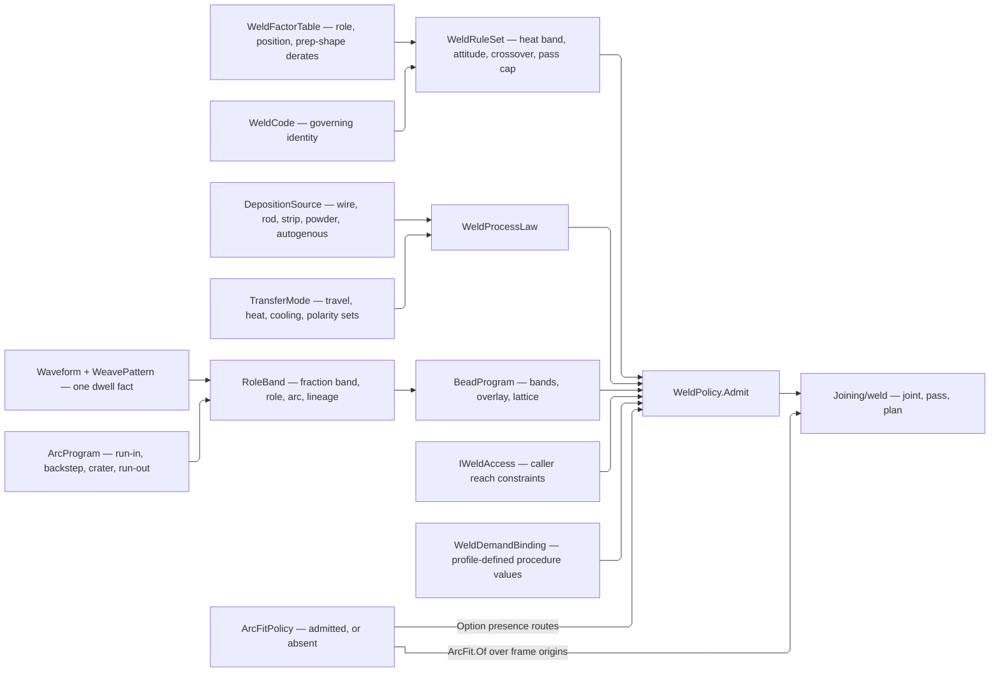

# [RASM_FABRICATION_DEPOSITION]

`WeldPolicy` is the aggregate planning value `Joining/weld` reads: `WeldRuleSet` states the heat band, torch attitude, crossover fraction, pass ceiling, and volume tolerances a governing code publishes, `WeldFactorTable` seats the role, position, and prep-shape derates as data, `WeldProcessLaw` converts `ProcessBudget.Joining` into deposited volume through one `TransferMode` per transfer mode, and `BeadProgram` derives role and oscillation from deposited fraction.

A welding standard is a RULE SET, never a scalar row. `WeldFactorTable.Shop` is the one named preset holding the landed defaults, so a code revision that re-rates 3G uphill or a double-sided groove moves rows rather than re-spelling a smart-enum column or a union arm, and a second shop supplies its own table whole.

Physics and policy seat here; geometry and the clock do not. `WeldRuleSet` states limits, `WeldProcessLaw` states rates, and `Joining/weld` `[03]-[PASS]` is the only place either becomes a number. `ArcProgram` places moves on a `TorchFrame` and the `IWeldAccess`/`WeldDemandBinding` extension points read the `WeldPass` roster, both declared across that boundary — so ownership cuts these two files, never stratum: deposition answers what the arc physically does and the joint-to-bead-to-plan spine answers what one admitted request derives.

`ArcFitPolicy` PRESENCE routes the circular-fit gate: an absent policy emits linear chains with no extra branch, and a present one arrives admitted, so `ArcFit.Of` measures rather than re-checking a caller assertion over transported frame ORIGINS, the whole input its circumcircle-and-residual kernel touches.

## [01]-[INDEX]

- [02]-[DEPOSITION]: derate tables, `WeldRuleSet`, deposition sources, transfer modes, process law, oscillation, role bands, the bead programme, access constraints, demand bindings, and `WeldPolicy`.
- [03]-[ARC_FIT]: `ArcProgram`, the arc clock it seeds, `ArcFitPolicy`, and the measured circular-fit gate.

## [02]-[DEPOSITION]

- Owner: `RoleFactor`, `PositionFactor`, and `ShapeFactor` own the derate columns; `WeldFactorTable` owns their three keyed maps and `WeldFactorTable.Shop` the one named preset; `WeldRuleSet` owns the heat band, torch attitude, pass ceiling, and volume tolerances; `DepositionSource`, `TransferMode`, and `WeldProcessLaw` own deposition and transfer physics; `Waveform`, `WeavePattern`, `RoleBand`, and `BeadProgram` own oscillation and the fill programme; `PassLineage` preserves derivation evidence; `IWeldAccess` mints internal `WeldAccess` strategies; `WeldDemandBinding` generates profile-defined procedure values; `WeldPolicy` owns aggregate planning policy.
- Cases: `DepositionSource.SolidWire` and `.CoredWire` parameterize multi-electrode count and spacing, while `.Rod`, `.Strip`, `.Powder`, `.Volumetric`, and `.Autogenous` cover the remaining deposition carriers. `Waveform.Harmonic` carries a phase-shifted sine series and `Waveform.Piecewise` a knot spline, so between them any mean-zero periodic oscillation generates. `WeldDemandBinding.Quantity`, `.Categorical`, `.Boolean`, and `.Temporal` cover the procedure value modalities. `PassLineage.Planned`, `.Repair`, and `.Temper` preserve derivation evidence.
- Law: `WeldFactorTable` is TOTAL over all three vocabularies at admission — every `PassRole`, `WeldPosition`, and `PrepShape` row resolves, so a factor read is a map lookup with no default and a table missing a row refuses at admission rather than silently deriving unity at a burning pass. Coverage and band accumulate PER AXIS, so a shop table short one uphill row while carrying an over-unity fillet derate names both and one edit repairs it.
- Law: the double-sided crossover the fill fold turns on is the rule set's own `SideCrossoverFraction` band, so an unbalanced preparation states where its second side begins instead of inheriting a symmetric half.
- Law: the rule set's DEMANDED torch attitude and the transport's DELIVERED one meet inside a declared `AttitudeToleranceDeg` band, and a frame outside it answers `WeldAccessBlocked` carrying the joint and the offending work angle — the caller-supplied `IWeldAccess` constraints stay the open extension point, but blocked reach is the package's own refusal and never a locus string that drops both facts a repair needs.
- Law: `WeavePattern` carries ONE dwell fact at ONE precision. `EdgeDwellS` is the fact the preimage and every heat computation read; `EdgeDwellMs` is a derived egress projection the controller word spells, so a rounded millisecond value never enters a content key beside the seconds it was rounded from.
- Law: `BeadProgram` admission accumulates the fill-band contract clause by clause — coverage, contiguity, the deposit-role split between bands and overlay, the overlap fraction, and the two lattice factors — so a malformed programme reports its whole defect set rather than the first clause that tripped. Fill bands must advance the groove ledger, so a zero-contribution role rides the overlay and deposits once after closure; interleaving it into `Bands` stalls the fill fold against the pass cap.
- Auto: `BeadProgram.Resolve` generates role and oscillation from deposited fraction, and `BeadProgram.Lattice` seats each bead across the layer width `FillProfile.WidthAtHeight` resolves at `FillProfile.HeightAtFill`.
- Entry: `WeldPolicy.Admit` validates a non-empty process roster, access-key uniqueness, and the procedure profile's `WeldDemandBinding` modality and field uniqueness once; the arc-fit policy, role-band coverage, the factor tables, and the pass ceiling prove at their own owners' admissions, so no clause is checked twice. Interior operations consume only the admitted owner.
- Packages: Thinktecture.Runtime.Extensions supplies `[Union]`, `[ComplexValueObject]`, and `[ValidationError]`; LanguageExt.Core supplies `Fin`, `Validation`, `Option`, `Map`, `Set`, `Seq`, `Traverse`, `Apply`, and `Fold`; MathNet.Numerics supplies `Interpolate.Linear` for the piecewise waveform; UnitsNet and NodaTime supply typed boundary quantities; `Rasm.Element` supplies `AdmissionSlots`; `Rasm.Fabrication.Process` supplies `ProcessBudget.Joining`, `FabricationFault`, and `FabConcern.Joining`.
- Boundary: `WeldPolicy` holds no geometry and no clock. `IWeldAccess.Check` and `WeldDemandBinding.Facts` read the `WeldPass` roster `Joining/weld` `[03]-[PASS]` emits, because both are evaluated AFTER pass generation over the passes they judge — the boundary is named at both ends and neither owner reaches the other's behaviour.

```csharp
// --- [IMPORTS] -------------------------------------------------------------------------
using System.Linq;
using System.Runtime.InteropServices;
using LanguageExt;
using LanguageExt.Common;
using LanguageExt.Traits;
using MathNet.Numerics;
using MathNet.Numerics.Interpolation;
using NodaTime;
using Rasm.Domain;
using Rasm.Element.Projection;
using Rasm.Fabrication.Process;
using Rhino.Geometry;
using Thinktecture;
using UnitsNet;
using UnitsNet.Units;
using static LanguageExt.Prelude;

namespace Rasm.Fabrication.Joining;

// --- [MODELS] --------------------------------------------------------------------------
public readonly record struct RoleFactor(double Area, double Travel, double Current);

public readonly record struct PositionFactor(double Travel, double Cooling, double Deposition);

public readonly record struct ShapeFactor(double Planar, double Spatial);

[ComplexValueObject]
public sealed partial class WeldFactorTable {
    public Map<PassRole, RoleFactor> Roles { get; }
    public Map<WeldPosition, PositionFactor> Positions { get; }
    public Map<PrepShape, ShapeFactor> Shapes { get; }

    static partial void ValidateFactoryArguments(
        ref ValidationError? validationError,
        ref Map<PassRole, RoleFactor> roles,
        ref Map<WeldPosition, PositionFactor> positions,
        ref Map<PrepShape, ShapeFactor> shapes) {
        if (roles.IsEmpty || positions.IsEmpty || shapes.IsEmpty)
            validationError = new ValidationError("weld-factor-table");
    }

    public static Fin<WeldFactorTable> Admit(
        Map<PassRole, RoleFactor> roles,
        Map<WeldPosition, PositionFactor> positions,
        Map<PrepShape, ShapeFactor> shapes) =>
        (AdmissionSlots.Gate(toSeq(PassRole.Items).ForAll(roles.ContainsKey),
            FabConcern.Joining, "weld-factor-table:roles:coverage", FabricationFault.Inadmissible),
                AdmissionSlots.Gate(!roles.Values.Exists(static row =>
                    !ValidityClaim.Positive(row.Area).Holds || !ValidityClaim.Positive(row.Travel).Holds
                    || !double.IsFinite(row.Current) || row.Current is <= 0.0 or > 1.0),
                        FabConcern.Joining, "weld-factor-table:roles:band", FabricationFault.Inadmissible),
                AdmissionSlots.Gate(toSeq(WeldPosition.Items).ForAll(positions.ContainsKey),
                    FabConcern.Joining, "weld-factor-table:positions:coverage", FabricationFault.Inadmissible),
                AdmissionSlots.Gate(!positions.Values.Exists(static row => !ValidityClaim.Positive(row.Travel).Holds
                    || !ValidityClaim.Positive(row.Cooling).Holds || !ValidityClaim.Positive(row.Deposition).Holds),
                        FabConcern.Joining, "weld-factor-table:positions:band", FabricationFault.Inadmissible),
                AdmissionSlots.Gate(toSeq(PrepShape.Items).ForAll(shapes.ContainsKey),
                    FabConcern.Joining, "weld-factor-table:shapes:coverage", FabricationFault.Inadmissible),
                AdmissionSlots.Gate(!shapes.Values.Exists(static row => !double.IsFinite(row.Planar) || row.Planar is <= 0.0 or > 1.0
                    || !double.IsFinite(row.Spatial) || row.Spatial is <= 0.0 or > 1.0),
                        FabConcern.Joining, "weld-factor-table:shapes:band", FabricationFault.Inadmissible))
            .Apply(static (_, _, _, _, _, _) => unit)
            .As()
            .ToFin()
            .Bind(_ => Validate(roles, positions, shapes, out WeldFactorTable table).Admitted(table));


    public RoleFactor Of(PassRole role) => Roles[role];

    public PositionFactor Of(WeldPosition position) => Positions[position];

    public ShapeFactor Of(PrepShape shape) => Shapes[shape];

    public static readonly Fin<WeldFactorTable> Shop = Admit(
        Map((PassRole.Tack, new RoleFactor(0.35, 0.45, 0.80)),
            (PassRole.Root, new RoleFactor(0.55, 0.70, 0.75)),
            (PassRole.HotPass, new RoleFactor(0.70, 0.85, 0.90)),
            (PassRole.Fill, new RoleFactor(1.00, 1.00, 1.00)),
            (PassRole.Cap, new RoleFactor(0.80, 0.90, 0.95)),
            (PassRole.Seal, new RoleFactor(0.50, 0.65, 0.80)),
            (PassRole.Butter, new RoleFactor(0.75, 0.80, 0.90)),
            (PassRole.Temper, new RoleFactor(0.55, 0.65, 0.70)),
            (PassRole.Buildup, new RoleFactor(0.90, 0.90, 1.00)),
            (PassRole.Repair, new RoleFactor(0.65, 0.70, 0.85))),
        Map((WeldPosition.G1, new PositionFactor(1.00, 1.00, 1.00)),
            (WeldPosition.G2, new PositionFactor(0.90, 1.00, 0.95)),
            (WeldPosition.G3Up, new PositionFactor(0.60, 1.30, 0.65)),
            (WeldPosition.G3Down, new PositionFactor(1.05, 0.90, 0.85)),
            (WeldPosition.G4, new PositionFactor(0.70, 1.15, 0.55)),
            (WeldPosition.G5Up, new PositionFactor(0.55, 1.35, 0.60)),
            (WeldPosition.G5Down, new PositionFactor(0.95, 1.00, 0.85)),
            (WeldPosition.G6, new PositionFactor(0.50, 1.40, 0.50)),
            (WeldPosition.F1, new PositionFactor(1.00, 1.00, 1.00)),
            (WeldPosition.F2, new PositionFactor(0.90, 1.00, 0.95)),
            (WeldPosition.F3, new PositionFactor(0.65, 1.25, 0.65)),
            (WeldPosition.F4, new PositionFactor(0.70, 1.15, 0.55))),
        Map((PrepShape.SingleGroove, new ShapeFactor(1.00, 1.00)),
            (PrepShape.DoubleGroove, new ShapeFactor(0.90, 0.90)),
            (PrepShape.Fillet, new ShapeFactor(0.90, 0.67)),
            (PrepShape.Cavity, new ShapeFactor(0.67, 0.67)),
            (PrepShape.Flare, new ShapeFactor(0.90, 0.67))));
}

[ComplexValueObject]
public sealed partial class WeldRuleSet {
    public WeldCode Code { get; }
    public double TargetHeatInputKjMm { get; }
    public double HeatInputCapKjMm { get; }
    public double WorkAngleDeg { get; }
    public double TravelAngleDeg { get; }

    public double AttitudeToleranceDeg { get; }

    public double SideCrossoverFraction { get; }
    public int PassCap { get; }
    public double AbsoluteVolumeToleranceMm3 { get; }
    public double RelativeVolumeTolerance { get; }
    public WeldFactorTable Factors { get; }

    static partial void ValidateFactoryArguments(
        ref ValidationError? validationError,
        ref WeldCode code,
        ref double targetHeatInputKjMm,
        ref double heatInputCapKjMm,
        ref double workAngleDeg,
        ref double travelAngleDeg,
        ref double attitudeToleranceDeg,
        ref double sideCrossoverFraction,
        ref int passCap,
        ref double absoluteVolumeToleranceMm3,
        ref double relativeVolumeTolerance,
        ref WeldFactorTable factors) {
        if (!ValidityClaim.Positive(targetHeatInputKjMm).Holds || heatInputCapKjMm < targetHeatInputKjMm
            || !double.IsFinite(workAngleDeg) || workAngleDeg is < 0.0 or > 180.0
            || !double.IsFinite(travelAngleDeg) || Math.Abs(travelAngleDeg) > 90.0
            || !ValidityClaim.Positive(attitudeToleranceDeg).Holds || attitudeToleranceDeg > 90.0
            || !double.IsFinite(sideCrossoverFraction) || sideCrossoverFraction is <= 0.0 or >= 1.0
            || passCap <= 0
            || !ValidityClaim.Positive(absoluteVolumeToleranceMm3).Holds || !ValidityClaim.Positive(relativeVolumeTolerance).Holds)
            validationError = new ValidationError("weld-rule-set");
    }

    public static Fin<WeldRuleSet> Admit(
        WeldCode code,
        Energy targetHeatInputPerLength,
        Energy heatInputCapPerLength,
        Angle workAngle,
        Angle travelAngle,
        Angle attitudeTolerance,
        double sideCrossoverFraction,
        int passCap,
        UnitsNet.Volume absoluteVolumeTolerance,
        double relativeVolumeTolerance,
        WeldFactorTable factors) =>
        Validate(
            code,
            targetHeatInputPerLength.As(EnergyUnit.Kilojoule),
            heatInputCapPerLength.As(EnergyUnit.Kilojoule),
            workAngle.As(AngleUnit.Degree),
            travelAngle.As(AngleUnit.Degree),
            attitudeTolerance.As(AngleUnit.Degree),
            sideCrossoverFraction,
            passCap,
            absoluteVolumeTolerance.As(VolumeUnit.CubicMillimeter),
            relativeVolumeTolerance,
            factors,
            out WeldRuleSet rules).Admitted(rules);

    public double VolumeToleranceMm3(double requiredMm3) =>
        Math.Max(AbsoluteVolumeToleranceMm3, requiredMm3 * RelativeVolumeTolerance);

    public static Fin<WeldRuleSet> Shop(WeldCode code) => WeldFactorTable.Shop.Bind(factors => Admit(
        code,
        Energy.FromKilojoules(1.00),
        Energy.FromKilojoules(2.50),
        Angle.FromDegrees(45.0),
        Angle.FromDegrees(10.0),
        attitudeTolerance: Angle.FromDegrees(15.0),
        sideCrossoverFraction: 0.5,
        passCap: 512,
        UnitsNet.Volume.FromCubicMillimeters(1e-6),
        relativeVolumeTolerance: 1e-9,
        factors));
}

[Union(ConversionFromValue = ConversionOperatorsGeneration.None)]
public abstract partial record DepositionSource {
    private DepositionSource() { }

    public sealed record SolidWire(double DiameterMm, int Count, double SpacingMm, double Yield) : DepositionSource;
    public sealed record CoredWire(
        double OuterDiameterMm,
        double FillFraction,
        int Count,
        double SpacingMm,
        double Yield) : DepositionSource;
    public sealed record Rod(double AreaMm2, double FeedMmMin, double Yield) : DepositionSource;
    public sealed record Strip(double WidthMm, double ThicknessMm, double FeedMmMin, double Yield) : DepositionSource;
    public sealed record Powder(double Mm3Min, double Capture, double CharacteristicWidthMm) : DepositionSource;
    public sealed record Volumetric(double Mm3Min, double CharacteristicWidthMm) : DepositionSource;
    public sealed record Autogenous(double FusedAreaMm2) : DepositionSource;

    public double Rate(ProcessBudget.Joining budget) => Switch(
        state: budget,
        solidWire: static (joined, value) => 0.25 * Math.PI * value.DiameterMm * value.DiameterMm
            * value.Count * joined.WireFeedRate * value.Yield,
        coredWire: static (joined, value) => 0.25 * Math.PI * value.OuterDiameterMm * value.OuterDiameterMm
            * value.FillFraction * value.Count * joined.WireFeedRate * value.Yield,
        rod: static (_, value) => value.AreaMm2 * value.FeedMmMin * value.Yield,
        strip: static (_, value) => value.WidthMm * value.ThicknessMm * value.FeedMmMin * value.Yield,
        powder: static (_, value) => value.Mm3Min * value.Capture,
        volumetric: static (_, value) => value.Mm3Min,
        autogenous: static (joined, value) => value.FusedAreaMm2 * joined.TravelSpeed);

    public double Width => Switch(
        solidWire: static value => value.DiameterMm + ((value.Count - 1) * value.SpacingMm),
        coredWire: static value => value.OuterDiameterMm + ((value.Count - 1) * value.SpacingMm),
        rod: static value => Math.Sqrt(value.AreaMm2),
        strip: static value => value.WidthMm,
        powder: static value => value.CharacteristicWidthMm,
        volumetric: static value => value.CharacteristicWidthMm,
        autogenous: static value => Math.Sqrt(value.FusedAreaMm2));

    public Option<double> FillerLength(double depositedMm3) => Switch(
        state: depositedMm3,
        solidWire: static (deposited, value) => Some(deposited
            / (0.25 * Math.PI * value.DiameterMm * value.DiameterMm * value.Count * value.Yield)),
        coredWire: static (deposited, value) => Some(deposited
            / (0.25 * Math.PI * value.OuterDiameterMm * value.OuterDiameterMm
                * value.FillFraction * value.Count * value.Yield)),
        rod: static (deposited, value) => Some(deposited / (value.AreaMm2 * value.Yield)),
        strip: static (deposited, value) => Some(deposited / (value.WidthMm * value.ThicknessMm * value.Yield)),
        powder: static (_, _) => Option<double>.None,
        volumetric: static (_, _) => Option<double>.None,
        autogenous: static (_, _) => Option<double>.None);

    public bool ConsumesFiller => Switch(
        solidWire: static _ => true,
        coredWire: static _ => true,
        rod: static _ => true,
        strip: static _ => true,
        powder: static _ => false,
        volumetric: static _ => false,
        autogenous: static _ => false);

    public bool Admitted => Switch(
        solidWire: static value => ValidityClaim.All(
            ValidityClaim.Positive(value.DiameterMm), value.Count > 0, double.IsFinite(value.SpacingMm), value.SpacingMm >= 0.0,
            (value.Count > 1 || value.SpacingMm == 0.0), Fraction(value.Yield)),
        coredWire: static value => ValidityClaim.All(
            ValidityClaim.Positive(value.OuterDiameterMm), Fraction(value.FillFraction), value.Count > 0, double.IsFinite(value.SpacingMm),
            value.SpacingMm >= 0.0, (value.Count > 1 || value.SpacingMm == 0.0), Fraction(value.Yield)),
        rod: static value => ValidityClaim.All(ValidityClaim.Positive(value.AreaMm2), ValidityClaim.Positive(value.FeedMmMin), Fraction(value.Yield)),
        strip: static value => ValidityClaim.All(
            ValidityClaim.Positive(value.WidthMm), ValidityClaim.Positive(value.ThicknessMm), ValidityClaim.Positive(value.FeedMmMin),
            Fraction(value.Yield)),
        powder: static value => ValidityClaim.All(
            ValidityClaim.Positive(value.Mm3Min), Fraction(value.Capture), ValidityClaim.Positive(value.CharacteristicWidthMm)),
        volumetric: static value => ValidityClaim.All(ValidityClaim.Positive(value.Mm3Min), ValidityClaim.Positive(value.CharacteristicWidthMm)),
        autogenous: static value => ValidityClaim.Positive(value.FusedAreaMm2));

    private static bool Fraction(double value) => double.IsFinite(value) && value is > 0.0 and <= 1.0;
}

[ComplexValueObject]
public sealed partial class TransferMode {
    public double Efficiency { get; }
    public double TravelLowMmMin { get; }
    public double TravelHighMmMin { get; }
    public double HeatInputLowKjMm { get; }
    public double HeatInputHighKjMm { get; }
    public double CoolingLowS { get; }
    public double CoolingHighS { get; }
    public double CurrentCapA { get; }
    public Set<WeldPolarity> Polarities { get; }
    public Set<WeldCurrent> Currents { get; }
    public Set<WeldProgression> Progressions { get; }
    public Set<PassTechnique> Techniques { get; }

    static partial void ValidateFactoryArguments(
        ref ValidationError? validationError,
        ref double efficiency,
        ref double travelLowMmMin,
        ref double travelHighMmMin,
        ref double heatInputLowKjMm,
        ref double heatInputHighKjMm,
        ref double coolingLowS,
        ref double coolingHighS,
        ref double currentCapA,
        ref Set<WeldPolarity> polarities,
        ref Set<WeldCurrent> currents,
        ref Set<WeldProgression> progressions,
        ref Set<PassTechnique> techniques) {
        if (!double.IsFinite(efficiency) || efficiency is <= 0.0 or > 1.0
            || !Band(travelLowMmMin, travelHighMmMin) || !Band(heatInputLowKjMm, heatInputHighKjMm)
            || !Band(coolingLowS, coolingHighS) || !ValidityClaim.Positive(currentCapA).Holds
            || polarities.IsEmpty || currents.IsEmpty || progressions.IsEmpty || techniques.IsEmpty)
            validationError = new ValidationError("transfer-mode");
    }

    public static Fin<TransferMode> Admit(
        double efficiency,
        Speed travelLow,
        Speed travelHigh,
        Energy heatInputLowPerLength,
        Energy heatInputHighPerLength,
        NodaTime.Duration coolingLow,
        NodaTime.Duration coolingHigh,
        ElectricCurrent currentCap,
        Set<WeldPolarity> polarities,
        Set<WeldCurrent> currents,
        Set<WeldProgression> progressions,
        Set<PassTechnique> techniques) =>
        Validate(
            efficiency,
            travelLow.As(SpeedUnit.MillimeterPerMinute),
            travelHigh.As(SpeedUnit.MillimeterPerMinute),
            heatInputLowPerLength.As(EnergyUnit.Kilojoule),
            heatInputHighPerLength.As(EnergyUnit.Kilojoule),
            coolingLow.TotalSeconds,
            coolingHigh.TotalSeconds,
            currentCap.As(ElectricCurrentUnit.Ampere),
            polarities, currents, progressions, techniques,
            out TransferMode mode).Admitted(mode);

    public K<Validation<Error>, Unit> Admits(WeldJoint joint) => (
            AdmissionSlots.Gate(Polarities.Contains(joint.Polarity), joint.Joint, "polarity", Refusal),
            AdmissionSlots.Gate(Currents.Contains(joint.Current), joint.Joint, "current-type", Refusal),
            AdmissionSlots.Gate(Progressions.Contains(joint.Progression), joint.Joint, "progression", Refusal),
            AdmissionSlots.Gate(Techniques.Contains(joint.Technique), joint.Joint, "technique", Refusal))
        .Apply(static (_, _, _, _) => unit)
        .As();

    public Fin<double> Travel(double requestedMmMin, int joint) =>
        !double.IsFinite(requestedMmMin) || requestedMmMin < TravelLowMmMin
            ? Fin.Fail<double>(new KernelFault.InvalidValue("deposition", $"transfer-mode:travel-floor:{joint}"))
            : Fin.Succ(Math.Min(requestedMmMin, TravelHighMmMin));

    private static bool Band(double low, double high) => ValidityClaim.All(ValidityClaim.Positive(low), double.IsFinite(high), low <= high);

    private static FabricationFault Refusal(int joint, string axis) =>
        FabricationFault.Inadmissible(FabConcern.Joining, $"transfer-mode:{axis}:{joint}");
}

[ComplexValueObject]
public sealed partial class WeldProcessLaw {
    public DepositionSource Deposition { get; }
    public TransferModeKey DefaultMode { get; }
    public Map<TransferModeKey, TransferMode> Modes { get; }

    static partial void ValidateFactoryArguments(
        ref ValidationError? validationError,
        ref DepositionSource deposition,
        ref TransferModeKey defaultMode,
        ref Map<TransferModeKey, TransferMode> modes) {
        if (!deposition.Admitted || modes.IsEmpty || !modes.ContainsKey(defaultMode))
            validationError = new ValidationError("weld-process-law");
    }

    public static Fin<WeldProcessLaw> Admit(
        DepositionSource deposition,
        TransferModeKey defaultMode,
        Map<TransferModeKey, TransferMode> modes) =>
        Validate(deposition, defaultMode, modes, out WeldProcessLaw law).Admitted(law);

    public Fin<TransferMode> Mode(WeldJoint joint) => Modes
        .Find(joint.TransferMode.IfNone(DefaultMode))
        .ToFin(new KernelFault.InvalidValue("deposition", $"weld-process-law:transfer-mode:{joint.Joint}"))
        .Bind(mode => mode.Admits(joint).ToFin().Map(_ => mode));
}

public readonly record struct HarmonicTerm(int Order, double Amplitude, double PhaseRad);

public readonly record struct WaveKnot(double Phase, double Offset);

[Union(ConversionFromValue = ConversionOperatorsGeneration.None)]
public abstract partial record Waveform {
    private Waveform() { }

    public sealed record Harmonic(Arr<HarmonicTerm> Terms) : Waveform;
    public sealed record Piecewise(Arr<WaveKnot> Knots) : Waveform {
        [IgnoreMember]
        private IInterpolation? spline;

        internal IInterpolation Spline => spline ??= Interpolate.Linear(
            [.. Knots.Map(static knot => knot.Phase)],
            [.. Knots.Map(static knot => knot.Offset)]);
    }

    public double Offset(double phase) => Switch(
        state: phase - Math.Floor(phase),
        harmonic: static (cycle, value) => value.Terms.Fold(0.0,
            (sum, term) => sum + (term.Amplitude * Math.Sin((2.0 * Math.PI * term.Order * cycle) + term.PhaseRad))),
        piecewise: static (cycle, value) => value.Spline.Interpolate(cycle));

    public bool Admitted => Switch(
        harmonic: static value => !value.Terms.IsEmpty
            && value.Terms.ForAll(static term => term.Order > 0
                && double.IsFinite(term.Amplitude) && double.IsFinite(term.PhaseRad))
            && value.Terms.Map(static term => term.Order).Distinct().Count == value.Terms.Count,
        piecewise: static value => value.Knots.Count >= 2
            && value.Knots.ForAll(static knot => double.IsFinite(knot.Phase) && double.IsFinite(knot.Offset))
            && value.Knots[0].Phase == 0.0 && value.Knots[^1].Phase == 1.0
            && value.Knots[0].Offset == value.Knots[^1].Offset
            && toSeq(value.Knots).Zip(toSeq(value.Knots).Tail).ForAll(static pair => pair.Item1.Phase < pair.Item2.Phase));
}

[ComplexValueObject]
[StructLayout(LayoutKind.Auto)]
public readonly partial struct WeavePattern {
    public Waveform Shape { get; }
    public double AmplitudeMm { get; }
    public double PitchMm { get; }
    public double EdgeDwellS { get; }
    public int TogglesPerCycle { get; }

    public int EdgeDwellMs => (int)Math.Round(EdgeDwellS * 1000.0);

    static partial void ValidateFactoryArguments(
        ref ValidationError? validationError,
        ref Waveform shape,
        ref double amplitudeMm,
        ref double pitchMm,
        ref double edgeDwellS,
        ref int togglesPerCycle) {
        if (!shape.Admitted
            || !double.IsFinite(amplitudeMm) || amplitudeMm < 0.0
            || !ValidityClaim.Positive(pitchMm).Holds
            || !double.IsFinite(edgeDwellS) || edgeDwellS < 0.0
            || togglesPerCycle < 0 || (edgeDwellS > 0.0) != (togglesPerCycle > 0)
            || (amplitudeMm == 0.0 && edgeDwellS > 0.0))
            validationError = new ValidationError("weave-pattern");
    }

    public static Fin<WeavePattern> Admit(
        Waveform shape,
        UnitsNet.Length amplitude,
        UnitsNet.Length pitch,
        NodaTime.Duration edgeDwell,
        int togglesPerCycle) =>
        Validate(
            shape,
            amplitude.As(LengthUnit.Millimeter),
            pitch.As(LengthUnit.Millimeter),
            edgeDwell.TotalSeconds,
            togglesPerCycle,
            out WeavePattern weave).Admitted(weave);

    public double Offset(double stationMm) => AmplitudeMm * Shape.Offset(stationMm / PitchMm);

    public double DwellSeconds(double lengthMm) => EdgeDwellS * TogglesPerCycle * (lengthMm / PitchMm);
}

[Union(ConversionFromValue = ConversionOperatorsGeneration.None)]
public abstract partial record PassLineage {
    private PassLineage() { }

    public sealed record Planned : PassLineage;
    public sealed record Repair(int ReplacesOrdinal, DefectKey Defect, double ExcavatedMm3) : PassLineage;
    public sealed record Temper(int ConditionsOrdinal) : PassLineage;

    public bool Admitted => Switch(
        planned: static _ => true,
        repair: static value => ValidityClaim.All(value.ReplacesOrdinal >= 0, ValidityClaim.Positive(value.ExcavatedMm3)),
        temper: static value => value.ConditionsOrdinal >= 0);

    public double ExcavatedMm3 => Switch(
        planned: static _ => 0.0,
        repair: static value => value.ExcavatedMm3,
        temper: static _ => 0.0);

    public Option<int> Parent => Switch(
        planned: static _ => Option<int>.None,
        repair: static value => Some(value.ReplacesOrdinal),
        temper: static value => Some(value.ConditionsOrdinal));
}

[ComplexValueObject]
[StructLayout(LayoutKind.Auto)]
public readonly partial struct RoleBand {
    public double StartFraction { get; }
    public double EndFraction { get; }
    public PassRole Role { get; }
    public WeavePattern Weave { get; }
    public ArcProgram Arc { get; }
    public PassLineage Lineage { get; }

    static partial void ValidateFactoryArguments(
        ref ValidationError? validationError,
        ref double startFraction,
        ref double endFraction,
        ref PassRole role,
        ref WeavePattern weave,
        ref ArcProgram arc,
        ref PassLineage lineage) {
        if (!lineage.Admitted
            || !double.IsFinite(startFraction) || !double.IsFinite(endFraction)
            || startFraction < 0.0 || endFraction > 1.0 || startFraction >= endFraction
            || (!role.OscillationAdmitted && weave.AmplitudeMm > 0.0)
            || (role == PassRole.Repair) != (lineage is PassLineage.Repair)
            || (role == PassRole.Temper) != (lineage is PassLineage.Temper))
            validationError = new ValidationError("role-band");
    }
}

[ComplexValueObject]
public sealed partial class BeadProgram {
    public Seq<RoleBand> Bands { get; }
    public Seq<RoleBand> Overlay { get; }
    public double OverlapFraction { get; }
    public double WidthFactor { get; }
    public double HeightFactor { get; }

    static partial void ValidateFactoryArguments(
        ref ValidationError? validationError,
        ref Seq<RoleBand> bands,
        ref Seq<RoleBand> overlay,
        ref double overlapFraction,
        ref double widthFactor,
        ref double heightFactor) {
        if (bands.IsEmpty)
            validationError = new ValidationError("bead-program");
    }

    public static Fin<BeadProgram> Admit(
        Seq<RoleBand> bands,
        Seq<RoleBand> overlay,
        double overlapFraction,
        double widthFactor,
        double heightFactor) =>
        (AdmissionSlots.Gate(!bands.IsEmpty && bands[0].StartFraction == 0.0 && bands[^1].EndFraction == 1.0,
            FabConcern.Joining, "bead-program:bands:coverage", FabricationFault.Inadmissible),
                AdmissionSlots.Gate(!bands.Zip(bands.Tail).Exists(static pair => pair.Item1.EndFraction != pair.Item2.StartFraction),
                    FabConcern.Joining, "bead-program:bands:contiguity", FabricationFault.Inadmissible),
                AdmissionSlots.Gate(!bands.Exists(static row => !row.Role.Deposits),
                    FabConcern.Joining, "bead-program:bands:fill-role", FabricationFault.Inadmissible),
                AdmissionSlots.Gate(!overlay.Exists(static row => row.Role.Deposits),
                    FabConcern.Joining, "bead-program:overlay:role", FabricationFault.Inadmissible),
                AdmissionSlots.Gate(double.IsFinite(overlapFraction) && overlapFraction is >= 0.0 and < 1.0,
                    FabConcern.Joining, "bead-program:overlap", FabricationFault.Inadmissible),
                AdmissionSlots.Gate(ValidityClaim.All(ValidityClaim.Positive(widthFactor), ValidityClaim.Positive(heightFactor)),
                    FabConcern.Joining, "bead-program:lattice-factors", FabricationFault.Inadmissible))
            .Apply(static (_, _, _, _, _, _) => unit)
            .As()
            .ToFin()
            .Bind(_ => Validate(bands, overlay, overlapFraction, widthFactor, heightFactor, out BeadProgram program)
                .Admitted(program));


    public RoleBand Resolve(double fraction) => Bands
        .Find(row => fraction >= row.StartFraction && fraction < row.EndFraction)
        .IfNone(() => Bands[^1]);

    public (int BeadsInLayer, double LateralOffsetMm) Lattice(double layerWidthMm, double beadWidthMm, int bead) {
        int count = Math.Max(1, (int)Math.Ceiling(layerWidthMm / (beadWidthMm * (1.0 - OverlapFraction))));
        return (count, (-0.5 * layerWidthMm) + ((Math.Min(bead, count - 1) + 0.5) * (layerWidthMm / count)));
    }
}

// --- [SERVICES] ------------------------------------------------------------------------
public interface IWeldAccess {
    string Key { get; }
    K<Validation<Error>, Unit> Check(WeldJoint joint, Seq<WeldPass> passes);

    public static Fin<IWeldAccess> Admit(
        string key,
        Func<WeldJoint, Seq<WeldPass>, K<Validation<Error>, Unit>> constraint) =>
        WeldAccess.Validate(constraint, out WeldAccess access).Admitted<IWeldAccess>(access);
}

[ComplexValueObject]
internal sealed partial class WeldAccess : IWeldAccess {
    public string Key { get; }
    public Func<WeldJoint, Seq<WeldPass>, K<Validation<Error>, Unit>> Constraint { get; }

    static partial void ValidateFactoryArguments(
        ref ValidationError? validationError,
        ref string key,
        ref Func<WeldJoint, Seq<WeldPass>, K<Validation<Error>, Unit>> constraint) {
        if (!Witness.Keyed())
            validationError = new ValidationError("weld-access");
    }

    public K<Validation<Error>, Unit> Check(WeldJoint joint, Seq<WeldPass> passes) =>
        Try.lift(() => Fin.Succ(Constraint(joint, passes))).Run().Bind(static inner => inner).Match(
            Succ: static result => result,
            Fail: static error => AdmissionSlots.Gate(false, error));
}

[Union(ConversionFromValue = ConversionOperatorsGeneration.None)]
public abstract partial record WeldDemandBinding {
    private WeldDemandBinding() { }

    public sealed record Facts(
        WeldJoint Joint,
        ProcessBudget.Joining Budget,
        Seq<WeldPass> Passes,
        double MaxHeatInputKjMm);

    public sealed record Quantity(EssentialVariable Variable, Func<Facts, Option<IQuantity>> Project) : WeldDemandBinding;
    public sealed record Categorical(EssentialVariable Variable, Func<Facts, Option<string>> Project) : WeldDemandBinding;
    public sealed record Boolean(EssentialVariable Variable, Func<Facts, Option<bool>> Project) : WeldDemandBinding;
    public sealed record Temporal(EssentialVariable Variable, Func<Facts, Option<Instant>> Project) : WeldDemandBinding;

    public EssentialVariable Field => Switch(
        quantity: static value => value.Variable,
        categorical: static value => value.Variable,
        boolean: static value => value.Variable,
        temporal: static value => value.Variable);

    public bool Admitted => Switch(
        quantity: static value => value.Variable.Modality == VariableModality.Quantity,
        categorical: static value => value.Variable.Modality == VariableModality.Categorical,
        boolean: static value => value.Variable.Modality == VariableModality.Boolean,
        temporal: static value => value.Variable.Modality == VariableModality.Temporal);

    public Fin<QualificationValue> Resolve(Facts facts) => Switch(
        state: facts,
        quantity: static (state, binding) => Resolved(
            state, binding.Variable, binding.Project(state), static value => new QualificationValue.Quantity(value)),
        categorical: static (state, binding) => Resolved(
            state, binding.Variable, binding.Project(state), static value => new QualificationValue.Categorical(value)),
        boolean: static (state, binding) => Resolved(
            state, binding.Variable, binding.Project(state), static value => new QualificationValue.Boolean(value)),
        temporal: static (state, binding) => Resolved(
            state, binding.Variable, binding.Project(state), static value => new QualificationValue.Temporal(value)));

    private static Fin<QualificationValue> Resolved<T>(
        Facts facts,
        EssentialVariable variable,
        Option<T> projected,
        Func<T, QualificationValue> wrap) =>
        variable.Applicability.Exists(law => !law.Matches(facts.Joint.QualificationContext))
            ? Fin.Succ<QualificationValue>(new QualificationValue.ContextExcluded())
            : projected.Match(
                Some: value => Fin.Succ(wrap(value)),
                None: () => variable.Requirement.EvidenceRequired
                    ? Fin.Fail<QualificationValue>(new KernelFault.InvalidValue("deposition", $"weld-demand:required:{variable.Key.Value}"))
                    : Fin.Succ<QualificationValue>(new QualificationValue.EvidenceOmitted()));
}

[ComplexValueObject]
public sealed partial class WeldPolicy {
    public WeldRuleSet Rules { get; }
    public BeadProgram Beads { get; }

    public Option<ArcFitPolicy> ArcFit { get; }

    public Map<ProcessKind, WeldProcessLaw> Processes { get; }
    public Seq<IWeldAccess> Access { get; }
    public Seq<WeldDemandBinding> DemandBindings { get; }

    static partial void ValidateFactoryArguments(
        ref ValidationError? validationError,
        ref WeldRuleSet rules,
        ref BeadProgram beads,
        ref Option<ArcFitPolicy> arcFit,
        ref Map<ProcessKind, WeldProcessLaw> processes,
        ref Seq<IWeldAccess> access,
        ref Seq<WeldDemandBinding> demandBindings) {
        if (processes.IsEmpty
            || access.Map(static value => value.Key).Distinct().Count != access.Count
            || demandBindings.IsEmpty
            || demandBindings.Exists(static value => !value.Admitted)
            || demandBindings.Map(static value => value.Field.Key).Distinct().Count != demandBindings.Count)
            validationError = new ValidationError("weld-policy");
    }

    public static Fin<WeldPolicy> Admit(
        WeldRuleSet rules,
        BeadProgram beads,
        Option<ArcFitPolicy> arcFit,
        Map<ProcessKind, WeldProcessLaw> processes,
        Seq<IWeldAccess> access,
        Seq<WeldDemandBinding> demandBindings) =>
        Validate(rules, beads, arcFit, processes, access, demandBindings, out WeldPolicy policy).Admitted(policy);
}
```

## [03]-[ARC_FIT]

- Owner: `ArcProgram` owns the run-in, backstep, crater dwell, and run-out placed on the emitted path and the arc clock they seed; `ArcFitPolicy` owns the admitted circular-fit band and `ArcFit` the measured fit and its rotation sense.
- Law: the circular-fit gate reads transported frame ORIGINS alone. A run of origins admits as an arc when the circumcircle of its first, middle, and last holds every interior origin within `ArcFitPolicy.ToleranceMm`, the run is coplanar in that circle's own normal within the same tolerance, and the accumulated sweep clears `MinimumSweepRad`; the sense is the sign of the fit normal against the run's own surface normal. A run failing any clause keeps the linear chain — an arc is never approximated, so a bead that is not circular is not posted as one.
- Law: `ArcFitPolicy` is ADMITTED or ABSENT, never a disabled row. The tolerance floor, the three-origin minimum, and the sweep band prove once at construction, so `ArcFit.Of` measures instead of re-deriving a frame minimum a caller could have understated, and `WeldPolicy` re-checks nothing.
- Law: approach, run-in, and backstep ride the pass path AHEAD of the deposit segments and run-out behind them, so the burning segments keep a station-monotone interval nothing prepends into. Crater fill is arc-on time with no travel, so it seeds the clock rather than riding a distance quotient.
- Exemption: `ArcFit.Of` is the measured circumcircle-and-residual kernel — the early refusals are the gate, not control flow around it.
- Packages: RhinoCommon supplies `Point3d`, `Vector3d.CrossProduct`, and `Vector3d.Multiply` for the circumcircle fit; `Process/atoms` supplies `Move`, `MoveOrientation`, `ArcCenter`, and `RotationSense`.
- Boundary: `ArcProgram.Lead` and `.Trail` take the `Joining/weld` `[03]-[PASS]` `TorchFrame` the transport produced — the arc program places moves ON a pose it never derives.

```csharp
// --- [MODELS] --------------------------------------------------------------------------
[ComplexValueObject]
[StructLayout(LayoutKind.Auto)]
public readonly partial struct ArcFitPolicy {
    public double ToleranceMm { get; }
    public int MinimumFrames { get; }
    public double MinimumSweepRad { get; }

    static partial void ValidateFactoryArguments(
        ref ValidationError? validationError,
        ref double toleranceMm,
        ref int minimumFrames,
        ref double minimumSweepRad) {
        if (!ValidityClaim.Positive(toleranceMm).Holds || minimumFrames < 3
            || !double.IsFinite(minimumSweepRad) || minimumSweepRad is <= 0.0 or > Math.Tau)
            validationError = new ValidationError("arc-fit-policy");
    }

    public static Fin<ArcFitPolicy> Admit(UnitsNet.Length tolerance, int minimumFrames, Angle minimumSweep) =>
        Validate(
            tolerance.As(LengthUnit.Millimeter),
            minimumFrames,
            minimumSweep.As(AngleUnit.Radian),
            out ArcFitPolicy policy).Admitted(policy);
}

public readonly record struct ArcFit(Point3d Centre, double RadiusMm, RotationSense Sense, double SweepRadians) {
    public static Option<ArcFit> Of(Seq<Point3d> run, Vector3d surfaceNormal, ArcFitPolicy policy) {
        if (run.Count < policy.MinimumFrames) return None;

        Point3d first = run.Head.IfNone(Point3d.Origin);
        Point3d middle = run[run.Count / 2];
        Point3d last = run.Last.IfNone(Point3d.Origin);
        Vector3d spanA = middle - first;
        Vector3d spanB = last - first;
        Vector3d normal = Vector3d.CrossProduct(spanA, spanB);
        double normalSquare = Vector3d.Multiply(normal, normal);
        if (normalSquare <= 0.0) return None;

        Vector3d offset = ((Vector3d.Multiply(spanA, spanA) * Vector3d.CrossProduct(spanB, normal))
            + (Vector3d.Multiply(spanB, spanB) * Vector3d.CrossProduct(normal, spanA))) / (2.0 * normalSquare);
        Point3d centre = first + offset;
        double radius = centre.DistanceTo(first);
        if (!ValidityClaim.Positive(radius).Holds) return None;

        bool held = run.ForAll(origin =>
            Math.Abs(centre.DistanceTo(origin) - radius) <= policy.ToleranceMm
            && Math.Abs(Vector3d.Multiply(origin - centre, normal) / Math.Sqrt(normalSquare)) <= policy.ToleranceMm);
        if (!held) return None;

        double sweep = run.Zip(run.Tail).Fold(0.0, (accumulated, pair) => accumulated + Vector3d.VectorAngle(
            pair.Item1 - centre,
            pair.Item2 - centre));
        RotationSense sense = Vector3d.Multiply(normal, surfaceNormal) >= 0.0
            ? RotationSense.Counterclockwise
            : RotationSense.Clockwise;
        return sweep >= policy.MinimumSweepRad && sweep <= Math.Tau
            ? Some(new ArcFit(centre, radius, sense, sense == RotationSense.Clockwise ? -sweep : sweep))
            : None;
    }

    public ArcCenter Arc => new(Centre, Sense);
}

[ComplexValueObject]
[StructLayout(LayoutKind.Auto)]
public readonly partial struct ArcProgram {
    public double RunInMm { get; }
    public double BackstepMm { get; }
    public double CraterFillS { get; }
    public double RunOutMm { get; }

    static partial void ValidateFactoryArguments(
        ref ValidationError? validationError,
        ref double runInMm,
        ref double backstepMm,
        ref double craterFillS,
        ref double runOutMm) {
        if (Seq(runInMm, backstepMm, craterFillS, runOutMm).Exists(static value => !double.IsFinite(value) || value < 0.0))
            validationError = new ValidationError("arc-program");
    }

    public static Fin<ArcProgram> Admit(
        UnitsNet.Length runIn,
        UnitsNet.Length backstep,
        NodaTime.Duration craterFill,
        UnitsNet.Length runOut) =>
        Validate(
            runIn.As(LengthUnit.Millimeter),
            backstep.As(LengthUnit.Millimeter),
            craterFill.TotalSeconds,
            runOut.As(LengthUnit.Millimeter),
            out ArcProgram program).Admitted(program);

    public Fin<Seq<Move>> Lead(TorchFrame first, double feedMmMin) =>
        (from approach in Move.Rapid.Of(first.Pose.Origin - (RunInMm * first.Pose.XAxis), first.Orientation)
         from lead in RunInMm > 0.0
             ? Move.Linear.Of(first.Pose.Origin, feedMmMin, first.Orientation).Map(Seq1)
             : Fin.Succ(Seq<Move>())
         from back in BackstepMm > 0.0
             ? from out_ in Move.Linear.Of(first.Pose.Origin + (BackstepMm * first.Pose.XAxis), feedMmMin, first.Orientation)
               from home in Move.Linear.Of(first.Pose.Origin, feedMmMin, first.Orientation)
               select Seq(out_, home)
             : Fin.Succ(Seq<Move>())
         select Seq1(approach) + lead + back);

    public Fin<Seq<Move>> Trail(TorchFrame last, double feedMmMin) => RunOutMm > 0.0
        ? Move.Linear.Of(last.Pose.Origin + (RunOutMm * last.Pose.XAxis), feedMmMin, last.Orientation).Map(Seq1)
        : Fin.Succ(Seq<Move>());

    public double ArcTime(Seq<Move> path) => path.Zip(path.Tail).Fold(
        CraterFillS,
        static (seconds, pair) => pair.Item2.Switch(
            state: (Seconds: seconds, From: pair.Item1.Target),
            rapid: static (state, _) => state.Seconds,
            linear: static (state, move) => state.Seconds + (60.0 * state.From.DistanceTo(move.Target) / move.Feed),
            circular: static (state, move) => state.Seconds
                + (60.0 * Math.Abs(move.SweepRadians) * move.Radius / move.Feed)));
}
```



## [04]-[RESEARCH]

<!-- source-only: research row template:
[TOKEN]-[OPEN|BLOCKED]: <exact question>; <verification route>.
-->

(none)
