# [RASM_FABRICATION_WELD]

`Weld.Plan` consumes one admitted `WeldRequest` and derives fill-complete bead deposits, side-correct transported torch frames, station-indexed deposit segments, preparation actions, qualification demands, and one content-keyed `WeldPlan`. Boundary-resolved preparation profiles carry the full section and cavity demand; planning never recreates `Rasm.Materials` groove geometry from a key or a nominal leg.

`Joining/deposition` owns the physics and the policy this page reads — `WeldRuleSet` and its `WeldFactorTable` derate rows, `WeldProcessLaw` over its `TransferMode` set, `BeadProgram` over its role bands, `ArcProgram`, and the `ArcFitPolicy` gate — and `WeldPolicy` is the one admitted aggregate `WeldRequest` carries. The boundary runs both ways inside one plane: the arc program places moves on the `TorchFrame` this page transports, and the access and demand-binding extension points judge the `WeldPass` roster this page emits.

Bead placement is a two-dimensional lattice, not a vertical stack: `FillProfile` resolves the trapezoidal section at the current fill height through one held `IInterpolation` per section column, and `BeadProgram.Lattice` seats as many overlapped beads across that width as it admits. The circular-fit gate routes on POLICY PRESENCE — an absent `WeldPolicy.ArcFit` emits linear chains with no extra branch, and a present one measures over the transported frame origins so an orbital seam emits `Move.Circular` carrying its rotation sense while a non-circular run keeps the linear chain.

`WeldPass.Segments` is the station-indexed seam wire every downstream plane reads: each `DepositSegment` owns its station interval, its own frames, and its own commanded move, and `DepositSegment.Window` is the ONE geometry that re-cuts a sub-interval — so `Joining/sequence` orders and subdivides deposits without index-joining a commanded path against a frame roster the arc program already lengthened. `WeldProjection` parameterizes execution, qualification, and result egress without moving scheduling, kinematics, posting, or procedure ownership into joining.

## [01]-[INDEX]

- [02]-[JOINT]: the closed weld vocabularies, keyed identities, section and span geometry, `FillProfile`, `RootProgram`, `JointPrep`, and the `WeldJointIngress` gate.
- [03]-[PASS]: torch frames, station-indexed deposit segments, bead evidence, `WeldPass`, `JointAction`, and the transport, weave, and pass folds.
- [04]-[PLAN]: `WeldRequest`, the fill ledger, `WeldPlan`, its projections, the canonical preimage, and `Weld.Plan`.

## [02]-[JOINT]

- Owner: `WeldCode` owns the governing-code identity and carries no number; `PassRole` and `WeldPosition` own role and position SEMANTICS alone; `WeldProgression`, `WeldCurrent`, `WeldPolarity`, and `PassTechnique` close the electrical and technique vocabularies a transfer mode gates on; `MaterialGroupKey`, `TransferModeKey`, `PreparationKey`, and `DefectKey` own the open catalogue identities this page declares, while the consumable identity composes the S0 `Process/atoms` `ConsumableKey` a wear budget spends; `SectionStation`, `DepositSpan`, and `FillProfile` own boundary-resolved fill geometry; `RootProgram` owns preparation behaviour and the side schedule; `JointPrep` owns preparation modality and `PrepShape` the heat-flow derate axis it projects; `WeldJoint` owns one admitted joint.
- Cases: `JointPrep.Groove`, `.Fillet`, `.Cavity`, and `.Flare` carry fill demand without local geometry formulae, the groove case preserving geometry and penetration identities independently. `RootProgram` covers no treatment, backing, backgouging, combined backing and backgouging, and seal deposition.
- Law: a numeric derate is TABLE data — `PassRole` carries only whether the role deposits into the groove, admits oscillation, and holds for inspection, `WeldPosition` only whether the position admits oscillation, and `JointPrep` only the `PrepShape` its case discriminates. Area, travel, current, cooling, deposition, and heat-flow factors resolve through the `Joining/deposition` `WeldFactorTable`, so a code revision that re-rates 3G uphill or a double-sided groove edits one row rather than an arm no shop can reach.
- Law: `FillProfile` holds ONE `IInterpolation` per section column, built once per profile from the admitted station array. Section area, width, root width, and height read that held view, and `VolumeMm3` is the exact integral of the area spline over each deposit span — the trapezoid fold over interleaved span-and-station breakpoints is the deleted form, because the linear spline integrates the same function in closed form.
- Law: `FillProfile.VolumeMm3` is the complete boundary-resolved deposit demand, including unequal fillet legs, contour, reinforcement, root opening and face, backing displacement, groove radii, variable section, plug or slot cavity, flare throat, side split, and repair excavation.
- Exemption: `FillProfile.Built` is the interpolant-assembly kernel; every other body on this cluster is expression-shaped.
- Boundary: a value owner whose arguments are already canonical scalars and generated owners carries NO hand `Admit` — the generated `Validate`/`TryCreate` is the branch-law boundary form, so only an owner performing a real unit conversion or built by this page's own fold declares one.
- Entry: `WeldJoint.Admit(WeldJointIngress)` is the ONE construction. The ingress carries `UnitsNet` length, angle, temperature, and duration quantities and one keyed identity per catalogue axis; admission converts once into canonical millimetre, degree, Celsius, and minute fields and accumulates every violated invariant through `AdmissionSlots`, so a malformed joint reports its whole defect set rather than the first clause that tripped.
- Packages: Thinktecture.Runtime.Extensions supplies `[Union]`, `[SmartEnum<string>]`, `[ValueObject<string>]`, `[ComplexValueObject]`, and `[ValidationError]`; LanguageExt.Core supplies `Fin`, `Validation`, `Option`, `Map`, `Set`, `Seq`, `Traverse`, `Apply`, and `Fold`; MathNet.Numerics supplies `Interpolate.Linear` and `IInterpolation`; UnitsNet supplies typed boundary quantities; RhinoCommon supplies `Point3d` and `Vector3d`; `Rasm.Element` supplies `AdmissionSlots`; `Rasm.Fabrication.Process` supplies `ConsumableKey`, `ProcessBudget.Joining`, `Admission`, `FabricationFault`, and `FabConcern.Joining`.
- Boundary: `Rasm.Materials` supplies material, penetration, and qualification identities; callers resolve preparation geometry into the local `FillProfile`. Containment, area, and interpolation are defined only over the admitted station range, so a station outside it clamps to the terminal section rather than extrapolating a spline past its data.

```csharp
// --- [IMPORTS] -------------------------------------------------------------------------
using System.Linq;
using System.Runtime.InteropServices;
using LanguageExt;
using LanguageExt.Common;
using LanguageExt.Traits;
using MathNet.Numerics;
using MathNet.Numerics.Interpolation;
using NodaTime;
using QuikGraph;
using QuikGraph.Algorithms;
using Rasm.Domain;
using Rasm.Element.Projection;
using Rasm.Fabrication.Process;
using Rhino.Geometry;
using Thinktecture;
using UnitsNet;
using UnitsNet.Units;
using static LanguageExt.Prelude;

namespace Rasm.Fabrication.Joining;

// --- [TYPES] ---------------------------------------------------------------------------
[SmartEnum<string>]
public sealed partial class WeldCode {
    public static readonly WeldCode AwsD11 = new("aws-d1.1");
    public static readonly WeldCode Iso15614 = new("iso-15614");
    public static readonly WeldCode AsmeIx = new("asme-ix");
    public static readonly WeldCode Iso3834 = new("iso-3834");
}

[SmartEnum<string>]
public sealed partial class PassRole {
    public static readonly PassRole Tack = new("tack", deposits: true, oscillates: false, holds: false);
    public static readonly PassRole Root = new("root", deposits: true, oscillates: false, holds: true);
    public static readonly PassRole HotPass = new("hot-pass", deposits: true, oscillates: false, holds: false);
    public static readonly PassRole Fill = new("fill", deposits: true, oscillates: true, holds: false);
    public static readonly PassRole Cap = new("cap", deposits: true, oscillates: true, holds: true);
    public static readonly PassRole Seal = new("seal", deposits: true, oscillates: false, holds: true);
    public static readonly PassRole Butter = new("butter", deposits: false, oscillates: true, holds: false);
    public static readonly PassRole Temper = new("temper", deposits: false, oscillates: false, holds: false);
    public static readonly PassRole Buildup = new("buildup", deposits: true, oscillates: true, holds: false);
    public static readonly PassRole Repair = new("repair", deposits: true, oscillates: true, holds: true);

    public bool Deposits { get; }
    public bool OscillationAdmitted { get; }
    public bool HoldForInspection { get; }

    public double FillContribution => Deposits ? 1.0 : 0.0;
}

[SmartEnum<string>]
public sealed partial class WeldPosition {
    public static readonly WeldPosition G1 = new("1g", oscillates: true);
    public static readonly WeldPosition G2 = new("2g", oscillates: true);
    public static readonly WeldPosition G3Up = new("3g-up", oscillates: true);
    public static readonly WeldPosition G3Down = new("3g-down", oscillates: false);
    public static readonly WeldPosition G4 = new("4g", oscillates: false);
    public static readonly WeldPosition G5Up = new("5g-up", oscillates: true);
    public static readonly WeldPosition G5Down = new("5g-down", oscillates: false);
    public static readonly WeldPosition G6 = new("6g", oscillates: true);
    public static readonly WeldPosition F1 = new("1f", oscillates: true);
    public static readonly WeldPosition F2 = new("2f", oscillates: true);
    public static readonly WeldPosition F3 = new("3f", oscillates: true);
    public static readonly WeldPosition F4 = new("4f", oscillates: false);

    public bool OscillationAdmitted { get; }
}

[SmartEnum<string>]
public sealed partial class WeldProgression {
    public static readonly WeldProgression Flat = new("flat");
    public static readonly WeldProgression Uphill = new("uphill");
    public static readonly WeldProgression Downhill = new("downhill");
}

[SmartEnum<string>]
public sealed partial class WeldCurrent {
    public static readonly WeldCurrent Direct = new("direct");
    public static readonly WeldCurrent Alternating = new("alternating");
    public static readonly WeldCurrent Pulsed = new("pulsed");
}

[SmartEnum<string>]
public sealed partial class WeldPolarity {
    public static readonly WeldPolarity ElectrodePositive = new("electrode-positive");
    public static readonly WeldPolarity ElectrodeNegative = new("electrode-negative");
    public static readonly WeldPolarity Variable = new("variable");
}

[SmartEnum<string>]
public sealed partial class PassTechnique {
    public static readonly PassTechnique Stringer = new("stringer");
    public static readonly PassTechnique Weave = new("weave");
}

[SmartEnum<string>]
public sealed partial class CavityKind {
    public static readonly CavityKind Plug = new("plug");
    public static readonly CavityKind Slot = new("slot");
}

[SmartEnum<string>]
public sealed partial class FlareKind {
    public static readonly FlareKind Bevel = new("flare-bevel");
    public static readonly FlareKind V = new("flare-v");
}

[SmartEnum<string>]
public sealed partial class PrepShape {
    public static readonly PrepShape SingleGroove = new("single-groove");
    public static readonly PrepShape DoubleGroove = new("double-groove");
    public static readonly PrepShape Fillet = new("fillet");
    public static readonly PrepShape Cavity = new("cavity");
    public static readonly PrepShape Flare = new("flare");
}

[ValueObject<string>(KeyMemberName = "Value", KeyMemberAccessModifier = AccessModifier.Public)]
public readonly partial struct MaterialGroupKey {
    static partial void ValidateFactoryArguments(ref ValidationError? validationError, ref string value) {
        value = value.Trim();
        if (!Witness.Keyed(value))
            validationError = new ValidationError("material-group-key");
    }

    public static Fin<MaterialGroupKey> Admit(string value) => Admission.OfValue<MaterialGroupKey, string>(value);
}

[ValueObject<string>(KeyMemberName = "Value", KeyMemberAccessModifier = AccessModifier.Public)]
public readonly partial struct TransferModeKey {
    static partial void ValidateFactoryArguments(ref ValidationError? validationError, ref string value) {
        value = value.Trim();
        if (!Witness.Keyed(value))
            validationError = new ValidationError("transfer-mode-key");
    }

    public static Fin<TransferModeKey> Admit(string value) => Admission.OfValue<TransferModeKey, string>(value);
}

[ValueObject<string>(KeyMemberName = "Value", KeyMemberAccessModifier = AccessModifier.Public)]
public readonly partial struct PreparationKey {
    static partial void ValidateFactoryArguments(ref ValidationError? validationError, ref string value) {
        value = value.Trim();
        if (!Witness.Keyed(value))
            validationError = new ValidationError("preparation-key");
    }

    public static Fin<PreparationKey> Admit(string value) => Admission.OfValue<PreparationKey, string>(value);
}

[ValueObject<string>(KeyMemberName = "Value", KeyMemberAccessModifier = AccessModifier.Public)]
public readonly partial struct DefectKey {
    static partial void ValidateFactoryArguments(ref ValidationError? validationError, ref string value) {
        value = value.Trim();
        if (!Witness.Keyed(value))
            validationError = new ValidationError("defect-key");
    }

    public static Fin<DefectKey> Admit(string value) => Admission.OfValue<DefectKey, string>(value);
}

// --- [MODELS] --------------------------------------------------------------------------
[ComplexValueObject]
[StructLayout(LayoutKind.Auto)]
public readonly partial struct SectionStation {
    public double StationMm { get; }
    public double WidthMm { get; }
    public double RootWidthMm { get; }
    public double HeightMm { get; }
    public double AreaMm2 => 0.5 * (WidthMm + RootWidthMm) * HeightMm;

    static partial void ValidateFactoryArguments(
        ref ValidationError? validationError,
        ref double stationMm,
        ref double widthMm,
        ref double rootWidthMm,
        ref double heightMm) {
        if (stationMm < 0.0 || !ValidityClaim.Positive(widthMm).Holds || !ValidityClaim.Positive(heightMm).Holds
            || !double.IsFinite(rootWidthMm) || rootWidthMm < 0.0 || rootWidthMm > widthMm)
            validationError = new ValidationError("section-station");
    }
}

[ComplexValueObject]
[StructLayout(LayoutKind.Auto)]
public readonly partial struct DepositSpan {
    public double StartMm { get; }
    public double EndMm { get; }

    public double LengthMm => EndMm - StartMm;

    static partial void ValidateFactoryArguments(
        ref ValidationError? validationError,
        ref double startMm,
        ref double endMm) {
        if (startMm < 0.0 || startMm >= endMm || !double.IsFinite(startMm) || !double.IsFinite(endMm))
            validationError = new ValidationError("deposit-span");
    }

    public bool Contains(double stationMm) => stationMm >= StartMm && stationMm <= EndMm;
}

public readonly record struct FillSection(double AreaMm2, double WidthMm, double RootWidthMm, double HeightMm);

public sealed record ProfileCurves(
    IInterpolation Area,
    IInterpolation Width,
    IInterpolation RootWidth,
    IInterpolation Height,
    double FirstStationMm,
    double LastStationMm);

[ComplexValueObject]
public sealed partial class FillProfile {
    public Arr<SectionStation> Stations { get; }
    public Arr<DepositSpan> Spans { get; }
    public double EffectiveThroatMm { get; }
    public double ReinforcementMm { get; }
    public double ToeRadiusMm { get; }

    [IgnoreMember]
    private ProfileCurves? curves;

    private ProfileCurves Curves => curves ??= Built(Stations);

    private static ProfileCurves Built(Arr<SectionStation> stations) {
        double[] axis = [.. stations.Map(static row => row.StationMm)];
        return new ProfileCurves(
            Interpolate.Linear(axis, [.. stations.Map(static row => row.AreaMm2)]),
            Interpolate.Linear(axis, [.. stations.Map(static row => row.WidthMm)]),
            Interpolate.Linear(axis, [.. stations.Map(static row => row.RootWidthMm)]),
            Interpolate.Linear(axis, [.. stations.Map(static row => row.HeightMm)]),
            axis[0],
            axis[^1]);
    }

    static partial void ValidateFactoryArguments(
        ref ValidationError? validationError,
        ref Arr<SectionStation> stations,
        ref Arr<DepositSpan> spans,
        ref double effectiveThroatMm,
        ref double reinforcementMm,
        ref double toeRadiusMm) {
        if (!ValidityClaim.Positive(effectiveThroatMm).Holds
            || !double.IsFinite(reinforcementMm) || reinforcementMm < 0.0
            || !double.IsFinite(toeRadiusMm) || toeRadiusMm < 0.0
            || stations.Count < 2 || spans.IsEmpty
            || stations[0].StationMm != 0.0
            || !toSeq(stations).Zip(toSeq(stations).Tail).ForAll(static pair => pair.Item1.StationMm < pair.Item2.StationMm)
            || !toSeq(spans).Zip(toSeq(spans).Tail).ForAll(static pair => pair.Item1.EndMm < pair.Item2.StartMm)
            || spans[^1].EndMm > stations[^1].StationMm)
            validationError = new ValidationError("fill-profile");
    }

    public static Fin<FillProfile> Admit(
        Arr<SectionStation> stations,
        Arr<DepositSpan> spans,
        UnitsNet.Length effectiveThroat,
        UnitsNet.Length reinforcement,
        UnitsNet.Length toeRadius) =>
        Validate(
            stations,
            spans,
            effectiveThroat.As(LengthUnit.Millimeter),
            reinforcement.As(LengthUnit.Millimeter),
            toeRadius.As(LengthUnit.Millimeter),
            out FillProfile profile).Admitted(profile);

    public double VolumeMm3 => toSeq(Spans).Fold(0.0, (sum, span) => sum + Curves.Area.Integrate(span.StartMm, span.EndMm));

    public double EnvelopeWidthMm => Stations.Map(static row => row.WidthMm).Fold(0.0, Math.Max);
    public double EnvelopeRootWidthMm => Stations.Map(static row => row.RootWidthMm).Fold(double.MaxValue, Math.Min);
    public double EnvelopeHeightMm => Stations.Map(static row => row.HeightMm).Fold(0.0, Math.Max);
    public double DepositLengthMm => toSeq(Spans).Fold(0.0, static (sum, span) => sum + span.LengthMm);

    public FillSection Section(double stationMm) {
        double at = Math.Clamp(stationMm, Curves.FirstStationMm, Curves.LastStationMm);
        return new FillSection(
            Curves.Area.Interpolate(at),
            Curves.Width.Interpolate(at),
            Curves.RootWidth.Interpolate(at),
            Curves.Height.Interpolate(at));
    }

    public double WidthAtHeight(double heightMm) => EnvelopeRootWidthMm
        + ((EnvelopeWidthMm - EnvelopeRootWidthMm) * Math.Clamp(heightMm / EnvelopeHeightMm, 0.0, 1.0));

    public double HeightAtFill(double fraction) {
        double taper = (EnvelopeWidthMm - EnvelopeRootWidthMm) / EnvelopeHeightMm;
        double area = 0.5 * (EnvelopeRootWidthMm + EnvelopeWidthMm) * EnvelopeHeightMm * Math.Clamp(fraction, 0.0, 1.0);
        return taper <= 0.0
            ? area / EnvelopeRootWidthMm
            : (Math.Sqrt((EnvelopeRootWidthMm * EnvelopeRootWidthMm) + (2.0 * taper * area)) - EnvelopeRootWidthMm) / taper;
    }

    public bool Fits(Arr<Point3d> seam) => Spans[^1].EndMm <= toSeq(seam).Zip(toSeq(seam).Tail)
        .Fold(0.0, static (sum, pair) => sum + pair.Item1.DistanceTo(pair.Item2));
}

[Union(ConversionFromValue = ConversionOperatorsGeneration.None)]
public abstract partial record RootProgram {
    private RootProgram() { }

    public sealed record None : RootProgram;
    public sealed record Backing(PreparationKey Product, bool RemoveAfterWeld) : RootProgram;
    public sealed record Backgouge(double DepthMm, int BeforeSide) : RootProgram;
    public sealed record BackingAndBackgouge(
        PreparationKey Product,
        bool RemoveAfterWeld,
        double DepthMm,
        int BeforeSide) : RootProgram;
    public sealed record Seal(int Side) : RootProgram;

    public bool Admitted => Switch(
        none: static _ => true,
        backing: static _ => true,
        backgouge: static value => ValidityClaim.All(ValidityClaim.Positive(value.DepthMm), value.BeforeSide is 0 or 1),
        backingAndBackgouge: static value => ValidityClaim.All(ValidityClaim.Positive(value.DepthMm), value.BeforeSide is 0 or 1),
        seal: static value => value.Side is 0 or 1);

    public int FirstSide => Switch(
        none: static _ => 0,
        backing: static _ => 0,
        backgouge: static value => 1 - value.BeforeSide,
        backingAndBackgouge: static value => 1 - value.BeforeSide,
        seal: static value => 1 - value.Side);
}

[Union(ConversionFromValue = ConversionOperatorsGeneration.None)]
public abstract partial record JointPrep {
    private JointPrep() { }

    public sealed record Groove(
        PreparationKey Geometry,
        PreparationKey Penetration,
        FillProfile Fill,
        RootProgram Root,
        bool DoubleSided) : JointPrep;
    public sealed record Fillet(PreparationKey Contour, FillProfile Fill, double LegAMm, double LegBMm) : JointPrep;
    public sealed record Cavity(CavityKind Kind, FillProfile Fill) : JointPrep;
    public sealed record Flare(FlareKind Kind, FillProfile Fill, double RadiusMm) : JointPrep;

    public FillProfile Demand => Switch(
        groove: static value => value.Fill,
        fillet: static value => value.Fill,
        cavity: static value => value.Fill,
        flare: static value => value.Fill);

    public string QualificationType => Switch(
        groove: static _ => "groove",
        fillet: static _ => "fillet",
        cavity: static value => value.Kind.Key,
        flare: static value => value.Kind.Key);

    public PrepShape Shape => Switch(
        groove: static value => value.DoubleSided ? PrepShape.DoubleGroove : PrepShape.SingleGroove,
        fillet: static _ => PrepShape.Fillet,
        cavity: static _ => PrepShape.Cavity,
        flare: static _ => PrepShape.Flare);

    public int FirstSide => Switch(
        groove: static value => value.Root.FirstSide,
        fillet: static _ => 0,
        cavity: static _ => 0,
        flare: static _ => 0);

    public bool DoubleSided => Switch(
        groove: static value => value.DoubleSided,
        fillet: static _ => false,
        cavity: static _ => false,
        flare: static _ => false);

    public bool Admitted(double thicknessMm) => Demand.VolumeMm3 > 0.0 && Switch(
        state: thicknessMm,
        groove: static (thickness, value) => value.Root.Admitted
            && value.Fill.EffectiveThroatMm <= thickness
            && (!value.DoubleSided || value.Root is not RootProgram.None),
        fillet: static (_, value) => ValidityClaim.All(ValidityClaim.Positive(value.LegAMm), ValidityClaim.Positive(value.LegBMm)),
        cavity: static (_, _) => true,
        flare: static (_, value) => ValidityClaim.Positive(value.RadiusMm));
}

public sealed record WeldJointIngress(
    int Joint,
    Arr<Point3d> Seam,
    Arr<Vector3d> Normals,
    Angle NormalTolerance,
    JointPrep Prep,
    ProcessKind Process,
    WeldPosition Position,
    WeldProgression Progression,
    WeldCurrent Current,
    WeldPolarity Polarity,
    PassTechnique Technique,
    MaterialGroupKey MaterialGroup,
    UnitsNet.Length ElectrodeDiameter,
    UnitsNet.Length Thickness,
    Temperature Preheat,
    InspectionBasis Inspection,
    Set<string> QualificationContext,
    Option<ConsumableKey> Filler = default,
    Option<ConsumableKey> FillerClassification = default,
    Option<ConsumableKey> Shielding = default,
    Option<ConsumableKey> Flux = default,
    Option<TransferModeKey> TransferMode = default,
    Option<UnitsNet.Length> Diameter = default,
    Option<Temperature> Pwht = default,
    Option<NodaTime.Duration> PwhtDuration = default,
    bool ImpactDemanded = false);

[ComplexValueObject]
public sealed partial class WeldJoint {
    public int Joint { get; }
    public Arr<Point3d> Seam { get; }
    public Arr<Vector3d> Normals { get; }
    public double NormalToleranceRad { get; }
    public JointPrep Prep { get; }
    public ProcessKind Process { get; }
    public WeldPosition Position { get; }
    public WeldProgression Progression { get; }
    public WeldCurrent Current { get; }
    public WeldPolarity Polarity { get; }
    public PassTechnique Technique { get; }
    public MaterialGroupKey MaterialGroup { get; }
    public double ElectrodeDiameterMm { get; }
    public double ThicknessMm { get; }
    public double PreheatC { get; }
    public InspectionBasis Inspection { get; }
    public Set<string> QualificationContext { get; }
    public Option<ConsumableKey> Filler { get; }
    public Option<ConsumableKey> FillerClassification { get; }
    public Option<ConsumableKey> Shielding { get; }
    public Option<ConsumableKey> Flux { get; }
    public Option<TransferModeKey> TransferMode { get; }
    public Option<double> DiameterMm { get; }
    public Option<double> PwhtC { get; }
    public Option<double> PwhtMinutes { get; }
    public bool ImpactDemanded { get; }

    static partial void ValidateFactoryArguments(
        ref ValidationError? validationError,
        ref int joint,
        ref Arr<Point3d> seam,
        ref Arr<Vector3d> normals,
        ref double normalToleranceRad,
        ref JointPrep prep,
        ref ProcessKind process,
        ref WeldPosition position,
        ref WeldProgression progression,
        ref WeldCurrent current,
        ref WeldPolarity polarity,
        ref PassTechnique technique,
        ref MaterialGroupKey materialGroup,
        ref double electrodeDiameterMm,
        ref double thicknessMm,
        ref double preheatC,
        ref InspectionBasis inspection,
        ref Set<string> qualificationContext,
        ref Option<ConsumableKey> filler,
        ref Option<ConsumableKey> fillerClassification,
        ref Option<ConsumableKey> shielding,
        ref Option<ConsumableKey> flux,
        ref Option<TransferModeKey> transferMode,
        ref Option<double> diameterMm,
        ref Option<double> pwhtC,
        ref Option<double> pwhtMinutes,
        ref bool impactDemanded) {
        if (joint < 0 || process.Modality.Class != ModalityClass.Joined)
            validationError = new ValidationError("weld-joint:subject");
    }

    public static Fin<WeldJoint> Admit(WeldJointIngress ingress) {
        double toleranceRad = ingress.NormalTolerance.As(AngleUnit.Radian);
        double thicknessMm = ingress.Thickness.As(LengthUnit.Millimeter);
        return (AdmissionSlots.Gate(ingress.Seam.Count >= 2 && ingress.Seam.Count == ingress.Normals.Count,
            FabConcern.Joining, "weld-joint:seam-census", FabricationFault.Inadmissible),
                AdmissionSlots.Gate(ingress.Seam.ForAll(static point => point.IsValid)
                    && toSeq(ingress.Seam).Zip(toSeq(ingress.Seam).Tail)
                        .ForAll(static pair => pair.Item1.DistanceTo(pair.Item2) > 0.0),
                            FabConcern.Joining, "weld-joint:seam-geometry", FabricationFault.Inadmissible),
                AdmissionSlots.Gate(double.IsFinite(toleranceRad) && toleranceRad is > 0.0 and <= (0.5 * Math.PI),
                    FabConcern.Joining, "weld-joint:normal-tolerance", FabricationFault.Inadmissible),
                AdmissionSlots.Gate(Perpendicular(ingress.Seam, ingress.Normals, toleranceRad),
                    FabConcern.Joining, "weld-joint:seam-normals", FabricationFault.Inadmissible),
                AdmissionSlots.Gate(ValidityClaim.All(
                    ValidityClaim.Positive(ingress.ElectrodeDiameter.As(LengthUnit.Millimeter)), ValidityClaim.Positive(thicknessMm),
                    ingress.Diameter.Map(static value => ValidityClaim.Positive(value.As(LengthUnit.Millimeter))).IfNone(true)),
                        FabConcern.Joining, "weld-joint:dimensions", FabricationFault.Inadmissible),
                AdmissionSlots.Gate(double.IsFinite(ingress.Preheat.DegreesCelsius) && ingress.Preheat.DegreesCelsius is >= 0.0 and < 500.0,
                    FabConcern.Joining, "weld-joint:preheat", FabricationFault.Inadmissible),
                AdmissionSlots.Gate(ingress.Prep.Admitted(thicknessMm) && ingress.Prep.Demand.Fits(ingress.Seam),
                    FabConcern.Joining, "weld-joint:preparation", FabricationFault.Inadmissible),
                AdmissionSlots.Gate(ingress.Pwht.IsSome == ingress.PwhtDuration.IsSome
                    && ingress.Pwht.Map(static value => value.DegreesCelsius > 0.0).IfNone(true)
                    && ingress.PwhtDuration.Map(static value => value > NodaTime.Duration.Zero).IfNone(true),
                        FabConcern.Joining, "weld-joint:post-weld-heat-treat", FabricationFault.Inadmissible))
            .Apply(static (_, _, _, _, _, _, _, _) => unit)
            .As()
            .ToFin()
            .Bind(_ => Validate(
                ingress.Joint,
                ingress.Seam,
                ingress.Normals,
                toleranceRad,
                ingress.Prep,
                ingress.Process,
                ingress.Position,
                ingress.Progression,
                ingress.Current,
                ingress.Polarity,
                ingress.Technique,
                ingress.MaterialGroup,
                ingress.ElectrodeDiameter.As(LengthUnit.Millimeter),
                thicknessMm,
                ingress.Preheat.DegreesCelsius,
                ingress.Inspection,
                ingress.QualificationContext,
                ingress.Filler,
                ingress.FillerClassification,
                ingress.Shielding,
                ingress.Flux,
                ingress.TransferMode,
                ingress.Diameter.Map(static value => value.As(LengthUnit.Millimeter)),
                ingress.Pwht.Map(static value => value.DegreesCelsius),
                ingress.PwhtDuration.Map(static value => value.TotalMinutes),
                ingress.ImpactDemanded,
                out WeldJoint admitted).Admitted(admitted));
    }

    internal static Vector3d Tangent(Arr<Point3d> seam, int index) => index switch {
        0 => seam[1] - seam[0],
        _ when index == seam.Count - 1 => seam[index] - seam[index - 1],
        _ => seam[index + 1] - seam[index - 1],
    };

    private static bool Perpendicular(Arr<Point3d> seam, Arr<Vector3d> normals, double toleranceRad) =>
        toSeq(normals).Map((normal, index) => (Tangent: Tangent(seam, index), Normal: normal))
            .ForAll(pair => pair.Normal.IsValid && !pair.Normal.IsZero && !pair.Tangent.IsZero
                && double.IsFinite(Vector3d.VectorAngle(pair.Tangent, pair.Normal))
                && Math.Abs(Vector3d.VectorAngle(pair.Tangent, pair.Normal) - (0.5 * Math.PI)) <= toleranceRad);

}
```

## [03]-[PASS]

- Owner: `TorchFrame` owns one admitted transported pose with its station, attitude, and standoff; `DepositSegment` owns one station-indexed burning interval and the ONE geometry that re-cuts it; `BeadEvidence` owns per-pass deposit measurement; `WeldPass` owns one emitted bead with its lattice placement, path, segments, and lineage; `JointAction` owns the shop actions a joint demands.
- Law: `WeldPass.Segments` is the seam wire and `WeldPass.Path` is the commanded chain. The two have different cardinality BY CONSTRUCTION — the arc program prepends approach, run-in, and backstep and appends run-out — so a consumer that needs seam position reads `Segments` and never index-joins `Path` against `Frames`. `DepositSegment.Window(from, to, feedMmMin)` is the one sub-interval geometry: a linear segment re-cuts to an interpolated linear pair, a circular one to a proportionally swept arc, so subdividing an orbital deposit never straightens it.
- Law: `Transport` carries the SEAM frame — X tangent, Y lateral, Z surface normal — offsets the origin by admitted standoff, and resamples every `DepositSpan` boundary; `Weave` places the bead before work and travel rotation, so oscillation never bleeds into travel. Every emitted move carries `MoveOrientation` naming the torch axis at both ends and the seam contact point, so a five-axis cell round-trips attitude instead of re-deriving it from the path.
- Law: the pass fold advances one immutable `BeadCursor` and stops on the FIRST of two conditions — the groove ledger closing or the rule set's pass ceiling — so a joint whose deposition rate cannot close it refuses on the ceiling rather than iterating to it.
- Auto: `BeadEvidence.CoolingTime` is the EN 1011-2 t8/5 form, the thicker arm governing above the transition thickness and the sheet arm below it, scaled by the position row's cooling factor.
- Exemption: `Weld.Resample` is the two-stream station merge and `Weld.Weave` the Rhino pose-mutation kernel; both are measured folds whose statement bodies are the algorithm.
- Result: `WeldPass` retains lattice placement, `CommandedFeedMmMin` scaled to hold seam progression through oscillation, `BeadEvidence`, `ArcProgram`, `PassLineage`, and its station-indexed `Segments`. `BeadEvidence` carries arc time, cooling time, deposit length, and an OPTIONAL filler length, absent where the carrier consumes no discrete filler.
- Packages: `Joining/deposition` supplies `WeldPolicy`, `WeldRuleSet`, `RoleFactor`, `PositionFactor`, `ShapeFactor`, `BeadProgram`, `RoleBand`, `WeavePattern`, `ArcProgram`, `ArcFitPolicy`, `ArcFit`, `PassLineage`, `WeldProcessLaw`, and `TransferMode`; `Process/atoms` supplies `Move`, `MoveOrientation`, and `ProcessBudget.Joining`; RhinoCommon supplies `Plane`, `Point3d`, and `Vector3d`; LanguageExt.Core supplies the accumulated `Validation`.
- Boundary: `Joining/sequence` alone orders deposits and cooling, `Joining/procedure` alone assesses `WeldPlan.Demands`, kinematics alone turns segments into robot solutions, and Cam alone conditions execution motion. The arc program and the fit gate are `Joining/deposition` owners this fold DRIVES, so a run-in length or a fit tolerance is never re-derived here.

```csharp
// --- [MODELS] --------------------------------------------------------------------------
[ComplexValueObject]
public sealed partial class TorchFrame {
    public int Joint { get; }
    public int Side { get; }
    public int Waypoint { get; }
    public double StationMm { get; }
    public Plane Pose { get; }
    public double WorkAngleDeg { get; }
    public double TravelAngleDeg { get; }
    public double Phase { get; }
    public double LateralOffsetMm { get; }
    public double StandoffMm { get; }

    public Vector3d ToolAxis => -Pose.ZAxis;

    public Point3d Contact => Pose.Origin - (StandoffMm * Pose.ZAxis);

    public Option<MoveOrientation> Orientation => Some(new MoveOrientation(ToolAxis, ToolAxis, Some(Contact)));

    static partial void ValidateFactoryArguments(
        ref ValidationError? validationError,
        ref int joint,
        ref int side,
        ref int waypoint,
        ref double stationMm,
        ref Plane pose,
        ref double workAngleDeg,
        ref double travelAngleDeg,
        ref double phase,
        ref double lateralOffsetMm,
        ref double standoffMm) {
        if (joint < 0 || side is < 0 or > 1 || waypoint < 0
            || !double.IsFinite(stationMm) || stationMm < 0.0
            || !pose.IsValid || !ValidityClaim.Positive(standoffMm).Holds
            || Seq(workAngleDeg, travelAngleDeg, phase, lateralOffsetMm).Exists(static value => !double.IsFinite(value)))
            validationError = new ValidationError("torch-frame");
    }

    public static Fin<TorchFrame> Admit(
        int joint,
        int side,
        int waypoint,
        double stationMm,
        Plane pose,
        double workAngleDeg,
        double travelAngleDeg,
        double phase,
        double lateralOffsetMm,
        double standoffMm) =>
        Validate(joint, side, waypoint, stationMm, pose, workAngleDeg, travelAngleDeg, phase, lateralOffsetMm,
            standoffMm, out TorchFrame frame).Admitted(frame);

    public TorchFrame Opposed() => new(
        Joint, side: 1, Waypoint, StationMm, new Plane(Pose.Origin, Pose.XAxis, -Pose.YAxis),
        WorkAngleDeg, TravelAngleDeg, Phase, LateralOffsetMm, StandoffMm);

    public static TorchFrame Lerp(TorchFrame low, TorchFrame high, double stationMm) {
        double t = (stationMm - low.StationMm) / (high.StationMm - low.StationMm);
        return new TorchFrame(
            low.Joint,
            low.Side,
            low.Waypoint,
            stationMm,
            new Plane(
                low.Pose.Origin + ((high.Pose.Origin - low.Pose.Origin) * t),
                low.Pose.XAxis + ((high.Pose.XAxis - low.Pose.XAxis) * t),
                low.Pose.YAxis + ((high.Pose.YAxis - low.Pose.YAxis) * t)),
            low.WorkAngleDeg + ((high.WorkAngleDeg - low.WorkAngleDeg) * t),
            low.TravelAngleDeg + ((high.TravelAngleDeg - low.TravelAngleDeg) * t),
            low.Phase + ((high.Phase - low.Phase) * t),
            low.LateralOffsetMm + ((high.LateralOffsetMm - low.LateralOffsetMm) * t),
            low.StandoffMm + ((high.StandoffMm - low.StandoffMm) * t));
    }
}

public sealed record DepositSegment(
    int Joint,
    int Side,
    int Ordinal,
    int Span,
    double StartStationMm,
    double EndStationMm,
    Seq<TorchFrame> Frames,
    Move Cut,
    Option<ArcFit> Fit) {
    public double LengthMm => EndStationMm - StartStationMm;

    public TorchFrame From => Frames[0];

    public TorchFrame To => Frames[^1];

    public bool Admitted =>
        Frames.Count >= 2 && EndStationMm > StartStationMm
        && Frames[0].StationMm == StartStationMm && Frames[^1].StationMm == EndStationMm
        && Frames.Zip(Frames.Tail).ForAll(static pair => pair.Item2.StationMm > pair.Item1.StationMm)
        && Frames.ForAll(frame => frame.Joint == Joint && frame.Side == Side)
        && Cut is not Move.Rapid;

    public TorchFrame FrameAt(double fraction) {
        double station = StartStationMm + (LengthMm * Math.Clamp(fraction, 0.0, 1.0));
        return Frames.Zip(Frames.Tail)
            .Find(pair => station >= pair.Item1.StationMm && station <= pair.Item2.StationMm)
            .Map(pair => TorchFrame.Lerp(pair.Item1, pair.Item2, station))
            .IfNone(() => station <= StartStationMm ? From : To);
    }

    public Fin<Seq<Move>> Window(double from, double to, double feedMmMin) {
        TorchFrame start = FrameAt(from);
        TorchFrame end = FrameAt(to);
        return from approach in Move.Rapid.Of(start.Pose.Origin, start.Orientation)
               from cut in Fit.Match(
                   Some: arc => Move.Circular.Of(
                       end.Pose.Origin,
                       feedMmMin,
                       arc.Arc,
                       arc.SweepRadians * (to - from),
                       end.Orientation),
                   None: () => Move.Linear.Of(end.Pose.Origin, feedMmMin, end.Orientation))
               select Seq(approach, cut);
    }
}

[ComplexValueObject]
[StructLayout(LayoutKind.Auto)]
public readonly partial struct BeadEvidence {
    public double DepositedVolumeMm3 { get; }
    public double BeadAreaMm2 { get; }
    public double WidthMm { get; }
    public double HeightMm { get; }
    public double EnergyJ { get; }
    public Option<double> FillerLengthMm { get; }
    public double CoverageFraction { get; }
    public double ArcTimeS { get; }
    public double CoolingTimeS { get; }
    public double DepositLengthMm { get; }

    static partial void ValidateFactoryArguments(
        ref ValidationError? validationError,
        ref double depositedVolumeMm3,
        ref double beadAreaMm2,
        ref double widthMm,
        ref double heightMm,
        ref double energyJ,
        ref Option<double> fillerLengthMm,
        ref double coverageFraction,
        ref double arcTimeS,
        ref double coolingTimeS,
        ref double depositLengthMm) {
        if (!Seq(depositedVolumeMm3, beadAreaMm2, widthMm, heightMm, energyJ, arcTimeS, coolingTimeS, depositLengthMm)
                .ForAll(static value => ValidityClaim.Positive(value).Holds)
            || !double.IsFinite(coverageFraction) || coverageFraction is <= 0.0 or > 1.0
            || !fillerLengthMm.Map(static value => double.IsFinite(value) && value >= 0.0).IfNone(true))
            validationError = new ValidationError("bead-evidence");
    }

    public static Fin<BeadEvidence> Admit(
        double depositedVolumeMm3,
        double beadAreaMm2,
        double widthMm,
        double heightMm,
        double energyJ,
        Option<double> fillerLengthMm,
        double coverageFraction,
        double arcTimeS,
        double coolingTimeS,
        double depositLengthMm) =>
        Validate(depositedVolumeMm3, beadAreaMm2, widthMm, heightMm, energyJ, fillerLengthMm, coverageFraction,
            arcTimeS, coolingTimeS, depositLengthMm, out BeadEvidence evidence).Admitted(evidence);

    public static double CoolingTime(
        double heatInputKjMm,
        double preheatC,
        double thicknessMm,
        ShapeFactor shape,
        double positionScale) {
        double planar = (4300.0 - (4.3 * preheatC)) * 1e5 * Math.Pow(heatInputKjMm / thicknessMm, 2.0)
            * ((1.0 / Math.Pow(500.0 - preheatC, 2.0)) - (1.0 / Math.Pow(800.0 - preheatC, 2.0))) * shape.Planar;
        double spatial = (6700.0 - (5.0 * preheatC)) * heatInputKjMm
            * ((1.0 / (500.0 - preheatC)) - (1.0 / (800.0 - preheatC))) * shape.Spatial;
        return Math.Max(planar, spatial) * positionScale;
    }
}

[ComplexValueObject]
public sealed partial class WeldPass {
    public int Joint { get; }
    public PassRole Role { get; }
    public int Layer { get; }
    public int Bead { get; }
    public int BeadsInLayer { get; }
    public int Side { get; }
    public int Ordinal { get; }
    public WeavePattern Weave { get; }
    public WeldPosition Position { get; }
    public double LateralOffsetMm { get; }
    public double HeightOffsetMm { get; }
    public double TravelMmMin { get; }
    public double CommandedFeedMmMin { get; }
    public double HeatInputKjMm { get; }
    public double ThicknessMm { get; }
    public Seq<Move> Path { get; }
    public Seq<DepositSegment> Segments { get; }
    public BeadEvidence Deposit { get; }
    public ArcProgram Arc { get; }
    public PassLineage Lineage { get; }

    internal Seq<TorchFrame> Frames => Segments.Bind(static segment => segment.Frames).Distinct().ToSeq();

    static partial void ValidateFactoryArguments(
        ref ValidationError? validationError,
        ref int joint,
        ref PassRole role,
        ref int layer,
        ref int bead,
        ref int beadsInLayer,
        ref int side,
        ref int ordinal,
        ref WeavePattern weave,
        ref WeldPosition position,
        ref double lateralOffsetMm,
        ref double heightOffsetMm,
        ref double travelMmMin,
        ref double commandedFeedMmMin,
        ref double heatInputKjMm,
        ref double thicknessMm,
        ref Seq<Move> path,
        ref Seq<DepositSegment> segments,
        ref BeadEvidence deposit,
        ref ArcProgram arc,
        ref PassLineage lineage) {
        if (joint < 0 || layer < 0 || side is < 0 or > 1 || ordinal < 0
            || bead < 0 || beadsInLayer <= 0 || bead >= beadsInLayer
            || !position.OscillationAdmitted && weave.AmplitudeMm > 0.0
            || Seq(lateralOffsetMm, heightOffsetMm).Exists(static value => !double.IsFinite(value))
            || !ValidityClaim.Positive(travelMmMin).Holds || commandedFeedMmMin < travelMmMin
            || !ValidityClaim.Positive(heatInputKjMm).Holds || !ValidityClaim.Positive(thicknessMm).Holds
            || path.IsEmpty || segments.IsEmpty
            || !lineage.Admitted
            || segments.Exists(segment => !segment.Admitted || segment.Joint != joint || segment.Side != side)
            || segments.Zip(segments.Tail).Exists(static pair => pair.Item2.StartStationMm < pair.Item1.EndStationMm))
            validationError = new ValidationError("weld-pass");
    }

    public static Fin<WeldPass> Admit(
        int joint,
        PassRole role,
        int layer,
        int bead,
        int beadsInLayer,
        int side,
        int ordinal,
        WeavePattern weave,
        WeldPosition position,
        double lateralOffsetMm,
        double heightOffsetMm,
        double travelMmMin,
        double commandedFeedMmMin,
        double heatInputKjMm,
        double thicknessMm,
        Seq<Move> path,
        Seq<DepositSegment> segments,
        BeadEvidence deposit,
        ArcProgram arc,
        PassLineage lineage) =>
        Validate(joint, role, layer, bead, beadsInLayer, side, ordinal, weave, position, lateralOffsetMm,
            heightOffsetMm, travelMmMin, commandedFeedMmMin, heatInputKjMm, thicknessMm, path, segments, deposit,
            arc, lineage, out WeldPass pass).Admitted(pass);
}

[Union(ConversionFromValue = ConversionOperatorsGeneration.None)]
public abstract partial record JointAction {
    private JointAction() { }

    public sealed record PrepareGroove(
        int Joint,
        PreparationKey Geometry,
        PreparationKey Penetration,
        FillProfile Profile,
        bool DoubleSided) : JointAction;
    public sealed record InstallBacking(int Joint, PreparationKey Product) : JointAction;
    public sealed record Backgouge(int Joint, int BeforeSide, double DepthMm) : JointAction;
    public sealed record RemoveBacking(int Joint, PreparationKey Product) : JointAction;
    public sealed record Preheat(int Joint, double TargetC, double InterpassCapC) : JointAction;
    public sealed record PostWeldHeatTreat(int Joint, double SoakC, double SoakMinutes) : JointAction;

    public int Joint => Switch(
        prepareGroove: static value => value.Joint,
        installBacking: static value => value.Joint,
        backgouge: static value => value.Joint,
        removeBacking: static value => value.Joint,
        preheat: static value => value.Joint,
        postWeldHeatTreat: static value => value.Joint);

    public JointStage Stage => Switch(
        prepareGroove: static _ => JointStage.Opening,
        installBacking: static _ => JointStage.Opening,
        backgouge: static _ => JointStage.Gating,
        removeBacking: static _ => JointStage.Closing,
        preheat: static _ => JointStage.Opening,
        postWeldHeatTreat: static _ => JointStage.Closing);

    public bool Admitted => Joint >= 0 && Switch(
        prepareGroove: static _ => true,
        installBacking: static _ => true,
        backgouge: static value => ValidityClaim.All(value.BeforeSide is 0 or 1, ValidityClaim.Positive(value.DepthMm)),
        removeBacking: static _ => true,
        preheat: static value => double.IsFinite(value.TargetC) && value.TargetC >= 0.0
            && double.IsFinite(value.InterpassCapC) && value.InterpassCapC >= value.TargetC,
        postWeldHeatTreat: static value => ValidityClaim.All(ValidityClaim.Positive(value.SoakC), ValidityClaim.Positive(value.SoakMinutes)));
}

[SmartEnum<string>]
public sealed partial class JointStage {
    public static readonly JointStage Opening = new("opening");
    public static readonly JointStage Gating = new("gating");
    public static readonly JointStage Closing = new("closing");
}
```

## [04]-[PLAN]

- Owner: `WeldRequest` owns census correspondence and the fill ledger; `WeldPlan` owns the settled result and its lineage closure; `WeldProjection` and `WeldView` own the egress family; `Weld` owns `Plan`, `HeatInput`, and the canonical preimage.
- Law: `Weld.Plan` normalizes the census by joint identity, accumulates every joint's planning failure before reporting, resolves each process law and its admitted `TransferMode`, derives pass count from required volume and realized deposition, generates every pass from the role bands and the bead lattice, verifies heat, cooling, and fill conservation, emits procedure demand maps, and closes through `FabricationCanon.Keyed(EgressKind.WeldPlan, …)`.
- Law: the pass-lineage closure is a GRAPH, not a prefix scan. Repair and temper passes edge child-to-parent, `IsDirectedAcyclicGraph` fails a forged chain before any traversal, and `SourceFirstTopologicalSort` yields the order whose in-edge fold publishes `WeldPlan.LineageDepth` — the depth a repair-of-a-repair reaches is result evidence, never a re-derivation at every consumer.
- Law: the preimage FRAMES and CLOSES at `Process/owner#RUN_DISPATCH` `FabricationCanon` over the one `Rasm.Element` `CanonicalWriter` and nothing else. `Rows` frames every collection, `Discriminant` frames every generated key, `Coords` frames every point and vector, `Maybe` frames every optional column, and `Keyed` opens the retaining mint and threads its own refusal onto the planning result — the writer's constructor is private, so a `new CanonicalWriter(…)` spelling names no member and a key minted off bytes no writer retained forges an address. The governing `WeldCode` frames the digest ahead of the passes, so a code revision re-keys every plan it re-rates; the digest reads `WeavePattern.EdgeDwellS` alone, and the millisecond word derives at egress.
- Exemption: `Weld.LineageDepth` and `Weld.Seeded` are the graph-population kernel; the container is transient and only its named outputs leave.
- Result: `WeldPlan` retains passes, actions, demands, maximum heat input, bead count, lineage depth, and key; `WeldPlan.Project` returns execution, qualification, or result evidence through one closed egress family.
- Packages: QuikGraph supplies `BidirectionalGraph`, `STaggedEdge`, `IsDirectedAcyclicGraph`, `SourceFirstTopologicalSort`, and `InEdges`; `Rasm.Element` supplies `CanonicalWriter` through `Process/owner#RUN_DISPATCH` `FabricationCanon`; `Rasm.Domain` supplies `Op`; `Joining/deposition` supplies `WeldPolicy` and its rule set.
- Boundary: `FillProfile.VolumeMm3`, `Fits`, and `Pass` are numerical fold kernels; `Transport`, `Pose`, and `Weave` are Rhino mutation kernels. `Weld` never posts machine code.

```csharp
// --- [MODELS] --------------------------------------------------------------------------
[ComplexValueObject]
public sealed partial class WeldRequest {
    public Seq<WeldJoint> Joints { get; }
    public WeldPolicy Policy { get; }
    public ProcessBudget.Joining Budget { get; }

    static partial void ValidateFactoryArguments(
        ref ValidationError? validationError,
        ref Seq<WeldJoint> joints,
        ref WeldPolicy policy,
        ref ProcessBudget.Joining budget) {
        if (joints.IsEmpty
            || joints.Map(static joint => joint.Joint).Distinct().Count != joints.Count
            || !Seq(budget.CurrentA, budget.VoltageV, budget.WireFeedRate, budget.TravelSpeed,
                budget.Standoff, budget.InterpassTemp).ForAll(static value => ValidityClaim.Positive(value).Holds))
            validationError = new ValidationError("weld-request");
    }

    public static Fin<WeldRequest> Admit(Seq<WeldJoint> joints, WeldPolicy policy, ProcessBudget.Joining budget) =>
        Validate(joints, policy, budget, out WeldRequest request).Admitted(request);

    public Fin<Unit> Coverage(Seq<WeldPass> passes) => Joints
        .Map(joint => {
            Seq<WeldPass> own = passes.Filter(pass => pass.Joint == joint.Joint);
            double required = joint.Prep.Demand.VolumeMm3 + own.Fold(0.0, static (sum, pass) => sum + pass.Lineage.ExcavatedMm3);
            double deposited = own.Fold(0.0, static (sum, pass) =>
                sum + (pass.Deposit.DepositedVolumeMm3 * pass.Role.FillContribution));
            return AdmissionSlots.Gate(
                Math.Abs(required - deposited) <= Policy.Rules.VolumeToleranceMm3(required),
                joint.Joint, "coverage", Refusal);
        })
        .Traverse(identity)
        .As()
        .ToFin()
        .Map(static _ => unit);
}

[Union(ConversionFromValue = ConversionOperatorsGeneration.None)]
public abstract partial record WeldProjection {
    private WeldProjection() { }

    public sealed record Execution(Option<Set<int>> Joints, Option<Set<PassRole>> Roles) : WeldProjection;
    public sealed record Qualification(Option<Set<int>> Joints) : WeldProjection;
    public sealed record Identity : WeldProjection;
}

[Union(ConversionFromValue = ConversionOperatorsGeneration.None)]
public abstract partial record WeldView {
    private WeldView() { }

    public sealed record Execution(Seq<WeldPass> Passes, Seq<JointAction> Actions) : WeldView;
    public sealed record Qualification(Seq<WeldDemand> Demands) : WeldView;
    public sealed record Identity(double MaxHeatInputKjMm, int Beads, int LineageDepth, ContentKey Key) : WeldView;
}

[ComplexValueObject]
public sealed partial class WeldPlan {
    public Seq<WeldPass> Passes { get; }
    public Seq<JointAction> Actions { get; }
    public Seq<WeldDemand> Demands { get; }
    public double MaxHeatInputKjMm { get; }
    public int Beads { get; }

    public int LineageDepth { get; }

    public ContentKey Key { get; }

    static partial void ValidateFactoryArguments(
        ref ValidationError? validationError,
        ref Seq<WeldPass> passes,
        ref Seq<JointAction> actions,
        ref Seq<WeldDemand> demands,
        ref double maxHeatInputKjMm,
        ref int beads,
        ref int lineageDepth,
        ref ContentKey key) {
        Set<int> passJoints = toSet(passes.Map(static pass => pass.Joint));
        Set<int> demandJoints = toSet(demands.Map(static demand => demand.Joint));
        if (passes.IsEmpty || demands.IsEmpty
            || demands.Count != demandJoints.Count
            || passJoints != demandJoints
            || actions.Exists(action => !action.Admitted || !passJoints.Contains(action.Joint))
            || !ValidityClaim.Positive(maxHeatInputKjMm).Holds
            || beads != passes.Count || lineageDepth < 0
            || key.Kind != EgressKind.WeldPlan)
            validationError = new ValidationError("weld-plan");
    }

    public static Fin<WeldPlan> Admit(
        Seq<WeldPass> passes,
        Seq<JointAction> actions,
        Seq<WeldDemand> demands,
        double maxHeatInputKjMm,
        int beads,
        int lineageDepth,
        ContentKey key) =>
        Validate(passes, actions, demands, maxHeatInputKjMm, beads, lineageDepth, key, out WeldPlan plan).Admitted(plan);

    public Fin<WeldView> Project(WeldProjection projection) => Fin.Succ(projection.Switch(
        state: this,
        execution: static (plan, value) => (WeldView)new WeldView.Execution(
            plan.Passes.Filter(pass => value.Joints.ForAll(rows => rows.Contains(pass.Joint))
                && value.Roles.ForAll(rows => rows.Contains(pass.Role))),
            plan.Actions.Filter(action => value.Joints.ForAll(rows => rows.Contains(action.Joint)))),
        qualification: static (plan, value) => new WeldView.Qualification(
            plan.Demands.Filter(demand => value.Joints.ForAll(rows => rows.Contains(demand.Joint)))),
        identity: static (plan, _) => new WeldView.Identity(
            plan.MaxHeatInputKjMm, plan.Beads, plan.LineageDepth, plan.Key)));
}

// --- [OPERATIONS] ----------------------------------------------------------------------
public static class Weld {
    public static Fin<WeldPlan> Plan(WeldRequest request) =>
        from rows in toSeq(request.Joints.OrderBy(static joint => joint.Joint))
            .Traverse(joint => PlanJoint(joint, request.Policy, request.Budget).ToValidation())
            .As()
            .ToFin()
        let passes = rows.Bind(static row => row.Passes)
        let actions = rows.Bind(static row => row.Actions)
        let demands = rows.Map(static row => row.Demand)
        from _coverage in request.Coverage(passes)
        from depth in LineageDepth(passes)
        from key in FabricationCanon.Keyed(
            EgressKind.WeldPlan,
            request.Policy.Rules.AbsoluteVolumeToleranceMm3,
            writer => Preimage(writer, passes, actions, demands, request.Policy),
            Key)
        from plan in WeldPlan.Admit(
            passes,
            actions,
            demands,
            rows.Map(static row => row.MaxHeatInputKjMm).Fold(0.0, Math.Max),
            passes.Count,
            depth,
            key)
        select plan;

    private static readonly Op Key = Op.Of(name: nameof(Weld));

    public static double HeatInput(double efficiency, double powerW, double arcTimeS, double weldLengthMm) =>
        efficiency * powerW * arcTimeS / (1000.0 * weldLengthMm);

    private static Fin<int> LineageDepth(Seq<WeldPass> passes) {
        BidirectionalGraph<(int Joint, int Ordinal), STaggedEdge<(int Joint, int Ordinal), PassLineage>> lineage =
            new(allowParallelEdges: false);
        lineage.AddVertexRange(passes.Map(static pass => (pass.Joint, pass.Ordinal)));
        Seq<(int Joint, int Ordinal, int Parent, PassLineage Lineage)> edges = passes.Bind(pass => pass.Lineage.Parent
            .Map(parent => (pass.Joint, pass.Ordinal, Parent: parent, pass.Lineage))
            .ToSeq());
        return edges.Exists(row => !lineage.ContainsVertex((row.Joint, row.Parent)))
            ? Fin.Fail<int>(new KernelFault.InvalidValue("weld", "weld-plan:lineage-parent"))
            : Seeded(lineage, edges) switch {
                var seeded when !seeded.IsDirectedAcyclicGraph() =>
                    Fin.Fail<int>(new KernelFault.InvalidValue("weld", "weld-plan:lineage-cycle")),
                var seeded => Fin.Succ(toSeq(seeded.SourceFirstTopologicalSort())
                    .Fold(
                        Map<(int Joint, int Ordinal), int>(),
                        (depth, vertex) => depth.AddOrUpdate(
                            vertex,
                            toSeq(seeded.InEdges(vertex)).Fold(0, (deepest, edge) =>
                                Math.Max(deepest, 1 + depth.Find(edge.Source).IfNone(0)))))
                    .Values
                    .Fold(0, Math.Max)),
            };
    }

    private static BidirectionalGraph<(int Joint, int Ordinal), STaggedEdge<(int Joint, int Ordinal), PassLineage>> Seeded(
        BidirectionalGraph<(int Joint, int Ordinal), STaggedEdge<(int Joint, int Ordinal), PassLineage>> lineage,
        Seq<(int Joint, int Ordinal, int Parent, PassLineage Lineage)> edges) {
        edges.Iter(row => lineage.AddEdge(new STaggedEdge<(int, int), PassLineage>(
            (row.Joint, row.Parent), (row.Joint, row.Ordinal), row.Lineage)));
        return lineage;
    }

    private static Fin<(Seq<WeldPass> Passes, Seq<JointAction> Actions, WeldDemand Demand, double MaxHeatInputKjMm)> PlanJoint(
        WeldJoint joint,
        WeldPolicy policy,
        ProcessBudget.Joining budget) =>
        from law in policy.Processes.Find(joint.Process)
            .ToFin(new KernelFault.InvalidValue("weld", $"weld-plan:process-law:{joint.Process.Key}"))
        from mode in law.Mode(joint)
        from _gates in (
                AdmissionSlots.Gate(law.Deposition.ConsumesFiller
                    ? joint.Filler.IsSome && joint.FillerClassification.IsSome
                    : joint.Filler.IsNone && joint.FillerClassification.IsNone, joint.Joint, "consumable", Refusal),
                AdmissionSlots.Gate(budget.CurrentA <= mode.CurrentCapA, joint.Joint, "current-cap", Refusal),
                AdmissionSlots.Gate(budget.InterpassTemp >= joint.PreheatC, joint.Joint, "interpass-floor", Refusal),
                AdmissionSlots.Gate(joint.Prep is not JointPrep.Groove { Root: RootProgram.Seal }
                    || policy.Beads.Bands.Exists(static band => band.Role == PassRole.Seal && band.EndFraction == 1.0),
                    joint.Joint, "seal-band", Refusal))
            .Apply(static (_, _, _, _) => unit)
            .As()
            .ToFin()
        from frames in Transport(joint, policy, budget.Standoff)
        from _attitude in frames
            .Find(frame => Math.Abs(frame.WorkAngleDeg - policy.Rules.WorkAngleDeg) > policy.Rules.AttitudeToleranceDeg
                || Math.Abs(frame.TravelAngleDeg - policy.Rules.TravelAngleDeg) > policy.Rules.AttitudeToleranceDeg)
            .Match(
                Some: frame => Fin.Fail<Unit>(new FabricationFault.WeldAccessBlocked(joint.Joint, frame.WorkAngleDeg)),
                None: static () => Fin.Succ(unit))
        from passes in Generate(joint, policy, budget, law, mode, frames)
        from _access in policy.Access.Traverse(constraint => constraint.Check(joint, passes))
            .As()
            .ToFin()
        let maximum = passes.Map(static pass => pass.HeatInputKjMm).Fold(0.0, Math.Max)
        let minimum = passes.Map(static pass => pass.HeatInputKjMm).Fold(double.MaxValue, Math.Min)
        from _ceiling in maximum <= policy.Rules.HeatInputCapKjMm && maximum <= mode.HeatInputHighKjMm
            ? Fin.Succ(unit)
            : Fin.Fail<Unit>(new FabricationFault.HeatInputExceeded(
                joint.Joint,
                maximum,
                Math.Min(policy.Rules.HeatInputCapKjMm, mode.HeatInputHighKjMm)))
        from _floor in AdmissionSlots.Gate(minimum >= mode.HeatInputLowKjMm, joint.Joint, "heat-input-floor", Refusal).As().ToFin()
        from _cooling in passes
            .Traverse(pass => AdmissionSlots.Gate(pass.Deposit.CoolingTimeS >= mode.CoolingLowS && pass.Deposit.CoolingTimeS <= mode.CoolingHighS,
                joint.Joint, "cooling-band", Refusal))
            .As()
            .ToFin()
        from demand in Demand(joint, policy, budget, passes, maximum)
        select (passes, Actions(joint, budget), demand, maximum);

    private static FabricationFault Refusal(int joint, string locus) =>
        FabricationFault.Inadmissible(FabConcern.Joining, $"weld-plan:{locus}:{joint}");

    private readonly record struct BeadCursor(
        double FillMm3,
        double DepositMm3,
        int Layer,
        int Bead,
        int BeadsInLayer,
        Seq<WeldPass> Passes);

    private static Fin<Seq<WeldPass>> Generate(
        WeldJoint joint,
        WeldPolicy policy,
        ProcessBudget.Joining budget,
        WeldProcessLaw law,
        TransferMode mode,
        Seq<TorchFrame> baseFrames) {
        PositionFactor position = policy.Rules.Factors.Of(joint.Position);
        double requestedTravel = Math.Min(
            (mode.Efficiency * 60.0 * budget.CurrentA * budget.VoltageV) / (1000.0 * policy.Rules.TargetHeatInputKjMm),
            budget.TravelSpeed) * position.Travel;
        double pathLength = joint.Prep.Demand.DepositLengthMm;
        double rate = law.Deposition.Rate(budget) * position.Deposition;
        double required = joint.Prep.Demand.VolumeMm3;
        return mode.Travel(requestedTravel, joint.Joint).Bind(travel =>
            !ValidityClaim.Positive(rate).Holds || !ValidityClaim.Positive(pathLength).Holds
                ? Fin.Fail<Seq<WeldPass>>(
                    new KernelFault.InvalidValue("weld", "weld-plan:capacity"))
                : toSeq(Range(0, policy.Rules.PassCap))
                    .FoldWhile(
                        Fin.Succ(new BeadCursor(0.0, 0.0, 0, 0, 1, Seq<WeldPass>())),
                        (held, ordinal) => held.Bind(cursor => Pass(
                            joint, policy, law, mode, budget, baseFrames,
                            policy.Beads.Resolve(Math.Min(double.BitDecrement(1.0), cursor.FillMm3 / required)),
                            cursor, ordinal, travel, rate, pathLength)),
                        state => state.Item1.Map(cursor => cursor.FillMm3 < required).IfFail(false))
                    .Bind(cursor => cursor.FillMm3 >= required
                        ? Fin.Succ(cursor)
                        : Fin.Fail<BeadCursor>(new KernelFault.InvalidValue("weld", "weld-plan:pass-cap")))
                    .Bind(cursor => policy.Beads.Overlay.Fold(
                        Fin.Succ(cursor),
                        (held, band) => held.Bind(row => Pass(
                            joint, policy, law, mode, budget, baseFrames, band, row,
                            row.Passes.Count, travel, rate, pathLength))))
                    .Map(static cursor => cursor.Passes));
    }

    private static Fin<BeadCursor> Pass(
        WeldJoint joint,
        WeldPolicy policy,
        WeldProcessLaw law,
        TransferMode mode,
        ProcessBudget.Joining budget,
        Seq<TorchFrame> baseFrames,
        RoleBand band,
        BeadCursor cursor,
        int ordinal,
        double travel,
        double rate,
        double pathLength) {
        FillProfile profile = joint.Prep.Demand;
        RoleFactor role = policy.Rules.Factors.Of(band.Role);
        double required = profile.VolumeMm3;
        double fraction = Math.Min(double.BitDecrement(1.0), cursor.FillMm3 / required);
        return from roleTravel in mode.Travel(travel * role.Travel, joint.Joint)
               let powerW = budget.CurrentA * role.Current * budget.VoltageV
               let capacity = Math.Min(rate * pathLength / roleTravel, required * role.Area)
               let deposited = band.Role.Deposits
                   ? Math.Min(capacity, required - cursor.FillMm3)
                   : capacity
               let area = deposited / pathLength
               let fillHeight = profile.HeightAtFill(fraction)
               let layerWidth = profile.WidthAtHeight(fillHeight)
               let width = Math.Max(law.Deposition.Width, Math.Min(layerWidth, Math.Max(law.Deposition.Width,
                   Math.Sqrt((area * role.Area) / policy.Beads.HeightFactor) * policy.Beads.WidthFactor)))
               let height = area / width
               let lattice = policy.Beads.Lattice(layerWidth, width, cursor.Bead)
               let bead = Math.Min(cursor.Bead, lattice.BeadsInLayer - 1)
               let side = joint.Prep.DoubleSided
                   ? fraction < policy.Rules.SideCrossoverFraction
                       ? joint.Prep.FirstSide
                       : 1 - joint.Prep.FirstSide
                   : 0
               let oriented = side == 0 ? baseFrames : baseFrames.Map(static frame => frame.Opposed())
               from woven in Weave(oriented, band.Weave, profile, policy, lattice.LateralOffsetMm, fillHeight)
               let inSpan = woven.Filter(frame => profile.Spans.Exists(span => span.Contains(frame.StationMm)))
               let wovenLength = inSpan.Zip(inSpan.Tail)
                   .Filter(pair => profile.Spans.Exists(span => span.Contains(pair.Item1.StationMm)
                       && span.Contains(pair.Item2.StationMm)))
                   .Fold(0.0, static (sum, pair) => sum + pair.Item1.Pose.Origin.DistanceTo(pair.Item2.Pose.Origin))
               let commandedFeed = roleTravel * Math.Max(1.0, wovenLength / pathLength)
               from segments in Segments(joint, policy, profile, inSpan, side, commandedFeed)
               from path in Path(band.Arc, segments, commandedFeed)
               let arcTime = band.Arc.ArcTime(path) + band.Weave.DwellSeconds(pathLength)
               let heatInput = HeatInput(mode.Efficiency, powerW, arcTime, pathLength)
               let cooling = BeadEvidence.CoolingTime(
                   heatInput, joint.PreheatC, joint.ThicknessMm,
                   policy.Rules.Factors.Of(joint.Prep.Shape),
                   policy.Rules.Factors.Of(joint.Position).Cooling)
               let fill = deposited * band.Role.FillContribution
               from evidence in BeadEvidence.Admit(
                   deposited, area, width, height, powerW * arcTime, law.Deposition.FillerLength(deposited),
                   Math.Min(1.0, (cursor.FillMm3 + fill) / required), arcTime, cooling, pathLength)
               from pass in WeldPass.Admit(
                   joint.Joint, band.Role, cursor.Layer, bead, lattice.BeadsInLayer, side, ordinal, band.Weave,
                   joint.Position, lattice.LateralOffsetMm, fillHeight, roleTravel, commandedFeed, heatInput,
                   joint.ThicknessMm, path, segments, evidence, band.Arc, band.Lineage)
               from _parent in band.Lineage.Parent
                   .Map(parent => cursor.Passes.Exists(prior => prior.Ordinal == parent))
                   .IfNone(true)
                       ? Fin.Succ(unit)
                       : Fin.Fail<Unit>(new KernelFault.InvalidValue("weld", "weld-plan:lineage-parent"))
               select cursor with {
                   FillMm3 = cursor.FillMm3 + fill,
                   DepositMm3 = cursor.DepositMm3 + deposited,
                   Layer = bead + 1 >= lattice.BeadsInLayer ? cursor.Layer + 1 : cursor.Layer,
                   Bead = bead + 1 >= lattice.BeadsInLayer ? 0 : bead + 1,
                   BeadsInLayer = lattice.BeadsInLayer,
                   Passes = cursor.Passes.Add(pass),
               };
    }

    private static Fin<Seq<DepositSegment>> Segments(
        WeldJoint joint,
        WeldPolicy policy,
        FillProfile profile,
        Seq<TorchFrame> frames,
        int side,
        double feedMmMin) =>
        toSeq(profile.Spans)
            .Map((span, index) => (Span: span, Index: index))
            .Filter(row => frames.Count(frame => row.Span.Contains(frame.StationMm)) >= 2)
            .Map(row => {
                Seq<TorchFrame> run = frames.Filter(frame => row.Span.Contains(frame.StationMm));
                Vector3d surface = run.Head.Map(static frame => frame.Pose.ZAxis).IfNone(Vector3d.ZAxis);
                return policy.ArcFit
                    .Bind(gate => ArcFit.Of(run.Map(static frame => frame.Pose.Origin), surface, gate))
                    .Match(
                        Some: fit => Move.Circular
                            .Of(run.Last.Map(static frame => frame.Pose.Origin).IfNone(Point3d.Origin), feedMmMin,
                                fit.Arc, fit.SweepRadians, run.Last.Bind(static frame => frame.Orientation))
                            .Map(cut => Segment(joint, side, row.Index, run, cut, Some(fit))),
                        None: () => Chain(joint, side, row.Index, run, feedMmMin));
            })
            .Traverse(identity)
            .As()
            .Map(static rows => rows.Bind(identity))
            .Map(static rows => rows.Map(static (segment, index) => segment with { Ordinal = index }));

    private static Seq<DepositSegment> Segment(
        WeldJoint joint, int side, int span, Seq<TorchFrame> run, Move cut, Option<ArcFit> fit) =>
        Seq(new DepositSegment(
            joint.Joint, side, Ordinal: 0, span,
            run.Head.Map(static frame => frame.StationMm).IfNone(0.0),
            run.Last.Map(static frame => frame.StationMm).IfNone(0.0),
            run, cut, fit));

    private static Fin<Seq<DepositSegment>> Chain(
        WeldJoint joint, int side, int span, Seq<TorchFrame> run, double feedMmMin) =>
        run.Zip(run.Tail)
            .Traverse(pair => Move.Linear
                .Of(pair.Item2.Pose.Origin, feedMmMin, pair.Item2.Orientation)
                .Map(cut => new DepositSegment(
                    joint.Joint, side, Ordinal: 0, span,
                    pair.Item1.StationMm, pair.Item2.StationMm,
                    Seq(pair.Item1, pair.Item2), cut, Option<ArcFit>.None)))
            .As();

    private static Fin<Seq<Move>> Path(ArcProgram arc, Seq<DepositSegment> segments, double feedMmMin) =>
        from lead in arc.Lead(segments[0].From, feedMmMin)
        from trail in arc.Trail(segments[^1].To, feedMmMin)
        select lead + segments.Map(static segment => segment.Cut) + trail;

    private static Fin<Seq<TorchFrame>> Transport(WeldJoint joint, WeldPolicy policy, double standoffMm) {
        Seq<double> stations = toSeq(joint.Seam).Zip(toSeq(joint.Seam).Tail).Fold(
            Seq(0.0),
            static (held, pair) => held.Add(held[^1] + pair.Item1.DistanceTo(pair.Item2)));
        return toSeq(joint.Seam).Zip(toSeq(joint.Normals))
            .Map((pair, index) => (Point: pair.Item1, Normal: pair.Item2, Index: index))
            .Fold(
                Fin.Succ((Prior: Option<Vector3d>.None, Rows: Seq<TorchFrame>())),
                (held, row) => held.Bind(state => Frame(
                        joint, policy, standoffMm, state.Prior, row.Point, row.Normal, row.Index, stations[row.Index])
                    .Map(frame => (Some(frame.Normal), state.Rows.Add(frame.Frame)))))
            .Map(static state => state.Rows)
            .Map(rows => Resample(rows, toSeq(joint.Prep.Demand.Spans).Bind(static span => Seq(span.StartMm, span.EndMm))))
            .Map(static rows => rows.Map(static (frame, index) => frame with { Waypoint = index }));
    }

    private static Seq<TorchFrame> Resample(Seq<TorchFrame> rows, Seq<double> required) =>
        toSeq(required.Distinct().OrderBy(identity)).Fold(
            (Held: rows, Cursor: 0),
            static (state, station) => {
                int cursor = state.Cursor;
                while (cursor + 1 < state.Held.Count && state.Held[cursor + 1].StationMm < station) cursor++;
                return state.Held.Exists(row => row.StationMm == station)
                    || cursor + 1 >= state.Held.Count
                    || station <= state.Held[cursor].StationMm
                    || station >= state.Held[cursor + 1].StationMm
                        ? (state.Held, cursor)
                        : (state.Held.Insert(cursor + 1, TorchFrame.Lerp(state.Held[cursor], state.Held[cursor + 1], station)),
                            cursor + 1);
            }).Held;

    private static Fin<(TorchFrame Frame, Vector3d Normal)> Frame(
        WeldJoint joint,
        WeldPolicy policy,
        double standoffMm,
        Option<Vector3d> prior,
        Point3d point,
        Vector3d suppliedNormal,
        int index,
        double stationMm) {
        Vector3d tangent = WeldJoint.Tangent(joint.Seam, index);
        Vector3d normal = prior.Exists(value => Vector3d.Multiply(value, suppliedNormal) < 0.0)
            ? -suppliedNormal
            : suppliedNormal;
        if (!tangent.Unitize() || !normal.Unitize())
            return Fin.Fail<(TorchFrame, Vector3d)>(
                new GeometryFault.DegenerateInput(Kind.Curve, index, "weld-plan:frame"));

        Plane pose = new(point + (standoffMm * normal), tangent, Vector3d.CrossProduct(normal, tangent));
        return TorchFrame
            .Admit(joint.Joint, side: 0, index, stationMm, pose,
                policy.Rules.WorkAngleDeg, policy.Rules.TravelAngleDeg, phase: 0.0, lateralOffsetMm: 0.0, standoffMm)
            .Map(frame => (frame, normal));
    }

    private static Fin<Seq<TorchFrame>> Weave(
        Seq<TorchFrame> frames,
        WeavePattern weave,
        FillProfile profile,
        WeldPolicy policy,
        double lateralOffset,
        double heightOffset) =>
        frames.Map(frame => {
            double station = frame.StationMm;
            double width = profile.Section(station).WidthMm;
            double lateral = Math.Clamp(lateralOffset + weave.Offset(station), -0.5 * width, 0.5 * width);
            Plane pose = frame.Pose;
            pose.Origin += (heightOffset * pose.ZAxis) + (lateral * pose.YAxis);
            _ = pose.Rotate(policy.Rules.WorkAngleDeg * Math.PI / 180.0, pose.XAxis);
            _ = pose.Rotate(policy.Rules.TravelAngleDeg * Math.PI / 180.0, pose.YAxis);
            return TorchFrame.Admit(
                frame.Joint, frame.Side, frame.Waypoint, station, pose,
                policy.Rules.WorkAngleDeg, policy.Rules.TravelAngleDeg,
                station / weave.PitchMm, lateral, frame.StandoffMm);
        })
        .Traverse(identity)
        .As();

    private static Seq<JointAction> Actions(WeldJoint joint, ProcessBudget.Joining budget) =>
        Seq<JointAction>(new JointAction.Preheat(joint.Joint, joint.PreheatC, budget.InterpassTemp))
        + Prep(joint)
        + joint.PwhtC
            .Bind(soak => joint.PwhtMinutes.Map(minutes =>
                (JointAction)new JointAction.PostWeldHeatTreat(joint.Joint, soak, minutes)))
            .ToSeq();

    private static Seq<JointAction> Prep(WeldJoint joint) => joint.Prep.Switch(
        state: joint.Joint,
        groove: static (jointId, prep) => Seq<JointAction>(new JointAction.PrepareGroove(
                jointId, prep.Geometry, prep.Penetration, prep.Fill, prep.DoubleSided))
            + prep.Root.Switch(
                state: jointId,
                none: static (_, _) => Seq<JointAction>(),
                backing: static (id, value) => Backing(id, value.Product, value.RemoveAfterWeld),
                backgouge: static (id, value) => Seq<JointAction>(new JointAction.Backgouge(id, value.BeforeSide, value.DepthMm)),
                backingAndBackgouge: static (id, value) =>
                    Seq<JointAction>(new JointAction.Backgouge(id, value.BeforeSide, value.DepthMm))
                    + Backing(id, value.Product, value.RemoveAfterWeld),
                seal: static (_, _) => Seq<JointAction>()),
        fillet: static (_, _) => Seq<JointAction>(),
        cavity: static (_, _) => Seq<JointAction>(),
        flare: static (_, _) => Seq<JointAction>());

    private static Seq<JointAction> Backing(int joint, PreparationKey product, bool removeAfterWeld) =>
        Seq<JointAction>(new JointAction.InstallBacking(joint, product))
        + (removeAfterWeld ? Seq<JointAction>(new JointAction.RemoveBacking(joint, product)) : Seq<JointAction>());

    private static Fin<WeldDemand> Demand(
        WeldJoint joint,
        WeldPolicy policy,
        ProcessBudget.Joining budget,
        Seq<WeldPass> passes,
        double maximum) =>
        policy.DemandBindings
            .Traverse(binding => Op.Of(name: binding.Field.Key.Value)
                .Catch(() => binding.Resolve(new WeldDemandBinding.Facts(joint, budget, passes, maximum)))
                .Map(value => (binding.Field.Key, value))
                .ToValidation())
            .As()
            .ToFin()
            .Bind(rows => WeldDemand.Admit(joint.Joint, rows.ToMap(), joint.QualificationContext, joint.Inspection));

    private static CanonicalWriter Preimage(
        CanonicalWriter writer,
        Seq<WeldPass> passes,
        Seq<JointAction> actions,
        Seq<WeldDemand> demands,
        WeldPolicy policy) =>
        writer
            .Discriminant(policy.Rules.Code)
            .Rows(passes, static (sink, pass) => sink
                .Ordinal(pass.Joint).Discriminant(pass.Role).Discriminant(pass.Position)
                .Ordinal(pass.Layer).Ordinal(pass.Bead).Ordinal(pass.BeadsInLayer)
                .Ordinal(pass.Side).Ordinal(pass.Ordinal)
                .Double(pass.LateralOffsetMm).Double(pass.HeightOffsetMm)
                .Double(pass.TravelMmMin).Double(pass.CommandedFeedMmMin)
                .Double(pass.HeatInputKjMm).Double(pass.ThicknessMm)
                .Weave(pass.Weave).Lineage(pass.Lineage).Deposit(pass.Deposit).Arc(pass.Arc)
                .Rows(pass.Segments, static (row, segment) => row.Segment(segment)))
            .Rows(actions, static (sink, action) => sink.Action(action))
            .Rows(demands, static (sink, demand) => sink.Demand(demand));

    extension(CanonicalWriter sink) {
        internal CanonicalWriter Segment(DepositSegment segment) => sink
            .Ordinal(segment.Ordinal).Ordinal(segment.Span)
            .Double(segment.StartStationMm).Double(segment.EndStationMm)
            .Rows(segment.Frames, static (row, frame) => row.Frame(frame))
            .Maybe(segment.Fit, static (row, fit) => row
                .Coords(fit.Centre).Double(fit.RadiusMm).Discriminant(fit.Sense).Double(fit.SweepRadians));

        internal CanonicalWriter Frame(TorchFrame frame) => sink
            .Ordinal(frame.Joint).Ordinal(frame.Side).Ordinal(frame.Waypoint)
            .Double(frame.StationMm).Double(frame.WorkAngleDeg).Double(frame.TravelAngleDeg)
            .Double(frame.Phase).Double(frame.LateralOffsetMm).Double(frame.StandoffMm)
            .Coords(frame.Pose.Origin).Coords(frame.Pose.XAxis).Coords(frame.Pose.YAxis).Coords(frame.Pose.ZAxis);

        internal CanonicalWriter Deposit(BeadEvidence deposit) => sink
            .Double(deposit.DepositedVolumeMm3).Double(deposit.BeadAreaMm2)
            .Double(deposit.WidthMm).Double(deposit.HeightMm).Double(deposit.EnergyJ)
            .Maybe(deposit.FillerLengthMm, static (row, value) => row.Double(value))
            .Double(deposit.CoverageFraction).Double(deposit.ArcTimeS)
            .Double(deposit.CoolingTimeS).Double(deposit.DepositLengthMm);

        internal CanonicalWriter Arc(ArcProgram arc) => sink
            .Double(arc.RunInMm).Double(arc.BackstepMm).Double(arc.CraterFillS).Double(arc.RunOutMm);

        internal CanonicalWriter Weave(WeavePattern weave) => weave.Shape.Switch(
            state: sink
                .Double(weave.AmplitudeMm).Double(weave.PitchMm)
                .Double(weave.EdgeDwellS).Ordinal(weave.TogglesPerCycle),
            harmonic: static (row, value) => row.Ordinal(0)
                .Rows(toSeq(value.Terms), static (inner, term) => inner
                    .Ordinal(term.Order).Double(term.Amplitude).Double(term.PhaseRad)),
            piecewise: static (row, value) => row.Ordinal(1)
                .Rows(toSeq(value.Knots), static (inner, knot) => inner.Double(knot.Phase).Double(knot.Offset)));

        internal CanonicalWriter Lineage(PassLineage lineage) => lineage.Switch(
            state: sink,
            planned: static (row, _) => row.Ordinal(0),
            repair: static (row, value) => row.Ordinal(1).Ordinal(value.ReplacesOrdinal)
                .String(value.Defect.Value).Double(value.ExcavatedMm3),
            temper: static (row, value) => row.Ordinal(2).Ordinal(value.ConditionsOrdinal));

        internal CanonicalWriter Action(JointAction action) => action.Switch(
            state: sink,
            prepareGroove: static (row, value) => row.Ordinal(0).Ordinal(value.Joint)
                .String(value.Geometry.Value).String(value.Penetration.Value)
                .Profile(value.Profile).Bool(value.DoubleSided),
            installBacking: static (row, value) => row.Ordinal(1).Ordinal(value.Joint).String(value.Product.Value),
            backgouge: static (row, value) => row.Ordinal(2).Ordinal(value.Joint)
                .Ordinal(value.BeforeSide).Double(value.DepthMm),
            removeBacking: static (row, value) => row.Ordinal(3).Ordinal(value.Joint).String(value.Product.Value),
            preheat: static (row, value) => row.Ordinal(4).Ordinal(value.Joint)
                .Double(value.TargetC).Double(value.InterpassCapC),
            postWeldHeatTreat: static (row, value) => row.Ordinal(5).Ordinal(value.Joint)
                .Double(value.SoakC).Double(value.SoakMinutes));

        internal CanonicalWriter Profile(FillProfile profile) => sink
            .Double(profile.VolumeMm3).Double(profile.EffectiveThroatMm)
            .Double(profile.ReinforcementMm).Double(profile.ToeRadiusMm)
            .Rows(toSeq(profile.Stations), static (row, station) => row
                .Double(station.StationMm).Double(station.WidthMm)
                .Double(station.RootWidthMm).Double(station.HeightMm))
            .Rows(toSeq(profile.Spans), static (row, span) => row.Double(span.StartMm).Double(span.EndMm));

        internal CanonicalWriter Demand(WeldDemand demand) => sink
            .Ordinal(demand.Joint)
            .Rows(toSeq(demand.Context.OrderBy(identity, StringComparer.Ordinal)),
                static (row, token) => row.String(token))
            .Inspection(demand.Inspection)
            .Rows(toSeq(demand.Values.OrderBy(static row => row.Key.Value, StringComparer.Ordinal)),
                static (row, entry) => row.String(entry.Key.Value).Qualification(entry.Value));

        internal CanonicalWriter Inspection(InspectionBasis basis) => sink
            .Discriminant(basis.JointClass).String(basis.ExecutionClass).String(basis.StressCategory)
            .Bool(basis.FatigueCritical).Double(basis.Thickness.As(LengthUnit.Millimeter))
            .Rows(toSeq(basis.Populations.AsIterable().OrderBy(static row => row.Key.Key, StringComparer.Ordinal)),
                static (row, entry) => entry.Value.Switch(
                    state: row.Discriminant(entry.Key),
                    joints: static (inner, value) => inner.Ordinal(0).Ordinal(value.Count),
                    linear: static (inner, value) => inner.Ordinal(1).Double(value.Value.Millimeters),
                    areal: static (inner, value) => inner.Ordinal(2).Double(value.Value.SquareMillimeters),
                    volumetric: static (inner, value) => inner.Ordinal(3).Double(value.Value.CubicMillimeters)));

        internal CanonicalWriter Qualification(QualificationValue value) => value.Switch(
            state: sink,
            quantity: static (row, held) => row.Ordinal(0)
                .String(held.Value.QuantityInfo.Name)
                .Double(held.Value.As(held.Value.QuantityInfo.BaseUnitInfo.Value)),
            categorical: static (row, held) => row.Ordinal(1).String(held.Value),
            boolean: static (row, held) => row.Ordinal(2).Bool(held.Value),
            temporal: static (row, held) => row.Ordinal(3).I64(held.Value.ToUnixTimeTicks()),
            contextExcluded: static (row, _) => row.Ordinal(4),
            evidenceOmitted: static (row, _) => row.Ordinal(5));
    }
}
```



```mermaid
---
config:
  layout: elk
  flowchart:
    curve: linear
    padding: 25
---
flowchart LR
    accTitle: Weld planning fold
    accDescr: One admitted weld request resolves its process law and transfer mode, transports torch frames along the seam, folds bead passes against the fill ledger, cuts station-indexed deposit segments through the arc-fit gate, and mints one content-keyed weld plan.
    Ingress["WeldJointIngress — quantities, keyed identities, preparation"] --> Joint["WeldJoint.Admit — accumulated slots"]
    Policy["Joining/deposition — WeldPolicy"] --> PlanJoint["Weld.PlanJoint"]
    Joint --> PlanJoint
    PlanJoint -->|"WeldProcessLaw.Mode"| Mode["TransferMode — travel, heat, cooling bands"]
    PlanJoint -->|Transport + Resample| Frames["TorchFrame run — seam frame, standoff, station"]
    Frames -->|Weave| Woven["oscillated frames"]
    Woven -->|"Option ArcFitPolicy — ArcFit.Of over origins"| Segments["DepositSegment — station interval, frames, one cut move"]
    Segments -->|"ArcProgram.Lead + Trail"| Path["WeldPass.Path — commanded chain"]
    Segments --> Pass["WeldPass — lattice, evidence, lineage"]
    Pass -->|fill ledger| Coverage["WeldRequest.Coverage"]
    Pass -->|"child -> parent, IsDirectedAcyclicGraph"| Lineage["LineageDepth"]
    Coverage --> Plan["WeldPlan"]
    Lineage --> Plan
    Plan -->|"FabricationCanon.Keyed — retaining mint on the result"| Key["ContentKey — EgressKind.WeldPlan"]
    Plan -->|Segments| Sequence["Joining/sequence — ordering and thermal fold"]
    Plan -->|Demands| Procedure["Joining/procedure — qualification assessment"]
```

## [05]-[RESEARCH]

<!-- source-only: research row template:
[TOKEN]-[OPEN|BLOCKED]: <exact question>; <verification route>.
-->

(none)
