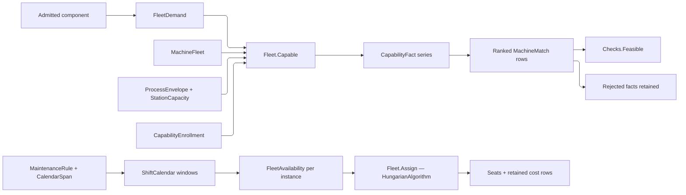

# [RASM_FABRICATION_MACHINE_FLEET]

`Fleet` owns the one shop-capability join from an admitted component and an admitted `MachineFleet` to ranked `MachineMatch` evidence, and the one finite-capacity seat from a demand roster to physical stations. `FleetDemand` reads the component quantity bag once through typed `DemandKey` rows keyed in the seam's own `PropertyName` space and decodes that bag's capability REQUESTS into one `CapabilitySet<FleetCapability>` at the same boundary; each `CapabilityCriterion` generates its fact under the three-state `FactVerdict`, each `FleetObjective` carries the priority and scale its penalty folds through, and a dimension no pair asked for answers `NotDemanded` instead of passing over a zero demand.

`StationCapacity` is a TYPED per-case payload carrying its `CapacityAxis` and a `UnitsNet` quantity, so two stations compare only where they answer the same axis and a kilonewton can never be ranked against a millimetre. Availability is a GENERATED calendar: `CalendarSpan` closes dated and yearly-recurrent windows on `AnnualDate`, `MaintenanceRule` generates every hole, `ShiftCalendar.Horizon` reports capacity per `YearMonth`, and a caller-supplied literal interval roster is the deleted form. `AvailabilityPlan.Finish` is the ONE seat — the body that consumes an instance's staffed windows at its committed load — so `Process/derivation` advances each operation through the assigned station's own plan, `FleetAvailability` publishes the window census per `MachineInstanceKey` beside it, and `Fleet.Assign` covers a demand roster through `HungarianAlgorithm` over that same seat with its cost row retained as promise-interval evidence. `AvailabilityPlan.Standing` is the ONE routing verdict and names declared state, staffing, and registry absence apart, so the registry index and the capability join read one body. `MachineInstanceKey` arrives settled from `Process/atoms#PLAN`; a bare instance string is the deleted form. A process names NO dialect, so controller fitness reads `PostDialect.Admits` against the process modality.

## [01]-[INDEX]

- [02]-[DEMAND_AXES]: `DemandUnit`, `DemandKey`, `FabricationRows`, `CapabilityRequest`, `FleetCapability`, and the once-derived `FleetDemand` with its projected `ConstitutiveState` and decoded capability requests.
- [03]-[STATION_CAPABILITY]: `DeliveryLane`, `FactVerdict`, `StationProcesses`, `ProcessEnvelope` with its base delivery, power, and admitted-process columns, `StationCapacity`, `SpindleWindow`, and `StationAssessment`.
- [04]-[SHIFT_CALENDAR]: `CalendarSpan`, `BlockDisposition`, `CalendarExceptionKind`, `ShiftBlock`, `CalendarException`, `MaintenanceRule`, `ShiftCalendar`, `MachineAvailability`, `RoutingStanding`, and `AvailabilityPlan`.
- [05]-[FLEET_REGISTRY]: `PerformanceBaseline`, `MachinePerformance`, `MachineInstance`, `MachineRegistration`, `FleetRegistrationMap`, `CapabilityEnrollment`, `MachineFleet`, and `FleetSlots`.
- [06]-[CAPABILITY_JOIN]: `CapabilityCriterion`, `FleetObjective`, `ObjectiveTuning`, `FleetPolicy`, `CapabilityFact`, `CapabilityCheck`, the context shapes, `MachineMatch`, and `Fleet.Capable`.
- [07]-[INSTANCE_CONTENTION]: `InstanceWindow`, `FleetAvailability`, `DemandSlot`, `AssignmentCost`, `FleetAssignment`, and `Fleet.Assign`.

## [02]-[DEMAND_AXES]

- Owner: `DemandKey` owns quantity ingress, its row name, and scalar admission; `DemandUnit` owns the evidence unit tag every `CapabilityFact` carries AND whether that unit's readings are whole; `FleetCapability` owns the pair-fitness vocabulary on the kernel `ICapability` floor; `CapabilityRequest` owns what makes a capability demanded; `FleetDemand` owns the once-derived component demand, its projected constitutive state, and its decoded capability requests.
- Law: the `DemandKey` roster is SELF-DECLARED shop vocabulary — no ISO, VDI, or MTConnect roster enumerates these axes, and none is cited. Its provenance is this package's own station families: every row exists because a `ProcessEnvelope` case or a `CapabilityCriterion` reads it, so a row no station arm and no criterion consumes is decorative and deletes rather than waiting for a standard to bless it.
- Law: a component quantity is keyed by `PropertyName` minted through `PropertyCategory.Fabrication.Row` — the one key space `AdmittedComponent.Quantities` and `Ingress/element` already write — so a bare string key never reaches the bag and a `PropertyName.Create` at a read site is the deleted form.
- Law: an absent CEILING is `None`, never a positive-infinity bound. A sentinel ceiling compares as a real limit in every fold that reads it and silently admits a value no shop declared.
- Law: integrality is the UNIT's fact, never a per-row knob. A count is whole and a millimetre is not, so `DemandUnit.Whole` decides it once for every row that carries the unit; the deleted form is a positional `bool integral` repeated on every row, which is also what let `Hardness` sit on `DemandUnit.Count` while declaring itself fractional — a scale reading wearing a tally's unit, now `DemandUnit.HardnessNumber`.
- Law: a REQUEST is a capability membership, never a count. `CertificationRequired` and `BarFeedRequired` were `DemandUnit.Count` rows with a `Some(1.0)` ceiling — flags wearing a quantity's clothes, whose facts published "demand 1.0, available 1.0" in counts and whose ceiling read as a real shop limit in every fold that saw it. They are `FleetCapability` rows now, decoded once at the bag boundary into `FleetDemand.Requested`, and the interior sees membership only.
- Auto: every constitutive axis is a `DemandKey` row the ingress already read and range-admitted against the same bounds `ConstitutiveState` validates, so the state is a total projection of the bag — derived once per demand on the rail, never a second stored copy a caller can fill with three of its six members. `FleetCapability.Holds` generates the held set from the roster and `CapabilityRequest` generates the required set, so neither is a hand-built column of adjacent booleans.
- Growth: a new component scalar is one `DemandKey` row carrying its unit, fallback, and bounds; a new fitness dimension is one `FleetCapability` row carrying its request regime and its held predicate; a new request regime is one `CapabilityRequest` case.
- Packages: `Rasm/Domain/validation#CAPABILITY` supplies `ICapability` and `CapabilitySet` — membership, the required-set seam, the `Missing` evidence complement, and the rank-ordered wire all arrive from the kernel column and this page mints no set algebra of its own; `Rasm/Domain/rails#VALIDITY_FOLD` supplies `ValidityClaim`; `Rasm.Element` supplies `PropertyName` and `PropertyCategory`; Thinktecture.Runtime.Extensions owns the closed rows.
- Boundary: this cluster reads the admitted component's own bag and nothing else; geometry bounds and material identity resolve at the join.

```csharp
// --- [IMPORTS] -------------------------------------------------------------------------
using System.Linq;
using LanguageExt;
using LanguageExt.Common;
using NodaTime;
using NodaTime.TimeZones;
using QuikGraph.Algorithms.Assignment;
using Rasm.Analysis;
using Rasm.Domain;
using Rasm.Element.Projection;
using Rasm.Element.Properties;
using Rasm.Fabrication.Process;
using Rasm.Fabrication.Spec;
using Rasm.Fabrication.Tooling;
using Rasm.Meshing;
using Rasm.Numerics;
using Rhino.Geometry;
using Riok.Mapperly.Abstractions;
using Thinktecture;
using UnitsNet;
using static LanguageExt.Prelude;

namespace Rasm.Fabrication.Kinematics;

// --- [TYPES] ---------------------------------------------------------------------------
// --- [DEMAND_AXES]
[SmartEnum<string>]
public sealed partial class DemandUnit {
    public static readonly DemandUnit Count = new("count", whole: true);
    public static readonly DemandUnit Millimeter = new("mm", whole: false);
    public static readonly DemandUnit Micrometer = new("um", whole: false);
    public static readonly DemandUnit Degree = new("deg", whole: false);
    public static readonly DemandUnit Kilowatt = new("kw", whole: false);
    public static readonly DemandUnit Kilonewton = new("kn", whole: false);
    public static readonly DemandUnit Kilogram = new("kg", whole: false);
    public static readonly DemandUnit KilogramPerMinute = new("kg/min", whole: false);
    public static readonly DemandUnit NewtonMeter = new("n-m", whole: false);
    public static readonly DemandUnit Bar = new("bar", whole: false);
    public static readonly DemandUnit Kilohertz = new("khz", whole: false);
    public static readonly DemandUnit PerMinute = new("1/min", whole: false);
    public static readonly DemandUnit PerSecond = new("1/s", whole: false);
    public static readonly DemandUnit DegreeCelsius = new("deg-c", whole: false);
    public static readonly DemandUnit HardnessNumber = new("hardness", whole: false);
    public static readonly DemandUnit Ratio = new("ratio", whole: false);

    public bool Whole { get; }

    internal ValidityClaim Admits(double value) =>
        ValidityClaim.All(ValidityClaim.Finite(value), !Whole || value == Math.Truncate(value));
}

public static class FabricationRows {
    public static readonly PropertyName Material = PropertyCategory.Fabrication.Row("material");
}

[SmartEnum<string>]
public sealed partial class DemandKey {
    public static readonly DemandKey MinAxes = Of("demand:min-axes", DemandUnit.Count, 3.0, 1.0, None);
    public static readonly DemandKey DistinctTools = Of("demand:distinct-tools", DemandUnit.Count, 0.0, 0.0, None);
    public static readonly DemandKey SpindleKw = Of("demand:spindle-kw", DemandUnit.Kilowatt, 0.0, 0.0, None);
    public static readonly DemandKey ItGrade = Of("demand:it-grade", DemandUnit.Count, 12.0, 1.0, Some(18.0));
    public static readonly DemandKey WorkpieceDiameter = Of("demand:workpiece-diameter-mm", DemandUnit.Millimeter, 0.0, 0.0, None);
    public static readonly DemandKey WorkpieceLength = Of("demand:workpiece-length-mm", DemandUnit.Millimeter, 0.0, 0.0, None);
    public static readonly DemandKey Taper = Of("demand:taper-deg", DemandUnit.Degree, 0.0, 0.0, None);
    public static readonly DemandKey BuildHeads = Of("demand:build-heads", DemandUnit.Count, 1.0, 1.0, None);
    public static readonly DemandKey BrakeForce = Of("demand:brake-force-kn", DemandUnit.Kilonewton, 0.0, 0.0, None);
    public static readonly DemandKey GaugeTravel = Of("demand:gauge-travel-mm", DemandUnit.Millimeter, 0.0, 0.0, None);
    public static readonly DemandKey OpenHeight = Of("demand:open-height-mm", DemandUnit.Millimeter, 0.0, 0.0, None);
    public static readonly DemandKey BedLength = Of("demand:bed-length-mm", DemandUnit.Millimeter, 0.0, 0.0, None);
    public static readonly DemandKey Miter = Of("demand:miter-deg", DemandUnit.Degree, 0.0, 0.0, None);
    public static readonly DemandKey Payload = Of("demand:payload-kg", DemandUnit.Kilogram, 0.0, 0.0, None);
    public static readonly DemandKey MinReliability = Of("demand:min-reliability", DemandUnit.Ratio, 0.0, 0.0, Some(1.0));
    public static readonly DemandKey ToolDiameter = Of("demand:tool-diameter-mm", DemandUnit.Millimeter, 0.0, 0.0, None);
    public static readonly DemandKey SpindleTorque = Of("demand:spindle-torque-nm", DemandUnit.NewtonMeter, 0.0, 0.0, None);
    public static readonly DemandKey PartMass = Of("demand:part-mass-kg", DemandUnit.Kilogram, 0.0, 0.0, None);
    public static readonly DemandKey LayerHeight = Of("demand:layer-height-mm", DemandUnit.Millimeter, 0.0, 0.0, None);
    public static readonly DemandKey Pressure = Of("demand:pressure-bar", DemandUnit.Bar, 0.0, 0.0, None);
    public static readonly DemandKey AbrasiveFlow = Of("demand:abrasive-kg-min", DemandUnit.KilogramPerMinute, 0.0, 0.0, None);
    public static readonly DemandKey WireDiameter = Of("demand:wire-diameter-mm", DemandUnit.Millimeter, 0.0, 0.0, None);
    public static readonly DemandKey ExternalAxes = Of("demand:external-axes", DemandUnit.Count, 0.0, 0.0, None);
    public static readonly DemandKey Frequency = Of("demand:frequency-khz", DemandUnit.Kilohertz, 0.0, 0.0, None);
    public static readonly DemandKey Stroke = Of("demand:stroke-mm", DemandUnit.Millimeter, 0.0, 0.0, None);
    public static readonly DemandKey LineStations = Of("demand:line-stations", DemandUnit.Count, 1.0, 1.0, None);
    public static readonly DemandKey CyclesPerMinute = Of("demand:cycles-per-minute", DemandUnit.PerMinute, 0.0, 0.0, None);
    public static readonly DemandKey Temperature = Of("demand:temperature-c", DemandUnit.DegreeCelsius, 20.0, 0.0, None);
    public static readonly DemandKey Hardness = Of("demand:hardness", DemandUnit.HardnessNumber, 0.0, 0.0, None);
    public static readonly DemandKey StrainRate = Of("demand:strain-rate", DemandUnit.PerSecond, 0.0, 0.0, None);
    public static readonly DemandKey Strain = Of("demand:strain", DemandUnit.Ratio, 0.0, 0.0, None);
    public static readonly DemandKey Moisture = Of("demand:moisture", DemandUnit.Ratio, 0.0, 0.0, Some(1.0));
    public static readonly DemandKey GrainSize = Of("demand:grain-size-um", DemandUnit.Micrometer, 0.0, 0.0, None);
    public static readonly DemandKey BendRadius = Of("demand:bend-radius-mm", DemandUnit.Millimeter, 0.0, 0.0, None);

    public PropertyName Row { get; }
    public DemandUnit Unit { get; }
    public double Fallback { get; }
    public double Minimum { get; }
    public Option<double> Maximum { get; }

    private static DemandKey Of(
        string key, DemandUnit unit, double fallback, double minimum, Option<double> maximum) =>
        new(key, PropertyCategory.Fabrication.Row(key), unit, fallback, minimum, maximum);

    internal Fin<double> Read(Map<PropertyName, double> quantities) {
        double value = quantities.Find(Row).IfNone(Fallback);
        return ValidityClaim.All(
                Unit.Admits(value),
                value >= Minimum,
                Maximum.Map(ceiling => value <= ceiling).IfNone(true))
            ? Fin.Succ(value)
            : Fin.Fail<double>(new KernelFault.InvalidValue("fleet", $"fleet:demand:{Key}"));
    }
}

[Union(ConversionFromValue = ConversionOperatorsGeneration.None)]
public abstract partial record CapabilityRequest {
    private CapabilityRequest() { }

    public sealed record Always : CapabilityRequest;
    public sealed record Flagged(PropertyName Row) : CapabilityRequest;
    public sealed record OnCell : CapabilityRequest;

    public static readonly CapabilityRequest Routing = new Always();
    public static readonly CapabilityRequest Cell = new OnCell();

    public static CapabilityRequest Flag(string key) => new Flagged(PropertyCategory.Fabrication.Row(key));
}

[SmartEnum<string>]
public sealed partial class FleetCapability : ICapability<FleetCapability> {
    public static readonly FleetCapability Physics = new("physics", CapabilityRequest.Routing,
        holds: static context => context.Demand.Material.Physics.ContainsKey(context.Process.Physics));
    public static readonly FleetCapability Material = new("material", CapabilityRequest.Routing,
        holds: static context =>
            (context.Instance.Materials.IsEmpty || context.Instance.Materials.Contains(context.Demand.Material))
            && Fleet.StationMaterial(context.Instance, context.Process, context.Demand.Material));
    public static readonly FleetCapability Grade = new("grade", CapabilityRequest.Routing,
        holds: static context => context.Demanded.AchievedGrade <= context.Demanded.Grade);
    public static readonly FleetCapability Certification = new("certification",
        CapabilityRequest.Flag("demand:certification-required"),
        holds: static context => context.Instance.Certifications.Contains(context.Process));
    public static readonly FleetCapability BarFeed = new("bar-feed",
        CapabilityRequest.Flag("demand:bar-feed-required"),
        holds: static context => context.Instance.Station<ProcessEnvelope.Turning>()
            .Filter(row => row.Admits(context.Process))
            .Exists(row => context.Demand.TurnedDiameter <= row.BarCapacity));
    public static readonly FleetCapability CellReach = new("cell-reach", CapabilityRequest.Cell,
        holds: static context =>
            context.Cells.Exists(cell => Fleet.Headroom(context.Demand.Part, cell.Reach) >= 0.0));

    public CapabilityRequest Request { get; }
    internal Func<CapabilityContext, bool> Holds { get; }
}

// --- [MODELS] --------------------------------------------------------------------------
internal sealed record FleetDemand(
    BoundingBox Part,
    Material Material,
    Map<DemandKey, double> Scalars,
    CapabilitySet<FleetCapability> Requested,
    ConstitutiveState State) {
    public double this[DemandKey key] => Scalars.Find(key).IfNone(key.Fallback);

    public Length TurnedDiameter =>
        Length.FromMillimeters(Math.Max(this[DemandKey.WorkpieceDiameter], Fleet.Planar(Part).Min));
    public Length TurnedLength =>
        Length.FromMillimeters(Math.Max(this[DemandKey.WorkpieceLength], Fleet.Planar(Part).Max));

    public static Fin<FleetDemand> Of(
        BoundingBox part, Material material, Map<PropertyName, double> quantities, Map<DemandKey, double> scalars) =>
        ConstitutiveState.Validate(
                Read(scalars, DemandKey.Temperature),
                Read(scalars, DemandKey.Hardness),
                Read(scalars, DemandKey.StrainRate),
                Read(scalars, DemandKey.Strain),
                Read(scalars, DemandKey.Moisture),
                Read(scalars, DemandKey.GrainSize),
                out ConstitutiveState state)
            .Admitted(state)
            .Map(admitted => new FleetDemand(part, material, scalars, Requests(quantities), admitted));

    private static CapabilitySet<FleetCapability> Requests(Map<PropertyName, double> quantities) =>
        CapabilitySet<FleetCapability>.Of(FleetCapability.Items
            .Where(row => row.Request is CapabilityRequest.Flagged flag
                && quantities.Find(flag.Row).Exists(static value => double.IsFinite(value) && value != 0.0))
            .ToArray());

    private static double Read(Map<DemandKey, double> scalars, DemandKey key) => scalars.Find(key).IfNone(key.Fallback);
}
```

## [03]-[STATION_CAPABILITY]

- Owner: `ProcessEnvelope` closes installed station capability; `StationCapacity` owns the TYPED capacity a station offers on one `CapacityAxis`; `SpindleWindow` owns the rotating-station speed band; `FactVerdict` owns the page's ONE three-state verdict; `StationAssessment` owns one station's verdict evidence; `DeliveryLane` owns how a program reaches the machine.
- Cases: `ProcessEnvelope` covers rotating milling, turning, grinding, sawing, thermal sheet cutting, waterjet, ultrasonic abrasion, wire tank, additive build, press brake, linear stroke, roll forming, tube bender, and robot cell. `StationCapacity` closes extent, force, mass, power, pressure, speed, and count payloads.
- Law: a capacity is TYPED and axis-keyed, so two stations compare only where they answer the SAME `CapacityAxis`. The untyped scalar this replaces let a press brake's kilonewtons rank against a wire tank's millimetres whenever one instance carried both stations admitting one process, and the winner was whichever number happened to be larger.
- Law: `Delivery`, `Source`, and the admitted process roster are BASE positional columns. Thirteen station leaves pass `FileDrop` directly to the union root, while the cell leaf passes `Controller`; no intermediate case enters the generated union solely to share a constant.
- Law: the admitted process roster is stated ONCE, on the base column. Every assessment arm previously re-tested the correspondence its own `Admits` had already decided; the station fold filters on `Admits` before an arm runs, so a re-test is a second statement of one fact.
- Law: `FactVerdict` carries THREE states and the third is `NotDemanded`, never a `true` over a zero demand. Payload off a cell and certification no component requested both reported `Pass` with demand and available at zero, so a feasibility read conflated a satisfied dimension with an unasked one and a rejection census counted the unasked as passing.
- Law: `StationAssessment` carries ONE verdict, not a `(Present, Fits)` pair. Absent-yet-fitting is that product's fourth corner and nothing means it; the pair's only consumer conjoined both columns anyway, so the second carrier stated nothing and no reader read it.
- Law: station validity reaches the kernel oracle. `ProcessEnvelope` implements `IValidityEvidence` and composes `ValidityClaim` rows, so `OpAcceptance.ValidityOf` answers on the envelope's own fold; the page-local `double.IsFinite && > 0` predicate it replaces was a hand twin of `ValidityClaim.Positive` sitting beside an admitted kernel.
- Auto: `SpindleWindow.Required` composes `Process/physics#BUDGET_FOLD` `SurfaceSpeed.Rpm` over the CUTTING diameter — the one forward cutting-speed relation in the package — so no arm re-derives `vc * 1000 / (pi * D)`.
- Growth: a new station modality is one `ProcessEnvelope` case with its three base columns and one assessment arm; a new capacity dimension is one `StationCapacity` case over an existing `CapacityAxis` row.
- Packages: `Rasm/Domain/rails#VALIDITY_FOLD` supplies `IValidityEvidence` and every `ValidityClaim` row the envelope fold composes; UnitsNet owns the typed capacities; Thinktecture.Runtime.Extensions owns the closed families.
- Boundary: `Process/family` `MachineCapacity` is the machine CLASS operating envelope admitted with the equipment; `ProcessEnvelope` is the INSTALLED station a program runs on, so the two never mirror and a station absent from the shop floor cannot be inferred from the class.

```csharp
// --- [STATION_CAPABILITY]
[SmartEnum<string>]
public sealed partial class DeliveryLane {
    public static readonly DeliveryLane FileDrop = new("file-drop");
    public static readonly DeliveryLane Controller = new("controller");
}

[SmartEnum<string>]
public sealed partial class FactVerdict {
    public static readonly FactVerdict Met = new("met");
    public static readonly FactVerdict Short = new("short");
    public static readonly FactVerdict NotDemanded = new("not-demanded");

    internal static FactVerdict Judged(bool met) => met ? Met : Short;
}

public static class StationProcesses {
    public static readonly Set<ProcessKind> Milling = Set(
        ProcessKind.Mill, ProcessKind.Route, ProcessKind.Drill, ProcessKind.Bore, ProcessKind.Ream, ProcessKind.GearCut);
    public static readonly Set<ProcessKind> Turning = Set(ProcessKind.Turn);
    public static readonly Set<ProcessKind> Grinding = Set(ProcessKind.Grind, ProcessKind.Hone, ProcessKind.Lap);
    public static readonly Set<ProcessKind> Sawing = Set(ProcessKind.Saw);
    public static readonly Set<ProcessKind> Sheet = Set(
        ProcessKind.Laser, ProcessKind.Plasma, ProcessKind.Oxyfuel, ProcessKind.ElectronBeam);
    public static readonly Set<ProcessKind> Waterjet = Set(ProcessKind.Waterjet);
    public static readonly Set<ProcessKind> Ultrasonic = Set(ProcessKind.Ultrasonic);
    public static readonly Set<ProcessKind> Erosion = Set(ProcessKind.EdmWire);
    public static readonly Set<ProcessKind> Build = Set(
        ProcessKind.FusedFilament, ProcessKind.Deposition, ProcessKind.VatPolymer, ProcessKind.PowderBed,
        ProcessKind.BinderJet, ProcessKind.MaterialJet, ProcessKind.SheetLamination);
    public static readonly Set<ProcessKind> Brake = Set(ProcessKind.PressBrake);
    public static readonly Set<ProcessKind> Press = Set(ProcessKind.Broach, ProcessKind.Stamp, ProcessKind.Forge);
    public static readonly Set<ProcessKind> Roll = Set(ProcessKind.RollForm);
    public static readonly Set<ProcessKind> Bender = Set(ProcessKind.TubeBend);
    public static readonly Set<ProcessKind> Cell = Set(
        ProcessKind.Weld, ProcessKind.Deposition, ProcessKind.DirectedEnergy,
        ProcessKind.FrictionStir, ProcessKind.Braze, ProcessKind.Adhesive);
}

[Union(ConversionFromValue = ConversionOperatorsGeneration.None)]
public abstract partial record StationCapacity(CapacityAxis Axis) {
    public sealed record Extent(CapacityAxis Axis, Length Value) : StationCapacity(Axis);
    public sealed record Load(CapacityAxis Axis, Force Value) : StationCapacity(Axis);
    public sealed record Held(CapacityAxis Axis, Mass Value) : StationCapacity(Axis);
    public sealed record Source(CapacityAxis Axis, Power Value) : StationCapacity(Axis);
    public sealed record Supply(CapacityAxis Axis, Pressure Value) : StationCapacity(Axis);
    public sealed record Rate(CapacityAxis Axis, Speed Value) : StationCapacity(Axis);
    public sealed record Tally(CapacityAxis Axis, int Value) : StationCapacity(Axis);

    public double Magnitude => Switch(
        extent: static row => row.Value.Millimeters,
        load: static row => row.Value.Kilonewtons,
        held: static row => row.Value.Kilograms,
        source: static row => row.Value.Kilowatts,
        supply: static row => row.Value.Bars,
        rate: static row => row.Value.MillimetersPerMinutes,
        tally: static row => row.Value);

    public DemandUnit Unit => Switch(
        extent: static _ => DemandUnit.Millimeter,
        load: static _ => DemandUnit.Kilonewton,
        held: static _ => DemandUnit.Kilogram,
        source: static _ => DemandUnit.Kilowatt,
        supply: static _ => DemandUnit.Bar,
        rate: static _ => DemandUnit.Millimeter,
        tally: static _ => DemandUnit.Count);

    public Option<int> Compare(StationCapacity other) =>
        Axis == other.Axis ? Some(Magnitude.CompareTo(other.Magnitude)) : None;
}

public readonly record struct SpindleWindow(RotationalSpeed Required, RotationalSpeed Minimum, RotationalSpeed Maximum) {
    public bool Admits => Required >= Minimum && Required <= Maximum;
}

[Union(ConversionFromValue = ConversionOperatorsGeneration.None)]
public abstract partial record ProcessEnvelope(DeliveryLane Delivery, Option<Power> Source, Set<ProcessKind> Processes)
    : IValidityEvidence {
    public sealed record Milling(
        Power SpindlePower, RotationalSpeed SpindleMin, RotationalSpeed SpindleMax, Length MinToolDiameter,
        Length MaxToolDiameter, Torque SpindleTorque, Mass TableLoad)
        : ProcessEnvelope(DeliveryLane.FileDrop, Some(SpindlePower), StationProcesses.Milling);
    public sealed record Turning(
        Length Swing, Length BetweenCenters, Length BarCapacity, Length ChuckDiameter,
        Power SpindlePower, RotationalSpeed SpindleMin, RotationalSpeed SpindleMax, Set<ProcessKind> Secondary)
        : ProcessEnvelope(DeliveryLane.FileDrop, Some(SpindlePower), StationProcesses.Turning + Secondary);
    public sealed record Grinding(
        Length WheelDiameter, Length WheelWidth, Power SpindlePower, RotationalSpeed SpindleMin, RotationalSpeed SpindleMax)
        : ProcessEnvelope(DeliveryLane.FileDrop, Some(SpindlePower), StationProcesses.Grinding);
    public sealed record Saw(
        Length BladeDiameter, Length MaxSection, Angle MaxMiter,
        Power SpindlePower, RotationalSpeed SpindleMin, RotationalSpeed SpindleMax)
        : ProcessEnvelope(DeliveryLane.FileDrop, Some(SpindlePower), StationProcesses.Sawing);
    public sealed record Sheet(Length BedX, Length BedY, Length MaxThickness, Power SourcePower)
        : ProcessEnvelope(DeliveryLane.FileDrop, Some(SourcePower), StationProcesses.Sheet);
    public sealed record Waterjet(
        Length BedX, Length BedY, Length MaxThickness, Pressure PumpPressure, MassFlow AbrasiveFlow)
        : ProcessEnvelope(DeliveryLane.FileDrop, None, StationProcesses.Waterjet);
    public sealed record Abrasive(BoundingBox Volume, Frequency Ultrasound, Power SourcePower, Length MaxToolDiameter)
        : ProcessEnvelope(DeliveryLane.FileDrop, Some(SourcePower), StationProcesses.Ultrasonic);
    public sealed record WireTank(
        Length UTravel, Length VTravel, Angle MaxTaper, Length SubmergedHeight, Length WireMin, Length WireMax)
        : ProcessEnvelope(DeliveryLane.FileDrop, None, StationProcesses.Erosion);
    public sealed record Build(BoundingBox Volume, int Heads, Length MinLayer, Length MaxLayer, Set<Material> Materials)
        : ProcessEnvelope(DeliveryLane.FileDrop, None, StationProcesses.Build);
    public sealed record Brake(Force Capacity, Length GaugeTravel, Length OpenHeight, Length BedLength)
        : ProcessEnvelope(DeliveryLane.FileDrop, None, StationProcesses.Brake);
    public sealed record Stroke(
        Set<ProcessKind> Admitted, BoundingBox Volume, Length Stroke, Force Capacity, Mass TableLoad, double CyclesPerMinute)
        : ProcessEnvelope(DeliveryLane.FileDrop, None, Admitted);
    public sealed record Roll(Length MaxWidth, Length MinThickness, Length MaxThickness, int Stations, Torque Torque)
        : ProcessEnvelope(DeliveryLane.FileDrop, None, StationProcesses.Roll);
    public sealed record Bender(Length MinClr, Length MaxClr, int DieCount)
        : ProcessEnvelope(DeliveryLane.FileDrop, None, StationProcesses.Bender);
    public sealed record Cell(RobotCell Robot, BoundingBox Reach, Mass Payload, int ExternalAxes)
        : ProcessEnvelope(DeliveryLane.Controller, None, StationProcesses.Cell);

    public bool Admits(ProcessKind process) => Processes.Contains(process);

    public StationCapacity Capacity => Switch(
        milling: static row => (StationCapacity)new StationCapacity.Extent(CapacityAxis.TravelZ, row.MaxToolDiameter),
        turning: static row => new StationCapacity.Extent(CapacityAxis.Swing, row.Swing),
        grinding: static row => new StationCapacity.Extent(CapacityAxis.TravelZ, row.WheelWidth),
        saw: static row => new StationCapacity.Extent(CapacityAxis.TravelZ, row.MaxSection),
        sheet: static row => new StationCapacity.Extent(CapacityAxis.TravelZ, row.MaxThickness),
        waterjet: static row => new StationCapacity.Extent(CapacityAxis.TravelZ, row.MaxThickness),
        abrasive: static row => new StationCapacity.Extent(CapacityAxis.TravelZ, row.MaxToolDiameter),
        wireTank: static row => new StationCapacity.Extent(CapacityAxis.TravelZ, row.SubmergedHeight),
        build: static row => new StationCapacity.Tally(CapacityAxis.DepositionRate, row.Heads),
        brake: static row => new StationCapacity.Load(CapacityAxis.PressCapacity, row.Capacity),
        stroke: static row => new StationCapacity.Load(CapacityAxis.PressCapacity, row.Capacity),
        roll: static row => new StationCapacity.Extent(CapacityAxis.BedLength, row.MaxWidth),
        bender: static row => new StationCapacity.Tally(CapacityAxis.BedLength, row.DieCount),
        cell: static row => new StationCapacity.Held(CapacityAxis.Payload, row.Payload));

    public bool IsValid => Switch(
        milling: static row => ValidityClaim.All(Positive(row.SpindlePower), NonNegative(row.SpindleMin),
            row.SpindleMax > row.SpindleMin, Positive(row.MinToolDiameter),
            row.MaxToolDiameter >= row.MinToolDiameter, Positive(row.SpindleTorque), Positive(row.TableLoad)),
        turning: static row => ValidityClaim.All(Positive(row.Swing), Positive(row.BetweenCenters),
            Positive(row.BarCapacity), Positive(row.ChuckDiameter), Positive(row.SpindlePower),
            NonNegative(row.SpindleMin), row.SpindleMax > row.SpindleMin,
            row.Secondary.ForAll(static process => process.Modality == ProcessModality.Subtractive && process != ProcessKind.Turn)),
        grinding: static row => ValidityClaim.All(Positive(row.WheelDiameter), Positive(row.WheelWidth),
            Positive(row.SpindlePower), NonNegative(row.SpindleMin), row.SpindleMax > row.SpindleMin),
        saw: static row => ValidityClaim.All(Positive(row.BladeDiameter), Positive(row.MaxSection),
            row.MaxMiter >= Angle.Zero, row.MaxMiter <= Angle.FromDegrees(90.0), Positive(row.SpindlePower),
            NonNegative(row.SpindleMin), row.SpindleMax > row.SpindleMin),
        sheet: static row => ValidityClaim.All(Positive(row.BedX), Positive(row.BedY),
            Positive(row.MaxThickness), Positive(row.SourcePower)),
        waterjet: static row => ValidityClaim.All(Positive(row.BedX), Positive(row.BedY),
            Positive(row.MaxThickness), Positive(row.PumpPressure), NonNegative(row.AbrasiveFlow)),
        abrasive: static row => ValidityClaim.All(row.Volume.IsValid, Positive(row.Ultrasound),
            Positive(row.SourcePower), Positive(row.MaxToolDiameter)),
        wireTank: static row => ValidityClaim.All(Positive(row.UTravel), Positive(row.VTravel),
            row.MaxTaper >= Angle.Zero, Positive(row.SubmergedHeight), Positive(row.WireMin),
            row.WireMax >= row.WireMin),
        build: static row => ValidityClaim.All(row.Volume.IsValid, ValidityClaim.CountAtLeast(row.Heads, 1),
            Positive(row.MinLayer), row.MaxLayer >= row.MinLayer, !row.Materials.IsEmpty),
        brake: static row => ValidityClaim.All(Positive(row.Capacity), Positive(row.GaugeTravel),
            Positive(row.OpenHeight), Positive(row.BedLength)),
        stroke: static row => ValidityClaim.All(!row.Admitted.IsEmpty,
            row.Admitted.IsSubsetOf(StationProcesses.Press), row.Volume.IsValid, Positive(row.Stroke),
            Positive(row.Capacity), Positive(row.TableLoad), ValidityClaim.Positive(row.CyclesPerMinute)),
        roll: static row => ValidityClaim.All(Positive(row.MaxWidth), Positive(row.MinThickness),
            row.MaxThickness >= row.MinThickness, ValidityClaim.CountAtLeast(row.Stations, 1), Positive(row.Torque)),
        bender: static row => ValidityClaim.All(Positive(row.MinClr), row.MaxClr >= row.MinClr,
            ValidityClaim.CountAtLeast(row.DieCount, 1)),
        cell: static row => ValidityClaim.All(row.Reach.IsValid, Positive(row.Payload),
            ValidityClaim.CountAtLeast(row.ExternalAxes, 0)));

    private static ValidityClaim Positive<TQuantity>(TQuantity value) where TQuantity : IQuantity =>
        ValidityClaim.Positive((double)value.Value);

    private static ValidityClaim NonNegative<TQuantity>(TQuantity value) where TQuantity : IQuantity =>
        ValidityClaim.Nonnegative((double)value.Value);
}

internal sealed record StationAssessment(
    FactVerdict Verdict,
    Option<SpindleWindow> Spindle,
    StationCapacity Capacity,
    Power Source,
    string Locus);
```

## [04]-[SHIFT_CALENDAR]

- Owner: `ShiftCalendar` generates working windows from a weekly `ShiftBlock` pattern, dated and yearly-recurrent `CalendarException` rows, and generated `MaintenanceRule` holes; `AvailabilityPlan` derates them by committed load into the shop's one time model and owns the ONE routing verdict; `CalendarSpan` owns date membership for both recurrence postures; `BlockDisposition` owns what an exception's blocks do to the weekly pattern; `RoutingStanding` owns why an instance is or is not routable at an instant.
- Cases: `CalendarSpan` closes dated and yearly; `CalendarExceptionKind` covers holiday, shutdown, reduced, overtime, and unattended, each row declaring its `BlockDisposition`; `BlockDisposition` closes replace and extend; `RoutingStanding` closes routable, state-blocked, unstaffed, and unregistered.
- Law: an exception's blocks REPLACE the weekly pattern or EXTEND it, and the row says which by name. A `bool Grants` named only one side of that correspondence, so every read site had to negate it against a comment to recover the other, and the fold that composes the two postures reads a disposition instead of a polarity.
- Law: routability is ONE body and it names its refusal. `AvailabilityPlan.IsRoutable` and the registry's memoized `Map<MachineInstanceKey, bool>` were two carriers of one fact whose agreement nothing enforced, and both answered a shop asking WHY with `false` — a machine in service, a machine outside its staffed windows, and a key the registry never seated were one indistinguishable refusal, `.IfNone(false)` fabricating the third.
- Law: maintenance is GENERATED from `MaintenanceRule` rows, never handed in as a literal interval roster. A caller-supplied roster cannot recur, so a yearly plant shutdown had to be re-authored every year and a horizon that outran the roster silently reported full availability.
- Law: a yearly span containing a wrap — a December-to-January shutdown — is tested against BOTH the date's own year and the year before it, so the turn of the year is inside the window rather than a two-row workaround the author has to remember.
- Auto: `Windows` canonicalizes overlapping blocks onto one non-overlapping edge partition carrying the best staffing, so an overtime block overlapping a pattern block is counted once at the richer staffing; `Advance` consumes effort across successive staffed windows, so an eight-hour job on a one-shift calendar lands on the next working morning rather than eight hours after release; `Horizon` reports working duration per `YearMonth`, so a capacity plan reads months rather than re-deriving spans.
- Result: `ShiftCalendar.Horizon` returns one row per month with its generated working duration; `AvailabilityPlan.Finish` returns the machine's actual completion instant for `Process/derivation` to convert into a promise date.
- Exemption: none — every fold here is expression-shaped over generated rows.
- Packages: NodaTime owns `Instant`, `Interval`, `DateInterval`, `AnnualDate`, `YearMonth`, `LocalTime.InZone`, and `Resolvers.CreateMappingResolver`; `Thinktecture.Runtime.Extensions` owns the closed rows.
- Growth: a new calendar posture is one `CalendarExceptionKind` row carrying its own `BlockDisposition`; a new recurrence is one `CalendarSpan` case with its `Contains` arm; a new routing refusal is one `RoutingStanding` row.
- Boundary: the calendar reports time; `Process/derivation` alone turns a finish instant into a lot promise.

```csharp
// --- [SHIFT_CALENDAR]
[SmartEnum<string>]
public sealed partial class MachineAvailability {
    public static readonly MachineAvailability Ready = new("ready", routable: true);
    public static readonly MachineAvailability Reserved = new("reserved", routable: false);
    public static readonly MachineAvailability Service = new("service", routable: false);
    public static readonly MachineAvailability Offline = new("offline", routable: false);

    public bool Routable { get; }
}

[SmartEnum<string>]
public sealed partial class RoutingStanding {
    public static readonly RoutingStanding Routable = new("routable");
    public static readonly RoutingStanding StateBlocked = new("state-blocked");
    public static readonly RoutingStanding Unstaffed = new("unstaffed");
    public static readonly RoutingStanding Unregistered = new("unregistered");
}

[SmartEnum<string>]
public sealed partial class BlockDisposition {
    public static readonly BlockDisposition Replace = new("replace");
    public static readonly BlockDisposition Extend = new("extend");
}

[SmartEnum<string>]
public sealed partial class CalendarExceptionKind {
    public static readonly CalendarExceptionKind Holiday = new("holiday", BlockDisposition.Replace);
    public static readonly CalendarExceptionKind Shutdown = new("shutdown", BlockDisposition.Replace);
    public static readonly CalendarExceptionKind Reduced = new("reduced", BlockDisposition.Replace);
    public static readonly CalendarExceptionKind Overtime = new("overtime", BlockDisposition.Extend);
    public static readonly CalendarExceptionKind Unattended = new("unattended", BlockDisposition.Extend);

    public BlockDisposition Disposition { get; }
}

[Union(ConversionFromValue = ConversionOperatorsGeneration.None)]
public abstract partial record CalendarSpan {
    private CalendarSpan() { }

    public sealed record Dated(DateInterval Dates) : CalendarSpan;
    public sealed record Yearly(AnnualDate From, AnnualDate To) : CalendarSpan;

    public bool Contains(LocalDate date) => Switch(
        state: date,
        dated: static (at, row) => row.Dates.Contains(at),
        yearly: static (at, row) => Within(row, at.Year, at) || Within(row, at.Year - 1, at));

    private static bool Within(Yearly row, int year, LocalDate date) {
        LocalDate from = row.From.InYear(year);
        LocalDate to = row.To.InYear(row.To < row.From ? year + 1 : year);
        return date >= from && date <= to;
    }
}

[ComplexValueObject]
public sealed partial class ShiftBlock {
    public IsoDayOfWeek Day { get; }
    public LocalTime Start { get; }
    public LocalTime End { get; }
    public double Staffing { get; }

    [BoundaryAdapter]
    static partial void ValidateFactoryArguments(
        ref ValidationError? validationError,
        ref IsoDayOfWeek day,
        ref LocalTime start,
        ref LocalTime end,
        ref double staffing) {
        if (day is IsoDayOfWeek.None || end <= start || !double.IsFinite(staffing) || staffing is <= 0.0 or > 1.0)
            validationError = Fleet.Validation("shift-block");
    }

    public static Fin<ShiftBlock> Admit(IsoDayOfWeek day, LocalTime start, LocalTime end, double staffing) =>
        Validate(day, start, end, staffing, out ShiftBlock block).Admitted(block);
}

[ComplexValueObject]
public sealed partial class CalendarException {
    public CalendarExceptionKind Kind { get; }
    public CalendarSpan Span { get; }
    public Seq<ShiftBlock> Blocks { get; }

    [BoundaryAdapter]
    static partial void ValidateFactoryArguments(
        ref ValidationError? validationError,
        ref CalendarExceptionKind kind,
        ref CalendarSpan span,
        ref Seq<ShiftBlock> blocks) {
        if (kind.Disposition == BlockDisposition.Extend && blocks.IsEmpty)
            validationError = Fleet.Validation("calendar-exception:extends-nothing");
    }

    public static Fin<CalendarException> Admit(CalendarExceptionKind kind, CalendarSpan span, Seq<ShiftBlock> blocks) =>
        Validate(kind, span, blocks, out CalendarException row).Admitted(row);
}

[ComplexValueObject]
public sealed partial class MaintenanceRule {
    public CalendarSpan Span { get; }
    public LocalTime Start { get; }
    public Duration Length { get; }

    [BoundaryAdapter]
    static partial void ValidateFactoryArguments(
        ref ValidationError? validationError,
        ref CalendarSpan span,
        ref LocalTime start,
        ref Duration length) {
        if (length <= Duration.Zero)
            validationError = Fleet.Validation("maintenance-rule:length");
    }

    public static Fin<MaintenanceRule> Admit(CalendarSpan span, LocalTime start, Duration length) =>
        Validate(span, start, length, out MaintenanceRule rule).Admitted(rule);
}

[ComplexValueObject]
public sealed partial class ShiftCalendar {
    private static readonly ZoneLocalMappingResolver StartResolver = Resolvers.CreateMappingResolver(
        Resolvers.ReturnEarlier,
        Resolvers.ReturnStartOfIntervalAfter);
    private static readonly ZoneLocalMappingResolver EndResolver = Resolvers.CreateMappingResolver(
        Resolvers.ReturnLater,
        Resolvers.ReturnStartOfIntervalAfter);

    public DateTimeZone Zone { get; }
    public Seq<ShiftBlock> Pattern { get; }
    public Seq<CalendarException> Exceptions { get; }
    public Seq<MaintenanceRule> Maintenance { get; }
    public Duration Horizon { get; }

    [BoundaryAdapter]
    static partial void ValidateFactoryArguments(
        ref ValidationError? validationError,
        ref DateTimeZone zone,
        ref Seq<ShiftBlock> pattern,
        ref Seq<CalendarException> exceptions,
        ref Seq<MaintenanceRule> maintenance,
        ref Duration horizon) {
        if (pattern.IsEmpty || horizon <= Duration.Zero)
            validationError = Fleet.Validation("shift-calendar");
    }

    public static Fin<ShiftCalendar> Admit(
        DateTimeZone zone,
        Seq<ShiftBlock> pattern,
        Seq<CalendarException> exceptions,
        Seq<MaintenanceRule> maintenance,
        Duration horizon) =>
        Validate(zone, pattern, exceptions, maintenance, horizon, out ShiftCalendar calendar).Admitted(calendar);

    public Seq<NodaTime.Interval> Holes(DateInterval dates) =>
        Dates(dates).Bind(date => Maintenance
            .Filter(rule => rule.Span.Contains(date))
            .Map(rule => {
                Instant start = date.At(rule.Start).InZone(Zone, StartResolver).ToInstant();
                return new NodaTime.Interval(start, start + rule.Length);
            }));

    public Seq<(NodaTime.Interval Span, double Staffing)> Windows(DateInterval dates) {
        Seq<NodaTime.Interval> holes = Holes(dates);
        return Canonical(toSeq(Dates(dates)
            .Bind(date => Blocks(date).Bind(block => Punch(
                    new NodaTime.Interval(
                        date.At(block.Start).InZone(Zone, StartResolver).ToInstant(),
                        date.At(block.End).InZone(Zone, EndResolver).ToInstant()),
                    holes)
                .Map(span => (Span: span, block.Staffing))))
            .OrderBy(static window => window.Span.Start)));
    }

    public Seq<(YearMonth Month, Duration Working)> Capacity(YearMonth from, int months) =>
        toSeq(Range(0, Math.Max(months, 0)))
            .Map(offset => from.PlusMonths(offset))
            .Map(month => (Month: month, Working: Working(Bounds(month.ToDateInterval()))));

    public bool Covers(Instant at) => Windows(Around(at, at)).Exists(window => window.Span.Contains(at));

    public Duration Working(NodaTime.Interval span) =>
        Duration.FromSeconds(Windows(Around(span.Start, span.End))
            .Fold(0.0, (total, window) => total + (Overlap(window.Span, span).TotalSeconds * window.Staffing)));

    public Option<Instant> Advance(Instant from, Duration effort) =>
        effort == Duration.Zero
            ? Some(from)
            : Windows(Around(from, from + Horizon))
            .Map(window => (Span: new NodaTime.Interval(
                window.Span.Start > from ? window.Span.Start : from, window.Span.End), window.Staffing))
            .Filter(static window => window.Span.End > window.Span.Start)
            .Fold((Remaining: effort, At: Option<Instant>.None),
                static (state, window) => state.At.IsSome ? state : Consume(state.Remaining, window))
            .At;

    private static Seq<LocalDate> Dates(DateInterval dates) =>
        toSeq(Range(0, dates.Length)).Map(offset => dates.Start.PlusDays(offset));

    private NodaTime.Interval Bounds(DateInterval dates) => new(
        dates.Start.AtMidnight().InZone(Zone, StartResolver).ToInstant(),
        dates.End.PlusDays(1).AtMidnight().InZone(Zone, StartResolver).ToInstant());

    private static Seq<(NodaTime.Interval Span, double Staffing)> Canonical(
        Seq<(NodaTime.Interval Span, double Staffing)> windows) {
        Seq<Instant> edges = toSeq(windows.Bind(static window => Seq(window.Span.Start, window.Span.End))
            .Distinct()
            .Order());
        return edges.Zip(edges.Skip(1))
            .Choose(edge => windows
                .Filter(window => window.Span.Start < edge.Second && window.Span.End > edge.First)
                .Map(static window => window.Staffing)
                .Fold(Option<double>.None, static (best, staffing) =>
                    best.Filter(held => held >= staffing).IsSome ? best : Some(staffing))
                .Map(staffing => (Span: new NodaTime.Interval(edge.First, edge.Second), Staffing: staffing)));
    }

    private Seq<ShiftBlock> Blocks(LocalDate date) =>
        (Covering(date, BlockDisposition.Replace) is { IsEmpty: false } replacing
            ? replacing.Bind(static row => row.Blocks)
            : Pattern.Filter(block => block.Day == date.DayOfWeek))
        + Covering(date, BlockDisposition.Extend).Bind(static row => row.Blocks);

    private Seq<CalendarException> Covering(LocalDate date, BlockDisposition disposition) =>
        Exceptions.Filter(row => row.Kind.Disposition == disposition && row.Span.Contains(date));

    private DateInterval Around(Instant start, Instant end) =>
        new(start.InZone(Zone).Date, end.InZone(Zone).Date);

    private static (Duration Remaining, Option<Instant> At) Consume(
        Duration remaining,
        (NodaTime.Interval Span, double Staffing) window) =>
        Duration.FromSeconds((window.Span.End - window.Span.Start).TotalSeconds * window.Staffing) switch {
            Duration capacity when capacity >= remaining => (Duration.Zero,
                Some(window.Span.Start + Duration.FromSeconds(remaining.TotalSeconds / window.Staffing))),
            Duration capacity => (remaining - capacity, Option<Instant>.None),
        };

    private static Seq<NodaTime.Interval> Punch(NodaTime.Interval span, Seq<NodaTime.Interval> excluded) =>
        excluded.Fold(Seq(span), static (open, hole) => open.Bind(part => Split(part, hole)));

    private static Seq<NodaTime.Interval> Split(NodaTime.Interval part, NodaTime.Interval hole) =>
        hole.End <= part.Start || hole.Start >= part.End
            ? Seq(part)
            : (hole.Start > part.Start ? Seq(new NodaTime.Interval(part.Start, hole.Start)) : Seq<NodaTime.Interval>())
            + (hole.End < part.End ? Seq(new NodaTime.Interval(hole.End, part.End)) : Seq<NodaTime.Interval>());

    private static Duration Overlap(NodaTime.Interval window, NodaTime.Interval span) =>
        (window.Start > span.Start ? window.Start : span.Start,
         window.End < span.End ? window.End : span.End) switch {
            var (start, end) when end > start => end - start,
            _ => Duration.Zero,
        };
}

[ComplexValueObject]
public sealed partial class AvailabilityPlan {
    public MachineAvailability State { get; }
    public ShiftCalendar Calendar { get; }
    public double LoadFactor { get; }

    public double Schedulable => 1.0 - LoadFactor;

    [BoundaryAdapter]
    static partial void ValidateFactoryArguments(
        ref ValidationError? validationError,
        ref MachineAvailability state,
        ref ShiftCalendar calendar,
        ref double loadFactor) {
        if (!double.IsFinite(loadFactor) || loadFactor is < 0.0 or >= 1.0)
            validationError = Fleet.Validation("availability-plan:load");
    }

    public static Fin<AvailabilityPlan> Admit(MachineAvailability state, ShiftCalendar calendar, double loadFactor) =>
        Validate(state, calendar, loadFactor, out AvailabilityPlan plan).Admitted(plan);

    public RoutingStanding Standing(Instant at) =>
        (State.Routable, Calendar.Covers(at)) switch {
            (false, _) => RoutingStanding.StateBlocked,
            (true, false) => RoutingStanding.Unstaffed,
            (true, true) => RoutingStanding.Routable,
        };

    public Duration Working(NodaTime.Interval span) =>
        State.Routable
            ? Duration.FromSeconds(Calendar.Working(span).TotalSeconds * Schedulable)
            : Duration.Zero;

    public Option<Instant> Finish(Instant from, Duration effort) =>
        (effort <= Duration.Zero, State.Routable) switch {
            (true, _) => Some(from),
            (false, true) => Calendar.Advance(from, Duration.FromSeconds(effort.TotalSeconds / Schedulable)),
            (false, false) => Option<Instant>.None,
        };

    public Seq<(NodaTime.Interval Span, double Staffing)> Offered(DateInterval dates) =>
        State.Routable
            ? Calendar.Windows(dates).Map(row => (row.Span, Staffing: row.Staffing * Schedulable))
            : Seq<(NodaTime.Interval, double)>();
}
```

## [05]-[FLEET_REGISTRY]

- Owner: `MachineInstance` owns installed process, controller, certification, tooling, material, grade, rate, energy, reliability, modal response, and cell evidence keyed by `MachineInstanceKey`; `MachinePerformance` owns the refreshed measured row; `CapabilityEnrollment` owns enrolled process-capability evidence with the grade it achieved; `MachineFleet` owns the registry, its routing instant, and the ONE routing-standing index; `FleetRegistrationMap` owns the registration-to-instance projection.
- Law: an instance is identified by `MachineInstanceKey`, the S0 station identity `Process/atoms#PLAN` declares and `PlannedStep.Instance` reserves. A bare instance string forks the key space between the schedule, the registry, and the observation window that measures it.
- Law: `MachinePerformance` publishes availability ONCE. The prior row carried an availability ratio and a reliability ratio that were the same derivation under two names, so the dispatch reliability that took their minimum could never read anything but the one; service availability derives from the failure spacing and repair time the same fold already measured.
- Auto: registration-to-instance is a GENERATED projection — eighteen members crossed by hand drifted the moment one column moved, and the mapper's both-side completeness makes an unmapped column a build failure rather than a silent default. The registry seats admitted equipment through `Machine.Register` BEFORE resolving it, so real shop equipment enters the keyed resolution space instead of presupposing an archetype; registration is first-writer-wins by key.
- Result: `MachinePerformance.Of` folds a decoded `Kinematics/observation` window into the refreshed measured row — producing fraction, fault-episode availability, failure spacing, repair time, and load-scaled observed power — the registry re-admits under `FleetPolicy.PerformanceHorizon`, and `FleetSlots` names the `store.fabrication.fleet.<verb>` streams the refreshed rows and the re-admitted census ride on the Persistence slot registry.
- Packages: `Riok.Mapperly` owns the registration projection; `Process/family` supplies `Machine`, `ProcessKind`, `PostDialect`, and topology; `Tooling/magazine` supplies `SlotMap` and `SlotState`; `Spec/capability` supplies `ItGrade`; NodaTime owns the instants.
- Boundary: no Persistence type crosses `FleetSlots` — the spellings are value federation onto the slot registry's contributed span.

```csharp
// --- [FLEET_REGISTRY]
[ComplexValueObject]
public sealed partial class PerformanceBaseline {
    public double PerformanceRatio { get; }
    public double QualityRatio { get; }

    public double Oee => PerformanceRatio * QualityRatio;

    [BoundaryAdapter]
    static partial void ValidateFactoryArguments(
        ref ValidationError? validationError,
        ref double performanceRatio,
        ref double qualityRatio) {
        if (!Fraction(performanceRatio) || !Fraction(qualityRatio))
            validationError = Fleet.Validation("performance-baseline");
    }

    public static Fin<PerformanceBaseline> Admit(double performanceRatio, double qualityRatio) =>
        Validate(performanceRatio, qualityRatio, out PerformanceBaseline baseline).Admitted(baseline);

    internal static ValidityClaim Fraction(double value) => ValidityClaim.UnitInterval(value);
}

[ComplexValueObject]
public sealed partial class MachinePerformance {
    public Instant ObservedAt { get; }
    public double AvailabilityRatio { get; }
    public double PerformanceRatio { get; }
    public double QualityRatio { get; }
    public double Utilization { get; }
    public double SpindleHours { get; }
    public Duration MeanTimeBetweenFailures { get; }
    public Duration MeanTimeToRepair { get; }
    public Option<double> ObservedHourlyRate { get; }
    public Option<Power> ObservedSpindlePower { get; }

    public double Oee => AvailabilityRatio * PerformanceRatio * QualityRatio;

    public double DispatchReliability => MeanTimeBetweenFailures.TotalSeconds
        / (MeanTimeBetweenFailures + MeanTimeToRepair).TotalSeconds;

    public static Fin<MachinePerformance> Of(
        MachineObservations window,
        Power ratedPower,
        PerformanceBaseline declared,
        Option<MachinePerformance> prior) =>
        from span in Fin.Succ(window.Span.End - window.Span.Start)
        from _ in AdmissionSlots.Gate(
                span > Duration.Zero && double.IsFinite(ratedPower.Kilowatts) && ratedPower.Kilowatts >= 0.0,
                    FabConcern.Fleet, "performance:observation-span", FabricationFault.Inadmissible)
            .As().ToFin()
        let faultSeconds = window.FaultEpisodes.Fold(0.0, static (total, episode) => total + (episode.End - episode.Start).TotalSeconds)
        let episodes = window.FaultEpisodes.Count
        let availability = Math.Clamp(1.0 - (faultSeconds / span.TotalSeconds), 0.0, 1.0)
        let utilization = Math.Clamp(window.ActiveFraction, 0.0, 1.0)
        from refreshed in Validate(
                window.Span.End,
                availability,
                prior.Map(static row => row.PerformanceRatio).IfNone(declared.PerformanceRatio),
                prior.Map(static row => row.QualityRatio).IfNone(declared.QualityRatio),
                utilization,
                utilization * span.TotalSeconds / SecondsPerHour,
                episodes > 0
                    ? Duration.FromSeconds(Math.Max((span.TotalSeconds - faultSeconds) / episodes, 1.0))
                    : prior.Map(static row => row.MeanTimeBetweenFailures).IfNone(span),
                episodes > 0
                    ? Duration.FromSeconds(faultSeconds / episodes)
                    : prior.Map(static row => row.MeanTimeToRepair).IfNone(Duration.Zero),
                prior.Bind(static row => row.ObservedHourlyRate),
                window.MeanLoad.Map(load => ratedPower * load),
                out MachinePerformance measured)
            .Admitted(measured)
        select refreshed;

    private const double SecondsPerHour = 3600.0;

    [BoundaryAdapter]
    static partial void ValidateFactoryArguments(
        ref ValidationError? validationError,
        ref Instant observedAt,
        ref double availabilityRatio,
        ref double performanceRatio,
        ref double qualityRatio,
        ref double utilization,
        ref double spindleHours,
        ref Duration meanTimeBetweenFailures,
        ref Duration meanTimeToRepair,
        ref Option<double> observedHourlyRate,
        ref Option<Power> observedSpindlePower) {
        if (!ValidityClaim.All(
                Seq(availabilityRatio, performanceRatio, qualityRatio, utilization)
                    .ForAll(static value => PerformanceBaseline.Fraction(value)),
                ValidityClaim.Nonnegative(spindleHours),
                meanTimeBetweenFailures > Duration.Zero,
                meanTimeToRepair >= Duration.Zero,
                ValidityClaim.WhenPresent(observedHourlyRate, ValidityClaim.Nonnegative),
                ValidityClaim.WhenPresent(observedSpindlePower, static value => value >= Power.Zero)))
            validationError = Fleet.Validation("machine-performance");
    }
}

[ComplexValueObject]
public sealed partial class MachineInstance {
    public MachineInstanceKey Id { get; }
    public Machine Kind { get; }
    public Set<ProcessKind> EnabledProcesses { get; }
    public Set<ProcessKind> Certifications { get; }
    public Set<PostDialect> Controllers { get; }
    public BoundingBox Envelope { get; }
    public Arr<ProcessEnvelope> Stations { get; }
    public Option<SlotMap> Tooling { get; }
    public Option<int> PocketOverride { get; }
    public Set<Material> Materials { get; }
    public ItGrade DeclaredGrade { get; }
    public double RatedHourlyRate { get; }
    public Power IdlePower { get; }
    public double DeclaredReliability { get; }
    public PerformanceBaseline DeclaredPerformance { get; }
    public AvailabilityPlan Availability { get; }
    public Option<ModalResponse> Modal { get; }
    public Option<MachinePerformance> Performance { get; }

    public int PocketCount => PocketOverride.IfNone(Tooling.Map(static tooling => tooling.Layout.Slots.Count).IfNone(0));
    public int ReadyToolCount => Tooling.Map(static tooling => tooling.Slots.AsIterable()
        .Count(static row => row.Value is SlotState.Loaded { Assembly.Spent: false } or SlotState.Manual { Assembly.Spent: false })).IfNone(0);
    public Seq<T> Station<T>() where T : ProcessEnvelope => Stations.Choose(static row => row is T station ? Some(station) : None).ToSeq();

    internal Option<MachinePerformance> PerformanceAt(MachineFleet fleet) => Performance
        .Filter(value => value.ObservedAt <= fleet.RoutingAt
            && fleet.RoutingAt - value.ObservedAt <= fleet.Policy.PerformanceHorizon);

    [BoundaryAdapter]
    static partial void ValidateFactoryArguments(
        ref ValidationError? validationError,
        ref MachineInstanceKey id,
        ref Machine kind,
        ref Set<ProcessKind> enabledProcesses,
        ref Set<ProcessKind> certifications,
        ref Set<PostDialect> controllers,
        ref BoundingBox envelope,
        ref Arr<ProcessEnvelope> stations,
        ref Option<SlotMap> tooling,
        ref Option<int> pocketOverride,
        ref Set<Material> materials,
        ref ItGrade declaredGrade,
        ref double ratedHourlyRate,
        ref Power idlePower,
        ref double declaredReliability,
        ref PerformanceBaseline declaredPerformance,
        ref AvailabilityPlan availability,
        ref Option<ModalResponse> modal,
        ref Option<MachinePerformance> performance) {
        ValidityClaim processSet = ValidityClaim.All(
            !enabledProcesses.IsEmpty,
            enabledProcesses.ForAll(kind.Processes.Contains),
            enabledProcesses.ForAll(process => stations.Exists(station => station.Admits(process))));
        ValidityClaim evidence = ValidityClaim.All(
            certifications.ForAll(enabledProcesses.Contains),
            stations.ForAll(static station => station.IsValid));
        ValidityClaim scalars = ValidityClaim.All(
            ValidityClaim.Nonnegative(ratedHourlyRate),
            idlePower >= Power.Zero,
            PerformanceBaseline.Fraction(declaredReliability));
        if (!ValidityClaim.All(processSet, evidence, envelope.IsValid, scalars,
            ValidityClaim.WhenPresent(pocketOverride, static value => ValidityClaim.CountAtLeast(value, 0))))
            validationError = Fleet.Validation("machine-instance");
    }

    public static Fin<MachineInstance> Admit(
        MachineInstanceKey id,
        Machine kind,
        Set<ProcessKind> enabledProcesses,
        Set<ProcessKind> certifications,
        Set<PostDialect> controllers,
        BoundingBox envelope,
        Arr<ProcessEnvelope> stations,
        Option<SlotMap> tooling,
        Option<int> pocketOverride,
        Set<Material> materials,
        ItGrade declaredGrade,
        double ratedHourlyRate,
        Power idlePower,
        double declaredReliability,
        PerformanceBaseline declaredPerformance,
        AvailabilityPlan availability,
        Option<ModalResponse> modal,
        Option<MachinePerformance> performance) =>
        Validate(id, kind, enabledProcesses, certifications, controllers, envelope, stations, tooling, pocketOverride,
            materials, declaredGrade, ratedHourlyRate, idlePower, declaredReliability, declaredPerformance,
            availability, modal, performance, out MachineInstance instance).Admitted(instance);
}

public sealed record MachineRegistration(
    string MachineKey,
    Option<MachineIngress> Equipment,
    Option<SlotMap> Tooling,
    MachineInstanceKey Id,
    Set<ProcessKind> EnabledProcesses,
    Set<ProcessKind> Certifications,
    Set<PostDialect> Controllers,
    BoundingBox Envelope,
    Arr<ProcessEnvelope> Stations,
    Option<int> PocketOverride,
    Seq<string> MaterialKeys,
    ItGrade DeclaredGrade,
    double RatedHourlyRate,
    Power IdlePower,
    double DeclaredReliability,
    PerformanceBaseline DeclaredPerformance,
    AvailabilityPlan Availability,
    Option<ModalResponse> Modal,
    Option<MachinePerformance> Performance);

[Mapper(RequiredMappingStrategy = RequiredMappingStrategy.Both)]
public static partial class FleetRegistrationMap {
    [MapperIgnoreSource(nameof(MachineRegistration.MachineKey))]
    [MapperIgnoreSource(nameof(MachineRegistration.Equipment))]
    [MapperIgnoreSource(nameof(MachineRegistration.MaterialKeys))]
    public static partial MachineInstance Project(MachineRegistration source, Machine kind, Set<Material> materials);
}

public sealed record CapabilityEnrollment(CapabilityVerdict Verdict, ItGrade Achieved);

[ComplexValueObject]
public sealed partial class MachineFleet {
    public Seq<MachineInstance> Instances { get; }
    public FleetPolicy Policy { get; }
    public Map<(MachineInstanceKey Instance, ProcessKind Process), CapabilityEnrollment> CapabilityEvidence { get; }
    public Instant RoutingAt { get; }

    [IgnoreMember]
    private Map<MachineInstanceKey, RoutingStanding> standings;

    [IgnoreMember]
    internal Map<MachineInstanceKey, RoutingStanding> Standings => standings.IsEmpty
        ? standings = Instances.Fold(Map<MachineInstanceKey, RoutingStanding>(),
            (index, instance) => index.AddOrUpdate(instance.Id, instance.Availability.Standing(RoutingAt)))
        : standings;

    internal RoutingStanding Standing(MachineInstance instance) =>
        Standings.Find(instance.Id).IfNone(RoutingStanding.Unregistered);

    [BoundaryAdapter]
    static partial void ValidateFactoryArguments(
        ref ValidationError? validationError,
        ref Seq<MachineInstance> instances,
        ref FleetPolicy policy,
        ref Map<(MachineInstanceKey Instance, ProcessKind Process), CapabilityEnrollment> capabilityEvidence,
        ref Instant routingAt) {
        bool unique = instances.Map(static instance => instance.Id).Distinct().Count == instances.Count;
        bool evidence = capabilityEvidence.Keys.ForAll(key => instances.Exists(instance =>
            instance.Id == key.Instance && instance.EnabledProcesses.Contains(key.Process)));
        if (!unique || !evidence)
            validationError = Fleet.Validation("machine-fleet");
    }

    public static Fin<MachineFleet> Admit(
        Seq<MachineInstance> instances,
        FleetPolicy policy,
        Map<(MachineInstanceKey Instance, ProcessKind Process), CapabilityEnrollment> capabilityEvidence,
        Instant routingAt) =>
        Validate(instances, policy, capabilityEvidence, routingAt, out MachineFleet fleet).Admitted(fleet);
}

public static class FleetSlots {
    public const string Observe = "store.fabrication.fleet.observe";
    public const string Horizon = "store.fabrication.fleet.horizon";
}
```

## [06]-[CAPABILITY_JOIN]

- Owner: `CapabilityCriterion` owns generated assessment and margin orientation; `CapabilityFact` and `CapabilityCheck` own verdict evidence; `FleetObjective` owns its penalty AND its canonical `ObjectiveTuning`, `FleetPolicy` the shop's overrides and `Burden` the one normalized weighted fold; `Fleet` owns the join.
- Cases: `CapabilityCriterion` covers material physics, operating envelope, topology, station, spindle SPEED, spindle POWER, tooling, material, grade, controller, certification, bar feed, availability, reliability, payload, cell reach, and external-axis capacity. `FleetObjective` covers headroom, grade, parsimony, reliability, effectiveness, energy, load, cost, and utilization.
- Law: a process names NO dialect — a controller is a property of the machine that runs the process — so controller fitness asks whether the instance carries a dialect admitting the process MODALITY. Reading a dialect off the process would fabricate a correspondence the shop never declared.
- Law: the spindle criterion is TWO criteria. Speed and power are independent limits with independent units; one fused verdict refused on either and then published the power margin as its evidence, so a station rejected for an out-of-band speed reported a power number that never decided anything.
- Law: the context is SHAPED — demanded, measured, and station columns each ride their own record, and the capability columns ride the kernel's `CapabilitySet<FleetCapability>`. A twenty-four-slot positional tail with five adjacent booleans admits a silent transposition at every construction site, a hazard already realized elsewhere in this package.
- Law: the capability POSTURE here is fold-out-for-absence, never refuse-at-admission, so the kernel `Require` door is deliberately uncomposed: every declared `(instance, process)` pair reaches a result and a missing capability is retained evidence rather than a refusal. `Held.Missing(Required)` is what a match publishes, and `Fleet.Capable` still returns every pair — `Process/derivation` alone converts an empty feasible selection into a refusal.
- Law: an objective's priority and its scale are ONE row, not two maps. Two parallel `HashMap<FleetObjective, double>` columns keyed by the same roster were one row split in half: the validator proved key coverage twice by hand, and `Burden` read each half through its own `IfNone` — `0.0` silently retiring an objective and `1.0` silently leaving one unscaled. Totality is the roster's now, and a shop supplies OVERRIDES.
- Entry: `Fleet.Capable(AdmittedComponent, MachineFleet, Option<InstrumentSet>)` returns every installed `(instance, process)` assessment, feasible rows first and then lowest excess-capability cost, writing each assessment as it settles and defaulting absent for a headless join. `Fleet.AdmitInstance(MachineRegistration)` is the one textual registry boundary and the one `Machine.Register` producer.
- Auto: component geometry, material, and every `DemandKey` scalar accumulate through one applicative admission. `ProcessKind.Physics` selects the material law through the `Physics` fact, and `ConstitutiveLaw.At(ConstitutiveState)` derives spindle demand from temperature, hardness, and strain rate. `CapabilityCriterion.Items` generates exactly one fact per dimension, `FleetCapability.Items` generates both the required and the held set off the context, `Sense` orients each margin so an over-capable value reads positive whichever direction the dimension improves, and `FleetPolicy.Burden` folds every `FleetObjective` penalty through its own `ObjectiveTuning` into one dimensionless lower-is-better score.
- Result: `MachineMatch` carries the instance, process, typed facts, the capability rows the pair lacked, operating-envelope and grade margins, score, assessment instant, and freshness-qualified rate, power, reliability, and utilization evidence. `Checks.Feasible` remains the frozen derivation and estimation read; every `(instance, process)` pair the registry declares reaches a result, so a material whose physics omits the process is rejected evidence rather than a silent absence. The producer writes utilization and effectiveness onto `FabricationInstruments.FleetUtilization` and `FleetEffectiveness`, counts every assessment once on `FleetMatches`, and holds the keyed load on `FleetLoad`.
- Growth: a new assessment dimension is one behavior-bearing `CapabilityCriterion` row carrying its own `Sense`; a new ranking concern is one `FleetObjective` row carrying its penalty and its canonical `ObjectiveTuning`, and no policy value changes.
- Boundary: `Process/derivation` alone converts an empty feasible selection to `RoutingInfeasible`; fleet owns the calendar and returns verdicts. `Forming/brake` consumes the frozen `ProcessEnvelope.Brake` case, `Verify/estimation` consumes the effective metrics retained by `MachineMatch`, and `RobotProgram` owns path-level robot reach; fleet admits only the declared operating envelope, payload, and external-axis evidence available at component-routing altitude.

```csharp
// --- [CAPABILITY_JOIN]
internal sealed record CapabilityDemanded(
    int Axes, int Grade, int AchievedGrade, Power SurfacePower, Mass Payload, int ExternalAxes) {
    public double GradeMargin => Grade - AchievedGrade;
}

internal sealed record CapabilityMeasured(
    double Reliability, double HourlyRate, Power Source, double Utilization, double Effectiveness);

internal sealed record CapabilityContext(
    FleetDemand Demand,
    MachineInstance Instance,
    ProcessKind Process,
    MachineFleet Fleet,
    StationAssessment Station,
    CapabilityDemanded Demanded,
    CapabilityMeasured Measured,
    double Headroom,
    Seq<ProcessEnvelope.Cell> Cells) {
    private (CapabilitySet<FleetCapability> Required, CapabilitySet<FleetCapability> Held)? capabilities;

    public bool Cell => !Cells.IsEmpty;
    public int ExternalAxesCapacity => Cells.Map(static cell => cell.ExternalAxes).Fold(0, Math.Max);

    public CapabilitySet<FleetCapability> Required => Capabilities.Required;
    public CapabilitySet<FleetCapability> Held => Capabilities.Held;
    public CapabilitySet<FleetCapability> Missing => Held.Missing(Required);

    public FactVerdict Verdict(FleetCapability capability) => Required.Admits(capability)
        ? FactVerdict.Judged(Held.Admits(capability))
        : FactVerdict.NotDemanded;

    private (CapabilitySet<FleetCapability> Required, CapabilitySet<FleetCapability> Held) Capabilities =>
        capabilities ??= (
            CapabilitySet<FleetCapability>.Of(FleetCapability.Items.Where(Requires).ToArray()),
            CapabilitySet<FleetCapability>.Of(FleetCapability.Items.Where(row => row.Holds(this)).ToArray()));

    private bool Requires(FleetCapability capability) => capability.Request.Switch(
        always: static _ => true,
        flagged: _ => Demand.Requested.Admits(capability),
        onCell: _ => Cell);
}

[SmartEnum<string>]
public sealed partial class CapabilityCriterion {
    public static readonly CapabilityCriterion Physics = new("physics", sense: 1, assess: static (criterion, context) =>
        Membership(criterion, context, FleetCapability.Physics, context.Process.Physics.Key));
    public static readonly CapabilityCriterion Envelope = new("envelope", sense: 1, assess: static (criterion, context) =>
        CapabilityFact.Of(criterion, FactVerdict.Judged(context.Headroom >= 0.0), 0.0, context.Headroom,
            DemandUnit.Millimeter, context.Instance.Id.Value));
    public static readonly CapabilityCriterion Topology = new("topology", sense: 1, assess: static (criterion, context) =>
        CapabilityFact.Of(
            criterion,
            FactVerdict.Judged(context.Instance.Kind.AxisCount >= context.Demanded.Axes
                && (context.Demanded.Axes < 5 || context.Instance.Kind.Topology.OrientationDof > 0 || context.Cell)),
            context.Demanded.Axes,
            context.Instance.Kind.AxisCount,
            DemandUnit.Count,
            context.Instance.Kind.Topology.Key));
    public static readonly CapabilityCriterion Station = new("station", sense: 1, assess: static (criterion, context) =>
        CapabilityFact.Of(
            criterion,
            context.Station.Verdict,
            1.0,
            context.Station.Verdict == FactVerdict.Met ? 1.0 : 0.0,
            DemandUnit.Count,
            context.Station.Locus));
    public static readonly CapabilityCriterion SpindleSpeed = new("spindle-speed", sense: 1, assess: static (criterion, context) =>
        CapabilityFact.Of(
            criterion,
            context.Station.Spindle
                .Map(static window => FactVerdict.Judged(window.Admits))
                .IfNone(FactVerdict.NotDemanded),
            context.Station.Spindle.Map(static window => window.Required.RevolutionsPerMinute).IfNone(0.0),
            context.Station.Spindle.Map(static window => window.Maximum.RevolutionsPerMinute).IfNone(0.0),
            DemandUnit.PerMinute,
            context.Station.Locus));
    public static readonly CapabilityCriterion SpindlePower = new("spindle-power", sense: 1, assess: static (criterion, context) =>
        CapabilityFact.Of(
            criterion,
            FactVerdict.Judged(context.Station.Source >= context.Demanded.SurfacePower),
            context.Demanded.SurfacePower.Kilowatts,
            context.Station.Source.Kilowatts,
            DemandUnit.Kilowatt,
            context.Station.Locus));
    public static readonly CapabilityCriterion Tooling = new("tooling", sense: 1, assess: static (criterion, context) =>
        CapabilityFact.Of(
            criterion,
            FactVerdict.Judged(context.Instance.PocketCount >= context.Demand[DemandKey.DistinctTools]
                && context.Instance.ReadyToolCount >= context.Demand[DemandKey.DistinctTools]),
            context.Demand[DemandKey.DistinctTools],
            Math.Min(context.Instance.PocketCount, context.Instance.ReadyToolCount),
            DemandUnit.Count,
            context.Instance.Id.Value));
    public static readonly CapabilityCriterion Material = new("material", sense: 1, assess: static (criterion, context) =>
        Membership(criterion, context, FleetCapability.Material, context.Demand.Material.Key));
    public static readonly CapabilityCriterion Grade = new("grade", sense: -1, assess: static (criterion, context) =>
        CapabilityFact.Of(criterion, context.Verdict(FleetCapability.Grade),
            context.Demanded.Grade, context.Demanded.AchievedGrade, DemandUnit.Count, context.Process.Key));
    public static readonly CapabilityCriterion Controller = new("controller", sense: 1, assess: static (criterion, context) =>
        CapabilityFact.Of(
            criterion,
            FactVerdict.Judged(context.Instance.Controllers.Exists(dialect => dialect.Admits(context.Process.Modality))),
            1.0,
            context.Instance.Controllers.Count(dialect => dialect.Admits(context.Process.Modality)),
            DemandUnit.Count,
            context.Process.Modality.Key));
    public static readonly CapabilityCriterion Certification = new("certification", sense: 1, assess: static (criterion, context) =>
        Membership(criterion, context, FleetCapability.Certification, context.Process.Key));
    public static readonly CapabilityCriterion BarFeed = new("bar-feed", sense: 1, assess: static (criterion, context) =>
        Membership(criterion, context, FleetCapability.BarFeed, context.Station.Locus));
    public static readonly CapabilityCriterion Availability = new("availability", sense: 1, assess: static (criterion, context) => {
        RoutingStanding standing = context.Fleet.Standing(context.Instance);
        return CapabilityFact.Of(
            criterion,
            FactVerdict.Judged(standing == RoutingStanding.Routable && context.Instance.Availability.LoadFactor < 1.0),
            0.0,
            standing == RoutingStanding.Routable ? context.Instance.Availability.Schedulable : 0.0,
            DemandUnit.Ratio,
            standing.Key);
    });
    public static readonly CapabilityCriterion Reliability = new("reliability", sense: 1, assess: static (criterion, context) =>
        CapabilityFact.Of(
            criterion,
            FactVerdict.Judged(context.Measured.Reliability >= context.Demand[DemandKey.MinReliability]),
            context.Demand[DemandKey.MinReliability],
            context.Measured.Reliability,
            DemandUnit.Ratio,
            context.Instance.Id.Value));
    public static readonly CapabilityCriterion Payload = new("payload", sense: 1, assess: static (criterion, context) =>
        context.Cell
            ? CapabilityFact.Of(
                criterion,
                FactVerdict.Judged(context.Station.Capacity.Compare(
                    new StationCapacity.Held(CapacityAxis.Payload, context.Demanded.Payload)).Exists(static order => order >= 0)),
                context.Demanded.Payload.Kilograms,
                context.Station.Capacity.Magnitude,
                context.Station.Capacity.Unit,
                context.Station.Locus)
            : CapabilityFact.Of(criterion, FactVerdict.NotDemanded, 0.0, 0.0, DemandUnit.Kilogram, context.Station.Locus));
    public static readonly CapabilityCriterion CellReach = new("cell-reach", sense: 1, assess: static (criterion, context) =>
        Membership(criterion, context, FleetCapability.CellReach, context.Station.Locus));
    public static readonly CapabilityCriterion ExternalAxes = new("external-axes", sense: 1, assess: static (criterion, context) =>
        context.Demanded.ExternalAxes == 0
            ? CapabilityFact.Of(criterion, FactVerdict.NotDemanded, 0.0, 0.0, DemandUnit.Count, context.Station.Locus)
            : CapabilityFact.Of(
                criterion,
                FactVerdict.Judged(context.Cell && context.ExternalAxesCapacity >= context.Demanded.ExternalAxes),
                context.Demanded.ExternalAxes,
                context.ExternalAxesCapacity,
                DemandUnit.Count,
                context.Station.Locus));

    public int Sense { get; }
    internal Func<CapabilityCriterion, CapabilityContext, Fin<CapabilityFact>> Assess { get; }

    private static Fin<CapabilityFact> Membership(
        CapabilityCriterion criterion, CapabilityContext context, FleetCapability capability, string locus) =>
        CapabilityFact.Of(
            criterion,
            context.Verdict(capability),
            context.Required.Admits(capability) ? 1.0 : 0.0,
            context.Held.Admits(capability) && context.Required.Admits(capability) ? 1.0 : 0.0,
            DemandUnit.Count,
            locus);
}

public readonly record struct ObjectiveTuning(double Weight, double Reference) : IValidityEvidence {
    public bool IsValid =>
        ValidityClaim.All(ValidityClaim.Nonnegative(Weight), ValidityClaim.Positive(Reference));

    public double Scale(double penalty) => Weight * penalty / Reference;
}

[SmartEnum<string>]
public sealed partial class FleetObjective {
    public static readonly FleetObjective Headroom = new("headroom", new ObjectiveTuning(1.0, 100.0),
        penalty: static context => Math.Max(context.Headroom, 0.0));
    public static readonly FleetObjective Grade = new("grade", new ObjectiveTuning(1.0, 1.0),
        penalty: static context => Math.Max(context.Demanded.GradeMargin, 0.0));
    public static readonly FleetObjective Parsimony = new("parsimony", new ObjectiveTuning(0.5, 1.0),
        penalty: static context => Math.Max(context.Instance.Kind.AxisCount - context.Demanded.Axes, 0));
    public static readonly FleetObjective Reliability = new("reliability", new ObjectiveTuning(0.5, 1.0),
        penalty: static context => 1.0 - context.Measured.Reliability);
    public static readonly FleetObjective Effectiveness = new("effectiveness", new ObjectiveTuning(0.5, 1.0),
        penalty: static context => 1.0 - context.Measured.Effectiveness);
    public static readonly FleetObjective Energy = new("energy", new ObjectiveTuning(0.1, 10.0),
        penalty: static context => (context.Instance.IdlePower + context.Measured.Source).Kilowatts);
    public static readonly FleetObjective Load = new("load", new ObjectiveTuning(1.0, 1.0),
        penalty: static context => context.Instance.Availability.LoadFactor);
    public static readonly FleetObjective Cost = new("cost", new ObjectiveTuning(0.1, 100.0),
        penalty: static context => context.Measured.HourlyRate);
    public static readonly FleetObjective Utilization = new("utilization", new ObjectiveTuning(0.5, 1.0),
        penalty: static context => context.Measured.Utilization);

    public ObjectiveTuning Canonical { get; }
    internal Func<CapabilityContext, double> Penalty { get; }
}

[ComplexValueObject]
public sealed partial class FleetPolicy {
    public HashMap<FleetObjective, ObjectiveTuning> Tuning { get; }
    public Duration PerformanceHorizon { get; }

    public static FleetPolicy Canonical { get; } =
        Create(HashMap<FleetObjective, ObjectiveTuning>.Empty, Duration.FromHours(24));

    public ObjectiveTuning For(FleetObjective objective) => Tuning.Find(objective).IfNone(objective.Canonical);

    internal double Burden(CapabilityContext context) =>
        FleetObjective.Items.Sum(objective => For(objective).Scale(objective.Penalty(context)));

    [BoundaryAdapter]
    static partial void ValidateFactoryArguments(
        ref ValidationError? validationError,
        ref HashMap<FleetObjective, ObjectiveTuning> tuning,
        ref Duration performanceHorizon) {
        if (!tuning.Values.ForAll(static row => row.IsValid)
            || FleetObjective.Items.Sum(objective =>
                tuning.Find(objective).IfNone(objective.Canonical).Weight) <= 0.0
            || performanceHorizon <= Duration.Zero)
            validationError = Fleet.Validation("fleet-policy");
    }
}

[ComplexValueObject]
public sealed partial class CapabilityFact {
    public CapabilityCriterion Criterion { get; }
    public FactVerdict Verdict { get; }
    public double Demand { get; }
    public double Available { get; }
    public DemandUnit Unit { get; }
    public string Locus { get; }

    public double Margin => Criterion.Sense * (Available - Demand);

    [BoundaryAdapter]
    static partial void ValidateFactoryArguments(
        ref ValidationError? validationError,
        ref CapabilityCriterion criterion,
        ref FactVerdict verdict,
        ref double demand,
        ref double available,
        ref DemandUnit unit,
        ref string locus) {
        locus = locus.Trim();
        if (!double.IsFinite(demand) || !double.IsFinite(available)
            || (verdict == FactVerdict.Met && criterion.Sense * (available - demand) < 0.0)
            || (verdict == FactVerdict.NotDemanded && (demand != 0.0 || available != 0.0))
            || !Witness.Keyed(locus))
            validationError = Fleet.Validation($"capability-fact:{criterion.Key}");
    }

    internal static Fin<CapabilityFact> Of(
        CapabilityCriterion criterion, FactVerdict verdict, double demand, double available, DemandUnit unit, string locus) =>
        Validate(criterion, verdict, demand, available, unit, locus, out CapabilityFact fact).Admitted(fact);
}

[ComplexValueObject]
public sealed partial class CapabilityCheck {
    public Seq<CapabilityFact> Facts { get; }

    public bool Feasible => !Facts.IsEmpty && Facts.ForAll(static fact => fact.Verdict != FactVerdict.Short);
    public Seq<CapabilityFact> Rejections => Facts.Filter(static fact => fact.Verdict == FactVerdict.Short);

    [BoundaryAdapter]
    static partial void ValidateFactoryArguments(ref ValidationError? validationError, ref Seq<CapabilityFact> facts) {
        bool complete = toSeq(CapabilityCriterion.Items).ForAll(criterion => facts.Exists(fact => fact.Criterion == criterion));
        bool unique = facts.Map(static fact => fact.Criterion).Distinct().Count == facts.Count;
        if (!complete || !unique)
            validationError = Fleet.Validation("capability-check");
    }

    internal static Fin<CapabilityCheck> Of(Seq<CapabilityFact> facts) =>
        Validate(facts, out CapabilityCheck check).Admitted(check);
}

public sealed record MachineMatch(
    MachineInstance Instance,
    ProcessKind Process,
    CapabilityCheck Checks,
    CapabilitySet<FleetCapability> Missing,
    double EnvelopeHeadroom,
    double GradeMargin,
    double Score,
    Instant AssessedAt,
    double HourlyRate,
    Power Source,
    double Reliability,
    double Utilization,
    double Effectiveness);

// --- [OPERATIONS] ----------------------------------------------------------------------
public static class Fleet {
    internal static ValidationError Validation(string locus) => new($"fleet:{locus}");

    internal static FabricationFault Inadmissible(string locus) => FabricationFault.Inadmissible(FabConcern.Fleet, locus);

    public static Fin<DeliveryLane> Delivery(MachineInstance instance, ProcessKind process) =>
        instance.Stations.ToSeq()
            .Filter(station => station.Admits(process))
            .Map(static station => station.Delivery)
            .Distinct() is var lanes && lanes.Count == 1
            ? lanes.Head.ToFin(Inadmissible($"fleet:delivery:{instance.Id.Value}"))
            : Fin.Fail<DeliveryLane>(Inadmissible($"fleet:delivery:{instance.Id.Value}:{process.Key}"));

    public static Fin<Seq<MachineMatch>> Capable(
        AdmittedComponent component, MachineFleet fleet, Option<InstrumentSet> set = default) =>
        from demand in Demand(component)
        from matches in fleet.Instances
            .Bind(instance => toSeq(instance.EnabledProcesses)
                .Map(process => Match(demand, instance, process, fleet, set)))
            .Traverse(static match => match.ToValidation())
            .As()
            .ToFin()
        select toSeq(matches
            .OrderByDescending(static match => match.Checks.Feasible)
            .ThenBy(static match => match.Score)
            .ThenBy(static match => match.Instance.Id.Value, StringComparer.Ordinal)
            .ThenBy(static match => match.Process.Key, StringComparer.Ordinal));

    public static Fin<MachineInstance> AdmitInstance(MachineRegistration registration) =>
        from _ in registration.Equipment.Match(
            Some: ingress => Machine.Register(ingress).Bind(machine => machine.Key == registration.MachineKey
                ? Fin.Succ(unit)
                : Fin.Fail<Unit>(Inadmissible($"fleet:registration-key:{machine.Key}"))),
            None: static () => Fin.Succ(unit))
        from resolved in (
                Machine.Resolve(registration.MachineKey).ToValidation(),
                registration.MaterialKeys
                    .Traverse(static key => Admission.Of<Material, string>(key).ToValidation())
                    .As()
                    .Map(toSet))
            .Apply(static (kind, materials) => (Kind: kind, Materials: materials))
            .As()
            .ToFin()
        select FleetRegistrationMap.Project(registration, resolved.Kind, resolved.Materials);

    private static Fin<FleetDemand> Demand(AdmittedComponent component) =>
        from derived in (
                DemandMaterial(component).ToValidation(),
                Bound(component).ToValidation(),
                toSeq(DemandKey.Items)
                    .Traverse(key => key.Read(component.Quantities)
                        .Map(value => (Key: key, Value: value))
                        .ToValidation())
                    .As())
            .Apply(static (material, part, rows) => (Material: material, Part: part, Rows: rows))
            .As()
            .ToFin()
        from demand in FleetDemand.Of(
            derived.Part, derived.Material, component.Quantities,
            derived.Rows.ToMap(static row => row.Key, static row => row.Value))
        select demand;

    private static Fin<MachineMatch> Match(
        FleetDemand demand, MachineInstance instance, ProcessKind process, MachineFleet fleet, Option<InstrumentSet> set) {
        StationAssessment station = Station(instance, process, demand);
        double headroom = Headroom(demand.Part, instance.Envelope);
        Option<CapabilityEnrollment> enrollment = fleet.CapabilityEvidence.Find((instance.Id, process));
        Seq<ProcessEnvelope.Cell> cells = instance.Station<ProcessEnvelope.Cell>().Filter(cell => cell.Admits(process));
        CapabilityDemanded demanded = new(
            (int)demand[DemandKey.MinAxes],
            (int)demand[DemandKey.ItGrade],
            enrollment
                .Filter(static row => row.Verdict.Pass)
                .Map(static row => row.Achieved.Number)
                .IfNone(instance.DeclaredGrade.Number),
            Power.FromKilowatts(demand[DemandKey.SpindleKw]),
            Mass.FromKilograms(demand[DemandKey.Payload]),
            (int)demand[DemandKey.ExternalAxes]);
        Option<MachinePerformance> performance = instance.PerformanceAt(fleet);
        CapabilityMeasured measured = new(
            performance.Map(static value => value.DispatchReliability).IfNone(instance.DeclaredReliability),
            performance.Bind(static value => value.ObservedHourlyRate).IfNone(instance.RatedHourlyRate),
            performance.Bind(static value => value.ObservedSpindlePower).IfNone(station.Source),
            performance.Map(static value => value.Utilization).IfNone(instance.Availability.LoadFactor),
            performance.Map(static value => value.Oee).IfNone(instance.DeclaredPerformance.Oee));
        CapabilityContext context = new(
            demand, instance, process, fleet, station, demanded, measured, headroom, cells);
        return toSeq(CapabilityCriterion.Items)
            .Traverse(criterion => criterion.Assess(criterion, context).ToValidation())
            .As()
            .ToFin()
            .Bind(CapabilityCheck.Of)
            .Bind(checks => {
                MachineMatch match = new(
                    instance, process, checks, context.Missing, headroom, demanded.GradeMargin,
                    fleet.Policy.Burden(context), fleet.RoutingAt, measured.HourlyRate, measured.Source,
                    measured.Reliability, measured.Utilization, measured.Effectiveness);
                return from _match in set.Write(FabricationInstruments.FleetMatches, 1d,
                           (FabricationInstruments.ProcessSlot, match.Process.Key),
                           (FabricationInstruments.EvidenceSlot, performance.IsSome
                               ? FabricationInstruments.Measured
                               : FabricationInstruments.Declared))
                       from _utilization in set.Write(FabricationInstruments.FleetUtilization, match.Utilization,
                           (FabricationInstruments.ProcessSlot, match.Process.Key))
                       from _effectiveness in set.Write(FabricationInstruments.FleetEffectiveness, match.Effectiveness,
                           (FabricationInstruments.ProcessSlot, match.Process.Key))
                       from _level in set.Level(FabricationInstruments.FleetLoad, match.Utilization, Some(match.Process.Key))
                       select match;
            });
    }

    private static StationAssessment Station(MachineInstance instance, ProcessKind process, FleetDemand demand) {
        Option<ModalityPhysics.Subtractive> cutting = demand.Material.Physics.Find(PhysicsKind.Subtractive)
            .Bind(static physics => physics is ModalityPhysics.Subtractive row ? Some(row) : None);
        return instance.Stations
            .Filter(station => station.Admits(process))
            .Map(station => Assess(station, process, demand, cutting))
            .Fold(Option<StationAssessment>.None, static (best, row) =>
                best.Filter(held => Outranks(held, row)).IsSome ? best : Some(row))
            .IfNone(new StationAssessment(
                FactVerdict.Short, None, new StationCapacity.Tally(CapacityAxis.TravelZ, 0), Power.Zero, process.Key));
    }

    private static bool Outranks(StationAssessment held, StationAssessment candidate) =>
        held.Verdict == candidate.Verdict
            ? held.Capacity.Compare(candidate.Capacity).Map(static order => order >= 0).IfNone(true)
            : held.Verdict == FactVerdict.Met;

    private static StationAssessment Assess(
        ProcessEnvelope station, ProcessKind process, FleetDemand demand, Option<ModalityPhysics.Subtractive> cutting) =>
        station.Switch(
            state: new StationProbe(process, demand, cutting, station),
            milling: static (state, row) => Rotating(state, row.SpindleMin, row.SpindleMax,
                Length.FromMillimeters(Math.Max(row.MinToolDiameter.Millimeters, state.Demand[DemandKey.ToolDiameter])),
                Length.FromMillimeters(state.Demand[DemandKey.ToolDiameter]) <= row.MaxToolDiameter
                    && Torque.FromNewtonMeters(state.Demand[DemandKey.SpindleTorque]) <= row.SpindleTorque
                    && Mass.FromKilograms(state.Demand[DemandKey.PartMass]) <= row.TableLoad),
            turning: static (state, row) => Rotating(state, row.SpindleMin, row.SpindleMax, state.Demand.TurnedDiameter,
                state.Demand.TurnedDiameter <= row.Swing
                && state.Demand.TurnedDiameter <= row.ChuckDiameter
                && state.Demand.TurnedLength <= row.BetweenCenters),
            grinding: static (state, row) => Rotating(state, row.SpindleMin, row.SpindleMax, row.WheelDiameter,
                Length.FromMillimeters(state.Demand[DemandKey.ToolDiameter]) <= row.WheelWidth),
            saw: static (state, row) => Rotating(state, row.SpindleMin, row.SpindleMax, row.BladeDiameter,
                Length.FromMillimeters(Planar(state.Demand.Part).Max) <= row.MaxSection
                && Angle.FromDegrees(state.Demand[DemandKey.Miter]) <= row.MaxMiter),
            sheet: static (state, row) => Fixed(state, TableFits(state.Demand.Part, row.BedX, row.BedY, row.MaxThickness)),
            waterjet: static (state, row) => Fixed(state,
                TableFits(state.Demand.Part, row.BedX, row.BedY, row.MaxThickness)
                && Pressure.FromBars(state.Demand[DemandKey.Pressure]) <= row.PumpPressure
                && MassFlow.FromKilogramsPerMinute(state.Demand[DemandKey.AbrasiveFlow]) <= row.AbrasiveFlow),
            abrasive: static (state, row) => Fixed(state,
                Headroom(state.Demand.Part, row.Volume) >= 0.0
                && Frequency.FromKilohertz(state.Demand[DemandKey.Frequency]) <= row.Ultrasound
                && Length.FromMillimeters(state.Demand[DemandKey.ToolDiameter]) <= row.MaxToolDiameter),
            wireTank: static (state, row) => Fixed(state,
                TableFits(state.Demand.Part, row.UTravel, row.VTravel, row.SubmergedHeight)
                && Angle.FromDegrees(state.Demand[DemandKey.Taper]) <= row.MaxTaper
                && (state.Demand[DemandKey.WireDiameter] == 0.0
                    || (Length.FromMillimeters(state.Demand[DemandKey.WireDiameter]) >= row.WireMin
                        && Length.FromMillimeters(state.Demand[DemandKey.WireDiameter]) <= row.WireMax))),
            build: static (state, row) => Fixed(state,
                Headroom(state.Demand.Part, row.Volume) >= 0.0
                && state.Demand[DemandKey.BuildHeads] <= row.Heads
                && (state.Demand[DemandKey.LayerHeight] == 0.0
                    || (Length.FromMillimeters(state.Demand[DemandKey.LayerHeight]) >= row.MinLayer
                        && Length.FromMillimeters(state.Demand[DemandKey.LayerHeight]) <= row.MaxLayer))),
            brake: static (state, row) => Fixed(state,
                Length.FromMillimeters(Math.Max(Planar(state.Demand.Part).Max, state.Demand[DemandKey.BedLength])) <= row.BedLength
                && Force.FromKilonewtons(state.Demand[DemandKey.BrakeForce]) <= row.Capacity
                && Length.FromMillimeters(state.Demand[DemandKey.GaugeTravel]) <= row.GaugeTravel
                && Length.FromMillimeters(state.Demand[DemandKey.OpenHeight]) <= row.OpenHeight),
            stroke: static (state, row) => Fixed(state,
                Headroom(state.Demand.Part, row.Volume) >= 0.0
                && Length.FromMillimeters(Math.Max(state.Demand.Part.Diagonal.Z, state.Demand[DemandKey.Stroke])) <= row.Stroke
                && Force.FromKilonewtons(state.Demand[DemandKey.BrakeForce]) <= row.Capacity
                && Mass.FromKilograms(state.Demand[DemandKey.PartMass]) <= row.TableLoad
                && state.Demand[DemandKey.CyclesPerMinute] <= row.CyclesPerMinute),
            roll: static (state, row) => Fixed(state,
                Length.FromMillimeters(Planar(state.Demand.Part).Max) <= row.MaxWidth
                && Length.FromMillimeters(state.Demand.Part.Diagonal.Z) >= row.MinThickness
                && Length.FromMillimeters(state.Demand.Part.Diagonal.Z) <= row.MaxThickness
                && state.Demand[DemandKey.LineStations] <= row.Stations
                && Torque.FromNewtonMeters(state.Demand[DemandKey.SpindleTorque]) <= row.Torque),
            bender: static (state, row) => Fixed(state,
                (state.Demand[DemandKey.BendRadius] == 0.0
                    || (Length.FromMillimeters(state.Demand[DemandKey.BendRadius]) >= row.MinClr
                        && Length.FromMillimeters(state.Demand[DemandKey.BendRadius]) <= row.MaxClr))
                && state.Demand[DemandKey.DistinctTools] <= row.DieCount),
            cell: static (state, row) => Fixed(state,
                Headroom(state.Demand.Part, row.Reach) >= 0.0 && state.Demand[DemandKey.ExternalAxes] <= row.ExternalAxes));

    private readonly record struct StationProbe(
        ProcessKind Process, FleetDemand Demand, Option<ModalityPhysics.Subtractive> Cutting, ProcessEnvelope Station);

    private static StationAssessment Rotating(
        StationProbe probe, RotationalSpeed minimum, RotationalSpeed maximum, Length diameter, bool fits) =>
        Assessed(probe, fits, probe.Cutting.Map(physics => new SpindleWindow(
            RotationalSpeed.FromRevolutionsPerMinute(
                SurfaceSpeed.Rpm(physics.SurfaceSpeed.At(probe.Demand.State), diameter.Millimeters)),
            minimum,
            maximum)));

    private static StationAssessment Fixed(StationProbe probe, bool fits) => Assessed(probe, fits, None);

    private static StationAssessment Assessed(StationProbe probe, bool fits, Option<SpindleWindow> spindle) =>
        new(FactVerdict.Judged(fits), spindle, probe.Station.Capacity,
            probe.Station.Source.IfNone(Power.Zero), probe.Process.Key);

    internal static bool StationMaterial(MachineInstance instance, ProcessKind process, Material material) =>
        process.Modality != ProcessModality.Additive
            || instance.Station<ProcessEnvelope.Build>()
                .Filter(station => station.Admits(process))
                .Exists(station => station.Materials.Contains(material));

    private static bool TableFits(BoundingBox part, Length x, Length y, Length z) {
        (double Max, double Min) planar = Planar(part);
        return planar.Max <= Math.Max(x.Millimeters, y.Millimeters)
            && planar.Min <= Math.Min(x.Millimeters, y.Millimeters)
            && part.Diagonal.Z <= z.Millimeters;
    }

    internal static double Headroom(BoundingBox part, BoundingBox envelope) {
        (double Max, double Min) partPlanar = Planar(part);
        (double Max, double Min) machinePlanar = Planar(envelope);
        return Math.Min(
            Math.Min(machinePlanar.Max - partPlanar.Max, machinePlanar.Min - partPlanar.Min),
            envelope.Diagonal.Z - part.Diagonal.Z);
    }

    internal static (double Max, double Min) Planar(BoundingBox box) =>
        (Math.Max(box.Diagonal.X, box.Diagonal.Y), Math.Min(box.Diagonal.X, box.Diagonal.Y));

    private static Fin<BoundingBox> Bound(AdmittedComponent component) =>
        component.Mesh
            .Map(MeshBound)
            .IfNone(Fin.Succ(BoundingBox.Empty))
            .Map(mesh => component.Profiles.Fold(mesh, static (bounds, loop) => BoundingBox.Union(bounds, loop.Bound())))
            .Bind(box => box.IsValid
                ? Fin.Succ(box)
                : Fin.Fail<BoundingBox>(new GeometryFault.DegenerateInput(
                    Kind.BoundingBox, None, $"fleet:bound:{component.RepresentationKey}")));

    private static Fin<BoundingBox> MeshBound(MeshSpace mesh) =>
        Analyze.Run<MeshSpace, BoundingBox>(AnalysisQuery.Bounds(Bounds.AxisAligned), mesh)
            .ToFin()
            .Bind(static boxes => boxes.Head.ToFin(
                new GeometryFault.DegenerateInput(Kind.Mesh, None, "fleet:mesh-bound")));

    private static Fin<Material> DemandMaterial(AdmittedComponent component) =>
        component.Layers.Head
            .Map(static layer => layer.MaterialKey)
            .BiBind(Some, () => component.Properties.Find(FabricationRows.Material).Map(PropertyCategory.Fabrication.Row))
            .ToFin(Inadmissible($"fleet:material:none:{component.RepresentationKey}"))
            .Bind(name => Admission.Of<Material, string>(name.Value));
}
```

## [07]-[INSTANCE_CONTENTION]

- Owner: `InstanceWindow` owns one staffed span on one physical station; `FleetAvailability` owns the window census per `MachineInstanceKey` and composes `AvailabilityPlan.Finish` as its finite-capacity seat; `AssignmentCost` owns one demand-to-instance promise row; `FleetAssignment` owns the cover result.
- Law: capacity is finite PER STATION. A machine CLASS with two installed instances runs two lots at once and a class with one runs one; scheduling against the class treats every instance as unbounded parallelism, which is exactly the promise a shop cannot keep. `PlannedStep.Instance` is the reservation this census answers.
- Law: the assignment's own cost matrix is RETAINED. A solver that hands back a seat and drops the promise interval that justified it leaves a schedule no reader can audit, so every considered pair publishes its cost row beside the chosen cover.
- Entry: `FleetAvailability.Of(MachineFleet, DateInterval)` generates the census; `FleetAvailability.Seat(key, ready, effort)` returns the completion instant or refuses `MachineInstanceUnavailable`; `Fleet.Assign(Seq<DemandSlot>, FleetAvailability)` covers a demand roster and refuses `FleetAssignmentInfeasible` where no cover exists.
- Auto: `HungarianAlgorithm` binds no graph container — its whole input is the rectangular cost matrix — so the fold builds one `int[,]` of promise seconds, computes the assignment, and reads `AgentsTasks` back as demand-to-instance seats. A pair whose instance cannot seat the effort costs `Blocked`, a saturating value the result never publishes as a promise: a seat landing on one is what makes the cover infeasible.
- Result: `FleetAssignment` carries the seated pairs with their promise instants, EVERY considered cost row, and the unassigned demand ordinals.
- Exemption: `Costs` fills a rectangular `int[,]` because that array IS the solver's whole input contract; the fold that reads it back is expression-shaped.
- Packages: `QuikGraph.Algorithms.Assignment` `HungarianAlgorithm`; NodaTime owns the instants and durations.
- Boundary: this cluster seats EFFORT on stations and returns instants; the lot promise, its due-date comparison, and the `LotOverdue` refusal stay at `Process/derivation`.
- Boundary: `Fleet.Assign` has NO in-package consumer by construction, and that is the shape of the two problems rather than a gap. Derivation seats a PRECEDENCE TOPOLOGY — steps whose order the operation DAG fixes, each seated lap-phased against `FleetAvailability.Seat` as it becomes ready — while `Assign` covers a FLAT demand roster whose ordinals compete simultaneously, which is the shop-dispatch question a caller holding a released work queue asks and the derivation fold never has. Wiring the cover into that fold would replace a topologically-ordered seat with a one-shot cover that cannot honour precedence; the entry stays published for the dispatch consumer, and its refusal offset stays frozen for it.

```csharp
// --- [INSTANCE_CONTENTION]
public sealed record InstanceWindow(MachineInstanceKey Instance, NodaTime.Interval Span, double Staffing);

public sealed record DemandSlot(int Ordinal, ProcessKind Process, Instant Ready, Duration Effort);

public sealed record AssignmentCost(
    int Row,
    int Column,
    int Demand,
    MachineInstanceKey Instance,
    Option<Instant> Promise,
    Duration Span);

public sealed record FleetAssignment(
    Seq<(int Demand, MachineInstanceKey Instance, Instant Promise)> Seats,
    Seq<AssignmentCost> Costs,
    Seq<int> Unassigned);

public sealed record FleetAvailability(Map<MachineInstanceKey, Seq<InstanceWindow>> Windows, Seq<MachineInstance> Instances) {
    public static FleetAvailability Of(MachineFleet fleet, DateInterval horizon) => new(
        fleet.Instances.Fold(Map<MachineInstanceKey, Seq<InstanceWindow>>(), (index, instance) =>
            index.AddOrUpdate(instance.Id, instance.Availability.Offered(horizon)
                .Map(row => new InstanceWindow(instance.Id, row.Span, row.Staffing)))),
        fleet.Instances);

    public Fin<Instant> Seat(MachineInstanceKey instance, Instant ready, Duration effort) =>
        Instances.Find(row => row.Id == instance)
            .Bind(row => row.Availability.Finish(ready, effort))
            .ToFin(new FabricationFault.MachineInstanceUnavailable(instance, ready, effort));
}

public static partial class Fleet {
    private const int Blocked = int.MaxValue / 4;

    private static readonly Duration CostQuantum = Duration.FromSeconds(1);

    public static Fin<FleetAssignment> Assign(Seq<DemandSlot> demands, FleetAvailability availability) {
        Seq<(int Row, DemandSlot Slot)> rows = demands.Map(static (slot, row) => (Row: row, Slot: slot));
        Seq<(int Column, MachineInstanceKey Key)> columns = availability.Instances
            .Filter(instance => demands.Exists(slot => instance.EnabledProcesses.Contains(slot.Process)))
            .Map(static (instance, column) => (Column: column, Key: instance.Id));
        if (rows.IsEmpty || columns.IsEmpty)
            return Fin.Fail<FleetAssignment>(new FabricationFault.FleetAssignmentInfeasible(demands.Count, columns.Count));

        Seq<AssignmentCost> costs = rows.Bind(row => columns.Map(column =>
            availability.Seat(column.Key, row.Slot.Ready, row.Slot.Effort).Match(
                Succ: promise => new AssignmentCost(
                    row.Row, column.Column, row.Slot.Ordinal, column.Key, Some(promise), promise - row.Slot.Ready),
                Fail: _ => new AssignmentCost(
                    row.Row, column.Column, row.Slot.Ordinal, column.Key, None, Duration.Zero))));

        int[,] matrix = new int[rows.Count, columns.Count];
        foreach (AssignmentCost cost in costs) {
            matrix[cost.Row, cost.Column] = cost.Promise
                .Map(_ => (int)Math.Min(cost.Span / CostQuantum, Blocked - 1))
                .IfNone(Blocked);
        }

        Seq<AssignmentCost> seated = toSeq(new HungarianAlgorithm(matrix).Compute())
            .Map(static (column, row) => (Row: row, Column: column))
            .Choose(pair => costs.Find(cost => cost.Row == pair.Row && cost.Column == pair.Column));
        Seq<(int Demand, MachineInstanceKey Instance, Instant Promise)> seats = seated
            .Choose(static cost => cost.Promise.Map(promise => (cost.Demand, cost.Instance, promise)));
        Set<int> covered = toSet(seats.Map(static seat => seat.Demand));
        Seq<int> unassigned = demands.Map(static slot => slot.Ordinal).Filter(ordinal => !covered.Contains(ordinal));
        return seats.IsEmpty
            ? Fin.Fail<FleetAssignment>(new FabricationFault.FleetAssignmentInfeasible(demands.Count, columns.Count))
            : Fin.Succ(new FleetAssignment(seats, costs, unassigned));
    }
}
```



## [08]-[RESEARCH]

<!-- source-only: research row template:
[TOKEN]-[OPEN|BLOCKED]: <exact question>; <verification route>.
-->

(none)
