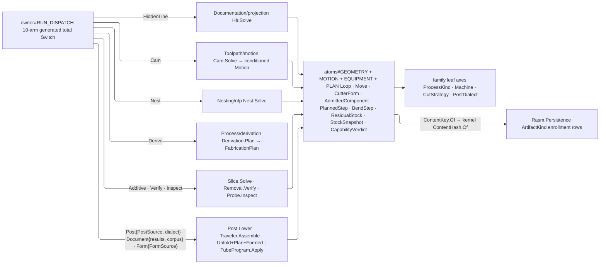

# [RASM_FABRICATION_OWNER]

`Fabrication` admits one complete production request and runtime, dispatches one `FabricationPolicy`, and returns one `FabricationResult` whose evidence projects content identity and lineage without replaying plane logic. `Process/atoms` holds the acyclic vocabulary floor this spine folds over, and `Run` remains the terminal consumer of plane kernels.

`FabricationInput` carries the columns EVERY policy reads; a column exactly one arm reads rides that arm's own policy case, so the aggregate admits one geometry, identity, and egress contract instead of eighteen slots most planes leave empty. `FabricationInput.Admit` proves process-machine-strategy-dialect compatibility, geometry presence, and requested egress before the `FabricationPolicy.Egress` dispatch, and `FabricationPolicy.Consumed` is the one projection the run spine folds for consumed ancestry.

The `Rasm.Element` `CanonicalWriter` is the one byte codec every preimage composes — MUTABLE-FLUENT, each primitive returning the same writer, so a discarded return is the ordinary spelling and no site copies a result — and `FabricationCanon` is the one facade over it, framing through `Coords`, `Basis`, `Maybe`, `Rows`, and `Discriminant` and closing through `Keyed` and `Ordered`. `ContentKey.Of` length-frames `EgressKind` ahead of those bytes, so equal payloads in different families stay distinct.

Each lane returns its canonical domain result, carrying a content key or measured facts only when that result owns them; `RunEvidence` is the sealed run itself, and `QuantityArrow` the one dimension-text entry a plane outside `Process` reaches, parameterized by the fault its own plane raises.

## [01]-[INDEX]

- [02]-[CONTENT_KEY]: `EgressKind`, `ContentKey`, `DeliveryTarget`, `EgressRequest`, `EgressContract`.
- [03]-[POLICY]: `FabricationPolicy` and `PostSource`.
- [04]-[RESULT]: `FabricationResult`, `RunProvenance`, `RunEvidence`, `RunLineage`.
- [05]-[RUN_FOLD]: `FabricationInput`, `RunStage`, `FabricationRuntime`.
- [06]-[RUN_DISPATCH]: `FabricationCanon`, `QuantityArrow`, `Fabrication.Run`, `Fabrication.Lineage`, and the provenance fold.

## [02]-[CONTENT_KEY]

- Owner: `EgressKind` owns the artifact family vocabulary; `ContentKey` owns the one mint; `EgressRequest` owns what a caller asked for; `EgressContract` owns what a policy can answer.
- Auto: `ContentKey.Of` length-frames the `EgressKind` key ahead of the payload, so equal bytes under different families stay distinct and no second mint exists.
- Law: an `EgressContract` states its admissible alternatives and its CARDINALITY CEILING alone — a floor is dead under every landed policy because a caller asking for nothing is always admissible, and the produced-versus-requested proof at `FabricationResult.Evidence` is what enforces coverage. `EgressContract.None` is the shared row for a policy producing no artifact.
- Boundary: `EgressKind` federates to the Persistence `ArtifactKind` rows at the content-key boundary by VALUE, never a type reference.

```csharp
// --- [IMPORTS] -------------------------------------------------------------------------
using System;
using System.Buffers.Binary;
using System.Collections.Generic;
using System.IO.Hashing;
using System.Text;
using System.Threading;
using LanguageExt;
using LanguageExt.Common;
using LanguageExt.Traits;
using Microsoft.Extensions.Caching.Hybrid;
using NodaTime;
using QuikGraph;
using QuikGraph.Algorithms;
using QuikGraph.Algorithms.Observers;
using QuikGraph.Algorithms.Search;
using Rasm.Domain;
using Rasm.Element.Projection;
using Rasm.Fabrication.Additive;
using Rasm.Fabrication.Documentation;
using Rasm.Fabrication.Forming;
using Rasm.Fabrication.Ingress;
using Rasm.Fabrication.Kinematics;
using Rasm.Fabrication.Nesting;
using Rasm.Fabrication.Posting;
using Rasm.Fabrication.Toolpath;
using Rasm.Fabrication.Verify;
using Rasm.Meshing;
using Rasm.Numerics;
using Rhino.Geometry;
using Thinktecture;
using static LanguageExt.Prelude;

using FabricationHooks = Rasm.Domain.HookSet<Rasm.Fabrication.Process.FabricationPoint, Rasm.Fabrication.Process.FabricationHookFact, Rasm.Domain.TelemetrySource>;

namespace Rasm.Fabrication.Process;

// --- [MODELS] --------------------------------------------------------------------------
// --- [CONTENT_KEY]
[SmartEnum<string>]
public sealed partial class EgressKind {
    public static readonly EgressKind CutProgram = new("cutprogram");
    public static readonly EgressKind Placement = new("placement");
    public static readonly EgressKind Remnant = new("remnant");
    public static readonly EgressKind Cli = new("cli");
    public static readonly EgressKind ThreeMf = new("threemf");
    public static readonly EgressKind Nc1 = new("nc1");
    public static readonly EgressKind StockSnapshot = new("stock-snapshot");
    public static readonly EgressKind Traveler = new("traveler");
    public static readonly EgressKind QualityRecord = new("quality-record");
    public static readonly EgressKind FlatPattern = new("flat-pattern");
    public static readonly EgressKind BendProgram = new("bend-program");
    public static readonly EgressKind WeldPlan = new("weld-plan");
    public static readonly EgressKind ScanVectors = new("scan-vectors");
    public static readonly EgressKind Plan = new("plan");
    public static readonly EgressKind DigitalProductPassport = new("digital-product-passport");
}

public sealed record ContentKey {
    private ContentKey(EgressKind kind, UInt128 digest) => (Kind, Digest) = (kind, digest);

    public EgressKind Kind { get; }
    public UInt128 Digest { get; }

    public static ContentKey Of(EgressKind kind, ReadOnlySpan<byte> canonicalBytes) {
        int keyLength = Encoding.UTF8.GetByteCount(kind.Key);
        Span<byte> preimage = new byte[(sizeof(int) * 2) + keyLength + canonicalBytes.Length];
        BinaryPrimitives.WriteInt32LittleEndian(preimage, keyLength);
        _ = Encoding.UTF8.GetBytes(kind.Key, preimage[sizeof(int)..]);
        BinaryPrimitives.WriteInt32LittleEndian(preimage[(sizeof(int) + keyLength)..], canonicalBytes.Length);
        canonicalBytes.CopyTo(preimage[((sizeof(int) * 2) + keyLength)..]);
        return new ContentKey(kind, ContentHash.Of(preimage));
    }

    public CanonicalWriter CanonicalBytes(CanonicalWriter writer) => writer.Discriminant(Kind).U128(Digest);
}

[Union(ConversionFromValue = ConversionOperatorsGeneration.None)]
public abstract partial record DeliveryTarget {
    private DeliveryTarget() { }

    public sealed record InProcess : DeliveryTarget;
    public sealed record Artifact(Uri Location) : DeliveryTarget;
    public sealed record Bundle(Uri Location, string Member) : DeliveryTarget;
}

[ComplexValueObject]
public sealed partial class EgressRequest {
    public Set<EgressKind> Kinds { get; }
    public DeliveryTarget Target { get; }

    static partial void ValidateFactoryArguments(
        ref ValidationError? validationError,
        ref Set<EgressKind> kinds,
        ref DeliveryTarget target) {
        if (!target.Switch(
            state: kinds,
            inProcess: static _ => true,
            artifact: static (requested, value) => !requested.IsEmpty && value.Location is { IsAbsoluteUri: true },
            bundle: static (requested, value) => !requested.IsEmpty && value.Location is { IsAbsoluteUri: true }
                && Witness.Keyed(value.Member)))
            validationError = new ValidationError("egress-request");
    }

    public static Fin<EgressRequest> Admit(Set<EgressKind> kinds, DeliveryTarget target) =>
        Validate(kinds, target, out EgressRequest request).Admitted(request);
}

public sealed record EgressContract(Set<EgressKind> Alternatives, int Maximum) {
    public static readonly EgressContract None = new(Set<EgressKind>(), 0);

    public bool Admits(EgressRequest request) =>
        (request.Kinds - Alternatives).IsEmpty && request.Kinds.Count <= Maximum;
}
```

## [03]-[POLICY]

- Owner: `FabricationPolicy` owns the closed production-modality family and the payload only its own plane reads; `PostSource` owns the three shapes a posted program lowers from.
- Cases: `Cam` carries its cell, `Nest` its inventory and prior plan, `Verify` its residual and snapshots, `Derive` its capability verdict, `HiddenLine` its view, and `Form` its `FormSource` — the closed sheet/tube/roll family, each arm carrying its own admitted run and its own machine envelope — so an eighteen-column aggregate whose columns most planes leave empty becomes eleven columns every plane reads.
- Auto: `Egress` declares admissible alternatives and cardinality once per case, and `Consumed` projects consumed ancestry once; both are generated total dispatches, so a new case cannot silently inherit a neighbour's contract.
- Law: `Egress` is a per-CASE fact rather than a per-PLANE one — `HiddenLine` and `Document` both own the documentation plane while answering `None` and `{Traveler, DigitalProductPassport}`, and `Inspect` and `Verify` split the verify plane the same way — so the arm is what states the contract and a plane-keyed row cannot. Nine arms answer a constant and the `Form` arm answers a PAYLOAD projection, exactly as `Fits` reads the case payload on `Cam`, `Post`, and `Document`: an unfold and a bend program are two artifact families under one modality, and one union over both would admit a caller asking a press brake for a bend program.
- Growth: a production modality adds one policy case, one `FabricationResult` case, and one dispatch arm — or, where an existing case already closes the family (`Form` over `FormSource`, `TubeFormed` over `TubeResult`), one row on that family and one arm on its own dispatch, with the outer cases untouched; an artifact adds one `EgressKind` row, one entry on the owning `Egress` arm, and its enrollment counterpart.
- Boundary: a payload type is named here and DECLARED at its owning plane, so this union imports names and never plane behaviour.

```csharp
// --- [POLICY]
[Union(ConversionFromValue = ConversionOperatorsGeneration.None)]
public abstract partial record FabricationPolicy {
    private FabricationPolicy() { }

    public sealed record HiddenLine(ProjectionPolicy Policy, ProjectionDir View) : FabricationPolicy;
    public sealed record Cam(
        CutStrategy Strategy,
        CamPassPolicy Pass,
        CutterForm Cutter,
        CellPolicy Cell,
        EngagementPolicy Engagement,
        Option<RobotCell> Robot) : FabricationPolicy;
    public sealed record Nest(NestPolicy Nesting, Seq<Stock> Inventory, Option<NestPlan> Plan) : FabricationPolicy;
    public sealed record Additive(AdditivePolicy Policy) : FabricationPolicy;
    public sealed record Verify(
        VerifyPolicy Policy,
        Option<ResidualStock> Residual,
        Seq<StockSnapshot> Snapshots) : FabricationPolicy;
    public sealed record Inspect(InspectPolicy Policy) : FabricationPolicy;
    public sealed record Post(PostSource Source, PostDialect Dialect, PostPolicy Policy) : FabricationPolicy;
    public sealed record Document(
        Seq<FabricationResult> Results,
        TravelerCorpus Corpus,
        Option<PostDialect> Dialect) : FabricationPolicy;
    public sealed record Derive(
        AdmittedComponent Component,
        DerivePolicy Policy,
        Option<CapabilityVerdict> Capability) : FabricationPolicy;
    public sealed record Form(FormSource Source) : FabricationPolicy;

    public EgressContract Egress => Switch(
        hiddenLine: static _ => EgressContract.None,
        cam: static _ => EgressContract.None,
        nest: static _ => new EgressContract(Set(EgressKind.Placement), 1),
        additive: static _ => new EgressContract(Set(EgressKind.ThreeMf, EgressKind.Cli, EgressKind.ScanVectors), 3),
        verify: static _ => new EgressContract(Set(EgressKind.Remnant, EgressKind.StockSnapshot), 2),
        inspect: static _ => EgressContract.None,
        post: static _ => new EgressContract(Set(EgressKind.CutProgram, EgressKind.Nc1, EgressKind.Cli), 1),
        document: static _ => new EgressContract(Set(EgressKind.Traveler, EgressKind.DigitalProductPassport), 2),
        derive: static _ => new EgressContract(Set(EgressKind.Plan, EgressKind.WeldPlan), 2),
        form: static policy => policy.Source.Egress);

    public Seq<ContentKey> Consumed => Switch(
        hiddenLine: static _ => Seq<ContentKey>(),
        cam: static _ => Seq<ContentKey>(),
        nest: static policy => policy.Plan.ToSeq().Map(static plan => plan.Key),
        additive: static _ => Seq<ContentKey>(),
        verify: static policy => policy.Residual.ToSeq().Map(static stock => stock.Key)
            + policy.Snapshots.Map(static snapshot => snapshot.Key),
        inspect: static _ => Seq<ContentKey>(),
        post: static _ => Seq<ContentKey>(),
        document: static policy => policy.Corpus.Records.Map(static record => record.Key)
            + policy.Corpus.DigitalProductPassport.ToSeq(),
        derive: static _ => Seq<ContentKey>(),
        form: static _ => Seq<ContentKey>());

    public bool Fits(ProcessKind process) => Switch(
        state: process,
        hiddenLine: static (_, _) => true,
        cam: static (value, policy) => value.Modality.Admits(policy.Strategy),
        nest: static (_, _) => true,
        additive: static (value, _) => value.Modality == ProcessModality.Additive,
        verify: static (_, _) => true,
        inspect: static (_, _) => true,
        post: static (value, policy) => policy.Dialect.Admits(value.Modality),
        document: static (value, policy) => policy.Dialect.Map(dialect => dialect.Admits(value.Modality)).IfNone(true),
        derive: static (_, _) => true,
        form: static (value, _) => value.Modality == ProcessModality.Formed);
}

[Union(ConversionFromValue = ConversionOperatorsGeneration.None)]
public abstract partial record PostSource {
    private PostSource() { }

    public sealed record Motion(FabricationResult.Motion Value) : PostSource;
    public sealed record Placement(FabricationResult.Placement Value) : PostSource;
    public sealed record Specialized(SpecializedToolpathEnvelope Value) : PostSource;
}
```

## [04]-[RESULT]

- Owner: `FabricationResult` owns plane-specific evidence; `RunEvidence` owns the sealed run; `RunProvenance` owns the lineage walk's named outputs; `RunLineage` owns the projection a caller reads off a sealed run.
- Cases: each `FabricationResult` case names only the evidence its own plane produced, so `Keys` and `Evidence` are one arm per case rather than a re-spelling of every slot.
- Entry: `FabricationResult.Evidence(input, consumed)` seals the run and proves the produced keys cover the request.
- Output: `RunEvidence` carries requested and produced artifacts, motion diagnostics, inspection outcomes, verification state, content keys, the ancestral roots its provenance walk reached, and the GENERATION depth that walk measured.
- Boundary: consumers preserve field order while the `Rasm.Element` `CanonicalWriter` owns ordinal, IEEE-754 double with `-0.0` and NaN normalization, `U128`, `I64`, length-prefixed UTF-8, and presence-tag framing; a second byte codec beside it is the deleted form.

```csharp
[Union(ConversionFromValue = ConversionOperatorsGeneration.None)]
public abstract partial record FabricationResult {
    private FabricationResult() { }

    public sealed record HiddenLineResult(ProjectionEvidence Projection, Seq<ContentKey> Subjects) : FabricationResult;
    public sealed record Motion(Seq<Move> Moves, Seq<MotionDirective> Directives, MotionEvidence Evidence, Seq<ContentKey> Subjects) : FabricationResult {
        public Seq<Arr<double>> Joints => Evidence.Joints;
        public double Duration => Evidence.Cycle.TotalSeconds;
        public Seq<string> CellCode => Evidence.ControllerCode;
    }
    public sealed record Placement(Seq<PartTransform> Parts, double Utilization, int Unplaced, Seq<Remnant> Remnants, ContentKey Key) : FabricationResult;
    public sealed record AdditiveResult(Seq<Move> Moves, int Layers, Seq<ContentKey> Artifacts) : FabricationResult;
    public sealed record VerificationResult(
        ResidualStock Residual,
        Seq<StockSnapshot> Snapshots,
        Seq<GougeWitness> Gouges,
        double UncutVolume,
        double OvercutVolume,
        double AirCutRatio,
        double VolumeTolerance) : FabricationResult {
        public bool Clean => Gouges.IsEmpty && OvercutVolume <= VolumeTolerance;
    }
    public sealed record InspectionResult(Seq<InspectionFeature> Features, Seq<ContentKey> Subjects) : FabricationResult;
    public sealed record PostedProgram(Seq<string> Blocks, ContentKey Key) : FabricationResult;
    public sealed record TravelerDocument(TravelerArtifact Artifact) : FabricationResult {
        public ContentKey Key => Artifact.Key;
        public Seq<ContentKey> Consumed => Artifact.Consumed;
        public Seq<ContentKey> Produced => Artifact.Produced;
        public Option<ContentKey> DigitalProductPassport => Artifact.DigitalProductPassport;
    }
    public sealed record FabricationPlan(
        DerivationStage Ceiling,
        Seq<ProcessKind> Routing,
        Seq<MachineMatch> Routes,
        Seq<PlannedStep> Steps,
        OperationTopology Topology,
        Option<CapabilityRequirement> Requirement,
        Option<LotSchedule> LotSchedule,
        Option<CapabilityVerdict> Capability,
        Set<EgressKind> RequestedArtifacts,
        Seq<ContentKey> Artifacts,
        ContentKey Key) : FabricationResult;
    public sealed record FormedResult(Arr<Loop> FlatPattern, Seq<BendStep> Bends, double SpringbackMaxDeg, ContentKey Key) : FabricationResult;
    public sealed record TubeFormed(TubeResult Outcome) : FabricationResult;

    public Seq<ContentKey> Keys => Map(
        hiddenLineResult: static value => value.Subjects,
        motion: static value => value.Subjects,
        placement: static value => Seq(value.Key),
        additiveResult: static value => value.Artifacts,
        verificationResult: static value => Seq(value.Residual.Key).Concat(value.Snapshots.Map(static row => row.Key)),
        inspectionResult: static value => value.Subjects,
        postedProgram: static value => Seq(value.Key),
        travelerDocument: static value => Seq(value.Key),
        fabricationPlan: static value => Seq(value.Key).Concat(value.Artifacts),
        formedResult: static value => Seq(value.Key),
        tubeFormed: static value => Seq(value.Outcome.Key));

    public Fin<RunEvidence> Evidence(FabricationInput input, Seq<ContentKey> consumed) {
        RunEvidence evidence = Switch(
            state: RunEvidence.Seed(this, input, consumed),
            hiddenLineResult: static (seed, result) => seed with { Consumed = seed.Consumed + result.Subjects },
            motion: static (seed, result) => seed with {
                Consumed = seed.Consumed + result.Subjects,
                Warnings = result.Evidence.Warnings,
            },
            placement: static (seed, result) => seed with { Produced = Seq(result.Key) },
            additiveResult: static (seed, result) => seed with { Produced = result.Artifacts },
            verificationResult: static (seed, result) => seed with {
                Produced = Seq(result.Residual.Key) + result.Snapshots.Map(static snapshot => snapshot.Key),
                Verified = Some(result.Clean),
            },
            inspectionResult: static (seed, result) => seed with {
                Consumed = seed.Consumed + result.Subjects,
                Inspections = result.Features,
            },
            postedProgram: static (seed, result) => seed with { Produced = Seq(result.Key) },
            travelerDocument: static (seed, result) => seed with {
                Consumed = seed.Consumed + result.Consumed,
                Produced = Seq(result.Key) + result.Produced + result.DigitalProductPassport.ToSeq(),
            },
            fabricationPlan: static (seed, result) => seed with { Produced = Seq(result.Key) + result.Artifacts },
            formedResult: static (seed, result) => seed with { Produced = Seq(result.Key) },
            tubeFormed: static (seed, result) => seed with { Produced = Seq(result.Outcome.Key) });
        Set<EgressKind> missing = input.Egress.Kinds - toSet(evidence.Produced.Map(static key => key.Kind));
        return missing.IsEmpty
            ? Fin.Succ(evidence)
            : Fin.Fail<RunEvidence>(new KernelFault.InvalidValue("owner", $"egress:missing:{string.Join(',', missing.Map(static kind => kind.Key))}"));
    }
}

public sealed record RunProvenance(Seq<ContentKey> Roots, Map<ContentKey, int> Generation) {
    public static readonly RunProvenance Empty = new(Seq<ContentKey>(), Map<ContentKey, int>());

    public int Depth => Generation.Values.Fold(0, static (deepest, row) => Math.Max(deepest, row));
}

public sealed record RunEvidence {
    private RunEvidence(
        FabricationResult result,
        FabricationPolicy policy,
        ProcessKind process,
        Machine machine,
        EgressRequest request,
        Seq<ContentKey> parentRuns,
        Seq<ContentKey> sources,
        Option<ContentKey> materialCertificate,
        Seq<ContentKey> consumed) =>
        (Result, Policy, Process, Machine, Request, ParentRuns, Sources, MaterialCertificate, Consumed) =
        (result, policy, process, machine, request, parentRuns, sources, materialCertificate, consumed);

    public static RunEvidence Seed(FabricationResult result, FabricationInput input, Seq<ContentKey> consumed) =>
        new(result, input.Policy, input.Process, input.Machine, input.Egress,
            input.ParentRuns, input.Sources, input.MaterialCertificate, consumed);

    public FabricationResult Result { get; }
    public FabricationPolicy Policy { get; }
    public ProcessKind Process { get; }
    public Machine Machine { get; }
    public EgressRequest Request { get; }
    public Seq<ContentKey> ParentRuns { get; }
    public Seq<ContentKey> Sources { get; }
    public Option<ContentKey> MaterialCertificate { get; }
    public Seq<ContentKey> Consumed { get; init; }
    public Seq<ContentKey> Produced { get; init; } = Seq<ContentKey>();
    public Seq<RunWarning> Warnings { get; init; } = Seq<RunWarning>();
    public Seq<InspectionFeature> Inspections { get; init; } = Seq<InspectionFeature>();
    public Option<bool> Verified { get; init; }
    public RunProvenance Provenance { get; init; } = RunProvenance.Empty;
}

public sealed record RunLineage(
    FabricationPolicy Policy,
    ProcessKind Process,
    Machine Machine,
    Seq<ContentKey> Parents,
    Seq<ContentKey> Sources,
    Option<ContentKey> MaterialCertificate,
    Seq<ContentKey> Consumed,
    Seq<ContentKey> Produced,
    Seq<ContentKey> Roots,
    Map<ContentKey, int> Generation);
```

## [05]-[RUN_FOLD]

- Owner: `FabricationInput` owns the columns EVERY policy reads — geometry, markings, edge-preparation demand, routing axes, ancestry, and the egress request; `RunStage` owns the declared governance boundaries; `FabricationRuntime` owns clock, cancellation, progress, the mounted instrument set, the span band, the kernel hook set, and the memo tier.
- Entry: `FabricationInput.Admit` accumulates its seven independent gates applicatively, so a caller reads every violated invariant at once rather than the first.
- Auto: run governance is one read per `RunStage` boundary; a requested cancellation lowers `Errors.Cancelled`, while a live run publishes that row's declared fraction.
- Output: `Run`'s terminal fold writes the sealed run onto `FabricationInstruments.RunDuration`, `RunArtifacts`, and `RunWarnings` through `runtime.Instruments` (`Process/telemetry#OBSERVE`) with elapsed read from `Clock`, so the run's own measures leave from the site that sealed them.
- Boundary: `Run` fires the admission veto before dispatch, the per-key egress-mint veto, the stage-advance and verify-verdict points from the canonical domain value, and the delivery hand-off after evidence through the kernel `HookSet` carried by the runtime. Domain kernels fire nothing; durable announcements belong to the app root's observe subscription. `FabricationRuntime.Admit` binds the default hook set on the result rather than collapsing it with `??`, because seating every point is itself a refusable composition.

```csharp
// --- [RUN_FOLD]
[ComplexValueObject]
public sealed partial class FabricationInput {
    public FabricationPolicy Policy { get; }
    public Option<MeshSpace> Model { get; }
    public Arr<Loop> Profiles { get; }
    public Arr<Loop> Keepouts { get; }

    public Arr<ProfileMarking> Markings { get; }

    public Arr<EdgePreparation> Preparations { get; }

    public ProcessKind Process { get; }
    public Machine Machine { get; }
    public Seq<ContentKey> ParentRuns { get; }
    public Seq<ContentKey> Sources { get; }
    public Option<ContentKey> MaterialCertificate { get; }
    public EgressRequest Egress { get; }

    public Map<string, Arr<ProfileMarking>> Tags => ProfileImport.TagsOf(Markings);

    static partial void ValidateFactoryArguments(
        ref ValidationError? validationError,
        ref FabricationPolicy policy,
        ref Option<MeshSpace> model,
        ref Arr<Loop> profiles,
        ref Arr<Loop> keepouts,
        ref Arr<ProfileMarking> markings,
        ref Arr<EdgePreparation> preparations,
        ref ProcessKind process,
        ref Machine machine,
        ref Seq<ContentKey> parentRuns,
        ref Seq<ContentKey> sources,
        ref Option<ContentKey> materialCertificate,
        ref EgressRequest egress) {
        if (model.IsNone && profiles.IsEmpty)
            validationError = new ValidationError("fabrication-input:geometry");
    }

    public static Fin<FabricationInput> Admit(
        FabricationPolicy policy,
        Option<MeshSpace> model,
        Arr<Loop> profiles,
        Arr<Loop> keepouts,
        Arr<ProfileMarking> markings,
        Arr<EdgePreparation> preparations,
        ProcessKind process,
        Machine machine,
        Seq<ContentKey> parentRuns,
        Seq<ContentKey> sources,
        Option<ContentKey> materialCertificate,
        EgressRequest egress) =>
        (AdmissionSlots.Gate(model.IsSome || !profiles.IsEmpty, FabConcern.Process, "fabrication-input:geometry", FabricationFault.Inadmissible),
         AdmissionSlots.Gate(profiles.ForAll(static loop => loop.Closed),
             FabConcern.Process, "fabrication-input:profiles", FabricationFault.Inadmissible),
         AdmissionSlots.Gate(keepouts.ForAll(static loop => loop.Closed),
             FabConcern.Process, "fabrication-input:keepouts", FabricationFault.Inadmissible),
         AdmissionSlots.Gate(preparations.ForAll(row => row.Profile >= 0 && row.Profile < profiles.Count),
             FabConcern.Process, "fabrication-input:preparations", FabricationFault.Inadmissible),
         AdmissionSlots.Gate(machine.Admits(process), FabConcern.Process, "fabrication-input:process-machine", FabricationFault.Inadmissible),
         AdmissionSlots.Gate(policy.Fits(process), FabConcern.Process, "fabrication-input:policy", FabricationFault.Inadmissible),
         AdmissionSlots.Gate(policy.Egress.Admits(egress), FabConcern.Process, "fabrication-input:egress", FabricationFault.Inadmissible))
            .Apply(static (_, _, _, _, _, _, _) => unit)
            .As()
            .ToFin()
            .Bind(_ => Validate(policy, model, profiles, keepouts, markings, preparations, process, machine,
                parentRuns, sources, materialCertificate, egress, out FabricationInput input).Admitted(input));

}

[SmartEnum<string>]
internal sealed partial class RunStage {
    public static readonly RunStage Started    = new("started", done: 0.00);
    public static readonly RunStage Admitted   = new("admitted", done: 0.05);
    public static readonly RunStage Dispatched = new("dispatched", done: 0.90);
    public static readonly RunStage Sealed     = new("sealed", done: 1.00);

    public double Done { get; }
}

[ComplexValueObject]
public sealed partial class FabricationRuntime {
    public IClock Clock { get; }
    public CancellationToken Cancel { get; }

    public FabricationHooks Hooks { get; }

    public Option<InstrumentSet> Instruments { get; }

    public Option<SpanBand> Band { get; }

    public Option<IProgress<double>> Progress { get; }

    public Option<HybridCache> Memo { get; }

    public static Fin<FabricationRuntime> Admit(
        IClock clock,
        CancellationToken cancel,
        Op key,
        FabricationHooks? hooks = null,
        Option<IProgress<double>> progress = default,
        Option<HybridCache> memo = default,
        Option<InstrumentSet> instruments = default,
        Option<SpanBand> band = default) =>
        Optional(hooks).Match(Some: Fin.Succ, None: () => FabricationHooks.Live(key))
            .Bind(hooks => Validate(clock, cancel, hooks, instruments, band, progress, memo,
                out FabricationRuntime runtime).Admitted(runtime));

    internal Unit Reached(RunStage stage) {
        Progress.Iter(sink => sink.Report(stage.Done));
        return unit;
    }
}
```

## [06]-[RUN_DISPATCH]

- Owner: `FabricationCanon` owns the ONE facade over `CanonicalWriter` every fabrication preimage composes — its framing family and its two closes alike; `QuantityArrow` owns the one dimension-text entry a plane outside `Process` reaches; `Fabrication` owns the run spine, the provenance fold, and the lineage projection.
- Law: `CanonicalWriter` is mutable-fluent — every primitive mutates the bound buffer and returns the SAME writer — so a call site chains or discards the return interchangeably and no fold copies a writer. `Discriminant` writes a generated owner's own key length-framed, so a preimage never carries a provider enum ordinal that a library reorder silently re-keys, and `Rows` writes the count before its rows so the layout stays self-delimiting.
- Law: the writer's constructor is PRIVATE and its two mints answer two different closes, so the facade owns both — `Keyed` opens `Retaining` and closes on the `Fin` result, `Ordered` opens `Streaming` and closes on the digest. A lane spelling either mint itself carries the close's refusal as its own concern, and a lane spelling `new CanonicalWriter(...)` names no member at all.
- Entry: `QuantityArrow(axis, raised, locus).Admit(text)` routes to `ProcessPhysics.Admit`, the one textual boundary, and re-raises on the CALLER's plane — a `PhysicsQuantity.<axis>.Admit` at a consuming page is a second text boundary answering on a foreign plane and is the deleted form.
- Auto: provenance fails ITS OWN acyclicity before any traversal. A content-addressed key covers its own descendants, so a cycle in child-to-parent lineage is a FORGED key rather than a modelling mistake, and the gate answers `PolicyInadmissible` at the forgery rather than letting a sort throw.
- Output: the walk's outputs land as NAMED columns — `RunProvenance.Roots` and `RunProvenance.Generation` — and the graph container never leaves the fold.
- Boundary: only the nest arm is genuinely asynchronous, so `Sync` is the one lift the other nine arms take and no arm hand-spells a completed task. `Fired` dispatches through the generated total `Switch`, so a new result case cannot silently lose its hook point, and each fired result is folded rather than discarded.
- Law: `Raised` is the ONE refusal-only raise and carries four of the five points, proving the admitted fact equals the fired one — an egress-mint gate rewriting a content key forges an identity nothing produced, exactly as a lineage cycle does, and an observe or replay point holds no gate to move it. `Admission` alone takes the kernel's guarded arity, because rewriting the request is what an admission veto exists for; no site spells a point, since `At` is the fact's own column.
- Packages: `QuikGraph` (`BidirectionalGraph`, `SEdge`, `IsDirectedAcyclicGraph`, `Sinks`, `BreadthFirstSearchAlgorithm`, `VertexDistanceRecorderObserver`), `Rasm.Element` `CanonicalWriter`, `System.IO.Hashing` (`XxHash128` at the streaming close), LanguageExt.Core result types.

```csharp
// --- [OPERATIONS] ----------------------------------------------------------------------
public static class FabricationCanon {
    public static CanonicalWriter Coords(this CanonicalWriter writer, Point3d point) =>
        writer.Double(point.X).Double(point.Y).Double(point.Z);

    public static CanonicalWriter Coords(this CanonicalWriter writer, (double X, double Y, double Z) point) =>
        writer.Double(point.X).Double(point.Y).Double(point.Z);

    public static CanonicalWriter Coords(this CanonicalWriter writer, Vector3d vector) =>
        writer.Double(vector.X).Double(vector.Y).Double(vector.Z);

    public static CanonicalWriter Basis(this CanonicalWriter writer, Transform transform) => writer
        .Double(transform.M00).Double(transform.M01).Double(transform.M02).Double(transform.M03)
        .Double(transform.M10).Double(transform.M11).Double(transform.M12).Double(transform.M13)
        .Double(transform.M20).Double(transform.M21).Double(transform.M22).Double(transform.M23);

    public static CanonicalWriter Maybe<T>(
        this CanonicalWriter writer, Option<T> value, Func<CanonicalWriter, T, CanonicalWriter> write) =>
        value.Match(
            Some: row => write(writer.Bool(true), row),
            None: () => writer.Bool(false));

    public static CanonicalWriter Rows<T>(
        this CanonicalWriter writer, Seq<T> rows, Func<CanonicalWriter, T, CanonicalWriter> write) =>
        rows.Fold(writer.Ordinal(rows.Count), write);

    public static CanonicalWriter Discriminant<TRow>(this CanonicalWriter writer, TRow row)
        where TRow : ISmartEnum<string>, IConvertible<string> => writer.String(row.ToValue());

    // --- [CLOSE]
    public static Fin<(ReadOnlyMemory<byte> Preimage, ContentKey Key)> Sealed(
        EgressKind kind, double grid, Func<CanonicalWriter, CanonicalWriter> frame, Op key) =>
        frame(CanonicalWriter.Retaining(grid))
            .ToBytes(key)
            .Map(preimage => (preimage, ContentKey.Of(kind, preimage.Span)));

    public static Fin<ContentKey> Keyed(
        EgressKind kind, double grid, Func<CanonicalWriter, CanonicalWriter> frame, Op key) =>
        Sealed(kind, grid, frame, key).Map(closed => closed.Key);

    public static UInt128 Ordered(double grid, Func<CanonicalWriter, CanonicalWriter> frame) =>
        frame(CanonicalWriter.Streaming(grid, new XxHash128(seed: 0L))).Digest();

    public static Fin<ContentKey> Keyed(
        EgressKind kind, Context tolerance, Func<CanonicalWriter, CanonicalWriter> frame, Op key) =>
        Keyed(kind, tolerance.Absolute.Value, frame, key);

    public static UInt128 Ordered(Context tolerance, Func<CanonicalWriter, CanonicalWriter> frame) =>
        Ordered(tolerance.Absolute.Value, frame);

}

public readonly record struct QuantityArrow(PhysicsQuantity Axis, FabConcern Raised, string Locus) {
    public Fin<double> Admit(string text) => ProcessPhysics
        .Admit(new PhysicsIngress.Quantity(Axis, text))
        .Bind(static admitted => admitted.Canonical);

    public Fin<Seq<double>> Admit(Seq<string> texts) => texts.Traverse(Admit).As();
}

public static class Fabrication {
    public static ValueTask<Fin<RunEvidence>> Run(FabricationInput input, FabricationRuntime runtime) =>
        (from _ in Ready(runtime, RunStage.Started)
         let key = Op.Of()
         let started = runtime.Clock.GetCurrentInstant()
         let asked = new FabricationHookFact.Admission(input)
         from admitted in runtime.Hooks.Fire(asked.At, asked, key, static fact => fact is FabricationHookFact.Admission settled
             ? Fin.Succ(settled.Input)
             : Fin.Fail<FabricationInput>(new KernelFault.InvalidValue("owner", "hook-admission:case")))
         from _dispatch in Ready(runtime, RunStage.Admitted)
         select (Input: admitted, Started: started)).Match(
            Succ: state => Dispatch(state.Input, runtime, state.Started),
            Fail: static error => ValueTask.FromResult(Fin.Fail<RunEvidence>(error)));

    public static Fin<RunLineage> Lineage(RunEvidence run) => Fin.Succ(new RunLineage(
        run.Policy,
        run.Process,
        run.Machine,
        run.ParentRuns,
        run.Sources,
        run.MaterialCertificate,
        run.Consumed,
        run.Produced,
        run.Provenance.Roots,
        run.Provenance.Generation));

    private static Fin<Unit> Ready(FabricationRuntime runtime, RunStage stage) => runtime.Cancel.IsCancellationRequested
        ? Fin.Fail<Unit>(Errors.Cancelled)
        : Fin.Succ(runtime.Reached(stage));

    private static async ValueTask<Fin<RunEvidence>> Dispatch(
        FabricationInput input,
        FabricationRuntime runtime,
        Instant started) {
        Op key = Op.Of();
        Fin<FabricationResult> dispatched = await input.Policy.Switch(
            state:      (Input: input, Runtime: runtime),
            hiddenLine: static (state, policy) => Sync(Hlr.Solve(
                policy,
                state.Input,
                static projection => new FabricationResult.HiddenLineResult(projection, projection.Sources))),
            cam:        static (state, policy) => Sync(Cam.Solve(policy, state.Input)),
            nest:       static (state, policy) => Nest.Solve(policy, state.Input, state.Runtime),
            additive:   static (state, policy) => Sync(Slice.Solve(policy, state.Input)),
            verify:     static (state, policy) => Sync(Removal.Verify(policy, state.Input, state.Runtime.Instruments)),
            inspect:    static (state, policy) => Sync(Probe.Inspect(policy.Policy, state.Input, state.Runtime.Instruments, state.Runtime.Band)),
            post:       static (state, policy) => Sync(Post.Lower(policy.Source, policy.Dialect, state.Input, policy.Policy)),
            document:   static (state, policy) => Sync(Traveler.Assemble(
                policy,
                state.Input,
                state.Runtime.Clock,
                static artifact => new FabricationResult.TravelerDocument(artifact),
                state.Runtime.Instruments)),
            derive:     static (state, policy) => Sync(Derivation.Plan(policy, state.Input, state.Runtime.Instruments)),
            form:       static (state, policy) => Sync(policy.Source.Switch(
                state: state,
                sheet: static (run, source) =>
                    from unfold in FlatPattern.Unfold(source.Policy, run.Input)
                    from bends in BendSequence.Plan(
                        unfold, source.Policy, source.Envelope, run.Runtime.Instruments, run.Runtime.Cancel)
                    from result in FlatPattern.Formed(unfold, bends.Steps)
                    select result,
                tube: static (run, source) => TubeProgram
                    .Apply(new TubeOp.Form(source.Run, source.Kind, source.Envelope), run.Runtime.Clock)
                    .Map(static outcome => (FabricationResult)new FabricationResult.TubeFormed(outcome)),
                roll: static (run, source) => TubeProgram
                    .Apply(new TubeOp.Roll(source.Run, source.Envelope), run.Runtime.Clock)
                    .Map(static outcome => (FabricationResult)new FabricationResult.TubeFormed(outcome)))));
        return from result in dispatched
               from _reached in Ready(runtime, RunStage.Dispatched)
               let consumed = Consumed(input)
               from evidence in result.Evidence(input, consumed)
               from provenance in Provenance(evidence.Produced, consumed)
               let sealedEvidence = evidence with { Provenance = provenance }
               from _mint in sealedEvidence.Produced
                   .TraverseM(produced => Raised(runtime.Hooks, new FabricationHookFact.EgressMint(produced), key)).As().Map(static _ => unit)
               from _points in Fired(runtime.Hooks, result, key)
               from _handoff in Raised(runtime.Hooks, new FabricationHookFact.Delivery(sealedEvidence), key)
               from _duration in runtime.Instruments.Write(FabricationInstruments.RunDuration, (runtime.Clock.GetCurrentInstant() - started).TotalSeconds,
                   (FabricationInstruments.ProcessSlot, input.Process.Key),
                   (FabricationInstruments.VerificationSlot, sealedEvidence.Verified.Match(
                       Some: static clean => clean ? FabricationInstruments.Verified : FabricationInstruments.Fail,
                       None: static () => FabricationInstruments.Unverified)))
               from _warnings in runtime.Instruments.Write(FabricationInstruments.RunWarnings, sealedEvidence.Warnings.Count)
               from _artifacts in sealedEvidence.Produced
                   .TraverseM(produced => runtime.Instruments.Write(FabricationInstruments.RunArtifacts, 1d, (FabricationInstruments.KindSlot, produced.Kind.Key))).As()
               let _sealed = runtime.Reached(RunStage.Sealed)
               select sealedEvidence;
    }

    private static Fin<RunProvenance> Provenance(Seq<ContentKey> produced, Seq<ContentKey> consumed) {
        BidirectionalGraph<ContentKey, SEdge<ContentKey>> lineage = new(allowParallelEdges: false);
        lineage.AddVertexRange(produced.Concat(consumed));
        lineage.AddEdgeRange(produced.Bind(child => consumed.Map(parent => new SEdge<ContentKey>(child, parent))));
        if (!lineage.IsDirectedAcyclicGraph())
            return Fin.Fail<RunProvenance>(new KernelFault.InvalidValue("owner", "lineage:forged-key"));

        BreadthFirstSearchAlgorithm<ContentKey, SEdge<ContentKey>> walk = new(lineage);
        VertexDistanceRecorderObserver<ContentKey, SEdge<ContentKey>> depths = new(static _ => 1.0);
        using (depths.Attach(walk)) {
            produced.Iter(walk.Compute);
        }
        return Fin.Succ(new RunProvenance(
            toSeq(lineage.Sinks()),
            toMap(toSeq(depths.Distances).Map(static row => (row.Key, (int)row.Value)))));
    }

    private static ValueTask<Fin<FabricationResult>> Sync<T>(Fin<T> settled)
        where T : FabricationResult =>
        ValueTask.FromResult(settled.Map(static value => (FabricationResult)value));

    private static Seq<ContentKey> Consumed(FabricationInput input) =>
        input.Policy.Consumed + input.ParentRuns + input.Sources + input.MaterialCertificate.ToSeq();

    private static Fin<Unit> Fired(FabricationHooks hooks, FabricationResult result, Op key) => result.Switch(
        state: (Hooks: hooks, Key: key),
        hiddenLineResult: static (_, _) => Fin.Succ(unit),
        motion: static (_, _) => Fin.Succ(unit),
        placement: static (_, _) => Fin.Succ(unit),
        additiveResult: static (_, _) => Fin.Succ(unit),
        verificationResult: static (spine, verification) =>
            Raised(spine.Hooks, new FabricationHookFact.VerifyVerdict(verification), spine.Key),
        inspectionResult: static (_, _) => Fin.Succ(unit),
        postedProgram: static (_, _) => Fin.Succ(unit),
        travelerDocument: static (_, _) => Fin.Succ(unit),
        fabricationPlan: static (spine, plan) => plan.Steps
            .TraverseM(step => Raised(spine.Hooks, new FabricationHookFact.StageAdvance(step), spine.Key)).As().Map(static _ => unit),
        formedResult: static (_, _) => Fin.Succ(unit),
        tubeFormed: static (_, _) => Fin.Succ(unit));

    private static Fin<Unit> Raised(FabricationHooks hooks, FabricationHookFact fact, Op key) =>
        hooks.Fire(fact.At, fact, key).Bind(admitted => admitted == fact
            ? Fin.Succ(unit)
            : Fin.Fail<Unit>(new KernelFault.InvalidValue("owner", $"hook-rewrite:{fact.At.Key}")));
}
```



## [07]-[RESEARCH]

<!-- source-only: research row template:
[TOKEN]-[OPEN|BLOCKED]: <exact question>; <verification route>.
-->

(none)
