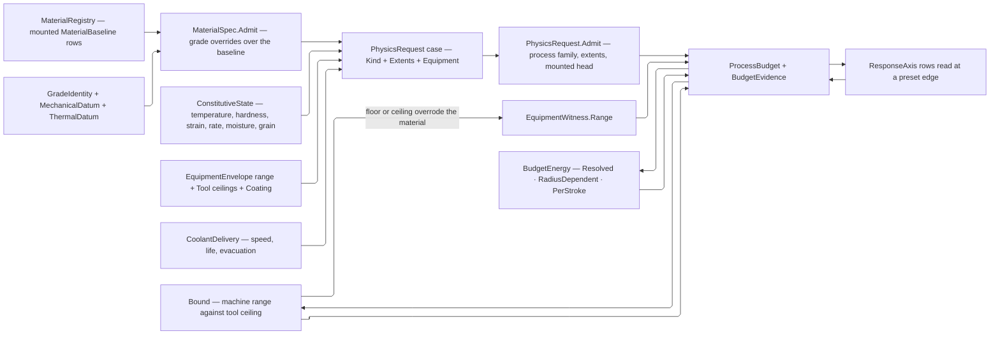

# [RASM_FABRICATION_PHYSICS]

`ProcessPhysics` admits one case-shaped request, resolves the family baseline with grade overrides, evaluates state-dependent constitutive laws, and returns one `ProcessBudget` case. This page owns the physics SHAPES, the admission law, and the derivation — never a catalog of equipment or grades. Tool assets are `Tooling/magazine`'s; material baselines and grades are caller-mounted registry rows, so the shop's real catalog never becomes a compiled fiction on the physics floor.

`Material` is the family vocabulary alone, each row carrying the `MaterialClass` that decides which physics families the family can answer at all. `MaterialBaseline` pairs a family with its per-`PhysicsKind` constitutive preset, `MaterialRegistry` admits the mounted baselines and grade rows once, and `MaterialSpec` overlays a grade's own overrides on its family baseline. A preset is caller data over the shapes this page owns; the page ships no grade.

`PhysicsRequest` makes evidence structural: subtractive work carries equipment, operation, and coolant; beam, jet, extrusion, deposition, joining, and erosion carry compatible equipment; resin, powder, and forming carry no irrelevant slot. `Kind`, `Extents`, and `Equipment` are BASE positional columns each case supplies from its own payload, so no case declares an override body.

`Tool.Admit` proves equipment geometry and `Tool.Admits(Operation)` proves the form-and-feed correspondence one place, so the subtractive fold dispatches on tool form alone. `Coating` scales speed and wear and caps interface temperature; tool ceilings cap spindle and depth; stickout and shank modulus yield deflection and stability; runout raises edge load; helix resolves axial force; approach angle sets turning chip thickness; grit scales grinding energy. `CoolantDelivery` carries its own speed, life, and evacuation response as family columns, so no second medium table exists.

`ConstitutiveLaw` evaluates temperature, hardness, strain, rate, moisture, and grain response through `MathNet.Numerics`, holding ONE interpolant per curve and reporting which axes SATURATED at their preset edge. `BudgetEnergy` resolves traversal to joules and seconds, forming per stroke, and constant-surface-speed turning to `RadiusDependent` power, speed, and feed. `SurfaceSpeed` is the one forward-and-inverse cutting-speed pair the whole package composes.

`UnitsNet` admits quantities and duration once and composes power-duration energy. Interior numerics use canonical machining units.

Wire posture: HOST-LOCAL. `ProcessBudget` cases and `MaterialSpec` cross only in-process seams to the fabrication generators.

## [01]-[INDEX]

- [02]-[EQUIPMENT]: `Coating`, `ToolClass`, `ToolForm`, `Tool`, `FeedLaw`, `OperationFamily`, `Operation`, `ProcessRange`, `RangeEvidence`, `EquipmentEnvelope`.
- [03]-[CONSTITUTIVE]: `ResponseAxis`, `ResponseInterpolation`, `ConstitutiveState`, `ResponseCurve`, `ConstitutiveLaw`, `ModalityPhysics`.
- [04]-[MATERIAL_REGISTRY]: `MaterialClass`, `Material`, `CertificateClass`, `TemperState`, `MechanicalDatum`, `ThermalDatum`, `GradeIdentity`, `MaterialBaseline`, `MaterialSpec`, `MaterialRegistry`.
- [05]-[BUDGET_SHAPE]: `PhysicsRequest`, `BudgetEnergy`, `CutterMechanics`, `BudgetEvidence`, `ProcessBudget`.
- [06]-[TEXT_ADMISSION]: `PhysicsQuantity`, `PhysicsIngress`, `PhysicsAdmission`.
- [07]-[BUDGET_FOLD]: `SurfaceSpeed` and `ProcessPhysics`.

## [02]-[EQUIPMENT]

- Owner: `Tool` owns the equipment SHAPE, its geometric admission, and its form-and-feed correspondence; `Operation` owns the feed law and engagement fractions; `Coating` owns surface response; `ProcessRange` owns the machine's own bounds and `RangeEvidence` what a derivation did with them.
- Law: this page declares NO tool instance. A shop's assemblies live at `Tooling/magazine`, which admits every candidate through `Tool.Admit` before it reaches a request; a compiled tool roster here is a fiction the shop never mounted and is the deleted form.
- Cases: `Tool` distinguishes rotary, wheel, saw blade, turning insert, and process head. `Surface`, `SpindleCeiling`, and `DepthCeiling` are BASE positional columns each case supplies from its own geometry, so a form declares no override body and a new form is one case with its three arguments.
- Auto: `Tool.Admits(Operation)` pairs a tool FORM against an `OperationFamily` and its feed law, so the subtractive fold dispatches on form alone and the process-versus-tool ladder it replaced cannot drift from the feed vocabulary.
- Output: `RangeEvidence` carries the admitted range, the derived value, the resolved value, and every clamp witness, so a budget states which bound overrode the material's own answer.
- Boundary: a ceiling the equipment never published is `None` on both tool axes, never a sentinel maximum a clamp reads as a measurement; `ProcessRange` bounds resolve through one `Bound` fold and every ceiling through the one `Capped` cap inside it.

```csharp
// --- [IMPORTS] -------------------------------------------------------------------------
using System;
using System.Globalization;
using LanguageExt;
using LanguageExt.Common;
using LanguageExt.Traits;
using MathNet.Numerics.Interpolation;
using Rasm.Element.Projection;
using Thinktecture;
using UnitsNet;
using static LanguageExt.Prelude;

namespace Rasm.Fabrication.Process;

// --- [TYPES] ---------------------------------------------------------------------------
[SmartEnum<string>]
public sealed partial class Coating {
    public static readonly Coating Uncoated = new("uncoated", speedFactor: 1.00, wearFactor: 1.00, interfaceC: 550.0);
    public static readonly Coating TiN = new("TiN", speedFactor: 1.25, wearFactor: 0.70, interfaceC: 600.0);
    public static readonly Coating TiCN = new("TiCN", speedFactor: 1.35, wearFactor: 0.60, interfaceC: 400.0);
    public static readonly Coating TiAlN = new("TiAlN", speedFactor: 1.60, wearFactor: 0.45, interfaceC: 900.0);
    public static readonly Coating AlCrN = new("AlCrN", speedFactor: 1.70, wearFactor: 0.40, interfaceC: 1100.0);
    public static readonly Coating Diamond = new("diamond", speedFactor: 2.40, wearFactor: 0.15, interfaceC: 700.0);
    public static readonly Coating CBN = new("cBN", speedFactor: 2.00, wearFactor: 0.20, interfaceC: 1200.0);

    public double SpeedFactor { get; }
    public double WearFactor { get; }

    public double InterfaceC { get; }
}

[SmartEnum<string>]
public sealed partial class ToolClass {
    public static readonly ToolClass Thermal = new("thermal", Set(PhysicsKind.Thermal));
    public static readonly ToolClass Abrasive = new("abrasive", Set(PhysicsKind.Abrasive));
    public static readonly ToolClass Extrusion = new("extrusion", Set(PhysicsKind.Fff));
    public static readonly ToolClass WireElectrode = new("wire-electrode", Set(PhysicsKind.Erosion));
    public static readonly ToolClass Deposition = new("deposition", Set(PhysicsKind.Deposition, PhysicsKind.Joining));

    public Set<PhysicsKind> Physics { get; }
    public bool Admits(PhysicsKind physics) => Physics.Contains(physics);
}

[SmartEnum<string>]
public sealed partial class OperationFamily {
    public static readonly OperationFamily Milling = new("milling");
    public static readonly OperationFamily Drilling = new("drilling");
    public static readonly OperationFamily Turning = new("turning");
    public static readonly OperationFamily Grinding = new("grinding");
    public static readonly OperationFamily Sawing = new("sawing");
}

[Union(ConversionFromValue = ConversionOperatorsGeneration.None)]
public abstract partial record FeedLaw {
    private FeedLaw() { }

    public sealed record Chip(double PerTooth) : FeedLaw;
    public sealed record PerRevolution(double Millimeters) : FeedLaw;
    public sealed record Pitch(double MillimetersPerRevolution) : FeedLaw;
    public sealed record SurfaceRatio(double Fraction) : FeedLaw;
}

[SmartEnum<string>]
public sealed partial class Operation {
    public static readonly Operation Contour = new("contour", OperationFamily.Milling, new FeedLaw.Chip(0.05), engagement: 1.0, axial: 1.0);
    public static readonly Operation Pocket = new("pocket", OperationFamily.Milling, new FeedLaw.Chip(0.04), engagement: 0.5, axial: 0.5);
    public static readonly Operation Slot = new("slot", OperationFamily.Milling, new FeedLaw.Chip(0.035), engagement: 1.0, axial: 0.5);
    public static readonly Operation Face = new("face", OperationFamily.Milling, new FeedLaw.Chip(0.08), engagement: 0.7, axial: 0.1);
    public static readonly Operation Chamfer = new("chamfer", OperationFamily.Milling, new FeedLaw.Chip(0.05), engagement: 0.2, axial: 0.1);
    public static readonly Operation Trochoidal = new("trochoidal", OperationFamily.Milling, new FeedLaw.Chip(0.06), engagement: 0.1, axial: 1.0);
    public static readonly Operation FormMill = new("form-mill", OperationFamily.Milling, new FeedLaw.Chip(0.04), engagement: 0.3, axial: 0.2);
    public static readonly Operation Engrave = new("engrave", OperationFamily.Milling, new FeedLaw.Chip(0.02), engagement: 0.1, axial: 0.05);
    public static readonly Operation Drill = new("drill", OperationFamily.Drilling, new FeedLaw.Chip(0.03), engagement: 1.0, axial: 1.0);
    public static readonly Operation Bore = new("bore", OperationFamily.Drilling, new FeedLaw.Chip(0.04), engagement: 0.05, axial: 1.0);
    public static readonly Operation Ream = new("ream", OperationFamily.Drilling, new FeedLaw.Chip(0.08), engagement: 0.02, axial: 1.0);
    public static readonly Operation Tap = new("tap", OperationFamily.Drilling, new FeedLaw.Pitch(1.0), engagement: 1.0, axial: 1.0);
    public static readonly Operation Counterbore = new("counterbore", OperationFamily.Drilling, new FeedLaw.Chip(0.05), engagement: 0.8, axial: 0.4);
    public static readonly Operation Countersink = new("countersink", OperationFamily.Drilling, new FeedLaw.Chip(0.04), engagement: 0.5, axial: 0.2);
    public static readonly Operation SpotDrill = new("spot-drill", OperationFamily.Drilling, new FeedLaw.Chip(0.03), engagement: 0.5, axial: 0.1);
    public static readonly Operation RoughTurn = new("rough-turn", OperationFamily.Turning, new FeedLaw.PerRevolution(0.2), engagement: 0.5, axial: 0.3);
    public static readonly Operation FinishTurn = new("finish-turn", OperationFamily.Turning, new FeedLaw.PerRevolution(0.08), engagement: 0.1, axial: 0.1);
    public static readonly Operation Part = new("part", OperationFamily.Turning, new FeedLaw.PerRevolution(0.06), engagement: 1.0, axial: 0.2);
    public static readonly Operation Groove = new("groove", OperationFamily.Turning, new FeedLaw.PerRevolution(0.08), engagement: 1.0, axial: 0.3);
    public static readonly Operation Thread = new("thread", OperationFamily.Turning, new FeedLaw.Pitch(1.5), engagement: 0.3, axial: 0.2);
    public static readonly Operation SurfaceGrind = new("surface-grind", OperationFamily.Grinding, new FeedLaw.SurfaceRatio(0.01), engagement: 1.0, axial: 0.02);
    public static readonly Operation SawCut = new("saw-cut", OperationFamily.Sawing, new FeedLaw.Chip(0.002), engagement: 1.0, axial: 0.5);

    public OperationFamily Family { get; }
    public FeedLaw Feed { get; }
    public double Engagement { get; }
    public double Axial { get; }
}

[Union(ConversionFromValue = ConversionOperatorsGeneration.None)]
public abstract partial record Tool(string Key, Coating Surface, Option<double> SpindleCeiling, Option<double> DepthCeiling) {
    public sealed record Rotary(
        string Key,
        double Diameter,
        int Flutes,
        Coating Coating,
        double CornerRadius,
        double HelixAngle,
        double Stickout,
        double Runout,
        double MaxDepthOfCut,
        double MaxRpm,
        double ShankModulusMpa) : Tool(Key, Coating, Some(MaxRpm), Some(MaxDepthOfCut)) {
        public double Slenderness => Stickout / Diameter;
    }

    public sealed record Wheel(string Key, double Diameter, double Width, int Grit, double MaxRpm)
        : Tool(Key, Coating.Uncoated, Some(MaxRpm), Some(Width)) {
        public double SpecificEnergyFactor => Math.Sqrt(Grit / 60.0);
    }

    public sealed record SawBlade(string Key, double Diameter, double Kerf, int Teeth, double MaxRpm)
        : Tool(Key, Coating.Uncoated, Some(MaxRpm), Some(Diameter * 0.4));

    public sealed record Turning(
        string Key,
        double NoseRadius,
        double CuttingEdgeLength,
        double ApproachAngleDeg,
        Coating Coating,
        double MaxDepthOfCut) : Tool(Key, Coating, None, Some(Math.Min(MaxDepthOfCut, CuttingEdgeLength * 0.75))) {
        public double ChipThicknessRatio => Math.Sin(ApproachAngleDeg * Math.PI / 180.0);
    }

    public sealed record Head(string Key, double Diameter, ToolClass Class)
        : Tool(Key, Coating.Uncoated, None, None);

    public bool Admits(Operation operation) => Switch(
        state: operation,
        rotary: static (op, _) => op.Family == OperationFamily.Milling || op.Family == OperationFamily.Drilling,
        wheel: static (op, _) => op.Family == OperationFamily.Grinding && op.Feed is FeedLaw.SurfaceRatio,
        sawBlade: static (op, _) => op.Family == OperationFamily.Sawing && op.Feed is FeedLaw.Chip,
        turning: static (op, _) => op.Family == OperationFamily.Turning,
        head: static (_, _) => false);

    public static Fin<Tool> Admit(Tool candidate) => candidate.Switch(
        rotary: static tool => Positive(tool.Diameter) && tool.Flutes > 0
            && Bounded(tool.CornerRadius, 0.0, tool.Diameter * 0.5) && Bounded(tool.HelixAngle, 0.0, 90.0)
            && Positive(tool.Stickout) && Bounded(tool.Runout, 0.0, tool.Diameter * 0.05)
            && Positive(tool.MaxDepthOfCut) && Positive(tool.MaxRpm) && Positive(tool.ShankModulusMpa)
                ? Fin.Succ((Tool)tool) : Invalid(tool, nameof(Rotary)),
        wheel: static tool => Positive(tool.Diameter) && Positive(tool.Width) && tool.Grit > 0 && Positive(tool.MaxRpm)
                ? Fin.Succ((Tool)tool) : Invalid(tool, nameof(Wheel)),
        sawBlade: static tool => Positive(tool.Diameter) && Positive(tool.Kerf)
            && tool.Kerf < tool.Diameter && tool.Teeth > 0 && Positive(tool.MaxRpm)
                ? Fin.Succ((Tool)tool) : Invalid(tool, nameof(SawBlade)),
        turning: static tool => Bounded(tool.NoseRadius, 0.0, tool.CuttingEdgeLength)
            && Positive(tool.CuttingEdgeLength) && tool.ApproachAngleDeg is > 0.0 and < 180.0
            && Positive(tool.ChipThicknessRatio) && Positive(tool.MaxDepthOfCut)
                ? Fin.Succ((Tool)tool) : Invalid(tool, nameof(Turning)),
        head: static tool => Positive(tool.Diameter)
                ? Fin.Succ((Tool)tool) : Invalid(tool, nameof(Head)));

    private static bool Positive(double value) => double.IsFinite(value) && value > 0.0;

    private static bool Bounded(double value, double low, double high) =>
        double.IsFinite(value) && value >= low && value <= high;

    private static Fin<Tool> Invalid(Tool candidate, string axis) =>
        Fin.Fail<Tool>(FabricationFault.Equipment(new EquipmentWitness.Geometry(candidate, axis)));
}

[ComplexValueObject]
public readonly partial struct ProcessRange {
    public Option<double> Minimum { get; }
    public Option<double> Maximum { get; }
    public Option<double> Nominal { get; }
    public Option<double> Current { get; }

    public double Resolve(double derived) => Current.IfNone(() => Nominal.IfNone(derived));

    [BoundaryAdapter]
    static partial void ValidateFactoryArguments(
        ref ValidationError? validationError,
        ref Option<double> minimum,
        ref Option<double> maximum,
        ref Option<double> nominal,
        ref Option<double> current) {
        Seq<double> values = minimum.ToSeq().Concat(maximum).Concat(nominal).Concat(current);
        if (values.Exists(static value => !double.IsFinite(value) || value < 0.0)
            || (minimum, maximum).Apply(static (lo, hi) => lo > hi).IfNone(false))
            validationError = new ValidationError("process-range");
    }
}

public sealed record RangeEvidence(
    PhysicsQuantity Bound,
    ProcessRange Range,
    double Derived,
    double Resolved,
    Arr<EquipmentWitness> Clamped);

public sealed record EquipmentEnvelope(
    Tool Tool,
    UInt128 Identity,
    ProcessRange Feed,
    ProcessRange Spindle,
    bool Spent);
```

## [03]-[CONSTITUTIVE]

- Owner: `ConstitutiveLaw` owns state response; `ResponseCurve` owns one axis's interpolated factor and the ONE interpolant it holds; `ModalityPhysics` owns the per-family law shape and its own `PhysicsKind`.
- Cases: `ModalityPhysics` distinguishes subtractive, thermal, abrasive, fused-filament, deposition, joining, erosion, resin, powder, and forming physics. `Kind` is a BASE positional column, so no case declares an override body.
- Law: `ResponseAxis` is the STATE VOCABULARY a preset curve keys on, not a roster of populated tables — a mounted preset decides which axes carry curves, and an axis with no curve in a given registry is simply unused by that shop, never a claim this page failed to keep.
- Auto: a curve builds its `IInterpolation` once and HOLDS it, so evaluating a law across a pass costs one build rather than one per sample; the held interpolant is derived from the admitted knots, so it stays out of equality and every codec.
- Output: `At` clamps a state onto the knot span and `Saturated` reports which axes clamped, so a budget publishes the axes it EXTRAPOLATED past instead of silently reading an edge factor as a measured one.
- Packages: `MathNet.Numerics` `Interpolate.Linear`, `.CubicSplineMonotone`, `.CubicSplineRobust`.

```csharp
// --- [MODELS] --------------------------------------------------------------------------
[SmartEnum<string>]
public sealed partial class ResponseAxis {
    public static readonly ResponseAxis Temperature = new("temperature", static state => state.TemperatureC);
    public static readonly ResponseAxis Hardness = new("hardness", static state => state.Hardness);
    public static readonly ResponseAxis StrainRate = new("strain-rate", static state => state.StrainRate);
    public static readonly ResponseAxis Strain = new("strain", static state => state.Strain);
    public static readonly ResponseAxis Moisture = new("moisture", static state => state.MoistureFraction);
    public static readonly ResponseAxis GrainSize = new("grain-size", static state => state.GrainSizeUm);

    public Func<ConstitutiveState, double> Select { get; }
}

[SmartEnum<string>]
public sealed partial class ResponseInterpolation {
    public static readonly ResponseInterpolation Linear =
        new("linear", static (x, y) => Interpolate.Linear(x, y));
    public static readonly ResponseInterpolation Monotone =
        new("monotone", static (x, y) => Interpolate.CubicSplineMonotone(x, y));
    public static readonly ResponseInterpolation Robust =
        new("robust", static (x, y) => Interpolate.CubicSplineRobust(x, y));

    public Func<double[], double[], IInterpolation> Create { get; }
}

[ComplexValueObject]
public sealed partial class ConstitutiveState {
    public double TemperatureC { get; }
    public double Hardness { get; }
    public double StrainRate { get; }
    public double Strain { get; }
    public double MoistureFraction { get; }
    public double GrainSizeUm { get; }

    [BoundaryAdapter]
    static partial void ValidateFactoryArguments(
        ref ValidationError? validationError,
        ref double temperatureC,
        ref double hardness,
        ref double strainRate,
        ref double strain,
        ref double moistureFraction,
        ref double grainSizeUm) {
        if (!double.IsFinite(temperatureC)
            || Seq(hardness, strainRate, strain, grainSizeUm).Exists(static value => !double.IsFinite(value) || value < 0.0)
            || !double.IsFinite(moistureFraction) || moistureFraction is < 0.0 or > 1.0)
            validationError = new ValidationError("constitutive-state");
    }
}

[ComplexValueObject]
public sealed partial class ResponseCurve {
    public ResponseAxis Axis { get; }
    public Arr<double> Inputs { get; }
    public Arr<double> Factors { get; }
    public ResponseInterpolation Interpolation { get; }

    [IgnoreMember]
    private IInterpolation? fit;

    public double At(ConstitutiveState state) =>
        (fit ??= Interpolation.Create(Inputs.ToArray(), Factors.ToArray()))
            .Interpolate(Math.Clamp(Axis.Select(state), Inputs[0], Inputs[^1]));

    public bool Saturates(ConstitutiveState state) =>
        Axis.Select(state) < Inputs[0] || Axis.Select(state) > Inputs[^1];

    [BoundaryAdapter]
    static partial void ValidateFactoryArguments(
        ref ValidationError? validationError,
        ref ResponseAxis axis,
        ref Arr<double> inputs,
        ref Arr<double> factors,
        ref ResponseInterpolation interpolation) {
        Seq<double> ordinates = toSeq(inputs);
        bool ordered = ordinates.Zip(ordinates.Skip(1), static (first, second) => first < second).ForAll(identity);
        if (inputs.Count != factors.Count || inputs.Count < 2
            || inputs.Exists(static value => !double.IsFinite(value))
            || factors.Exists(static value => !double.IsFinite(value) || value <= 0.0)
            || !ordered)
            validationError = new ValidationError("response-curve");
    }
}

[ComplexValueObject]
public sealed partial class ConstitutiveLaw {
    public double Reference { get; }
    public Arr<ResponseCurve> Responses { get; }

    public double At(ConstitutiveState state) =>
        Responses.Fold(Reference, static (value, response) => value * response.At(state));

    public Seq<ResponseAxis> Saturated(ConstitutiveState state) =>
        toSeq(Responses).Filter(response => response.Saturates(state)).Map(static response => response.Axis);

    [BoundaryAdapter]
    static partial void ValidateFactoryArguments(
        ref ValidationError? validationError,
        ref double reference,
        ref Arr<ResponseCurve> responses) {
        if (!double.IsFinite(reference) || reference <= 0.0)
            validationError = new ValidationError("constitutive-law");
    }
}

[Union(ConversionFromValue = ConversionOperatorsGeneration.None)]
public abstract partial record ModalityPhysics(PhysicsKind Kind) {
    public sealed record Subtractive(
        ConstitutiveLaw SurfaceSpeed,
        ConstitutiveLaw SpecificCuttingForce,
        ConstitutiveLaw TaylorExponent) : ModalityPhysics(PhysicsKind.Subtractive);

    public sealed record Thermal(
        ConstitutiveLaw KerfWidth,
        ConstitutiveLaw PierceTime,
        ConstitutiveLaw AssistPressure,
        ConstitutiveLaw CutSpeed,
        ConstitutiveLaw Power,
        ConstitutiveLaw HeatAffectedWidth) : ModalityPhysics(PhysicsKind.Thermal);

    public sealed record Abrasive(
        ConstitutiveLaw JetPressure,
        ConstitutiveLaw AbrasiveRate,
        ConstitutiveLaw TraverseSpeed,
        ConstitutiveLaw SpecificEnergy,
        ConstitutiveLaw TaperRatio) : ModalityPhysics(PhysicsKind.Abrasive);

    public sealed record Fff(
        ConstitutiveLaw MeltTemp,
        ConstitutiveLaw BondWindow,
        ConstitutiveLaw ExtrusionWidth,
        ConstitutiveLaw LayerHeight,
        ConstitutiveLaw PrintSpeed,
        ConstitutiveLaw Power) : ModalityPhysics(PhysicsKind.Fff);

    public sealed record Deposition(
        ConstitutiveLaw Power,
        ConstitutiveLaw WireFeedRate,
        ConstitutiveLaw TravelSpeed,
        ConstitutiveLaw Standoff,
        ConstitutiveLaw InterpassTemp,
        ConstitutiveLaw DilutionRatio) : ModalityPhysics(PhysicsKind.Deposition);

    public sealed record Joining(
        ConstitutiveLaw Current,
        ConstitutiveLaw Voltage,
        ConstitutiveLaw WireFeedRate,
        ConstitutiveLaw TravelSpeed,
        ConstitutiveLaw Standoff,
        ConstitutiveLaw InterpassTemp,
        ConstitutiveLaw ArcEfficiency) : ModalityPhysics(PhysicsKind.Joining);

    public sealed record Erosion(
        ConstitutiveLaw DischargeCurrent,
        ConstitutiveLaw GapVoltage,
        ConstitutiveLaw PulseOn,
        ConstitutiveLaw PulseOff,
        ConstitutiveLaw WireFeed,
        ConstitutiveLaw OverburnRatio) : ModalityPhysics(PhysicsKind.Erosion);

    public sealed record Resin(
        ConstitutiveLaw Exposure,
        ConstitutiveLaw CureDepth,
        ConstitutiveLaw LiftHeight,
        ConstitutiveLaw Power) : ModalityPhysics(PhysicsKind.Resin);

    public sealed record Powder(
        ConstitutiveLaw LaserPower,
        ConstitutiveLaw HatchSpacing,
        ConstitutiveLaw ScanSpeed,
        ConstitutiveLaw LayerThickness) : ModalityPhysics(PhysicsKind.Powder);

    public sealed record Forming(
        ConstitutiveLaw KFactor,
        ConstitutiveLaw SpringbackRatio,
        ConstitutiveLaw MinBendRadiusFactor,
        ConstitutiveLaw FlowStress,
        ConstitutiveLaw StrainHardening,
        ConstitutiveLaw AnisotropyRatio) : ModalityPhysics(PhysicsKind.Forming);
}
```

## [04]-[MATERIAL_REGISTRY]

- Owner: `Material` owns family identity alone; `MaterialClass` owns which physics families a family can answer; `MaterialBaseline` owns one family's mounted constitutive preset; `MaterialRegistry` owns the admitted baseline and grade rows; `MaterialSpec` owns a grade's evidence, datums, overrides, and resolved physics.
- Law: a GRADE is admitted registry DATA, never a compiled instance. A shop mounts its own baselines and grades once at composition, so the physics floor carries the shapes and the overlay rule and no constant catalog that drifts from the mill certificate it claims to describe.
- Auto: `MaterialSpec.Admit` proves every grade-override key equals its law's own kind and that the baseline already answers that kind before overlaying, and a traceable `CertificateClass` forces heat identity and certificate key present.
- Cases: `MaterialClass` names the physics families the class can carry, so `Material.Admits(ProcessKind)` answers the process-material correspondence `RelationFault.ProcessMaterial` refuses on.
- Output: `MechanicalDatum` and `ThermalDatum` reach the budget: the machinability index scales surface speed, the Hollomon pair drives forming flow stress, the plastic strain ratio and elongation bound limit strain, thermal diffusivity closes the cutting-zone temperature margin, and every remaining datum column rides `BudgetEvidence.Material` as the grade evidence the budget attests.
- Boundary: family identity, grade evidence, equipment variant, physics input, and budget remain distinct timing regimes.

```csharp
// --- [MATERIAL_REGISTRY] ---------------------------------------------------------------
[SmartEnum<string>]
public sealed partial class MaterialClass {
    public static readonly MaterialClass LightMetal = new("light-metal",
        Set(PhysicsKind.Subtractive, PhysicsKind.Thermal, PhysicsKind.Abrasive, PhysicsKind.Erosion,
            PhysicsKind.Deposition, PhysicsKind.Joining, PhysicsKind.Forming, PhysicsKind.Powder));
    public static readonly MaterialClass FerrousMetal = new("ferrous-metal",
        Set(PhysicsKind.Subtractive, PhysicsKind.Thermal, PhysicsKind.Abrasive, PhysicsKind.Erosion,
            PhysicsKind.Deposition, PhysicsKind.Joining, PhysicsKind.Forming, PhysicsKind.Powder));
    public static readonly MaterialClass Superalloy = new("superalloy",
        Set(PhysicsKind.Subtractive, PhysicsKind.Abrasive, PhysicsKind.Erosion,
            PhysicsKind.Deposition, PhysicsKind.Joining, PhysicsKind.Powder));
    public static readonly MaterialClass Polymer = new("polymer",
        Set(PhysicsKind.Subtractive, PhysicsKind.Thermal, PhysicsKind.Fff, PhysicsKind.Resin));
    public static readonly MaterialClass Composite = new("composite",
        Set(PhysicsKind.Subtractive, PhysicsKind.Abrasive));
    public static readonly MaterialClass Wood = new("wood", Set(PhysicsKind.Subtractive, PhysicsKind.Thermal));
    public static readonly MaterialClass Ceramic = new("ceramic", Set(PhysicsKind.Abrasive));

    public Set<PhysicsKind> Physics { get; }
}

[SmartEnum<string>]
public sealed partial class Material {
    public static readonly Material Aluminium = new("aluminium", MaterialClass.LightMetal);
    public static readonly Material Magnesium = new("magnesium", MaterialClass.LightMetal);
    public static readonly Material Titanium = new("titanium", MaterialClass.LightMetal);
    public static readonly Material Brass = new("brass", MaterialClass.FerrousMetal);
    public static readonly Material Copper = new("copper", MaterialClass.FerrousMetal);
    public static readonly Material Zinc = new("zinc", MaterialClass.FerrousMetal);
    public static readonly Material MildSteel = new("mild-steel", MaterialClass.FerrousMetal);
    public static readonly Material Stainless = new("stainless", MaterialClass.FerrousMetal);
    public static readonly Material CastIron = new("cast-iron", MaterialClass.FerrousMetal);
    public static readonly Material ToolSteel = new("tool-steel", MaterialClass.FerrousMetal);
    public static readonly Material Inconel = new("inconel", MaterialClass.Superalloy);
    public static readonly Material Cfrp = new("cfrp", MaterialClass.Composite);
    public static readonly Material Acrylic = new("acrylic", MaterialClass.Polymer);
    public static readonly Material Plywood = new("plywood", MaterialClass.Wood);
    public static readonly Material Mdf = new("mdf", MaterialClass.Wood);
    public static readonly Material Foam = new("foam", MaterialClass.Polymer);
    public static readonly Material Glass = new("glass", MaterialClass.Ceramic);
    public static readonly Material Filament = new("filament", MaterialClass.Polymer);
    public static readonly Material Resin = new("resin", MaterialClass.Polymer);
    public static readonly Material MetalPowder = new("metal-powder", MaterialClass.FerrousMetal);

    public MaterialClass Class { get; }

    public bool Admits(ProcessKind process) => Class.Physics.Contains(process.Physics);
}

[SmartEnum<string>]
public sealed partial class CertificateClass {
    public static readonly CertificateClass None = new("none", traceable: false, witnessed: false);
    public static readonly CertificateClass Type21 = new("en10204-2.1", traceable: false, witnessed: false);
    public static readonly CertificateClass Type22 = new("en10204-2.2", traceable: false, witnessed: false);
    public static readonly CertificateClass Type31 = new("en10204-3.1", traceable: true, witnessed: false);
    public static readonly CertificateClass Type32 = new("en10204-3.2", traceable: true, witnessed: true);

    public bool Traceable { get; }
    public bool Witnessed { get; }
}

[SmartEnum<string>]
public sealed partial class TemperState {
    public static readonly TemperState AsFabricated = new("as-fabricated");
    public static readonly TemperState Annealed = new("annealed");
    public static readonly TemperState Normalised = new("normalised");
    public static readonly TemperState StressRelieved = new("stress-relieved");
    public static readonly TemperState SolutionTreated = new("solution-treated");
    public static readonly TemperState PrecipitationHardened = new("precipitation-hardened");
    public static readonly TemperState QuenchedTempered = new("quenched-tempered");
    public static readonly TemperState ColdWorked = new("cold-worked");
    public static readonly TemperState Sintered = new("sintered");
    public static readonly TemperState HotIsostaticPressed = new("hot-isostatic-pressed");
}

[ComplexValueObject]
public sealed partial class MechanicalDatum {
    public double ElasticModulusMpa { get; }
    public double PoissonRatio { get; }
    public double YieldStrengthMpa { get; }
    public double UltimateStrengthMpa { get; }
    public double ElongationRatio { get; }
    public double Hardness { get; }
    public double FractureToughnessMpaM { get; }
    public double StrainHardeningExponent { get; }
    public double StrengthCoefficientMpa { get; }
    public double PlasticStrainRatio { get; }
    public double MachinabilityIndex { get; }

    public double ShearModulusMpa => ElasticModulusMpa / (2.0 * (1.0 + PoissonRatio));

    public double FlowStressMpa(double plasticStrain) =>
        StrengthCoefficientMpa * Math.Pow(Math.Max(plasticStrain, double.Epsilon), StrainHardeningExponent);

    public double LimitStrain => ElongationRatio * (1.0 + PlasticStrainRatio) * 0.5;

    [BoundaryAdapter]
    static partial void ValidateFactoryArguments(
        ref ValidationError? validationError,
        ref double elasticModulusMpa,
        ref double poissonRatio,
        ref double yieldStrengthMpa,
        ref double ultimateStrengthMpa,
        ref double elongationRatio,
        ref double hardness,
        ref double fractureToughnessMpaM,
        ref double strainHardeningExponent,
        ref double strengthCoefficientMpa,
        ref double plasticStrainRatio,
        ref double machinabilityIndex) {
        if (Seq(elasticModulusMpa, yieldStrengthMpa, ultimateStrengthMpa, strengthCoefficientMpa,
                fractureToughnessMpaM, plasticStrainRatio, machinabilityIndex)
                .Exists(static value => !double.IsFinite(value) || value <= 0.0)
            || !double.IsFinite(poissonRatio) || poissonRatio is <= -1.0 or >= 0.5
            || !double.IsFinite(hardness) || hardness < 0.0
            || !double.IsFinite(elongationRatio) || elongationRatio is < 0.0 or > 1.0
            || !double.IsFinite(strainHardeningExponent) || strainHardeningExponent is < 0.0 or > 1.0
            || ultimateStrengthMpa < yieldStrengthMpa)
            validationError = new ValidationError("material-spec:mechanical");
    }
}

[ComplexValueObject]
public sealed partial class ThermalDatum {
    public double DensityKgM3 { get; }
    public double ConductivityWMK { get; }
    public double SpecificHeatJKgK { get; }
    public double ThermalExpansionPerC { get; }
    public double MeltingC { get; }
    public double LatentHeatFusionJKg { get; }
    public double Emissivity { get; }

    private static readonly double SquareMillimetersPerSquareMeter = Area.FromSquareMeters(1.0).SquareMillimeters;

    public double DiffusivityMm2S => ConductivityWMK / (DensityKgM3 * SpecificHeatJKgK) * SquareMillimetersPerSquareMeter;

    public double VolumetricHeatCapacityJMm3K => DensityKgM3 * SpecificHeatJKgK / 1e9;

    [BoundaryAdapter]
    static partial void ValidateFactoryArguments(
        ref ValidationError? validationError,
        ref double densityKgM3,
        ref double conductivityWMK,
        ref double specificHeatJKgK,
        ref double thermalExpansionPerC,
        ref double meltingC,
        ref double latentHeatFusionJKg,
        ref double emissivity) {
        if (Seq(densityKgM3, conductivityWMK, specificHeatJKgK, thermalExpansionPerC, meltingC, latentHeatFusionJKg)
                .Exists(static value => !double.IsFinite(value) || value <= 0.0)
            || !double.IsFinite(emissivity) || emissivity is < 0.0 or > 1.0)
            validationError = new ValidationError("material-spec:thermal");
    }
}

[ComplexValueObject]
public sealed partial class GradeIdentity {
    public string Grade { get; }
    public string Designation { get; }
    public TemperState Temper { get; }
    public CertificateClass Certificate { get; }
    public Option<string> HeatNumber { get; }
    public Option<string> LotNumber { get; }
    public Option<ContentKey> CertificateKey { get; }

    [BoundaryAdapter]
    static partial void ValidateFactoryArguments(
        ref ValidationError? validationError,
        ref string grade,
        ref string designation,
        ref TemperState temper,
        ref CertificateClass certificate,
        ref Option<string> heatNumber,
        ref Option<string> lotNumber,
        ref Option<ContentKey> certificateKey) {
        if (!Witness.Keyed(grade) || !Witness.Keyed(designation)
            || (certificate.Traceable && (heatNumber.IsNone || certificateKey.IsNone)))
            validationError = new ValidationError("material-spec:grade");
    }
}

[ComplexValueObject]
public sealed partial class MaterialBaseline {
    public Material Family { get; }
    public Map<PhysicsKind, ModalityPhysics> Physics { get; }

    public static Fin<MaterialBaseline> Admit(Material family, Seq<ModalityPhysics> laws) =>
        Validate(family, toMap(laws.Map(static law => (law.Kind, law))), out MaterialBaseline baseline)
            .Admitted(baseline);

    [BoundaryAdapter]
    static partial void ValidateFactoryArguments(
        ref ValidationError? validationError,
        ref Material family,
        ref Map<PhysicsKind, ModalityPhysics> physics) {
        if (physics.IsEmpty || !physics.ForAll(row => row.Key == row.Value.Kind && family.Class.Physics.Contains(row.Key)))
            validationError = new ValidationError("material-baseline");
    }
}

[ComplexValueObject]
public sealed partial class MaterialSpec {
    public Material Family { get; }
    public GradeIdentity Identity { get; }
    public MechanicalDatum Mechanical { get; }
    public ThermalDatum Thermal { get; }
    public Map<PhysicsKind, ModalityPhysics> Physics { get; }

    public bool Admits(PhysicsKind physics) => Physics.ContainsKey(physics);

    public static Fin<MaterialSpec> Admit(
        MaterialBaseline baseline,
        GradeIdentity identity,
        MechanicalDatum mechanical,
        ThermalDatum thermal,
        Map<PhysicsKind, ModalityPhysics> gradeOverrides) =>
        AdmissionSlots
            .Gate(gradeOverrides.ForAll(row => row.Key == row.Value.Kind && baseline.Physics.ContainsKey(row.Key)),
                FabricationFault.Equipment(new EquipmentWitness.Grade("material-spec:grade-override")))
            .As()
            .ToFin()
            .Bind(_ => Validate(
                baseline.Family,
                identity,
                mechanical,
                thermal,
                gradeOverrides.AsIterable().Fold(baseline.Physics, static (state, row) => state.AddOrUpdate(row.Key, row.Value)),
                out MaterialSpec admitted).Admitted(admitted));

    [BoundaryAdapter]
    static partial void ValidateFactoryArguments(
        ref ValidationError? validationError,
        ref Material family,
        ref GradeIdentity identity,
        ref MechanicalDatum mechanical,
        ref ThermalDatum thermal,
        ref Map<PhysicsKind, ModalityPhysics> physics) {
        if (physics.IsEmpty)
            validationError = new ValidationError($"equipment-inadmissible:{new EquipmentWitness.Grade("material-spec")}");
    }
}

public sealed class MaterialRegistry {
    private MaterialRegistry(Map<Material, MaterialBaseline> baselines, Map<string, MaterialSpec> grades) =>
        (Baselines, Grades) = (baselines, grades);

    public Map<Material, MaterialBaseline> Baselines { get; }
    public Map<string, MaterialSpec> Grades { get; }

    public static Fin<MaterialRegistry> Admit(Seq<MaterialBaseline> baselines, Seq<MaterialSpec> grades) =>
        (AdmissionSlots.Gate(baselines.Map(static row => row.Family).Distinct().Count == baselines.Count,
            FabricationFault.Equipment(new EquipmentWitness.Grade("material-registry:baseline-duplicate"))),
         AdmissionSlots.Gate(grades.Map(static row => row.Identity.Grade).Distinct().Count == grades.Count,
            FabricationFault.Equipment(new EquipmentWitness.Grade("material-registry:grade-duplicate"))))
            .Apply(static (_, _) => unit)
            .As()
            .ToFin()
            .Map(_ => new MaterialRegistry(
                toMap(baselines.Map(static row => (row.Family, row))),
                toMap(grades.Map(static row => (row.Identity.Grade, row)))));

    public Fin<MaterialBaseline> Baseline(Material family) => Baselines
        .Find(family)
        .ToFin(FabricationFault.Equipment(new EquipmentWitness.Grade($"material-registry:{family.Key}")));

    public Fin<MaterialSpec> Grade(string grade) => Grades
        .Find(grade)
        .ToFin(FabricationFault.Equipment(new EquipmentWitness.Grade("material-registry:grade")));
}
```

## [05]-[BUDGET_SHAPE]

- Owner: `PhysicsRequest` owns exact runtime evidence; `BudgetEnergy` owns clock closure; `CutterMechanics` owns the rotary-only mechanics terms; `BudgetEvidence` owns the settled evidence; `ProcessBudget` owns derived limits.
- Cases: `ProcessBudget.Turning` remains distinct because constant-surface-speed RPM resolves against workpiece radius at motion time, and `BudgetEnergy.RadiusDependent` carries that unclosed clock as a typed case rather than an absent value.
- Law: a form with no mechanics answer publishes NONE, never a zero. A grinding wheel has no helix, so it has no axial force; a saw has no shank cantilever, so it has no deflection — a zero in those slots is forged evidence a downstream gate reads as a measured safe value.
- Auto: `Kind`, `Extents`, and `Equipment` are base positional columns, so a request case is one declaration and its own payload supplies all three.
- Output: `BudgetEvidence` records evaluated material state, power, energy closure, admitted grade, tool identity, every `RangeEvidence`, and the response axes that SATURATED at their preset edge.

```csharp
// --- [BUDGET_SHAPE] --------------------------------------------------------------------
[Union(ConversionFromValue = ConversionOperatorsGeneration.None)]
public abstract partial record PhysicsRequest(
    ProcessKind Process,
    MaterialSpec Material,
    ConstitutiveState State,
    PhysicsKind Kind,
    Seq<double> Extents,
    Option<UInt128> Equipment) {
    public sealed record Subtractive(
        ProcessKind Process,
        MaterialSpec Material,
        ConstitutiveState State,
        EquipmentEnvelope Assembly,
        Operation Operation,
        CoolantDelivery Delivery,
        double PathLengthMm)
        : PhysicsRequest(Process, Material, State, PhysicsKind.Subtractive, Seq(PathLengthMm), Some(Assembly.Identity));

    public sealed record Thermal(
        ProcessKind Process, MaterialSpec Material, ConstitutiveState State, EquipmentEnvelope Head, double CutLengthMm)
        : PhysicsRequest(Process, Material, State, PhysicsKind.Thermal, Seq(CutLengthMm), Some(Head.Identity));

    public sealed record Abrasive(
        ProcessKind Process, MaterialSpec Material, ConstitutiveState State, EquipmentEnvelope Head, double CutLengthMm)
        : PhysicsRequest(Process, Material, State, PhysicsKind.Abrasive, Seq(CutLengthMm), Some(Head.Identity));

    public sealed record Fff(
        ProcessKind Process, MaterialSpec Material, ConstitutiveState State, EquipmentEnvelope Head, double PathLengthMm)
        : PhysicsRequest(Process, Material, State, PhysicsKind.Fff, Seq(PathLengthMm), Some(Head.Identity));

    public sealed record Deposition(
        ProcessKind Process, MaterialSpec Material, ConstitutiveState State, EquipmentEnvelope Head, double PathLengthMm)
        : PhysicsRequest(Process, Material, State, PhysicsKind.Deposition, Seq(PathLengthMm), Some(Head.Identity));

    public sealed record Joining(
        ProcessKind Process, MaterialSpec Material, ConstitutiveState State, EquipmentEnvelope Head, double SeamLengthMm)
        : PhysicsRequest(Process, Material, State, PhysicsKind.Joining, Seq(SeamLengthMm), Some(Head.Identity));

    public sealed record Erosion(
        ProcessKind Process, MaterialSpec Material, ConstitutiveState State, EquipmentEnvelope Head, double PathLengthMm)
        : PhysicsRequest(Process, Material, State, PhysicsKind.Erosion, Seq(PathLengthMm), Some(Head.Identity));

    public sealed record Resin(ProcessKind Process, MaterialSpec Material, ConstitutiveState State, double AreaMm2)
        : PhysicsRequest(Process, Material, State, PhysicsKind.Resin, Seq(AreaMm2), None);

    public sealed record Powder(ProcessKind Process, MaterialSpec Material, ConstitutiveState State, double LayerAreaMm2)
        : PhysicsRequest(Process, Material, State, PhysicsKind.Powder, Seq(LayerAreaMm2), None);

    public sealed record Forming(
        ProcessKind Process, MaterialSpec Material, ConstitutiveState State, double ThicknessMm, double BendLengthMm)
        : PhysicsRequest(Process, Material, State, PhysicsKind.Forming, Seq(ThicknessMm, BendLengthMm), None);

    public static Fin<PhysicsRequest> Admit(PhysicsRequest candidate) =>
        candidate.Process.Physics != candidate.Kind
        || !candidate.Extents.ForAll(static value => double.IsFinite(value) && value > 0.0)
            ? Fin.Fail<PhysicsRequest>(FabricationFault.Pairing(
                new RelationFault.ProcessMaterial(candidate.Process, candidate.Material.Family)))
            : candidate.Switch(
                subtractive: static row => Mounted(row, row.Assembly, Some(row.Operation)),
                thermal: static row => Mounted(row, row.Head, None),
                abrasive: static row => Mounted(row, row.Head, None),
                fff: static row => Mounted(row, row.Head, None),
                deposition: static row => Mounted(row, row.Head, None),
                joining: static row => Mounted(row, row.Head, None),
                erosion: static row => Mounted(row, row.Head, None),
                resin: static row => Fin.Succ<PhysicsRequest>(row),
                powder: static row => Fin.Succ<PhysicsRequest>(row),
                forming: static row => Fin.Succ<PhysicsRequest>(row));

    private static Fin<PhysicsRequest> Mounted(
        PhysicsRequest request,
        EquipmentEnvelope assembly,
        Option<Operation> operation) =>
        assembly.Spent
            ? Fin.Fail<PhysicsRequest>(FabricationFault.Equipment(
                new EquipmentWitness.Spent(assembly.Identity, operation)))
            : Tool.Admit(assembly.Tool).Bind(tool => request.Kind == PhysicsKind.Subtractive
                ? Fin.Succ(request)
                : tool is Tool.Head head && head.Class.Admits(request.Kind)
                    ? Fin.Succ(request)
                    : Fin.Fail<PhysicsRequest>(FabricationFault.Equipment(
                        new EquipmentWitness.HeadPhysics(
                            request.Kind, Optional(tool as Tool.Head).Map(static mounted => mounted.Class)))));
}

[Union(ConversionFromValue = ConversionOperatorsGeneration.None)]
public abstract partial record BudgetEnergy {
    private BudgetEnergy() { }

    public sealed record Resolved(double Joules, double Seconds) : BudgetEnergy;

    public sealed record RadiusDependent(double PowerW, double SurfaceSpeedMPerMin, double FeedPerRevolutionMm) : BudgetEnergy;

    public sealed record PerStroke(double Joules) : BudgetEnergy;

    public Option<double> Joules => Switch(
        resolved: static row => Some(row.Joules),
        radiusDependent: static _ => Option<double>.None,
        perStroke: static row => Some(row.Joules));

    public Option<double> Seconds => Switch(
        resolved: static row => Some(row.Seconds),
        radiusDependent: static _ => Option<double>.None,
        perStroke: static _ => Option<double>.None);

    public static Fin<BudgetEnergy> Admit(BudgetEnergy candidate) =>
        candidate.Switch(
            resolved: static row => NonNegative(row.Joules) && NonNegative(row.Seconds),
            radiusDependent: static row => NonNegative(row.PowerW)
                && NonNegative(row.SurfaceSpeedMPerMin) && NonNegative(row.FeedPerRevolutionMm),
            perStroke: static row => NonNegative(row.Joules))
            ? Fin.Succ(candidate)
            : Fin.Fail<BudgetEnergy>(FabricationFault.Equipment(new EquipmentWitness.Grade("budget-energy")));

    private static bool NonNegative(double value) => double.IsFinite(value) && value >= 0.0;
}

public sealed record CutterMechanics(
    double AxialForceN,
    double ChipThinningFactor,
    double DeflectionMm,
    double StabilityLimitMm,
    double CuttingZoneC,
    double InterfaceCeilingC) {
    public double ThermalMargin => InterfaceCeilingC - CuttingZoneC;
}

[ComplexValueObject]
public sealed partial class BudgetEvidence {
    public ConstitutiveState State { get; }
    public double PowerW { get; }
    public BudgetEnergy Energy { get; }
    public MaterialSpec Material { get; }
    public Option<UInt128> ToolIdentity { get; }
    public Arr<RangeEvidence> Ranges { get; }

    public Arr<ResponseAxis> Extrapolated { get; }

    public Arr<EquipmentWitness> Clamped => Ranges.Bind(static range => range.Clamped);

    [BoundaryAdapter]
    static partial void ValidateFactoryArguments(
        ref ValidationError? validationError,
        ref ConstitutiveState state,
        ref double powerW,
        ref BudgetEnergy energy,
        ref MaterialSpec material,
        ref Option<UInt128> toolIdentity,
        ref Arr<RangeEvidence> ranges,
        ref Arr<ResponseAxis> extrapolated) {
        if (BudgetEnergy.Admit(energy).IsFail
            || !double.IsFinite(powerW) || powerW < 0.0
            || !ranges.ForAll(static range => double.IsFinite(range.Derived) && range.Derived >= 0.0
                && double.IsFinite(range.Resolved) && range.Resolved >= 0.0))
            validationError = new ValidationError("budget-evidence");
    }
}

[Union(ConversionFromValue = ConversionOperatorsGeneration.None)]
public abstract partial record ProcessBudget {
    private ProcessBudget() { }

    public sealed record Subtractive(
        double SpindleRpm,
        double FeedRate,
        double DepthOfCut,
        double WidthOfCut,
        double MaterialRemovalRate,
        double TangentialForceN,
        double ToolLifeMinutes,
        Option<CutterMechanics> Mechanics,
        BudgetEvidence Evidence) : ProcessBudget;
    public sealed record Turning(
        double SurfaceSpeed,
        double FeedPerRevolution,
        double DepthOfCut,
        double NoseRadius,
        double ChipThicknessMm,
        double TangentialForceN,
        double ToolLifeMinutes,
        BudgetEvidence Evidence) : ProcessBudget;
    public sealed record Thermal(
        double PierceTime,
        double KerfWidth,
        double CutSpeed,
        double AssistPressure,
        double HeatAffectedWidth,
        BudgetEvidence Evidence) : ProcessBudget;
    public sealed record Abrasive(
        double JetPressure,
        double AbrasiveRate,
        double TraverseSpeed,
        double OrificeDiameter,
        double KerfWidth,
        double KerfTaper,
        BudgetEvidence Evidence) : ProcessBudget;
    public sealed record Fff(double ExtrusionWidth, double LayerHeight, double PrintSpeed, double MeltTemp, double BondWindow, BudgetEvidence Evidence) : ProcessBudget;
    public sealed record Deposition(double PowerW, double WireFeedRate, double TravelSpeed, double Standoff, double InterpassTemp, double DilutionRatio, BudgetEvidence Evidence) : ProcessBudget;
    public sealed record Joining(double CurrentA, double VoltageV, double WireFeedRate, double TravelSpeed, double Standoff, double InterpassTemp, double HeatInputKjPerMm, BudgetEvidence Evidence) : ProcessBudget;
    public sealed record Erosion(double DischargeCurrent, double GapVoltage, double PulseOnUs, double PulseOffUs, double WireFeed, double KerfWidth, BudgetEvidence Evidence) : ProcessBudget;
    public sealed record Resin(double Exposure, double CureDepth, double LiftHeight, BudgetEvidence Evidence) : ProcessBudget;
    public sealed record Powder(double LaserPower, double HatchSpacing, double ScanSpeed, double LayerThickness, double VolumetricEnergyDensity, BudgetEvidence Evidence) : ProcessBudget;
    public sealed record Formed(double TensileRm, double KFactor, double SpringbackRatio, double MinBendRadiusFactor, double FlowStressMpa, double LimitStrain, BudgetEvidence Evidence) : ProcessBudget;
}
```

## [06]-[TEXT_ADMISSION]

- Owner: `PhysicsQuantity` owns the quantity axes and their parse; `PhysicsIngress` owns the raw text shape; `PhysicsAdmission` owns the admitted result.
- Entry: `ProcessPhysics.Admit(PhysicsIngress)` is the ONE textual boundary in the package. A plane outside `Process` reaches it through `Process/owner#RUN_DISPATCH` `QuantityArrow`, which re-raises on the caller's own plane; a `PhysicsQuantity.<axis>.Admit` call at a consuming page is a second boundary answering on a foreign plane and is the deleted form.
- Auto: `Canonical` projects the admitted quantity onto the `Fin<double>` rail one place, so the arrow never re-walks the union.
- Boundary: every parse runs under the invariant culture, so a shop locale never re-reads a stored dimension differently.

```csharp
// --- [TEXT_ADMISSION] ------------------------------------------------------------------
[SmartEnum<string>]
public sealed partial class PhysicsQuantity {
    public static readonly PhysicsQuantity Feed = Of<Speed>(
        "feed", Speed.TryParse, static value => (double)value.MillimetersPerMinutes);
    public static readonly PhysicsQuantity Spindle = Of<RotationalSpeed>(
        "spindle", RotationalSpeed.TryParse, static value => (double)value.RevolutionsPerMinute);
    public static readonly PhysicsQuantity Length = Of<UnitsNet.Length>(
        "length", UnitsNet.Length.TryParse, static value => (double)value.Millimeters);
    public static readonly PhysicsQuantity Pressure = Of<UnitsNet.Pressure>(
        "pressure", UnitsNet.Pressure.TryParse, static value => (double)value.Bars);
    public static readonly PhysicsQuantity Power = Of<UnitsNet.Power>(
        "power", UnitsNet.Power.TryParse, static value => (double)value.Watts);
    public static readonly PhysicsQuantity Temperature = Of<UnitsNet.Temperature>(
        "temperature", UnitsNet.Temperature.TryParse, static value => (double)value.DegreesCelsius);
    public static readonly PhysicsQuantity Force = Of<UnitsNet.Force>(
        "force", UnitsNet.Force.TryParse, static value => (double)value.Newtons);
    public static readonly PhysicsQuantity Energy = Of<UnitsNet.Energy>(
        "energy", UnitsNet.Energy.TryParse, static value => (double)value.Joules);
    public static readonly PhysicsQuantity Duration = Of<UnitsNet.Duration>(
        "duration", UnitsNet.Duration.TryParse, static value => (double)value.Seconds);

    internal Func<string, Fin<double>> Parse { get; }

    private delegate bool TryQuantity<T>(string? text, IFormatProvider? provider, out T value);

    private static PhysicsQuantity Of<T>(string key, TryQuantity<T> parse, Func<T, double> canonical) =>
        new(key, text => parse(text, CultureInfo.InvariantCulture, out T value)
            ? Fin.Succ(canonical(value))
            : Fin.Fail<double>(FabricationFault.Equipment(new EquipmentWitness.Quantity(key, text))));
}

[Union(ConversionFromValue = ConversionOperatorsGeneration.None)]
public abstract partial record PhysicsIngress {
    private PhysicsIngress() { }

    public sealed record Keys(string Process, string Material, string Operation) : PhysicsIngress;
    public sealed record Quantity(PhysicsQuantity Kind, string Text) : PhysicsIngress;
}

[Union(ConversionFromValue = ConversionOperatorsGeneration.None)]
public abstract partial record PhysicsAdmission {
    private PhysicsAdmission() { }

    public sealed record Keys(ProcessKind Process, Material Material, Operation Operation) : PhysicsAdmission;
    public sealed record Quantity(PhysicsQuantity Kind, double Canonical) : PhysicsAdmission;

    public Fin<double> Canonical => Switch(
        keys: static _ => Fin.Fail<double>(FabricationFault.Equipment(new EquipmentWitness.Quantity("scalar", "keys"))),
        quantity: static row => Fin.Succ(row.Canonical));
}
```

## [07]-[BUDGET_FOLD]

- Owner: `SurfaceSpeed` owns the forward-and-inverse cutting-speed pair the WHOLE package composes; `ProcessPhysics` owns the runtime fold, the range bound, and the clock.
- Law: `n = vc * 1000 / (pi * D)` and its inverse live HERE and nowhere else. A spindle-speed derivation at `Kinematics/fleet`, `Posting/program`, or `Tooling/cuttingdata` composes this pair over the CUTTING diameter — a shank diameter is not a cutting diameter and produces a surface speed the cut never sees.
- Law: one traversal clock closes every extent-over-rate budget. Thermal, abrasive, erosion, and deposition legs compose `Traversal`; an inline `extent / rate * 60.0` beside it is the deleted form.
- Auto: the request case dispatches OUTER and binds its own law case, so no tuple pattern goes non-total and no hard cast reaches a runtime type check. A request whose law family disagrees answers `RelationFault.ProcessMaterial` on the gated mint.
- Auto: budget derivation evaluates constitutive response once per state, resolves current before nominal before derived equipment settings, bounds each selection against the equipment range and tool ceiling, rejects a floor above the ceiling, records each applied clamp, admits every mounted head through `Tool.Admit`, rejects spent equipment, and derives radial chip thinning, deflection, chatter-free depth, cutting-zone temperature margin, Taylor tool life, heat input, and volumetric energy density from the admitted columns.
- Law: Taylor tool life reads the family's own exponent law scaled by the coating's wear factor and the coolant's life factor, so all three columns reach one published number instead of sitting unread.
- Boundary: `GeometryFault` covers degenerate geometry alone; equipment, quantity, and grade rejections mint through `FabricationFault.Equipment`, so the witness clears its own kind predicate before the fault exists.

```csharp
// --- [OPERATIONS] ----------------------------------------------------------------------
public static class SurfaceSpeed {
    public static double Rpm(double metersPerMinute, double cuttingDiameterMm) =>
        metersPerMinute * 1000.0 / (Math.PI * Math.Max(cuttingDiameterMm, double.Epsilon));

    public static double MetersPerMinute(double rpm, double cuttingDiameterMm) =>
        rpm * Math.PI * cuttingDiameterMm / 1000.0;
}

public static class ProcessPhysics {
    public static Fin<ProcessBudget> Budget(PhysicsRequest request) =>
        from admitted in PhysicsRequest.Admit(request)
        from physics in admitted.Material.Physics.Find(admitted.Kind)
            .ToFin(FabricationFault.Pairing(new RelationFault.ProcessMaterial(admitted.Process, admitted.Material.Family)))
        from budget in admitted.Switch(
            state: physics,
            subtractive: static (law, row) => Law<ModalityPhysics.Subtractive>(law, row).Bind(l => Subtractive(row, l)),
            thermal: static (law, row) => Law<ModalityPhysics.Thermal>(law, row).Bind(l => Head(row.Head).Bind(head => Thermal(row, head, l))),
            abrasive: static (law, row) => Law<ModalityPhysics.Abrasive>(law, row).Bind(l => Head(row.Head).Bind(head => Abrasive(row, head, l))),
            fff: static (law, row) => Law<ModalityPhysics.Fff>(law, row).Bind(l => Head(row.Head).Bind(head => Fff(row, head, l))),
            deposition: static (law, row) => Law<ModalityPhysics.Deposition>(law, row).Bind(l => Deposition(row, l)),
            joining: static (law, row) => Law<ModalityPhysics.Joining>(law, row).Bind(l => Joining(row, l)),
            erosion: static (law, row) => Law<ModalityPhysics.Erosion>(law, row).Bind(l => Head(row.Head).Bind(head => Erosion(row, head, l))),
            resin: static (law, row) => Law<ModalityPhysics.Resin>(law, row).Map(l => Resin(row, l)),
            powder: static (law, row) => Law<ModalityPhysics.Powder>(law, row).Map(l => Powder(row, l)),
            forming: static (law, row) => Law<ModalityPhysics.Forming>(law, row).Map(l => Formed(row, l)))
        select budget;

    public static Fin<PhysicsAdmission> Admit(PhysicsIngress ingress) => ingress.Switch(
        keys: static input =>
            (Admission.Of<ProcessKind, string>(input.Process).ToValidation(),
             Admission.Of<Material, string>(input.Material).ToValidation(),
             Admission.Of<Operation, string>(input.Operation).ToValidation())
                .Apply(static (process, material, operation) =>
                    (PhysicsAdmission)new PhysicsAdmission.Keys(process, material, operation))
                .As().ToFin(),
        quantity: static input => input.Kind.Parse(input.Text)
            .Map(value => (PhysicsAdmission)new PhysicsAdmission.Quantity(input.Kind, value)));

    private static Fin<TLaw> Law<TLaw>(ModalityPhysics physics, PhysicsRequest request)
        where TLaw : ModalityPhysics =>
        physics is TLaw typed
            ? Fin.Succ(typed)
            : Fin.Fail<TLaw>(FabricationFault.Pairing(
                new RelationFault.ProcessMaterial(request.Process, request.Material.Family)));

    private static Fin<Tool.Head> Head(EquipmentEnvelope envelope) =>
        envelope.Tool is Tool.Head head
            ? Fin.Succ(head)
            : Fin.Fail<Tool.Head>(FabricationFault.Equipment(new EquipmentWitness.Geometry(envelope.Tool, nameof(Tool.Head))));

    private static Fin<ProcessBudget> Subtractive(PhysicsRequest.Subtractive input, ModalityPhysics.Subtractive law) =>
        !input.Assembly.Tool.Admits(input.Operation)
            ? Invalid(input.Operation, input.Assembly.Tool)
            : input.Assembly.Tool.Switch(
                state: (Input: input, Law: law),
                rotary: static (s, tool) => Rotary(s.Input, s.Law, tool),
                wheel: static (s, tool) => Wheel(s.Input, s.Law, tool),
                sawBlade: static (s, tool) => Saw(s.Input, s.Law, tool),
                turning: static (s, tool) => Turn(s.Input, s.Law, tool),
                head: static (s, tool) => Invalid(s.Input.Operation, tool));

    private static double PerTooth(FeedLaw feed, int flutes) => feed switch {
        FeedLaw.Chip row => row.PerTooth,
        FeedLaw.Pitch row => row.MillimetersPerRevolution / Math.Max(flutes, 1),
        _ => 0.0,
    };

    private static Fin<ProcessBudget> Rotary(PhysicsRequest.Subtractive input, ModalityPhysics.Subtractive law, Tool.Rotary tool) {
        ConstitutiveState state = input.State;
        MechanicalDatum datum = input.Material.Mechanical;
        double perTooth = PerTooth(input.Operation.Feed, tool.Flutes);
        double width = Math.Min(input.Operation.Engagement * tool.Diameter, tool.Diameter);
        double evacuation = input.Operation.Engagement >= 1.0 ? input.Delivery.Evacuation : 1.0;
        double depth = Capped(input.Operation.Axial * tool.Diameter, tool.DepthCeiling.Map(limit => limit * evacuation));
        double thinning = width < tool.Diameter * 0.5 && width > 0.0
            ? tool.Diameter / (2.0 * Math.Sqrt(width * (tool.Diameter - width)))
            : 1.0;
        double surfaceSpeed = law.SurfaceSpeed.At(state) * tool.Surface.SpeedFactor
            * input.Delivery.SpeedFactor * datum.MachinabilityIndex;
        double specificForce = law.SpecificCuttingForce.At(state);
        return
            from spindleBound in Bound(PhysicsQuantity.Spindle, input.Assembly.Spindle, tool.SpindleCeiling,
                SurfaceSpeed.Rpm(surfaceSpeed, tool.Diameter))
            let spindle = spindleBound.Resolved
            from feedBound in Bound(PhysicsQuantity.Feed, input.Assembly.Feed, None,
                spindle * perTooth * thinning * tool.Flutes)
            let feed = feedBound.Resolved
            let chipLoad = perTooth * thinning + tool.Runout
            let tangential = specificForce * depth * chipLoad * tool.Flutes
            let axial = tangential * Math.Tan(tool.HelixAngle * Math.PI / 180.0)
            let inertia = Math.PI * Math.Pow(tool.Diameter, 4.0) / 64.0
            let stiffness = 3.0 * tool.ShankModulusMpa * inertia / Math.Pow(tool.Stickout, 3.0)
            let power = tangential * feed / 60_000.0
            select (ProcessBudget)new ProcessBudget.Subtractive(
                spindle, feed, depth, width, depth * width * feed, tangential,
                ToolLife(law, input, state, surfaceSpeed),
                Some(new CutterMechanics(
                    axial,
                    thinning,
                    tangential / stiffness,
                    stiffness / Math.Max(specificForce * width, double.Epsilon),
                    ZoneTemperature(specificForce, input.Material.Thermal, state),
                    tool.Surface.InterfaceC)),
                Evidence(input, law, power, Traversal(power, input.PathLengthMm, feed), Arr(spindleBound, feedBound)));
    }

    private static Fin<ProcessBudget> Wheel(PhysicsRequest.Subtractive input, ModalityPhysics.Subtractive law, Tool.Wheel tool) {
        ConstitutiveState state = input.State;
        double width = input.Operation.Engagement * tool.Width;
        double depth = Capped(input.Operation.Axial * tool.Width, tool.DepthCeiling);
        double specificForce = law.SpecificCuttingForce.At(state) * tool.SpecificEnergyFactor;
        double surfaceSpeed = law.SurfaceSpeed.At(state) * input.Delivery.SpeedFactor;
        return
            from spindleBound in Bound(PhysicsQuantity.Spindle, input.Assembly.Spindle, tool.SpindleCeiling,
                SurfaceSpeed.Rpm(surfaceSpeed, tool.Diameter))
            let spindle = spindleBound.Resolved
            from feedBound in Bound(PhysicsQuantity.Feed, input.Assembly.Feed, None,
                spindle * ((FeedLaw.SurfaceRatio)input.Operation.Feed).Fraction)
            let feed = feedBound.Resolved
            let tangential = specificForce * depth * width
            let power = tangential * feed / 60_000.0
            select (ProcessBudget)new ProcessBudget.Subtractive(
                spindle, feed, depth, width, depth * width * feed, tangential,
                ToolLife(law, input, state, surfaceSpeed), None,
                Evidence(input, law, power, Traversal(power, input.PathLengthMm, feed), Arr(spindleBound, feedBound)));
    }

    private static Fin<ProcessBudget> Saw(PhysicsRequest.Subtractive input, ModalityPhysics.Subtractive law, Tool.SawBlade tool) {
        ConstitutiveState state = input.State;
        double depth = Capped(input.Operation.Axial * tool.Diameter, tool.DepthCeiling);
        double surfaceSpeed = law.SurfaceSpeed.At(state) * input.Delivery.SpeedFactor;
        return
            from spindleBound in Bound(PhysicsQuantity.Spindle, input.Assembly.Spindle, tool.SpindleCeiling,
                SurfaceSpeed.Rpm(surfaceSpeed, tool.Diameter))
            let spindle = spindleBound.Resolved
            from feedBound in Bound(PhysicsQuantity.Feed, input.Assembly.Feed, None,
                spindle * PerTooth(input.Operation.Feed, 1) * tool.Teeth)
            let feed = feedBound.Resolved
            let tangential = law.SpecificCuttingForce.At(state) * depth * tool.Kerf
            let power = tangential * feed / 60_000.0
            select (ProcessBudget)new ProcessBudget.Subtractive(
                spindle, feed, depth, tool.Kerf, depth * tool.Kerf * feed, tangential,
                ToolLife(law, input, state, surfaceSpeed), None,
                Evidence(input, law, power, Traversal(power, input.PathLengthMm, feed), Arr(spindleBound, feedBound)));
    }

    private static Fin<ProcessBudget> Turn(PhysicsRequest.Subtractive input, ModalityPhysics.Subtractive law, Tool.Turning tool) {
        ConstitutiveState state = input.State;
        double depth = Capped(input.Operation.Axial * tool.CuttingEdgeLength, tool.DepthCeiling);
        double surfaceSpeed = law.SurfaceSpeed.At(state) * tool.Surface.SpeedFactor
            * input.Delivery.SpeedFactor * input.Material.Mechanical.MachinabilityIndex;
        double feedPerRev = input.Operation.Feed switch {
            FeedLaw.PerRevolution row => row.Millimeters,
            FeedLaw.Pitch row => row.MillimetersPerRevolution,
            _ => 0.0,
        };
        return
            from feedBound in Bound(PhysicsQuantity.Feed, input.Assembly.Feed, None, feedPerRev)
            let boundedFeed = feedBound.Resolved
            let chip = boundedFeed * tool.ChipThicknessRatio
            let tangential = law.SpecificCuttingForce.At(state) * depth * chip
            let power = tangential * surfaceSpeed / 60.0
            select (ProcessBudget)new ProcessBudget.Turning(
                surfaceSpeed, boundedFeed, depth, tool.NoseRadius, chip, tangential,
                ToolLife(law, input, state, surfaceSpeed),
                Evidence(input, law, power, new BudgetEnergy.RadiusDependent(power, surfaceSpeed, boundedFeed), Arr(feedBound)));
    }

    private static Fin<ProcessBudget> Thermal(PhysicsRequest.Thermal input, Tool.Head head, ModalityPhysics.Thermal law) {
        ConstitutiveState state = input.State;
        double pierce = law.PierceTime.At(state);
        double power = law.Power.At(state);
        return Bound(PhysicsQuantity.Feed, input.Head.Feed, None, law.CutSpeed.At(state))
            .Map(bound => (ProcessBudget)new ProcessBudget.Thermal(
                pierce, Math.Max(head.Diameter, law.KerfWidth.At(state)), bound.Resolved,
                law.AssistPressure.At(state), law.HeatAffectedWidth.At(state),
                Evidence(input, law, power,
                    Clock(power, pierce + Seconds(input.CutLengthMm, bound.Resolved)), Arr(bound))));
    }

    private static Fin<ProcessBudget> Abrasive(PhysicsRequest.Abrasive input, Tool.Head head, ModalityPhysics.Abrasive law) {
        ConstitutiveState state = input.State;
        double kerf = head.Diameter * 1.15;
        double taper = law.TaperRatio.At(state) / Math.Sqrt(input.Material.Mechanical.FractureToughnessMpaM);
        return Bound(PhysicsQuantity.Feed, input.Head.Feed, None, law.TraverseSpeed.At(state))
            .Map(bound => {
                double power = law.SpecificEnergy.At(state) * kerf * bound.Resolved / 60.0;
                return (ProcessBudget)new ProcessBudget.Abrasive(
                    law.JetPressure.At(state), law.AbrasiveRate.At(state), bound.Resolved,
                    head.Diameter, kerf, taper,
                    Evidence(input, law, power, Clock(power, Seconds(input.CutLengthMm, bound.Resolved)), Arr(bound)));
            });
    }

    private static Fin<ProcessBudget> Fff(PhysicsRequest.Fff input, Tool.Head head, ModalityPhysics.Fff law) {
        ConstitutiveState state = input.State;
        double power = law.Power.At(state);
        return Bound(PhysicsQuantity.Feed, input.Head.Feed, None, law.PrintSpeed.At(state))
            .Map(bound => (ProcessBudget)new ProcessBudget.Fff(
                Math.Max(head.Diameter, law.ExtrusionWidth.At(state)), law.LayerHeight.At(state), bound.Resolved,
                law.MeltTemp.At(state), law.BondWindow.At(state),
                Evidence(input, law, power, Traversal(power, input.PathLengthMm, bound.Resolved), Arr(bound))));
    }

    private static Fin<ProcessBudget> Deposition(PhysicsRequest.Deposition input, ModalityPhysics.Deposition law) {
        ConstitutiveState state = input.State;
        double power = law.Power.At(state);
        return Bound(PhysicsQuantity.Feed, input.Head.Feed, None, law.TravelSpeed.At(state))
            .Map(bound => (ProcessBudget)new ProcessBudget.Deposition(
                power, law.WireFeedRate.At(state), bound.Resolved, law.Standoff.At(state),
                law.InterpassTemp.At(state), law.DilutionRatio.At(state),
                Evidence(input, law, power, Traversal(power, input.PathLengthMm, bound.Resolved), Arr(bound))));
    }

    private static Fin<ProcessBudget> Joining(PhysicsRequest.Joining input, ModalityPhysics.Joining law) {
        ConstitutiveState state = input.State;
        double current = law.Current.At(state);
        double voltage = law.Voltage.At(state);
        double efficiency = law.ArcEfficiency.At(state);
        double power = current * voltage;
        return Bound(PhysicsQuantity.Feed, input.Head.Feed, None, law.TravelSpeed.At(state))
            .Map(bound => {
                double heatInput = power * efficiency * 60.0 / Math.Max(bound.Resolved, double.Epsilon) / 1000.0;
                return (ProcessBudget)new ProcessBudget.Joining(
                    current, voltage, law.WireFeedRate.At(state), bound.Resolved,
                    law.Standoff.At(state), law.InterpassTemp.At(state), heatInput,
                    Evidence(input, law, power, Traversal(power, input.SeamLengthMm, bound.Resolved), Arr(bound)));
            });
    }

    private static Fin<ProcessBudget> Erosion(PhysicsRequest.Erosion input, Tool.Head head, ModalityPhysics.Erosion law) {
        ConstitutiveState state = input.State;
        double current = law.DischargeCurrent.At(state);
        double gap = law.GapVoltage.At(state);
        double pulseOn = law.PulseOn.At(state);
        double pulseOff = law.PulseOff.At(state);
        double power = gap * current * (pulseOn / (pulseOn + pulseOff));
        double overburn = law.OverburnRatio.At(state);
        return Bound(PhysicsQuantity.Feed, input.Head.Feed, None, law.WireFeed.At(state))
            .Map(bound => (ProcessBudget)new ProcessBudget.Erosion(
                current, gap, pulseOn, pulseOff, bound.Resolved, head.Diameter + 2.0 * overburn,
                Evidence(input, law, power, Clock(power, Seconds(input.PathLengthMm, bound.Resolved)), Arr(bound))));
    }

    private static ProcessBudget Resin(PhysicsRequest.Resin input, ModalityPhysics.Resin law) {
        ConstitutiveState state = input.State;
        double exposure = law.Exposure.At(state);
        double power = law.Power.At(state);
        return new ProcessBudget.Resin(
            exposure, law.CureDepth.At(state), law.LiftHeight.At(state),
            Evidence(input, law, power, Clock(power, exposure), Arr<RangeEvidence>.Empty));
    }

    private static ProcessBudget Powder(PhysicsRequest.Powder input, ModalityPhysics.Powder law) {
        ConstitutiveState state = input.State;
        double power = law.LaserPower.At(state);
        double speed = law.ScanSpeed.At(state);
        double hatch = law.HatchSpacing.At(state);
        double layer = law.LayerThickness.At(state);
        double density = power / Math.Max(speed / 60.0 * hatch * layer, double.Epsilon);
        double seconds = Seconds(input.LayerAreaMm2 / Math.Max(hatch, double.Epsilon), speed);
        return new ProcessBudget.Powder(
            power, hatch, speed, layer, density,
            Evidence(input, law, power, Clock(power, seconds), Arr<RangeEvidence>.Empty));
    }

    private static ProcessBudget Formed(PhysicsRequest.Forming input, ModalityPhysics.Forming law) {
        ConstitutiveState state = input.State;
        MechanicalDatum datum = input.Material.Mechanical;
        double flow = law.FlowStress.At(state) * datum.FlowStressMpa(state.Strain) / datum.YieldStrengthMpa;
        double energy = flow * input.ThicknessMm * input.ThicknessMm * input.BendLengthMm / 1000.0;
        return new ProcessBudget.Formed(
            datum.UltimateStrengthMpa, law.KFactor.At(state), law.SpringbackRatio.At(state),
            law.MinBendRadiusFactor.At(state), flow,
            datum.LimitStrain * law.AnisotropyRatio.At(state) * law.StrainHardening.At(state),
            Evidence(input, law, 0.0, new BudgetEnergy.PerStroke(energy), Arr<RangeEvidence>.Empty));
    }

    private static double ToolLife(
        ModalityPhysics.Subtractive law,
        PhysicsRequest.Subtractive input,
        ConstitutiveState state,
        double surfaceSpeed) {
        double exponent = law.TaylorExponent.At(state);
        double reference = law.SurfaceSpeed.At(state);
        return Math.Pow(reference / Math.Max(surfaceSpeed, double.Epsilon), 1.0 / Math.Max(exponent, double.Epsilon))
            / Math.Max(input.Assembly.Tool.Surface.WearFactor, double.Epsilon)
            * input.Delivery.LifeFactor;
    }

    private static double ZoneTemperature(double specificForceNMm2, ThermalDatum thermal, ConstitutiveState state) =>
        state.TemperatureC + specificForceNMm2 / Math.Max(thermal.VolumetricHeatCapacityJMm3K, double.Epsilon) / 1000.0;

    private static Fin<RangeEvidence> Bound(
        PhysicsQuantity bound,
        ProcessRange range,
        Option<double> ceiling,
        double derived) {
        double selected = range.Resolve(derived);
        double capped = Capped(selected, ceiling);
        Option<(double Ceiling, double Floor)> unsatisfiable =
            (ceiling, range.Minimum).Apply(static (limit, floor) => (Ceiling: limit, Floor: floor))
                .Filter(static pair => pair.Floor > pair.Ceiling);
        if (unsatisfiable.IsSome)
            return unsatisfiable.Match(
                Some: pair => Fin.Fail<RangeEvidence>(FabricationFault.Equipment(
                    new EquipmentWitness.Range(bound, RangeSide.Floor, pair.Ceiling, pair.Floor))),
                None: () => Fin.Succ(new RangeEvidence(bound, range, derived, capped, Arr<EquipmentWitness>.Empty)));

        double floored = range.Minimum.Map(min => Math.Max(min, capped)).IfNone(capped);
        double bounded = range.Maximum.Map(max => Math.Min(max, floored)).IfNone(floored);
        Arr<EquipmentWitness> witnesses =
            (floored > capped ? Arr<EquipmentWitness>(new EquipmentWitness.Range(bound, RangeSide.Floor, capped, floored)) : Arr<EquipmentWitness>.Empty)
            + (bounded < capped ? Arr<EquipmentWitness>(new EquipmentWitness.Range(bound, RangeSide.Ceiling, capped, bounded)) : Arr<EquipmentWitness>.Empty);
        return Fin.Succ(new RangeEvidence(bound, range, derived, bounded, witnesses));
    }

    private static double Capped(double derived, Option<double> ceiling) =>
        ceiling.Map(limit => Math.Min(derived, limit)).IfNone(derived);

    private static double Seconds(double extentMm, double rateMmPerMin) =>
        extentMm / Math.Max(rateMmPerMin, double.Epsilon) * 60.0;

    private static BudgetEnergy Traversal(double powerW, double extentMm, double rateMmPerMin) =>
        Clock(powerW, Seconds(extentMm, rateMmPerMin));

    private static BudgetEnergy Clock(double powerW, double seconds) =>
        new BudgetEnergy.Resolved((Power.FromWatts(powerW) * Duration.FromSeconds(seconds)).Joules, seconds);

    private static BudgetEvidence Evidence(
        PhysicsRequest input,
        ModalityPhysics law,
        double powerW,
        BudgetEnergy energy,
        Arr<RangeEvidence> ranges) =>
        BudgetEvidence.Create(
            input.State, powerW, energy, input.Material, input.Equipment, ranges, Saturated(law, input.State));

    private static Arr<ResponseAxis> Saturated(ModalityPhysics law, ConstitutiveState state) => law.Switch(
        state: state,
        subtractive: static (s, row) => Axes(s, row.SurfaceSpeed, row.SpecificCuttingForce, row.TaylorExponent),
        thermal: static (s, row) => Axes(s, row.KerfWidth, row.PierceTime, row.AssistPressure, row.CutSpeed, row.Power, row.HeatAffectedWidth),
        abrasive: static (s, row) => Axes(s, row.JetPressure, row.AbrasiveRate, row.TraverseSpeed, row.SpecificEnergy, row.TaperRatio),
        fff: static (s, row) => Axes(s, row.MeltTemp, row.BondWindow, row.ExtrusionWidth, row.LayerHeight, row.PrintSpeed, row.Power),
        deposition: static (s, row) => Axes(s, row.Power, row.WireFeedRate, row.TravelSpeed, row.Standoff, row.InterpassTemp, row.DilutionRatio),
        joining: static (s, row) => Axes(s, row.Current, row.Voltage, row.WireFeedRate, row.TravelSpeed, row.Standoff, row.InterpassTemp, row.ArcEfficiency),
        erosion: static (s, row) => Axes(s, row.DischargeCurrent, row.GapVoltage, row.PulseOn, row.PulseOff, row.WireFeed, row.OverburnRatio),
        resin: static (s, row) => Axes(s, row.Exposure, row.CureDepth, row.LiftHeight, row.Power),
        powder: static (s, row) => Axes(s, row.LaserPower, row.HatchSpacing, row.ScanSpeed, row.LayerThickness),
        forming: static (s, row) => Axes(s, row.KFactor, row.SpringbackRatio, row.MinBendRadiusFactor, row.FlowStress, row.StrainHardening, row.AnisotropyRatio));

    private static Arr<ResponseAxis> Axes(ConstitutiveState state, params ReadOnlySpan<ConstitutiveLaw> laws) =>
        Iterable<ConstitutiveLaw>.FromSpan(laws).Bind(law => law.Saturated(state)).Distinct().ToArr();

    private static Fin<ProcessBudget> Invalid(Operation operation, Tool equipment) =>
        Fin.Fail<ProcessBudget>(FabricationFault.Pairing(new RelationFault.OperationEquipment(operation, equipment)));
}
```



## [08]-[RESEARCH]

<!-- source-only: research row template:
[TOKEN]-[OPEN|BLOCKED]: <exact question>; <verification route>.
-->

(none)
