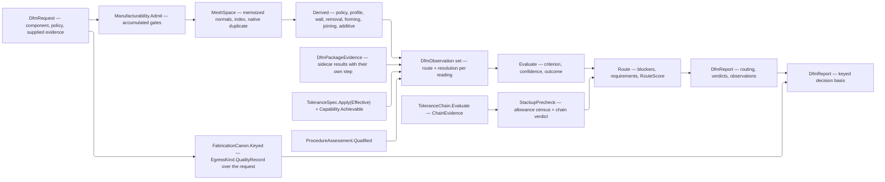

# [RASM_FABRICATION_MANUFACTURABILITY]

`Manufacturability` owns evidence-backed producibility from admitted component geometry and supplied domain observations through parameterized rule evaluation, remediation, process-requirement ranking, assembly precheck, and one settled `DfmReport`. Missing, insufficient-confidence, or incomparable evidence remains an explicit gate state; no absent lane reads as conforming.

`Analyze`, `Offsetting`, and `Spatial` remain geometry-kernel owners and `MeshSpace` the mesh subject every kernel query takes — its memoized normal column, its spatial index, and its native duplicate are the kernel's, so this page holds no mesh scratch of its own. `Capability.Achievable` owns process-history projection through the qualifying row's own `ItGrade` and effective sample size, `ToleranceSpec.Apply(ToleranceRequest.Effective)` owns material-condition departure and virtual condition, `ToleranceChain.Evaluate` owns the stackup algebra this page composes rather than forks, `ProcedureAssessment.Qualified` owns weld-procedure compliance, `ModalityPhysics` owns process physics, and `Kinematics/fleet` owns machine matching. `DfmReport.Routing` crosses the derivation boundary as ranked `ProcessKind` evidence.

A settled assessment addresses under `EgressKind.QualityRecord` over the REQUEST it read — the DfM verdict IS the quality record for a produced component, and `Verify/audit` `Audit.Preflight` is the family's other producer over an additive slice stack. Two arms, one egress family, one keying law: `FabricationCanon.Keyed` frames the admitted request so two assessments of one request are recognized as the same check.

## [01]-[INDEX]

- [02]-[DFM_VOCABULARY]: severity, outcome, feature, and concern rows; the derivation-route census and the resolution algebra that grades every reading; the weighted routing objectives.
- [03]-[EVIDENCE_MODELS]: typed measure and criterion, locus, remedy, rule, observation, route candidate, routing weights, policy, request, and the sidecar package results.
- [04]-[ASSESSMENT]: `Manufacturability.Assess`, the derived-evidence folds over the kernel mesh subject, verdict evaluation, route ranking, the stackup precheck composing `ToleranceChain.Evaluate`, and the `EgressKind.QualityRecord` result the fold settles on.

## [02]-[DFM_VOCABULARY]

- Owner: `DfmSeverity` owns gating and penalty; `DfmOutcome` owns the five evaluation states; `DfmFeature` and `DfmConcern` close the domain vocabulary; `DfmProvenance` owns the derivation-route census and the exactness each route admits; `DfmResolution` owns the confidence algebra; `RouteObjective` owns the weighted routing columns.
- Law: confidence is what a reading's OWN resolution earns, never a constant the route carries. The measure divided by the step it was resolved at is the count of independent resolution elements behind it, one element is no evidence and an exact derivation has no step at all — so a wall resolved at one sample and a wall resolved at a hundred can never report the same trust, and `DfmRule.MinimumConfidence` becomes a demand on resolution rather than a demand on which lane happened to answer.
- Law: a derivation route declares whether it CAN be exact, so a sampled, probed, packaged, or projected reading handing an exact resolution fails admission instead of laundering its own approximation.
- Law: `DfmConcern` carries one row per producibility question with the modality classes it applies to and whether it gates; `DfmVerdict.Gates` defers every consequence to `DfmSeverity`, and `DfmPolicy` admission proves each required concern carries a gating rule — the invariant that no absent lane reads as conforming holds structurally instead of by outcome-kind override.
- Law: `RouteObjective` rows carry their own yield-adjusted measurement and weight selector, EVERY column dividing by its own `RouteWeight` reference so the column reaches the fold dimensionless and comparable, and `RouteScore.Total` is the weighted burden where LOWER is better — the one ranking polarity `MachineMatch.Score` and `CellPlacementCandidate.Score` also carry, so `Worst` names the dominant burden on every surface and a new routing dimension is one row with no scoring expression re-spelled.
- Growth: a concern is one `DfmConcern` seed; a feature is one `DfmFeature` seed; a derivation route is one `DfmProvenance` row declaring its exactness; a routing dimension is one `RouteObjective` row beside its reference column.

```csharp
// --- [IMPORTS] -------------------------------------------------------------------------
using System.Linq;
using Foundation.CSharp.Analyzers.Contracts;
using LanguageExt;
using LanguageExt.Common;
using NodaTime;
using Rasm.Analysis;
using Rasm.Domain;
using Rasm.Fabrication.Geometry2D;
using Rasm.Fabrication.Joining;
using Rasm.Fabrication.Process;
using Rasm.Meshing;
using Rasm.Spatial;
using Rhino.Geometry;
using Thinktecture;
using UnitsNet;
using static LanguageExt.Prelude;

namespace Rasm.Fabrication.Spec;

// --- [VOCABULARY] ----------------------------------------------------------------------
[SmartEnum<string>]
public sealed partial class DfmSeverity {
    public static readonly DfmSeverity Advisory = new("advisory", gate: false, penalty: 1.0);
    public static readonly DfmSeverity Warning = new("warning", gate: false, penalty: 3.0);
    public static readonly DfmSeverity Blocker = new("blocker", gate: true, penalty: 10.0);

    public bool Gate { get; }

    public double Penalty { get; }
}

[SmartEnum<string>]
public sealed partial class DfmOutcome {
    public static readonly DfmOutcome Conforming = new("conforming", gate: false);
    public static readonly DfmOutcome Nonconforming = new("nonconforming", gate: true);
    public static readonly DfmOutcome MissingEvidence = new("missing-evidence", gate: true);
    public static readonly DfmOutcome InsufficientConfidence = new("insufficient-confidence", gate: true);
    public static readonly DfmOutcome IncomparableEvidence = new("incomparable-evidence", gate: true);

    public bool Gate { get; }
}

[SmartEnum<string>]
public sealed partial class DfmFeature {
    public static readonly DfmFeature Part = new("part");
    public static readonly DfmFeature Stock = new("stock");
    public static readonly DfmFeature Envelope = new("envelope");
    public static readonly DfmFeature Surface = new("surface");
    public static readonly DfmFeature Wall = new("wall");
    public static readonly DfmFeature Rib = new("rib");
    public static readonly DfmFeature Boss = new("boss");
    public static readonly DfmFeature Hole = new("hole");
    public static readonly DfmFeature Pocket = new("pocket");
    public static readonly DfmFeature Slot = new("slot");
    public static readonly DfmFeature Thread = new("thread");
    public static readonly DfmFeature Datum = new("datum");
    public static readonly DfmFeature Inspection = new("inspection");
    public static readonly DfmFeature Bend = new("bend");
    public static readonly DfmFeature Flange = new("flange");
    public static readonly DfmFeature Hem = new("hem");
    public static readonly DfmFeature Draw = new("draw");
    public static readonly DfmFeature Joint = new("joint");
    public static readonly DfmFeature Overhang = new("overhang");
    public static readonly DfmFeature Bridge = new("bridge");
    public static readonly DfmFeature EnclosedVolume = new("enclosed-volume");
    public static readonly DfmFeature Lattice = new("lattice");
    public static readonly DfmFeature Support = new("support");
    public static readonly DfmFeature Setup = new("setup");
    public static readonly DfmFeature Assembly = new("assembly");
}

[SmartEnum<string>]
public sealed partial class DfmConcern {
    public static readonly DfmConcern GeometryEvidence = Any("geometry-evidence", required: true);
    public static readonly DfmConcern MaterialEvidence = Any("material-evidence", required: true);
    public static readonly DfmConcern ToleranceCapability = Any("tolerance-capability", required: true);
    public static readonly DfmConcern MinimumFeature = Any("minimum-feature", required: true);
    public static readonly DfmConcern MinimumWall = For("minimum-wall", true, ModalityClass.Removal, ModalityClass.Additive, ModalityClass.Formed);
    public static readonly DfmConcern SolidVolume = Any("solid-volume", required: false);
    public static readonly DfmConcern DatumAccess = Any("datum-access", required: true);
    public static readonly DfmConcern InspectionAccess = Any("inspection-access", required: true);
    public static readonly DfmConcern StandardSize = Any("standard-size", required: false);
    public static readonly DfmConcern StockAllowance = For("stock-allowance", true, ModalityClass.Removal, ModalityClass.Formed);
    public static readonly DfmConcern Envelope = Any("envelope", required: true);
    public static readonly DfmConcern Draft = For("draft", true, ModalityClass.Removal);
    public static readonly DfmConcern Undercut = For("undercut", true, ModalityClass.Removal);
    public static readonly DfmConcern ToolAccess = For("tool-access", true, ModalityClass.Removal);
    public static readonly DfmConcern DepthToDiameter = For("depth-to-diameter", true, ModalityClass.Removal);
    public static readonly DfmConcern InternalCorner = For("internal-corner", true, ModalityClass.Removal);
    public static readonly DfmConcern ThreadReach = For("thread-reach", true, ModalityClass.Removal);
    public static readonly DfmConcern SurfaceFinish = For("surface-finish", true, ModalityClass.Removal, ModalityClass.Additive);
    public static readonly DfmConcern Overhang = For("overhang", true, ModalityClass.Additive);
    public static readonly DfmConcern Bridge = For("bridge", true, ModalityClass.Additive);
    public static readonly DfmConcern TrappedVolume = For("trapped-volume", true, ModalityClass.Additive);
    public static readonly DfmConcern EscapeAccess = For("escape-access", true, ModalityClass.Additive);
    public static readonly DfmConcern SupportRemoval = For("support-removal", true, ModalityClass.Additive);
    public static readonly DfmConcern RecoaterClearance = For("recoater-clearance", true, ModalityClass.Additive);
    public static readonly DfmConcern Anisotropy = For("anisotropy", true, ModalityClass.Additive);
    public static readonly DfmConcern ThermalDistortion = For("thermal-distortion", true, ModalityClass.Additive, ModalityClass.Joined);
    public static readonly DfmConcern Integrity = For("integrity", true, ModalityClass.Additive);
    public static readonly DfmConcern BendRadius = For("bend-radius", true, ModalityClass.Formed);
    public static readonly DfmConcern BendEdgeDistance = For("bend-edge-distance", true, ModalityClass.Formed);
    public static readonly DfmConcern BendHoleDistance = For("bend-hole-distance", true, ModalityClass.Formed);
    public static readonly DfmConcern FlangeLength = For("flange-length", true, ModalityClass.Formed);
    public static readonly DfmConcern HemGap = For("hem-gap", true, ModalityClass.Formed);
    public static readonly DfmConcern DrawRatio = For("draw-ratio", true, ModalityClass.Formed);
    public static readonly DfmConcern GrainDirection = For("grain-direction", true, ModalityClass.Formed);
    public static readonly DfmConcern Tonnage = For("tonnage", true, ModalityClass.Formed);
    public static readonly DfmConcern Springback = For("springback", true, ModalityClass.Formed);
    public static readonly DfmConcern Thinning = For("thinning", true, ModalityClass.Formed);
    public static readonly DfmConcern WeldAccess = For("weld-access", true, ModalityClass.Joined);
    public static readonly DfmConcern RootGap = For("root-gap", true, ModalityClass.Joined);
    public static readonly DfmConcern Throat = For("throat", true, ModalityClass.Joined);
    public static readonly DfmConcern HeatInput = For("heat-input", true, ModalityClass.Joined);
    public static readonly DfmConcern ProcedureQualification = For("procedure-qualification", true, ModalityClass.Joined);
    public static readonly DfmConcern JointInspection = For("joint-inspection", true, ModalityClass.Joined);
    public static readonly DfmConcern AssemblyAccess = For("assembly-access", true, ModalityClass.Joined);
    public static readonly DfmConcern AssemblyStackup = Any("assembly-stackup", required: true);

    public Set<ModalityClass> Classes { get; }
    public bool Required { get; }

    public bool AppliesTo(ModalityClass cls) => Classes.Contains(cls);

    private static DfmConcern Any(string key, bool required) =>
        For(key, required, ModalityClass.Removal, ModalityClass.Additive, ModalityClass.Formed, ModalityClass.Joined);

    private static DfmConcern For(string key, bool required, params ModalityClass[] classes) =>
        new(key, toSet(classes), required);
}

[Union(ConversionFromValue = ConversionOperatorsGeneration.None)]
public abstract partial record DfmResolution : IValidityEvidence {
    private DfmResolution() { }

    public sealed record Exact : DfmResolution;

    public sealed record Discretized(double Measured, double Step) : DfmResolution;

    public static DfmResolution Counted(int elements) => new Discretized(elements, 1.0);

    public static DfmResolution Of(double measured, double step) => new Discretized(measured, step);

    public double Confidence => Switch(
        exact: static _ => 1.0,
        discretized: static row => 1.0 - (1.0 / double.Max(1.0, Math.Abs(row.Measured) / row.Step)));

    public bool IsValid => Switch(
        exact: static _ => true,
        discretized: static row => ValidityClaim.All(
            ValidityClaim.Positive(row.Step),
            ValidityClaim.Positive(Math.Abs(row.Measured))));
}

[SmartEnum<string>]
public sealed partial class DfmProvenance {
    public static readonly DfmProvenance Analytic = Closed("analytic");
    public static readonly DfmProvenance Policy = Closed("policy");
    public static readonly DfmProvenance Qualification = Closed("qualification");
    public static readonly DfmProvenance Package = Stepped("package");
    public static readonly DfmProvenance History = Stepped("capability-history");
    public static readonly DfmProvenance Sampled = Stepped("sampled");
    public static readonly DfmProvenance Probed = Stepped("probed");

    private static DfmProvenance Closed(string key) =>
        new(key, static resolution => resolution is DfmResolution.Exact { IsValid: true });
    private static DfmProvenance Stepped(string key) =>
        new(key, static resolution => resolution is DfmResolution.Discretized { IsValid: true });

    [UseDelegateFromConstructor]
    public partial bool Admits(DfmResolution resolution);
}

public readonly record struct DfmEvidenceKey(DfmProvenance Route, DfmConcern Concern, Option<ProcessKind> Process) {
    public string Locus => Process.Match(
        Some: process => $"{Route.Key}:{Concern.Key}:{process.Key}",
        None: () => $"{Route.Key}:{Concern.Key}");
}

[SmartEnum<string>]
public sealed partial class RouteObjective {
    public static readonly RouteObjective Quality = new("quality",
        static (weight, candidate, lane) => lane.Fold(0.0, static (sum, verdict) => sum
                + (verdict.Outcome == DfmOutcome.Conforming ? 0.0 : verdict.Rule.Severity.Penalty * verdict.Rule.Weight))
            / (weight.QualityReference * candidate.YieldRate),
        static weight => weight.Quality);
    public static readonly RouteObjective Time = new("time",
        static (weight, candidate, _) => candidate.CycleTime.Seconds / (weight.TimeReference.Seconds * candidate.YieldRate),
        static weight => weight.Time);
    public static readonly RouteObjective Waste = new("waste",
        static (weight, candidate, _) => candidate.Waste.Kilograms / (weight.WasteReference.Kilograms * candidate.YieldRate),
        static weight => weight.Waste);
    public static readonly RouteObjective Energy = new("energy",
        static (weight, candidate, _) => candidate.Energy.Joules / (weight.EnergyReference.Joules * candidate.YieldRate),
        static weight => weight.Energy);
    public static readonly RouteObjective Risk = new("risk",
        static (weight, candidate, _) => candidate.Risk / (weight.RiskReference * candidate.YieldRate),
        static weight => weight.Risk);

    public Func<RouteWeight, RouteCandidate, Seq<DfmVerdict>, double> Measure { get; }
    public Func<RouteWeight, double> Weight { get; }
}
```

## [03]-[EVIDENCE_MODELS]

- Owner: `DfmMeasure` and `DfmCriterion` close typed comparison; `DfmLocus` closes the addressing family; `DfmRemedy` closes remediation; `DfmRule` parameterizes applicability, evidence obligation, minimum confidence, severity, and remedy; `DfmObservation` preserves one measured reading with its route and resolution; `RouteCandidate` carries one process alternative; `RouteWeight` carries the routing references; `DfmPolicy`, `DfmRequest`, and `DfmPackageEvidence` carry the admitted request.
- Cases: removal covers access, draft, undercut, feature depth, corner radius, thread, finish, stock, datum, and inspection constraints; additive covers feature size, wall, overhang, bridge, enclosed volume, escape, support removal, recoater, anisotropy, thermal, and integrity constraints; forming covers bend radius, edge and hole distance, flange, hem, draw, grain, tonnage, springback, and thinning constraints; joining covers access, root gap, throat, heat input, distortion, qualification, inspection, and assembly constraints.
- Law: `DfmLocus` addresses a POINT, an EDGE, a FACE, a BOUNDED REGION, a keyed feature, a datum, a layer, a joint, a setup, a process, or the whole part — a second bounded case distinguished only by the word volume carried the same payload under a second name and is the deleted form.
- Law: resting faces and drafted faces read ONE normal roster and partition it — the resting test is strictly downward so a vertical wall stays in the drafted census, and the draft demand measures the COMPLEMENT of the excluded set rather than the excluded set itself.
- Law: `RouteCandidate` admission UNITIZES its approach directions, so every consumer reads a unit direction by construction and no probe re-derives one or guards a sentinel the derivation could return.
- Law: a sidecar package result states the RESOLUTION it measured at — a voxel edge, a cutter-contact step — so the confidence its observations earn is the sidecar's own discretization rather than a constant this page assigns to the word package.
- Auto: `DfmPolicy` proves every required concern has a generic or process-specific gating rule and every rule reaches at least one candidate; `DfmCriterion.Evaluate` compares unit-bearing, count, ratio, and flag measures; `RouteCandidate.Encloses` derives the `DfmConcern.Envelope` verdict from the candidate's own work volume, so a mesh-only part is never blocked for want of supplied operating envelope evidence.
- Packages: `Loop.Apply` composes CavalierContours arc-native measurement and sampling; `PolygonAlgebra.Apply` composes Clipper2 topology; `DfmPackageEvidence.Cutter` carries OpenCAMLib cutter-contact evidence against canonical `ToolEvidence`; `DfmPackageEvidence.Voxel` carries PicoGK morphology, membership, ray, and solid-property evidence; UnitsNet owns every physical comparison; Thinktecture and LanguageExt own generated values and the accumulated `Validation`.
- Growth: a policy variation is one `DfmRule` row; a process candidate is one `RouteCandidate` row; a sidecar family is one `DfmPackageEvidence` case carrying its own resolution column.
- Boundary: sidecar OpenCAMLib and PicoGK owners lower native handles into `DfmPackageEvidence` before this host-local owner consumes them; every owner refuses onto `FabricationFault` under `FabConcern.Spec`.

```csharp
// --- [MEASUREMENT] ---------------------------------------------------------------------
[Union(ConversionFromValue = ConversionOperatorsGeneration.None)]
public abstract partial record DfmMeasure : IValidityEvidence {
    private DfmMeasure() { }

    public sealed record Quantity(IQuantity Value) : DfmMeasure;
    public sealed record Ratio(double Value) : DfmMeasure;
    public sealed record Count(int Value) : DfmMeasure;
    public sealed record Flag(bool Value) : DfmMeasure;

    public bool IsValid => Switch(
        quantity: static quantity => ValidityClaim.Finite(quantity.Value),
        ratio: static ratio => ValidityClaim.Finite(ratio.Value),
        count: static count => ValidityClaim.CountAtLeast(count.Value, 0),
        flag: static _ => true);

    public double Magnitude => Switch(
        quantity: static quantity => Math.Abs((double)quantity.Value.Value),
        ratio: static ratio => Math.Abs(ratio.Value),
        count: static count => count.Value,
        flag: static _ => 1.0);
}

[Union(ConversionFromValue = ConversionOperatorsGeneration.None)]
public abstract partial record DfmCriterion : IValidityEvidence {
    private DfmCriterion() { }

    public sealed record Minimum(DfmMeasure Bound) : DfmCriterion;
    public sealed record Maximum(DfmMeasure Bound) : DfmCriterion;
    public sealed record Band(DfmMeasure Lower, DfmMeasure Upper) : DfmCriterion;
    public sealed record Required() : DfmCriterion;
    public sealed record Forbidden() : DfmCriterion;

    public bool IsValid => Switch(
        minimum: static criterion => criterion.Bound.IsValid,
        maximum: static criterion => criterion.Bound.IsValid,
        band: static criterion => ValidityClaim.All(
            criterion.Lower.IsValid,
            criterion.Upper.IsValid,
            Compare(criterion.Lower, criterion.Upper).Exists(static order => order <= 0)),
        required: static _ => true,
        forbidden: static _ => true);

    public Option<bool> Evaluate(DfmMeasure measured) =>
        Switch(
            state: measured,
            minimum: static (value, criterion) => Compare(value, criterion.Bound).Map(order => order >= 0),
            maximum: static (value, criterion) => Compare(value, criterion.Bound).Map(order => order <= 0),
            band: static (value, criterion) =>
                from lower in Compare(value, criterion.Lower)
                from upper in Compare(value, criterion.Upper)
                select lower >= 0 && upper <= 0,
            required: static (value, _) => value is DfmMeasure.Flag flag ? Some(flag.Value) : None,
            forbidden: static (value, _) => value is DfmMeasure.Flag flag ? Some(!flag.Value) : None);

    private static Option<int> Compare(DfmMeasure left, DfmMeasure right) =>
        (left, right) switch {
            (DfmMeasure.Quantity a, DfmMeasure.Quantity b)
                when a.Value.QuantityInfo.Name == b.Value.QuantityInfo.Name
                && a.Value.QuantityInfo.BaseDimensions == b.Value.QuantityInfo.BaseDimensions =>
                Some(a.Value.As(UnitSystem.SI).CompareTo(b.Value.As(UnitSystem.SI))),
            (DfmMeasure.Ratio a, DfmMeasure.Ratio b) => Some(a.Value.CompareTo(b.Value)),
            (DfmMeasure.Count a, DfmMeasure.Count b) => Some(a.Value.CompareTo(b.Value)),
            (DfmMeasure.Flag a, DfmMeasure.Flag b) => Some(a.Value.CompareTo(b.Value)),
            _ => None,
        };
}

[Union(ConversionFromValue = ConversionOperatorsGeneration.None)]
public abstract partial record DfmLocus : IValidityEvidence {
    private DfmLocus() { }

    public sealed record AtPoint(Point3d Point) : DfmLocus;
    public sealed record AtEdge(Edge3 Edge) : DfmLocus;
    public sealed record AtFace(int Face) : DfmLocus;
    public sealed record AtBounds(BoundingBox Bounds) : DfmLocus;
    public sealed record AtFeature(DfmFeature Feature, UInt128 Key) : DfmLocus;
    public sealed record AtDatum(UInt128 Key) : DfmLocus;
    public sealed record AtLayer(int Layer) : DfmLocus;
    public sealed record AtJoint(int Joint) : DfmLocus;
    public sealed record AtSetup(int Setup) : DfmLocus;
    public sealed record AtProcess(ProcessKind Process) : DfmLocus;
    public sealed record Global() : DfmLocus;

    public bool IsValid => Switch(
        atPoint: static locus => ValidityClaim.Finite(locus.Point),
        atEdge: static locus => ValidityClaim.All(
            ValidityClaim.Finite(locus.Edge.A),
            ValidityClaim.Finite(locus.Edge.B),
            ValidityClaim.Positive(locus.Edge.A.DistanceTo(locus.Edge.B))),
        atFace: static locus => ValidityClaim.CountAtLeast(locus.Face, 0),
        atBounds: static locus => locus.Bounds.IsValid,
        atFeature: static locus => locus.Key != 0,
        atDatum: static locus => locus.Key != 0,
        atLayer: static locus => ValidityClaim.CountAtLeast(locus.Layer, 0),
        atJoint: static locus => ValidityClaim.CountAtLeast(locus.Joint, 0),
        atSetup: static locus => ValidityClaim.CountAtLeast(locus.Setup, 0),
        atProcess: static _ => true,
        global: static _ => true);
}

[Union(ConversionFromValue = ConversionOperatorsGeneration.None)]
public abstract partial record DfmRemedy : IValidityEvidence {
    private DfmRemedy() { }

    public sealed record Adjust(DfmFeature Feature, DfmCriterion Target) : DfmRemedy;
    public sealed record Reorient(Vector3d Direction) : DfmRemedy;
    public sealed record ChangeProcess(Set<ProcessKind> Candidates) : DfmRemedy;
    public sealed record Split(DfmLocus Locus) : DfmRemedy;
    public sealed record AddAccess(DfmFeature Feature) : DfmRemedy;
    public sealed record Qualify(DfmConcern Concern) : DfmRemedy;
    public sealed record Review(DfmConcern Concern) : DfmRemedy;

    public bool IsValid => Switch(
        adjust: static remedy => remedy.Target.IsValid,
        reorient: static remedy => ValidityClaim.Direction(remedy.Direction),
        changeProcess: static remedy => ValidityClaim.CountAtLeast(remedy.Candidates.Count, 1),
        split: static remedy => remedy.Locus.IsValid,
        addAccess: static _ => true,
        qualify: static _ => true,
        review: static _ => true);
}

// --- [MODELS] --------------------------------------------------------------------------
[ComplexValueObject]
public sealed partial class DfmRule {
    public DfmConcern Concern { get; }
    public Set<DfmFeature> Features { get; }
    public Set<ModalityClass> Classes { get; }
    public DfmCriterion Criterion { get; }
    public DfmSeverity Severity { get; }
    public Option<ProcessKind> Process { get; }
    public DfmRemedy Remedy { get; }
    public double Weight { get; }

    public double MinimumConfidence { get; }

    public bool EvidenceRequired { get; }

    public bool AppliesTo(RouteCandidate candidate) =>
        Classes.Contains(candidate.Process.Modality.Class)
        && Process.ForAll(selected => selected == candidate.Process)
        && Features.Exists(candidate.Features.Contains);

    static partial void ValidateFactoryArguments(
        ref ValidationError? validationError,
        ref DfmConcern concern,
        ref Set<DfmFeature> features,
        ref Set<ModalityClass> classes,
        ref DfmCriterion criterion,
        ref DfmSeverity severity,
        ref Option<ProcessKind> process,
        ref DfmRemedy remedy,
        ref double weight,
        ref double minimumConfidence,
        ref bool evidenceRequired) {
        if (!ValidityClaim.All(
            criterion.IsValid,
            remedy.IsValid,
            ValidityClaim.CountAtLeast(features.Count, 1),
            ValidityClaim.CountAtLeast(classes.Count, 1),
            classes.ForAll(concern.Classes.Contains),
            process.ForAll(candidate => classes.Contains(candidate.Modality.Class)),
            ValidityClaim.Positive(weight),
            ValidityClaim.UnitInterval(minimumConfidence)))
            validationError = Manufacturability.Validation("rule");
    }
}

[ComplexValueObject]
public sealed partial class DfmObservation {
    public DfmConcern Concern { get; }
    public DfmFeature Feature { get; }
    public DfmMeasure Measure { get; }
    public Option<DfmCriterion> Criterion { get; }
    public DfmLocus Locus { get; }
    public Option<ProcessKind> Process { get; }
    public DfmProvenance Provenance { get; }
    public DfmResolution Resolution { get; }
    public Instant At { get; }

    public DfmEvidenceKey Evidence => new(Provenance, Concern, Process);
    public double Confidence => Resolution.Confidence;

    static partial void ValidateFactoryArguments(
        ref ValidationError? validationError,
        ref DfmConcern concern,
        ref DfmFeature feature,
        ref DfmMeasure measure,
        ref Option<DfmCriterion> criterion,
        ref DfmLocus locus,
        ref Option<ProcessKind> process,
        ref DfmProvenance provenance,
        ref DfmResolution resolution,
        ref Instant at) {
        if (!ValidityClaim.All(
            measure.IsValid,
            locus.IsValid,
            ValidityClaim.Evidence(criterion),
            provenance.Admits(resolution),
            at != default))
            validationError = Manufacturability.Validation("observation");
    }
}

[ComplexValueObject]
public sealed partial class RouteWeight {
    public double Quality { get; }
    public double Time { get; }
    public double Waste { get; }
    public double Energy { get; }
    public double Risk { get; }
    public double QualityReference { get; }
    public Duration TimeReference { get; }
    public Mass WasteReference { get; }
    public Energy EnergyReference { get; }

    public double RiskReference { get; }

    static partial void ValidateFactoryArguments(
        ref ValidationError? validationError,
        ref double quality,
        ref double time,
        ref double waste,
        ref double energy,
        ref double risk,
        ref double qualityReference,
        ref Duration timeReference,
        ref Mass wasteReference,
        ref Energy energyReference,
        ref double riskReference) {
        Seq<double> weights = Seq(quality, time, waste, energy, risk);
        if (!ValidityClaim.All(
            weights.ForAll(static value => ValidityClaim.Nonnegative(value)),
            ValidityClaim.Positive(weights.Fold(0.0, static (sum, value) => sum + value)),
            ValidityClaim.Positive(qualityReference),
            ValidityClaim.Positive(timeReference.Seconds),
            ValidityClaim.Positive(wasteReference.Kilograms),
            ValidityClaim.Positive(energyReference.Joules),
            ValidityClaim.UnitInterval(riskReference),
            ValidityClaim.Positive(riskReference)))
            validationError = Manufacturability.Validation("route-weight");
    }
}

[ComplexValueObject]
public sealed partial class RouteCandidate {
    public ProcessKind Process { get; }
    public ModalityPhysics Physics { get; }
    public CapabilityIdentity Capability { get; }
    public bool MaterialCompatible { get; }
    public Set<DfmFeature> Features { get; }

    public Arr<Vector3d> Approaches { get; }

    public BoundingBox WorkEnvelope { get; }
    public Mass MassCapacity { get; }
    public Duration CycleTime { get; }
    public Mass Waste { get; }
    public Energy Energy { get; }
    public double Risk { get; }
    public double YieldRate { get; }

    public bool Encloses(BoundingBox part) =>
        part.IsValid && WorkEnvelope.Contains(part.Min) && WorkEnvelope.Contains(part.Max);

    static partial void ValidateFactoryArguments(
        ref ValidationError? validationError,
        ref ProcessKind process,
        ref ModalityPhysics physics,
        ref CapabilityIdentity capability,
        ref bool materialCompatible,
        ref Set<DfmFeature> features,
        ref Arr<Vector3d> approaches,
        ref BoundingBox workEnvelope,
        ref Mass massCapacity,
        ref Duration cycleTime,
        ref Mass waste,
        ref Energy energy,
        ref double risk,
        ref double yieldRate) {
        bool directed = approaches.ForAll(static vector => ValidityClaim.Direction(vector));
        if (directed)
            approaches = approaches.Map(static vector => vector / vector.Length);
        bool congruent = physics.Switch(
            state: process.Physics,
            subtractive: static (kind, _) => kind == PhysicsKind.Subtractive,
            thermal: static (kind, _) => kind == PhysicsKind.Thermal,
            abrasive: static (kind, _) => kind == PhysicsKind.Abrasive,
            fff: static (kind, _) => kind == PhysicsKind.Fff,
            deposition: static (kind, _) => kind == PhysicsKind.Deposition,
            joining: static (kind, _) => kind == PhysicsKind.Joining,
            erosion: static (kind, _) => kind == PhysicsKind.Erosion,
            resin: static (kind, _) => kind == PhysicsKind.Resin,
            powder: static (kind, _) => kind == PhysicsKind.Powder,
            forming: static (kind, _) => kind == PhysicsKind.Forming);
        if (!ValidityClaim.All(
            congruent,
            capability.Process == process,
            ValidityClaim.CountAtLeast(features.Count, 1),
            ValidityClaim.CountAtLeast(approaches.Count, 1),
            directed,
            workEnvelope.IsValid,
            ValidityClaim.Positive(workEnvelope.Volume),
            ValidityClaim.Positive(massCapacity.Kilograms),
            ValidityClaim.Nonnegative(cycleTime.Seconds),
            ValidityClaim.Nonnegative(waste.Kilograms),
            ValidityClaim.Nonnegative(energy.Joules),
            ValidityClaim.UnitInterval(risk),
            ValidityClaim.UnitInterval(yieldRate),
            ValidityClaim.Positive(yieldRate)))
            validationError = Manufacturability.Validation("route-candidate");
    }
}

[ComplexValueObject]
public sealed partial class ToleranceDemand {
    public FeatureControl Frame { get; }
    public CapabilityIdentity Capability { get; }
    public Length Departure { get; }
    public DfmLocus Locus { get; }

    static partial void ValidateFactoryArguments(
        ref ValidationError? validationError,
        ref FeatureControl frame,
        ref CapabilityIdentity capability,
        ref Length departure,
        ref DfmLocus locus) {
        if (!ValidityClaim.All(ValidityClaim.Nonnegative(departure.Millimeters), locus.IsValid))
            validationError = Manufacturability.Validation("tolerance-demand");
    }
}

[ComplexValueObject]
public sealed partial class AssemblyAllowance {
    public string Term { get; }
    public DfmLocus Locus { get; }
    public Length Negative { get; }
    public Length Positive { get; }

    static partial void ValidateFactoryArguments(
        ref ValidationError? validationError,
        ref string term,
        ref DfmLocus locus,
        ref Length negative,
        ref Length positive) {
        term = term.Trim();
        if (!ValidityClaim.All(
            Witness.Keyed(term),
            locus.IsValid,
            ValidityClaim.Ordered(negative.Millimeters, 0.0),
            ValidityClaim.Ordered(0.0, positive.Millimeters)))
            validationError = Manufacturability.Validation("assembly-allowance");
    }
}

[ComplexValueObject]
public sealed partial class DfmPolicy {
    public Seq<DfmRule> Rules { get; }
    public Seq<RouteCandidate> Candidates { get; }
    public RouteWeight RouteWeight { get; }
    public Length ProbeReach { get; }

    public Length ArcTolerance { get; }

    public Option<ToleranceChain> AssemblyChain { get; }
    public Instant At { get; }

    static partial void ValidateFactoryArguments(
        ref ValidationError? validationError,
        ref Seq<DfmRule> rules,
        ref Seq<RouteCandidate> candidates,
        ref RouteWeight routeWeight,
        ref Length probeReach,
        ref Length arcTolerance,
        ref Option<ToleranceChain> assemblyChain,
        ref Instant at) {
        bool rulesReachable = rules.ForAll(rule => rule.Classes.ForAll(cls =>
            candidates.Exists(row => row.Process.Modality.Class == cls && rule.AppliesTo(row))));
        bool requiredCovered = candidates.ForAll(row => toSeq(DfmConcern.Items)
            .Filter(concern => concern.Required && concern.AppliesTo(row.Process.Modality.Class))
            .ForAll(concern => rules.Exists(rule => rule.Concern == concern && rule.Severity.Gate && rule.AppliesTo(row))));
        if (!ValidityClaim.All(
            ValidityClaim.CountAtLeast(rules.Count, 1),
            ValidityClaim.CountAtLeast(candidates.Count, 1),
            ValidityClaim.Positive(probeReach.Millimeters),
            ValidityClaim.Positive(arcTolerance.Millimeters),
            at != default,
            ValidityClaim.CountExactly(candidates.Map(static row => row.Process).Distinct().Count, candidates.Count),
            rulesReachable,
            requiredCovered))
            validationError = Manufacturability.Validation("policy");
    }
}

[ComplexValueObject]
public sealed partial class DfmRequest {
    public AdmittedComponent Component { get; }
    public DfmPolicy Policy { get; }
    public Seq<DfmObservation> Observations { get; }
    public Seq<DfmPackageEvidence> PackageEvidence { get; }
    public Seq<ToleranceDemand> Tolerances { get; }
    public Seq<CapabilityHistory> CapabilityHistory { get; }
    public Seq<ProcedureAssessment> Procedures { get; }
    public Seq<AssemblyAllowance> Allowances { get; }

    static partial void ValidateFactoryArguments(
        ref ValidationError? validationError,
        ref AdmittedComponent component,
        ref DfmPolicy policy,
        ref Seq<DfmObservation> observations,
        ref Seq<DfmPackageEvidence> packageEvidence,
        ref Seq<ToleranceDemand> tolerances,
        ref Seq<CapabilityHistory> capabilityHistory,
        ref Seq<ProcedureAssessment> procedures,
        ref Seq<AssemblyAllowance> allowances) {
        if (packageEvidence.Exists(static row => !row.IsValid))
            validationError = Manufacturability.Validation("request");
    }
}

[Union(ConversionFromValue = ConversionOperatorsGeneration.None)]
public abstract partial record DfmPackageEvidence : IValidityEvidence {
    private DfmPackageEvidence() { }

    public sealed record Cutter(
        ProcessKind Process,
        ToolEvidence Tool,
        DfmLocus Locus,
        Length CutterDiameter,
        Length CornerRadius,
        Length CuttingLength,
        Length RequiredReach,
        bool ContactFree,
        Length Resolution,
        Instant At) : DfmPackageEvidence;

    public sealed record Voxel(
        Length MinimumWall,
        Length MinimumGap,
        int TrappedVolumes,
        bool EscapeReachable,
        bool SupportRemovable,
        Volume SolidVolume,
        BoundingBox Bounds,
        Length Resolution,
        Instant At) : DfmPackageEvidence;

    public Length Step => Switch(
        cutter: static result => result.Resolution,
        voxel: static result => result.Resolution);

    public Instant At => Switch(
        cutter: static result => result.At,
        voxel: static result => result.At);

    public bool IsValid => Switch(
        cutter: static result => ValidityClaim.All(
            result.Locus.IsValid,
            ValidityClaim.Positive(result.CutterDiameter.Millimeters),
            ValidityClaim.Nonnegative(result.CornerRadius.Millimeters),
            ValidityClaim.Positive(result.CuttingLength.Millimeters),
            ValidityClaim.Nonnegative(result.RequiredReach.Millimeters),
            ValidityClaim.Positive(result.Resolution.Millimeters),
            result.At != default),
        voxel: static result => ValidityClaim.All(
            ValidityClaim.Nonnegative(result.MinimumWall.Millimeters),
            ValidityClaim.Nonnegative(result.MinimumGap.Millimeters),
            ValidityClaim.CountAtLeast(result.TrappedVolumes, 0),
            ValidityClaim.Positive(result.SolidVolume.As(VolumeUnit.CubicMillimeter)),
            result.Bounds.IsValid,
            ValidityClaim.Positive(result.Resolution.Millimeters),
            result.At != default));
}
```

## [04]-[ASSESSMENT]

- Owner: `Manufacturability.Assess` owns the cross-modality fold; `DfmVerdict` owns one rule-against-evidence decision; `RoutingRow` and `RouteScore` own ranking; `StackupPrecheck` owns the assembly-allowance verdict; `DfmReport` owns the settled decision basis.
- Law: the stackup precheck composes `ToleranceChain.Evaluate` — the chain's own method, its ranked contributions, and its bound verdict — and adds only what this page owns: whether the supplied allowances cover the chain's terms and whether their accumulated interval clears the same bound. Conformance reads `ChainEvidence.Conforming` and ranking reads its contributions — a local worst-case fold here would be a third stackup algebra disagreeing with the two that already answer.
- Law: mesh-derived evidence holds NO scratch of its own. `MeshSpace` memoizes the unit-normal column, the spatial index, and the native duplicate on the snapshot itself, so the draft, resting, overhang, access, joint, and integrity lanes each read the kernel subject directly and a folder-local record re-carrying those four columns is a second cache the kernel already owns — its only remaining products were a partition and a face-box walk, and the partition is one filter over the kernel column.
- Law: resting faces derive from the SAME normal rows the draft census reads, so the excluded set and the measured set share one index space — a face selection recovered from a second decomposition indexes a different topology and silently excludes the wrong faces.
- Law: every gate refusal carries its OWN discriminant. The kernel `InvalidInput`/`InvalidResult` mints take no detail slot, so gates lowering onto them are refusals a caller cannot tell apart; each answers on the fabrication band under a declared locus.
- Law: validity is the KERNEL's vocabulary. Every union on this page implements `IValidityEvidence` and spells its fold as `ValidityClaim.All(...)` over the claim rows the kernel states once — `Finite`, `Positive`, `Nonnegative`, `UnitInterval`, `Ordered`, `CountAtLeast`, `Direction`, `WhenPresent` — so a predicate is never re-derived here and the acceptance oracle reaches each carrier with no oracle edit.
- Law: a degenerate profile, an unresolvable medial axis, or absent history contributes no observation rather than failing the report, so producibility gaps stay report rows and only kernel faults leave the error channel.
- Law: the settled result addresses the request, never its own conclusions. `FabricationCanon.Keyed(EgressKind.QualityRecord, …)` frames the admitted component key, every policy column a verdict turns on, and every supplied evidence row, quantized at the policy's own arc tolerance — the step every sampled reading already grades against — so two assessments of one request mint one key and a re-run under a changed rule mints another. `DfmReport.Producible` answers conformance directly.
- Exemption: `Manufacturability.CornerEvidence` and `Manufacturability.ToPolyline` are statement kernels — one index walk and one sampling loop; every other body on this cluster is expression-shaped.
- Entry: `Manufacturability.Assess(DfmRequest)` is the sole cross-modality fold. Geometry, capability, supplied evidence, and assembly allowances join applicatively; kernel failures remain typed `Fin` failures, while producibility failures remain report rows.
- Result: `DfmVerdict` preserves process, confidence outcome, observation, criterion, locus, and remedy; `RoutingRow` preserves blockers, requirements, and the `RouteScore` column set whose `Worst` names the dominant burden; `StackupPrecheck` preserves the settled chain result beside the allowance census; `DfmReport` preserves the request key and full decision basis.
- Packages: `Process/owner` (`FabricationCanon.Keyed`, `EgressKind.QualityRecord`, `ContentKey`); `Rasm.Domain` (`IValidityEvidence`, `ValidityClaim`, `Op`); `Rasm.Meshing` (`MeshSpace.FaceNormals`, `.Index`, `.DuplicateNative`); `Rasm.Spatial`; `Rasm.Analysis`; LanguageExt.Core for the accumulated `Validation`.
- Boundary: routing ranks process requirements and evidence, while fleet matching, tool selection, support generation, unfolding, joining sequence, correlated stackup simulation, rendering, and persistence remain downstream owners.

```csharp
public sealed record DfmVerdict(
    ProcessKind Process,
    DfmRule Rule,
    DfmOutcome Outcome,
    Option<DfmObservation> Observation,
    DfmCriterion Criterion,
    DfmLocus Locus,
    DfmRemedy Remedy) {
    public bool Gates => Outcome.Gate && Rule.Severity.Gate;
}

public sealed record ProcessRequirement(DfmConcern Concern, DfmFeature Feature, DfmCriterion Criterion, DfmLocus Locus);

public sealed record RouteColumn(RouteObjective Objective, double Normalized, double Weight) {
    public double Weighted => Normalized * Weight;
}

public sealed record RouteScore(Seq<RouteColumn> Columns) {
    public double Total => Columns.Fold(0.0, static (sum, column) => sum + column.Weighted);
    public Option<RouteColumn> Worst => Columns.Fold(Option<RouteColumn>.None,
        static (best, column) => best.Filter(held => held.Weighted >= column.Weighted).IfNone(column));
}

public sealed record RoutingRow(
    ProcessKind Process,
    bool Viable,
    Seq<DfmConcern> Blockers,
    Seq<ProcessRequirement> Requirements,
    RouteScore Score);

public sealed record StackupPrecheck(
    ChainEvidence Chain,
    Length Negative,
    Length Positive,
    int RequiredAllowances,
    int ObservedAllowances,
    Seq<string> MissingTerms,
    Seq<string> UnexpectedTerms) {
    public bool Complete => MissingTerms.IsEmpty && UnexpectedTerms.IsEmpty
        && ObservedAllowances == RequiredAllowances;

    public bool Pass => Complete && Chain.Conforming
        && double.Max(Math.Abs(Negative.Millimeters), Math.Abs(Positive.Millimeters)) <= Chain.BoundMm;

    public Option<(string Term, double Share)> Dominant => Chain.Dominant;
}

public sealed record DfmReport(
    ContentKey Key,
    UInt128 ComponentKey,
    Seq<DfmObservation> Observations,
    Seq<DfmVerdict> Verdicts,
    Seq<RoutingRow> Rows,
    Option<StackupPrecheck> Stackup) {
    public Seq<ProcessKind> Routing => toSeq(Rows.Filter(static row => row.Viable)
        .OrderBy(static row => row.Score.Total).Select(static row => row.Process));
    public bool Feasible(ModalityClass cls) => Rows.Exists(row => row.Process.Modality.Class == cls && row.Viable);

    public bool Producible => Rows.Exists(static row => row.Viable);
}

// --- [OPERATIONS] ----------------------------------------------------------------------
public static class Manufacturability {
    internal static readonly Op DfmOp = Op.Of(name: "fabrication:manufacturability");

    internal static ValidationError Validation(string locus) => new($"manufacturability:{locus}");

    internal static FabricationFault Refusal(string locus) =>
        FabricationFault.Inadmissible(FabConcern.Spec, $"manufacturability:{locus}");

    private static readonly Error ObservationAfterAssessment = Refusal("observation-after-assessment");
    private static readonly Error ObservationOffRoster = Refusal("observation-off-roster");
    private static readonly Error PackageEvidenceUnmatched = Refusal("package-evidence-unmatched");
    private static readonly Error ToleranceIdentityUnmatched = Refusal("tolerance-identity-unmatched");
    private static readonly Error ProcedureAfterAssessment = Refusal("procedure-after-assessment");
    private static readonly Error ProcedureOffRoster = Refusal("procedure-off-roster");
    private static readonly Error AllowanceWithoutChain = Refusal("allowance-without-chain");
    private static readonly Error AllowanceInterval = Refusal("allowance-interval");
    private static readonly Error MeshBounds = Refusal("mesh-bounds");
    private static readonly Error MeshDefects = Refusal("mesh-defects");
    private static readonly Error ProfileSample = Refusal("profile-sample");
    private static readonly Error ProbeRay = Refusal("probe-ray");
    private static readonly Error DegenerateApproach = Refusal("degenerate-approach");
    private static readonly Error DegenerateJoint = Refusal("degenerate-joint");

    public static Fin<DfmReport> Assess(DfmRequest request) =>
        from _ in Admit(request)
        from evidence in (Accumulate(Derived(request, request.Component.Mesh)),
                Accumulate(PackageEvidence(request.PackageEvidence)),
                Accumulate(ToleranceEvidence(request)),
                Accumulate(ProcedureEvidence(request)))
            .Apply((derived, package, tolerance, procedure) =>
                request.Observations + derived + package + tolerance + procedure)
            .As()
            .ToFin()
        let verdicts = Evaluate(request.Policy.Rules, request.Policy.Candidates, evidence, request.Policy.At)
        let stackup = Precheck(request.Policy.AssemblyChain, request.Allowances, request.Policy.At)
        let rows = Route(request.Component, request.Policy, verdicts, stackup)
        from key in FabricationCanon.Keyed(
            EgressKind.QualityRecord, request.Policy.ArcTolerance.Millimeters,
            writer => Request(writer, request), DfmOp)
        select new DfmReport(
            key,
            request.Component.RepresentationKey,
            evidence,
            verdicts,
            rows,
            stackup);

    private static CanonicalWriter Request(CanonicalWriter writer, DfmRequest request) => writer
        .U128(request.Component.RepresentationKey)
        .Double(request.Policy.ProbeReach.Millimeters).Double(request.Policy.ArcTolerance.Millimeters)
        .Double(request.Policy.RouteWeight.Quality).Double(request.Policy.RouteWeight.Time)
        .Double(request.Policy.RouteWeight.Waste).Double(request.Policy.RouteWeight.Energy)
        .Double(request.Policy.RouteWeight.Risk)
        .Double(request.Policy.RouteWeight.QualityReference).Double(request.Policy.RouteWeight.TimeReference.Seconds)
        .Double(request.Policy.RouteWeight.WasteReference.Kilograms).Double(request.Policy.RouteWeight.EnergyReference.Joules)
        .Double(request.Policy.RouteWeight.RiskReference)
        .Rows(request.Policy.Rules, static (row, rule) => row
            .Discriminant(rule.Concern).Discriminant(rule.Severity)
            .Rows(Ordered(rule.Features), static (cell, feature) => cell.Discriminant(feature))
            .Rows(Ordered(rule.Classes), static (cell, cls) => cell.Discriminant(cls))
            .Maybe(rule.Process, static (cell, process) => cell.Discriminant(process))
            .Double(rule.Weight).Double(rule.MinimumConfidence).Bool(rule.EvidenceRequired))
        .Rows(request.Policy.Candidates, static (row, candidate) => row
            .Discriminant(candidate.Process).Bool(candidate.MaterialCompatible)
            .Rows(Ordered(candidate.Features), static (cell, feature) => cell.Discriminant(feature))
            .Rows(toSeq(candidate.Approaches), static (cell, approach) => cell.Coords(approach))
            .Coords(candidate.WorkEnvelope.Min).Coords(candidate.WorkEnvelope.Max)
            .Double(candidate.MassCapacity.Kilograms).Double(candidate.CycleTime.Seconds)
            .Double(candidate.Waste.Kilograms).Double(candidate.Energy.Joules)
            .Double(candidate.Risk).Double(candidate.YieldRate))
        .Maybe(request.Policy.AssemblyChain, static (row, chain) => row
            .Discriminant(chain.Method).Double(chain.BoundMm)
            .Rows(toSeq(chain.Terms), static (cell, term) => cell
                .String(term.Key).Double(term.DeviationLowerMm).Double(term.DeviationUpperMm)
                .Double(term.Sensitivity).Discriminant(term.Distribution)))
        .Rows(request.Observations, static (row, observation) => row
            .String(observation.Evidence.Locus).Discriminant(observation.Feature)
            .I64(observation.At.ToUnixTimeTicks()).Double(observation.Confidence))
        .Rows(request.PackageEvidence, static (row, package) => row
            .Double(package.Step.Millimeters).I64(package.At.ToUnixTimeTicks()))
        .Rows(request.Tolerances, static (row, demand) => row
            .U128(demand.Frame.Id.ToValue()).Double(demand.Departure.Millimeters))
        .Rows(request.CapabilityHistory, static (row, history) => row
            .U128(history.Identity.Characteristic).Discriminant(history.Grade.Name).Double(history.Cpk))
        .Rows(request.Procedures, static (row, procedure) => row
            .Discriminant(procedure.Process).Bool(procedure.Qualified))
        .Rows(request.Allowances, static (row, allowance) => row
            .String(allowance.Term).Double(allowance.Negative.Millimeters).Double(allowance.Positive.Millimeters));

    private static Seq<TRow> Ordered<TRow>(Set<TRow> rows) where TRow : ISmartEnum<string>, IConvertible<string> =>
        toSeq(rows.OrderBy(static row => row.ToValue(), StringComparer.Ordinal));

    private static Fin<Unit> Admit(DfmRequest request) =>
        (Check(request.Observations.ForAll(row => row.At <= request.Policy.At), ObservationAfterAssessment),
            Check(request.Observations.ForAll(row => row.Process.ForAll(candidate =>
                request.Policy.Candidates.Exists(process => process.Process == candidate))), ObservationOffRoster),
            Check(request.PackageEvidence.ForAll(row => row.At <= request.Policy.At && row.Switch(
                cutter: value => request.Policy.Candidates.Exists(process => process.Process == value.Process
                    && process.Capability.ToolState == value.Tool),
                voxel: static _ => true)), PackageEvidenceUnmatched),
            Check(request.Tolerances.ForAll(row => request.Policy.Candidates.Exists(process =>
                process.Capability == row.Capability)), ToleranceIdentityUnmatched),
            Check(request.Procedures.ForAll(row => row.At <= request.Policy.At), ProcedureAfterAssessment),
            Check(request.Procedures.ForAll(row => request.Policy.Candidates.Exists(candidate =>
                candidate.Process == row.Process && candidate.Process.Modality.Class == ModalityClass.Joined)), ProcedureOffRoster),
            Check(request.Policy.AssemblyChain.IsSome || request.Allowances.IsEmpty, AllowanceWithoutChain),
            Check(request.Allowances.ForAll(static row => row.Negative <= row.Positive), AllowanceInterval))
            .Apply(static (_, _, _, _, _, _, _, _) => unit)
            .As()
            .ToFin();

    private static Seq<DfmVerdict> Evaluate(
        Seq<DfmRule> rules,
        Seq<RouteCandidate> candidates,
        Seq<DfmObservation> observations,
        Instant at) =>
        rules.Bind(rule => candidates
            .Filter(rule.AppliesTo)
            .Bind(candidate => {
                ProcessKind process = candidate.Process;
                Seq<DfmObservation> matching = observations.Filter(row => row.Concern == rule.Concern
                    && rule.Features.Contains(row.Feature)
                    && candidate.Features.Contains(row.Feature)
                    && row.Process.ForAll(selected => selected == process)
                    && row.At <= at);
                if (matching.IsEmpty)
                    return rule.EvidenceRequired || rule.Concern.Required
                        ? Seq(new DfmVerdict(process, rule, DfmOutcome.MissingEvidence, None, rule.Criterion,
                            new DfmLocus.AtProcess(process), rule.Remedy))
                        : Seq<DfmVerdict>();
                Seq<DfmObservation> current = toSeq(matching.GroupBy(static row => (row.Evidence, row.Locus)))
                    .Choose(group => toSeq(group.OrderByDescending(static row => row.At)).Head);
                return current.Map(observation => {
                    DfmCriterion criterion = observation.Criterion.IfNone(rule.Criterion);
                    DfmOutcome outcome = observation.Confidence < rule.MinimumConfidence
                        ? DfmOutcome.InsufficientConfidence
                        : criterion.Evaluate(observation.Measure).Match(
                            Some: passed => passed ? DfmOutcome.Conforming : DfmOutcome.Nonconforming,
                            None: static () => DfmOutcome.IncomparableEvidence);
                    return new DfmVerdict(process, rule, outcome, Some(observation), criterion, observation.Locus, rule.Remedy);
                });
            }));

    private static Seq<RoutingRow> Route(
        AdmittedComponent component,
        DfmPolicy policy,
        Seq<DfmVerdict> verdicts,
        Option<StackupPrecheck> stackup) =>
        policy.Candidates.Map(candidate => {
            Seq<DfmVerdict> lane = verdicts.Filter(verdict => verdict.Process == candidate.Process);
            Seq<DfmConcern> unsupported = lane.Choose(verdict => verdict.Observation
                .Filter(observation => !candidate.Features.Contains(observation.Feature))
                .Map(_ => verdict.Rule.Concern));
            Seq<DfmConcern> assembly = stackup.Exists(static row => !row.Pass)
                ? Seq(DfmConcern.AssemblyStackup)
                : Seq<DfmConcern>();
            Seq<DfmConcern> blockers = (lane.Filter(static verdict => verdict.Gates).Map(static verdict => verdict.Rule.Concern)
                + unsupported + assembly).Distinct();
            RouteScore score = new(toSeq(RouteObjective.Items).Map(objective => new RouteColumn(
                objective,
                objective.Measure(policy.RouteWeight, candidate, lane),
                objective.Weight(policy.RouteWeight))));
            Seq<ProcessRequirement> requirements = lane.Filter(static verdict => verdict.Outcome != DfmOutcome.Conforming)
                .Map(verdict => new ProcessRequirement(
                    verdict.Rule.Concern,
                    verdict.Observation.Map(static row => row.Feature).IfNone(verdict.Rule.Features.Head.IfNone(DfmFeature.Part)),
                    verdict.Criterion,
                    verdict.Locus));
            return new RoutingRow(
                candidate.Process,
                GeometryAdmits(component, candidate.Process.Modality.Class) && blockers.IsEmpty,
                blockers,
                requirements,
                score);
        });

    private static Option<StackupPrecheck> Precheck(
        Option<ToleranceChain> chain, Seq<AssemblyAllowance> allowances, Instant at) =>
        chain.Map(owner => {
            Seq<string> required = owner.Terms.ToSeq().Map(static row => row.Key);
            Seq<string> observed = allowances.Map(static row => row.Term);
            return new StackupPrecheck(
                owner.Evaluate(),
                Length.FromMillimeters(allowances.Fold(0.0, static (sum, row) => sum + row.Negative.Millimeters)),
                Length.FromMillimeters(allowances.Fold(0.0, static (sum, row) => sum + row.Positive.Millimeters)),
                required.Count,
                allowances.Count,
                required.Filter(term => !observed.Contains(term)),
                observed.Filter(term => !required.Contains(term)));
        });

    // --- [DERIVED_EVIDENCE]
    private static Fin<Seq<DfmObservation>> Derived(DfmRequest request, Option<MeshSpace> subject) =>
        (Accumulate(PolicyRows(request.Component, request.Policy, subject)),
            Accumulate(ProfileEvidence(request.Component.Profiles.ToSeq(), request.Policy)),
            Accumulate(WallEvidence(request.Component, request.Policy)),
            Accumulate(RemovalEvidence(request.Component, request.Policy, subject)),
            Accumulate(FormingEvidence(request.Component, request.Policy)),
            Accumulate(JoiningEvidence(request.Component, request.Policy, subject)),
            Accumulate(AdditiveEvidence(request.Policy, subject)))
            .Apply(static (policyRows, profile, wall, removal, forming, joining, additive) =>
                policyRows + profile + wall + removal + forming + joining + additive)
            .As()
            .ToFin();

    private static Fin<Seq<DfmObservation>> PolicyRows(AdmittedComponent component, DfmPolicy policy, Option<MeshSpace> subject) =>
        Bounds(component, subject).Bind(part => policy.Candidates.Bind(candidate => Seq(
                Observe(
                    DfmConcern.GeometryEvidence,
                    DfmFeature.Part,
                    new DfmMeasure.Flag(GeometryAdmits(component, candidate.Process.Modality.Class)),
                    new DfmLocus.AtProcess(candidate.Process),
                    policy.At,
                    DfmProvenance.Policy,
                    DfmResolution.Exact,
                    Some(candidate.Process)),
                Observe(
                    DfmConcern.MaterialEvidence,
                    DfmFeature.Part,
                    new DfmMeasure.Flag(candidate.MaterialCompatible),
                    new DfmLocus.AtProcess(candidate.Process),
                    policy.At,
                    DfmProvenance.Policy,
                    DfmResolution.Exact,
                    Some(candidate.Process)),
                Observe(
                    DfmConcern.Envelope,
                    DfmFeature.Envelope,
                    new DfmMeasure.Flag(candidate.Encloses(part)),
                    new DfmLocus.AtBounds(part),
                    policy.At,
                    DfmProvenance.Policy,
                    DfmResolution.Exact,
                    Some(candidate.Process))))
            .TraverseM(identity)
            .As());

    private static Fin<Seq<DfmObservation>> ToleranceEvidence(DfmRequest request) =>
        request.Tolerances.TraverseM(row =>
            ToleranceSpec.Apply(new ToleranceRequest.Effective(row.Frame, row.Departure.Millimeters)).Bind(effective =>
                Capability.Achievable(row.Capability, request.Policy.At, request.CapabilityHistory)
                    .Map(achievable => Seq(
                        Observe(
                            DfmConcern.ToleranceCapability,
                            DfmFeature.Datum,
                            new DfmMeasure.Quantity(achievable.Width),
                            row.Locus,
                            request.Policy.At,
                            DfmProvenance.History,
                            DfmResolution.Counted((int)achievable.EffectiveSampleSize),
                            Some(row.Capability.Process),
                            Some<DfmCriterion>(new DfmCriterion.Maximum(
                                new DfmMeasure.Quantity(Length.FromMillimeters(effective.WidthMm)))))
                        + effective.VirtualConditionMm.Map(boundary => Observe(
                            DfmConcern.ToleranceCapability,
                            DfmFeature.Datum,
                            new DfmMeasure.Quantity(Length.FromMillimeters(boundary)),
                            row.Locus,
                            request.Policy.At,
                            DfmProvenance.History,
                            DfmResolution.Counted((int)achievable.EffectiveSampleSize),
                            Some(row.Capability.Process),
                            Some<DfmCriterion>(new DfmCriterion.Maximum(
                                new DfmMeasure.Quantity(Length.FromMillimeters(effective.WidthMm) + row.Departure))))).ToSeq())
                    .IfNone(Seq<Fin<DfmObservation>>())
                    .TraverseM(identity)
                    .As()))
            .As()
            .Map(static rows => rows.Bind(identity));

    private static Fin<Seq<DfmObservation>> ProcedureEvidence(DfmRequest request) =>
        request.Procedures.TraverseM(result => request.Policy.Candidates
                .Find(candidate => candidate.Process == result.Process
                    && candidate.Process.Modality.Class == ModalityClass.Joined)
                .ToFin(ProcedureOffRoster)
                .Bind(candidate => Seq(
                    Observe(
                        DfmConcern.ProcedureQualification,
                        DfmFeature.Joint,
                        new DfmMeasure.Flag(result.Qualified),
                        new DfmLocus.AtProcess(candidate.Process),
                        request.Policy.At,
                        DfmProvenance.Qualification,
                        DfmResolution.Exact,
                        Some(candidate.Process)),
                    Observe(
                        DfmConcern.JointInspection,
                        DfmFeature.Inspection,
                        new DfmMeasure.Count(result.Inspections.Count),
                        new DfmLocus.AtProcess(candidate.Process),
                        request.Policy.At,
                        DfmProvenance.Qualification,
                        DfmResolution.Exact,
                        Some(candidate.Process)))
                    .TraverseM(identity)
                    .As()))
            .As()
            .Map(static rows => rows.Bind(identity));

    private static Fin<Seq<DfmObservation>> PackageEvidence(Seq<DfmPackageEvidence> evidence) =>
        evidence.TraverseM(row => row.Switch(
                cutter: CutterEvidence,
                voxel: VoxelEvidence))
            .As()
            .Map(static rows => rows.Bind(identity));

    private static Fin<Seq<DfmObservation>> ProfileEvidence(Seq<Loop> profiles, DfmPolicy policy) =>
        profiles.TraverseM(profile => ArcProfileEvidence(profile, policy)).As().Map(static rows => rows.Bind(identity));

    private static Fin<Seq<DfmObservation>> ArcProfileEvidence(Loop loop, DfmPolicy policy) =>
        (Accumulate(loop.Apply(new ProfileOp.Measure())),
                Accumulate(PolygonAlgebra.Apply(new PolygonOp.Topology(Seq(loop), PolygonFill.NonZero))))
            .Apply(static (measurement, topology) => (measurement, topology))
            .As()
            .ToFin()
            .Bind(result => result.measurement is ProfileResult.Measure measure
                && result.topology.Regioned(Refusal("arc-profile-topology"))
                    .Exists(static topology => !topology.Nodes.IsEmpty)
                ? Observe(
                    DfmConcern.StandardSize,
                    DfmFeature.Part,
                    new DfmMeasure.Quantity(Area.FromSquareMillimeters(Math.Abs(measure.SignedArea.SquareMillimeters))),
                    new DfmLocus.AtBounds(loop.Bound()),
                    policy.At,
                    DfmProvenance.Analytic,
                    DfmResolution.Exact).Map(static observation => Seq(observation))
                : Fin.Succ(Seq<DfmObservation>()));

    private static Fin<Seq<DfmObservation>> CutterEvidence(DfmPackageEvidence.Cutter result) => Seq(
        Observe(DfmConcern.ToolAccess, DfmFeature.Pocket, new DfmMeasure.Flag(result.ContactFree), result.Locus, result.At,
            DfmProvenance.Package, Step(result.CutterDiameter, result.Resolution), Some(result.Process)),
        Observe(DfmConcern.InternalCorner, DfmFeature.Pocket, new DfmMeasure.Quantity(result.CornerRadius), result.Locus, result.At,
            DfmProvenance.Package, Step(result.CornerRadius, result.Resolution), Some(result.Process)),
        Observe(DfmConcern.DepthToDiameter, DfmFeature.Pocket,
            new DfmMeasure.Ratio(result.RequiredReach.Millimeters / result.CutterDiameter.Millimeters), result.Locus, result.At,
            DfmProvenance.Package, Step(result.RequiredReach, result.Resolution), Some(result.Process)),
        Observe(DfmConcern.ThreadReach, DfmFeature.Thread,
            new DfmMeasure.Flag(result.CuttingLength >= result.RequiredReach), result.Locus, result.At,
            DfmProvenance.Package, Step(result.CuttingLength, result.Resolution), Some(result.Process)))
        .TraverseM(identity)
        .As();

    private static Fin<Seq<DfmObservation>> VoxelEvidence(DfmPackageEvidence.Voxel result) => Seq(
        Observe(DfmConcern.MinimumWall, DfmFeature.Wall, new DfmMeasure.Quantity(result.MinimumWall),
            new DfmLocus.AtBounds(result.Bounds), result.At, DfmProvenance.Package, Step(result.MinimumWall, result.Resolution)),
        Observe(DfmConcern.MinimumFeature, DfmFeature.EnclosedVolume, new DfmMeasure.Quantity(result.MinimumGap),
            new DfmLocus.AtBounds(result.Bounds), result.At, DfmProvenance.Package, Step(result.MinimumGap, result.Resolution)),
        Observe(DfmConcern.SolidVolume, DfmFeature.Envelope, new DfmMeasure.Quantity(result.SolidVolume),
            new DfmLocus.AtBounds(result.Bounds), result.At, DfmProvenance.Package,
            DfmResolution.Of(result.SolidVolume.As(VolumeUnit.CubicMillimeter),
                Math.Pow(result.Resolution.Millimeters, 3.0))),
        Observe(DfmConcern.TrappedVolume, DfmFeature.EnclosedVolume, new DfmMeasure.Count(result.TrappedVolumes),
            new DfmLocus.AtBounds(result.Bounds), result.At, DfmProvenance.Package,
            Step(result.Bounds.Diagonal.Length, result.Resolution)),
        Observe(DfmConcern.EscapeAccess, DfmFeature.EnclosedVolume, new DfmMeasure.Flag(result.EscapeReachable),
            new DfmLocus.AtBounds(result.Bounds), result.At, DfmProvenance.Package,
            Step(result.MinimumGap, result.Resolution)),
        Observe(DfmConcern.SupportRemoval, DfmFeature.Support, new DfmMeasure.Flag(result.SupportRemovable),
            new DfmLocus.AtBounds(result.Bounds), result.At, DfmProvenance.Package,
            Step(result.MinimumGap, result.Resolution)))
        .TraverseM(identity)
        .As();

    private static Fin<Seq<DfmObservation>> WallEvidence(AdmittedComponent component, DfmPolicy policy) =>
        component.Profiles.ToSeq().TraverseM(loop =>
            ToPolyline(loop, policy.ArcTolerance).Bind(polyline =>
                Offsetting.Apply(new OffsetOp.Medial(polyline, OffsetPolicy.Of(Context.Canonical)))
                    .Bind(result => result.Switch(
                        graph: medial => medial.Nodes.TraverseM(node => Observe(
                            DfmConcern.MinimumWall,
                            DfmFeature.Wall,
                            new DfmMeasure.Quantity(Length.FromMillimeters(2.0 * node.Radius)),
                            new DfmLocus.AtPoint(node.At),
                            policy.At,
                            DfmProvenance.Sampled,
                            Step(Length.FromMillimeters(2.0 * node.Radius), policy.ArcTolerance))).As(),
                        curves: static _ => Fin.Succ(Seq<DfmObservation>()),
                        probe: static _ => Fin.Succ(Seq<DfmObservation>())))))
            .As()
            .Map(static rows => rows.Bind(identity));

    private static Fin<Seq<DfmObservation>> RemovalEvidence(
        AdmittedComponent component, DfmPolicy policy, Option<MeshSpace> subject) =>
        policy.Candidates.Exists(static process => process.Process.Modality.Class == ModalityClass.Removal)
            ? (Accumulate(DraftEvidence(policy, subject)),
                    Accumulate(AccessEvidence(component, policy, subject)),
                    Accumulate(component.Profiles.ToSeq().TraverseM(loop => CornerEvidence(loop, policy.At)).As()
                        .Map(static rows => rows.Bind(identity))))
                .Apply(static (draft, access, corner) => draft + access + corner)
                .As()
                .ToFin()
            : Fin.Succ(Seq<DfmObservation>());

    private static Fin<Seq<DfmObservation>> DraftEvidence(DfmPolicy policy, Option<MeshSpace> subject) =>
        subject.Match(
            None: static () => Fin.Succ(Seq<DfmObservation>()),
            Some: space => Faces(space).Bind(faces => Drafted(faces)
                .Bind(row => policy.Candidates
                    .Filter(static process => process.Process.Modality.Class == ModalityClass.Removal)
                    .Map(process => (row, process)))
                .TraverseM(pair => DraftOf(pair.row, pair.process, policy.At)).As()));

    private static Seq<(int Face, Vector3d Normal)> Drafted(Seq<(int Face, Vector3d Normal)> faces) =>
        faces.Filter(static row => Vector3d.Multiply(row.Normal, Vector3d.ZAxis) >= 0.0);

    private static Fin<Seq<(int Face, Vector3d Normal)>> Faces(MeshSpace space) =>
        space.FaceNormals(DfmOp).Map(static normals =>
            toSeq(normals).Map(static (normal, face) => (Face: face, Normal: normal)));

    private static Fin<DfmObservation> DraftOf((int Face, Vector3d Normal) face, RouteCandidate candidate, Instant at) =>
        candidate.Approaches.Max(approach => 90.0 - (Vector3d.VectorAngle(face.Normal, approach) * (180.0 / Math.PI)))
                is var draft && double.IsFinite(draft)
            ? Observe(
                draft < 0.0 ? DfmConcern.Undercut : DfmConcern.Draft,
                DfmFeature.Surface,
                new DfmMeasure.Quantity(Angle.FromDegrees(draft)),
                new DfmLocus.AtFace(face.Face),
                at,
                DfmProvenance.Analytic,
                DfmResolution.Exact,
                Some(candidate.Process))
            : Fin.Fail<DfmObservation>(DegenerateApproach);

    private static Fin<Seq<DfmObservation>> AccessEvidence(
        AdmittedComponent component, DfmPolicy policy, Option<MeshSpace> subject) =>
        subject.Match(
            None: static () => Fin.Succ(Seq<DfmObservation>()),
            Some: space => from index in space.Index(DfmOp)
                from readings in component.Profiles.ToSeq()
                .Bind(static loop => loop.AsCcw().Vertices.ToSeq())
                .Bind(point => policy.Candidates.Filter(static process => process.Process.Modality.Class == ModalityClass.Removal)
                    .Map(process => (point, process)))
                .TraverseM(probe => probe.process.Approaches
                    .TraverseM(approach => RayHitT(
                        index,
                        new Ray3d(probe.point + (approach * policy.ArcTolerance.Millimeters), approach),
                        policy.ProbeReach.Millimeters))
                    .As()
                    .Bind(hits => Observe(
                        DfmConcern.ToolAccess,
                        DfmFeature.Pocket,
                        new DfmMeasure.Flag(hits.Exists(static hit => hit.IsNone)),
                        new DfmLocus.AtPoint(probe.point),
                        policy.At,
                        DfmProvenance.Probed,
                        DfmResolution.Counted(probe.process.Approaches.Count),
                        Some(probe.process.Process))))
                .As()
                select readings);

    private static Fin<Seq<DfmObservation>> CornerEvidence(Loop loop, Instant at) {
        Loop ccw = loop.AsCcw();
        Seq<Fin<DfmObservation>> sharp = toSeq(Enumerable.Range(0, ccw.Count)).Choose(index => {
            Point3d previous = ccw.At((index + ccw.Count - 1) % ccw.Count);
            Point3d current = ccw.At(index);
            Point3d next = ccw.At((index + 1) % ccw.Count);
            double cross = ((current.X - previous.X) * (next.Y - current.Y)) - ((current.Y - previous.Y) * (next.X - current.X));
            return cross < 0.0 && ccw.BulgeAt((index + ccw.Count - 1) % ccw.Count) == 0.0 && ccw.BulgeAt(index) == 0.0
                ? Some(Observe(DfmConcern.InternalCorner, DfmFeature.Pocket, new DfmMeasure.Quantity(Length.Zero),
                    new DfmLocus.AtPoint(current), at, DfmProvenance.Analytic, DfmResolution.Exact))
                : None;
        });
        Seq<Fin<DfmObservation>> curved = BulgeRadii(ccw).Choose(row => ccw.BulgeAt(row.Index) < 0.0
            ? Some(Observe(DfmConcern.InternalCorner, DfmFeature.Pocket,
                new DfmMeasure.Quantity(Length.FromMillimeters(row.Radius)), new DfmLocus.AtEdge(row.Span), at,
                DfmProvenance.Analytic, DfmResolution.Exact))
            : None);
        return (sharp + curved).TraverseM(identity).As();
    }

    private static Fin<Seq<DfmObservation>> FormingEvidence(AdmittedComponent component, DfmPolicy policy) =>
        policy.Candidates.Exists(static process => process.Process.Modality.Class == ModalityClass.Formed)
            ? component.SheetThicknessMm.Match(
                Some: thickness => component.Profiles.ToSeq().Bind(BulgeRadii).TraverseM(row => Observe(
                    DfmConcern.BendRadius,
                    DfmFeature.Bend,
                    new DfmMeasure.Ratio(row.Radius / thickness),
                    new DfmLocus.AtEdge(row.Span),
                    policy.At,
                    DfmProvenance.Analytic,
                    DfmResolution.Exact)).As(),
                None: static () => Fin.Succ(Seq<DfmObservation>()))
            : Fin.Succ(Seq<DfmObservation>());

    private static Fin<Seq<DfmObservation>> JoiningEvidence(
        AdmittedComponent component, DfmPolicy policy, Option<MeshSpace> subject) =>
        policy.Candidates.Exists(static process => process.Process.Modality.Class == ModalityClass.Joined)
            ? subject.Match(
                None: static () => Fin.Succ(Seq<DfmObservation>()),
                Some: space => from index in space.Index(DfmOp)
                    from readings in policy.Candidates
                    .Filter(static process => process.Process.Modality.Class == ModalityClass.Joined)
                    .Bind(process => toSeq(component.Connections).Map((connection, joint) => (connection, joint, process)))
                    .TraverseM(row => ConeClear(index, row.connection.At, row.process.Approaches, policy)
                        .Bind(clear => Observe(
                            DfmConcern.WeldAccess,
                            DfmFeature.Joint,
                            new DfmMeasure.Flag(clear),
                            new DfmLocus.AtJoint(row.joint),
                            policy.At,
                            DfmProvenance.Probed,
                            DfmResolution.Counted(row.process.Approaches.Count),
                            Some(row.process.Process))))
                    .As()
                    select readings)
            : Fin.Succ(Seq<DfmObservation>());

    private static Fin<Seq<DfmObservation>> AdditiveEvidence(DfmPolicy policy, Option<MeshSpace> subject) =>
        policy.Candidates.Exists(static process => process.Process.Modality.Class == ModalityClass.Additive)
            ? subject.Match(
                None: static () => Fin.Succ(Seq<DfmObservation>()),
                Some: space => (Accumulate(OverhangEvidence(space, policy)),
                        Accumulate(IntegrityEvidence(space, policy.At)))
                    .Apply(static (overhang, integrity) => overhang + integrity)
                    .As()
                    .ToFin())
            : Fin.Succ(Seq<DfmObservation>());

    private static Fin<Seq<DfmObservation>> OverhangEvidence(MeshSpace space, DfmPolicy policy) =>
        Faces(space).Bind(faces => policy.Candidates
            .Filter(static candidate => candidate.Process.Modality.Class == ModalityClass.Additive)
            .Bind(candidate => candidate.Approaches
                .Map(approach => (Direction: approach,
                    Worst: faces.Min(row => Vector3d.VectorAngle(row.Normal, -approach))))
                .Fold(Option<(Vector3d Direction, double Worst)>.None, static (best, row) =>
                    best.Filter(held => held.Worst >= row.Worst).IfNone(row))
                .ToSeq()
                .Bind(build => faces.Map(row => Observe(
                    DfmConcern.Overhang,
                    DfmFeature.Overhang,
                    new DfmMeasure.Quantity(Angle.FromRadians(Vector3d.VectorAngle(row.Normal, -build.Direction))),
                    new DfmLocus.AtFace(row.Face),
                    policy.At,
                    DfmProvenance.Analytic,
                    DfmResolution.Exact,
                    Some(candidate.Process)))))
            .TraverseM(identity)
            .As();

    private static Fin<Seq<DfmObservation>> IntegrityEvidence(MeshSpace space, Instant at) =>
        Analyze.Run<Mesh, MeshSample>(AnalysisQuery.MeshPointSpatial(Meshes.Defects), space.DuplicateNative())
            .ToFin()
            .Bind(samples => samples.TraverseM(sample => Observe(
                DfmConcern.Integrity,
                DfmFeature.Part,
                new DfmMeasure.Count(sample.Value),
                new DfmLocus.Global(),
                at,
                DfmProvenance.Analytic,
                DfmResolution.Exact)).As());

    // --- [DERIVATION_SUPPORT]
    private static Fin<DfmObservation> Observe(
        DfmConcern concern,
        DfmFeature feature,
        DfmMeasure measure,
        DfmLocus locus,
        Instant at,
        DfmProvenance provenance,
        DfmResolution resolution,
        Option<ProcessKind> process = default,
        Option<DfmCriterion> criterion = default) =>
        DfmObservation.Validate(concern, feature, measure, criterion, locus, process, provenance, resolution, at,
            out DfmObservation observation).Admitted(observation);

    private static DfmResolution Step(Length measured, Length step) =>
        DfmResolution.Of(measured.Millimeters, step.Millimeters);

    private static DfmResolution Step(double measuredMm, Length step) =>
        DfmResolution.Of(measuredMm, step.Millimeters);

    private static bool GeometryAdmits(AdmittedComponent component, ModalityClass modality) =>
        modality.Switch(
            state: component,
            removal: static part => part.Mesh.IsSome || !part.Profiles.IsEmpty,
            additive: static part => part.Mesh.IsSome,
            formed: static part => part.SheetThicknessMm.IsSome && !part.Profiles.IsEmpty,
            joined: static part => part.Mesh.IsSome && !part.Connections.IsEmpty);

    private static Fin<BoundingBox> Bounds(AdmittedComponent component, Option<MeshSpace> subject) =>
        subject.Map(static space => Analyze.Run<MeshSpace, BoundingBox>(AnalysisQuery.Bounds(), space)
                .ToFin()
                .Bind(static boxes => boxes.Head.ToFin(MeshBounds)))
            .IfNone(() => Fin.Succ(component.Profiles.ToSeq().Fold(BoundingBox.Empty, static (box, loop) => {
                box.Union(loop.Bound());
                return box;
            })));

    private static Fin<bool> ConeClear(SpatialIndex index, Edge3 at, Arr<Vector3d> approaches, DfmPolicy policy) =>
        at.A.DistanceTo(at.B) > 0.0
            ? approaches.TraverseM(direction => RayHitT(
                    index,
                    new Ray3d(at.A + ((at.B - at.A) * 0.5) + (direction * policy.ArcTolerance.Millimeters), direction),
                    policy.ProbeReach.Millimeters))
                .Map(static answers => answers.Exists(static hit => hit.IsNone))
                .As()
            : Fin.Fail<bool>(DegenerateJoint);

    private static Fin<Polyline> ToPolyline(Loop loop, Length tolerance) {
        double path = loop.Length();
        int count = int.Max(loop.Spans, (int)Math.Ceiling(path / tolerance.Millimeters));
        return toSeq(Enumerable.Range(0, count)).TraverseM(index =>
                loop.Apply(new ProfileOp.Sample(Length.FromMillimeters(path * index / count)))
                    .Bind(result => result is ProfileResult.Sampled sample
                        ? Fin.Succ(sample.Point)
                        : Fin.Fail<Point3d>(ProfileSample)))
            .As()
            .Map(points => {
                Polyline ring = new(points);
                if (ring.Count > 0)
                    ring.Add(ring[0]);
                return ring;
            });
    }

    private static Fin<Option<double>> RayHitT(SpatialIndex index, Ray3d ray, double maxT) =>
        Spatial.Apply(new SpatialOp.Query(index, new SpatialQuery.Ray(ray, maxT)), DfmOp)
            .Bind(static answer => answer switch {
                SpatialAnswer.Result { Value: QueryResult.RayHit { Id.IsSome: true } hit } => Fin.Succ(Some(hit.T)),
                SpatialAnswer.Result { Value: QueryResult.RayHit } => Fin.Succ(Option<double>.None),
                _ => Fin.Fail<Option<double>>(ProbeRay),
            });

    private static Seq<(int Index, Edge3 Span, double Radius)> BulgeRadii(Loop loop) =>
        toSeq(Enumerable.Range(0, loop.Count)).Choose(index => {
            double bulge = Math.Abs(loop.BulgeAt(index));
            if (bulge == 0.0)
                return None;
            double chord = loop.At(index).DistanceTo(loop.At(index + 1));
            return Some((index, new Edge3(loop.At(index), loop.At(index + 1)), chord * (1.0 + (bulge * bulge)) / (4.0 * bulge)));
        });

    private static K<Validation<Error>, Unit> Check(bool condition, Error fault) =>
        guard(condition, fault).ToValidation();

    private static K<Validation<Error>, T> Accumulate<T>(Fin<T> effect) =>
        effect.ToValidation();
}
```



## [05]-[RESEARCH]

<!-- source-only: research row template:
[TOKEN]-[OPEN|BLOCKED]: <exact question>; <verification route>.
-->

(none)
