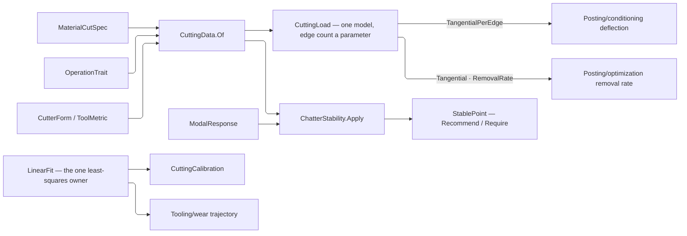

# [RASM_FABRICATION_CUTTING_DATA]

`CuttingData` resolves a material specification, cutter form, operation trait, and admitted evidence into one dimensional cutting regime and ONE Kienzle force model. Material seeds and operation factors generate the regime space; exact production, vendor, and calibrated rows override data without repeating a class-by-operation matrix. `CuttingLoad` is the ONE force result: the edge count is a PARAMETER on one model, so a deflection consumer reads the per-edge column and a removal-rate consumer reads the engaged column off the same evaluation rather than a second force body with a different arity.

`LinearFit` is the ONE least-squares owner in the package — a power law is that fit in log-log space, a wear trajectory is that fit in linear space, and the determination is computed in the space the regression was PERFORMED in, so a valid log-log fit is never rejected for a linear-space residual it never minimized. `CuttingCalibration` and `Tooling/wear` Taylor calibration both compose it. `ChatterStability` composes the resolved tangential coefficient with every admitted machine-tool mode, samples each lobe across its full ratio search, partitions valid points at every projection gap, solves every bracketed depth crossing against the request's target depth, and recommends one `StablePoint`.

`Process/physics#BUDGET_FOLD` `SurfaceSpeed` owns the forward-and-inverse cutting-speed pair over the CUTTING diameter; this page composes it and spells neither direction. `CoolantDelivery` carries its own speed, life, and evacuation response as family columns at `Process/family`, so the correction fold reads a column and no second medium table exists.

Wire posture: HOST-LOCAL. `CuttingData.Of`, `FeedBasis`, and `CuttingLoad` remain frozen in-process wires for Turning and Posting; `MachineInstance.Modal` carries the admitted modal response.

## [01]-[INDEX]

- [02]-[MATERIAL_TABLE]: `IsoClass`, `MaterialState`, `HardnessScale`, `FeedBasis`, `CutDirection`, `Hardness`, `MaterialCutSpec`, `MaterialSource`, `ScalarBand`, `OperationTrait`, `CutRegime`, `CorrectionInputs`, `KienzleCorrection`, `CuttingKey`, `CuttingEvidence`, `CuttingRow`, `CalibrationPoint`, `CalibrationCurve`, and the indexed `CuttingTable`.
- [03]-[CUTTING_LOAD]: `CutIntent`, `CuttingLoad`, `CuttingDataIngress`, `GeneratedCut`, `CuttingDataMap`, and `CuttingData` — the one resolution entry and the one force model.
- [04]-[REGRESSION]: `FitSpace`, `Regression`, `LinearFit`, `PowerLaw`, `PowerLawFit`, `CalibrationRequest`, `KienzleModel`, and `CuttingCalibration`.
- [05]-[FORM_PROJECTION]: `CutterFormPolicy` and the `CutterFormProjection` inference and fit predicate.
- [06]-[CHATTER_STABILITY]: `ModalEvidence`, `ModalMode`, `ModalResponse`, `StabilityPolicy`, `StabilityRequest`, `StabilityEvidence`, `StabilityPoint`, `StabilityBand`, `StabilityGap`, `StablePoint`, `StabilityLobes`, and `ChatterStability`.

## [02]-[MATERIAL_TABLE]

- Owner: `MaterialCutSpec` carries ISO group, subgroup, condition, hardness, strength, and Kienzle seed data; `OperationTrait` carries generative operation factors; `CuttingTable` carries exact rows keyed by `CuttingKey` and calibration curves BESIDE the indexes every lookup reads; `CorrectionInputs` carries the measured evidence every Kienzle correction axis derives from.
- Law: every table lookup is INDEXED. The card's own boundary forbids a linear scan over a keyed table, and the material, operation, and curve reads all performed one; each index is DERIVED from the admitted rows and held, so it stays out of construction, equality, and every codec.
- Law: the coolant response is a COLUMN on `CoolantDelivery`. A parallel table keyed by that vocabulary restates every row and silently defaults the one it forgot, which is why the medium's speed, life, and evacuation factors moved onto the family row itself.
- Cases: `MaterialSource` discriminates family lookup from an exact specification at one entry; `CuttingEvidence` distinguishes exact, calibrated, vendor, production, interpolated, and generated payloads and projects each one's chip-thickness validity domain.
- Auto: exact rows resolve by `CuttingKey` lookup and calibration curves interpolate by hardness; `KienzleCorrection.Of` derives rake, coating, coolant, condition, thermal, abrasion, wear, and runout factors from admitted evidence rather than unit placeholders.
- Growth: a material is one `MaterialCutSpec`; an operation is one `OperationTrait`; a measured correction is one `CuttingRow`; a hardness series is one `CalibrationCurve`.
- Boundary: repeated class-operation matrices, a second coolant vocabulary beside `CoolantDelivery`, linear scans over a keyed exact table, string evidence labels, correction axes pinned at unity, and defensive null guards on cases a generated union already hands non-null are deleted forms.

```csharp
// --- [IMPORTS] -------------------------------------------------------------------------
using System.Collections.Frozen;
using System.Linq;
using System.Numerics.Tensors;
using LanguageExt;
using LanguageExt.Common;
using MathNet.Numerics;
using MathNet.Numerics.Interpolation;
using MathNet.Numerics.RootFinding;
using NodaTime;
using Rasm.Domain;
using Rasm.Fabrication.Process;
using Riok.Mapperly.Abstractions;
using Thinktecture;
using UnitsNet;
using static LanguageExt.Prelude;

namespace Rasm.Fabrication.Tooling;

// --- [TYPES] ---------------------------------------------------------------------------
[SmartEnum<string>]
public sealed partial class IsoClass {
    public static readonly IsoClass P = new("P", "steel");
    public static readonly IsoClass M = new("M", "stainless-steel");
    public static readonly IsoClass K = new("K", "cast-iron");
    public static readonly IsoClass N = new("N", "nonferrous");
    public static readonly IsoClass S = new("S", "heat-resistant-superalloy");
    public static readonly IsoClass H = new("H", "hardened-material");

    public string Family { get; }
}

[SmartEnum<string>]
public sealed partial class MaterialState {
    public static readonly MaterialState Annealed = new("annealed", forceFactor: 0.90);
    public static readonly MaterialState Normalized = new("normalized", forceFactor: 1.00);
    public static readonly MaterialState Hardened = new("hardened", forceFactor: 1.25);
    public static readonly MaterialState Aged = new("aged", forceFactor: 1.10);
    public static readonly MaterialState Cast = new("cast", forceFactor: 1.15);
    public static readonly MaterialState Wrought = new("wrought", forceFactor: 1.00);
    public static readonly MaterialState Composite = new("composite", forceFactor: 1.30);

    public double ForceFactor { get; }
}

[SmartEnum<string>]
public sealed partial class HardnessScale {
    public static readonly HardnessScale Vickers = new("vickers");
    public static readonly HardnessScale Brinell = new("brinell");
    public static readonly HardnessScale RockwellC = new("rockwell-c");
    public static readonly HardnessScale RockwellB = new("rockwell-b");
}

[SmartEnum<string>]
public sealed partial class FeedBasis {
    public static readonly FeedBasis PerTooth = new("per-tooth");
    public static readonly FeedBasis PerRevolution = new("per-revolution");
    public static readonly FeedBasis LinearPerMinute = new("linear-per-minute");
    public static readonly FeedBasis SurfaceRatio = new("surface-ratio");
}

[SmartEnum<string>]
public sealed partial class CutDirection {
    public static readonly CutDirection Climb = new("climb");
    public static readonly CutDirection Conventional = new("conventional");
    public static readonly CutDirection Bidirectional = new("bidirectional");
}

// --- [MODELS] --------------------------------------------------------------------------
[ComplexValueObject]
public readonly partial struct Hardness {
    public HardnessScale Scale { get; }
    public double Value { get; }

    static partial void ValidateFactoryArguments(ref ValidationError? validationError, ref HardnessScale scale,
        ref double value) =>
        validationError = ValidityClaim.Positive(value) ? null : ToolKey.Validation("hardness");

    public static Fin<Hardness> Admit(HardnessScale scale, double value) =>
        Validate(scale, value, out Hardness hardness).Admitted(hardness);
}

[ComplexValueObject]
public readonly partial struct ScalarBand {
    public double Minimum { get; }
    public double Nominal { get; }
    public double Maximum { get; }

    static partial void ValidateFactoryArguments(ref ValidationError? validationError, ref double minimum,
        ref double nominal, ref double maximum) =>
        validationError = !Seq(minimum, nominal, maximum).ForAll(double.IsFinite)
            || minimum <= 0.0 || minimum > nominal || nominal > maximum
            ? ToolKey.Validation("scalar-band") : null;

    public static Fin<ScalarBand> Admit(double minimum, double nominal, double maximum) =>
        Validate(minimum, nominal, maximum, out ScalarBand band).Admitted(band);

    public double Clamp(double value) => Math.Clamp(value, Minimum, Maximum);
    public bool Contains(double value) => double.IsFinite(value) && value >= Minimum && value <= Maximum;
}

[ComplexValueObject]
public sealed partial class MaterialCutSpec {
    public Material Material { get; }
    public IsoClass Class { get; }
    public int Subgroup { get; }
    public MaterialState Condition { get; }
    public Hardness Hardness { get; }
    public Pressure UltimateStrength { get; }
    public Pressure Kc11 { get; }
    public double Mc { get; }
    public double ThermalFactor { get; }
    public double AbrasionFactor { get; }

    static partial void ValidateFactoryArguments(ref ValidationError? validationError, ref Material material,
        ref IsoClass @class, ref int subgroup, ref MaterialState condition, ref Hardness hardness,
        ref Pressure ultimateStrength, ref Pressure kc11, ref double mc, ref double thermalFactor,
        ref double abrasionFactor) =>
        validationError = subgroup is < 1 or > 99
            || ultimateStrength <= Pressure.Zero || kc11 <= Pressure.Zero
            || !double.IsFinite(mc) || mc is <= 0.0 or >= 1.0
            || !ValidityClaim.Positive(thermalFactor).Holds || !ValidityClaim.Positive(abrasionFactor).Holds
            ? ToolKey.Validation("material-cut-spec") : null;

    public static Fin<MaterialCutSpec> Admit(Material material, IsoClass @class, int subgroup,
        MaterialState condition, Hardness hardness, Pressure ultimateStrength, Pressure kc11, double mc,
        double thermalFactor, double abrasionFactor) =>
        Validate(material, @class, subgroup, condition, hardness, ultimateStrength, kc11, mc, thermalFactor,
            abrasionFactor, out MaterialCutSpec spec).Admitted(spec);
}

[Union(ConversionFromValue = ConversionOperatorsGeneration.None)]
public abstract partial record MaterialSource {
    private MaterialSource() { }
    public sealed record Family(Material Value) : MaterialSource;
    public sealed record Spec(MaterialCutSpec Value) : MaterialSource;
}

[ComplexValueObject]
public sealed partial class OperationTrait {
    public Operation Operation { get; }
    public FeedBasis Basis { get; }
    public ScalarBand SurfaceSpeed { get; }
    public ScalarBand Feed { get; }
    public ScalarBand AxialDepth { get; }
    public ScalarBand RadialDepth { get; }
    public ScalarBand Engagement { get; }
    public ScalarBand Spindle { get; }
    public double FeedForceRatio { get; }
    public double PassiveForceRatio { get; }
    public Seq<CoolantDelivery> Coolant { get; }
    public CutDirection Direction { get; }

    static partial void ValidateFactoryArguments(ref ValidationError? validationError, ref Operation operation,
        ref FeedBasis basis, ref ScalarBand surfaceSpeed, ref ScalarBand feed, ref ScalarBand axialDepth,
        ref ScalarBand radialDepth, ref ScalarBand engagement, ref ScalarBand spindle, ref double feedForceRatio,
        ref double passiveForceRatio, ref Seq<CoolantDelivery> coolant, ref CutDirection direction) =>
        validationError = coolant.IsEmpty
            || !Seq(feedForceRatio, passiveForceRatio).ForAll(static value => ValidityClaim.Positive(value).Holds)
            ? ToolKey.Validation("operation-trait") : null;

    public static Fin<OperationTrait> Admit(Operation operation, FeedBasis basis, ScalarBand surfaceSpeed,
        ScalarBand feed, ScalarBand axialDepth, ScalarBand radialDepth, ScalarBand engagement, ScalarBand spindle,
        double feedForceRatio, double passiveForceRatio, Seq<CoolantDelivery> coolant, CutDirection direction) =>
        Validate(operation, basis, surfaceSpeed, feed, axialDepth, radialDepth, engagement, spindle,
            feedForceRatio, passiveForceRatio, coolant, direction, out OperationTrait trait).Admitted(trait);
}

[ComplexValueObject]
public sealed partial class CutRegime {
    public ScalarBand SurfaceSpeedBand { get; }
    public ScalarBand FeedBand { get; }
    public FeedBasis Basis { get; }
    public ScalarBand AxialDepthBand { get; }
    public ScalarBand RadialDepthBand { get; }
    public ScalarBand EngagementBand { get; }
    public ScalarBand SpindleBand { get; }
    public Seq<CoolantDelivery> Coolant { get; }
    public CutDirection Direction { get; }

    public double SurfaceSpeed => SurfaceSpeedBand.Nominal;
    public double Feed => FeedBand.Nominal;

    static partial void ValidateFactoryArguments(ref ValidationError? validationError, ref ScalarBand surfaceSpeedBand,
        ref ScalarBand feedBand, ref FeedBasis basis, ref ScalarBand axialDepthBand, ref ScalarBand radialDepthBand,
        ref ScalarBand engagementBand, ref ScalarBand spindleBand, ref Seq<CoolantDelivery> coolant,
        ref CutDirection direction) =>
        validationError = coolant.IsEmpty ? ToolKey.Validation("cut-regime") : null;

    public static Fin<CutRegime> Admit(ScalarBand surfaceSpeedBand, ScalarBand feedBand, FeedBasis basis,
        ScalarBand axialDepthBand, ScalarBand radialDepthBand, ScalarBand engagementBand, ScalarBand spindleBand,
        Seq<CoolantDelivery> coolant, CutDirection direction) =>
        Validate(surfaceSpeedBand, feedBand, basis, axialDepthBand, radialDepthBand, engagementBand, spindleBand,
            coolant, direction, out CutRegime regime).Admitted(regime);
}

[ComplexValueObject]
public sealed partial class CorrectionInputs {
    public Angle Rake { get; }
    public Angle ReferenceRake { get; }
    public Coating Coating { get; }
    public CoolantDelivery Coolant { get; }
    public Ratio FlankConsumed { get; }
    public Length Runout { get; }
    public Length ChipThickness { get; }

    static partial void ValidateFactoryArguments(ref ValidationError? validationError, ref Angle rake,
        ref Angle referenceRake, ref Coating coating, ref CoolantDelivery coolant, ref Ratio flankConsumed,
        ref Length runout, ref Length chipThickness) =>
        validationError = runout < Length.Zero || chipThickness <= Length.Zero
            || flankConsumed < Ratio.Zero || flankConsumed > Ratio.FromPercent(100)
            ? ToolKey.Validation("correction-inputs") : null;

    public static Fin<CorrectionInputs> Admit(Angle rake, Angle referenceRake, Coating coating,
        CoolantDelivery coolant, Ratio flankConsumed, Length runout, Length chipThickness) =>
        Validate(rake, referenceRake, coating, coolant, flankConsumed, runout, chipThickness,
            out CorrectionInputs inputs).Admitted(inputs);
}

[ComplexValueObject]
public readonly partial struct KienzleCorrection {
    public double ToolGeometry { get; }
    public double Coating { get; }
    public double Coolant { get; }
    public double MaterialState { get; }
    public double Thermal { get; }
    public double Abrasiveness { get; }
    public double Wear { get; }
    public double Runout { get; }

    public double Factor => ToolGeometry * Coating * Coolant * MaterialState * Thermal * Abrasiveness * Wear * Runout;

    private const double RakePercentPerDegree = 0.01;
    private const double FactorFloor = 0.1;

    private const double EvacuationReference = 2.0;

    public static Fin<KienzleCorrection> Of(MaterialCutSpec material, Option<CorrectionInputs> inputs) =>
        inputs.Match(
            Some: row => Admit(
                Math.Max(FactorFloor,
                    1.0 - (row.Rake.Degrees - row.ReferenceRake.Degrees) * RakePercentPerDegree),
                row.Coating.WearFactor,
                Math.Max(FactorFloor, EvacuationReference - row.Coolant.Evacuation),
                material.Condition.ForceFactor, material.ThermalFactor, material.AbrasionFactor,
                1.0 + row.FlankConsumed.DecimalFractions,
                1.0 + row.Runout.Millimeters / row.ChipThickness.Millimeters),
            None: () => Admit(1.0, 1.0, 1.0, material.Condition.ForceFactor,
                material.ThermalFactor, material.AbrasionFactor, 1.0, 1.0));

    static partial void ValidateFactoryArguments(ref ValidationError? validationError, ref double toolGeometry,
        ref double coating, ref double coolant, ref double materialState, ref double thermal,
        ref double abrasiveness, ref double wear, ref double runout) =>
        validationError = Seq(toolGeometry, coating, coolant, materialState, thermal, abrasiveness, wear, runout)
            .ForAll(static value => ValidityClaim.Positive(value).Holds) ? null : ToolKey.Validation("kienzle-correction");

    public static Fin<KienzleCorrection> Admit(double toolGeometry, double coating, double coolant,
        double materialState, double thermal, double abrasiveness, double wear, double runout) =>
        Validate(toolGeometry, coating, coolant, materialState, thermal, abrasiveness, wear, runout,
            out KienzleCorrection correction).Admitted(correction);
}

[ComplexValueObject]
public sealed partial class CuttingKey {
    public MaterialCutSpec Material { get; }
    public CutterFamily Form { get; }
    public Operation Operation { get; }

    static partial void ValidateFactoryArguments(ref ValidationError? validationError,
        ref MaterialCutSpec material, ref CutterFamily form, ref Operation operation) { }

    public static Fin<CuttingKey> Admit(MaterialCutSpec material, CutterFamily form, Operation operation) =>
        Validate(material, form, operation, out CuttingKey key).Admitted();
}

[Union(ConversionFromValue = ConversionOperatorsGeneration.None)]
public abstract partial record CuttingEvidence {
    private CuttingEvidence() { }
    public sealed record Exact(string Source, string Revision, ScalarBand Thickness) : CuttingEvidence;
    public sealed record Production(string Lot, int Samples, double Residual, ScalarBand Thickness) : CuttingEvidence;
    public sealed record Vendor(string Catalog, string Revision, ScalarBand Thickness) : CuttingEvidence;
    public sealed record Calibrated(KienzleModel Model) : CuttingEvidence;
    public sealed record Interpolated(CalibrationCurve Curve, Hardness Hardness) : CuttingEvidence;
    public sealed record Generated(MaterialCutSpec Material, OperationTrait Operation) : CuttingEvidence;

    public Option<ScalarBand> Thickness => Switch(
        exact: static row => Some(row.Thickness),
        production: static row => Some(row.Thickness),
        vendor: static row => Some(row.Thickness),
        calibrated: static row => ScalarBand.Admit(row.Model.ThicknessMinimum.Millimeters,
            (row.Model.ThicknessMinimum.Millimeters + row.Model.ThicknessMaximum.Millimeters) * 0.5,
            row.Model.ThicknessMaximum.Millimeters).ToOption(),
        interpolated: static _ => None,
        generated: static _ => None);

    public bool Grounded => Switch(
        exact: static row => Witness.Keyed(row.Source) && Witness.Keyed(row.Revision),
        production: static row => Witness.Keyed(row.Lot) && row.Samples > 0
            && double.IsFinite(row.Residual) && row.Residual >= 0.0,
        vendor: static row => ValidityClaim.All(
            Witness.Keyed(row.Catalog), Witness.Keyed(row.Revision), ValidityClaim.Positive(row.Thickness.Minimum)),
        calibrated: static _ => true,
        interpolated: static row => ValidityClaim.Positive(row.Hardness.Value),
        generated: static _ => true);
}

[ComplexValueObject]
public sealed partial class CuttingRow {
    public CuttingKey Key { get; }
    public Pressure Kc11 { get; }
    public double Mc { get; }
    public CutRegime Regime { get; }
    public KienzleCorrection Correction { get; }
    public double FeedForceRatio { get; }
    public double PassiveForceRatio { get; }
    public CuttingEvidence Evidence { get; }

    static partial void ValidateFactoryArguments(ref ValidationError? validationError, ref CuttingKey key,
        ref Pressure kc11, ref double mc, ref CutRegime regime, ref KienzleCorrection correction,
        ref double feedForceRatio, ref double passiveForceRatio, ref CuttingEvidence evidence) =>
        validationError = kc11 <= Pressure.Zero || !double.IsFinite(mc) || mc is <= 0.0 or >= 1.0
            || !Seq(feedForceRatio, passiveForceRatio).ForAll(static value => ValidityClaim.Positive(value).Holds)
            || !evidence.Grounded
            ? ToolKey.Validation("cutting-row") : null;

    public static Fin<CuttingRow> Admit(CuttingKey key, Pressure kc11, double mc, CutRegime regime,
        KienzleCorrection correction, double feedForceRatio, double passiveForceRatio, CuttingEvidence evidence) =>
        Validate(key, kc11, mc, regime, correction, feedForceRatio, passiveForceRatio, evidence,
            out CuttingRow row).Admitted(row);
}

[ComplexValueObject]
public sealed partial class CalibrationPoint {
    public Hardness Hardness { get; }
    public Pressure Kc11 { get; }

    static partial void ValidateFactoryArguments(ref ValidationError? validationError, ref Hardness hardness,
        ref Pressure kc11) =>
        validationError = kc11 <= Pressure.Zero ? ToolKey.Validation("calibration-point") : null;

    public static Fin<CalibrationPoint> Admit(Hardness hardness, Pressure kc11) =>
        Validate(hardness, kc11, out CalibrationPoint point).Admitted(point);
}

[ComplexValueObject]
public sealed partial class CalibrationCurve {
    public IsoClass Class { get; }
    public int Subgroup { get; }
    public Seq<CalibrationPoint> Points { get; }

    static partial void ValidateFactoryArguments(ref ValidationError? validationError, ref IsoClass @class,
        ref int subgroup, ref Seq<CalibrationPoint> points) =>
        validationError = subgroup is < 1 or > 99 || points.Count < LinearFit.MinimumSamples
            || points.Map(static point => point.Hardness.Scale).Distinct().Count != 1
            || points.Zip(points.Skip(1)).Exists(static pair => pair.Item1.Hardness.Value >= pair.Item2.Hardness.Value)
            ? ToolKey.Validation("calibration-curve") : null;

    public static Fin<CalibrationCurve> Admit(IsoClass @class, int subgroup, Seq<CalibrationPoint> points) =>
        Validate(@class, subgroup, points, out CalibrationCurve curve).Admitted(curve);

    public bool Covers(MaterialCutSpec material) =>
        Class == material.Class && Subgroup == material.Subgroup
        && Points.Head.Exists(point => point.Hardness.Scale == material.Hardness.Scale)
        && material.Hardness.Value >= Points.Min(static point => point.Hardness.Value)
        && material.Hardness.Value <= Points.Max(static point => point.Hardness.Value);

    public Pressure At(double hardness) => Pressure.FromMegapascals(Interpolate.CubicSplineMonotone(
        Points.Map(static point => point.Hardness.Value).ToArray(),
        Points.Map(static point => point.Kc11.Megapascals).ToArray()).Interpolate(hardness));
}

[ComplexValueObject]
public sealed partial class CuttingTable {
    public Seq<MaterialCutSpec> Materials { get; }
    public Seq<OperationTrait> Operations { get; }
    public HashMap<CuttingKey, CuttingRow> Exact { get; }
    public Seq<CalibrationCurve> Curves { get; }

    [IgnoreMember]
    private FrozenDictionary<Material, MaterialCutSpec>? materials;

    [IgnoreMember]
    private FrozenDictionary<Operation, OperationTrait>? operations;

    [IgnoreMember]
    private FrozenDictionary<(IsoClass Class, int Subgroup), CalibrationCurve>? curves;

    static partial void ValidateFactoryArguments(ref ValidationError? validationError,
        ref Seq<MaterialCutSpec> materials, ref Seq<OperationTrait> operations,
        ref HashMap<CuttingKey, CuttingRow> exact, ref Seq<CalibrationCurve> curves) =>
        validationError = materials.IsEmpty
            || materials.Map(static row => row.Material).Distinct().Count != materials.Count
            || operations.Map(static row => row.Operation).Distinct().Count != operations.Count
            || toSeq(Operation.Items).Exists(operation => !operations.Exists(row => row.Operation == operation))
            || exact.AsIterable().Exists(row => row.Key != row.Value.Key
                || !materials.Contains(row.Key.Material)
                || !operations.Exists(operation => operation.Operation == row.Key.Operation))
            || curves.Map(static row => (row.Class, row.Subgroup)).Distinct().Count != curves.Count
            || curves.Exists(curve => !materials.Exists(curve.Covers))
            ? ToolKey.Validation("cutting-table") : null;

    public static Fin<CuttingTable> Admit(Seq<MaterialCutSpec> materials, Seq<OperationTrait> operations,
        HashMap<CuttingKey, CuttingRow> exact, Seq<CalibrationCurve> curves) =>
        Validate(materials, operations, exact, curves, out CuttingTable table).Admitted(table);

    public Option<MaterialCutSpec> Material(Material value) =>
        (materials ??= Materials.ToDictionary(static row => row.Material, static row => row).ToFrozenDictionary())
            .TryGetValue(value, out MaterialCutSpec? row) ? Some(row) : None;

    public Option<OperationTrait> Operation(Operation value) =>
        (operations ??= Operations.ToDictionary(static row => row.Operation, static row => row).ToFrozenDictionary())
            .TryGetValue(value, out OperationTrait? row) ? Some(row) : None;

    public Option<CalibrationCurve> Curve(MaterialCutSpec material) =>
        (curves ??= Curves.ToDictionary(static row => (row.Class, row.Subgroup), static row => row).ToFrozenDictionary())
            .TryGetValue((material.Class, material.Subgroup), out CalibrationCurve? row) && row.Covers(material)
            ? Some(row) : None;
}
```

## [03]-[CUTTING_LOAD]

- Owner: `CuttingData` owns resolved force and regime truth; `CutIntent` owns the engagement geometry; `CuttingLoad` owns the ONE force result; `CuttingDataMap` owns both construction paths onto one target.
- Law: there is ONE force model and the ENGAGED EDGE COUNT is its parameter. A per-edge form and a multi-edge form standing side by side let a deflection consumer and a removal-rate consumer disagree about the same cut by exactly the edge count; the model evaluates once and publishes both columns, so each consumer reads the arm it needs off one result and the two can never diverge.
- Law: the engaged edge count is DERIVED from the engagement arc and the tooth count and floored at one. A cut in contact has at least one edge in the material by definition, so a fractional engagement never prices the cut below a single edge.
- Law: `Process/physics#BUDGET_FOLD` `SurfaceSpeed` owns the cutting-speed relation in both directions. The regime gate composes `SurfaceSpeed.MetersPerMinute` over the CUTTING diameter rather than spelling the inverse inline, so the forward and inverse can never drift.
- Cases: `MaterialSource` selects family lookup or exact specification at one entry.
- Entry: `CuttingData.Of(MaterialSource, CutterForm, Operation, CuttingTable, Option<CorrectionInputs>)` is the one resolution entry and `CuttingData.Evaluate(CutIntent)` the one force entry.
- Auto: specific force refuses a chip thickness outside its evidence's declared domain; force evaluation derives the engagement arc from radial depth and diameter before projecting per-edge and engaged tangential, feed, and passive components, resultant, torque, power, and removal rate. Both construction paths land on ONE ingress shape through generated mappings, so a column added to the resolved data cannot reach one path and miss the other.
- Result: `CuttingData` carries resolved source and clamps; `CuttingLoad` carries the specific force, the engaged edge count, per-edge and engaged tangential force, the derived feed, passive, and resultant components, torque, power, removal rate, chip thickness, and engagement.
- Packages: `UnitsNet` quantity algebra derives torque from force and radius and power from angular rate and torque, so no scale literal stands between them; LanguageExt.Core and Thinktecture.Runtime.Extensions compose directly.
- Growth: a resolved column is one slot on `CuttingDataIngress` that both mapper partials fill.
- Boundary: `Fin.Succ` query shells lifting pure values, unqualified dimensional request scalars, scalar-only force, engagement fraction standing in for the engagement arc, and silent extrapolation past the evidence domain are deleted forms.

```csharp
// --- [MODELS] --------------------------------------------------------------------------
[ComplexValueObject]
public readonly partial struct CutIntent {
    public Length ChipThickness { get; }
    public Length ChipWidth { get; }
    public Length AxialDepth { get; }
    public Length RadialDepth { get; }
    public Length Diameter { get; }
    public int Teeth { get; }
    public RotationalSpeed Spindle { get; }
    public Speed Feed { get; }

    public Ratio Engagement => Ratio.FromDecimalFractions(Math.Acos(Math.Clamp(
        1.0 - 2.0 * RadialDepth.Millimeters / Diameter.Millimeters, -1.0, 1.0)) / Math.Tau);

    public double ActiveEdges => Math.Max(1.0, Teeth * Engagement.DecimalFractions);

    static partial void ValidateFactoryArguments(ref ValidationError? validationError, ref Length chipThickness,
        ref Length chipWidth, ref Length axialDepth, ref Length radialDepth, ref Length diameter,
        ref int teeth, ref RotationalSpeed spindle, ref Speed feed) =>
        validationError = !Seq(chipThickness.Millimeters, chipWidth.Millimeters, axialDepth.Millimeters,
                radialDepth.Millimeters, diameter.Millimeters, spindle.RevolutionsPerMinute, feed.MetersPerSecond)
            .ForAll(double.IsFinite)
            || Seq(chipThickness, chipWidth, axialDepth, radialDepth, diameter).Exists(static value => value <= Length.Zero)
            || radialDepth > diameter || spindle <= RotationalSpeed.Zero || teeth <= 0 || feed.MetersPerSecond <= 0.0
            ? ToolKey.Validation("cut-intent") : null;

    public static Fin<CutIntent> Admit(Length chipThickness, Length chipWidth, Length axialDepth, Length radialDepth,
        Length diameter, int teeth, RotationalSpeed spindle, Speed feed) =>
        Validate(chipThickness, chipWidth, axialDepth, radialDepth, diameter, teeth, spindle, feed,
            out CutIntent intent).Admitted(intent);
}

public sealed record CuttingLoad(
    Pressure SpecificForce,
    double ActiveEdges,
    Force TangentialPerEdge,
    Force Tangential,
    Force Feed,
    Force Passive,
    Force Resultant,
    Torque Torque,
    Power Power,
    double RemovalRateMm3PerMinute,
    Length ChipThickness,
    Ratio Engagement);

public sealed record CuttingDataIngress(
    Pressure Kc11,
    double Mc,
    CutRegime Regime,
    KienzleCorrection Correction,
    CuttingEvidence Evidence,
    double FeedForceRatio,
    double PassiveForceRatio);

public sealed record GeneratedCut(
    Pressure Kc,
    double Mc,
    CutRegime Regime,
    KienzleCorrection Correction,
    CuttingEvidence Evidence,
    double FeedForceRatio,
    double PassiveForceRatio);

[Mapper(RequiredMappingStrategy = RequiredMappingStrategy.Target,
    EnabledConversions = MappingConversionType.None)]
public static partial class CuttingDataMap {
    [MapperIgnoreSource(nameof(CuttingRow.Key))]
    public static partial CuttingDataIngress FromRow(CuttingRow row);

    [MapProperty(nameof(GeneratedCut.Kc), nameof(CuttingDataIngress.Kc11))]
    public static partial CuttingDataIngress FromGenerated(GeneratedCut generated);
}

[ComplexValueObject]
public sealed partial class CuttingData {
    public Pressure Kc11 { get; }
    public double Mc { get; }
    public CutRegime Regime { get; }
    public KienzleCorrection Correction { get; }
    public CuttingEvidence Evidence { get; }
    public double FeedForceRatio { get; }
    public double PassiveForceRatio { get; }

    public double SurfaceSpeed => Regime.SurfaceSpeed;
    public double Feed => Regime.Feed;
    public FeedBasis FeedBasis => Regime.Basis;

    static partial void ValidateFactoryArguments(ref ValidationError? validationError, ref Pressure kc11,
        ref double mc, ref CutRegime regime, ref KienzleCorrection correction, ref CuttingEvidence evidence,
        ref double feedForceRatio, ref double passiveForceRatio) =>
        validationError = kc11 <= Pressure.Zero || !double.IsFinite(mc) || mc is <= 0.0 or >= 1.0
            || !Seq(feedForceRatio, passiveForceRatio).ForAll(static value => ValidityClaim.Positive(value).Holds)
            ? ToolKey.Validation("cutting-data") : null;

    public static Fin<CuttingData> Admit(CuttingDataIngress ingress) =>
        Validate(ingress.Kc11, ingress.Mc, ingress.Regime, ingress.Correction, ingress.Evidence,
            ingress.FeedForceRatio, ingress.PassiveForceRatio, out CuttingData data).Admitted(data);

    public Fin<Pressure> Kc(Length chipThickness) => Specific(chipThickness.Millimeters);

    public Fin<CuttingLoad> Evaluate(CutIntent intent) =>
        from _ in Admit(intent)
        from specific in Specific(intent.ChipThickness.Millimeters)
        let perEdge = Force.FromNewtons(specific.Megapascals
            * intent.ChipWidth.Millimeters * intent.ChipThickness.Millimeters)
        let tangential = perEdge * intent.ActiveEdges
        let feed = tangential * FeedForceRatio
        let passive = tangential * PassiveForceRatio
        let resultant = Force.FromNewtons(Math.Sqrt(tangential.Newtons * tangential.Newtons
            + feed.Newtons * feed.Newtons + passive.Newtons * passive.Newtons))
        let torque = tangential * (intent.Diameter / 2.0)
        let power = Power.FromWatts(intent.Spindle.RadiansPerSecond * torque.NewtonMeters)
        let removal = intent.AxialDepth.Millimeters * intent.RadialDepth.Millimeters
            * intent.Feed.MillimetersPerMinutes
        select new CuttingLoad(specific, intent.ActiveEdges, perEdge, tangential, feed, passive, resultant,
            torque, power, removal, intent.ChipThickness, intent.Engagement);

    public static Fin<CuttingData> Of(MaterialSource source, CutterForm form, Operation operation,
        CuttingTable table, Option<CorrectionInputs> correction = default) =>
        from material in source.Switch(
            state: (Table: table, Operation: operation),
            family: static (state, row) => state.Table.Material(row.Value)
                .ToFin(new FabricationFault.MachinabilityUnknown(row.Value, state.Operation)),
            spec: static (state, row) => state.Table.Materials.Contains(row.Value)
                ? Fin.Succ(row.Value)
                : Fin.Fail<MaterialCutSpec>(
                    new FabricationFault.MachinabilityUnknown(row.Value.Material, state.Operation)))
        from trait in table.Operation(operation)
            .ToFin(new FabricationFault.MachinabilityUnknown(material.Material, operation))
        from resolved in Resolve(material, form, trait, table, correction)
        select resolved;

    private Fin<Pressure> Specific(double chipThicknessMm) =>
        from _ in ValidityClaim.Positive(chipThicknessMm) ? Fin.Succ(unit)
            : Fin.Fail<Unit>(ToolKey.Tooling("cutting-data:chip-thickness"))
        from __ in Evidence.Thickness.ForAll(band => band.Contains(chipThicknessMm))
            ? Fin.Succ(unit)
            : Fin.Fail<Unit>(ToolKey.Tooling("cutting-data:extrapolation"))
        let value = Kc11.Megapascals * Math.Pow(chipThicknessMm, -Mc) * Correction.Factor
        from specific in ValidityClaim.Positive(value) ? Fin.Succ(Pressure.FromMegapascals(value))
            : Fin.Fail<Pressure>(ToolKey.Tooling("cutting-data:specific-force"))
        select specific;

    private Fin<Unit> Admit(CutIntent intent) =>
        Regime.SurfaceSpeedBand.Contains(SurfaceSpeed.MetersPerMinute(
            intent.Spindle.RevolutionsPerMinute, intent.Diameter.Millimeters))
        && Regime.FeedBand.Contains(FeedBasis.Switch(
            state: intent,
            perTooth: static row => row.Feed.MillimetersPerMinutes
                / (row.Spindle.RevolutionsPerMinute * row.Teeth),
            perRevolution: static row => row.Feed.MillimetersPerMinutes / row.Spindle.RevolutionsPerMinute,
            linearPerMinute: static row => row.Feed.MillimetersPerMinutes,
            surfaceRatio: static row => row.RadialDepth / row.Diameter))
        && Regime.AxialDepthBand.Contains(intent.AxialDepth.Millimeters)
        && Regime.RadialDepthBand.Contains(intent.RadialDepth.Millimeters)
        && Regime.EngagementBand.Contains(intent.Engagement.DecimalFractions)
        && Regime.SpindleBand.Contains(intent.Spindle.RevolutionsPerMinute)
            ? Fin.Succ(unit)
            : Fin.Fail<Unit>(ToolKey.Tooling("cutting-data:regime"));

    private static Fin<CuttingData> Resolve(MaterialCutSpec material, CutterForm form,
        OperationTrait operation, CuttingTable table, Option<CorrectionInputs> correction) =>
        CuttingKey.Admit(material, form.Family, operation.Operation)
            .ToOption()
            .Bind(key => table.Exact.Find())
            .Match(
                Some: static row => Admit(CuttingDataMap.FromRow(row)),
                None: () => Generate(material, operation, table, correction));

    private static Fin<CuttingData> Generate(MaterialCutSpec material, OperationTrait operation, CuttingTable table,
        Option<CorrectionInputs> inputs) =>
        from regime in Regime(material, operation)
        let curve = table.Curve(material)
        let kc = curve.Map(row => row.At(material.Hardness.Value)).IfNone(material.Kc11)
        let evidence = curve.Map<CuttingEvidence>(row => new CuttingEvidence.Interpolated(row, material.Hardness))
            .IfNone(new CuttingEvidence.Generated(material, operation))
        from correction in KienzleCorrection.Of(material, inputs)
        from generated in Admit(CuttingDataMap.FromGenerated(new GeneratedCut(kc, material.Mc, regime, correction,
            evidence, operation.FeedForceRatio, operation.PassiveForceRatio)))
        select generated;

    private static Fin<CutRegime> Regime(MaterialCutSpec material, OperationTrait operation) =>
        from speed in Scale(operation.SurfaceSpeed,
            material.UltimateStrength.Megapascals / material.Kc11.Megapascals)
        from regime in CutRegime.Admit(speed, operation.Feed, operation.Basis, operation.AxialDepth,
            operation.RadialDepth, operation.Engagement, operation.Spindle, operation.Coolant, operation.Direction)
        select regime;

    private static Fin<ScalarBand> Scale(ScalarBand band, double factor) =>
        ScalarBand.Admit(band.Minimum * factor, band.Nominal * factor, band.Maximum * factor);
}
```

## [04]-[REGRESSION]

- Owner: `LinearFit` is the ONE least-squares owner in the package and `Regression` its ONE result; `PowerLawFit` narrows it to a log-log power law and `CuttingCalibration` narrows that to Kienzle terms.
- Law: the determination is computed in the space the regression was PERFORMED in. A log-log fit minimizes log-space residuals, so scoring it against linear-space variance rejects sound fits as degenerate — the exact failure that made a well-conditioned calibration unusable.
- Law: three samples is the floor. A two-point line passes through both points with zero residual and no determination at all, so it states a fit the data never supported.
- Law: `Regression`, `PowerLaw`, and `KienzleModel` are the regression statistics consumed directly by their callers.
- Cases: `FitSpace` closes linear and logarithmic and carries its own forward, inverse, and admissibility columns, so the transform and the domain guard travel together.
- Entry: `LinearFit.Apply(Seq<(double X, double Y)>, FitSpace)` is the one regression; `PowerLawFit.Apply` and `CuttingCalibration.Apply(CalibrationRequest, Material, Operation, Option<InstrumentSet>)` compose it, the calibration's set defaulting absent.
- Auto: `Tooling/wear` composes `Regression` for its trajectory fit rather than declaring a second regression body, so slope, intercept, residual, determination, domain, and terminal sample are stated once for the whole package.
- Result: `Regression` carries slope, intercept, root-mean-square residual, fit-space determination, sample domain, ordinate mean and dispersion, the terminal abscissa and ordinate, and the sample count. Sample columns are the caller's own units and model columns the fit space's, so no consumer reads a logarithm beside a raw mean. `PowerLaw` adds the coefficient and exponent its log-log reading derives and forwards the shared columns. `CuttingCalibration.Apply` writes residual and determination through `FabricationInstruments.FitResidual` and `FitQuality` from the settled fit.
- Exemption: `LinearFit.Apply` is a measured numeric kernel — the buffer reuse across the transform, prediction, and residual passes IS the arithmetic, so the statement body is the law rather than an imperative accumulation of a value.
- Packages: MathNet.Numerics `Fit.Line` and `GoodnessOfFit.RSquared`; `Process/telemetry` (`FabricationInstruments`); `TensorPrimitives` finite checks and statistical reductions.
- Growth: a new regression space is one `FitSpace` row.
- Boundary: two-point unqualified fits, a determination computed outside the fit space, and a second least-squares body anywhere in the package are deleted forms.

```csharp
// --- [REGRESSION] ----------------------------------------------------------------------
[SmartEnum<string>]
public sealed partial class FitSpace {
    public static readonly FitSpace Linear = new("linear",
        static value => value, static value => value, admitsNonPositive: true);
    public static readonly FitSpace Logarithmic = new("logarithmic",
        Math.Log, Math.Exp, admitsNonPositive: false);

    public Func<double, double> Forward { get; }
    public Func<double, double> Inverse { get; }
    public bool AdmitsNonPositive { get; }
}

public sealed record Regression(
    double Slope,
    double Intercept,
    double RootMeanSquareResidual,
    double RSquared,
    double DomainMinimum,
    double DomainMaximum,
    double Mean,
    double StandardDeviation,
    double LastAbscissa,
    double LastOrdinate,
    int Samples);

public static class LinearFit {
    public const int MinimumSamples = 3;

    public static Fin<Regression> Apply(Seq<(double X, double Y)> samples, FitSpace space) {
        double[] x = samples.Map(static row => row.X).ToArray();
        double[] y = samples.Map(static row => row.Y).ToArray();
        if (x.Length < MinimumSamples
            || !TensorPrimitives.IsFiniteAll<double>(x) || !TensorPrimitives.IsFiniteAll<double>(y)
            || (!space.AdmitsNonPositive && (x.Any(static value => value <= 0.0) || y.Any(static value => value <= 0.0))))
            return Fin.Fail<Regression>(ToolKey.Tooling("linear-fit:samples"));

        double[] fx = x.Select(space.Forward).ToArray();
        double[] fy = y.Select(space.Forward).ToArray();
        (double intercept, double slope) = Fit.Line(fx, fy);
        double[] predicted = fx.Select(value => intercept + slope * value).ToArray();
        double[] residuals = new double[fy.Length];
        TensorPrimitives.Subtract<double>(fy, predicted, residuals);
        double determination = GoodnessOfFit.RSquared(predicted, fy);
        double residual = Math.Sqrt(TensorPrimitives.SumOfSquares<double>(residuals) / residuals.Length);
        Regression fitted = new(slope, intercept, residual, determination,
            x.Min(), x.Max(), TensorPrimitives.Average<double>(y), TensorPrimitives.StdDev<double>(y),
            x[^1], y[^1], y.Length);
        return Seq(slope, intercept, residual, determination, fitted.Mean, fitted.StandardDeviation)
                .ForAll(double.IsFinite)
            && determination is >= 0.0 and <= 1.0
            && fitted.DomainMaximum > fitted.DomainMinimum
            ? Fin.Succ(fitted)
            : Fin.Fail<Regression>(ToolKey.Tooling("linear-fit:degenerate"));
    }
}

public sealed record PowerLaw(double Coefficient, double Exponent, Regression Fit) {
    public double RootMeanSquareResidual => Fit.RootMeanSquareResidual;
    public double RSquared => Fit.RSquared;
    public double DomainMinimum => Fit.DomainMinimum;
    public double DomainMaximum => Fit.DomainMaximum;
    public double Mean => Fit.Mean;
    public double StandardDeviation => Fit.StandardDeviation;
    public int Samples => Fit.Samples;
}

public static class PowerLawFit {
    public static Fin<PowerLaw> Apply(Seq<(double X, double Y)> samples) =>
        from fit in LinearFit.Apply(samples, FitSpace.Logarithmic)
        let coefficient = FitSpace.Logarithmic.Inverse(fit.Intercept)
        let exponent = -fit.Slope
        from admitted in ValidityClaim.All(
            ValidityClaim.Positive(coefficient), ValidityClaim.Positive(exponent)) ? Fin.Succ(new PowerLaw(coefficient, exponent, fit))
            : Fin.Fail<PowerLaw>(ToolKey.Tooling("power-law:degenerate"))
        select admitted;
}

[ComplexValueObject]
public sealed partial class CalibrationRequest {
    public Seq<(Length ChipThickness, Pressure SpecificForce)> Samples { get; }
    public int MinimumSamples { get; }
    public Length MinimumThicknessSpan { get; }
    public double MaximumResidual { get; }
    public double MinimumRSquared { get; }

    static partial void ValidateFactoryArguments(ref ValidationError? validationError,
        ref Seq<(Length ChipThickness, Pressure SpecificForce)> samples, ref int minimumSamples,
        ref Length minimumThicknessSpan, ref double maximumResidual, ref double minimumRSquared) =>
        validationError = minimumSamples < LinearFit.MinimumSamples || samples.Count < minimumSamples
            || minimumThicknessSpan <= Length.Zero
            || !ValidityClaim.Positive(maximumResidual).Holds
            || !double.IsFinite(minimumRSquared) || minimumRSquared is < 0.0 or > 1.0
            || samples.Exists(static row => row.ChipThickness <= Length.Zero || row.SpecificForce <= Pressure.Zero)
            || samples.Max(static row => row.ChipThickness.Millimeters)
                - samples.Min(static row => row.ChipThickness.Millimeters) < minimumThicknessSpan.Millimeters
            ? ToolKey.Validation("cutting-calibration-request") : null;

    public static Fin<CalibrationRequest> Admit(Seq<(Length ChipThickness, Pressure SpecificForce)> samples,
        int minimumSamples, Length minimumThicknessSpan, double maximumResidual, double minimumRSquared) =>
        Validate(samples, minimumSamples, minimumThicknessSpan, maximumResidual, minimumRSquared,
            out CalibrationRequest request).Admitted(request);
}

[ComplexValueObject]
public sealed partial class KienzleModel {
    public Pressure Kc11 { get; }
    public double Mc { get; }
    public Regression Fit { get; }
    public Length ThicknessMinimum { get; }
    public Length ThicknessMaximum { get; }
    public Pressure ForceMean { get; }
    public Pressure ForceStandardDeviation { get; }

    public double RootMeanSquareResidual => Fit.RootMeanSquareResidual;
    public double RSquared => Fit.RSquared;
    public int Samples => Fit.Samples;

    static partial void ValidateFactoryArguments(ref ValidationError? validationError, ref Pressure kc11,
        ref double mc, ref Regression fit, ref Length thicknessMinimum, ref Length thicknessMaximum,
        ref Pressure forceMean, ref Pressure forceStandardDeviation) =>
        validationError = kc11 <= Pressure.Zero || !double.IsFinite(mc) || mc is <= 0.0 or >= 1.0
            || thicknessMinimum <= Length.Zero || thicknessMaximum <= thicknessMinimum
            || forceMean <= Pressure.Zero || forceStandardDeviation < Pressure.Zero
            || fit.Samples < LinearFit.MinimumSamples
            ? ToolKey.Validation("cutting-calibration-result") : null;

    public static Fin<KienzleModel> Admit(Pressure kc11, double mc, Regression fit,
        Length thicknessMinimum, Length thicknessMaximum, Pressure forceMean, Pressure forceStandardDeviation) =>
        Validate(kc11, mc, fit, thicknessMinimum, thicknessMaximum, forceMean, forceStandardDeviation,
            out KienzleModel model).Admitted(model);
}

public static class CuttingCalibration {
    public static Fin<KienzleModel> Apply(CalibrationRequest request, Material material, Operation operation,
        Option<InstrumentSet> set = default) =>
        from fit in PowerLawFit.Apply(request.Samples.Map(static row =>
            (row.ChipThickness.Millimeters, row.SpecificForce.Megapascals)))
        from _residual in set.Write(FabricationInstruments.FitResidual, fit.RootMeanSquareResidual,
            (FabricationInstruments.ModelSlot, nameof(CuttingCalibration)))
        from _quality in set.Write(FabricationInstruments.FitQuality, fit.RSquared,
            (FabricationInstruments.ModelSlot, nameof(CuttingCalibration)))
        from model in KienzleModel.Admit(
            Pressure.FromMegapascals(fit.Coefficient), fit.Exponent, fit.Fit,
            Length.FromMillimeters(fit.DomainMinimum), Length.FromMillimeters(fit.DomainMaximum),
            Pressure.FromMegapascals(fit.Mean), Pressure.FromMegapascals(fit.StandardDeviation))
        from admitted in model.RootMeanSquareResidual <= request.MaximumResidual
            && model.RSquared >= request.MinimumRSquared
            ? Fin.Succ(model)
            : Fin.Fail<KienzleModel>(new FabricationFault.CuttingModelUnfit(
                material, operation, nameof(CuttingCalibration), model.Samples))
        select admitted;
}
```

## [05]-[FORM_PROJECTION]

- Owner: `CutterFormProjection` owns the assembly-to-form projection and the one form-compatibility predicate; `CutterFormPolicy` carries the classification thresholds.
- Law: the family inference is a declared threshold ladder over ONE geometry read, so the classification tolerances are policy values a shop supplies rather than constants compiled into the inference.
- Entry: `CutterForm.Of(ToolAssembly, CutterFormPolicy)` is the one form projection and `CutterForm.Fits` the one form-compatibility predicate.
- Auto: a declared family short-circuits inference entirely, so a shop that knows its cutter never pays a geometric guess.
- Growth: a classification axis is one column on `CutterFormPolicy` and one arm in the inference pattern.
- Boundary: magic classification tolerances are the deleted form.

```csharp
// --- [FORM_PROJECTION] -----------------------------------------------------------------
[ComplexValueObject]
public sealed partial class CutterFormPolicy {
    public Angle TaperFloor { get; }
    public Length RadiusTolerance { get; }
    public Length ZeroLength { get; }
    public Option<CutterFamily> DeclaredFamily { get; }

    static partial void ValidateFactoryArguments(ref ValidationError? validationError, ref Angle taperFloor,
        ref Length radiusTolerance, ref Length zeroLength, ref Option<CutterFamily> declaredFamily) =>
        validationError = taperFloor < Angle.Zero || radiusTolerance <= Length.Zero || zeroLength < Length.Zero
            ? ToolKey.Validation("cutter-form-policy") : null;

    public static Fin<CutterFormPolicy> Admit(Angle taperFloor, Length radiusTolerance, Length zeroLength,
        Option<CutterFamily> declaredFamily) =>
        Validate(taperFloor, radiusTolerance, zeroLength, declaredFamily, out CutterFormPolicy policy)
            .Admitted(policy);
}

public static class CutterFormProjection {
    extension(CutterForm) {
        public static Fin<CutterForm> Of(ToolAssembly assembly, CutterFormPolicy policy) {
            (double Diameter, double Radius, double Taper, double Flute) geometry = Geometry(assembly);
            return (policy.DeclaredFamily | Infer(assembly, policy, geometry))
                .ToFin(new FabricationFault.ToolAssetInadmissible(Some(assembly.Key.ToValue()), nameof(CutterFamily)))
                .Bind(family => CutterForm.Admit(new CutterIngress(family, geometry.Diameter,
                    geometry.Radius, geometry.Taper, geometry.Flute, Map<CutterMetric, double>())));
        }
    }

    extension(CutterForm form) {
        public bool Fits(CutterForm required, Ratio band) =>
            form.Family == required.Family && form.FluteLength >= required.FluteLength
            && Math.Abs(form.Diameter - required.Diameter) <= required.Diameter * band.DecimalFractions
            && form.CornerRadius <= required.CornerRadius + required.Diameter * band.DecimalFractions
            && Math.Abs(form.TaperAngle - required.TaperAngle) <= required.TaperAngle * band.DecimalFractions;
    }

    private static (double Diameter, double Radius, double Taper, double Flute) Geometry(ToolAssembly assembly) => (
        Diameter: assembly.Snapshot.Metric(ToolMeasure.CuttingDiameter)
            .OrElse(assembly.Snapshot.Metric(ToolMeasure.MaximumCuttingDiameter)).IfNone(0.0),
        Radius: assembly.Snapshot.Metric(ToolMeasure.CornerRadius).IfNone(0.0),
        Taper: assembly.Snapshot.Metric(ToolMeasure.LeadAngle)
            .OrElse(assembly.Snapshot.Metric(ToolMeasure.CuttingEdgeAngle).Map(static angle => 90.0 - angle))
            .IfNone(0.0),
        Flute: toSeq(Seq(assembly.Snapshot.Metric(ToolMeasure.MaximumUsableLength),
                    assembly.Snapshot.Metric(ToolMeasure.CuttingEdgeLength),
                    assembly.Snapshot.Metric(ToolMeasure.MaximumDepthOfCut),
                    Some(assembly.Stickout))
                .Somes().OrderBy(static value => value))
            .Head.IfNone(0.0));

    private static Option<CutterFamily> Infer(ToolAssembly assembly, CutterFormPolicy policy,
        (double Diameter, double Radius, double Taper, double Flute) geometry) =>
        (Point: assembly.Snapshot.Metric(ToolMeasure.PointAngle).IsSome,
            Chamfer: assembly.Snapshot.Metric(ToolMeasure.ChamferWidth).IsSome,
            Taper: geometry.Taper > policy.TaperFloor.Degrees,
            Flat: geometry.Radius <= policy.ZeroLength.Millimeters,
            Ball: Math.Abs(geometry.Radius - geometry.Diameter * 0.5) <= policy.RadiusTolerance.Millimeters,
            Bull: geometry.Radius < geometry.Diameter * 0.5) switch {
            { Point: true } => Some(CutterFamily.Drill),
            { Chamfer: true } => Some(CutterFamily.Chamfer),
            { Taper: true } => Some(CutterFamily.Taper),
            { Flat: true } => Some(CutterFamily.Flat),
            { Ball: true } => Some(CutterFamily.Ball),
            { Bull: true } => Some(CutterFamily.Bull),
            _ => None,
        };
}
```

## [06]-[CHATTER_STABILITY]

- Owner: `ChatterStability` owns the lobe solve; `StabilityLobes` owns the solved bands, gaps, and the recommendation; `StablePoint` is the pinned recommendation shape every posting and toolpath consumer reads.
- Law: `Depth` yields a LENGTH IN METRES and its own definition proves it. The modal compliance is a dimensionless detuning over a stiffness in newtons per metre, so it carries metres per newton; the specific-force coefficient in pascals is newtons per square metre; their product with the dimensionless directional factor is reciprocal metres, and the negated reciprocal of that is metres. Both consuming sites therefore take the TYPED length ratio `depth / targetDepth` and no millimetre scale literal stands between the producer and either reading.
- Law: a lobe exists only on the NEGATIVE-compliance branch, so the positive branch yields no depth at all and answers `None`. A not-a-number standing in for that absence propagated through every comparison as silently false.
- Cases: `ModalEvidence` distinguishes tap-test, operational, analytical, and vendor modal provenance; `StabilityEvidence` distinguishes stable, marginal, and unstable bands and carries its own admissibility column; `StabilityCrossing` names each solved transition's direction; `StabilityGapReason` names why a ratio window produced no band.
- Entry: `ChatterStability.Apply(StabilityRequest)` is the one dynamic entry; `StabilityLobes.Recommend(double)` returns the highest-margin stable point at a requested depth and `.Require(double)` is its refusing counterpart.
- Auto: the recommendation's margin is relative to the REQUESTED depth rather than the result's own target, so a caller asking about a shallower pass reads the margin it actually has; admissibility rides `StabilityEvidence` as a column, so the selection filters through the generated union rather than a runtime type test.
- Result: `StabilityLobes` carries contiguous lobe-indexed spindle-depth bands, every solved crossing with its direction, ratio-bounded gaps, modal provenance, and the target depth its margins are relative to. `StablePoint` carries the spindle speed, the depth limit in millimetres, and the fraction by which that limit exceeds the request.
- Packages: MathNet.Numerics `Generate.LinearSpaced` and `Brent.TryFindRoot`; `UnitsNet` quantity ratio.
- Law: `StabilityLobes` carries solved bands; `StabilityPolicy` stays here because this page produces them, and `Posting/optimization` consumes them through `StabilityGate`.
- Growth: a measured mode is one `ModalMode` inside `ModalResponse`; a modal provenance is one `ModalEvidence` case.
- Boundary: a single transition where a lobe crosses twice, margins relative to a regime ceiling rather than the requested depth, and chatter-blind speed selection are deleted forms.

```csharp
// --- [CHATTER_STABILITY] ---------------------------------------------------------------
[Union(ConversionFromValue = ConversionOperatorsGeneration.None)]
public abstract partial record ModalEvidence {
    private ModalEvidence() { }
    public sealed record TapTest(Instant At, int Averages, double Coherence) : ModalEvidence;
    public sealed record Operational(Instant At, RotationalSpeed Spindle) : ModalEvidence;
    public sealed record Analytical(string Model, string Revision) : ModalEvidence;
    public sealed record Vendor(string Catalog, string Revision) : ModalEvidence;

    public bool Grounded => Switch(
        tapTest: static row => row.Averages >= LinearFit.MinimumSamples && row.Coherence is > 0.0 and <= 1.0,
        operational: static row => row.Spindle > RotationalSpeed.Zero,
        analytical: static row => Witness.Keyed(row.Model) && Witness.Keyed(row.Revision),
        vendor: static row => Witness.Keyed(row.Catalog) && Witness.Keyed(row.Revision));
}

[ComplexValueObject]
public sealed partial class ModalMode {
    public double NaturalFrequencyHz { get; }
    public double DampingRatio { get; }
    public double StiffnessNewtonsPerMeter { get; }
    public double DirectionalFactor { get; }
    public ModalEvidence Evidence { get; }

    static partial void ValidateFactoryArguments(ref ValidationError? validationError, ref double naturalFrequencyHz,
        ref double dampingRatio, ref double stiffnessNewtonsPerMeter, ref double directionalFactor,
        ref ModalEvidence evidence) =>
        validationError = !ValidityClaim.Positive(naturalFrequencyHz).Holds || !ValidityClaim.Positive(stiffnessNewtonsPerMeter).Holds
            || !double.IsFinite(dampingRatio) || dampingRatio is <= 0.0 or >= 1.0
            || !ValidityClaim.Positive(directionalFactor).Holds || !evidence.Grounded? ToolKey.Validation("modal-mode") : null;

    public static Fin<ModalMode> Admit(double naturalFrequencyHz, double dampingRatio,
        double stiffnessNewtonsPerMeter, double directionalFactor, ModalEvidence evidence) =>
        Validate(naturalFrequencyHz, dampingRatio, stiffnessNewtonsPerMeter, directionalFactor, evidence,
            out ModalMode mode).Admitted(mode);
}

[ComplexValueObject]
public sealed partial class ModalResponse {
    public Seq<ModalMode> Modes { get; }
    public ModalEvidence MachineEvidence { get; }

    static partial void ValidateFactoryArguments(ref ValidationError? validationError, ref Seq<ModalMode> modes,
        ref ModalEvidence machineEvidence) =>
        validationError = modes.IsEmpty
            || modes.Map(static mode => mode.NaturalFrequencyHz).Distinct().Count != modes.Count
            || !machineEvidence.Grounded
            ? ToolKey.Validation("modal-response") : null;

    public static Fin<ModalResponse> Admit(Seq<ModalMode> modes, ModalEvidence machineEvidence) =>
        Validate(modes, machineEvidence, out ModalResponse response).Admitted(response);
}

[ComplexValueObject]
public sealed partial class StabilityPolicy {
    public int Lobes { get; }
    public int SamplesPerLobe { get; }
    public ScalarBand SpindleSearch { get; }
    public ScalarBand FrequencyRatioSearch { get; }
    public double RootAccuracy { get; }
    public int RootIterations { get; }
    public double MarginalFraction { get; }

    static partial void ValidateFactoryArguments(ref ValidationError? validationError, ref int lobes,
        ref int samplesPerLobe, ref ScalarBand spindleSearch, ref ScalarBand frequencyRatioSearch,
        ref double rootAccuracy, ref int rootIterations, ref double marginalFraction) =>
        validationError = lobes <= 0 || samplesPerLobe < LinearFit.MinimumSamples
            || frequencyRatioSearch.Minimum <= 1.0
            || !ValidityClaim.Positive(rootAccuracy).Holds || rootIterations <= 0
            || !double.IsFinite(marginalFraction) || marginalFraction is <= 0.0 or >= 1.0? ToolKey.Validation("stability-policy") : null;

    public static Fin<StabilityPolicy> Admit(int lobes, int samplesPerLobe, ScalarBand spindleSearch,
        ScalarBand frequencyRatioSearch, double rootAccuracy, int rootIterations, double marginalFraction) =>
        Validate(lobes, samplesPerLobe, spindleSearch, frequencyRatioSearch, rootAccuracy, rootIterations,
            marginalFraction, out StabilityPolicy policy).Admitted(policy);
}

[ComplexValueObject]
public sealed partial class StabilityRequest {
    public CuttingData Cutting { get; }
    public ModalResponse Modal { get; }
    public StabilityPolicy Policy { get; }
    public int Teeth { get; }
    public Length ChipThickness { get; }
    public Length TargetDepth { get; }

    static partial void ValidateFactoryArguments(ref ValidationError? validationError, ref CuttingData cutting,
        ref ModalResponse modal, ref StabilityPolicy policy, ref int teeth, ref Length chipThickness,
        ref Length targetDepth) =>
        validationError = teeth <= 0 || chipThickness <= Length.Zero || targetDepth <= Length.Zero
            ? ToolKey.Validation("stability-request") : null;

    public static Fin<StabilityRequest> Admit(CuttingData cutting, ModalResponse modal, StabilityPolicy policy,
        int teeth, Length chipThickness, Length targetDepth) =>
        Validate(cutting, modal, policy, teeth, chipThickness, targetDepth, out StabilityRequest request)
            .Admitted(request);
}

[SmartEnum<string>]
public sealed partial class StabilityGapReason {
    public static readonly StabilityGapReason NoProjection = new("no-projection");
    public static readonly StabilityGapReason NoBand = new("no-band");
}

[SmartEnum<string>]
public sealed partial class StabilityCrossing {
    public static readonly StabilityCrossing IntoStable = new("into-stable");
    public static readonly StabilityCrossing IntoUnstable = new("into-unstable");
}

[Union(ConversionFromValue = ConversionOperatorsGeneration.None)]
public abstract partial record StabilityEvidence {
    private StabilityEvidence() { }
    public sealed record Stable(double Margin) : StabilityEvidence;
    public sealed record Marginal(double Margin) : StabilityEvidence;
    public sealed record Unstable(double Deficit) : StabilityEvidence;

    public bool Admits => Switch(
        stable: static _ => true,
        marginal: static _ => false,
        unstable: static _ => false);
}

public sealed record StabilityPoint(double FrequencyRatio, RotationalSpeed Spindle, Length AxialDepthLimit,
    double Margin, StabilityEvidence Evidence);
public sealed record StabilityTransition(RotationalSpeed Spindle, StabilityCrossing Crossing);
public sealed record StabilityBand(int Mode, int Lobe, ScalarBand SpindleRpm, Seq<StabilityPoint> Points,
    Seq<StabilityTransition> Transitions);
public sealed record StabilityGap(int Mode, int Lobe, StabilityGapReason Reason,
    double FrequencyRatioMinimum, double FrequencyRatioMaximum);

public readonly record struct StablePoint(double SpindleRpm, double DepthMm, double MarginFraction);

public sealed record StabilityLobes(Seq<StabilityBand> Bands, ModalResponse Modal,
    Seq<StabilityGap> Gaps, Pressure TangentialCoefficient, ScalarBand Search, Length TargetDepth) {
    public Option<StablePoint> Recommend(double requestedDepthMm) {
        Length requested = Length.FromMillimeters(requestedDepthMm);
        return toSeq(Bands.Bind(static band => band.Points)
                .Filter(point => point.AxialDepthLimit >= requested && point.Evidence.Admits)
                .OrderByDescending(static point => point.AxialDepthLimit))
            .Head
            .Map(point => new StablePoint(point.Spindle.RevolutionsPerMinute,
                point.AxialDepthLimit.Millimeters, point.AxialDepthLimit / requested - 1.0));
    }

    public Fin<StablePoint> Require(double requestedDepthMm) => Recommend(requestedDepthMm)
        .ToFin(new FabricationFault.StabilityUnavailable(requestedDepthMm, Bands.Count));
}

public static class ChatterStability {
    public static Fin<StabilityLobes> Apply(StabilityRequest request) =>
        from coefficient in request.Cutting.Kc(request.ChipThickness)
        let requests = toSeq(Enumerable.Range(0, request.Modal.Modes.Count)).Bind(mode =>
            Range(0, request.Policy.Lobes).ToSeq()
                .Map(lobe => (Mode: mode, Lobe: lobe, Response: request.Modal.Modes[mode])))
        from results in requests
            .Traverse(row => Band(row.Mode, row.Lobe, row.Response, coefficient, request).ToValidation()).As().ToFin()
        let bands = results.Bind(static row => row.Switch(
            solved: static solved => solved.Bands,
            rejected: static _ => Seq<StabilityBand>()))
        let gaps = results.Bind(static row => row.Switch(
            solved: static solved => solved.Gaps,
            rejected: static rejected => rejected.Gaps))
        from _ in bands.IsEmpty
            ? Fin.Fail<Unit>(new FabricationFault.StabilityUnavailable(
                request.TargetDepth.Millimeters, request.Policy.Lobes))
            : Fin.Succ(unit)
        select new StabilityLobes(bands, request.Modal, gaps, coefficient, request.Policy.SpindleSearch,
            request.TargetDepth);

    [Union(ConversionFromValue = ConversionOperatorsGeneration.None)]
    private abstract partial record StabilityAttempt {
        private StabilityAttempt() { }
        public sealed record Solved(Seq<StabilityBand> Bands, Seq<StabilityGap> Gaps) : StabilityAttempt;
        public sealed record Rejected(Seq<StabilityGap> Gaps) : StabilityAttempt;
    }

    private static Fin<StabilityAttempt> Band(int mode, int lobe, ModalMode response,
        Pressure coefficient, StabilityRequest request) {
        Seq<(double Ratio, Option<StabilityPoint> Point)> projected = toSeq(Generate.LinearSpaced(
                request.Policy.SamplesPerLobe,
                request.Policy.FrequencyRatioSearch.Minimum,
                request.Policy.FrequencyRatioSearch.Maximum))
            .Map(ratio => (Ratio: ratio, Point: Project(ratio, lobe, response, coefficient, request)))
            .ToSeq();
        Seq<StabilityGap> gaps = GapRuns(projected, mode, lobe);
        return PointRuns(projected)
            .Traverse(points => BuildBand(points, mode, lobe, response, coefficient, request).ToValidation())
            .As().ToFin()
            .Map(options => options.Somes().ToSeq())
            .Map<StabilityAttempt>(bands => bands.IsEmpty
                ? new StabilityAttempt.Rejected(gaps.Add(new StabilityGap(mode, lobe, StabilityGapReason.NoBand,
                    request.Policy.FrequencyRatioSearch.Minimum, request.Policy.FrequencyRatioSearch.Maximum)))
                : new StabilityAttempt.Solved(bands, gaps));
    }

    private static Fin<Option<StabilityBand>> BuildBand(Seq<StabilityPoint> candidates, int mode, int lobe,
        ModalMode response, Pressure coefficient, StabilityRequest request) {
        Seq<StabilityPoint> points = toSeq(candidates.OrderBy(static point => point.Spindle.RevolutionsPerMinute));
        return (points.Head, points.Last, toSeq(points.OrderByDescending(static point => point.AxialDepthLimit)).Head)
            .Apply(static (first, last, peak) => (First: first, Last: last, Peak: peak))
            .Bind(bounds => ScalarBand.Admit(bounds.First.Spindle.RevolutionsPerMinute,
                bounds.Peak.Spindle.RevolutionsPerMinute, bounds.Last.Spindle.RevolutionsPerMinute).ToOption())
            .Map(spindle => Boundaries(points, lobe, response, coefficient, request)
                .Map(transitions => Some(new StabilityBand(mode, lobe, spindle, points, transitions))))
            .IfNone(Fin.Succ(Option<StabilityBand>.None));
    }

    private static Seq<Seq<StabilityPoint>> PointRuns(Seq<(double Ratio, Option<StabilityPoint> Point)> samples) {
        (Seq<Seq<StabilityPoint>> Closed, Seq<StabilityPoint> Open) state = samples.Fold(
            (Closed: Seq<Seq<StabilityPoint>>(), Open: Seq<StabilityPoint>()),
            static (state, sample) => sample.Point.Match(
                Some: point => (state.Closed, state.Open.Add(point)),
                None: () => state.Open.IsEmpty
                    ? state
                    : (state.Closed.Add(state.Open), Seq<StabilityPoint>())));
        return state.Open.IsEmpty ? state.Closed : state.Closed.Add(state.Open);
    }

    private static Seq<StabilityGap> GapRuns(
        Seq<(double Ratio, Option<StabilityPoint> Point)> samples,
        int mode,
        int lobe) {
        (Seq<(double Minimum, double Maximum)> Closed, Option<(double Minimum, double Maximum)> Open) state = samples.Fold(
            (Closed: Seq<(double Minimum, double Maximum)>(), Open: Option<(double Minimum, double Maximum)>.None),
            static (state, sample) => sample.Point.IsSome
                ? (state.Open.Map(run => state.Closed.Add(run)).IfNone(state.Closed),
                    Option<(double Minimum, double Maximum)>.None)
                : (state.Closed, Some(state.Open.Map(run => (run.Minimum, sample.Ratio))
                    .IfNone((sample.Ratio, sample.Ratio)))));
        Seq<(double Minimum, double Maximum)> closed = state.Open.Map(state.Closed.Add).IfNone(state.Closed);
        return closed.Map(run => new StabilityGap(mode, lobe, StabilityGapReason.NoProjection, run.Minimum, run.Maximum));
    }

    private static Option<StabilityPoint> Project(double ratio, int lobe, ModalMode response,
        Pressure coefficient, StabilityRequest request) =>
        from depth in Depth(ratio, response, coefficient)
        let spindle = Spindle(ratio, lobe, response, request.Teeth)
        let margin = depth / request.TargetDepth
        where ValidityClaim.All(request.Policy.SpindleSearch.Contains(spindle), ValidityClaim.Positive(margin))
        select new StabilityPoint(ratio, RotationalSpeed.FromRevolutionsPerMinute(spindle), depth,
            margin, Evidence(margin, request.Policy.MarginalFraction));

    private static Fin<Seq<StabilityTransition>> Boundaries(Seq<StabilityPoint> points, int lobe, ModalMode response,
        Pressure coefficient, StabilityRequest request) =>
        points.Zip(points.Skip(1))
            .Filter(static pair => (pair.Item1.Margin - 1.0) * (pair.Item2.Margin - 1.0) <= 0.0)
            .Traverse(pair => Brent.TryFindRoot(
                    ratio => Offset(ratio, response, coefficient, request),
                    pair.Item1.FrequencyRatio, pair.Item2.FrequencyRatio, request.Policy.RootAccuracy,
                    request.Policy.RootIterations, out double root)
                ? Validation<Error, StabilityTransition>.Success(new StabilityTransition(
                    RotationalSpeed.FromRevolutionsPerMinute(Spindle(root, lobe, response, request.Teeth)),
                    pair.Item2.Margin >= pair.Item1.Margin
                        ? StabilityCrossing.IntoStable : StabilityCrossing.IntoUnstable))
                : Validation<Error, StabilityTransition>.Fail(ToolKey.Tooling("stability:root")))
            .As().ToFin();

    private static double Offset(double ratio, ModalMode response, Pressure coefficient, StabilityRequest request) =>
        Depth(ratio, response, coefficient).Map(depth => depth / request.TargetDepth - 1.0).IfNone(-1.0);

    private static StabilityEvidence Evidence(double margin, double marginalFraction) => margin switch {
        >= 1.0 => new StabilityEvidence.Stable(margin - 1.0),
        _ when margin >= marginalFraction => new StabilityEvidence.Marginal(margin),
        _ => new StabilityEvidence.Unstable(1.0 - margin),
    };

    private static Option<Length> Depth(double frequencyRatio, ModalMode response, Pressure coefficient) {
        double detune = 1.0 - frequencyRatio * frequencyRatio;
        double compliance = detune / (response.StiffnessNewtonsPerMeter
            * (detune * detune + Math.Pow(2.0 * response.DampingRatio * frequencyRatio, 2.0)));
        return compliance < 0.0
            ? Some(Length.FromMeters(
                -1.0 / (2.0 * coefficient.Pascals * response.DirectionalFactor * compliance)))
            : None;
    }

    private static double Spindle(double frequencyRatio, int lobe, ModalMode response, int teeth) =>
        SecondsPerMinute * response.NaturalFrequencyHz * frequencyRatio
            / (teeth * (lobe + (Math.Tau - Math.Atan2(2.0 * response.DampingRatio * frequencyRatio,
                1.0 - frequencyRatio * frequencyRatio)) / Math.Tau));

    private const double SecondsPerMinute = 60.0;
}
```



## [07]-[RESEARCH]

<!-- source-only: research row template:
[TOKEN]-[OPEN|BLOCKED]: <exact question>; <verification route>.
-->

(none)
