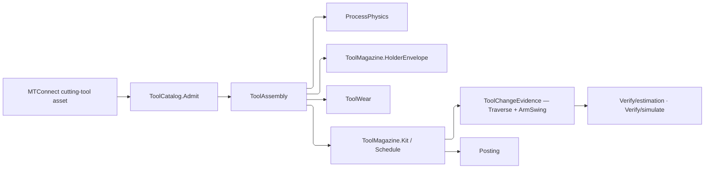

# [RASM_FABRICATION_TOOL_MAGAZINE]

`ToolAssembly` is the provider-detached physical-tool owner. Stable `Identity` survives lifecycle refreshes; `Snapshot` changes with measurements, edges, status, process ranges, reconditioning, measured offset wear, and life evidence. `ToolMagazine` admits machine-specific layout data, kits crib tools into typed slot states, schedules changes against every reserve-adjusted life basis under one selection policy, derives one `ToolChangeEvidence` per exchange, and projects the `HolderEnvelope` footprint Guard consumes.

MTConnect types stop at `ToolCatalog.Admit`, and this page is the package's ONLY provider decode: `ToolCatalog.Cutter` and `ToolCatalog.Evidence` project an admitted assembly onto the atoms floor's `CutterForm` and `ToolEvidence`, so no parallel measurement stack sits under the vocabulary floor. Every provider correspondence rides as a COLUMN on the owned row it targets and admits through one `Items`-derived index, so an unmapped provider value fails typed rather than defaulting to a domain row and no eager side table restates a vocabulary. `MetricDimension` rows own unit admission and canonical projection, so every measurement lands as one `ToolMetric` carrying its resolved canonical magnitude in millimetres, degrees, grams, or decimal fractions.

Wire posture: HOST-LOCAL. `ToolAssembly`, `ToolMagazine.Schedule`, and `ToolMagazine.HolderEnvelope` are in-process wires; provider types and controller enums stop at `ToolCatalog.Admit`. `ToolWear` life and offset evidence re-enters through `ToolIngress.Refresh` under monotone observation and consumed-life guards, so scheduling reads one `ToolSnapshot` rather than a parallel wear map.

## [01]-[INDEX]

- [02]-[TOOL_VOCABULARY]: `ToolKey`, `ToolEdgeKey`, `Magazine`, `MagazineBehavior`, `ArmSwing`, `ToolSelection`, `SlotKind`, `ToolAvailability`, `LifeBasisRow`, `MetricDimension`, `ToolMeasure`, and `ShortfallReason` — every provider correspondence carried as a column.
- [03]-[TOOL_ASSEMBLY]: `SlotAddress`, `ToolTarget`, `LifeBudget`, `MetricBand`, `ToolMetric`, `ToolEdge`, `ToolSnapshot`, `ToolAssemblyIngress`, `ToolAssembly`, `MagazineLayout`, `SlotState`, `SlotMap`, `LifeDemand`, `WorkItem`, and `MagazinePolicy`.
- [04]-[PROVIDER_CATALOG]: `CatalogSource`, `CatalogEntry`, `ToolIngress`, `MagazineSlots`, `ToolAssemblyMap`, and the `ToolCatalog` decode, atoms-floor projection, refresh, and canonical-hash fold.
- [05]-[KITTING_SCHEDULE]: `ToolChangeEvidence`, `KitShortfall`, `KitOutcome`, `ToolChange`, and the `ToolMagazine` kitting, scheduling, and `HolderEnvelope` entries.

## [02]-[TOOL_VOCABULARY]

- Owner: each row family owns one closed vocabulary AND the provider ordinals that lower onto it — `ToolMeasure` the measurement types, `ToolAvailability` the cutter statuses, `SlotKind` the placement locations, `LifeBasisRow` the life types.
- Law: a provider correspondence is a COLUMN on the row it targets, indexed once from `Items`. A parallel table keyed by the provider vocabulary has to restate every row, silently defaults the one it forgot, and materializes eagerly whether or not a decode ever runs; the column cannot forget a row and its index materializes on first read.
- Law: an unmapped provider ordinal resolves to `None` and refuses as `ToolAssetInadmissible` naming the axis. A domain row standing in for an ordinal the shop's controller emits is fabricated evidence a scheduler prices work on.
- Cases: `MetricDimension` rows carry unit admission and canonical restoration delegates; `ToolAvailability` names the atoms-floor `ToolState` it collapses onto; `ArmSwing` names how much of the layout's swing a change pays; `ToolSelection` names the life direction a crib is searched in, seat preference riding the behaviour set beside the swing it already derives; `ShortfallReason` names why a demand went unkitted.
- Law: `MagazineBehavior` realizes the kernel `ICapability` floor, so a controller's declared behaviours are one `CapabilitySet` value carrying membership, the required-set contract, and its missing-row evidence. A page-local set beside that column re-spells an algebra the kernel already owns and hands a refusing consumer no evidence of what was absent.
- Auto: every `Of` reader folds one `Lazy<FrozenDictionary>` derived from `Items`, so a new row is one declaration and the index follows it.
- Growth: a provider measurement is one `ToolMeasure` row carrying its measurement type; a lifecycle correspondence is one `ToolAvailability` row carrying its status set and its `ToolState` column; a physical dimension is one `MetricDimension` row carrying its own admission and restoration; a placement is one `SlotKind` row carrying its location set; a controller capability is one `MagazineBehavior` row; a scheduling preference is one `ToolSelection` row.
- Boundary: provider enums reach no consumer — they terminate on these columns.

```csharp
// --- [IMPORTS] -------------------------------------------------------------------------
using System.Collections.Frozen;
using System.Globalization;
using System.Linq;
using System.Threading;
using LanguageExt;
using LanguageExt.Common;
using MTConnect;
using MTConnect.Assets.CuttingTools;
using MTConnect.Assets.CuttingTools.Measurements;
using NodaTime;
using Rasm.Domain;
using Rasm.Element.Projection;
using Rasm.Fabrication.Geometry2D;
using Rasm.Fabrication.Process;
using Riok.Mapperly.Abstractions;
using Rhino.Geometry;
using Thinktecture;
using UnitsNet;
using static LanguageExt.Prelude;

namespace Rasm.Fabrication.Tooling;

// --- [TYPES] ---------------------------------------------------------------------------
[ValueObject<string>]
public sealed partial class ToolKey {
    static partial void ValidateFactoryArguments(ref ValidationError? validationError, ref string value) {
        value = value.Trim();
        validationError = Witness.Keyed(value) ? null : Validation("tool-key");
    }

    public static Fin<ToolKey> Admit(string value) => Admission.Of<ToolKey, string>(value);

    internal static ValidationError Validation(string locus) => new($"tooling:{locus}");

    internal static FabricationFault Tooling(string locus) =>
        FabricationFault.Inadmissible(FabConcern.Tooling, locus);
}

[ValueObject<string>]
public sealed partial class ToolEdgeKey {
    static partial void ValidateFactoryArguments(ref ValidationError? validationError, ref string value) {
        value = value.Trim();
        validationError = Witness.Keyed(value) ? null : ToolKey.Validation("tool-edge-key");
    }

    public static Fin<ToolEdgeKey> Admit(string value) => Admission.Of<ToolEdgeKey, string>(value);
}

[SmartEnum<string>]
public sealed partial class Magazine {
    public static readonly Magazine Carousel = new("carousel", circular: true);
    public static readonly Magazine Turret = new("turret", circular: true);
    public static readonly Magazine Chain = new("chain", circular: true);
    public static readonly Magazine Rack = new("rack", circular: false);
    public static readonly Magazine Manual = new("manual", circular: false);

    public bool Circular { get; }
}

[SmartEnum<string>]
public sealed partial class MagazineBehavior : ICapability<MagazineBehavior> {
    public static readonly MagazineBehavior Confirm = new("confirm");
    public static readonly MagazineBehavior Preselect = new("preselect");
    public static readonly MagazineBehavior FixedPot = new("fixed-pot");
    public static readonly MagazineBehavior DualArm = new("dual-arm");
    public static readonly MagazineBehavior LoadWhileRunning = new("load-while-running");
    public static readonly MagazineBehavior OrientSpindle = new("orient-spindle");
    public static readonly MagazineBehavior PreferMounted = new("prefer-mounted");
}

[SmartEnum<string>]
public sealed partial class ArmSwing {
    public static readonly ArmSwing Single = new("single", share: 1.0);
    public static readonly ArmSwing Dual = new("dual", share: 0.0);

    public double Share { get; }

    public static ArmSwing Of(CapabilitySet<MagazineBehavior> behaviors) =>
        behaviors.Admits(MagazineBehavior.DualArm) ? Dual : Single;
}

[SmartEnum<string>]
public sealed partial class ToolSelection {
    public static readonly ToolSelection SpareFirst = new("spare-first", static spare => -spare);
    public static readonly ToolSelection ExhaustFirst = new("exhaust-first", static spare => spare);

    public Func<double, double> Rank { get; }
}

[SmartEnum<string>]
public sealed partial class SlotKind {
    public static readonly SlotKind Pot = new("pot", Set(LocationType.POT));
    public static readonly SlotKind Station = new("station", Set(LocationType.STATION));
    public static readonly SlotKind Spindle = new("spindle", Set(LocationType.SPINDLE));
    public static readonly SlotKind Rack = new("rack", Set<LocationType>());
    public static readonly SlotKind Turret = new("turret", Set<LocationType>());
    public static readonly SlotKind Manual = new("manual", Set<LocationType>());

    public Set<LocationType> Provider { get; }

    private static readonly Lazy<FrozenDictionary<LocationType, SlotKind>> Index =
        new(static () => toSeq(Items).Bind(static row => row.Provider.ToSeq().Map(value => (value, row)))
                .ToDictionary(static row => row.value, static row => row.row).ToFrozenDictionary(),
            LazyThreadSafetyMode.ExecutionAndPublication);

    public static Option<SlotKind> Of(LocationType location) =>
        Index.Value.TryGetValue(location, out SlotKind? row) ? Some(row) : None;
}

[SmartEnum<string>]
public sealed partial class ToolAvailability {
    public static readonly ToolAvailability Ready = new("ready", false, false, ToolState.Available,
        Set(CutterStatusType.NEW, CutterStatusType.AVAILABLE, CutterStatusType.USED, CutterStatusType.UNALLOCATED));
    public static readonly ToolAvailability Allocated = new("allocated", false, false, ToolState.Allocated,
        Set(CutterStatusType.ALLOCATED));
    public static readonly ToolAvailability Measured = new("measured", false, false, ToolState.Measured,
        Set(CutterStatusType.MEASURED));
    public static readonly ToolAvailability Reconditioned = new("reconditioned", false, false, ToolState.Reconditioned,
        Set(CutterStatusType.RECONDITIONED));
    public static readonly ToolAvailability Quarantined = new("quarantined", true, false, ToolState.Unavailable,
        Set(CutterStatusType.UNAVAILABLE, CutterStatusType.NOT_REGISTERED, CutterStatusType.UNKNOWN));
    public static readonly ToolAvailability Expired = new("expired", true, true, ToolState.Expired,
        Set(CutterStatusType.EXPIRED));
    public static readonly ToolAvailability Broken = new("broken", true, true, ToolState.Broken,
        Set(CutterStatusType.BROKEN));
    public static readonly ToolAvailability Retired = new("retired", true, true, ToolState.Expired,
        Set<CutterStatusType>());

    public bool BlocksUse { get; }
    public bool Terminal { get; }
    public ToolState State { get; }
    public Set<CutterStatusType> Provider { get; }

    private static readonly Lazy<FrozenDictionary<CutterStatusType, ToolAvailability>> Index =
        new(static () => toSeq(Items).Bind(static row => row.Provider.ToSeq().Map(value => (value, row)))
                .ToDictionary(static row => row.value, static row => row.row).ToFrozenDictionary(),
            LazyThreadSafetyMode.ExecutionAndPublication);

    public static Option<ToolAvailability> Of(CutterStatusType status) =>
        Index.Value.TryGetValue(status, out ToolAvailability? row) ? Some(row) : None;
}

[SmartEnum<string>]
public sealed partial class LifeBasisRow {
    public static readonly LifeBasisRow Minutes = new("minutes", ToolLifeType.MINUTES, ToolLifeBasis.Minutes);
    public static readonly LifeBasisRow PartCount = new("part-count", ToolLifeType.PART_COUNT, ToolLifeBasis.PartCount);
    public static readonly LifeBasisRow Wear = new("wear", ToolLifeType.WEAR, ToolLifeBasis.Wear);

    public ToolLifeType Provider { get; }
    public ToolLifeBasis Basis { get; }

    private static readonly Lazy<FrozenDictionary<ToolLifeType, ToolLifeBasis>> Index =
        new(static () => toSeq(Items).ToDictionary(static row => row.Provider, static row => row.Basis)
                .ToFrozenDictionary(),
            LazyThreadSafetyMode.ExecutionAndPublication);

    public static Option<ToolLifeBasis> Of(ToolLifeType type) =>
        Index.Value.TryGetValue(type, out ToolLifeBasis? row) ? Some(row) : None;
}

[SmartEnum<string>]
public sealed partial class MetricDimension {
    public static readonly MetricDimension Length = new("length", "mm",
        static (value, unit) => Admit<UnitsNet.Length>(value, unit).Map(static row => row.Millimeters),
        static canonical => UnitsNet.Length.FromMillimeters(canonical));
    public static readonly MetricDimension Angle = new("angle", "deg",
        static (value, unit) => Admit<UnitsNet.Angle>(value, unit).Map(static row => row.Degrees),
        static canonical => UnitsNet.Angle.FromDegrees(canonical));
    public static readonly MetricDimension Mass = new("mass", "g",
        static (value, unit) => Admit<UnitsNet.Mass>(value, unit).Map(static row => row.Grams),
        static canonical => UnitsNet.Mass.FromGrams(canonical));
    public static readonly MetricDimension Scalar = new("scalar", "1",
        static (value, _) => double.IsFinite(value) ? Some(value) : None,
        static canonical => Ratio.FromDecimalFractions(canonical));

    public string CanonicalUnit { get; }
    public Func<double, string, Option<double>> Canonical { get; }
    public Func<double, IQuantity> Restore { get; }

    private static Option<TQuantity> Admit<TQuantity>(double value, string unit) where TQuantity : IQuantity =>
        Quantity.TryFromUnitAbbreviation(CultureInfo.InvariantCulture, value.ToQuantityValue(), unit,
            out IQuantity? quantity) && quantity is TQuantity typed ? Some(typed) : None;
}

[SmartEnum<string>]
public sealed partial class ToolMeasure {
    public static readonly ToolMeasure CuttingDiameter = Of<CuttingDiameterMeasurement>("cutting-diameter", MetricDimension.Length);
    public static readonly ToolMeasure MaximumCuttingDiameter = Of<CuttingDiameterMaxMeasurement>("maximum-cutting-diameter", MetricDimension.Length);
    public static readonly ToolMeasure CornerRadius = Of<CornerRadiusMeasurement>("corner-radius", MetricDimension.Length);
    public static readonly ToolMeasure CuttingEdgeLength = Of<CuttingEdgeLengthMeasurement>("cutting-edge-length", MetricDimension.Length);
    public static readonly ToolMeasure MaximumUsableLength = Of<UsableLengthMaxMeasurement>("maximum-usable-length", MetricDimension.Length);
    public static readonly ToolMeasure FunctionalLength = Of<FunctionalLengthMeasurement>("functional-length", MetricDimension.Length);
    public static readonly ToolMeasure OverallLength = Of<OverallToolLengthMeasurement>("overall-length", MetricDimension.Length);
    public static readonly ToolMeasure ShankDiameter = Of<ShankDiameterMeasurement>("shank-diameter", MetricDimension.Length);
    public static readonly ToolMeasure ShankLength = Of<ShankLengthMeasurement>("shank-length", MetricDimension.Length);
    public static readonly ToolMeasure ShankHeight = Of<ShankHeightMeasurement>("shank-height", MetricDimension.Length);
    public static readonly ToolMeasure CuttingEdgeAngle = Of<ToolCuttingEdgeAngleMeasurement>("cutting-edge-angle", MetricDimension.Angle);
    public static readonly ToolMeasure LeadAngle = Of<ToolLeadAngleMeasurement>("lead-angle", MetricDimension.Angle);
    public static readonly ToolMeasure PointAngle = Of<PointAngleMeasurement>("point-angle", MetricDimension.Angle);
    public static readonly ToolMeasure DriveAngle = Of<DriveAngleMeasurement>("drive-angle", MetricDimension.Angle);
    public static readonly ToolMeasure MaximumBodyLength = Of<BodyLengthMaxMeasurement>("maximum-body-length", MetricDimension.Length);
    public static readonly ToolMeasure MaximumBodyDiameter = Of<BodyDiameterMaxMeasurement>("maximum-body-diameter", MetricDimension.Length);
    public static readonly ToolMeasure MaximumDepthOfCut = Of<DepthOfCutMaxMeasurement>("maximum-depth-of-cut", MetricDimension.Length);
    public static readonly ToolMeasure InscribedCircleDiameter = Of<IncribedCircleDiameterMeasurement>("inscribed-circle-diameter", MetricDimension.Length);
    public static readonly ToolMeasure InsertWidth = Of<InsertWidthMeasurement>("insert-width", MetricDimension.Length);
    public static readonly ToolMeasure WiperEdgeLength = Of<WiperEdgeLengthMeasurement>("wiper-edge-length", MetricDimension.Length);
    public static readonly ToolMeasure Weight = Of<WeightMeasurement>("weight", MetricDimension.Mass);
    public static readonly ToolMeasure ProtrudingLength = Of<ProtrudingLengthMeasurement>("protruding-length", MetricDimension.Length);
    public static readonly ToolMeasure FlangeDiameter = Of<FlangeDiameterMeasurement>("flange-diameter", MetricDimension.Length);
    public static readonly ToolMeasure MaximumFlangeDiameter = Of<FlangeDiameterMaxMeasurement>("maximum-flange-diameter", MetricDimension.Length);
    public static readonly ToolMeasure ChamferWidth = Of<ChamferWidthMeasurement>("chamfer-width", MetricDimension.Length);
    public static readonly ToolMeasure ChamferFlatLength = Of<ChamferFlatLengthMeasurement>("chamfer-flat-length", MetricDimension.Length);
    public static readonly ToolMeasure CuttingHeight = Of<CuttingHeightMeasurement>("cutting-height", MetricDimension.Length);
    public static readonly ToolMeasure StepDiameterLength = Of<StepDiameterLengthMeasurement>("step-diameter-length", MetricDimension.Length);
    public static readonly ToolMeasure StepIncludedAngle = Of<StepIncludedAngleMeasurement>("step-included-angle", MetricDimension.Angle);
    public static readonly ToolMeasure CuttingReferencePoint = Of<CuttingReferencePointMeasurement>("cutting-reference-point", MetricDimension.Scalar);
    public static readonly ToolMeasure ToolOrientation = Of<ToolOrientationMeasurement>("tool-orientation", MetricDimension.Angle);

    public MetricDimension Dimension { get; }
    public Type Provider { get; }

    private static readonly Lazy<FrozenDictionary<Type, ToolMeasure>> Index =
        new(static () => toSeq(Items).ToDictionary(static row => row.Provider, static row => row).ToFrozenDictionary(),
            LazyThreadSafetyMode.ExecutionAndPublication);

    public static Option<ToolMeasure> Of(Type provider) =>
        Index.Value.TryGetValue(provider, out ToolMeasure? row) ? Some(row) : None;

    private static ToolMeasure Of<TMeasurement>(string key, MetricDimension dimension)
        where TMeasurement : IToolingMeasurement => new(key, dimension, typeof(TMeasurement));
}

[SmartEnum<string>]
public sealed partial class ShortfallReason {
    public static readonly ShortfallReason NoInterchangeable = new("no-interchangeable");
    public static readonly ShortfallReason FormMismatch = new("form-mismatch");
    public static readonly ShortfallReason NoFreeSlot = new("no-free-slot");
    public static readonly ShortfallReason SlotEnvelope = new("slot-envelope");
    public static readonly ShortfallReason SlotConflict = new("slot-conflict");
    public static readonly ShortfallReason AllSpent = new("all-spent");
}
```

## [03]-[TOOL_ASSEMBLY]

- Owner: `ToolKey` carries stable physical identity; `ToolSnapshot` carries mutable truth and owns metric and remaining-life lookup; `ToolAssemblyIngress` carries the admission columns and `ToolAssembly` composes them with `Tool` and the controller offset registers; `MagazineLayout` carries admitted capacity, the pot's operating envelope, index timing, and clearance; `SlotMap` owns total placement state and its reservation index; `MagazinePolicy` carries reserve, retract, controller behavior, and the selection row.
- Law: every boundary value enters through `Validate`/`Admit`, never a throwing `Create`. A generated `Create` treated as nullable made the whole decode pipeline escape as EXCEPTIONS past a `Fin`-declaring entry, so a malformed provider asset surfaced as a throw rather than a typed refusal.
- Law: the reservation sweep runs ONCE at admission and its index is HELD. Reserve spans define intervals on a magazine's own position axis, so a sorted single pass proves the whole map and a single load or reservation checks the ONE changed slot against its neighbours in the index — the prior full cross product ran inside every rebuild a load or reservation triggered.
- Law: `ToolMetric` carries its RESOLVED canonical magnitude as an admitted member. Deriving it per read re-parsed the unit on every lookup and had to answer an absence its own admission had already refused, which it did with a sentinel every downstream fold then propagated.
- Cases: `ToolTarget` distinguishes body and edge budgets; `SlotState` distinguishes empty, loaded, reserved, quarantined, and manual staging.
- Auto: generated factories reject blank identity, invalid ranges, duplicate edge keys, duplicate metric kinds, non-positive geometry, partial slot maps, duplicate physical tools, and inconsistent lifecycle evidence. Snapshot content excludes observation instants and validity windows while those fields remain on evidence.
- Result: `SlotMap.Load` and `.Reserve` return the result, so a refused placement names the conflicting slot and its occupant rather than returning the map unchanged.
- Packages: `UnitsNet` dynamic quantity admission, `NodaTime` evidence windows and durations, `FrozenDictionary` reservation index, LanguageExt.Core, Thinktecture.Runtime.Extensions, and RhinoCommon compose directly.
- Growth: a slot topology is one `Magazine` row with admitted `MagazineLayout` data.
- Boundary: provider hashes as identity, dimension-per-case metric siblings, mutable snapshot identity, parallel wear state, single-basis scheduling, absent life budgets read as exhausted, tool groups substituting for geometric interchangeability, and invented infinite capacity are deleted forms.

```csharp
// --- [MODELS] --------------------------------------------------------------------------
[ComplexValueObject]
public readonly partial struct SlotAddress {
    public SlotKind Kind { get; }
    public string MagazineId { get; }
    public int Position { get; }

    static partial void ValidateFactoryArguments(ref ValidationError? validationError, ref SlotKind kind,
        ref string magazineId, ref int position) {
        magazineId = magazineId.Trim();
        validationError = ValidityClaim.All(Witness.Keyed(magazineId), ValidityClaim.Nonnegative(position)) ? null : ToolKey.Validation("slot-address");
    }

    public static Fin<SlotAddress> Admit(SlotKind kind, string magazineId, int position) =>
        Validate(kind, magazineId, position, out SlotAddress address).Admitted(address);
}

[Union(ConversionFromValue = ConversionOperatorsGeneration.None)]
public abstract partial record ToolTarget {
    private ToolTarget() { }
    public sealed record Body : ToolTarget;
    public sealed record Edge(ToolEdgeKey Key) : ToolTarget;

    public string Locus => Switch(
        body: static _ => "body",
        edge: static row => $"edge:{row.Key.ToValue()}");
}

[ComplexValueObject]
public readonly partial struct LifeBudget {
    public ToolTarget Target { get; }
    public ToolLifeBasis Basis { get; }
    public double Used { get; }
    public double Warning { get; }
    public double Limit { get; }
    public Instant ObservedAt { get; }
    public Option<Interval> Validity { get; }

    public double Remaining => Math.Max(0.0, Limit - Used);
    public double FractionRemaining => Limit <= 0.0 ? 0.0 : Math.Clamp(Remaining / Limit, 0.0, 1.0);

    static partial void ValidateFactoryArguments(ref ValidationError? validationError, ref ToolTarget target,
        ref ToolLifeBasis basis, ref double used, ref double warning, ref double limit, ref Instant observedAt,
        ref Option<Interval> validity) =>
        validationError = !Seq(used, warning, limit).ForAll(double.IsFinite)
            || used < 0.0 || warning < 0.0 || warning > limit || limit <= 0.0
            || validity.Exists(window => !window.Contains(observedAt))
            ? ToolKey.Validation("life-budget") : null;

    public static Fin<LifeBudget> Admit(ToolTarget target, ToolLifeBasis basis, double used, double warning,
        double limit, Instant observedAt, Option<Interval> validity) =>
        Validate(target, basis, used, warning, limit, observedAt, validity, out LifeBudget budget).Admitted(budget);
}

[ComplexValueObject]
public readonly partial struct MetricBand {
    public double Value { get; }
    public Option<double> Minimum { get; }
    public Option<double> Maximum { get; }
    public Option<double> Nominal { get; }
    public string Unit { get; }
    public int SignificantDigits { get; }

    static partial void ValidateFactoryArguments(ref ValidationError? validationError, ref double value,
        ref Option<double> minimum, ref Option<double> maximum, ref Option<double> nominal,
        ref string unit, ref int significantDigits) {
        unit = unit.Trim();
        Seq<double> values = Seq(value).Concat(minimum).Concat(maximum).Concat(nominal);
        validationError = !Witness.Keyed(unit) || significantDigits < 0
            || values.Exists(static row => !double.IsFinite(row))
            || (minimum, maximum).Apply(static (lo, hi) => lo > hi).IfNone(false)
            || minimum.Exists(lo => value < lo || nominal.Exists(row => row < lo))
            || maximum.Exists(hi => value > hi || nominal.Exists(row => row > hi))
            ? ToolKey.Validation("metric-band") : null;
    }

    public static Fin<MetricBand> Admit(double value, Option<double> minimum, Option<double> maximum,
        Option<double> nominal, string unit, int significantDigits) =>
        Validate(value, minimum, maximum, nominal, unit, significantDigits, out MetricBand band).Admitted(band);
}

[ComplexValueObject]
public sealed partial class ToolMetric {
    public ToolMeasure Kind { get; }
    public MetricBand Source { get; }

    public double Canonical { get; }

    public IQuantity Quantity => Kind.Dimension.Restore(Canonical);

    static partial void ValidateFactoryArguments(ref ValidationError? validationError, ref ToolMeasure kind,
        ref MetricBand source, ref double canonical) =>
        validationError = double.IsFinite(canonical) ? null : ToolKey.Validation("tool-metric");

    public static Fin<ToolMetric> Admit(ToolMeasure kind, MetricBand source) =>
        kind.Dimension.Canonical(source.Value, source.Unit)
            .ToFin(new FabricationFault.ToolAssetInadmissible(Some(kind.Key), source.Unit))
            .Bind(canonical => Validate(kind, source, canonical, out ToolMetric metric).Admitted(metric));
}

[ComplexValueObject]
public sealed partial class ToolEdge {
    public ToolEdgeKey Key { get; }
    public Option<string> Grade { get; }
    public Option<string> Locus { get; }
    public Option<string> ProgramToolGroup { get; }
    public Seq<string> Manufacturers { get; }
    public Seq<ToolAvailability> Status { get; }
    public Seq<LifeBudget> Life { get; }
    public Seq<ToolMetric> Metrics { get; }

    public bool Spent => Status.Exists(static state => state.Terminal)
        || (!Life.IsEmpty && Life.Exists(static budget => budget.Remaining <= 0.0));

    static partial void ValidateFactoryArguments(ref ValidationError? validationError, ref ToolEdgeKey key,
        ref Option<string> grade, ref Option<string> locus, ref Option<string> programToolGroup,
        ref Seq<string> manufacturers, ref Seq<ToolAvailability> status,
        ref Seq<LifeBudget> life, ref Seq<ToolMetric> metrics) {
        grade = grade.Map(static value => value.Trim()).Filter(Witness.Keyed);
        locus = locus.Map(static value => value.Trim()).Filter(Witness.Keyed);
        programToolGroup = programToolGroup.Map(static value => value.Trim()).Filter(Witness.Keyed);
        validationError = status.IsEmpty
            || life.Exists(row => row.Target is not ToolTarget.Edge edge || edge.Key != key)
            ? ToolKey.Validation("tool-edge") : null;
    }

    public static Fin<ToolEdge> Admit(ToolEdgeKey key, Option<string> grade, Option<string> locus,
        Option<string> programToolGroup, Seq<string> manufacturers, Seq<ToolAvailability> status,
        Seq<LifeBudget> life, Seq<ToolMetric> metrics) =>
        Validate(key, grade, locus, programToolGroup, manufacturers, status, life, metrics, out ToolEdge edge)
            .Admitted(edge);
}

[ComplexValueObject]
public sealed partial class ToolSnapshot {
    public Seq<ToolAvailability> Status { get; }
    public Seq<LifeBudget> Life { get; }
    public Arr<ToolEdge> Edges { get; }
    public Seq<ToolMetric> Metrics { get; }
    public ProcessRange Feed { get; }
    public ProcessRange Spindle { get; }
    public int ReconditionCount { get; }
    public Option<int> ReconditionLimit { get; }
    public Length LengthWear { get; }
    public Length RadiusWear { get; }
    public Instant ObservedAt { get; }
    public UInt128 Content { get; }

    public bool Spent => Status.Exists(static state => state.Terminal)
        || (!Edges.IsEmpty && Edges.ForAll(static edge => edge.Spent))
        || Life.Exists(static budget => budget.Remaining <= 0.0);

    public Option<double> Metric(ToolMeasure kind) =>
        Metrics.Find(row => row.Kind == kind).Map(static row => row.Canonical);

    public Option<double> Remaining(ToolLifeBasis basis) =>
        toSeq(Life.Filter(row => row.Basis == basis)
                .Concat(Edges.Filter(static edge => !edge.Spent)
                    .Bind(edge => edge.Life.Filter(row => row.Basis == basis)))
                .Map(static row => row.Remaining).OrderBy(static value => value))
            .Head;

    static partial void ValidateFactoryArguments(ref ValidationError? validationError, ref Seq<ToolAvailability> status,
        ref Seq<LifeBudget> life, ref Arr<ToolEdge> edges, ref Seq<ToolMetric> metrics, ref ProcessRange feed,
        ref ProcessRange spindle, ref int reconditionCount, ref Option<int> reconditionLimit,
        ref Length lengthWear, ref Length radiusWear, ref Instant observedAt, ref UInt128 content) =>
        validationError = status.IsEmpty || content == UInt128.Zero || reconditionCount < 0
            || reconditionLimit.Exists(limit => limit < reconditionCount)
            || toSeq(edges).Map(static edge => edge.Key).Distinct().Count != edges.Count
            || metrics.Map(static row => row.Kind).Distinct().Count != metrics.Count
            ? ToolKey.Validation("tool-snapshot") : null;

    public static Fin<ToolSnapshot> Admit(Seq<ToolAvailability> status, Seq<LifeBudget> life, Arr<ToolEdge> edges,
        Seq<ToolMetric> metrics, ProcessRange feed, ProcessRange spindle, int reconditionCount,
        Option<int> reconditionLimit, Length lengthWear, Length radiusWear, Instant observedAt, UInt128 content) =>
        Validate(status, life, edges, metrics, feed, spindle, reconditionCount, reconditionLimit,
            lengthWear, radiusWear, observedAt, content, out ToolSnapshot snapshot).Admitted(snapshot);
}

public sealed record ToolAssemblyIngress(
    ToolKey Key,
    string SerialNumber,
    string Archetype,
    string DefinitionFormat,
    string Definition,
    Tool Tool,
    Loop Holder,
    double GaugeLength,
    double Stickout,
    double ShankDiameter,
    Length HolderAllowance,
    int ReserveBefore,
    int ReserveAfter,
    int ProgramTool,
    int LengthRegister,
    int RadiusRegister,
    Option<SlotAddress> HomeSlot,
    Option<string> ToolGroup,
    string ConnectionCode,
    OffsetPolicy EnvelopePolicy,
    ToolSnapshot Snapshot,
    UInt128 Identity);

[ComplexValueObject]
public sealed partial class ToolAssembly {
    public ToolKey Key { get; }
    public string SerialNumber { get; }
    public string Archetype { get; }
    public string DefinitionFormat { get; }
    public string Definition { get; }
    public Tool Tool { get; }
    public Loop Holder { get; }
    public double GaugeLength { get; }
    public double Stickout { get; }
    public double ShankDiameter { get; }
    public Length HolderAllowance { get; }
    public int ReserveBefore { get; }
    public int ReserveAfter { get; }
    public int ProgramTool { get; }
    public int LengthRegister { get; }
    public int RadiusRegister { get; }
    public Option<SlotAddress> HomeSlot { get; }
    public Option<string> ToolGroup { get; }
    public string ConnectionCode { get; }
    public OffsetPolicy EnvelopePolicy { get; }
    public ToolSnapshot Snapshot { get; }
    public UInt128 Identity { get; }

    public bool Spent => Snapshot.Spent;
    public ProcessRange Feed => Snapshot.Feed;
    public ProcessRange Spindle => Snapshot.Spindle;
    public EquipmentEnvelope Equipment => new(Tool, Identity, Feed, Spindle, Spent);

    public double RadiusOffset => Snapshot.Metric(ToolMeasure.CuttingDiameter)
        .OrElse(Snapshot.Metric(ToolMeasure.MaximumCuttingDiameter)).Map(static row => row * 0.5).IfNone(0.0);

    static partial void ValidateFactoryArguments(ref ValidationError? validationError, ref ToolKey key,
        ref string serialNumber, ref string archetype, ref string definitionFormat, ref string definition,
        ref Tool tool, ref Loop holder, ref double gaugeLength, ref double stickout, ref double shankDiameter,
        ref Length holderAllowance, ref int reserveBefore, ref int reserveAfter, ref int programTool,
        ref int lengthRegister, ref int radiusRegister, ref Option<SlotAddress> homeSlot, ref Option<string> toolGroup,
        ref string connectionCode, ref OffsetPolicy envelopePolicy, ref ToolSnapshot snapshot, ref UInt128 identity) {
        serialNumber = serialNumber.Trim();
        archetype = archetype.Trim();
        definitionFormat = definitionFormat.Trim();
        definition = definition.Trim();
        connectionCode = connectionCode.Trim();
        validationError = !Witness.Keyed(serialNumber) || !holder.Closed
            || !Seq(gaugeLength, stickout, shankDiameter).ForAll(static value => ValidityClaim.Positive(value).Holds)
            || holderAllowance < Length.Zero
            || !Seq(
                reserveBefore, reserveAfter, programTool, lengthRegister, radiusRegister)
                .ForAll(static value => ValidityClaim.Nonnegative(value).Holds)
            || identity == UInt128.Zero
            ? ToolKey.Validation("tool-assembly") : null;
    }

    public static Fin<ToolAssembly> Admit(ToolAssemblyIngress ingress) =>
        Validate(ingress.Key, ingress.SerialNumber, ingress.Archetype, ingress.DefinitionFormat, ingress.Definition,
            ingress.Tool, ingress.Holder, ingress.GaugeLength, ingress.Stickout, ingress.ShankDiameter,
            ingress.HolderAllowance, ingress.ReserveBefore, ingress.ReserveAfter, ingress.ProgramTool,
            ingress.LengthRegister, ingress.RadiusRegister, ingress.HomeSlot, ingress.ToolGroup,
            ingress.ConnectionCode, ingress.EnvelopePolicy, ingress.Snapshot, ingress.Identity,
            out ToolAssembly assembly).Admitted(assembly);

    public bool InterchangeableWith(ToolAssembly other) =>
        ToolGroup == other.ToolGroup && ConnectionCode == other.ConnectionCode
        && Tool == other.Tool && Holder.Equals(other.Holder) && GaugeLength == other.GaugeLength
        && Stickout == other.Stickout && ShankDiameter == other.ShankDiameter
        && HolderAllowance == other.HolderAllowance;
}

[ComplexValueObject]
public sealed partial class MagazineLayout {
    public Magazine Kind { get; }
    public string Id { get; }
    public Seq<SlotAddress> Slots { get; }
    public Length EngageClearance { get; }
    public int PreselectDistance { get; }
    public Duration IndexStep { get; }
    public Duration ArmSwing { get; }

    public int Park { get; }

    public Length SlotDiameter { get; }
    public Length SlotLength { get; }
    public Mass SlotMass { get; }

    public Option<int> Span(SlotAddress from, SlotAddress to) => from.MagazineId != Id || to.MagazineId != Id
        || !Slots.Contains(from) || !Slots.Contains(to)
        ? None
        : Some(Kind.Circular
            ? Math.Min(Math.Abs(from.Position - to.Position), Slots.Count - Math.Abs(from.Position - to.Position))
            : Math.Abs(from.Position - to.Position));

    public ToolChangeEvidence Change(Option<SlotAddress> from, SlotAddress to, ArmSwing swing) {
        int steps = from.Bind(row => Span(row, to)).IfNone(0);
        Duration traverse = IndexStep * steps;
        Duration arm = ArmSwing * swing.Share;
        return new ToolChangeEvidence(
            from.Map(static row => row.Position).IfNone(Park), to.Position, steps, traverse, arm, traverse + arm);
    }

    public bool Admits(ToolAssembly assembly) =>
        assembly.Snapshot.Metric(ToolMeasure.MaximumBodyDiameter).ForAll(row => row <= SlotDiameter.Millimeters)
        && assembly.Snapshot.Metric(ToolMeasure.OverallLength).ForAll(row => row <= SlotLength.Millimeters)
        && assembly.Snapshot.Metric(ToolMeasure.Weight).ForAll(row => row <= SlotMass.Grams);

    static partial void ValidateFactoryArguments(ref ValidationError? validationError, ref Magazine kind,
        ref string id, ref Seq<SlotAddress> slots, ref Length engageClearance, ref int preselectDistance,
        ref Duration indexStep, ref Duration armSwing, ref int park, ref Length slotDiameter, ref Length slotLength,
        ref Mass slotMass) {
        id = id.Trim();
        validationError = !Witness.Keyed(id) || slots.IsEmpty || slots.Distinct().Count != slots.Count
            || slots.Exists(slot => slot.MagazineId != id) || engageClearance < Length.Zero || preselectDistance < 0
            || (kind.Circular && (slots.Exists(slot => slot.Position >= slots.Count)
                || slots.Map(static slot => slot.Position).Distinct().Count != slots.Count))
            || indexStep < Duration.Zero || armSwing < Duration.Zero
            || !ValidityClaim.Nonnegative(park).Holds || slots.Exists(slot => slot.Position == park)
            || slotDiameter <= Length.Zero || slotLength <= Length.Zero || slotMass <= Mass.Zero? ToolKey.Validation("magazine-layout") : null;
    }

    public static Fin<MagazineLayout> Admit(Magazine kind, string id, Seq<SlotAddress> slots, Length engageClearance,
        int preselectDistance, Duration indexStep, Duration armSwing, int park, Length slotDiameter,
        Length slotLength, Mass slotMass) =>
        Validate(kind, id, slots, engageClearance, preselectDistance, indexStep, armSwing, park,
            slotDiameter, slotLength, slotMass, out MagazineLayout layout).Admitted(layout);
}

[Union(ConversionFromValue = ConversionOperatorsGeneration.None)]
public abstract partial record SlotState {
    private SlotState() { }
    public sealed record Empty : SlotState;
    public sealed record Loaded(ToolAssembly Assembly) : SlotState;
    public sealed record Reserved(Operation Operation, CutterForm Required) : SlotState;
    public sealed record Quarantined(ToolAssembly Assembly, string Reason) : SlotState;
    public sealed record Manual(ToolAssembly Assembly) : SlotState;

    public Option<ToolAssembly> Occupant => Switch(
        empty: static _ => Option<ToolAssembly>.None,
        loaded: static row => Some(row.Assembly),
        reserved: static _ => Option<ToolAssembly>.None,
        quarantined: static row => Some(row.Assembly),
        manual: static row => Some(row.Assembly));
}

public sealed class SlotMap {
    private readonly Lazy<Map<string, Seq<Reservation>>> index;

    private SlotMap(MagazineLayout layout, HashMap<SlotAddress, SlotState> slots, Seq<ToolAssembly> crib) {
        (Layout, Slots, Crib) = (layout, slots, crib);
        index = new Lazy<Map<string, Seq<Reservation>>>(
            () => Occupied(Slots), LazyThreadSafetyMode.ExecutionAndPublication);
    }

    public MagazineLayout Layout { get; }
    public HashMap<SlotAddress, SlotState> Slots { get; }
    public Seq<ToolAssembly> Crib { get; }

    private readonly record struct Reservation(int Position, int Before, int After, UInt128 Identity) {
        public int Floor => Position - Before;
        public int Reach => Position + After;
    }

    public Option<SlotAddress> SlotOf(ToolAssembly assembly) => Slots.AsIterable()
        .Choose(row => row.Value.Occupant.Filter(value => value.Identity == assembly.Identity).Map(_ => row.Key))
        .Head;

    public static Fin<SlotMap> Admit(MagazineLayout layout, HashMap<SlotAddress, SlotState> slots,
        Seq<ToolAssembly> crib) {
        Seq<UInt128> installed = slots.AsIterable().Choose(static row => row.Value.Occupant)
            .Map(static assembly => assembly.Identity).ToSeq();
        Seq<UInt128> identities = installed.Concat(crib.Map(static assembly => assembly.Identity));
        return (AdmissionSlots.Gate(slots.Count == layout.Slots.Count
                    && layout.Slots.ForAll(slots.ContainsKey), ToolKey.Tooling("slot-map:coverage")),
                AdmissionSlots.Gate(identities.Distinct().Count == identities.Count, ToolKey.Tooling("slot-map:duplicate")),
                AdmissionSlots.Gate(!crib.Exists(static assembly => assembly.Spent), ToolKey.Tooling("slot-map:spent-crib")),
                AdmissionSlots.Gate(slots.AsIterable().ForAll(static row => row.Value.Occupant
                    .ForAll(static assembly => !assembly.Spent)), ToolKey.Tooling("slot-map:spent-slot")),
                AdmissionSlots.Gate(slots.AsIterable().ForAll(static row =>
                    row.Value is not SlotState.Quarantined value || Witness.Keyed(value.Reason)),
                    ToolKey.Tooling("slot-map:quarantine-reason")))
            .Apply(static (_, _, _, _, _) => unit)
            .As()
            .ToFin()
            .Bind(_ => Sweep(Occupied(slots))
                .Match(
                    Some: conflict => Fin.Fail<SlotMap>(conflict),
                    None: () => Fin.Succ(new SlotMap(layout, slots, crib))));
    }

    public Fin<SlotMap> Load(SlotAddress slot, ToolAssembly assembly) =>
        Slots.Find(slot).Filter(static state => state is SlotState.Empty)
            .ToFin(new FabricationFault.ToolSlotConflict(slot.Position,
                Slots.Find(slot).Bind(static state => state.Occupant).Map(static row => row.Key.ToValue()),
                assembly.Key.ToValue()))
            .Bind(_ => Fits(slot, assembly.ReserveBefore, assembly.ReserveAfter, assembly.Key.ToValue()))
            .Bind(_ => Admit(Layout, Slots.SetItem(slot, new SlotState.Loaded(assembly)),
                Crib.Filter(candidate => candidate.Identity != assembly.Identity).ToSeq()));

    public Fin<SlotMap> Reserve(SlotAddress slot, Operation operation, CutterForm required) =>
        Slots.Find(slot).Filter(static state => state is SlotState.Empty)
            .ToFin(new FabricationFault.ToolSlotConflict(slot.Position,
                Slots.Find(slot).Bind(static state => state.Occupant).Map(static row => row.Key.ToValue()),
                operation.Key))
            .Bind(_ => Admit(Layout, Slots.SetItem(slot, new SlotState.Reserved(operation, required)), Crib));

    public Option<SlotAddress> FirstEmpty => Slots.AsIterable()
        .Find(static row => row.Value is SlotState.Empty).Map(static row => row.Key);

    private Fin<Unit> Fits(SlotAddress slot, int before, int after, string requested) =>
        index.Value.Find(slot.MagazineId).IfNone(Seq<Reservation>())
            .Find(row => slot.Position - before <= row.Reach && row.Floor <= slot.Position + after)
            .Match(
                Some: row => Fin.Fail<Unit>(new FabricationFault.ToolSlotConflict(
                    slot.Position, Some(ContentHash.Hex(row.Identity)), requested)),
                None: static () => Fin.Succ(unit));

    private static Map<string, Seq<Reservation>> Occupied(HashMap<SlotAddress, SlotState> slots) =>
        toSeq(slots.AsIterable()
                .Choose(static row => row.Value.Occupant.Map(assembly => (row.Key, Row: new Reservation(
                    row.Key.Position, assembly.ReserveBefore, assembly.ReserveAfter, assembly.Identity))))
                .GroupBy(static row => row.Key.MagazineId))
            .Map(static group => (group.Key,
                toSeq(group.Select(static row => row.Row).OrderBy(static row => row.Position))))
            .ToMap();

    private static Option<FabricationFault> Sweep(Map<string, Seq<Reservation>> occupied) =>
        occupied.Values
            .Bind(static rows => rows.Zip(rows.Skip(1))
                .Filter(static pair => pair.Item2.Floor <= pair.Item1.Reach)
                .Map(static pair => (FabricationFault)new FabricationFault.ToolSlotConflict(
                    pair.Item2.Position,
                    Some(ContentHash.Hex(pair.Item1.Identity)),
                    ContentHash.Hex(pair.Item2.Identity))))
            .Head;
}

[ComplexValueObject]
public sealed partial class LifeDemand {
    public HashMap<ToolLifeBasis, double> Required { get; }
    public Ratio Reserve { get; }

    static partial void ValidateFactoryArguments(ref ValidationError? validationError,
        ref HashMap<ToolLifeBasis, double> required, ref Ratio reserve) =>
        validationError = required.IsEmpty
            || required.AsIterable().Exists(static row => !ValidityClaim.Positive(row.Value).Holds)
            || reserve < Ratio.Zero || reserve > Ratio.FromPercent(100)
            ? ToolKey.Validation("life-demand") : null;

    public static Fin<LifeDemand> Admit(HashMap<ToolLifeBasis, double> required, Ratio reserve) =>
        Validate(required, reserve, out LifeDemand demand).Admitted(demand);

    public double Claim(double value, Ratio policyReserve) =>
        value * (1.0 + Math.Max(Reserve.DecimalFractions, policyReserve.DecimalFractions));

    public Option<double> Spare(ToolAssembly assembly, ToolLifeBasis basis,
        HashMap<(UInt128 Tool, ToolLifeBasis Basis), double> committed, MagazinePolicy policy) =>
        assembly.Snapshot.Remaining(basis).Map(remaining => remaining
            - committed.Find((assembly.Identity, basis)).IfNone(0.0)
            - Claim(Required.Find(basis).IfNone(0.0), policy.ReserveFloor));

    public Option<(ToolLifeBasis Basis, double Spare)> Limiting(ToolAssembly assembly,
        HashMap<(UInt128 Tool, ToolLifeBasis Basis), double> committed, MagazinePolicy policy) =>
        Required.AsIterable().Map(static row => row.Key).ToSeq()
            .Traverse(basis => Spare(assembly, basis, committed, policy).Map(spare => (Basis: basis, Spare: spare)))
            .As().Bind(static rows => toSeq(rows.OrderBy(static row => row.Spare)).Head);
}

[ComplexValueObject]
public sealed partial class WorkItem {
    public Operation Op { get; }
    public ToolAssembly Assembly { get; }
    public LifeDemand Demand { get; }
    public CutterForm Form { get; }
    public CutterForm Required { get; }
    public Ratio FormDiameterBand { get; }

    static partial void ValidateFactoryArguments(ref ValidationError? validationError, ref Operation op,
        ref ToolAssembly assembly, ref LifeDemand demand, ref CutterForm form, ref CutterForm required,
        ref Ratio formDiameterBand) =>
        validationError = formDiameterBand < Ratio.Zero || formDiameterBand > Ratio.FromPercent(100)
            ? ToolKey.Validation("work-item") : null;

    public static Fin<WorkItem> Admit(Operation op, ToolAssembly assembly, LifeDemand demand, CutterForm form,
        CutterForm required, Ratio formDiameterBand) =>
        Validate(op, assembly, demand, form, required, formDiameterBand, out WorkItem item).Admitted(item);
}

[ComplexValueObject]
public sealed partial class MagazinePolicy {
    public CapabilitySet<MagazineBehavior> Behaviors { get; }
    public ToolSelection Selection { get; }
    public Ratio ReserveFloor { get; }
    public Length SafeRetract { get; }

    public ArmSwing Swing => ArmSwing.Of(Behaviors);

    public (int Seat, double Life) Order(Option<ToolAssembly> mounted, ToolAssembly candidate, double spare) => (
        Behaviors.Admits(MagazineBehavior.PreferMounted)
            && mounted.Exists(row => row.Identity == candidate.Identity) ? 0 : 1,
        Selection.Rank(spare));

    static partial void ValidateFactoryArguments(ref ValidationError? validationError,
        ref CapabilitySet<MagazineBehavior> behaviors, ref ToolSelection selection, ref Ratio reserveFloor,
        ref Length safeRetract) =>
        validationError = reserveFloor < Ratio.Zero || reserveFloor > Ratio.FromPercent(100)
            || safeRetract < Length.Zero
            ? ToolKey.Validation("magazine-policy") : null;

    public static Fin<MagazinePolicy> Admit(CapabilitySet<MagazineBehavior> behaviors, ToolSelection selection,
        Ratio reserveFloor, Length safeRetract) =>
        Validate(behaviors, selection, reserveFloor, safeRetract, out MagazinePolicy policy).Admitted(policy);
}
```

## [04]-[PROVIDER_CATALOG]

- Owner: `ToolCatalog` owns the ONE provider decode in the package, the atoms-floor projection, the telemetry refresh, and the canonical snapshot preimage; `ToolAssemblyMap` owns the refresh rebase; `MagazineSlots` owns the durable placement stream spellings.
- Cases: `CatalogSource` distinguishes provider digest from telemetry content; `ToolIngress` distinguishes asset admission and telemetry refresh.
- Entry: `ToolCatalog.Admit(ToolIngress, Option<InstrumentSet>)` is the one catalog boundary and `ToolCatalog.Cutter`/`ToolCatalog.Evidence` are the one crossing onto the atoms floor; the set defaults absent for headless admission.
- Law: `Process/owner` reads no provider surface, so an admitted assembly becomes the atoms floor's cutter geometry and tool evidence HERE. Both project off `ToolMetric` rows this catalog already resolved into canonical millimetres, degrees, and grams, so the crossing is one lookup per column rather than a second measurement decode under the vocabulary floor.
- Law: `ToolEvidence.Admit` takes the assembly's own KEY as its tool identifier and its serial as the serial. Passing the serial into both slots left every tool identified by a number the controller never programs it under, so a telemetry join against the machine's tool table matched nothing.
- Auto: a refresh advances the observation instant, preserves the exact target-basis and edge-key sets, never lowers consumed life, and retains every terminal body or edge state; every column the rebase carries unchanged GENERATES and the snapshot is the one slot it swaps, so a new assembly column cannot silently drop out of a refresh.
- Result: `CatalogEntry` carries admitted assembly, optional slot, typed source evidence, and observation time. `ToolCatalog.Admit` writes a telemetry-sourced result's refresh interval through `FabricationInstruments.ToolRefreshAge`; a provider-digest source writes nothing. `MagazineSlots` names the `store.fabrication.magazine.<verb>` streams committed slot-map mutations and the re-admitted placement census ride on the Persistence slot registry, so crib state survives restart without a parallel in-memory registry.
- Law: every preimage on this page frames through `Process/owner#RUN_DISPATCH` `FabricationCanon` over the one `Rasm.Element` `CanonicalWriter` and closes on `Ordered`. A page-local byte kernel stringifying each field and length-framing it by hand was a second codec beside that writer: it wrote absent optionals as the empty string an empty value already occupies, read generated rows through `.Key` rather than the discriminant framing, and rendered every double through a text formatter the codec encodes directly.
- Packages: MTConnect.NET-Common cutting-tool model, `Riok.Mapperly` for the rebase, `Process/owner` (`FabricationCanon.Ordered`), `Rasm.Domain` (`ContentHash.Hex`, `CapabilitySet`), `Process/telemetry` (`FabricationInstruments`), LanguageExt.Core, and Thinktecture.Runtime.Extensions compose directly.
- Growth: a provider measurement is one `ToolMeasure` row; a lifecycle correspondence is one `ToolAvailability` row.
- Boundary: no provider type crosses out of this cluster, and the atoms floor admits scalars alone. A second byte codec beside the writer, a hand `x32` spelling of `ContentHash.Hex`, an empty string standing for an absent optional in a preimage, and a magic-zero register standing for an unset one are deleted forms.

```csharp
// --- [BOUNDARIES] ----------------------------------------------------------------------
[Union(ConversionFromValue = ConversionOperatorsGeneration.None)]
public abstract partial record CatalogSource {
    private CatalogSource() { }
    public sealed record Provider(string Digest) : CatalogSource;
    public sealed record Telemetry(UInt128 Content, Instant Previous) : CatalogSource;
}

public sealed record CatalogEntry(ToolAssembly Assembly, Option<SlotAddress> Slot, CatalogSource Source,
    Instant ObservedAt);

[Union(ConversionFromValue = ConversionOperatorsGeneration.None)]
public abstract partial record ToolIngress {
    private ToolIngress() { }
    public sealed record Asset(CuttingToolAsset Value, Tool Tool, Loop Holder, OffsetPolicy EnvelopePolicy,
        Length HolderAllowance, Option<int> LengthRegister, Option<int> RadiusRegister,
        Instant ObservedAt) : ToolIngress;
    public sealed record Refresh(ToolAssembly Current, Seq<LifeBudget> Life, Seq<ToolAvailability> Status,
        Arr<ToolEdge> Edges, Length LengthWear, Length RadiusWear, Instant ObservedAt) : ToolIngress;
}

public static class MagazineSlots {
    public const string Exchange = "store.fabrication.magazine.exchange";
    public const string Census = "store.fabrication.magazine.census";
}

[Mapper(RequiredMappingStrategy = RequiredMappingStrategy.Target,
    EnabledConversions = MappingConversionType.None)]
public static partial class ToolAssemblyMap {
    [MapperIgnoreSource(nameof(ToolAssembly.Spent))]
    [MapperIgnoreSource(nameof(ToolAssembly.Feed))]
    [MapperIgnoreSource(nameof(ToolAssembly.Spindle))]
    [MapperIgnoreSource(nameof(ToolAssembly.Equipment))]
    [MapperIgnoreSource(nameof(ToolAssembly.RadiusOffset))]
    public static partial ToolAssemblyIngress Rebase(ToolAssembly current);
}

// --- [OPERATIONS] ----------------------------------------------------------------------
public static class ToolCatalog {
    public static Fin<CatalogEntry> Admit(ToolIngress ingress, Option<InstrumentSet> set = default) =>
        from result in ingress.Switch(
            asset: static row => AdmitAsset(row),
            refresh: static row => Refresh(row))
        from _refresh in result.Source is CatalogSource.Telemetry telemetry
            ? set.Write(FabricationInstruments.ToolRefreshAge, (result.ObservedAt - telemetry.Previous).TotalSeconds)
            : Fin.Succ(unit)
        select result;

    private static Fin<Unit> Schema(CuttingToolAsset asset) {
        AssetValidationResult validation = asset.IsValid(MTConnectVersions.Version24);
        return validation.IsValid
            ? Fin.Succ(unit)
            : Fin.Fail<Unit>(new FabricationFault.ToolAssetInadmissible(
                Optional(asset.ToolId), validation.Message));
    }

    private static Fin<CatalogEntry> AdmitAsset(ToolIngress.Asset request) =>
        from _ in Schema(request.Value)
        from lifecycle in Optional(request.Value.CuttingToolLifeCycle)
            .ToFin(Asset(request.Value, "lifecycle"))
        from metrics in toSeq(lifecycle.Measurements).Traverse(AdmitMetric).As()
        from edges in toSeq(lifecycle.CuttingItems).Traverse(item => AdmitEdge(item, request.ObservedAt)).As()
            .Map(static rows => rows.ToArr())
        from life in toSeq(lifecycle.ToolLife)
            .Traverse(row => AdmitLife(new ToolTarget.Body(), row, request.ObservedAt)).As()
        from status in Status(lifecycle.CutterStatus, request.Value)
        from identityText in Optional(request.Value.SerialNumber).Filter(Witness.Keyed)
            .OrElse(Optional(request.Value.ToolId).Filter(Witness.Keyed))
            .Map(static value => value.Trim())
            .ToFin(Asset(request.Value, "serial-number"))
        from key in ToolKey.Admit(identityText)
        from programTool in int.TryParse(lifecycle.ProgramToolNumber, NumberStyles.Integer,
            CultureInfo.InvariantCulture, out int toolNumber)
            ? Fin.Succ(toolNumber)
            : Fin.Fail<int>(Asset(request.Value, "program-tool-number"))
        let feedRate = Optional(lifecycle.ProcessFeedRate)
        let spindleSpeed = Optional(lifecycle.ProcessSpindleSpeed)
        from feed in Range(
            feedRate.Bind(static row => Optional(row.Minimum)), feedRate.Bind(static row => Optional(row.Maximum)),
            feedRate.Bind(static row => Optional(row.Nominal)), feedRate.Bind(static row => Optional(row.Value)),
            request.Value, "feed")
        from spindle in Range(
            spindleSpeed.Bind(static row => Optional(row.Minimum)), spindleSpeed.Bind(static row => Optional(row.Maximum)),
            spindleSpeed.Bind(static row => Optional(row.Nominal)), spindleSpeed.Bind(static row => Optional(row.Value)),
            request.Value, "spindle")
        let placement = AdmitPlacement(lifecycle.Location)
        let stable = FabricationCanon.Ordered(ExactGrid, writer => writer
            .String(identityText).Maybe(Optional(request.Value.ToolId), static (sink, row) => sink.String(row)))
        let reconditionCount = lifecycle.ReconditionCount?.Value ?? 0
        let reconditionLimit = Optional(lifecycle.ReconditionCount?.MaximumCount)
        from state in ToolSnapshot.Admit(status, life, edges, metrics, feed, spindle,
            reconditionCount, reconditionLimit, Length.Zero, Length.Zero, request.ObservedAt,
            SnapshotContent(stable, status, life, edges, metrics, feed, spindle,
                reconditionCount, reconditionLimit, Length.Zero, Length.Zero))
        from gauge in Measured(state, ToolMeasure.FunctionalLength, identityText)
        from stickout in Measured(state, ToolMeasure.ProtrudingLength, identityText)
        from shank in Measured(state, ToolMeasure.ShankDiameter, identityText)
        from assembly in ToolAssembly.Admit(new ToolAssemblyIngress(identityText,
            request.Value.CuttingToolArchetypeReference?.ToString() ?? string.Empty,
            request.Value.CuttingToolDefinition?.Format.ToString() ?? string.Empty,
            request.Value.CuttingToolDefinition?.Value ?? string.Empty, request.Tool, request.Holder,
            gauge, stickout, shank, request.HolderAllowance,
            placement.Map(static row => row.ReserveBefore).IfNone(0),
            placement.Map(static row => row.ReserveAfter).IfNone(0), programTool,
            request.LengthRegister.IfNone(programTool), request.RadiusRegister.IfNone(programTool),
            placement.Map(static row => row.Address),
            Optional(lifecycle.ProgramToolGroup), lifecycle.ConnectionCodeMachineSide ?? string.Empty,
            request.EnvelopePolicy, state, stable))
        select new CatalogEntry(assembly, placement.Map(static row => row.Address),
            new CatalogSource.Provider(request.Value.GenerateHash(includeTimestamp: false)), request.ObservedAt);

    private const double ExactGrid = 0.0;

    private static Fin<double> Measured(ToolSnapshot snapshot, ToolMeasure kind, string toolId) =>
        snapshot.Metric(kind).ToFin(new FabricationFault.ToolAssetInadmissible(Some(toolId), kind.Key));

    public static Fin<CutterForm> Cutter(ToolAssembly assembly, CutterFamily family) =>
        from diameter in assembly.Snapshot.Metric(ToolMeasure.CuttingDiameter)
            .ToFin(new FabricationFault.ToolAssetInadmissible(
                Some(assembly.Key.ToValue()), ToolMeasure.CuttingDiameter.Key))
        from flute in (assembly.Snapshot.Metric(ToolMeasure.CuttingEdgeLength)
                | assembly.Snapshot.Metric(ToolMeasure.MaximumUsableLength))
            .ToFin(new FabricationFault.ToolAssetInadmissible(
                Some(assembly.Key.ToValue()), ToolMeasure.CuttingEdgeLength.Key))
        from evidence in Evidence(assembly)
        from form in CutterForm.Admit(new CutterIngress(
            family,
            diameter,
            assembly.Snapshot.Metric(ToolMeasure.CornerRadius).IfNone(0.0),
            Taper(family, assembly.Snapshot),
            flute,
            Metrics(assembly.Snapshot),
            Option<int>.None,
            Some(evidence)))
        select form;

    private static readonly Seq<(CutterMetric Target, ToolMeasure Source, Func<double, double> Scale)> Crossing = Seq(
        (CutterMetric.UsableLength, ToolMeasure.MaximumUsableLength, identity),
        (CutterMetric.FunctionalLength, ToolMeasure.FunctionalLength, identity),
        (CutterMetric.OverallLength, ToolMeasure.OverallLength, identity),
        (CutterMetric.ShankDiameter, ToolMeasure.ShankDiameter, identity),
        (CutterMetric.MaxDepth, ToolMeasure.MaximumDepthOfCut, identity),
        (CutterMetric.LeadAngle, ToolMeasure.LeadAngle, identity),
        (CutterMetric.PointAngle, ToolMeasure.PointAngle, identity),
        (CutterMetric.Orientation, ToolMeasure.ToolOrientation, identity),
        (CutterMetric.Mass, ToolMeasure.Weight, static grams => Mass.FromGrams(grams).Kilograms),
        (CutterMetric.ProtrudingLength, ToolMeasure.ProtrudingLength, identity),
        (CutterMetric.BodyDiameter, ToolMeasure.MaximumBodyDiameter, identity));

    private static Map<CutterMetric, double> Metrics(ToolSnapshot snapshot) => Crossing
        .Choose(row => snapshot.Metric(row.Source).Map(value => (row.Target, Value: row.Scale(value))))
        .Fold(Map<CutterMetric, double>(), static (index, row) => index.AddOrUpdate(row.Target, row.Value));

    public static Fin<ToolEvidence> Evidence(ToolAssembly assembly) =>
        ToolEvidence.Admit(
            assembly.Key.ToValue(),
            assembly.SerialNumber,
            ContentHash.Hex(assembly.Identity),
            toSet(assembly.Snapshot.Status.Map(static row => row.State)),
            assembly.Snapshot.Life
                .Filter(static row => row.Target is ToolTarget.Body)
                .Map(static row => new ToolLifeEvidence(
                    row.Basis, row.Used, Some(0.0), Some(row.Limit), Some(row.Warning), CountsUp: true)),
            Some(new FeedEnvelope(
                assembly.Feed.Minimum.Map(Speed.FromMillimetersPerMinutes),
                assembly.Feed.Maximum.Map(Speed.FromMillimetersPerMinutes),
                assembly.Feed.Nominal.Map(Speed.FromMillimetersPerMinutes))),
            Some(new SpindleEnvelope(
                assembly.Spindle.Minimum.Map(RotationalSpeed.FromRevolutionsPerMinute),
                assembly.Spindle.Maximum.Map(RotationalSpeed.FromRevolutionsPerMinute),
                assembly.Spindle.Nominal.Map(RotationalSpeed.FromRevolutionsPerMinute))),
            Some(assembly.ProgramTool.ToString(CultureInfo.InvariantCulture)),
            assembly.ToolGroup,
            Some(assembly.Snapshot.ReconditionCount),
            assembly.Snapshot.ReconditionLimit,
            assembly.Snapshot.Edges.Map(static edge => edge.Key.ToValue()).ToSeq(),
            assembly.Snapshot.Edges.ToSeq().Choose(static edge => edge.Grade));

    private static double Taper(CutterFamily family, ToolSnapshot snapshot) => family.TaperFrom.Switch(
        state: snapshot,
        flat: static _ => 0.0,
        edgeAngle: static row => row.Metric(ToolMeasure.CuttingEdgeAngle).IfNone(0.0),
        halfPointAngle: static row => row.Metric(ToolMeasure.PointAngle).Map(static angle => angle * 0.5).IfNone(0.0));

    private static Fin<CatalogEntry> Refresh(ToolIngress.Refresh request) =>
        from _ in request.ObservedAt > request.Current.Snapshot.ObservedAt
            ? Fin.Succ(unit)
            : Fin.Fail<Unit>(ToolKey.Tooling("tool-refresh:stale"))
        from __ in Monotone(request.Current.Snapshot, request.Life, request.Status, request.Edges)
            ? Fin.Succ(unit)
            : Fin.Fail<Unit>(ToolKey.Tooling("tool-refresh:regressed"))
        from next in ToolSnapshot.Admit(request.Status, request.Life, request.Edges,
            request.Current.Snapshot.Metrics, request.Current.Feed, request.Current.Spindle,
            request.Current.Snapshot.ReconditionCount, request.Current.Snapshot.ReconditionLimit,
            request.LengthWear, request.RadiusWear, request.ObservedAt,
            SnapshotContent(request.Current.Identity, request.Status, request.Life, request.Edges,
                request.Current.Snapshot.Metrics, request.Current.Feed, request.Current.Spindle,
                request.Current.Snapshot.ReconditionCount, request.Current.Snapshot.ReconditionLimit,
                request.LengthWear, request.RadiusWear))
        from assembly in ToolAssembly.Admit(ToolAssemblyMap.Rebase(request.Current) with { Snapshot = next })
        select new CatalogEntry(assembly, request.Current.HomeSlot,
            new CatalogSource.Telemetry(next.Content, request.Current.Snapshot.ObservedAt), request.ObservedAt);

    private static bool Monotone(ToolSnapshot previous, Seq<LifeBudget> life,
        Seq<ToolAvailability> status, Arr<ToolEdge> edges) {
        Seq<LifeBudget> priorLife = previous.Life.Concat(previous.Edges.Bind(static edge => edge.Life));
        Seq<LifeBudget> nextLife = life.Concat(edges.Bind(static edge => edge.Life));
        Seq<(string Target, ToolLifeBasis Basis)> priorKeys = priorLife
            .Map(static row => (row.Target.Locus, row.Basis));
        Seq<(string Target, ToolLifeBasis Basis)> nextKeys = nextLife
            .Map(static row => (row.Target.Locus, row.Basis));
        bool unique = priorKeys.Distinct().Count == priorKeys.Count && nextKeys.Distinct().Count == nextKeys.Count;
        bool coverage = priorKeys.ForAll(nextKeys.Contains) && nextKeys.ForAll(priorKeys.Contains);
        bool exposure = priorLife.ForAll(prior => nextLife
            .Find(row => row.Basis == prior.Basis && row.Target.Locus == prior.Target.Locus)
            .Exists(row => row.Used >= prior.Used));
        bool bodyStatus = previous.Status.Filter(static row => row.Terminal).ForAll(status.Contains);
        Seq<ToolEdgeKey> priorEdges = previous.Edges.Map(static edge => edge.Key).ToSeq();
        Seq<ToolEdgeKey> nextEdges = edges.Map(static edge => edge.Key).ToSeq();
        bool edgeCoverage = priorEdges.ForAll(nextEdges.Contains) && nextEdges.ForAll(priorEdges.Contains);
        bool edgeStatus = previous.Edges.ForAll(prior => edges.Find(row => row.Key == prior.Key)
            .Exists(next => prior.Status.Filter(static row => row.Terminal).ForAll(next.Status.Contains)));
        return unique && coverage && exposure && bodyStatus && edgeCoverage && edgeStatus;
    }

    private static Fin<ToolMetric> AdmitMetric(IToolingMeasurement measurement) =>
        from kind in ToolMeasure.Of(measurement.GetType())
            .ToFin(new FabricationFault.ToolAssetInadmissible(
                Some(measurement.GetType().Name), nameof(IToolingMeasurement)))
        let token = Witness.Keyed(measurement.Units)
            ? measurement.Units
            : Witness.Keyed(measurement.NativeUnits) ? measurement.NativeUnits : kind.Dimension.CanonicalUnit
        from source in MetricBand.Admit(measurement.Value, Optional(measurement.Minimum),
            Optional(measurement.Maximum), Optional(measurement.Nominal), token, measurement.SignificantDigits)
        from metric in ToolMetric.Admit(kind, source)
        select metric;

    private static Fin<ToolEdge> AdmitEdge(ICuttingItem item, Instant observedAt) =>
        from key in ToolEdgeKey.Admit(item.ItemId ?? string.Join('-', item.Indices))
        from metrics in toSeq(item.Measurements).Traverse(AdmitMetric).As()
        from life in toSeq(item.ItemLife).Traverse(row => AdmitLife(new ToolTarget.Edge(key), row, observedAt)).As()
        from status in Status(item.CutterStatus, item)
        from edge in ToolEdge.Admit(key, Optional(item.Grade), Optional(item.Locus),
            Optional(item.ProgramToolGroup), toSeq(item.Manufacturers), status, life, metrics)
        select edge;

    private static Fin<LifeBudget> AdmitLife(ToolTarget target, IToolLife life, Instant observedAt) =>
        from basis in LifeBasisRow.Of(life.Type)
            .ToFin(new FabricationFault.ToolAssetInadmissible(Some(target.Locus), life.Type.ToString()))
        let used = life.CountDirection == CountDirectionType.DOWN
            ? life.Initial - life.Value : life.Value - life.Initial
        from budget in LifeBudget.Admit(target, basis, Math.Max(0.0, used),
            Math.Abs(life.Warning - life.Initial), Math.Abs(life.Limit - life.Initial), observedAt, None)
        select budget;

    private static Fin<Seq<ToolAvailability>> Status(IEnumerable<CutterStatusType> status, object subject) =>
        toSeq(status).Traverse(value => ToolAvailability.Of(value)
                .ToFin(new FabricationFault.ToolAssetInadmissible(Some(subject.GetType().Name), value.ToString()))).As()
            .Map(static rows => rows.Distinct().ToSeq());

    private static readonly Seq<Func<ILocation, string?>> Containers = Seq<Func<ILocation, string?>>(
        static row => row.ToolMagazine, static row => row.Turret, static row => row.ToolRack,
        static row => row.ToolBar, static row => row.AutomaticToolChanger);

    private static Option<(SlotAddress Address, int ReserveBefore, int ReserveAfter)> AdmitPlacement(ILocation? location) =>
        from value in Optional(location)
        from kind in SlotKind.Of(value.Type)
        from position in int.TryParse(value.Value, NumberStyles.Integer, CultureInfo.InvariantCulture, out int parsed)
            ? Some(parsed) : None
        from magazineId in Containers.Choose(read => Optional(read(value)).Filter(Witness.Keyed)).Head
        from address in SlotAddress.Admit(kind, magazineId, position).ToOption()
        select (Address: address, ReserveBefore: Math.Max(0, value.NegativeOverlap ?? 0),
            ReserveAfter: Math.Max(0, value.PositiveOverlap ?? 0));

    private static UInt128 SnapshotContent(UInt128 identity, Seq<ToolAvailability> status,
        Seq<LifeBudget> life, Arr<ToolEdge> edges, Seq<ToolMetric> metrics, ProcessRange feed,
        ProcessRange spindle, int reconditionCount, Option<int> reconditionLimit,
        Length lengthWear, Length radiusWear) =>
        FabricationCanon.Ordered(ExactGrid, writer => writer
            .U128(identity)
            .Rows(toSeq(status.OrderBy(static row => row.Key)), Discriminated)
            .Rows(toSeq(life.OrderBy(static row => row.Target.Locus).ThenBy(static row => row.Basis.Key)), LifeBytes)
            .Rows(toSeq(edges.OrderBy(static edge => edge.Key.ToValue())), EdgeBytes)
            .Rows(toSeq(metrics.OrderBy(static row => row.Kind.Key)), MetricBytes)
            .Rows(Seq(feed, spindle), RangeBytes)
            .Ordinal(reconditionCount)
            .Maybe(reconditionLimit, static (sink, row) => sink.Ordinal(row))
            .Double(lengthWear.Millimeters)
            .Double(radiusWear.Millimeters));

    private static CanonicalWriter Discriminated<TRow>(CanonicalWriter writer, TRow row)
        where TRow : ISmartEnum<string>, IConvertible<string> => writer.Discriminant(row);

    private static CanonicalWriter LifeBytes(CanonicalWriter writer, LifeBudget life) => writer
        .String(life.Target.Locus).Discriminant(life.Basis)
        .Double(life.Used).Double(life.Warning).Double(life.Limit);

    private static CanonicalWriter EdgeBytes(CanonicalWriter writer, ToolEdge edge) => writer
        .String(edge.Key.ToValue())
        .Maybe(edge.Grade, Texted)
        .Maybe(edge.Locus, Texted)
        .Maybe(edge.ProgramToolGroup, Texted)
        .Rows(toSeq(edge.Manufacturers.OrderBy(static row => row)), Texted)
        .Rows(toSeq(edge.Status.OrderBy(static row => row.Key)), Discriminated)
        .Rows(toSeq(edge.Life.OrderBy(static row => row.Basis.Key)), LifeBytes)
        .Rows(toSeq(edge.Metrics.OrderBy(static row => row.Kind.Key)), MetricBytes);

    private static CanonicalWriter MetricBytes(CanonicalWriter writer, ToolMetric metric) => writer
        .Discriminant(metric.Kind).String(metric.Kind.Dimension.CanonicalUnit).Double(metric.Canonical)
        .Double(metric.Source.Value)
        .Maybe(metric.Source.Minimum, Numbered)
        .Maybe(metric.Source.Maximum, Numbered)
        .Maybe(metric.Source.Nominal, Numbered)
        .String(metric.Source.Unit).Ordinal(metric.Source.SignificantDigits);

    private static CanonicalWriter RangeBytes(CanonicalWriter writer, ProcessRange range) => writer
        .Maybe(range.Minimum, Numbered).Maybe(range.Maximum, Numbered)
        .Maybe(range.Nominal, Numbered).Maybe(range.Current, Numbered);

    private static CanonicalWriter Texted(CanonicalWriter writer, string value) => writer.String(value);

    private static CanonicalWriter Numbered(CanonicalWriter writer, double value) => writer.Double(value);

    private static Fin<ProcessRange> Range(Option<double> minimum, Option<double> maximum, Option<double> nominal,
        Option<double> current, CuttingToolAsset asset, string axis) =>
        ProcessRange.TryCreate(minimum, maximum, nominal, current, out ProcessRange range)
            ? Fin.Succ(range)
            : Fin.Fail<ProcessRange>(Asset(asset, $"{axis}-range"));

    private static FabricationFault Asset(CuttingToolAsset asset, string axis) =>
        new FabricationFault.ToolAssetInadmissible(Optional(asset.ToolId), axis);
}
```

## [05]-[KITTING_SCHEDULE]

- Owner: `ToolMagazine` owns kitting, scheduling, and `HolderEnvelope`; `ToolChangeEvidence` owns the exchange clock; `KitOutcome` owns the kitting fold's state and its terminal reading; `ToolChange` owns one exchange's bindings.
- Law: `KitOutcome` carries loaded, staged, quarantined, and shortfall rows directly; it is not content-addressed.
- Law: `ToolChangeEvidence` is the ONE exchange clock and `Elapsed` is DERIVED — `Traverse + ArmSwing`, with the traverse read off the layout's own slot-index distance and the swing share off the `ArmSwing` row the policy's behaviours select. A caller-supplied elapsed literal is the deleted form, and the two halves stay separate columns because a consumer pricing an overlapped change reads which half it can hide.
- Law: every exchange names a REAL ordinal pair. A change out of an empty spindle starts at the layout's declared `Park` — the changer station, which no pot may occupy — so its index distance is zero by that layout's own definition and the elapsed span collapses to the arm swing through the same arithmetic every other change takes. An absence carrier on the ordinal, or a sentinel standing for "no prior slot", would leave a consumer keying exchanges on an ordered pair holding two shapes for one fact.
- Law: a refused reservation SURFACES. Silently returning the map unchanged left the result claiming a reservation the crib never held and the next demand competing for the same slot.
- Entry: `ToolMagazine.Kit(SlotMap, Seq<WorkItem>, MagazinePolicy)`, `.Schedule(SlotMap, Seq<WorkItem>, MagazinePolicy)`, and `.HolderEnvelope(ToolAssembly)` are one entry per distinct result consumer. Layout and magazine kind derive from `SlotMap`; holder allowance derives from `ToolAssembly`.
- Auto: kitting classifies each demand through ONE declared resolver run folded until the first candidate answers, so a new sourcing route is a row rather than another nesting level; every requested life basis resolves on the candidate or that candidate is not selectable; reserve is committed with demand; preselection resolves against the next change's slot within `PreselectDistance`.
- Result: `KitOutcome` carries loaded, staged, quarantined, and reason-bearing shortfall rows over a slot map holding real reservations; `ToolChange` carries physical and controller bindings, both offset registers, geometry and measured wear offsets, its `ToolChangeEvidence`, limiting-life evidence, and the next slot to preselect.
- Packages: `PolygonAlgebra` offsets the holder profile; LanguageExt.Core owns the folds and result types.
- Growth: a sourcing route is one `Resolvers` row.
- Boundary: the magazine swap schedule is a PAGING problem over caller-supplied placement — an assignment solver over a cost matrix models a placement decision this page does not own and is a declared refusal, not an omission. Preselection naming its own slot, reserve that is checked but not committed, and shortfall rows without a reason are deleted forms.

```csharp
public readonly record struct ToolChangeEvidence(int FromSlot, int ToSlot, int IndexSteps,
    Duration Traverse, Duration ArmSwing, Duration Elapsed);

public sealed record KitShortfall(Operation Op, CutterForm Required, ShortfallReason Reason);

public sealed record KitOutcome(Seq<ToolAssembly> Loaded, Seq<ToolAssembly> Staged,
    Seq<(Operation Op, CutterForm Required)> Reserved, Seq<ToolAssembly> Quarantined,
    Seq<KitShortfall> Missing, SlotMap Slots);

public readonly record struct ToolChange(Operation Op, double Trigger, SlotAddress Slot,
    int ProgramTool, int LengthRegister, int RadiusRegister, double LengthOffset, double RadiusOffset,
    double LengthWearOffset, double RadiusWearOffset, double Retract, ToolChangeEvidence Evidence,
    CapabilitySet<MagazineBehavior> Behaviors, ToolAssembly Assembly, Option<ToolAssembly> Previous,
    Option<SlotAddress> PreviousSlot, Option<string> ToolGroup, Option<SlotAddress> PreselectedSlot,
    ToolLifeBasis LimitingBasis, double RemainingAfterDemand);

// --- [OPERATIONS] ----------------------------------------------------------------------
public static class ToolMagazine {
    public static Fin<KitOutcome> Kit(SlotMap slots, Seq<WorkItem> work, MagazinePolicy policy) => work.IsEmpty
        ? Fin.Fail<KitOutcome>(ToolKey.Tooling("magazine-kit:empty"))
        : toSeq(work.DistinctBy(static row =>
                (row.Assembly.Identity, row.Required, row.FormDiameterBand)))
            .FoldM<Fin, KitOutcome>(Seed(slots), (result, demand) => Allocate(result, demand, policy)).As();

    public static Fin<Seq<ToolChange>> Schedule(SlotMap slots, Seq<WorkItem> work, MagazinePolicy policy) =>
        from state in work.FoldM<Fin, ScheduleState>(ScheduleState.Empty,
            (current, item) => Step(current, slots, item, policy)).As()
        select Preselect(state.Changes, slots.Layout, policy);

    public static Fin<Loop> HolderEnvelope(ToolAssembly assembly) =>
        ValidityClaim.All(
            assembly.Holder.Closed, ValidityClaim.Positive(assembly.GaugeLength),
            ValidityClaim.Positive(assembly.Stickout))
            ? PolygonAlgebra.Apply(new PolygonOp.Offset(Seq(assembly.Holder),
                    new OffsetField.Uniform(Math.Max(assembly.ShankDiameter * 0.5
                        + assembly.HolderAllowance.Millimeters, 0.0)),
                    JoinType.Round, EndType.Closed, assembly.EnvelopePolicy))
                .Bind(trace => trace.Regioned(Geometry(assembly, "holder-envelope:trace"))
                    .Bind(topology => topology.Nodes.Filter(static node => !node.IsHole).Map(static node => node.Boundary)
                        .Head.ToFin(Geometry(assembly, "holder-envelope:no-outer"))))
            : Fin.Fail<Loop>(Geometry(assembly, "holder-envelope:input"));

    private static FabricationFault Geometry(ToolAssembly assembly, string axis) =>
        FabricationFault.Equipment(new EquipmentWitness.Geometry(assembly.Tool, axis));

    private static KitOutcome Seed(SlotMap slots) => new(
        slots.Slots.AsIterable().Choose(static row =>
            row.Value is SlotState.Loaded or SlotState.Manual ? row.Value.Occupant : None).ToSeq(),
        Seq<ToolAssembly>(),
        Seq<(Operation Op, CutterForm Required)>(),
        slots.Slots.AsIterable().Choose(static row =>
            row.Value is SlotState.Quarantined value ? Some(value.Assembly) : None).ToSeq(),
        Seq<KitShortfall>(), slots);

    [Union(ConversionFromValue = ConversionOperatorsGeneration.None)]
    private abstract partial record KitCandidate {
        private KitCandidate() { }
        public sealed record Installed(ToolAssembly Assembly) : KitCandidate;
        public sealed record Staged(ToolAssembly Assembly, SlotMap Slots) : KitCandidate;
        public sealed record Missing(ShortfallReason Reason) : KitCandidate;
    }

    private static readonly Seq<Func<SlotMap, WorkItem, MagazinePolicy, Option<KitCandidate>>> Resolvers = Seq<
        Func<SlotMap, WorkItem, MagazinePolicy, Option<KitCandidate>>>(
        static (_, demand, _) => demand.Form.Fits(demand.Required, demand.FormDiameterBand)
            ? None
            : Some<KitCandidate>(new KitCandidate.Missing(ShortfallReason.FormMismatch)),
        static (slots, demand, _) => Mounted(slots, demand)
            .Map<KitCandidate>(static tool => new KitCandidate.Installed(tool)),
        static (slots, demand, policy) => slots.Crib
            .Find(candidate => candidate.InterchangeableWith(demand.Assembly) && !candidate.Spent)
            .Map<KitCandidate>(tool => !slots.Layout.Admits(tool)
                ? new KitCandidate.Missing(ShortfallReason.SlotEnvelope)
                : Free(slots, tool, policy)
                    .ToFin(ToolKey.Tooling("magazine:no-free-slot"))
                    .Bind(slot => slots.Load(slot, tool))
                    .Match(
                        Succ: updated => new KitCandidate.Staged(tool, updated),
                        Fail: static refusal => new KitCandidate.Missing(
                            refusal.Is<FabricationFault.ToolSlotConflict>()
                                ? ShortfallReason.SlotConflict
                                : ShortfallReason.NoFreeSlot))),
        static (slots, demand, _) =>
            Some<KitCandidate>(new KitCandidate.Missing(
                slots.Crib.Exists(candidate => candidate.InterchangeableWith(demand.Assembly))
                    ? ShortfallReason.AllSpent
                    : ShortfallReason.NoInterchangeable)));

    private static Fin<KitOutcome> Allocate(KitOutcome result, WorkItem demand, MagazinePolicy policy) =>
        Fin.Succ(Classify(result.Slots, demand, policy).Switch(
            state: (Result: result, Demand: demand),
            installed: static (state, row) =>
                state.Result.Loaded.Exists(tool => tool.Identity == row.Assembly.Identity)
                    ? state.Result
                    : state.Result with { Loaded = state.Result.Loaded.Add(row.Assembly) },
            staged: static (state, row) => state.Result with {
                Loaded = state.Result.Loaded.Add(row.Assembly),
                Staged = state.Result.Staged.Add(row.Assembly),
                Slots = row.Slots,
            },
            missing: static (state, row) => Unplaced(state.Result, state.Demand, row.Reason)));

    private static KitOutcome Unplaced(KitOutcome result, WorkItem demand, ShortfallReason reason) {
        KitOutcome noted = result with {
            Missing = result.Missing.Add(new KitShortfall(demand.Required, reason)),
        };
        return noted.Slots.FirstEmpty
            .Map(slot => noted.Slots.Reserve(slot, demand.Required).Match(
                Succ: updated => noted with {
                    Reserved = noted.Reserved.Add((demand.Required)),
                    Slots = updated,
                },
                Fail: _ => noted with {
                    Missing = noted.Missing
                        .Add(new KitShortfall(demand.Required, ShortfallReason.SlotConflict)),
                }))
            .IfNone(() => noted with {
                Missing = noted.Missing
                    .Add(new KitShortfall(demand.Required, ShortfallReason.NoFreeSlot)),
            });
    }

    private static KitCandidate Classify(SlotMap slots, WorkItem demand, MagazinePolicy policy) =>
        Resolvers
            .Fold(Option<KitCandidate>.None, (found, resolve) => found | resolve(slots, demand, policy))
            .IfNone(static () => new KitCandidate.Missing(ShortfallReason.NoInterchangeable));

    private static Option<ToolAssembly> Mounted(SlotMap slots, WorkItem demand) =>
        slots.Slots.AsIterable().Choose(row => row.Value.Occupant
            .Filter(tool => row.Value is not SlotState.Quarantined
                && tool.InterchangeableWith(demand.Assembly) && !tool.Spent)).Head;

    private static Option<SlotAddress> Free(SlotMap slots, ToolAssembly tool, MagazinePolicy policy) =>
        policy.Behaviors.Admits(MagazineBehavior.FixedPot)
            ? tool.HomeSlot.Filter(slot => slots.Slots.Find(slot).Exists(static state => state is SlotState.Empty))
            : slots.FirstEmpty;

    private static Seq<ToolChange> Preselect(Seq<ToolChange> changes, MagazineLayout layout, MagazinePolicy policy) =>
        policy.Behaviors.Admits(MagazineBehavior.Preselect) && layout.PreselectDistance > 0
            ? changes.Zip(changes.Skip(1)).Map(pair => pair.Item1 with {
                    PreselectedSlot = Some(pair.Item2.Slot).Filter(next => layout.Span(pair.Item1.Slot, next)
                        .Exists(span => span <= layout.PreselectDistance)),
                }).ToSeq().Concat(changes.Last.ToSeq())
            : changes;

    private sealed record ScheduleState(Option<ToolAssembly> Current, Set<UInt128> Retired,
        HashMap<(UInt128 Tool, ToolLifeBasis Basis), double> Committed,
        HashMap<(Operation Op, ToolLifeBasis Basis), double> OperationCommitted, Seq<ToolChange> Changes) {
        public static readonly ScheduleState Empty = new(None, Set<UInt128>(),
            HashMap<(UInt128, ToolLifeBasis), double>(), HashMap<(Operation, ToolLifeBasis), double>(), Seq<ToolChange>());
    }

    private static Fin<ScheduleState> Step(ScheduleState state, SlotMap slots, WorkItem item, MagazinePolicy policy) =>
        from _ in item.Form.Fits(item.Required, item.FormDiameterBand)
            ? Fin.Succ(unit)
            : Fin.Fail<Unit>(FabricationFault.Pairing(new RelationFault.OperationEquipment(item.Assembly.Tool)))
        from selected in Select(slots, item, state, policy)
        from toSlot in slots.SlotOf(selected.Tool)
            .ToFin(ToolKey.Tooling("magazine:tool-unplaced"))
        let candidate = selected.Tool
        let previousSlot = state.Current.Bind(slots.SlotOf)
        let trigger = state.OperationCommitted.Find((selected.Basis)).IfNone(0.0)
        let changed = state.Current.ForAll(current => current.Identity != candidate.Identity)
        let behaviors = slots.Layout.Kind == Magazine.Manual
            ? policy.Behaviors.With(MagazineBehavior.Confirm) : policy.Behaviors
        let change = new ToolChange(trigger, toSlot,
            candidate.ProgramTool, candidate.LengthRegister, candidate.RadiusRegister,
            candidate.GaugeLength, candidate.RadiusOffset,
            candidate.Snapshot.LengthWear.Millimeters, candidate.Snapshot.RadiusWear.Millimeters,
            Math.Max(slots.Layout.EngageClearance.Millimeters, policy.SafeRetract.Millimeters),
            slots.Layout.Change(previousSlot, toSlot, ArmSwing.Of(behaviors)),
            behaviors, candidate, state.Current, previousSlot, candidate.ToolGroup, None,
            selected.Basis, selected.Spare)
        let committed = item.Demand.Required.AsIterable().Fold(state.Committed, (map, row) =>
            map.SetItem((candidate.Identity, row.Key), map.Find((candidate.Identity, row.Key)).IfNone(0.0)
                + item.Demand.Claim(row.Value, policy.ReserveFloor)))
        let operationCommitted = item.Demand.Required.AsIterable().Fold(state.OperationCommitted, (map, row) =>
            map.SetItem((), map.Find(()).IfNone(0.0) + row.Value))
        let retired = item.Demand.Required.AsIterable().Exists(row =>
            candidate.Snapshot.Remaining(row.Key).ForAll(remaining =>
                remaining - committed.Find((candidate.Identity, row.Key)).IfNone(0.0) <= 0.0))
            ? state.Retired.Add(candidate.Identity) : state.Retired
        select state with {
            Current = Some(candidate), Retired = retired,
            Committed = committed, OperationCommitted = operationCommitted,
            Changes = changed ? state.Changes.Add(change) : state.Changes,
        };

    private static Fin<(ToolAssembly Tool, ToolLifeBasis Basis, double Spare)> Select(SlotMap slots, WorkItem item,
        ScheduleState state, MagazinePolicy policy) =>
        toSeq(slots.Slots.AsIterable().Choose(row => row.Value.Occupant
                    .Filter(tool => row.Value is not SlotState.Quarantined && !state.Retired.Contains(tool.Identity)
                        && !tool.Spent && tool.InterchangeableWith(item.Assembly))
                    .Bind(tool => item.Demand.Limiting(tool, state.Committed, policy)
                        .Filter(static life => life.Spare >= 0.0)
                        .Map(life => (Tool: tool, life.Basis, life.Spare))))
                .OrderBy(row => policy.Order(state.Current, row.Tool, row.Spare)))
            .Head.ToFin(new FabricationFault.NoToolForOp(item.Required));
}
```



## [06]-[RESEARCH]

<!-- source-only: research row template:
[TOKEN]-[OPEN|BLOCKED]: <exact question>; <verification route>.
-->

(none)
