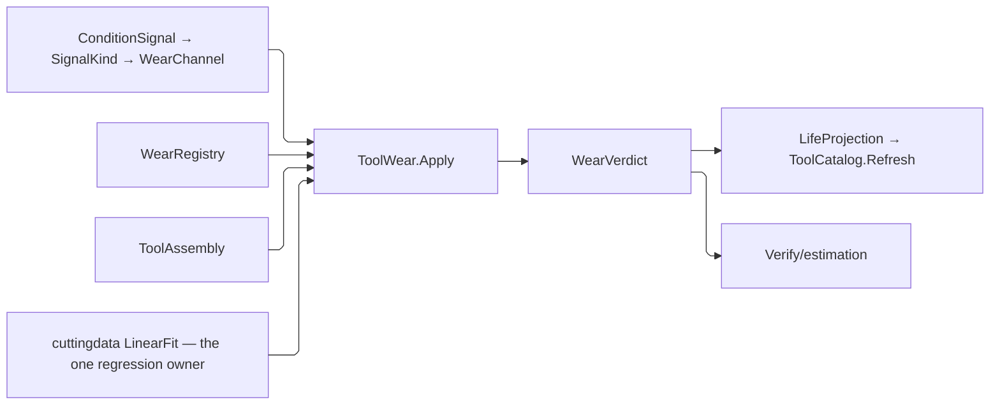

# [RASM_FABRICATION_TOOL_WEAR]

`ToolWear` admits timestamped body, edge, and consumable observations; projects each criterion through an explicit `WearChannel`; fits condition trajectories; derives conservative remaining life; and returns one maintenance decision with its evidence. Subtractive wear and non-subtractive consumption share `ToolLifeBasis` without manufacturing flank-wear fields for unrelated modalities.

`WearRegistry` closes every admitted `ProcessKind` explicitly. Each process is `Tracked` with criteria, consumable specifications, or both, or `Untracked` with a stated reason; uncovered processes cannot become empty success or infinite life. Limits, warnings, reconditioning, and prices remain admitted shop data rather than taxonomy constants. `Tooling/cuttingdata` `LinearFit` owns the ONE least-squares regression in the package and `Regression` its ONE result, so a trajectory fit and a Taylor calibration read the same slope, intercept, residual, fit-space determination, domain, and terminal sample rather than two regression bodies that drift. Moments come off `Rasm.Domain` `Stat<Scalar>`, the kernel's ONE moment owner.

Every signal-to-channel correspondence is a COLUMN on the channel row and every channel-to-criterion projection resolves through one signal-keyed dispatch table, so a distributed type test never stands between an observation and the value it carries.

Wire posture: HOST-LOCAL. `WearState`, `ConsumableRow`, and `CriticalWear` remain named result wires; `LifeProjection` feeds `ToolCatalog.Refresh` as window-bounded body-or-edge multi-basis life evidence.

## [01]-[INDEX]

- [02]-[WEAR_VOCABULARY]: `WearMechanism`, `WearPhase`, `WearScope`, `WearValueKind`, `ConsumableKind`, and `MaintenanceDisposition`.
- [03]-[SIGNAL_CHANNELS]: `SignalKind`, `ConditionSignal`, the signal-keyed reader table, `WearChannel`, and `WearCriterion`.
- [04]-[WEAR_REGISTRY]: `WearSample`, `ConsumableSpec`, `WearApplicability`, `ProcessWear`, `WearRegistry`, and `ConsumableReading` over the `Process/atoms` `ConsumableKey`.
- [05]-[FORECAST_MODELS]: `TaylorModel`, `PhaseSchedule`, `WearPolicy`, `ForecastBand`, `WearEvidence`, `WearState`, `ConsumableRow`, `CriticalWear`, `MaintenanceAction`, `WearVerdict`, and the `TaylorLaw` calibration shapes.
- [06]-[ASSESSMENT]: the `ToolWear` assessment, forecast, consumable, projection, and calibration fold.

## [02]-[WEAR_VOCABULARY]

- Owner: each row family owns one closed vocabulary; `MaintenanceDisposition` owns the wire-keyed disposition vocabulary and its serviceability column.
- Law: serviceability is a COLUMN on the disposition, so the good half of a disposition-keyed population is derivable from the population itself and a ninth disposition answers it once here rather than at every consumer enumerating which rows count as good.
- Cases: `WearMechanism` names the physical mechanism; `WearPhase` names where on the trajectory a tool sits; `WearScope` names which targets a criterion admits; `WearValueKind` names whether a channel carries a length, a scalar, or a count.
- Auto: the in-service key set materializes on first read from `Items`, so a consumer partitioning a disposition-keyed series reads this column instead of carrying a roster copy that strands on the next row.
- Growth: a mechanism is one `WearMechanism`; a consumable taxonomy item is one `ConsumableKind`; a maintenance disposition is one `MaintenanceAction` case beside one `MaintenanceDisposition` row answering the serviceability column.
- Boundary: a consumer-side serviceability dispatch beside the disposition column, and a CLR case-type name serving as a wire or dimension key, are deleted forms.

```csharp
// --- [IMPORTS] -------------------------------------------------------------------------
using System.Collections.Frozen;
using System.Linq;
using System.Threading;
using LanguageExt;
using LanguageExt.Common;
using MathNet.Numerics.Interpolation;
using NodaTime;
using Rasm.Domain;
using Rasm.Fabrication.Kinematics;
using Rasm.Fabrication.Process;
using Riok.Mapperly.Abstractions;
using Thinktecture;
using UnitsNet;
using static LanguageExt.Prelude;

namespace Rasm.Fabrication.Tooling;

// --- [TYPES] ---------------------------------------------------------------------------
[SmartEnum<string>]
public sealed partial class WearMechanism {
    public static readonly WearMechanism Flank = new("flank");
    public static readonly WearMechanism Crater = new("crater");
    public static readonly WearMechanism Notch = new("notch");
    public static readonly WearMechanism Chipping = new("chipping");
    public static readonly WearMechanism Fracture = new("fracture");
    public static readonly WearMechanism ThermalCrack = new("thermal-crack");
    public static readonly WearMechanism PlasticDeformation = new("plastic-deformation");
    public static readonly WearMechanism BuiltUpEdge = new("built-up-edge");
    public static readonly WearMechanism Abrasion = new("abrasion");
    public static readonly WearMechanism Adhesion = new("adhesion");
    public static readonly WearMechanism Diffusion = new("diffusion");
    public static readonly WearMechanism Oxidation = new("oxidation");
}

[SmartEnum<string>]
public sealed partial class WearPhase {
    public static readonly WearPhase BreakIn = new("break-in");
    public static readonly WearPhase Steady = new("steady");
    public static readonly WearPhase Accelerated = new("accelerated");
    public static readonly WearPhase Terminal = new("terminal");
}

[SmartEnum<string>]
public sealed partial class WearScope {
    public static readonly WearScope Body = new("body");
    public static readonly WearScope Edge = new("edge");
    public static readonly WearScope Any = new("any");

    public bool Admits(ToolTarget target) => this == Any
        || (this == Body && target is ToolTarget.Body)
        || (this == Edge && target is ToolTarget.Edge);
}

[SmartEnum<string>]
public sealed partial class WearValueKind {
    public static readonly WearValueKind Linear = new("linear");
    public static readonly WearValueKind Scalar = new("scalar");
    public static readonly WearValueKind Count = new("count");
}

[SmartEnum<string>]
public sealed partial class ConsumableKind {
    public static readonly ConsumableKind CuttingEdge = new("cutting-edge");
    public static readonly ConsumableKind GrindingWheel = new("grinding-wheel");
    public static readonly ConsumableKind SawBlade = new("saw-blade");
    public static readonly ConsumableKind LaserOptic = new("laser-optic");
    public static readonly ConsumableKind PlasmaElectrode = new("plasma-electrode");
    public static readonly ConsumableKind PlasmaNozzle = new("plasma-nozzle");
    public static readonly ConsumableKind Abrasive = new("abrasive");
    public static readonly ConsumableKind MixingTube = new("mixing-tube");
    public static readonly ConsumableKind WireElectrode = new("wire-electrode");
    public static readonly ConsumableKind ExtrusionNozzle = new("extrusion-nozzle");
    public static readonly ConsumableKind DepositionNozzle = new("deposition-nozzle");
    public static readonly ConsumableKind BuildPlate = new("build-plate");
    public static readonly ConsumableKind Recoater = new("recoater");
    public static readonly ConsumableKind VatFilm = new("vat-film");
    public static readonly ConsumableKind ResinFilter = new("resin-filter");
    public static readonly ConsumableKind PowderSieve = new("powder-sieve");
    public static readonly ConsumableKind OxyfuelTip = new("oxyfuel-tip");
    public static readonly ConsumableKind WeldElectrode = new("weld-electrode");
    public static readonly ConsumableKind ContactTip = new("contact-tip");
    public static readonly ConsumableKind ShieldingMedium = new("shielding-medium");
    public static readonly ConsumableKind BrakeTooling = new("brake-tooling");
}

[SmartEnum<string>]
public sealed partial class MaintenanceDisposition {
    public static readonly MaintenanceDisposition Continue = new("continue", serviceable: true);
    public static readonly MaintenanceDisposition Monitor = new("monitor", serviceable: true);
    public static readonly MaintenanceDisposition Inspect = new("inspect", serviceable: true);
    public static readonly MaintenanceDisposition Rotate = new("rotate", serviceable: true);
    public static readonly MaintenanceDisposition Recondition = new("recondition", serviceable: true);
    public static readonly MaintenanceDisposition Replace = new("replace", serviceable: false);
    public static readonly MaintenanceDisposition Retire = new("retire", serviceable: false);
    public static readonly MaintenanceDisposition NotApplicable = new("not-applicable", serviceable: true);

    public bool Serviceable { get; }

    private static readonly Lazy<Seq<string>> InService = new(
        static () => toSeq(Items).Filter(static row => row.Serviceable).Map(static row => row.Key).Strict(),
        LazyThreadSafetyMode.ExecutionAndPublication);

    public static Seq<string> ServiceableKeys => InService.Value;
}
```

## [03]-[SIGNAL_CHANNELS]

- Owner: `ConditionSignal` owns measured condition; `SignalKind` owns the signal discriminant AND the machine-observation lowering; `WearChannel` rows own the signal-component projection with its canonical unit; `WearCriterion` owns terminal and threshold criteria.
- Law: a channel reads its component through ONE signal-keyed dispatch, so the correspondence between a signal case and the values it carries is stated once per case rather than re-tested at every channel. Twenty-two hand type tests were a channel switch distributed across the vocabulary the card's own boundary forbade — a new signal case had to be found in every row that might read it.
- Law: a channel that cannot read a signal answers `None`, so an unmapped pairing is absence rather than a zero a forecast would fit a trajectory through.
- Cases: `ConditionSignal` distinguishes geometry, load, vibration, acoustic, thermal, composition, surface, dimensional, and terminal evidence; `WearCriterion` distinguishes one channel-typed `Threshold` from `TerminalStatus`, the channel row fixing the value kind.
- Entry: `ConditionSignal.Of` lowers a decoded `Kinematics/observation` case into the signal family where the mapping is lossless, so streamed telemetry and inspected measurements enter one admission.
- Auto: each channel row names the signal case it reads and the component it takes off that case, so the table IS the census of what the shop can key a criterion on.
- Growth: a signal is one `ConditionSignal` case with one `SignalKind` row and its `WearChannel` projection rows.
- Boundary: mechanism-to-signal guesswork, a hand-written channel-by-signal switch beside the generated channel vocabulary, value-kind-per-criterion sibling cases, zero-filled modality fields, and untyped edges are deleted forms.

```csharp
// --- [SIGNALS] -------------------------------------------------------------------------
[Union(ConversionFromValue = ConversionOperatorsGeneration.None)]
public abstract partial record ConditionSignal {
    private ConditionSignal() { }

    public sealed record Flank(Length Average, Length Maximum) : ConditionSignal;
    public sealed record Crater(Length Depth, Length Width) : ConditionSignal;
    public sealed record Notch(Length Depth) : ConditionSignal;
    public sealed record EdgeDamage(int Chips, bool Fractured) : ConditionSignal;
    public sealed record Load(Force Force, Torque Torque, Power Power) : ConditionSignal;
    public sealed record Vibration(double RootMeanSquare, double Kurtosis, double CrestFactor) : ConditionSignal;
    public sealed record Acoustic(double RootMeanSquare, double BurstRate) : ConditionSignal;
    public sealed record Thermal(Temperature Temperature) : ConditionSignal;
    public sealed record Composition(double DiffusionIndex, double OxideFraction,
        double AbrasiveParticleIndex) : ConditionSignal;
    public sealed record Surface(Length RoughnessRa, Length RoughnessRz) : ConditionSignal;
    public sealed record Dimensional(Length Drift) : ConditionSignal;
    public sealed record Status(Seq<ToolAvailability> States) : ConditionSignal;

    public static Option<ConditionSignal> Of(MachineObservation observation) =>
        observation is MachineObservation.Temperature thermal
            ? Some<ConditionSignal>(new Thermal(UnitsNet.Temperature.FromDegreesCelsius(thermal.Celsius)))
            : None;

    public SignalKind Kind => Switch(
        flank: static _ => SignalKind.Flank,
        crater: static _ => SignalKind.Crater,
        notch: static _ => SignalKind.Notch,
        edgeDamage: static _ => SignalKind.EdgeDamage,
        load: static _ => SignalKind.Load,
        vibration: static _ => SignalKind.Vibration,
        acoustic: static _ => SignalKind.Acoustic,
        thermal: static _ => SignalKind.Thermal,
        composition: static _ => SignalKind.Composition,
        surface: static _ => SignalKind.Surface,
        dimensional: static _ => SignalKind.Dimensional,
        status: static _ => SignalKind.Status);

    public bool Wellformed => Switch(
        flank: static row => row.Average >= Length.Zero && row.Maximum >= row.Average,
        crater: static row => row.Depth >= Length.Zero && row.Width >= Length.Zero,
        notch: static row => row.Depth >= Length.Zero,
        edgeDamage: static row => row.Chips >= 0,
        load: static row => row.Force >= Force.Zero && row.Torque >= Torque.Zero && row.Power >= Power.Zero,
        vibration: static row => Seq(row.RootMeanSquare, row.Kurtosis, row.CrestFactor)
            .ForAll(static value => double.IsFinite(value) && value >= 0.0),
        acoustic: static row => Seq(row.RootMeanSquare, row.BurstRate)
            .ForAll(static value => double.IsFinite(value) && value >= 0.0),
        thermal: static row => double.IsFinite(row.Temperature.DegreesCelsius),
        composition: static row => Seq(row.DiffusionIndex, row.OxideFraction, row.AbrasiveParticleIndex)
            .ForAll(static value => double.IsFinite(value) && value >= 0.0),
        surface: static row => row.RoughnessRa >= Length.Zero && row.RoughnessRz >= row.RoughnessRa,
        dimensional: static row => double.IsFinite(row.Drift.Millimeters),
        status: static row => !row.States.IsEmpty);
}

[SmartEnum<string>]
public sealed partial class SignalKind {
    public static readonly SignalKind Flank = new("flank");
    public static readonly SignalKind Crater = new("crater");
    public static readonly SignalKind Notch = new("notch");
    public static readonly SignalKind EdgeDamage = new("edge-damage");
    public static readonly SignalKind Load = new("load");
    public static readonly SignalKind Vibration = new("vibration");
    public static readonly SignalKind Acoustic = new("acoustic");
    public static readonly SignalKind Thermal = new("thermal");
    public static readonly SignalKind Composition = new("composition");
    public static readonly SignalKind Surface = new("surface");
    public static readonly SignalKind Dimensional = new("dimensional");
    public static readonly SignalKind Status = new("status");
}

[SmartEnum<string>]
public sealed partial class WearChannel {
    public static readonly WearChannel FlankAverage = Of<ConditionSignal.Flank>("flank-average",
        WearValueKind.Linear, "mm", SignalKind.Flank, static row => row.Average.Millimeters);
    public static readonly WearChannel FlankMaximum = Of<ConditionSignal.Flank>("flank-maximum",
        WearValueKind.Linear, "mm", SignalKind.Flank, static row => row.Maximum.Millimeters);
    public static readonly WearChannel CraterDepth = Of<ConditionSignal.Crater>("crater-depth",
        WearValueKind.Linear, "mm", SignalKind.Crater, static row => row.Depth.Millimeters);
    public static readonly WearChannel CraterWidth = Of<ConditionSignal.Crater>("crater-width",
        WearValueKind.Linear, "mm", SignalKind.Crater, static row => row.Width.Millimeters);
    public static readonly WearChannel NotchDepth = Of<ConditionSignal.Notch>("notch-depth",
        WearValueKind.Linear, "mm", SignalKind.Notch, static row => row.Depth.Millimeters);
    public static readonly WearChannel SurfaceRa = Of<ConditionSignal.Surface>("surface-ra",
        WearValueKind.Linear, "mm", SignalKind.Surface, static row => row.RoughnessRa.Millimeters);
    public static readonly WearChannel SurfaceRz = Of<ConditionSignal.Surface>("surface-rz",
        WearValueKind.Linear, "mm", SignalKind.Surface, static row => row.RoughnessRz.Millimeters);
    public static readonly WearChannel DimensionalDrift = Of<ConditionSignal.Dimensional>("dimensional-drift",
        WearValueKind.Linear, "mm", SignalKind.Dimensional, static row => row.Drift.Millimeters);
    public static readonly WearChannel Force = Of<ConditionSignal.Load>("force",
        WearValueKind.Scalar, "N", SignalKind.Load, static row => row.Force.Newtons);
    public static readonly WearChannel Torque = Of<ConditionSignal.Load>("torque",
        WearValueKind.Scalar, "N*m", SignalKind.Load, static row => row.Torque.NewtonMeters);
    public static readonly WearChannel Power = Of<ConditionSignal.Load>("power",
        WearValueKind.Scalar, "W", SignalKind.Load, static row => row.Power.Watts);
    public static readonly WearChannel VibrationRms = Of<ConditionSignal.Vibration>("vibration-rms",
        WearValueKind.Scalar, "1", SignalKind.Vibration, static row => row.RootMeanSquare);
    public static readonly WearChannel VibrationKurtosis = Of<ConditionSignal.Vibration>("vibration-kurtosis",
        WearValueKind.Scalar, "1", SignalKind.Vibration, static row => row.Kurtosis);
    public static readonly WearChannel VibrationCrest = Of<ConditionSignal.Vibration>("vibration-crest",
        WearValueKind.Scalar, "1", SignalKind.Vibration, static row => row.CrestFactor);
    public static readonly WearChannel AcousticRms = Of<ConditionSignal.Acoustic>("acoustic-rms",
        WearValueKind.Scalar, "1", SignalKind.Acoustic, static row => row.RootMeanSquare);
    public static readonly WearChannel AcousticBurstRate = Of<ConditionSignal.Acoustic>("acoustic-burst-rate",
        WearValueKind.Scalar, "1/s", SignalKind.Acoustic, static row => row.BurstRate);
    public static readonly WearChannel Temperature = Of<ConditionSignal.Thermal>("temperature",
        WearValueKind.Scalar, "degC", SignalKind.Thermal, static row => row.Temperature.DegreesCelsius);
    public static readonly WearChannel Diffusion = Of<ConditionSignal.Composition>("diffusion",
        WearValueKind.Scalar, "1", SignalKind.Composition, static row => row.DiffusionIndex);
    public static readonly WearChannel Oxide = Of<ConditionSignal.Composition>("oxide",
        WearValueKind.Scalar, "1", SignalKind.Composition, static row => row.OxideFraction);
    public static readonly WearChannel AbrasiveParticle = Of<ConditionSignal.Composition>("abrasive-particle",
        WearValueKind.Scalar, "1", SignalKind.Composition, static row => row.AbrasiveParticleIndex);
    public static readonly WearChannel ChipCount = Of<ConditionSignal.EdgeDamage>("chip-count",
        WearValueKind.Count, "1", SignalKind.EdgeDamage, static row => row.Chips);
    public static readonly WearChannel Fracture = Of<ConditionSignal.EdgeDamage>("fracture",
        WearValueKind.Count, "1", SignalKind.EdgeDamage, static row => row.Fractured ? 1.0 : 0.0);

    public WearValueKind Kind { get; }
    public string Unit { get; }
    public SignalKind Source { get; }
    public Func<ConditionSignal, double> Read { get; }

    public Option<double> Project(ConditionSignal signal) =>
        signal.Kind == Source ? Some(Read(signal)) : None;

    private static WearChannel Of<TSignal>(string key, WearValueKind kind, string unit, SignalKind source,
        Func<TSignal, double> read)
        where TSignal : ConditionSignal =>
        new(kind, unit, source, signal => read((TSignal)signal));
}

[Union(ConversionFromValue = ConversionOperatorsGeneration.None)]
public abstract partial record WearCriterion {
    private WearCriterion() { }
    public sealed record Threshold(WearScope Scope, WearMechanism Mechanism, WearChannel Channel,
        ToolLifeBasis Basis, double Warning, double Limit) : WearCriterion;
    public sealed record TerminalStatus(WearScope Scope, Seq<ToolAvailability> States) : WearCriterion;

    public WearScope Scope => Switch(
        threshold: static row => row.Scope,
        terminalStatus: static row => row.Scope);

    public bool Grounded => Switch(
        threshold: static row => double.IsFinite(row.Warning) && double.IsFinite(row.Limit)
            && row.Warning >= 0.0 && row.Limit > row.Warning
            && (row.Channel.Kind != WearValueKind.Count
                || (double.IsInteger(row.Warning) && double.IsInteger(row.Limit))),
        terminalStatus: static row => !row.States.IsEmpty);
}
```

## [04]-[WEAR_REGISTRY]

- Owner: `WearRegistry` owns process applicability; `ConsumableSpec` owns one consumable's admitted budget; `WearSample` owns one timestamped observation set; `Process/atoms` owns `ConsumableKey` and this page composes it.
- Law: one shop catalogue identity, one type, seated at S0. Declaring consumable identity here splits a contact tip a welding procedure names from a contact tip a wear budget spends into two incomparable values, stranding every maintenance action from the procedure that consumed the part; seating it on the joining owner instead reverses the fault, because this page is S2, `Joining/weld` is S3, and composing upward crosses the stratification. `Process/atoms` is the only stratum both consumers read.
- Law: every admitted `ProcessKind` is covered explicitly. An uncovered process reaching the fold as empty success reports a tool with infinite life, so applicability is total over the vocabulary and an untracked process states its reason.
- Cases: `WearApplicability` distinguishes `Tracked` from reasoned `Untracked`.
- Auto: the registry index is DERIVED from the admitted rows and held, so a per-process lookup costs a read rather than a scan.
- Growth: process applicability is one registry row.
- Boundary: applicability cases that differ only by which half is empty, hardcoded consumable limits, and uncovered-process empty success are deleted forms.

```csharp
// --- [MODELS] --------------------------------------------------------------------------
[ComplexValueObject]
public sealed partial class WearSample {
    public ToolTarget Target { get; }
    public ProcessKind Process { get; }
    public Instant At { get; }
    public HashMap<ToolLifeBasis, double> Exposure { get; }
    public Seq<ConditionSignal> Signals { get; }

    static partial void ValidateFactoryArguments(ref ValidationError? validationError, ref ToolTarget target,
        ref ProcessKind process, ref Instant at, ref HashMap<ToolLifeBasis, double> exposure,
        ref Seq<ConditionSignal> signals) =>
        validationError = exposure.IsEmpty || signals.IsEmpty
            || exposure.AsIterable().Exists(static row => !double.IsFinite(row.Value) || row.Value < 0.0)
            || !signals.ForAll(static signal => signal.Wellformed)
            ? ToolKey.Validation("wear-sample") : null;

    public static Fin<WearSample> Admit(ToolTarget target, ProcessKind process, Instant at,
        HashMap<ToolLifeBasis, double> exposure, Seq<ConditionSignal> signals) =>
        Validate(target, process, at, exposure, signals, out WearSample sample).Admitted(sample);
}

[ComplexValueObject]
public sealed partial class ConsumableSpec {
    public ConsumableKey Key { get; }
    public ConsumableKind Kind { get; }
    public ToolLifeBasis Basis { get; }
    public double Warning { get; }
    public double Limit { get; }
    public bool Reconditionable { get; }
    public int MaximumReconditions { get; }
    public string Evidence { get; }

    static partial void ValidateFactoryArguments(ref ValidationError? validationError, ref ConsumableKey key,
        ref ConsumableKind kind, ref ToolLifeBasis basis, ref double warning, ref double limit,
        ref bool reconditionable, ref int maximumReconditions, ref string evidence) {
        evidence = evidence.Trim();
        validationError = !double.IsFinite(warning) || !double.IsFinite(limit)
            || warning < 0.0 || warning > limit || limit <= 0.0
            || maximumReconditions < 0 || (!reconditionable && maximumReconditions != 0)
            || !Witness.Keyed(evidence)
            ? ToolKey.Validation("consumable-spec") : null;
    }

    public static Fin<ConsumableSpec> Admit(ConsumableKey key, ConsumableKind kind, ToolLifeBasis basis,
        double warning, double limit, bool reconditionable, int maximumReconditions, string evidence) =>
        Validate(kind, basis, warning, limit, reconditionable, maximumReconditions, evidence,
            out ConsumableSpec spec).Admitted(spec);
}

[Union(ConversionFromValue = ConversionOperatorsGeneration.None)]
public abstract partial record WearApplicability {
    private WearApplicability() { }
    public sealed record Tracked(Seq<WearCriterion> Criteria, Seq<ConsumableSpec> Specs) : WearApplicability;
    public sealed record Untracked(string Reason) : WearApplicability;

    public bool Grounded => Switch(
        tracked: static row => !(row.Criteria.IsEmpty && row.Specs.IsEmpty)
            && row.Criteria.ForAll(static criterion => criterion.Grounded)
            && row.Specs.Map(static spec => spec.Key).Distinct().Count == row.Specs.Count,
        untracked: static row => Witness.Keyed(row.Reason));

    public Seq<WearCriterion> Criteria => Switch(
        tracked: static row => row.Criteria,
        untracked: static _ => Seq<WearCriterion>());

    public Seq<ConsumableSpec> Specs => Switch(
        tracked: static row => row.Specs,
        untracked: static _ => Seq<ConsumableSpec>());
}

public sealed record ProcessWear(ProcessKind Process, WearApplicability Applicability);

[ComplexValueObject]
public sealed partial class WearRegistry {
    public Seq<ProcessWear> Rows { get; }

    [IgnoreMember]
    private FrozenDictionary<ProcessKind, WearApplicability>? index;

    static partial void ValidateFactoryArguments(ref ValidationError? validationError, ref Seq<ProcessWear> rows) =>
        validationError = rows.Map(static row => row.Process).Distinct().Count != rows.Count
            || toSeq(ProcessKind.Items).Exists(process => !rows.Exists(row => row.Process == process))
            || rows.Exists(static row => !row.Applicability.Grounded)
            ? ToolKey.Validation("wear-registry") : null;

    public static Fin<WearRegistry> Admit(Seq<ProcessWear> rows) =>
        Validate(rows, out WearRegistry registry).Admitted(registry);

    public Option<WearApplicability> For(ProcessKind process) =>
        (index ??= Rows.ToDictionary(static row => row.Process, static row => row.Applicability).ToFrozenDictionary())
            .TryGetValue(process, out WearApplicability? row) ? Some(row) : None;
}

public sealed record ConsumableReading(ConsumableKey Key, ToolLifeBasis Basis, double Used,
    int Reconditions, Instant At);
```

## [05]-[FORECAST_MODELS]

- Owner: `TaylorModel` and `ModelDiagnostic` own phase-aware evolution; `PhaseSchedule` owns the trajectory's ordered partition and the phase it classifies; `WearPolicy` owns the assessment thresholds; `ForecastBand` owns the conservative projection; `WearVerdict` owns forecast and maintenance truth.
- Law: `ModelDiagnostic` COMPOSES the `Tooling/cuttingdata` `Regression` rather than declaring a second regression. The page's own lead names one regression owner, and a private fit body beside it meant the trajectory slope and the Taylor slope were computed by two functions that could disagree about the same samples.
- Law: `PhaseSchedule` admits the consumed-fraction partition ONCE with its curvature band and answers the phase itself, so no fold re-reads the columns to classify. Four bare fractions on `WearPolicy` carried an ordering the validator proved for two of them while the comment claimed three, and inspection sat inside a partition it never belonged to — inspection reads a REMAINING fraction where break-in and acceleration read a CONSUMED one. NAMED LOSS: none — `InspectionFraction` stays on the policy as the action threshold it always was, now seated beside no boundary that invites the conflation.
- Cases: `WearState` distinguishes tool, consumable, status, and unconsumed evidence; `MaintenanceAction` distinguishes continue, monitor, inspect, rotate, replace, recondition, retire, and not-applicable, each case projecting onto the `MaintenanceDisposition` row of the same name through one total `Disposition` arm.
- Auto: `TaylorLaw` narrows one `PowerLaw` to the fitted speed coefficient under admitted feed, depth, and load exponents, and its terminal projection GENERATES rather than transcribing the model columns by hand.
- Entry: `TaylorLaw.Admit(ingress, study)` is the ONE construction, and the study's residual, determination, and sample floors gate it there. Reading those columns off a constructed law to reject it afterwards is the deleted form, because a law that exists at all is a law a caller holds.
- Result: `ModelDiagnostic` carries the shared fit beside both endpoint derivatives, so slope, intercept, residual, determination, sample domain, and the last observed value all read off one result. `ToolWear.Assess` writes the critical state through `FabricationInstruments.ToolWear`, `ToolAssessments`, `FitResidual`, and `ToolFloor`, carrying the `Disposition` key as the assessment population's outcome dimension; a result without a critical state writes nothing.
- Packages: `NodaTime` `Instant`, `Duration`, and `Interval.Contains`; `Tooling/cuttingdata` `LinearFit`, `PowerLawFit`, `Regression`, and `PowerLaw`; MathNet.Numerics monotone cubic interpolation for the endpoint derivatives; `Riok.Mapperly` for the calibration projection.
- Growth: a phase axis is one column on `PhaseSchedule` and one arm in its `At` pattern.
- Boundary: point-estimate scheduling, infinite fallback life, invented zero budgets, a line fitted to a resampled spline rather than the observations, and swallowed fit failures are deleted forms.

```csharp
// --- [FORECAST_MODELS] -----------------------------------------------------------------
[ComplexValueObject]
public sealed partial class TaylorModel {
    public ToolLifeBasis Basis { get; }
    public double Constant { get; }
    public double SpeedExponent { get; }
    public double FeedExponent { get; }
    public double DepthExponent { get; }
    public double LoadExponent { get; }

    static partial void ValidateFactoryArguments(ref ValidationError? validationError, ref ToolLifeBasis basis,
        ref double constant, ref double speedExponent, ref double feedExponent, ref double depthExponent,
        ref double loadExponent) =>
        validationError = !ValidityClaim.Positive(constant).Holds
            || !Seq(
                speedExponent, feedExponent, depthExponent, loadExponent)
                .ForAll(static value => ValidityClaim.Positive(value).Holds)
            ? ToolKey.Validation("taylor-model") : null;

    public static Fin<TaylorModel> Admit(ToolLifeBasis basis, double constant, double speedExponent,
        double feedExponent, double depthExponent, double loadExponent) =>
        Validate(basis, constant, speedExponent, feedExponent, depthExponent, loadExponent,
            out TaylorModel model).Admitted(model);

    public double Life(Speed speed, Speed feed, Length depth, Force load) =>
        Constant / (Math.Pow(speed.MetersPerSecond, SpeedExponent) * Math.Pow(feed.MetersPerSecond, FeedExponent)
            * Math.Pow(depth.Millimeters, DepthExponent) * Math.Pow(load.Newtons, LoadExponent));
}

[ComplexValueObject]
public sealed partial class PhaseSchedule {
    public double BreakIn { get; }
    public double Accelerated { get; }
    public double CurvatureBand { get; }

    static partial void ValidateFactoryArguments(ref ValidationError? validationError, ref double breakIn,
        ref double accelerated, ref double curvatureBand) =>
        validationError = !Seq(breakIn, accelerated, curvatureBand).ForAll(double.IsFinite)
            || breakIn is <= 0.0 or >= 1.0 || accelerated <= breakIn || accelerated >= 1.0
            || curvatureBand is <= 0.0 or >= 1.0
            ? ToolKey.Validation("phase-schedule") : null;

    public static Fin<PhaseSchedule> Admit(double breakIn, double accelerated, double curvatureBand) =>
        Validate(breakIn, accelerated, curvatureBand, out PhaseSchedule schedule).Admitted(schedule);

    public WearPhase At(double consumedFraction, Option<double> curvature) =>
        (Consumed: consumedFraction, Curvature: curvature.IfNone(1.0)) switch {
            { Consumed: >= 1.0 } => WearPhase.Terminal,
            var row when row.Consumed >= Accelerated || row.Curvature > 1.0 + CurvatureBand => WearPhase.Accelerated,
            var row when row.Consumed <= BreakIn || row.Curvature < 1.0 - CurvatureBand => WearPhase.BreakIn,
            _ => WearPhase.Steady,
        };
}

[ComplexValueObject]
public sealed partial class WearPolicy {
    public int MinimumSamples { get; }
    public Interval Window { get; }
    public Duration MaximumGap { get; }
    public double OutlierSigma { get; }
    public double MinimumRSquared { get; }
    public double ConfidenceMultiplier { get; }
    public PhaseSchedule Phases { get; }
    public double InspectionFraction { get; }
    public Option<TaylorModel> Taylor { get; }

    static partial void ValidateFactoryArguments(ref ValidationError? validationError, ref int minimumSamples,
        ref Interval window, ref Duration maximumGap, ref double outlierSigma, ref double minimumRSquared,
        ref double confidenceMultiplier, ref PhaseSchedule phases, ref double inspectionFraction,
        ref Option<TaylorModel> taylor) =>
        validationError = minimumSamples < LinearFit.MinimumSamples || maximumGap <= Duration.Zero
            || !Seq(outlierSigma, minimumRSquared, confidenceMultiplier, inspectionFraction).ForAll(double.IsFinite)
            || !ValidityClaim.Positive(outlierSigma).Holds || minimumRSquared is < 0.0 or > 1.0
            || !ValidityClaim.Positive(confidenceMultiplier).Holds
            || inspectionFraction is <= 0.0 or >= 1.0
            ? ToolKey.Validation("wear-policy") : null;

    public static Fin<WearPolicy> Admit(int minimumSamples, Interval window, Duration maximumGap,
        double outlierSigma, double minimumRSquared, double confidenceMultiplier, PhaseSchedule phases,
        double inspectionFraction, Option<TaylorModel> taylor) =>
        Validate(minimumSamples, window, maximumGap, outlierSigma, minimumRSquared, confidenceMultiplier,
            phases, inspectionFraction, taylor, out WearPolicy policy).Admitted(policy);
}

public sealed record ForecastBand(double Consumed, double WarningAt, double LimitAt,
    double Estimate, double StandardError, double Conservative, ToolLifeBasis Basis, WearPhase Phase) {
    public static ForecastBand Of(double consumed, double warningAt, double limitAt, double estimate,
        double standardError, double confidenceMultiplier, ToolLifeBasis basis, WearPhase phase) =>
        new(consumed, Math.Clamp(warningAt, 0.0, limitAt), limitAt, Math.Max(0.0, estimate), standardError,
            Math.Max(0.0, estimate - confidenceMultiplier * standardError), basis, phase);
}

public sealed record ModelDiagnostic(Regression Fit, double SlopeFirst, double SlopeLast,
    Instant First, Instant Last) {
    public double Slope => Fit.Slope;
    public double Intercept => Fit.Intercept;
    public double RootMeanSquareResidual => Fit.RootMeanSquareResidual;
    public double RSquared => Fit.RSquared;
    public int Samples => Fit.Samples;
    public double FirstExposure => Fit.DomainMinimum;
    public double LastExposure => Fit.LastAbscissa;
    public double LastValue => Fit.LastOrdinate;

    public double Curvature => SlopeFirst <= 0.0 ? 1.0 : SlopeLast / SlopeFirst;
}

[Union(ConversionFromValue = ConversionOperatorsGeneration.None)]
public abstract partial record WearEvidence {
    private WearEvidence() { }
    public sealed record Measured(WearChannel Channel, Seq<WearSample> Samples, Condition Current,
        ModelDiagnostic Diagnostic) : WearEvidence;
    public sealed record Condition(ConditionSignal Signal) : WearEvidence;
    public sealed record Taylor(TaylorModel Model, WearChannel Channel, double Current,
        Speed Speed, Speed Feed, Length Depth, Force Load) : WearEvidence;
    public sealed record Budget(ConsumableSpec Spec, ConsumableReading Reading) : WearEvidence;
    public sealed record Terminal(Seq<ToolAvailability> Status, Instant At) : WearEvidence;
}

[Union(ConversionFromValue = ConversionOperatorsGeneration.None)]
public abstract partial record WearState {
    private WearState() { }
    public sealed record Tool(ToolTarget Target, WearMechanism Mechanism, WearChannel Channel, double Current,
        double Warning, double Limit, ForecastBand Remaining, WearEvidence Evidence) : WearState;
    public sealed record Consumable(ConsumableKey Key, ConsumableKind Kind, double Current,
        double Warning, double Limit, ForecastBand Remaining, WearEvidence Evidence) : WearState;
    public sealed record Status(ToolTarget Target, Seq<ToolAvailability> States, bool Terminal,
        WearEvidence Evidence) : WearState;
    public sealed record Unconsumed(ProcessKind Process, string Reason) : WearState;

    public Option<(ToolLifeBasis Basis, double Conservative, double Fraction)> Remaining => Switch(
        tool: static row => Some(Fraction(row.Remaining)),
        consumable: static row => Some(Fraction(row.Remaining)),
        status: static row => row.Terminal ? Some((ToolLifeBasis.Wear, 0.0, 0.0)) : None,
        unconsumed: static _ => Option<(ToolLifeBasis, double, double)>.None);

    private static (ToolLifeBasis Basis, double Conservative, double Fraction) Fraction(ForecastBand band) => (
        band.Basis, band.Conservative,
        band.LimitAt <= 0.0 ? 0.0 : Math.Clamp(band.Conservative / band.LimitAt, 0.0, 1.0));
}

public sealed record ConsumableRow(ConsumableKey Key, ConsumableKind Kind, ToolLifeBasis Basis,
    double Used, double Limit, double ConservativeRemaining, bool Reconditionable, int Reconditions,
    int MaximumReconditions, string Evidence);
public sealed record CriticalWear(WearState State, ToolLifeBasis Basis, double ConservativeRemaining,
    double FractionRemaining);

[Union(ConversionFromValue = ConversionOperatorsGeneration.None)]
public abstract partial record MaintenanceAction {
    private MaintenanceAction() { }
    public sealed record Continue(CriticalWear Critical) : MaintenanceAction;
    public sealed record Monitor(WearState.Status Status) : MaintenanceAction;
    public sealed record Inspect(CriticalWear Critical, double Within) : MaintenanceAction;
    public sealed record Rotate(ToolEdgeKey Edge, CriticalWear Critical) : MaintenanceAction;
    public sealed record Replace(CriticalWear Critical) : MaintenanceAction;
    public sealed record Recondition(ConsumableKey Key, int NextCycle, CriticalWear Critical) : MaintenanceAction;
    public sealed record Retire(CriticalWear Critical) : MaintenanceAction;
    public sealed record NotApplicable(ProcessKind Process, string Reason) : MaintenanceAction;

    public MaintenanceDisposition Disposition => Switch(
        @continue: static _ => MaintenanceDisposition.Continue,
        monitor: static _ => MaintenanceDisposition.Monitor,
        inspect: static _ => MaintenanceDisposition.Inspect,
        rotate: static _ => MaintenanceDisposition.Rotate,
        replace: static _ => MaintenanceDisposition.Replace,
        recondition: static _ => MaintenanceDisposition.Recondition,
        retire: static _ => MaintenanceDisposition.Retire,
        notApplicable: static _ => MaintenanceDisposition.NotApplicable);
}

public sealed record WearVerdict(Seq<WearState> States, Seq<ConsumableRow> Consumables,
    Option<CriticalWear> Critical, MaintenanceAction Action, Seq<ModelDiagnostic> Diagnostics,
    Seq<LifeBudget> LifeProjection, Instant AssessedAt);

[ComplexValueObject]
public sealed partial class TaylorCondition {
    public ToolTarget Target { get; }
    public ToolLifeBasis Basis { get; }
    public WearChannel Channel { get; }
    public double Consumed { get; }
    public Speed Speed { get; }
    public Speed Feed { get; }
    public Length Depth { get; }
    public Force Load { get; }
    public double Current { get; }
    public double RelativeUncertainty { get; }

    static partial void ValidateFactoryArguments(ref ValidationError? validationError, ref ToolTarget target,
        ref ToolLifeBasis basis, ref WearChannel channel, ref double consumed, ref Speed speed,
        ref Speed feed, ref Length depth, ref Force load, ref double current, ref double relativeUncertainty) =>
        validationError = !double.IsFinite(consumed) || consumed < 0.0
            || speed.MetersPerSecond <= 0.0 || feed.MetersPerSecond <= 0.0
            || depth <= Length.Zero || load.Newtons <= 0.0
            || !double.IsFinite(current) || current < 0.0
            || (channel.Kind == WearValueKind.Count && current != Math.Truncate(current))
            || !double.IsFinite(relativeUncertainty) || relativeUncertainty is < 0.0 or >= 1.0
            ? ToolKey.Validation("taylor-condition") : null;

    public static Fin<TaylorCondition> Admit(ToolTarget target, ToolLifeBasis basis, WearChannel channel,
        double consumed, Speed speed, Speed feed, Length depth, Force load, double current,
        double relativeUncertainty) =>
        Validate(target, basis, channel, consumed, speed, feed, depth, load, current, relativeUncertainty,
            out TaylorCondition condition).Admitted(condition);
}

[ComplexValueObject]
public sealed partial class WearAssessment {
    public ProcessKind Process { get; }
    public ToolAssembly Assembly { get; }
    public Seq<WearSample> Samples { get; }
    public Seq<ConsumableReading> Consumables { get; }
    public Option<TaylorCondition> Taylor { get; }
    public WearRegistry Registry { get; }
    public WearPolicy Policy { get; }
    public Instant AssessedAt { get; }

    static partial void ValidateFactoryArguments(ref ValidationError? validationError, ref ProcessKind process,
        ref ToolAssembly assembly, ref Seq<WearSample> samples, ref Seq<ConsumableReading> consumables,
        ref Option<TaylorCondition> taylor, ref WearRegistry registry, ref WearPolicy policy,
        ref Instant assessedAt) =>
        validationError = !policy.Window.Contains(assessedAt) || samples.Exists(sample => sample.Process != process)
            || samples.Exists(sample => !policy.Window.Contains(sample.At)
                || (sample.Target is ToolTarget.Edge edge
                    && !assembly.Snapshot.Edges.Exists(candidate => candidate.Key == edge.Key)))
            || taylor.Exists(condition => condition.Target is ToolTarget.Edge edge
                && !assembly.Snapshot.Edges.Exists(candidate => candidate.Key == edge.Key))
            || consumables.Exists(row => !policy.Window.Contains(row.At) || !double.IsFinite(row.Used)
                || row.Used < 0.0 || row.Reconditions < 0)
            || consumables.Map(static row => (row.Key, row.Basis)).Distinct().Count != consumables.Count
            ? ToolKey.Validation("wear-assessment") : null;

    public static Fin<WearAssessment> Admit(ProcessKind process, ToolAssembly assembly, Seq<WearSample> samples,
        Seq<ConsumableReading> consumables, Option<TaylorCondition> taylor, WearRegistry registry,
        WearPolicy policy, Instant assessedAt) =>
        Validate(process, assembly, samples, consumables, taylor, registry, policy, assessedAt,
            out WearAssessment assessment).Admitted(assessment);
}

[ComplexValueObject]
public sealed partial class TaylorSample {
    public Speed Speed { get; }
    public Speed Feed { get; }
    public Length Depth { get; }
    public Force Load { get; }
    public double Life { get; }

    static partial void ValidateFactoryArguments(ref ValidationError? validationError, ref Speed speed,
        ref Speed feed, ref Length depth, ref Force load, ref double life) =>
        validationError = speed.MetersPerSecond <= 0.0 || feed.MetersPerSecond <= 0.0
            || depth <= Length.Zero || load.Newtons <= 0.0 || !ValidityClaim.Positive(life).Holds ? ToolKey.Validation("taylor-sample") : null;

    public static Fin<TaylorSample> Admit(Speed speed, Speed feed, Length depth, Force load, double life) =>
        Validate(speed, feed, depth, load, life, out TaylorSample sample).Admitted(sample);
}

[ComplexValueObject]
public sealed partial class TaylorCalibration {
    public Seq<TaylorSample> Samples { get; }
    public ToolLifeBasis Basis { get; }
    public double FeedExponent { get; }
    public double DepthExponent { get; }
    public double LoadExponent { get; }
    public int MinimumSamples { get; }
    public double MaximumResidual { get; }
    public double MinimumRSquared { get; }
    public Speed MinimumSpeedSpan { get; }

    static partial void ValidateFactoryArguments(ref ValidationError? validationError, ref Seq<TaylorSample> samples,
        ref ToolLifeBasis basis, ref double feedExponent, ref double depthExponent, ref double loadExponent,
        ref int minimumSamples, ref double maximumResidual, ref double minimumRSquared, ref Speed minimumSpeedSpan) =>
        validationError = minimumSamples < LinearFit.MinimumSamples || samples.Count < minimumSamples
            || !Seq(feedExponent, depthExponent, loadExponent, maximumResidual).ForAll(static value => ValidityClaim.Positive(value).Holds)
            || !double.IsFinite(minimumRSquared) || minimumRSquared is < 0.0 or > 1.0
            || minimumSpeedSpan.MetersPerSecond <= 0.0
            || samples.Max(static row => row.Speed.MetersPerSecond)
                - samples.Min(static row => row.Speed.MetersPerSecond) < minimumSpeedSpan.MetersPerSecond
            ? ToolKey.Validation("taylor-calibration") : null;

    public static Fin<TaylorCalibration> Admit(Seq<TaylorSample> samples, ToolLifeBasis basis, double feedExponent,
        double depthExponent, double loadExponent, int minimumSamples, double maximumResidual,
        double minimumRSquared, Speed minimumSpeedSpan) =>
        Validate(samples, basis, feedExponent, depthExponent, loadExponent, minimumSamples, maximumResidual,
            minimumRSquared, minimumSpeedSpan, out TaylorCalibration calibration).Admitted(calibration);
}

public sealed record TaylorLawIngress(
    TaylorModel Model,
    Regression Fit,
    Speed SpeedMinimum,
    Speed SpeedMaximum);

[ComplexValueObject]
public sealed partial class TaylorLaw {
    public TaylorModel Model { get; }
    public Regression Fit { get; }
    public Speed SpeedMinimum { get; }
    public Speed SpeedMaximum { get; }

    static partial void ValidateFactoryArguments(ref ValidationError? validationError, ref TaylorModel model,
        ref Regression fit, ref Speed speedMinimum, ref Speed speedMaximum) =>
        validationError = speedMinimum.MetersPerSecond <= 0.0
            || speedMaximum.MetersPerSecond <= speedMinimum.MetersPerSecond
            || fit.Samples < LinearFit.MinimumSamples
            ? ToolKey.Validation("taylor-law") : null;

    public static Fin<TaylorLaw> Admit(TaylorLawIngress ingress, TaylorCalibration under) =>
        ingress.Fit.RootMeanSquareResidual <= under.MaximumResidual
        && ingress.Fit.RSquared >= under.MinimumRSquared
        && ingress.Fit.Samples >= under.MinimumSamples
            ? Validate(ingress.Model, ingress.Fit, ingress.SpeedMinimum, ingress.SpeedMaximum,
                out TaylorLaw law).Admitted(law)
            : Fin.Fail<TaylorLaw>(ToolKey.Tooling("taylor-law:unfit"));
}

[Mapper(RequiredMappingStrategy = RequiredMappingStrategy.Target,
    EnabledConversions = MappingConversionType.None)]
public static partial class TaylorLawMap {
    public static partial TaylorLawIngress Ingress(TaylorLaw law);
}

[Union(ConversionFromValue = ConversionOperatorsGeneration.None)]
public abstract partial record WearRequest {
    private WearRequest() { }
    public sealed record Assess(WearAssessment Value) : WearRequest;
    public sealed record Calibrate(TaylorCalibration Value) : WearRequest;
}

[Union(ConversionFromValue = ConversionOperatorsGeneration.None)]
public abstract partial record WearResult {
    private WearResult() { }
    public sealed record Assessment(WearVerdict Verdict) : WearResult;
    public sealed record Calibration(TaylorLaw Law) : WearResult;
}
```

## [06]-[ASSESSMENT]

- Owner: `ToolWear` owns the assessment, forecast, consumable, projection, and calibration fold.
- Law: criterion coverage is proved as a COVERING relation, not a bijection. Every observed target must reach at least one criterion its scope admits, but a criterion the shop declared for a target this run never observed is a criterion waiting for evidence, not a defect — demanding it in both directions rejected a valid partial assessment, and the census the result publishes states how many pairs actually resolved.
- Entry: `ToolWear.Apply(WearRequest, Option<InstrumentSet>)` is the one polymorphic entry over assessment and Taylor calibration; the set threads through the request switch and defaults absent for headless assessment.
- Auto: admission accumulates malformed signal, time, target, channel-kind, registry, and budget rows; assessment groups by target, projects through the declared channel row, removes policy-defined outliers, fits the exposure trajectory through the shared regression owner, and classifies phase jointly from consumed fraction and the monotone spline's start-to-end derivative ratio, so a curve that steepens reads accelerated before its limit fraction says so. Missing specification, missing reading, untracked-process readings, stale windows, and terminal status fail typed.
- Result: `WearVerdict` carries all states, consumable rows, critical row, maintenance action, model diagnostics, and window-bounded `LifeProjection`; projection groups tool states by target and life basis, then retains the most conservative whole forecast per key.
- Packages: `Tooling/cuttingdata` `LinearFit` and `PowerLawFit`; `Rasm.Domain` `Stat<Scalar>`, `Scalar`, `MomentNormalizer` — the kernel's one moment owner; `Process/telemetry` (`FabricationInstruments`); MathNet.Numerics `Interpolate.CubicSplineMonotone` and `IInterpolation.Differentiate`.
- Boundary: a current value taken outside the admitted rows, status-only spent inference, phase read from the limit fraction alone while the page claims trajectory classification, a mean-and-dispersion pair folded beside the kernel moment owner, and bare `Seq.Last` reads are deleted forms.

```csharp
// --- [OPERATIONS] ----------------------------------------------------------------------
public static class ToolWear {

    public static Fin<WearResult> Apply(WearRequest request, Option<InstrumentSet> set = default) => request.Switch(
        state: set,
        assess: static (instruments, row) => Assess(row.Value, instruments)
            .Map<WearResult>(static result => new WearResult.Assessment(result)),
        calibrate: static (_, row) => Calibrate(row.Value)
            .Map<WearResult>(static law => new WearResult.Calibration(law)));

    private static Fin<WearVerdict> Assess(WearAssessment request, Option<InstrumentSet> set) =>
        from applicability in request.Registry.For(request.Process)
            .ToFin(new FabricationFault.WearEstimateUnfit(request.Assembly.Tool, request.Samples.Count))
        from _ in InputFits(applicability, request)
        from toolStates in ToolStates(applicability, request)
        from consumableStates in ConsumableStates(applicability, request)
        let states = toolStates.Concat(consumableStates.Map<WearState>(static row => row.State))
        let critical = Critical(states)
        let action = critical.Map(row => Action(row, request, consumableStates))
            .IfNone(() => states.Choose(static state => state is WearState.Status row ? Some(row) : None)
                .Head.Map<MaintenanceAction>(static row => new MaintenanceAction.Monitor(row))
                .IfNone(() => new MaintenanceAction.NotApplicable(request.Process,
                    states.Choose(static state => state is WearState.Unconsumed row ? Some(row.Reason) : None)
                        .Head.IfNone("no-terminal-consumption"))))
        from life in Project(states, request.Policy, request.AssessedAt)
        let result = new WearVerdict(states, consumableStates.Choose(static row => row.Row), critical, action,
            toolStates.Choose(static state => state is WearState.Tool tool
                && tool.Evidence is WearEvidence.Measured measured ? Some(measured.Diagnostic) : None),
            life, request.AssessedAt)
        from _metrics in result.Critical.Match(
            Some: critical =>
                from _assessment in set.Write(FabricationInstruments.ToolAssessments, 1d,
                    (FabricationInstruments.BasisSlot, critical.Basis.Key),
                    (FabricationInstruments.ActionSlot, result.Action.Disposition.Key))
                from _wear in set.Write(FabricationInstruments.ToolWear, critical.FractionRemaining,
                    (FabricationInstruments.BasisSlot, critical.Basis.Key),
                    (FabricationInstruments.ActionSlot, result.Action.Disposition.Key))
                from _fit in result.Diagnostics.Head.Match(
                    Some: _ => set.Write(FabricationInstruments.FitResidual,
                        result.Diagnostics.Max(static row => row.RootMeanSquareResidual),
                        (FabricationInstruments.ModelSlot, FabricationInstruments.Taylor)),
                    None: static () => Fin.Succ(unit))
                from _floor in set.Level(FabricationInstruments.ToolFloor, critical.FractionRemaining, Some(critical.Basis.Key))
                select unit,
            None: static () => Fin.Succ(unit))
        select result;

    private static Fin<Unit> InputFits(WearApplicability applicability, WearAssessment request) => applicability switch {
        WearApplicability.Untracked when !request.Samples.IsEmpty || request.Taylor.IsSome || !request.Consumables.IsEmpty =>
            Fin.Fail<Unit>(ToolKey.Tooling("wear:untracked-input")),
        WearApplicability.Tracked { Criteria.IsEmpty: true } when !request.Samples.IsEmpty || request.Taylor.IsSome =>
            Fin.Fail<Unit>(ToolKey.Tooling("wear:tool-input")),
        WearApplicability.Tracked { Specs.IsEmpty: true } when !request.Consumables.IsEmpty =>
            Fin.Fail<Unit>(ToolKey.Tooling("wear:consumable-input")),
        _ => Fin.Succ(unit),
    };

    private static Fin<Seq<WearState>> ToolStates(WearApplicability applicability, WearAssessment request) {
        Seq<WearCriterion> criteria = applicability.Criteria;
        if (criteria.IsEmpty)
            return Fin.Succ(Seq<WearState>());
        Seq<ToolTarget> targets = request.Samples.Map(static sample => sample.Target)
            .Concat(request.Taylor.Map(static condition => condition.Target).ToSeq()).Distinct().ToSeq();
        Seq<(ToolTarget Target, WearCriterion Criterion)> pairs = targets.Bind(target =>
            criteria.Filter(criterion => criterion.Scope.Admits(target))
                .Map(criterion => (Target: target, Criterion: criterion))).ToSeq();
        return targets.IsEmpty || targets.Exists(target => !criteria.Exists(criterion => criterion.Scope.Admits(target)))
            ? Fin.Fail<Seq<WearState>>(new FabricationFault.WearEstimateUnfit(request.Assembly.Tool, pairs.Count))
            : pairs.Traverse(pair => Forecast(pair.Target, pair.Criterion, request)).As();
    }

    private static Fin<WearState> Forecast(ToolTarget target, WearCriterion criterion, WearAssessment request) {
        Seq<WearSample> samples = toSeq(request.Samples.Filter(sample => sample.Target == target)
            .OrderBy(static sample => sample.At));
        return samples.Count < request.Policy.MinimumSamples && criterion is not WearCriterion.TerminalStatus
            ? request.Taylor.Filter(condition => condition.Target == target)
                .ToFin(new FabricationFault.WearEstimateUnfit(request.Assembly.Tool, samples.Count))
                .Bind(condition => TaylorForecast(target, criterion, condition, request.Policy))
            : criterion.Switch(
                state: (Target: target, Request: request, Samples: samples),
                threshold: static (state, row) =>
                    MeasuredForecast(state.Target, row, state.Samples, state.Request.Policy),
                terminalStatus: static (state, row) =>
                    TerminalForecast(state.Target, row, state.Samples, state.Request));
    }

    private static Fin<WearState> TaylorForecast(ToolTarget target, WearCriterion criterion,
        TaylorCondition condition, WearPolicy policy) => criterion.Switch(
        state: (Target: target, Condition: condition, Policy: policy),
        threshold: static (state, row) => TaylorState(state.Target, row, state.Condition, state.Policy),
        terminalStatus: static (_, _) => Fin.Fail<WearState>(ToolKey.Tooling("taylor:terminal-status")));

    private static Fin<WearState> TaylorState(ToolTarget target, WearCriterion.Threshold criterion,
        TaylorCondition condition, WearPolicy policy) =>
        from _ in condition.Basis == criterion.Basis
            ? Fin.Succ(unit) : Fin.Fail<Unit>(ToolKey.Tooling("taylor:life-basis"))
        from __ in condition.Channel == criterion.Channel
            ? Fin.Succ(unit) : Fin.Fail<Unit>(ToolKey.Tooling("taylor:wear-channel"))
        from model in policy.Taylor.ToFin(ToolKey.Tooling("taylor:model-missing"))
        from ___ in model.Basis == criterion.Basis
            ? Fin.Succ(unit) : Fin.Fail<Unit>(ToolKey.Tooling("taylor:model-basis"))
        let total = model.Life(condition.Speed, condition.Feed, condition.Depth, condition.Load)
        let estimate = Math.Max(0.0, total - condition.Consumed)
        let standard = total * condition.RelativeUncertainty
        let limitAt = Math.Max(total, condition.Consumed)
        from ____ in ValidityClaim.All(
            ValidityClaim.Positive(total), double.IsFinite(estimate)) ? Fin.Succ(unit) : Fin.Fail<Unit>(ToolKey.Tooling("taylor:forecast"))
        select (WearState)new WearState.Tool(target, criterion.Mechanism, criterion.Channel, condition.Current,
            criterion.Warning, criterion.Limit,
            ForecastBand.Of(condition.Consumed, total * criterion.Warning / criterion.Limit,
                limitAt, estimate, standard, policy.ConfidenceMultiplier, criterion.Basis,
                policy.Phases.At(criterion.Limit <= 0.0 ? 1.0 : condition.Current / criterion.Limit, None)),
            new WearEvidence.Taylor(model, condition.Channel, condition.Current,
                condition.Speed, condition.Feed, condition.Depth, condition.Load));

    private static Fin<WearState> MeasuredForecast(ToolTarget target, WearCriterion.Threshold criterion,
        Seq<WearSample> samples, WearPolicy policy) =>
        from values in Extract(criterion.Channel, criterion.Basis, samples)
        from fit in FitTrajectory(values, policy)
        from observed in samples.Filter(sample => sample.At == fit.Last).Bind(static sample => sample.Signals)
            .Filter(signal => criterion.Channel.Project(signal).IsSome).Last
            .ToFin(ToolKey.Tooling("wear:channel-current"))
        select (WearState)new WearState.Tool(target, criterion.Mechanism, criterion.Channel, fit.LastValue,
            criterion.Warning, criterion.Limit,
            Remaining(criterion.Warning, criterion.Limit, criterion.Basis, fit, policy),
            new WearEvidence.Measured(criterion.Channel, samples, new WearEvidence.Condition(observed), fit));

    private static Fin<WearState> TerminalForecast(ToolTarget target, WearCriterion.TerminalStatus criterion,
        Seq<WearSample> samples, WearAssessment request) =>
        samples.Bind(static sample => sample.Signals)
            .Choose(static signal => signal is ConditionSignal.Status row ? Some(row) : None).Last
            .ToFin(new FabricationFault.WearEstimateUnfit(request.Assembly.Tool, samples.Count))
            .Map(row => (WearState)new WearState.Status(target, row.States,
                row.States.Exists(criterion.States.Contains),
                new WearEvidence.Terminal(row.States, request.AssessedAt)));

    private sealed record ConsumableAssessment(WearState State, Option<ConsumableRow> Row, Option<ConsumableSpec> Spec);

    private static Fin<Seq<ConsumableAssessment>> ConsumableStates(WearApplicability applicability,
        WearAssessment request) => applicability switch {
        WearApplicability.Untracked untracked when request.Consumables.IsEmpty =>
            Fin.Succ(Seq(new ConsumableAssessment(
                new WearState.Unconsumed(request.Process, untracked.Reason), None, None))),
        WearApplicability.Untracked =>
            Fin.Fail<Seq<ConsumableAssessment>>(ToolKey.Tooling("wear:untracked-reading")),
        _ => request.Consumables.ForAll(reading => applicability.Specs
                .Exists(spec => spec.Key == reading.Key && spec.Basis == reading.Basis))
            ? applicability.Specs.Traverse(spec => Consumable(spec, request)).As()
            : Fin.Fail<Seq<ConsumableAssessment>>(ToolKey.Tooling("wear:consumable-unknown")),
    };

    private static Fin<ConsumableAssessment> Consumable(ConsumableSpec spec, WearAssessment request) =>
        from reading in request.Consumables.Find(row => row.Key == spec.Key && row.Basis == spec.Basis)
            .ToFin(new FabricationFault.WearEstimateUnfit(request.Assembly.Tool, request.Consumables.Count))
        let remaining = Math.Max(0.0, spec.Limit - reading.Used)
        let forecast = ForecastBand.Of(reading.Used, spec.Warning, spec.Limit, remaining, 0.0,
            request.Policy.ConfidenceMultiplier, spec.Basis,
            remaining <= 0.0 ? WearPhase.Terminal : WearPhase.Steady)
        let state = new WearState.Consumable(spec.Key, spec.Kind, reading.Used, spec.Warning, spec.Limit,
            forecast, new WearEvidence.Budget(spec, reading))
        select new ConsumableAssessment(state,
            Some(new ConsumableRow(spec.Key, spec.Kind, spec.Basis, reading.Used, spec.Limit, remaining,
                spec.Reconditionable, reading.Reconditions, spec.MaximumReconditions, spec.Evidence)), Some(spec));

    private static Fin<Seq<(double Exposure, double Value, Instant At)>> Extract(
        WearChannel channel, ToolLifeBasis basis, Seq<WearSample> samples) =>
        samples.Choose(sample => sample.Exposure.Find(basis).Bind(exposure =>
                sample.Signals.Choose(signal => channel.Project(signal).Map(value => (exposure, value, sample.At)))
                    .Head)).ToSeq()
            is { IsEmpty: false } values
            ? Fin.Succ(values)
            : Fin.Fail<Seq<(double Exposure, double Value, Instant At)>>(ToolKey.Tooling("wear:channel-signal"));

    private static Fin<ModelDiagnostic> FitTrajectory(Seq<(double Exposure, double Value, Instant At)> raw,
        WearPolicy policy) =>
        raw.Count < policy.MinimumSamples
            ? Fin.Fail<ModelDiagnostic>(ToolKey.Tooling("wear:samples"))
            : Stat<Scalar>.Of(raw.Map(static row => row.Value).ToArray().AsSpan(), WearOp).Match(
                Succ: spread => Windowed(raw, policy, spread),
                Fail: _ => Fin.Fail<ModelDiagnostic>(ToolKey.Tooling("wear:samples")));

    private static Fin<ModelDiagnostic> Windowed(Seq<(double Exposure, double Value, Instant At)> raw,
        WearPolicy policy, Stat<Scalar> spread) {
        double sigma = spread.Deviation(MomentNormalizer.Population);
        Seq<(double Exposure, double Value, Instant At)> rows = sigma <= 0.0 ? raw
            : raw.Filter(row => Math.Abs(row.Value - spread.Mean) <= policy.OutlierSigma * sigma).ToSeq();
        return (rows.Head, rows.Last).Apply(static (first, last) => (First: first, Last: last))
            .As()
            .ToFin(ToolKey.Tooling("wear:window"))
            .Bind(bounds => rows.Count >= policy.MinimumSamples
                && !rows.Zip(rows.Skip(1)).Exists(pair => pair.Item2.At - pair.Item1.At > policy.MaximumGap)
                && !rows.Zip(rows.Skip(1)).Exists(static pair => pair.Item2.Exposure <= pair.Item1.Exposure)
                ? Diagnose(rows, policy, bounds.First.At, bounds.Last.At)
                : Fin.Fail<ModelDiagnostic>(ToolKey.Tooling("wear:gap")));
    }

    private static Fin<ModelDiagnostic> Diagnose(Seq<(double Exposure, double Value, Instant At)> rows,
        WearPolicy policy, Instant first, Instant last) {
        double[] x = rows.Map(static row => row.Exposure).ToArray();
        double[] y = rows.Map(static row => row.Value).ToArray();
        IInterpolation trajectory = Interpolate.CubicSplineMonotone(x, y);
        return LinearFit.Apply(rows.Map(static row => (row.Exposure, row.Value)), FitSpace.Linear)
            .Bind(fit => ValidityClaim.All(
                ValidityClaim.Positive(fit.Slope), fit.RSquared >= policy.MinimumRSquared) ? Fin.Succ(new ModelDiagnostic(fit,
                    trajectory.Differentiate(x[0]), trajectory.Differentiate(x[^1]), first, last))
                : Fin.Fail<ModelDiagnostic>(ToolKey.Tooling("wear:fit")));
    }

    private static ForecastBand Remaining(double warning, double limit, ToolLifeBasis basis,
        ModelDiagnostic fit, WearPolicy policy) {
        double limitAt = Math.Max(fit.LastExposure, (limit - fit.Intercept) / fit.Slope);
        double estimate = Math.Max(0.0, limitAt - fit.LastExposure);
        double standard = fit.RootMeanSquareResidual / fit.Slope;
        return ForecastBand.Of(fit.LastExposure, (warning - fit.Intercept) / fit.Slope,
            limitAt, estimate, standard, policy.ConfidenceMultiplier, basis,
            policy.Phases.At(limit <= 0.0 ? 0.0 : fit.LastValue / limit, Some(fit.Curvature)));
    }

    private static Option<CriticalWear> Critical(Seq<WearState> states) =>
        toSeq(states
                .Choose(static state => state.Remaining
                    .Map(row => new CriticalWear(state, row.Basis, row.Conservative, row.Fraction)))
                .OrderBy(static row => row.FractionRemaining))
            .Head;

    private static MaintenanceAction Action(CriticalWear critical, WearAssessment request,
        Seq<ConsumableAssessment> consumables) =>
        critical.State is WearState.Consumable consumable && critical.FractionRemaining <= 0.0
            ? NextCycle(consumable, consumables)
                .Map<MaintenanceAction>(cycle => new MaintenanceAction.Recondition(consumable.Key, cycle, critical))
                .IfNone(() => new MaintenanceAction.Replace(critical))
            : (critical.State, critical.FractionRemaining) switch {
                (WearState.Status, _) => new MaintenanceAction.Retire(critical),
                (WearState.Tool { Target: ToolTarget.Edge edge }, <= 0.0) =>
                    new MaintenanceAction.Rotate(edge.Key, critical),
                (_, <= 0.0) => new MaintenanceAction.Replace(critical),
                (_, var fraction) when fraction <= request.Policy.InspectionFraction =>
                    new MaintenanceAction.Inspect(critical, critical.ConservativeRemaining),
                _ => new MaintenanceAction.Continue(critical),
            };

    private static Option<int> NextCycle(WearState.Consumable consumable, Seq<ConsumableAssessment> consumables) =>
        consumables.Find(candidate => candidate.Spec.Exists(spec => spec.Key == consumable.Key
                && spec.Reconditionable))
            .Bind(static candidate => candidate.Row)
            .Filter(static row => row.Reconditions < row.MaximumReconditions)
            .Map(static row => row.Reconditions + 1);

    private static Fin<Seq<LifeBudget>> Project(Seq<WearState> states, WearPolicy policy, Instant assessedAt) =>
        toSeq(states.Choose(static state => state is WearState.Tool row ? Some(row) : None)
                .GroupBy(static row => (row.Target, row.Remaining.Basis)))
            .Choose(static group => toSeq(group.OrderBy(static row => row.Remaining.Conservative)
                .ThenBy(static row => row.Remaining.LimitAt <= 0.0
                    ? 0.0
                    : row.Remaining.Conservative / row.Remaining.LimitAt)).Head)
            .Traverse(row => LifeBudget.Admit(row.Target, row.Remaining.Basis,
                row.Remaining.Consumed, row.Remaining.WarningAt, row.Remaining.LimitAt, assessedAt,
                Some(policy.Window))).As();

    private static Fin<TaylorLaw> Calibrate(TaylorCalibration request) =>
        from fit in PowerLawFit.Apply(request.Samples.Map(row => (row.Speed.MetersPerSecond,
            row.Life * Math.Pow(row.Feed.MetersPerSecond, request.FeedExponent)
                * Math.Pow(row.Depth.Millimeters, request.DepthExponent)
                * Math.Pow(row.Load.Newtons, request.LoadExponent))))
        from model in TaylorModel.Admit(request.Basis, fit.Coefficient, fit.Exponent,
            request.FeedExponent, request.DepthExponent, request.LoadExponent)
        from law in TaylorLaw.Admit(
            new TaylorLawIngress(model, fit.Fit,
                Speed.FromMetersPerSecond(fit.DomainMinimum), Speed.FromMetersPerSecond(fit.DomainMaximum)),
            request)
        select law;
}
```



## [07]-[RESEARCH]

<!-- source-only: research row template:
[TOKEN]-[OPEN|BLOCKED]: <exact question>; <verification route>.
-->

(none)
