# [RASM_FABRICATION_MOTION]

CAM motion closes the admitted `(ProcessModality, CutStrategy)` cross-product under one `Cam` fold. `EngagementPolicy` composes seven admitted sub-owners — axial schedule, finish demand, contour conditioning, hole law, infill law, surface law, and route law — beside the process budget, the lathe program, the stock context, the optional wire and bevel lane laws, and the caller's generator map. Machine capability owns rapid rates.

`Cam.Generate` returns `Fin<Seq<CutElement>>` through one `CamStrategy` row table keyed by `CutStrategy`: each row carries its closed-profile demand and its emitter, so a strategy is a row rather than two parallel thirty-three-arm switches. Contour depths, pocket rings, medial arcs, surface drives, holes, raster fills, and turning programs preserve their independent element boundaries until `Link.Route` inserts travel. Axial passes change Z; radial stepover changes planar geometry.

`Move` construction rides the S0 sealed factories alone, so every emitted move is admitted before it exists and an oriented five-axis cut carries its tool frame through `MoveOrientation`. Layout keys are caller-minted on `SurfaceLaw.LayoutKeys` under the folder ruling that `Toolpath/surface` holds no layout algorithm; a strategy whose key the caller never minted refuses rather than fabricating one.

## [01]-[INDEX]

- [02]-[ENGAGEMENT]: the seven policy sub-owners, `EngagementPolicy`, the budget draw, and `MotionRun`.
- [03]-[STRATEGY]: entry conditioning, seam scoring, the hole-cycle family, and the `CamStrategy` row table.
- [04]-[CAM_FOLD]: `Cam.Solve`, `Cam.Generate`, the per-strategy emitters, and the workholding-guard-solve commit.

## [02]-[ENGAGEMENT]

- Owner: each sub-owner admits ONE axis family and validates it alone — `AxialLaw` the depth schedule and its stability recommendation, `FinishLaw` the surface and grade demand, `ContourLaw` entry, seam, sense, compensation and planar offset, `InfillLaw` the raster and walk law, `SurfaceLaw` sampling, indexed views and the caller-minted layout keys, `RouteLaw` guard, link and machine identity, `MotionStock` the mounted fixture state beside residual and snapshot geometry. `EngagementPolicy` composes admitted sub-owners and validates only the generator map, so no validator carries thirty-eight parameters and a new axis lands on the sub-owner that owns it. The optional `Toolpath/wire` `WirePolicy` and `Toolpath/bevel` `BevelPolicy` ride beside them: an erosion boundary pass is a wire cut and a thermal or abrasive one is a prepared edge wherever the admitted geometry demands the groove, so the law each owner already admits travels on the engagement rather than being re-transcribed at the strategy that routes into it.
- Cases: `MotionMounts.Floor` admits guard and workholding evidence and rejects execution without joint evidence; `Mounted` threads `CurveSkeleton`, `SpatialIndex`, and `MachineKinematics` through `MotionRun`.
- Entry: every sub-owner exposes `Admit` returning `Fin`, so a caller composes them once and `EngagementPolicy.Admit` never re-proves an axis its sub-owner already closed.
- Law: a sub-owner's axes are INDEPENDENT, so its hook accumulates through `AdmissionSlots.Gate` slots and a caller learns every bad axis at once; the refusal locus is `<owner>:<axis>`, so no reader decodes which of six columns a single `contour-law` token meant. A dependent chain — `MotionRun.Of`, where the scallop verdict feeds the chord that feeds the schedule — stays on `Fin` and aborts, because a later step reads an earlier one's value.
- Law: the stability recommendation is `Tooling/cuttingdata#STABILITY` `StabilityLobes.Recommend`'s own `Option<StablePoint>` seated on the axial law — the chatter-free depth is an AXIAL fact, so it rides the schedule it constrains. `MotionRun.Of` clamps the resolved step-down to the recommended depth and records the adopted spindle point as a `RunWarning`; an absent recommendation leaves the requested schedule untouched.
- Law: every DIMENSIONED sub-owner column rides its `UnitsNet` quantity under the package ruling that quantities seat on each policy head no preimage digests — the four axial depths, the finish allowance and its engagement angle, the raster direction with its per-layer advance, the thread pitch, and the five hole lengths beside the countersink included angle. Each suffix stated its unit where no compiler read it, so an inch-basis caller admitted its magnitude unchanged and an angle column sat interchangeable with a length one; the quantity states the unit at construction, closes that cross-dimension mix, and leaves the millimetre a projection at the numeric boundary. `AxialPass` is the ONE bare-millimetre row left: `Cam.AtDepth` writes each pass depth into a `FabricationCanon.Ordered` preimage, so the folder ruling that a digested scalar keeps its raw spelling holds it, and `AxialLaw.Schedule` is the derivation site the projection sits at. Feed, retract, spot, deep-step, and ream fractions stay bare — no unit names them, and `Ratio` leaves all five mutually substitutable while buying a conversion at every scale site.
- Auto: `EngagementPolicy.Resolve` folds the budget case to ONE `BudgetDraw` row — the modality the case requires, its refusal locus, and the feed/compensation/step-down triple it can answer — so the eleven arms carry no repeated gate and one admission decides them all. `AxialLaw.Schedule` derives axial-pass rows from total depth, step ceiling, finish step-down, and allowances. `MotionRun.Of` resolves scallop chord and IT-grade allowance once.
- Output: `MotionRun` carries the admitted carrier every emitter reads; `Schedule` is derived, never stored, so a policy edit cannot leave a stale roster behind it.
- Packages: `Process/owner.md` atoms and `FabricationCanon`, `Process/family.md`, `Process/physics.md`, `Process/faults.md`, `Tooling/cuttingdata.md`, `Spec/tolerance.md` (`ToleranceSpec.Apply`), `Toolpath/bevel.md`, `Toolpath/guard.md`, `Toolpath/link.md`, `Toolpath/surface.md`, `Toolpath/wire.md`, `Fixturing/workholding.md`, `Kinematics/machine.md`, kernel `Rasm.Domain` (`Tolerance`, `ToleranceLane`, `AdmissionSlots`), `Rasm.Element` (`CanonicalWriter`), `UnitsNet` (`Length` and `Angle` over every dimensioned sub-owner column, and the quantity algebra that folds the raster heading), `LanguageExt.Core`, `Thinktecture.Runtime.Extensions`, `Riok.Mapperly`, `RhinoCommon`, BCL inbox.
- Growth: a new engagement axis is one column on the sub-owner that owns it; a new machine posture is one `RouteLaw` column.
- Boundary: `Cam` never uses pass count as an axial-depth surrogate and never chord-samples a revolution a `Move.Circular` arc states exactly. Fabricated physics, Cartesian coordinates relabeled as joints, and automatic guard lifts stay unrepresentable.

```csharp
// --- [IMPORTS] -------------------------------------------------------------------------
using System.Globalization;
using LanguageExt;
using LanguageExt.Common;
using LanguageExt.Traits;
using Rasm.Domain;
using Rasm.Element.Projection;
using Rasm.Fabrication.Fixturing;
using Rasm.Fabrication.Geometry2D;
using Rasm.Fabrication.Kinematics;
using Rasm.Fabrication.Process;
using Rasm.Fabrication.Spec;
using Rasm.Fabrication.Tooling;
using Rasm.Meshing;
using Rasm.Numerics;
using Rasm.Spatial;
using Rhino.Geometry;
using Riok.Mapperly.Abstractions;
using Thinktecture;
using UnitsNet;
using static LanguageExt.Prelude;

namespace Rasm.Fabrication.Toolpath;

// --- [MODELS] --------------------------------------------------------------------------
public readonly record struct AxialPass(double DepthMm, double RadialAllowanceMm, double FloorAllowanceMm, double FeedScale);

[ComplexValueObject]
public sealed partial class AxialLaw {
    public Length MaxAxialDepth { get; }
    public Length AxialDepth { get; }
    public Length FinishStepDown { get; }
    public Length FloorAllowance { get; }

    public Option<StablePoint> Stability { get; }

    static partial void ValidateFactoryArguments(
        ref ValidationError? validationError,
        ref Length maxAxialDepth,
        ref Length axialDepth,
        ref Length finishStepDown,
        ref Length floorAllowance,
        ref Option<StablePoint> stability) {
        if (!(ValidityClaim.Positive(maxAxialDepth.Millimeters).Holds && ValidityClaim.Positive(axialDepth.Millimeters).Holds
            && finishStepDown.Millimeters >= 0.0 && finishStepDown <= axialDepth
            && double.IsFinite(floorAllowance.Millimeters) && floorAllowance.Millimeters >= 0.0
            && stability.Map(static point => ValidityClaim.Positive(point.DepthMm).Holds && ValidityClaim.Positive(point.SpindleRpm).Holds).IfNone(true)))
            validationError = new ValidationError("axial-law");
    }

    public static Fin<AxialLaw> Admit(
        Length maxAxialDepth,
        Length axialDepth,
        Length finishStepDown,
        Length floorAllowance,
        Option<StablePoint> stability) =>
        Validate(maxAxialDepth, axialDepth, finishStepDown, floorAllowance, stability, out AxialLaw law)
            .Admitted(law);

    public Seq<AxialPass> Schedule(double stepDown, double allowanceMm, double finishAllowanceMm, double finishFeedFraction) {
        double ceiling = MaxAxialDepth.Millimeters;
        double floor = FloorAllowance.Millimeters;
        double total = AxialDepth.Millimeters;
        double step = Math.Min(ceiling, stepDown > 0.0 ? stepDown : ceiling);
        double rough = Math.Max(0.0, total - FinishStepDown.Millimeters);
        return Range(1, Math.Max(1, (int)Math.Ceiling(rough / step))).ToSeq()
            .Map(level => new AxialPass(
                Math.Min(rough, level * step),
                allowanceMm + finishAllowanceMm,
                floor,
                FeedScale: 1.0))
            .Filter(static pass => pass.DepthMm > 0.0)
            .Add(new AxialPass(total, allowanceMm, FloorAllowanceMm: 0.0, finishFeedFraction));
    }
}

[ComplexValueObject]
public sealed partial class FinishLaw {
    public Angle TargetAngle { get; }
    public Length FinishAllowance { get; }

    public double FinishFeedFraction { get; }
    public RaTarget Roughness { get; }
    public ItGrade Grade { get; }

    static partial void ValidateFactoryArguments(
        ref ValidationError? validationError,
        ref Angle targetAngle,
        ref Length finishAllowance,
        ref double finishFeedFraction,
        ref RaTarget roughness,
        ref ItGrade grade) {
        if (!(targetAngle.Degrees is > 0.0 and <= 180.0
            && double.IsFinite(finishAllowance.Millimeters) && finishAllowance.Millimeters >= 0.0
            && finishFeedFraction is > 0.0 and <= 1.0))
            validationError = new ValidationError("finish-law");
    }

    public static Fin<FinishLaw> Admit(
        Angle targetAngle,
        Length finishAllowance,
        double finishFeedFraction,
        RaTarget roughness,
        ItGrade grade) =>
        Validate(targetAngle, finishAllowance, finishFeedFraction, roughness, grade, out FinishLaw law).Admitted(law);
}

[ComplexValueObject]
public sealed partial class ContourLaw {
    public ContourCompensation Compensation { get; }
    public EntryPolicy Entry { get; }
    public CutSense Sense { get; }
    public SeamPlacement Seam { get; }
    public Point3d SeamReference { get; }
    public OffsetPolicy PlanarOffset { get; }

    static partial void ValidateFactoryArguments(
        ref ValidationError? validationError,
        ref ContourCompensation compensation,
        ref EntryPolicy entry,
        ref CutSense sense,
        ref SeamPlacement seam,
        ref Point3d seamReference,
        ref OffsetPolicy planarOffset) {
        Validation<Error, Unit> admitted = (
            entry.Admitted,
            AdmissionSlots.Gate(seamReference.IsValid, FabConcern.Toolpath, "contour-law:seam-reference", FabricationFault.Inadmissible),
            AdmissionSlots.Gate(planarOffset.IsValid, FabConcern.Toolpath, "contour-law:planar-offset", FabricationFault.Inadmissible))
            .Apply(static (_, _, _) => unit)
            .As();
        validationError = admitted.Match<ValidationError?>(
            Fail: static _ => new ValidationError("contour-law"),
            Succ: static _ => null);
    }

    public static Fin<ContourLaw> Admit(
        ContourCompensation compensation,
        EntryPolicy entry,
        CutSense sense,
        SeamPlacement seam,
        Point3d seamReference,
        OffsetPolicy planarOffset) =>
        Validate(compensation, entry, sense, seam, seamReference, planarOffset, out ContourLaw law).Admitted(law);
}

[ComplexValueObject]
public sealed partial class InfillLaw {
    public PartitionStrategy Partition { get; }
    public WalkStrategy Walk { get; }

    public Angle Direction { get; }
    public Angle Advance { get; }
    public Length ThreadPitch { get; }

    static partial void ValidateFactoryArguments(
        ref ValidationError? validationError,
        ref PartitionStrategy partition,
        ref WalkStrategy walk,
        ref Angle direction,
        ref Angle advance,
        ref Length threadPitch) {
        if (!(direction.Degrees is >= 0.0 and < 180.0 && advance.Degrees is >= 0.0 and < 180.0
            && ValidityClaim.Positive(threadPitch.Millimeters).Holds))
            validationError = new ValidationError("infill-law");
    }

    public static Fin<InfillLaw> Admit(
        PartitionStrategy partition,
        WalkStrategy walk,
        Angle direction,
        Angle advance,
        Length threadPitch) =>
        Validate(partition, walk, direction, advance, threadPitch, out InfillLaw law).Admitted(law);
}

[ComplexValueObject]
public sealed partial class SurfaceLaw {
    public SurfaceSampling Sampling { get; }
    public WaterlineMode Waterline { get; }

    public Tolerance PencilContact { get; }

    public Arr<ProjectionDir> Views { get; }

    public HashMap<CutStrategy, SurfaceLayoutKey> LayoutKeys { get; }
    public Option<Func<MeshSpace, SurfaceLayoutKind, double, Fin<Seq<SurfaceDrive>>>> Layout { get; }

    static partial void ValidateFactoryArguments(
        ref ValidationError? validationError,
        ref SurfaceSampling sampling,
        ref WaterlineMode waterline,
        ref Tolerance pencilContact,
        ref Arr<ProjectionDir> views,
        ref HashMap<CutStrategy, SurfaceLayoutKey> layoutKeys,
        ref Option<Func<MeshSpace, SurfaceLayoutKind, double, Fin<Seq<SurfaceDrive>>>> layout) {
        Validation<Error, Unit> admitted = (
            AdmissionSlots.Gate(
                pencilContact.Lane == ToleranceLane.Orientation
                && pencilContact.IsValid
                && pencilContact.Value <= Math.PI / 2.0, FabConcern.Toolpath, "surface-law:pencil-contact", FabricationFault.Inadmissible),
            AdmissionSlots.Gate(!views.IsEmpty, FabConcern.Toolpath, "surface-law:views", FabricationFault.Inadmissible),
            AdmissionSlots.Gate(layoutKeys.IsEmpty || layout.IsSome, FabConcern.Toolpath, "surface-law:layout-generator", FabricationFault.Inadmissible))
            .Apply(static (_, _, _) => unit)
            .As();
        validationError = admitted.Match<ValidationError?>(
            Fail: static _ => new ValidationError("surface-law"),
            Succ: static _ => null);
    }

    public static Fin<SurfaceLaw> Admit(
        SurfaceSampling sampling,
        WaterlineMode waterline,
        Tolerance pencilContact,
        Arr<ProjectionDir> views,
        HashMap<CutStrategy, SurfaceLayoutKey> layoutKeys,
        Option<Func<MeshSpace, SurfaceLayoutKind, double, Fin<Seq<SurfaceDrive>>>> layout) =>
        Validate(sampling, waterline, pencilContact, views, layoutKeys, layout, out SurfaceLaw law).Admitted(law);

    public Fin<SurfaceLayoutKind> Kernel(CutStrategy strategy) =>
        LayoutKeys.Find(strategy)
            .Map(static key => (SurfaceLayoutKind)new SurfaceLayoutKind.Kernel(key))
            .ToFin(new KernelFault.InvalidValue("motion", $"surface-law:layout-key:{strategy.Key}"));
}

[ComplexValueObject]
public sealed partial class RouteLaw {
    public GuardPolicy Guard { get; }
    public Seq<GuardProbe> Probes { get; }
    public LinkPolicy Link { get; }
    public LinkObjective Objective { get; }
    public Arr<OrderConstraint> Precedence { get; }
    public Point3d Home { get; }
    public string WorkOffset { get; }

    static partial void ValidateFactoryArguments(
        ref ValidationError? validationError,
        ref GuardPolicy guard,
        ref Seq<GuardProbe> probes,
        ref LinkPolicy link,
        ref LinkObjective objective,
        ref Arr<OrderConstraint> precedence,
        ref Point3d home,
        ref string workOffset) {
        workOffset = workOffset.Trim();
        if (!(home.IsValid && Witness.Keyed(workOffset)))
            validationError = new ValidationError("route-law");
    }

    public static Fin<RouteLaw> Admit(
        GuardPolicy guard,
        Seq<GuardProbe> probes,
        LinkPolicy link,
        LinkObjective objective,
        Arr<OrderConstraint> precedence,
        Point3d home,
        string workOffset) =>
        Validate(guard, probes, link, objective, precedence, home, workOffset, out RouteLaw law).Admitted(law);
}

[Union(ConversionFromValue = ConversionOperatorsGeneration.None)]
public abstract partial record MotionMounts(Fixture Fixture, FixtureState State, HolderState Holder) {
    public sealed record Floor(Fixture GuardFixture, FixtureState CuttingState, HolderState GuardHolder)
        : MotionMounts(GuardFixture, CuttingState, GuardHolder);
    public sealed record Mounted(
        Fixture MountedFixture,
        FixtureState CuttingState,
        HolderState GuardHolder,
        Option<CurveSkeleton> Channel,
        Option<SpatialIndex> Index,
        Option<MachineKinematics> Kinematics) : MotionMounts(MountedFixture, CuttingState, GuardHolder);

    public Option<CurveSkeleton> Channel => Switch(
        floor: static _ => Option<CurveSkeleton>.None,
        mounted: static row => row.Channel);

    public Option<SpatialIndex> Index => Switch(
        floor: static _ => Option<SpatialIndex>.None,
        mounted: static row => row.Index);

    public Option<MachineKinematics> Kinematics => Switch(
        floor: static _ => Option<MachineKinematics>.None,
        mounted: static row => row.Kinematics);
}

[ComplexValueObject]
public sealed partial class MotionStock {
    public MotionMounts Mounts { get; }
    public Option<ResidualStock> Residual { get; }
    public Seq<StockSnapshot> Snapshots { get; }

    static partial void ValidateFactoryArguments(
        ref ValidationError? validationError,
        ref MotionMounts mounts,
        ref Option<ResidualStock> residual,
        ref Seq<StockSnapshot> snapshots) {
        if (snapshots.Map(static snapshot => snapshot.Setup).Distinct().Count != snapshots.Count)
            validationError = new ValidationError("motion-stock:setup-duplicate");
    }

    public static Fin<MotionStock> Admit(
        MotionMounts mounts,
        Option<ResidualStock> residual,
        Seq<StockSnapshot> snapshots) =>
        Validate(mounts, residual, snapshots, out MotionStock stock).Admitted(stock);
}

public readonly record struct BudgetDraw(
    Option<ProcessModality> Required,
    string Locus,
    Option<(double Feed, double Compensation, double StepDown)> Values);

[ComplexValueObject]
public sealed partial class EngagementPolicy {
    public ProcessBudget Budget { get; }
    public Option<CuttingData> Cutting { get; }
    public AxialLaw Axial { get; }
    public FinishLaw Finish { get; }
    public ContourLaw Contour { get; }
    public HoleCycle HoleCycle { get; }
    public HoleLaw Hole { get; }
    public InfillLaw Infill { get; }
    public SurfaceLaw Surface { get; }
    public RouteLaw Route { get; }
    public MotionStock Stock { get; }
    public LathePolicy Turning { get; }

    public Option<WirePolicy> Wire { get; }

    public Option<BevelPolicy> Bevel { get; }

    public HashMap<CutStrategy, Func<MotionRun, Fin<Seq<CutElement>>>> Generators { get; }

    static partial void ValidateFactoryArguments(
        ref ValidationError? validationError,
        ref ProcessBudget budget,
        ref Option<CuttingData> cutting,
        ref AxialLaw axial,
        ref FinishLaw finish,
        ref ContourLaw contour,
        ref HoleCycle holeCycle,
        ref HoleLaw hole,
        ref InfillLaw infill,
        ref SurfaceLaw surface,
        ref RouteLaw route,
        ref MotionStock stock,
        ref LathePolicy turning,
        ref Option<WirePolicy> wire,
        ref Option<BevelPolicy> bevel,
        ref HashMap<CutStrategy, Func<MotionRun, Fin<Seq<CutElement>>>> generators) {
        if (generators.Exists(static row => row.Value is null))
            validationError = new ValidationError("engagement:generator");
    }

    public static Fin<EngagementPolicy> Admit(
        ProcessBudget budget,
        Option<CuttingData> cutting,
        AxialLaw axial,
        FinishLaw finish,
        ContourLaw contour,
        HoleCycle holeCycle,
        HoleLaw hole,
        InfillLaw infill,
        SurfaceLaw surface,
        RouteLaw route,
        MotionStock stock,
        LathePolicy turning,
        Option<WirePolicy> wire,
        Option<BevelPolicy> bevel,
        HashMap<CutStrategy, Func<MotionRun, Fin<Seq<CutElement>>>> generators) =>
        Validate(budget, cutting, axial, finish, contour, holeCycle, hole, infill, surface, route, stock, turning,
            wire, bevel, generators, out EngagementPolicy policy).Admitted(policy);

    public Seq<AxialPass> Schedule(double stepDown, double allowanceMm) =>
        Axial.Schedule(stepDown, allowanceMm, Finish.FinishAllowance.Millimeters, Finish.FinishFeedFraction);

    public Fin<(double Feed, double Compensation, double StepDown)> Resolve(ProcessModality modality, CutterForm cutter) =>
        Admitted(modality, Budget.Switch(
            state: cutter,
            subtractive: static (form, budget) => Draw(ProcessModality.Subtractive, "subtractive",
                budget.FeedRate, form.Diameter * 0.5, budget.DepthOfCut),
            turning: static (_, budget) => Draw(ProcessModality.Subtractive, "turning",
                budget.FeedPerRevolution, budget.NoseRadius, budget.DepthOfCut),
            thermal: static (_, budget) => Draw(ProcessModality.Thermal, "thermal",
                budget.CutSpeed, budget.KerfWidth * 0.5, 0.0),
            abrasive: static (form, budget) => Draw(ProcessModality.Abrasive, "abrasive",
                budget.TraverseSpeed, form.Diameter * 0.5, 0.0),
            fff: static (_, budget) => Draw(ProcessModality.Additive, "fff",
                budget.PrintSpeed, budget.ExtrusionWidth * 0.5, budget.LayerHeight),
            deposition: static (_, _) => Absent("deposition:travel-speed-absent"),
            joining: static (_, budget) => Draw(ProcessModality.Joined, "joining", budget.TravelSpeed, 0.0, 0.0),
            erosion: static (form, budget) => Draw(ProcessModality.Erosion, "erosion",
                budget.WireFeed, form.Diameter * 0.5, 0.0),
            resin: static (_, _) => Absent("resin-noncontinuous"),
            powder: static (_, budget) => Draw(ProcessModality.Additive, "powder",
                budget.ScanSpeed, budget.HatchSpacing * 0.5, 0.0),
            formed: static (_, _) => Absent("formed-non-cam")));

    private static BudgetDraw Draw(
        ProcessModality required, string locus, double feed, double compensation, double stepDown) =>
        new(Some(required), locus, Some((feed, compensation, stepDown)));

    private static BudgetDraw Absent(string locus) =>
        new(Option<ProcessModality>.None, locus, Option<(double, double, double)>.None);

    private static Fin<(double Feed, double Compensation, double StepDown)> Admitted(
        ProcessModality modality, BudgetDraw draw) =>
        draw.Required.Filter(required => required == modality)
            .Bind(_ => draw.Values)
            .Filter(static row => ValidityClaim.Positive(row.Feed).Holds
                && double.IsFinite(row.Compensation) && row.Compensation >= 0.0
                && double.IsFinite(row.StepDown) && row.StepDown >= 0.0)
            .ToFin(new KernelFault.InvalidValue("motion", $"engagement:{modality.Key}:{draw.Locus}"));
}

public sealed record MotionRun(
    FabricationPolicy.Cam Policy,
    FabricationInput Input,
    GuardStock Stock,
    double Feed,
    double Compensation,
    double StepDown,
    double Chord,
    double Allowance,
    Seq<RunWarning> Warnings) {
    public EngagementPolicy Engagement => Policy.Engagement;
    public MotionMounts Mounts => Policy.Engagement.Stock.Mounts;
    public (ProcessModality Modality, CutStrategy Strategy) Pair => (Input.Process.Modality, Policy.Strategy);
    public Seq<AxialPass> Schedule => Policy.Engagement.Schedule(StepDown, Allowance);
    public string ToolKey => Policy.Cutter.Evidence.Map(static evidence => evidence.ToolId).IfNone(Policy.Cutter.Family.Key);

    public static Fin<MotionRun> Of(FabricationPolicy.Cam policy, FabricationInput input) =>
        from physics in policy.Engagement.Resolve(input.Process.Modality, policy.Cutter)
        from scallop in ToleranceSpec.Apply(new ToleranceRequest.Scallop(policy.Engagement.Finish.Roughness, policy.Cutter))
        from allowance in ToleranceSpec.Apply(new ToleranceRequest.Allowance(policy.Engagement.Finish.Grade))
        let requested = physics.StepDown > 0.0 ? physics.StepDown : policy.Engagement.Axial.MaxAxialDepth.Millimeters
        let stable = policy.Engagement.Axial.Stability.Filter(point => point.DepthMm < requested)
        from stock in GuardStock.Admit(
            input.Profiles.ToSeq(),
            input.Keepouts.ToSeq(),
            policy.Engagement.Stock.Snapshots,
            policy.Cutter,
            policy.Engagement.Stock.Mounts.Holder,
            policy.Engagement.Stock.Mounts.Channel,
            policy.Engagement.Stock.Mounts.Index)
        select new MotionRun(
            policy,
            input,
            stock,
            physics.Feed,
            physics.Compensation,
            stable.Map(static point => point.DepthMm).IfNone(requested),
            scallop.StepMm,
            allowance.Millimeters,
            stable.ToSeq().Map(point => new RunWarning(
                FabConcern.Toolpath,
                "cam:stability-clamp",
                FormattableString.Invariant($"{point.SpindleRpm:R} rpm at {point.DepthMm:R} mm, margin {point.MarginFraction:R}"))));
}
```

## [03]-[STRATEGY]

- Owner: `ContourCompensation`, `SeamPlacement`, and `HoleCycle` are constructor-bound behavior rows; `HoleLaw` is the admitted hole geometry every cycle reads; `EntryPolicy` is the per-variant payload family for tangential arc, ramp, plunge, and helical entry; `CamStrategy` is the ONE row table binding each `CutStrategy` to its closed-profile demand and its emitter.
- Law: `Policy` names an ADMITTED law on this plane — a `[ComplexValueObject]` whose `Admit` gates caller values and whose absence is a routing fact, which is what `EngagementPolicy`, `LinkPolicy`, `WirePolicy`, `BevelPolicy`, and `OffsetPolicy` all are. A constructor-bound scoring row admits nothing and cannot be absent, so `SeamPlacement` carries the behavior noun its rows spell; a caller reading `Seam` no longer expects an `Admit` that never existed.
- Cases: `HoleCycle` covers spotting, drilling, pecking, chip-breaking, deep-hole, reaming, interpolated boring, counterboring, countersinking, and fine boring; fine boring emits an `OrientedStop` directive carrying its orient angle beside the retract vector.
- Law: edge preparation routes on TWO facts because two questions exist — the run's `FabricationInput.Preparations` column is the DEMAND the ingress lowered off the source that states it, and the engagement's `BevelPolicy` is the LAW that cuts it. No demand answers the ordinary contour under either law, and a demand under no law answers `cam:bevel-demand-unpolicied` rather than squaring a joint downstream work was designed around.
- Law: `CamStrategy.Rows` is keyed by `CutStrategy` and the ROW carries `DemandsClosed`, so the closed-profile gate and the emitter can never disagree about a strategy — the two thirty-three-arm switches that could are the deleted form. A `CutStrategy` with no row is inadmissible for CAM and answers `RelationFault.ModalityStrategy`, which is the same verdict the modality gate raises.
- Auto: a modality-divergent strategy carries ONE emitter that dispatches its modality inside, so the table stays one row per strategy and the divergence lives where its cases do. `HoleCycle.Fits` spans both directions — the tool must fit the measured bore and the bore must admit the tool.
- Boundary: every pass count crosses `Bounded`, so a degenerate step never mints an unbounded roster; quarter revolutions ride `Move.Circular` exactly and chord sampling governs linear approximation alone.

```csharp
// --- [TYPES] ---------------------------------------------------------------------------
[Union(ConversionFromValue = ConversionOperatorsGeneration.None)]
public abstract partial record EntryPolicy {
    private EntryPolicy() { }

    public sealed record TangentialArc : EntryPolicy;
    public sealed record Ramp(double LengthMm, double ClearanceMm) : EntryPolicy;
    public sealed record Plunge(double ClearanceMm) : EntryPolicy;
    public sealed record Helix(double RadiusMm, double PitchMm, double ClearanceMm) : EntryPolicy;

    public K<Validation<Error>, Unit> Admitted => Switch(
        tangentialArc: static _ => AdmissionSlots.Gate(true, FabConcern.Toolpath, "entry:tangential-arc", FabricationFault.Inadmissible),
        ramp: static row => AdmissionSlots.Gate(
            ValidityClaim.Positive(row.LengthMm).Holds && Standoff(row.ClearanceMm), FabConcern.Toolpath, "entry:ramp", FabricationFault.Inadmissible),
        plunge: static row => AdmissionSlots.Gate(Standoff(row.ClearanceMm), FabConcern.Toolpath, "entry:plunge", FabricationFault.Inadmissible),
        helix: static row => AdmissionSlots.Gate(
            ValidityClaim.Positive(row.RadiusMm).Holds && ValidityClaim.Positive(row.PitchMm).Holds && Standoff(row.ClearanceMm), FabConcern.Toolpath, "entry:helix", FabricationFault.Inadmissible));

    private static bool Standoff(double clearanceMm) => double.IsFinite(clearanceMm) && clearanceMm >= 0.0;
}

[SmartEnum<string>]
public sealed partial class ContourCompensation {
    public static readonly ContourCompensation Centerline = new("centerline", static (_, _) => 0.0);
    public static readonly ContourCompensation Inside = new("inside", static (radius, allowance) => -(radius + allowance));
    public static readonly ContourCompensation Outside = new("outside", static (radius, allowance) => radius + allowance);

    [UseDelegateFromConstructor]
    public partial double Signed(double radius, double allowance);
}

[SmartEnum<string>]
public sealed partial class SeamPlacement {
    public static readonly SeamPlacement Nearest = new("nearest", NearestScore);
    public static readonly SeamPlacement Farthest = new("farthest", FarthestScore);
    public static readonly SeamPlacement SharpestConcave = new("sharpest-concave", SharpestConcaveScore);
    public static readonly SeamPlacement Aligned = new("aligned", AlignedScore);
    public static readonly SeamPlacement Distributed = new("distributed", DistributedScore);

    [UseDelegateFromConstructor]
    public partial Option<double> Score(Loop perimeter, Point3d reference, int layer, int index);

    private static Option<double> NearestScore(Loop perimeter, Point3d reference, int layer, int index) =>
        Some(perimeter.At(index).DistanceTo(reference));

    private static Option<double> FarthestScore(Loop perimeter, Point3d reference, int layer, int index) =>
        Some(-perimeter.At(index).DistanceTo(reference));

    private static Option<double> SharpestConcaveScore(Loop perimeter, Point3d reference, int layer, int index) {
        Point3d previous = perimeter.At(index - 1);
        Point3d current = perimeter.At(index);
        Point3d next = perimeter.At(index + 1);
        double deflection = Math.PI - Vector3d.VectorAngle(current - previous, next - current);
        return Predicate.Orient2D(previous, current, next) == Sign.Negative
            ? Some(-Math.Abs(deflection))
            : None;
    }

    private static Option<double> AlignedScore(Loop perimeter, Point3d reference, int layer, int index) {
        Point3d center = perimeter.Bound().Center;
        Vector3d axis = reference - center;
        Vector3d radial = perimeter.At(index) - center;
        return axis.IsTiny() || radial.IsTiny() ? None : Some(Vector3d.VectorAngle(axis, radial));
    }

    private static Option<double> DistributedScore(Loop perimeter, Point3d reference, int layer, int index) {
        const double SeamAdvance = 0.6180339887498948;
        int target = (int)Math.Floor(layer * SeamAdvance % 1.0 * perimeter.Count);
        int distance = Math.Abs(index - target);
        return Some((double)Math.Min(distance, perimeter.Count - distance));
    }
}

[SmartEnum<string>]
public sealed partial class HoleCycle {
    public static readonly HoleCycle Spot = new("spot", minFitRatio: 0.0, maxFitRatio: 1.0, Spotting);
    public static readonly HoleCycle Drill = new("drill", minFitRatio: 0.98, maxFitRatio: 1.02, Drilling);
    public static readonly HoleCycle Peck = new("peck", minFitRatio: 0.98, maxFitRatio: 1.02,
        static (target, law) => Pecks(target, law, target.StepMm, FullRetract));
    public static readonly HoleCycle ChipBreak = new("chip-break", minFitRatio: 0.98, maxFitRatio: 1.02,
        static (target, law) => Pecks(target, law, target.StepMm, PartialRetract));
    public static readonly HoleCycle DeepHole = new("deep-hole", minFitRatio: 0.98, maxFitRatio: 1.02,
        static (target, law) => Pecks(target, law, target.StepMm * law.DeepStepFraction, FullRetract));
    public static readonly HoleCycle Ream = new("ream", minFitRatio: 0.98, maxFitRatio: 1.02, Reaming);
    public static readonly HoleCycle Bore = new("bore", minFitRatio: 0.0, maxFitRatio: 0.95, Boring);
    public static readonly HoleCycle FineBore = new("fine-bore", minFitRatio: 0.0, maxFitRatio: 0.95, Boring);
    public static readonly HoleCycle Counterbore = new("counterbore", minFitRatio: 0.0, maxFitRatio: 0.95, Counterboring);
    public static readonly HoleCycle Countersink = new("countersink", minFitRatio: 0.0, maxFitRatio: 0.95, Countersinking);

    public double MinFitRatio { get; }
    public double MaxFitRatio { get; }

    [UseDelegateFromConstructor]
    public partial Fin<Seq<Move>> Expand(HoleTarget target, HoleLaw law);

    public bool Fits(double cutterDiameterMm, double holeDiameterMm) {
        double ratio = cutterDiameterMm / holeDiameterMm;
        return ValidityClaim.Positive(holeDiameterMm).Holds && ratio >= MinFitRatio && ratio <= MaxFitRatio;
    }

    private static Fin<Seq<Move>> Spotting(HoleTarget target, HoleLaw law) =>
        Cam.Trail(
            Move.Rapid.Of(target.Clear(law)),
            Move.Linear.Of(target.At(Math.Min(law.Through.Millimeters, target.StepMm * law.SpotDepthFraction)), target.Feed),
            Move.Rapid.Of(target.Clear(law)));

    private static Fin<Seq<Move>> Drilling(HoleTarget target, HoleLaw law) =>
        Cam.Trail(
            Move.Rapid.Of(target.Clear(law)),
            Move.Linear.Of(target.At(law.Through), target.Feed),
            Move.Rapid.Of(target.Clear(law)));

    private static Fin<Seq<Move>> Reaming(HoleTarget target, HoleLaw law) =>
        Cam.Trail(
            Move.Rapid.Of(target.Clear(law)),
            Move.Linear.Of(target.At(law.Through), target.Feed * law.ReamFeedFraction),
            Move.Linear.Of(target.Clear(law), target.Feed * law.ReamRetractFraction));

    private static Fin<Seq<Move>> Boring(HoleTarget target, HoleLaw law) =>
        Interpolated(target, law, target.Radius - target.CutterRadiusMm, law.Through.Millimeters);

    private static Fin<Seq<Move>> Counterboring(HoleTarget target, HoleLaw law) =>
        Interpolated(target, law, (law.CounterDiameter.Millimeters * 0.5) - target.CutterRadiusMm, law.RecessDepth.Millimeters);

    private static Fin<Seq<Move>> Countersinking(HoleTarget target, HoleLaw law) {
        Length depth = law.SinkDepth(Length.FromMillimeters(target.DiameterMm));
        return depth > Length.Zero && depth <= law.Through
            ? Cam.Trail(
                Move.Rapid.Of(target.Clear(law)),
                Move.Linear.Of(target.At(depth), target.Feed),
                Move.Rapid.Of(target.Clear(law)))
            : Fin.Fail<Seq<Move>>(new KernelFault.InvalidValue("motion", "hole:countersink:included-angle"));
    }

    private static Fin<Seq<Move>> Interpolated(HoleTarget target, HoleLaw law, double radius, double depth) =>
        radius <= 0.0 || depth <= 0.0 || target.StepMm <= 0.0 || !double.IsFinite(radius) || !double.IsFinite(depth)
            ? Fin.Fail<Seq<Move>>(new KernelFault.InvalidValue("motion", "hole:interpolated-clearance"))
            : Cam.Bounded(depth, target.StepMm, Cam.QuarterCap, "hole:interpolated-passes")
                .Bind(turns => Cam.Helix(target.Top, radius, depth, turns, law.Clearance.Millimeters, target.Feed));

    private static Fin<Seq<Move>> Pecks(
        HoleTarget target,
        HoleLaw law,
        double step,
        Func<HoleTarget, HoleLaw, double, double> retractAt) {
        double through = law.Through.Millimeters;
        return Cam.Bounded(through, step, Cam.PassCap, "hole:peck-passes").Bind(passes =>
            Move.Rapid.Of(target.Clear(law)).Bind(entry =>
                Range(1, passes).ToSeq()
                    .Bind(index => Math.Min(through, index * step) is var depth
                        ? Seq(
                            Move.Linear.Of(target.At(depth), target.Feed),
                            Move.Rapid.Of(target.At(retractAt(target, law, depth))))
                        : Seq<Fin<Move>>())
                    .TraverseM(identity)
                    .As()
                    .Map(moves => entry.Cons(moves))));
    }

    private static double FullRetract(HoleTarget target, HoleLaw law, double depth) => -law.Clearance.Millimeters;

    private static double PartialRetract(HoleTarget target, HoleLaw law, double depth) =>
        Math.Max(0.0, depth - (target.StepMm * law.RetractFraction));
}

// --- [MODELS] --------------------------------------------------------------------------
public readonly record struct HoleTarget(Point3d Top, double DiameterMm, double StepMm, double CutterRadiusMm, double Feed) {
    public double Radius => DiameterMm * 0.5;

    public Point3d At(double depth) => new(Top.X, Top.Y, Top.Z - depth);
    public Point3d At(Length depth) => At(depth.Millimeters);

    public Point3d Clear(HoleLaw law) => At(-law.Clearance);
}

[ComplexValueObject]
public sealed partial class HoleLaw {
    public Length Depth { get; }
    public Length Breakthrough { get; }
    public Length Clearance { get; }
    public Length RecessDepth { get; }
    public Length CounterDiameter { get; }
    public Angle IncludedAngle { get; }
    public double RetractFraction { get; }
    public double SpotDepthFraction { get; }
    public double DeepStepFraction { get; }
    public double ReamFeedFraction { get; }
    public double ReamRetractFraction { get; }

    public Length Through => Depth + Breakthrough;

    public Length SinkDepth(Length diameter) =>
        (CounterDiameter - diameter) * (0.5 / Math.Tan((IncludedAngle / 2.0).Radians));

    static partial void ValidateFactoryArguments(
        ref ValidationError? validationError,
        ref Length depth,
        ref Length breakthrough,
        ref Length clearance,
        ref Length recessDepth,
        ref Length counterDiameter,
        ref Angle includedAngle,
        ref double retractFraction,
        ref double spotDepthFraction,
        ref double deepStepFraction,
        ref double reamFeedFraction,
        ref double reamRetractFraction) {
        if (!(ValidityClaim.Positive(depth.Millimeters).Holds
            && double.IsFinite(breakthrough.Millimeters) && breakthrough.Millimeters >= 0.0
            && double.IsFinite(clearance.Millimeters) && clearance.Millimeters >= 0.0
            && double.IsFinite(recessDepth.Millimeters) && recessDepth.Millimeters >= 0.0
            && ValidityClaim.Positive(counterDiameter.Millimeters).Holds
            && includedAngle.Degrees is > 0.0 and < 180.0
            && retractFraction is >= 0.0 and <= 1.0
            && spotDepthFraction is > 0.0 and <= 1.0
            && deepStepFraction is > 0.0 and < 1.0
            && reamFeedFraction is > 0.0 and <= 1.0
            && reamRetractFraction is > 0.0 and <= 1.0))
            validationError = new ValidationError("hole-law");
    }

    public static Fin<HoleLaw> Admit(
        Length depth,
        Length breakthrough,
        Length clearance,
        Length recessDepth,
        Length counterDiameter,
        Angle includedAngle,
        double retractFraction,
        double spotDepthFraction,
        double deepStepFraction,
        double reamFeedFraction,
        double reamRetractFraction) =>
        Validate(depth, breakthrough, clearance, recessDepth, counterDiameter, includedAngle,
            retractFraction, spotDepthFraction, deepStepFraction, reamFeedFraction, reamRetractFraction,
            out HoleLaw law).Admitted(law);
}

[ComplexValueObject]
public sealed partial class LathePolicy {
    public TurnStock Stock { get; }
    public TurnInsert Insert { get; }
    public SpindleMode Spindle { get; }
    public TurnPolicy Motion { get; }
    public HashMap<CutStrategy, Seq<TurnStep>> Programs { get; }

    static partial void ValidateFactoryArguments(
        ref ValidationError? validationError,
        ref TurnStock stock,
        ref TurnInsert insert,
        ref SpindleMode spindle,
        ref TurnPolicy motion,
        ref HashMap<CutStrategy, Seq<TurnStep>> programs) {
        if (programs.IsEmpty || programs.Exists(static row => row.Value.IsEmpty))
            validationError = new ValidationError("lathe-policy:empty-program");
    }

    public static Fin<LathePolicy> Admit(
        TurnStock stock,
        TurnInsert insert,
        SpindleMode spindle,
        TurnPolicy motion,
        HashMap<CutStrategy, Seq<TurnStep>> programs) =>
        Validate(stock, insert, spindle, motion, programs, out LathePolicy policy).Admitted(policy);

    public Fin<Seq<TurnStep>> Steps(CutStrategy strategy) =>
        Programs.Find(strategy).ToFin(
            new KernelFault.InvalidValue("motion", $"lathe-policy:unprogrammed:{strategy.Key}"));
}

public sealed record CamStrategy(CutStrategy Strategy, bool DemandsClosed, Func<MotionRun, Fin<Seq<CutElement>>> Emit);
```

## [04]-[CAM_FOLD]

- Owner: `Cam` owns `Solve`, `Generate`, every strategy emitter, and the workholding-guard-solve commit; `ToolpathRowMap` is the package's ONE specialized-row transcription extension point, declared here and extended by a partial per lane — lathe directives, link transitions, wire blocks, and bevel blocks and inspections each generate their own rows against it.
- Entry: `Solve(FabricationPolicy.Cam, FabricationInput)` is the owner-side fold. `Generate(MotionRun)` derives its `(ProcessModality, CutStrategy)` discriminant from the admitted carrier and reads the strategy row. Both return `Fin`; independent open-profile defects accumulate at the closed-boundary gate, and dependent generation aborts.
- Law: the SAME hazard fold `Commit` runs is submitted to the link beam, so a transition the guard refuses never enters the beam and one verdict governs both legs.
- Auto: `ElementVariant.Of` derives every element's rotation, thermal exposure, and pierce count off its own emitted motion, so the link objective sums one measurement across stations and transitions. `Turn` lowers each executable `LatheDirective` onto the S0 `MotionDirective` carrier and each evidence directive onto a `SpecializedToolpathRow` through the generated mapper, then folds one admitted `SpecializedToolpathEnvelope` — no parallel command family and no typed refusal for a dwell, oriented stop, or spindle synchronization the atom now carries.
- Output: `FabricationResult.Motion` carries atom-safe moves, generated directives, joint rows, seconds, and cell code; reach is asserted only by a machine or cell solve. Every element keys through `CutElement.Identify`, the package's one mint, so the occurrence ordinal separates geometrically equal profiles at one depth and an axial shift re-keys rather than inheriting its source's identity.
- Boundary: `Cam` never feeds between islands, rings, graph components, native paths, or fill strokes. `Cleared` and `Sampling` are the private folds the sibling `Guard` and `SurfacePolicy` owners would otherwise shadow by name.

```csharp
// --- [OPERATIONS] ----------------------------------------------------------------------
[Mapper(RequiredMappingStrategy = RequiredMappingStrategy.Both)]
public static partial class ToolpathRowMap {
    public static partial SpecializedToolpathRow.TurningThread ToRow(LatheDirective.ThreadGeometry directive);

    public static partial SpecializedToolpathRow.TurningAxial ToRow(LatheDirective.AxialShape directive);

    public static partial SpecializedToolpathRow.TurningTap ToRow(LatheDirective.TapShape directive);

    public static partial SpecializedToolpathRow.TurningKnurl ToRow(LatheDirective.Knurl directive);

    [MapProperty(nameof(LatheDirective.Handoff.From), nameof(SpecializedToolpathRow.TurningHandoff.From), Use = nameof(SideKey))]
    [MapProperty(nameof(LatheDirective.Handoff.To), nameof(SpecializedToolpathRow.TurningHandoff.To), Use = nameof(SideKey))]
    public static partial SpecializedToolpathRow.TurningHandoff ToRow(LatheDirective.Handoff directive);

    [NamedMapping(nameof(SideKey))]
    private static string SideKey(SpindleSide side) => side.Key;
}

public static class Cam {
    internal const int PassCap = int.MaxValue / 2;
    internal const int QuarterCap = (int.MaxValue - 1) / 4;

    public static Fin<FabricationResult> Solve(FabricationPolicy.Cam policy, FabricationInput input) =>
        from _ in input.Process.Modality.Admits(policy.Strategy)
            ? Fin.Succ(unit)
            : Fin.Fail<Unit>(FabricationFault.Pairing(
                new RelationFault.ModalityStrategy(input.Process.Modality, policy.Strategy)))
        from row in Row(policy.Strategy)
        from __ in ClosedGate(row, input)
        from run in MotionRun.Of(policy, input)
        from elements in Generate(run)
        from keepouts in toSeq(input.Keepouts).Map((loop, index) => Keepout.Admit(
            FormattableString.Invariant($"input:{index}"),
            loop,
            new KeepoutExtent.Bounded(loop.Bound().Min.Z, loop.Bound().Max.Z),
            run.Engagement.Route.Link.ToleranceMm)).TraverseM(identity).As()
        from linked in Link.Route(
            new LinkDemand(
                run.Engagement.Route.Home,
                elements.ToArr(),
                keepouts.ToArr(),
                run.Engagement.Route.Precedence,
                run.Engagement.Route.Link,
                run.Engagement.Route.Objective,
                (points, kind) => Lower(run, points, kind),
                moves => Cleared(run, moves, run.Engagement.Route.Home).Map(static _ => unit)),
            static route => (route.Moves, route.Directives.Add(route.SpecializedDirective)))
        from solved in Commit(run, linked.Moves, linked.Directives)
        select (FabricationResult)solved;

    public static Fin<Seq<CutElement>> Generate(MotionRun run) =>
        !run.Pair.Modality.Admits(run.Pair.Strategy)
            ? Inadmissible<Seq<CutElement>>(run)
            : Row(run.Pair.Strategy).Bind(row => row.Emit(run));

    private static readonly HashMap<CutStrategy, CamStrategy> Rows = toHashMap(Seq(
        new CamStrategy(CutStrategy.BoundaryPass, DemandsClosed: true, static run => run.Pair.Modality.Switch(
            state: run,
            subtractive: static value => Contour(value),
            thermal: static value => Prepare(value),
            abrasive: static value => Prepare(value),
            joined: static value => Contour(value),
            erosion: static value => Erode(value),
            additive: static value => Inadmissible<Seq<CutElement>>(value),
            formed: static value => Inadmissible<Seq<CutElement>>(value))),
        new CamStrategy(CutStrategy.PocketClear, DemandsClosed: true, Pocket),
        new CamStrategy(CutStrategy.Peck, DemandsClosed: true, run => Holes(run, run.Engagement.HoleCycle)),
        new CamStrategy(CutStrategy.Adaptive, DemandsClosed: true, Adaptive),
        new CamStrategy(CutStrategy.RadialSweep, DemandsClosed: false, Turn),
        new CamStrategy(CutStrategy.PlungeDwell, DemandsClosed: false, static run => run.Pair.Modality.Switch(
            state: run,
            subtractive: static value => Turn(value),
            erosion: static value => Sink(value),
            thermal: static value => Inadmissible<Seq<CutElement>>(value),
            abrasive: static value => Inadmissible<Seq<CutElement>>(value),
            additive: static value => Inadmissible<Seq<CutElement>>(value),
            formed: static value => Inadmissible<Seq<CutElement>>(value),
            joined: static value => Inadmissible<Seq<CutElement>>(value))),
        new CamStrategy(CutStrategy.Helical, DemandsClosed: true, static run => Helical(run, run.StepDown)),
        new CamStrategy(CutStrategy.ThreadMill, DemandsClosed: true,
            static run => Helical(run, run.Engagement.Infill.ThreadPitch.Millimeters)),
        new CamStrategy(CutStrategy.LayerWalk, DemandsClosed: true, Layer),
        new CamStrategy(CutStrategy.Waterline, DemandsClosed: false, static run => Surface(run,
            policy => Fin.Succ<SurfaceStrategy>(new SurfaceStrategy.Waterline(
                policy,
                run.Schedule.Map(static pass => -pass.DepthMm).ToArr(),
                run.Engagement.Surface.Waterline)))),
        new CamStrategy(CutStrategy.Scallop, DemandsClosed: false, static run => Surface(run,
            static policy => Fin.Succ<SurfaceStrategy>(new SurfaceStrategy.Scallop(policy, new SurfaceLayoutKind.PlanarRaster())))),
        new CamStrategy(CutStrategy.Pencil, DemandsClosed: false, static run => Surface(run,
            policy => Fin.Succ<SurfaceStrategy>(new SurfaceStrategy.Pencil(
                policy,
                new SurfaceLayoutKind.PlanarRaster(),
                run.Engagement.Surface.PencilContact)))),
        new CamStrategy(CutStrategy.Rest, DemandsClosed: false, Rest),
        new CamStrategy(CutStrategy.ThreePlusTwo, DemandsClosed: false, static run => Surface(run,
            policy => Fin.Succ<SurfaceStrategy>(new SurfaceStrategy.ThreePlusTwo(
                policy,
                new SurfaceLayoutKind.PlanarRaster(),
                run.Engagement.Surface.Views)))),
        new CamStrategy(CutStrategy.Swarf, DemandsClosed: false, static run => Swarf(run, CutStrategy.Swarf)),
        new CamStrategy(CutStrategy.DrillCycle, DemandsClosed: true, static run => Holes(run, HoleCycle.Drill)),
        new CamStrategy(CutStrategy.BoreCycle, DemandsClosed: true, static run => Holes(run, HoleCycle.Bore)),
        new CamStrategy(CutStrategy.ReamCycle, DemandsClosed: true, static run => Holes(run, HoleCycle.Ream)),
        new CamStrategy(CutStrategy.Face, DemandsClosed: true, static run => Surface(run,
            static policy => Fin.Succ<SurfaceStrategy>(new SurfaceStrategy.FiberSlice(policy, new SurfaceLayoutKind.PlanarRaster())))),
        new CamStrategy(CutStrategy.Slot, DemandsClosed: true, Adaptive),
        new CamStrategy(CutStrategy.Trochoidal, DemandsClosed: true, Extend),
        new CamStrategy(CutStrategy.Raster, DemandsClosed: false, static run => run.Pair.Modality.Switch(
            state: run,
            subtractive: static value => Surface(value,
                static policy => Fin.Succ<SurfaceStrategy>(new SurfaceStrategy.Scallop(policy, new SurfaceLayoutKind.PlanarRaster()))),
            thermal: static value => Fill(value, layer: 0),
            additive: static value => Fill(value, layer: 0),
            abrasive: static value => Inadmissible<Seq<CutElement>>(value),
            erosion: static value => Inadmissible<Seq<CutElement>>(value),
            formed: static value => Inadmissible<Seq<CutElement>>(value),
            joined: static value => Inadmissible<Seq<CutElement>>(value))),
        new CamStrategy(CutStrategy.Spiral, DemandsClosed: false, static run => Kernel(run, CutStrategy.Spiral)),
        new CamStrategy(CutStrategy.Morph, DemandsClosed: false, static run => Kernel(run, CutStrategy.Morph)),
        new CamStrategy(CutStrategy.Geodesic, DemandsClosed: false, static run => Kernel(run, CutStrategy.Geodesic)),
        new CamStrategy(CutStrategy.Rotary, DemandsClosed: false, static run =>
            from layout in run.Engagement.Surface.Kernel(CutStrategy.Rotary)
            from elements in Surface(run, policy => Fin.Succ<SurfaceStrategy>(new SurfaceStrategy.ThreePlusTwo(
                policy, layout, run.Engagement.Surface.Views)))
            select elements),
        new CamStrategy(CutStrategy.FiveAxisContour, DemandsClosed: false,
            static run => Swarf(run, CutStrategy.FiveAxisContour)),
        new CamStrategy(CutStrategy.LayerContour, DemandsClosed: true, Layer),
        new CamStrategy(CutStrategy.LayerInfill, DemandsClosed: true, Layer),
        new CamStrategy(CutStrategy.Support, DemandsClosed: false, Extend),
        new CamStrategy(CutStrategy.Seam, DemandsClosed: false, Trace),
        new CamStrategy(CutStrategy.Spot, DemandsClosed: true, static run => run.Pair.Modality.Switch(
            state: run,
            subtractive: static value => Holes(value, HoleCycle.Spot),
            joined: static value => Tack(value),
            thermal: static value => Inadmissible<Seq<CutElement>>(value),
            abrasive: static value => Inadmissible<Seq<CutElement>>(value),
            erosion: static value => Inadmissible<Seq<CutElement>>(value),
            additive: static value => Inadmissible<Seq<CutElement>>(value),
            formed: static value => Inadmissible<Seq<CutElement>>(value))),
        new CamStrategy(CutStrategy.Form, DemandsClosed: false, Extend))
        .Map(static row => (row.Strategy, row)));

    private static Fin<CamStrategy> Row(CutStrategy strategy) =>
        Rows.Find(strategy).ToFin(new KernelFault.InvalidValue("motion", $"cam:strategy-unrouted:{strategy.Key}"));

    private static Fin<T> Inadmissible<T>(MotionRun run) =>
        Fin.Fail<T>(FabricationFault.Pairing(
            new RelationFault.ModalityStrategy(run.Pair.Modality, run.Pair.Strategy)));

    private static Fin<Unit> ClosedGate(CamStrategy row, FabricationInput input) {
        if (!row.DemandsClosed) return Fin.Succ(unit);
        Seq<Error> open = toSeq(input.Profiles)
            .Map(static (loop, index) => (Index: index, loop.Closed))
            .Filter(static profile => !profile.Closed)
            .Map(static profile => (Error)new FabricationFault.OpenLoop(FabConcern.Toolpath, profile.Index));
        return open.IsEmpty ? Fin.Succ(unit) : Fin.Fail<Unit>(Error.Many(open));
    }

    private static Fin<FabricationResult.Motion> Commit(MotionRun run, Seq<Move> linked, Seq<MotionDirective> directives) =>
        from conditioned in Fixtures.Condition(run.Mounts.Fixture, run.Mounts.State, linked)
        from guarded in Cleared(run, conditioned, run.Engagement.Route.Home)
        from solved in run.Policy.Robot.Match(
            Some: cell =>
                from outcome in RobotProgram.Run(cell, guarded, new CellProgramRequest.Motion(run.Policy.Cell))
                from motion in outcome is CellOutcome.Motion completed
                    ? Fin.Succ(completed.Value)
                    : Fin.Fail<FabricationResult.Motion>(new KernelFault.InvalidValue("motion", "cam:cell-motion"))
                select motion,
            None: () => run.Mounts.Kinematics
                .ToFin(new KernelFault.InvalidValue("motion", "cam:motion-evidence-unavailable"))
                .Bind(kinematics => MachineTool.Solve(kinematics, guarded).Map(static solution => solution.Motion)))
        from evidence in MotionEvidence.Admit(
            solved.Evidence.Joints,
            solved.Evidence.SegmentDurations,
            solved.Evidence.Cycle,
            solved.Evidence.ControllerCode,
            solved.Evidence.Warnings + run.Warnings)
        select solved with {
            Directives = directives,
            Evidence = evidence,
            Subjects = (run.Input.Sources + run.Input.ParentRuns).Distinct(),
        };

    private static Fin<Seq<Move>> Cleared(MotionRun run, Seq<Move> moves, Point3d home) {
        (Point3d Cursor, Seq<Error> Faults) walked = moves.Fold(
            (Cursor: home, Faults: Seq<Error>()),
            (state, move) => (move.Target, state.Faults + Hazards(run, state.Cursor, move)));
        return walked.Faults.IsEmpty ? Fin.Succ(moves) : Fin.Fail<Seq<Move>>(Error.Many(walked.Faults));
    }

    private static Fin<Seq<Move>> Lower(MotionRun run, Seq<Point3d> points, RetractKind kind) =>
        points.Count < 2
            ? Fin.Fail<Seq<Move>>(new GeometryFault.DegenerateInput(Kind.Curve, None, "cam:link-route"))
            : points.Tail
                .Map((point, index) => kind == RetractKind.Ramp
                        || (kind == RetractKind.ControlledDescent && index == points.Count - 2)
                    ? Move.Linear.Of(point, run.Engagement.Route.Link.PlungeMmPerMin)
                    : Move.Rapid.Of(point))
                .TraverseM(identity)
                .As();

    private static Seq<Error> Hazards(MotionRun run, Point3d cursor, Move move) =>
        (from part in GuardPart.Admit(cursor, run.Input.Profiles.ToSeq())
         from request in GuardRequest.Admit(
             move,
             part,
             run.Stock,
             run.Mounts.Fixture,
             run.Mounts.State,
             run.Engagement.Route.Guard,
             run.Engagement.Route.Probes)
         from verdict in Guard.Check(request)
         select verdict.Hazards.Map(hazard => hazard.Switch(
             state: run,
             gouge: static (value, row) => (Error)new FabricationFault.Gouge(row.Witness.Surface, value.Policy.Cutter),
             @fixed: static (_, row) => new KernelFault.InvalidValue("motion", $"cam:guard:fixed:{row.Obstacle.Operation}:{row.Obstacle.Element}"),
             keepout: static (_, row) => new KernelFault.InvalidValue("motion", "cam:guard:keepout"),
             stock: static (_, _) => new KernelFault.InvalidValue("motion", "cam:guard:stock"),
             channel: static (_, row) => new KernelFault.InvalidValue("motion", $"cam:guard:channel:{row.RequiredMm:R}"),
             voxel: static (_, row) => new KernelFault.InvalidValue("motion", $"cam:guard:voxel:{row.Contact.Obstacle.Key}"),
             robot: static (_, row) => new KernelFault.InvalidValue("motion", $"cam:guard:robot:{row.Contact.CollisionTarget}"))))
        .Match(Succ: static hazards => hazards, Fail: static error => Seq(error));

    private static Fin<Seq<CutElement>> Contour(MotionRun run) =>
        toSeq(run.Input.Profiles).Map(static (loop, index) => (Loop: loop, Occurrence: index)).Traverse(row =>
            run.Schedule.Traverse(pass => ContourPass(run, row.Loop, row.Occurrence, pass))
                .Map(static passes => passes.Bind(identity)))
        .Map(static profiles => profiles.Bind(identity)).As();

    private static Fin<Seq<CutElement>> ContourPass(MotionRun run, Loop loop, int occurrence, AxialPass pass) {
        double delta = run.Engagement.Contour.Compensation.Signed(run.Compensation, pass.RadialAllowanceMm);
        double cut = pass.DepthMm - pass.FloorAllowanceMm;
        double feed = run.Feed * pass.FeedScale;
        return from offsets in delta == 0.0
                   ? Fin.Succ(Seq(loop.AsCcw()))
                   : Offset(Seq(loop.AsCcw()), delta, run.Engagement.Contour.PlanarOffset)
               from elements in offsets.IsEmpty
                   ? Fin.Fail<Seq<CutElement>>(new GeometryFault.DegenerateInput(Kind.Curve, occurrence, "cam:contour-inaccessible"))
                   : offsets.Traverse(ring =>
                       from conditioned in Entry(
                           run.Engagement.Contour.Entry,
                           ring,
                           feed,
                           cut,
                           Math.Max(run.Compensation * 0.5, run.Chord),
                           delta < 0.0 ? MaterialSide.Inside : MaterialSide.Outside)
                       from perimeter in Perimeter(run, ring, feed, layer: 0)
                       from sunk in AtDepth(perimeter, cut)
                       from element in Element(run, occurrence, conditioned.Lead.Concat(sunk).Concat(conditioned.Exit))
                       select element)
               select elements;
    }

    private static Fin<(Seq<Move> Lead, Seq<Move> Exit)> Entry(
        EntryPolicy policy,
        Loop ring,
        double feed,
        double depth,
        double leadRadius,
        MaterialSide side) =>
        policy.Switch<Fin<(Seq<Move> Lead, Seq<Move> Exit)>>(
            tangentialArc: _ =>
                from trace in ArcAlgebra.Apply(new ArcOp.Lead(
                    ring,
                    Station: 0.0,
                    feed,
                    new LeadShape.Tangent(leadRadius, Math.PI / 2.0),
                    side,
                    LeadRole.Entry))
                from motion in trace is ArcTrace.Motion moved
                    ? Fin.Succ(moved.Evidence)
                    : Fin.Fail<ArcMotionEvidence>(new KernelFault.InvalidValue("motion", "cam:lead-path"))
                from lead in AtDepth(motion.Moves, depth)
                select (lead, Seq<Move>()),
            ramp: row => RampEntry(ring, feed, depth, row),
            plunge: row => Trail(
                    Move.Rapid.Of(AtZ(ring.At(0), ring.At(0).Z + row.ClearanceMm)),
                    Move.Linear.Of(AtZ(ring.At(0), ring.At(0).Z - depth), feed))
                .Map(static moves => (moves, Seq<Move>())),
            helix: row => HelixEntry(ring, feed, depth, row));

    private static Fin<(Seq<Move> Lead, Seq<Move> Exit)> RampEntry(
        Loop ring,
        double feed,
        double depth,
        EntryPolicy.Ramp policy) {
        Vector3d tangent = ring.At(1) - ring.At(0);
        if (!tangent.Unitize())
            return Fin.Fail<(Seq<Move>, Seq<Move>)>(new GeometryFault.DegenerateInput(Kind.Curve, None, "cam:ramp-entry"));
        Point3d start = ring.At(0) - (tangent * policy.LengthMm);
        return Trail(
                Move.Rapid.Of(AtZ(start, start.Z + policy.ClearanceMm)),
                Move.Linear.Of(AtZ(ring.At(0), ring.At(0).Z - depth), feed))
            .Map(static moves => (moves, Seq<Move>()));
    }

    private static Fin<(Seq<Move> Lead, Seq<Move> Exit)> HelixEntry(
        Loop ring,
        double feed,
        double depth,
        EntryPolicy.Helix policy) =>
        Bounded(depth, policy.PitchMm, QuarterCap, "cam:helix-entry-turns")
            .Bind(turns => Helix(ring.Bound().Center, policy.RadiusMm, depth, turns, policy.ClearanceMm, feed))
            .Bind(descent => descent.Exists(move => !ring.Covers(move.Target))
                ? Fin.Fail<(Seq<Move>, Seq<Move>)>(new KernelFault.InvalidValue("motion", "cam:helix-entry-outside"))
                : Fin.Succ((descent, Seq<Move>())));

    internal static Fin<Seq<Move>> Helix(
        Point3d center,
        double radius,
        double depth,
        int turns,
        double clearanceMm,
        double feed) {
        Seq<Point3d> stations = Range(0, (turns * 4) + 1).ToSeq().Map(quarter => new Point3d(
            center.X + (radius * Math.Cos(quarter * Math.PI * 0.5)),
            center.Y + (radius * Math.Sin(quarter * Math.PI * 0.5)),
            center.Z - Math.Min(depth, depth * quarter / (turns * 4.0))));
        return stations.Head
            .ToFin(new GeometryFault.DegenerateInput(Kind.Curve, None, "cam:helix-stations"))
            .Bind(first => Move.Rapid.Of(AtZ(first, first.Z + clearanceMm)).Bind(entry => stations.Tail
                .TraverseM(station => Move.Circular.Of(
                    station,
                    feed,
                    new ArcCenter(new Point3d(center.X, center.Y, station.Z), RotationSense.Counterclockwise),
                    Math.PI * 0.5))
                .As()
                .Map(arcs => entry.Cons(arcs))));
    }

    private static Fin<Seq<CutElement>> Pocket(MotionRun run) =>
        run.Schedule.Traverse(pass =>
            toSeq(run.Input.Profiles).Map(static (profile, index) => (Profile: profile, Occurrence: index)).Traverse(row =>
                Offset(
                    Seq(row.Profile.AsCcw()),
                    -(run.Compensation + pass.RadialAllowanceMm),
                    run.Engagement.Contour.PlanarOffset).Bind(accessible =>
                        accessible.IsEmpty
                            ? Fin.Fail<Seq<CutElement>>(new GeometryFault.DegenerateInput(Kind.Curve, row.Occurrence, "cam:pocket-inaccessible"))
                            : accessible.Traverse(region => Seed(
                                PartitionStrategy.PocketRegion,
                                region,
                                new PartitionProjection.Regions()).Bind(partitioned =>
                                    partitioned.Regions.Traverse(cell =>
                                        Rings(cell, run.Policy.Pass.StepOver, run.Engagement.Contour.PlanarOffset)
                                            .Bind(rings => rings.Traverse(ring =>
                                                from perimeter in Perimeter(run, ring, run.Feed * pass.FeedScale, layer: 0)
                                                from sunk in AtDepth(perimeter, pass.DepthMm - pass.FloorAllowanceMm)
                                                from element in Element(run, row.Occurrence, sunk)
                                                select element)))
                                    .Map(static cells => cells.Bind(identity))))
                            .Map(static regions => regions.Bind(identity))))
            .Map(static profiles => profiles.Bind(identity)))
        .Map(static passes => passes.Bind(identity)).As();

    private static Fin<Seq<Loop>> Rings(Loop region, double stepOver, OffsetPolicy offset) =>
        Bounded(region.Bound().Diagonal.Length, stepOver, PassCap, "cam:pocket-stepover").Bind(cap =>
            Range(0, cap).Fold(
                Fin.Succ((Rings: Seq(region), Frontier: Seq(region))),
                (state, _) => state.Bind(current => current.Frontier.IsEmpty
                    ? Fin.Succ(current)
                    : Offset(current.Frontier, -stepOver, offset)
                        .Map(next => (current.Rings.Concat(next), next))))
            .Map(static state => state.Rings));

    private static Fin<Seq<CutElement>> Holes(MotionRun run, HoleCycle cycle) =>
        run.StepDown <= 0.0
            ? Fin.Fail<Seq<CutElement>>(new KernelFault.InvalidValue("motion", "cam:hole-stepdown"))
            : Tops(run).Bind(targets => targets.Map(static (target, index) => (Target: target, Occurrence: index)).Traverse(row =>
                !cycle.Fits(run.Policy.Cutter.Diameter, row.Target.DiameterMm)
                    ? Fin.Fail<CutElement>(new KernelFault.InvalidValue("motion", FormattableString.Invariant(
                            $"cam:hole-fit:{cycle.Key}:{run.Policy.Cutter.Diameter:R}:{row.Target.DiameterMm:R}")))
                    : cycle.Expand(row.Target, run.Engagement.Hole).Bind(moves => Element(
                        run,
                        row.Occurrence,
                        moves,
                        cycle == HoleCycle.FineBore
                            ? Seq<MotionDirective>(new MotionDirective.OrientedStop(
                                moves.Count - 2,
                                run.Policy.Cutter.OrientationDeg.IfNone(0.0),
                                new Vector3d(
                                    row.Target.Radius - row.Target.CutterRadiusMm,
                                    0.0,
                                    run.Engagement.Hole.Clearance.Millimeters)))
                            : Seq<MotionDirective>()))));

    private static Fin<Seq<HoleTarget>> Tops(MotionRun run) =>
        toSeq(run.Input.Profiles).Traverse(loop => HoleTop(run, loop)).As().Bind(measured =>
            run.Input.Model.Match(
                Some: model =>
                    from policy in Sampling(run)
                    from sampling in SurfacePath.Sample(
                        new SurfaceStrategy.DrillFamily(policy, measured.Map(static target => target.Top).ToArr()),
                        model,
                        run.Policy.Cutter)
                    from dropped in sampling.Elements
                        .Bind(static element => element.Variants)
                        .Bind(static variant => variant.Moves)
                        .Map(static move => move.Target) is var tops && tops.Count == measured.Count
                            ? Fin.Succ(tops)
                            : Fin.Fail<Seq<Point3d>>(new KernelFault.InvalidValue("motion", "cam:hole-drop-census"))
                    select measured.Zip(dropped).Map(static row => row.Item1 with { Top = row.Item2 }),
                None: () => Fin.Succ(measured)));

    private static Fin<HoleTarget> HoleTop(MotionRun run, Loop loop) {
        Point3d center = loop.Bound().Center;
        Seq<double> radii = toSeq(loop.Vertices).Map(point => point.DistanceTo(center));
        return (loop.Closed && radii.Count >= 3
                ? Some(radii.Fold(
                    (Min: radii[0], Max: radii[0]),
                    static (bounds, value) => (Math.Min(bounds.Min, value), Math.Max(bounds.Max, value))))
                : Option<(double Min, double Max)>.None)
            .Filter(span => span.Min > 0.0 && span.Max - span.Min <= run.Chord)
            .Map(span => new HoleTarget(
                center,
                span.Min + span.Max,
                Math.Min(run.Engagement.Axial.MaxAxialDepth.Millimeters, run.StepDown),
                run.Compensation,
                run.Feed))
            .ToFin(new GeometryFault.DegenerateInput(Kind.Curve, None, "cam:hole-profile"));
    }

    private static Fin<Seq<CutElement>> Erode(MotionRun run) =>
        from policy in run.Engagement.Wire
            .ToFin(new KernelFault.InvalidValue("motion", "cam:erosion-wire-policy"))
        from budget in run.Engagement.Budget is ProcessBudget.Erosion erosion
            ? Fin.Succ(erosion)
            : Fin.Fail<ProcessBudget.Erosion>(new KernelFault.InvalidValue("motion", "cam:erosion-budget"))
        from elements in toSeq(run.Input.Profiles).Map(static (loop, index) => (Loop: loop, Occurrence: index)).Traverse(row =>
            from program in WireEdm.Generate(new WireDemand(policy, row.Loop, budget), static walked => walked)
            from lowered in WireEdm.Lower(program)
            from element in Element(run, row.Occurrence, lowered.Moves, Seq(lowered.Directive))
            select element).As()
        select elements;

    private static Fin<Seq<CutElement>> Prepare(MotionRun run) =>
        run.Input.Preparations.IsEmpty ? Contour(run) : Prepared(run);

    private static Fin<Seq<CutElement>> Prepared(MotionRun run) =>
        run.Engagement.Bevel
            .ToFin(new KernelFault.InvalidValue("motion", "cam:bevel-demand-unpolicied"))
            .Bind(policy =>
                from _ in policy.Budget.Serves(run.Engagement.Budget)
                    ? Fin.Succ(unit)
                    : Fin.Fail<Unit>(new KernelFault.InvalidValue("motion", $"cam:bevel-budget:{run.Pair.Modality.Key}"))
                from elements in toSeq(run.Input.Profiles)
                    .Map(static (loop, index) => (Loop: loop, Occurrence: index))
                    .Traverse(row =>
                        from beveled in Bevel.Condition(
                            new BevelDemand(policy, row.Loop, Arr<BevelObservation>.Empty, Lower,
                                blocks => Cleared(run, blocks.Map(static block => block.Motion),
                                    run.Engagement.Route.Home).Map(static _ => unit)),
                            static conditioned => conditioned)
                        from element in Element(run, row.Occurrence, beveled.Moves, beveled.Directives)
                        select element)
                    .As()
                select elements);

    private static Fin<Move> Lower(BevelPoint point) => Move.Linear.Of(point.Point, point.FeedMmPerMin);

    private static Fin<Seq<CutElement>> Sink(MotionRun run) =>
        toSeq(run.Input.Profiles).Map(static (loop, index) => (Loop: loop, Occurrence: index)).Traverse(row =>
            HoleCycle.Peck.Expand(
                new HoleTarget(row.Loop.Bound().Center, run.Compensation * 2.0, run.StepDown, run.Compensation, run.Feed),
                run.Engagement.Hole)
            .Bind(moves => Element(run, row.Occurrence, moves))).As();

    private static Fin<Seq<CutElement>> Tack(MotionRun run) =>
        toSeq(run.Input.Profiles).Map(static (loop, index) => (Loop: loop, Occurrence: index)).Traverse(row => {
            Point3d station = row.Loop.Bound().Center;
            double clearance = run.Engagement.Hole.Clearance.Millimeters;
            return Trail(
                    Move.Rapid.Of(AtZ(station, station.Z + clearance)),
                    Move.Linear.Of(station, run.Feed),
                    Move.Rapid.Of(AtZ(station, station.Z + clearance)))
                .Bind(moves => Element(run, row.Occurrence, moves));
        }).As();

    private static Fin<Seq<CutElement>> Fill(MotionRun run, int layer) =>
        toSeq(run.Input.Profiles).Map(static (loop, index) => (Loop: loop, Occurrence: index)).Traverse(row =>
            from raster in Raster(run, row.Loop, run.Policy.Pass.StepOver, layer)
            from partition in Seed(run.Engagement.Infill.Partition, row.Loop, new PartitionProjection.Classify(raster))
            from elements in partition.Inside.Traverse(edge =>
                Trail(Move.Rapid.Of(edge.A), Move.Linear.Of(edge.B, run.Feed))
                    .Bind(moves => Element(run, row.Occurrence, moves)))
            select elements)
        .Map(static profiles => profiles.Bind(identity)).As();

    private static Fin<Seq<CutElement>> Adaptive(MotionRun run) =>
        toSeq(run.Input.Profiles).Traverse(loop =>
            from stock in ArcForest.Admit(Seq(loop), loop.Tolerance, loop.Plane).ToFin()
            from result in Offsetting.Apply(new OffsetOp.Medial(Ring(loop), Rasm.Meshing.OffsetPolicy.Of(Context.Canonical)))
            from offset in result.Switch(
                graph: medial => SkeletonDemand.Admit(
                    stock,
                    medial,
                    run.Policy.Cutter,
                    run.Engagement,
                    run.Engagement.Contour.Sense,
                    run.Engagement.Infill.Walk,
                    run.Pair.Modality).Bind(Skeleton.Walk),
                curves: static _ => Fin.Fail<SkeletonWalk>(new KernelFault.InvalidValue("motion", "cam:medial-result")),
                probe: static _ => Fin.Fail<SkeletonWalk>(new KernelFault.InvalidValue("motion", "cam:medial-result")))
            from elements in run.Schedule
                            .Traverse(pass => offset.Elements.Traverse(element =>
                                AtDepth(element, pass.DepthMm - pass.FloorAllowanceMm)))
                            .Map(static passes => passes.Bind(identity))
            select elements)
        .Map(static profiles => profiles.Bind(identity)).As();

    private static Fin<Seq<CutElement>> Turn(MotionRun run) =>
        from profile in toSeq(run.Input.Profiles).Head.ToFin(new GeometryFault.DegenerateInput(Kind.Curve, None, "cam:turn-profile"))
        from cutting in run.Engagement.Cutting.ToFin(new KernelFault.InvalidValue("motion", "cam:turn-cutting-data"))
        from _ in cutting.FeedBasis == FeedBasis.PerRevolution
            ? Fin.Succ(unit)
            : Fin.Fail<Unit>(new KernelFault.InvalidValue("motion", $"cam:turn-feed-basis:{cutting.FeedBasis.Key}"))
        from budget in run.Engagement.Budget is ProcessBudget.Turning turning
            ? Fin.Succ(turning)
            : Fin.Fail<ProcessBudget.Turning>(new KernelFault.InvalidValue("motion", "cam:turn-budget"))
        let policy = run.Engagement.Turning
        from demand in TurnDemand.Admit(
            profile, policy.Stock, policy.Insert, policy.Spindle, cutting, budget, policy.Motion)
        from steps in policy.Steps(run.Pair.Strategy)
        from request in TurnRequest.Admit(demand, steps)
        from program in Turning.Generate(request)
        from elements in program.Passes.Map(static (pass, index) => (Pass: pass, Index: index)).Traverse(item =>
            from directives in Directives(item.Pass)
            from element in Element(
                run,
                item.Index,
                item.Pass.Moves,
                directives.Concat(item.Index == 0
                    ? program.Barriers.Map(static barrier => (MotionDirective)new MotionDirective.ChannelBarrier(
                        barrier.Step,
                        barrier.Channel.Key,
                        barrier.WaitFor.Map(static token => token.Value),
                        barrier.Signal.Map(static token => token.Value)))
                    : Seq<MotionDirective>()))
            select element).As()
        select elements;

    private static Fin<Seq<MotionDirective>> Directives(TurnPass pass) {
        (Seq<MotionDirective> Executable, Seq<SpecializedToolpathRow> Evidence) lowered = pass.Directives.Fold(
            (Executable: Seq<MotionDirective>(), Evidence: Seq<SpecializedToolpathRow>()),
            static (rows, directive) => directive.Switch(
                state: rows,
                spindle: static (state, row) => state with {
                    Executable = state.Executable.Add(new MotionDirective.Spindle(
                        row.Mode is SpindleMode.ConstantSurface ? SpindleControl.ConstantSurface : SpindleControl.ConstantRpm,
                        row.Hand,
                        row.SurfaceMetersPerMinute,
                        row.ResolvedRpm,
                        row.Mode is SpindleMode.ConstantSurface ceiling ? Some(ceiling.MaximumRpm) : None)),
                },
                dwell: static (state, row) => state with {
                    Executable = state.Executable.Add(
                        new MotionDirective.Dwell(row.AfterMove, DwellBasis.Revolutions, row.Revolutions)),
                },
                synchronize: static (state, row) => state with {
                    Executable = state.Executable.Add(new MotionDirective.Synchronize(
                        row.FromMove,
                        row.ToMove,
                        row.Rpm,
                        row.Lead,
                        row.Hand == ThreadHand.Right ? RotationSense.Clockwise : RotationSense.Counterclockwise)),
                },
                threadGeometry: static (state, row) => state with { Evidence = state.Evidence.Add(ToolpathRowMap.ToRow(row)) },
                axialShape: static (state, row) => state with { Evidence = state.Evidence.Add(ToolpathRowMap.ToRow(row)) },
                tapShape: static (state, row) => state with { Evidence = state.Evidence.Add(ToolpathRowMap.ToRow(row)) },
                knurl: static (state, row) => state with { Evidence = state.Evidence.Add(ToolpathRowMap.ToRow(row)) },
                handoff: static (state, row) => state with { Evidence = state.Evidence.Add(ToolpathRowMap.ToRow(row)) }));
        return lowered.Evidence.IsEmpty
            ? Fin.Succ(lowered.Executable)
            : SpecializedToolpathEnvelope
                .Admit(SpecializedToolpathKind.Turning, lowered.Evidence, pass.DurationSeconds)
                .Map(envelope => lowered.Executable.Add(new MotionDirective.Specialized(
                    pass.Moves.IsEmpty ? -1 : pass.Moves.Count - 1,
                    envelope)));
    }

    private static Fin<Seq<CutElement>> Helical(MotionRun run, double lead) =>
        lead <= 0.0
            ? Fin.Fail<Seq<CutElement>>(new KernelFault.InvalidValue("motion", "cam:helix-lead"))
            : toSeq(run.Input.Profiles).Map(static (loop, index) => (Loop: loop, Occurrence: index)).Traverse(row => {
                Point3d center = row.Loop.Bound().Center;
                double radius = row.Loop.Vertices.Min(point => point.DistanceTo(center)) - run.Compensation;
                int turns = Math.Max(1, run.Policy.Pass.Passes);
                return radius <= 0.0 || !double.IsFinite(radius)
                    ? Fin.Fail<CutElement>(new GeometryFault.DegenerateInput(Kind.Curve, row.Occurrence, "cam:helix-radius"))
                    : Helix(center, radius, lead * turns, turns, run.Engagement.Hole.Clearance.Millimeters, run.Feed)
                        .Bind(moves => Element(run, row.Occurrence, moves));
            }).As();

    private static Fin<Seq<CutElement>> Layer(MotionRun run) =>
        run.StepDown <= 0.0 || run.Policy.Pass.StepOver <= 0.0 || !double.IsFinite(run.Policy.Pass.StepOver)
            ? Fin.Fail<Seq<CutElement>>(new KernelFault.InvalidValue("motion", "cam:layer-geometry"))
            : Range(0, Math.Max(1, run.Policy.Pass.Passes)).ToSeq().Traverse(layer =>
              toSeq(run.Input.Profiles).Map(static (loop, index) => (Loop: loop, Occurrence: index)).Traverse(row =>
                from raster in Raster(run, row.Loop, run.Policy.Pass.StepOver, layer)
                from partition in Seed(run.Engagement.Infill.Partition, row.Loop, new PartitionProjection.Classify(raster))
                from elements in PartitionElements(run, row.Loop, row.Occurrence, partition, layer)
                select elements))
              .Map(static layers => layers.Bind(identity).Bind(identity)).As();

    private static Fin<Seq<CutElement>> PartitionElements(
        MotionRun run,
        Loop loop,
        int occurrence,
        Partitioned partition,
        int layer) {
        int seam = SeamIndex(run, loop, layer);
        return from perimeter in Range(0, loop.Count + 1).ToSeq()
                   .TraverseM(index => LayerMove(loop.At(seam + index), layer, run.StepDown, run.Feed)).As()
               from perimeterElement in Element(run, occurrence, perimeter)
               from fill in partition.Inside.Traverse(edge =>
                   Trail(
                           LayerMove(edge.A, layer, run.StepDown, run.Feed),
                           LayerMove(edge.B, layer, run.StepDown, run.Feed))
                       .Bind(moves => Element(run, occurrence, moves)))
               let contour = run.Pair.Strategy == CutStrategy.LayerInfill ? Seq<CutElement>() : Seq(perimeterElement)
               let infill = run.Pair.Strategy == CutStrategy.LayerContour ? Seq<CutElement>() : fill
               select contour.Concat(infill);
    }

    private static Fin<Move> LayerMove(Point3d point, int layer, double height, double feed) =>
        Move.Linear.Of(AtZ(point, point.Z + (layer * height)), feed);

    private static Fin<Seq<Edge3>> Raster(MotionRun run, Loop loop, double spacing, int layer) {
        if (!double.IsFinite(spacing) || spacing <= 0.0)
            return Fin.Fail<Seq<Edge3>>(new KernelFault.InvalidValue("motion", "cam:raster-spacing"));
        BoundingBox box = loop.Bound();
        Point3d pivot = box.Center;
        double angle = (run.Engagement.Infill.Direction + (run.Engagement.Infill.Advance * layer)).Radians;
        double reach = box.Diagonal.Length * 0.5;
        return Bounded(box.Diagonal.Length, spacing, PassCap, "cam:raster-rows").Bind(rows =>
            PolygonAlgebra.Apply(new PolygonOp.ClipOpen(
                    Seq(Range(0, rows + 1).ToSeq().Map(index => {
                        double offset = -reach + (index * spacing);
                        Point3d origin = new(
                            pivot.X - (offset * Math.Sin(angle)),
                            pivot.Y + (offset * Math.Cos(angle)),
                            box.Min.Z);
                        Vector3d along = new(Math.Cos(angle) * reach, Math.Sin(angle) * reach, 0.0);
                        return index % 2 == 0
                            ? new Edge3(origin - along, origin + along)
                            : new Edge3(origin + along, origin - along);
                    })),
                    Seq(loop),
                    PolygonFill.NonZero))
                .Bind(static trace => trace
                    .Runs(new KernelFault.InvalidValue("motion", "cam:raster-trace"))
                    .Map(static runs => runs.Inside.Bind(identity))));
    }

    private static Fin<Seq<Loop>> Offset(Seq<Loop> paths, double distance, OffsetPolicy policy) =>
        PolygonAlgebra.Apply(new PolygonOp.Offset(
                paths, new OffsetField.Uniform(distance), JoinType.Round, EndType.Closed, policy))
            .Bind(static trace => trace.Loops(
                new KernelFault.InvalidValue("motion", "cam:offset-trace")));

    private static Fin<Partitioned> Seed(
        PartitionStrategy strategy,
        Loop boundary,
        PartitionProjection projection) =>
        PartitionRequest.Admit(strategy, boundary, projection).Bind(Partition.Seed);

    private static Fin<Seq<CutElement>> Rest(MotionRun run) =>
        run.Engagement.Stock.Residual
            .ToFin(new KernelFault.InvalidValue("motion", "cam:rest-residual"))
            .Bind(residual => Surface(run, policy => Fin.Succ<SurfaceStrategy>(
                new SurfaceStrategy.Rest(policy, new SurfaceLayoutKind.PlanarRaster(), residual))));

    private static Fin<Seq<CutElement>> Kernel(MotionRun run, CutStrategy strategy) =>
        Surface(run, policy => run.Engagement.Surface.Kernel(strategy)
            .Map(layout => (SurfaceStrategy)new SurfaceStrategy.Scallop(policy, layout)));

    private static Fin<Seq<CutElement>> Swarf(MotionRun run, CutStrategy strategy) =>
        run.Engagement.Surface.Views.Head
            .ToFin(new KernelFault.InvalidValue("motion", "cam:swarf-tool-axis"))
            .Bind(axis => Surface(run, policy => run.Engagement.Surface.Kernel(strategy)
                .Map(layout => (SurfaceStrategy)new SurfaceStrategy.Swarf(
                    policy,
                    layout,
                    axis,
                    Length.FromMillimeters(run.Compensation) + run.Engagement.Finish.FinishAllowance))));

    private static Fin<Seq<CutElement>> Trace(MotionRun run) =>
        toSeq(run.Input.Profiles).Map(static (loop, index) => (Loop: loop, Occurrence: index)).Traverse(row =>
            Perimeter(run, row.Loop, run.Feed, layer: 0).Bind(moves => Element(run, row.Occurrence, moves))).As();

    private static Fin<Seq<CutElement>> Extend(MotionRun run) =>
        run.Engagement.Generators.Find(run.Pair.Strategy)
            .ToFin(new KernelFault.InvalidValue("motion", $"cam:generator:{run.Pair.Strategy.Key}"))
            .Bind(generator => generator(run));

    private static Fin<Seq<CutElement>> Surface(MotionRun run, Func<SurfacePolicy, Fin<SurfaceStrategy>> strategy) =>
        from model in run.Input.Model.ToFin(new KernelFault.InvalidValue("motion", "cam:surface-model"))
        from policy in Sampling(run)
        from demand in strategy(policy)
        from sampling in SurfacePath.Sample(demand, model, run.Policy.Cutter)
        select sampling.Elements;

    private static Fin<SurfacePolicy> Sampling(MotionRun run) =>
        SurfacePolicy.Admit(run.Engagement, run.Engagement.Surface.Layout);

    private static int SeamIndex(MotionRun run, Loop loop, int layer) =>
        Range(0, loop.Count).Fold(
            (Index: 0, Score: Option<double>.None),
            (best, index) => run.Engagement.Contour.Seam
                    .Score(loop, run.Engagement.Contour.SeamReference, layer, index)
                    .Filter(score => best.Score.Map(incumbent => score < incumbent).IfNone(true))
                    .Match(Some: score => (index, Some(score)), None: () => best)).Index;

    private static Fin<Seq<Move>> Perimeter(MotionRun run, Loop ring, double feed, int layer) {
        Loop ccw = ring.AsCcw();
        int seam = SeamIndex(run, ccw, layer);
        int sense = run.Engagement.Contour.Sense == CutSense.Climb ? 1 : -1;
        return Range(0, ccw.Count + 1).ToSeq()
            .TraverseM(index => Move.Linear.Of(ccw.At(seam + (sense * index)), feed))
            .As();
    }

    private static Fin<Seq<Move>> AtDepth(Seq<Move> moves, double depth) =>
        moves.TraverseM(move => move.Switch(
                state: depth,
                rapid: static (value, row) => Move.Rapid.Of(AtZ(row.Target, row.Target.Z - value), row.Orientation),
                linear: static (value, row) => Move.Linear.Of(AtZ(row.Target, row.Target.Z - value), row.Feed, row.Orientation),
                circular: static (value, row) => Move.Circular.Of(
                    AtZ(row.Target, row.Target.Z - value),
                    row.Feed,
                    new ArcCenter(AtZ(row.Arc.Center, row.Arc.Center.Z - value), row.Arc.Sense),
                    row.SweepRadians,
                    row.Orientation)))
            .As();

    private static Fin<CutElement> AtDepth(CutElement element, double depth) {
        string key = DepthKey(element.Key, depth);
        return AtDepth(element.Entry, depth, key)
            .Bind(entry => CutElement.Admit(key, element.ToolKey, element.WorkOffset, entry));
    }

    private static string DepthKey(string key, double depth) =>
        FabricationCanon.Ordered(0.0, writer => writer.String("depth").String(key).Double(depth))
            .ToString("x32", CultureInfo.InvariantCulture);

    private static Fin<EntryFamily> AtDepth(EntryFamily entry, double depth, string key) =>
        entry.Switch(
            @fixed: row => AtDepth(row.Variant, depth, key).Map(static variant => (EntryFamily)new EntryFamily.Fixed(variant)),
            reversible: row =>
                from forward in AtDepth(row.Forward, depth, key)
                from reverse in AtDepth(row.Reverse, depth, key)
                select (EntryFamily)new EntryFamily.Reversible(forward, reverse),
            cyclic: row => Fin.Succ<EntryFamily>(new EntryFamily.Cyclic(
                row.Boundary,
                row.Samples,
                point => row.AtPoint(point).Bind(variant => AtDepth(variant, depth, key)))));

    private static Fin<ElementVariant> AtDepth(ElementVariant variant, double depth, string key) =>
        AtDepth(variant.Moves, depth).Map(moves => variant with {
            Key = key,
            Entry = AtZ(variant.Entry, variant.Entry.Z - depth),
            Exit = AtZ(variant.Exit, variant.Exit.Z - depth),
            Moves = moves,
        });

    private static Fin<CutElement> Element(
        MotionRun run,
        int occurrence,
        Seq<Move> moves,
        Seq<MotionDirective> directives = default) =>
        from key in CutElement.Identify(new CutElementIdentity.Motion(
            occurrence,
            CutSignature.Of(
                run.Pair.Strategy, run.ToolKey, run.Engagement.Route.WorkOffset, run.Policy.Cutter, moves)))
        from element in CutElement.Admit(run.ToolKey,
            run.Engagement.Route.WorkOffset,
            new EntryFamily.Fixed(ElementVariant.Of(key, moves, run.Pair.Modality, directives)))
        select element;

    internal static Fin<Seq<Move>> Trail(params ReadOnlySpan<Fin<Move>> steps) =>
        toSeq(steps.ToArray()).TraverseM(identity).As();

    internal static Fin<int> Bounded(double extent, double step, int ceiling, string locus) {
        double count = Math.Ceiling(extent / step);
        return double.IsFinite(count) && count >= 1.0 && count <= ceiling
            ? Fin.Succ(checked((int)count))
            : Fin.Fail<int>(new KernelFault.InvalidValue("motion", locus));
    }

    private static Point3d AtZ(Point3d point, double z) => new(point.X, point.Y, z);

    private static Polyline Ring(Loop loop) {
        Loop ccw = loop.AsCcw();
        return new Polyline(ccw.Vertices.Add(ccw.Vertices[0]));
    }
}
```



```mermaid
---
config:
  layout: elk
  flowchart:
    curve: linear
    padding: 25
---
flowchart LR
  accTitle: Fabrication motion algebra
  accDescr: Seven admitted policy sub-owners compose one engagement carrier, one strategy row table generates independently routable cutting elements, and the commit fold conditions, guards, and lowers the linked program against admitted machine capability.
  Laws["AxialLaw · FinishLaw · ContourLaw · InfillLaw · SurfaceLaw · RouteLaw · MotionStock"] --> Policy["EngagementPolicy"]
  Policy --> Resolve["budget draw × modality Resolve"]
  Input["FabricationInput"] --> Run["MotionRun.Of"]
  Resolve --> Run
  Stability["StabilityLobes.Recommend"] --> Run
  Run --> Rows["CamStrategy row table"]
  Rows --> Elements["Seq&lt;CutElement&gt; preserving every island/path/span"]
  Elements --> Link["LinkDemand · carried objective · precedence · policy"]
  Link --> Workholding["Condition every move"]
  Workholding --> Guard["Cleared fail closed"]
  Guard --> Solve["RobotProgram · MachineTool · typed unmounted rejection"]
  Solve --> Motion["FabricationResult.Motion"]
```

## [05]-[RESEARCH]

<!-- source-only: research row template:
[TOKEN]-[OPEN|BLOCKED]: <exact question>; <verification route>.
-->

(none)
