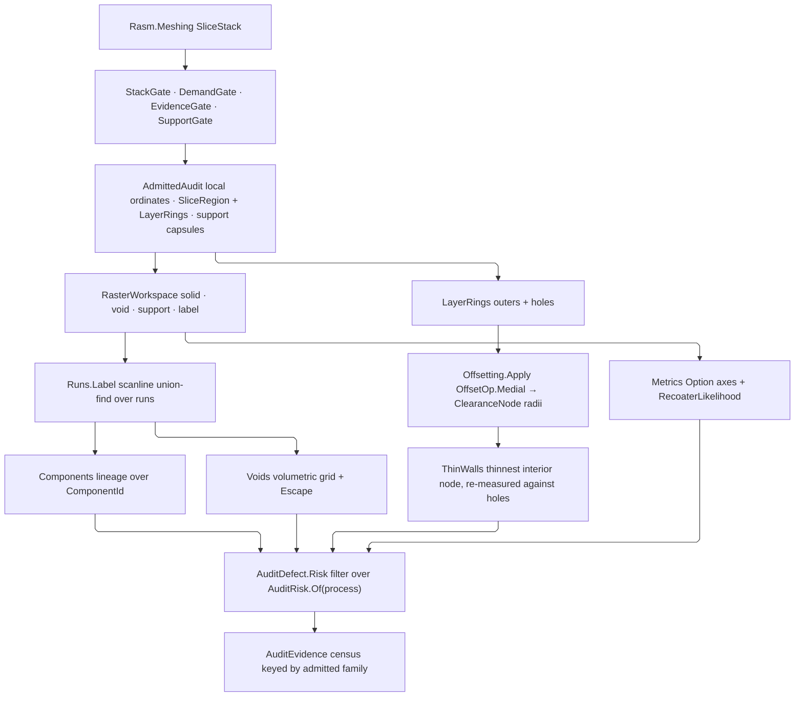

# [RASM_FABRICATION_AUDIT]

`Audit.Preflight` admits one additive `SliceStack`, rasterizes it in one correlated build frame, labels per-layer and volumetric connectivity, resolves void escape, and emits geometry and process-risk evidence before scan or production commitment. `AuditEvidence` is the sole preflight result scan-path and production gates consume.

Risk membership derives from the `AdditiveProcess` capability axes `Additive/production` owns — `Recoated` and `Supported` — so no risk table mirrors the process roster and a ninth process arrives with its families already decided. Every `AuditDefect` case names the `AuditRisk` it belongs to, so one filter applies the whole process policy and the census is total over the admitted families. `AuditEnvelope` binds section frame and build intervals into one relational owner. `RasterWorkspace` owns pooled solid, void, support, and label planes, `ParallelHelper.For2D` owns independent occupancy cells, and connectivity is run-scanline union-find over those planes — no graph container addresses a raster cell. Wall thickness is the one measure the raster does not answer: it composes the kernel `Offsetting.Apply` medial locus, whose `ClearanceNode` radii are exact boundary distances in the clearance vocabulary the toolpath boundary already speaks.

## [01]-[INDEX]

- [02]-[RISK_ALGEBRA]: `AuditRisk` and its per-process membership predicate, `TrapMedium` off the build head, and the `AuditDefect` family with its risk projection.
- [03]-[PREFLIGHT_POLICY]: `AuditEnvelope`, `AuditThresholds`, `LayerProcessEvidence`, and `AuditPolicy`.
- [04]-[RASTER_FRAME]: `Cell`, `ComponentId`, `RasterGrid`, `AdmittedAudit`, `RasterWorkspace`, and the plane fill actions.
- [05]-[FIELD_KERNELS]: the run-scanline labeling and the plane measurement folds.
- [06]-[LAYER_EVIDENCE]: `LayerComponent`, `VoidRegion`, the composed `Additive/slicing` measurement family, and the layer state fold.
- [07]-[PREFLIGHT]: `Audit.Preflight`, the admission gates, the request preimage, defect production, and `AuditEvidence`.

## [02]-[RISK_ALGEBRA]

- Owner: `AuditRisk` owns the risk-family vocabulary and the predicate deciding whether a process exhibits each family; `TrapMedium` owns which medium a void traps; `AuditDefect` owns every reportable finding and its owning family. `LayerMeasure` — the axis roster a composed index can be missing — is `Additive/slicing`'s, and the strike finding carries its absent set by composition.
- Law: family membership READS the process — `Supported` decides the support family, `Recoated` decides the recoater family, the build head decides thermal fusion and the trapped medium, and contour, bound, wall, and lineage bind every process. A per-process risk table restates the roster it mirrors and strands every family a new row forgets, so the predicate is the only membership authority.
- Cases: `AuditDefect` covers open contour, island, split and merge lineage, enclosed medium, restricted escape, unsupported area, thin wall, independent axis bound, heat accumulation, recoater strike, area jump, and unsupported-mass trend. The three cross-layer trend findings seat on the family whose evidence each actually carries — area growth is a lineage fact every process exhibits, unsupported-mass trend is support evidence, and blade-strike likelihood is recoater evidence — so the census separates three findings a single recoater family fused.
- Auto: `TrapMedium.Of` dispatches the generated total `Switch` over `BuildHead`, so a ninth head breaks this arm rather than silently trapping nothing; a head fusing feedstock in place carries no surrounding medium and answers `None`.
- Growth: a risk family is one `AuditRisk` row and its membership arm; a defect is one `AuditDefect` case and its `Risk` arm; a process is one `AdditiveProcess` row at its owner and reaches this page with its families already derived.
- Boundary: slicing owns contour topology and elevations, support owns generated support, scan-path owns vector planning, and production owns `AdditiveProcess`, `RecoaterEnvelope`, and machine commitment. Audit reads those facts and regenerates none of them.

```csharp
// --- [IMPORTS] -------------------------------------------------------------------------
using System.Collections.Frozen;
using CommunityToolkit.HighPerformance;
using CommunityToolkit.HighPerformance.Buffers;
using LanguageExt;
using LanguageExt.Common;
using NodaTime;
using QuikGraph;
using QuikGraph.Algorithms;
using Rasm.Domain;
using Rasm.Element.Projection;
using Rasm.Fabrication.Additive;
using Rasm.Fabrication.Process;
using Rasm.Meshing;
using Rasm.Numerics;
using Rasm.Spatial;
using Rhino.Geometry;
using Thinktecture;
using UnitsNet;
using static LanguageExt.Prelude;
using Duration = NodaTime.Duration;
using RhinoInterval = Rhino.Geometry.Interval;

namespace Rasm.Fabrication.Verify;

// --- [TYPES] ---------------------------------------------------------------------------
[SmartEnum<string>]
public sealed partial class AuditRisk {
    public static readonly AuditRisk Contour = new("contour", static _ => true);
    public static readonly AuditRisk Lineage = new("lineage", static _ => true);
    public static readonly AuditRisk Wall = new("wall", static _ => true);
    public static readonly AuditRisk Bound = new("bound", static _ => true);
    public static readonly AuditRisk Support = new("support", static process => process.Supported);
    public static readonly AuditRisk Recoater = new("recoater", static process => process.Recoated);
    public static readonly AuditRisk Thermal = new("thermal", static process => Fusing.Contains(process.Head));
    public static readonly AuditRisk Trap = new("trap", static process => TrapMedium.Of(process.Head).IsSome);
    public static readonly AuditRisk Drainage = new("drainage",
        static process => TrapMedium.Of(process.Head).Exists(static medium => medium.Drains));

    private static readonly Set<BuildHead> Fusing =
        Set(BuildHead.Laser, BuildHead.ElectronBeam, BuildHead.DirectedEnergy);

    public Func<AdditiveProcess, bool> Applies { get; }

    public static Set<AuditRisk> Of(AdditiveProcess process) =>
        toSeq(Items).Filter(row => row.Applies(process)).ToSet();
}

[SmartEnum<string>]
public sealed partial class TrapMedium {
    public static readonly TrapMedium Resin = new("resin", drains: true);
    public static readonly TrapMedium Powder = new("powder", drains: true);
    public static readonly TrapMedium Binder = new("binder", drains: true);
    public static readonly TrapMedium ProcessGas = new("process-gas", drains: false);

    public bool Drains { get; }

    public static Option<TrapMedium> Of(BuildHead head) => head.Switch(
        extruder: static _ => Option<TrapMedium>.None,
        laser: static _ => Some(Powder),
        electronBeam: static _ => Some(Powder),
        directedEnergy: static _ => Some(ProcessGas),
        vatProjector: static _ => Some(Resin),
        binder: static _ => Some(Binder),
        materialJet: static _ => Some(Resin),
        laminator: static _ => Option<TrapMedium>.None);
}

public readonly record struct Cell(int Layer, int Row, int Column);
public readonly record struct ComponentId(int Layer, int Label);

internal sealed record LayerRings(Seq<Polyline> Outers, Seq<Polyline> Holes);

[Union(ConversionFromValue = ConversionOperatorsGeneration.None)]
public abstract partial record AuditDefect {
    private AuditDefect() { }

    public sealed record OpenContour(int Layer, int Count) : AuditDefect;
    public sealed record Island(ComponentId Component, Area Footprint, Point3d At) : AuditDefect;
    public sealed record LineageSplit(ComponentId Component, Seq<ComponentId> Children) : AuditDefect;
    public sealed record LineageMerge(ComponentId Component, Seq<ComponentId> Parents) : AuditDefect;
    public sealed record EnclosedMedium(int Void, TrapMedium Medium, Volume Trapped, Point3d At) : AuditDefect;
    public sealed record EscapeRestriction(int Void, Length Mouth, Length Required, Point3d At) : AuditDefect;
    public sealed record UnsupportedArea(int Layer, Area Unsupported, Point3d At) : AuditDefect;
    public sealed record ThinWall(int Layer, Length Thickness, Point3d At) : AuditDefect;
    public sealed record TouchingBound(int Layer, MachineAxis Axis, Length Clearance, Point3d At) : AuditDefect;
    public sealed record HeatAccumulation(int Layer, double Index, double Limit) : AuditDefect;
    public sealed record RecoaterStrike(
        int Layer, Ratio Likelihood, Ratio Limit, Length Clearance,
        Set<LayerMeasure> Absent, Point3d At) : AuditDefect;
    public sealed record AreaJump(int Layer, Ratio Growth, Ratio Limit) : AuditDefect;
    public sealed record UnsupportedMassTrend(int Layer, Mass Trend, Mass Limit) : AuditDefect;

    public AuditRisk Risk => Switch(
        openContour: static _ => AuditRisk.Contour,
        island: static _ => AuditRisk.Lineage,
        lineageSplit: static _ => AuditRisk.Lineage,
        lineageMerge: static _ => AuditRisk.Lineage,
        enclosedMedium: static _ => AuditRisk.Trap,
        escapeRestriction: static _ => AuditRisk.Drainage,
        unsupportedArea: static _ => AuditRisk.Support,
        thinWall: static _ => AuditRisk.Wall,
        touchingBound: static _ => AuditRisk.Bound,
        heatAccumulation: static _ => AuditRisk.Thermal,
        recoaterStrike: static _ => AuditRisk.Recoater,
        areaJump: static _ => AuditRisk.Lineage,
        unsupportedMassTrend: static _ => AuditRisk.Support);
}
```

## [03]-[PREFLIGHT_POLICY]

- Owner: `AuditEnvelope` owns the build frame and its local intervals; `AuditThresholds` owns every geometric and process limit; `LayerProcessEvidence` owns measured thermal and recoat payload per layer; `AuditPolicy` composes process, `AuditEnvelope`, thresholds, support plan, `RecoaterEnvelope`, evidence rows, and evaluation instant.
- Law: ONE frame convention holds below admission. `AuditEnvelope.Frame` projects every kernel world elevation to a local ordinate and every contour point to a local point, `AdmittedAudit.Elevations` is that projection per layer, `RasterGrid.Local` takes only a local ordinate, and `AuditEnvelope.World` is the one egress — a world elevation reaching a local slot, or a local ordinate compared against `stack.Elevations`, is a frame defect rather than a unit mismatch.
- Entry: every owner admits through its generated `Validate` and the one `Admission.Admitted` bridge, so no site re-spells the refusal lift and every boundary value enters through `Validate` rather than a throwing `Create`.
- Auto: `RecoaterEnvelope` is REQUIRED exactly where the process is recoated, so a strike likelihood downstream reads a present clearance rather than defending against its absence; evidence rows carry one row per layer per admitted signal family, proved once here.
- Packages: `Rasm.Element` (`AdmissionSlots`); `Rasm.Meshing` (`SliceStack`); `Additive/production` (`AdditiveProcess`, `BuildHead`, `RecoaterEnvelope`); `Additive/support` (`SupportPlan`); `Process/faults` (`FabricationFault`, `FabConcern`, `Admission`, `MachineAxis`); `NodaTime`; Thinktecture.Runtime.Extensions; LanguageExt.Core.
- Growth: a process signal is one `LayerProcessEvidence` case with its risk arm; a limit is one `AuditThresholds` column.
- Boundary: thresholds carry physical limits and raster demand alone — no risk membership, no frame, and no evidence. Every admitted limit carries its quantity and the raster kernel below computes on raw ordinates, so the two regimes meet at admission and nowhere else. `MaximumRadiusCells` bounds the overhang reach the lineage walk enumerates and nothing else, because wall thickness resolves through a transform carrying no radius.

```csharp
// --- [MODELS] --------------------------------------------------------------------------
[ComplexValueObject]
public sealed partial class AuditEnvelope {
    public Plane Frame { get; }
    public RhinoInterval U { get; }
    public RhinoInterval V { get; }
    public RhinoInterval W { get; }

    static partial void ValidateFactoryArguments(
        ref ValidationError? validationError,
        ref Plane frame,
        ref RhinoInterval u,
        ref RhinoInterval v,
        ref RhinoInterval w) {
        if (!frame.IsValid || !u.IsValid || !v.IsValid || !w.IsValid
            || u.Length <= 0.0 || v.Length <= 0.0 || w.Length <= 0.0)
            validationError = new ValidationError("audit-envelope");
    }

    public static Fin<AuditEnvelope> Admit(Plane frame, RhinoInterval u, RhinoInterval v, RhinoInterval w) =>
        Validate(frame, u, v, w, out AuditEnvelope envelope).Admitted(envelope);

    public Point3d Local(Point3d world) {
        Frame.RemapToPlaneSpace(world, out Point3d local);
        return local;
    }

    public Point3d World(Point3d local) => Frame.PointAt(local.X, local.Y, local.Z);

    public double Ordinate(double worldElevation) => Local(new Point3d(0.0, 0.0, worldElevation)).Z;
}

[Union(ConversionFromValue = ConversionOperatorsGeneration.None)]
public abstract partial record LayerProcessEvidence {
    private LayerProcessEvidence() { }

    public sealed record Thermal(int LayerIndex, Energy Deposited, Duration Exposure, Option<Vector2d> FlowDirection)
        : LayerProcessEvidence;
    public sealed record Recoat(int LayerIndex, Duration Traverse, Vector2d Direction) : LayerProcessEvidence;

    public int Layer => Switch(
        thermal: static value => value.LayerIndex,
        recoat: static value => value.LayerIndex);

    public AuditRisk Risk => Switch(
        thermal: static _ => AuditRisk.Thermal,
        recoat: static _ => AuditRisk.Recoater);

    public bool Valid => Switch(
        thermal: static value => ValidityClaim.All(
            value.LayerIndex >= 0, ValidityClaim.Positive(value.Deposited.Joules), value.Exposure > Duration.Zero,
            value.FlowDirection.ForAll(Directed)),
        recoat: static value => value.LayerIndex >= 0 && value.Traverse > Duration.Zero && Directed(value.Direction));

    private static bool Directed(Vector2d direction) =>
        direction.IsValid && Math.Abs(direction.X) + Math.Abs(direction.Y) > double.Epsilon;
}

[ComplexValueObject]
public sealed partial class AuditThresholds {
    public Length Cell { get; }
    public Area MinIslandArea { get; }
    public Area MinUnsupportedArea { get; }
    public Angle OverhangAngle { get; }
    public Length MinWall { get; }
    public Length MinEscapeDiameter { get; }
    public Length BoundMargin { get; }
    public double MaxHeatIndex { get; }
    public Ratio MaxAreaJump { get; }
    public Mass MaxUnsupportedMassTrend { get; }
    public Ratio MaxRecoaterLikelihood { get; }
    public Density MaterialDensity { get; }
    public Duration CoolingTime { get; }
    public long CellCap { get; }
    public int MaximumRadiusCells { get; }

    static partial void ValidateFactoryArguments(
        ref ValidationError? validationError,
        ref Length cell,
        ref Area minIslandArea,
        ref Area minUnsupportedArea,
        ref Angle overhangAngle,
        ref Length minWall,
        ref Length minEscapeDiameter,
        ref Length boundMargin,
        ref double maxHeatIndex,
        ref Ratio maxAreaJump,
        ref Mass maxUnsupportedMassTrend,
        ref Ratio maxRecoaterLikelihood,
        ref Density materialDensity,
        ref Duration coolingTime,
        ref long cellCap,
        ref int maximumRadiusCells) {
        double[] finite = [cell.Millimeters, minIslandArea.SquareMillimeters, minUnsupportedArea.SquareMillimeters,
            overhangAngle.Degrees, minWall.Millimeters, minEscapeDiameter.Millimeters, boundMargin.Millimeters,
            maxHeatIndex, maxAreaJump.DecimalFractions, maxUnsupportedMassTrend.Kilograms,
            maxRecoaterLikelihood.DecimalFractions, materialDensity.KilogramsPerCubicMeter];
        long diameter = (2L * maximumRadiusCells) + 1L;
        bool bounded = cell > Length.Zero && minIslandArea >= Area.Zero && minUnsupportedArea >= Area.Zero
            && overhangAngle > Angle.Zero && overhangAngle < Angle.FromDegrees(90.0)
            && minWall > Length.Zero && minEscapeDiameter >= cell
            && boundMargin >= Length.Zero && maxHeatIndex > 0.0 && maxAreaJump >= Ratio.Zero
            && maxUnsupportedMassTrend >= Mass.Zero
            && maxRecoaterLikelihood >= Ratio.Zero && maxRecoaterLikelihood <= Ratio.FromDecimalFractions(1.0)
            && materialDensity > Density.Zero && coolingTime > Duration.Zero
            && cellCap is > 0L and <= int.MaxValue
            && maximumRadiusCells is > 0 and <= ((int.MaxValue - 1) / 2) && diameter * diameter <= cellCap;
        if (!finite.ForAll(double.IsFinite) || !bounded)
            validationError = new ValidationError("audit-thresholds");
    }

    public static Fin<AuditThresholds> Admit(
        Length cell,
        Area minIslandArea,
        Area minUnsupportedArea,
        Angle overhangAngle,
        Length minWall,
        Length minEscapeDiameter,
        Length boundMargin,
        double maxHeatIndex,
        Ratio maxAreaJump,
        Mass maxUnsupportedMassTrend,
        Ratio maxRecoaterLikelihood,
        Density materialDensity,
        Duration coolingTime,
        long cellCap,
        int maximumRadiusCells) =>
        Validate(cell, minIslandArea, minUnsupportedArea, overhangAngle, minWall, minEscapeDiameter, boundMargin,
            maxHeatIndex, maxAreaJump, maxUnsupportedMassTrend, maxRecoaterLikelihood, materialDensity, coolingTime,
            cellCap, maximumRadiusCells, out AuditThresholds thresholds).Admitted(thresholds);
}

[ComplexValueObject]
public sealed partial class AuditPolicy {
    public AdditiveProcess Process { get; }
    public AuditEnvelope Envelope { get; }
    public AuditThresholds Thresholds { get; }
    public Option<SupportPlan> Supports { get; }
    public Option<RecoaterEnvelope> Recoater { get; }
    public Seq<LayerProcessEvidence> Evidence { get; }
    public Instant EvaluatedAt { get; }

    public Set<AuditRisk> Risks => AuditRisk.Of(Process);

    static partial void ValidateFactoryArguments(
        ref ValidationError? validationError,
        ref AdditiveProcess process,
        ref AuditEnvelope envelope,
        ref AuditThresholds thresholds,
        ref Option<SupportPlan> supports,
        ref Option<RecoaterEnvelope> recoater,
        ref Seq<LayerProcessEvidence> evidence,
        ref Instant evaluatedAt) {
        Set<AuditRisk> risks = AuditRisk.Of(process);
        bool rows = evidence.ForAll(row => row.Valid && risks.Contains(row.Risk)
            && evidence.Count(candidate => candidate.Layer == row.Layer && candidate.Risk == row.Risk) == 1);
        bool clearance = !risks.Contains(AuditRisk.Recoater) || recoater.IsSome;
        if (!rows || !clearance)
            validationError = new ValidationError("audit-policy");
    }

    public static Fin<AuditPolicy> Admit(
        AdditiveProcess process,
        AuditEnvelope envelope,
        AuditThresholds thresholds,
        Option<SupportPlan> supports,
        Option<RecoaterEnvelope> recoater,
        Seq<LayerProcessEvidence> evidence,
        Instant evaluatedAt) =>
        Validate(process, envelope, thresholds, supports, recoater, evidence, evaluatedAt, out AuditPolicy policy)
            .Admitted(policy);
}
```

## [04]-[RASTER_FRAME]

- Owner: `RasterGrid` owns the local cell grid; `AdmittedAudit` owns the admitted stack, its local ordinates, the per-layer regions, and the per-layer support capsules; `RasterWorkspace` owns every pooled plane and the fill passes over them.
- Law: the workspace rents FOUR planes per layer — solid occupancy, void occupancy, support coverage, and the component label — and `BytesPerCell` states the budget those four cost, so `DemandGate` bounds what is actually rented rather than a plane count that hides an integer plane behind three byte planes.
- Exemption: `RasterWorkspace.Allocate`, `RasterWorkspace.Fill`, `OccupancyAction.Invoke`, and `SupportAction.Invoke` are the platform rental and parallel-fill kernels; each writes a disjoint cell and holds no shared state.
- Entry: `RasterWorkspace.Allocate` is the one rental and rolls every prior owner back on a partial failure; `Solid`, `Void`, `Support`, and `Labels` are the plane reads.
- Auto: occupancy classifies through the ONE `SliceRegion` non-zero winding rule every other `SliceStack` consumer reads, so the preflight fills exactly the geometry the program it gates deposits; a parity count over raw contours calls two same-winding nested rings void where the corpus fills them solid. The row-bucketed loop index supplies row-local candidates so each cell tests only the rings whose bounds cross its ordinate.
- Law: the label plane is SHARED SCRATCH the solid and void labelings write in turn, so each labeling consumes its own labels inside its own pass — the component walk reads them for lineage, the void walk for escape — and a later fold asking a question occupancy already answers reads occupancy, never a label the next pass overwrites.
- Packages: `CommunityToolkit.HighPerformance` (`MemoryOwner<T>`, `Memory2D<T>`, `Span2D<T>`, `AsMemory2D`, `AllocationMode`, `ParallelHelper.For2D`, `IAction2D`); `Additive/slicing` (`SliceRegion`, `SliceRegion.Of`, `Outers`, `Holes`, `Covers`); `Additive/support` (`SupportPlan`, `SupportLayer`, `SupportNode`).
- Boundary: `ParallelHelper.For2D` orders its bounds top, bottom, left, right — a transposed call partitions a rotated plane and no gate raises. Below `AdmittedAudit` no world coordinate exists except through `AuditEnvelope.World`.

```csharp
[ComplexValueObject]
internal sealed partial class RasterGrid {
    public double MinU { get; }
    public double MinV { get; }
    public double CellMm { get; }
    public int Rows { get; }
    public int Columns { get; }

    public int CellCount => Rows * Columns;
    public double CellAreaMm2 => CellMm * CellMm;

    public Point3d Local(int row, int column, double w) =>
        new(MinU + ((column + 0.5) * CellMm), MinV + ((row + 0.5) * CellMm), w);

    static partial void ValidateFactoryArguments(
        ref ValidationError? validationError,
        ref double minU,
        ref double minV,
        ref double cellMm,
        ref int rows,
        ref int columns) {
        if (!double.IsFinite(minU) || !double.IsFinite(minV) || !ValidityClaim.Positive(cellMm).Holds || rows <= 0 || columns <= 0)
            validationError = new ValidationError("audit-grid");
    }

    public static Fin<RasterGrid> Admit(double minU, double minV, double cellMm, int rows, int columns) =>
        Validate(minU, minV, cellMm, rows, columns, out RasterGrid grid).Admitted(grid);
}

internal sealed record AdmittedAudit(
    SliceStack Stack,
    AuditPolicy Policy,
    Seq<SliceRegion> Layers,
    Arr<LayerRings> Rings,
    Arr<double> Elevations,
    Arr<Seq<(SupportNode From, SupportNode To)>> Capsules,
    RasterGrid Grid) {
    public Set<AuditRisk> Risks => Policy.Risks;

    public double Height(int layer) => Math.Abs(layer == 0
        ? Elevations[1] - Elevations[0]
        : Elevations[layer] - Elevations[layer - 1]);

    public Point3d World(int layer, int row, int column) =>
        Policy.Envelope.World(Grid.Local(row, column, Elevations[layer]));

    public Point3d World(Cell cell) => World(cell.Layer, cell.Row, cell.Column);

    public int Reach(int layer) => (int)ReachDemand(Stack, Policy, layer);

    public static double ReachDemand(SliceStack stack, AuditPolicy policy, int layer) {
        double pitch = Math.Abs(layer == 0
            ? policy.Envelope.Ordinate(stack.Elevations[1]) - policy.Envelope.Ordinate(stack.Elevations[0])
            : policy.Envelope.Ordinate(stack.Elevations[layer]) - policy.Envelope.Ordinate(stack.Elevations[layer - 1]));
        return Math.Ceiling(pitch / Math.Tan(policy.Thresholds.OverhangAngle.Radians) / policy.Thresholds.Cell.Millimeters);
    }
}

// --- [SERVICES] ------------------------------------------------------------------------
internal sealed class RasterWorkspace : IDisposable {
    public const int BytesPerCell = 3 + sizeof(int);

    private readonly MemoryOwner<byte> solid;
    private readonly MemoryOwner<byte> voids;
    private readonly MemoryOwner<byte> support;
    private readonly MemoryOwner<int> labels;
    private readonly int layers;
    private readonly RasterGrid grid;

    private RasterWorkspace(
        MemoryOwner<byte> solid,
        MemoryOwner<byte> voids,
        MemoryOwner<byte> support,
        MemoryOwner<int> labels,
        int layers,
        RasterGrid grid) =>
        (this.solid, this.voids, this.support, this.labels, this.layers, this.grid) =
        (solid, voids, support, labels, layers, grid);

    public static Fin<RasterWorkspace> Allocate(int layers, RasterGrid grid) {
        MemoryOwner<byte>? solid = null;
        MemoryOwner<byte>? voids = null;
        MemoryOwner<byte>? support = null;
        MemoryOwner<int>? labels = null;
        return Try.lift(() => {
            solid = MemoryOwner<byte>.Allocate(layers * grid.CellCount, AllocationMode.Clear);
            voids = MemoryOwner<byte>.Allocate(layers * grid.CellCount, AllocationMode.Clear);
            support = MemoryOwner<byte>.Allocate(layers * grid.CellCount, AllocationMode.Clear);
            labels = MemoryOwner<int>.Allocate(layers * grid.CellCount, AllocationMode.Clear);
            return new RasterWorkspace(solid, voids, support, labels, layers, grid);
        }).Run().Rollback(solid, voids, support, labels);
    }

    public Memory2D<byte> Solid(int layer) => Plane(solid, layer);
    public Memory2D<byte> Void(int layer) => Plane(voids, layer);
    public Memory2D<byte> Support(int layer) => Plane(support, layer);
    public Memory2D<int> Labels(int layer) => Plane(labels, layer);

    private Memory2D<T> Plane<T>(MemoryOwner<T> owner, int layer) =>
        owner.Memory.Slice(layer * grid.CellCount, grid.CellCount).AsMemory2D(grid.Rows, grid.Columns);

    public void Fill(AdmittedAudit admitted) {
        for (int layer = 0; layer < layers; layer++) {
            double ordinate = admitted.Elevations[layer];
            OccupancyAction occupancy = new(
                Solid(layer), Void(layer), Index(admitted.Layers[layer], grid, ordinate), grid, ordinate);
            ParallelHelper.For2D(0, grid.Rows, 0, grid.Columns, in occupancy, minimumActionsPerThread: 1);
        }
        if (!admitted.Risks.Contains(AuditRisk.Support)) return;
        for (int layer = 0; layer < layers; layer++) {
            SupportAction coverage = new(
                Solid(layer),
                Support(layer),
                admitted.Policy.Supports.Bind(plan => plan.PlanarRows.Find(row => row.Layer == layer)),
                admitted.Capsules[layer],
                admitted.Policy.Envelope,
                grid,
                admitted.Elevations[layer],
                grid.CellMm * 0.5);
            ParallelHelper.For2D(0, grid.Rows, 0, grid.Columns, in coverage, minimumActionsPerThread: 1);
        }
    }

    private static Arr<Seq<(Loop Loop, int Winding, double MinU, double MaxU)>> Index(
        SliceRegion region,
        RasterGrid grid,
        double ordinate) {
        Seq<(Loop Loop, int Winding, BoundingBox Bounds)> bounded =
            region.Outers.Map(static loop => (Loop: loop, Winding: 1, Bounds: loop.Bound()))
                .Concat(region.Holes.Map(static loop => (Loop: loop, Winding: -1, Bounds: loop.Bound())));
        return Range(0, grid.Rows).ToSeq().Map(row => {
            double v = grid.Local(row, 0, ordinate).Y;
            return bounded
                .Filter(item => item.Bounds.Min.Y <= v && v <= item.Bounds.Max.Y)
                .Map(static item => (item.Loop, item.Winding, item.Bounds.Min.X, item.Bounds.Max.X));
        }).ToArr();
    }

    public void Dispose() {
        labels.Dispose();
        support.Dispose();
        voids.Dispose();
        solid.Dispose();
    }
}

internal readonly struct OccupancyAction(
    Memory2D<byte> solid,
    Memory2D<byte> voids,
    Arr<Seq<(Loop Loop, int Winding, double MinU, double MaxU)>> index,
    RasterGrid grid,
    double ordinate) : IAction2D {
    public void Invoke(int row, int column) {
        Point3d local = grid.Local(row, column, ordinate);
        int winding = index[row]
            .Filter(item => item.MinU <= local.X && local.X <= item.MaxU && item.Loop.Covers(local))
            .Sum(static item => item.Winding);
        if (winding > 0) solid.Span[row, column] = 1;
        else voids.Span[row, column] = 1;
    }
}

internal readonly struct SupportAction(
    Memory2D<byte> solid,
    Memory2D<byte> support,
    Option<SupportLayer> planar,
    Seq<(SupportNode From, SupportNode To)> capsules,
    AuditEnvelope envelope,
    RasterGrid grid,
    double ordinate,
    double margin) : IAction2D {
    public void Invoke(int row, int column) {
        if (solid.Span[row, column] == 0) return;
        Point3d world = envelope.World(grid.Local(row, column, ordinate));
        bool covered = planar.Exists(layer =>
                layer.Sparse.Covers(world) || layer.Interface.Covers(world) || layer.Contact.Covers(world))
            || capsules.Exists(branch => Covers(branch.From, branch.To, world, margin));
        if (covered) support.Span[row, column] = 1;
    }

    private static bool Covers(SupportNode from, SupportNode to, Point3d point, double margin) {
        Vector3d axis = to.At - from.At;
        double lengthSquared = axis.SquareLength;
        double t = lengthSquared <= double.Epsilon
            ? 0.0
            : Math.Clamp(((point - from.At) * axis) / lengthSquared, 0.0, 1.0);
        Point3d centre = from.At + (axis * t);
        return centre.DistanceTo(point) <= from.Radius + ((to.Radius - from.Radius) * t) + margin;
    }
}
```

## [05]-[FIELD_KERNELS]

- Owner: `Run` and `RunLabels` own raster connectivity; `PlaneFold` owns the whole-plane measurements.
- Law: connectivity labels RUNS, never cells. A maximal occupied span in one raster row is one union-find element, so the disjoint set holds one entry per run where a per-cell graph holds one vertex per cell — the structure a cell-addressed graph container inflates by two to three orders of magnitude against a raster the demand gate budgets in bytes. Runs in adjacent rows arrive column-sorted, so the overlap join is a two-pointer merge and the whole labeling is two linear passes.
- Exemption: `RunLabels.Find`, `RunLabels.Union`, `Runs.Label`, `Runs.Join`, `PlaneFold.Count`, `PlaneFold.Perimeter`, and `PlaneFold.DirectionalExposure` are the named numerical kernels; each is a bounded in-place sweep over one owned plane.
- Cases: `Connectivity.Planar` unions runs within one layer across adjacent rows; `Connectivity.Volumetric` extends that union across column-overlapping runs in adjacent layers, so solid components and the void grid are one kernel under two modes rather than two graph builders.
- Output: `Runs.Label` writes the compacted component label into the layer's own label plane and returns one row per component carrying its cell count and its first cell, so no later pass reconstructs a component from a label dictionary and no witness read can meet an empty group.
- Packages: `CommunityToolkit.HighPerformance` (`Memory2D<T>`, `Span2D<T>`, `Span2D<T>.GetRowSpan`); BCL inbox.
- Boundary: connectivity and occupancy are RASTER questions and stay here; wall thickness is an exact ring question and composes the kernel wavefront at `[07]-[PREFLIGHT]`. The two never merge — a raster resolves what is connected to what, and a distance quantized to the cell pitch is not a thickness this preflight is willing to report. These kernels read and write planes and integers only; a caller projects a returned cell through `AdmittedAudit.World`.

```csharp
// --- [OPERATIONS] ----------------------------------------------------------------------
[SmartEnum<string>]
internal sealed partial class Connectivity {
    public static readonly Connectivity Planar = new("planar", acrossLayers: false);
    public static readonly Connectivity Volumetric = new("volumetric", acrossLayers: true);

    public bool AcrossLayers { get; }
}

internal readonly record struct Run(int Layer, int Row, int Start, int End) {
    public int Cells => End - Start;

    public bool MeetsColumns(Run other) => Start < other.End && other.Start < End;
}

internal sealed class RunLabels {
    private readonly int[] parent;
    private readonly int[] size;

    public RunLabels(int runs) {
        parent = new int[runs];
        size = new int[runs];
        for (int run = 0; run < runs; run++) {
            parent[run] = run;
            size[run] = 1;
        }
    }

    public int Find(int run) {
        while (parent[run] != run) {
            parent[run] = parent[parent[run]];
            run = parent[run];
        }
        return run;
    }

    public void Union(int left, int right) {
        (int a, int b) = (Find(left), Find(right));
        if (a == b) return;
        if (size[a] < size[b]) (a, b) = (b, a);
        parent[b] = a;
        size[a] += size[b];
    }
}

internal sealed record ComponentRun(int Label, int Cells, Cell First);

internal static class Runs {
    public static Seq<ComponentRun> Label(
        Func<int, Memory2D<byte>> planes,
        Func<int, Memory2D<int>> targets,
        int layers,
        RasterGrid grid,
        Connectivity connectivity) {
        List<Run> runs = [];
        int[] rowStart = new int[(layers * grid.Rows) + 1];
        for (int layer = 0; layer < layers; layer++) {
            Span2D<byte> plane = planes(layer).Span;
            for (int row = 0; row < grid.Rows; row++) {
                rowStart[(layer * grid.Rows) + row] = runs.Count;
                ReadOnlySpan<byte> span = plane.GetRowSpan(row);
                int column = 0;
                while (column < grid.Columns) {
                    if (span[column] == 0) { column++; continue; }
                    int start = column;
                    while (column < grid.Columns && span[column] != 0) column++;
                    runs.Add(new Run(layer, row, start, column));
                }
            }
        }
        rowStart[layers * grid.Rows] = runs.Count;

        RunLabels labels = new(runs.Count);
        for (int layer = 0; layer < layers; layer++)
            for (int row = 0; row < grid.Rows; row++) {
                if (row > 0) Join(runs, labels, rowStart, (layer * grid.Rows) + row, (layer * grid.Rows) + row - 1);
                if (connectivity.AcrossLayers && layer > 0)
                    Join(runs, labels, rowStart, (layer * grid.Rows) + row, ((layer - 1) * grid.Rows) + row);
            }

        Dictionary<int, int> compacted = [];
        List<ComponentRun> components = [];
        for (int index = 0; index < runs.Count; index++) {
            Run run = runs[index];
            int root = labels.Find(index);
            if (!compacted.TryGetValue(root, out int label)) {
                label = components.Count + 1;
                compacted[root] = label;
                components.Add(new ComponentRun(label, 0, new Cell(run.Layer, run.Row, run.Start)));
            }
            components[label - 1] = components[label - 1] with { Cells = components[label - 1].Cells + run.Cells };
            Span2D<int> target = targets(run.Layer).Span;
            Span<int> span = target.GetRowSpan(run.Row);
            for (int column = run.Start; column < run.End; column++) span[column] = label;
        }
        return toSeq(components);
    }

    private static void Join(List<Run> runs, RunLabels labels, int[] rowStart, int here, int there) {
        int left = rowStart[here], right = rowStart[there];
        while (left < rowStart[here + 1] && right < rowStart[there + 1]) {
            if (runs[left].MeetsColumns(runs[right])) labels.Union(left, right);
            if (runs[left].End <= runs[right].End) left++;
            else right++;
        }
    }
}

internal static class PlaneFold {
    public static bool Empty(Memory2D<byte> plane, int row, int column, RasterGrid grid) =>
        row < 0 || column < 0 || row >= grid.Rows || column >= grid.Columns || plane.Span[row, column] == 0;

    public static (int Cells, Option<Point3d> Centroid) Occupancy(
        Memory2D<byte> plane, RasterGrid grid, double ordinate) {
        Span2D<byte> span = plane.Span;
        int count = 0;
        double sumU = 0.0, sumV = 0.0;
        for (int row = 0; row < grid.Rows; row++)
            for (int column = 0; column < grid.Columns; column++) {
                if (span[row, column] == 0) continue;
                Point3d centre = grid.Local(row, column, ordinate);
                count++;
                sumU += centre.X;
                sumV += centre.Y;
            }
        return (count, count == 0 ? None : Some(new Point3d(sumU / count, sumV / count, ordinate)));
    }

    public static double Perimeter(Memory2D<byte> plane, RasterGrid grid) {
        int edges = 0;
        for (int row = 0; row < grid.Rows; row++)
            for (int column = 0; column < grid.Columns; column++)
                if (!Empty(plane, row, column, grid))
                    edges += (Empty(plane, row - 1, column, grid) ? 1 : 0)
                        + (Empty(plane, row + 1, column, grid) ? 1 : 0)
                        + (Empty(plane, row, column - 1, grid) ? 1 : 0)
                        + (Empty(plane, row, column + 1, grid) ? 1 : 0);
        return edges * grid.CellMm;
    }

    public static (double Millimeters, Option<Cell> Witness) DirectionalExposure(
        Memory2D<byte> plane, Vector2d direction, int layer, RasterGrid grid) {
        double length = Math.Sqrt((direction.X * direction.X) + (direction.Y * direction.Y));
        double u = direction.X / length, v = direction.Y / length, exposure = 0.0, peak = 0.0;
        Option<Cell> witness = None;
        for (int row = 0; row < grid.Rows; row++)
            for (int column = 0; column < grid.Columns; column++) {
                if (Empty(plane, row, column, grid)) continue;
                double local = (Empty(plane, row, column - 1, grid) ? Math.Max(0.0, -u) : 0.0)
                    + (Empty(plane, row, column + 1, grid) ? Math.Max(0.0, u) : 0.0)
                    + (Empty(plane, row - 1, column, grid) ? Math.Max(0.0, -v) : 0.0)
                    + (Empty(plane, row + 1, column, grid) ? Math.Max(0.0, v) : 0.0);
                exposure += local;
                if (local > peak) (peak, witness) = (local, Some(new Cell(layer, row, column)));
            }
        return (exposure * grid.CellMm, witness);
    }
}
```

## [06]-[LAYER_EVIDENCE]

- Owner: `LayerComponent` owns one labeled region with its cross-layer genealogy; `VoidRegion` owns one void with its escape disposition; `Additive/slicing` owns the per-layer measurement family — `LayerMetric`, `LayerMeasure`, and `RecoaterLikelihood` — and this cluster COMPOSES it.
- Law: the measurement row is not this page's. Every axis on it is a fact about one slice layer and nothing about a defect, a risk family, or a threshold, so it seats at the plane that measures geometry and this page fills the process axes it alone can read. A second per-layer measurement record here would be the same concept under two unit regimes, which is the defect the composition deletes.
- Law: an axis a modality never measures rides `Option` and answers absence, never zero. A process building no support has no unsupported mass to read, and reading that absence as zero silently depresses every index it contributes to and freezes the gate above it — the finding this preflight exists to raise becomes the finding it cannot raise. A measured zero is `Some(Area.Zero)` and states at its site why the reading is genuinely zero.
- Auto: unsupported mass closes through the dimensioned algebra — area times length times density IS a mass — so the millimetre-to-SI crossing belongs to the quantity package and no transcribed conversion sits in the layer fold; the heat index integrates only where thermal evidence exists, which the process gate already proves for every layer whenever the thermal family is admitted.
- Law: every component and void carries its own first cell as a witness by construction, because the labeling emits the representative cell WITH the component — a witness read that could meet an empty group has no expressible form here.
- Packages: `Additive/slicing` (`LayerMetric`, `LayerMetric.Of`, `LayerMeasure`, `RecoaterLikelihood`, `RecoaterLikelihood.Of`); `UnitsNet` (`Area`, `Volume`, `Length`, `Mass`, `Ratio`, `Density`); LanguageExt.Core; Thinktecture.Runtime.Extensions.
- Boundary: metrics carry measurements alone. Threshold comparison, defect minting, and family filtering all belong to `[07]-[PREFLIGHT]`.

```csharp
// --- [MODELS] --------------------------------------------------------------------------
public sealed record LayerComponent(
    ComponentId Id,
    int Cells,
    Area Footprint,
    Point3d Witness,
    Seq<ComponentId> Parents,
    Seq<ComponentId> Children,
    int Genealogy);

[Union(ConversionFromValue = ConversionOperatorsGeneration.None)]
public abstract partial record VoidRegion {
    private VoidRegion() { }

    public sealed record Enclosed(int Id, int Cells, Volume Trapped, Point3d Witness) : VoidRegion;
    public sealed record Escaping(int Id, int Cells, Volume Trapped, Length Mouth, Point3d Witness) : VoidRegion;
}

internal readonly record struct MetricState(
    Option<double> Heat,
    Option<Area> PreviousArea,
    Option<Mass> PreviousMass,
    Seq<LayerMetric> Rows) {
    public static readonly MetricState Seed = new(None, None, None, Seq<LayerMetric>());
}
```

## [07]-[PREFLIGHT]

- Owner: `Audit` owns admission, the pooled run, defect production, and the settled `AuditEvidence`; `AuditEvidence` owns the preflight findings and per-family census.
- Law: defect production is UNCONDITIONAL and `Preflight` applies the process policy through one `AuditDefect.Risk` filter, so no family carries its own guard and no new case escapes the policy. A finding whose evidence axis is absent is never minted, so an unmeasured axis produces no defect rather than a comparison against a fabricated zero that always passes.
- Exemption: `Components`, `Voids`, `Escape`, `Metrics`, `Unsupported`, and `Bounds` are the named numerical kernels folding the owned planes.
- Entry: `public static Fin<AuditEvidence> Preflight(SliceStack stack, AuditPolicy policy)` admits the stack channels first because every later gate indexes them, then accumulates demand, evidence, and support admission before opening the pooled kernel. Allocation crosses one `Try` boundary and every owner disposes before egress.
- Auto: `DemandGate` proves the co-axiality the frame convention rests on — a layer whose points scatter across local ordinates has no single ordinate and every grid read would mislocate — and bounds the rental in bytes against the admitted cell cap; open-contour counts read the stack's own per-contour `Open` column through its layer pointers rather than materializing every chain to count the unclosed ones; the support plan's own spatial index resolves the branch set crossing each layer once on the result, so no cell fold scans the node roster, and an absent index — the planar-only program's honest state — takes the same empty-capsule arm an absent plan does.
- Output: `AuditEvidence` carries the process, per-layer metrics, component rows with parents and children, void rows with escape disposition, typed defects, and `Census` keyed by `AuditRisk`. The census seeds over the admitted families alone, so a zero means a family was checked and clean rather than a family the process cannot exhibit; a new defect case reports through it without a result edit.
- Packages: `Rasm.Meshing` (`SliceStack`, `LayerAt`, `Open`; `Offsetting.Apply`, `OffsetOp.Medial`, `OffsetResult`, `SkeletonGraph`, `ClearanceNode`, `OffsetPolicy.Of`); `Rasm.Spatial` (the box `SpatialIndex.Query` arm); `Additive/support` (`SupportPlan.Topology`, `SupportTopology.Graph`, `.ById`, `.Sites`); QuikGraph (`BidirectionalGraph`, `SEdge`, `WeaklyConnectedComponents`) over the component lineage alone; `Process/faults`; LanguageExt.Core.
- Boundary: wall thickness composes the kernel wavefront and never the raster, so this page mints no thickness measure of its own and speaks the same clearance vocabulary the toolpath boundary already reads. The wavefront admits ONE simple ring, so an outer ring's medial cannot see the layer's holes — every interior node re-measures against them, and that second read is the whole reason the wall fold is not the kernel call alone. QuikGraph addresses components, never cells: a lineage graph holds one vertex per labeled region while a raster graph holds one per cell, and only the former sizes with what the demand gate budgets. `IncrementalConnectedComponentsAlgorithm` and `ForestDisjointSet<T>` are refused for raster connectivity by name — both key on a boxed vertex, so either reintroduces the per-cell element count the run algebra exists to delete.

```csharp
// --- [MODELS] --------------------------------------------------------------------------
public sealed record AuditEvidence(
    AdditiveProcess Process,
    int Layers,
    Seq<LayerComponent> Components,
    Seq<VoidRegion> Voids,
    Seq<LayerMetric> Metrics,
    Seq<AuditDefect> Defects) {
    public Set<AuditRisk> Admitted => AuditRisk.Of(Process);

    public bool Clean => Defects.IsEmpty;

    public Map<AuditRisk, int> Census => Defects.Fold(
        Admitted.Fold(Map<AuditRisk, int>(), static (counts, risk) => counts.AddOrUpdate(risk, 0)),
        static (counts, defect) => counts.AddOrUpdate(defect.Risk, counts.Find(defect.Risk).IfNone(0) + 1));

    public Option<int> Count(AuditRisk risk) => Census.Find(risk);
}

// --- [OPERATIONS] ----------------------------------------------------------------------
public static class Audit {
    public static Fin<AuditEvidence> Preflight(SliceStack stack, AuditPolicy policy) =>
        from admitted in Admit(stack, policy)
        from evidence in Try.lift(() => Run(admitted)).Run()
        select evidence;

    private static Fin<AdmittedAudit> Admit(SliceStack stack, AuditPolicy policy) =>
        from _channels in StackGate(stack)
        from _gates in (DemandGate(stack, policy), EvidenceGate(stack, policy), SupportGate(stack, policy))
            .Apply(static (_, _, _) => unit).As().ToFin()
        from context in Context.Millimeters().ToFin()
        from layers in Range(0, stack.LayerCount).ToSeq()
            .Traverse(layer => Region(stack, layer, context, policy.Envelope)).As()
        let regions = layers.Map(static row => row.Region)
        let rings = layers.Map(static row => row.Rings).ToArr()
        from grid in RasterGrid.Admit(
            policy.Envelope.U.Min, policy.Envelope.V.Min, policy.Thresholds.Cell.Millimeters,
            (int)Math.Ceiling(policy.Envelope.V.Length / policy.Thresholds.Cell.Millimeters),
            (int)Math.Ceiling(policy.Envelope.U.Length / policy.Thresholds.Cell.Millimeters))
        let elevations = Range(0, stack.LayerCount).ToSeq()
            .Map(layer => policy.Envelope.Ordinate(stack.Elevations[layer])).ToArr()
        from capsules in Capsules(stack, policy)
        select new AdmittedAudit(stack, policy, regions, rings, elevations, capsules, grid);

    private static Fin<Unit> StackGate(SliceStack stack) {
        bool channels = stack.LayerCount > 1 && stack.ContourCount > 0
            && stack.Elevations.Count == stack.LayerCount
            && stack.LayerPtr.Count == stack.LayerCount + 1
            && stack.ContourPtr.Count == stack.ContourCount + 1
            && stack.Datum.IsValid && stack.U.Count == stack.V.Count
            && stack.LayerPtr[0] == 0 && stack.LayerPtr[^1] == stack.ContourCount
            && stack.ContourPtr[0] == 0 && stack.ContourPtr[^1] == stack.U.Count
            && stack.Parent.Count == stack.ContourCount
            && stack.Open.Count == stack.ContourCount
            && Range(1, stack.LayerPtr.Count - 1).ForAll(index => stack.LayerPtr[index] >= stack.LayerPtr[index - 1])
            && Range(1, stack.ContourPtr.Count - 1).ForAll(index => stack.ContourPtr[index] > stack.ContourPtr[index - 1])
            && stack.Parent.ForAll(parent => parent >= -1 && parent < stack.ContourCount)
            && Range(0, stack.ContourCount).ForAll(contour =>
                stack.ContourPtr[contour + 1] - stack.ContourPtr[contour] >= (stack.Open[contour] ? 2 : 3))
            && stack.Elevations.ForAll(double.IsFinite)
            && stack.U.ForAll(double.IsFinite) && stack.V.ForAll(double.IsFinite)
            && Range(1, Math.Max(0, stack.LayerCount - 1))
                .ForAll(index => stack.Elevations[index] > stack.Elevations[index - 1]);
        return channels
            ? Fin.Succ(unit)
            : Fin.Fail<Unit>(new GeometryFault.DegenerateInput(Kind.Mesh, None, "audit:stack-channels"));
    }

    private static K<Validation<Error>, Unit> DemandGate(SliceStack stack, AuditPolicy policy) {
        bool extent = policy.Envelope.W.Contains(policy.Envelope.Ordinate(stack.Elevations[0]))
            && policy.Envelope.W.Contains(policy.Envelope.Ordinate(stack.Elevations[^1]));
        bool correlated = Range(0, stack.LayerCount).ForAll(layer => {
            double ordinate = policy.Envelope.Ordinate(stack.Elevations[layer]);
            return stack.LayerAt(layer).ForAll(chain => chain.Points.ForAll(point =>
                Math.Abs(policy.Envelope.Local(point).Z - ordinate) <= Rhino.RhinoMath.ZeroTolerance));
        });
        double rows = Math.Ceiling(policy.Envelope.V.Length / policy.Thresholds.Cell.Millimeters);
        double columns = Math.Ceiling(policy.Envelope.U.Length / policy.Thresholds.Cell.Millimeters);
        bool reach = Range(1, Math.Max(0, stack.LayerCount - 1)).ForAll(layer => {
            double demand = AdmittedAudit.ReachDemand(stack, policy, layer);
            return double.IsFinite(demand) && demand >= 0.0 && demand <= policy.Thresholds.MaximumRadiusCells;
        });
        bool demand = rows is >= 1.0 and <= int.MaxValue && columns is >= 1.0 and <= int.MaxValue
            && rows * columns * stack.LayerCount * RasterWorkspace.BytesPerCell <= policy.Thresholds.CellCap;
        return AdmissionSlots.Gate(extent && correlated && demand && reach,
            FabConcern.Verify, "audit:demand", FabricationFault.Inadmissible);
    }

    private static K<Validation<Error>, Unit> EvidenceGate(SliceStack stack, AuditPolicy policy) {
        bool covered = Seq(AuditRisk.Thermal, AuditRisk.Recoater).ForAll(risk =>
            !policy.Risks.Contains(risk) || Range(0, stack.LayerCount).ForAll(layer =>
                policy.Evidence.Exists(row => row.Risk == risk && row.Layer == layer)));
        bool bounded = policy.Evidence.ForAll(row => row.Layer >= 0 && row.Layer < stack.LayerCount);
        return AdmissionSlots.Gate(covered && bounded,
            FabConcern.Verify, "audit:evidence", FabricationFault.Inadmissible);
    }

    private static K<Validation<Error>, Unit> SupportGate(SliceStack stack, AuditPolicy policy) =>
        AdmissionSlots.Gate(
            policy.Supports.ForAll(plan =>
                plan.PlanarRows.ForAll(layer => layer.Layer >= 0 && layer.Layer < stack.LayerCount)),
            FabConcern.Verify, "audit:support", FabricationFault.Inadmissible);

    private static Fin<Arr<Seq<(SupportNode From, SupportNode To)>>> Capsules(SliceStack stack, AuditPolicy policy) =>
        policy.Supports
            .Bind(static plan => plan.Topology.Sites.Map(index => (Plan: plan, Index: index)))
            .Match(
                Some: held => Range(0, stack.LayerCount).ToSeq()
                    .Traverse(layer => held.Index.Query(Slab(stack, policy, layer)).Map(hits => Reached(held.Plan, hits)))
                    .As().Map(static rows => rows.ToArr()),
                None: () => Fin.Succ(Range(0, stack.LayerCount).ToSeq()
                    .Map(static _ => Seq<(SupportNode From, SupportNode To)>()).ToArr()));

    private static Seq<(SupportNode From, SupportNode To)> Reached(SupportPlan plan, Seq<int> reached) {
        Set<int> nodes = reached.ToSet();
        return toSeq(plan.Topology.Graph.Edges)
            .Filter(edge => nodes.Contains(edge.Source) || nodes.Contains(edge.Target))
            .Map(edge => (From: plan.Topology.ById[edge.Source], To: plan.Topology.ById[edge.Target]));
    }

    private static BoundingBox Slab(SliceStack stack, AuditPolicy policy, int layer) {
        double pitch = Math.Abs(layer == 0
            ? stack.Elevations[1] - stack.Elevations[0]
            : stack.Elevations[layer] - stack.Elevations[layer - 1]);
        double elevation = stack.Elevations[layer];
        return new BoundingBox(
            new Point3d(policy.Envelope.U.Min, policy.Envelope.V.Min, elevation - pitch),
            new Point3d(policy.Envelope.U.Max, policy.Envelope.V.Max, elevation + pitch));
    }

    private static Fin<(SliceRegion Region, LayerRings Rings)> Region(
        SliceStack stack, int layer, Context context, AuditEnvelope envelope) =>
        stack.LayerAt(layer)
            .Filter(static chain => chain.Points.IsClosed)
            .Traverse(chain => Loop.Admit(
                toSeq(chain.Points).Init.Map(envelope.Local).ToArr(), true, Arr<double>(), context)).As()
            .Bind(static loops => SliceRegion.Of(loops))
            .Map(static region => (region, new LayerRings(region.Outers.Map(Ring), region.Holes.Map(Ring))));

    private static Polyline Ring(Loop loop) =>
        new(toSeq(loop.Vertices).Add(loop.Vertices[0]));

    private static Fin<AuditEvidence> Run(AdmittedAudit admitted) =>
        RasterWorkspace.Allocate(admitted.Stack.LayerCount, admitted.Grid)
            .Bind(workspace => Evidence(workspace, admitted).Settled(() => Custody.Released(workspace)));

    private static Fin<AuditEvidence> Evidence(RasterWorkspace workspace, AdmittedAudit admitted) {
        workspace.Fill(admitted);
        Seq<LayerComponent> components = Components(workspace, admitted);
        Seq<VoidRegion> voids = admitted.Risks.Contains(AuditRisk.Trap) || admitted.Risks.Contains(AuditRisk.Drainage)
            ? Voids(workspace, admitted)
            : Seq<VoidRegion>();
        Seq<LayerMetric> metrics = Metrics(workspace, admitted);
        return Defects(admitted, components, voids, metrics).Map(defects => new AuditEvidence(
            admitted.Policy.Process, admitted.Stack.LayerCount,
            components, voids, metrics, defects.Filter(defect => admitted.Risks.Contains(defect.Risk))));
    }

    private static Seq<LayerComponent> Components(RasterWorkspace workspace, AdmittedAudit admitted) {
        Seq<ComponentRun> runs = Runs.Label(
            workspace.Solid, workspace.Labels, admitted.Stack.LayerCount, admitted.Grid, Connectivity.Planar);
        BidirectionalGraph<ComponentId, SEdge<ComponentId>> lineage = new(allowParallelEdges: false);
        Seq<ComponentId> ids = runs.Map(static run => new ComponentId(run.First.Layer, run.Label));
        lineage.AddVertexRange(ids);
        for (int layer = 1; layer < admitted.Stack.LayerCount; layer++) {
            Seq<(int Row, int Column)> disc = Disc(admitted.Reach(layer));
            Span2D<int> here = workspace.Labels(layer).Span;
            Span2D<int> below = workspace.Labels(layer - 1).Span;
            for (int row = 0; row < admitted.Grid.Rows; row++)
                for (int column = 0; column < admitted.Grid.Columns; column++) {
                    if (here[row, column] == 0) continue;
                    ComponentId child = new(layer, here[row, column]);
                    disc.Map(step => (Row: row + step.Row, Column: column + step.Column))
                        .Filter(at => at.Row >= 0 && at.Column >= 0
                            && at.Row < admitted.Grid.Rows && at.Column < admitted.Grid.Columns)
                        .Map(at => below[at.Row, at.Column])
                        .Filter(static label => label != 0)
                        .Distinct()
                        .Iter(label => lineage.AddEdge(new SEdge<ComponentId>(new ComponentId(layer - 1, label), child)));
                }
        }
        Dictionary<ComponentId, int> genealogies = [];
        _ = lineage.WeaklyConnectedComponents(genealogies);
        return runs.Map(run => {
            ComponentId id = new(run.First.Layer, run.Label);
            return new LayerComponent(
                id, run.Cells, Area.FromSquareMillimeters(run.Cells * admitted.Grid.CellAreaMm2),
                admitted.World(run.First),
                toSeq(lineage.InEdges(id)).Map(static edge => edge.Source),
                toSeq(lineage.OutEdges(id)).Map(static edge => edge.Target),
                genealogies[id]);
        });
    }

    private static Seq<VoidRegion> Voids(RasterWorkspace workspace, AdmittedAudit admitted) {
        Seq<ComponentRun> runs = Runs.Label(
            workspace.Void, workspace.Labels, admitted.Stack.LayerCount, admitted.Grid, Connectivity.Volumetric);
        Arr<VoidFaces> faces = Escape(workspace, admitted, runs.Count);
        return runs.Map(run => {
            VoidFaces face = faces[run.Label - 1];
            Volume trapped = Volume.FromCubicMillimeters(face.VolumeMm3);
            Point3d at = admitted.World(face.Witness.IfNone(run.First));
            return face.Open
                ? (VoidRegion)new VoidRegion.Escaping(
                    run.Label, run.Cells, trapped, Length.FromMillimeters(face.Diameter), at)
                : new VoidRegion.Enclosed(run.Label, run.Cells, trapped, at);
        });
    }

    private static Arr<VoidFaces> Escape(RasterWorkspace workspace, AdmittedAudit admitted, int voids) {
        VoidFaces[] rows = new VoidFaces[voids];
        for (int index = 0; index < voids; index++) rows[index] = VoidFaces.Seed;
        int lastLayer = admitted.Stack.LayerCount - 1, lastRow = admitted.Grid.Rows - 1,
            lastColumn = admitted.Grid.Columns - 1;
        for (int layer = 0; layer < admitted.Stack.LayerCount; layer++) {
            Span2D<int> plane = workspace.Labels(layer).Span;
            double height = admitted.Height(layer);
            for (int row = 0; row < admitted.Grid.Rows; row++)
                for (int column = 0; column < admitted.Grid.Columns; column++) {
                    int label = plane[row, column];
                    if (label == 0) continue;
                    Cell cell = new(layer, row, column);
                    bool open = layer == 0 || layer == lastLayer || row == 0 || column == 0
                        || row == lastRow || column == lastColumn;
                    rows[label - 1] = rows[label - 1].With(
                        admitted.Grid.CellAreaMm2 * height,
                        BelowArea(layer, lastLayer, admitted.Grid.CellAreaMm2),
                        SideArea(row, column, lastRow, lastColumn, admitted.Grid.CellMm * height),
                        open ? Some(cell) : None);
                }
        }
        return rows.ToArr();
    }

    private static double BelowArea(int layer, int lastLayer, double cellArea) =>
        layer == 0 || layer == lastLayer ? cellArea : 0.0;

    private static double SideArea(int row, int column, int lastRow, int lastColumn, double cellFace) =>
        ((row == 0 ? 1 : 0) + (row == lastRow ? 1 : 0) + (column == 0 ? 1 : 0) + (column == lastColumn ? 1 : 0)) * cellFace;

    private static Seq<LayerMetric> Metrics(RasterWorkspace workspace, AdmittedAudit admitted) =>
        Range(0, admitted.Stack.LayerCount).Fold(MetricState.Seed, (state, layer) => {
            Memory2D<byte> solid = workspace.Solid(layer);
            double ordinate = admitted.Elevations[layer];
            (int cells, Option<Point3d> centre) = PlaneFold.Occupancy(solid, admitted.Grid, ordinate);
            Area area = Area.FromSquareMillimeters(cells * admitted.Grid.CellAreaMm2);
            Length perimeter = Length.FromMillimeters(PlaneFold.Perimeter(solid, admitted.Grid));
            Length pitch = Length.FromMillimeters(admitted.Grid.CellMm);

            (Option<Area> unsupported, Option<Point3d> unsupportedAt) =
                !admitted.Risks.Contains(AuditRisk.Support) ? (None, None)
                : layer == 0 ? (Some(Area.Zero), Option<Point3d>.None)
                : Unsupported(workspace, admitted, layer);

            Option<Mass> mass = unsupported.Map(value =>
                value * Length.FromMillimeters(admitted.Height(layer)) * admitted.Policy.Thresholds.MaterialDensity);
            Option<Mass> trend = from now in mass
                                 from before in state.PreviousMass
                                 select now > before ? now - before : Mass.Zero;

            Option<LayerProcessEvidence.Thermal> thermal = admitted.Policy.Evidence
                .Choose(row => row is LayerProcessEvidence.Thermal value && value.LayerIndex == layer ? Some(value) : None)
                .Head;
            Option<LayerProcessEvidence.Recoat> recoat = admitted.Policy.Evidence
                .Choose(row => row is LayerProcessEvidence.Recoat value && value.LayerIndex == layer ? Some(value) : None)
                .Head;

            Option<Length> gasExposure = thermal.Bind(static row => row.FlowDirection)
                .Map(direction => Length.FromMillimeters(
                    PlaneFold.DirectionalExposure(solid, direction, layer, admitted.Grid).Millimeters));
            (Option<Length> recoatExposure, Option<Point3d> recoaterAt) = recoat.Match(
                Some: row => {
                    (double millimeters, Option<Cell> witness) =
                        PlaneFold.DirectionalExposure(solid, row.Direction, layer, admitted.Grid);
                    return (Some(Length.FromMillimeters(millimeters)), witness.Map(admitted.World));
                },
                None: () => (Option<Length>.None, Option<Point3d>.None));

            Option<double> heat = thermal.Map(row => {
                double ventilation = 1.0 + Share(gasExposure, perimeter, pitch).DecimalFractions;
                double density = row.Deposited.Joules / Math.Max(row.Exposure.TotalSeconds, double.Epsilon)
                    / Math.Max(area.SquareMillimeters, admitted.Grid.CellAreaMm2);
                double decay = recoat
                    .Map(value => Math.Exp(
                        -value.Traverse.TotalSeconds / admitted.Policy.Thresholds.CoolingTime.TotalSeconds))
                    .IfNone(1.0);
                return (state.Heat.IfNone(0.0) * decay) + (density / ventilation);
            });

            Option<Ratio> jump = state.PreviousArea
                .Filter(static before => before > Area.Zero)
                .Map(before => Ratio.FromDecimalFractions(
                    Math.Max(0.0, area.SquareMillimeters - before.SquareMillimeters) / before.SquareMillimeters));

            Option<RecoaterLikelihood> likelihood = admitted.Policy.Recoater.Bind(envelope => RecoaterLikelihood.Of(
                Seq((LayerMeasure.UnsupportedMass, trend.Map(value => Ratio.FromDecimalFractions(
                        value.Kilograms
                        / Math.Max(admitted.Policy.Thresholds.MaxUnsupportedMassTrend.Kilograms, double.Epsilon)))),
                    (LayerMeasure.AreaJump, jump),
                    (LayerMeasure.RecoatExposure, Share(recoatExposure, perimeter, pitch).Some())),
                Ratio.FromDecimalFractions(
                    pitch.Millimeters / Math.Max(envelope.Clearance.Millimeters, pitch.Millimeters))));

            return new MetricState(heat, Some(area), mass, state.Rows.Add(new LayerMetric(
                layer, area, perimeter, centre.IfNone(admitted.World(layer, 0, 0)),
                unsupported, unsupportedAt, mass, trend,
                gasExposure, recoatExposure, recoaterAt, heat, jump, likelihood)));
        }).Rows;

    private static Ratio Share(Option<Length> exposure, Length along, Length pitch) =>
        Ratio.FromDecimalFractions(exposure
            .Map(value => value.Millimeters / Math.Max(along.Millimeters, pitch.Millimeters))
            .IfNone(0.0));

    private static (Option<Area> Unsupported, Option<Point3d> Witness) Unsupported(
        RasterWorkspace workspace, AdmittedAudit admitted, int layer) {
        Span2D<byte> current = workspace.Solid(layer).Span;
        Span2D<byte> support = workspace.Support(layer).Span;
        Span2D<byte> below = workspace.Solid(layer - 1).Span;
        Seq<(int Row, int Column)> disc = Disc(admitted.Reach(layer));
        int count = 0;
        Option<Point3d> witness = None;
        for (int row = 0; row < admitted.Grid.Rows; row++)
            for (int column = 0; column < admitted.Grid.Columns; column++) {
                if (current[row, column] == 0 || support[row, column] == 1) continue;
                bool reached = disc.Exists(step => {
                    int r = row + step.Row, c = column + step.Column;
                    return r >= 0 && c >= 0 && r < admitted.Grid.Rows && c < admitted.Grid.Columns && below[r, c] != 0;
                });
                if (reached) continue;
                count++;
                if (witness.IsNone) witness = Some(admitted.World(layer, row, column));
            }
        return (Some(Area.FromSquareMillimeters(count * admitted.Grid.CellAreaMm2)), witness);
    }

    private static Fin<Seq<AuditDefect>> ThinWalls(AdmittedAudit admitted) =>
        Range(0, admitted.Stack.LayerCount).ToSeq()
            .Traverse(layer => Walls(admitted, layer)).As()
            .Map(static layers => layers.Bind(identity));

    private static Fin<Seq<AuditDefect>> Walls(AdmittedAudit admitted, int layer) {
        LayerRings rings = admitted.Rings[layer];
        return rings.Outers
            .Traverse(ring => Offsetting.Apply(new OffsetOp.Medial(ring, OffsetPolicy.Of(Context.Canonical)))
                .Bind(result => result.Switch(
                    graph: medial => Fin.Succ(Thinnest(medial, ring, rings.Holes, admitted.Policy.Thresholds.MinWall)),
                    curves: static _ => Fin.Fail<Option<(Length Thickness, Point3d At)>>(
                        new KernelFault.InvalidValue("audit", "audit:medial")),
                    probe: static _ => Fin.Fail<Option<(Length Thickness, Point3d At)>>(
                        new KernelFault.InvalidValue("audit", "audit:medial"))))).As()
            .Map(found => found.Somes().Map(row => (AuditDefect)new AuditDefect.ThinWall(
                layer, row.Thickness, admitted.Policy.Envelope.World(row.At))));
    }

    private static Option<(Length Thickness, Point3d At)> Thinnest(
        SkeletonGraph axis, Polyline ring, Seq<Polyline> holes, Length floor) =>
        axis.Nodes.Skip(ring.Count - 1)
            .Map(node => (
                Thickness: Length.FromMillimeters(2.0 * holes.Fold(node.Radius,
                    (least, hole) => Math.Min(least, hole.ClosestPoint(node.At).DistanceTo(node.At)))),
                node.At))
            .Filter(row => row.Thickness < floor)
            .Fold(Option<(Length Thickness, Point3d At)>.None,
                static (thinnest, row) => thinnest.Filter(held => held.Thickness <= row.Thickness).IfNone(row));

    private static Seq<AuditDefect> Bounds(AdmittedAudit admitted) {
        Seq<AuditDefect> planar = Range(0, admitted.Stack.LayerCount).ToSeq().Bind(layer => {
            Seq<Point3d> locals = admitted.Stack.LayerAt(layer)
                .Bind(static chain => toSeq(chain.Points)).Map(admitted.Policy.Envelope.Local);
            return Seq((MachineAxis.X, admitted.Policy.Envelope.U), (MachineAxis.Y, admitted.Policy.Envelope.V))
                .Choose(row => locals
                    .Fold(Option<(double Clearance, Point3d At)>.None, (best, point) => {
                        double clearance = Clearance(point, row.Item1, row.Item2);
                        return best.Filter(held => held.Clearance <= clearance).IfNone((clearance, point));
                    })
                    .Filter(best => best.Clearance < admitted.Policy.Thresholds.BoundMargin.Millimeters)
                    .Map(best => (AuditDefect)new AuditDefect.TouchingBound(
                        layer, row.Item1, Length.FromMillimeters(best.Clearance),
                        admitted.Policy.Envelope.World(best.At))));
        });
        Option<(int Layer, Point3d At)> lowest = None, highest = None;
        for (int layer = 0; layer < admitted.Stack.LayerCount; layer++)
            admitted.Stack.LayerAt(layer).Bind(static chain => toSeq(chain.Points))
                .Map(admitted.Policy.Envelope.Local).Iter(point => {
                    lowest = lowest.Filter(held => held.At.Z <= point.Z).IfNone((layer, point));
                    highest = highest.Filter(held => held.At.Z >= point.Z).IfNone((layer, point));
                });
        Seq<AuditDefect> growth = Seq(
                (Extreme: lowest, Sign: 1.0, Bound: admitted.Policy.Envelope.W.Min),
                (Extreme: highest, Sign: -1.0, Bound: admitted.Policy.Envelope.W.Max))
            .Choose(row => row.Extreme
                .Filter(value =>
                    row.Sign * (value.At.Z - row.Bound) < admitted.Policy.Thresholds.BoundMargin.Millimeters)
                .Map(value => (AuditDefect)new AuditDefect.TouchingBound(
                    value.Layer, MachineAxis.Z, Length.FromMillimeters(row.Sign * (value.At.Z - row.Bound)),
                    admitted.Policy.Envelope.World(value.At))));
        return planar + growth;
    }

    private static double Clearance(Point3d local, MachineAxis axis, RhinoInterval interval) {
        double value = axis == MachineAxis.X ? local.X : local.Y;
        return Math.Min(value - interval.Min, interval.Max - value);
    }

    private static Fin<Seq<AuditDefect>> Defects(
        AdmittedAudit admitted,
        Seq<LayerComponent> components,
        Seq<VoidRegion> voids,
        Seq<LayerMetric> metrics) =>
        (admitted.Risks.Contains(AuditRisk.Wall) ? ThinWalls(admitted) : Fin.Succ(Seq<AuditDefect>()))
            .Map(walls => walls + Settled(admitted, components, voids, metrics));

    private static Seq<AuditDefect> Settled(
        AdmittedAudit admitted,
        Seq<LayerComponent> components,
        Seq<VoidRegion> voids,
        Seq<LayerMetric> metrics) =>
        OpenContours(admitted)
        + components.Bind(component =>
            (component.Id.Layer > 0 && component.Parents.IsEmpty
                && component.Footprint >= admitted.Policy.Thresholds.MinIslandArea
                    ? Seq<AuditDefect>(new AuditDefect.Island(component.Id, component.Footprint, component.Witness))
                    : Seq<AuditDefect>())
            + (component.Parents.Count > 1
                ? Seq<AuditDefect>(new AuditDefect.LineageMerge(component.Id, component.Parents))
                : Seq<AuditDefect>())
            + (component.Children.Count > 1
                ? Seq<AuditDefect>(new AuditDefect.LineageSplit(component.Id, component.Children))
                : Seq<AuditDefect>()))
        + voids.Bind(value => TrapMedium.Of(admitted.Policy.Process.Head).Map(medium => value.Switch(
            state: (Medium: medium, Floor: admitted.Policy.Thresholds.MinEscapeDiameter),
            enclosed: static (context, enclosed) => Seq<AuditDefect>(new AuditDefect.EnclosedMedium(
                enclosed.Id, context.Medium, enclosed.Trapped, enclosed.Witness)),
            escaping: static (context, escaping) => escaping.Mouth < context.Floor
                ? Seq<AuditDefect>(new AuditDefect.EscapeRestriction(
                    escaping.Id, escaping.Mouth, context.Floor, escaping.Witness))
                : Seq<AuditDefect>())).IfNone(Seq<AuditDefect>()))
        + metrics.Bind(metric => Trends(admitted, metric))
        + Bounds(admitted);

    private static Seq<AuditDefect> OpenContours(AdmittedAudit admitted) =>
        Range(0, admitted.Stack.LayerCount).ToSeq()
            .Map(layer => (Layer: layer, Count: Range(admitted.Stack.LayerPtr[layer],
                    admitted.Stack.LayerPtr[layer + 1] - admitted.Stack.LayerPtr[layer])
                .Count(contour => admitted.Stack.Open[contour])))
            .Filter(static row => row.Count > 0)
            .Map(static row => (AuditDefect)new AuditDefect.OpenContour(row.Layer, row.Count));

    private static Seq<AuditDefect> Trends(AdmittedAudit admitted, LayerMetric metric) =>
        (from unsupported in metric.UnsupportedArea
         where unsupported >= admitted.Policy.Thresholds.MinUnsupportedArea
         from at in metric.UnsupportedAt
         select (AuditDefect)new AuditDefect.UnsupportedArea(metric.Layer, unsupported, at)).ToSeq()
        + (from index in metric.HeatIndex
           where index > admitted.Policy.Thresholds.MaxHeatIndex
           select (AuditDefect)new AuditDefect.HeatAccumulation(
               metric.Layer, index, admitted.Policy.Thresholds.MaxHeatIndex)).ToSeq()
        + (from growth in metric.AreaJumpRatio
           where growth > admitted.Policy.Thresholds.MaxAreaJump
           select (AuditDefect)new AuditDefect.AreaJump(
               metric.Layer, growth, admitted.Policy.Thresholds.MaxAreaJump)).ToSeq()
        + (from trend in metric.UnsupportedMassTrend
           where trend > admitted.Policy.Thresholds.MaxUnsupportedMassTrend
           select (AuditDefect)new AuditDefect.UnsupportedMassTrend(
               metric.Layer, trend, admitted.Policy.Thresholds.MaxUnsupportedMassTrend)).ToSeq()
        + (from likelihood in metric.Recoater
           where likelihood.Value > admitted.Policy.Thresholds.MaxRecoaterLikelihood
           from envelope in admitted.Policy.Recoater
           from at in metric.RecoaterAt
           select (AuditDefect)new AuditDefect.RecoaterStrike(
               metric.Layer, likelihood.Value, admitted.Policy.Thresholds.MaxRecoaterLikelihood,
               envelope.Clearance, likelihood.Missing, at)).ToSeq();

    private static Seq<(int Row, int Column)> Disc(int radius) =>
        Range(-radius, (radius * 2) + 1).ToSeq()
            .Bind(row => Range(-radius, (radius * 2) + 1).ToSeq().Map(column => (Row: row, Column: column)))
            .Filter(offset => ((long)offset.Row * offset.Row) + ((long)offset.Column * offset.Column)
                <= (long)radius * radius);
}

internal readonly record struct VoidFaces(
    double VolumeMm3,
    double BelowMm2,
    double SideMm2,
    Option<Cell> Witness) {
    public static readonly VoidFaces Seed = new(0.0, 0.0, 0.0, None);

    public bool Open => Witness.IsSome;

    public double Diameter => 2.0 * Math.Sqrt(Math.Max(BelowMm2, SideMm2) / Math.PI);

    public VoidFaces With(double volume, double below, double side, Option<Cell> boundary) => new(
        VolumeMm3 + volume,
        BelowMm2 + below,
        SideMm2 + side,
        Witness.IsSome ? Witness : boundary);
}
```



## [08]-[RESEARCH]

<!-- source-only: research row template:
[TOKEN]-[OPEN|BLOCKED]: <exact question>; <verification route>.
-->

(none)
