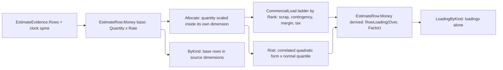

# [RASM_FABRICATION_ESTIMATION]

`Estimate.Run` converts correlated fabrication evidence into a unit estimate or lot ledger selected by `EstimateRequest`. Lot evaluation transforms parallel money and carbon ledgers by quantity, batching, scrap, commercial loading, validity, capacity, and confidence while preserving every source dimension. Pricing reads authoritative sibling results; it never reconstructs clocks, yield, wear, availability, magazine mechanics, or welding work.

`EstimateEvidence` is one closed union carrying its `EvidenceKind` on the root, and each kind row owns the payload predicate its own case admits, so a new evidence source is one case, one row, and one activity arm. `Locus` is the admitted correlation key every activity, ledger row, and demand carries, so a rate, an impact, and a loading all join on one typed identity. `EstimateRow.Money` holds base quantity and rate in their own dimensions and carries a derived row's loading as its own factor evidence, so a commercial or risk transformation never overwrites the dimensions its reconciliation sums. `CostEstimate` owns the priced subject, evaluation instant, money and carbon rows, clock, and attribution consumed by `QuoteLedger`.

## [01]-[INDEX]

- [02]-[COST_AXES]: `CostStage`, `AllocationKind`, `RateBasis`, `CostKind`, `CarbonKind`, `CommercialLoad`, `LocusFamily`, and `Locus`.
- [03]-[EVIDENCE]: `EvidenceKind`, the activity rows `StockConsumption`/`OperationTime`/`CapacityQuote`/`LogisticsActivity`, the `CostActivity`/`ImpactActivity`/`ActivityRows` carriers, `EstimateEvidence`, and `EstimateBasis` with its one evidence index.
- [04]-[LEDGER]: `RowLoading`, `EstimateRow`, `ClockSource`, `EstimateClock`, `CostEstimate`, `LoadingTable`, `QuotePolicy`, `QuoteLedger`, `EstimateRequest`, `Priced`, and `EstimateDemand`.
- [05]-[PRICING]: `Estimate.Run`, the demand fold, the clock spine, the allocation and commercial ladder, the correlated risk fan, and the estimate instrument writes.

## [02]-[COST_AXES]

- Owner: `CostKind` and `CarbonKind` own every priceable resource and emission source with the rate basis, allocation regime, and rate source each carries; `CommercialLoad` owns the ordered lot transformations with the stages each prices and whether it prices credits; `Locus` owns the admitted correlation key, and `LocusFamily` owns its closed family vocabulary.
- Cases: `CostStage` separates the base allocation stages from the derived commercial and risk stages, so a reconciliation partitions on the stage a row declares. `LocusFamily` carries a `Qualified` column: an unqualified family IS its own locus, while a tool, consumable, plan step, specialized lane, or tool change qualifies its family with a key its own owner minted.
- Law: a rate is either the basis tariff or a rate an evidence source assessed, and the `CostKind` row declares which through its own delegate column, so a second assessed resource is a row value rather than a branch in the pricing fold. Scrap is a YIELD transformation and prices credits beside charges — scrapping parts consumes proportionally more stock and recovers proportionally more remnant — while contingency, margin, and tax are COMMERCIAL and price charges alone, so the credit column rides the load rather than the allocation.
- Law: `CostKind` and `CarbonKind` share two COLUMN NAMES and no values, so they stay two rosters. One resource meters differently per ledger — sheet material prices by square metre and emits by kilogram, logistics prices by lot and emits by tonne-kilometre, a consumable prices by life and emits by kilogram — and the carbon side splits granularity the money side does not, pricing one additive feedstock while emitting a virgin row beside a recycled one. A merged roster carrying a per-ledger basis and a per-ledger granularity leaves an absent cell on most rows, and the money roster's assessed-rate delegate has no emission counterpart at all. The shared algebra they DO have is already one owner: `Estimate.Reconcile` folds both ledgers, and `RateBasis` and `AllocationKind` are the two rosters both rows read.
- Auto: `CommercialLoad.Rank` fixes the compounding order and `Over` declares the stages each load prices, so tax rides the marked-up total while margin never prices tax. `LocusFamily` materializes its unqualified loci once from `Items`, so the common locus read is a frozen row lookup and the composed key can never be empty — the family key alone is non-empty by construction, which is what makes the derived factory total.
- Entry: `Locus.Admit(string)` is the ONE boundary crossing, taken where caller text supplies an operation locus; `Locus.Of(family, qualifier)` composes an internal locus whose qualifier is keyed by construction.
- Packages: Thinktecture.Runtime.Extensions, LanguageExt.Core, `Rasm.Fabrication.Process` (`FabricationFault`, `FabConcern`, `Witness`), BCL inbox.
- Growth: a priceable resource is one `CostKind` row with one tariff; an emission source is one `CarbonKind` row with one factor; an allocation regime is one `AllocationKind` row; a commercial transformation is one `CommercialLoad` row carrying its rank, compounding base, and credit column; a correlation locus is one `LocusFamily` row.
- Boundary: carbon never converts to currency and never takes a commercial load, so `EstimateRow.Carbon` carries no loading column at all. Credits remain signed rows on the same ledger rather than a second family.

```csharp
// --- [IMPORTS] -------------------------------------------------------------------------
using System.Collections.Frozen;
using System.Numerics;
using System.Threading;
using LanguageExt;
using LanguageExt.Common;
using LanguageExt.Traits;
using MathNet.Numerics.Distributions;
using NodaTime;
using Rasm.Domain;
using Rasm.Element;
using Rasm.Element.Projection;
using Rasm.Fabrication.Additive;
using Rasm.Fabrication.Joining;
using Rasm.Fabrication.Kinematics;
using Rasm.Fabrication.Nesting;
using Rasm.Fabrication.Process;
using Rasm.Fabrication.Tooling;
using Rasm.Numerics;
using Thinktecture;
using static LanguageExt.Prelude;

namespace Rasm.Fabrication.Verify;

// --- [TYPES] ---------------------------------------------------------------------------
[SmartEnum<string>]
public sealed partial class CostStage {
    public static readonly CostStage Unit = new("unit");
    public static readonly CostStage Batch = new("batch");
    public static readonly CostStage Lot = new("lot");
    public static readonly CostStage Scrap = new("scrap");
    public static readonly CostStage Contingency = new("contingency");
    public static readonly CostStage Margin = new("margin");
    public static readonly CostStage Tax = new("tax");
    public static readonly CostStage Risk = new("risk");
}

[SmartEnum<string>]
public sealed partial class AllocationKind {
    public static readonly AllocationKind Variable = new("variable", CostStage.Unit, static (quantity, _) => quantity);
    public static readonly AllocationKind Batch = new("batch", CostStage.Batch, static (_, batches) => batches);
    public static readonly AllocationKind Lot = new("lot", CostStage.Lot, static (_, _) => 1);
    public static readonly AllocationKind Credit = new("credit", CostStage.Unit, static (quantity, _) => quantity);

    public CostStage Stage { get; }

    [UseDelegateFromConstructor]
    public partial int Multiplier(int quantity, int batches);
}

[SmartEnum<string>]
public sealed partial class RateBasis {
    public static readonly RateBasis Hour = new("hour");
    public static readonly RateBasis SquareMeter = new("square-meter");
    public static readonly RateBasis Kilogram = new("kilogram");
    public static readonly RateBasis KilowattHour = new("kilowatt-hour");
    public static readonly RateBasis Life = new("life");
    public static readonly RateBasis CubicCentimeter = new("cubic-centimeter");
    public static readonly RateBasis Unit = new("unit");
    public static readonly RateBasis Lot = new("lot");
    public static readonly RateBasis TonneKilometer = new("tonne-kilometer");
}

[SmartEnum<string>]
public sealed partial class CostKind {
    private static readonly Func<EstimateBasis, Option<decimal>> Tariffed = static _ => None;

    public static readonly CostKind Machine = new("machine", RateBasis.Hour, AllocationKind.Variable,
        static basis => basis.Machine.Map(static match => (decimal)match.HourlyRate));
    public static readonly CostKind Labor = new("labor", RateBasis.Hour, AllocationKind.Variable, Tariffed);
    public static readonly CostKind Setup = new("setup", RateBasis.Hour, AllocationKind.Batch, Tariffed);
    public static readonly CostKind Material = new("material", RateBasis.SquareMeter, AllocationKind.Variable, Tariffed);
    public static readonly CostKind AdditiveMaterial = new("additive-material", RateBasis.Kilogram, AllocationKind.Variable, Tariffed);
    public static readonly CostKind Energy = new("energy", RateBasis.KilowattHour, AllocationKind.Variable, Tariffed);
    public static readonly CostKind Tooling = new("tooling", RateBasis.Life, AllocationKind.Variable, Tariffed);
    public static readonly CostKind Consumable = new("consumable", RateBasis.Life, AllocationKind.Variable, Tariffed);
    public static readonly CostKind ToolChange = new("tool-change", RateBasis.Hour, AllocationKind.Variable, Tariffed);
    public static readonly CostKind Rework = new("rework", RateBasis.CubicCentimeter, AllocationKind.Variable, Tariffed);
    public static readonly CostKind Quality = new("quality", RateBasis.Unit, AllocationKind.Variable, Tariffed);
    public static readonly CostKind OutsideService = new("outside-service", RateBasis.Unit, AllocationKind.Variable, Tariffed);
    public static readonly CostKind Logistics = new("logistics", RateBasis.Lot, AllocationKind.Lot, Tariffed);
    public static readonly CostKind Depreciation = new("depreciation", RateBasis.Hour, AllocationKind.Variable, Tariffed);
    public static readonly CostKind Remnant = new("remnant", RateBasis.Kilogram, AllocationKind.Credit, Tariffed);

    public RateBasis Basis { get; }
    public AllocationKind Allocation { get; }

    [UseDelegateFromConstructor]
    public partial Option<decimal> Assessed(EstimateBasis basis);
}

[SmartEnum<string>]
public sealed partial class CarbonKind {
    public static readonly CarbonKind Electricity = new("electricity", RateBasis.KilowattHour, AllocationKind.Variable);
    public static readonly CarbonKind Material = new("material", RateBasis.Kilogram, AllocationKind.Variable);
    public static readonly CarbonKind RecycledFeedstock = new("recycled-feedstock", RateBasis.Kilogram, AllocationKind.Variable);
    public static readonly CarbonKind Scrap = new("scrap", RateBasis.Kilogram, AllocationKind.Variable);
    public static readonly CarbonKind Recovery = new("recovery", RateBasis.Kilogram, AllocationKind.Credit);
    public static readonly CarbonKind Consumable = new("consumable", RateBasis.Kilogram, AllocationKind.Variable);
    public static readonly CarbonKind Logistics = new("logistics", RateBasis.TonneKilometer, AllocationKind.Lot);

    public RateBasis Basis { get; }
    public AllocationKind Allocation { get; }
}

[SmartEnum<string>]
public sealed partial class CommercialLoad {
    public static readonly CommercialLoad Scrap = new("scrap", CostStage.Scrap, rank: 0, pricesCredits: true,
        Set(CostStage.Unit, CostStage.Batch, CostStage.Lot),
        static rate => rate / (1.0 - rate), static rate => rate is >= 0.0 and < 1.0);
    public static readonly CommercialLoad Contingency = new("contingency", CostStage.Contingency, rank: 1, pricesCredits: false,
        Set(CostStage.Unit, CostStage.Batch, CostStage.Lot, CostStage.Scrap),
        static rate => rate, static rate => rate >= 0.0);
    public static readonly CommercialLoad Margin = new("margin", CostStage.Margin, rank: 2, pricesCredits: false,
        Set(CostStage.Unit, CostStage.Batch, CostStage.Lot, CostStage.Scrap, CostStage.Contingency),
        static rate => rate, static rate => rate >= 0.0);
    public static readonly CommercialLoad Tax = new("tax", CostStage.Tax, rank: 3, pricesCredits: false,
        Set(CostStage.Unit, CostStage.Batch, CostStage.Lot, CostStage.Scrap, CostStage.Contingency, CostStage.Margin),
        static rate => rate, static rate => rate >= 0.0);

    public CostStage Stage { get; }
    public int Rank { get; }
    public bool PricesCredits { get; }
    public Set<CostStage> Over { get; }

    public bool Prices(AllocationKind allocation) => PricesCredits || allocation != AllocationKind.Credit;

    [UseDelegateFromConstructor]
    public partial double Factor(double rate);

    [UseDelegateFromConstructor]
    public partial bool Admits(double rate);
}

[SmartEnum<string>]
public sealed partial class LocusFamily {
    public static readonly LocusFamily Motion = new("motion", qualified: false);
    public static readonly LocusFamily PostedProgram = new("posted-program", qualified: false);
    public static readonly LocusFamily Additive = new("additive", qualified: false);
    public static readonly LocusFamily AdditiveVirgin = new("additive-virgin", qualified: false);
    public static readonly LocusFamily AdditiveRecycled = new("additive-recycled", qualified: false);
    public static readonly LocusFamily Verification = new("verification", qualified: false);
    public static readonly LocusFamily Inspection = new("inspection", qualified: false);
    public static readonly LocusFamily Forming = new("forming", qualified: false);
    public static readonly LocusFamily Plan = new("plan", qualified: false);
    public static readonly LocusFamily Stock = new("stock", qualified: false);
    public static readonly LocusFamily Remnant = new("remnant", qualified: false);
    public static readonly LocusFamily Welding = new("welding", qualified: false);
    public static readonly LocusFamily Quality = new("quality", qualified: false);
    public static readonly LocusFamily OutsideService = new("outside-service", qualified: false);
    public static readonly LocusFamily Logistics = new("logistics", qualified: false);
    public static readonly LocusFamily Uncut = new("uncut", qualified: false);
    public static readonly LocusFamily Overcut = new("overcut", qualified: false);
    public static readonly LocusFamily Tool = new("tool", qualified: true);
    public static readonly LocusFamily Consumable = new("consumable", qualified: true);
    public static readonly LocusFamily Step = new("step", qualified: true);
    public static readonly LocusFamily Specialized = new("specialized", qualified: true);
    public static readonly LocusFamily ToolChange = new("tool-change", qualified: true);

    public bool Qualified { get; }

    private static readonly Lazy<FrozenDictionary<LocusFamily, Locus>> Plain = new(
        static () => Items.Where(static row => !row.Qualified).ToFrozenDictionary(static row => row, static row => Locus.Create(row.Key)),
        LazyThreadSafetyMode.ExecutionAndPublication);

    public Locus At => Plain.Value[this];
}

[ValueObject<string>(KeyMemberName = "Value", KeyMemberAccessModifier = AccessModifier.Public)]
public readonly partial struct Locus {
    static partial void ValidateFactoryArguments(ref ValidationError? validationError, ref string value) {
        value = value.Trim();
        if (!Witness.Keyed(value))
            validationError = new ValidationError("estimate:locus");
    }

    public static Fin<Locus> Admit(string value) => Admission.OfValue<Locus, string>(value);

    public static Locus Of(LocusFamily family, string qualifier) =>
        family.Qualified ? Create($"{family.Key}:{qualifier}") : family.At;
}
```

## [03]-[EVIDENCE]

- Owner: `EstimateEvidence` owns the closed evidence corpus and prices the activity rows its own source proves; `EvidenceKind` owns the kind vocabulary, its repetition column, and the payload predicate each case admits against; `EstimateBasis` binds one subject, currency, evaluation instant, evidence corpus, tariff map, carbon-factor map, uncertainty, correlation, and remnant policy, and publishes ONE evidence index over them.
- Cases: evidence covers simulation, fleet match, wear, stock, additive build, welding, operation time, tool change, capacity, quality, outside service, logistics, and consumable mass.
- Law: the payload predicate rides its `EvidenceKind` row through the S0 `Witness.Case` lift, so a kind admits only its own payload type and the twelve-arm predicate switch that sniffed each case is deleted. The evidence index is the ONE place a payload is read by identity: it projects the simulation result, the machine match, the capacity quote, and the tool-change rows through the generated total `Switch`, so a new evidence case breaks that fold at compile time and no site runs a runtime type test over the closed union.
- Entry: `EstimateBasis.Admit` runs the accumulating gate fan and closes on the generated `Validate`, so an inadmissible corpus reports every violated invariant rather than first-fault-wins.
- Auto: `SimulationLedger` supplies authoritative duration, energy, and the `SpecializedToolpathEnvelope` rows each lane retained. `MachineMatch.HourlyRate` supplies the assessed machine rate through the `CostKind` rate-source column, and `MachineInstance.Availability` supplies routing truth. `WearVerdict`, `BuildOutcome`, `NestYield`, `WeldSchedule.Total`, `ToolChangeEvidence`, `CapacityQuote`, and explicit operation results supply their owned facts. The index materializes on first read and is ignored by equality because it is derived from the admitted members.
- Output: `CapacityQuote.Of` derives the promise interval, queue, and load factor from `LotSchedule` and the bottleneck `AvailabilityPlan` whenever the package planned the lot; scalar admission survives only for capacity the package did not plan.
- Packages: `Verify/simulate` (`SimulationLedger`, `SimulationLedger.Specialized`); `Additive/production` (`BuildOutcome`, `OrientationVerdict.Admitted`, `OrientedPart.RequiredFeedstock`, `FeedstockBlend.VirginFraction`); `Kinematics/fleet` (`MachineMatch.HourlyRate`, `MachineInstance.Availability`, `AvailabilityPlan.LoadFactor`); `Process/derivation` (`LotSchedule.Available`, `LotSchedule.Completion`, `LotSchedule.Queue`); `Tooling/wear` (`WearVerdict`, `WearState`, `ConsumableRow`, `ConsumableKind`); `Tooling/magazine` (`ToolChangeEvidence`); `Nesting/stock` (`NestYield`); `Joining/sequence` (`WeldSchedule.Total`); `Process/owner` (`FabricationResult`, `ContentKey`, `SpecializedToolpathEnvelope`, `SpecializedToolpathKind`); `Process/faults` (`Witness`, `Admission`); NodaTime (`Instant`, `Duration`, `Interval`); `Rasm.Element` (`AdmissionSlots`, `Currency`); UnitsNet at the mass and volume derivations; Thinktecture.Runtime.Extensions; LanguageExt.Core.
- Growth: new evidence is one `EstimateEvidence` case with its `EvidenceKind` row, its index arm, and its activity arm.
- Boundary: pricing consumes evidence and never invents missing clocks or rates. Every evidence case correlates to `EstimateBasis.Subject`. Machine, depreciation, and energy rows belong to the clock spine at the demand locus, so an `OperationTime` at that same locus contributes labor and setup only. Tool-change evidence is AUTHORITATIVE for change time: the magazine measures index traverse and arm swing the controller's dwell word does not model, so a result carrying it prices those rows off the evidence and the page invents no per-change constant.

```csharp
// --- [TYPES] ---------------------------------------------------------------------------
[SmartEnum<string>]
public sealed partial class EvidenceKind {
    public static readonly EvidenceKind Simulation = Of<EstimateEvidence.Simulation>(
        "simulation", repeatable: false, static _ => true);
    public static readonly EvidenceKind Machine = Of<EstimateEvidence.Machine>(
        "machine", repeatable: false, static row => row.Source.Checks.Feasible);
    public static readonly EvidenceKind Wear = Of<EstimateEvidence.Wear>(
        "wear", repeatable: false, static _ => true);
    public static readonly EvidenceKind Stock = Of<EstimateEvidence.Stock>(
        "stock", repeatable: false, static _ => true);
    public static readonly EvidenceKind Additive = Of<EstimateEvidence.Additive>(
        "additive", repeatable: false,
        static row => row.Source.Orientations.Exists(static verdict => verdict is OrientationVerdict.Admitted));
    public static readonly EvidenceKind Welding = Of<EstimateEvidence.Welding>(
        "welding", repeatable: false, static _ => true);
    public static readonly EvidenceKind Operation = Of<EstimateEvidence.Operation>(
        "operation", repeatable: true, static _ => true);
    public static readonly EvidenceKind ToolChange = Of<EstimateEvidence.ToolChange>(
        "tool-change", repeatable: false,
        static row => !row.Changes.IsEmpty && row.Changes.ForAll(static change => change.Elapsed >= Duration.Zero));
    public static readonly EvidenceKind Capacity = Of<EstimateEvidence.Capacity>(
        "capacity", repeatable: false, static _ => true);
    public static readonly EvidenceKind Quality = Of<EstimateEvidence.Quality>(
        "quality", repeatable: false, static row => row.Units >= 0);
    public static readonly EvidenceKind OutsideService = Of<EstimateEvidence.OutsideService>(
        "outside-service", repeatable: false, static row => row.Units >= 0);
    public static readonly EvidenceKind Logistics = Of<EstimateEvidence.Logistics>(
        "logistics", repeatable: false, static _ => true);
    public static readonly EvidenceKind ConsumableMass = Of<EstimateEvidence.ConsumableMass>(
        "consumable-mass", repeatable: false,
        static row => row.Kilograms.ForAll(static item => double.IsFinite(item.Value) && item.Value >= 0.0));

    public bool Repeatable { get; }
    public Func<EstimateEvidence, bool> Admits { get; }

    private static EvidenceKind Of<TCase>(string key, bool repeatable, Func<TCase, bool> admits)
        where TCase : EstimateEvidence => new(key, repeatable, Witness.Case<EstimateEvidence, TCase>(admits));
}

[SmartEnum<string>]
public sealed partial class ClockSource {
    public static readonly ClockSource Simulation = new("simulation", backed: true);
    public static readonly ClockSource Declared = new("declared", backed: false);

    public bool Backed { get; }
}

// --- [MODELS] --------------------------------------------------------------------------
[ComplexValueObject]
public sealed partial class StockConsumption {
    public NestYield Yield { get; }
    public double ConsumedAreaMm2 { get; }
    public double ThicknessMm { get; }
    public double DensityKgM3 { get; }
    public double RemnantMassKg { get; }

    public double ConsumedMassKg => SheetMassKg(ConsumedAreaMm2, ThicknessMm, DensityKgM3);
    public double WasteMassKg => SheetMassKg(Yield.WasteAreaMm2, ThicknessMm, DensityKgM3);
    public double ScrapMassKg => WasteMassKg - RemnantMassKg;

    private static double SheetMassKg(double areaMm2, double thicknessMm, double densityKgM3) =>
        (UnitsNet.Area.FromSquareMillimeters(areaMm2)
            * UnitsNet.Length.FromMillimeters(thicknessMm)
            * UnitsNet.Density.FromKilogramsPerCubicMeter(densityKgM3)).Kilograms;

    static partial void ValidateFactoryArguments(
        ref ValidationError? validationError,
        ref NestYield yield,
        ref double consumedAreaMm2,
        ref double thicknessMm,
        ref double densityKgM3,
        ref double remnantMassKg) {
        if (!(ValidityClaim.All(
            ValidityClaim.Finite([consumedAreaMm2, remnantMassKg]), ValidityClaim.Positive(thicknessMm), ValidityClaim.Positive(densityKgM3),
            consumedAreaMm2 >= yield.TruePartAreaMm2, consumedAreaMm2 <= yield.StockAreaMm2, remnantMassKg >= 0.0,
            remnantMassKg <= SheetMassKg(yield.WasteAreaMm2, thicknessMm, densityKgM3))))
            validationError = new ValidationError("stock-consumption");
    }

    public static Fin<StockConsumption> Admit(
        NestYield yield, double consumedAreaMm2, double thicknessMm, double densityKgM3, double remnantMassKg) =>
        Validate(yield, consumedAreaMm2, thicknessMm, densityKgM3, remnantMassKg, out StockConsumption consumption)
            .Admitted(consumption);
}

[ComplexValueObject]
public sealed partial class OperationTime {
    public Locus Locus { get; }
    public Duration Machine { get; }
    public Duration Labor { get; }
    public Duration Setup { get; }

    static partial void ValidateFactoryArguments(
        ref ValidationError? validationError,
        ref Locus locus,
        ref Duration machine,
        ref Duration labor,
        ref Duration setup) {
        if (machine < Duration.Zero || labor < Duration.Zero || setup < Duration.Zero)
            validationError = new ValidationError("operation-time");
    }

    public static Fin<OperationTime> Admit(Locus locus, Duration machine, Duration labor, Duration setup) =>
        Validate(locus, machine, labor, setup, out OperationTime time).Admitted(time);
}

[ComplexValueObject]
public sealed partial class CapacityQuote {
    public Interval Promise { get; }
    public Duration Queue { get; }
    public double LoadFactor { get; }
    public int Units { get; }

    static partial void ValidateFactoryArguments(
        ref ValidationError? validationError,
        ref Interval promise,
        ref Duration queue,
        ref double loadFactor,
        ref int units) {
        if (!(promise is { HasStart: true, HasEnd: true } && promise.Duration > Duration.Zero
            && queue >= Duration.Zero && double.IsFinite(loadFactor) && loadFactor is >= 0.0 and <= 1.0 && units > 0))
            validationError = new ValidationError("capacity-quote");
    }

    public static Fin<CapacityQuote> Admit(Interval promise, Duration queue, double loadFactor, int units) =>
        Validate(promise, queue, loadFactor, units, out CapacityQuote quote).Admitted(quote);

    public static Fin<CapacityQuote> Of(LotSchedule lot, AvailabilityPlan bottleneck, int units) =>
        Admit(new Interval(lot.Available, lot.Completion), lot.Queue,
            bottleneck.LoadFactor, units);
}

[ComplexValueObject]
public sealed partial class LogisticsActivity {
    public double TonneKilometers { get; }
    public int Lots { get; }

    static partial void ValidateFactoryArguments(
        ref ValidationError? validationError, ref double tonneKilometers, ref int lots) {
        if (!(double.IsFinite(tonneKilometers) && tonneKilometers >= 0.0 && lots > 0))
            validationError = new ValidationError("logistics-activity");
    }

    public static Fin<LogisticsActivity> Admit(double tonneKilometers, int lots) =>
        Validate(tonneKilometers, lots, out LogisticsActivity activity).Admitted(activity);
}

public readonly record struct CostActivity(CostKind Kind, Locus Locus, double Quantity);

public readonly record struct ImpactActivity(CarbonKind Kind, Locus Locus, double Quantity);

public readonly record struct ActivityRows(Seq<CostActivity> Cost, Seq<ImpactActivity> Impact) {
    public static ActivityRows Empty { get; } = new(Seq<CostActivity>(), Seq<ImpactActivity>());

    public ActivityRows Concat(ActivityRows other) => new(Cost.Concat(other.Cost), Impact.Concat(other.Impact));
}

[Union(ConversionFromValue = ConversionOperatorsGeneration.None)]
public abstract partial record EstimateEvidence(ContentKey Subject, EvidenceKind Kind) {
    public sealed record Simulation(ContentKey subject, SimulationLedger Source)
        : EstimateEvidence(subject, EvidenceKind.Simulation);
    public sealed record Machine(ContentKey subject, MachineMatch Source)
        : EstimateEvidence(subject, EvidenceKind.Machine);
    public sealed record Wear(ContentKey subject, WearVerdict Source)
        : EstimateEvidence(subject, EvidenceKind.Wear);
    public sealed record Stock(ContentKey subject, StockConsumption Source)
        : EstimateEvidence(subject, EvidenceKind.Stock);
    public sealed record Additive(ContentKey subject, BuildOutcome Source)
        : EstimateEvidence(subject, EvidenceKind.Additive);
    public sealed record Welding(ContentKey subject, WeldSchedule Source)
        : EstimateEvidence(subject, EvidenceKind.Welding);
    public sealed record Operation(ContentKey subject, OperationTime Source)
        : EstimateEvidence(subject, EvidenceKind.Operation);
    public sealed record ToolChange(ContentKey subject, Seq<ToolChangeEvidence> Changes)
        : EstimateEvidence(subject, EvidenceKind.ToolChange);
    public sealed record Capacity(ContentKey subject, CapacityQuote Source)
        : EstimateEvidence(subject, EvidenceKind.Capacity);
    public sealed record Quality(ContentKey subject, int Units)
        : EstimateEvidence(subject, EvidenceKind.Quality);
    public sealed record OutsideService(ContentKey subject, int Units)
        : EstimateEvidence(subject, EvidenceKind.OutsideService);
    public sealed record Logistics(ContentKey subject, LogisticsActivity Source)
        : EstimateEvidence(subject, EvidenceKind.Logistics);
    public sealed record ConsumableMass(ContentKey subject, Map<ConsumableKind, double> Kilograms)
        : EstimateEvidence(subject, EvidenceKind.ConsumableMass);

    public ActivityRows Rows(EstimateBasis basis, EstimateClock clock, Locus locus) => Switch(
        state: (Basis: basis, Locus: locus, Source: clock.Source),
        simulation: static (_, _) => ActivityRows.Empty,
        machine: static (_, _) => ActivityRows.Empty,
        capacity: static (_, _) => ActivityRows.Empty,
        wear: static (_, value) => new ActivityRows(value.Source.States.Choose(Life)
                .Concat(value.Source.Consumables.Filter(static row => ValidityClaim.Positive(row.Limit))
                    .Map(static row => new CostActivity(CostKind.Consumable,
                        Locus.Of(LocusFamily.Consumable, row.Kind.Key), Math.Clamp(row.Used / row.Limit, 0.0, 1.0)))),
            Seq<ImpactActivity>()),
        stock: static (context, value) => new ActivityRows(
            Seq(new CostActivity(CostKind.Material, LocusFamily.Stock.At,
                    UnitsNet.Area.FromSquareMillimeters(value.Source.ConsumedAreaMm2).SquareMeters),
                new CostActivity(CostKind.Remnant, LocusFamily.Remnant.At,
                    -value.Source.RemnantMassKg * context.Basis.RemnantCreditFactor.Value)),
            Seq(new ImpactActivity(CarbonKind.Material, LocusFamily.Stock.At, value.Source.ConsumedMassKg),
                new ImpactActivity(CarbonKind.Scrap, LocusFamily.Stock.At, value.Source.ScrapMassKg),
                new ImpactActivity(CarbonKind.Recovery, LocusFamily.Remnant.At, -value.Source.RemnantMassKg))),
        additive: static (_, value) => Feedstock(value.Source),
        welding: static (_, value) => new ActivityRows(
            Seq(new CostActivity(CostKind.Machine, LocusFamily.Welding.At, value.Source.Total.TotalHours),
                new CostActivity(CostKind.Labor, LocusFamily.Welding.At, value.Source.Total.TotalHours)),
            Seq<ImpactActivity>()),
        operation: static (context, value) => new ActivityRows(
            Seq(new CostActivity(CostKind.Labor, value.Source.Locus, value.Source.Labor.TotalHours),
                new CostActivity(CostKind.Setup, value.Source.Locus, value.Source.Setup.TotalHours))
                .Concat(value.Source.Locus == context.Locus
                    ? Seq<CostActivity>()
                    : Seq(new CostActivity(CostKind.Machine, value.Source.Locus, value.Source.Machine.TotalHours))),
            Seq<ImpactActivity>()),
        toolChange: static (context, value) => new ActivityRows(
            context.Source.Backed
                ? Seq<CostActivity>()
                : value.Changes.Map(static change => new CostActivity(CostKind.ToolChange,
                    Locus.Of(LocusFamily.ToolChange, $"{change.FromSlot}:{change.ToSlot}"), change.Elapsed.TotalHours)),
            Seq<ImpactActivity>()),
        quality: static (_, value) => new ActivityRows(
            Seq(new CostActivity(CostKind.Quality, LocusFamily.Quality.At, value.Units)), Seq<ImpactActivity>()),
        outsideService: static (_, value) => new ActivityRows(
            Seq(new CostActivity(CostKind.OutsideService, LocusFamily.OutsideService.At, value.Units)), Seq<ImpactActivity>()),
        logistics: static (_, value) => new ActivityRows(
            Seq(new CostActivity(CostKind.Logistics, LocusFamily.Logistics.At, value.Source.Lots)),
            Seq(new ImpactActivity(CarbonKind.Logistics, LocusFamily.Logistics.At, value.Source.TonneKilometers))),
        consumableMass: static (_, value) => new ActivityRows(Seq<CostActivity>(), value.Kilograms
            .Map(static row => new ImpactActivity(CarbonKind.Consumable,
                Locus.Of(LocusFamily.Consumable, row.Key.Key), row.Value)).ToSeq()));

    private static Option<CostActivity> Life(WearState state) => state.Switch(
        tool: static row => ValidityClaim.Positive(row.Limit) ? Some(new CostActivity(CostKind.Tooling,
                Locus.Of(LocusFamily.Tool, row.Target.ToString()), Math.Clamp(row.Current / row.Limit, 0.0, 1.0)))
            : None,
        consumable: static row => ValidityClaim.Positive(row.Limit) ? Some(new CostActivity(CostKind.Consumable,
                Locus.Of(LocusFamily.Consumable, row.Kind.Key), Math.Clamp(row.Current / row.Limit, 0.0, 1.0)))
            : None,
        status: static _ => Option<CostActivity>.None,
        unconsumed: static _ => Option<CostActivity>.None);

    private static ActivityRows Feedstock(BuildOutcome build) {
        Seq<OrientedPart> parts = build.Evidence.Orientations.Choose(static verdict => verdict is OrientationVerdict.Admitted admitted
            ? Some(admitted.Part) : None);
        double requiredKg = parts.Sum(static part => part.RequiredFeedstock.Kilograms);
        double virginKg = parts.Sum(static part => part.RequiredFeedstock.Kilograms
            * part.Part.Feedstock.VirginFraction.DecimalFractions);
        return new ActivityRows(
            Seq(new CostActivity(CostKind.AdditiveMaterial, LocusFamily.Additive.At, requiredKg)),
            Seq(new ImpactActivity(CarbonKind.Material, LocusFamily.AdditiveVirgin.At, virginKg),
                new ImpactActivity(CarbonKind.RecycledFeedstock, LocusFamily.AdditiveRecycled.At, requiredKg - virginKg)));
    }
}

[ComplexValueObject]
public sealed partial class EstimateBasis {
    public ContentKey Subject { get; }
    public Currency Currency { get; }
    public Instant EvaluatedAt { get; }
    public Seq<EstimateEvidence> Evidence { get; }
    public Map<CostKind, decimal> Tariffs { get; }
    public Map<CarbonKind, double> CarbonFactors { get; }
    public UncertaintyTable Uncertainty { get; }
    public UnitInterval RemnantCreditFactor { get; }

    [IgnoreMember]
    private EvidenceIndex? index;

    private EvidenceIndex Index => index ??= EvidenceIndex.Of(Evidence);

    public Option<SimulationLedger> Simulation => Index.Simulation;
    public Option<MachineMatch> Machine => Index.Machine;
    public Option<CapacityQuote> Capacity => Index.Capacity;
    public Set<Locus> OperationLoci => Index.OperationLoci;
    public bool Carries(EvidenceKind kind) => Index.ByKind.ContainsKey(kind);

    public static Fin<EstimateBasis> Admit(
        ContentKey subject,
        Currency currency,
        Instant evaluatedAt,
        Seq<EstimateEvidence> evidence,
        Map<CostKind, decimal> tariffs,
        Map<CarbonKind, double> carbonFactors,
        UncertaintyTable uncertainty,
        UnitInterval remnantCreditFactor) =>
        Admitted(EvidenceIndex.Of(evidence), subject, currency, evaluatedAt, evidence, tariffs, carbonFactors,
            uncertainty, remnantCreditFactor);

    private static Fin<EstimateBasis> Admitted(
        EvidenceIndex index,
        ContentKey subject,
        Currency currency,
        Instant evaluatedAt,
        Seq<EstimateEvidence> evidence,
        Map<CostKind, decimal> tariffs,
        Map<CarbonKind, double> carbonFactors,
        UncertaintyTable uncertainty,
        UnitInterval remnantCreditFactor) =>
        AdmissionSlots.Accumulate(Seq(
            AdmissionSlots.Gate(toSeq(CostKind.Items).ForAll(kind => tariffs.Find(kind).Exists(static rate => rate >= decimal.Zero)),
                FabConcern.Verify, "estimate-basis:tariffs", FabricationFault.Inadmissible),
            AdmissionSlots.Gate(toSeq(CarbonKind.Items).ForAll(kind => carbonFactors.Find(kind)
                    .Exists(static factor => double.IsFinite(factor) && factor >= 0.0)),
                        FabConcern.Verify, "estimate-basis:carbon-factors", FabricationFault.Inadmissible),
            AdmissionSlots.Gate(evidence.ForAll(row => row.Subject == subject),
                FabConcern.Verify, "estimate-basis:correlation", FabricationFault.Inadmissible),
            AdmissionSlots.Gate(index.ByKind.ForAll(static bucket => bucket.Key.Repeatable || bucket.Value.Count == 1),
                FabConcern.Verify, "estimate-basis:cardinality", FabricationFault.Inadmissible),
            AdmissionSlots.Gate(evidence.ForAll(static row => row.Kind.Admits(row)),
                FabConcern.Verify, "estimate-basis:payload", FabricationFault.Inadmissible),
            AdmissionSlots.Gate(index.OperationLoci.Count == index.ByKind.Find(EvidenceKind.Operation)
                .Map(static bucket => bucket.Count).IfNone(0), FabConcern.Verify, "estimate-basis:operation-identity", FabricationFault.Inadmissible),
            AdmissionSlots.Gate(Routable(index, evaluatedAt), FabConcern.Verify, "estimate-basis:temporal", FabricationFault.Inadmissible)))
            .As()
            .ToFin()
            .Bind(_ => Validate(subject, currency, evaluatedAt, evidence, tariffs, carbonFactors, uncertainty,
                remnantCreditFactor, out EstimateBasis basis).Admitted(basis));


    private static bool Routable(EvidenceIndex index, Instant evaluatedAt) => index.Capacity.Match(
        Some: quote => quote.Promise.Contains(evaluatedAt) || quote.Promise.Start >= evaluatedAt,
        None: () => index.Machine.ForAll(match => match.Instance.Availability.Standing(evaluatedAt) == RoutingStanding.Routable));
}

internal sealed record EvidenceIndex(
    Map<EvidenceKind, Seq<EstimateEvidence>> ByKind,
    Option<SimulationLedger> Simulation,
    Option<MachineMatch> Machine,
    Option<CapacityQuote> Capacity,
    Seq<ToolChangeEvidence> ToolChanges,
    Set<Locus> OperationLoci) {
    public static EvidenceIndex Of(Seq<EstimateEvidence> evidence) => evidence.Fold(
        new EvidenceIndex(Map<EvidenceKind, Seq<EstimateEvidence>>(), None, None, None,
            Seq<ToolChangeEvidence>(), Set<Locus>()),
        static (held, row) => row.Switch(
            state: held.Keyed(row),
            simulation: static (index, value) => index with { Simulation = Some(value.Source) },
            machine: static (index, value) => index with { Machine = Some(value.Source) },
            capacity: static (index, value) => index with { Capacity = Some(value.Source) },
            toolChange: static (index, value) => index with { ToolChanges = value.Changes },
            operation: static (index, value) => index with { OperationLoci = index.OperationLoci.Add(value.Source.Locus) },
            wear: static (index, _) => index,
            stock: static (index, _) => index,
            additive: static (index, _) => index,
            welding: static (index, _) => index,
            quality: static (index, _) => index,
            outsideService: static (index, _) => index,
            logistics: static (index, _) => index,
            consumableMass: static (index, _) => index));

    private EvidenceIndex Keyed(EstimateEvidence row) => this with {
        ByKind = ByKind.AddOrUpdate(row.Kind, ByKind.Find(row.Kind).IfNone(Seq<EstimateEvidence>()).Add(row)),
    };
}
```

## [04]-[LEDGER]

- Owner: `EstimateRow` owns the sole signed egress family; `RowLoading` owns a derived row's factor evidence; `CostEstimate` owns unit subject, evaluation instant, money, carbon, clock, specialized attribution, and per-kind reconciliation; `UncertaintyTable` and `LoadingTable` own the two policy tables with their named presets; `QuoteLedger` owns lot allocation, risk-loaded totals, validity, and promise interval.
- Law: THE DIMENSION INVARIANT — `EstimateRow.Money.Quantity` and `.Rate` hold the base dimensions the activity minted and are NEVER overwritten. A commercial or risk transformation is a DERIVED row carrying `RowLoading(Over, Factor)`: the already-priced amount it loads and the factor it applies. `Amount` reads whichever pair the row carries, so `ByKind` reconciles base rows in their own dimensions while `LoadingByKind` reconciles the loadings, and no reconciliation sums a currency written into a quantity slot against an hour. A derived row keeps its source `Locus` unchanged and discriminates on its `Stage`, so the correlation key survives every transformation and no fold mangles a locus string.
- Cases: `Priced` closes on `Unit` and `Lot`; `EstimateRequest` mirrors them, so the modality is the input case rather than a flag.
- Exemption: `EvidenceIndex.Of` folds with a statement body where the accumulation threads more than one column; every other member on this cluster is expression-shaped.
- Auto: `LoadingTable` and `UncertaintyTable` answer any unstated cell from their neutral preset, so a shop states the rows it actually charges and a fourteenth cost kind or a fifth commercial load lands with no table re-spelling. Zero is the fold identity for both: a load at zero rate mints no row, and a kind at zero variation contributes no risk.
- Output: `QuoteLedger.ExpectedTotal`, `RiskTotal`, and `QuotedTotal` remain disjoint projections over one ledger, and `ByKind` reconciles per source dimension on both sides of every lot transformation. `CostEstimate.MachineTime` remains the traveler actual-versus-estimated reconciliation boundary. `CostEstimate.Attribution` partitions the priced cycle across the specialized lanes and the magazine.
- Packages: Thinktecture.Runtime.Extensions, LanguageExt.Core, NodaTime, `Rasm.Element` (`Currency`), `Verify/simulate` (`DelayKind`, `DelayTally`), BCL generic math (`INumberBase<T>`).
- Growth: a commercial transformation is one `CommercialLoad` row; an estimate column is one member over the rows already carried; a per-change charge that is NOT time — handling, magazine service — is one `CostKind` row that prices on both clock sources, because no clock ever contained it.
- Boundary: THE CLOCK-SOURCE DISCRIMINANT — `ClockSource` alone decides whether evidence PRODUCES a time row or merely ATTRIBUTES one, and both partitions read it. A simulation-backed clock already contains every `SpecializedToolpathEnvelope` and every tool change, because `Verify/simulate` charges each as its own ledger slice inside `SimulationLedger.Cycle`, so an evidence case that also priced those hours would charge the shop twice for one second of spindle time; the census then names where the priced clock went and mints nothing. A declared clock contains neither, so the same evidence is the genuine producer and prices normally. Attribution reads the ledger's own tallies rather than re-folding the evidence, so the ledger stays the one clock owner. The `SpecializedToolpathEnvelope` was admitted once at its S0 atom and the tool-change census once at `Tooling/magazine`, so nothing here re-walks rows or re-tests a payload.

```csharp
// --- [MODELS] --------------------------------------------------------------------------
public readonly record struct RowLoading(decimal Over, double Factor);

[Union(ConversionFromValue = ConversionOperatorsGeneration.None)]
public abstract partial record EstimateRow {
    private EstimateRow() { }

    public sealed record Money(
        CostKind Kind,
        CostStage Stage,
        Locus Locus,
        Currency Currency,
        double Quantity,
        decimal Rate,
        Option<RowLoading> Loading) : EstimateRow {
        public decimal Amount => Loading.Match(
            Some: static load => load.Over * (decimal)load.Factor,
            None: () => Rate * (decimal)Quantity);

        public bool Derived => Loading.IsSome;
    }

    public sealed record Carbon(CarbonKind Kind, Locus Locus, double Quantity, double Factor) : EstimateRow {
        public double KgCo2e => Quantity * Factor;
    }

    public AllocationKind Allocation => Switch(
        money: static value => value.Kind.Allocation,
        carbon: static value => value.Kind.Allocation);

    public EstimateRow Allocate(int quantity, int batches) => Switch(
        state: (Quantity: quantity, Batches: batches),
        money: static (lot, value) => (EstimateRow)(value with {
            Stage = value.Kind.Allocation.Stage,
            Quantity = value.Quantity * value.Kind.Allocation.Multiplier(lot.Quantity, lot.Batches),
        }),
        carbon: static (lot, value) => value with {
            Quantity = value.Quantity * value.Kind.Allocation.Multiplier(lot.Quantity, lot.Batches),
        });
}

public readonly record struct EstimateClock(Duration Value, ClockSource Source) {
    public bool SimulationBacked => Source.Backed;
}

[ComplexValueObject]
public sealed partial class LoadingTable {
    public Map<(CommercialLoad Load, CostKind Kind), double> Overrides { get; }

    public static LoadingTable Neutral { get; } = Create(Map<(CommercialLoad, CostKind), double>());

    public double Rate(CommercialLoad load, CostKind kind) => Overrides.Find((load, kind)).IfNone(0.0);

    static partial void ValidateFactoryArguments(
        ref ValidationError? validationError, ref Map<(CommercialLoad Load, CostKind Kind), double> overrides) {
        if (!overrides.ForAll(static row => double.IsFinite(row.Value) && row.Key.Load.Admits(row.Value)))
            validationError = new ValidationError("loading-table");
    }

    public static Fin<LoadingTable> Admit(Map<(CommercialLoad Load, CostKind Kind), double> overrides) =>
        Validate(overrides, out LoadingTable table).Admitted(table);
}

[ComplexValueObject]
public sealed partial class UncertaintyTable {
    public Map<CostKind, double> Variation { get; }

    public Map<(CostKind First, CostKind Second), double> Correlation { get; }

    public static UncertaintyTable Independent { get; } =
        Create(Map<CostKind, double>(), Map<(CostKind, CostKind), double>());

    public double Of(CostKind kind) => Variation.Find(kind).IfNone(0.0);

    public double Between(CostKind first, CostKind second) => first == second
        ? 1.0
        : Correlation.Find((first, second)).IfNone(() => Correlation.Find((second, first)).IfNone(0.0));

    static partial void ValidateFactoryArguments(
        ref ValidationError? validationError,
        ref Map<CostKind, double> variation,
        ref Map<(CostKind First, CostKind Second), double> correlation) {
        if (!(variation.ForAll(static row => double.IsFinite(row.Value) && row.Value >= 0.0)
            && correlation.ForAll(static row => double.IsFinite(row.Value) && row.Value is >= -1.0 and <= 1.0)))
            validationError = new ValidationError("uncertainty-table");
    }

    public static Fin<UncertaintyTable> Admit(
        Map<CostKind, double> variation, Map<(CostKind First, CostKind Second), double> correlation) =>
        Validate(variation, correlation, out UncertaintyTable table).Admitted(table);
}

public sealed record ClockAttribution(
    Map<SpecializedToolpathKind, Duration> Specialized,
    Duration ToolChange,
    int ToolChanges) {
    public static ClockAttribution Empty { get; } =
        new(Map<SpecializedToolpathKind, Duration>(), Duration.Zero, 0);
}

public sealed record CostEstimate(
    ContentKey Subject,
    Instant EvaluatedAt,
    Currency Currency,
    Seq<EstimateRow> Rows,
    EstimateClock Clock,
    ClockAttribution Attribution) {
    public Duration MachineTime => Clock.Value;
    public bool SimulationBacked => Clock.SimulationBacked;

    public Seq<EstimateRow.Money> Money => Rows.Choose(static row => row.Switch(
        money: static value => Some(value), carbon: static _ => Option<EstimateRow.Money>.None));
    public Seq<EstimateRow.Carbon> Carbon => Rows.Choose(static row => row.Switch(
        money: static _ => Option<EstimateRow.Carbon>.None, carbon: static value => Some(value)));
    public decimal MoneyTotal => Money.Sum(static row => row.Amount);
    public double CarbonTotalKgCo2e => Carbon.Sum(static row => row.KgCo2e);
    public Map<CostKind, decimal> ByKind => Estimate.Reconcile(
        Money.Filter(static row => !row.Derived), static row => row.Kind, static row => row.Amount);
    public Map<CostKind, decimal> LoadingByKind => Estimate.Reconcile(
        Money.Filter(static row => row.Derived), static row => row.Kind, static row => row.Amount);
    public Map<CarbonKind, double> CarbonByKind => Estimate.Reconcile(
        Carbon, static row => row.Kind, static row => row.KgCo2e);
}

[ComplexValueObject]
public sealed partial class QuotePolicy {
    public Dimension Quantity { get; }
    public Dimension BatchCapacity { get; }
    public LoadingTable Loading { get; }
    public UnitInterval Confidence { get; }
    public Duration ValidFor { get; }

    public int Batches => (int)Math.Ceiling((double)Quantity.Value / BatchCapacity.Value);

    static partial void ValidateFactoryArguments(
        ref ValidationError? validationError,
        ref Dimension quantity,
        ref Dimension batchCapacity,
        ref LoadingTable loading,
        ref UnitInterval confidence,
        ref Duration validFor) {
        if (!(ValidityClaim.All(confidence.Value > 0.5, confidence.Value < 1.0, validFor > Duration.Zero)))
            validationError = new ValidationError("quote-policy");
    }

    public static Fin<QuotePolicy> Admit(
        Dimension quantity, Dimension batchCapacity, LoadingTable loading, UnitInterval confidence, Duration validFor) =>
        Validate(quantity, batchCapacity, loading, confidence, validFor, out QuotePolicy policy).Admitted(policy);
}

public sealed record QuoteLedger(
    CostEstimate Unit,
    QuotePolicy Policy,
    Seq<EstimateRow.Money> Money,
    Seq<EstimateRow.Carbon> Carbon,
    Option<CapacityQuote> Capacity) {
    public int Batches => Policy.Batches;
    public decimal ExpectedTotal => Money.Filter(static row => row.Stage != CostStage.Risk).Sum(static row => row.Amount);
    public decimal RiskTotal => Money.Filter(static row => row.Stage == CostStage.Risk).Sum(static row => row.Amount);
    public decimal QuotedTotal => Money.Sum(static row => row.Amount);
    public double CarbonTotalKgCo2e => Carbon.Sum(static row => row.KgCo2e);
    public Map<CostKind, decimal> ByKind => Estimate.Reconcile(
        Money.Filter(static row => !row.Derived), static row => row.Kind, static row => row.Amount);
    public Map<CostKind, decimal> LoadingByKind => Estimate.Reconcile(
        Money.Filter(static row => row.Derived), static row => row.Kind, static row => row.Amount);
    public Map<CarbonKind, double> CarbonByKind => Estimate.Reconcile(
        Carbon, static row => row.Kind, static row => row.KgCo2e);
    public Interval Validity => new(Unit.EvaluatedAt, Unit.EvaluatedAt + Policy.ValidFor);
    public Option<Interval> Promise => Capacity.Map(static value => value.Promise);
    public Duration Queue => Capacity.Map(static value => value.Queue).IfNone(Duration.Zero);
}

[Union(ConversionFromValue = ConversionOperatorsGeneration.None)]
public abstract partial record EstimateRequest {
    private EstimateRequest() { }

    public sealed record Unit(FabricationResult Result, EstimateBasis Basis) : EstimateRequest;
    public sealed record Lot(FabricationResult Result, EstimateBasis Basis, QuotePolicy Policy) : EstimateRequest;
}

[Union(ConversionFromValue = ConversionOperatorsGeneration.None)]
public abstract partial record Priced {
    private Priced() { }

    public sealed record Unit(CostEstimate Estimate) : Priced;
    public sealed record Lot(QuoteLedger Ledger) : Priced;
}

internal sealed record EstimateDemand(
    Locus Locus,
    bool ClockRequired,
    Option<Duration> Declared,
    Set<EvidenceKind> Required,
    Seq<CostActivity> Intrinsic);
```

## [05]-[PRICING]

- Owner: `Estimate` owns the run entry, the per-result demand fold, the clock spine, the allocation and commercial ladder, the correlated risk fan, and the reconciliation.
- Entry: `Estimate.Run(EstimateRequest request, Option<InstrumentSet> set = default)` admits unit and lot modalities by input case, verifies result-to-subject identity, then evaluates one total `FabricationResult.Switch` into an `EstimateDemand` whose required evidence kinds gate the fold.
- Law: risk combines contributors through the full correlated quadratic form over the declared coefficients, so the independence sum is the special case its own table selects rather than an assumption baked into the fold, and each row's risk share is its correlated contribution. `Spec/capability` owns the tolerance-domain stackup and its Monte-Carlo trials; this page does not borrow that owner because its contributors are money variance over cost kinds rather than dimensional contributors over a feature chain, and it forks no second algebra because the quadratic form here IS the general shape whose correlated shares that ruling names.
- Exemption: `Risk` folds with statement bodies where the variance thread carries the per-row deviation beside the total; `Priced` and `Quoted` stay expression-shaped on the `Fin` result.
- Auto: the settled `Priced` writes money, carbon, and clock onto `FabricationInstruments.EstimateMoney`, `EstimateCarbon`, and `EstimateClock` at the site (`Process/telemetry#OBSERVE`) under its `Unit`/`Lot` scope, currency, and clock-source dimensions — money and carbon stay parallel dimensions on parallel instruments, never one converted series, and the `backed` dimension reads the clock's own source row so the estimate's provenance is truthful rather than defaulted. The set defaults absent for a headless caller.
- Law: `Reconcile` is one fold over generic math, so a money ledger keyed by `CostKind` and a carbon ledger keyed by `CarbonKind` share one monoid rather than two hand-spelled totals.
- Packages: LanguageExt.Core result types, `MathNet.Numerics.Distributions` (`Normal.InvCDF`), `Process/telemetry` (`FabricationInstruments`), BCL generic math.
- Boundary: pricing is DELIBERATELY off the run spine. `FabricationPolicy` declares no estimate case and `Fabrication.Run` never reaches `Estimate.Run`, because a price is a terminal fold over results the spine already settled — an estimate arm would have to name its own `EgressKind`, produce a keyed artifact, and re-enter the provenance walk to say what a caller already holds. The APPLICATION ROOT is the caller: it gathers the settled `FabricationResult` and the evidence corpus correlated to one of its keys, admits an `EstimateBasis`, and hands both to `Estimate.Run`. Nothing on this page claims a spine producer; the caller supplies the optional mounted instruments.
- Boundary: this page takes NO `SpanBand`. A traced lane earns its bracket from a solver fold counting internal steps, and `FabricationEngine` carries no estimation row because pricing is a fold over settled results with no step census of its own; adding one is a `Process/telemetry` decision, not a folder mint.

```csharp
// --- [OPERATIONS] ----------------------------------------------------------------------
public static class Estimate {
    public static Fin<Priced> Run(EstimateRequest request, Option<InstrumentSet> set = default) =>
        from priced in request.Switch(
            unit: static value => Unit(value.Result, value.Basis)
                .Map(static estimate => (Priced)new Priced.Unit(estimate)),
            lot: static value => Quoted(value.Result, value.Basis, value.Policy)
                .Map(static quoted => (Priced)new Priced.Lot(quoted)))
        from _ in priced.Switch(
            state: set,
            unit: static (mount, value) => Measured(mount, FabricationInstruments.Unit, value.Estimate,
                (double)value.Estimate.MoneyTotal, value.Estimate.CarbonTotalKgCo2e),
            lot: static (mount, value) => Measured(mount, FabricationInstruments.Lot, value.Ledger.Unit,
                (double)value.Ledger.QuotedTotal, value.Ledger.CarbonTotalKgCo2e))
        select priced;

    private static Fin<Unit> Measured(Option<InstrumentSet> set, string scope, CostEstimate estimate, double money, double carbon) =>
        from _money in set.Write(FabricationInstruments.EstimateMoney, money,
            (FabricationInstruments.ScopeSlot, scope), (FabricationInstruments.CurrencySlot, estimate.Currency.ToString()))
        from _carbon in set.Write(FabricationInstruments.EstimateCarbon, carbon, (FabricationInstruments.ScopeSlot, scope))
        from clock in set.Write(FabricationInstruments.EstimateClock, estimate.MachineTime.TotalSeconds,
            (FabricationInstruments.BackedSlot, estimate.SimulationBacked ? FabricationInstruments.Simulation : FabricationInstruments.Fallback))
        select clock;

    private static Fin<CostEstimate> Unit(FabricationResult result, EstimateBasis basis) =>
        from _ in ResultSubject(result, basis.Subject)
        from demand in Demand(result, basis)
        from clock in Clock(basis, demand)
        let rows = basis.Evidence
            .Map(row => row.Rows(basis, clock, demand.Locus))
            .Fold(Spine(basis, clock, demand), static (all, next) => all.Concat(next))
        select new CostEstimate(
            basis.Subject,
            basis.EvaluatedAt,
            basis.Currency,
            rows.Cost.Map(activity => (EstimateRow)Price(activity, basis))
                .Concat(rows.Impact.Map(activity => (EstimateRow)Impact(activity, basis))),
            clock,
            Attributed(basis));

    private static Fin<QuoteLedger> Quoted(FabricationResult result, EstimateBasis basis, QuotePolicy policy) =>
        from estimate in Unit(result, basis)
        let allocated = estimate.Money
            .Map(row => (EstimateRow.Money)row.Allocate(policy.Quantity.Value, policy.Batches)).ToSeq()
        let ladder = toSeq(toSeq(CommercialLoad.Items).OrderBy(static load => load.Rank))
            .Fold(allocated, (rows, load) => rows.Concat(Scale(
                rows.Filter(row => load.Prices(row.Kind.Allocation) && load.Over.Contains(row.Stage)), load, policy)))
        let money = ladder.Concat(Risk(ladder, basis.Uncertainty, policy.Confidence))
        let carbon = estimate.Carbon
            .Map(row => (EstimateRow.Carbon)row.Allocate(policy.Quantity.Value, policy.Batches)).ToSeq()
        from capacity in basis.Capacity.ForAll(quote => quote.Units >= policy.Quantity.Value)
            ? Fin.Succ(basis.Capacity)
            : Fin.Fail<Option<CapacityQuote>>(FabricationFault.Inadmissible(FabConcern.Verify, "estimate:lot-capacity"))
        select new QuoteLedger(estimate, policy, money, carbon, capacity);

    private static Fin<Unit> ResultSubject(FabricationResult result, ContentKey subject) =>
        result.Keys.Contains(subject)
            ? Fin.Succ(unit)
            : Fin.Fail<Unit>(FabricationFault.Inadmissible(FabConcern.Verify, "estimate:result-subject"));

    private static Fin<EstimateDemand> Demand(FabricationResult result, EstimateBasis basis) =>
        result.Switch(
            state: basis,
            hiddenLineResult: static (_, _) => Unpriceable("hidden-line"),
            travelerDocument: static (_, _) => Unpriceable("traveler"),
            motion: static (_, value) => Fin.Succ(new EstimateDemand(LocusFamily.Motion.At, ClockRequired: false,
                Some(Duration.FromSeconds(value.Duration)), Set<EvidenceKind>(), Seq<CostActivity>())),
            postedProgram: static (_, _) => Fin.Succ(new EstimateDemand(LocusFamily.PostedProgram.At, ClockRequired: true,
                None, Set(EvidenceKind.Simulation), Seq<CostActivity>())),
            placement: static (_, _) => Fin.Succ(new EstimateDemand(LocusFamily.Stock.At, ClockRequired: false,
                Some(Duration.Zero), Set(EvidenceKind.Stock), Seq<CostActivity>())),
            additiveResult: static (_, _) => Fin.Succ(new EstimateDemand(LocusFamily.Additive.At, ClockRequired: true,
                None, Set(EvidenceKind.Simulation, EvidenceKind.Additive), Seq<CostActivity>())),
            verificationResult: static (_, value) => Fin.Succ(new EstimateDemand(LocusFamily.Verification.At, ClockRequired: true,
                None, Set(EvidenceKind.Simulation), Seq(
                    new CostActivity(CostKind.Rework, LocusFamily.Uncut.At,
                        UnitsNet.Volume.FromCubicMillimeters(value.UncutVolume).CubicCentimeters),
                    new CostActivity(CostKind.Rework, LocusFamily.Overcut.At,
                        UnitsNet.Volume.FromCubicMillimeters(value.OvercutVolume).CubicCentimeters)))),
            inspectionResult: static (_, _) => Fin.Succ(new EstimateDemand(LocusFamily.Inspection.At, ClockRequired: false,
                Some(Duration.Zero), Set(EvidenceKind.Operation), Seq<CostActivity>())),
            formedResult: static (_, _) => Fin.Succ(new EstimateDemand(LocusFamily.Forming.At, ClockRequired: false,
                Some(Duration.Zero), Set(EvidenceKind.Operation), Seq<CostActivity>())),
            tubeFormed: static (_, _) => Fin.Succ(new EstimateDemand(LocusFamily.Forming.At, ClockRequired: false,
                Some(Duration.Zero), Set(EvidenceKind.Operation), Seq<CostActivity>())),
            fabricationPlan: static (context, value) => value.Steps.ForAll(step =>
                    context.OperationLoci.Contains(Locus.Of(LocusFamily.Step, $"{step.Order}:{step.Process.Key}")))
                ? Fin.Succ(new EstimateDemand(LocusFamily.Plan.At, ClockRequired: false, Some(Duration.Zero),
                    Set(EvidenceKind.Operation), Seq<CostActivity>()))
                : Fin.Fail<EstimateDemand>(FabricationFault.Inadmissible(FabConcern.Verify, "estimate:plan-operation-evidence")))
        .Bind(demand => demand.Required.ToSeq()
            .TraverseM(kind => basis.Carries(kind)
                ? Fin.Succ(unit)
                : Fin.Fail<Unit>(FabricationFault.Inadmissible(FabConcern.Verify, $"estimate:{demand.Locus.Value}:{kind.Key}")))
            .As()
            .Map(_ => demand));

    private static Fin<EstimateDemand> Unpriceable(string locus) =>
        Fin.Fail<EstimateDemand>(FabricationFault.Inadmissible(FabConcern.Verify, $"estimate:{locus}"));

    private static Fin<EstimateClock> Clock(EstimateBasis basis, EstimateDemand demand) =>
        basis.Simulation
            .Map(static ledger => new EstimateClock(ledger.Cycle, ClockSource.Simulation))
            .OrElse(demand.ClockRequired
                ? Option<EstimateClock>.None
                : demand.Declared.Map(static value => new EstimateClock(value, ClockSource.Declared)))
            .Filter(static clock => clock.Value >= Duration.Zero)
            .ToFin(FabricationFault.Inadmissible(FabConcern.Verify, $"estimate:{demand.Locus.Value}:clock"));

    private static ActivityRows Spine(EstimateBasis basis, EstimateClock clock, EstimateDemand demand) {
        double hours = clock.Value.TotalHours;
        Option<double> energy = basis.Simulation.Map(static ledger => ledger.EnergyKwh);
        return new ActivityRows(
            Seq(new CostActivity(CostKind.Machine, demand.Locus, hours),
                new CostActivity(CostKind.Depreciation, demand.Locus, hours))
                .Concat(energy.ToSeq().Map(value => new CostActivity(CostKind.Energy, demand.Locus, value)))
                .Concat(demand.Intrinsic),
            energy.ToSeq().Map(value => new ImpactActivity(CarbonKind.Electricity, demand.Locus, value)));
    }

    private static ClockAttribution Attributed(EstimateBasis basis) => basis.Simulation.Match(
        Some: static ledger => new ClockAttribution(
            ledger.Specialized.Fold(
                Map<SpecializedToolpathKind, Duration>(),
                static (held, envelope) => held.AddOrUpdate(envelope.Kind,
                    held.Find(envelope.Kind).IfNone(Duration.Zero) + Duration.FromSeconds(envelope.DurationSeconds))),
            ledger.Delays.Find(DelayKind.ToolChange).Map(static tally => tally.Elapsed).IfNone(Duration.Zero),
            ledger.Delays.Find(DelayKind.ToolChange).Map(static tally => tally.Count).IfNone(0)),
        None: static () => ClockAttribution.Empty);

    private static EstimateRow.Money Price(CostActivity activity, EstimateBasis basis) =>
        new(activity.Kind, CostStage.Unit, activity.Locus, basis.Currency, activity.Quantity,
            activity.Kind.Assessed(basis).IfNone(() => basis.Tariffs[activity.Kind]), None);

    private static EstimateRow.Carbon Impact(ImpactActivity activity, EstimateBasis basis) =>
        new(activity.Kind, activity.Locus, activity.Quantity, basis.CarbonFactors[activity.Kind]);

    private static Seq<EstimateRow.Money> Scale(Seq<EstimateRow.Money> source, CommercialLoad load, QuotePolicy policy) =>
        source.Map(row => (Row: row, Factor: load.Factor(policy.Loading.Rate(load, row.Kind))))
            .Filter(static item => item.Row.Amount != decimal.Zero && item.Factor != 0.0)
            .Map(item => item.Row with {
                Stage = load.Stage,
                Loading = Some(new RowLoading(item.Row.Amount, item.Factor)),
            });

    private static Seq<EstimateRow.Money> Risk(
        Seq<EstimateRow.Money> rows,
        UncertaintyTable uncertainty,
        UnitInterval confidence) {
        Seq<(EstimateRow.Money Row, double Deviation)> spread = rows
            .Map(row => (Row: row, Deviation: (double)decimal.Abs(row.Amount) * uncertainty.Of(row.Kind)))
            .Filter(static item => item.Deviation > 0.0);
        Seq<(EstimateRow.Money Row, double Contribution)> shares = spread.Map(item => (item.Row,
            Contribution: item.Deviation * spread.Sum(other =>
                uncertainty.Between(item.Row.Kind, other.Row.Kind) * other.Deviation)));
        double sigma = Math.Sqrt(shares.Sum(static item => item.Contribution));
        double quantile = Normal.InvCDF(0.0, 1.0, confidence.Value);
        return sigma <= 0.0 ? Seq<EstimateRow.Money>() : shares.Map(item => item.Row with {
            Stage = CostStage.Risk,
            Loading = Some(new RowLoading(item.Row.Amount,
                quantile * item.Contribution / (sigma * (double)decimal.Abs(item.Row.Amount)))),
        });
    }

    internal static Map<TKind, TAmount> Reconcile<TRow, TKind, TAmount>(
        Seq<TRow> rows, Func<TRow, TKind> kind, Func<TRow, TAmount> amount)
        where TKind : notnull
        where TAmount : INumberBase<TAmount> =>
        rows.Fold(Map<TKind, TAmount>(), (totals, row) =>
            totals.AddOrUpdate(kind(row), totals.Find(kind(row)).IfNone(TAmount.Zero) + amount(row)));
}
```



## [06]-[RESEARCH]

<!-- source-only: research row template:
[TOKEN]-[OPEN|BLOCKED]: <exact question>; <verification route>.
-->

(none)
