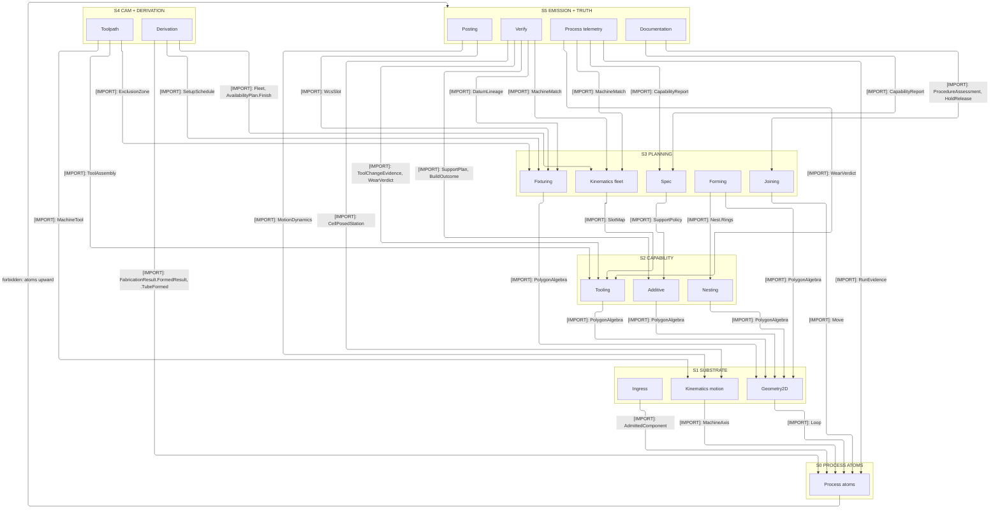
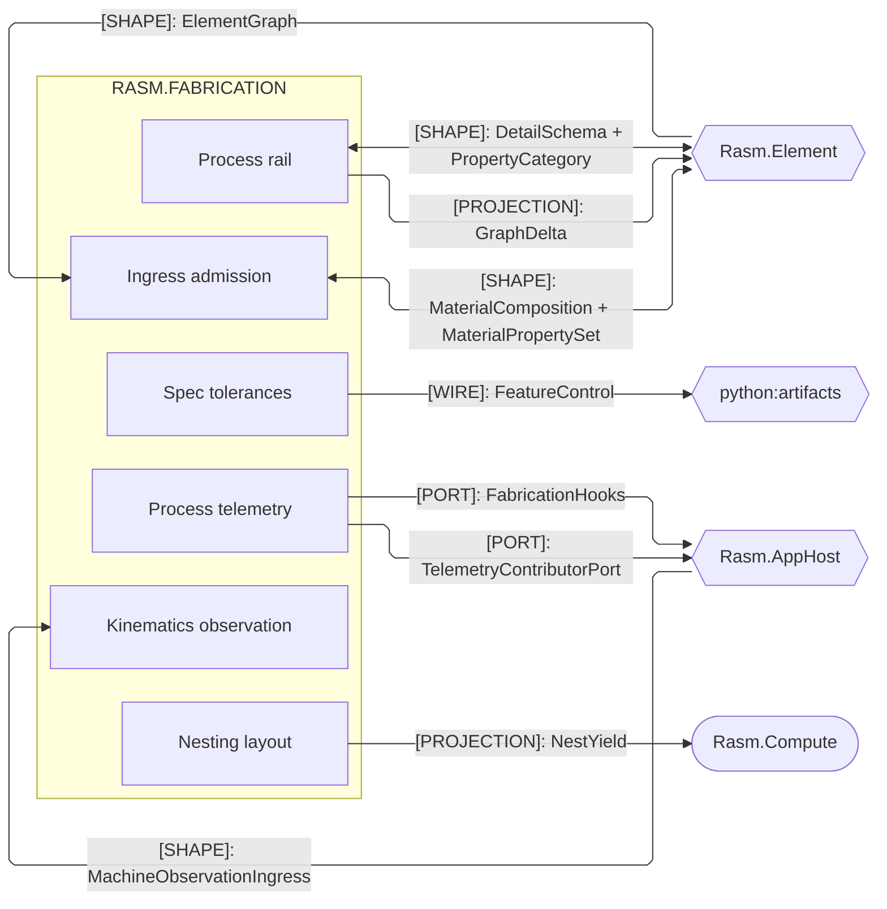
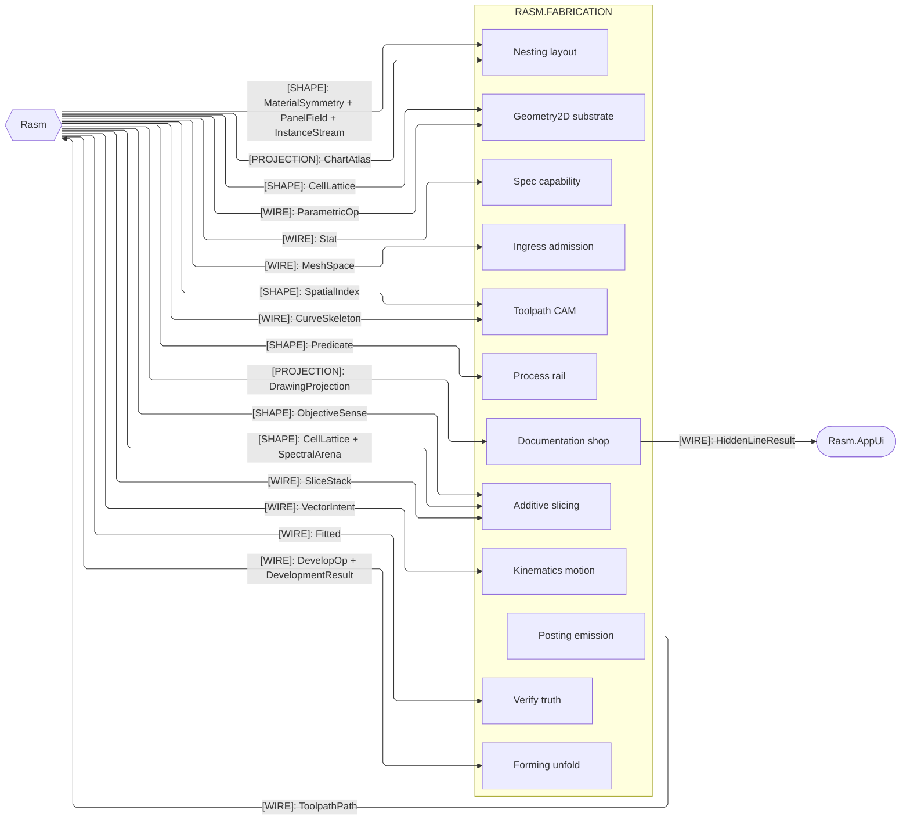
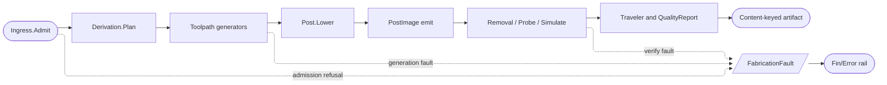

# [FABRICATION_ARCHITECTURE]


## [01]-[DOMAIN_MAP]

```text
Rasm.Fabrication/
├── Process/                 # Entry vocabulary, axes, physics, rail, and plan orchestrator
│   ├── Owner.cs             # Fabrication.Run admission-to-result seat; evidence projects lineage without replaying plane logic
│   ├── Atoms.cs             # Construction-admitted atom families reading nothing above themselves; payloads name planes, reach no behaviour
│   ├── Family.cs            # Machine.Admit keyed-capability generation, MachineCapacity.Facts correspondence, PostDialect binding
│   ├── Physics.cs           # Material identity carrying per-modality physics and the removal budget
│   ├── Faults.cs            # FabricationFault union over the FaultBand.Fabrication band
│   ├── Derivation.cs        # Derivation.Plan Run(Derive) lowering; DerivePolicy.Admit gates duplicates and preference conflicts
│   └── Telemetry.cs         # Instrument roster, site-write operators, span band, hook rail, board-pack descriptor rows
├── Tooling/                 # ISO-13399 tool intelligence, machinability, and wear
│   ├── Magazine.cs          # Provider-detached ToolAssembly owner, correspondence tables, typed-shortfall kitting, and ordered life scheduling
│   ├── CuttingData.cs       # Kienzle regime resolution: material seeds with operation factors, the evidence-domain guard, one force model
│   └── Wear.cs              # WearChannel criterion projections, condition-trajectory fits, conservative remaining-life decisions
├── Geometry2D/              # 2D substrate: line, arc, and parametric-curve lanes
│   ├── Algebra.cs           # Line-only planar admission; topology for regions, grouping for open runs, field rasters over the algebra
│   ├── Arcs.cs              # Admitted arc forests with exact set operations; cutter-center engagement, witnessed chord projection
│   └── Curves.cs            # CurveAlgebra.Apply manufacturing admission; kernel curves and Loop values keep owning semantics
├── Ingress/                 # Everything entering as geometry
│   ├── Profile.cs           # ProfileFormat dispatch, ProfilePolicy gated admission, OCS-correct healing, region containment
│   ├── Solid.cs             # SolidFormat provider reads, SolidPolicy tessellation posture, MeshSpace canonicalization, repair evidence
│   ├── Steel.cs             # SteelImport byte-preserving DSTV admission; positive-line faults under the SourceKind.Steel locus gate
│   └── Element.cs           # ElementImport one-bake admission; arity-selected singular or batch outputs, no ElementGraph reopen
├── Toolpath/                # Subtractive CAM
│   ├── Motion.cs            # Cam fold over EngagementPolicy's admitted sub-owners; the modality-strategy cross-product closes here
│   ├── Surface.cs           # OpenCAMLib cutter positioning over kernel on-mesh path layout
│   ├── Partition.cs         # Site-field decomposition: boundary-clipped diagram, cell topology, spanning traversal, the complex gate
│   ├── Guard.cs             # Fail-closed motion admission from one aggregate request; GuardVerdict retains every hazard and severity
│   ├── Skeleton.cs          # SkeletonDemand walk: kernel SkeletonGraph clearance radii under WalkStrategy motion grammars
│   ├── Turning.cs           # TurnRequest generation; TurnStep spindle-side binding, TurnProgram channel barriers and sync preservation
│   ├── Wire.cs              # WireEdm.Generate demand admission; context-keyed pass law, guide registration, simultaneous WireBlock rows
│   ├── Link.cs              # Link.Route tour selection under precedence; keepout volumes, weighted objective, refined closed tour
│   └── Bevel.cs             # Bevel.Condition station-varying preparation; head compensation calibration, guarded tool-axis blocks
├── Kinematics/              # Motion topology, the decoded observation slice, and the fleet registry
│   ├── Cell.cs              # RobotCell serial-chain planning; CellTargetPlan waypoint generation, library and controller boundaries
│   ├── Machine.cs           # MachineTool.Solve continuity-preserving fold; MachineChain parameterized inverse, dynamics policy
│   ├── Fleet.cs             # FleetDemand capability join to ranked MachineMatch evidence; the finite-capacity station seat
│   └── Observation.cs       # MachineObservation decoded-telemetry union, execution and condition vocabularies, and the machine-scoped window
├── Additive/                # Production 3DP
│   ├── Slicing.cs           # Kernel SliceStack consumption; parameterized modality seeds derive planar deposition and bead paths
│   ├── Implicit.cs          # Operation-scoped PicoGK runtime binding; periodic fields, lattices, voxel wires, VDB sources admit once
│   ├── Production.cs        # BuildJob genealogy carrier, OrientedPart fixed frames, plate placement, Lib3MF handle custody
│   ├── ScanPath.cs          # Scan.Plan layer-to-event planning; ScanPolicy zone classification, partition algebra, source election
│   └── Support.cs           # Support.Grow demand-to-plan fold; branching topology, conduction evidence, canonical plan identity
├── Nesting/                 # Placement, yield, offcut lifecycle, and cut linking
│   ├── Nfp.cs               # NestPolicy search-case compilation; NoFitPolygon configuration-space topology, arc-space collision
│   ├── Stock.cs             # NestRun instance expansion, eligibility proofs, the complete provider-family fold, conservation proof
│   ├── Remnant.cs           # Remnant arc-preserving offcut identity; Stocking, Claim, Close, and Sweep cases over stock lineage
│   └── Linking.cs           # Placement transforms preserved whole; shared-cut conversion with explicit source-contour omissions
├── Fixturing/               # Keep-out, setup, and assembly planning
│   ├── Workholding.cs       # Aggregate fixture admission proving locating scheme, contact laws, actuation order; conditioning fold
│   ├── Setups.cs            # QuikGraph precedence scheduler owning setup-to-WCS assignment
│   └── Assembly.cs          # AssemblyPlan member and join admission; fit-up, load-path stability, disassembly evidence
├── Posting/                 # Machine-code emission
│   ├── Program.cs           # GNode/GWord AST with NodeKey structural identity; the lower, parse, publish, interpret boundaries
│   ├── Conditioning.cs      # PostPolicy containing CutConditioning as its cut column; the PostArrow axis-to-quantity pairing
│   ├── Dialect.cs           # Per-dialect emit over the PostDialect grammar family
│   └── Optimization.cs      # Feedrate, corner smoothing, and block-cap compaction over the AST
├── Verify/                  # Program-level truth
│   ├── Removal.cs           # VerifyPolicy stock materialization through the shared voxel runtime; setup-framed sweep folds
│   ├── Probing.cs           # Probe.Inspect post-cycle metrology; InspectPolicy target generation, stylus compensation, registration
│   ├── Simulate.cs          # Simulate.Execute over the admitted MotionSource; the authoritative SimulationLedger clock
│   ├── Estimation.cs        # EstimateEvidence closed union, the Locus correlation key, and CostEstimate
│   └── Audit.cs             # Audit.Preflight rasterized build-frame labeling; void escape and risk evidence before commit
├── Spec/                    # Production specs
│   ├── Tolerance.cs         # Quantity-admitted specification values; typed derivation and the parameterized wire projection
│   ├── Capability.cs        # Capability intervals, variables SPC, fitted dependence, correlated stackup, and history gates
│   └── Manufacturability.cs # Rule-evaluated producibility evidence; remediation, requirement ranking, one settled verdict fold
├── Documentation/           # Shop documentation
│   ├── Projection.cs        # Kernel multi-view projection — hidden-line, silhouette, outline, and section runs over a watertight source
│   ├── Traveler.cs          # DAG-normalized content-keyed traveler over TravelerCorpus
│   ├── Report.cs            # Sampled inspection, EN 10204, NDT, NCR lifecycle, calibration recall, and shop schedules
│   └── Passport.cs          # QualityReport.Seal quorum gate; credentialed signers proven against published attestation demands
├── Forming/                 # Sheet-stock, tube, and roll forming
│   ├── Sheet.cs             # FlatPattern neutral-axis development; FormPolicy admission, bend topology, relief census
│   ├── Brake.cs             # BendSequence owns the finite search; BrakePolicy admits catalog, limits, and budget once; BendStep the instruction
│   └── Tube.cs              # TubeSection, RollSection, TubeTool, and TubePolicy admissions over one TubeProgram algebra
└── Joining/                 # Weld engineering
    ├── Deposition.cs        # WeldRuleSet code bands, WeldFactorTable seats, the measured arc-fit gate feeding WeldPolicy
    ├── Weld.cs              # Weld.Plan fill-complete deposits; side-correct torch frames, station-indexed segments, keyed plan
    ├── Sequence.cs          # Distortion ordering and the inherent-strain displacement field its consumers share
    └── Procedure.cs         # Procedure.Assess code-profiled evaluation; essential variables as profile data, validity intervals
```

Sub-domain dependencies are acyclic, and motion never reads fleet policy. Shared discriminants mint on atoms; residual and verdict state flow forward as policy-case input. Atoms carrying a plane's payload name that plane's type and reach none of its behaviour, so the floor stays behaviourally acyclic without a parallel S0 vocabulary. Per-flagship pipelines live on owning implementation pages.

## [02]-[STRATA]

Strata order the sub-domains; split-package ledger nodes preserve one direction: `Process` places atoms at the floor and `Derivation` beside the CAM plane, while `Kinematics` places motion at S1 and its consuming fleet at S3; every cross-stratum consumption edge points down.

- S0 `Process/atoms` — the one vocabulary floor; every plane reads it, and it reads no sibling.
- S0 run dispatch — `Process/owner` admits each policy and returns its canonical domain result from atoms alone.
- S0 payload atoms — plane payloads admit at construction behind their factories, so `Move`, directives, and envelopes carry no plane behaviour.
- S0 equipment axes — decoded equipment facts seat beside the canon and quantity arrows, so no plane re-decodes a machine.
- S1 `Geometry2D` — substrate lanes over the atoms alone, so the 2D algebra reads no consumer and every plane composes one geometry truth.
- S1 `Ingress` — admission runs once: `Ingress.Admit` folds every entering geometry, and no plane re-admits what it receives.
- S1 `Kinematics` motion — only `Kinematics/cell` reads `Robots`, provider-free, so no downstream plan holds a robot library handle.
- S2 `Tooling` — capability owners over the 2D algebra; tooling reads geometry and atoms alone, and no planner fact flows back into it.
- S2 co-seat — `Nesting` and `Additive` share the rank with no edge between them; each composes the 2D substrate independently.
- S3 planning — `Fixturing`, `Forming`, `Joining`, `Spec`, and the kinematics fleet plan over capability evidence below them.
- S3 law — same-stratum policy exchange among the planners is value-borne and carries no dependency-order edge.
- S4 `Toolpath` — the CAM plane composes tools, kinematics, and keep-outs, and nothing below reads a toolpath fact.
- S4 `Process/Derivation` — the `Derivation`/`FabricationProjector` terminal aggregator over the downstream plans.
- S5 co-seat — `Verify` parses the AST `Posting` emits as a same-stratum FACT, so emission and truth share the rank without an order edge.
- S5 `Documentation` — the shop documents and the `QualityReport` release seal that signs them; documentation reads results, never planners.
- S5 `Process` telemetry — each producer projects its measured facts onto the `rasm.fabrication.*` instruments.
- S5→S3 — verification consumes planning EVIDENCE (`DatumLineage`, capability reports, machine matches) as values, never a planner owner.
- S5→S0 — instrument writes read canonical domain values from the atoms floor and never re-derive a plane's truth.



## [03]-[SEAMS]





- `[SHAPE]: MaterialSymmetry + PanelField + InstanceStream` — nesting reads move and pairing legality from their carried columns.

## [04]-[INTERNAL]

`Toolpath/guard` owns every PicoGK voxel lease, and `Kinematics/cell` owns every Rhino3dm robot adapter; downstream results carry evidence and no native handle.



[KINEMATICS]:
- `Kinematics/cell` publishes `CellTiming` — station-ordinal elapsed and the planner cycle — as the one timing crossing.
- `Joining/sequence` keys that census onto its own `MotionKey` through `MotionTiming.Of`; neither end learns the other's key space.
- `Verify/simulate` proves its posed ledger against `CellAnimation.Cycle`, so both consumers read the planner's own clock.

[POSTING]:
- `Posting/program` sends `CutProgram` and `EmitPolicy` to `Posting/dialect`; `PostImage` owns rendered records, bytes, and the emitted `ContentKey`.
- `Posting/conditioning` owns `PostPolicy` and the `Post.Assemble` fold; `Posting/program` composes both at `Post.Lower` and declares neither.
- `Posting/conditioning` has ONE reader — `Posting/optimization` reaches `CutConditioning` through `OptimizePolicy.Post.Cut` alone.
- `Toolpath` preserves controller instructions and evidence through `MotionDirective`; `Posting/program` retains each directive in `GNode`.
- `Posting/dialect` owns every rendered spelling, executable and annotation alike, selected by the `PostDialect` grammar family.
- `Posting/program` projects analytic `ProgramEvent.Motion` rows into the kernel `ToolpathPath`.
- Line and arc spans share one `PackOp.Toolpath` carrier; arc centre and sense stay digest-bearing channels.
- `Posting/program`, `Posting/conditioning`, `Process/physics`, and `Tooling/cuttingdata` feed `Posting/optimization`.
- `Tooling/magazine` admits provider feed and spindle envelopes into `ProcessRange`; `Posting/optimization` reads that carrier alone.
- `Posting/dialect` lowers `GNode.CoordinateFrame` through `WcsSlot` into offset write and selection words.
- `Posting/optimization` prices every span through `MotionDynamics` rapid, feed, acceleration, and junction law.

## [05]-[BOUNDARIES]

- `Analyze.Run` bindings freeze the kernel entry's two-type-parameter arity, query-first then subject; `Analyze.Query` and `Analyze.In` stay unbound.
- Every machine-consumable egress mints its content key through the kernel `ContentHash.Of` seed-zero entry, with no second mint.
- `EgressKind`, the local discriminant, federates to the Persistence `ArtifactKind` rows at the content-key boundary, never a type reference.
- `FabricationProjector.Of` hands the app the package-owned `IElementProjection`; every seam-lowered quantity rides its internal implementation.
- Absent peer capability binds as an injected delegate column, so the contract remains whole without an implementation-shape dependency.
- Machine telemetry enters through the AppHost decode lane, never a direct transport reference.
- `Kinematics/observation` admits the decoded entities once; every measured consumer folds the one `MachineObservation` slice.
- Durable shop state rides the Persistence slot registry's contributed span as the `store.fabrication.<domain>.<verb>` family.
- Each owning page names its slot spellings as value federation, mounted as call-site data at the composition root.
- Runtime-carried `HybridCache` replays NFP pair polygons under `PairTable.Key` identities in process.
- Durable memo tier federates at the Persistence cache seam beside the benchmark index.
- Speed claims resolve against Persistence `BenchmarkRow` claims through the kernel `BenchClaim` keys `Toolpath/guard` mints.
- `AcceptedBenchmarkClaim` binds one result to the `Benchmark.ClaimKey` digest its pass stamped, judgment arriving as a seam AppHost mints.
- `ProbeRoute.Measured` authorizes its parallel substrate only against an accepted claim, never against a roster row alone.
- Program delivery closes chain-of-custody by value: `ProgramDelivery`'s cell drive result re-mints a content key from the controller-bound records.
- `Posting/dialect` `ProgramDelivery` proves transfer integrity by digest equality and writes its custody verdict through the mounted instrument set.
- Producing folds write mounted instruments directly from their settled typed results.
- Money and carbon stay parallel dimensions on parallel instruments, and `ClockAttribution` names the clock's own source rather than a default.
- `TelemetryContributorPort` carries the `rasm.fabrication.*` instrument roster and board pack inward at composition; the mounting root proves both.
- `FabricationInstruments.Telemetry` supplies the package's instrument bindings to AppHost.
- Classification federates by value to the suite `DataClassification` taxonomy — never a type reference in either direction.
- Fabrication hook points register on the AppHost hook registry at composition through the runtime-carried kernel rail's own `Points` census.
- One `HookRail<FabricationPoint, FabricationHookFact, TelemetrySource>` carries every spine point; the folder declares roster and fact union alone.
- Hook modality and payload close at declaration; subscribers attach only at app roots.
- Solver spans ride `FabricationTrace.Scopes` — one `TraceScope` per `FabricationEngine` row — admitted into the composing root's kernel `SpanBand`.
- Meter scope stays `TelemetrySource.Fabrication`, and neither the meter grammar nor the `SpanBand` trace grammar derives from the other.
- Every observed lane takes optional mounted instruments and spans as trailing parameters.
- Trace-based exemplars join the fabrication histograms to their solve traces.
- `FabricationDescriptors` binds one kernel `BoardPack` the contributor port carries to the AppHost alert rail and deploy-plane dashboard compile.
- Indicator, severity, panel, and burn vocabularies stay the kernel signal capsule's and cross as values, never re-decided here.
- `FabricationFault` is one `[Union]` on the kernel `FaultBand.Fabrication` band; `Process/faults` owns the offset ledger and its free frontier.
- Every case DECLARES at `Process/faults` — a same-named partial in a folder namespace is a distinct type the generated dispatch never reaches.
