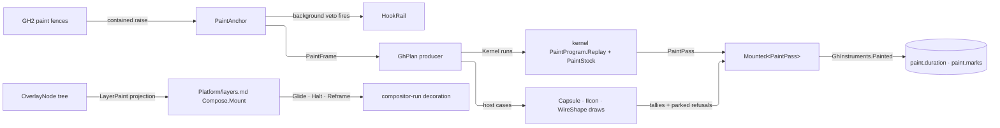

# [RASM_GRASSHOPPER_CANVAS_PAINT]

Grasshopper painting composes the kernel paint estate inside the host's own paint fences: `Rasm/Interaction/paint.md` owns the mark vocabulary, stock, tally, probe, and colour crossing; this page owns what only the host can — the eight GH2 paint-event fences, the event-scoped scene capability, the four Grasshopper2-drawn mark cases no kernel case expresses, and the CoreAnimation overlay projection. Planner receives snapshot data and returns a `GhPlan`; the executor batches kernel runs through `PaintProgram.Replay`, draws host cases through GH2's own renderers, and settles one gauged `PaintPass`.

Former local vocabulary — `PathSpec`, `FillSource`, `TransformSpec`, `StrokeSpec`, `TypeFace`, `BlockSpec`, `Mark`, `PaintLifetime`, `PaintStock`, `PaintPlan`, `Pigment`, `ChromeRole` — is DELETED onto the kernel owners; GH's case sets were the richer half on `PathSpec`, `FillSource`, and the stock, and the kernel took them, so the deletion loses nothing and gains Rhino's `TypeRole` roster, the `Dash` value family, `GlyphBlock` retained shaping, and the identity-keyed redundant-swap skip.

## [01]-[INDEX]

- [02]-[PHASES]: `Mounted<TFacts>` + `PaintFrame` + `PaintScene` + `PaintPhase` + `PaintAnchor` — the shared mount capsule, snapshot planning, the event capability, and the eight contained host fences.
- [03]-[PLAN]: `GhMark` + `GhPlan` + `GhPaint` — the host mark band over the kernel vocabulary and the one execution fold.
- [04]-[OVERLAY]: `OverlayNode` + `CanvasOverlay` — compositor-resident decoration over `Platform/layers.md`, mounted once and animated with zero paint passes.

## [02]-[PHASES]

- Owner: `Mounted<TFacts>` — the Canvas sub-domain's ONE release capsule: the latest facts cell, the composition's bounded `FaultCell`, and a release that PARKS its refusal and stays redrivable — the latch seats only on a settled release, so a failed teardown is retryable by policy rather than by a hand `0/1/2` integer ladder. `Canvas/interaction.md`'s mounts and `Canvas/wires.md`'s route custody compose this capsule; the three byte-twin capsules the fan carried are this one type.
- Owner: `PaintPhase` `[SmartEnum<int>]` — the ordered before/after rows for background, groups, wires, and objects, each carrying its exact installed host delegate family as row data (the two background rows mirror `event CanvasBackgroundPaintEventArgs` with the `OverrideDefaultPainting` suppression action; the six layer rows mirror `event CanvasPaintEventArgs`), so a wrong wire is a compile failure and the attach returns its exact inverse.
- Owner: `PaintFrame` readonly record struct — declarative snapshot data: the interpolated `Skin`, admitted content-frame `Visible` bounds, the raising graphics' `PointsPerPixel`, and the `AppearanceRow` the skin identity resolves (`Platform/native.md`'s two-row vocabulary — a bare bool cannot grow the host's high-contrast appearance). `PaintScene` sealed `IDisposable` — the raw event capability over the raising canvas; every live read is a `Fin` refusing `UiFault.Released` on a closed scene, and disposal clears every reference and action — the two `ObjectDisposedException` throws are unspellable on this shape.
- Entry: `PaintAnchor.Mount(PaintPhase phase, Func<PaintFrame, GhPlan> plan, MonotonicTimeline clock, FaultCell faults, Op? key = null)` → `Fin<Lease<Mounted<PaintPass>>>`; `PaintAnchor.MountRaw(PaintPhase phase, Func<PaintScene, Fin<Unit>> painter, FaultCell faults, Op? key = null)` — the raw window takes no clock and settles no pass, so raw draws are budget-invisible by declaration and a painter needing the `paint.pass` judgment mounts the planned form. Clock is the session's injected timeline (folder RULINGS `[02]`).
- Law: the hook-rail raise is this page's — the two BACKGROUND fences fire `rail.Fire(at: GrasshopperPoint.PaintBackground, fact: new HookSignal.IntentCase(Operation: key, DocumentId: None), key: key)` inside the contained callback before the plan executes (`PaintAnchor.Herald`), and a `Fail` verdict suppresses the host default through the scene's `SuppressDefault`; the rail arrives as a required mount parameter. Layer fences raise NOTHING — post-facto paint cadence is the kernel drain's `CanvasSignal.Draw` row or the plugin's own mount, never rail governance (`Shell/hooks.md` named loss).
- Law: device-pixel ratio is frame data read once per raise off the raising graphics; the kernel replay reads density off its target and takes none, so only the off-graphics probes carry the frame's measured value.
- Law: the appearance flag selects the skin, never a palette — `Canvas.SkinLit`/`SkinDim` are the host's two palettes, chosen by the per-view effective-appearance read `Platform/native.md`'s workspace lease republishes; no painter caches a swatch across a flip, and an OS chrome swatch is the kernel `ChromeRole.Sample` read.
- Law: attachment and release are UI-affine — a subscription established before mount construction completes rolls back through the same inverse, its refusal AGGREGATING with the construction fault through `Error.Many` (the ruled disposal posture); release owns only the exact inverse and, on a detachment failure, emits `PaintLog.HookReleaseFault` then parks the typed fault on the capsule's cell — the emit-then-park form every log partial's parks take.
- Law: a raw painter uses the scene only inside the callback; a planner never receives the scene — it receives `PaintFrame`, returns values, and execution stays inside the raise.
- Boundary: WHEN a repaint happens is `Shell/session.md`'s `RepaintRow` and the flex redraw on `Canvas/canvas.md`; WHAT a tooltip shows is `Shell/chrome.md`'s; this page owns the pixels inside the host paint fences.
- Packages: Grasshopper2 (the eight paint events, `CanvasPaintEventArgs`, `CanvasBackgroundPaintEventArgs.OverrideDefaultPainting`, `ControlGraphics`, `Skin`), LanguageExt.Core, `Rasm.Domain` (`Op`, `Lease<T>`, `FaultCell`, `Cell`, `HookRail`), `Rasm.Interaction` (`UiFault`, `UiThread`, `UiDispatch<T>`), `Shell/session.md` (`GhSession`, `ScopeTarget`), `Shell/hooks.md` (`GrasshopperPoint`, `HookSignal`).
- Growth: a host layer addition is one `PaintPhase` row; a new mount payload is one `TFacts` instantiation — attachment, containment, and release stay one gate.

```csharp
// --- [RUNTIME_PRELUDE] -----------------------------------------------------------------
using Microsoft.Extensions.Logging;
using Rasm.Domain;
using Rasm.Grasshopper.Shell;
using Rasm.Interaction;
using Rasm.Parametric;
using HostCanvas = Grasshopper2.UI.Canvas.Canvas;

namespace Rasm.Grasshopper.Canvas;

// --- [TYPES] ---------------------------------------------------------------------------
[SmartEnum<int>]
public sealed partial class PaintPhase {
    public static readonly PaintPhase BeforeBackground = BackgroundFence(key: 0, attach: static (s, h) => s.BeforePaintBackground += h, detach: static (s, h) => s.BeforePaintBackground -= h);
    public static readonly PaintPhase AfterBackground = BackgroundFence(key: 1, attach: static (s, h) => s.AfterPaintBackground += h, detach: static (s, h) => s.AfterPaintBackground -= h);
    public static readonly PaintPhase BeforeGroups = Fence(key: 2, attach: static (s, h) => s.BeforePaintGroups += h, detach: static (s, h) => s.BeforePaintGroups -= h);
    public static readonly PaintPhase AfterGroups = Fence(key: 3, attach: static (s, h) => s.AfterPaintGroups += h, detach: static (s, h) => s.AfterPaintGroups -= h);
    public static readonly PaintPhase BeforeWires = Fence(key: 4, attach: static (s, h) => s.BeforePaintWires += h, detach: static (s, h) => s.BeforePaintWires -= h);
    public static readonly PaintPhase AfterWires = Fence(key: 5, attach: static (s, h) => s.AfterPaintWires += h, detach: static (s, h) => s.AfterPaintWires -= h);
    public static readonly PaintPhase BeforeObjects = Fence(key: 6, attach: static (s, h) => s.BeforePaintObjects += h, detach: static (s, h) => s.BeforePaintObjects -= h);
    public static readonly PaintPhase AfterObjects = Fence(key: 7, attach: static (s, h) => s.AfterPaintObjects += h, detach: static (s, h) => s.AfterPaintObjects -= h);

    [UseDelegateFromConstructor]
    internal partial Action Hook(HostCanvas surface, Func<PaintScene, Fin<Unit>> body, Op operation, FaultCell faults);

    private static PaintPhase BackgroundFence(
        int key,
        Action<HostCanvas, EventHandler<CanvasBackgroundPaintEventArgs>> attach,
        Action<HostCanvas, EventHandler<CanvasBackgroundPaintEventArgs>> detach);
    private static PaintPhase Fence(
        int key,
        Action<HostCanvas, EventHandler<CanvasPaintEventArgs>> attach,
        Action<HostCanvas, EventHandler<CanvasPaintEventArgs>> detach);
}

// --- [MODELS] --------------------------------------------------------------------------
[BoundaryAdapter, StructLayout(LayoutKind.Auto)]
public readonly record struct PaintFrame(Skin Skin, RectangleF Visible, float PointsPerPixel, AppearanceRow Appearance) : IValidityEvidence {
    public bool IsValid => ValidityClaim.All(
        Skin is not null,
        ValidityClaim.Finite(value: PointsPerPixel) && PointsPerPixel > 0f,
        ValidityClaim.Finite(value: Visible.X) && ValidityClaim.Finite(value: Visible.Y),
        Visible.Width >= 0f && Visible.Height >= 0f);
}

public sealed class PaintScene : IDisposable {
    private readonly Atom<bool> live = Atom(true);

    public PaintFrame Frame { get; }

    [BoundaryAdapter] public Fin<HostCanvas> Surface(Op? key = null);
    [BoundaryAdapter] public Fin<ControlGraphics> Graphics(Op? key = null);

    public Fin<Unit> SuppressDefault(Op? key = null);

    public void Dispose();

    private Fin<T> Read<T>(T? held, Op op) where T : class =>
        live.Value && held is not null ? Fin.Succ(held) : Fin.Fail<T>(new UiFault.Released(Key: op));
}

// --- [SERVICES] ------------------------------------------------------------------------
public sealed class Mounted<TFacts> : IDisposable {
    private readonly Atom<Option<TFacts>> facts = Atom(Option<TFacts>.None);
    private readonly Atom<bool> released = Atom(false);
    private readonly FaultCell faults;
    private readonly Func<Fin<Unit>> release;
    private readonly Op operation;

    internal Mounted(Func<Fin<Unit>> release, FaultCell faults, Op operation);

    public Option<TFacts> Latest => facts.Value;
    public bool IsReleased => released.Value;

    internal Transition<Option<TFacts>> Record(TFacts value) => Cell.Commit(facts, _ => Some(value));

    public Fin<Unit> Release(Op? key = null);
    public void Dispose() => _ = Release();
}

internal static partial class PaintLog {
    internal const int CallbackFault = 4701;
    internal const int ReleaseFault = 4703;
    static PaintLog() => Op.SideWhen(
        condition: CallbackFault != FaultBand.GrasshopperLog.Code(offset: 1) || ReleaseFault != FaultBand.GrasshopperLog.Code(offset: 3),
        action: static () => throw new InvalidOperationException("PaintLog ids drifted from FaultBand.GrasshopperLog."));

    [LoggerMessage(EventId = CallbackFault, Level = LogLevel.Error, Message = "Paint callback faulted: {Detail}")]
    internal static partial void PaintFault(ILogger logger, [UserContent] string detail);

    [LoggerMessage(EventId = ReleaseFault, Level = LogLevel.Error, Message = "Paint hook release faulted: {Detail}")]
    internal static partial void HookReleaseFault(ILogger logger, [UserContent] string detail);
}

// --- [OPERATIONS] ----------------------------------------------------------------------
[BoundaryAdapter]
public static class PaintAnchor {
    public static Fin<Lease<Mounted<PaintPass>>> Mount(
        PaintPhase phase,
        Func<PaintFrame, GhPlan> plan,
        MonotonicTimeline clock,
        HookRail<GrasshopperPoint, HookSignal, HookScope> rail,
        FaultCell faults,
        Op? key = null);

    private static Fin<HookSignal> Herald(
        HookRail<GrasshopperPoint, HookSignal, HookScope> rail, Op key) =>
        rail.Fire(at: GrasshopperPoint.PaintBackground, fact: new HookSignal.IntentCase(Operation: key, DocumentId: None), key: key);

    public static Fin<Lease<Mounted<PaintPass>>> MountRaw(
        PaintPhase phase, Func<PaintScene, Fin<Unit>> painter, FaultCell faults, Op? key = null);
}
```

## [03]-[PLAN]

- Owner: `GhMark` `[Union]` — the host mark band: `Kernel(Mark)` carries the kernel vocabulary (every stroke, fill, text, glyph, image, clip, and pose case), and the host cases only GH2 can draw carry the host renderer's own payloads — `IconCase` an `IIcon` rasterized through the host, `CapsuleCase` a `Capsule` with its `Shade` and optional `Parts` drawn by the host skin, `WireGhostCase` a `WireShape` preview stroked by the host route renderer, `WireCase` the wire pass row drawn per edge under the pass-scoped pen stock. `GhPlan` — the ordered run. `GhPaint` — the one execution fold.
- Law: the kernel leg BATCHES — maximal `Kernel` runs fold into one `PaintProgram` replayed once through the kernel executor, so culling, the leased spec-to-resource stock, redundant-identity skips, and the accountability tally all arrive from the kernel and no local walk re-rolls them. Host leg draws per case with its own conservative cull (`Capsule.Bounds`, the icon frame, `WireShape.Bounds` inflated by the stroke) and every raise contained by `Op.Catch`.
- Law: `[GenerateUnionOps]` rides the band — the folder's own rung-3 proof — and the total generated `Switch` is the executor's dispatch, so a fifth host case breaks it loudly.
- Law: the ghost pen is the ONE host-side pen mint, from the kernel `StrokeSpec`'s admitted columns through `PaintColor.ToEto` — a ghost draws once per drag frame for one wire, never per wire per layer, so it earns no stock seat; the wire PASS itself is `Canvas/wires.md`'s `Seq<Mark>` producer over the kernel program, where the stock does serve every wire.
- Law: the settled pass is `PaintPass(Tally, Settled, Refused)`: `Tally` is ONE kernel `PaintTally` (kernel segments + settled host tallies, span gauged whole by the injected timeline) whose `Drawn + Culled == Marks` fold counts only marks that SETTLED, `Settled` is the timeline stamp captured after `Graphics.Flush` so latency covers raster completion and `Platform/capture.md`'s proof orders frames against it, and `Refused` is the typed host-case refusal lane riding BESIDE the kernel fold — a refused mark is never misfiled as `Culled`, so the silently-skipped-mark guarantee survives the partial-success posture. `Execute` writes `GhInstruments.Painted` for the raising canvas's document once the pass settles, so `paint.duration` and `paint.marks` land at the one site that holds the tally.
- Law: partial success is the producer posture — a refused host case lands on `PaintPass.Refused` AND parks on the capsule's cell, and the pass continues (the per-row `(Accepted, Refused)` folder ruling); only a refused kernel segment fails the pass, because the kernel replay is one atomic run.
- Boundary: `AnimatedPath` glyph strokes are `Canvas/motion.md`'s draw family run inside a `MountRaw` window; snap-guide overlays are `Canvas/layout.md`'s `Seq<Mark>` producers transported through the planned window.
- Packages: Grasshopper2 (`Capsule`, `Parts`, `Shade`, `Skin`, `WireShape`, `IIcon`), `Rasm.Interaction` (`Mark`, `PaintProgram`, `PaintStock`, `PaintTally`, `ScenePolicy`, `StrokeSpec`, `PaintColor`), `Rasm.Numerics` (`PerceptualColor`), `Rasm.Parametric` (`MonotonicTimeline`, `MonotonicStamp`, `GaugedSpan`), `Shell/telemetry.md` (`GhInstruments`), LanguageExt.Core, `Rasm.Domain`.
- Growth: a new host-drawn species is one `GhMark` case with one draw arm and one cull arm; every kernel-expressible addition is the kernel's one case and costs this band nothing.

```csharp
// --- [RUNTIME_PRELUDE] -----------------------------------------------------------------
using Rasm.Domain;
using Rasm.Interaction;
using Rasm.Numerics;
using Rasm.Parametric;
using Thinktecture;

namespace Rasm.Grasshopper.Canvas;

// --- [TYPES] ---------------------------------------------------------------------------
[Union]
[GenerateUnionOps]
public abstract partial record GhMark {
    private GhMark() { }
    public sealed record Kernel(Mark Value) : GhMark;
    public sealed record IconCase(IIcon Icon, Rectangle Frame, int Pad, PerceptualColor Backdrop) : GhMark;
    public sealed record CapsuleCase(Capsule Body, Shade Shade, Option<Parts> Elements) : GhMark;
    public sealed record WireGhostCase(WireShape Route, StrokeSpec Stroke) : GhMark;
    public sealed record WireCase(WireShape Route, WirePens Ink) : GhMark;
}

// --- [MODELS] --------------------------------------------------------------------------
public sealed record GhPlan(Seq<GhMark> Marks);

[BoundaryAdapter, StructLayout(LayoutKind.Auto)]
public readonly record struct PaintPass(PaintTally Tally, MonotonicStamp Settled, Seq<Error> Refused) : IValidityEvidence {
    public bool IsValid => Tally.IsValid && Settled.IsValid;
}

// --- [OPERATIONS] ----------------------------------------------------------------------
[BoundaryAdapter]
public static class GhPaint {
    internal static Fin<Seq<Either<PaintProgram, GhMark>>> Runs(GhPlan plan, Op key);

    internal static Fin<PaintPass> Execute(
        PaintScene scene, GhPlan plan, MonotonicTimeline clock, FaultCell faults, Op key);

    public static Fin<Option<GhMark>> Probe(
        GhPlan plan, PointF at, PaintStock stock, PositiveMagnitude density, Op? key = null);
}
```

## [04]-[OVERLAY]

- Owner: `OverlayNode` `[Union]` — the canvas decoration vocabulary: `PanelCase` a framed fill-and-border panel, `StrokeCase` a kernel `PathSpec` with perceptual fill and stroke; both nest children and both carry their style bits as `CapabilitySet<LayerTrait>` (`Platform/layers.md`'s vocabulary — `Clip` and `Rounded` are the same two axes, so no overlay-local trait roster exists). `CanvasOverlay` — the mounted composer projecting the tree into `Platform/layers.md`'s `LayerNode` through `LayerPaint`, anchored on the live canvas, holding the `Lease<LayerMount>` with per-ordinal glide, halt, and re-frame reach.
- Entry: `CanvasOverlay.Mount(OverlayNode root, Op? key = null)` → `Fin<Lease<CanvasOverlay>>`; `Glide(int ordinal, GlidePlan plan, …)` / `Halt(int ordinal, GlideKey glide, …)` / `Reframe(int ordinal, RectangleF frame, …)` → `Fin<Unit>`. Composition root's canvas mount roster row reaches this owner.
- Law: compositor residence is live-proven — a mounted decoration survives the host's paint and a compositor-run glide advances its presentation layer with ZERO canvas paint events, so decoration motion costs no mark walk, enters no tally, and never touches the `paint.pass` budget.
- Law: the strata edge points DOWN — this S2 composer consumes S1 `Compose.Mount`/`LayerPaint`/`Glides`/`MacAnchor` and hands them canvas vocabulary (kernel `PathSpec`, `PerceptualColor`); a Platform-side canvas composer inverts the one forbidden direction.
- Law: the path hand-off is a two-lease bracket — the kernel `PathSpec.Build` mints an owned Eto path lease, `LayerPaint.Stroked` converts it into an owned `Lease<CGPath>`, and the composer releases the Eto lease the moment `Stroked` returns; the `FillMode` argument is inert on a stroke projection and passes `Winding` by declaration.
- Law: wide colour crosses as `PerceptualColor` values through the Display-P3 layer mint; no Eto `Color` and no host skin swatch enters the projection unadmitted.
- Boundary: overlay motion is `GlidePlan` — a spring rides its kernel `SpringShape` projection, a curve its `TimedCase`; sampled per-frame drives stay `Canvas/motion.md`'s and repaint-scheduled surfaces stay the mark band above, so the two motion systems never share a frame edge.
- Packages: `Platform/layers.md` (`Compose`, `LayerNode`, `LayerStyle`, `StrokePlan`, `LayerTrait`, `LayerMount`, `LayerPaint`, `GlidePlan`, `GlideKey`, `Glides`), `Platform/native.md` (`MacAnchor`, `AnchorSource`), `Shell/session.md` (`GhSession.Run`, `ScopeTarget.CanvasHost`), `Rasm.Interaction` (`PathSpec`), `Rasm.Numerics` (`PerceptualColor`), `Rasm.Domain`.
- Growth: a new decoration species is one `OverlayNode` case with its projection arm; a new motion modality is a `GlidePlan` case at its Platform owner.

```csharp
// --- [RUNTIME_PRELUDE] -----------------------------------------------------------------
using CoreAnimation;
using CoreGraphics;
using Rasm.Domain;
using Rasm.Grasshopper.Platform;
using Rasm.Grasshopper.Shell;
using Rasm.Interaction;
using Rasm.Numerics;

namespace Rasm.Grasshopper.Canvas;

// --- [TYPES] ---------------------------------------------------------------------------
[Union]
public abstract partial record OverlayNode {
    private OverlayNode() { }
    public sealed record PanelCase(
        RectangleF Frame, Option<PerceptualColor> Fill, Option<(PerceptualColor Colour, float Width)> Edge,
        float CornerRadius, CapabilitySet<LayerTrait> Traits, Seq<OverlayNode> Children) : OverlayNode;
    public sealed record StrokeCase(
        PathSpec Path, Option<PerceptualColor> Fill, Option<(PerceptualColor Colour, float Width)> Edge,
        CapabilitySet<LayerTrait> Traits, Seq<OverlayNode> Children) : OverlayNode;
}

// --- [SERVICES] ------------------------------------------------------------------------
[BoundaryAdapter]
public sealed class CanvasOverlay : IDisposable {
    private readonly Lease<LayerMount> mount;

    public static Fin<Lease<CanvasOverlay>> Mount(OverlayNode root, Op? key = null);

    public Fin<Unit> Glide(int ordinal, GlidePlan plan, Op? key = null);
    public Fin<Unit> Halt(int ordinal, GlideKey glide, Op? key = null);
    public Fin<Unit> Reframe(int ordinal, RectangleF frame, Op? key = null);

    public void Dispose() => mount.Dispose();

    private static Fin<LayerNode> Project(OverlayNode node, Op op);
}
```



## [05]-[DENSITY_BAR]

| [INDEX] | [CONCERN]        | [OWNER]                         | [RAIL]                                        | [CASES] |
| :-----: | :--------------- | :------------------------------ | :-------------------------------------------- | :-----: |
|  [01]   | event window     | `PaintPhase` + `PaintScene`     | eight contained host rows, railed scene reads |    8    |
|  [02]   | mount capsule    | `Mounted<TFacts>`               | facts cell + `FaultCell` + redrivable release |    1    |
|  [03]   | host mark band   | `GhMark` + `GhPaint`            | kernel batching + four host draw arms         |    5    |
|  [04]   | retained overlay | `OverlayNode` + `CanvasOverlay` | layers projection, ordinal-addressed motion   |    2    |

Mark vocabulary, specs, stock, lifetime brackets, tally, probe, colour crossing, and OS palette roster are the kernel paint estate's (`Mark`, `PathSpec`, `FillSource`, `PosePlan`, `StrokeSpec`, `Dash`, `TypeFace`, `GlyphBlock`, `PaintProgram`, `PaintStock`, `PaintTally`, `Tween`, `PaintColor`, `ChromeRole`); the ten hand rollback ladders, three CAS triples, `PaintLifetime`, `PaintHook`, and the six `Finite`/`Admitted` duplicates deleted onto it.

## [06]-[RESEARCH]

<!-- source-only: research row template:
[TOKEN]-[OPEN|BLOCKED]: <exact question>; <verification route>.
-->

(none)
