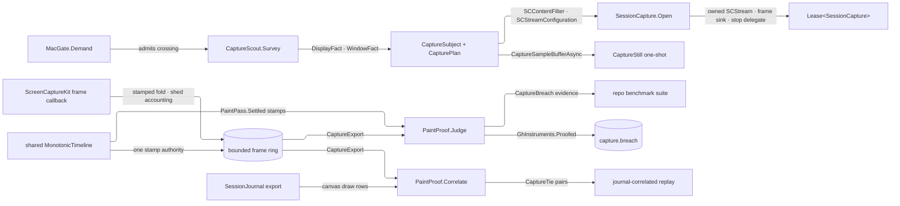

# [RASM_GRASSHOPPER_PLATFORM_CAPTURE]

`SessionCapture` is the leased native canvas-recording owner — one ScreenCaptureKit crossing minting display or window capture sessions over the RhinoWIP-bundled `Microsoft.macOS.dll` bindings, folding every delivered frame into a capacity-bounded ring of monotone-stamped evidence, and exporting a detached record for visual paint regression and journal-correlated replay. `MacGate.Demand` admits the crossing, `Lease<T>` carries the session with its exact native inverse chain, and every deferred capture callback records faults instead of throwing through the AppKit pump.

Pixel truth closes the paint loop: a capture session and the paint hooks it audits share one injected `MonotonicTimeline`, so `CaptureFrame.Stamp` and `PaintPass.Settled` order on one authority. `PaintProof.Judge` turns a drawn-claiming pass with no bearing frame into typed breach evidence, and `PaintProof.Correlate` ties exported frames to `Shell/journal.md` draw rows so a support bundle carries the visual track beside the fact record.

## [01]-[INDEX]

- [02]-[SURVEY]: `DisplayFact` + `WindowFact` + `CaptureInventory` + `CaptureScout` — shareable-content enumeration as detached typed facts.
- [03]-[PLAN]: `CaptureSubject` + `CapturePace` + `CaptureRetention` + `CapturePlan` — target selection, cadence admission, and retention policy as one value.
- [04]-[SESSION]: `CaptureFrame` + `CaptureStill` + `CaptureExport` + `SessionCapture` — the leased stream, the frame fold, the one-shot still, and the export projection.
- [05]-[PROOF]: `CaptureBreach` + `CaptureTie` + `PaintProof` — the paint-regression judgment and the journal correlation projection.

## [02]-[SURVEY]

- Owner: `CaptureScout` — the shareable-content survey: `Survey()` → `Task<Fin<CaptureInventory>>` gates through `MacGate.Demand`, awaits `SCShareableContent.GetShareableContentAsync(excludeDesktopWindows: true, onScreenWindowsOnly: true)`, and projects detached `DisplayFact` and `WindowFact` rows through the GENERATED `CaptureMap` Mapperly mapper — three partial maps (display fact, window fact, `CGRect` frame) whose renames break mapping rows, never bodies — — display id, frame, pixel extent; window id, frame, title, owning application name, bundle identifier, process id, on-screen and active state — so a consumer selects the GH canvas window by typed evidence, never by holding a live `SCWindow`.
- Law: survey results are evidence values — `SCDisplay`, `SCWindow`, and `SCRunningApplication` never escape the survey; the id a fact carries re-resolves against fresh shareable content inside the open gate, so a stale fact can only produce a typed refusal, never a dangling native reference.
- Law: capture consent is host state — a process without screen-recording permission receives an empty or truncated inventory from the OS, so an expected-but-absent window is the consent diagnostic and the page never probes a permission API the binding does not carry.
- Packages: Microsoft.macOS (`SCShareableContent.GetShareableContentAsync`, `SCDisplay.DisplayId`/`Frame`/`Width`/`Height`, `SCWindow.WindowId`/`Frame`/`Title`/`OnScreen`/`Active`/`OwningApplication`, `SCRunningApplication.ApplicationName`/`BundleIdentifier`/`ProcessId`), LanguageExt.Core, `Rasm.Domain` .
- Growth: a new selection axis is one fact field read from the same survey; the gate never widens.

## [03]-[PLAN]

- Owner: `CaptureSubject` `[Union]` (renamed from the target noun — the union names WHAT is captured, and every entry reads as subject selection) — `DisplayCase(uint DisplayId)` selects full-display capture, `WindowCase(uint WindowId)` selects one window; the id is the survey fact's own coordinate, so subject minting composes `CaptureScout` output directly. `CapturePace` `[ValueObject<double>]` admits frames-per-second finite and positive, projecting `SCStreamConfiguration.MinimumFrameInterval` through `CMTime.FromSeconds(1.0 / pace, preferredTimeScale: 600)`.
- Owner: `CaptureRetention` `[SmartEnum<int>]` — `Evidence` keeps stamps, bearing, and geometry per frame at near-zero cost; `Raster` detaches the locked pixel rows into an owned byte array per frame. `CapturePlan` sealed record — pace, optional pixel extent, queue depth, cursor visibility, ring capacity, and retention as one policy value with `Default` at thirty frames per second, evidence-only retention, and a bounded ring.
- Law: retention is the cost dial, never a second session shape — a regression run flips one policy row to `Raster` for pixel comparison while a long journal-correlated recording stays `Evidence`; both ride the same session, ring, and export.
- Packages: Microsoft.macOS (`SCStreamConfiguration.Width`/`Height`/`MinimumFrameInterval`/`QueueDepth`/`ShowsCursor`, `CMTime.FromSeconds(double seconds, int preferredTimeScale)`), Thinktecture.Runtime.Extensions, LanguageExt.Core.
- Growth: a new stream knob is one `CapturePlan` field assigned at the one configuration mint; a new retention posture is one `CaptureRetention` row.

## [04]-[SESSION]

- Owner: `SessionCapture` is the leased recording session; `Open` admits the target, caller drain, fault cell and hook point, builds the ScreenCaptureKit stream, and starts it through a continuation-safe completion gate. One idempotent release task serves both disposal modalities.
- Owner: `RasterPane` is the ONE pixel-geometry-plus-raster carrier every capture shape composes; `CaptureFrame : IUiFact` — journal-grade `MonotonicStamp` and `Option<RasterPane>` where `Bearing` derives as pane presence, so a non-bearing frame carries no zero-filled geometry slots, and the SEQUENCE is the drain envelope's own ordinal, never a session counter. `CaptureStill` — the one-shot pane from `SCScreenshotManager.CaptureSampleBufferAsync`, always pixel-bearing by its own validity claim. `CaptureExport` `[Equatable]` — the drained, ordered frame envelopes with the drain's published and shed counts and the capture stamp, minted by the exporting consumer from its own `Reader` fold.
- Entry: `Open(CaptureSubject subject, CapturePlan plan, EvidenceDrain<CaptureFrame> drain, FaultCell faults, HookId faultPoint, MonotonicTimeline timeline)` → `Task<Fin<Lease<SessionCapture>>>`; `Snapshot` is the single-frame modality over the same gate, filter, and raster kernel.
- Law: the frame callback is contained — delivery projects the sample inside `Try.lift`, stamps from the injected timeline, and PUBLISHES into the drain (bound shedding is the drain's own counted loss); a projection fault parks on the session's `FaultCell` and emits once through `CaptureLog.FrameFault`; the callback never touches the UI thread, never re-enters the host, and never retains the `CMSampleBuffer` past the projection.
- Law: the raster kernel is the page's named statement boundary — `GetImageBuffer()` pattern-matched to `CVPixelBuffer`, `Lock(CVPixelBufferLock.ReadOnly)` checked against `CVReturn.Success`, one `Marshal.Copy` from `BaseAddress` over `BytesPerRow * Height`, and `Unlock` in `finally`; the detached bytes are the only pixels that outlive the callback.
- Law: release is one inverse chain on the session's own custody — close callback admission, await stop completion, drain every delivery admitted before closure, remove the stream output, complete the drain (idempotent), then attempt every native disposal in reverse-acquisition order, parking the aggregated refusal on the cell and emitting once through `CaptureLog.ReleaseFault`; synchronous `Dispose` starts that task without blocking, `DisposeAsync` awaits the same task, and a mid-`Open` refusal runs the same release before the primary fault returns.
- Law: a stream the OS stops lands as evidence — `DidStop` preserves its native exception and `UserDidStop` parks `Errors.Cancelled`; neither becomes a silent frame drought.
- Law: the async provider crossing is the kernel's — every awaited ScreenCaptureKit call funnels through `Try.lift`'s async arm, preserving exact exceptions; cancellation is classified only when that crossing supplies its execution token.
- Law: native enums cross as FIXED contract values here — `SCStreamOutputType.Screen`, `CVPixelFormatType.CV32BGRA`, and `SCContentFilterOption.Exclude` are single-valued page contracts (the copy kernel reads exactly one layout), so no row owner mints for them; a native enum a CONSUMER chooses from earns its row owner the moment a second admitted value exists, per the folder's host-enum idiom.
- Boundary: recording-to-disk (`SCRecordingOutput`, `SCRecordingOutputConfiguration`) and the system content-sharing picker are app-root modalities over this same surface; the session owns in-process frame evidence only, and serialization of an export is the app root's over the detached record.
- Packages: Microsoft.macOS (`SCStream` ctor/`AddStreamOutput`/`RemoveStreamOutput`/`StartCapture`/`StopCapture`, `ISCStreamOutput.DidOutputSampleBuffer`, `ISCStreamDelegate.DidStop`, `SCScreenshotManager.CaptureSampleBufferAsync`, `CMSampleBuffer.IsValid`/`GetImageBuffer`, `CVPixelBuffer.Width`/`Height`/`BytesPerRow`/`BaseAddress`/`Lock`/`Unlock`, `CVPixelBufferLock.ReadOnly`, `CVReturn.Success`), Microsoft.Extensions.Logging.Abstractions (`[LoggerMessage]`), LanguageExt.Core, `Rasm.Domain` (`Lease<T>`, `ValidityClaim`, `Custody`), `Rasm.Parametric` (`MonotonicTimeline`, `MonotonicStamp`), `Shell/telemetry.md` (`GhLog`).
- Growth: a new frame-evidence axis is one `CaptureFrame` field read in the one projection; a capture metric family is one `Shell/telemetry.md` roster row and write member, never a meter mint here.

## [05]-[PROOF]

- Owner: `PaintProof` — the regression and correlation projections over already-minted evidence. `Judge(UiEvent<CaptureFrame> frame, PaintPass pass, MonotonicTimeline timeline, CapturePace pace)` → `Fin<Option<CaptureBreach>>` — a pass claiming `Drawn > 0` whose `Settled` stamp precedes the frame within two pace periods expects a bearing frame; a non-bearing frame there is the breach, carrying the frame ordinal, the pass operation, the drawn claim, and the measured lag AGAINST its bound as one `GaugedSpan<CaptureLane>` — the kernel's own measured-span carrier (`Lane`, `Work`, `Elapsed`, `Bound`, with `Breached`/`Overrun` DERIVED), the same shape `Canvas/motion.md`'s `BudgetGate` answers, so no local lag/bound field pair survives and the recorded bound is the pace-derived window in force at judgment.
- Owner: `CaptureTie` — one journal-to-frame pairing: the journal row sequence, the frame sequence, and the draw-to-frame lag. `Correlate(CaptureExport capture, JournalExport journal, MonotonicTimeline timeline, CapturePace pace)` → `Fin<Seq<CaptureTie>>` pairs every journal row whose envelope carries `GhFact.CanvasCase` with `CanvasSignal.Draw` to the first exported frame at or after that envelope's `Stamp` inside the window.
- Law: one timeline is the correlation precondition — `Judge` and `Correlate` compare stamps through `timeline.Elapsed`, so the capture session, the paint mounts it audits, the host draw events the drain stamps, and the judgment share the injected timeline; correlation reads the kernel envelope's own `Stamp`, minted at publication inside the host event.
- Law: judgment reads, never samples — the proof owns no clock, no host reach, and no mutation; the span carries its producing bound beside its measurement, so the repo benchmark suite consumes capture regressions as typed claims without re-measuring and without re-deriving a threshold from capture policy it never sees.
- Law: breaches WIRE to telemetry — the judging site (the composition root's capture-proof row) writes each `Some(breach)` through `GhInstruments.Proofed` (roster row `capture.breach`, declared on `Shell/telemetry.md`), so a visual regression is a counted, attributed stream, never a return value only a test harness reads.
- Packages: LanguageExt.Core, `Rasm.Domain` (`ValidityClaim`), `Rasm.Parametric` (`MonotonicTimeline`), `Canvas/paint.md` (`PaintPass` — inert evidence), `Shell/events.md` (`GhFact`, `CanvasSignal`), `Shell/journal.md` (`JournalExport`), `Shell/telemetry.md` (`GhInstruments`).
- Growth: a new visual claim is one judgment arm over existing evidence; a new correlation family is one fact-pattern filter over the same export pair.

```csharp
// --- [IMPORTS] -------------------------------------------------------------------------
using System.Collections.Immutable;
using System.Runtime.InteropServices;
using CoreMedia;
using CoreVideo;
using Foundation;
using Microsoft.Extensions.Logging;
using Rasm.Domain;
using Rasm.Grasshopper.Canvas;
using Rasm.Grasshopper.Shell;
using Rasm.Interaction;
using Rasm.Parametric;
using Riok.Mapperly.Abstractions;
using ScreenCaptureKit;

namespace Rasm.Grasshopper.Platform;

// --- [TYPES] ---------------------------------------------------------------------------
[ValueObject<double>]
public readonly partial struct CapturePace {
    static partial void ValidateFactoryArguments(ref ValidationError? validationError, ref double value) =>
        validationError = double.IsFinite(value) && value > 0.0 ? null : new ValidationError(message: "CapturePace requires finite positive frames per second.");
}

[SmartEnum<int>]
public sealed partial class CaptureRetention {
    public static readonly CaptureRetention Evidence = new(key: 0);
    public static readonly CaptureRetention Raster = new(key: 1);
}

[Union]
public abstract partial record CaptureSubject {
    private CaptureSubject() { }
    public sealed record DisplayCase(uint DisplayId) : CaptureSubject;
    public sealed record WindowCase(uint WindowId) : CaptureSubject;
}

// --- [CONSTANTS] -----------------------------------------------------------------------
public sealed record CapturePlan(
    CapturePace Pace, Option<(int Width, int Height)> Extent, int Queue, bool Cursor, int Capacity, CaptureRetention Retention) {
    public static readonly CapturePlan Default = new(
        Pace: CapturePace.Create(value: 30.0), Extent: Option<(int, int)>.None,
        Queue: 5, Cursor: false, Capacity: 512, Retention: CaptureRetention.Evidence);
}

// --- [MODELS] --------------------------------------------------------------------------
[StructLayout(LayoutKind.Auto)]
public readonly record struct DisplayFact(uint DisplayId, RectangleF Frame, int Width, int Height) : IValidityEvidence {
    public bool IsValid => Width > 0 && Height > 0;
}

[StructLayout(LayoutKind.Auto)]
public readonly record struct WindowFact(
    uint WindowId, RectangleF Frame, Option<string> Title, Option<string> Application,
    Option<string> BundleIdentifier, Option<int> ProcessId, bool OnScreen, bool Active);

public sealed record CaptureInventory(Seq<DisplayFact> Displays, Seq<WindowFact> Windows);

public readonly record struct RasterPane(int Width, int Height, int RowBytes, Option<ImmutableArray<byte>> Raster) : IValidityEvidence {
    public bool IsValid => ValidityClaim.All(
        Width > 0 && Height > 0 && RowBytes > 0,
        ValidityClaim.WhenPresent(facet: Raster, claim: bytes => bytes.Length == (long)RowBytes * Height));
}

[StructLayout(LayoutKind.Auto)]
public readonly record struct CaptureFrame(MonotonicStamp Stamp, Option<RasterPane> Pane) : IUiFact, IValidityEvidence {
    public bool Bearing => Pane.IsSome;
    public bool IsValid => ValidityClaim.All(
        Stamp.IsValid,
        ValidityClaim.Evidence(evidence: Pane));
}

public sealed class CaptureSource : IUiSource<CaptureFrame> {
    public static readonly CaptureSource Row = new();
    public string Key => "platform.capture";
}

public sealed record CaptureStill(RasterPane Pane, MonotonicStamp Captured) : IValidityEvidence {
    public bool IsValid => Pane.IsValid && Pane.Raster.IsSome;
}

[Equatable]
public sealed partial record CaptureExport(
    [property: OrderedEquality] Seq<UiEvent<CaptureFrame>> Frames, long Published, long Shed, MonotonicStamp Captured);

[SmartEnum<int>]
public sealed partial class CaptureLane : IGaugeLane<CaptureLane> {
    public static readonly CaptureLane Frame = new(key: 0);
}

[StructLayout(LayoutKind.Auto)]
public readonly record struct CaptureBreach(long FrameSequence, int Drawn, GaugedSpan<CaptureLane> Span) : IValidityEvidence {
    public TimeSpan Overrun => Span.Elapsed - Span.Bound;

    public bool IsValid => ValidityClaim.All(
        FrameSequence >= 0L && Drawn > 0,
        Span.IsValid);
}

[StructLayout(LayoutKind.Auto)]
public readonly record struct CaptureTie(long Row, long Frame, TimeSpan Lag);

// --- [SERVICES] ------------------------------------------------------------------------
internal static partial class CaptureLog {
    static CaptureLog() => HostEdge.SideWhen(
        condition: FaultBand.GrasshopperLog.Code(offset: 6) != FaultBand.GrasshopperLogBase + 6,
        action: static () => throw new InvalidOperationException("CaptureLog ids drifted from FaultBand.GrasshopperLog."));

    [LoggerMessage(EventId = FaultBand.GrasshopperLogBase + 6, Level = LogLevel.Error, Message = "Capture stream stopped by host: {Detail}")]
    internal static partial void StreamFault(ILogger logger, [UserContent] string detail);

    [LoggerMessage(EventId = FaultBand.GrasshopperLogBase + 7, Level = LogLevel.Error, Message = "Capture frame projection faulted: {Detail}")]
    internal static partial void FrameFault(ILogger logger, [UserContent] string detail);

    [LoggerMessage(EventId = FaultBand.GrasshopperLogBase + 13, Level = LogLevel.Error, Message = "Capture session release faulted: {Detail}")]
    internal static partial void ReleaseFault(ILogger logger, [UserContent] string detail);
}

internal sealed class FrameSink(Action<CMSampleBuffer> deliver) : NSObject, ISCStreamOutput {
    [Export("stream:didOutputSampleBuffer:ofType:")]
    public void DidOutputSampleBuffer(SCStream stream, CMSampleBuffer sampleBuffer, SCStreamOutputType type) =>
        HostEdge.SideWhen(condition: type == SCStreamOutputType.Screen, action: () => deliver(obj: sampleBuffer));
}

internal sealed class StreamStop(Action<Error> record) : NSObject, ISCStreamDelegate {
    [Export("stream:didStopWithError:")]
    public void DidStop(SCStream stream, NSError error) => record(obj: SessionCapture.NativeFailure(error));

    [Export("userDidStopStream:")]
    public void UserDidStop(SCStream stream) => record(obj: Errors.Cancelled);
}

public sealed class SessionCapture : IDisposable, IAsyncDisposable {
    private readonly CapturePlan plan;
    private readonly MonotonicTimeline timeline;
    private readonly SCStream stream;
    private readonly SCContentFilter filter;
    private readonly SCStreamConfiguration configuration;
    private readonly FrameSink sink;
    private readonly StreamStop stop;
    private readonly EvidenceDrain<CaptureFrame> drain;
    private readonly FaultCell faults;
    private readonly HookId faultPoint;
    private readonly object releaseGate = new();
    private readonly TaskCompletionSource<Unit> deliveriesDrained = new(TaskCreationOptions.RunContinuationsAsynchronously);
    private Task<Fin<Unit>>? releaseTask;
    private readonly Atom<(bool Accepting, long Deliveries)> gate = Atom((true, 0L));

    private SessionCapture(
        CapturePlan plan, MonotonicTimeline timeline, EvidenceDrain<CaptureFrame> drain,
        FaultCell faults, HookId faultPoint,
        SCStream stream, SCContentFilter filter, SCStreamConfiguration configuration, FrameSink sink, StreamStop stop) {
        this.plan = plan;
        this.timeline = timeline;
        this.operation = operation;
        this.drain = drain;
        this.faults = faults;
        this.faultPoint = faultPoint;
        this.stream = stream;
        this.filter = filter;
        this.configuration = configuration;
        this.sink = sink;
        this.stop = stop;
    }

    private Unit Park(Error error, Action<ILogger, string> emit) {
        emit(GhLog.For(category: nameof(SessionCapture)), error.Message);
        return ignore(faults.Park(point: faultPoint, cause: error));
    }

    public static async Task<Fin<Lease<SessionCapture>>> Open(
        CaptureSubject subject, CapturePlan plan, EvidenceDrain<CaptureFrame> drain, FaultCell faults, HookId faultPoint,
        MonotonicTimeline timeline) {
        Fin<(SCContentFilter Filter, SCStreamConfiguration Config, MonotonicTimeline Clock)> staged =
            await Staged(subject: subject, plan: plan, timeline: timeline, requireQueue: true);
        return await staged.Match(
            Succ: async ready => {
                (SCContentFilter minted, SCStreamConfiguration streamConfig, MonotonicTimeline clock) = ready;
                CapturePlan bound = plan;
                SessionCapture? session = null;
                StreamStop stop = new(record: error => {
                    SessionCapture? live = session;
                    HostEdge.SideWhen(condition: live is not null, action: () =>
                        ignore(live!.Park(error: error, emit: static (logger, detail) => CaptureLog.StreamFault(logger: logger, detail: detail))));
                });
                FrameSink sink = new(deliver: buffer => session?.Deliver(buffer: buffer));
                SCStream? candidate = null;
                bool attached = false;
                Fin<SCStream> wired = Try.lift(() => {
                    candidate = new SCStream(contentFilter: minted, streamConfig: streamConfig, aDelegate: stop);
                    if (!candidate.AddStreamOutput(
                            output: sink, type: SCStreamOutputType.Screen, sampleHandlerQueue: null, error: out NSError? refused))
                        return Fin.Fail<SCStream>(error: refused is { } fault
                            ? NativeFailure(fault)
                            : new KernelFault.InvalidResult(Detail: Some(nameof(SCStream.AddStreamOutput))));
                    attached = true;
                    return Fin.Succ(candidate);
                }).Run().Bind(static inner => inner);
                return await wired.Match(
                    Succ: async native => {
                        session = new SessionCapture(
                            plan: bound, timeline: clock, drain: drain, faults: faults, faultPoint: faultPoint,
                            stream: native, filter: minted, configuration: streamConfig, sink: sink, stop: stop);
                        Fin<Unit> live = await Complete(begin: native.StartCapture);
                        return await live.Match(
                            Succ: _ => Task.FromResult(Fin.Succ(
                                (Lease<SessionCapture>)new Lease<SessionCapture>.Owned(Value: session!))),
                            Fail: async primary => {
                                Fin<Unit> cleanup = await session!.Release();
                                return Fin.Fail<Lease<SessionCapture>>(error: primary)
                                    .Settled(release: () => cleanup);
                            });
                    },
                    Fail: primary => {
                        Fin<Unit> detached = candidate is not null && attached
                            ? RemoveOutput(stream: candidate, sink: sink)
                            : Fin.Succ(unit);
                        Fin<Unit> disposed = ReleaseAll(() => candidate?.Dispose(),
                            sink.Dispose,
                            stop.Dispose,
                            streamConfig.Dispose,
                            minted.Dispose);
                        Fin<Unit> cleanup = detached.Settled(release: () => disposed);
                        return Task.FromResult(Fin.Fail<Lease<SessionCapture>>(error: primary)
                            .Settled(release: () => cleanup));
                    });
            },
            Fail: static error => Task.FromResult(Fin.Fail<Lease<SessionCapture>>(error: error)));
    }

    private static async Task<Fin<(SCContentFilter Filter, SCStreamConfiguration Config, MonotonicTimeline Clock)>> Staged(
        CaptureSubject subject, CapturePlan plan, MonotonicTimeline timeline, bool requireQueue) {
        Fin<(CaptureSubject Subject, CapturePlan Plan, MonotonicTimeline Clock)> admitted =
            from _ in MacGate.Demand()
            from row in Admit.Need(subject)
            from bound in Admit.Need(plan)
            from clock in Admit.Need(timeline)
            from plane in Admitted(plan: bound, requireQueue: requireQueue)
            select (row, bound, clock);
        return await admitted.Match(
            Succ: async row => {
                Fin<SCShareableContent> content = await Try.lift(static async _ => Fin.Succ(await SCShareableContent.GetShareableContentAsync(
                        excludeDesktopWindows: true, onScreenWindowsOnly: true).ConfigureAwait(false))).Run().Bind(static inner => inner);
                return content.Bind(shareable => Filter(shareable: shareable, subject: row.Subject)).Bind(minted => {
                    Fin<SCStreamConfiguration> configured = Configure(plan: row.Plan);
                    return configured.Match(
                        Succ: config => Fin.Succ((minted, config, row.Clock)),
                        Fail: primary => Fin.Fail<(SCContentFilter, SCStreamConfiguration, MonotonicTimeline)>(error: primary)
                            .Settled(release: () => ReleaseAll(minted.Dispose)));
                });
            },
            Fail: static error => Task.FromResult(Fin.Fail<(SCContentFilter, SCStreamConfiguration, MonotonicTimeline)>(error: error)));
    }

    public static async Task<Fin<CaptureStill>> Snapshot(
        CaptureSubject subject, CapturePlan plan, MonotonicTimeline timeline) {
        Fin<(SCContentFilter Filter, SCStreamConfiguration Config, MonotonicTimeline Clock)> staged =
            await Staged(subject: subject, plan: plan, timeline: timeline, requireQueue: false);
        return await staged.Match(
            Succ: async ready => {
                (SCContentFilter minted, SCStreamConfiguration streamConfig, MonotonicTimeline clock) = ready;
                Fin<CMSampleBuffer> sampled = await Try.lift(async _ => Fin.Succ(await SCScreenshotManager.CaptureSampleBufferAsync(
                        contentFilter: minted, config: streamConfig).ConfigureAwait(false))).Run().Bind(static inner => inner);
                Fin<CaptureStill> still = sampled.Bind(buffer => {
                    Fin<CaptureStill> projected =
                        from stamp in Error.New(key: op.Message)
                        from pane in Geometry(buffer: buffer, retention: CaptureRetention.Raster)
                        from bearing in pane.ToFin(new KernelFault.InvalidResult())
                        from _ in bearing.Raster.ToFin(new KernelFault.InvalidResult())
                        select new CaptureStill(Pane: bearing, Captured: stamp);
                    Fin<Unit> released = Try.lift(buffer.Dispose).Run().Bind(static inner => inner);
                    return projected.Settled(release: () => released);
                });
                Fin<Unit> released = ReleaseAll(streamConfig.Dispose, minted.Dispose);
                return still.Settled(release: () => released);
            },
            Fail: static error => Task.FromResult(Fin.Fail<CaptureStill>(error: error)));
    }

    public void Dispose() => ignore(Release());

    public async ValueTask DisposeAsync() => ignore(await Release());

    private void Deliver(CMSampleBuffer buffer) {
        if (!EnterDelivery()) return;
        try {
            Fin<Unit> outcome = Try.lift(() =>
                from valid in guard(buffer.IsValid, new KernelFault.InvalidInput()).ToFin()
                from stamp in Error.New(key: operation.Message, key: operation)
                from pane in Geometry(buffer: buffer, retention: plan.Retention, key: operation)
                from published in drain.Publish(
                    source: CaptureSource.Row,
                    fact: () => Fin.Succ(new CaptureFrame(Stamp: stamp, Pane: pane)),
                    key: operation)
                select unit).Run().Bind(static inner => inner);
            outcome.IfFail(error => ignore(Park(error: error,
                emit: static (logger, detail) => CaptureLog.FrameFault(logger: logger, detail: detail))));
        }
        finally { ExitDelivery(); }
    }

    private bool EnterDelivery() =>
        Cell.Step(cell: gate, step: static held => held.Accepting ? Some((true, held.Deliveries + 1L)) : None,
            declined: new KernelFault.InvalidContext())
        is Transition<(bool Accepting, long Deliveries)>.Committed;

    private void ExitDelivery() {
        Transition<(bool Accepting, long Deliveries)> exited = Cell.Step(
            cell: gate,
            step: static held => held.Deliveries > 0L ? Some((held.Accepting, held.Deliveries - 1L)) : None,
            declined: new KernelFault.InvalidResult(Detail: Some(nameof(ExitDelivery))));
        if (exited is Transition<(bool Accepting, long Deliveries)>.Refused refusal) {
            ignore(Park(error: refusal.Cause,
                emit: static (logger, detail) => CaptureLog.FrameFault(logger: logger, detail: detail)));
            return;
        }
        if (exited.Current is (false, 0L)) ignore(deliveriesDrained.TrySetResult(result: unit));
    }

    private Task<Fin<Unit>> Release() {
        lock (releaseGate) return releaseTask ??= ReleaseCore();
    }

    private async Task<Fin<Unit>> ReleaseCore() {
        if (Cell.Step(
                cell: gate,
                step: static held => Some((false, held.Deliveries)),
                declined: new KernelFault.InvalidResult(Detail: Some(nameof(ReleaseCore)))).Current is (_, 0L))
            ignore(deliveriesDrained.TrySetResult(result: unit));
        Fin<Unit> stopped = await Complete(begin: stream.StopCapture, key: operation);
        await deliveriesDrained.Task;
        Fin<Unit> removed = RemoveOutput(stream: stream, sink: sink, key: operation);
        Fin<Unit> completed = drain.Complete(key: operation);
        Fin<Unit> disposed = ReleaseAll(
            key: operation,
            stream.Dispose,
            sink.Dispose,
            stop.Dispose,
            configuration.Dispose,
            filter.Dispose);
        Fin<Unit> released = stopped
            .Settled(release: () => removed, key: operation)
            .Settled(release: () => completed, key: operation)
            .Settled(release: () => disposed, key: operation);
        released.IfFail(error => ignore(Park(error: error,
            emit: static (logger, detail) => CaptureLog.ReleaseFault(logger: logger, detail: detail))));
        return released;
    }

    private static Fin<Unit> Admitted(CapturePlan plan, bool requireQueue) =>
        (
            guard(CapturePace.TryCreate((double)plan.Pace, out _), (Error)new KernelFault.InvalidInput(Axis: Some(nameof(CapturePlan.Pace)))).ToFin().ToValidation(),
            guard(!requireQueue || plan.Queue > 0, (Error)new KernelFault.InvalidInput(Axis: Some(nameof(CapturePlan.Queue)))).ToFin().ToValidation(),
            guard(!requireQueue || plan.Capacity > 0, (Error)new KernelFault.InvalidInput(Axis: Some(nameof(CapturePlan.Capacity)))).ToFin().ToValidation(),
            guard(ValidityClaim.WhenPresent(facet: plan.Extent, claim: static extent => extent.Width > 0 && extent.Height > 0),
                (Error)new KernelFault.InvalidInput(Axis: Some(nameof(CapturePlan.Extent)))).ToFin().ToValidation()
        ).Apply(static (_, _, _, _) => unit).As().ToFin();

    private static async Task<Fin<Unit>> Complete(Action<Action<NSError>?> begin) {
        TaskCompletionSource<Fin<Unit>> completion = new(TaskCreationOptions.RunContinuationsAsynchronously);
        Fin<Unit> started = Try.lift(() => begin(
            refusal => completion.TrySetResult(result: refusal is { } fault
                ? Fin.Fail<Unit>(NativeFailure(fault))
                : Fin.Succ(unit)))).Run().Bind(static inner => inner);
        return started.IsFail ? started : await completion.Task;
    }

    internal static Error NativeFailure(NSError error) {
        Exception raised = new NSErrorException(error);
        return Error.New(raised.Message, raised);
    }

    private static Fin<Unit> ReleaseAll(params Action[] inverses) => Custody.Release(
        toSeq(inverses).Map(inverse => (Func<Fin<Unit>>)(() => {
            inverse();
            return Fin.Succ(unit);
        })).Strict());

    private static Fin<Unit> RemoveOutput(SCStream stream, FrameSink sink) => Try.lift(() =>
        stream.RemoveStreamOutput(
            output: sink,
            type: SCStreamOutputType.Screen,
            error: out NSError? refusal)
            ? Fin.Succ(unit)
            : Fin.Fail<Unit>(error: refusal is { } fault
                ? NativeFailure(fault)
                : new KernelFault.InvalidResult(Detail: Some(nameof(SCStream.RemoveStreamOutput))))).Run().Bind(static inner => inner);

    private static Fin<SCContentFilter> Filter(SCShareableContent shareable, CaptureSubject subject) {
        Fin<SCContentFilter> minted = subject.Switch(
            state: shareable,
            displayCase: static (s, c) => toSeq(s.Displays)
                .Find(display => display.DisplayId == c.DisplayId)
                .ToFin(new KernelFault.MissingContext())
                .Bind(display => Try.lift(() => Fin.Succ(new SCContentFilter(display, [], SCContentFilterOption.Exclude))).Run().Bind(static inner => inner)),
            windowCase: static (s, c) => toSeq(s.Windows)
                .Find(window => window.WindowId == c.WindowId)
                .ToFin(new KernelFault.MissingContext())
                .Bind(window => Try.lift(() => Fin.Succ(new SCContentFilter(window))).Run().Bind(static inner => inner)));
        Fin<Unit> released = ReleaseAll(shareable.Dispose);
        return minted.Match(
            Succ: filter => released.Map(_ => filter)
                .Rollback(release: () => ReleaseAll(filter.Dispose)),
            Fail: primary => Fin.Fail<SCContentFilter>(error: primary)
                .Settled(release: () => released));
    }

    private static Fin<SCStreamConfiguration> Configure(CapturePlan plan) =>
        from rate in Admit.Finite(value: (double)plan.Pace)
        from configured in Try.lift(() => {
            SCStreamConfiguration streamConfig = new() {
                MinimumFrameInterval = CMTime.FromSeconds(seconds: 1.0 / rate, preferredTimeScale: 600),
                QueueDepth = plan.Queue,
                ShowsCursor = plan.Cursor,
                PixelFormat = CVPixelFormatType.CV32BGRA,
            };
            plan.Extent.Iter(extent => {
                streamConfig.Width = (nuint)extent.Width;
                streamConfig.Height = (nuint)extent.Height;
            });
            return Fin.Succ(streamConfig);
        }).Run().Bind(static inner => inner)
        select configured;

    private static Fin<Option<RasterPane>> Geometry(CMSampleBuffer buffer, CaptureRetention retention) {
        Fin<Unit> released = Fin.Succ(unit);
        Fin<Option<RasterPane>> copied = Try.lift(() => {
            using CVImageBuffer? image = buffer.GetImageBuffer();
            if (image is not CVPixelBuffer pixels) return Fin.Succ(Option<RasterPane>.None);
            (nuint nativeWidth, nuint nativeHeight, nuint nativeRowBytes) = (pixels.Width, pixels.Height, pixels.BytesPerRow);
            if (nativeWidth == 0 || nativeHeight == 0 || nativeRowBytes == 0 ||
                nativeWidth > int.MaxValue || nativeHeight > int.MaxValue || nativeRowBytes > int.MaxValue)
                return Fin.Fail<Option<RasterPane>>(error: new KernelFault.InvalidResult());
            (int width, int height, int rowBytes) =
                (checked((int)nativeWidth), checked((int)nativeHeight), checked((int)nativeRowBytes));
            if (retention != CaptureRetention.Raster)
                return Fin.Succ(Some(new RasterPane(Width: width, Height: height, RowBytes: rowBytes, Raster: Option<ImmutableArray<byte>>.None)));
            if (pixels.IsPlanar || pixels.PixelFormatType != CVPixelFormatType.CV32BGRA)
                return Fin.Fail<Option<RasterPane>>(error: new KernelFault.InvalidResult());
            long byteCount = checked((long)rowBytes * height);
            if (byteCount > Array.MaxLength)
                return Fin.Fail<Option<RasterPane>>(error: new KernelFault.InvalidResult());
            if (pixels.Lock(lockFlags: CVPixelBufferLock.ReadOnly) != CVReturn.Success)
                return Fin.Fail<Option<RasterPane>>(error: new KernelFault.InvalidResult());
            try {
                int length = checked((int)byteCount);
                byte[] copied = new byte[length];
                Marshal.Copy(source: pixels.BaseAddress, destination: copied, startIndex: 0, length: length);
                return Fin.Succ(Some(new RasterPane(
                    Width: width, Height: height, RowBytes: rowBytes,
                    Raster: Some(ImmutableCollectionsMarshal.AsImmutableArray(array: copied)))));
            }
            finally {
                released = Try.lift(() => pixels.Unlock(unlockFlags: CVPixelBufferLock.ReadOnly) == CVReturn.Success
                    ? Fin.Succ(unit)
                    : Fin.Fail<Unit>(error: new KernelFault.InvalidResult(Detail: Some(nameof(CVPixelBuffer.Unlock))))).Run().Bind(static inner => inner);
            }
        }).Run().Bind(static inner => inner);
        return copied.Settled(release: () => released);
    }
}

// --- [OPERATIONS] ----------------------------------------------------------------------
public static class CaptureScout {
    public static async Task<Fin<CaptureInventory>> Survey() {
        Fin<Unit> gate = MacGate.Demand();
        if (gate.IsFail) return gate.Map(static _ => default(CaptureInventory)!);
        Fin<SCShareableContent> content = await Try.lift(static async _ => Fin.Succ(await SCShareableContent.GetShareableContentAsync(
                excludeDesktopWindows: true,
                onScreenWindowsOnly: true).ConfigureAwait(false))).Run().Bind(static inner => inner);
        return content.Bind(shareable => {
            Fin<CaptureInventory> projected = Try.lift(() => Fin.Succ(new CaptureInventory(
                Displays: toSeq(shareable.Displays).Map(CaptureMap.Display).Strict(),
                Windows: toSeq(shareable.Windows).Map(CaptureMap.Window).Strict()))).Run().Bind(static inner => inner);
            Fin<Unit> released = Try.lift(shareable.Dispose).Run().Bind(static inner => inner);
            return projected.Settled(release: () => released);
        });
    }
}

[Mapper]
internal static partial class CaptureMap {
    [MapPropertyFromSource(nameof(DisplayFact.Frame), Use = nameof(FrameOf))]
    internal static partial DisplayFact Display(SCDisplay display);

    [MapPropertyFromSource(nameof(WindowFact.Frame), Use = nameof(WindowFrameOf))]
    [MapPropertyFromSource(nameof(WindowFact.Application), Use = nameof(ApplicationOf))]
    [MapPropertyFromSource(nameof(WindowFact.BundleIdentifier), Use = nameof(BundleOf))]
    [MapPropertyFromSource(nameof(WindowFact.ProcessId), Use = nameof(ProcessOf))]
    internal static partial WindowFact Window(SCWindow window);

    internal static RectangleF Frame(CGRect rect) =>
        new((float)rect.X, (float)rect.Y, (float)rect.Width, (float)rect.Height);

    private static RectangleF FrameOf(SCDisplay display) => Frame(display.Frame);
    private static RectangleF WindowFrameOf(SCWindow window) => Frame(window.Frame);
    private static Option<string> ApplicationOf(SCWindow window) => Optional(window.OwningApplication).Map(static owner => owner.ApplicationName);
    private static Option<string> BundleOf(SCWindow window) => Optional(window.OwningApplication).Map(static owner => owner.BundleIdentifier);
    private static Option<int> ProcessOf(SCWindow window) => Optional(window.OwningApplication).Map(static owner => owner.ProcessId);
}

public static class PaintProof {
    public static Fin<Option<CaptureBreach>> Judge(
        UiEvent<CaptureFrame> frame, PaintPass pass, MonotonicTimeline timeline, CapturePace pace) {
        return from claim in Acceptance.Input(value: pass)
               from clock in Admit.Need(timeline)
               from rate in Admit.Finite(value: (double)pace)
               from lag in clock.Elapsed(start: claim.Settled, end: frame.Fact.Stamp)
               let window = TimeSpan.FromSeconds(value: 2.0 / rate)
               let span = new GaugedSpan<CaptureLane>(Lane: CaptureLane.Frame, Work: claim.Tally.Operation, Elapsed: lag, Bound: window)
               select lag >= TimeSpan.Zero && lag <= window && claim.Tally.Drawn.Value > 0 && !frame.Fact.Bearing
                   ? Some(new CaptureBreach(FrameSequence: frame.Ordinal, Operation: claim.Tally.Operation, Drawn: claim.Tally.Drawn.Value, Span: span))
                   : Option<CaptureBreach>.None;
    }

    public static Fin<Seq<CaptureTie>> Correlate(
        CaptureExport capture, JournalExport journal, MonotonicTimeline timeline, CapturePace pace) {
        return from frames in Admit.Need(capture).Map(static export => export.Frames)
               from rows in Admit.Need(journal).Map(static export => export.Rows)
               from clock in Admit.Need(timeline)
               from rate in Admit.Finite(value: (double)pace)
               from positive in guard(rate > 0.0, new KernelFault.InvalidInput())
               let window = TimeSpan.FromSeconds(value: 2.0 / rate)
               from ties in rows.TraverseM(row => row.Fact.Fact switch {
                   GhFact.CanvasCase { Signal: var signal } when signal == CanvasSignal.Draw =>
                       FirstTie(frames, row.Sequence, row.Fact.Stamp, clock, window),
                   _ => Fin.Succ(Option<CaptureTie>.None),
               }).As()
               select ties.Choose(identity).Strict();
    }

    private static Fin<Option<CaptureTie>> FirstTie(
        Seq<UiEvent<CaptureFrame>> frames, long row, MonotonicStamp drawn,
        MonotonicTimeline clock, TimeSpan window) =>
        frames.Fold(Fin.Succ(Option<CaptureTie>.None), (found, frame) => found.Bind(prior => prior.Match(
            Some: _ => Fin.Succ(prior),
            None: () => clock.Elapsed(start: drawn, end: frame.Fact.Stamp)
                .Map(lag => lag >= TimeSpan.Zero && lag <= window
                    ? Some(new CaptureTie(Row: row, Frame: frame.Ordinal, Lag: lag))
                    : Option<CaptureTie>.None))));
}
```



## [06]-[DENSITY_BAR]

| [INDEX] | [CONCERN]           | [OWNER]                          | [RESULT]                                   | [CASES] |
| :-----: | :------------------ | :------------------------------- | :----------------------------------------- | :-----: |
|  [01]   | shareable survey    | `CaptureScout`                   | `Survey → Task<Fin<CaptureInventory>>`     |    1    |
|  [02]   | target and policy   | `CaptureSubject` + `CapturePlan` | closed union + one policy value            |    2    |
|  [03]   | leased recording    | `SessionCapture`                 | `Open → Task<Fin<Lease<SessionCapture>>>`  |    1    |
|  [04]   | one-shot raster     | `SessionCapture.Snapshot`        | `Snapshot → Task<Fin<CaptureStill>>`       |    1    |
|  [05]   | export projection   | `CaptureExport` `[Equatable]`    | consumer fold over the drain `Reader`      |    1    |
|  [06]   | regression boundary | `PaintProof` + `CaptureBreach`   | `Judge → Fin<Option<CaptureBreach>>`       |    1    |
|  [07]   | journal correlation | `PaintProof.Correlate`           | `Correlate → Fin<Seq<CaptureTie>>`         |    1    |
|  [08]   | fault emission      | `CaptureLog`                     | three generated `[LoggerMessage]` partials |    3    |

`MacGate`, kernel `EvidenceDrain`/`UiEvent`/`GaugedSpan`, `Op` (async `Catch` included), `Lease<T>`, `FaultCell`, `ValidityClaim`, `MonotonicTimeline`, `GhLog`, `GhInstruments`, `PaintPass`, and `JournalExport` are composed upstream owners; the hand frame ring, the per-session `LastFault` atoms, the `Guarded` try/catch funnel, the 6-clause conjunction guard, the hand survey projections, and the local lag/bound breach pair are all deleted; recording-to-disk, the sharing picker, and export serialization compose at the app root over the detached record.

## [07]-[RESEARCH]

<!-- source-only: research row template:
[TOKEN]-[OPEN|BLOCKED]: <exact question>; <verification route>.
-->

(none)
