# [RASM_GRASSHOPPER_PLATFORM_NATIVE]

`MacGate` heads the macOS-native boundary — platform admission, managed-to-AppKit view extraction, rich input monitors, gesture and pressure attachment, workspace accessibility facts, screen-bound pacing evidence, and every inverse native lifecycle. `MacGate` requires both a macOS process and the active valid `Eto.Mac.Platform`; the kernel `UiThread` owns UI affinity; the kernel `Lease<T>` bounds every retained observer or attachment with its faults PARKED on the caller's `FaultCell` (never a per-lease `LastFault` cell); and deferred native callbacks record faults instead of throwing through the AppKit pump.

Vocabularies are the kernel's wherever the kernel owns the concept: workspace accessibility is `CapabilitySet<Accessibility>` — the five `NSWorkspace` display options ARE the kernel's five concession rows, probed here and consumed by every motion posture unchanged — and appearance is the folder's `AppearanceRow` two-row vocabulary this page MINTS (`Canvas/paint.md`'s `PaintFrame` composes it), because a bare dark bool cannot grow the host's high-contrast appearance. Every host enum a consumer must choose from crosses through a row owner carrying the host value as a column, and every acquire shares ONE mint-or-unwind fold.

## [01]-[INDEX]

- [02]-[GATE_AND_ANCHOR]: `MacGate` + `MacViewRole` + `AnchorSource` + `MacAnchor` + `AppearanceRow` — dual platform admission, explicit `IMacControlHandler` view-role extraction, and the appearance vocabulary.
- [03]-[INPUT]: `NativeInput` + `NativeMap` + `MonitorPlan` + `NativeMonitor` — ABI-faithful `NSEvent` evidence through the generated projection mapper, absorption policy, callback containment, and leased monitor teardown.
- [04]-[GESTURE_AND_PRESSURE]: `GestureKind` + `GesturePlan` + `GestureBinding` + `PressureRow` + `PressureBinding` — typed recognizer minting, callback evidence, the pressure-behavior row owner, and exact UI-affine inverses.
- [05]-[WORKSPACE]: kernel `Accessibility` probes + `PaceBounds` + `WorkspaceFact` + `WorkspaceWatch` — initial and changing accessibility facts with anchor-screen retuning evidence feeding `Eto/runtime.md`'s `FrameTune`.

## [02]-[GATE_AND_ANCHOR]

- Owner: `MacGate.Demand()` → `Fin<Unit>` admits only when `OperatingSystem.IsMacOS()` holds and `Eto.Platform.Instance` is a valid `Eto.Mac.Platform` whose `IsMac` row is true. Process identity alone cannot prove that Eto loaded the AppKit backend, and an Eto platform claim alone cannot legalize AppKit on another operating system.
- Owner: `MacViewRole` `[SmartEnum<int>]` closes the five `NSView` roles inherited by `IMacViewHandler` from `IMacControlHandler`: `Container`, `Content`, `Event`, `Focus`, and `TextInput`. Each row carries its exact selector delegate over `IMacControlHandler`, which is precisely what `MacControlExtensions.GetMacControl(this Control)` returns, so the extraction and the role selection type-match with no intermediate probe. No `IMacViewHandler.Control` member exists, so extraction always states which native role the consumer needs.
- Owner: `AppearanceRow` `[SmartEnum<int>]` — the folder's appearance vocabulary (`Light`, `Dark`), minted from the per-view `HasDarkTheme` read; a bare bool cannot grow the host's high-contrast appearance, and `Canvas/paint.md`'s `PaintFrame` and this page's `WorkspaceFact` both speak this row.
- Owner: `AnchorSource` `[Union]` distinguishes `CanvasCase(Canvas)` from `ControlCase(Control, MacViewRole)`. `MacAnchor.Of` gates first, marshals once, extracts through `MacControlExtensions` — `GetContainerView(Widget)` for the canvas and `GetMacControl(Control)` for the role read — and captures the live view, optional window, bounds, and the `IMacViewHandler` the projected-input column consumes. Any missing handler, view, or platform becomes a typed refusal. Anchor carries NO appearance column — appearance is a live per-view read (`NativeLayer.Appearance`), because a captured appearance is stale the moment the system theme flips while the anchor's view custody stays valid; the deleted bool was exactly that staleness.
- Law: extraction is the host's own chain, never a cast — `Handler as IMacControlHandler` resolves `null` for any composed Eto control whose handler is a managed shim and whose real control is nested one hop down (a `Panel` wrapping a `Drawable`, a themed handler, an embedded `NativeControlHost`), so a bare cast reads as "no macOS handler" where the handler exists. `GetMacControl` walks that `ControlObject` chain and `GetContainerView` walks it and then admits a direct `NSView`, which is exactly the canvas arm's own terminal read — so one extraction subsumes both arms with strictly wider reach, and `api-eto-platform.md` `[04]-[LOCAL_ADMISSION]` already rules it the admission path. `GetMacViewHandler` walks that same chain one interface narrower, so the anchor reads its role through `GetMacControl` and its behaviour handler through `GetMacViewHandler` inside the one extraction — a control whose handler is an `IMacWindow` keeps its role and carries no behaviour handler, which is the projected column's honest absence rather than a refusal.
- Law: appearance is view evidence, not a workspace fact — `MacControlExtensions.HasDarkTheme(NSView)` reads `EffectiveAppearance` per view and falls back to `NSAppearance.CurrentAppearance`, so a canvas on a differently-appearanced screen or inside a scoped-appearance panel answers for itself where the process-wide read answers for the key window; `[05]`'s watch republishes it on every screen-parameter and display-options notification through the anchor it re-reads.
- Law: an anchor is UI-affine evidence scoped to the operation or lease that consumes its view. Long-lived native attachments retain the view for their own exact inverse, and consumers never cache anchors as ambient host state.
- Entry: `NativeLayer.Convert(MacAnchor, CGPoint, Option<NSView> source)` → `Fin<CGPoint>` owns `NSView.ConvertPointFromView`; a `None` source denotes window coordinates. `NativeLayer.Appearance(MacAnchor)` → `Fin<AppearanceRow>` is the live per-view read.
- Boundary: application boot (`Platform.Initialize`/`Detect`/`LoadAssembly`, `PlatformExtensionAttribute`) is the shell owner's one-time spend, never re-run behind this gate; `Platform.Invoke`/`ThreadStart` are superseded by the kernel `UiThread` and never called beside it.
- Packages: Grasshopper2 (`Canvas`), Eto (`Platform.Instance`, `Widget`, `Control`), Eto.macOS (`Eto.Mac.Platform`, `IMacControlHandler`, `IMacViewHandler`, `MacControlExtensions.GetContainerView`/`GetMacControl`/`GetMacViewHandler`/`HasDarkTheme`), Microsoft.macOS (`NSView`, `NSWindow`, `NSAppearance`, `CGPoint`, `CGRect`), `Rasm.Domain`, `Rasm.Interaction` (`UiThread`, `UiDispatch`, `DispatchLane`).
- Growth: a new managed origin is one `AnchorSource` case, and a newly admitted native role is one `MacViewRole` row; the gate and extraction path remain unchanged.

## [03]-[INPUT]

- Owner: `NativeInput` preserves the installed `NSEvent` ABI: `NFloat` scroll, magnification, and stage-transition values; `float` rotation, pressure, and tangential pressure; native-width `nint Stage`; `NSEventModifierMask Modifiers`; and `ushort KeyCode`. Beside the raw columns it carries the managed-frame projection the host itself ships — `NSEvent.GetMouseButtons()` as an always-present `MouseButtons` decode, and `MacConversions.GetMouseEvent`/`NSEvent.ToEtoKeyEventArgs()` as the `Option`-carried `MouseEventArgs`/`KeyEventArgs` pair. Correspondence is the GENERATED `NativeMap` Mapperly mapper — property renames as `[MapProperty]` rows, host-method reads as `[MapPropertyFromSource]` columns — so the projection is data a rename breaks loudly, never a hand fold. Native events never escape their callback; the projected args do, already detached.
- Law: raw and projected columns are one record because they answer two questions about one event and neither derives the other — the ABI columns carry `NFloat`/`nint` fidelity and the tablet, momentum, and stage axes Eto erases, while the projected columns carry the `Keys`/`MouseButtons` vocabulary `Shell/events.md` speaks. `GetMouseEvent` dereferences its handler's container view and owning widget to resolve view-space location, so `MonitorPlan.Anchor` is the pointer column's one producer — an anchored plan projects through the anchor's `GetMacViewHandler` read and an unanchored plan carries honest absence — and the stroke column is `None` for any non-keyboard event type; absence is the event's own shape, never a failed conversion.
- Owner: `MonitorPlan` carries mask, publication, absorption policy, the `FaultCell` its callback faults park on, and the optional `MacAnchor` whose handler fills the projected pointer column. `NativeMonitor.Receive` projects the event against that anchor and executes both delegates inside `Try.lift`; a callback fault PARKS on the plan's cell (bounded ring, shed-counted — the per-lease `LastFault` atom is deleted) and returns the original event, preserving the responder chain rather than swallowing on uncertainty.
- Entry: `NativeLayer.Observe(MonitorPlan)` → `Fin<Lease<NativeHold<NativeMonitor>>>` attaches one local monitor through the shared acquire fold. `NativeHold<T>` marshals its idempotent inverse, calls `NSEvent.RemoveMonitor`, and disposes the returned token; an inverse fault parks on the plan's cell (branch RULINGS `[02]`), never vanishes.
- Law: monitor publication projects and returns. Downstream host mutation enters through its own owning session or dispatch gate, so the native callback never becomes an unbounded application-work window.
- Law: this owner is the events-algebra mirror from above — `Shell/events.md` carries no native row because the floor never imports upward, so a platform consumer composes `NativeLayer.Observe` here and publishes its projected facts under the same containment contract the source rows carry (`Try.lift`, exact idempotent inverse, fault parking); the `NSEventMask` vocabulary, the monitor lifetime, and the macOS gate never cross into the Shell page. That projected column pair joins the two vocabularies on ONE type, so a consumer bridging a native monitor to an event fact reads the managed args rather than re-deriving a modifier-and-button decode the host already ships.
- Packages: Microsoft.macOS (`NSEvent`, `NSEventMask`, `NSEventType`, `NSEventPhase`, `NSEventModifierMask`, `NFloat`, `NSObject`), Eto (`MouseEventArgs`, `KeyEventArgs`, `MouseButtons`), Eto.macOS (`MacConversions.GetMouseEvent`/`GetMouseButtons`/`ToEtoKeyEventArgs`, `IMacViewHandler`), Riok.Mapperly, Microsoft.Extensions.Logging.Abstractions (`[LoggerMessage]`), `Rasm.Domain` (`Lease<T>`, `FaultCell`, `ValidityClaim`, `Custody`), `Rasm.Interaction` (`UiThread`), `Shell/telemetry.md` (`GhLog` — every parked native fault emits once at its park site).
- Growth: a new event axis is one ABI-faithful field on `NativeInput` with its `NativeMap` row; a new monitor scope is data in `NSEventMask`.

## [04]-[GESTURE_AND_PRESSURE]

- Owner: `GestureKind` `[SmartEnum<int>]` closes the installed recognizer constructors: click, pan, magnification, rotation, and press. Each row mints its concrete recognizer through the verified `Action` constructor. `GesturePlan` carries one pre-attachment configuration delegate, one `GestureInput` publisher, and the `FaultCell` its callback faults park on; the evidence contains kind, native state, and location in the bound view without exposing the recognizer.
- Owner: `PressureRow` `[SmartEnum<int>]` — the host-enum owner over `NSPressureBehavior`: each row carries the host value as its column, so a consumer names a row and the raw host enum never crosses a folder signature (the SmartEnum host-enum idiom every host discriminant in this folder rides).
- Entry: `NativeLayer.Gesture(MacAnchor, GesturePlan)` → `Fin<Lease<NativeHold<GestureBinding>>>` mints, configures, attaches, and owns the recognizer through the shared acquire fold. Deferred action callbacks run inside `Try.lift` and park on the plan's cell. Disposal marshals, removes the recognizer from its original view, and disposes it exactly once.
- Owner: `PressureBinding` owns a verified `NSPressureConfiguration` minted from its `PressureRow` and remembers the view's prior optional configuration. `NativeLayer.Pressure(MacAnchor, PressureRow, FaultCell)` → `Fin<Lease<NativeHold<PressureBinding>>>` assigns the new configuration; disposal restores the prior value and releases the owned configuration on the UI thread.
- Law: gesture configuration and observation remain one lifecycle. Every raw recognizer, target-selector bridge, and pressure configuration dies with the lease that attached it.
- Packages: Microsoft.macOS (`NSClickGestureRecognizer`, `NSPanGestureRecognizer`, `NSMagnificationGestureRecognizer`, `NSRotationGestureRecognizer`, `NSPressGestureRecognizer`, `NSGestureRecognizerState`, `NSPressureConfiguration`, `NSPressureBehavior`), `Rasm.Domain` (`Lease<T>`, `FaultCell`, `Custody`), `Rasm.Interaction` (`UiThread`).
- Growth: a new concrete recognizer is one `GestureKind` row; a new pressure posture is one `PressureRow` row.

## [05]-[WORKSPACE]

- Owner: the workspace accessibility vocabulary is the KERNEL's `Accessibility` — the five installed `NSWorkspace` display options are exactly the kernel's five concession rows, so the folder `AccessibilityAxis`/`AccessibilityPosture` twins delete and the probe table maps each kernel row to its `NSWorkspace` read; the set is `CapabilitySet<Accessibility>`, handed UNCHANGED to `Canvas/motion.md`'s `CanvasPacer`, `layers.md`'s `MotionAttachment`, and every kernel `MotionDrive.Step` consumer — no translation layer survives.
- Owner: `PaceBounds` retains the screen handle, native-width `nint MaximumFramesPerSecond`, and refresh-interval bounds. `NativeLayer.Pace(MacAnchor)` resolves the anchor view's current window and screen on every read, validates the nonzero screen identity, positive native ceiling, finite positive intervals, and their order, and never substitutes `NSScreen.MainScreen` for the display hosting the view.
- Owner: `WorkspaceFact` carries one coherent accessibility-pace-appearance snapshot: the workspace-wide `CapabilitySet<Accessibility>`, the anchor screen's `PaceBounds`, and the anchor VIEW's own `AppearanceRow`. `NativeLayer.Watch(MacAnchor, Action<WorkspaceFact>, FaultCell)` → `Fin<Lease<NativeHold<WorkspaceWatch>>>` subscribes both `NSApplication.Notifications.ObserveDidChangeScreenParameters` and `NSWorkspace.Notifications.ObserveDisplayOptionsDidChange`, then publishes the initial snapshot. Either notification republishes the triple atomically, so a composition owner retunes screen pacing, accessibility policy, and skin selection off one lease.
- Law: appearance rides `WorkspaceFact` and not the concession set because the concessions are a process-wide `NSWorkspace` read while the appearance is a per-`NSView` `EffectiveAppearance` read — the same discriminant that keeps `PaceBounds` anchor-derived — so the concession set stays anchor-free and reusable and the two view-scoped facts share one refresh.
- Boundary: `PaceBounds.MinimumRefreshInterval` is the ONE producer of the real frame budget (E-G41) — the composition feeds it into `Eto/runtime.md`'s `FrameTune.Feed`, which scales the kernel `PaceBand` and seats `UiThread.Tune`; the kernel seeds `StallPolicy.Portable` conservatively and cannot read the display's rate itself, so an untuned floor over-reports a stall and never hides one.
- Law: notification callbacks execute projection and publication inside `Try.lift`; failures PARK on the watch's cell. Disposal marshals and releases both notification tokens exactly once, attempting both inverses and AGGREGATING either fault.
- Packages: Microsoft.macOS (`NSWorkspace`, `NSApplication`, `NSScreen`, `NSWindow`, `NSAppearance`, `NSNotificationEventArgs`), Eto.macOS (`MacControlExtensions.HasDarkTheme`), `Rasm.Domain` (`Lease<T>`, `FaultCell`, `CapabilitySet`, `ValidityClaim`, `Custody`), `Rasm.Interaction` (`UiThread`, `Accessibility`).
- Growth: a new workspace policy axis is one kernel `Accessibility` row with one probe-table entry, and a new retuning value is one `WorkspaceFact` field; the fold, observation, and teardown never widen.

```csharp
// --- [IMPORTS] -------------------------------------------------------------------------
using System.Runtime.InteropServices;
using AppKit;
using CoreGraphics;
using Eto.Forms;
using Eto.Mac;
using Eto.Mac.Forms;
using Foundation;
using Microsoft.Extensions.Logging;
using Rasm.Domain;
using Rasm.Grasshopper.Shell;
using Rasm.Interaction;
using Riok.Mapperly.Abstractions;

namespace Rasm.Grasshopper.Platform;

// --- [TYPES] ---------------------------------------------------------------------------
[SmartEnum<int>]
public sealed partial class AppearanceRow {
    public static readonly AppearanceRow Light = new(key: 0);
    public static readonly AppearanceRow Dark = new(key: 1);
    public static AppearanceRow Of(bool dark) => dark ? Dark : Light;
}

[SmartEnum<int>]
public sealed partial class MacViewRole {
    public static readonly MacViewRole Container = new(key: 0, select: static handler => handler.ContainerControl);
    public static readonly MacViewRole Content = new(key: 1, select: static handler => handler.ContentControl);
    public static readonly MacViewRole Event = new(key: 2, select: static handler => handler.EventControl);
    public static readonly MacViewRole Focus = new(key: 3, select: static handler => handler.FocusControl);
    public static readonly MacViewRole TextInput = new(key: 4, select: static handler => handler.TextInputControl);
    [UseDelegateFromConstructor] internal partial NSView Select(IMacControlHandler handler);
}

[SmartEnum<int>]
public sealed partial class GestureKind {
    public static readonly GestureKind Click = new(key: 0, mint: static action => new NSClickGestureRecognizer(action: action));
    public static readonly GestureKind Pan = new(key: 1, mint: static action => new NSPanGestureRecognizer(action: action));
    public static readonly GestureKind Magnification = new(key: 2, mint: static action => new NSMagnificationGestureRecognizer(action: action));
    public static readonly GestureKind Rotation = new(key: 3, mint: static action => new NSRotationGestureRecognizer(action: action));
    public static readonly GestureKind Press = new(key: 4, mint: static action => new NSPressGestureRecognizer(action: action));
    [UseDelegateFromConstructor] internal partial NSGestureRecognizer Mint(Action action);
}

[SmartEnum<int>]
public sealed partial class PressureRow {
    public static readonly PressureRow Default = new(key: 0, host: NSPressureBehavior.PrimaryDefault);
    public static readonly PressureRow Click = new(key: 1, host: NSPressureBehavior.PrimaryClick);
    public static readonly PressureRow Generic = new(key: 2, host: NSPressureBehavior.PrimaryGeneric);
    public static readonly PressureRow Accelerator = new(key: 3, host: NSPressureBehavior.PrimaryAccelerator);
    public static readonly PressureRow DeepClick = new(key: 4, host: NSPressureBehavior.PrimaryDeepClick);
    public static readonly PressureRow DeepDrag = new(key: 5, host: NSPressureBehavior.PrimaryDeepDrag);
    internal NSPressureBehavior Host { get; }
}

[Union]
public abstract partial record AnchorSource {
    private AnchorSource() { }
    public sealed record CanvasCase(Canvas Surface) : AnchorSource;
    public sealed record ControlCase(Control Surface, MacViewRole Role) : AnchorSource;
}

// --- [MODELS] --------------------------------------------------------------------------
public sealed record MacAnchor(
    NSView View, Option<NSWindow> Window, CGRect Bounds, Option<IMacViewHandler> Handler) {
    public static Fin<MacAnchor> Of(AnchorSource source) {
        return from _ in MacGate.Demand()
               from valid in Admit.Need(source)
               from anchor in UiThread.Run(new UiDispatch<MacAnchor>.Blocking(() => valid.Switch(
                   state: op,
                   canvasCase: static (active, row) =>
                       from view in Optional(row.Surface.GetContainerView()).ToFin(new KernelFault.MissingContext())
                       select (View: view, Handler: Optional(row.Surface.GetMacViewHandler())),
                   controlCase: static (active, row) =>
                       from role in Admit.Need(row.Role)
                       from handler in Optional(row.Surface.GetMacControl()).ToFin(new KernelFault.MissingContext())
                       from view in Try.lift(() => Optional(role.Select(handler: handler)).ToFin(new KernelFault.MissingContext())).Run().Bind(static inner => inner)
                       select (View: view, Handler: Optional(row.Surface.GetMacViewHandler())))
                   .Map(extracted => new MacAnchor(
                       View: extracted.View, Window: Optional(extracted.View.Window), Bounds: extracted.View.Bounds,
                       Handler: extracted.Handler))), DispatchLane.Interactive)
               select anchor;
    }
}

[StructLayout(LayoutKind.Auto)]
public readonly record struct NativeInput(
    NSEventType Kind, NSEventPhase Phase, NSEventPhase Momentum,
    NFloat ScrollDeltaX, NFloat ScrollDeltaY, NFloat Magnification, float Rotation,
    float Pressure, float TangentialPressure, nint Stage, NFloat StageTransition,
    NSEventModifierMask Modifiers, ushort KeyCode,
    MouseButtons Buttons, Option<MouseEventArgs> Pointer, Option<KeyEventArgs> Stroke) : IValidityEvidence {
    public bool IsValid => ValidityClaim.All(
        double.IsFinite((double)ScrollDeltaX),
        double.IsFinite((double)ScrollDeltaY),
        double.IsFinite((double)Magnification),
        float.IsFinite(Rotation),
        float.IsFinite(Pressure),
        float.IsFinite(TangentialPressure),
        double.IsFinite((double)StageTransition));
}

public sealed record MonitorPlan(
    NSEventMask Mask, Action<NativeInput> Publish, Func<NativeInput, bool> Absorb,
    FaultCell Faults, Option<MacAnchor> Anchor = default);

public sealed record GesturePlan(
    GestureKind Kind, Action<NSGestureRecognizer> Configure, Action<GestureInput> Publish, FaultCell Faults);

[StructLayout(LayoutKind.Auto)]
public readonly record struct GestureInput(GestureKind Kind, NSGestureRecognizerState State, CGPoint Location);

[StructLayout(LayoutKind.Auto)]
public readonly record struct PaceBounds(
    nint ScreenHandle,
    nint MaximumFramesPerSecond,
    double MinimumRefreshInterval,
    double MaximumRefreshInterval) : IValidityEvidence {
    public bool IsValid => ValidityClaim.All(
        ScreenHandle != 0,
        MaximumFramesPerSecond > 0,
        ValidityClaim.Positive(value: MinimumRefreshInterval),
        ValidityClaim.Positive(value: MaximumRefreshInterval),
        ValidityClaim.Ordered(lower: MinimumRefreshInterval, upper: MaximumRefreshInterval));
}

public sealed record WorkspaceFact(
    CapabilitySet<Accessibility> Concessions, PaceBounds Pace, AppearanceRow Appearance);

// --- [SERVICES] ------------------------------------------------------------------------
internal static partial class NativeLog {
    [LoggerMessage(EventId = FaultBand.GrasshopperLogBase + 5, Level = LogLevel.Error, Message = "Native boundary faulted: {Detail}")]
    internal static partial void Faulted(ILogger logger, [UserContent] string detail);
}

[Mapper]
internal static partial class NativeMap {
    [MapProperty(nameof(NSEvent.Type), nameof(NativeInput.Kind))]
    [MapProperty(nameof(NSEvent.MomentumPhase), nameof(NativeInput.Momentum))]
    [MapProperty(nameof(NSEvent.ScrollingDeltaX), nameof(NativeInput.ScrollDeltaX))]
    [MapProperty(nameof(NSEvent.ScrollingDeltaY), nameof(NativeInput.ScrollDeltaY))]
    [MapProperty(nameof(NSEvent.ModifierFlags), nameof(NativeInput.Modifiers))]
    [MapPropertyFromSource(nameof(NativeInput.Buttons), Use = nameof(ButtonsOf))]
    internal static partial NativeInput Project(NSEvent raw);

    internal static NativeInput Project(NSEvent raw, Option<IMacViewHandler> handler) => Project(raw) with {
        Pointer = handler.Map(view => MacConversions.GetMouseEvent(handler: view, theEvent: raw, includeWheel: true)),
        Stroke = raw.Type is NSEventType.KeyDown or NSEventType.KeyUp or NSEventType.FlagsChanged
            ? Optional(raw.ToEtoKeyEventArgs())
            : None,
    };

    private static MouseButtons ButtonsOf(NSEvent raw) => raw.GetMouseButtons();
}

public sealed record NativeMonitor(NSObject Token, MonitorPlan Plan) {
    private static readonly HookId Hook = HookId.Create(value: "rasm.grasshopper.platform.native");

    internal NSEvent Receive(NSEvent raw) => Try.lift(() => {
        NativeInput evidence = NativeMap.Project(raw: raw, handler: Plan.Anchor.Bind(static anchor => anchor.Handler));
        Plan.Publish(obj: evidence);
        return Fin.Succ(Plan.Absorb(arg: evidence));
    }).Run().Bind(static inner => inner).Match(
        Succ: absorbed => absorbed ? null! : raw,
        Fail: error => (Park(cell: Plan.Faults, error: error), raw).Item2);

    internal static Unit Park(FaultCell cell, Error error) {
        NativeLog.Faulted(logger: GhLog.For(category: nameof(NativeLayer)), detail: error.Message);
        return ignore(cell.Park(point: Hook, cause: error));
    }
}

public sealed record GestureBinding(NSView View, GestureKind Kind, NSGestureRecognizer Recognizer, GesturePlan Plan) {
    internal void Receive() => Try.lift(() => Plan.Publish(obj: new GestureInput(
        Kind: Kind,
        State: Recognizer.State,
        Location: Recognizer.LocationInView(view: View)))).Run().Bind(static inner => inner).IfFail(error => NativeMonitor.Park(cell: Plan.Faults, error: error));
}

public sealed record PressureBinding(NSView View, Option<NSPressureConfiguration> Prior, NSPressureConfiguration Configuration);

public sealed record WorkspaceWatch(MacAnchor Anchor, Action<WorkspaceFact> Publish, FaultCell Faults) {
    internal Fin<Unit> Refresh() =>
        from concessions in NativeLayer.ReadConcessions(key: Operation)
        from bounds in NativeLayer.ReadPace(anchor: Anchor, key: Operation)
        from appearance in Try.lift(() => Fin.Succ(AppearanceRow.Of(dark: Anchor.View.HasDarkTheme()))).Run().Bind(static inner => inner)
        from emitted in Try.lift(() =>
            Publish(obj: new WorkspaceFact(Concessions: concessions, Pace: bounds, Appearance: appearance))).Run().Bind(static inner => inner)
        select emitted;

    internal void RefreshDeferred() => Try.lift(Refresh).Run().Bind(static inner => inner)
        .IfFail(error => NativeMonitor.Park(cell: Faults, error: error));
}

public sealed class NativeHold<T> : IDisposable {
    private readonly Lazy<Unit> release;

    internal NativeHold(T value, Func<Fin<Unit>> inverse, FaultCell faults) {
        Value = value;
        release = new Lazy<Unit>(() => UiThread.Run(new UiDispatch<Unit>.Blocking(() => Try.lift(inverse).Run().Bind(static inner => inner)),
                DispatchLane.Interactive)
            .IfFail(error => NativeMonitor.Park(cell: faults, error: error)),
            LazyThreadSafetyMode.ExecutionAndPublication);
    }

    public T Value { get; }

    public void Dispose() => ignore(release.Value);
}

// --- [OPERATIONS] ----------------------------------------------------------------------
public static class MacGate {
    public static Fin<Unit> Demand() {
        if (!OperatingSystem.IsMacOS())
            return Fin.Fail<Unit>(new KernelFault.Unsupported(InputType: typeof(NSView), OutputType: typeof(Unit)));
        return from platform in Try.lift(() => Optional(global::Eto.Platform.Instance).ToFin(new KernelFault.MissingContext())).Run().Bind(static inner => inner)
               from admitted in guard(
                   platform is global::Eto.Mac.Platform && platform.IsMac && platform.IsValid,
                   new KernelFault.Unsupported(InputType: typeof(NSView), OutputType: typeof(Unit)))
               select admitted;
    }
}

public static class NativeLayer {
    private static readonly Seq<(Accessibility Row, Func<NSWorkspace, bool> Read)> ConcessionProbes = Seq(
        (Accessibility.ReduceMotion, (Func<NSWorkspace, bool>)(static w => w.AccessibilityDisplayShouldReduceMotion)),
        (Accessibility.ReduceTransparency, static w => w.AccessibilityDisplayShouldReduceTransparency),
        (Accessibility.DifferentiateColour, static w => w.AccessibilityDisplayShouldDifferentiateWithoutColor),
        (Accessibility.IncreaseContrast, static w => w.AccessibilityDisplayShouldIncreaseContrast),
        (Accessibility.InvertColors, static w => w.AccessibilityDisplayShouldInvertColors));

    private static Fin<Lease<NativeHold<T>>> Acquire<T>(
        FaultCell faults, Func<Fin<(T Value, Func<Fin<Unit>> Release)>> mint, Func<Fin<Unit>> unwind) =>
        from _ in MacGate.Demand()
        from lease in UiThread.Run(new UiDispatch<Lease<NativeHold<T>>>.Blocking(() => Try.lift(mint).Run().Bind(static inner => inner)
            .Map(minted => (Lease<NativeHold<T>>)new Lease<NativeHold<T>>.Owned(
                Value: new NativeHold<T>(value: minted.Value, inverse: minted.Release, faults: faults)))
            .Rollback(release: unwind, key: key)), DispatchLane.Interactive)
        select lease;

    public static Fin<Lease<NativeHold<NativeMonitor>>> Observe(MonitorPlan plan) {
        NSObject? token = null;
        NativeMonitor? monitor = null;
        return Admit.Need(plan).Bind(valid => Acquire<NativeMonitor>(
            faults: valid.Faults,
            mint: () => {
                NSObject active = NSEvent.AddLocalMonitorForEventsMatchingMask(
                    mask: valid.Mask,
                    handler: raw => monitor?.Receive(raw: raw, key: op) ?? raw);
                token = active;
                monitor = new NativeMonitor(Token: active, Plan: valid);
                return Fin.Succ((Value: monitor, Release: (Func<Fin<Unit>>)(() => Custody.Release(Seq<Func<Fin<Unit>>>(
                    () => { NSEvent.RemoveMonitor(eventMonitor: active); return Fin.Succ(unit); },
                    () => { active.Dispose(); return Fin.Succ(unit); })))));
            },
            unwind: () => token is { } active
                ? Custody.Release(Seq<Func<Fin<Unit>>>(
                    () => { NSEvent.RemoveMonitor(eventMonitor: active); return Fin.Succ(unit); },
                    () => { active.Dispose(); return Fin.Succ(unit); }))
                : Fin.Succ(unit)));
    }

    public static Fin<Lease<NativeHold<GestureBinding>>> Gesture(MacAnchor anchor, GesturePlan plan) {
        NSGestureRecognizer? recognizer = null;
        bool attached = false;
        GestureBinding? binding = null;
        return (from active in Admit.Need(anchor)
                from valid in Admit.Need(plan)
                from lease in Acquire<GestureBinding>(
                    faults: valid.Faults,
                    mint: () => {
                        NSGestureRecognizer minted = valid.Kind.Mint(action: () => binding?.Receive());
                        recognizer = minted;
                        valid.Configure(obj: minted);
                        active.View.AddGestureRecognizer(gestureRecognizer: minted);
                        attached = true;
                        binding = new GestureBinding(View: active.View, Kind: valid.Kind, Recognizer: minted, Plan: valid);
                        return Fin.Succ((Value: binding, Release: (Func<Fin<Unit>>)(() => Custody.Release(Seq<Func<Fin<Unit>>>(
                            () => { active.View.RemoveGestureRecognizer(gestureRecognizer: minted); return Fin.Succ(unit); },
                            () => { minted.Dispose(); return Fin.Succ(unit); })))));
                    },
                    unwind: () => recognizer is { } minted
                        ? Custody.Release(Seq<Func<Fin<Unit>>>(
                            () => { HostEdge.SideWhen(condition: attached, action: () => active.View.RemoveGestureRecognizer(gestureRecognizer: minted)); return Fin.Succ(unit); },
                            () => { minted.Dispose(); return Fin.Succ(unit); }))
                        : Fin.Succ(unit))
                select lease);
    }

    public static Fin<Lease<NativeHold<PressureBinding>>> Pressure(
        MacAnchor anchor, PressureRow behavior, FaultCell faults) {
        NSPressureConfiguration? configuration = null;
        Option<NSPressureConfiguration> prior = default;
        return Admit.Need(anchor).Bind(active => Acquire<PressureBinding>(
            faults: faults,
            mint: () => {
                prior = Optional(active.View.PressureConfiguration);
                NSPressureConfiguration minted = new(pressureBehavior: behavior.Host);
                configuration = minted;
                active.View.PressureConfiguration = minted;
                PressureBinding binding = new(View: active.View, Prior: prior, Configuration: minted);
                return Fin.Succ((Value: binding, Release: (Func<Fin<Unit>>)(() => Custody.Release(Seq<Func<Fin<Unit>>>(
                    () => guard(ReferenceEquals(active.View.PressureConfiguration, minted), new KernelFault.InvalidContext()).ToFin()
                        .Map(_ => HostEdge.Side(() => active.View.PressureConfiguration = HostEdge.Slot(prior)!)),
                    () => { minted.Dispose(); return Fin.Succ(unit); })))));
            },
            unwind: () => configuration is { } minted
                ? Custody.Release(Seq<Func<Fin<Unit>>>(
                    () => ReferenceEquals(active.View.PressureConfiguration, minted)
                        ? Try.lift(() => active.View.PressureConfiguration = HostEdge.Slot(prior)!).Run().Bind(static inner => inner)
                        : Fin.Succ(unit),
                    () => { minted.Dispose(); return Fin.Succ(unit); }))
                : Fin.Succ(unit)));
    }

    public static Fin<CGPoint> Convert(MacAnchor anchor, CGPoint point, Option<NSView> source) {
        return from _ in MacGate.Demand()
               from view in Admit.Need(anchor).Map(static active => active.View)
               from projected in UiThread.Run(new UiDispatch<CGPoint>.Blocking(() => Try.lift(() => Fin.Succ(view.ConvertPointFromView(
                   point: point,
                   view: HostEdge.Slot(source)!))).Run().Bind(static inner => inner)), DispatchLane.Interactive)
               select projected;
    }

    public static Fin<AppearanceRow> Appearance(MacAnchor anchor) {
        return from _ in MacGate.Demand()
               from active in Admit.Need(anchor)
               from row in UiThread.Run(new UiDispatch<AppearanceRow>.Blocking(() =>
                   Try.lift(() => Fin.Succ(AppearanceRow.Of(dark: active.View.HasDarkTheme()))).Run().Bind(static inner => inner)), DispatchLane.Interactive)
               select row;
    }

    public static Fin<CapabilitySet<Accessibility>> Concessions() {
        return from _ in MacGate.Demand()
               from posture in UiThread.Run(new UiDispatch<CapabilitySet<Accessibility>>.Blocking(() =>
                   ReadConcessions()), DispatchLane.Interactive)
               select posture;
    }

    public static Fin<PaceBounds> Pace(MacAnchor anchor) {
        return from _ in MacGate.Demand()
               from active in Admit.Need(anchor)
               from bounds in UiThread.Run(new UiDispatch<PaceBounds>.Blocking(() =>
                   ReadPace(anchor: active, key: op)), DispatchLane.Interactive)
               select bounds;
    }

    public static Fin<Lease<NativeHold<WorkspaceWatch>>> Watch(
        MacAnchor anchor, Action<WorkspaceFact> publish, FaultCell faults) {
        NSObject? screen = null;
        NSObject? display = null;
        return (from active in Admit.Need(anchor)
                from valid in Admit.Need(publish)
                from lease in Acquire<WorkspaceWatch>(
                    faults: faults,
                    mint: () => {
                        WorkspaceWatch watch = new(Anchor: active, Publish: valid, Faults: faults);
                        NSObject screenWatch = NSApplication.Notifications.ObserveDidChangeScreenParameters(
                            handler: (_, _) => watch.RefreshDeferred());
                        screen = screenWatch;
                        NSObject displayWatch = NSWorkspace.Notifications.ObserveDisplayOptionsDidChange(
                            handler: (_, _) => watch.RefreshDeferred());
                        display = displayWatch;
                        return watch.Refresh().Map(_ => (Value: watch, Release: (Func<Fin<Unit>>)(() =>
                            Custody.Release(Seq<Func<Fin<Unit>>>(
                                () => { displayWatch.Dispose(); return Fin.Succ(unit); },
                                () => { screenWatch.Dispose(); return Fin.Succ(unit); })))));
                    },
                    unwind: () => Custody.Release(Seq<Func<Fin<Unit>>>(
                        () => { display?.Dispose(); return Fin.Succ(unit); },
                        () => { screen?.Dispose(); return Fin.Succ(unit); })))
                select lease);
    }

    internal static Fin<CapabilitySet<Accessibility>> ReadConcessions() => Try.lift(() =>
        from workspace in Optional(NSWorkspace.SharedWorkspace).ToFin(new KernelFault.MissingContext())
        select CapabilitySet<Accessibility>.Of([.. ConcessionProbes.Filter(probe => probe.Read(workspace)).Map(static probe => probe.Row)])).Run().Bind(static inner => inner);

    internal static Fin<PaceBounds> ReadPace(MacAnchor anchor) => Try.lift(() =>
        from window in Optional(anchor.View.Window).ToFin(new KernelFault.MissingContext())
        from screen in Optional(window.Screen).ToFin(new KernelFault.MissingContext())
        let screenHandle = (nint)screen.Handle
        let maximumFrames = screen.MaximumFramesPerSecond
        let minimumInterval = screen.MinimumRefreshInterval
        let maximumInterval = screen.MaximumRefreshInterval
        from admitted in guard(
            screenHandle != 0 &&
            maximumFrames > 0 &&
            double.IsFinite(minimumInterval) && minimumInterval > 0.0 &&
            double.IsFinite(maximumInterval) && maximumInterval >= minimumInterval,
            new KernelFault.InvalidResult())
        select new PaceBounds(
            ScreenHandle: screenHandle,
            MaximumFramesPerSecond: maximumFrames,
            MinimumRefreshInterval: minimumInterval,
            MaximumRefreshInterval: maximumInterval)).Run().Bind(static inner => inner);
}
```

```mermaid
---
config:
  layout: elk
  elk:
    nodePlacementStrategy: NETWORK_SIMPLEX
    considerModelOrder: NODES_AND_EDGES
  flowchart:
    curve: linear
    padding: 25
---
flowchart LR
    accTitle: macOS platform gate, native attachments, and changing workspace facts
    accDescr: The operating system and active Eto macOS platform admit explicit native view roles; one acquire fold mints leased monitors, gestures, pressure, and workspace observers whose faults park on the caller's cell; anchor-screen changes publish kernel concession sets, pace bounds, and appearance rows that feed the frame-tune producer.
    Process["macOS process"] -->|"admits process"| Gate["MacGate.Demand"]
    Eto["active valid Eto.Mac.Platform"] -->|"admits backend"| Gate
    Gate -->|"opens extraction"| Anchor["MacAnchor.Of"]
    Roles["IMacControlHandler view roles"] -->|"select native view"| Anchor
    Anchor -->|"one acquire fold"| Attach["monitor · gesture · pressure"]
    Attach -->|"kernel Lease custody · FaultCell parking"| Lease["owned native leases"]
    Lease -->|"marshalled idempotent inverse"| Inverse["remove and release natives"]
    Anchor -->|"bind screen context"| Watch["WorkspaceWatch"]
    Screen["screen-parameter notification"] -->|"request refresh"| Watch
    Display["display-options notification"] -->|"request refresh"| Watch
    Watch -->|"publish coherent triple"| Facts["kernel Accessibility set + PaceBounds + AppearanceRow"]
    Facts -->|"FrameTune.Feed → UiThread.Tune (E-G41)"| Retune["composition retuning"]
```



## [06]-[RESEARCH]

<!-- source-only: research row template:
[TOKEN]-[OPEN|BLOCKED]: <exact question>; <verification route>.
-->

(none)
