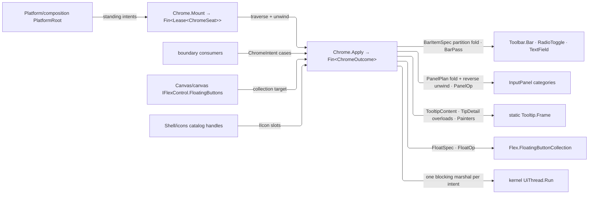

# [RASM_GRASSHOPPER_SHELL_CHROME]

`Chrome` is the GH2 chrome owner of the Grasshopper boundary — `Apply(ChromeIntent)` settles every toolbar, input-panel, tooltip, and floating-button demand against the GH2 chrome hosts (`Toolbar.Bar` and `InputPanel.InputPanel`, both directly constructible; the static `Tooltip.Frame`; the canvas-owned `Flex.FloatingButtonCollection`), and `Mount` seats the plugin's STANDING chrome from `Platform/composition.md`'s load roster as one leased, unwindable traverse.

Bar is a fold of `BarItemSpec` rows onto one host `Bar`, a panel is a fold of category-grouped `PanelControl` rows onto one `InputPanel`, a tooltip is ONE `TooltipContent` shape whose detail is an inner union over the static `Frame` overload family, a floating button is one `FloatSpec` value whose mutations, visibility, probes, tallies, and numeric binding are cases of one `FloatOp` union, and every family drains through ONE gate. Every named chrome element is addressed by a `ChromeTag` — a raw string key beside the owner is the deleted form. Every settlement marshals through the kernel's synchronous `UiThread.Run` arity, runs under `Try.lift`, and returns a typed `ChromeOutcome`; a host refusal is the kernel's `UiFault.HostRejected`, never a dropped bool. Focus-stack and responsive registration are `Canvas/interaction.md`'s dispatch spine; a reflection path into `Tooltip.Layout` is a phantom, and the internal host surfaces (`FloatingButtonLayout`, the `FloatingButton` constructor, the `Position*`/`*Ux` members) form no contract. This page owns GH2's OWN chrome hosts; menu authoring, window specs, prompts, and pickers are the kernel `Rasm/Interaction` chrome module, composed directly by consumers, never wrapped here.

## [01]-[INDEX]

- [02]-[BAR]: `ColourRange` + `BarItemSpec` + `BarMutation` + `BarPass` + `ColourBars` — the toolbar item-row family, the live-item mutation cases, the layout/render/tooltip/tune/probe pass family, and the standard colour-bar triplet.
- [03]-[PANEL]: `PanelControl` + `PanelPlan` + `PanelOp` — the category-structured control rows, the build plan, and the category-mutation/embed/float verb family.
- [04]-[TOOLTIP]: `TipEmphasis` + `TipDetail` + `TooltipContent` + `TooltipIntent` + `Painters` — the ONE content shape over the static `Frame` overload set and the painter factory rows.
- [05]-[FLOATS]: `FloatAnchor` + `FloatSpec` + `FloatDress` + `AnchorPace` + `FloatOp` — the anchored floating-button family with visibility, dress, probe, tally, and numeric-channel cases.
- [06]-[GATE]: `ChromeTag` + `ChromeIntent` + `ChromeOutcome` + `Chrome` — the one settlement gate over every family and the root-wired standing mount.

## [02]-[BAR]

- Owner: `BarItemSpec` `[Union]` — the toolbar item-row family, data a fold appends onto a live `Bar`: `PushCase(IIcon Icon, Nomen Label, Action Verb, BarShortcut Chord)` (`Bar.AddPushButton(IIcon, Nomen, Action = null, BarShortcut = null)`), `RadioCase(IIcon Icon, Nomen Label, bool Initial, Action<bool> Verb, BarShortcut Chord)` (`AddRadioToggle`), `FieldCase(IIcon Icon, Nomen Label, string Text, string Placeholder)` (`AddTextField(IIcon, Nomen, string initial, string placeholder)`), `SpacerCase(Nomen Label, int MinimumWidth, int MaximumWidth)` (`AddSpacer(Nomen, int, int)`), `SectionToggleCase(Nomen Label, bool Initial, Seq<string> Sections)` (`AddToggle(Nomen, bool, params string[])` — the section-visibility toggle), `ItemCase(BarItem Element)` (`Add(BarItem)` — the raw append absorbing any caller-minted item), `ColoursCase(ColourRange Range, Nomen Label, OpenColor.Family Seed, Action<OpenColor.Family> Changed)` — the in-bar colour rows. `ColourRange` `[Union]` discriminates the host's colour-row family: `LifeCase` (`AddLifeColours`), `CoolCase` (`AddCoolColours`), `WarmCase` (`AddWarmColours`), `SpectrumCase(Seq<OpenColor.Family> Spectrum)` (`AddColours(Nomen, Family[], Family, Action<Family>)`) — three named rows and the parameterized spectrum on one union, so the host's enumerated sibling methods demote to dispatch arms. Bar's whole item surface is one `Seq<BarItemSpec>`, and the icon slot composes `Shell/icons.md`'s catalog handles so every bar item is catalog-addressable.
- Owner: `BarMutation` `[Union]` — post-build mutation of live items the host returned to the consumer: `RadioSwing(RadioToggle Item, Option<bool> Target)` (`SetState(bool)` on `Some`, `Toggle()` on `None`), `RadioDress(RadioToggle, Option<string> OnText, Option<string> OffText, Option<bool> Optional)` (the settable dress trio, present slots only), `FieldWrite(TextField Item, string Text)` (`SetText(string)`), `FieldDress(TextField, Option<string> Placeholder)` (the settable placeholder, present slot only). `BarPass` `[Union]` — the bar-level verb family: `LayoutCase` (`Bar.Layout`), `RenderCase(Context Surface)` (`Bar.Render(Context)`), `TooltipCase(PointF At)` (`Bar.ShowTooltipAt(PointF)` → `bool` — a `false` settles `UiFault.HostRejected`, never a silently ignored bool), `InvalidateCase` (`Bar.Invalidate`), `TuneCase(Option<bool> Enabled, Option<int> RowHeight, Option<BarStyle> Style)` — one bar-state write over the settable `Enabled`/`ElementHeight`/`Style` members, present slots only — and `FindCase(ChromeTag Name)` (`Bar[string]` — the named-item probe answering `Option` on the outcome, absence as data).
- Owner: `ColourBars` readonly record struct — the `CreateStandardColourBars(Nomen, OpenColor.Family, Action<OpenColor.Family>, out Bar life, out Bar cool, out Bar warm)` triplet carried as one value (`Life`, `Cool`, `Warm` — the out-parameter roles); the callback receives the settled family and the three bars enter the same `BarPass`/fold vocabulary as any other bar.
- Law: the item fold is a PARTITION, never a first-fail — every row attempts, refusals accumulate through `Error.Many` with each refused row named, and the outcome's built count is the accepted tally (folder RULINGS `[03]`); the host `Bar` publishes no item-removal member, so a refused fold's already-appended rows STAY on the bar — the named loss — and the lawful recovery is re-minting the bar, which is cheap because a `Bar` mints anywhere (the public constructors, a panel's `AddBar` return, or the colour-bar factory).
- Law: the `Add*` family returns its typed item (`PushButton`/`RadioToggle`/`TextField`/`Spacer`/`Bar`), so a consumer holding an item for later mutation captures the return at build or re-resolves through `FindCase`; the `RadioToggle(IIcon, Nomen, bool, Action<bool>)` and `TextField(IIcon, Nomen, string)` constructors mint the caller-held items an `ItemCase` or `AddBar` transports.
- Boundary: `Bar.Invalidated`, `TooltipDetails`, `CloseRequested`, `TextField.TextChanged`/`ActiveChanged`, and `RadioToggle.StateChanged` are public event streams belonging in `Shell/events.md`'s source vocabulary as chrome rows through its factory-fold contract, never subscribed here; `Bar.Render` draws over `Eto.Drawing.Context` inside the paint window `Canvas/paint.md` owns — this page transports the context, never opens one.
- Packages: Grasshopper2 (`Bar`, `BarItem`, `BarStyle`, `RadioToggle`, `TextField`, `Nomen`, `BarShortcut`, `OpenColor.Family`), Eto (`Context`, `PointF`), `Rasm.Domain`.
- Growth: a new toolbar item kind is one `BarItemSpec` case with one fold arm breaking loudly; a new bar verb is one `BarPass` case; a new colour row is one `ColourRange` case.

## [03]-[PANEL]

- Owner: `PanelControl` `[Union]` — the category-scoped control rows a panel build folds through the `InputPanel.Add*` family, each returning its typed control: `LabelCase(string Text, bool Italic, string Tip)` (`AddLabel(string, bool italic, string tooltip)` → `Label`), `CheckCase(string Label, bool Initial, Action<bool> Changed, string Tip)` (`AddCheck` → `CheckBox`), `TextCase(string Label, Action<string> Changed, string Tip)` (`AddText` → `TextBox`), `BarCase(bool CategoryLabels, Option<int> RowHeight, Seq<BarItem> Items)` (`AddBar(bool, params BarItem[])`, the `Some` height selecting the `AddBar(bool, int, params BarItem[])` overload → `Bar`), `SpecCase(ControlSpec Spec, ElementRuntime Runtime)` (the kernel control-module boundary MADE REAL: the build realizes the spec through `ControlForge.Grow` and hands `mount.Host` to `Add(Control)`, the realized `ElementMount` joining the build's teardown custody), `HostCase(Control Surface)` (`Add(Control)` — the raw escape for a host-realized control that has no kernel spec). `PanelPlan` record — `Seq<PanelCategory>` where each `PanelCategory(ChromeTag Name, Seq<PanelControl> Rows)` opens through `BeginCategory` — whose returned `IDisposable` closes the category scope and is disposed by the fold after its rows land — then folds its rows in order.
- Owner: `PanelOp` `[Union]` — the panel verb family: `BuildCase(PanelPlan Plan)`, `MoveCase(ChromeTag Category, ChromeTag Above)` (`MoveCategoryBelow(string category, string above)`), `RenameCase(ChromeTag Category, ChromeTag Next)` (`RenameCategory`), `RemoveCase(ChromeTag Category)` (`RemoveCategory`), `EmbedCase` (`ToEtoControl()` — the panel projected as an embeddable `Control`, returned on the outcome), `FloatCase(Control Owner, PointF At, RectangleF Screen)` (`ShowAsForm(Control, PointF, RectangleF)` → `Form` — the floated panel returns as `Lease<Form>.Owned` on the outcome, so teardown rides `Shell/session.md`'s release custody and a dangling chrome form is unconstructible).
- Law: the category build UNWINDS — the panel is a LIVE host surface, so a refused build removes every category it already opened through `RemoveCategory` in reverse order AND disposes every `ElementMount` its `SpecCase` rows realized before the aggregate refusal returns, with unwind refusals aggregating INTO that fault rather than vanishing (branch RULINGS `[02]`); no spec set can leave half a plan on live chrome, and the settled build's teardown owns its realized mounts the same way.
- Law: the panel is the one category-structured control surface — a bespoke Eto form assembling label/check/text rows beside it re-derives what `InputPanel` owns and is the deleted form; a control family richer than the `Add*` set enters as `SpecCase` realized through the kernel forge — `HostCase` stays the raw escape for host-realized objects only — so the host roster bounds nothing and the kernel control module is COMPOSED, never advertised. Category verbs return `bool` — a `false` settles `UiFault.HostRejected` carrying the missing category tag, never a silent no-op.
- Boundary: value admission for check/text callbacks is the consumer's — a callback that admits raw text into a domain owner composes the kernel `Rasm/Interaction` binding module's gate; this page wires the callback and adjudicates nothing.
- Packages: Grasshopper2 (`InputPanel`, `BarItem`), Eto (`Control`, `Form`, `PointF`, `RectangleF`), `Rasm.Domain` (`Fault`, `Lease<T>`), `Rasm.Interaction` (`UiFault`).
- Growth: a new panel control kind is one `PanelControl` case (kernel-expressible controls cost a `ControlSpec` value, not a case); a new category verb is one `PanelOp` case.

## [04]-[TOOLTIP]

- Owner: `TooltipContent` — ONE content shape: `(IIcon Icon, string Title, string Body, TipDetail Detail, CapabilitySet<TipEmphasis> Emphasis)`. Former three sibling cases restated the shared icon/title/body/emphasis columns per case; the collapse hoists them and nests the discriminant: `TipDetail` `[Union]` — `PlainCase`, `ItemsCase(Seq<LazyStrings> Rows)` (the single-item host overload is the one-row sequence), `PainterCase(Action<Context, Rectangle> Paint, Size Extent)` — selects the `Frame.Show` overload, and `TipEmphasis : ICapability` (`Warnings`, `Errors`, law `Open`) carries the host's two trailing emphasis booleans as set membership. `TooltipIntent` `[Union]` — `ShowCase(TooltipContent Content)`, `HideCase` (`Frame.Hide`), `InvalidateCase` (`Frame.Invalidate`), `CaptureCase(Option<string> Folder)` (`Frame.ScreencapFolder` — `Some` aims tooltip screen capture at a folder, `None` clears it). Painter factories are rows on the owner, each returning the host's `(Action<Context, Rectangle> painter, Size size)` pair that fills a `PainterCase` verbatim: `Painters.Shortcut(string Lead, Either<Keys, char> Chord, string Tail)` (the `Keys` and `char` `CreateShortcutPainter` overloads on one probe shape) and `Painters.Composite(object[] Parts)` (`CreateTextAndIconPainter`) — a hand-drawn shortcut hint beside the factory is the deleted form.
- Law: `Frame` is a static host — there is no frame instance to acquire, so `TipCase` carries only the intent and every settlement is a static call inside the marshal; an assembly-name and public-field walk into `Grasshopper2.UI.Tooltip.Layout` is the phantom-class defect, and tooltip geometry beyond this overload family does not exist on this surface.
- Boundary: dwell timing and the decision of WHEN a tooltip shows are `Canvas/interaction.md`'s (`MouseDwell` rides `Shell/events.md`'s canvas rows); this owner renders WHAT shows.
- Packages: Grasshopper2 (`Frame`, `LazyStrings`), Eto (`Context`, `Rectangle`, `Size`, `Keys`), LanguageExt.Core (`Either`), `Rasm.Domain` (`CapabilitySet`, `ICapability`).
- Growth: a new detail shape is one `TipDetail` case; a new emphasis band is one `TipEmphasis` row; a new painter is one factory row.

## [05]-[FLOATS]

- Owner: `FloatSpec` — the one floating-button declaration mirroring the collection's `Add` shape: `FloatAnchor` `[Union]` discriminates placement (`CornerCase(FloatingPosition Corner)` → `FloatingButtonCollection.Add`, `PointCase(PointF At)` → `AddAnchored`), and the spec carries its `ChromeTag` name with the optional `Info`/`Tint`/`Icon` slots and the three named handler slots (`Click`/`MouseDown`/`MouseUp` — the `FloatingButtonHandler` parameter roles), every optional lowering to the host's `null` default. `FloatDress` — the present-slot dress record `(Option<string> Info, Option<IIcon> Icon, Option<Color> Tint)`: the former retitle/reicon/recolour sibling cases were one dress fact split three ways, so one write applies every present slot through `ModifyInfo`/`ModifyIcon`/`ModifyColour` and skips the absent. `AnchorPace` `[SmartEnum<int>]` — `Jump` (immediate) and `Glide` (the host's own animation) carrying `ModifyAnchor`'s boolean as a row column, so pace is a named row, never a bare mode flag.
- Owner: `FloatOp` `[Union]` — the verb family over one collection: `AddCase(FloatSpec Spec)`, `ShowCase(Seq<ChromeTag> Names)`, `HideCase(Seq<ChromeTag> Names)` (`Show`/`Hide(string[])`), `CloseCase(Seq<ChromeTag> Names)` (`Close(string[])`, the empty sequence settling through `CloseAll()`), `DressCase(ChromeTag Name, FloatDress Dress)`, `MoveCase(ChromeTag Name, PointF At, AnchorPace Pace)` (`ModifyAnchor`), `ProbeCase(Either<ChromeTag, PointF> Key)` (`FindByName`/`FindByPoint` — one probe case, the key's shape discriminates, ABSENCE answering `None` on the outcome so existence is the probe's own `IsSome` and no second existence verb survives), `RosterCase(bool VisibleOnly)` (`Buttons`/`VisibleButtons` — the collection census as live handles; reads are UI-affine, so enumeration rides the gate's marshal like every probe), `TallyCase(FloatingState State)` (`StateCount` — the lifecycle census returning its count on the outcome), `BindCase(ChromeTag Name, UiNumber Channel, string ValueKey)` (`FindByName` then `FloatingButton.MakeNumeric(UiNumber, string valueKey)` — the numeric-value channel with `NumericValue` and `ValueChanged` living on the found button).
- Law: the collection is the one float authority AND the one mint — `IFlexControl.FloatingButtons` (or the canvas's collection, the same object through the flex interface) is where every case lands; the `FloatingButton` constructor, the `Position*` relative-placement family, the `*Ux` animation channels, and the `AnchorChanged`/`ColourChanged`/`StateChanged` events are all `internal` on the host — none forms a contract, and a design leaning on them is leaning on phantoms.
- Boundary: `FloatingButton.ValueChanged` is the button family's one public event stream and belongs in `Shell/events.md`'s source vocabulary as a float row; occlusion and placement resolve inside the host's internal layout — this owner declares and mutates, `Canvas/paint.md` owns the pixels.
- Packages: Grasshopper2 (`FloatingButton`, `FloatingButtonCollection`, `FloatingPosition`, `FloatingState`, `FloatingButtonHandler`, `UiNumber`), Eto (`Color`, `PointF`), `Rasm.Domain`.
- Growth: a new float verb is one `FloatOp` case; a new dress slot is one `FloatDress` field.

## [06]-[GATE]

- Owner: `ChromeTag` `[ValueObject<string>]` — the one chrome identity: ordinal, trimmed, non-blank; float names, bar item lookups, and panel categories all address through it. `ChromeIntent` `[Union]` closes the family-by-host pairing: `BarCase(Bar Target, Seq<BarItemSpec> Items)`, `BarPassCase(Bar Target, BarPass Pass)`, `BarMutateCase(BarMutation Change)`, `ColourBarsCase(Nomen Label, OpenColor.Family Seed, Action<OpenColor.Family> Changed)`, `PanelCase(InputPanel Target, PanelOp Verb)`, `TipCase(TooltipIntent Tip)`, `FloatCase(FloatingButtonCollection Target, FloatOp Verb)`. `ChromeOutcome` `[Union]` closes what a chrome host hands back: `BuiltCase(int Count)`, `PassedCase()` (the settled case's generated op, never a `nameof` string), `FoundItemCase(Option<BarItem> Value)`, `FoundFloatCase(Option<FloatingButton> Value)` (probe absence is data — a miss is `None`, not a fault, and existence derives as `IsSome`), `RosterCase(Seq<FloatingButton> Buttons)`, `CountCase(int Value)`, `ColourCase(ColourBars Bars)`, `EmbeddedCase(Control Surface)`, `FloatedCase(Lease<Form> Window)` — a probe returns its live host handle because chrome handles are UI-affine working values, not evidence to persist, and the floated panel returns leased so its teardown is owned.
- Entry: `Chrome.Apply(ChromeIntent intent)` → `Fin<ChromeOutcome>` — one gate, every family; each settlement runs inside ONE kernel `UiThread.Run` blocking marshal under `Try.lift`, and a null target or a host-refused verb is a typed fault (`Admit.Need` / `UiFault.HostRejected`), never a host exception or a silent no-op. `Chrome.Mount(Seq<ChromeIntent> standing)` → `Fin<Lease<ChromeSeat>>` — the root-wired standing mount (`Platform/composition.md` row `[05]`): the traverse applies each intent in order, a refusal UNWINDS what already mounted (floated panels release, added floats close by tag, aggregate faults per branch RULINGS `[02]`) before the fault returns, and the settled lease's release runs that same inverse, so the plugin's standing chrome tears down as one owner.
- Law: the outer union discriminates the host family and the inner union its verb — the pairing is dependent payload, not joint dispatch, because a `FloatOp` is meaningless without its collection; a consumer never sequences host internals, and a new chrome family is one outer case carrying its inner verb union, every dispatch site breaking loudly.
- Packages: Grasshopper2, Eto, `Rasm.Domain` (`Fault`, `Lease<T>`), `Rasm.Interaction` (`UiThread`, `UiDispatch`, `DispatchLane`, `UiFault`), Thinktecture, LanguageExt.Core.
- Growth: one case per new family; zero new gates.

```csharp
// --- [IMPORTS] -------------------------------------------------------------------------
using Rasm.Domain;
using Rasm.Interaction;

namespace Rasm.Grasshopper.Shell;

// --- [TYPES] ---------------------------------------------------------------------------
[ValueObject<string>]
public readonly partial struct ChromeTag {
    static partial void ValidateFactoryArguments(ref ValidationError? validationError, ref string value) {
        value = value?.Trim() ?? string.Empty;
        validationError = value.Length > 0 ? null : new ValidationError(message: "ChromeTag requires a non-blank identity.");
    }
}

[SmartEnum<string>]
[KeyMemberEqualityComparer<ComparerAccessors.StringOrdinal, string>]
public sealed partial class TipEmphasis : ICapability<TipEmphasis> {
    public static readonly TipEmphasis Warnings = new(key: "warnings");
    public static readonly TipEmphasis Errors = new(key: "errors");
    public static CapabilityLaw<TipEmphasis> Law => CapabilityLaw<TipEmphasis>.Open;
}

[SmartEnum<int>]
public sealed partial class AnchorPace {
    public static readonly AnchorPace Jump = new(key: 0, immediate: true);
    public static readonly AnchorPace Glide = new(key: 1, immediate: false);
    internal bool Immediate { get; }
}

[Union]
public abstract partial record ColourRange {
    private ColourRange() { }
    public sealed record LifeCase : ColourRange;
    public sealed record CoolCase : ColourRange;
    public sealed record WarmCase : ColourRange;
    public sealed record SpectrumCase(Seq<OpenColor.Family> Spectrum) : ColourRange;
}

[Union]
public abstract partial record BarItemSpec {
    private BarItemSpec() { }
    public sealed record PushCase(IIcon Icon, Nomen Label, Action Verb, BarShortcut Chord) : BarItemSpec;
    public sealed record RadioCase(IIcon Icon, Nomen Label, bool Initial, Action<bool> Verb, BarShortcut Chord) : BarItemSpec;
    public sealed record FieldCase(IIcon Icon, Nomen Label, string Text, string Placeholder) : BarItemSpec;
    public sealed record SpacerCase(Nomen Label, int MinimumWidth, int MaximumWidth) : BarItemSpec;
    public sealed record SectionToggleCase(Nomen Label, bool Initial, Seq<string> Sections) : BarItemSpec;
    public sealed record ItemCase(BarItem Element) : BarItemSpec;
    public sealed record ColoursCase(ColourRange Range, Nomen Label, OpenColor.Family Seed, Action<OpenColor.Family> Changed) : BarItemSpec;
}

[Union]
public abstract partial record BarMutation {
    private BarMutation() { }
    public sealed record RadioSwing(RadioToggle Item, Option<bool> Target) : BarMutation;
    public sealed record RadioDress(RadioToggle Item, Option<string> OnText, Option<string> OffText, Option<bool> Optional) : BarMutation;
    public sealed record FieldWrite(TextField Item, string Text) : BarMutation;
    public sealed record FieldDress(TextField Item, Option<string> Placeholder) : BarMutation;
}

[Union]
public abstract partial record BarPass {
    private BarPass() { }
    public sealed record LayoutCase : BarPass;
    public sealed record RenderCase(Context Surface) : BarPass;
    public sealed record TooltipCase(PointF At) : BarPass;
    public sealed record InvalidateCase : BarPass;
    public sealed record TuneCase(Option<bool> Enabled, Option<int> RowHeight, Option<BarStyle> Style) : BarPass;
    public sealed record FindCase(ChromeTag Name) : BarPass;
}

[Union]
public abstract partial record PanelControl {
    private PanelControl() { }
    public sealed record LabelCase(string Text, bool Italic, string Tip) : PanelControl;
    public sealed record CheckCase(string Label, bool Initial, Action<bool> Changed, string Tip) : PanelControl;
    public sealed record TextCase(string Label, Action<string> Changed, string Tip) : PanelControl;
    public sealed record BarCase(bool CategoryLabels, Option<int> RowHeight, Seq<BarItem> Items) : PanelControl;
    public sealed record SpecCase(ControlSpec Spec, ElementRuntime Runtime) : PanelControl;
    public sealed record HostCase(Control Surface) : PanelControl;
}

[Union]
public abstract partial record PanelOp {
    private PanelOp() { }
    public sealed record BuildCase(PanelPlan Plan) : PanelOp;
    public sealed record MoveCase(ChromeTag Category, ChromeTag Above) : PanelOp;
    public sealed record RenameCase(ChromeTag Category, ChromeTag Next) : PanelOp;
    public sealed record RemoveCase(ChromeTag Category) : PanelOp;
    public sealed record EmbedCase : PanelOp;
    public sealed record FloatCase(Control Owner, PointF At, RectangleF Screen) : PanelOp;
}

[Union]
public abstract partial record TipDetail {
    private TipDetail() { }
    public sealed record PlainCase : TipDetail;
    public sealed record ItemsCase(Seq<LazyStrings> Rows) : TipDetail;
    public sealed record PainterCase(Action<Context, Rectangle> Paint, Size Extent) : TipDetail;
}

[Union]
public abstract partial record TooltipIntent {
    private TooltipIntent() { }
    public sealed record ShowCase(TooltipContent Content) : TooltipIntent;
    public sealed record HideCase : TooltipIntent;
    public sealed record InvalidateCase : TooltipIntent;
    public sealed record CaptureCase(Option<string> Folder) : TooltipIntent;
}

[Union]
public abstract partial record FloatAnchor {
    private FloatAnchor() { }
    public sealed record CornerCase(FloatingPosition Corner) : FloatAnchor;
    public sealed record PointCase(PointF At) : FloatAnchor;
}

[Union]
public abstract partial record FloatOp {
    private FloatOp() { }
    public sealed record AddCase(FloatSpec Spec) : FloatOp;
    public sealed record ShowCase(Seq<ChromeTag> Names) : FloatOp;
    public sealed record HideCase(Seq<ChromeTag> Names) : FloatOp;
    public sealed record CloseCase(Seq<ChromeTag> Names) : FloatOp;
    public sealed record DressCase(ChromeTag Name, FloatDress Dress) : FloatOp;
    public sealed record MoveCase(ChromeTag Name, PointF At, AnchorPace Pace) : FloatOp;
    public sealed record ProbeCase(Either<ChromeTag, PointF> Key) : FloatOp;
    public sealed record RosterCase(bool VisibleOnly) : FloatOp;
    public sealed record TallyCase(FloatingState State) : FloatOp;
    public sealed record BindCase(ChromeTag Name, UiNumber Channel, string ValueKey) : FloatOp;
}

[Union]
public abstract partial record ChromeIntent {
    private ChromeIntent() { }
    public sealed record BarCase(Bar Target, Seq<BarItemSpec> Items) : ChromeIntent;
    public sealed record BarPassCase(Bar Target, BarPass Pass) : ChromeIntent;
    public sealed record BarMutateCase(BarMutation Change) : ChromeIntent;
    public sealed record ColourBarsCase(Nomen Label, OpenColor.Family Seed, Action<OpenColor.Family> Changed) : ChromeIntent;
    public sealed record PanelCase(InputPanel Target, PanelOp Verb) : ChromeIntent;
    public sealed record TipCase(TooltipIntent Tip) : ChromeIntent;
    public sealed record FloatCase(FloatingButtonCollection Target, FloatOp Verb) : ChromeIntent;
}

// --- [MODELS] --------------------------------------------------------------------------
public sealed record TooltipContent(
    IIcon Icon, string Title, string Body, TipDetail Detail, CapabilitySet<TipEmphasis> Emphasis);

public sealed record PanelCategory(ChromeTag Name, Seq<PanelControl> Rows);

public sealed record PanelPlan(Seq<PanelCategory> Categories);

public sealed record FloatDress(Option<string> Info, Option<IIcon> Icon, Option<Color> Tint);

public sealed record FloatSpec(
    ChromeTag Name, Option<string> Info, Option<Color> Tint, Option<IIcon> Icon, FloatAnchor Anchor,
    Option<FloatingButtonHandler> Click, Option<FloatingButtonHandler> MouseDown, Option<FloatingButtonHandler> MouseUp);

[StructLayout(LayoutKind.Auto)]
public readonly record struct ColourBars(Bar Life, Bar Cool, Bar Warm);

public sealed record ChromeSeat(Seq<ChromeOutcome> Outcomes);

[Union]
public abstract partial record ChromeOutcome {
    private ChromeOutcome() { }
    public sealed record BuiltCase(int Count) : ChromeOutcome;
    public sealed record PassedCase() : ChromeOutcome;
    public sealed record FoundItemCase(Option<BarItem> Value) : ChromeOutcome;
    public sealed record FoundFloatCase(Option<FloatingButton> Value) : ChromeOutcome;
    public sealed record RosterCase(Seq<FloatingButton> Buttons) : ChromeOutcome;
    public sealed record CountCase(int Value) : ChromeOutcome;
    public sealed record ColourCase(ColourBars Bars) : ChromeOutcome;
    public sealed record EmbeddedCase(Control Surface) : ChromeOutcome;
    public sealed record FloatedCase(Lease<Form> Window) : ChromeOutcome;
}

// --- [OPERATIONS] ----------------------------------------------------------------------
public static class Painters {
    public static Fin<(Action<Context, Rectangle> Paint, Size Extent)> Shortcut(string lead, Either<Keys, char> chord, string tail) =>
        Try.lift(() => chord.Match(
            Left: keys => Frame.CreateShortcutPainter(lead, keys, tail),
            Right: glyph => Frame.CreateShortcutPainter(lead, glyph, tail))).Run();

    public static Fin<(Action<Context, Rectangle> Paint, Size Extent)> Composite(object[] parts) =>
        Try.lift(() => Frame.CreateTextAndIconPainter(parts)).Run();
}

public static class Chrome {
    public static Fin<ChromeOutcome> Apply(ChromeIntent intent) {
        return Admit.Need(intent).Bind(valid => UiThread.Run(new UiDispatch<ChromeOutcome>.Blocking(() => valid.Switch(
            barCase: static c => Admit.Need(c.Target).Bind(bar => {
                var (fails, done) = c.Items.Map(item => Try.lift(() =>
                    Append(bar: bar, item: item)).Run().Bind(static inner => inner)).Partition();
                return fails.IsEmpty
                    ? Fin.Succ((ChromeOutcome)new ChromeOutcome.BuiltCase(Count: done.Count))
                    : Fin.Fail<ChromeOutcome>(Error.Many([.. fails]));
            }),
            barPassCase: static c => Admit.Need(c.Target)
                .Bind(bar => c.Pass.Switch(
                    state: (Bar: bar, Key: k),
                    layoutCase: static _ => Passed(verb: s.Key, action: s.Bar.Layout),
                    renderCase: static p => Passed(verb: s.Key, action: () => s.Bar.Render(context: p.Surface)),
                    tooltipCase: static p => Ruled(verb: s.Key, name: p.At.ToString(),
                        rule: () => s.Bar.ShowTooltipAt(location: p.At)),
                    invalidateCase: static _ => Passed(verb: s.Key, action: s.Bar.Invalidate),
                    tuneCase: static p => Passed(verb: s.Key, action: () => {
                        p.Enabled.Iter(value => s.Bar.Enabled = value);
                        p.RowHeight.Iter(value => s.Bar.ElementHeight = value);
                        p.Style.Iter(value => s.Bar.Style = value);
                    }),
                    findCase: static p => Try.lift(() => Optional(s.Bar[(string)p.Name])).Run()
                        .Map(static item => (ChromeOutcome)new ChromeOutcome.FoundItemCase(Value: item)))),
            barMutateCase: static c => c.Change.Switch(
                radioSwing: static (m) => Try.lift(() => m.Target.Match(
                    Some: value => m.Item.SetState(state: value),
                    None: () => m.Item.Toggle())).Run().Bind(static inner => inner),
                radioDress: static (m) => Try.lift(() => {
                    m.OnText.Iter(value => m.Item.OnText = value);
                    m.OffText.Iter(value => m.Item.OffText = value);
                    m.Optional.Iter(value => m.Item.Optional = value);
                }).Run(),
                fieldWrite: static (m) => Try.lift(() => m.Item.SetText(text: m.Text)).Run().Bind(static inner => inner),
                fieldDress: static (m) => Try.lift(() =>
                    m.Placeholder.Iter(value => m.Item.Placeholder = value)).Run().Bind(static inner => inner)
                .Map(_ => (ChromeOutcome)new ChromeOutcome.PassedCase(Verb: k)),
            colourBarsCase: static c => Try.lift(() => {
                Bar.CreateStandardColourBars(c.Label, c.Seed, c.Changed, out Bar life, out Bar cool, out Bar warm);
                return Fin.Succ((ChromeOutcome)new ChromeOutcome.ColourCase(Bars: new ColourBars(Life: life, Cool: cool, Warm: warm)));
            }).Run().Bind(static inner => inner),
            panelCase: static c => Admit.Need(c.Target).Bind(panel => Settle(panel: panel, verb: c.Verb)),
            tipCase: static c => c.Tip.Switch(
                showCase: static (t) => Passed(verb: op, action: () => Present(content: t.Content)),
                hideCase: static (_) => Passed(verb: op, action: Frame.Hide),
                invalidateCase: static (_) => Passed(verb: op, action: Frame.Invalidate),
                captureCase: static (t) => Passed(verb: op, action: () =>
                    Frame.ScreencapFolder = HostEdge.Slot(t.Folder))),
            floatCase: static c => Admit.Need(c.Target).Bind(floats => Settle(floats: floats, verb: c.Verb)))),
            DispatchLane.Interactive, active));
    }

    public static Fin<Lease<ChromeSeat>> Mount(Seq<ChromeIntent> standing);

    private static Fin<ChromeOutcome> Passed(Action action) =>
        Try.lift(action).Run()
            .Map(_ => (ChromeOutcome)new ChromeOutcome.PassedCase(Verb: verb));

    private static Unit Append(Bar bar, BarItemSpec item) => item.Switch(
        pushCase: c => HostEdge.Side(action: () => bar.AddPushButton(c.Icon, c.Label, c.Verb, c.Chord)),
        radioCase: c => HostEdge.Side(action: () => bar.AddRadioToggle(c.Icon, c.Label, c.Initial, c.Verb, c.Chord)),
        fieldCase: c => HostEdge.Side(action: () => bar.AddTextField(c.Icon, c.Label, c.Text, c.Placeholder)),
        spacerCase: c => HostEdge.Side(action: () => bar.AddSpacer(c.Label, c.MinimumWidth, c.MaximumWidth)),
        sectionToggleCase: c => HostEdge.Side(action: () => bar.AddToggle(c.Label, c.Initial, [.. c.Sections])),
        itemCase: c => HostEdge.Side(action: () => bar.Add(c.Element)),
        coloursCase: c => c.Range.Switch(
            state: (Bar: bar, Row: c),
            lifeCase: static _ => HostEdge.Side(action: () => s.Bar.AddLifeColours(s.Row.Label, s.Row.Seed, s.Row.Changed)),
            coolCase: static _ => HostEdge.Side(action: () => s.Bar.AddCoolColours(s.Row.Label, s.Row.Seed, s.Row.Changed)),
            warmCase: static _ => HostEdge.Side(action: () => s.Bar.AddWarmColours(s.Row.Label, s.Row.Seed, s.Row.Changed)),
            spectrumCase: static r => HostEdge.Side(action: () => s.Bar.AddColours(s.Row.Label, [.. r.Spectrum], s.Row.Seed, s.Row.Changed))));

    private static Unit Present(TooltipContent content) {
        bool warnings = content.Emphasis.Admits(TipEmphasis.Warnings);
        bool errors = content.Emphasis.Admits(TipEmphasis.Errors);
        return content.Detail.Switch(
            plainCase: _ => HostEdge.Side(action: () => Frame.Show(content.Icon, content.Title, content.Body, warnings, errors)),
            itemsCase: d => HostEdge.Side(action: () => Frame.Show(content.Icon, content.Title, content.Body, [.. d.Rows], warnings, errors)),
            painterCase: d => HostEdge.Side(action: () => Frame.Show(content.Icon, content.Title, content.Body, d.Paint, d.Extent, warnings, errors)));
    }

    private static Fin<ChromeOutcome> Settle(InputPanel panel, PanelOp verb) => verb.Switch(
        state: panel,
        buildCase: static (s, c) => Built(panel: s, plan: c.Plan),
        moveCase: static (s, c) => Ruled(name: (string)c.Category,
            rule: () => s.MoveCategoryBelow((string)c.Category, (string)c.Above)),
        renameCase: static (s, c) => Ruled(name: (string)c.Category,
            rule: () => s.RenameCategory((string)c.Category, (string)c.Next)),
        removeCase: static (s, c) => Ruled(name: (string)c.Category,
            rule: () => s.RemoveCategory((string)c.Category)),
        embedCase: static (s, c) => Try.lift(() =>
                Optional(s.ToEtoControl()).ToFin((Error)new UiFault.HostRejected(Detail: "host returned nothing"))).Run().Bind(static inner => inner)
            .Map(static surface => (ChromeOutcome)new ChromeOutcome.EmbeddedCase(Surface: surface)),
        floatCase: static (s, c) => Try.lift(() =>
                Optional(s.ShowAsForm(c.Owner, c.At, c.Screen)).ToFin((Error)new UiFault.HostRejected(Detail: "host returned nothing"))).Run().Bind(static inner => inner)
            .Map(static window => (ChromeOutcome)new ChromeOutcome.FloatedCase(Window: new Lease<Form>.Owned(Value: window))));

    private static Fin<ChromeOutcome> Built(InputPanel panel, PanelPlan plan);

    private static Fin<ChromeOutcome> Ruled(string name, Func<bool> rule) =>
        Try.lift(() => rule()
            ? Fin.Succ((ChromeOutcome)new ChromeOutcome.PassedCase(Verb: verb))
            : Fin.Fail<ChromeOutcome>((Error)new UiFault.HostRejected(Key: verb, Detail: name))).Run().Bind(static inner => inner);

    private static Fin<Option<ElementMount>> Fill(InputPanel panel, PanelControl row) => row.Switch(
        state: panel,
        labelCase: static (s, c) => Fin.Succ((HostEdge.Side(action: () => s.AddLabel(c.Text, c.Italic, c.Tip)), Option<ElementMount>.None).Item2),
        checkCase: static (s, c) => Fin.Succ((HostEdge.Side(action: () => s.AddCheck(c.Label, c.Initial, c.Changed, c.Tip)), Option<ElementMount>.None).Item2),
        textCase: static (s, c) => Fin.Succ((HostEdge.Side(action: () => s.AddText(c.Label, c.Changed, c.Tip)), Option<ElementMount>.None).Item2),
        barCase: static (s, c) => Fin.Succ((HostEdge.Side(action: () => c.RowHeight.Match(
            Some: height => s.AddBar(c.CategoryLabels, height, [.. c.Items]),
            None: () => s.AddBar(c.CategoryLabels, [.. c.Items]))), Option<ElementMount>.None).Item2),
        specCase: static (s, c) => ControlForge.Grow(spec: c.Spec, runtime: c.Runtime)
            .Map(realized => (HostEdge.Side(action: () => s.Add(realized.Host)), Some(realized)).Item2),
        hostCase: static (s, c) => Fin.Succ((HostEdge.Side(action: () => s.Add(c.Surface)), Option<ElementMount>.None).Item2));

    private static Fin<ChromeOutcome> Settle(FloatingButtonCollection floats, FloatOp verb) => verb.Switch(
        state: floats,
        addCase: static (s, c) => Try.lift(() => c.Spec.Anchor.Switch(
                state: (s, c.Spec),
                cornerCase: static (held, a) => HostEdge.Side(action: () => held.Add(
                    a.Corner, (string)held.Spec.Name, HostEdge.Slot(held.Spec.Info), HostEdge.Nullable(held.Spec.Tint), HostEdge.Slot(held.Spec.Icon),
                    HostEdge.Slot(held.Spec.Click), HostEdge.Slot(held.Spec.MouseDown), HostEdge.Slot(held.Spec.MouseUp))),
                pointCase: static (held, a) => HostEdge.Side(action: () => held.AddAnchored(
                    a.At, (string)held.Spec.Name, HostEdge.Slot(held.Spec.Info), HostEdge.Nullable(held.Spec.Tint), HostEdge.Slot(held.Spec.Icon),
                    HostEdge.Slot(held.Spec.Click), HostEdge.Slot(held.Spec.MouseDown), HostEdge.Slot(held.Spec.MouseUp))))
            .Map(static _ => (ChromeOutcome)new ChromeOutcome.BuiltCase(Count: 1))).Run().Bind(static inner => inner),
        showCase: static (s, c) => Try.lift(() => s.Show([.. c.Names.Map(static n => (string)n)])).Run().Bind(static inner => inner)
            .Map(_ => (ChromeOutcome)new ChromeOutcome.PassedCase()),
        hideCase: static (s, c) => Try.lift(() => s.Hide([.. c.Names.Map(static n => (string)n)])).Run().Bind(static inner => inner)
            .Map(_ => (ChromeOutcome)new ChromeOutcome.PassedCase()),
        closeCase: static (s, c) => Try.lift(() => {
                if (c.Names.IsEmpty) { s.CloseAll(); } else { s.Close([.. c.Names.Map(static n => (string)n)]); }
            }).Run()
            .Map(_ => (ChromeOutcome)new ChromeOutcome.PassedCase()),
        dressCase: static (s, c) => Try.lift(() => {
                c.Dress.Info.Iter(value => s.ModifyInfo((string)c.Name, value));
                c.Dress.Icon.Iter(value => s.ModifyIcon((string)c.Name, value));
                c.Dress.Tint.Iter(value => s.ModifyColour((string)c.Name, value));
            }).Run()
            .Map(_ => (ChromeOutcome)new ChromeOutcome.PassedCase()),
        moveCase: static (s, c) => Try.lift(() =>
                s.ModifyAnchor((string)c.Name, c.At, c.Pace.Immediate)).Run().Bind(static inner => inner)
            .Map(_ => (ChromeOutcome)new ChromeOutcome.PassedCase()),
        probeCase: static (s, c) => Try.lift(() => c.Key.Match(
                Left: name => Optional(s.FindByName((string)name)),
                Right: at => Optional(s.FindByPoint(at)))).Run()
            .Map(static found => (ChromeOutcome)new ChromeOutcome.FoundFloatCase(Value: found)),
        rosterCase: static (s, c) => Try.lift(() => toSeq(c.VisibleOnly ? s.VisibleButtons : s.Buttons)).Run()
            .Map(static held => (ChromeOutcome)new ChromeOutcome.RosterCase(Buttons: held)),
        tallyCase: static (s, c) => Try.lift(() => s.StateCount(c.State)).Run()
            .Map(static count => (ChromeOutcome)new ChromeOutcome.CountCase(Value: count)),
        bindCase: static (s, c) => Try.lift(() =>
                Optional(s.FindByName((string)c.Name)).ToFin((Error)new UiFault.HostRejected(Detail: (string)c.Name))).Run().Bind(static inner => inner)
            .Bind(found => Try.lift(() => found.MakeNumeric(c.Channel, c.ValueKey)).Run().Bind(static inner => inner))
            .Map(_ => (ChromeOutcome)new ChromeOutcome.PassedCase()));

}
```



## [07]-[DENSITY_BAR]

| [INDEX] | [CONCERN]        | [OWNER]                                                     | [RESULT]                       | [CASES] |
| :-----: | :--------------- | :---------------------------------------------------------- | :----------------------------- | :-----: |
|  [01]   | toolbar items    | `ColourRange` + `BarItemSpec` + `BarMutation` + `BarPass`   | partition fold inside the gate |   21    |
|  [02]   | input panel      | `PanelControl` + `PanelPlan` + `PanelOp`                    | `Settle` + reverse unwind      |   11    |
|  [03]   | tooltips         | `TooltipContent` + `TipDetail` + `TipEmphasis` + `Painters` | ONE shape, overload dispatch   |  1+3+2  |
|  [04]   | floating buttons | `FloatSpec` + `FloatDress` + `AnchorPace` + `FloatOp`       | `Settle → Fin<ChromeOutcome>`  |   14    |
|  [05]   | settlement       | `ChromeTag` + `ChromeIntent` + `ChromeOutcome` + `Chrome`   | `Apply` + root-wired `Mount`   |   7+9   |

- [01]-[TOOLBAR_ITEMS]: four closed `[Union]` families; refusals aggregate, survivors named as loss.
- [02]-[INPUT_PANEL]: control rows + plan + `` verbs; live chrome unwinds.
- [03]-[TOOLTIPS]: shared columns hoisted once, detail nested, emphasis a capability set.
- [04]-[FLOATING_BUTTONS]: dress collapse, pace rows, probe absence as data (`DefinedCase` derived away).
- [05]-[SETTLEMENT]: one intent union, one outcome union, one gate, one standing mount.

Kernel `UiThread`/`UiDispatch`/`UiFault`, `Fault`, `Lease<T>`, and `IIcon` are composed upstream owners; the kernel `Rasm/Interaction` chrome/control/binding modules own menus, windows, prompts, pickers, generated controls, and data fusion — the Eto twin pages that duplicated them are deleted, and this page holds only what GH2's own chrome hosts add. `InputPanel.FindBar`, the instance `Frame`, `FloatingButtonLayout`, the `FloatingButton` constructor, and the `Position*`/`*Ux`/`AnchorChanged`/`ColourChanged`/`StateChanged` members are internal or absent host surfaces no fence composes.

Mint shapes are settled host truth: `Nomen(string name, string info, string chapter, string section, int slot, Rank rank, string sortKey)` beside its `Compose`/`Categorise` statics, `BarShortcut(Keys, string)`/`BarShortcut(char, string)`, and `BarStyle`'s two-value roster (`Default`, `DefaultWithoutCategories`) — each transports as a caller-held value with zero gate impact, and the settable dress members ride the `RadioDress`/`FieldDress` present-slot cases.

## [08]-[RESEARCH]

<!-- source-only: research row template:
[TOKEN]-[OPEN|BLOCKED]: <exact question>; <verification route>.
-->

(none)
