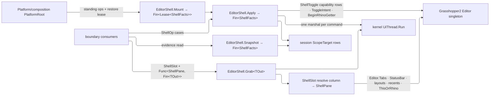

# [RASM_GRASSHOPPER_SHELL_EDITOR]

`EditorShell` is the editor-shell operator of the Grasshopper boundary — ONE owner over the GH2 `Editor` singleton's whole shell surface: the chrome pane slots (tabs, status bar, layouts, recent-document rows, the `ThisOrRhino` host anchor), the shell toggle capability rows (collapsed shell, notes visibility, undo-history visibility), the projected `ShellFacts` value, the single Rhino handoff through `BeginRhinoGetter`, and the root-wired standing `Mount`.

`ShellSlot` rows drain through one generic typed-projection gate; `ShellToggle` CAPABILITY rows hold shown-state as `CapabilitySet<ShellToggle>` membership and swing through `ToggleIntent` (`Hold`, `Release`, `Flip`), so no bare target bool survives at any call site. Commands return the `ShellFacts` produced in the same marshal window. Scope acquisition, editor reveal, and marshal law are `Shell/session.md`'s floor composed as found; chrome construction against its own mintable hosts is `Shell/chrome.md`'s intent surface.

## [01]-[INDEX]

- [02]-[SLOTS]: `ShellPane` + `ShellSlot` + `EditorShell.Grab<TOut>` — the closed pane family, the slot vocabulary over every chrome anchor the editor exposes, and the one typed-projection gate that replaces direct singleton property reads.
- [03]-[STATE]: `ToggleIntent` + `ShellToggle` + `ShellFacts` — the swing-intent rows, the shell-axis capability rows, and the one projected shell value.
- [04]-[OPERATOR]: `ShellOp` + `EditorShell` — the command union (toggle, getter handoff), the `Apply`/`Snapshot`/`Grab` gate trio, and the standing `Mount`.

## [02]-[SLOTS]

- Owner: `ShellPane` `[Union]` — the closed pane family the slot column resolves into: `TabsCase(TabControl)`, `StatusCase(StatusBar)`, `LayoutsCase(Seq<string>)`, `LayoutCase(string)`, `RecentCase(string)`, `RecentsCase(Seq<string>)`, `AnchorCase(Window)`. Heterogeneity is what earns the family; `object` with an `is` recovery is the deleted form, because an unconstrained probe admits any type argument and defers the mismatch to runtime.
- Owner: `ShellSlot` `[SmartEnum<int>]` — 7 pane-anchor rows over ONE `[UseDelegateFromConstructor]` `Resolve() -> Fin<ShellPane>` column, split across two row constructors by member residency: instance rows `Tabs` (key 0, `Editor.Tabs` → `TabbedPanel.TabControl`), `StatusBar` (key 1, `Editor.StatusBar` → `Grasshopper2.UI.StatusBar`), `RecentActive` (key 4, `Editor.MostRecentActiveDocument` → the recent-path `string`), `RecentLoaded` (key 5, `Editor.MostRecentLoadedDocuments` → `string[]`); static rows `DefinedLayouts` (key 2, `Editor.DefinedLayouts` → `IEnumerable<string>`), `InitialLayout` (key 3, `Editor.InitialLayout` → `string`), `HostAnchor` (key 6, `Editor.ThisOrRhino` → `Eto.Forms.Window`). Every instance row null-gates the singleton chain through `Optional(Editor.Instance).ToFin(new KernelFault.MissingContext())`; the static rows read settings-backed statics and therefore resolve on a headless Rhino where every instance row refuses typed. `Editor.BreadCrumbs` is private on the host and is no row — a private pane is unreachable capability, not RESEARCH.
- Entry: `EditorShell.Grab<TOut>(ShellSlot slot, Func<ShellPane, Fin<TOut>> project)` → `Fin<TOut>` — the one typed egress. Each slot resolves inside one kernel `UiThread.Run` blocking marshal and the caller's projection runs inside the same marshal window, so a pane reference never escapes the window that resolved it — the same non-escape law `GhScope` carries on the session floor. Projection is a total `Switch` over `ShellPane`, so a consumer expecting one pane states its refusal for every other case at compile time and a new pane shape breaks every projection loudly.
- Law: the slot column is the ONLY singleton read site for chrome panes — a consumer holding `Editor.Instance.Tabs` at a call site is the deleted form. Each row's host read stays typed to its own member and the projection closes it into `ShellPane`, so the null gate guards the host value rather than an erased reference; `Shell/chrome.md`'s hosts mint on their own surfaces (`Bar` construction, `InputPanel` construction, the static `Frame`, the canvas flex collection) and only the editor-resident panes route through this gate.
- Boundary: `Editor.Canvas` and `Editor.Documents` resolve through `ScopeTarget`/`GhScope` on the session floor, never as slot rows — a slot is a chrome pane, a scope is a live work surface, and the two vocabularies never alias. Host editor carries no file-comparison surface.
- Packages: Grasshopper2 (`Editor.Instance`, `Editor.ThisOrRhino`, the seven pane members), LanguageExt.Core, `Rasm.Domain` (`Fault`), `Rasm.Interaction` (`UiThread`, `UiDispatch`, `DispatchLane`).
- Growth: a new shell pane is one `ShellSlot` row; the column, the gate, and every consumer signature never widen.

## [03]-[STATE]

- Owner: `ToggleIntent` `[SmartEnum<int>]` — the swing vocabulary (E-G46): `Hold` (the axis lands shown/engaged), `Release` (the axis lands hidden/disengaged), `Flip` (the axis inverts its current state) — one `Target(bool current)` column derives the write from the read, so a bare `bool target` parameter and its truth-table ambiguity ("does true mean collapsed or expanded?") are unconstructible; the row NAMES the intended posture.
- Owner: `ShellToggle` `[SmartEnum<string>]` `ICapability<ShellToggle>` — 3 shell-axis capability rows over TWO `[UseDelegateFromConstructor]` columns, `Read(GhScope) -> Fin<bool>` and `Write(GhScope, bool) -> Fin<Unit>`: `Collapsed` (`Editor.Collapsed`), `Notes` (`Editor.ShowNotes`), `UndoHistory` (`Canvas.ShowUndoHistory`). Capability law is `Open` — any membership combination is a lawful shell posture. Two editor rows demand the scope's `Editor` projection through the `EditorRow` factory and the canvas row demands its `Canvas` projection through the `CanvasRow` factory — the two factories are the SAME shape over different scope projections, so no row hand-rolls its acquisition — each refusing an anchor-mismatched scope with `KernelFault.MissingContext`.
- Owner: `ShellFacts` readonly record struct — the one shell posture value: `Shown` (`CapabilitySet<ShellToggle>` — membership IS the engaged set, so three parallel booleans collapse to one set the capability algebra already serves), `HasDocument` (whether `Editor.Documents.Current` is live), and `RecentCount` (`Editor.MostRecentCount`, the host's on-disk recency tally), implementing `IValidityEvidence` through the claim fold. This value makes shell state structural: a consumer reads it as one projected value and never interrogates the singleton, and shell-state diffing is set algebra on two values' `Shown` members.
- Law: a new shell axis is one `ShellToggle` row — the `Shown` set absorbs it with zero shape change, which is the collapse's proof over the field-per-axis form it replaced.
- Boundary: document identity, open-document mutation, and document IO are `Document/document.md`'s scope; this value answers only whether a current document exists, never which.
- Packages: Grasshopper2 (`Editor.Collapsed`, `Editor.ShowNotes`, `Editor.Documents.Current`, `Editor.MostRecentCount`, `Canvas.ShowUndoHistory`), `Rasm.Domain` (`ValidityClaim`, `IValidityEvidence`, `CapabilitySet`, `ICapability`, `CapabilityLaw`).
- Growth: a new shell axis is one `ShellToggle` row; the columns, the value, and the snapshot gate never change.

## [04]-[OPERATOR]

- Owner: `EditorShell` — the one editor-shell operator. `ShellOp` `[Union]` closes the command family: `ToggleCase(ShellToggle Row, ToggleIntent Intent)` swings one shell axis under a NAMED intent, `GetterCase(Option<RhinoDoc> Target)` arbitrates the single Rhino handoff through the static `Editor.BeginRhinoGetter(RhinoDoc doc = null)` — `None` defers to the host's `RhinoDoc.ActiveDoc` default, and the member's `false` return (no target document, or a getter already active) settles as the kernel's `UiFault.HostRejected`, never a silently ignored bool. This handoff is the one boundary by which the editor yields input focus to a Rhino getter, so a direct `RhinoDoc` getter beside it bypasses the editor's arbitration and is the deleted form. Every shell command returns the `ShellFacts` it produced and no consumer issues a follow-up snapshot to learn what its own command did.
- Entry: `EditorShell.Apply(ShellOp op)` → `Fin<ShellFacts>` — the command gate; `EditorShell.Snapshot()` → `Fin<ShellFacts>` — the state gate; `EditorShell.Grab<TOut>` — the `[02]` pane gate; `EditorShell.Mount(Seq<ShellOp> standing)` → `Fin<Lease<ShellFacts>>` — the root-wired standing mount (`Platform/composition.md` row `[04]`): it captures the pre-mount `ShellFacts`, applies the standing ops as one traverse (a refusal unwinds by restoring the captured facts before the fault returns), and the settled lease's release restores those captured facts — the plugin leaves the editor shell exactly as it found it.
- Law: every case runs inside ONE marshal — scope acquisition through `ScopeTarget`, the host verb, and the facts projection share the window, so no command observes a shell another thread mutated mid-command, and every case body runs under `Try.lift` so a throwing host member keeps its original exceptional `Error`.
- Law: reveal is not a case — `SessionOp.RevealCase` on the session floor owns the public static `Editor.ShowEditor` (`EnsureVisible` is host-internal), and a second reveal spelling here forks the one session-command vocabulary; a consumer sequencing reveal-then-shell-work composes the two gates.
- Boundary: `GetterCase` transports the optional `RhinoDoc` and adjudicates nothing about it — Rhino document semantics are `Rasm.Rhino`'s concern entirely, and the case exists because the handoff member lives on the GH2 editor.
- Packages: Grasshopper2 (the static `Editor.BeginRhinoGetter`), RhinoCommon (`RhinoDoc` as the handoff payload), `Rasm.Domain` (`Fault`, `Lease<T>`, `ValidityClaim`), `Rasm.Interaction` (`UiThread`, `UiFault`), `Shell/session.md` (`ScopeTarget`, `GhScope`).
- Growth: a new shell command is one `ShellOp` case with its `Switch` arm breaking loudly at the gate; zero new entrypoints on any axis.

```csharp
// --- [IMPORTS] -------------------------------------------------------------------------
using Rasm.Domain;
using Rasm.Grasshopper.Document;
using Rasm.Interaction;
using Rhino;

namespace Rasm.Grasshopper.Shell;

// --- [TYPES] ---------------------------------------------------------------------------
[Union]
public abstract partial record ShellPane {
    private ShellPane() { }
    public sealed record TabsCase(TabControl Strip) : ShellPane;
    public sealed record StatusCase(StatusBar Bar) : ShellPane;
    public sealed record LayoutsCase(Seq<string> Names) : ShellPane;
    public sealed record LayoutCase(string Name) : ShellPane;
    public sealed record RecentCase(string Path) : ShellPane;
    public sealed record RecentsCase(Seq<string> Paths) : ShellPane;
    public sealed record AnchorCase(Window Host) : ShellPane;
}

[SmartEnum<int>]
public sealed partial class ShellSlot {
    public static readonly ShellSlot Tabs = EditorRow(key: 0,
        read: static shell => shell.Tabs, pane: static strip => new ShellPane.TabsCase(Strip: strip));
    public static readonly ShellSlot StatusBar = EditorRow(key: 1,
        read: static shell => shell.StatusBar, pane: static bar => new ShellPane.StatusCase(Bar: bar));
    public static readonly ShellSlot DefinedLayouts = StaticRow(key: 2,
        read: static () => Editor.DefinedLayouts, pane: static names => new ShellPane.LayoutsCase(Names: toSeq(names)));
    public static readonly ShellSlot InitialLayout = StaticRow(key: 3,
        read: static () => Editor.InitialLayout, pane: static name => new ShellPane.LayoutCase(Name: name));
    public static readonly ShellSlot RecentActive = EditorRow(key: 4,
        read: static shell => shell.MostRecentActiveDocument, pane: static path => new ShellPane.RecentCase(Path: path));
    public static readonly ShellSlot RecentLoaded = EditorRow(key: 5,
        read: static shell => shell.MostRecentLoadedDocuments, pane: static paths => new ShellPane.RecentsCase(Paths: toSeq(paths)));
    public static readonly ShellSlot HostAnchor = StaticRow(key: 6,
        read: static () => Editor.ThisOrRhino, pane: static host => new ShellPane.AnchorCase(Host: host));
    [UseDelegateFromConstructor] internal partial Fin<ShellPane> Resolve();

    private static ShellSlot EditorRow<THost>(int key, Func<Editor, THost?> read, Func<THost, ShellPane> pane)
        where THost : class =>
        new(resolve: op =>
            Optional(Editor.Instance).ToFin(new KernelFault.MissingContext())
                .Bind(shell => Optional(read(arg: shell)).ToFin(new KernelFault.MissingContext()))
                .Map(pane));

    private static ShellSlot StaticRow<THost>(int key, Func<THost?> read, Func<THost, ShellPane> pane)
        where THost : class =>
        new(resolve: op => Optional(read()).ToFin(new KernelFault.MissingContext()).Map(pane));
}

[SmartEnum<int>]
public sealed partial class ToggleIntent {
    public static readonly ToggleIntent Hold = new(key: 0, target: static _ => true);
    public static readonly ToggleIntent Release = new(key: 1, target: static _ => false);
    public static readonly ToggleIntent Flip = new(key: 2, target: static current => !current);
    [UseDelegateFromConstructor] internal partial bool Target(bool current);
}

[SmartEnum<string>]
[KeyMemberEqualityComparer<ComparerAccessors.StringOrdinal, string>]
public sealed partial class ShellToggle : ICapability<ShellToggle> {
    public static readonly ShellToggle Collapsed = EditorRow(key: "collapsed",
        read: static shell => shell.Collapsed, write: static (shell, value) => shell.Collapsed = value);
    public static readonly ShellToggle Notes = EditorRow(key: "notes",
        read: static shell => shell.ShowNotes, write: static (shell, value) => shell.ShowNotes = value);
    public static readonly ShellToggle UndoHistory = CanvasRow(key: "undo-history",
        read: static surface => surface.ShowUndoHistory, write: static (surface, value) => surface.ShowUndoHistory = value);
    public static CapabilityLaw<ShellToggle> Law => CapabilityLaw<ShellToggle>.Open;
    [UseDelegateFromConstructor] internal partial Fin<bool> Read(GhScope scope);
    [UseDelegateFromConstructor] internal partial Fin<Unit> Write(GhScope scope, bool value);

    private static ShellToggle EditorRow(string key, Func<Editor, bool> read, Action<Editor, bool> write) =>
        new(read: (scope, op) => scope.Editor.ToFin(new KernelFault.MissingContext()).Bind(shell => Try.lift(() => read(arg: shell)).Run()),
            write: (scope, value, op) => scope.Editor.ToFin(new KernelFault.MissingContext()).Bind(shell => Try.lift(() =>
                Fin.Succ(HostEdge.Side(action: () => write(arg1: shell, arg2: value)))).Run().Bind(static inner => inner)));

    private static ShellToggle CanvasRow(string key, Func<Canvas, bool> read, Action<Canvas, bool> write) =>
        new(read: (scope, op) => scope.Canvas.ToFin(new KernelFault.MissingContext()).Bind(surface => Try.lift(() => read(arg: surface)).Run()),
            write: (scope, value, op) => scope.Canvas.ToFin(new KernelFault.MissingContext()).Bind(surface => Try.lift(() =>
                Fin.Succ(HostEdge.Side(action: () => write(arg1: surface, arg2: value)))).Run().Bind(static inner => inner)));
}

[Union]
public abstract partial record ShellOp {
    private ShellOp() { }
    public sealed record ToggleCase(ShellToggle Row, ToggleIntent Intent) : ShellOp;
    public sealed record GetterCase(Option<RhinoDoc> Target) : ShellOp;
}

// --- [MODELS] --------------------------------------------------------------------------
[StructLayout(LayoutKind.Auto)]
public readonly record struct ShellFacts(
    CapabilitySet<ShellToggle> Shown, bool HasDocument, int RecentCount) : IValidityEvidence {
    public bool IsValid => RecentCount >= 0;
}

// --- [OPERATIONS] ----------------------------------------------------------------------
public static class EditorShell {
    public static Fin<TOut> Grab<TOut>(ShellSlot slot, Func<ShellPane, Fin<TOut>> project) {
        return from row in Admit.Need(slot)
               from valid in Admit.Need(project)
               from output in UiThread.Run(new UiDispatch<TOut>.Blocking(
                   () => row.Resolve().Bind(pane => Try.lift(() => valid(arg: pane)).Run().Bind(static inner => inner))),
                   DispatchLane.Interactive)
               select output;
    }

    public static Fin<ShellFacts> Snapshot() {
        return UiThread.Run(new UiDispatch<ShellFacts>.Blocking(
            () => ScopeTarget.EditorHost.Acquire().Bind(scope => Project(scope: scope))),
            DispatchLane.Interactive);
    }

    public static Fin<ShellFacts> Apply(ShellOp op) {
        return Admit.Need(op).Bind(valid =>
            UiThread.Run(new UiDispatch<ShellFacts>.Blocking(
                () => ScopeTarget.EditorHost.Acquire().Bind(scope => valid.Switch(
                    state: (Scope: scope, Key: active),
                    toggleCase: static (s, c) =>
                        from current in c.Row.Read(scope: s.Scope)
                        from _ in c.Row.Write(scope: s.Scope, value: c.Intent.Target(current: current))
                        select unit,
                    getterCase: static (s, c) => Try.lift(() =>
                        Editor.BeginRhinoGetter(doc: HostEdge.Slot(c.Target))
                            ? Fin.Succ(unit)
                            : Fin.Fail<Unit>((Error)new UiFault.HostRejected(Cause: Error.New(0, nameof(Editor.BeginRhinoGetter))))).Run().Bind(static inner => inner))
                    .Bind(_ => Project(scope: scope)))),
                DispatchLane.Interactive));
    }

    public static Fin<Lease<ShellFacts>> Mount(Seq<ShellOp> standing);

    private static Fin<ShellFacts> Project(GhScope scope) =>
        from shell in scope.Editor.ToFin(new KernelFault.MissingContext())
        from shown in ShellToggle.Items.Fold(
            Fin.Succ(CapabilitySet<ShellToggle>.None),
            (acc, row) => acc.Bind(held => row.Read(scope: scope)
                .BindFail(cause => cause is KernelFault.MissingContext ? Fin.Succ(false) : Fin.Fail<bool>(cause))
                .Map(engaged => engaged ? held.With(row) : held)))
        from facts in Try.lift(() => new ShellFacts(
            Shown: shown,
            HasDocument: shell.Documents.Current is not null,
            RecentCount: shell.MostRecentCount)).Run()
        select facts;
}
```



## [05]-[DENSITY_BAR]

`Resolve`, `Read`, `Write`, and `Target` are internal columns behind the public gates `Apply`, `Snapshot`, `Grab`, and `Mount`.

| [INDEX] | [CONCERN]         | [OWNER]                  | [KIND]                         | [RESULT]                         | [CASES] |
| :-----: | :---------------- | :----------------------- | :----------------------------- | :------------------------------- | :-----: |
|  [01]   | pane family       | `ShellPane`              | `[Union]`, case per pane       | `Resolve → Fin<ShellPane>`       |    7    |
|  [02]   | pane slots        | `ShellSlot`              | resolve column                 | `Resolve → Fin<ShellPane>`       |    7    |
|  [03]   | swing intent      | `ToggleIntent`           | target column (E-G46)          | `Target(current) → bool`         |    3    |
|  [04]   | shell axes        | `ShellToggle`            | capability rows, r/w columns   | `CapabilitySet` membership       |    3    |
|  [05]   | shell commands    | `ShellOp`                | `[Union]` | `Apply` → direct `ShellFacts`    |    2    |
|  [06]   | shell posture     | `ShellFacts`             | one `Shown` set, no bools      | `Snapshot → Fin<ShellFacts>`     |    1    |
|  [07]   | typed pane egress | `EditorShell.Grab<TOut>` | total-`Switch`, one marshal    | `Grab → Fin<TOut>`               |    1    |
|  [08]   | standing mount    | `EditorShell.Mount`      | capture-apply-restore lease    | `Mount → Fin<Lease<ShellFacts>>` |    1    |

`ScopeTarget`, `GhScope`, kernel `UiThread`/`UiFault`, `Fault`, and `ValidityClaim` are composed upstream owners; the boolean shell triple, the bare-bool toggle target, the dual-direction `Option<bool>` swing column, the folder-local command wrapper, the `nameof` verb strings, and the `EtoDispatch` marshal are all deleted. `Editor.BreadCrumbs` (private) is a phantom row no fence composes, and the host ships no file-comparison member.

## [06]-[RESEARCH]

<!-- source-only: research row template:
[TOKEN]-[OPEN|BLOCKED]: <exact question>; <verification route>.
-->

(none)
