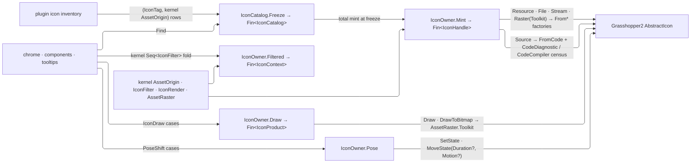

# [RASM_GRASSHOPPER_SHELL_ICONS]

`IconOwner` is the icon MATERIALIZER of the Grasshopper boundary — the one gate turning the kernel `Rasm/Interaction` asset vocabulary into live GH2 `IIcon` values: `Mint` admits a kernel `AssetOrigin` through the matching `AbstractIcon` factory, `Pose` drives the host's keyed-state machine, `Filtered` applies the kernel `IconFilter` chain onto a host `IconContext`, and `Draw` renders through `IIcon.Draw`/`DrawToBitmap` answering products on the kernel `AssetRaster` carrier. `IconCatalog` freezes a plugin's whole inventory as `(IconTag, AssetOrigin)` rows with total mint at freeze.

Origin, filter, pose-orientation, and raster vocabularies are the KERNEL's (`AssetOrigin`, `IconFilter`, `IconPose`, `AssetRaster`, `IconRender`) — the folder twins that duplicated them are deleted, and this page owns only what GH2 adds: the `AbstractIcon` factory correspondence, the compile-diagnostic admission evidence (`FromCode` is the host compiler behind the kernel's `Source` case), the keyed-pose state machine (`SetState`/`MoveState` — the host's own value-state applicator, distinct from the kernel's orientation pose), and the frozen catalog. Minting is admission with typed diagnostics: a compile failure is a `Fault` carrying every `CodeDiagnostic`, a compiler-channel mint detaches the host `CodeCompiler` census as `CompileEvidence`, and rasterization answers leased bitmaps.

Perceptual tint math composes the kernel `PerceptualColor`/`BlendPath` owner — the kernel filter rows already carry `PerceptualColor`, quantized to `Eto.Drawing.Color` at this boundary alone; the host `MoveState` easing stays the host's applicator and is never re-implemented.

## [01]-[INDEX]

- [02]-[ADMISSION]: kernel `AssetOrigin` → `AbstractIcon` correspondence + `IconDiagnostics` + `CompileEvidence` + `IconHandle` + `IconOwner.Mint` — the factory mapping with compile-diagnostic and compiler-census evidence.
- [03]-[CATALOG]: `IconTag` + `IconCatalog` — the icon identity and the frozen per-plugin registry with total mint at freeze.
- [04]-[POSE_AND_FILTER]: `PoseShift` + the kernel `IconFilter` applicator — the keyed-pose machine and the filter-chain fold onto `IconContext`.
- [05]-[DRAW]: `IconDraw` + `IconProduct` + `IconOwner` — the draw-plan family (renamed off the kernel's `IconRender` request shape), the kernel-raster product family, and the operator's gate set.

## [02]-[ADMISSION]

- Owner: the `AssetOrigin` → `AbstractIcon` correspondence — one mint arm per kernel case: `Resource(AssetAnchor)` → `FromResource(anchor.ResourcePath, anchor.Owner)` (the assembly-keyed lookup; the host's `FromResource(Type)` convenience is the same call with the type's assembly and conventional name spelled at the boundary — the anchor states both facts, so no Type-anchored sibling union survives, and the convenience's implicit-name path is the NAMED LOSS: a consumer spells the conventional resource name explicitly); `File(FileLocation)` → `FromFile`; `Stream(Func<Stream>)` → `FromStream`, the factory opened EXACTLY ONCE per the kernel's stream law; `Raster(Seq<AssetRaster>)` → `FromBitmap(params Bitmap[])` over the set's `Toolkit` frames (a `Gdi` or `Pixels` frame refuses typed — GH2's factory takes Eto bitmaps, and the kernel's asked-shape law forbids silent conversion); `Source(string)` → `FromCode` — the host compiler the kernel's `Source` case exists for, through BOTH diagnostic channels; `Vector(AssetKey)` and `Render(Func<AssetExtent, Fin<PaintProgram>>)` refuse typed naming the case — GH2 publishes no by-key vector resolver, and a paint-program draw materializes at the kernel paint executor, not through an icon factory.
- Owner: `IconDiagnostics` readonly record struct carries both `CodeDiagnostic` streams as `Seq` evidence; `CompileEvidence` readonly record struct detaches the `CodeCompiler` census — `References` (`ReferenceCount`), the four compile-policy flags (`GenerateInMemory`/`AllowUnsafe`/`AllowOverflow`/`AllowConcurrent`), `IncludeDebugData`, the `GetCachedSemanticModels` count, and the `GetCachedAssembly` full name; `IconHandle` sealed record binds the live `IIcon`, its host `IconType` kind, its kernel `AssetOrigin`, its `IconDiagnostics`, and its `Option<CompileEvidence>` — the admitted icon travels WITH the evidence that admitted it, so a diagnostic is never re-derived by recompiling and a consumer discriminating pixel from vector from compiled reads the host's own `Type` off the handle.
- Law: an `IIcon` carries no disposal contract — the host interface declares `Type`, `States`, `FindState`, `SetState`, `MoveState`, `Draw`, and `DrawToBitmap` and nothing else — so the handle holds it as a plain reference and neither the handle nor the catalog is `IDisposable`; the leased resources on this page are the RENDERED products, never the icons. Wrapping a non-disposable host value in `Lease<T>` is unconstructible, and an `IDisposable` catalog with nothing to release advertises custody it does not hold.
- Entry: `IconOwner.Mint(AssetOrigin origin)` → `Fin<IconHandle>` — one gate, every kernel origin. `KernelFault.InvalidResult` answers a null factory result; a `FromCode` compile whose error stream is non-empty is `KernelFault.InvalidResult` carrying each error's `Description` and line/column as detail while the handle path preserves warnings as evidence — errors refuse, warnings ride. Compiler channel (`Mint` with `census: true`) reads `GetCachedWarnings`/`GetCachedErrors` for the same diagnostics and projects the census as `CompileEvidence` inside the dispatch window.
- Law: minting marshals through the kernel `UiThread.Run` blocking arity — icon compilation and resource loading touch host drawing state — and every admission runs under `Try.lift`, so a throwing host factory keeps its original exceptional `Error`.
- Law: `CodeDiagnostic` carries `Description`/`Location`/`Length`/`Line`/`Column` with `IsWarning`/`IsError` discriminants — the evidence renders its own detail from these members, and the out-channel ORDER is load-bearing: warnings first, errors second; a consumer binding them reversed inverts the refusal policy.
- Law: the `CodeCompiler` never leaves the gate — the census projects as `CompileEvidence` inside the dispatch window, so a caller diagnosing a missing reference reads a value while the host compiler, its `SemanticModel` set, and its cached assembly die with the mint. `AddReferenceAssembly` and the `CompileCSharpCode` family stay unreachable: this owner admits icons, never arbitrary assemblies.
- Boundary: icon AUTHORING (the vector-code grammar `FromCode` compiles) is host language, not this owner's — the page transports source text and diagnostics; a Rasm-side icon DSL is a different concern on no current page. Raster caching is the host's custody per the kernel asset boundary law — no folder cache exists.
- Packages: Grasshopper2 (`AbstractIcon`, `IIcon`, `IconType`, `CodeDiagnostic`, `CodeCompiler`), `Rasm.Interaction` (`AssetOrigin`, `AssetAnchor`, `AssetRaster`, `UiThread`, `UiDispatch`, `DispatchLane`), Eto (`Bitmap`), Thinktecture.Runtime.Extensions, `Rasm.Domain` (`Fault`, `ValidityClaim`).
- Growth: a new kernel origin case is one mint arm breaking loudly; a new host factory earns a kernel-case mapping, never a folder origin union.

## [03]-[CATALOG]

- Owner: `IconTag` `[ValueObject<string>]` — the icon identity: trimmed, non-blank, admitted once. Every sibling identity in this folder is an owner (`ChromeTag`, `HookScope`) and a raw `string` key beside them is the deleted form, because an unadmitted key reaches the catalog map and chrome call sites blank or padded.
- Owner: `IconCatalog` sealed class — the frozen per-plugin icon registry: `Freeze(Seq<(IconTag Key, AssetOrigin Source)> rows)` mints EVERY row through the `[02]` gate before the catalog exists, so a misspelled resource, a broken vector-code icon, or a duplicate key is a freeze-time `Fault`, never a draw-time blank; `Find(IconTag key)` → `Option<IconHandle>` resolves a row, and `Handles` enumerates the frozen set for chrome that advertises its inventory.
- Law: the catalog is the consumer contract — a plugin declares its icon inventory as kernel-origin rows once and every `Shell/chrome.md` `IIcon` slot, every component `Nomen` pairing, and every tooltip icon resolves through `Find`; a loose `Mint` call at a chrome call site survives only for genuinely dynamic icons (user-authored vector code), because a static icon minted per use re-runs admission the catalog already proved.
- Packages: LanguageExt.Core (`HashMap`, `Seq`, `Option`), `Rasm.Interaction` (`AssetOrigin`), Thinktecture.Runtime.Extensions, `Rasm.Domain`.
- Growth: a new plugin icon is one row in its catalog's freeze call; the catalog type never changes.

## [04]-[POSE_AND_FILTER]

- Owner: `PoseShift` `[Union]` — the keyed-pose machine's verb family: `JumpCase(double Value, Option<string> State)` (`IIcon.SetState(double, string = null)` — the immediate pose write, `None` addressing the host's default state), `GlideCase(double Value, Option<string> State, Option<Duration> Span, Option<Motion> Curve)` (`IIcon.MoveState(double, string = null, Duration? = null, Motion? = null)` — the host-animated transition, each `None` deferring to the host default). Its pose double is the state VALUE per the host contract; the host `Duration`/`Motion` enums cross as case data — they are the host applicator's vocabulary, and the kernel motion owners serve any Rasm-side sampling of the same transition, so the two vocabularies meet only where a consumer maps a kernel-planned motion onto the nearest host row. This is the host's VALUE-state machine, distinct from the kernel `IconPose` orientation axis — the two never alias.
- Owner: the kernel `IconFilter` applicator — `IconOwner.Filtered(IconContext seed, Seq<IconFilter> chain, Option<IconPalette> palette)` → `Fin<IconContext>` folds the kernel chain left onto a host context, filter order = sequence order: `Disabled` → `WithDisabledFilter`, `Greyscale` → `WithGreyscaleFilter`, `Tinted(PerceptualColor)` → `WithFilter` with the replace-toward map quantized at this boundary, `Fading(PerceptualColor, UnitInterval)` → `WithFadingFilter(colour, (float)strength)`, `Custom(map)` → `WithFilter` with the perceptual map bridged through the boundary quantization both ways; `Selected` REFUSES typed naming the row — GH2's context ships no selected-state filter, and a tint stand-in silently redraws what the kernel case means. Host `IconPalette` is a host-only capability with no kernel row and rides the applicator's own optional slot (`WithPalette`), never a folder filter union — the folder `IconFilter` twin is deleted.
- Law: `IIcon.States` enumerates `IconState` rows and `FindState(string)` resolves one or null — a named pose verb gates through `FindState` so an unknown state key is `KernelFault.InvalidResult` before the host sees it, and a `None` state skips the gate because the default state always exists.
- Law: kernel filter colours are `PerceptualColor` quantized to `Eto.Drawing.Color` HERE and nowhere deeper — the kernel row owns the interpolation space and an HSL/RGB lerp beside it is the deleted form.
- Packages: Grasshopper2 (`IIcon`, `IconState`, `IconContext`, `IconPalette`, `Duration`, `Motion`), `Rasm.Interaction` (`IconFilter`), `Rasm.Numerics` (`PerceptualColor`, `UnitInterval`), Eto (`Color`), `Rasm.Domain`.
- Growth: a new pose verb is one `PoseShift` case; a new kernel filter row is one applicator arm breaking loudly.

## [05]-[DRAW]

- Owner: `IconDraw` `[Union]` — the draw-plan family (RENAMED from the render noun the kernel's `IconRender` request owns): `SurfaceCase(IconContext Target)` (`IIcon.Draw(IconContext)` — the in-window draw through a filtered context) and `RasterCase(Size Extent, int Padding, Color Backdrop)` (`IIcon.DrawToBitmap(Size size, int padding, Color background)` → `Bitmap` — the owned-bitmap projection; the backdrop informs contrast decisions while the bitmap itself renders on transparency, per the host contract). `IconProduct` `[Union]` is the draw RESULT: `DrawnCase` for the surface modality, which produces no owned value, and `RasterCase(AssetRaster Frame)` carrying the bitmap as the KERNEL's raster carrier — `AssetRaster.Toolkit(scale, Lease<Bitmap>.Owned)` — so an icon raster and every other admitted raster in the module share one custody shape. `IconOwner` is the operator: `Mint` (`[02]`), `Pose(IIcon icon, PoseShift shift)` → `Fin<Unit>`, `Poses(IIcon icon)` → `Fin<Seq<IconState>>` (the keyed-state inventory), `Filtered` (`[04]`), and `Draw(IIcon icon, IconDraw plan)` → `Fin<IconProduct>` — one gate for both modalities. `Materialize(IconRender request, RasterStack stack)` → `Fin<IconProduct>` composes the kernel's whole request shape: mint the origin, refuse a non-identity `IconPose` typed (GH2 draws no rotated icons through this gate), apply the filter chain, draw at the asked shape.
- Law: every draw marshals through the kernel `UiThread.Run` blocking arity and runs under `Try.lift`; the raster crosses as `AssetRaster.Toolkit` over `Lease<Bitmap>.Owned`, so the caller's disposal window bounds the host resource and the surface modality carries no product to release — a bare `Option<Bitmap>` return spells the absent modality as an absent value and hands out a live host bitmap with no release contract.
- Law: an `IconContext` for an off-window surface mints through the host `IconContext(Context, RectangleF, Color)` constructor at the consumer; this gate draws through whatever context arrives and never opens a draw window of its own — the paint window is `Canvas/paint.md`'s.
- Packages: Grasshopper2 (`IIcon`, `IconContext`), `Rasm.Interaction` (`AssetRaster`, `RasterStack`, `IconRender`, `IconPose`), Eto (`Size`, `Color`, `Bitmap`), `Rasm.Domain` (`Fault`, `Lease<T>`).
- Growth: a new draw modality is one `IconDraw` plan case with its `IconProduct` result case; the gate never widens.

```csharp
// --- [IMPORTS] -------------------------------------------------------------------------
using Rasm.Domain;
using Rasm.Interaction;

namespace Rasm.Grasshopper.Shell;

// --- [TYPES] ---------------------------------------------------------------------------
[ValueObject<string>]
public readonly partial struct IconTag {
    static partial void ValidateFactoryArguments(ref ValidationError? validationError, ref string value) {
        value = value?.Trim() ?? string.Empty;
        validationError = value.Length > 0 ? null : new ValidationError(message: "IconTag requires a non-blank identity.");
    }
}

[Union]
public abstract partial record PoseShift {
    private PoseShift() { }
    public sealed record JumpCase(double Value, Option<string> State) : PoseShift;
    public sealed record GlideCase(double Value, Option<string> State, Option<Duration> Span, Option<Motion> Curve) : PoseShift;
}

[Union]
public abstract partial record IconDraw {
    private IconDraw() { }
    public sealed record SurfaceCase(IconContext Target) : IconDraw;
    public sealed record RasterCase(Size Extent, int Padding, Color Backdrop) : IconDraw;
}

[Union]
public abstract partial record IconProduct {
    private IconProduct() { }
    public sealed record DrawnCase : IconProduct;
    public sealed record RasterCase(AssetRaster Frame) : IconProduct;
}

// --- [MODELS] --------------------------------------------------------------------------
[StructLayout(LayoutKind.Auto)]
public readonly record struct IconDiagnostics(Seq<CodeDiagnostic> Errors, Seq<CodeDiagnostic> Warnings) : IValidityEvidence {
    public bool IsValid => Errors.IsEmpty;
    public static readonly IconDiagnostics Clean = new(Errors: Seq<CodeDiagnostic>(), Warnings: Seq<CodeDiagnostic>());
}

[StructLayout(LayoutKind.Auto)]
public readonly record struct CompileEvidence(
    int References,
    bool InMemory,
    bool Unsafe,
    bool Overflow,
    bool Concurrent,
    bool DebugData,
    int SemanticModels,
    Option<string> Assembly) {
    internal static CompileEvidence Of(CodeCompiler compiler) => new(
        References: compiler.ReferenceCount,
        InMemory: compiler.GenerateInMemory,
        Unsafe: compiler.AllowUnsafe,
        Overflow: compiler.AllowOverflow,
        Concurrent: compiler.AllowConcurrent,
        DebugData: compiler.IncludeDebugData,
        SemanticModels: compiler.GetCachedSemanticModels.Length,
        Assembly: Optional(compiler.GetCachedAssembly).Bind(static loaded => Optional(loaded.FullName)));
}

public sealed record IconHandle(
    IIcon Icon,
    IconType Kind,
    AssetOrigin Origin,
    IconDiagnostics Notes,
    Option<CompileEvidence> Compile);

// --- [SERVICES] ------------------------------------------------------------------------
public sealed class IconCatalog {
    private readonly HashMap<IconTag, IconHandle> rows;
    private IconCatalog(HashMap<IconTag, IconHandle> rows) => this.rows = rows;

    public Seq<(IconTag Key, IconHandle Handle)> Handles => toSeq(rows.AsIterable().Map(static pair => (pair.Key, pair.Value)));

    public static Fin<IconCatalog> Freeze(Seq<(IconTag Key, AssetOrigin Source)> rows) {
        return from nonEmpty in guard(!rows.IsEmpty, new KernelFault.InvalidInput()).ToFin()
               from unique in guard(rows.Map(static row => row.Key).Distinct().Count == rows.Count, new KernelFault.InvalidInput())
               from minted in rows.TraverseM(row => IconOwner.Mint(origin: row.Source).Map(handle => (row.Key, Handle: handle))).As()
               select new IconCatalog(rows: toHashMap(minted.Map(static row => (row.Key, row.Handle))));
    }

    public Option<IconHandle> Find(IconTag key) => rows.Find(key);
}

// --- [OPERATIONS] ----------------------------------------------------------------------
public static class IconOwner {
    public static Fin<IconHandle> Mint(AssetOrigin origin, bool census = false) {
        return Admit.Need(origin).Bind(valid => UiThread.Run(new UiDispatch<IconHandle>.Blocking(() => valid.Switch(
            state: (Origin: valid, Census: census),
            resource: static (s, c) => Clean(origin: s.Origin,
                mint: () => AbstractIcon.FromResource(c.Anchor.ResourcePath, c.Anchor.Owner)),
            file: static (s, c) => Clean(origin: s.Origin,
                mint: () => AbstractIcon.FromFile((string)c.Location)),
            stream: static (s, c) => Clean(origin: s.Origin,
                mint: () => AbstractIcon.FromStream(c.Open())),
            raster: static (s, c) => c.Scales.Traverse(frame => frame is AssetRaster.Toolkit kit
                    ? Fin.Succ(kit.Bitmap)
                    : Fin.Fail<Lease<Bitmap>>(new KernelFault.InvalidInput(Axis: Some(nameof(AssetRaster))))).As()
                .Bind(frames => Clean(origin: s.Origin,
                    mint: () => AbstractIcon.FromBitmap([.. frames.Map(static lease => lease.Value)]))),
            vector: static (s, _) => Fin.Fail<IconHandle>(new KernelFault.InvalidInput(Axis: Some(nameof(AssetOrigin.Vector)))),
            source: static (s, c) => s.Census
                ? Try.lift(() => {
                    IIcon? compiled = AbstractIcon.FromCode(c.Text, out CodeCompiler compiler);
                    IconDiagnostics notes = new(
                        Errors: toSeq(compiler.GetCachedErrors),
                        Warnings: toSeq(compiler.GetCachedWarnings));
                    return Compiled(s.Key, s.Origin, compiled, notes, Some(CompileEvidence.Of(compiler)));
                }).Run().Bind(static inner => inner)
                : Try.lift(() => {
                    IIcon? compiled = AbstractIcon.FromCode(c.Text, out CodeDiagnostic[] warnings, out CodeDiagnostic[] errors);
                    return Compiled(s.Key, s.Origin, compiled, new(Errors: toSeq(errors), Warnings: toSeq(warnings)), None);
                }).Run().Bind(static inner => inner),
            render: static (s, _) => Fin.Fail<IconHandle>(new KernelFault.InvalidInput(Axis: Some(nameof(AssetOrigin.Render)))))),
            DispatchLane.Interactive));
    }

    public static Fin<Unit> Pose(IIcon icon, PoseShift shift) {
        return from target in Admit.Need(icon)
               from valid in Admit.Need(shift)
               from settled in UiThread.Run(new UiDispatch<Unit>.Blocking(() => valid.Switch(
                   state: target,
                   jumpCase: static (s, c) => Gate(icon: s, state: c.State)
                       .Bind(_ => Try.lift(() => s.SetState(c.Value, HostEdge.Slot(c.State))).Run().Bind(static inner => inner)),
                   glideCase: static (s, c) => Gate(icon: s, state: c.State)
                       .Bind(_ => Try.lift(() => s.MoveState(
                           c.Value, HostEdge.Slot(c.State),
                           HostEdge.Nullable(c.Span),
                           HostEdge.Nullable(c.Curve))).Run().Bind(static inner => inner))),
                   DispatchLane.Interactive)
               select settled;
    }

    public static Fin<Seq<IconState>> Poses(IIcon icon) {
        return Admit.Need(icon).Bind(target => UiThread.Run(new UiDispatch<Seq<IconState>>.Blocking(
            () => Try.lift(() => Fin.Succ(toSeq(target.States))).Run().Bind(static inner => inner)), DispatchLane.Interactive));
    }

    public static Fin<IconContext> Filtered(
        IconContext seed, Seq<IconFilter> chain, Option<IconPalette> palette = default) {
        return chain.Fold(
            Fin.Succ(palette.Match(Some: seed.WithPalette, None: () => seed)),
            (acc, filter) => acc.Bind(context => filter.Switch(
                state: context,
                disabled: static (s, _) => Fin.Succ(s.WithDisabledFilter()),
                selected: static (s, _) => Fin.Fail<IconContext>(new KernelFault.InvalidInput(Axis: Some(nameof(IconFilter.Selected)))),
                greyscale: static (s, _) => Fin.Succ(s.WithGreyscaleFilter()),
                tinted: static (s, f) => Fin.Succ(s.WithFilter(_ => Quantized(colour: f.Tint))),
                fading: static (s, f) => Fin.Succ(s.WithFadingFilter(Quantized(colour: f.Tint), (float)f.Strength)),
                custom: static (s, f) => Fin.Succ(s.WithFilter(host => Quantized(colour: f.Map(Perceptual(colour: host))))))));
    }

    public static Fin<IconProduct> Draw(IIcon icon, IconDraw plan) {
        return from target in Admit.Need(icon)
               from valid in Admit.Need(plan)
               from output in UiThread.Run(new UiDispatch<IconProduct>.Blocking(() => valid.Switch(
                   state: target,
                   surfaceCase: static (s, c) => Try.lift(() => s.Draw(c.Target)).Run().Bind(static inner => inner)
                       .Map(static _ => (IconProduct)new IconProduct.DrawnCase()),
                   rasterCase: static (s, c) => Try.lift(() =>
                       Optional(s.DrawToBitmap(c.Extent, c.Padding, c.Backdrop)).ToFin(new KernelFault.InvalidResult())).Run().Bind(static inner => inner)
                       .Map(static frame => (IconProduct)new IconProduct.RasterCase(
                           Frame: new AssetRaster.Toolkit(Scale: PositiveMagnitude.One, Bitmap: new Lease<Bitmap>.Owned(Value: frame)))))),
                   DispatchLane.Interactive)
               select output;
    }

    public static Fin<IconProduct> Materialize(IconRender request, IconDraw plan);

    private static Fin<IconHandle> Clean(AssetOrigin origin, Func<IIcon?> mint) =>
        Try.lift(() => Optional(mint()).ToFin(new KernelFault.InvalidResult())).Run().Bind(static inner => inner)
            .Map(icon => new IconHandle(
                Icon: icon, Kind: icon.Type, Origin: origin, Notes: IconDiagnostics.Clean, Compile: None));

    private static Fin<IconHandle> Compiled(AssetOrigin origin,
        IIcon? compiled,
        IconDiagnostics notes,
        Option<CompileEvidence> evidence) =>
        notes.IsValid && compiled is not null
            ? Fin.Succ(new IconHandle(
                Icon: compiled, Kind: compiled.Type, Origin: origin, Notes: notes, Compile: evidence))
            : Fin.Fail<IconHandle>(new KernelFault.InvalidResult(Detail: Some(string.Join(
                separator: "; ",
                values: notes.Errors.Map(static row => $"{row.Description} ({row.Line},{row.Column})")))));

    private static Fin<Unit> Gate(IIcon icon, Option<string> state) =>
        state
            .TraverseM(name => Try.lift(() => Optional(icon.FindState(name)).ToFin(new KernelFault.InvalidResult(Detail: Some(name))).Map(static _ => unit)).Run().Bind(static inner => inner))
            .As()
            .Map(static _ => unit);

    private static Color Quantized(PerceptualColor colour);
    private static PerceptualColor Perceptual(Color colour);
}
```



## [06]-[DENSITY_BAR]

| [INDEX] | [CONCERN]         | [OWNER]                               | [RESULT]                      |
| :-----: | :---------------- | :------------------------------------ | :---------------------------- |
|  [01]   | icon admission    | kernel `AssetOrigin` → `AbstractIcon` | `Mint → Fin<IconHandle>`      |
|  [02]   | icon identity     | `IconTag` `[ValueObject]`             | admitted trimmed, non-blank   |
|  [03]   | plugin inventory  | `IconCatalog` frozen registry         | `Freeze → Fin<IconCatalog>`   |
|  [04]   | pose machine      | `PoseShift` keyed-state union         | `Pose → Fin<Unit>`            |
|  [05]   | filter applicator | kernel `IconFilter` → `IconContext`   | `Filtered → Fin<IconContext>` |
|  [06]   | draw              | `IconDraw` + `IconProduct`            | `Draw → Fin<IconProduct>`     |

Kernel `AssetOrigin`/`AssetRaster`/`IconFilter`/`IconRender`, `UiThread`, `Fault`, `ValidityClaim`, `Lease<T>`, and the kernel `PerceptualColor` owner are composed upstream owners; the folder `IconSource`/`ResourceAnchor`/`IconFilter` twins, the `SessionCache` raster-recency law (the cache module is deleted; raster caching is the host's custody per the kernel asset boundary), and the kernel-shadow `IconRender` plan name are all deleted. `Duration`, `Motion`, and `IconType` cross as host boundary data.

## [07]-[RESEARCH]

<!-- source-only: research row template:
[TOKEN]-[OPEN|BLOCKED]: <exact question>; <verification route>.
-->

(none)
