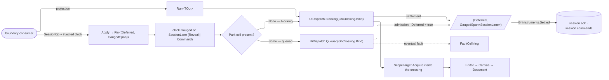

# [RASM_GRASSHOPPER_SHELL_SESSION]

`GhSession` owns the Grasshopper session boundary — live editor, canvas, and document acquisition; UI-thread command execution over the kernel crossing family; gauged command acknowledgements; and form release. `GhSession.Apply` closes command-shaped host work over one `SessionOp` union, while `Run<TOut>` bounds value projections to one kernel marshal. Generated case operations identify commands, a queued span proves admission only, a blocking span proves settlement, and every live scope is reacquired inside the crossing that consumes it — the scope-binding wrapper (E-G53) puts acquisition INSIDE the kernel `UiDispatch` body, so no case ever closes over a pre-acquired scope.

Session clock is the folder's ONE injected `MonotonicTimeline` (folder RULINGS `[02]`) — `Apply` takes it REQUIRED and settles a `GaugedSpan<SessionLane>`, never a stored stamp pair; the former per-call timeline mint, the `Order`/`Elapsed` stamp arithmetic, and the hand-rolled stamp-order claim all delete with it. Cache module is DELETED whole: `DocumentToken`, `CacheSlot`, `SlotPolicy`, `SessionCache`, and the `PlatformCache` app-root block had zero consumers (E-G12); `Platform/composition.md` records the standing obligations any future cached carrier re-mints under.

## [01]-[INDEX]

- [02]-[SCOPE]: `GhScope` + `ScopeTarget` + `GhCrossing` — acquisition rows over the live editor, canvas, and document chain, and the scope-binding crossing wrapper.
- [03]-[OPERATOR]: `RepaintPlan` + `SessionOp` + `SessionLane` + `GhSession` — generated session commands, repaint plans, gauged acknowledgements, and bounded projections.

## [02]-[SCOPE]

- Owner: `ScopeTarget` carries three acquisition rows over one `Acquire()` column: `EditorHost` reads `Editor.Instance`, `CanvasHost` continues through `Editor.Canvas`, and `DocumentHost` continues through `Canvas.Document`. Every hop null-gates to `KernelFault.MissingContext`. `GhScope` closes the corresponding editor, canvas, and document cases and derives optional projections by total case dispatch. `GhCrossing.Bind` is the scope-binding wrapper (E-G53): it closes acquisition INSIDE a `Func<Fin<TOut>>` body any kernel `UiDispatch<TOut>` case wraps — `Current`, `Blocking`, `Pumped`, `Awaited`, or `Queued` — so the five crossing postures share one acquisition law and a pre-acquired scope smuggled across a crossing is unconstructible.
- Entry: acquisition is internal to `GhSession` — a consumer names a `ScopeTarget` row and receives the projected value or the gauged span; no public `Acquire` exists, so scope choreography never leaks past the gate.
- Law: acquisition and consumption share one marshal window. `Run<TOut>` admits only detached values or explicitly owned leases as outputs; returning a borrowed `GhScope`, `Editor`, `Canvas`, or `Document` reference violates the boundary even though the generic carrier cannot encode that prohibition.
- Boundary: shell chrome remains `Shell/editor.md`; reveal uses the public `Editor.ShowEditor(bool, string)` surface, which creates the editor when absent and makes an existing hidden editor visible.
- Packages: Grasshopper2 (`Editor.Instance`, `Editor.Canvas`, `Editor.ShowEditor`, `Canvas.Document`), `Rasm.Interaction` (`UiDispatch`, `UiThread`, `DispatchLane`), LanguageExt.Core, `Rasm.Domain`.
- Growth: a new host anchor (a hosted panel root, a floating canvas) is one `ScopeTarget` row with one `GhScope` case; the acquisition column, the wrapper, and the gates never widen.

## [03]-[OPERATOR]

- Owner: `SessionOp` `[Union]` closes reveal, execute, repaint, style, focus, and release. `RepaintPlan` `[Union]` carries exact host policy as case shape: `InvalidateCase` calls `Control.Invalidate`, `ScheduledCase` calls `ScheduleRedraw()`, and `DeferredCase(TimeSpan)` carries the nonnegative delay `ScheduleRedraw(TimeSpan)` requires — the delay lives ON the one case that reads it, so the option-plus-guard machinery two delay-free rows carried is unconstructible. `ExecuteCase(ScopeTarget Target, DispatchLane Lane, Action<GhScope> Work, Option<FaultCell> Park)` selects its crossing posture by PAYLOAD PRESENCE: `None` rides the blocking sync crossing and the span proves settlement; `Some(cell)` rides the kernel `Queued` async crossing, the span proves admission only, and the eventual settlement fault PARKS on the supplied cell — a queued execute without a place for its fault to land is unconstructible, so no deferred failure can vanish.
- Owner: `SessionLane` `[SmartEnum<int>]` `IGaugeLane<SessionLane>` — the session gauge vocabulary: `Reveal` (editor creation is the slow path and carries the larger budget) and `Command` (every other verb). `Apply` answers the `Deferred` discriminator beside the `GaugedSpan<SessionLane>` — entry, acknowledgement, latency, and the budget verdict all derive from the kernel gauge, and the caller already holds the case it applied. For blocking commands, acknowledgement follows host settlement. For queued execution, acknowledgement follows queue admission and never claims that the deferred body succeeded.
- Entry: `GhSession.Apply(SessionOp op, MonotonicTimeline clock)` → `Fin<(bool Deferred, GaugedSpan<SessionLane> Span)>` — the command gate, the clock the session's injected timeline, REQUIRED; `GhSession.Run<TOut>(ScopeTarget target, Func<GhScope, Fin<TOut>> project)` → `Fin<TOut>` — the value gate. Two gates, two shapes of demand (settlement versus projection); everything else on the page is internal.
- Law: every blocking case acquires and mutates inside one kernel `UiThread.Run` window through the bound crossing. Queued `ExecuteCase` validates its target, lane, work, and park cell before admission, then reacquires scope inside the eventual crossing body. `Run` performs acquisition and projection inside one blocking crossing.
- Law: every case body runs under `Try.lift`. Failed blocking command or refused queue admission returns its fault without a span. Queued admission answers `Deferred = true`; a deferred settlement fault parks on the case's own `FaultCell` with the command's op, so the cell's ring is the queued-outcome stream and no fault is rewritten as successful settlement.
- Law: `Apply` writes `GhInstruments.Settled` after the gauge closes — the document tag the scope the case acquired when it acquired one, and a refused write rides the returned result — so `session.ack` and `session.commands` partition on the six cases at the one site that knows them.
- Law: `ReleaseCase` is the one teardown spelling — `Form.Close` executes inside the lease window, the `Owned` fold disposes after projection even when close faults, and `Borrowed` closes without disposing the host-owned form.
- Boundary: repaint plans target the GH2 canvas; the flex-interface redraw (`IFlexControl.ScheduleRedraw`) on non-canvas flex controls is `Canvas/canvas.md`'s operator, and the paint fences are `Canvas/paint.md`'s executor. Undo grouping (`History.Do` + `ActionList`) rides `Document/history.md`; a session command never opens an undo record. `Shell/telemetry.md` declares the `rasm.grasshopper.session.*` rows; this page writes them through `GhInstruments.Settled` and spells no meter.
- Packages: Grasshopper2 (`Canvas.ScheduleRedraw`, `Editor.ShowEditor`), Eto (`Control.Invalidate`, `Control.Focus`, `Form.Close`), Rhino.UI (`EtoExtensions.UseRhinoStyle`), `Rasm.Domain` (`Fault`, `Lease<T>`, `ValidityClaim`), `Rasm.Parametric` (`MonotonicTimeline`, `Gauged`, `GaugedSpan`, `IGaugeLane`), `Rasm.Interaction` (`UiThread`, `UiDispatch`, `DispatchLane`, `FaultCell`).
- Growth: a new session verb is one `SessionOp` case and one total `Switch` arm; a new repaint posture is one `RepaintPlan` case; a new budget band is one `SessionLane` row.

```csharp
// --- [IMPORTS] -------------------------------------------------------------------------
using Rasm.Domain;
using Rasm.Interaction;
using Rasm.Parametric;
using Rhino.UI;

namespace Rasm.Grasshopper.Shell;

// --- [TYPES] ---------------------------------------------------------------------------
[Union]
public abstract partial record GhScope {
    private GhScope() { }
    public sealed record EditorCase(Editor Shell) : GhScope;
    public sealed record CanvasCase(Canvas Surface) : GhScope;
    public sealed record DocumentCase(Document Graph, Canvas Surface) : GhScope;
    public Option<Editor> Editor => Switch(
        editorCase: static c => Some(c.Shell),
        canvasCase: static _ => Option<Editor>.None,
        documentCase: static _ => Option<Editor>.None);
    public Option<Canvas> Canvas => Switch(
        editorCase: static c => Optional(c.Shell.Canvas),
        canvasCase: static c => Some(c.Surface),
        documentCase: static c => Some(c.Surface));
    public Option<Document> Document => Switch(
        editorCase: static c => Optional(c.Shell.Canvas).Bind(static surface => Optional(surface.Document)),
        canvasCase: static c => Optional(c.Surface.Document),
        documentCase: static c => Some(c.Graph));
}

[SmartEnum<int>]
public sealed partial class ScopeTarget {
    public static readonly ScopeTarget EditorHost = new(key: 0, acquire: static key =>
        Optional(Editor.Instance).ToFin(new KernelFault.MissingContext()).Map(static shell => (GhScope)new GhScope.EditorCase(Shell: shell)));
    public static readonly ScopeTarget CanvasHost = new(key: 1, acquire: static key =>
        from shell in Optional(Editor.Instance).ToFin(new KernelFault.MissingContext())
        from surface in Optional(shell.Canvas).ToFin(new KernelFault.MissingContext())
        select (GhScope)new GhScope.CanvasCase(Surface: surface));
    public static readonly ScopeTarget DocumentHost = new(key: 2, acquire: static key =>
        from shell in Optional(Editor.Instance).ToFin(new KernelFault.MissingContext())
        from surface in Optional(shell.Canvas).ToFin(new KernelFault.MissingContext())
        from graph in Optional(surface.Document).ToFin(new KernelFault.MissingContext())
        select (GhScope)new GhScope.DocumentCase(Graph: graph, Surface: surface));
    [UseDelegateFromConstructor] internal partial Fin<GhScope> Acquire();
}

[Union]
public abstract partial record RepaintPlan {
    private RepaintPlan() { }
    public sealed record InvalidateCase : RepaintPlan;
    public sealed record ScheduledCase : RepaintPlan;
    public sealed record DeferredCase(TimeSpan Delay) : RepaintPlan;
}

[Union]
public abstract partial record SessionOp {
    private SessionOp() { }
    public sealed partial record RevealCase(Option<string> Layout) : SessionOp;
    public sealed partial record ExecuteCase(ScopeTarget Target, DispatchLane Lane, Action<GhScope> Work, Option<FaultCell> Park) : SessionOp;
    public sealed partial record RepaintCase(RepaintPlan Plan) : SessionOp;
    public sealed partial record StyleCase(Control Surface) : SessionOp;
    public sealed partial record FocusCase(Control Surface) : SessionOp;
    public sealed partial record ReleaseCase(Lease<Form> Surface) : SessionOp;
}

[SmartEnum<int>]
public sealed partial class SessionLane : IGaugeLane<SessionLane> {
    public static readonly SessionLane Reveal = new(key: 0);
    public static readonly SessionLane Command = new(key: 1);
}

// --- [OPERATIONS] ----------------------------------------------------------------------
internal static class GhCrossing {
    internal static Func<Fin<TOut>> Bind<TOut>(ScopeTarget target, Func<GhScope, Fin<TOut>> body) =>
        () => target.Acquire().Bind(scope => Try.lift(() => body(arg: scope)).Run().Bind(static inner => inner));
}

public static class GhSession {
    private static readonly HookId Hook = HookId.Create(value: "rasm.grasshopper.shell.session");

    public static Fin<TOut> Run<TOut>(ScopeTarget target, Func<GhScope, Fin<TOut>> project) {
        return from row in Admit.Need(target)
               from valid in Admit.Need(project)
               from output in UiThread.Run(
                   new UiDispatch<TOut>.Blocking(GhCrossing.Bind(target: row, body: valid)),
                   DispatchLane.Interactive)
               select output;
    }

    public static Fin<(bool Deferred, GaugedSpan<SessionLane> Span)> Apply(SessionOp op, MonotonicTimeline clock) {
        return Admit.Need().Bind(valid =>
            from gauged in clock.Gauged<(bool Deferred), SessionLane>(
                lane: valid is SessionOp.RevealCase ? SessionLane.Reveal : SessionLane.Command,
                work: active,
                body: () => valid.Switch(
                    state: active,
                    revealCase: static (k, c) => UiThread.Run(new UiDispatch<Unit>.Blocking(() =>
                        Try.lift(() => Editor.ShowEditor(
                            createVisible: true,
                            layoutRules: HostEdge.Slot(c.Layout))).Run().Bind(static inner => inner),
                        DispatchLane.Interactive, k)
                        .Map(static _ => false),
                    executeCase: static (k, c) =>
                        from target in Admit.Need(c.Target)
                        from lane in Admit.Need(c.Lane)
                        from work in Admit.Need(c.Work)
                        from admitted in c.Park.Match(
                            Some: cell => Try.lift(() => {
                                ValueTask<Fin<Unit>> eventual = UiThread.Run(
                                    new UiDispatch<Unit>.Queued(GhCrossing.Bind<Unit>(
                                        target: target,
                                        body: scope => Fin.Succ(HostEdge.Side(action: () => work(obj: scope))),
                                        key: k)),
                                    lane, k);
                                return Fin.Succ(HostEdge.Side(action: () => ignore(SettleDeferred(eventual, cell, k))));
                            }).Run().Bind(static inner => inner),
                            None: () => UiThread.Run(
                                new UiDispatch<Unit>.Blocking(GhCrossing.Bind<Unit>(
                                    target: target,
                                    body: scope => Fin.Succ(HostEdge.Side(action: () => work(obj: scope))),
                                    key: k)),
                                lane, k))
                        select c.Park.IsSome,
                    repaintCase: static (k, c) => UiThread.Run(new UiDispatch<Unit>.Blocking(GhCrossing.Bind<Unit>(
                            target: ScopeTarget.CanvasHost,
                            body: scope => scope.Canvas.ToFin(new KernelFault.MissingContext()).Bind(surface => c.Plan.Switch(
                                state: (Surface: surface, Key: k),
                                invalidateCase: static (s, _) => Try.lift(() => s.Surface.Invalidate()).Run().Bind(static inner => inner),
                                scheduledCase: static (s, _) => Try.lift(() => s.Surface.ScheduleRedraw()).Run().Bind(static inner => inner),
                                deferredCase: static (s, p) =>
                                    from admitted in guard(p.Delay >= TimeSpan.Zero, (Error)new KernelFault.InvalidInput()).ToFin()
                                    from painted in Try.lift(() => s.Surface.ScheduleRedraw(p.Delay)).Run().Bind(static inner => inner)
                                    select painted)),
                            key: k)),
                            DispatchLane.Interactive, k)
                        .Map(static _ => false),
                    styleCase: static (k, c) =>
                        from surface in Admit.Need(c.Surface)
                        from styled in UiThread.Run(new UiDispatch<Unit>.Blocking(() =>
                            Try.lift(surface.UseRhinoStyle).Run().Bind(static inner => inner)),
                            DispatchLane.Interactive, k)
                        select false,
                    focusCase: static (k, c) =>
                        from surface in Admit.Need(c.Surface)
                        from focused in UiThread.Run(new UiDispatch<Unit>.Blocking(() =>
                            Try.lift(surface.Focus).Run().Bind(static inner => inner)),
                            DispatchLane.Interactive, k)
                        select false,
                    releaseCase: static (k, c) =>
                        from surface in Admit.Need(c.Surface)
                        from released in UiThread.Run(new UiDispatch<Unit>.Blocking(() => Try.lift(() =>
                            Fin.Succ(surface.Use(project: static form => HostEdge.Side(action: form.Close)))).Run().Bind(static inner => inner)),
                            DispatchLane.Interactive, k)
                        select false),
                key: active)
            from outcome in gauged.Value
            from written in GhInstruments.Settled(document: None, operation: outcome.Operation, deferred: outcome.Deferred, span: gauged.Span)
            select (outcome.Deferred, gauged.Span));
    }

    private static async Task SettleDeferred(ValueTask<Fin<Unit>> eventual, FaultCell faults) {
        Fin<Unit> settled = await Try.lift(async _ => await eventual.ConfigureAwait(false)).Run().Bind(static inner => inner);
        settled.IfFail(cause => ignore(faults.Park(point: Hook, cause: cause)));
    }
}
```



## [04]-[DENSITY_BAR]

| [INDEX] | [CONCERN]         | [OWNER]                   | [RESULT]                              | [CASES] |
| :-----: | :---------------- | :------------------------ | :------------------------------------ | :-----: |
|  [01]   | scope acquisition | `ScopeTarget` + `GhScope` | `Acquire → Fin<GhScope>` (internal)   |  3 + 3  |
|  [02]   | crossing binding  | `GhCrossing.Bind`         | one wrapper, five kernel postures     |    1    |
|  [03]   | repaint plans     | `RepaintPlan`             | cases inside `RepaintCase`            |    3    |
|  [04]   | session commands  | `SessionOp`               | `Apply → Fin<(Deferred, Span)>`       |    6    |
|  [05]   | gauge vocabulary  | `SessionLane`             | `GaugedSpan<SessionLane>` per command |    2    |
|  [06]   | value projection  | `GhSession.Run<TOut>`     | one blocking crossing                 |    1    |

Kernel `UiThread`/`UiDispatch`/`DispatchLane`/`FaultCell`, `MonotonicTimeline`/`Gauged`, `Fault`, `Lease<T>`, and `ValidityClaim` are composed upstream owners. Deleted whole: the per-call timeline mint, the stamp-pair record with its `Order`/`Elapsed` arithmetic and hand-rolled order claim, the settled-operation column (the caller holds the case; `Span.Work` is the key) (the `MonotonicTimeline.Order → Fin<StampOrder>` consumer-break at the former `:138` clears by deletion — no caller remains), the `RepaintRow` option-plus-guard machinery, the `EtoDispatch`/`DispatchEcho` marshal (queued outcomes now park on the case's own `FaultCell`), and the whole cache module — `DocumentToken`, `CacheSlot`, `SlotPolicy`, `SessionCache`, `PlatformCache` — with zero consumers (E-G12); its standing re-mint obligations live at `Platform/composition.md`'s cache boundary row.

## [05]-[RESEARCH]

<!-- source-only: research row template:
[TOKEN]-[OPEN|BLOCKED]: <exact question>; <verification route>.
-->

(none)
