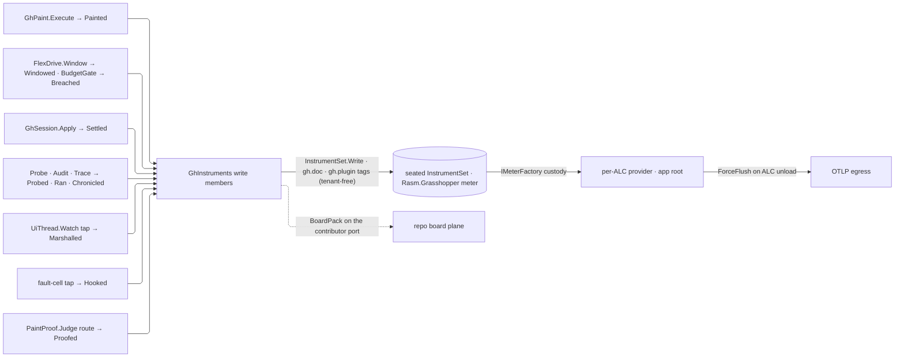

# [RASM_GRASSHOPPER_SHELL_TELEMETRY]

`GhTelemetry` owns the boundary's telemetry admission: one injected `IMeterFactory` mints the `Rasm.Grasshopper` meter, the kernel `InstrumentSet` over `GhInstruments.Rows` and the admitted logger factory seat on one per-load-context cell, and every producing page writes its own UCUM-named `rasm.grasshopper.*` instrument through `GhInstruments` at the site that settles the fact, carrying document and plugin attribution. Providers, exporters, views, and unload custody stay at the app root, so the folder holds zero OpenTelemetry reference.

Every declaration composes the KERNEL telemetry module as found: instrument rows are `InstrumentSpec.Create` values, handle custody is `InstrumentSet`, bucket advice is the kernel `Buckets` ladder roster, sensitivity is the kernel `Sensitivity` taxonomy (S1-41 — the folder's byte-identical four-row twin deleted), tags mint through the TENANT-FREE `InstrumentSet.Tags` arity (S1-44), the ambient seat is the kernel `Cell.Seat` token custody (S1-42), and every latency objective pins its ceiling ON its instrument's declared bucket ladder (S1-43 — a ceiling off the ladder grades a flat zero forever).

## [01]-[INDEX]

- [02]-[CUSTODY]: injected factory admission, per-ALC unload custody, classification law, and the app-root obligation set
- [03]-[ROSTER]: instrument rows, bucket advice, the board pack over them, and the write-site-to-instrument table
- [04]-[WRITES]: per-lane write members over the seated set and the attribution tag law

## [02]-[CUSTODY]

- Owner: `GhTelemetry` — the composition capsule pairing the factory-owned instrument spine with logger admission. `Of` mints the `Rasm.Grasshopper` meter through `IMeterFactory.Create(MeterOptions)` exactly once, stamping the composing plugin's identity as a meter-scope tag, hands it to the kernel `InstrumentSet` that owns every handle and the write path, and seats that set beside the logger factory on the one per-ALC cell `GhInstruments` and `GhLog` read.
- Entry: `GhTelemetry.Of(IMeterFactory factory, HookScope plugin, Option<ILoggerFactory> logs = default, Option<string> version = default)` → `Fin<GhTelemetry>` — the one admission gate; `Instruments` and `Logs` are the two capability slots the capsule holds.
- Law: plugin identity is the typed `Shell/hooks.md` `HookScope` — the one process-global plugin key the `(point, scope)` hook registry and the `gh.plugin` meter tag share by construction, so the two per-plugin surfaces cannot fork their key space.
- Law: the injected factory is the sole per-ALC meter lifetime owner — a composing plugin passes its `PluginTelemetryHost.Meters`, and `AssemblyLoadContext.Unloading` drives the host's `ForceFlush`-then-`Dispose` on both providers, so no instrument outlives its plugin and an unload never drops the tail of an export batch.
- Law: `GhTelemetry.Dispose` releases the seat only — disposing the minted meter here competes with provider custody.
- Law: meter-scope tags are TENANT-FREE (S1-44) — this boundary mints every tag through the kernel's tenant-free `Tags` arity, `gh.plugin` is plugin identity, and no account or tenant identity enters a meter tag; the tenant-bearing arity is the fabrication module's and composing it here stamps a tenant this host never has.
- Law: a composition that runs logger-less takes `NullLoggerFactory.Instance` through the `Option` default, never a nullable factory.
- Law: fault-family `[LoggerMessage]` partials live beside their retaining owners — `Canvas/paint.md` `PaintLog`, `Canvas/interaction.md` `InteractionLog`, `Shell/journal.md` `JournalLog`, `Platform/native.md` `NativeLog`, `Platform/capture.md` `CaptureLog` — and resolve their `ILogger` through `GhLog.For` at the fault-record site, so a retained fault emits once when it lands and no consumer polls a `LastFault` cell; a new log class lands its classification sweep in the same pass or it does not land.
- Law: every boundary log payload parameter carries its classification — the kernel `Sensitivity` rows (S1-41) attach as `[UserContent]`/`[HostPath]`/`[MachineIdentity]`/`[AccountIdentity]` parameter attributes on the log partials, so the fail-closed app-root redactor sees every sensitive value and an unclassified boundary line never crosses the export boundary invisible; the attach seats at this producer because only the boundary knows a payload embeds user content or a host path.
- Law: two classification rules cover the roster — every `detail` parameter is an `Error.Message` off arbitrary consumer callbacks, preserved host throws, or capture faults (window titles, file paths, user-typed text) and classifies `[UserContent]`; a stall's `operation` parameter is a caller-supplied name spelling member identity and classifies `[MachineIdentity]`. Bounded vocabulary keys (`source` row keys, `lane`, measurements) stay unclassified operational values.
- Law: `Sensitivity.Values` rides the contributor port's `Classifications` column, so every classification value this boundary attaches is rostered at composition and a value present here and absent at the root refuses at admission instead of erasing at egress.
- Law: the seat is the per-load-context ambient cell under the kernel `Cell.Seat` token custody (S1-42) — `Of` seats its set and factory only while the seat is free and holds the token, a later capsule keeps its own `Instruments`/`Logs` without overwriting the live binding, and `Dispose` clears the seat only through its own token, so disposing one capsule never disables another still-live one; collectible plugin ALCs isolate the static per plugin, an unbound context logs into the null logger and answers every write `unit` at zero cost.
- Law: `GhFault`-raising Components pages take `ILogger` by injection alone because the island imports no UI-thread sibling.
- Law: two co-resident plugins each `Of` over their own per-ALC factory, so identical `rasm.grasshopper.*` instrument names stay isolated by provider scope and the `gh.plugin` meter tag attributes each series to its composing plugin.
- Boundary: app roots mint the string-scoped `TelemetryContributorPort` with `Scope` `Rasm.Grasshopper`, an empty `Instruments` seq, `GhInstruments.Rows` on `Published`, `Sensitivity.Values` on `Classifications`, and `GhInstruments.Board` on the pack column — the two roster columns split by WHO MOUNTS, so a root binds no handle for a per-ALC row and a roster on neither column exports streams the branch naming gate never proves, while pack admission resolves against the port's own declaration so a self-minting contributor proves its board exactly as a mounted one does.
- Boundary: this roster CREATES instruments on the injected per-ALC meter, so `SignalGovernance.Views` reads these streams on its foreign arm and derives each stream's tag keys from the published row's own `Dimensions`.
- Boundary: app-root obligations — the provider admits the `Rasm.Grasshopper` meter by name; sampler, exemplar filter, views, cardinality caps, and OTLP egress bind at the provider; this folder writes instruments, never provider registrations.
- Packages: BCL inbox (`System.Diagnostics.Metrics` — `IMeterFactory`, `MeterOptions`, `Meter`), Microsoft.Extensions.Logging.Abstractions (`ILoggerFactory`, `NullLoggerFactory`), Microsoft.Extensions.Compliance.Abstractions (`DataClassification`, `DataClassificationAttribute` — the classification grammar; the redactor executes at the app root alone, and the csproj row names THIS abstractions package, not the root-only Redaction package), LanguageExt.Core, `Rasm.Domain` (`InstrumentSpec`, `InstrumentKind`, `MeasureForm`, `InstrumentSet`, `Buckets`, `LevelCells`, `BoardPack`, `PanelSpec`, `Objective`, `Sli`, `Sensitivity`, `ClassifiedValue`, `Cell`), `Shell/hooks.md` (`HookScope`).
- Growth: a new capability slot on the capsule is one property with its admission default; a new attribution axis is one meter-scope tag at the mint.

## [03]-[ROSTER]

- Owner: `GhInstruments.Rows` — the kernel `InstrumentSpec.Create` declarations the capsule mounts through `InstrumentSet.Of` and publishes on its port; each row names its own kind and `MeasureForm`, so the kernel (kind × form) bind derivation spells every create and this page spells none, and the duration histograms carry the kernel `Buckets.CanvasFrameSeconds` and `Buckets.AckSeconds` advice rows as the explicit-bucket fallback a backend without base2-exponential histograms reads.
- Owner: `GhInstruments.Board` — the folder's one kernel `BoardPack`, binding a panel per published row beside the three reliability objectives that grade canvas interactivity, marshal latency, and command acknowledgement — solution-object survival stays unmeasured because `SolutionRecord`'s per-object counters are host structural zeros no objective can grade.
- Law: instrument identity de-duplicates by name inside the meter, so name, unit, description, bound policy, and tag vocabulary are declaration facts spelled once ON THE ROW and every mint and every governance read projects from it; units are UCUM (`s`, `{mark}`, `{command}`) and never pre-baked into the name.
- Law: `Head` is the folder's one name segment — every instrument name and the `OpSlot` tag key concatenate it at compile time, so a segment rename moves one const; `gh.doc` and `gh.plugin` are the folder's compact attribution pair spelled whole by declaration, outside the name prefix. FAULT axes take NO segment: allocating owner and recovery posture are repo-wide facts, so `hook.faults` mounts the kernel `KernelInstrument.OwnerSlot`/`PostureSlot` and writes the kernel `Retriability.Key` value — a `<segment>.fault.*` twin forks one dimension into a per-package pair, and no board then groups a contained canvas fault beside the kernel fault it descends from.
- Law: every row is a projection of a typed result already settled at its producing site — a metric minted beside this roster is a second truth, and a result column no row projects stays on the result by declaration.
- Law: the write table is the closed result-to-instrument correspondence; a new projected column is one table row, one instrument declaration, and one write-member edit, never a call-site meter mint.
- Law: instrument names, tag keys, and the dimension VALUES an objective partitions on are consts the roster, every write member, and every pack row read, so a rename moves one line and a partition indicator can never grade a value no write produces.
- Law: every tag axis carries a BOUNDED value space or it is not an axis — `op` admits only the generated case identity, so `session.ack` and `session.commands` partition on the six `SessionOp` cases and nothing else. A caller-supplied name is per-entry-point identity, not a dimension: stamping `PaintTally.Operation` or a dispatch pulse's operation mints one series per calling member and the app root's cardinality caps then decide which paint runs a board can see. Those results keep their free-form reaching the log line where an unbounded key costs nothing, while their streams partition on the bounded axes they already carry — `gh.doc` for paint and `lane` for the marshal.
- Law: a latency objective's ceiling IS a declared bucket bound of its instrument's own advice ladder (S1-43) — the kernel pack admission proves it, so the frame objectives pin at the `CanvasFrameSeconds` ladder's `0.017` bound (the 60 Hz bucket) and the acknowledgement objective at the `AckSeconds` ladder's `0.1` bound; a free-literal ceiling off the ladder grades a flat zero forever because every sample lands under or over the phantom bound, and `dispatch.body` therefore carries the FRAME ladder, because its budget is frame-relative and its objective must pin on the same ladder it advises.
- Law: one board tile is one `PanelSpec` row and one reliability target one `Objective` row on the same pack; a hand-built dashboard or an alert rule authored beside the pack is the drift the carriage deletes.

Instrument cells and folder-owned tag cells extend the `rasm.grasshopper.` prefix; a key outside the module namespace spells whole, and the owner and posture cells name the kernel `rasm.fault.*` slots this roster composes rather than mints.

| [INDEX] | [WRITE]                    | [INSTRUMENT]       | [UNIT]        | [KIND]         | [TAGS]                     |
| :-----: | :------------------------- | :----------------- | :------------ | :------------- | :------------------------- |
|  [01]   | `Painted` gauged span      | `paint.duration`   | `s`           | `Distribution` | `gh.doc`                   |
|  [02]   | `Painted` per disposition  | `paint.marks`      | `{mark}`      | `Count`        | `gh.doc`, `disposition`    |
|  [03]   | `Windowed`                 | `frame.window`     | `s`           | `Distribution` | `gh.doc`                   |
|  [04]   | `Pulsed` seven phase spans | `frame.phase`      | `s`           | `Distribution` | `gh.doc`, `phase`          |
|  [05]   | `Settled` gauged span      | `session.ack`      | `s`           | `Distribution` | `gh.doc`, `op`, `deferred` |
|  [06]   | `Settled` per command      | `session.commands` | `{command}`   | `Count`        | `gh.doc`, `op`, `deferred` |
|  [07]   | `Probed`                   | `solution.invalid` | `{parameter}` | `Distribution` | `gh.doc`                   |
|  [08]   | `Ran` per completed run    | `solution.runs`    | `{run}`       | `Count`        | `gh.doc`, `culmination`    |
|  [09]   | `Chronicled` per pulse row | `solution.pulses`  | `{pulse}`     | `Count`        | `gh.doc`, `signal`         |
|  [10]   | `Dropped` per shed fact    | `drain.dropped`    | `{fact}`      | `Count`        | `source`                   |
|  [11]   | `Marshalled` span          | `dispatch.body`    | `s`           | `Distribution` | `lane`                     |
|  [12]   | `Marshalled` breach        | `dispatch.stalls`  | `{stall}`     | `Count`        | `lane`                     |
|  [13]   | `Breached` per breach      | `frame.breach`     | `{breach}`    | `Count`        | `gh.doc`, `gate`           |
|  [14]   | `Hooked` subscriber fault  | `hook.faults`      | `{fault}`     | `Count`        | `point`, owner, posture    |
|  [15]   | `Proofed` non-bearing      | `capture.breach`   | `{breach}`    | `Count`        | `gh.doc`, `lane`           |

- Boundary: write sites are the producing owners — `Canvas/paint.md` `GhPaint.Execute` (`Painted`), `Canvas/motion.md` `FlexDrive.Window` and the `BudgetGate` breach consumer (`Windowed`, `Breached`), `Canvas/canvas.md` `CanvasQuery.Pulse` (`Pulsed`), `Shell/session.md` `GhSession.Apply` (`Settled`), `Document/solution.md` `Probe`/`Audit`/`Trace` (`Probed`/`Ran`/`Chronicled`), the kernel `UiThread.Watch` pulse tap (`Marshalled`), the dispatch's fault-cell tap (`Hooked`), `Shell/journal.md` `Mount`'s shed accounting (`Dropped`), and the composition's `PaintProof.Judge` route (`Proofed`).
- Growth: a new instrument is one `Rows` declaration and one write member, the handle deriving; a new bucket policy is one kernel `Buckets` row; a per-phase or per-disposition family is one instrument with a tag axis, never sibling instruments per value; a new board tile is one `PanelSpec` and a new reliability target one `Objective` on the same pack.

## [04]-[WRITES]

- Owner: `GhInstruments` — the folder's one instrument owner: the roster, the board, and one write member per producing lane, each folding its result's columns into `InstrumentSet.Write` calls over the seated set.
- Entry: every write member answers `Fin<Unit>` — `unit` when no capsule is seated, the kernel write path's refusal otherwise — so a producer binds it into its own result and an unmounted name or a family mismatch rides that result to the producer's `FaultCell` instead of vanishing into a void write.
- Law: document attribution is result-owned — a document-scoped write takes the host `Document.Identity` guid and stamps `gh.doc = {documentId:N}`; `Settled` and `Pulsed` take `Option<Guid>` because a session command and a canvas pulse settle without a document, and an absent tag reads as the untagged whole; `Dropped`, `Marshalled`, and `Hooked` are process-scoped and carry no document, because a shed fact's document identity died with the fact.
- Law: per-document tag fan-out is bounded by open documents, and the app-root views own cardinality caps; a write never re-validates its result — the typed owner already admitted it, and `IsValid` stays the acceptance oracle at the producing boundary.
- Boundary: kernel marshal latency arrives as `DispatchPulse` from the `UiThread.Watch` tap; each hook `IsolatedFault` enters `Hooked` whole, so point, locally derived owner, and recursive recovery posture project without losing its `Error`.
- Packages: BCL inbox, LanguageExt.Core, `Rasm.Domain` (`InstrumentSet`, `KernelInstrument`, `Redrive`), `Rasm.Interaction` (`DispatchPulse`, `IsolatedFault`), `Rasm.Parametric` (`GaugedSpan`), `Canvas/paint.md`/`Canvas/motion.md`/`Canvas/canvas.md`/`Document/document.md`/`Document/solution.md`/`Platform/capture.md` result owners.
- Growth: a new lane is one write member with its roster row; a new tag axis on an existing write is one `Tag` pair inside the member.

```csharp
// --- [IMPORTS] -------------------------------------------------------------------------
using System.Diagnostics.Metrics;
using Microsoft.Extensions.Compliance.Classification;
using Microsoft.Extensions.Logging;
using Microsoft.Extensions.Logging.Abstractions;
using Rasm.Domain;
using Rasm.Grasshopper.Canvas;
using Rasm.Grasshopper.Document;
using Rasm.Grasshopper.Platform;
using Rasm.Interaction;
using Rasm.Parametric;

namespace Rasm.Grasshopper.Shell;

// --- [TYPES] ---------------------------------------------------------------------------
public sealed class UserContentAttribute() : DataClassificationAttribute(
    new DataClassification(Sensitivity.Taxonomy, Sensitivity.UserContent.Key));
public sealed class HostPathAttribute() : DataClassificationAttribute(
    new DataClassification(Sensitivity.Taxonomy, Sensitivity.HostPath.Key));
public sealed class MachineIdentityAttribute() : DataClassificationAttribute(
    new DataClassification(Sensitivity.Taxonomy, Sensitivity.MachineIdentity.Key));
public sealed class AccountIdentityAttribute() : DataClassificationAttribute(
    new DataClassification(Sensitivity.Taxonomy, Sensitivity.AccountIdentity.Key));

// --- [SERVICES] ------------------------------------------------------------------------
public static class GhInstruments {
    internal const string MeterName = "Rasm.Grasshopper";

    private const string Head = "rasm.grasshopper.";

    private const string DocSlot = "gh.doc";
    private const string OpSlot = Head + "op";
    private const string DispositionSlot = "disposition";
    private const string PhaseSlot = "phase";
    private const string DeferredSlot = "deferred";
    private const string CulminationSlot = "culmination";
    private const string SignalSlot = "signal";
    private const string SourceSlot = "source";
    private const string LaneSlot = "lane";
    private const string GateSlot = "gate";
    private const string PointSlot = "point";

    private const string DrawnValue = "drawn";
    private const string CulledValue = "culled";
    private const string RefusedValue = "refused";

    public const string PaintDuration = Head + "paint.duration";
    public const string PaintMarks = Head + "paint.marks";
    public const string FrameWindowStream = Head + "frame.window";
    public const string FramePhase = Head + "frame.phase";
    public const string SessionAck = Head + "session.ack";
    public const string SessionCommands = Head + "session.commands";
    public const string SolutionInvalid = Head + "solution.invalid";
    public const string SolutionRuns = Head + "solution.runs";
    public const string SolutionPulses = Head + "solution.pulses";
    public const string DrainDropped = Head + "drain.dropped";
    public const string DispatchBody = Head + "dispatch.body";
    public const string DispatchStalls = Head + "dispatch.stalls";
    public const string FrameBreach = Head + "frame.breach";
    public const string CaptureBreaches = Head + "capture.breach";
    public const string HookFaults = Head + "hook.faults";

    public static readonly Seq<InstrumentSpec> Rows = Seq(
        InstrumentSpec.Create(PaintDuration, InstrumentKind.Distribution, MeasureForm.Real, "s",
            "Paint plan execution wall time per pass.", Seq(DocSlot), Some(Buckets.CanvasFrameSeconds), None, None),
        InstrumentSpec.Create(PaintMarks, InstrumentKind.Count, MeasureForm.Whole, "{mark}",
            "Paint marks by disposition, drawn against culled.", Seq(DocSlot, DispositionSlot), None, None, None),
        InstrumentSpec.Create(FrameWindowStream, InstrumentKind.Distribution, MeasureForm.Real, "s",
            "Motion draw-window cost per sampled frame.", Seq(DocSlot), Some(Buckets.CanvasFrameSeconds), None, None),
        InstrumentSpec.Create(FramePhase, InstrumentKind.Distribution, MeasureForm.Real, "s",
            "Canvas frame cost per paint phase.", Seq(DocSlot, PhaseSlot), Some(Buckets.CanvasFrameSeconds), None, None),
        InstrumentSpec.Create(SessionAck, InstrumentKind.Distribution, MeasureForm.Real, "s",
            "Session command acknowledgement latency.", Seq(DocSlot, OpSlot, DeferredSlot), Some(Buckets.AckSeconds), None, None),
        InstrumentSpec.Create(SessionCommands, InstrumentKind.Count, MeasureForm.Whole, "{command}",
            "Session commands by operation and posture.", Seq(DocSlot, OpSlot, DeferredSlot), None, None, None),
        InstrumentSpec.Create(SolutionInvalid, InstrumentKind.Distribution, MeasureForm.Whole, "{parameter}",
            "Invalid parameter count per solution probe.", Seq(DocSlot), None, None, None),
        InstrumentSpec.Create(SolutionRuns, InstrumentKind.Count, MeasureForm.Whole, "{run}",
            "Completed solution runs by culmination.", Seq(DocSlot, CulminationSlot), None, None, None),
        InstrumentSpec.Create(SolutionPulses, InstrumentKind.Count, MeasureForm.Whole, "{pulse}",
            "Solution lifecycle pulses by signal ordinal.", Seq(DocSlot, SignalSlot), None, None, None),
        InstrumentSpec.Create(DrainDropped, InstrumentKind.Count, MeasureForm.Whole, "{fact}",
            "Evidence facts shed by the bounded drain per source lane.", Seq(SourceSlot), None, None, None),
        InstrumentSpec.Create(DispatchBody, InstrumentKind.Distribution, MeasureForm.Real, "s",
            "UI-thread marshal body wall time per lane.", Seq(LaneSlot), Some(Buckets.CanvasFrameSeconds), None, None),
        InstrumentSpec.Create(DispatchStalls, InstrumentKind.Count, MeasureForm.Whole, "{stall}",
            "Dispatch bodies breaching their lane budget.", Seq(LaneSlot), None, None, None),
        InstrumentSpec.Create(FrameBreach, InstrumentKind.Count, MeasureForm.Whole, "{breach}",
            "Frame-budget violations judged by the budget gate.", Seq(DocSlot, GateSlot), None, None, None),
        InstrumentSpec.Create(CaptureBreaches, InstrumentKind.Count, MeasureForm.Whole, "{breach}",
            "Paint claims with no bearing capture frame.", Seq(DocSlot, LaneSlot), None, None, None),
        InstrumentSpec.Create(HookFaults, InstrumentKind.Count, MeasureForm.Whole, "{fault}",
            "Contained hook-subscriber faults by point, allocating owner, and recovery posture.",
            Seq(PointSlot, KernelInstrument.OwnerSlot, KernelInstrument.PostureSlot), None, None, None));

    private static readonly Duration FrameBound = Duration.FromSeconds(0.017d);
    private static readonly Duration AckBound = Duration.FromSeconds(0.1d);

    public static readonly BoardPack Board = new(
        Wire: "grasshopper.fan",
        Panels: Seq(
            new PanelSpec("canvas frame window", FrameWindowStream, Seq(DocSlot), None),
            new PanelSpec("frame cost by phase", FramePhase, Seq(DocSlot, PhaseSlot), None),
            new PanelSpec("frame budget breaches", FrameBreach, Seq(DocSlot, GateSlot), None),
            new PanelSpec("capture proof breaches", CaptureBreaches, Seq(DocSlot, LaneSlot), None),
            new PanelSpec("paint duration", PaintDuration, Seq(DocSlot), None),
            new PanelSpec("paint marks", PaintMarks, Seq(DocSlot, DispositionSlot), None),
            new PanelSpec("session acknowledgement", SessionAck, Seq(DocSlot, OpSlot, DeferredSlot), None),
            new PanelSpec("session commands", SessionCommands, Seq(DocSlot, OpSlot, DeferredSlot), None),
            new PanelSpec("solution runs", SolutionRuns, Seq(DocSlot, CulminationSlot), None),
            new PanelSpec("solution pulses", SolutionPulses, Seq(DocSlot, SignalSlot), None),
            new PanelSpec("invalid parameters", SolutionInvalid, Seq(DocSlot), None),
            new PanelSpec("marshal body cost", DispatchBody, Seq(LaneSlot), None),
            new PanelSpec("marshal stalls", DispatchStalls, Seq(LaneSlot), None),
            new PanelSpec("shed evidence", DrainDropped, Seq(SourceSlot), None),
            new PanelSpec("contained hook faults", HookFaults, Seq(PointSlot), None)),
        Objectives: Seq(
            Objective.Create("grasshopper.canvas.frame", new Sli.Latency(FrameWindowStream, FrameBound, 0.95d), 0.99d, Duration.Zero),
            Objective.Create("grasshopper.dispatch.body", new Sli.Latency(DispatchBody, FrameBound, 0.99d), 0.99d, Duration.Zero),
            Objective.Create("grasshopper.session.ack", new Sli.Latency(SessionAck, AckBound, 0.99d), 0.99d, Duration.Zero)));

    public static Fin<Unit> Painted(Guid document, PaintPass pass) => Write(set =>
        InstrumentSet.Tags((DocSlot, Doc(document))) switch {
            var doc => set.Write(PaintDuration, pass.Tally.Span.Elapsed.TotalSeconds, doc)
                .Bind(_ => set.Write(PaintMarks, (long)pass.Tally.Drawn, InstrumentSet.Tags((DocSlot, Doc(document)), (DispositionSlot, DrawnValue))))
                .Bind(_ => set.Write(PaintMarks, (long)pass.Tally.Culled, InstrumentSet.Tags((DocSlot, Doc(document)), (DispositionSlot, CulledValue))))
                .Bind(_ => set.Write(PaintMarks, (long)pass.Refused.Count, InstrumentSet.Tags((DocSlot, Doc(document)), (DispositionSlot, RefusedValue)))),
        });

    public static Fin<Unit> Windowed(Guid document, FrameWindow window) => Write(set =>
        set.Write(FrameWindowStream, window.Cost.TotalSeconds, InstrumentSet.Tags((DocSlot, Doc(document)))));

    public static Fin<Unit> Pulsed(Option<Guid> document, FramePulse pulse) => Write(set =>
        Seq(("grid", pulse.Grid), ("wire", pulse.Wire), ("text", pulse.Text), ("icon", pulse.Icon),
            ("shape", pulse.Shape), ("layout", pulse.Layout), ("full", pulse.FullFrame))
            .TraverseM(row => set.Write(FramePhase, row.Item2.TotalSeconds,
                InstrumentSet.Tags((DocSlot, Doc(document)), (PhaseSlot, row.Item1)))).As().Map(static _ => unit));

    public static Fin<Unit> Settled(Option<Guid> document, bool deferred, GaugedSpan<SessionLane> span) => Write(set =>
        InstrumentSet.Tags((DocSlot, Doc(document)), (OpSlot, operation.ToString()), (DeferredSlot, deferred)) switch {
            var tags => set.Write(SessionAck, span.Elapsed.TotalSeconds, tags).Bind(_ => set.Write(SessionCommands, 1L, tags)),
        });

    public static Fin<Unit> Probed(Guid document, RunPulse pulse) => Write(set =>
        set.Write(SolutionInvalid, (long)pulse.Invalid, InstrumentSet.Tags((DocSlot, Doc(document)))));

    public static Fin<Unit> Ran(Guid document, SolutionAudit audit) => Write(set =>
        set.Write(SolutionRuns, 1L, InstrumentSet.Tags((DocSlot, Doc(document)), (CulminationSlot, audit.Culmination.ToString()))));

    public static Fin<Unit> Chronicled(Guid document, SolutionTrace trace) => Write(set =>
        trace.Pulses.TraverseM(row => set.Write(SolutionPulses, 1L,
            InstrumentSet.Tags((DocSlot, Doc(document)), (SignalSlot, row.Signal.Key)))).As().Map(static _ => unit));

    public static Fin<Unit> Dropped(string source, long dropped) => Write(set =>
        set.Write(DrainDropped, dropped, InstrumentSet.Tags((SourceSlot, source))));

    public static Fin<Unit> Marshalled(DispatchPulse pulse) => Write(set =>
        InstrumentSet.Tags((LaneSlot, pulse.Span.Lane.Key)) switch {
            var tags => set.Write(DispatchBody, pulse.Span.Elapsed.TotalSeconds, tags)
                .Bind(_ => pulse.Span.Breached ? set.Write(DispatchStalls, 1L, tags) : Fin.Succ(unit)),
        });

    public static Fin<Unit> Breached(Guid document, GaugedSpan<BudgetRow> span) => Write(set =>
        set.Write(FrameBreach, 1L, InstrumentSet.Tags((DocSlot, Doc(document)), (GateSlot, span.Lane.Key))));

    public static Fin<Unit> Proofed(Guid document, CaptureBreach breach) => Write(set =>
        set.Write(CaptureBreaches, 1L, InstrumentSet.Tags((DocSlot, Doc(document)), (LaneSlot, breach.Span.Lane.Key))));

    public static Fin<Unit> Hooked(IsolatedFault fault) => Write(set => set.Write(
        HookFaults,
        1L,
        InstrumentSet.Tags(
            (PointSlot, fault.Point.ToString()),
            (KernelInstrument.OwnerSlot, HostEdge.Slot(fault.Cause.Owner.Map(static owner => (object)owner.Key))),
            (KernelInstrument.PostureSlot, Redrive.Posture(fault.Cause).Key))));

    private static Fin<Unit> Write(Func<InstrumentSet, Fin<Unit>> write) =>
        GhTelemetry.Seat.Value
            .TraverseM(held => write(held.Instruments))
            .As()
            .Map(static _ => unit);

    private static string Doc(Guid document) => document.ToString("N");

    private static object? Doc(Option<Guid> document) =>
        HostEdge.Slot(document.Map(static held => held.ToString("N")));
}

public static class GhLog {
    public static ILogger For(string category) =>
        GhTelemetry.Seat.Value.Match(
            Some: static held => held.Logs,
            None: static () => (ILoggerFactory)NullLoggerFactory.Instance).CreateLogger(categoryName: category);
}

public sealed class GhTelemetry : IDisposable {
    internal static readonly Atom<Option<(object Token, ILoggerFactory Logs, InstrumentSet Instruments)>> Seat =
        Atom(Option<(object, ILoggerFactory, InstrumentSet)>.None);

    private readonly Option<object> token;

    private GhTelemetry(InstrumentSet instruments, ILoggerFactory logs, Option<object> token) =>
        (Instruments, Logs, this.token) = (instruments, logs, token);

    public InstrumentSet Instruments { get; }

    public ILoggerFactory Logs { get; }

    public static Fin<GhTelemetry> Of(
        IMeterFactory factory, HookScope plugin,
        Option<ILoggerFactory> logs = default, Option<string> version = default) {
        return from owner in Admit.Need(factory)
               from identity in Acceptance.Value(value: plugin)
               from telemetry in Try.lift(() => {
                   ILoggerFactory admitted = logs.IfNone(NullLoggerFactory.Instance);
                   InstrumentSet instruments = InstrumentSet.Of(new LevelCells(), (owner.Create(new MeterOptions(GhInstruments.MeterName) {
                       Version = HostEdge.Slot(version),
                       Tags = [new KeyValuePair<string, object?>("gh.plugin", (string)identity)],
                   }), GhInstruments.Rows));
                   object token = new();
                   return Fin.Succ(new GhTelemetry(
                       instruments: instruments,
                       logs: admitted,
                       token: Cell.Seat<(object Token, ILoggerFactory Logs, InstrumentSet Instruments), object>(
                           cell: Seat,
                           mint: () => (Value: (Token: token, Logs: admitted, Instruments: instruments), Token: token)).Token));
               }).Run().Bind(static inner => inner)
               select telemetry;
    }

    public void Dispose() => ignore(token.Map(held => Cell.Step(cell: Seat,
        step: seated => seated.Filter(row => ReferenceEquals(row.Token, held))
            .Map(_ => Option<(object, ILoggerFactory, InstrumentSet)>.None),
        declined: new KernelFault.InvalidContext())));
}
```



## [05]-[DENSITY_BAR]

| [INDEX] | [CONCERN]           | [OWNER]                                    | [RESULT]                               | [CASES] |
| :-----: | :------------------ | :----------------------------------------- | :------------------------------------- | :-----: |
|  [01]   | instrument roster   | `GhInstruments`                            | `Rows` + `Board` + 12 write members    |   15    |
|  [02]   | telemetry admission | `GhTelemetry`                              | `Of → Fin<GhTelemetry>`; seat inverse  |    1    |
|  [03]   | ambient log port    | `GhLog`                                    | `For(category) → ILogger`; `Cell.Seat` |    1    |
|  [04]   | classification      | kernel `Sensitivity` + 4 attach attributes | port roster + `[LoggerMessage]` params |    4    |

`Lease<T>`, the kernel instrument mechanism (`InstrumentSpec.Create`, `InstrumentSet`, `Buckets`, `BoardPack`, `Sensitivity`, `Cell.Seat`), and every result owner are composed upstream; the app root owns `IMeterFactory` custody, provider binding, views, and OTLP egress — nothing on this page names an exporter. Deleted: the evidence union and its total projection fold (each producer writes its own instrument at its site), the `GhSensitivity` taxonomy twin (S1-41), the hand-rolled seat ladder (S1-42), the three folder-named spec factories (`Advised`/`Count`/`Distribution` → the kernel's one `Create`), the off-ladder objective ceilings (S1-43), the `DocumentToken`/session-cache/`ReportTagMetrics` obligations (cache module deleted), and the `EtoDispatch.Watch`/`RuntimeLog`/`UiEventsLog` references (kernel `UiThread.Watch` and the kernel input module own those boundaries).

## [06]-[RESEARCH]

(none)
