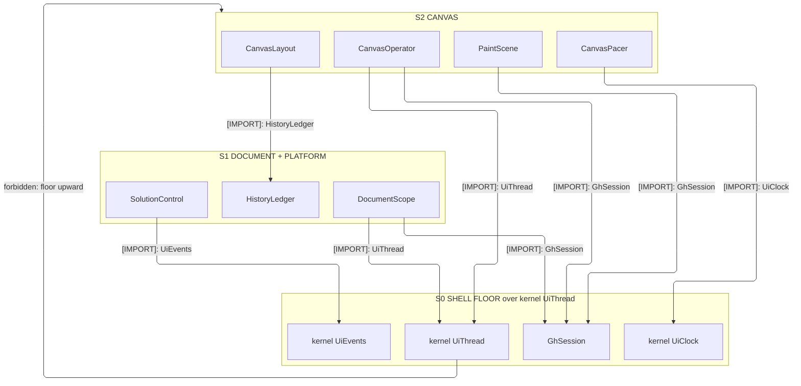
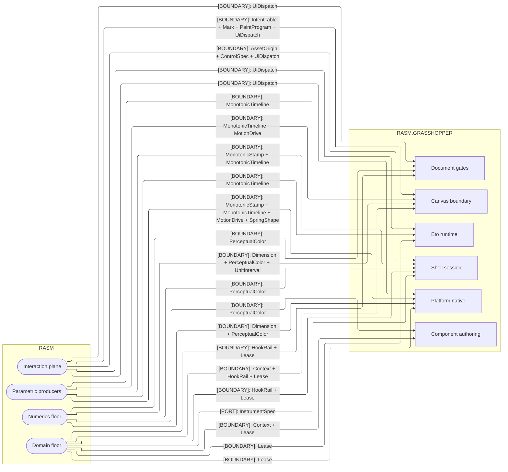
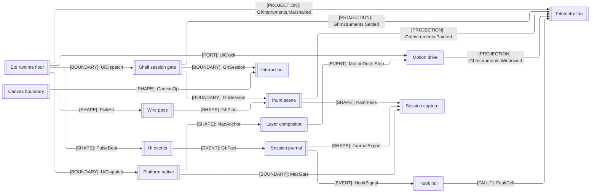

# [RASM_GRASSHOPPER_ARCHITECTURE]

`Rasm.Grasshopper` maps the Grasshopper 2, Eto, and Rhino UI host boundary on the .NET app strata: each sub-domain folder maps to exactly one namespace, and one owner closes each host concern over the live GH2 and Eto surfaces. It references the `Rasm` kernel and no sibling, so host-agnostic kernel math composes the motion and colour surfaces rather than a second in-folder derivation.

## [01]-[DOMAIN_MAP]

```text
Rasm.Grasshopper/       # Refs ../Rasm ONLY; GH2 + Eto host boundary; kernel math composed, never re-derived
├── Canvas/             # Paint, wire, layout, motion, and interaction owners over the live GH2 canvas
│   ├── Canvas.cs       # Canvas command-and-projection boundary over the live host surface
│   ├── Interaction.cs  # Responder dispatch, mount/focus/menu leases, and drag/resize capsules
│   ├── Layout.cs       # CanvasArrangement cases and typed snap capsules over the host solver surfaces
│   ├── Motion.cs       # Span/pace tween drive, animated glyphs, and the shared canvas pacer lease
│   ├── Paint.cs        # Event-scoped paint scene, frame/mark plans, stock custody, and pigment egress
│   └── Wires.cs        # Wire route geometry, custom routes, pick, marquee select, and the skin pen pass
├── Components/         # Component authoring, pin catalog, data transfer, attribute chrome, native catalog
│   ├── Attributes.cs   # Chrome event/decision policy, bounded trace, and the resizable chrome host spine
│   ├── Component.cs    # ComponentSpec consumed unchanged by construction, execution, lifecycle, and catalogue admission
│   ├── Data.cs         # One transfer policy over IDataAccess; typed ingress rows and the Garden promotion algebra
│   ├── Objects.cs      # Native-object factories, persisted read/assign, timer/cluster maps
│   └── Ports.cs        # PortRow rows owning verified carrier, semantic family, capability axes, one PortBinding each
├── Document/           # Graph transaction spine, query/wire operator, undo ledger, solution controller
│   ├── Document.cs     # Graph transaction spine over inert/inactive/active minting tiers, one gate
│   ├── Graph.cs        # Graph query-and-mutate operator, each mutation sealed into the ledger
│   ├── History.cs      # One ledger owner over the host History tree; ActionList seals under one VerbNoun
│   └── Solution.cs     # One solution owner over the host SolutionServer in every posture the server admits
├── Eto/                # Platform residue of the kernel interaction plane; nothing else seats here
│   └── Runtime.cs      # Platform-timer lease and pace producer; the timer cannot rise with its kernel-floor consumers
├── Platform/           # Composition root, CoreAnimation compositor, capture recorder, and the AppKit admission gate
│   ├── Capture.cs      # Leased ScreenCaptureKit recording — kernel-drain frames, one-shot still, paint proof
│   ├── Composition.cs  # One in-package composition seam nothing deeper composes; identity, time, FaultCell, broker registry
│   ├── Layers.cs       # CoreAnimation graph custody; every layer write rides the transaction fence, Display-P3 colour
│   └── Native.cs       # MacGate platform admission precondition; managed-to-AppKit extraction, input monitors
└── Shell/              # Session spine, UI event algebra, editor shell, chrome intent, vector icons
    ├── Chrome.cs       # Apply(ChromeIntent, Op?) outcome against Toolbar.Bar and InputPanel hosts; leased traverse
    ├── Editor.cs       # Editor shell — chrome-pane slots, toggles, state projection, Rhino getter
    ├── Events.cs       # UI fact/event evidence, anchor/source rows, transactional subscription, bounded drain
    ├── Hooks.cs        # Scoped veto/observe/replay hook rail with subscriber-fault isolation and taps
    ├── Icons.cs        # Vector-icon owner — host origins, a pose machine, filter chain, and catalog
    ├── Journal.cs      # Analytics egress folding UiEvent<GhFact> envelopes into bounded partitions
    ├── Session.cs      # Live-scope acquisition, apply/run gates, and gauged command acknowledgement
    └── Telemetry.cs    # Injected IMeterFactory minting one meter; producer-site instrument writes
```

## [02]-[STRATA]

Strata order the sub-domains; the UI-thread floor is the kernel's `UiThread` marshal and clock, with `Shell`'s `GhSession` scope gate composing it, and every cross-stratum consumption edge points down.

- S0 `Eto` + `Shell` — session, event, identity, telemetry, hook, and journal owners share same-stratum reach over the kernel floor.
- S0 `Eto` residue — the platform-timer lease and pace producer alone; the kernel boundary laws assign every other Eto concern to the kernel.
- S0 telemetry — `GhInstruments` declares the meter rows and every producing site writes through its owning member.
- S0 evidence — `PlatformRoot.Faults` enters the Shell floor whole and `SessionJournal` reads it, so no emitter mints its own custody.
- S1 `Document` + `Platform` — parallel composers over the floor, cross-blind to each other.
- S1 `Document` — the transaction spine: every graph mutation seals through the one gate, and no S1 sibling reads it.
- S1 `Platform` — the composition and native-gate half; `MacGate` is the one AppKit touch, so no upper owner names an AppKit member.
- S1 exemption — `PaintProof` (`Platform/Capture`) reads `PaintPass` and `JournalExport` as inert evidence under the model-only exemption.
- S2 `Canvas` — live host-surface owners seat at plugin load off the composition mount roster, so no canvas owner self-mounts.
- S2 reach — canvas owners compose session scope, the kernel marshal, undo seal, and the display-link drive.

`Components` stands beside the strata as an island, pure host-plus-kernel authoring with no interior edge either direction, so the fence draws it nowhere, and the kernel `MotionDrive` value arrives on the seam, never as an interior node.



## [03]-[SEAMS]

Timing owners admit the kernel's `MonotonicTimeline`; colour owners admit `PerceptualColor`. `Interaction` crosses on the same rails: `UiDispatch` carries every UI-thread marshal, `MotionDrive` samples every paced drive, `Mark` spells every draw primitive the `GhMark.Kernel` case carries, `PaintProgram` batches every kernel draw run, `IntentTable` resolves every menu node, `ControlSpec` seats every chrome pane, and `AssetOrigin` names every icon. Host operations return their canonical values, and instrument writes project at the producing site.

Fence law is census, never roster: one edge per kernel owner, consuming sub-domain, and kind, each member DECLARED at that kernel owner's fences and SPELLED in the sub-domain's code fences, joined ` + ` alphabetically; kernel-end edges fold it per owner, boundary, and kind, so a member moves exactly one edge at each end under the branch `[04]-[STRUCTURE]` derivation row. `Op` is the rail key every fence takes and rides no seam edge; `InstrumentSpec` rides `[PORT]` because `GhInstruments` DECLARES rows the app root mounts, while every other member crosses as a bound value.

`GhTelemetry` admits the app root's `IMeterFactory` and `ILoggerFactory` the same way: capability in, `rasm.grasshopper.*` instrument writes out, zero provider reference inside the boundary.

Projection seams generate through Riok.Mapperly, one `[Mapper]` per seam: `CanvasMap` (`Canvas/canvas.md` state/pulse/pick projections), `InputMap` (`Canvas/interaction.md` host-args admission), `SolutionMap` (`Document/solution.md` pulse/audit evidence), `TrimMap` (`Components/ports.md` pin-trim writes), `ObjectMap` (`Components/objects.md` native-object writes and colour crossings), `NativeMap` (`Platform/native.md` NSEvent projection), `CaptureMap` (`Platform/capture.md` survey facts). Hand projection survives only under a NAMED host demand, stated at its arm.



## [04]-[INTERNAL]

UI-thread interior composes around two floors, the `Eto/Runtime` dispatch surface and the `Shell/Session` scope gate, that every canvas, motion, event, and native owner marshals through; per-owner wiring lives on the owning implementation pages. Component authoring carries no UI-thread dependency; document gates marshal once through the session floor per command.



## [05]-[BOUNDARIES]

- `Rasm.Grasshopper` owns the GH2 host-boundary surface whole and re-owns no kernel concern; project references terminate at `Rasm`.
- Live host handles and native carriers stay inside the gated owners: `GhSession`, the kernel `UiThread`, and `MacGate` bound every live touch.
- App roots alone walk the mount roster through `PlatformRoot.Hold`, the one minter of identity, time, fault custody, and registries.
- Peer packages consume this boundary's host-free value shapes through the seam registry; no peer references this folder and it references none.

## [06]-[NAMESPACES]

Namespace mirrors folder path under `.editorconfig` `dotnet_style_namespace_match_folder = true:error`: every fence under `Rasm.Grasshopper/<Folder>/` declares `namespace Rasm.Grasshopper.<Folder>;`, giving each sub-domain folder its own root.

Boundary compiles as ONE assembly, the single `Rasm.Grasshopper.csproj`, so members cross the sub-domain namespaces with no build edge. `Eto.Forms`, `Eto.Drawing`, and the `Grasshopper2.*` roots arrive as project-level global usings, so fences name host members bare; kernel namespaces ride explicit `using` rows per fence.

Host-name resolution is one law:
- Inside `Rasm.Grasshopper.*` a partial qualification re-resolves against the boundary's own namespaces, so fences name host members bare.
- Host types no global using reaches spell `global::` in full.
- Simple-name collisions between host namespaces resolve through one project-level alias row in the csproj; the branch `RULINGS.md` homes the law.
- Fully-qualified `Grasshopper2.*` spellings stay valid because no boundary namespace shadows that root.
