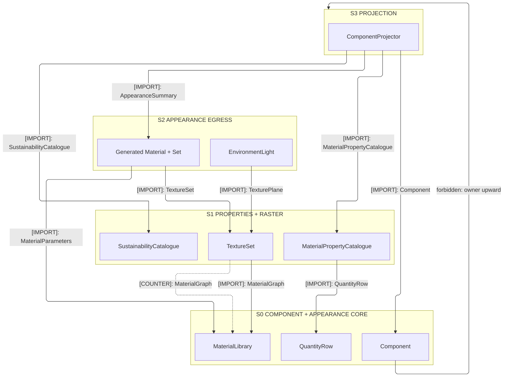
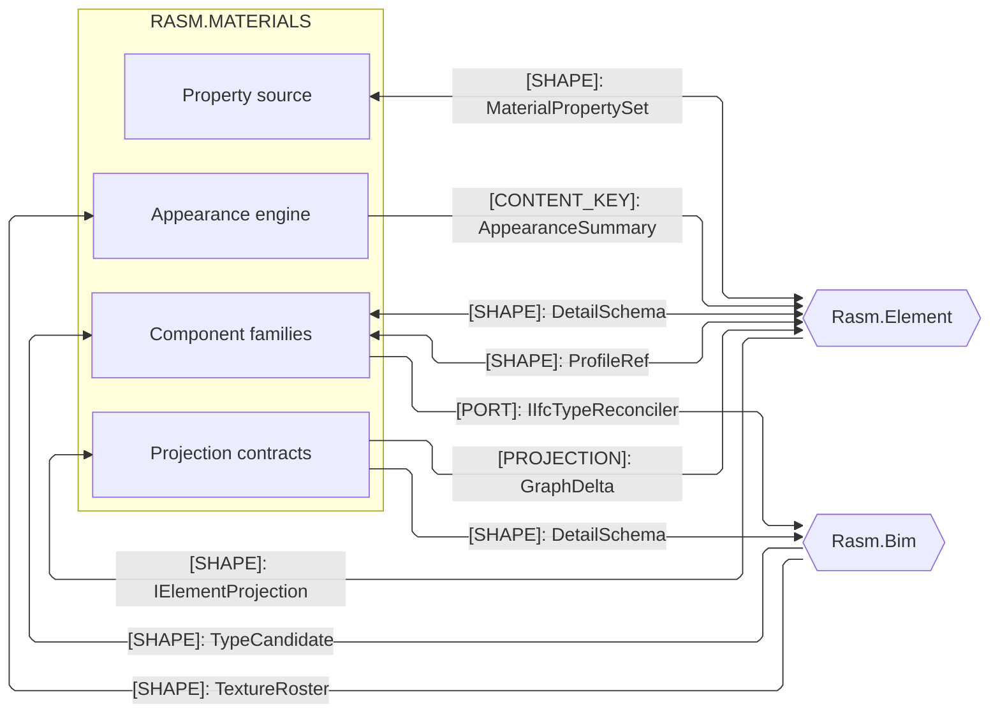
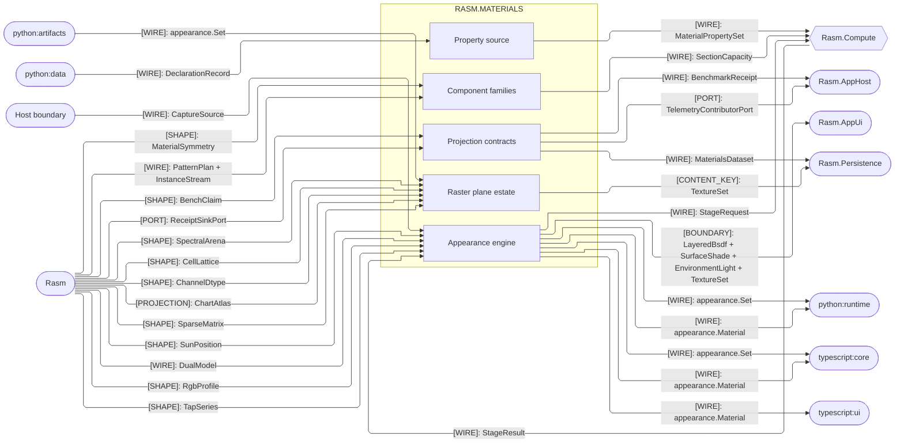
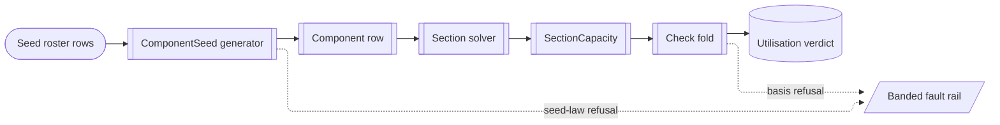
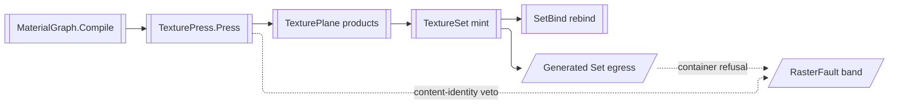

# [MATERIALS_ARCHITECTURE]

`Rasm.Materials` is the host-neutral AEC-domain projector onto the `Rasm.Element` seam. `Component`, `Appearance`, `Properties`, and `Projection` collapse to one owner per axis; the one `ComponentProjector : IElementProjection` lowers every owner into the shared `ElementGraph`. Its `Project` fold splits the `Substance` and Type-minting `Type` arms, mints the deterministic-rooted Type `Object` from canonical content, and authors the content-keyed `Material`/`Appearance` subgraph the seam `Assemble` fold merges. AEC peers depend up on `{Rasm, Rasm.Element}` and align by seam contract.

`Rasm.Materials` also references `Rasm.AppHost` by name under the cycle-safe branch ruling. `Projection/benchmarks#GATE_COMPOSITION` reads the benchmark gate; appearance and declaration boundaries compose its neutral `WireAdmission` after bounded protobuf-binary parsing. It references `Rasm.Contracts` for both generated families and carries no validator or generated-message mirror of its own.

## [01]-[DOMAIN_MAP]

```text codemap
Rasm.Materials/            # AEC-DOMAIN materials projector; refs {Rasm, Rasm.Element, Rasm.AppHost, Rasm.Contracts}; no host geometry
├── Component/             # One polymorphic Component over the closed component-family axis, class-discriminated
│   ├── Component.cs       # Component record, closed SectionProfile algebra, MaterialGrade rows, and the ComponentSeed traverse and gates
│   ├── Masonry.cs         # ComponentFamily.Masonry policy row and the bond algebra; a unit is a Component row, never a Brick type
│   ├── Steel.cs           # SteelSeed.Roster spans the registered domains beside the generated cold-formed lattice; SteelSeed.Law binds it
│   ├── Cmu.cs             # CmuSeed.Roster/Law under the block policy row; ASTM and TMS cells ride as published data
│   ├── Timber.cs          # TimberSeed.Roster/Law over EN strength-class tables; members and cross-laminated panels are each one row
│   ├── Glazing.cs         # IGU rows as SectionProfile.Layered with PlyRole panes, interlayers, and cavities; performance derives from physics
│   ├── Reinforcement.cs   # ReinforcementRow roster and the host-neutral RcSection assembler; bars and tendons are each one row
│   ├── Fastener.cs        # StockRow.Threaded pairs ThreadRow with a grade; StockRow.Plain carries published nail, dowel, and rivet data
│   ├── Connector.cs       # Evaluation-report cells with directional allowables; every cell carries its issuing report and safety basis
│   ├── Joint.cs           # Continuous weld/adhesive/stud vocabulary; no thread or bar section, so nothing folds into the fastener family
│   ├── Panel.cs           # Board geometry as SectionProfile.Layered over the shared bounded PlyRole; deck geometry rides its own profile
│   ├── Concrete.cs        # ConcreteSeed.Roster/Law over the CIP policy row; exposure classes drive the cover regime
│   ├── Precast.cs         # PrecastSeed.Roster/Law; a plank, tee, or panel is one catalogued product row
│   ├── Aluminum.cs        # EN 1999 characteristic bands beside the authored die roster; section truth is die-owned, the inverse of steel's
│   ├── Insulation.cs      # Non-board thermal forms under the covering token; the board split law routes rigid boards to the panel family
│   ├── Finishes.cs        # TWO family rows over ONE algebra; each shape states once and the family column carries the split
│   ├── Pipework.cs        # Pressure-pipe product rows across the material systems; shared dimension rules state once
│   ├── Ductwork.cs        # SMACNA product rows: pressure-class ladder, gauges, seal and liner classes, geometry
│   ├── Electrical.cs      # Conductor product rows with NEC/IEC ampacity cells as RATING rows beside the containment vocabularies
│   └── Capacity.cs        # SectionCapacity [Union] and the Check fold; one Demand against one capacity is the typed Utilisation
├── Appearance/            # Measured appearance engine — node graph, BSDF lobe family, and the material wire
│   ├── Bsdf.cs            # BsdfLobe [Union] under one Evaluate/Sample/Pdf contract; Microfacet<T> generic GGX/Smith/Fresnel kernel
│   ├── Graph.cs           # AppearanceNode [Union] over typed PortValue channels; Compile orders the DAG once on the QuikGraph substrate
│   ├── Surface.cs         # SpectralUpsample, the ToneMap operator table, and the OpenPBR construction half the wire and library drive
│   ├── Texture.cs         # TextureSource sampling under AddressMode/FilterMode bands; ProceduralNoise seeds over the NoiseBasis band
│   ├── Photometric.cs     # PhotometricQuantity band rows each carrying one closed Coercion discriminant; the 683 lm/W efficacy divide
│   ├── Weathering.cs      # WeatheringEffect policy rows drive a library row along AgeParameter, so a row carries its trajectory
│   ├── Acquisition.cs     # Acquisition.Import produces AcquiredMaterial with its CaptureProvenance receipt and admitted plane set
│   ├── Finish.cs          # Finish.Resolve over a pigment-weight vector and coat stack; spectrally-grounded BaseColor, measured provenance
│   ├── Interchange.cs     # Generated appearance egress, descriptor-admitted Set boundary, MaterialX, and the interior stage crossing
│   ├── Environment.cs     # SkyModel [Union], EnvironmentMap admission, and the IBL prefilter; scene-linear radiance end to end
│   └── Neural.cs          # ModelCard frozen registry keyed by ModelCardId; stage, licence, weights, tensor contract, provider ladder as DATA
├── Raster/                # Texture-map generation — the plane substrate, the bake engine, and its container estate
│   ├── Plane.cs           # TexturePlane typed-texel pooled arena over the kernel lattice seat; storage, transfer, primaries, alpha, range
│   ├── Codec.cs           # RasterFormat [SmartEnum<string>] rows carry extension, magic claim, alpha association, capability, engine case
│   ├── Filter.cs          # PlaneOp [Union] under one Apply that PLANS shapes, SCHEDULES stages by dependency class, then rents outputs
│   ├── Tile.cs            # TileStrategy [SmartEnum<string>] closes the tiling algebra; TileProof.Grade is the one tileability mint
│   ├── Set.cs             # TextureChannel [SmartEnum<string>] rows carry group, components, transfer, neutral; SetBind re-binds the library
│   ├── Press.cs           # TexturePress.Press drives a PressSubject across a PressPlan; the content-identity veto guards every mint
│   └── Gpu.cs             # PressDevice headless adapter with per-kernel compiled pipelines behind one cache; the only Silk.NET.WebGPU speller
├── Properties/            # Typed engineering-property source lowered onto the seam property sets
│   ├── Properties.cs      # MaterialPropertyCatalogue rows, the MechanicalSource vendor-delegation axis, and Published<T> the shared ingress carrier
│   ├── Sustainability.cs  # SustainabilityCatalogue in exact roster parity with its engineering sibling; Lower mints the seam cases
│   └── Assessment.cs      # AssessmentSet.Of resolves dated declarations over the curated catalogues; DeclarationWire.Decode admits the wire
└── Projection/            # One IElementProjection onto the Rasm.Element seam + the observability, benchmark, and analytics projections
    ├── Component.cs       # Project folds payload-complete Substance and Type cases onto Fin<GraphDelta> behind the ProjectionGate veto
    ├── Observability.cs   # MaterialsPoint roster over the kernel IHookRoster floor; MaterialsHooks.Live mints the one folder rail
    ├── Benchmarks.cs      # BenchKernel rows pin BenchInput and resolved content keys, so content changes fork lineage, never row spellings
    └── Analytics.cs       # Dataset rows and projection folds; column types, residences, dialects, and DDL home at Rasm.Persistence
```

VividOrange grounds the structural section, capacity, and rebar data in-folder, never a hand-keyed literal; the per-page consumption law lives on the owning pages. Return type names the rail: a `SurfaceShade`/`Unicolour` carrier where the result is total, `Fin<T>` where a banded fault routes, the seam `Fin<GraphDelta>` from the projector.

C# is the sole producer of the generated appearance family: `Appearance/interchange.md` mints `Material` and each completed `Set`, with the Set crossing the shared `WireAdmission` descriptor gate once. TypeScript and Python consume generated bindings rather than mirrors. Python-minted `Set` values land at `Raster/set.md` `SetIngest.Peer` as classification input through the same gate; the generated declaration family independently lands at `Properties/assessment.md` `DeclarationWire.Decode` and reaches `AssessmentSet.Of` unchanged.

## [02]-[STRATA]

Strata rank the five sub-domains; `Appearance` spans ranks, its core seated at the floor while its egress composes `Raster` products, so seating follows the folder's own dependency truth rather than a folder boundary.

- S0 law — `Component` and the `Appearance` core consume no sibling, and every sibling above reads at least one of the two floors.
- S1 seat — `Properties` lowers engineering dimensional mints through the S0 `QuantityRow` and basis-relative scalars to the seam factories.
- S1→S0 — `Raster` reads the core graph, sampler, and vector and writes back through `SetBind` alone on a `MaterialGraph` VALUE counter-edge.
- S2 seat — the `Appearance` egress composes `Raster` planes and sets; `Raster` names no egress type, so the plane estate stands alone.
- S2 law — a flat `Appearance` stratum turns every egress read of a plane product into an upward edge; the split rank is the dependency truth.
- S3 law — nothing composes `Projection`; the projector folds the lower owners into `Fin<GraphDelta>` and the projections read down alone.



## [03]-[SEAMS]





## [04]-[INTERNAL]

`Component` mints from published seed rosters once and every capacity read composes the minted row; `Appearance` compiles the one `MaterialGraph` program and every baked plane, set, and wire derives from that compile, CPU-minted wherever a content key follows. Per-stage wiring lives on the owning implementation pages.





## [05]-[ROUTING]

| [INDEX] | [CHANGE]                            | [OWNER_SURFACE]             | [SHAPE_OF_THE_EDIT]                                               |
| :-----: | :---------------------------------- | :-------------------------- | :---------------------------------------------------------------- |
|  [01]   | new standardized component family   | `Component/component.md`    | one `ComponentFamily` row carrying its `ComponentClass`           |
|  [02]   | new anchor or fastened product      | `Component/fastener.md`     | one `FastenerKind` arm or `StockRow` roster row                   |
|  [03]   | new panel or board product          | `Component/panel.md`        | one `PanelKind` row on the specification-armed policy column      |
|  [04]   | new scattering lobe                 | `Appearance/bsdf.md`        | one `BsdfLobe` case, admitted only where no parameterization fits |
|  [05]   | new material or finish              | `Appearance/graph.md`       | one `MaterialLibrary` row over the one `MaterialGraph`            |
|  [06]   | new standards table                 | its owning catalogue page   | one roster + one `SeedLaw` value on `ComponentSeed`               |
|  [07]   | new registered material grade       | `Component/component.md`    | one `MaterialGrade` row plus its `GradeProperties` arm            |
|  [08]   | new fault case                      | its owning fault page       | one arm at its `FaultBand` free frontier                          |
|  [09]   | new seam payload                    | `Rasm.Element` composition  | seam growth the projector composes, never a local remint          |
|  [10]   | new standard sky or daylight model  | `Appearance/environment.md` | one `CieSkyType` row over the group pair, or one `SkyModel` case  |
|  [11]   | new photo-to-PBR model              | `Appearance/neural.md`      | one `ModelCard` row carrying its licence class and contract       |
|  [12]   | new bakeable appearance field       | `Raster/set.md`             | one `TextureChannel` row carrying its twelve columns              |
|  [13]   | new plane container or block format | `Raster/codec.md`           | one `RasterFormat` row naming its engine, storage, and extension  |
|  [14]   | new plane transform or curve        | `Raster/filter.md`          | one `PlaneOp`, `RemapCurve`, or `HeightDerivative` case           |
|  [15]   | new tiling method                   | `Raster/tile.md`            | one `TileStrategy` row carrying its `Solve` delegate              |
|  [16]   | new GPU compute kernel              | `Raster/gpu.md`             | one `WgslKernel` row carrying source, layout, reduce, and golden  |
|  [17]   | new appearance wire document        | `Appearance/interchange.md` | one proto message, generated bindings, and one egress fold        |
|  [18]   | new seamless procedural lattice     | `Appearance/texture.md`     | one `NoiseBasis` row answering `Wrappable` plus its golden row    |
|  [19]   | new plane depth, arity, or storage  | `Raster/plane.md`           | one `IComponent` witness, texel struct, or `PlaneFormat` row      |
|  [20]   | new bake subject or execution lane  | `Raster/press.md`           | one `PressSubject` case or one `PressBackend` row                 |
|  [21]   | new photo-to-PBR capture modality   | `Appearance/acquisition.md` | one `CaptureSource` case and its `CaptureMethod` receipt row      |
|  [22]   | new declaration modality or EPD row | `Properties/assessment.md`  | one `AssessmentRecord` case with its `Admit` and resolution arms  |
|  [23]   | new durability binder or mix        | `Properties/properties.md`  | one `CementType` row plus its published `DurabilityMix` entries   |
|  [24]   | new design code over a cased family | `Component/capacity.md`     | one `DesignBasis` row plus the family page's per-basis arm        |
|  [25]   | new fatigue detail category         | `Component/capacity.md`     | one `EnFatigueCategory` or `AiscFatigueCategory` ladder rung      |
|  [26]   | new trade size or system            | its owning trade seed page  | one roster row or one system policy row, never a stocked sweep    |

## [06]-[BOUNDARIES]

- Materials owns substance, appearance, and buildable type: one `Component`, one capacity rail, one `MaterialGraph`, one `TextureSet`.
- Appearance CORE stays pointwise — a DAG node has no neighbours to read; neighbourhood work is the plane algebra's.
- Every filter, integration, and tiling kernel homes at `Raster/filter` or `Raster/tile`, never a node case.
- Persisted plane bytes are CPU-minted; the GPU lane is an accelerator whose products carry no content key.
- `ComponentFamily` closes the family axis and `ComponentClass` the structural-class axis, each family row carrying its class discriminant.
- `SEED_ROW_LAW` seats standards data as in-fence C# under per-column provenance, and every seed row flows the one catalogue-to-solver rail.
- `ComponentProjector.Project` stamps `Classification`/`PredefinedType` off its `IfcBinding` row, seed-excluded so a later attach never re-keys.
- Model authors mint Occurrence `Object`s and `Rasm.Bim` ingests `IfcElementType` into the same Type; the `Bake` inheritance is the seam's.
- `IIfcTypeReconciler` closes one loop: Bim's `ExportTypeCandidates` feeds `ComponentCatalogue.AdmitImported` by contract, never reference.
- Model owners stay host-neutral: none holds a host curve or transform, and run and layout geometry lands above the domain at the app root.
- `Rasm.Element` owns material-composition vocabulary, the perceptual owner color, and UnitsNet admits once per declared edge riding `MeasureValue`.
- Each concern composes its admitted engine, and a kernel the ecosystem leaves unowned lands hand-authored at its owning page.
- Every out-of-gamut, non-finite, or degenerate result rails to its banded fault, never a propagated NaN or sentinel.
- Composition-root decorators tap `MaterialsFact` onto `MaterialsPoint`, so owners emit nothing; `MaterialsDescriptors` rides the kernel SLO algebra.
- `StageResult` crosses from `Rasm.Compute` carrying the `ParityFresh` gate and `Coverage` floor whole; dropping either counts unmeasured.
