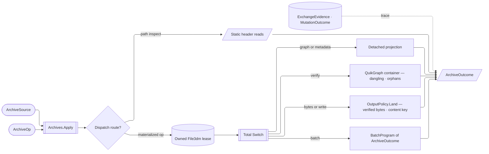

# [RASM_RHINO_ARCHIVE]

`Archives.Apply` owns standalone `File3dm` admission, bounded materialization, detached graph and metadata projection, mutation, verification, and content-keyed egress. One archive lease contains every host handle, one closed request family discriminates every modality, and one `ArchiveOutcome` preserves result, native evidence, program extent, and mutation residue after release.

The pipeline composes and never re-mints: `OutputPolicy.Land` is the folder's atomic staging kernel, `MutationPhase`/`MutationTrace` its residue ladder, `ExchangeFault` its refusal family, `WriteContent` its write-channel vocabulary, and `BatchProgram<ArchiveOutcome>` the ordered-row fold this page shares with the document exchange pipeline (all at `Exchange/operations`). `ExchangeEvidence` and its `MutationOutcome` seat HERE as the folder-wide detached evidence family both pipelines emit.

## [01]-[INDEX]

- [02]-[ADMISSION]: source custody, host-filter policy, mesh channels, and write-policy admission.
- [03]-[RESOURCE_GRAPH]: resource identity, relation topology, coverage, metadata, evidence, and the integrity container.
- [04]-[MUTATION]: archive patches and atomic amendment.
- [05]-[TRANSACTION_PIPELINE]: request dispatch, ordered programs, verification, and content-keyed egress.

## [02]-[ADMISSION]

- Owner: `ArchiveSource` closes path and owned-byte ingress; `ArchiveSlice` carries each host filter as data; `MeshChannel` is the mesh-payload capability vocabulary; `ArchiveWritePolicy` admits the complete mesh-write matrix before projecting a fresh `File3dmWriteOptions`.
- Law: byte ingress copies once into `ArchiveBytes`, so deferred execution never observes caller memory. Filtered reads remain path-only; byte requests retain the requested slice as degraded evidence while materializing the complete archive.
- Law: `ArchiveSlice.Full` bypasses the filtered overload. Every filtered row composes only catalogued `TableTypeFilter` members, and `ObjectTypeFilter.Any` becomes relevant only when `ObjectTable` participates.
- Law: mesh payload is a capability SET over `MeshChannel`, and each target declares the channels it CAN carry. The prior pair — a four-row `MeshPayload` enumerating the `(render, analysis)` product and a `SupportsRender` boolean on the target — spelled one two-element vocabulary as three declarations and five columns, and the compatibility check compared a payload row against a target flag rather than a set against a set. `MeshTarget.Channels` states the host fact directly (render meshes reach brep, extrusion, and SubD; analysis meshes extend to mesh), and an unsupported request refuses at construction. NAMED LOSS: the four named payload rows; bought back by `Channels.Wire`, which prints the requested channels an outcome can carry.
- Law: write-policy admission completes the mesh matrix — an absent target takes its declared default row and a repeated target rejects — so `Host()` writes every target explicitly and native mesh defaults never leak. `Content` gates against `WriteContent.ArchiveAxes`, because the standalone writer carries only the user-data channel and a caller passing a texture or backup channel here learns so instead of watching it vanish.
- Law: `FormatVersion.Of` is the ONE admission entry and `FormatVersion.Host` the one named sentinel. Zero names the WRITING host's own version, so the generated validator states the host-free floor without touching `RhinoApp` and `Of` applies the live ceiling at call time; a standalone archive program therefore admits a version outside any running host, and no policy spells the bare `0` literal a reader would take for "version zero". Every write receives a new native options instance.
- Packages: `Domain/results` (`Op`, `ContentHash`), `Domain/validation` (`CapabilitySet<T>`, `ICapability<T>`), `Rasm.Rhino.Document` (`DocumentPath`), `Exchange/operations` (`ExchangeFault`, `WriteContent`), RhinoCommon (`File3dm.TableTypeFilter`/`ObjectTypeFilter`, `File3dmWriteOptions.EnableRenderMeshes`/`EnableAnalysisMeshes`, `RhinoApp.ExeVersion`) per `.api/api-rhinocommon-fileio.md`.
- Growth: a new mesh channel is one `MeshChannel` row plus its column in each target's declared set; a new slice is one `ArchiveSlice` row.

```csharp
// --- [IMPORTS] -------------------------------------------------------------------------
using Rasm.Domain;
using Rasm.Numerics;
using Rasm.Rhino.Document;
using Rhino;
using Rhino.FileIO;

namespace Rasm.Rhino.Exchange;

// --- [TYPES] ---------------------------------------------------------------------------
[Union(ConversionFromValue = ConversionOperatorsGeneration.None)]
public abstract partial record ArchiveSource {
    private ArchiveSource() { }
    public sealed record PathCase(DocumentPath Path) : ArchiveSource;
    public sealed record BytesCase(ArchiveBytes Bytes) : ArchiveSource;

    internal Fin<ArchiveSource> Admit() => Switch(pathCase: static (key, source) => guard(
            source.Path != default,
            new KernelFault.InvalidValue(nameof(PathCase.Path), string.Join(" | ", new object?[] { key, "an archive path" }))).ToFin().Map(_ => (ArchiveSource)source),
        bytesCase: static (key, source) => Admit.Need(source.Bytes).Map(_ => (ArchiveSource)source));
}

[ComplexValueObject]
[ValidationError]
public sealed partial class ArchiveBytes {
    public ReadOnlyMemory<byte> Value { get; }

    static partial void ValidateFactoryArguments(
        ref ValidationError? validationError,
        ref ReadOnlyMemory<byte> value) {
        validationError = value.IsEmpty
            ? new ValidationError(string.Join(" | ", new object?[] { nameof(Value) }))
            : validationError;
        value = value.ToArray();
    }
}

public readonly record struct ArchiveFilter(
    File3dm.TableTypeFilter Tables,
    File3dm.ObjectTypeFilter Objects);

[SmartEnum<int>]
public sealed partial class ArchiveSlice {
    public static readonly ArchiveSlice Full = new(key: 0, filter: None);
    public static readonly ArchiveSlice Header = new(key: 1, filter: Some(new ArchiveFilter(
        Tables: File3dm.TableTypeFilter.StartSection | File3dm.TableTypeFilter.Properties
              | File3dm.TableTypeFilter.Settings | File3dm.TableTypeFilter.Bitmap,
        Objects: File3dm.ObjectTypeFilter.Any)));
    public static readonly ArchiveSlice Geometry = new(key: 2, filter: Some(new ArchiveFilter(
        Tables: File3dm.TableTypeFilter.ObjectTable | File3dm.TableTypeFilter.Layer
              | File3dm.TableTypeFilter.Material | File3dm.TableTypeFilter.Group
              | File3dm.TableTypeFilter.InstanceDefinition,
        Objects: File3dm.ObjectTypeFilter.Any)));
    public static readonly ArchiveSlice Drafting = new(key: 3, filter: Some(new ArchiveFilter(
        Tables: File3dm.TableTypeFilter.Font | File3dm.TableTypeFilter.Dimstyle
              | File3dm.TableTypeFilter.Linetype | File3dm.TableTypeFilter.Hatchpattern
              | File3dm.TableTypeFilter.SectionStyle | File3dm.TableTypeFilter.Markup,
        Objects: File3dm.ObjectTypeFilter.Any)));
    public static readonly ArchiveSlice Presentation = new(key: 4, filter: Some(new ArchiveFilter(
        Tables: File3dm.TableTypeFilter.Bitmap | File3dm.TableTypeFilter.TextureMapping
              | File3dm.TableTypeFilter.Material | File3dm.TableTypeFilter.Light
              | File3dm.TableTypeFilter.PageViewGroup,
        Objects: File3dm.ObjectTypeFilter.Any)));
    public static readonly ArchiveSlice History = new(key: 5, filter: Some(new ArchiveFilter(
        Tables: File3dm.TableTypeFilter.Historyrecord,
        Objects: File3dm.ObjectTypeFilter.Any)));
    public static readonly ArchiveSlice UserData = new(key: 6, filter: Some(new ArchiveFilter(
        Tables: File3dm.TableTypeFilter.UserTable,
        Objects: File3dm.ObjectTypeFilter.Any)));
    public static readonly ArchiveSlice Resources = new(key: 7, filter: Some(new ArchiveFilter(
        Tables: File3dm.TableTypeFilter.Settings | File3dm.TableTypeFilter.Bitmap
              | File3dm.TableTypeFilter.TextureMapping | File3dm.TableTypeFilter.Material
              | File3dm.TableTypeFilter.Linetype | File3dm.TableTypeFilter.Layer
              | File3dm.TableTypeFilter.Group | File3dm.TableTypeFilter.Font
              | File3dm.TableTypeFilter.Dimstyle | File3dm.TableTypeFilter.Light
              | File3dm.TableTypeFilter.Hatchpattern | File3dm.TableTypeFilter.SectionStyle
              | File3dm.TableTypeFilter.Markup | File3dm.TableTypeFilter.PageViewGroup
              | File3dm.TableTypeFilter.InstanceDefinition | File3dm.TableTypeFilter.Historyrecord
              | File3dm.TableTypeFilter.UserTable,
        Objects: File3dm.ObjectTypeFilter.Any)));

    public Option<ArchiveFilter> Filter { get; }
}

[SmartEnum<string>]
public sealed partial class MeshChannel : ICapability<MeshChannel> {
    public static readonly MeshChannel Render = new(key: "render");
    public static readonly MeshChannel Analysis = new(key: "analysis");
}

[SmartEnum<int>]
public sealed partial class MeshTarget {
    public static readonly MeshTarget Brep = new(key: 0, kind: ObjectType.Brep,
        channels: CapabilitySet<MeshChannel>.Of(MeshChannel.Render, MeshChannel.Analysis));
    public static readonly MeshTarget Extrusion = new(key: 1, kind: ObjectType.Extrusion,
        channels: CapabilitySet<MeshChannel>.Of(MeshChannel.Render, MeshChannel.Analysis));
    public static readonly MeshTarget SubD = new(key: 2, kind: ObjectType.SubD,
        channels: CapabilitySet<MeshChannel>.Of(MeshChannel.Render, MeshChannel.Analysis));
    public static readonly MeshTarget Mesh = new(key: 3, kind: ObjectType.Mesh,
        channels: CapabilitySet<MeshChannel>.Of(MeshChannel.Analysis));

    public ObjectType Kind { get; }
    public CapabilitySet<MeshChannel> Channels { get; }

    internal CapabilitySet<MeshChannel> Baseline => Channels.Admits(capability: MeshChannel.Render)
        ? CapabilitySet<MeshChannel>.Of(MeshChannel.Render)
        : CapabilitySet<MeshChannel>.None;
}

// --- [MODELS] --------------------------------------------------------------------------
[ValueObject<int>(KeyMemberName = "Value", KeyMemberAccessModifier = AccessModifier.Public)]
[ValidationError]
public readonly partial struct FormatVersion {
    public static FormatVersion Host { get; } = Create(value: 0);

    static partial void ValidateFactoryArguments(ref ValidationError? validationError, ref int value) {
        int candidate = value;
        validationError = candidate == 0 || candidate >= 2
            ? null
            : new ValidationError(string.Join(" | ", new object?[] { nameof(Value), candidate, "0 or at least 2" }));
    }

    public static Fin<FormatVersion> Of(int value) {
        return from admitted in FactoryBridge.Accept<FormatVersion>(candidate: value)
               from _ceiling in Try.lift(() => guard(
                   admitted.Value == 0 || admitted.Value <= RhinoApp.ExeVersion,
                   new KernelFault.OutOfRange(Label: nameof(Value), Scalar: admitted.Value, Requirement: $"at most the running host version {RhinoApp.ExeVersion}")).ToFin()).Run().Bind(static inner => inner)
               select admitted;
    }
}

[ComplexValueObject]
[ValidationError]
public sealed partial class MeshWrite {
    public MeshTarget Target { get; }
    public CapabilitySet<MeshChannel> Channels { get; }

    static partial void ValidateFactoryArguments(
        ref ValidationError? validationError,
        ref MeshTarget target,
        ref CapabilitySet<MeshChannel> channels) {
        (MeshTarget? row, CapabilitySet<MeshChannel> requested) = (target, channels);
        validationError = FactoryValidation.Of(
                FactoryValidation.Violated(
                    (row is null, () => new ValidationClause(string.Join(" | ", new object?[] { op, nameof(Target) }))),
                    (row is not null && !row.Channels.AdmitsAll(requested),
                        () => new ValidationClause(string.Join(" | ", new object?[] { op, nameof(Channels), $"channels within <{row!.Channels.Wire}>; unadmitted <{row.Channels.Missing(requested).Wire}>" }))));
    }
}

[ComplexValueObject]
[ValidationError]
public sealed partial class ArchiveWritePolicy {
    public static ArchiveWritePolicy Current { get; } = Create(
        version: FormatVersion.Host,
        content: CapabilitySet<WriteContent>.Of(WriteContent.UserData),
        meshes: Completed(Seq<MeshWrite>()));

    public static ArchiveWritePolicy Lean { get; } = Create(
        version: FormatVersion.Host,
        content: CapabilitySet<WriteContent>.None,
        meshes: toSeq(MeshTarget.Items).Map(static target => MeshWrite.Create(
            target: target, channels: CapabilitySet<MeshChannel>.None)));

    public FormatVersion Version { get; }
    public CapabilitySet<WriteContent> Content { get; }
    public Seq<MeshWrite> Meshes { get; }

    static partial void ValidateFactoryArguments(
        ref ValidationError? validationError,
        ref FormatVersion version,
        ref CapabilitySet<WriteContent> content,
        ref Seq<MeshWrite> meshes) {
        (CapabilitySet<WriteContent> held, Seq<MeshWrite> rows) = (content, meshes);
        validationError = FactoryValidation.Of(
                FactoryValidation.Violated(
                    (!WriteContent.ArchiveAxes.AdmitsAll(held),
                        () => new ValidationClause(string.Join(" | ", new object?[] { op, nameof(Content), $"channels within <{WriteContent.ArchiveAxes.Wire}>; unadmitted <{WriteContent.ArchiveAxes.Missing(held).Wire}>" }))),
                    (rows.Exists(static row => row is null)
                     || rows.Map(static row => row.Target).Distinct().Count != MeshTarget.Items.Count,
                        () => new ValidationClause(string.Join(" | ", new object?[] { op, nameof(Meshes), "exactly one channel row per mesh target" })))));
    }

    public static Fin<ArchiveWritePolicy> Of(
        FormatVersion version,
        CapabilitySet<WriteContent> content,
        Seq<MeshWrite> meshes = default) {
        return FactoryBridge.Accept<ArchiveWritePolicy>(
            Validate(version: version, content: content, meshes: Completed(meshes), item: out ArchiveWritePolicy? policy),
            policy);
    }

    private static Seq<MeshWrite> Completed(Seq<MeshWrite> meshes) =>
        meshes + toSeq(MeshTarget.Items)
            .Filter(target => !meshes.Exists(row => row is not null && row.Target == target))
            .Map(static target => MeshWrite.Create(target: target, channels: target.Baseline));

    internal File3dmWriteOptions Host() {
        File3dmWriteOptions options = new() {
            Version = Version.Value,
            SaveUserData = Content.Admits(capability: WriteContent.UserData),
        };
        _ = Meshes.Iter(row => {
            options.EnableRenderMeshes(
                objectType: row.Target.Kind, enable: row.Channels.Admits(capability: MeshChannel.Render));
            options.EnableAnalysisMeshes(
                objectType: row.Target.Kind, enable: row.Channels.Admits(capability: MeshChannel.Analysis));
        });
        return options;
    }
}
```

## [03]-[RESOURCE_GRAPH]

- Owner: `ArchiveGraph` stores the archive's component topology once and answers integrity through one QuikGraph container; `ResourceRole` classifies nodes and carries the `ResourceReach` column stating how far a lease reaches that role, `ResourceRelation` classifies edges, and `ResourceCoverage` is the evidence shape a reach row mints. `ExchangeEvidence` is the folder-wide detached evidence family and `MutationOutcome` its residue arm.
- Cases: `MutationOutcome` names the THREE states a mutation attempt settles in — `Committed` (the target changed and an undo serial may stand behind it), `RolledBack` (the attempt reached no filesystem or the bracket undid it), `Residual` (the attempt touched the filesystem and no undo serial stands behind it).
- Law: graph identity is `(Role, Name, Id)`, and a resolved link endpoint is a stored node. Object placement, layer, material, group, definition membership, instance-reference targets, and linked-source relations derive from the same node rows that projections consume; an instance reference to an absent definition reconstructs its target endpoint from the carried `ParentIdefId` so integrity surfaces the dangling reference instead of dropping it.
- Law: integrity is a GRAPH query, not a nested scan. `Integrity` builds one `BidirectionalGraph` keyed on the node value and answers dangling links through `ContainsVertex` and unreferenced resources through `IsolatedVertices` — the prior `Broken()` re-scanned the whole node roster per link, so an archive with a thousand objects walked a million pairs, and it could answer nothing about a resource nothing references. NAMED LOSS: none; the previous `Names` and `Summary` projections DELETE because no caller read either and `ByRole` existed only to feed `Summary`.
- Law: reach is a role column, never a coverage-site branch — each role declares whether its table materializes from the lease, answers only a path-header read, or stays opaque, and the reach row mints the matching `ResourceCoverage` case, so an empty roster never masquerades as complete graph evidence and a new unreachable table is one row edit rather than an arm in a coverage switch.
- Law: `ArchiveVerdict` conforms `IValidityEvidence`, so validity is DERIVED from the counts it already carries — the prior `bool Valid` column was a second authority the constructor could contradict. Orphaned resources are counted as evidence and do NOT falsify: a layer or material nothing references is legal archive content, and reporting it as invalid would refuse every stock template.
- Law: exact serialized bytes mint archive identity. `ArchiveDelta` compares node and link sets while preserving both content keys, so structural equality and byte identity remain separate contracts.
- Law: `ArchiveMetadata.Of` is the ONE projection both ingresses fill, parameterized per field on its own reader, so presence rules cannot diverge between them. The georeference arrives ALREADY SETTLED because it is fallible — a set earth location whose coordinates refuse admission is a fault, never a silently absent basepoint — while every other field stays a lazy per-ingress reader. `Revised` owns the one presence rule, a blank author or application name projects to absence through one text admission, and `Layouts` is `Option<Seq<…>>` so byte ingress spells the unreachable roster as `None` rather than measuring it as empty.
- Law: absence rides the carrier, never a flag. The header's `EarthAnchored` and `HasPreview` booleans DELETE onto `Option<GeoPoint>` and an optional pixel extent, so a consumer that asked whether a preview exists now also learns how large it is and a consumer that asked whether the archive is georeferenced now reads WHERE.
- Packages: `Domain/results` (`Op`, `Lease<T>`, `IValidityEvidence`, `ValidityClaim`), `Rasm.Numerics` (`Dimension`), `Exchange/operations` (`ExchangeFault`, `MutationPhase`, `GeoPoint`), QuikGraph (`BidirectionalGraph`, `TaggedEdge`, `AlgorithmExtensions.IsolatedVertices`) per `libs/dotnet/.api/api-quikgraph.md`, RhinoCommon (`File3dm` tables) per `.api/api-rhinocommon-fileio.md`.
- Growth: a new resource role is one row carrying its reach; a new relation is one row; neither touches the container, the coverage fold, or the integrity query.

```csharp
// --- [TYPES] ---------------------------------------------------------------------------
[SmartEnum<int>]
public sealed partial class ResourceReach {
    public static readonly ResourceReach Materialized = new(key: 0,
        cover: static (role, count) => new ResourceCoverage.MaterializedCase(Role: role, Count: count));
    public static readonly ResourceReach PathHeader = new(key: 1,
        cover: static (role, _) => new ResourceCoverage.PathHeaderCase(Role: role));
    public static readonly ResourceReach OpaqueTable = new(key: 2,
        cover: static (role, _) => new ResourceCoverage.OpaqueTableCase(Role: role));

    [UseDelegateFromConstructor]
    internal partial ResourceCoverage Cover(ResourceRole role, int count);
}

[SmartEnum<int>]
public sealed partial class ResourceRole {
    public static readonly ResourceRole Layer = new(key: 0, reach: ResourceReach.Materialized);
    public static readonly ResourceRole Material = new(key: 1, reach: ResourceReach.Materialized);
    public static readonly ResourceRole Group = new(key: 2, reach: ResourceReach.Materialized);
    public static readonly ResourceRole Block = new(key: 3, reach: ResourceReach.Materialized);
    public static readonly ResourceRole Object = new(key: 4, reach: ResourceReach.Materialized);
    public static readonly ResourceRole ModelView = new(key: 5, reach: ResourceReach.Materialized);
    public static readonly ResourceRole NamedView = new(key: 6, reach: ResourceReach.Materialized);
    public static readonly ResourceRole Layout = new(key: 7, reach: ResourceReach.PathHeader);
    public static readonly ResourceRole Embedded = new(key: 8, reach: ResourceReach.Materialized);
    public static readonly ResourceRole RenderMaterial = new(key: 9, reach: ResourceReach.Materialized);
    public static readonly ResourceRole RenderEnvironment = new(key: 10, reach: ResourceReach.Materialized);
    public static readonly ResourceRole RenderTexture = new(key: 11, reach: ResourceReach.Materialized);
    public static readonly ResourceRole StringEntry = new(key: 12, reach: ResourceReach.OpaqueTable);
    public static readonly ResourceRole DimensionStyle = new(key: 13, reach: ResourceReach.Materialized);
    public static readonly ResourceRole LinkedArchive = new(key: 14, reach: ResourceReach.Materialized);
    public static readonly ResourceRole Settings = new(key: 15, reach: ResourceReach.Materialized);
    public static readonly ResourceRole Manifest = new(key: 16, reach: ResourceReach.Materialized);

    public ResourceReach Reach { get; }
}

[SmartEnum<int>]
public sealed partial class ResourceRelation {
    public static readonly ResourceRelation OnLayer = new(key: 0);
    public static readonly ResourceRelation UsesMaterial = new(key: 1);
    public static readonly ResourceRelation InGroup = new(key: 2);
    public static readonly ResourceRelation MemberOf = new(key: 3);
    public static readonly ResourceRelation Instantiates = new(key: 4);
    public static readonly ResourceRelation LinksArchive = new(key: 5);
}

[Union(ConversionFromValue = ConversionOperatorsGeneration.None)]
public abstract partial record MutationOutcome {
    private MutationOutcome() { }
    public sealed record CommittedCase(Option<UndoSerial> Record) : MutationOutcome;
    public sealed record RolledBackCase : MutationOutcome;
    public sealed record ResidualCase : MutationOutcome;

    internal MutationPhase Phase => Switch(
        committedCase: static _ => MutationPhase.Landing,
        rolledBackCase: static _ => MutationPhase.Attempted,
        residualCase: static _ => MutationPhase.Landing);
}

[Union(ConversionFromValue = ConversionOperatorsGeneration.None)]
public abstract partial record ExchangeEvidence {
    private ExchangeEvidence() { }
    public sealed record NativeCase(string Surface, bool Succeeded, string Detail, Option<DocumentPath> Target = default) : ExchangeEvidence;
    public sealed record BrokenLinkCase(ResourceLink Link) : ExchangeEvidence;
    public sealed record OrphanCase(ResourceNode Node) : ExchangeEvidence;
    public sealed record DegradedCase(string Surface, string Detail) : ExchangeEvidence;
    public sealed record EmptyCase(string Surface) : ExchangeEvidence;
    public sealed record HostDefaultsCase(string Surface, string Detail) : ExchangeEvidence;
    public sealed record MutationCase(string Surface, MutationOutcome Outcome) : ExchangeEvidence;
    public sealed record UnitCase(string Surface, LengthUnit Before, LengthUnit After, ArchiveUnitPolicy Policy) : ExchangeEvidence;
}

// --- [MODELS] --------------------------------------------------------------------------
public readonly record struct ResourceNode(ResourceRole Role, string Name, Option<Guid> Id);

public readonly record struct ResourceLink(ResourceNode From, ResourceNode To, ResourceRelation Relation);

[Union(ConversionFromValue = ConversionOperatorsGeneration.None)]
public abstract partial record ResourceCoverage {
    private ResourceCoverage() { }
    public sealed record MaterializedCase(ResourceRole Role, int Count) : ResourceCoverage;
    public sealed record PathHeaderCase(ResourceRole Role) : ResourceCoverage;
    public sealed record OpaqueTableCase(ResourceRole Role) : ResourceCoverage;
}

public sealed record ArchiveGraph(
    Seq<ResourceNode> Nodes,
    Seq<ResourceLink> Links,
    Seq<ResourceCoverage> Coverage) {
    public (Seq<ResourceLink> Dangling, Seq<ResourceNode> Orphans) Integrity() {
        BidirectionalGraph<ResourceNode, TaggedEdge<ResourceNode, ResourceRelation>> container = new(allowParallelEdges: true);
        _ = container.AddVertexRange(Nodes.AsIterable());
        Seq<ResourceLink> dangling = Links.Filter(link =>
            !container.ContainsVertex(link.From) || !container.ContainsVertex(link.To));
        _ = container.AddEdgeRange(Links
            .Filter(link => container.ContainsVertex(link.From) && container.ContainsVertex(link.To))
            .Map(static link => new TaggedEdge<ResourceNode, ResourceRelation>(link.From, link.To, link.Relation))
            .AsIterable());
        return (Dangling: dangling, Orphans: toSeq(container.IsolatedVertices()));
    }
}

public sealed record ArchiveMetadata(
    Option<string> Notes,
    int ArchiveVersion,
    Option<(string CreatedBy, string LastEditedBy, int Revision, DateTime CreatedOn, DateTime LastEditedOn)> Revision,
    Option<(string Name, string Url, string Details)> Application,
    Option<GeoPoint> Anchor,
    Option<Seq<(string Name, Guid Id)>> Layouts,
    int DimensionStyles,
    Option<(Rasm.Numerics.Dimension Width, Rasm.Numerics.Dimension Height)> Preview) {
    internal static ArchiveMetadata Of(
        Func<Option<string>> notes,
        Func<int> archiveVersion,
        Func<Option<(string, string, int, DateTime, DateTime)>> revision,
        Func<Option<(string, string, string)>> application,
        Option<GeoPoint> anchor,
        Func<Option<Seq<(string Name, Guid Id)>>> layouts,
        Func<int> dimensionStyles,
        Func<Option<(Rasm.Numerics.Dimension Width, Rasm.Numerics.Dimension Height)>> preview) =>
        new(Notes: notes(),
            ArchiveVersion: archiveVersion(),
            Revision: revision(),
            Application: application(),
            Anchor: anchor,
            Layouts: layouts(),
            DimensionStyles: dimensionStyles(),
            Preview: preview());

    internal static Option<(string, string, int, DateTime, DateTime)> Revised(
        bool read, string createdBy, string lastEditedBy, int revision, DateTime createdOn, DateTime lastEditedOn) =>
        read && revision > 0 ? Some((createdBy, lastEditedBy, revision, createdOn, lastEditedOn)) : None;

    internal static Option<string> Text(string? value) =>
        Optional(value).Filter(static text => !string.IsNullOrWhiteSpace(value: text));

    internal static Option<(string, string, string)> Origin(string name, string url, string details) =>
        Text(value: name).Map(admitted => (admitted, url, details));

    internal static Option<(Rasm.Numerics.Dimension Width, Rasm.Numerics.Dimension Height)> Previewed(System.Drawing.Bitmap? bitmap) =>
        Optional(bitmap).Bind(static held => {
            using System.Drawing.Bitmap preview = held;
            return preview is { Width: > 0, Height: > 0 }
                ? Some((Width: Rasm.Numerics.Dimension.Create(value: preview.Width), Height: Rasm.Numerics.Dimension.Create(value: preview.Height)))
                : Option<(Rasm.Numerics.Dimension, Rasm.Numerics.Dimension)>.None;
        });
}

public sealed record ArchiveDelta(
    UInt128 SourceKey,
    UInt128 OtherKey,
    Seq<ResourceNode> Added,
    Seq<ResourceNode> Removed,
    Seq<ResourceNode> Retained,
    Seq<ResourceLink> AddedLinks,
    Seq<ResourceLink> RemovedLinks) {
    public bool Identical => SourceKey == OtherKey;

    internal static ArchiveDelta Of(UInt128 sourceKey, UInt128 otherKey, ArchiveGraph source, ArchiveGraph other) {
        LanguageExt.HashSet<ResourceNode> before = toHashSet(source.Nodes);
        LanguageExt.HashSet<ResourceNode> after = toHashSet(other.Nodes);
        LanguageExt.HashSet<ResourceLink> beforeLinks = toHashSet(source.Links);
        LanguageExt.HashSet<ResourceLink> afterLinks = toHashSet(other.Links);
        return new(
            SourceKey: sourceKey,
            OtherKey: otherKey,
            Added: other.Nodes.Filter(node => !before.Contains(node)),
            Removed: source.Nodes.Filter(node => !after.Contains(node)),
            Retained: source.Nodes.Filter(after.Contains),
            AddedLinks: other.Links.Filter(link => !beforeLinks.Contains(link)),
            RemovedLinks: source.Links.Filter(link => !afterLinks.Contains(link)));
    }
}

public readonly record struct ArchiveVerdict(int InvalidObjects, int DanglingLinks, int Orphans) : IValidityEvidence {
    public bool IsValid => ValidityClaim.All(InvalidObjects == 0, DanglingLinks == 0);
}
```

## [04]-[MUTATION]

- Owner: `ArchivePatch` closes settings, strings, named views, notes, and preview mutation. `ArchiveUnitPolicy` carries model-unit geometry treatment as delegate-backed behavior, and `ArchiveMutation` detaches the changed resource plus unit evidence.
- Law: `ArchiveMutation` carries this pipeline's name because `Persistence/dictionary` owns `ArchiveChange` as the `ArchiveMap` diff vocabulary the branch README routes to; two bare `ArchiveChange` declarations in one assembly resolve by namespace and read as one concept, so the archive pipeline's patch result renames and the dictionary's diff family keeps the name.
- Law: a patch mutates the leased in-memory archive only; `AmendCase` writes a same-directory temporary archive after every patch lands and atomically replaces the target after nonempty-byte verification, so neither patch failure nor write failure exposes a half-applied target.
- Law: unit treatment is BEHAVIOR on the policy row, not a boolean the caller branches on. `Relabel` rescales nothing and `Rescale` scales every object's geometry, so the fold reads one delegate and the `ScalesGeometry` column and its `if` DELETE; the evidence row carries the policy itself, so a reader learns which treatment ran rather than a bare "geometry was scaled" flag. Unit conversion admits source and destination through the kernel `ModelUnit` owner and consumes `ModelUnit.ScaleTo` — unit identity and its meters-per-unit scale are the whole fact a rescale reads, and a `Context` mint would admit a tolerance triad this fold never touches. The ratio scales geometry before `File3dmSettings.ModelUnits` receives the destination, so custom unit name and scale survive; `PageUnits` relabels through the same owner and carries `Relabel` on its evidence.
- Law: string entries carry the host's SECTION axis. `File3dmStringTable` keys on `(section, entry)` and the prior arm passed a bare `null` twice, so the whole sectioned namespace was unreachable and two callers writing the same entry under different sections collided; `Option<string> Section` rides the case and `HostEdge.Slot` is the one projection to the host's null.
- Law: string deletion is absence — `StringCase` with `None` value deletes through `File3dmStringTable.Delete`, so the value option carries the full write/delete decision. `NotesCase` carries the host's full notes surface — text plus the `IsVisible`/`IsHtml` optional overrides — and commits the whole carrier back through the `Notes` setter so every axis writes through. Those two overrides stay `Option<bool>` and REFUSE the folder's `FieldOverride<T>` (`Exchange/operations#[03]-[LANE_AND_OUTPUT]`): that owner earns its third state from a host surface pairing a gate with a value, where `Clear` drops the gate and hands the field back to host inheritance. `File3dmNotes.IsVisible` and `IsHtml` are bare settable booleans carrying no gate and no inheritance, so a `Clear` arm here writes the identical `false` that `Set(false)` writes — one case, two spellings, no reader distinguishing them. The override vocabulary owns GATED host fields; an ungated field carries absence and nothing else.
- Packages: `Domain/results` (`HostEdge.Slot`, `Op.Catch`), `Domain/context` (`ModelUnit.Of`, `ModelUnit.ScaleTo`), `Exchange/operations` (`ExchangeFault`), RhinoCommon (`File3dmStringTable.SetString`/`Delete`, `File3dmNotes`, `File3dmViewTable.FindName`/`Delete`, `File3dm.SetPreviewImage`) per `.api/api-rhinocommon-fileio.md`.
- Growth: a new mutable archive surface is one case with its application arm; the amended yield and the total dispatch break loudly until the case is handled.
- Boundary: `SetPreviewCase` carries copied `ArchiveBytes`, decodes and clones the bitmap while the stream remains live, and disposes both bitmaps after `SetPreviewImage` copies the pixels. `ClearPreviewCase` passes the host null sentinel.

```csharp
// --- [TYPES] ---------------------------------------------------------------------------
[SmartEnum<string>]
public sealed partial class ArchiveUnitPolicy {
    public static readonly ArchiveUnitPolicy Relabel = new(key: "relabel",
        apply: static (_, _, _) => Fin.Succ(value: unit));
    public static readonly ArchiveUnitPolicy Rescale = new(key: "rescale",
        apply: static (archive, factor, op) => toSeq(archive.Objects)
            .TraverseM(entry => Optional(entry.Geometry)
                .ToFin(Fail: new ExchangeFault.HostRefused(Member: nameof(File3dmObject.Geometry),
                    Detail: $"{entry.Id}: geometry unrealized (null native pointer)"))
                .Bind(geometry => Admit.Confirm(success: geometry.Scale(scaleFactor: factor))))
            .As()
            .Map(static _ => unit));

    [UseDelegateFromConstructor]
    internal partial Fin<Unit> Apply(File3dm archive, double factor);
}

[Union(ConversionFromValue = ConversionOperatorsGeneration.None)]
public abstract partial record ArchivePatch {
    private ArchivePatch() { }
    public sealed record NotesCase(string Notes, Option<bool> Visible = default, Option<bool> Html = default) : ArchivePatch;
    public sealed record ModelUnitsCase(LengthUnit Units, ArchiveUnitPolicy Policy) : ArchivePatch;
    public sealed record PageUnitsCase(LengthUnit Units) : ArchivePatch;
    public sealed record StringCase(Option<string> Section, string Key, Option<string> Value) : ArchivePatch;
    public sealed record RenameViewCase(string Name, string Rename) : ArchivePatch;
    public sealed record DeleteViewCase(string Name) : ArchivePatch;
    public sealed record ClearPreviewCase : ArchivePatch;
    public sealed record SetPreviewCase(ArchiveBytes Image) : ArchivePatch;

    internal Fin<ArchiveMutation> Apply(File3dm archive) => Switch(
        archive,
        notesCase: static (ctx, patch) =>
            from text in Admit.Need(patch.Notes)
            from change in Try.lift(() => {
                File3dmNotes notes = ctx.Notes;
                notes.Notes = text;
                _ = patch.Visible.Iter(value => notes.IsVisible = value);
                _ = patch.Html.Iter(value => notes.IsHtml = value);
                ctx.Notes = notes;
                return Fin.Succ(value: new ArchiveMutation(
                    Resource: new ResourceNode(ResourceRole.StringEntry, nameof(NotesCase), None)));
            }).Run().Bind(static inner => inner)
            select change,
        modelUnitsCase: static (ctx, patch) =>
            from policy in Admit.Need(patch.Policy)
            from evidence in Units(
                archive: ctx,
                surface: nameof(File3dmSettings.ModelUnits),
                before: ctx.Settings.ModelUnits,
                target: patch.Units,
                policy: policy,
                write: (model, units) => model.Settings.ModelUnits = units)
            select new ArchiveMutation(
                Resource: new ResourceNode(ResourceRole.Settings, nameof(ModelUnitsCase), None),
                Evidence: Seq(evidence)),
        pageUnitsCase: static (ctx, patch) =>
            from evidence in Units(
                archive: ctx,
                surface: nameof(File3dmSettings.PageUnits),
                before: ctx.Settings.PageUnits,
                target: patch.Units,
                policy: ArchiveUnitPolicy.Relabel,
                write: (model, units) => model.Settings.PageUnits = units)
            select new ArchiveMutation(
                Resource: new ResourceNode(ResourceRole.Settings, nameof(PageUnitsCase), None),
                Evidence: Seq(evidence)),
        stringCase: static (ctx, patch) =>
            from entry in Acceptance.Text(value: patch.Key)
            from change in Try.lift(() => {
                string? section = HostEdge.Slot(patch.Section);
                _ = patch.Value.Case switch {
                    string value => HostEdge.Side(() => ctx.Strings.SetString(section: section, entry: entry, value: value)),
                    _ => HostEdge.Side(() => ctx.Strings.Delete(section: section, entry: entry)),
                };
                return Fin.Succ(value: new ArchiveMutation(
                    Resource: new ResourceNode(ResourceRole.StringEntry, entry, None)));
            }).Run().Bind(static inner => inner)
            select change,
        renameViewCase: static (ctx, patch) =>
            from current in Acceptance.Text(value: patch.Name)
            from next in Acceptance.Text(value: patch.Rename)
            from found in Named(archive: ctx, name: current)
            from changed in Try.lift(() => {
                found.Name = next;
                return Fin.Succ(value: new ArchiveMutation(
                    Resource: new ResourceNode(ResourceRole.NamedView, next, None)));
            }).Run().Bind(static inner => inner)
            select changed,
        deleteViewCase: static (ctx, patch) =>
            from name in Acceptance.Text(value: patch.Name)
            from found in Named(archive: ctx, name: name)
            from _deleted in Try.lift(() => guard(
                ctx.AllNamedViews.Delete(item: found),
                ExchangeFault.Host(member: nameof(File3dmViewTable.Delete), log: Some(name))).ToFin()).Run().Bind(static inner => inner)
            select new ArchiveMutation(Resource: new ResourceNode(ResourceRole.NamedView, name, None)),
        clearPreviewCase: static (ctx, _) => Try.lift(() => {
            ctx.SetPreviewImage(image: null);
            return Fin.Succ(value: new ArchiveMutation(
                Resource: new ResourceNode(ResourceRole.Embedded, nameof(ClearPreviewCase), None)));
        }).Run().Bind(static inner => inner),
        setPreviewCase: static (ctx, patch) => Admit.Need(patch.Image)
            .Bind(image => Try.lift(() => {
                using System.IO.MemoryStream stream = new(buffer: image.Value.ToArray(), writable: false);
                using System.Drawing.Bitmap decoded = new(stream: stream);
                using System.Drawing.Bitmap detached = new(image: decoded);
                ctx.SetPreviewImage(image: detached);
                return Fin.Succ(value: new ArchiveMutation(
                    Resource: new ResourceNode(ResourceRole.Embedded, nameof(SetPreviewCase), None)));
            }).Run().Bind(static inner => inner)));

    private static Fin<ViewInfo> Named(File3dm archive, string name) =>
        Try.lift(() => Optional(archive.AllNamedViews.FindName(name: name))
            .ToFin(Fail: new KernelFault.InvalidValue(name, string.Join(" | ", new object?[] { op, "a named archive entry" })))).Run().Bind(static inner => inner);

    private static Fin<ExchangeEvidence> Units(
        File3dm archive,
        string surface,
        LengthUnit before,
        LengthUnit target,
        ArchiveUnitPolicy policy,
        Action<File3dm, LengthUnit> write) =>
        from source in ModelUnit.Of(value: before)
        from destination in ModelUnit.Of(value: target)
        from factor in source.ScaleTo(target: destination)
        from _scaled in policy.Apply(archive: archive, factor: factor)
        from _written in Try.lift(() => Fin.Succ(value: HostEdge.Side(() => write(arg1: archive, arg2: target)))).Run().Bind(static inner => inner)
        select (ExchangeEvidence)new ExchangeEvidence.UnitCase(
            Surface: surface, Before: before, After: target, Policy: policy);
}

public sealed record ArchiveMutation(ResourceNode Resource, Seq<ExchangeEvidence> Evidence = default);
```

## [05]-[TRANSACTION_PIPELINE]

- Owner: `ArchiveOp` `[Union]` is the standalone request family. Extraction, amendment, and persistence each carry an `OutputPolicy` — the operations pipeline's one collision/directory/landing owner — so replace-versus-refuse, parent-directory minting, and bounded ordinal renaming are the same rows every Exchange egress obeys, never a second archive-local collision vocabulary. `ArchiveYield` carries detached result data and `ArchiveOutcome` the yield plus evidence.
- Entry: `Archives.Apply(ArchiveSource, ArchiveOp, Op?) : Fin<ArchiveOutcome>` — no live document or session enters the archive scope.
- Law: the ordered program is `BatchProgram<ArchiveOutcome>` (`Exchange/operations#[04]-[BATCH_PROGRAM]`), not a pipeline-local step union. `ArchiveStep`, `ArchiveProgram`, and the private `ArchiveFold` were the exchange pipeline's `ExchangeStep`/`ExchangeProgram`/`ProgramFold` written a second time — same ordinal column, same first-failure stop, same evidence concatenation, and two separately-maintained mutation-residue projections — so all six declarations collapse onto the shared owner and the archive pipeline contributes only its outcome. NAMED LOSS: `ArchiveProgram.Requested`/`Steps`/`StoppedAt`/`Completed`/`Failed` as archive-named members; every one survives on `BatchProgram<ArchiveOutcome>` under the same name.
- Law: `ArchiveOutcome` carries one detached `ArchiveYield` with filesystem mutation evidence observed at the landing boundary; standalone `File3dm` work owns no document session or undo serial.
- Law: `ArchiveOutcome.Nested` is always absent because `BatchCase` refuses nesting at admission — a batch containing a batch is rejected before materialization, so the shared fold's nested-verdict arm has nothing to read here and states so rather than leaving the reader to infer it.
- Law: `InspectCase` over a `PathCase` never constructs a `File3dm` — the static header reads (`ReadNotes`, `ReadArchiveVersion`, `ReadRevisionHistory`, `ReadApplicationData`, `ReadEarthAnchorPoint`, `ReadPageViews`, `ReadDimensionStyles`, `ReadPreviewImage`) answer from the file, and the batch dispatcher routes an inner inspect over a path source to the same static reads; only a `BytesCase` inspect projects the in-memory header with `ExchangeEvidence.DegradedCase`, so the yield shape never forks on ingress and the degraded row is emitted only where the layout roster is genuinely unreachable.
- Law: `SerializeCase` keys the exact `ToByteArray(policy.Host())` payload it returns; `PersistCase` and `AmendCase` write and verify a same-directory temporary file, move it over the target, and key the bytes that were committed, so content identity names the landed artifact.
- Law: every nonempty `ReadWithLog`, `WriteWithLog`, and `IsValidWithLog` diagnostic becomes `ExchangeEvidence.NativeCase` with the native call's outcome, and every refused native call becomes `ExchangeFault.HostRefused` carrying the same log — so a caller reads the host's own words on both the success and the refusal path. `ReadWithLog` names its filter parameter `tableTypeFilterFilter` in the host's own doubled spelling, preserved verbatim beside every other host misspelling this boundary binds — renaming it to the readable form breaks the compile rather than repairing anything.
- Law: `VerifyCase` folds every object's validity fact plus every native log, dangling graph link, and orphaned resource into one verdict/evidence pair; archive-wide validity never substitutes for these object and relationship witnesses, and no such member exists on the host in any case. `File3dmObject.Geometry` is runtime-null for an unrealized native pointer, so every geometry read guards through `Optional` before dereference and reports the null as an explicit failed witness, never an escape.
- Law: every leased archive releases on the FALLIBLE arm of `Lease<T>.Use`. The prior pipeline bound the projecting overload at three `Fin`-returning sites, so a disposal that threw during release was silently lost while the body's success stood; the keyed arm aggregates a release refusal into the primary and funnels a throwing body through `Op.Catch`.
- Law: extraction admits a case-insensitively unique basename set before the first save; folder existence and per-file collision ride each landing's `OutputPolicy` rows. Amendment rejects an empty patch sequence because unchanged persistence already belongs to `PersistCase`.
- Law: standalone archive mutation has no undo facility. Every landed artifact stages through `OutputPolicy.Land` with the archive's own hooks bound once in `Archives.Land`: `WriteWithLog` into the temporary as the stage payload carrying the native log, and byte re-materialization as the validation, so a landed `3dm` is proven parseable both before and after the move; `Land` is internal because the operations pipeline's fresh-archive geometry emission lands through the same hook, never a second `WriteWithLog` staging spelling. Successful extraction, persistence, and amendment emit `MutationOutcome.CommittedCase(Record: None)`. Failure evidence reads the landing trace, never request modality — a step failing before its first landing call carries no mutation row, one failing before the filesystem was touched carries `RolledBackCase`, and one failing after landing began carries `ResidualCase`, because interruption or post-move verification can leave a committed target and multi-file extraction can retain an earlier committed prefix.
- Law: `MutationTrace` and its `MutationPhase` ladder are the operations pipeline's owners, shared by both pipelines so residue truth reads one shape — this pipeline raises the phase at the landing hook, where a committed or half-committed artifact stands behind no undo serial, and the exchange pipeline raises it at bracket entry; a second trace type beside it is the deleted form.
- Packages: `Domain/results` (`Op`, `Lease<T>`, `ContentHash`), `Rasm.Rhino.Document` (`DocumentPath`, `IDetachedDocumentResult`, `UndoSerial`), `Exchange/operations` (`OutputPolicy`, `Landed<T>`, `MutationTrace`, `MutationPhase`, `BatchProgram<T>`, `BatchStep<T>`, `BatchPosture`, `IBatchYield`, `ExchangeHalt`, `ExchangeFault`, `EarthAnchor.Located`), `Exchange/formats` (`FileCodec.ThreeDm`), RhinoCommon (`File3dm` statics and instance surface) per `.api/api-rhinocommon-fileio.md`.
- Growth: a new archive request is one `ArchiveOp` case, one admission arm, and one dispatch arm; the program, the landing, and the evidence family are untouched.
- Boundary: `File3dm`, static-read `ViewInfo`/`DimensionStyle`, `EarthAnchorPoint`, and preview `Bitmap` values live only inside owned lease windows; every yield contains local value shapes, copied byte memory, paths, hashes, or typed faults before release. A static read answering an array of host rows folds through the owned-lease pair — one arm projecting detached values, one arm counting — and both force the fold, because a lazy projection defers the release past the window that owns it.

```csharp
// --- [TYPES] ---------------------------------------------------------------------------
[Union(ConversionFromValue = ConversionOperatorsGeneration.None)]
public abstract partial record ArchiveOp {
    private ArchiveOp() { }
    public sealed record SnapshotCase(ArchiveSlice Slice) : ArchiveOp;
    public sealed record InspectCase : ArchiveOp;
    public sealed record ExtractCase(DocumentPath Folder, OutputPolicy Output) : ArchiveOp;
    public sealed record AmendCase(Seq<ArchivePatch> Patches, DocumentPath Target, ArchiveWritePolicy Policy, OutputPolicy Output) : ArchiveOp;
    public sealed record SerializeCase(ArchiveWritePolicy Policy) : ArchiveOp;
    public sealed record PersistCase(DocumentPath Target, ArchiveWritePolicy Policy, OutputPolicy Output) : ArchiveOp;
    public sealed record VerifyCase : ArchiveOp;
    public sealed record DiffCase(ArchiveSource Other) : ArchiveOp;
    public sealed record BatchCase(Seq<ArchiveOp> Program) : ArchiveOp;

    public static Fin<ArchiveOp> Batch(params ReadOnlySpan<ArchiveOp> program) {
        return ((ArchiveOp)new BatchCase(Program: toSeq(program.ToArray()))).Admit();
    }

    internal Fin<ArchiveOp> Admit() => Switch(snapshotCase: static (key, request) => Admit.Need(request.Slice).Map(_ => (ArchiveOp)request),
        inspectCase: static (_, request) => Fin.Succ<ArchiveOp>(value: request),
        extractCase: static (key, request) => FactoryValidation.Admit(FactoryValidation.Violated(
            (request.Folder == default, () => new ValidationClause(string.Join(" | ", new object?[] { key, nameof(ExtractCase.Folder) }))),
            (request.Output is null, () => new ValidationClause(string.Join(" | ", new object?[] { key, nameof(ExtractCase.Output) })))))
            .Map(_ => (ArchiveOp)request),
        amendCase: static (key, request) => FactoryValidation.Admit(FactoryValidation.Violated(
            (request.Patches.IsEmpty || request.Patches.Exists(static patch => patch is null),
                () => new ValidationClause(string.Join(" | ", new object?[] { key, nameof(AmendCase.Patches) }))),
            (request.Target == default, () => new ValidationClause(string.Join(" | ", new object?[] { key, nameof(AmendCase.Target) }))),
            (request.Policy is null, () => new ValidationClause(string.Join(" | ", new object?[] { key, nameof(AmendCase.Policy) }))),
            (request.Output is null, () => new ValidationClause(string.Join(" | ", new object?[] { key, nameof(AmendCase.Output) })))))
            .Map(_ => (ArchiveOp)request),
        serializeCase: static (key, request) => Admit.Need(request.Policy).Map(_ => (ArchiveOp)request),
        persistCase: static (key, request) => FactoryValidation.Admit(FactoryValidation.Violated(
            (request.Target == default, () => new ValidationClause(string.Join(" | ", new object?[] { key, nameof(PersistCase.Target) }))),
            (request.Policy is null, () => new ValidationClause(string.Join(" | ", new object?[] { key, nameof(PersistCase.Policy) }))),
            (request.Output is null, () => new ValidationClause(string.Join(" | ", new object?[] { key, nameof(PersistCase.Output) })))))
            .Map(_ => (ArchiveOp)request),
        verifyCase: static (_, request) => Fin.Succ<ArchiveOp>(value: request),
        diffCase: static (key, request) => Admit.Need(request.Other)
            .Bind(source => source.Admit())
            .Map(_ => (ArchiveOp)request),
        batchCase: static (key, request) =>
            from _shape in FactoryValidation.Admit(FactoryValidation.Violated(
                (request.Program.IsEmpty || request.Program.Exists(static item => item is null),
                    () => new ValidationClause(string.Join(" | ", new object?[] { key, nameof(BatchCase.Program) }))),
                (request.Program.Exists(static item => item is BatchCase),
                    () => new ValidationClause(string.Join(" | ", new object?[] { key, nameof(BatchCase), "a flat program; a nested batch is refused" })))))
            from _admitted in request.Program.TraverseM(item => item.Admit()).As()
            select (ArchiveOp)request);
}

[Union(ConversionFromValue = ConversionOperatorsGeneration.None)]
public abstract partial record ArchiveYield {
    private ArchiveYield() { }
    public sealed record GraphCase(ArchiveGraph Graph) : ArchiveYield;
    public sealed record MetadataCase(ArchiveMetadata Metadata) : ArchiveYield;
    public sealed record ExtractedCase(Seq<(string Name, DocumentPath Target, UInt128 ContentKey)> Files) : ArchiveYield;
    public sealed record AmendedCase(Seq<ResourceNode> Changed, DocumentPath Target, UInt128 ContentKey) : ArchiveYield;
    public sealed record BytesCase(ReadOnlyMemory<byte> Bytes, UInt128 ContentKey) : ArchiveYield;
    public sealed record PersistedCase(DocumentPath Target, UInt128 ContentKey) : ArchiveYield;
    public sealed record VerdictCase(ArchiveVerdict Verdict) : ArchiveYield;
    public sealed record DeltaCase(ArchiveDelta Delta) : ArchiveYield;
    public sealed record ProgramCase(BatchProgram<ArchiveOutcome> Program) : ArchiveYield;
}

// --- [MODELS] --------------------------------------------------------------------------
public sealed record ArchiveOutcome(ArchiveYield Yield, Seq<ExchangeEvidence> Evidence)
    : IDetachedDocumentResult, IBatchYield {
    public Option<BatchVerdict> Nested => None;

    internal static ArchiveOutcome Of(ArchiveYield yield, Seq<ExchangeEvidence> evidence = default) =>
        new(Yield: yield, Evidence: evidence);

    internal static ArchiveOutcome Program(BatchProgram<ArchiveOutcome> program, Seq<ExchangeEvidence> prelude = default) =>
        new(Yield: new ArchiveYield.ProgramCase(Program: program), Evidence: prelude + program.Evidence);
}

// --- [OPERATIONS] ----------------------------------------------------------------------
public static class Archives {
    public static Fin<ArchiveOutcome> Apply(ArchiveSource source, ArchiveOp request) {
        return from ingress in Admit.Need(source).Bind(candidate => candidate.Admit())
               from operation in Admit.Need(request).Bind(candidate => candidate.Admit())
               from outcome in operation switch {
                   ArchiveOp.InspectCase when ingress is ArchiveSource.PathCase path => InspectPath(path: path.Path),
                   _ => Materialized(source: ingress, request: operation),
               }
               select outcome;
    }

    private static Fin<ArchiveOutcome> Materialized(ArchiveSource source, ArchiveOp request) {
        ArchiveSlice slice = request is ArchiveOp.SnapshotCase snapshot ? snapshot.Slice : ArchiveSlice.Full;
        return Open(source: source, slice: slice).Bind(opened =>
            opened.Lease.Use(
                body: archive => Dispatch(
                    source: source, archive: archive, request: request,
                    evidence: opened.Evidence, trace: MutationTrace.Fresh())));
    }

    private static Fin<(Lease<File3dm> Lease, Seq<ExchangeEvidence> Evidence)> Open(ArchiveSource source, ArchiveSlice slice) =>
        source.Switch(
            slice,
            pathCase: static (ctx, ingress) => Try.lift(() => {
                string log = string.Empty;
                File3dm? archive = ctx.Filter.Match(
                    Some: filter => File3dm.ReadWithLog(
                        path: ingress.Path.Value,
                        tableTypeFilterFilter: filter.Tables,
                        objectTypeFilter: filter.Objects,
                        errorLog: out log),
                    None: () => File3dm.ReadWithLog(path: ingress.Path.Value, errorLog: out log));
                Option<string> native = ArchiveMetadata.Text(value: log);
                return Optional(archive)
                    .ToFin(Fail: ExchangeFault.Host(member: nameof(File3dm.ReadWithLog), log: native))
                    .Map(model =>
                        ((Lease<File3dm>)new Lease<File3dm>.Owned(Value: model),
                         native.Map(text => (ExchangeEvidence)new ExchangeEvidence.NativeCase(
                                 Surface: nameof(File3dm.ReadWithLog),
                                 Succeeded: true,
                                 Detail: text,
                                 Target: Some(ingress.Path))).ToSeq()));
            }).Run().Bind(static inner => inner),
            bytesCase: static (ctx, ingress) => Try.lift(() =>
                Optional(File3dm.FromByteArray(bytes: ingress.Bytes.Value.ToArray()))
                    .ToFin(Fail: ExchangeFault.Host(member: nameof(File3dm.FromByteArray), log: None))
                    .Map(model =>
                        ((Lease<File3dm>)new Lease<File3dm>.Owned(Value: model),
                         ctx.Filter.IsSome
                             ? Seq<ExchangeEvidence>(new ExchangeEvidence.DegradedCase(
                                 Surface: nameof(ArchiveSlice),
                                 Detail: "Byte ingress admits only full reads; the slice filter is path-only."))
                             : Seq<ExchangeEvidence>()))).Run().Bind(static inner => inner));

    private static Fin<ArchiveOutcome> Dispatch(
        ArchiveSource source,
        File3dm archive,
        ArchiveOp request,
        Seq<ExchangeEvidence> evidence,
        MutationTrace trace) =>
        request.Switch(
            (Source: source, Archive: archive, Evidence: evidence, Trace: trace),
            snapshotCase: static (ctx, _) =>
                Graph(archive: ctx.Archive).Map(graph => ArchiveOutcome.Of(
                    yield: new ArchiveYield.GraphCase(Graph: graph),
                    evidence: ctx.Evidence + (graph.Nodes.IsEmpty
                        ? Seq<ExchangeEvidence>(new ExchangeEvidence.EmptyCase(Surface: nameof(ArchiveGraph)))
                        : Seq<ExchangeEvidence>()))),
            inspectCase: static (ctx, _) => ctx.Source.Switch(
                ctx,
                pathCase: static (inner, source) => InspectPath(path: source.Path)
                    .Map(outcome => outcome with { Evidence = inner.Evidence + outcome.Evidence }),
                bytesCase: static (inner, _) => MetadataOf(archive: inner.Archive)
                    .Map(outcome => outcome with { Evidence = inner.Evidence + outcome.Evidence })),
            extractCase: static (ctx, request) => Extract(
                archive: ctx.Archive, folder: request.Folder, output: request.Output, trace: ctx.Trace)
                .Map(outcome => outcome with {
                    Evidence = ctx.Evidence
                        + outcome.Evidence
                        + (outcome.Yield is ArchiveYield.ExtractedCase { Files.IsEmpty: false }
                            ? Committed(surface: nameof(ArchiveOp.ExtractCase))
                            : Seq<ExchangeEvidence>(new ExchangeEvidence.EmptyCase(Surface: nameof(ArchiveOp.ExtractCase)))),
                }),
            amendCase: static (ctx, request) =>
                from changes in request.Patches
                    .TraverseM(patch => patch.Apply(archive: ctx.Archive))
                    .As()
                from written in Land(
                    archive: ctx.Archive,
                    target: request.Target,
                    policy: request.Policy,
                    output: request.Output,
                    landing: Some(ctx.Trace))
                select ArchiveOutcome.Of(
                    yield: new ArchiveYield.AmendedCase(
                        Changed: changes.Map(static change => change.Resource),
                        Target: written.Target,
                        ContentKey: written.ContentKey),
                    evidence: ctx.Evidence + changes.Bind(static change => change.Evidence)
                        + Committed(surface: nameof(ArchiveOp.AmendCase))
                        + Logged(written: written)),
            serializeCase: static (ctx, request) =>
                ArchiveBytes(archive: ctx.Archive, policy: request.Policy).Map(bytes =>
                    ArchiveOutcome.Of(
                        yield: new ArchiveYield.BytesCase(Bytes: bytes, ContentKey: ContentHash.Of(canonicalBytes: bytes)),
                        evidence: ctx.Evidence)),
            persistCase: static (ctx, request) =>
                from written in Land(
                    archive: ctx.Archive,
                    target: request.Target,
                    policy: request.Policy,
                    output: request.Output,
                    landing: Some(ctx.Trace))
                select ArchiveOutcome.Of(
                    yield: new ArchiveYield.PersistedCase(
                        Target: written.Target,
                        ContentKey: written.ContentKey),
                    evidence: ctx.Evidence
                        + Committed(surface: nameof(ArchiveOp.PersistCase))
                        + Logged(written: written)),
            verifyCase: static (ctx, _) => Verify(archive: ctx.Archive, evidence: ctx.Evidence),
            diffCase: static (ctx, request) =>
                from sourceBytes in ArchiveBytes(archive: ctx.Archive, policy: ArchiveWritePolicy.Current)
                from sourceGraph in Graph(archive: ctx.Archive)
                from other in Open(source: request.Other, slice: ArchiveSlice.Full)
                from outcome in other.Lease.Use(
                    body: otherArchive =>
                        from otherBytes in ArchiveBytes(archive: otherArchive, policy: ArchiveWritePolicy.Current)
                        from otherGraph in Graph(archive: otherArchive, op: ctx.Op)
                        select ArchiveOutcome.Of(
                            yield: new ArchiveYield.DeltaCase(Delta: ArchiveDelta.Of(
                                sourceKey: ContentHash.Of(canonicalBytes: sourceBytes),
                                otherKey: ContentHash.Of(canonicalBytes: otherBytes),
                                source: sourceGraph,
                                other: otherGraph)),
                            evidence: ctx.Evidence + other.Evidence))
                select outcome,
            batchCase: static (ctx, request) => Fin.Succ(value: ArchiveOutcome.Program(
                program: BatchProgram<ArchiveOutcome>.Fold(
                    rows: request.Program,
                    halt: ExchangeHalt.None,
                    posture: BatchPosture.Halting,
                    run: (inner, index) => Step(
                        source: ctx.Source, archive: ctx.Archive, request: inner, index: index)),
                prelude: ctx.Evidence)));

    private static BatchStep<ArchiveOutcome> Step(
        ArchiveSource source, File3dm archive, ArchiveOp request, int index) {
        MutationTrace trace = MutationTrace.Fresh();
        return Dispatch(
            source: source,
            archive: archive,
            request: request,
            evidence: Seq<ExchangeEvidence>(),
            trace: trace).Match<BatchStep<ArchiveOutcome>>(
                Succ: outcome => new BatchStep<ArchiveOutcome>.SucceededCase(
                    Index: index, Mutation: trace.Phase, Outcome: outcome),
                Fail: failure => new BatchStep<ArchiveOutcome>.FailedCase(
                    Index: index,
                    Mutation: trace.Phase,
                    Failure: failure,
                    Evidence: Residue(surface: request.GetType().Name, phase: trace.Phase)));
    }

    internal static Fin<Landed<Option<string>>> Land(
        File3dm archive,
        DocumentPath target,
        ArchiveWritePolicy policy,
        OutputPolicy output,
        Option<MutationTrace> landing = default) => output.Land(
        target: target,
        codec: FileCodec.ThreeDm,
        stage: temporary =>
            from _landing in landing.Map(trace => trace.Reach(floor: MutationPhase.Landing)).IfNone(Fin.Succ(value: unit))
            from written in Try.lift(() => {
                bool wrote = archive.WriteWithLog(path: temporary, options: policy.Host(), errorLog: out string log);
                Option<string> native = ArchiveMetadata.Text(value: log);
                return wrote
                    ? Fin.Succ(value: native)
                    : Fin.Fail<Option<string>>(
                        error: ExchangeFault.Host(member: nameof(File3dm.WriteWithLog), log: native));
            }).Run().Bind(static inner => inner)
            select written,
        validate: Some<Func<byte[], Fin<Unit>>>(bytes => ValidateArchiveBytes(bytes: bytes, op: op)));

    private static Seq<ExchangeEvidence> Committed(string surface) =>
        Seq<ExchangeEvidence>(new ExchangeEvidence.MutationCase(
            Surface: surface, Outcome: new MutationOutcome.CommittedCase(Record: None)));

    private static Seq<ExchangeEvidence> Logged(Landed<Option<string>> written) =>
        written.Stage.Map(text => (ExchangeEvidence)new ExchangeEvidence.NativeCase(
            Surface: nameof(File3dm.WriteWithLog),
            Succeeded: true,
            Detail: text,
            Target: Some(written.Target))).ToSeq();

    private static Seq<ExchangeEvidence> Residue(string surface, MutationPhase phase) =>
        phase.Reaches(floor: MutationPhase.Attempted)
            ? Seq<ExchangeEvidence>(new ExchangeEvidence.MutationCase(
                Surface: surface,
                Outcome: phase.Reaches(floor: MutationPhase.Landing)
                    ? new MutationOutcome.ResidualCase()
                    : new MutationOutcome.RolledBackCase()))
            : Seq<ExchangeEvidence>();

    private static Fin<byte[]> ArchiveBytes(File3dm archive, ArchiveWritePolicy policy) =>
        Try.lift(() => Optional(archive.ToByteArray(options: policy.Host()))
                .ToFin(Fail: ExchangeFault.Host(member: nameof(File3dm.ToByteArray), log: None))).Run().Bind(static inner => inner)
            .Bind(bytes => ValidateArchiveBytes(bytes: bytes).Map(_ => bytes));

    private static Fin<Unit> ValidateArchiveBytes(byte[] bytes) =>
        from _nonempty in guard(
            bytes.Length > 0,
            ExchangeFault.Host(member: nameof(File3dm.ToByteArray), log: Some("empty payload"))).ToFin()
        from archive in Try.lift(() => Optional(File3dm.FromByteArray(bytes: bytes))
            .ToFin(Fail: ExchangeFault.Host(member: nameof(File3dm.FromByteArray), log: None))).Run().Bind(static inner => inner)
        from _released in new Lease<File3dm>.Owned(Value: archive).Use(
            body: static _ => Fin.Succ(value: unit))
        select unit;

    private static Seq<TResult> ProjectOwned<T, TResult>(T[]? values, Func<T, TResult> project)
        where T : class, IDisposable =>
        toSeq(values ?? System.Array.Empty<T>())
            .Map(value => new Lease<T>.Owned(Value: value).Use(project))
            .Strict();

    private static int CountOwned<T>(T[]? values) where T : class, IDisposable =>
        toSeq(values ?? System.Array.Empty<T>()).Fold(0, static (count, value) =>
            new Lease<T>.Owned(Value: value).Use(state: count, project: static (held, _) => held + 1));

    private static Fin<ArchiveOutcome> InspectPath(DocumentPath path) =>
        from anchor in Try.lift(() => {
            using EarthAnchorPoint? held = File3dm.ReadEarthAnchorPoint(path: path.Value);
            return Optional(held)
                .TraverseM(live => EarthAnchor.Located(anchor: live))
                .As()
                .Map(static located => located.Bind(static point => point));
        }).Run().Bind(static inner => inner)
        from outcome in Try.lift(() => {
            bool hasRevision = File3dm.ReadRevisionHistory(
                path: path.Value, createdBy: out string createdBy, lastEditedBy: out string lastEditedBy,
                revision: out int revision, createdOn: out DateTime createdOn, lastEditedOn: out DateTime lastEditedOn);
            File3dm.ReadApplicationData(
                path: path.Value, applicationName: out string appName,
                applicationUrl: out string appUrl, applicationDetails: out string appDetails);
            return Fin.Succ(value: ArchiveOutcome.Of(
                yield: new ArchiveYield.MetadataCase(Metadata: ArchiveMetadata.Of(
                    notes: () => ArchiveMetadata.Text(value: File3dm.ReadNotes(path: path.Value)),
                    archiveVersion: () => File3dm.ReadArchiveVersion(path: path.Value),
                    revision: () => ArchiveMetadata.Revised(
                        read: hasRevision, createdBy: createdBy, lastEditedBy: lastEditedBy,
                        revision: revision, createdOn: createdOn, lastEditedOn: lastEditedOn),
                    application: () => ArchiveMetadata.Origin(name: appName, url: appUrl, details: appDetails),
                    anchor: anchor,
                    layouts: () => Some(ProjectOwned(
                        values: File3dm.ReadPageViews(path: path.Value),
                        project: static view => (view.Name, view.Viewport.Id))),
                    dimensionStyles: () => CountOwned(values: File3dm.ReadDimensionStyles(path: path.Value)),
                    preview: () => ArchiveMetadata.Previewed(bitmap: File3dm.ReadPreviewImage(path: path.Value))))));
        }).Run().Bind(static inner => inner)
        select outcome;

    private static Fin<ArchiveOutcome> MetadataOf(File3dm archive) =>
        from anchor in Try.lift(() => {
            using EarthAnchorPoint held = archive.EarthAnchorPoint;
            return EarthAnchor.Located(anchor: held);
        }).Run().Bind(static inner => inner)
        from outcome in Try.lift(() => Fin.Succ(value: ArchiveOutcome.Of(
            yield: new ArchiveYield.MetadataCase(Metadata: ArchiveMetadata.Of(
                notes: () => ArchiveMetadata.Text(value: archive.Notes.Notes),
                archiveVersion: () => archive.ArchiveVersion,
                revision: () => ArchiveMetadata.Revised(
                    read: true, createdBy: archive.CreatedBy, lastEditedBy: archive.LastEditedBy,
                    revision: archive.Revision, createdOn: archive.Created, lastEditedOn: archive.LastEdited),
                application: () => ArchiveMetadata.Origin(
                    name: archive.ApplicationName, url: archive.ApplicationUrl, details: archive.ApplicationDetails),
                anchor: anchor,
                layouts: static () => None,
                dimensionStyles: () => archive.AllDimStyles.Count,
                preview: () => ArchiveMetadata.Previewed(bitmap: archive.GetPreviewImage()))),
            evidence: Seq<ExchangeEvidence>(new ExchangeEvidence.DegradedCase(
                Surface: nameof(MetadataOf),
                Detail: "Byte ingress projects the in-memory header; the layout roster is a path-only read."))))).Run().Bind(static inner => inner)
        select outcome;

    private static Fin<ArchiveOutcome> Verify(File3dm archive, Seq<ExchangeEvidence> evidence) =>
        Graph(archive: archive).Bind(graph => Try.lift(() => {
            Seq<(bool Valid, Option<ExchangeEvidence> Evidence)> checks = toSeq(archive.Objects).Map(entry => {
                string subject = entry.Name ?? entry.Id.ToString();
                return Optional(entry.Geometry).Match(
                    Some: geometry => {
                        bool valid = geometry.IsValidWithLog(log: out string log);
                        return (Valid: valid, Evidence: ArchiveMetadata.Text(value: log).Match(
                            Some: text => Some<ExchangeEvidence>(new ExchangeEvidence.NativeCase(
                                Surface: nameof(Rhino.Runtime.CommonObject.IsValidWithLog),
                                Succeeded: valid,
                                Detail: $"{subject}: {text}")),
                            None: () => valid
                                ? Option<ExchangeEvidence>.None
                                : Some<ExchangeEvidence>(new ExchangeEvidence.NativeCase(
                                    Surface: nameof(Rhino.Runtime.CommonObject.IsValidWithLog),
                                    Succeeded: false,
                                    Detail: $"{subject}: invalid without native detail."))));
                    },
                    None: () => (Valid: false, Evidence: Some<ExchangeEvidence>(new ExchangeEvidence.NativeCase(
                        Surface: nameof(Rhino.Runtime.CommonObject.IsValidWithLog),
                        Succeeded: false,
                        Detail: $"{subject}: geometry unrealized (null native pointer)."))));
            });
            (Seq<ResourceLink> dangling, Seq<ResourceNode> orphans) = graph.Integrity();
            return Fin.Succ(value: ArchiveOutcome.Of(
                yield: new ArchiveYield.VerdictCase(Verdict: new ArchiveVerdict(
                    InvalidObjects: checks.Count(static check => !check.Valid),
                    DanglingLinks: dangling.Count,
                    Orphans: orphans.Count)),
                evidence: evidence
                    + checks.Choose(static check => check.Evidence)
                    + dangling.Map(static link => (ExchangeEvidence)new ExchangeEvidence.BrokenLinkCase(Link: link))
                    + orphans.Map(static node => (ExchangeEvidence)new ExchangeEvidence.OrphanCase(Node: node))));
        }).Run().Bind(static inner => inner));

    private static Fin<ArchiveOutcome> Extract(
        File3dm archive,
        DocumentPath folder,
        OutputPolicy output,
        MutationTrace trace) => Try.lift(() => {
        Seq<(File3dmEmbeddedFile File, string Name)> files = toSeq(archive.EmbeddedFiles)
            .Map(static file => (File: file, Name: System.IO.Path.GetFileName(file.Filename)));
        return from _names in FactoryValidation.Admit(FactoryValidation.Violated(
                   (files.Exists(static row => string.IsNullOrWhiteSpace(value: row.Name)),
                       () => new ValidationClause(string.Join(" | ", new object?[] { op, nameof(File3dmEmbeddedFile.Filename) }))),
                   (files.Map(static row => row.Name.ToUpperInvariant()).Distinct().Count != files.Count,
                       () => new ValidationClause(string.Join(" | ", new object?[] { op, nameof(ArchiveOp.ExtractCase), "case-insensitively distinct embedded basenames" })))))
               from landed in files.TraverseM(row => ExtractOne(
                       file: row.File,
                       name: row.Name,
                       folder: folder,
                       output: output,
                       trace: trace))
                   .As()
               select ArchiveOutcome.Of(yield: new ArchiveYield.ExtractedCase(Files: landed));
    }).Run().Bind(static inner => inner);

    private static Fin<(string Name, DocumentPath Target, UInt128 ContentKey)> ExtractOne(
        File3dmEmbeddedFile file,
        string name,
        DocumentPath folder,
        OutputPolicy output,
        MutationTrace trace) =>
        from target in Try.lift(() => Fin.Succ(value: DocumentPath.Create(value: System.IO.Path.Join(folder.Value, name)))).Run().Bind(static inner => inner)
        from landed in output.Land(
            target: target,
            codec: None,
            stage: temporary =>
                from _landing in trace.Reach(floor: MutationPhase.Landing)
                from written in Try.lift(() => guard(
                    file.SaveToFile(filename: temporary),
                    ExchangeFault.Host(member: nameof(File3dmEmbeddedFile.SaveToFile), log: Some(name))).ToFin()).Run().Bind(static inner => inner)
                select written)
        select (
            Name: name,
            Target: landed.Target,
            ContentKey: landed.ContentKey);

    private static Seq<ResourceNode> Rows<T>(IEnumerable<T> table, ResourceRole role, Func<T, string> name, Func<T, Option<Guid>> id) =>
        toSeq(table).Map(row => new ResourceNode(Role: role, Name: name(arg: row), Id: id(arg: row)));

    private sealed record GraphTables(
        Seq<(int Index, ResourceNode Node)> Layers,
        Seq<(int Index, ResourceNode Node)> Materials,
        Seq<(int Index, ResourceNode Node)> Groups,
        Seq<(InstanceDefinitionGeometry Definition, ResourceNode Node)> Definitions,
        Seq<(File3dmObject Object, ResourceNode Node)> Objects,
        Seq<(ResourceNode Node, ResourceNode Source)> Linked);

    private static Fin<ArchiveGraph> Graph(File3dm archive) =>
        Try.lift(() => {
            GraphTables tables = Indexed(archive: archive);
            Seq<ResourceNode> nodes = Nodes(archive: archive, tables: tables);
            return Fin.Succ(value: new ArchiveGraph(
                Nodes: nodes,
                Links: Links(tables: tables),
                Coverage: Covered(nodes: nodes)));
        }).Run().Bind(static inner => inner);

    private static GraphTables Indexed(File3dm archive) {
        Seq<(InstanceDefinitionGeometry Definition, ResourceNode Node)> definitions = toSeq(archive.AllInstanceDefinitions).Map(static row =>
            (row, new ResourceNode(ResourceRole.Block, row.Name, Some(row.Id))));
        return new GraphTables(
            Layers: toSeq(archive.AllLayers).Map(static row =>
                (row.Index, new ResourceNode(ResourceRole.Layer, row.Name, Some(row.Id)))),
            Materials: toSeq(archive.AllMaterials).Map(static row =>
                (row.Index, new ResourceNode(ResourceRole.Material, row.Name, Some(row.Id)))),
            Groups: toSeq(archive.AllGroups).Map(static row =>
                (row.Index, new ResourceNode(ResourceRole.Group, row.Name, Some(row.Id)))),
            Definitions: definitions,
            Objects: toSeq(archive.Objects).Map(static row =>
                (row, new ResourceNode(
                    ResourceRole.Object,
                    string.IsNullOrWhiteSpace(row.Name) ? row.Id.ToString(format: "N") : row.Name,
                    Some(row.Id)))),
            Linked: definitions
                .Filter(static row => !string.IsNullOrWhiteSpace(row.Definition.SourceArchive))
                .Map(static row => (
                    row.Node,
                    new ResourceNode(ResourceRole.LinkedArchive, row.Definition.SourceArchive, None))));
    }

    private static Seq<ResourceNode> Nodes(File3dm archive, GraphTables tables) =>
        (tables.Layers.Map(static row => row.Node)
            + tables.Materials.Map(static row => row.Node)
            + tables.Groups.Map(static row => row.Node)
            + tables.Definitions.Map(static row => row.Node)
            + tables.Objects.Map(static row => row.Node)
            + Rows(archive.AllViews, ResourceRole.ModelView, static row => row.Name, static row => Some(row.Viewport.Id))
            + Rows(archive.AllNamedViews, ResourceRole.NamedView, static row => row.Name, static row => Some(row.Viewport.Id))
            + Rows(archive.EmbeddedFiles, ResourceRole.Embedded, static row => row.Filename, static _ => None)
            + Rows(archive.RenderMaterials, ResourceRole.RenderMaterial, static row => row.Name, static row => Some(row.Id))
            + Rows(archive.RenderEnvironments, ResourceRole.RenderEnvironment, static row => row.Name, static row => Some(row.Id))
            + Rows(archive.RenderTextures, ResourceRole.RenderTexture, static row => row.Name, static row => Some(row.Id))
            + Rows(archive.AllDimStyles, ResourceRole.DimensionStyle, static row => row.Name, static row => Some(row.Id))
            + tables.Linked.Map(static row => row.Source)
            + Seq(
                new ResourceNode(ResourceRole.Settings, archive.Settings.GetType().Name, None),
                new ResourceNode(ResourceRole.Manifest, archive.Manifest.GetType().Name, None)))
        .Distinct();

    private static Seq<ResourceLink> Links(GraphTables tables) {
        HashMap<int, ResourceNode> layerByIndex = toHashMap(tables.Layers);
        HashMap<int, ResourceNode> materialByIndex = toHashMap(tables.Materials);
        HashMap<int, ResourceNode> groupByIndex = toHashMap(tables.Groups);
        HashMap<Guid, ResourceNode> objectById = toHashMap(tables.Objects.Map(static row => (row.Object.Id, row.Node)));
        HashMap<Guid, ResourceNode> definitionById = toHashMap(tables.Definitions.Map(static row => (row.Definition.Id, row.Node)));
        Seq<ResourceLink> placement = tables.Objects.Bind(row =>
            layerByIndex.Find(row.Object.Attributes.LayerIndex)
                .Map(layer => Seq(new ResourceLink(row.Node, layer, ResourceRelation.OnLayer)))
                .IfNone(Seq<ResourceLink>())
            + materialByIndex.Find(row.Object.Attributes.MaterialIndex)
                .Map(material => Seq(new ResourceLink(row.Node, material, ResourceRelation.UsesMaterial)))
                .IfNone(Seq<ResourceLink>())
            + toSeq(row.Object.Attributes.GetGroupList()).Choose(index =>
                groupByIndex.Find(index).Map(group => new ResourceLink(row.Node, group, ResourceRelation.InGroup))));
        Seq<ResourceLink> membership = tables.Definitions.Bind(row =>
            toSeq(row.Definition.GetObjectIds()).Choose(id =>
                objectById.Find(id).Map(member => new ResourceLink(member, row.Node, ResourceRelation.MemberOf))));
        Seq<ResourceLink> instances = tables.Objects.Choose(row => Optional(row.Object.Geometry).Bind(geometry =>
            geometry is InstanceReferenceGeometry reference
                ? Some(new ResourceLink(
                    row.Node,
                    definitionById.Find(reference.ParentIdefId).IfNone(() => new ResourceNode(
                        ResourceRole.Block, reference.ParentIdefId.ToString(format: "N"), Some(reference.ParentIdefId))),
                    ResourceRelation.Instantiates))
                : Option<ResourceLink>.None));
        Seq<ResourceLink> sources = tables.Linked.Map(static row =>
            new ResourceLink(row.Node, row.Source, ResourceRelation.LinksArchive));
        return placement + membership + instances + sources;
    }

    private static Seq<ResourceCoverage> Covered(Seq<ResourceNode> nodes) =>
        nodes.Fold(HashMap<ResourceRole, int>(), static (counts, node) =>
            counts.AddOrUpdate(node.Role, static held => held + 1, static () => 1)) switch {
            var counted => toSeq(ResourceRole.Items).Map(role =>
                role.Reach.Cover(role: role, count: counted.Find(role).IfNone(noneValue: 0))),
        };
}
```



## [06]-[RESEARCH]

<!-- source-only: research row template:
[TOKEN]-[OPEN|BLOCKED]: <exact question>; <verification route>.
-->

(none)
