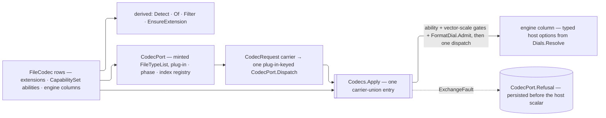

# [RASM_RHINO_FORMATS]

`FileCodec` owns codec identity, detection, filter projection, and direct Rhino engine dispatch. `CodecRequest` closes ingress and egress carrier shape under one `Codecs.Apply` rail, while `FormatDial.Admit` proves the seat and axis demands of every option case the request carries.

Capability, fidelity, and scale participation are all SET membership over `CapabilitySet<T>` (`Domain/validation`), refusals ride the folder `ExchangeFault` family, and unit correspondence keys on the kernel `ModelUnit` regime (all at `Exchange/operations` and the kernel). This page mints no vocabulary those owners already carry.

## [01]-[INDEX]

- [02]-[ABILITY_AXES]: `CodecAbility` the capability vocabulary, `CodecPhase` the dispatch phases, `FidelityTrait`/`CodecFidelity`/`CodecAxis`/`CodecResource` the tune policy rows, and `CodecTune` the one option-policy record.
- [03]-[VECTOR_SCALE]: `VectorUnit` the unit correspondence rows, `VectorLens<TOptions>` the per-option-type setter row, and `VectorScale` the one generic application.
- [04]-[CODEC_MATRIX]: `FileCodec` — the generated row set with engine adapters and option projections, and the derived lookup, filter, and extension surfaces.
- [05]-[DIALOG_PORT]: `CodecPort` — `FileTypeList` minting, plug-in-keyed index dispatch over the matrix, and the refusal cell each terminal collapse writes.

## [02]-[ABILITY_AXES]

- Owner: `CodecAbility` `[SmartEnum<string>]` realizing `ICapability<CodecAbility>` — the combinable capability vocabulary a row declares as a `CapabilitySet`: `Archive` (3dm-native), `Import`, `Export`, `Vector` (page-space vector interchange), `Raster` (pixel egress rows the publish pipeline encodes), `Selection` (rows whose selected-object write is non-interactive). `CodecPhase` `[SmartEnum<string>]` — the dispatch phases, each carrying a `Demands` ability column the filter derivation and the entry gates read; the string key reaches `Admit`'s seat refusal, so a phase names itself to a caller instead of printing an ordinal. `FidelityTrait` `[SmartEnum<string>]` realizing `ICapability<FidelityTrait>` — `Model`, `Measured`, `Materials`, the three independent fidelity claims a write can make. `CodecFidelity` `[SmartEnum<int>]` — the three named fidelity rows, each carrying its trait set under one `CapabilityLaw` and one `Option<DracoDial>`. `CodecAxis` `[SmartEnum<int>]` — the grouping/ordering vocabulary. `CodecResource` `[SmartEnum<int>]` — `Reference`/`Embed`/`Copy`. `CodecTune` — the one option-policy record every option projection reads.
- Cases: `Selection` covers the host-native `3dm` selected export plus the carrier-threading engines whose typed options embed the host `FileWriteOptions`, so `WriteSelectedObjectsOnly` reaches the writer; every other row's dictionary-less selected export falls back to the format plug-in's interactive option getter and is refused at the gate.
- Law: capability is set membership, not a sequence with a linear probe — a row's `Abilities` is one `CapabilitySet<CodecAbility>` and `Has` is the derived read every consumer already spells, so a phase admits a row through one hash probe and the roster prints through `Wire`. A phase admits a row only when `Demands` is a member, so an engine-less raster row structurally never reaches an engine delegate.
- Law: every ability carries a live reader, so no row is decoration — `Import`/`Export` gate `Codecs.Apply` through `CodecPhase.Demands`, `Vector` gates the scale axis at that same entry, `Selection` gates `ExportScope.Carrier`, `Raster` gates `RasterCodec`'s extension admission, and `Archive` is the discriminant `DocumentWritePolicy.Codec` reads to decide which write target is `3dm`-bound.
- Law: fidelity is a TRAIT SET under an exact-corner law, and `CodecTune.Materials` DERIVES from it. The prior shape carried `IsModel` and `Measured` as booleans on the fidelity row and `Materials` as a fourth boolean on the tune, where every preset set `Materials` to exactly `Fidelity != Model` — a knob whose value the policy already reconstructed, and one a caller could diverge with `with` into a state no fidelity row means. The vocabulary is CLOSED at three rows, so the law states the three legal corners EXACTLY rather than barring pairs, and `IsModel`/`Measured`/`Materials` survive as derived reads off the one authority. NAMED LOSS: a caller's ability to request materials against a small-fidelity write; that request is now a fidelity choice, which is what it always meant.
- Law: the `Draco` column is a stance every fidelity row declares, not a slot one row fills — the lossless row spells `None` as its own decision and each lossy row carries the band its fidelity means, so the glTF dial reads a policy the tune already settled instead of a per-format default it would have to re-derive.
- Law: `CodecTune` arrives pre-constructed and carries its whole policy; no codec entrypoint grows a boolean beside it, a consumer needing one divergent tune axis takes `with` on a preset, and a consumer needing per-format depth sets `Dial` to the owning dial case.
- Packages: `Domain/validation` (`CapabilitySet<T>`, `CapabilityLaw<T>`, `ICapability<T>`), `Rasm.Numerics` (`Dimension`), `Exchange/options` (`FormatDial`, `DracoDial`), Thinktecture.Runtime.Extensions (`[SmartEnum]`).
- Growth: a new fidelity is one row plus its legal corner; a new trait, axis, or resource stance is one row; every option projection that reads the new column breaks loudly at the row constructor, never silently at a call site.

```csharp
// --- [IMPORTS] -------------------------------------------------------------------------
using Rasm.Domain;
using Rasm.Numerics;
using Rasm.Rhino.Document;
using Rhino.FileIO;
using Rhino.PlugIns;
using System.Runtime.InteropServices;

namespace Rasm.Rhino.Exchange;

// --- [TYPES] ---------------------------------------------------------------------------
[SmartEnum<string>]
public sealed partial class CodecAbility : ICapability<CodecAbility> {
    public static readonly CodecAbility Archive = new(key: "archive");
    public static readonly CodecAbility Import = new(key: "import");
    public static readonly CodecAbility Export = new(key: "export");
    public static readonly CodecAbility Vector = new(key: "vector");
    public static readonly CodecAbility Raster = new(key: "raster");
    public static readonly CodecAbility Selection = new(key: "selection");
}

[SmartEnum<string>]
public sealed partial class CodecPhase {
    public static readonly CodecPhase Import = new(key: "import", demands: CodecAbility.Import);
    public static readonly CodecPhase Export = new(key: "export", demands: CodecAbility.Export);

    public CodecAbility Demands { get; }
}

[SmartEnum<string>]
public sealed partial class FidelityTrait : ICapability<FidelityTrait> {
    public static readonly FidelityTrait Model = new(key: "model");
    public static readonly FidelityTrait Measured = new(key: "measured");
    public static readonly FidelityTrait Materials = new(key: "materials");

    public static CapabilityLaw<FidelityTrait> Law { get; } = new(Legal: Seq(
        CapabilitySet<FidelityTrait>.Of(Model, Measured, Materials),
        CapabilitySet<FidelityTrait>.None,
        CapabilitySet<FidelityTrait>.Of(Measured)));
}

[SmartEnum<int>]
public sealed partial class CodecFidelity {
    public static readonly CodecFidelity Model = new(key: 0,
        traits: CapabilitySet<FidelityTrait>.Of(FidelityTrait.Model, FidelityTrait.Measured, FidelityTrait.Materials),
        draco: None);
    public static readonly CodecFidelity Small = new(key: 1,
        traits: CapabilitySet<FidelityTrait>.None,
        draco: Some(Compressed(level: 7, positionBits: 11, normalBits: 8, textureBits: 10)));
    public static readonly CodecFidelity GeometryOnly = new(key: 2,
        traits: CapabilitySet<FidelityTrait>.Of(FidelityTrait.Measured),
        draco: Some(Compressed(level: 5, positionBits: 14, normalBits: 10, textureBits: 8)));

    public CapabilitySet<FidelityTrait> Traits { get; }
    public Option<DracoDial> Draco { get; }

    public bool IsModel => Traits.Admits(capability: FidelityTrait.Model);
    public bool Measured => Traits.Admits(capability: FidelityTrait.Measured);
    public bool Materials => Traits.Admits(capability: FidelityTrait.Materials);

    private static DracoDial Compressed(int level, int positionBits, int normalBits, int textureBits) =>
        DracoDial.Create(
            level: Rasm.Numerics.Dimension.Create(value: level),
            positionBits: Rasm.Numerics.Dimension.Create(value: positionBits),
            normalBits: Rasm.Numerics.Dimension.Create(value: normalBits),
            textureBits: Rasm.Numerics.Dimension.Create(value: textureBits));
}

[SmartEnum<int>]
public sealed partial class CodecAxis {
    public static readonly CodecAxis Stable = new(key: 0);
    public static readonly CodecAxis Document = new(key: 1);
    public static readonly CodecAxis File = new(key: 2);
    public static readonly CodecAxis Layer = new(key: 3);
    public static readonly CodecAxis ObjectName = new(key: 4);
    public static readonly CodecAxis ObjectType = new(key: 5);
    public static readonly CodecAxis Material = new(key: 6);
    public static readonly CodecAxis Block = new(key: 7);
    public static readonly CodecAxis UserString = new(key: 8);
}

[SmartEnum<int>]
public sealed partial class CodecResource {
    public static readonly CodecResource Reference = new(key: 0);
    public static readonly CodecResource Embed = new(key: 1);
    public static readonly CodecResource Copy = new(key: 2);
}

// --- [MODELS] --------------------------------------------------------------------------
public sealed record CodecTune(
    CodecFidelity Fidelity,
    CodecResource Resources,
    CodecAxis Group,
    CodecAxis Order,
    Option<VectorScale> Scale,
    Option<FormatDial> Dial = default) {
    public static CodecTune Model { get; } = new(
        Fidelity: CodecFidelity.Model, Resources: CodecResource.Reference,
        Group: CodecAxis.Document, Order: CodecAxis.Stable, Scale: None);

    public static CodecTune Small { get; } = Model with { Fidelity = CodecFidelity.Small };

    public static CodecTune GeometryOnly { get; } = Model with { Fidelity = CodecFidelity.GeometryOnly };

    public bool Materials => Fidelity.Materials;

    internal bool Grouped(CodecAxis axis) => Group == axis || Order == axis;
}
```

## [03]-[VECTOR_SCALE]

- Owner: `VectorUnit` `[SmartEnum<int>]` carries the host unit correspondences, keyed on the kernel `ModelUnit` regime it names. `VectorLens<TOptions>` carries the four option setters. `VectorScale` `[Union]` closes the two scale intentions and applies either through one generic lens.
- Cases: `PreservedCase` keeps the document's model scale and writes nothing else; `ScaledCase` declares the model scale NOT preserved and carries whichever explicit members the caller stated.
- Law: the two scale intentions are CASES, so the contradiction is unrepresentable rather than validated. The prior `[ComplexValueObject]` carried `Option<bool> Preserve` beside three explicit members, derived a `HasExplicit` predicate and a `PreserveMode` projection from them, and refused the `preserve && explicit` corner in a hook — four members and a validator encoding one binary choice. `PreservedCase` writes `PreserveModelScale = true` and stops; `ScaledCase` writes it `false` and applies its stated members. NAMED LOSS: spelling "do not preserve" as an explicit `Preserve = false` column with no members; that state IS `ScaledCase` with none stated, and the case name says so.
- Law: unit correspondence keys on the KERNEL regime, never on a local unit roster. Each row names the `UnitSystem` its `ModelUnit` publishes beside the four host option enums the vector engines demand, so `For` resolves a document's own unit to its host spelling and the drawing-standards owner's `SheetSize.In` stays the size projection it is — that member answers a width and height pair and can name no `FilePdfReadOptions.PDF_UNITS` member, so it does not replace this correspondence.
- Law: scale participation is a row fact `Codecs.Apply` enforces — a `Some` scale against a codec lacking `CodecAbility.Vector` is a typed refusal at the entry gate, never a value the dispatch silently discards for want of a lens.
- Exemption: `VectorScale.Apply`'s ordered `Iter` statements are the host-mutation capsule and the platform-forced statement exemption; every caller remains expression-shaped.
- Packages: `Domain/context` (`ModelUnit`), `Exchange/operations` (`ExchangeFault`), RhinoCommon (`FilePdfReadOptions.PDF_UNITS`, `FileAiReadOptions.Units`, `FileAiWriteOptions.Units`, `FileEpsReadOptions.Units`) per `.api/api-rhinocommon-fileio.md`.
- Growth: a new vector-capable engine is one `VectorLens` row; a new admitted unit is one `VectorUnit` row carrying its four host spellings.

```csharp
// --- [TYPES] ---------------------------------------------------------------------------
[SmartEnum<int>]
public sealed partial class VectorUnit {
    public static readonly VectorUnit Inches = new(key: 0, unit: UnitSystem.Inches,
        pdf: FilePdfReadOptions.PDF_UNITS.inches, aiRead: FileAiReadOptions.Units.Inches,
        aiWrite: FileAiWriteOptions.Units.Inches, eps: FileEpsReadOptions.Units.Inches);
    public static readonly VectorUnit Centimeters = new(key: 1, unit: UnitSystem.Centimeters,
        pdf: FilePdfReadOptions.PDF_UNITS.centimeters, aiRead: FileAiReadOptions.Units.Centimeters,
        aiWrite: FileAiWriteOptions.Units.Centimeters, eps: FileEpsReadOptions.Units.Centimeters);
    public static readonly VectorUnit Millimeters = new(key: 2, unit: UnitSystem.Millimeters,
        pdf: FilePdfReadOptions.PDF_UNITS.millimeters, aiRead: FileAiReadOptions.Units.Millimeters,
        aiWrite: FileAiWriteOptions.Units.Millimeters, eps: FileEpsReadOptions.Units.Millimeters);
    public static readonly VectorUnit Points = new(key: 3, unit: UnitSystem.PrinterPoints,
        pdf: FilePdfReadOptions.PDF_UNITS.points, aiRead: FileAiReadOptions.Units.Points,
        aiWrite: FileAiWriteOptions.Units.Points, eps: FileEpsReadOptions.Units.Points);

    public UnitSystem Unit { get; }

    internal FilePdfReadOptions.PDF_UNITS Pdf { get; }
    internal FileAiReadOptions.Units AiRead { get; }
    internal FileAiWriteOptions.Units AiWrite { get; }
    internal FileEpsReadOptions.Units Eps { get; }

    public static Fin<VectorUnit> For(ModelUnit unit, Op? key = null) {
        Op op = key.OrDefault();
        return toSeq(Items)
            .Find(row => row.Unit == unit.System)
            .ToFin(Fail: new KernelFault.InvalidValue(nameof(VectorUnit), string.Join(" | ", new object?[] { op, $"a unit the vector engines name; got '{unit.System}'" })));
    }
}

[Union(ConversionFromValue = ConversionOperatorsGeneration.None)]
public abstract partial record VectorScale {
    private VectorScale() { }
    public sealed record PreservedCase : VectorScale;
    public sealed record ScaledCase(Option<VectorUnit> Unit, Option<double> Source, Option<double> Rhino) : VectorScale;

    public static VectorScale Preserved { get; } = new PreservedCase();

    public static Fin<VectorScale> Of(
        Option<VectorUnit> vectorUnit = default,
        Option<double> source = default,
        Option<double> rhino = default,
        Op? key = null) {
        Op op = key.OrDefault();
        return FactoryValidation.Admit(FactoryValidation.Violated(
                (source.Exists(static value => !double.IsFinite(value) || value <= 0d),
                    () => new ValidationClause(string.Join(" | ", new object?[] { op, nameof(ScaledCase.Source), source.IfNone(noneValue: 0d), "a finite positive source scale" }))),
                (rhino.Exists(static value => !double.IsFinite(value) || value <= 0d),
                    () => new ValidationClause(string.Join(" | ", new object?[] { op, nameof(ScaledCase.Rhino), rhino.IfNone(noneValue: 0d), "a finite positive Rhino scale" })))))
            .Map(_ => (VectorScale)new ScaledCase(Unit: vectorUnit, Source: source, Rhino: rhino));
    }

    internal TOptions Apply<TOptions>(TOptions options, VectorLens<TOptions> lens) where TOptions : class => Switch(
        state: (Options: options, Lens: lens),
        preservedCase: static (ctx, _) => {
            ctx.Lens.Preserve(arg1: ctx.Options, arg2: true);
            return ctx.Options;
        },
        scaledCase: static (ctx, scale) => {
            ctx.Lens.Preserve(arg1: ctx.Options, arg2: false);
            _ = scale.Rhino.Iter(value => ctx.Lens.Rhino(arg1: ctx.Options, arg2: value));
            _ = scale.Source.Iter(value => ctx.Lens.Source(arg1: ctx.Options, arg2: value));
            _ = scale.Unit.Iter(value => ctx.Lens.Unit(arg1: ctx.Options, arg2: value));
            return ctx.Options;
        });
}

// --- [MODELS] --------------------------------------------------------------------------
public sealed record VectorLens<TOptions>(
    Action<TOptions, bool> Preserve,
    Action<TOptions, double> Rhino,
    Action<TOptions, double> Source,
    Action<TOptions, VectorUnit> Unit) where TOptions : class;

// --- [CONSTANTS] -----------------------------------------------------------------------
internal static class VectorLenses {
    internal static readonly VectorLens<FilePdfReadOptions> Pdf = new(
        Preserve: static (o, v) => o.PreserveModelScale = v, Rhino: static (o, v) => o.RhinoScale = v,
        Source: static (o, v) => o.PDFScale = v, Unit: static (o, v) => o.PdfUnits = v.Pdf);
    internal static readonly VectorLens<FileAiReadOptions> AiRead = new(
        Preserve: static (o, v) => o.PreserveModelScale = v, Rhino: static (o, v) => o.RhinoScale = v,
        Source: static (o, v) => o.AiScale = v, Unit: static (o, v) => o.AiUnits = v.AiRead);
    internal static readonly VectorLens<FileAiWriteOptions> AiWrite = new(
        Preserve: static (o, v) => o.PreserveModelScale = v, Rhino: static (o, v) => o.RhinoScale = v,
        Source: static (o, v) => o.AIScale = v, Unit: static (o, v) => o.AiUnits = v.AiWrite);
    internal static readonly VectorLens<FileEpsReadOptions> Eps = new(
        Preserve: static (o, v) => o.PreserveModelScale = v, Rhino: static (o, v) => o.RhinoScale = v,
        Source: static (o, v) => o.EpsScale = v, Unit: static (o, v) => o.EpsUnits = v.Eps);
}
```

## [04]-[CODEC_MATRIX]

- Owner: `FileCodec` `[SmartEnum<string>]` is the interchange matrix. Each row declares extensions, an ability set, and two engine columns; each engine composes polymorphic `Dials.Resolve`, while unsupported legs share one typed refusal.
- Entry: `Codecs.Apply(RhinoDoc, DocumentPath, FileCodec, CodecTune, CodecRequest, Op?)` accepts one carrier union and dispatches once through the selected row. `Exchanges.Run` and `CodecPort.Dispatch` remain the only raw-document consumers.
- Law: `Detect`, `Of`, `Filter`, `Archive`, and `EnsureExtension` derive from `Items` through lazy frozen indexes — the declaration list is the single source, a new row lands in every derived surface with zero additional edits, and a reserved key (`json`) is refused at the row-lookup boundary so wire payload spellings never collide with interchange formats. The dialog filter is indexed on both axes: each row's host filter fragment mints once, each phase's whole-roster string mints once, and a subset call joins already-minted fragments.
- Law: every host `bool`-plus-`out` lookup crosses through `Op.Probe`, so the matrix carries no `TryGetValue` shape inward and `Resolve` reads as one alternative between two probes terminating in one typed `CodecUnknown`.
- Law: the vocabulary is closed — a format the matrix lacks is one new row, and a foreign plug-in's format reaches the document only through the host's own dialog dispatch, never through this matrix.
- Law: engine outcomes normalize at the row through THREE factories, one per genuine axis. The host publishes two write verdict currencies — `FileObj.Write` and `FilePly.Write` answer `WriteFileResult` and every other engine answers `bool` — and that plurality is host-forced. The mint-arity axis was NOT: two of the prior six factories had zero callers and the remaining pair differed only by a lambda forwarding a three-argument mint to a two-argument one, which is a shell family, so every row now spells the carrier-bearing mint and the shells are gone. NAMED LOSS: the two-argument mint spelling at the rows that ignore the host carrier; each states `_` for it.
- Law: a hand-spelled engine closure survives only where the row composes a scale lens or a host-owned transport (`Ai`, `Eps`, `Pdf`, `3dm`, `Xaml`).
- Packages: `Domain/rails` (`Op.Probe`, `Op.Catch`, `Op.Confirm`), `Domain/validation` (`CapabilitySet<T>`), `Exchange/operations` (`ExchangeFault`), `Exchange/options` (`FormatDial`, `FormatDial.Admit`, `Dials.Resolve`, `Dials.Scale`), RhinoCommon (the direct format engines, `FileReadOptions`, `FileWriteOptions`, `WriteFileResult`) per `.api/api-rhinocommon-fileio.md`.
- Growth: a new interchange format is one row naming its extensions, its ability set, and its two engine columns.
- Boundary: `FilePdf` page authoring and raster encoding are `publish.md` egress; the `pdf`/`svg` rows here own only page-space vector import, and the raster rows are the extension authority each `RasterCodec` row admits itself against — the publish target vocabulary keys on `FileCodec` row identity, never on the raster ability.

```csharp
// --- [MODELS] --------------------------------------------------------------------------
[SmartEnum<string>]
public sealed partial class FileCodec {
    public static readonly FileCodec ThreeDm = new("3dm", Seq(".3dm"),
        CapabilitySet<CodecAbility>.Of(CodecAbility.Archive, CodecAbility.Import, CodecAbility.Export, CodecAbility.Selection),
        static (tune, carrier, doc, path, op) =>
            op.Confirm(success: doc.Import(filePath: path, options: new Rhino.Collections.ArchivableDictionary())),
        static (tune, carrier, doc, path, op) =>
            op.Confirm(success: doc.Write3dmFile(path: path, options: carrier)));
    public static readonly FileCodec ThreeDs = new("3ds", Seq(".3ds"),
        CapabilitySet<CodecAbility>.Of(CodecAbility.Import, CodecAbility.Export),
        Reader(File3ds.Read, static () => new FormatDial.ThreeDsReadCase(), static (dial, _, _) => dial.Mint()),
        Writer(File3ds.Write, static () => new FormatDial.ThreeDsWriteCase(), static (dial, policy, _) => dial.Mint(tune: policy)));
    public static readonly FileCodec ThreeMf = new("3mf", Seq(".3mf"),
        CapabilitySet<CodecAbility>.Of(CodecAbility.Export), Unread,
        Writer(File3mf.Write, static () => new FormatDial.ThreeMfWriteCase(), static (dial, _, _) => dial.Mint()));
    public static readonly FileCodec Ai = new("ai", Seq(".ai"),
        CapabilitySet<CodecAbility>.Of(CodecAbility.Import, CodecAbility.Export, CodecAbility.Vector),
        static (tune, carrier, doc, path, op) => Confirm(FileAi.Read(path, doc,
            Dials.Scale(new FileAiReadOptions { PreserveModelScale = tune.Fidelity.IsModel }, tune, VectorLenses.AiRead)), op),
        static (tune, carrier, doc, path, op) => Confirm(FileAi.Write(path, doc,
            Dials.Scale(
                Dials.Resolve(tune, carrier, static () => new FormatDial.AiWriteCase(), static (dial, policy, _) => dial.Mint(tune: policy)),
                tune,
                VectorLenses.AiWrite)), op));
    public static readonly FileCodec Amf = new("amf", Seq(".amf"),
        CapabilitySet<CodecAbility>.Of(CodecAbility.Export), Unread,
        Writer(FileAmf.Write, static () => new FormatDial.AmfWriteCase(), static (dial, _, _) => dial.Mint()));
    public static readonly FileCodec Obj = new("obj", Seq(".obj"),
        CapabilitySet<CodecAbility>.Of(CodecAbility.Import, CodecAbility.Export, CodecAbility.Selection),
        Reader(FileObj.Read, static () => new FormatDial.ObjReadCase(), static (dial, _, host) => dial.Mint(carrier: host)),
        Writer(FileObj.Write, static () => new FormatDial.ObjWriteCase(), static (dial, policy, host) => dial.Mint(tune: policy, carrier: host)));
    public static readonly FileCodec Ply = new("ply", Seq(".ply"),
        CapabilitySet<CodecAbility>.Of(CodecAbility.Import, CodecAbility.Export, CodecAbility.Selection),
        Reader(FilePly.Read, static () => new FormatDial.PlyReadCase(), static (dial, _, _) => dial.Mint()),
        Writer(FilePly.Write, static () => new FormatDial.PlyWriteCase(), static (dial, policy, host) => dial.Mint(tune: policy, carrier: host)));
    public static readonly FileCodec Cd = new("cd", Seq(".cd"),
        CapabilitySet<CodecAbility>.Of(CodecAbility.Export), Unread,
        Writer(FileCd.Write, static () => new FormatDial.CdWriteCase(), static (dial, _, _) => dial.Mint()));
    public static readonly FileCodec Dgn = new("dgn", Seq(".dgn"),
        CapabilitySet<CodecAbility>.Of(CodecAbility.Import),
        Reader(FileDgn.Read, static () => new FormatDial.DgnReadCase(), static (dial, _, _) => dial.Mint()), Unwritten);
    public static readonly FileCodec Dst = new("dst", Seq(".dst"),
        CapabilitySet<CodecAbility>.Of(CodecAbility.Import),
        Reader(FileDst.Read, static () => new FormatDial.DstReadCase(), static (dial, _, _) => dial.Mint()), Unwritten);
    public static readonly FileCodec Dwg = new("dwg", Seq(".dwg", ".dxf"),
        CapabilitySet<CodecAbility>.Of(CodecAbility.Import, CodecAbility.Export),
        Reader(FileDwg.Read, static () => new FormatDial.DwgReadCase(), static (dial, _, _) => dial.Mint()),
        Writer(FileDwg.Write, static () => new FormatDial.DwgWriteCase(), static (dial, policy, _) => dial.Mint(tune: policy)));
    public static readonly FileCodec Eps = new("eps", Seq(".eps"),
        CapabilitySet<CodecAbility>.Of(CodecAbility.Import, CodecAbility.Vector),
        static (tune, carrier, doc, path, op) => Confirm(FileEps.Read(path, doc,
            Dials.Scale(new FileEpsReadOptions { PreserveModelScale = tune.Fidelity.IsModel }, tune, VectorLenses.Eps)), op), Unwritten);
    public static readonly FileCodec Stl = new("stl", Seq(".stl"),
        CapabilitySet<CodecAbility>.Of(CodecAbility.Import, CodecAbility.Export),
        Reader(FileStl.Read, static () => new FormatDial.StlReadCase(), static (dial, _, _) => dial.Mint()),
        Writer(FileStl.Write, static () => new FormatDial.StlWriteCase(), static (dial, _, _) => dial.Mint()));
    public static readonly FileCodec Stp = new("stp", Seq(".stp", ".step"),
        CapabilitySet<CodecAbility>.Of(CodecAbility.Import, CodecAbility.Export),
        Reader(FileStp.Read, static () => new FormatDial.StpReadCase(), static (dial, _, _) => dial.Mint()),
        Writer(FileStp.Write, static () => new FormatDial.StpWriteCase(), static (dial, _, _) => dial.Mint()));
    public static readonly FileCodec Fbx = new("fbx", Seq(".fbx"),
        CapabilitySet<CodecAbility>.Of(CodecAbility.Import, CodecAbility.Export),
        Reader(FileFbx.Read, static () => new FormatDial.FbxReadCase(), static (dial, _, _) => dial.Mint()),
        Writer(FileFbx.Write, static () => new FormatDial.FbxWriteCase(), static (dial, policy, _) => dial.Mint(tune: policy)));
    public static readonly FileCodec Ghs = new("ghs", Seq(".ghs"),
        CapabilitySet<CodecAbility>.Of(CodecAbility.Import),
        Reader(FileGHS.Read, static () => new FormatDial.GhsReadCase(), static (dial, _, _) => dial.Mint()), Unwritten);
    public static readonly FileCodec Gts = new("gts", Seq(".gts"),
        CapabilitySet<CodecAbility>.Of(CodecAbility.Export), Unread,
        Writer(FileGts.Write, static () => new FormatDial.GtsWriteCase(), static (dial, _, _) => dial.Mint()));
    public static readonly FileCodec Igs = new("igs", Seq(".igs", ".iges"),
        CapabilitySet<CodecAbility>.Of(CodecAbility.Export), Unread,
        Writer(FileIgs.Write, static () => new FormatDial.IgsWriteCase(), static (dial, _, _) => dial.Mint()));
    public static readonly FileCodec Lwo = new("lwo", Seq(".lwo"),
        CapabilitySet<CodecAbility>.Of(CodecAbility.Import, CodecAbility.Export),
        Reader(FileLwo.Read, static () => new FormatDial.LwoReadCase(), static (dial, _, _) => dial.Mint()),
        Writer(FileLwo.Write, static () => new FormatDial.LwoWriteCase(), static (dial, _, _) => dial.Mint()));
    public static readonly FileCodec Nwd = new("nwd", Seq(".nwd"),
        CapabilitySet<CodecAbility>.Of(CodecAbility.Export), Unread,
        Writer(FileNwd.Write, static () => new FormatDial.NwdWriteCase(), static (dial, _, _) => dial.Mint()));
    public static readonly FileCodec Pov = new("pov", Seq(".pov"),
        CapabilitySet<CodecAbility>.Of(CodecAbility.Export), Unread,
        Writer(FilePov.Write, static () => new FormatDial.PovWriteCase(), static (dial, _, _) => dial.Mint()));
    public static readonly FileCodec Sat = new("sat", Seq(".sat"),
        CapabilitySet<CodecAbility>.Of(CodecAbility.Export), Unread,
        Writer(FileSat.Write, static () => new FormatDial.SatWriteCase(), static (dial, _, _) => dial.Mint()));
    public static readonly FileCodec Skp = new("skp", Seq(".skp"),
        CapabilitySet<CodecAbility>.Of(CodecAbility.Import, CodecAbility.Export),
        Reader(FileSkp.Read, static () => new FormatDial.SkpReadCase(), static (dial, _, _) => dial.Mint()),
        Writer(FileSkp.Write, static () => new FormatDial.SkpWriteCase(), static (dial, policy, _) => dial.Mint(tune: policy)));
    public static readonly FileCodec Slc = new("slc", Seq(".slc"),
        CapabilitySet<CodecAbility>.Of(CodecAbility.Export), Unread,
        Writer(FileSlc.Write, static () => new FormatDial.SlcWriteCase(), static (dial, _, _) => dial.Mint()));
    public static readonly FileCodec Sw = new("sw", Seq(".sldprt", ".sldasm"),
        CapabilitySet<CodecAbility>.Of(CodecAbility.Import),
        Reader(FileSW.Read, static () => new FormatDial.SwReadCase(), static (dial, _, _) => dial.Mint()), Unwritten);
    public static readonly FileCodec Udo = new("udo", Seq(".udo"),
        CapabilitySet<CodecAbility>.Of(CodecAbility.Export), Unread,
        Writer(FileUdo.Write, static () => new FormatDial.UdoWriteCase(), static (dial, _, _) => dial.Mint()));
    public static readonly FileCodec Vda = new("vda", Seq(".vda"),
        CapabilitySet<CodecAbility>.Of(CodecAbility.Export), Unread,
        Writer(FileVda.Write, static () => new FormatDial.VdaWriteCase(), static (dial, _, _) => dial.Mint()));
    public static readonly FileCodec Vrml = new("vrml", Seq(".wrl", ".vrml"),
        CapabilitySet<CodecAbility>.Of(CodecAbility.Export), Unread,
        Writer(FileVrml.Write, static () => new FormatDial.VrmlWriteCase(), static (dial, policy, _) => dial.Mint(tune: policy)));
    public static readonly FileCodec X3dv = new("x3dv", Seq(".x3dv"),
        CapabilitySet<CodecAbility>.Of(CodecAbility.Export), Unread,
        Writer(FileX3dv.Write, static () => new FormatDial.X3dvWriteCase(), static (dial, policy, _) => dial.Mint(tune: policy)));
    public static readonly FileCodec Xaml = new("xaml", Seq(".xaml"),
        CapabilitySet<CodecAbility>.Of(CodecAbility.Export), Unread,
        static (tune, carrier, doc, path, op) => op.Confirm(success: doc.Export(filePath: path,
            options: Dials.Resolve(
                tune,
                carrier,
                static () => new FormatDial.XamlWriteCase(),
                static (dial, policy, _) => dial.Mint(tune: policy)).ToDictionary())));
    public static readonly FileCodec XT = new("x_t", Seq(".x_t", ".x_b"),
        CapabilitySet<CodecAbility>.Of(CodecAbility.Export), Unread,
        Writer(FileX_T.Write, static () => new FormatDial.XTWriteCase(), static (dial, _, _) => dial.Mint()));
    public static readonly FileCodec Raw = new("raw", Seq(".raw"),
        CapabilitySet<CodecAbility>.Of(CodecAbility.Import, CodecAbility.Export),
        Reader(FileRaw.Read, static () => new FormatDial.RawReadCase(), static (dial, _, _) => dial.Mint()),
        Writer(FileRaw.Write, static () => new FormatDial.RawWriteCase(), static (dial, _, _) => dial.Mint()));
    public static readonly FileCodec Txt = new("txt", Seq(".txt"),
        CapabilitySet<CodecAbility>.Of(CodecAbility.Import, CodecAbility.Export),
        Reader(FileTxt.Read, static () => new FormatDial.TxtReadCase(), static (dial, _, _) => dial.Mint()),
        Writer(FileTxt.Write, static () => new FormatDial.TxtWriteCase(), static (dial, policy, _) => dial.Mint(tune: policy)));
    public static readonly FileCodec Csv = new("csv", Seq(".csv"),
        CapabilitySet<CodecAbility>.Of(CodecAbility.Export), Unread,
        Writer(FileCsv.Write, static () => new FormatDial.CsvWriteCase(), static (dial, policy, _) => dial.Mint(tune: policy)));
    public static readonly FileCodec Gltf = new("gltf", Seq(".gltf", ".glb"),
        CapabilitySet<CodecAbility>.Of(CodecAbility.Export), Unread,
        Writer(FileGltf.Write, static () => new FormatDial.GltfWriteCase(), static (dial, policy, _) => dial.Mint(tune: policy)));
    public static readonly FileCodec Usd = new("usd", Seq(".usd", ".usda", ".usdz"),
        CapabilitySet<CodecAbility>.Of(CodecAbility.Export), Unread,
        Writer(FileUsd.Write, static () => new FormatDial.UsdWriteCase(), static (dial, policy, _) => dial.Mint(tune: policy)));
    public static readonly FileCodec Pdf = new("pdf", Seq(".pdf"),
        CapabilitySet<CodecAbility>.Of(CodecAbility.Import, CodecAbility.Vector),
        static (tune, carrier, doc, path, op) => Confirm(FilePdf.Read(path, doc,
            Dials.Scale(
                Dials.Resolve(tune, carrier, static () => new FormatDial.PdfReadCase(), static (dial, policy, _) => dial.Mint(tune: policy)),
                tune,
                VectorLenses.Pdf)), op), Unwritten);
    public static readonly FileCodec Svg = new("svg", Seq(".svg"),
        CapabilitySet<CodecAbility>.Of(CodecAbility.Import, CodecAbility.Vector),
        Reader(FileSvg.Read, static () => new FormatDial.SvgReadCase(), static (dial, _, _) => dial.Mint()), Unwritten);
    public static readonly FileCodec Png = new("png", Seq(".png"),
        CapabilitySet<CodecAbility>.Of(CodecAbility.Raster), Unread, Unwritten);
    public static readonly FileCodec Jpeg = new("jpeg", Seq(".jpg", ".jpeg"),
        CapabilitySet<CodecAbility>.Of(CodecAbility.Raster), Unread, Unwritten);
    public static readonly FileCodec Tiff = new("tiff", Seq(".tif", ".tiff"),
        CapabilitySet<CodecAbility>.Of(CodecAbility.Raster), Unread, Unwritten);
    public static readonly FileCodec Bmp = new("bmp", Seq(".bmp"),
        CapabilitySet<CodecAbility>.Of(CodecAbility.Raster), Unread, Unwritten);

    public Seq<string> Extensions { get; }
    public CapabilitySet<CodecAbility> Abilities { get; }

    [UseDelegateFromConstructor]
    internal partial Fin<Unit> ReadEngine(CodecTune tune, FileReadOptions carrier, RhinoDoc document, string path, Op key);

    [UseDelegateFromConstructor]
    internal partial Fin<Unit> WriteEngine(CodecTune tune, FileWriteOptions carrier, RhinoDoc document, string path, Op key);

    public bool Has(CodecAbility ability) => Abilities.Admits(capability: ability);

    public string EnsureExtension(string path) =>
        Extensions.Exists(ext => path.EndsWith(ext, StringComparison.OrdinalIgnoreCase))
            ? path
            : path + Extensions.Head.IfNone(noneValue: string.Empty);

    private static Fin<Unit> Confirm(bool success, Op op) => op.Confirm(success: success);
    private static Fin<Unit> Confirm(WriteFileResult result, Op op) =>
        op.Confirm(success: result == WriteFileResult.Success);

    private static Fin<Unit> Unread(CodecTune tune, FileReadOptions carrier, RhinoDoc document, string path, Op key) =>
        Fin.Fail<Unit>(error: new ExchangeFault.AbilityMissing(
            Key: key, Codec: System.IO.Path.GetExtension(path), Ability: CodecAbility.Import.Key));
    private static Fin<Unit> Unwritten(CodecTune tune, FileWriteOptions carrier, RhinoDoc document, string path, Op key) =>
        Fin.Fail<Unit>(error: new ExchangeFault.AbilityMissing(
            Key: key, Codec: System.IO.Path.GetExtension(path), Ability: CodecAbility.Export.Key));

    private static Func<CodecTune, FileReadOptions, RhinoDoc, string, Op, Fin<Unit>> Reader<TCase, TOptions>(
        Func<string, RhinoDoc, TOptions, bool> engine, Func<TCase> dial, Func<TCase, CodecTune, FileReadOptions, TOptions> mint)
        where TCase : FormatDial =>
        (tune, carrier, doc, path, op) => Confirm(engine(path, doc, Dials.Resolve(tune, carrier, dial, mint)), op);

    private static Func<CodecTune, FileWriteOptions, RhinoDoc, string, Op, Fin<Unit>> Writer<TCase, TOptions>(
        Func<string, RhinoDoc, TOptions, bool> engine, Func<TCase> dial, Func<TCase, CodecTune, FileWriteOptions, TOptions> mint)
        where TCase : FormatDial =>
        (tune, carrier, doc, path, op) => Confirm(engine(path, doc, Dials.Resolve(tune, carrier, dial, mint)), op);

    private static Func<CodecTune, FileWriteOptions, RhinoDoc, string, Op, Fin<Unit>> Writer<TCase, TOptions>(
        Func<string, RhinoDoc, TOptions, WriteFileResult> engine, Func<TCase> dial, Func<TCase, CodecTune, FileWriteOptions, TOptions> mint)
        where TCase : FormatDial =>
        (tune, carrier, doc, path, op) => Confirm(engine(path, doc, Dials.Resolve(tune, carrier, dial, mint)), op);
}

// --- [OPERATIONS] ----------------------------------------------------------------------
[Union]
internal abstract partial record CodecRequest {
    private CodecRequest() { }

    internal sealed record ImportCase(FileReadOptions Carrier) : CodecRequest;
    internal sealed record ExportCase(FileWriteOptions Carrier) : CodecRequest;

    internal CodecPhase Phase => Switch(
        importCase: static _ => CodecPhase.Import,
        exportCase: static _ => CodecPhase.Export);

    internal Fin<Unit> Dispatch(FileCodec codec, CodecTune tune, RhinoDoc document, string path, Op op) => Switch(
        (Codec: codec, Tune: tune, Document: document, Path: path, Op: op),
        importCase: static (ctx, request) => ctx.Codec.ReadEngine(
            tune: ctx.Tune, carrier: request.Carrier, document: ctx.Document, path: ctx.Path, key: ctx.Op),
        exportCase: static (ctx, request) => ctx.Codec.WriteEngine(
            tune: ctx.Tune, carrier: request.Carrier, document: ctx.Document, path: ctx.Path, key: ctx.Op));
}

public static class Codecs {
    private static readonly FrozenSet<string> Reserved =
        new[] { "json", ".json" }.ToFrozenSet(comparer: StringComparer.OrdinalIgnoreCase);

    private static readonly Lazy<FrozenDictionary<string, FileCodec>> ByExtension = new(static () =>
        FileCodec.Items
            .SelectMany(static row => row.Extensions.Map(ext => KeyValuePair.Create(ext, row)))
            .ToFrozenDictionary(comparer: StringComparer.OrdinalIgnoreCase));

    private static readonly Lazy<FrozenDictionary<FileCodec, string>> ByRow = new(static () =>
        FileCodec.Items.ToFrozenDictionary(
            keySelector: static row => row,
            elementSelector: static row =>
                $"{row.Key.ToUpperInvariant()} ({string.Join(", ", row.Extensions.Map(static e => "*" + e))})"
                + $"|{string.Join(';', row.Extensions.Map(static e => "*" + e))}"));

    private static readonly Lazy<FrozenDictionary<CodecPhase, string>> ByPhase = new(static () =>
        CodecPhase.Items.ToFrozenDictionary(
            keySelector: static phase => phase,
            elementSelector: static phase => Joined(rows: toSeq(FileCodec.Items).Filter(row => row.Has(phase.Demands)))));

    private static readonly Lazy<Option<FileCodec>> ArchiveRow = new(static () =>
        toSeq(FileCodec.Items).Find(static row => row.Has(CodecAbility.Archive)));

    public static Option<FileCodec> Archive => ArchiveRow.Value;

    public static Option<FileCodec> Detect(string path) =>
        Optional(System.IO.Path.GetExtension(path))
            .Filter(static ext => !string.IsNullOrWhiteSpace(value: ext))
            .Bind(ext => Op.Probe<FileCodec>(probe: (out FileCodec row) => ByExtension.Value.TryGetValue(ext, out row!)));

    public static Fin<FileCodec> Of(string keyOrExtension, Op? key = null) {
        Op op = key.OrDefault();
        return from text in op.AcceptText(value: keyOrExtension)
               from _reserved in guard(
                   !Reserved.Contains(text),
                   new ExchangeFault.CodecUnknown(Key: op, Requested: text)).ToFin()
               from row in Resolve(text: text, op: op)
               select row;
    }

    private static Fin<FileCodec> Resolve(string text, Op op) =>
        (Op.Probe<FileCodec>(probe: (out FileCodec row) => FileCodec.TryGet(text.TrimStart('.'), out row!))
            | Op.Probe<FileCodec>(probe: (out FileCodec row) =>
                ByExtension.Value.TryGetValue(text.StartsWith('.') ? text : "." + text, out row!)))
        .ToFin(Fail: new ExchangeFault.CodecUnknown(Key: op, Requested: text));

    public static string Filter(CodecPhase phase, Seq<FileCodec> subset = default) =>
        subset.IsEmpty
            ? ByPhase.Value[phase]
            : Joined(rows: subset.Filter(row => row.Has(phase.Demands)));

    private static string Joined(Seq<FileCodec> rows) =>
        string.Join('|', rows.Map(static row => ByRow.Value[row]));

    internal static Fin<Unit> Apply(
        RhinoDoc document,
        DocumentPath path,
        FileCodec codec,
        CodecTune tune,
        CodecRequest request,
        Op? key = null) {
        Op op = key.OrDefault();
        return from _ability in guard(
                   codec.Has(request.Phase.Demands),
                   new ExchangeFault.AbilityMissing(
                       Key: op, Codec: codec.Key, Ability: request.Phase.Demands.Key)).ToFin()
               from _scale in guard(
                   tune.Scale.IsNone || codec.Has(CodecAbility.Vector),
                   new ExchangeFault.AbilityMissing(
                       Key: op, Codec: codec.Key, Ability: CodecAbility.Vector.Key)).ToFin()
               from _dial in tune.Dial.Match(
                   Some: dial => dial.Admit(codec: codec, phase: request.Phase, key: op),
                   None: static () => Fin.Succ(unit))
               from done in op.Catch(() => request.Dispatch(codec: codec, tune: tune, document: document, path: path.Value, op: op))
               select done;
    }
}
```

## [05]-[DIALOG_PORT]

- Owner: `CodecPort` — the host file-dialog seam. `Register` MINTS the `FileTypeList` the host contract demands as a return value, folds every phase-capable row except the host-native `3dm` row into it on the typed rail, records each `AddFileType` index against its row, and swaps that plug-in's rows into one committed cell; the later index-keyed `ReadFile`/`WriteFile` dispatch is a frozen lookup, never a re-parsed extension. `Retire` drops the whole plug-in slice. One `CodecRequest`-discriminated `Dispatch` core owns index resolution, path admission, and the matrix entry.
- Law: the registry keys on `(PlugInId, Phase, Index)` — the host hands one index space per plug-in per phase, so a second derived plug-in registering the same phase adds its own rows and resolves its own later dispatch instead of replacing the first plug-in's roster and answering with a wrong codec. Each `AddFileTypes` invocation replaces exactly that `(plug-in, phase)` slice while every sibling slice stands, the host owns registration timing, and a dispatch against an unregistered index is a typed refusal, never an index-out-of-range escape.
- Law: registry custody is plug-in-keyed on both edges — the process-static cells outlive every plug-in that seats rows in them, so `OnShutdown` retires the whole `(plug-in)` slice across both phases and clears its refusal row; a retired plug-in's indices therefore stop resolving instead of standing until process exit and answering a reloaded plug-in's dispatch with a stale row.
- Law: index correspondence is earned, not assumed — the host re-walks the returned list and skips any entry carrying a blank description or an empty extension set, and each skip slides every later host index off its managed twin. `Register` folds only rows the host keeps and a negative `AddFileType` return abandons the WHOLE registration on the typed rail — the port then hands the host an empty list, because a partially seated roster dispatches every surviving row through a shifted index.
- Law: a terminal collapse PERSISTS its fault before answering the host scalar. The host's four override signatures answer a `FileTypeList`, a `bool`, and a `WriteFileResult`, none of which carries an error, so the port writes the typed `ExchangeFault` into a plug-in-keyed cell and the plug-in reads `Refusal(Id)` for its own diagnostics — the prior `IfFail(_ => new FileTypeList())`, `.IsSucc`, and `Failure` collapses discarded four typed faults at the exact boundary where the host stops carrying them.
- Law: the seating swap is an EFFECT on the rail, not a side effect inside a projection — `Seated` answers `Fin<FileTypeList>` so the fold binds it, and the committed roster and the returned list settle in one expression rather than a `Map` whose lambda mutates a static cell.
- Law: the port declares no options dialog and states so at the host. `ShouldDisplayOptionsDialog` is sealed `false` and `showOptionsButtonInFileDialog` is `false` for every registered row, because this package overrides no option getter — offering the button would open a host dialog nothing behind it answers. This is a PORT fact, not a per-row one, so it is one named constant here rather than a `FileCodec` column whose every row would carry the same value.
- Packages: `Exchange/operations` (`ExchangeFault`), `Domain/rails` (`Op`), LanguageExt.Core (`Atom`, `HashMap`), RhinoCommon (`FileImportPlugIn`, `FileExportPlugIn`, `FileTypeList.AddFileType`, `WriteFileResult`) per `.api/api-rhinocommon-plugins.md`.
- Growth: a new host override lands one arm folding the shared rail into its own verdict currency and one refusal write; the registry, the index law, and the matrix entry are untouched.
- Boundary: `bool` and `WriteFileResult` are the host's two dialog verdict currencies — the import override answers a bare `bool`, the export override a `WriteFileResult` — and the port folds the matrix rail into each at the seam so nothing above the port sees either. The port dispatches with `CodecTune.Model` and the host-supplied carrier, because dialog traffic carries host intent in the carrier and the dialog itself carries no policy surface.

```csharp
// --- [COMPOSITION] ---------------------------------------------------------------------
public static class CodecPort {
    private static readonly Atom<HashMap<(Guid PlugIn, CodecPhase Phase, int Index), FileCodec>> Registry =
        Atom(HashMap<(Guid, CodecPhase, int), FileCodec>());

    private static readonly Atom<HashMap<Guid, Error>> Refusals = Atom(HashMap<Guid, Error>());

    public static Option<Error> Refusal(Guid plugIn) => Refusals.Value.Find(plugIn);

    internal static Fin<FileTypeList> Register(Guid plugIn, CodecPhase phase, Op? key = null) {
        Op op = key.OrDefault();
        FileTypeList list = new();
        return toSeq(FileCodec.Items)
            .Filter(row => row.Has(phase.Demands) && row != FileCodec.ThreeDm && !row.Extensions.IsEmpty)
            .Fold(
                Fin.Succ(value: HashMap<(Guid, CodecPhase, int), FileCodec>()),
                (rail, row) => rail.Bind(map => op.Catch(() => list.AddFileType(
                        description: $"{row.Key.ToUpperInvariant()} ({string.Join(", ", row.Extensions)})",
                        extensions: row.Extensions.AsIterable(),
                        showOptionsButtonInFileDialog: OptionsButton) switch {
                    int index when index >= 0 => Fin.Succ(value: map.AddOrUpdate((plugIn, phase, index), row)),
                    var refused => Fin.Fail<HashMap<(Guid, CodecPhase, int), FileCodec>>(
                        error: ExchangeFault.Host(
                            key: op,
                            member: nameof(FileTypeList.AddFileType),
                            log: Some($"answered {refused} for the '{row.Key}' row"))),
                })))
            .Bind(bound => Seated(plugIn: plugIn, phase: phase, bound: bound, list: list));
    }

    internal static Unit Retire(Guid plugIn) {
        _ = Registry.Swap(map => map.Filter((key, _) => key.PlugIn != plugIn));
        return ignore(Refusals.Swap(map => map.Remove(plugIn)));
    }

    internal static Fin<Unit> Dispatch(Guid plugIn, int index, RhinoDoc document, string filename, CodecRequest request) {
        Op op = Op.Of();
        return Admitted(plugIn: plugIn, index: index, phase: request.Phase, filename: filename, op: op).Bind(seat =>
            Codecs.Apply(
                document: document,
                path: seat.Path,
                codec: seat.Codec,
                tune: CodecTune.Model,
                request: request,
                key: op));
    }

    internal static T Collapsed<T, TValue>(Guid plugIn, Fin<TValue> outcome, Func<TValue, T> answer, T refused) =>
        outcome.Match(
            Succ: answer,
            Fail: failure => {
                _ = Refusals.Swap(map => map.AddOrUpdate(plugIn, failure));
                return refused;
            });

    private static bool OptionsButton => false;

    private static Fin<FileTypeList> Seated(
        Guid plugIn, CodecPhase phase, HashMap<(Guid, CodecPhase, int), FileCodec> bound, FileTypeList list) {
        _ = Registry.Swap(map => map.Filter((key, _) => key.PlugIn != plugIn || key.Phase != phase) + bound);
        return Fin.Succ(value: list);
    }

    private static Fin<(FileCodec Codec, DocumentPath Path)> Admitted(
        Guid plugIn, int index, CodecPhase phase, string filename, Op op) =>
        from codec in Registry.Value.Find((plugIn, phase, index))
            .ToFin(Fail: new ExchangeFault.CodecUnknown(Key: op, Requested: $"{phase.Key}#{index}"))
        from path in op.Catch(() => Fin.Succ(value: DocumentPath.Create(value: filename)))
        select (Codec: codec, Path: path);
}

public abstract class CodecImportPort : FileImportPlugIn {
    protected sealed override FileTypeList AddFileTypes(FileReadOptions options) => CodecPort.Collapsed(
        plugIn: Id,
        outcome: CodecPort.Register(plugIn: Id, phase: CodecPhase.Import),
        answer: static list => list,
        refused: new FileTypeList());

    protected sealed override void OnShutdown() => ignore(CodecPort.Retire(plugIn: Id));

    protected sealed override bool ReadFile(string filename, int index, RhinoDoc doc, FileReadOptions options) =>
        CodecPort.Collapsed(
            plugIn: Id,
            outcome: CodecPort.Dispatch(
                plugIn: Id, index: index, document: doc, filename: filename,
                request: new CodecRequest.ImportCase(Carrier: options)),
            answer: static _ => true,
            refused: false);
}

public abstract class CodecExportPort : FileExportPlugIn {
    protected sealed override bool ShouldDisplayOptionsDialog => false;

    protected sealed override FileTypeList AddFileTypes(FileWriteOptions options) => CodecPort.Collapsed(
        plugIn: Id,
        outcome: CodecPort.Register(plugIn: Id, phase: CodecPhase.Export),
        answer: static list => list,
        refused: new FileTypeList());

    protected sealed override void OnShutdown() => ignore(CodecPort.Retire(plugIn: Id));

    protected sealed override WriteFileResult WriteFile(string filename, int index, RhinoDoc doc, FileWriteOptions options) =>
        CodecPort.Collapsed(
            plugIn: Id,
            outcome: CodecPort.Dispatch(
                plugIn: Id, index: index, document: doc, filename: filename,
                request: new CodecRequest.ExportCase(Carrier: options)),
            answer: static _ => WriteFileResult.Success,
            refused: WriteFileResult.Failure);
}
```



## [06]-[RESEARCH]

<!-- source-only: research row template:
[TOKEN]-[OPEN|BLOCKED]: <exact question>; <verification route>.
-->

(none)
