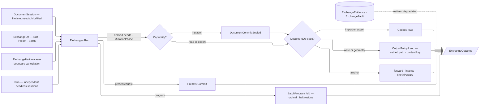

# [RASM_RHINO_OPERATIONS]

`Exchanges.Run` owns document-bound import, export, persistence, geolocation, preset composition, in-session programs, and cross-document conversion. `ExchangeBudget` parameterizes parallel headless work; `CodecRequest`, `Presets.Commit`, and `DocumentCommit.Sealed` remain the owning boundary contracts.

This page also seats three folder-wide owners the archive and codec pipelines compose and never re-mint: `ExchangeFault`, the folder's one refusal family on the kernel `FaultBand.HostExchange` row; `BatchProgram<TOutcome>`, the ordered independent-row fold both transaction pipelines had built twice; and `WriteContent`, the one write-channel vocabulary every host write surface reads its columns off. `MutationPhase` replaces the attempt/residue bool pair on both pipelines, the Document tier's `FieldOverride<T>` is the three-state override the sheet and dial pages read, and `OutputPolicy.Land` the atomic staging kernel every artifact this package writes itself passes through.

## [01]-[INDEX]

- [02]-[FAULT]: `ExchangeFault` — the folder's closed refusal family on the kernel band registry.
- [03]-[LANE_AND_OUTPUT]: `ExchangeBudget` and `IoLane` the cross-document concurrency product; `CollisionRule`, `DirectoryRule`, `OutputPolicy`, `MutationPhase`, and `MutationTrace` the egress vocabulary, landing kernel, and residue cell.
- [04]-[BATCH_PROGRAM]: `IBatchYield`, `BatchVerdict`, `BatchStep<TOutcome>`, `BatchProgram<TOutcome>` — the ordered independent-row regime and its ONE fold.
- [05]-[PRESET_COMPOSITION]: `PresetOperation` and `Presets.Commit` — the Persistence owner composed by `ExchangeOp.PresetCase`.
- [06]-[GEOLOCATION]: `GeoPoint`, `EarthAnchor`, and `AnchorOp` — read, write, planes, and the model↔earth correspondence on one owner.
- [07]-[TRANSACTION_PIPELINE]: `ExchangeOp`, `WriteContent`, `ExchangeFact`/`ExchangeOutcome`, `BatchPosture`/`BatchPolicy`/`ConversionPolicy` with the `ExchangeHalt` cancellation carrier, and `Exchanges` — one session-proved dispatch plus the cross-document conversion fan.

## [02]-[FAULT]

- Owner: `ExchangeFault` is the direct exchange-host family on `FaultBand.HostExchange`; generated-value refusals cross the kernel validation bridge.
- Cases: `CodecUnknown`, `AbilityMissing`, `HostRefused`, `Staging`, and `Exhausted` preserve the semantic boundary failure.
- Law: generated owners stamp `[ValidationError]`; public accumulation rides `Validation<Error, T>`, and foreign errors retain their exact identity.
- Law: the generated fault-case identity supplies the numeric code, while this root's total `Message` switch supplies presentation.
- Boundary: `ExchangeFault` never represents generated validation, aggregates, categories, or wire envelopes.
- Packages: `Domain/results`, Thinktecture.Runtime.Extensions, and LanguageExt.Core.

```csharp
// --- [IMPORTS] -------------------------------------------------------------------------
using Rasm.Domain;
using Rasm.Rhino.Document;
using Thinktecture;

namespace Rasm.Rhino.Exchange;

// --- [ERRORS] --------------------------------------------------------------------------
[Union(ConversionFromValue = ConversionOperatorsGeneration.None)]
public abstract partial record ExchangeFault : Fault {
    private static readonly FaultBand FamilyBand = FaultBand.HostExchange;
    private ExchangeFault() { }

    [FaultCase(0)] public sealed partial record CodecUnknown(string Requested) : ExchangeFault;
    [FaultCase(1)] public sealed partial record AbilityMissing(string Codec, string Ability) : ExchangeFault;
    [FaultCase(2)] public sealed partial record HostRefused(string Member, string Detail) : ExchangeFault;
    [FaultCase(3)] public sealed partial record Staging(DocumentPath Target, string Stage) : ExchangeFault;
    [FaultCase(4)] public sealed partial record Exhausted(string Label, int Bound) : ExchangeFault;

    public sealed override string Message => Switch(
        codecUnknown: static fault => $"Exchange codec '{fault.Requested}' is unknown for '{fault.Key}'.",
        abilityMissing: static fault => $"Exchange codec '{fault.Codec}' lacks '{fault.Ability}' for '{fault.Key}'.",
        hostRefused: static fault => $"Exchange host member '{fault.Member}' refused '{fault.Key}': {fault.Detail}",
        staging: static fault => $"Exchange staging for '{fault.Target}' failed at '{fault.Stage}' for '{fault.Key}'.",
        exhausted: static fault => $"Exchange budget '{fault.Label}' exhausted its bound of {fault.Bound} for '{fault.Key}'.");

    internal static ExchangeFault Host(string member, Option<string> log) =>
        new HostRefused(Member: member, Detail: log.IfNone(noneValue: "refused without native detail"));

}
```

## [03]-[LANE_AND_OUTPUT]

- Owner: `ExchangeBudget` admits I/O degree and scheduler once. `IoLane` closes sequential and budgeted-parallel conversion. `CollisionRule`, `DirectoryRule`, and `OutputPolicy` settle and land every egress path under one declared collision, directory, staging, durability, and content-identity contract. `MutationPhase` is the folder's one residue ladder and `MutationTrace` the cell carrying it, armed by the exchange pipeline at bracket entry and by the archive pipeline at its landing hook.
- Law: the three-state override vocabulary is the Document tier's `FieldOverride<T>` (`Document/geometry.md`, E-R37) — this page COMPOSES it through the prelude's `Rasm.Rhino.Document` import; a second `Keep`/`Set`/`Clear` union on any Exchange page is the deleted twin, and the owner's two arms — result-typed `Apply(admit:, write:, clear:, key:)` and total `Through(host:, gate:, value:)` — are the ONE gate-plus-value pair, discriminated on admission timing.
- Law: residue is a MONOTONE RANK, not two booleans. `Untouched` names a step that never reached its host call, `Attempted` an edit an undo bracket or preset commit can still roll back, and `Landing` a filesystem touch behind which no undo serial stands; `Raise` is the only transition and it never descends, so the pair `(Attempted, MayRemain)` cannot reach the `(false, true)` corner it could spell before. One ladder serves both pipelines, so a step's residue claim reads the same regardless of which pipeline observed it.
- Law: `ExchangeBudget` and `GeoPoint` refuse the default struct through `IDisallowDefaultValue`, so a zero-initialized budget or an origin-point-that-was-never-admitted is unrepresentable rather than screened at each reader. `IoLane.Admitted` and half of `ConversionPolicy`'s validator DELETE onto that refusal — the type states the invariant the guards were re-proving.
- Law: direct host writers settle against the filesystem at dispatch instant, while staged artifacts validate, flush, and hash before the collision row atomically moves them onto an admitted destination; both return the settled `DocumentPath` on the outcome, so no fallible work follows commit and the caller never re-derives the ordinal.
- Law: `Fail` and `AppendOrdinal` use no-clobber moves, and both walk ONE candidate roster whose head is the requested path — a probe walk for `Settle`, a move walk for `Land` — so the requested-path special case and its duplicated `File.Exists` are gone. A refusal whose candidate now exists lost the seat to a concurrent creator and the walk continues, any other refusal settles as the reported fault, and exhaustion is the typed `Exhausted` seat fault; an unbounded rename loop is unrepresentable because the bound is a `Dimension` policy value, and an exception filter deciding continuation is the deleted form.
- Law: `Land` is the sole staging kernel for every artifact this package writes itself — archive persistence and amendment, embedded-file extraction, fresh-archive geometry emission, and every publish delivery stage through it; a second temp-write-verify-move spelling beside it is the deleted form. Host writers that dispatch on the destination extension or mutate document identity (`RhinoDoc.Export`, `ExportSelected`, `Save`, `SaveAs`, the direct engines) write their settled path directly, because a `.partial` staging name forks the host's own format dispatch.
- Law: the temporary artifact is a LEASED resource, never a hand-released one. `StagedFile` disposes by deleting whatever still stands at its path, so a successful move leaves nothing to delete and a failure at any stage releases through `Lease<T>.Use`, which aggregates a cleanup refusal INTO the primary fault because `Error` is a monoid — the prior hand-written success/failure `Match` pair reported a cleanup failure only when the primary had already failed.
- Exemption: filesystem probes, durable flush, and atomic move are ordered statements inside `CollisionRule`, `DirectoryRule`, and `OutputPolicy.Land`; that ordering is the platform-forced file-kernel exemption and no consumer writes one.
- Packages: `Domain/results` (`Lease<T>`, `ContentHash`, `FaultBand`), `Rasm.Numerics` (`Dimension`), `Rasm.Rhino.Document` (`DocumentPath`), Thinktecture.Runtime.Extensions (`[Union]`, `[SmartEnum]`, `[ComplexValueObject]`, `[UseDelegateFromConstructor]`, `IDisallowDefaultValue`), LanguageExt.Core (`Atom`, `Fin`, `Option`, `Seq`).
- Boundary: `OutputPolicy.Land`'s published shape is the folder's frozen staging boundary — `Exchange/publish`'s `Landing` family and `Exchange/archive`'s `Archives.Land` both bind it by name, so its interior refines freely and its signature does not.

```csharp
// --- [IMPORTS] -------------------------------------------------------------------------
using Rasm.Domain;
using Rasm.Numerics;
using Rasm.Rhino.Document;
using Rasm.Rhino.Persistence;
using Rhino.FileIO;
using Rhino.Render;
using System.Runtime.InteropServices;

namespace Rasm.Rhino.Exchange;

// --- [TYPES] ---------------------------------------------------------------------------
[SmartEnum<int>]
public sealed partial class MutationPhase {
    public static readonly MutationPhase Untouched = new(key: 0);
    public static readonly MutationPhase Attempted = new(key: 1);
    public static readonly MutationPhase Landing = new(key: 2);

    internal bool Reaches(MutationPhase floor) => Key >= floor.Key;

    internal MutationPhase Raise(MutationPhase next) => Key >= next.Key ? this : next;
}

[Union(ConversionFromValue = ConversionOperatorsGeneration.None)]
public abstract partial record IoLane {
    private IoLane() { }
    public sealed record SequentialCase : IoLane;
    public sealed record ParallelCase(ExchangeBudget Budget) : IoLane;

    public static IoLane Sequential { get; } = new SequentialCase();
    public static IoLane Parallel(ExchangeBudget budget) => new ParallelCase(Budget: budget);
}

[SmartEnum<int>]
public sealed partial class CollisionRule {
    public static readonly CollisionRule Fail = new(
        key: 0,
        settle: static (path, _, op) => guard(
            !System.IO.File.Exists(path: path.Value),
            new KernelFault.InvalidValue(path.Value, string.Join(" | ", new object?[] { "a destination no file occupies" }))).ToFin().Map(_ => path),
        land: static (temporary, path, _, op) => Move(temporary, path, overwrite: false));
    public static readonly CollisionRule Replace = new(
        key: 1,
        settle: static (path, _, _) => Fin.Succ(value: path),
        land: static (temporary, path, _, op) => Move(temporary, path, overwrite: true));
    public static readonly CollisionRule AppendOrdinal = new(
        key: 2,
        settle: static (path, bound, op) => OutputPolicy.Candidates(path, bound)
            .Find(static candidate => !System.IO.File.Exists(path: candidate.Value))
            .ToFin(Fail: Spent(path: path, bound: bound)),
        land: Append);

    [UseDelegateFromConstructor]
    internal partial Fin<DocumentPath> Settle(DocumentPath path, Rasm.Numerics.Dimension bound);

    [UseDelegateFromConstructor]
    internal partial Fin<DocumentPath> Land(string temporary, DocumentPath path, Rasm.Numerics.Dimension bound);

    private static Fin<DocumentPath> Move(string temporary, DocumentPath path, bool overwrite) => Try.lift(() => {
        System.IO.File.Move(sourceFileName: temporary, destFileName: path.Value, overwrite: overwrite);
        return Fin.Succ(value: path);
    }).Run().Bind(static inner => inner);

    private static Fin<DocumentPath> Append(string temporary, DocumentPath path, Rasm.Numerics.Dimension bound) =>
        OutputPolicy.Candidates(path, bound).Fold(
            (Settled: false, Outcome: Fin.Fail<DocumentPath>(error: Spent(path: path, bound: bound))),
            (state, candidate) => state.Settled
                ? state
                : Move(temporary: temporary, path: candidate, overwrite: false).Match(
                    Succ: landed => (Settled: true, Outcome: Fin.Succ(value: landed)),
                    Fail: failure => System.IO.File.Exists(path: candidate.Value)
                        ? state
                        : (Settled: true, Outcome: Fin.Fail<DocumentPath>(error: failure))))
            .Outcome;

    private static Error Spent(DocumentPath path, Rasm.Numerics.Dimension bound) =>
        new ExchangeFault.Exhausted(Label: path.Value, Bound: bound.Value);
}

[SmartEnum<int>]
public sealed partial class DirectoryRule {
    public static readonly DirectoryRule Existing = new(key: 0, ensure: static (folder, op) =>
        guard(System.IO.Directory.Exists(folder), new KernelFault.InvalidValue(folder, string.Join(" | ", new object?[] { "an existing destination directory" }))).ToFin());
    public static readonly DirectoryRule Create = new(key: 1, ensure: static (folder, op) =>
        Try.lift(() => {
            _ = System.IO.Directory.CreateDirectory(folder);
            return Fin.Succ(value: unit);
        }).Run().Bind(static inner => inner));

    [UseDelegateFromConstructor]
    internal partial Fin<Unit> Ensure(string folder);
}

// --- [MODELS] --------------------------------------------------------------------------
[ComplexValueObject]
[ValidationError]
[StructLayout(LayoutKind.Auto)]
public readonly partial struct ExchangeBudget : IDisallowDefaultValue {
    public Rasm.Numerics.Dimension IoDegree { get; }
    public System.Threading.Tasks.TaskScheduler Scheduler { get; }

    static partial void ValidateFactoryArguments(
        ref ValidationError? validationError,
        ref Rasm.Numerics.Dimension ioDegree,
        ref System.Threading.Tasks.TaskScheduler scheduler) {
        (Rasm.Numerics.Dimension degree, System.Threading.Tasks.TaskScheduler? lane) = (ioDegree, scheduler);
        validationError = FactoryValidation.Of(FactoryValidation.Violated(
                (degree.Value <= 0, () => new ValidationClause(string.Join(" | ", new object?[] { nameof(IoDegree), degree.Value, "a positive I/O degree" }))),
                (lane is null, () => new ValidationClause(string.Join(" | ", new object?[] { nameof(Scheduler) })))));
    }

    public static Fin<ExchangeBudget> Of(
        Rasm.Numerics.Dimension ioDegree,
        System.Threading.Tasks.TaskScheduler scheduler) {
        return FactoryBridge.Accept<ExchangeBudget>(
            fault: Validate(ioDegree: ioDegree, scheduler: scheduler, item: out ExchangeBudget value),
            admitted: value);
    }
}

internal sealed class MutationTrace {
    private readonly Atom<MutationPhase> cell = Atom(MutationPhase.Untouched);

    internal MutationPhase Phase => cell.Value;

    internal static MutationTrace Fresh() => new();

    internal Fin<Unit> Reach(MutationPhase floor) =>
        Fin.Succ(value: ignore(cell.Swap(held => held.Raise(next: floor))));
}

public sealed record Landed<TStage>(DocumentPath Target, UInt128 ContentKey, TStage Stage);

[ComplexValueObject]
[ValidationError]
public sealed partial record OutputPolicy {
    public CollisionRule Collision { get; }
    public DirectoryRule Directory { get; }
    public Rasm.Numerics.Dimension OrdinalBound { get; }

    public static Rasm.Numerics.Dimension OrdinalCeiling { get; } = Rasm.Numerics.Dimension.Create(value: 64);

    public static OutputPolicy Strict { get; } = Create(
        collision: CollisionRule.Fail,
        directory: DirectoryRule.Existing,
        ordinalBound: OrdinalCeiling);

    public static OutputPolicy Landing { get; } = Create(
        collision: CollisionRule.AppendOrdinal,
        directory: DirectoryRule.Create,
        ordinalBound: OrdinalCeiling);

    static partial void ValidateFactoryArguments(
        ref ValidationError? validationError,
        ref CollisionRule collision,
        ref DirectoryRule directory,
        ref Rasm.Numerics.Dimension ordinalBound) {
        (CollisionRule? rule, DirectoryRule? folder, Rasm.Numerics.Dimension bound) = (collision, directory, ordinalBound);
        validationError = FactoryValidation.Of(FactoryValidation.Violated(
                (rule is null, () => new ValidationClause(string.Join(" | ", new object?[] { nameof(Collision) }))),
                (folder is null, () => new ValidationClause(string.Join(" | ", new object?[] { nameof(Directory) }))),
                (bound.Value <= 0, () => new ValidationClause(string.Join(" | ", new object?[] { nameof(OrdinalBound), bound.Value, "a positive ordinal bound" })))));
    }

    public static Fin<OutputPolicy> Of(
        CollisionRule collision,
        DirectoryRule directory,
        Rasm.Numerics.Dimension ordinalBound) {
        return FactoryBridge.Accept<OutputPolicy>(
            Validate(collision: collision, directory: directory, ordinalBound: ordinalBound, item: out OutputPolicy? policy),
            policy);
    }

    internal Fin<DocumentPath> Resolve(DocumentPath target, Option<FileCodec> codec = default) {
        DocumentPath requested = Requested(target: target, codec: codec);
        return from _folder in Directory.Ensure(folder: Folder(path: requested))
               from settled in Collision.Settle(path: requested, bound: OrdinalBound)
               select settled;
    }

    internal Fin<Landed<TStage>> Land<TStage>(
        DocumentPath target,
        Option<FileCodec> codec,
        Func<string, Fin<TStage>> stage,
        Option<Func<byte[], Fin<Unit>>> validate = default) {
        DocumentPath requested = Requested(target: target, codec: codec);
        string directory = Folder(path: requested);
        return from writer in Admit.Need(stage)
               from _folder in Directory.Ensure(folder: directory)
               from lease in Lease<StagedFile>.Acquire(
                   mint: () => new StagedFile(path: System.IO.Path.Join(
                       directory,
                       $".{System.IO.Path.GetFileName(requested.Value)}.{Guid.NewGuid():N}.partial")))
               from landed in lease.Use(
                   body: staged =>
                       from written in writer(arg: staged.Path)
                       from bytes in ReadNonempty(target: requested, path: staged.Path)
                       from _checked in validate.Map(check => check(arg: bytes)).IfNone(Fin.Succ(value: unit))
                       from _durable in Flush(path: staged.Path)
                       from committed in Collision.Land(
                           temporary: staged.Path, path: requested, bound: OrdinalBound)
                       select new Landed<TStage>(
                           Target: committed,
                           ContentKey: ContentHash.Of(canonicalBytes: bytes),
                           Stage: written))
               select landed;
    }

    internal static Seq<DocumentPath> Candidates(DocumentPath path, Rasm.Numerics.Dimension bound) {
        string stem = System.IO.Path.Join(
            System.IO.Path.GetDirectoryName(path.Value) ?? string.Empty,
            System.IO.Path.GetFileNameWithoutExtension(path.Value));
        string extension = System.IO.Path.GetExtension(path.Value);
        return Seq(path) + toSeq(Enumerable.Range(1, bound.Value)).Map(ordinal => DocumentPath.Create(value: $"{stem}-{ordinal}{extension}"));
    }

    private DocumentPath Requested(DocumentPath target, Option<FileCodec> codec) =>
        codec.Map(row => DocumentPath.Create(value: row.EnsureExtension(path: target.Value))).IfNone(target);

    private static string Folder(DocumentPath path) => System.IO.Path.GetDirectoryName(path.Value) ?? string.Empty;

    private static Fin<byte[]> ReadNonempty(DocumentPath target, string path) =>
        Try.lift(() => System.IO.File.ReadAllBytes(path: path)).Run()
            .Bind(bytes => guard(
                bytes.Length > 0,
                new ExchangeFault.Staging(Target: target, Stage: nameof(ReadNonempty))).ToFin().Map(_ => bytes));

    private static Fin<Unit> Flush(string path) => Try.lift(() => {
        using System.IO.FileStream stream = new(
            path: path,
            mode: System.IO.FileMode.Open,
            access: System.IO.FileAccess.ReadWrite,
            share: System.IO.FileShare.Read);
        stream.Flush(flushToDisk: true);
        return Fin.Succ(value: unit);
    }).Run().Bind(static inner => inner);

    private sealed class StagedFile(string path) : IDisposable {
        internal string Path { get; } = path;

        public void Dispose() {
            if (System.IO.File.Exists(path: Path)) {
                System.IO.File.Delete(path: Path);
            }
        }
    }
}
```

## [04]-[BATCH_PROGRAM]

- Owner: `BatchStep<TOutcome>` — one settled row of an ordered program, carrying its source ordinal, its observed mutation phase, and either the row's outcome or its typed failure with the evidence the failed attempt produced; `BatchProgram<TOutcome>` — the settled program with requested cardinality, halt truth, stop ordinal, folded evidence, and the ONE driver both transaction pipelines run; `IBatchYield` — the two facts the fold reads off any outcome it threads, and `BatchVerdict` — the non-generic summary a nested program publishes upward.
- Entry: `BatchProgram<TOutcome>.Fold(rows, requested, halt, posture, run)` — rows execute in source order, the halt is observed BETWEEN rows, and the posture decides whether a failed row stops the walk or the walk collects it and continues.
- Law: this owner is the archive pipeline's `ArchiveStep`/`ArchiveProgram`/`ArchiveFold` and the exchange pipeline's `ExchangeStep`/`ExchangeProgram`/`ProgramFold` — one shape written twice, where a fix to the shared machinery landed on one copy and not the other. Six type declarations collapse to three; the archive pipeline's `MutationAttempted`/`MutationMayRemain` pair and the exchange pipeline's `MutationAttempted` flag collapse to the one `MutationPhase` column; and the `Running`/`Stopped` fold union collapses into the settled program's own `Halted` and `StoppedAt` reads.
- Law: a halt is observed, never inferred. Every requested row settles a step; a direct halt poll carries `Errors.Cancelled`, so `Steps.Count` equals `Requested` and `Halted` reads the exact cause.
- Law: nesting reports through `BatchVerdict`, not through a generic recursion — an outcome publishes `Nested` when it wraps its own program, and the step folds that verdict's failure, halt, and mutation phase into its own, so an inner program's refusal is visible at the outer program without either type naming the other's outcome.
- Packages: `Domain/results` , Thinktecture.Runtime.Extensions (`[Union]`), LanguageExt.Core (`Seq`, `Option`, `Fin`, `Error`, `Errors.Cancelled`).
- Growth: a third batch pipeline joins with an outcome implementing `IBatchYield` and gains the ordinal, the halt residue, the mutation fold, and the evidence projection with no new declaration; a new halt cause rides the `Error` a failed step already carries.
- Boundary: the fold owns ordering, halting, and residue alone — what a row DOES, what its outcome holds, and how its evidence reads stay with the composing pipeline.

```csharp
// --- [TYPES] ---------------------------------------------------------------------------
public interface IBatchYield {
    Seq<ExchangeEvidence> Evidence { get; }
    Option<BatchVerdict> Nested { get; }
}

// --- [MODELS] --------------------------------------------------------------------------
public readonly record struct BatchVerdict(bool Failed, bool Halted, MutationPhase Mutation);

[Union(ConversionFromValue = ConversionOperatorsGeneration.None)]
public abstract partial record BatchStep<TOutcome> where TOutcome : IBatchYield {
    private BatchStep() { }
    public sealed record SucceededCase(int Index, MutationPhase Mutation, TOutcome Outcome) : BatchStep<TOutcome>;
    public sealed record FailedCase(
        int Index, MutationPhase Mutation, Error Failure, Seq<ExchangeEvidence> Evidence) : BatchStep<TOutcome>;

    public int Index => Switch(
        succeededCase: static step => step.Index,
        failedCase: static step => step.Index);

    public BatchVerdict Verdict => Switch(
        succeededCase: static step => step.Outcome.Nested.Match(
            Some: nested => new BatchVerdict(
                Failed: nested.Failed,
                Halted: nested.Halted,
                Mutation: step.Mutation.Raise(next: nested.Mutation)),
            None: () => new BatchVerdict(Failed: false, Halted: false, Mutation: step.Mutation)),
        failedCase: static step => new BatchVerdict(
            Failed: true,
            Halted: step.Failure.Is(Errors.Cancelled) || step.Failure is KernelFault.Cancelled,
            Mutation: step.Mutation));

    public Seq<ExchangeEvidence> Evidence => Switch(
        succeededCase: static step => step.Outcome.Evidence,
        failedCase: static step => step.Evidence);

    internal static BatchStep<TOutcome> Withdrawn(int index) => new FailedCase(
        Index: index,
        Mutation: MutationPhase.Untouched,
        Failure: Errors.Cancelled,
        Evidence: Seq<ExchangeEvidence>());
}

public sealed record BatchProgram<TOutcome> where TOutcome : IBatchYield {
    private BatchProgram(int requested, Seq<BatchStep<TOutcome>> steps) => (Requested, Steps) = (requested, steps);

    public int Requested { get; }
    public Seq<BatchStep<TOutcome>> Steps { get; }

    public Option<int> StoppedAt => Steps.Find(static step => step.Verdict.Failed).Map(static step => step.Index);
    public bool Failed => StoppedAt.IsSome;
    public bool Halted => Steps.Exists(static step => step.Verdict.Halted);
    public bool Completed => Steps.Count == Requested && !Failed && !Halted;
    public MutationPhase Mutation =>
        Steps.Fold(MutationPhase.Untouched, static (phase, step) => phase.Raise(next: step.Verdict.Mutation));
    public Seq<ExchangeEvidence> Evidence => Steps.Bind(static step => step.Evidence);
    public Seq<TOutcome> Outcomes => Steps.Choose(
        static step => step is BatchStep<TOutcome>.SucceededCase done ? Some(done.Outcome) : None);
    public BatchVerdict Verdict => new(Failed: Failed, Halted: Halted, Mutation: Mutation);

    internal static BatchProgram<TOutcome> Fold<TRow>(
        Seq<TRow> rows,
        ExchangeHalt halt,
        BatchPosture posture,
        Func<TRow, int, BatchStep<TOutcome>> run) =>
        new(requested: rows.Count,
            steps: rows.Map(static (row, index) => (Row: row, Index: index)).Fold(
                (Stopped: false, Steps: Seq<BatchStep<TOutcome>>()),
                (state, item) => state.Stopped || halt.Requested
                    ? (Stopped: true, Steps: state.Steps.Add(BatchStep<TOutcome>.Withdrawn(index: item.Index)))
                    : Seated(state: state, step: run(arg1: item.Row, arg2: item.Index), posture: posture))
                .Steps);

    internal static BatchProgram<TOutcome> Settled(int requested, Seq<BatchStep<TOutcome>> steps) =>
        new(requested: requested, steps: steps);

    internal static BatchProgram<TOutcome> Withdrawn(int requested) => new(
        requested: requested,
        steps: toSeq(Enumerable.Range(0, requested)).Map(static index => BatchStep<TOutcome>.Withdrawn(index: index)));

    private static (bool Stopped, Seq<BatchStep<TOutcome>> Steps) Seated(
        (bool Stopped, Seq<BatchStep<TOutcome>> Steps) state, BatchStep<TOutcome> step, BatchPosture posture) => (
        Stopped: step.Verdict.Halted || (step.Verdict.Failed && !posture.Continues),
        Steps: state.Steps.Add(step));
}
```

## [05]-[PRESET_COMPOSITION]

- Owner: `PresetOperation` and `Presets.Commit` own construction planes, named positions, named layer states, roster counts, identity resolution, participating object ids, and stored transforms. `ExchangeOp.PresetCase` composes that command without a second saved-state vocabulary or host-table interpreter.
- Law: `Run` routes a preset request before any exchange demand because `Presets.Commit` derives its own read, mutation, undo, and redraw needs from `PresetOperation.Execution`; this pipeline reads that same policy row for its own profile rather than predicting mutation from the case shape. Batch execution re-enters `Run` per case, so preset and exchange programs share ordered failure and halt outcomes without nesting document demands.
- Packages: `Rasm.Rhino.Persistence` (`PresetOperation`, `PresetExecution`, `Presets.Commit`).
- Boundary: the composed boundary is the Persistence surface below and nothing more — `PresetOperation` is the request, `PresetExecution` its policy row, and `Presets.Commit` the command.

```csharp
using Rasm.Rhino.Persistence;
```

## [06]-[GEOLOCATION]

- Owner: `GeoPoint` and `EarthAnchor` are generated complex values. `GeoPoint.Of` accumulates coordinate gates; `EarthAnchor.Of` admits earth, model-frame, identity, and coordinate-system fields as one correlated product. `AnchorDemand` carries each host-location precondition as a policy row. `AnchorOp` closes read, write, plane with anchor north, compass, orientation with anchor north, model-to-earth, earth-to-model, and sun synchronization.
- Law: admission accumulates across the five correlated columns through `FactoryValidation`; `GeoPoint` uses the same substrate across latitude, longitude, and elevation.
- Law: the host `EarthAnchorPoint` is disposable host material — every arm opens it inside a `using` window, projects detached values, and lets the window close; the anchor never rides a signature.
- Law: the sun arm is a read-modify-commit over one leased `RenderSettings` — the sub-owner mutation is inert until the same `RhinoDoc.RenderSettings` accessor takes the settings back, so a bound-and-forgotten `settings.Sun` write returns a success outcome for a synchronization that never lands.
- Law: north is a DECLARED posture, never an implied one. `SunCase` carries a kernel `NorthPosture` row: `True` bears the model-north declination the anchor holds, `Project` bears zero because the model's own `+X` IS the drawing's north. The prior arm hard-assumed true north and re-derived the bearing with a bare `Atan2`/`ToDegrees` pair beside the branch's own north convention (folder `RULINGS` states that convention once); here the bearing admits as a `VectorAngle`, the posture's `Rotation` column answers the plan rotation, and degrees enter only at the host write.
- Law: earth-required and model-required preconditions gate per arm through `EarthLocationIsSet`/`ModelLocationIsSet` — a projection over an unset anchor is a typed refusal, never a garbage transform.
- Law: the inverse transform reads through `Admit.Probe`, so the host's `bool`-plus-`out` pair folds to `Option<Transform>` at the boundary and no arm carries a `TryGet` shape inward.
- Packages: `Domain/results` (`Admit.Probe`, `Try.lift`), `Rasm.Numerics` (`VectorAngle`), `Rasm.Drawing` (`NorthPosture`), RhinoCommon (`EarthAnchorPoint`, `RenderSettings`, `Sun`) per `.api/api-rhinocommon-document.md` and `.api/api-rhinocommon-rendersettings.md`.
- Boundary: the model-to-earth transform is unit-aware — `GetModelToEarthTransform(modelUnits:)` receives the document's live `LengthUnit`, read inside the same demand window that uses it, so a stale unit regime cannot skew the projection.

```csharp
// --- [IMPORTS] -------------------------------------------------------------------------
using Rasm.Drawing;

// --- [MODELS] --------------------------------------------------------------------------
[ComplexValueObject]
[ValidationError]
[StructLayout(LayoutKind.Auto)]
public readonly partial struct GeoPoint : IDisallowDefaultValue {
    public double Latitude { get; }
    public double Longitude { get; }
    public double Elevation { get; }

    static partial void ValidateFactoryArguments(
        ref ValidationError? validationError,
        ref double latitude,
        ref double longitude,
        ref double elevation) {
        (double lat, double lon, double height) = (latitude, longitude, elevation);
        validationError = FactoryValidation.Of(FactoryValidation.Violated(
                (!double.IsFinite(lat) || lat is < -90d or > 90d, () => new ValidationClause(string.Join(" | ", new object?[] { nameof(Latitude), lat, "a finite value in [-90, 90]" }))),
                (!double.IsFinite(lon) || lon is < -180d or > 180d, () => new ValidationClause(string.Join(" | ", new object?[] { nameof(Longitude), lon, "a finite value in [-180, 180]" }))),
                (!double.IsFinite(height), () => new ValidationClause(string.Join(" | ", new object?[] { nameof(Elevation), height, "a finite elevation" })))));
    }

    public static Fin<GeoPoint> Of(double latitude, double longitude, double elevation) {
        return FactoryBridge.Accept<GeoPoint>(
            fault: Validate(latitude: latitude, longitude: longitude, elevation: elevation, item: out GeoPoint value),
            admitted: value);
    }
}

[ComplexValueObject]
[ValidationError]
public sealed partial record EarthAnchor {
    public Option<GeoPoint> Basepoint { get; }
    public int ElevationCoordinateSystem { get; }
    public Option<Point3d> ModelBasePoint { get; }
    public Option<Vector3d> ModelNorth { get; }
    public Option<Vector3d> ModelEast { get; }
    public Option<string> Name { get; }
    public Option<string> Description { get; }

    static partial void ValidateFactoryArguments(
        ref ValidationError? validationError,
        ref Option<GeoPoint> basepoint,
        ref int elevationCoordinateSystem,
        ref Option<Point3d> modelBasePoint,
        ref Option<Vector3d> modelNorth,
        ref Option<Vector3d> modelEast,
        ref Option<string> name,
        ref Option<string> description) {
        name = name.Map(static text => text.Trim()).Filter(static text => !string.IsNullOrWhiteSpace(value: text));
        description = description.Map(static text => text.Trim()).Filter(static text => !string.IsNullOrWhiteSpace(value: text));
        (Option<Point3d> origin, Option<Vector3d> north, Option<Vector3d> east) = (modelBasePoint, modelNorth, modelEast);
        int supplied = (origin.IsSome ? 1 : 0) + (north.IsSome ? 1 : 0) + (east.IsSome ? 1 : 0);
        validationError = FactoryValidation.Of(FactoryValidation.Violated(
                (supplied is not (0 or 3), () => new ValidationClause(string.Join(" | ", new object?[] { nameof(ModelBasePoint), "model basepoint, north, and east supplied together or all absent" }))),
                (!origin.ForAll(static point => ValidityClaim.Finite(point).Holds), () => new ValidationClause(string.Join(" | ", new object?[] { nameof(ModelBasePoint), "a finite model basepoint" }))),
                (!north.ForAll(static vector => ValidityClaim.Direction(vector).Holds), () => new ValidationClause(string.Join(" | ", new object?[] { nameof(ModelNorth), "a finite non-zero north axis" }))),
                (!east.ForAll(static vector => ValidityClaim.Direction(vector).Holds), () => new ValidationClause(string.Join(" | ", new object?[] { nameof(ModelEast), "a finite non-zero east axis" }))),
                (!north.Bind(axis => east.Map(other => Vector3d.CrossProduct(axis, other).Length > 0d)).IfNone(true),
                    () => new ValidationClause(string.Join(" | ", new object?[] { nameof(ModelNorth), "non-collinear north and east axes" })))));
    }

    public static Fin<EarthAnchor> Of(
        Option<GeoPoint> basepoint,
        int elevationCoordinateSystem,
        Option<Point3d> modelBasePoint,
        Option<Vector3d> modelNorth,
        Option<Vector3d> modelEast,
        Option<string> name = default,
        Option<string> description = default) {
        return FactoryBridge.Accept<EarthAnchor>(
            Validate(
                basepoint: basepoint,
                elevationCoordinateSystem: elevationCoordinateSystem,
                modelBasePoint: modelBasePoint,
                modelNorth: modelNorth,
                modelEast: modelEast,
                name: name,
                description: description,
                item: out EarthAnchor? anchor),
            anchor);
    }

    internal static Fin<EarthAnchor> From(EarthAnchorPoint anchor) =>
        from basepoint in Located(anchor: anchor)
        let modelSet = anchor.ModelLocationIsSet()
        from admitted in Of(
            basepoint: basepoint,
            elevationCoordinateSystem: anchor.EarthBasepointElevationCoordinateSystem,
            modelBasePoint: modelSet ? Some(anchor.ModelBasePoint) : None,
            modelNorth: modelSet ? Some(anchor.ModelNorth) : None,
            modelEast: modelSet ? Some(anchor.ModelEast) : None,
            name: Optional(anchor.Name),
            description: Optional(anchor.Description))
        select admitted;

    internal static Fin<Option<GeoPoint>> Located(EarthAnchorPoint anchor) =>
        anchor.EarthLocationIsSet()
            ? GeoPoint.Of(
                latitude: anchor.EarthBasepointLatitude,
                longitude: anchor.EarthBasepointLongitude,
                elevation: anchor.EarthBasepointElevation).Map(Some)
            : Fin.Succ(Option<GeoPoint>.None);

    internal Fin<Unit> Write(RhinoDoc document) => Try.lift(() => {
        using EarthAnchorPoint anchor = new();
        _ = Basepoint.Iter(point => {
            anchor.EarthBasepointLatitude = point.Latitude;
            anchor.EarthBasepointLongitude = point.Longitude;
            anchor.EarthBasepointElevation = point.Elevation;
        });
        anchor.EarthBasepointElevationCoordinateSystem = ElevationCoordinateSystem;
        _ = ModelBasePoint.Iter(value => anchor.ModelBasePoint = value);
        _ = ModelNorth.Iter(value => anchor.ModelNorth = value);
        _ = ModelEast.Iter(value => anchor.ModelEast = value);
        _ = Name.Iter(value => anchor.Name = value);
        _ = Description.Iter(value => anchor.Description = value);
        document.EarthAnchorPoint = anchor;
        return Fin.Succ(value: unit);
    }).Run().Bind(static inner => inner);
}

// --- [TYPES] ---------------------------------------------------------------------------
[SmartEnum<string>]
internal sealed partial class AnchorDemand {
    public static readonly AnchorDemand Any = new(key: "any", accepts: static _ => true);
    public static readonly AnchorDemand Model = new(key: "model", accepts: static anchor => anchor.ModelLocationIsSet());
    public static readonly AnchorDemand Located = new(key: "located",
        accepts: static anchor => anchor.EarthLocationIsSet() && anchor.ModelLocationIsSet());

    [UseDelegateFromConstructor]
    internal partial bool Accepts(EarthAnchorPoint anchor);
}

[Union(ConversionFromValue = ConversionOperatorsGeneration.None)]
public abstract partial record AnchorOp {
    private AnchorOp() { }
    public sealed record ReadCase : AnchorOp;
    public sealed record WriteCase(EarthAnchor Anchor) : AnchorOp;
    public sealed record PlaneCase : AnchorOp;
    public sealed record CompassCase : AnchorOp;
    public sealed record OrientCase(Plane Source) : AnchorOp;
    public sealed record ToEarthCase(Seq<Point3d> Points) : AnchorOp;
    public sealed record ToModelCase(Seq<GeoPoint> Points) : AnchorOp;
    public sealed record SunCase(NorthPosture Posture) : AnchorOp;

    internal Fin<AnchorYield> Apply(RhinoDoc document) => Switch(
        document,
        readCase: static (ctx, _) => Anchored(ctx, AnchorDemand.Any, use: static (anchor, _, op) =>
            EarthAnchor.From(anchor: anchor).Map(static value => (AnchorYield)new AnchorYield.AnchorCase(Anchor: value))),
        writeCase: static (ctx, edit) =>
            from anchor in Admit.Need(edit.Anchor)
            from _written in anchor.Write(document: ctx)
            select (AnchorYield)new AnchorYield.AnchorCase(Anchor: anchor),
        planeCase: static (ctx, _) => Anchored(ctx, AnchorDemand.Model, use: static (anchor, _, op) => {
            Plane plane = anchor.GetEarthAnchorPlane(anchorNorth: out Vector3d north);
            return Acceptance.Value(value: plane)
                .Map(admitted => (AnchorYield)new AnchorYield.PlaneCase(Plane: admitted, North: north));
        }),
        compassCase: static (ctx, _) => Anchored(ctx, AnchorDemand.Model, use: static (anchor, _, op) =>
            Acceptance.Value(value: anchor.GetModelCompass())
                .Map(static plane => (AnchorYield)new AnchorYield.CompassCase(Plane: plane))),
        orientCase: static (ctx, edit) => Anchored(ctx, AnchorDemand.Model, use: (anchor, _, op) => {
            Plane target = anchor.GetEarthAnchorPlane(anchorNorth: out Vector3d north);
            return from _source in Acceptance.Value(value: edit.Source)
                   from _target in Acceptance.Value(value: target)
                   select (AnchorYield)new AnchorYield.TransformCase(
                       Value: Transform.PlaneToPlane(plane0: edit.Source, plane1: target), North: north);
        }),
        toEarthCase: static (ctx, edit) => Anchored(ctx, AnchorDemand.Located, use: (anchor, document, op) => {
            Transform projection = anchor.GetModelToEarthTransform(modelUnits: document.ModelUnits);
            return from _valid in Acceptance.Value(value: projection)
                   from points in edit.Points.TraverseM(point => {
                       Point3d projected = point;
                       projected.Transform(xform: projection);
                       return GeoPoint.Of(
                           latitude: projected.X, longitude: projected.Y, elevation: projected.Z);
                   }).As()
                   select (AnchorYield)new AnchorYield.EarthCase(Points: points);
        }),
        toModelCase: static (ctx, edit) => Anchored(ctx, AnchorDemand.Located, use: (anchor, document, op) => {
            Transform projection = anchor.GetModelToEarthTransform(modelUnits: document.ModelUnits);
            return Admit.Probe<Transform>(probe: projection.TryGetInverse, label: nameof(Transform.TryGetInverse))
                .Map(inverse => (AnchorYield)new AnchorYield.ModelCase(Points: edit.Points.Map(point => {
                    Point3d model = new(x: point.Latitude, y: point.Longitude, z: point.Elevation);
                    model.Transform(xform: inverse);
                    return model;
                })));
        }),
        sunCase: static (ctx, edit) => Anchored(ctx, AnchorDemand.Located, use: (anchor, document, op) =>
            from posture in Admit.Need(edit.Posture)
            from bearing in FactoryBridge.Accept<VectorAngle>(candidate: Math.Atan2(y: anchor.ModelNorth.Y, x: anchor.ModelNorth.X))
            from _written in Try.lift(() => {
                using RenderSettings settings = document.RenderSettings;
                using Sun sun = settings.Sun;
                sun.Latitude = anchor.EarthBasepointLatitude;
                sun.Longitude = anchor.EarthBasepointLongitude;
                sun.North = RhinoMath.ToDegrees(radians: posture.Rotation(declination: bearing).Value);
                document.RenderSettings = settings;
                return Fin.Succ(value: unit);
            }).Run().Bind(static inner => inner)
            select (AnchorYield)new AnchorYield.SunCase(Posture: posture)));

    private static Fin<AnchorYield> Anchored(
        RhinoDoc document, AnchorDemand demand,
        Func<EarthAnchorPoint, RhinoDoc, Fin<AnchorYield>> use) =>
        Try.lift(() => {
            using EarthAnchorPoint? anchor = document.EarthAnchorPoint;
            return Optional(anchor)
                .ToFin(Fail: new KernelFault.InvalidValue(nameof(RhinoDoc.EarthAnchorPoint), string.Join(" | ", new object?[] { "an earth anchor" })))
                .Bind(live => demand.Accepts(anchor: live)
                    ? use(arg1: live, arg2: document, arg3: op)
                    : Fin.Fail<AnchorYield>(error: new KernelFault.InvalidValue(nameof(AnchorDemand), string.Join(" | ", new object?[] { $"an anchor whose location is '{demand.Key}'" }))));
        }).Run().Bind(static inner => inner);
}

[Union(ConversionFromValue = ConversionOperatorsGeneration.None)]
public abstract partial record AnchorYield {
    private AnchorYield() { }
    public sealed record AnchorCase(EarthAnchor Anchor) : AnchorYield;
    public sealed record PlaneCase(Plane Plane, Vector3d North) : AnchorYield;
    public sealed record CompassCase(Plane Plane) : AnchorYield;
    public sealed record TransformCase(Transform Value, Vector3d North) : AnchorYield;
    public sealed record EarthCase(Seq<GeoPoint> Points) : AnchorYield;
    public sealed record ModelCase(Seq<Point3d> Points) : AnchorYield;
    public sealed record SunCase(NorthPosture Posture) : AnchorYield;
}
```

## [07]-[TRANSACTION_PIPELINE]

- Owner: `ExchangeOp` closes the three routes one request can take — a document edit, a preset commit, a program — and `DocumentOp` closes the six edits the document dispatcher executes: import, export, save, write, geometry, anchor. `WriteContent` is the ONE write-channel vocabulary every host write surface reads. `ExchangeFact` is the ONE outcome vocabulary and `ExchangeOutcome` carries that outcome roster beside its evidence and an `Option<BatchProgram<ExchangeOutcome>>`, so a nested program is absence-or-presence rather than a parallel case in a second yield family every construction site builds twice.
- Cases: `WriteContent` rows are the union of what the three host write surfaces admit — `GeometryOnly`, `UserData`, `RenderMeshes`, `PreviewImage`, `BitmapTable`, `History`, `Compression`, `Small`, `Textures`, `PluginData`, `PrimaryBackup`, `AuxiliaryBackup`.
- Entry: `Exchanges.Run(DocumentSession, ExchangeOp, ExchangeHalt)` owns session-bound work. `Exchanges.Run(Seq<(SessionSource, ExchangeOp)>, ConversionPolicy, CancellationToken)` owns cross-document conversion and awaits `Parallel.ForEachAsync` under the caller-supplied `ExchangeBudget`.
- Law: write CHANNELS are one capability vocabulary, and each write surface declares the AXES it admits. `DocumentContent` (eight columns), `SaveAsContent` (five columns), and `BackupPolicy` (three rows over two columns) were three types spelling one concept, and their separation existed only to keep a `Textures` request off a `WriteFile` call — a fact `Axes.Require(Content, refuse)` now states directly, so an inadmissible channel is REFUSED at admission — naming the unadmitted rows the door hands the refusal — where the host previously dropped it in silence. `WriteContent.Law` bars the geometry-only corners the host resolves by fiat, and the auxiliary-backup implication rides the write policy's own clause fold because a containment bar cannot express "B requires A". NAMED LOSS: fourteen compile-time boolean columns; bought back by the per-case axes gate, the barred-corner law, and the `Wire` projection an outcome can print.
- Law: `ExchangeOutcome` is FILE-scoped and spans envelopes: a program re-enters `Run` across independent commits, and the conversion fan settles headless sessions sharing no commit. `ExchangeFact` therefore closes a flat outcome vocabulary carrying no commit slot or undo stamp.
- Law: request families split by the pipeline that executes them, so every closed dispatch is total over what it actually runs. `Run` routes the three `ExchangeOp` cases — a preset delegates to `Presets.Commit`, a program re-enters `Run` per case, and an edit alone reaches the session demand — while `Dispatch` switches the six `DocumentOp` cases behind that demand.
- Law: `Profile` answers a `MutationPhase`, not a boolean. `DocumentOp.Profile` derives demand, mutation floor, and surface evidence in one generated dispatch; `ExchangeOp.Profile` reads it through for an edit, RAISES it across a program, and answers a preset off `PresetOperation.Execution` — the Persistence owner's own policy row, never a re-derived mutation predicate. One ladder feeds the undo bracket decision, the trace floor, and the step's residue column, so the three cannot disagree.
- Law: `MutationTrace` reaches `Attempted` immediately before preset commit or `DocumentCommit.Sealed`; failed steps report that observed phase instead of predicting mutation from request shape. The trace is `Option`-shaped because only a program step reads it — `Step` mints one per row and folds its phase into the `BatchStep`, while the single-op entry passes `None` rather than recording into a cell nothing projects.
- Law: cancellation is cooperative and case-bounded, and it never rides an exception. `ExchangeHalt` composes every ambient and policy token, `Run` refuses before snapshot acquisition, and the parallel fan merges the caller's token into that halt INSTEAD of handing it to `ParallelOptions` — so `Parallel.ForEachAsync` raises no `OperationCanceledException`, the empty catch that swallowed one is gone, and every skipped row settles as a cancelled step the program's `Halted` reads. NAMED LOSS: the host's own eager mid-iteration loop abort; bought back because each body returns immediately once the halt is observed.
- Law: `ConversionPolicy` is the outer storage boundary: it admits `IoLane` and rejects a parallel lane paired with a halting posture, because collecting-only is an admission contract — a caller learns its lane was unusable at construction rather than watching it silently degrade to sequential with no refusal, no degradation evidence, and no outcome row. The zero-initialized-budget clause DELETES onto `ExchangeBudget`'s own default refusal, and parallel conversion never reads ambient processor count.
- Law: `SaveCase` consults `SessionSnapshot.Modified` — saving an unmodified document is a no-op `ExchangeFact`, never a redundant host write. It pre-guards a non-empty `RhinoDoc.Path` and crosses `op.Catch` on the dirty branch, because the host member throws on an unpathed document and this arm carries no undo bracket to convert for it; `TemplateCase` admits the archive extension against the codec row before the call and crosses the same catch.
- Law: egress cases resolve their target through `OutputPolicy` exactly once and stamp the SETTLED path plus the artifact's `ContentHash.Of` content key on the outcome, so downstream indexing keys on evidence.
- Law: the write target's codec is a `DocumentWritePolicy` projection, never a constant — `SaveAsCase`, `ArchiveCase`, and `TemplateCase` answer the row carrying `CodecAbility.Archive`, while `DocumentCase` writes through the extension-dispatching general writer and therefore answers `Codecs.Detect(target)` and refuses an undetectable extension. One projection feeds both `OutputPolicy.Resolve` and the outcome's fact.
- Law: `GeometryCase` is a session-bound export that writes no live-document geometry — after the session proves export capability, a fresh `File3dm` receives the requested geometry rows and lands through `Archives.Land`, the archive pipeline's one `WriteWithLog`-hooked staging over `OutputPolicy.Land`, so the landed 3dm carries the same byte re-materialization parse proof every archive persistence carries.
- Law: `ExportScope` gates selection by `CodecAbility.Selection` and owns one noninteractive `FileWriteOptions` carrier. Native `3dm`, `OBJ`, and `PLY` engines receive that carrier through one `Codecs.Apply`; every other selection row is refused before host contact.
- Packages: `Domain/results` (`ContentHash`, `Lease<T>`), `Domain/validation` (`CapabilitySet<T>`, `CapabilityLaw<T>`, `ICapability<T>`), `Rasm.Numerics` (`Dimension`), `Rasm.Rhino.Document` (`DocumentSession`, `SessionNeed`, `DocumentCommit`, `RedrawPolicy`, `DocumentPath`), RhinoCommon (`RhinoDoc.SaveAs`/`WriteFile`/`Write3dmFile`/`SaveAsTemplate`, `FileWriteOptions`) per `.api/api-rhinocommon-fileio.md`.
- Growth: a new write channel is one `WriteContent` row plus its column in the surfaces that admit it; a new route or a new edit lands in exactly one request family and every closed dispatch breaks loudly.
- Boundary: `RhinoDoc.Open` and every headless constructor belong to the Document session sources; an exchange request that names a document to acquire is a session construction at the call site, and this pipeline's batch runs against the session it was handed. `Parallel.ForEachAsync` and `DocumentSession` disposal statements are the platform-forced `Task` and resource exemptions.

```csharp
// --- [TYPES] ---------------------------------------------------------------------------
[SmartEnum<string>]
public sealed partial class WriteContent : ICapability<WriteContent> {
    public static readonly WriteContent GeometryOnly = new(key: "geometry-only");
    public static readonly WriteContent UserData = new(key: "user-data");
    public static readonly WriteContent RenderMeshes = new(key: "render-meshes");
    public static readonly WriteContent PreviewImage = new(key: "preview-image");
    public static readonly WriteContent BitmapTable = new(key: "bitmap-table");
    public static readonly WriteContent History = new(key: "history");
    public static readonly WriteContent Compression = new(key: "compression");
    public static readonly WriteContent Small = new(key: "small");
    public static readonly WriteContent Textures = new(key: "textures");
    public static readonly WriteContent PluginData = new(key: "plugin-data");
    public static readonly WriteContent PrimaryBackup = new(key: "primary-backup");
    public static readonly WriteContent AuxiliaryBackup = new(key: "auxiliary-backup");

    public static CapabilityLaw<WriteContent> Law { get; } = CapabilityLaw<WriteContent>.Forbidden(Seq(
        CapabilitySet<WriteContent>.Of(GeometryOnly, UserData),
        CapabilitySet<WriteContent>.Of(GeometryOnly, RenderMeshes),
        CapabilitySet<WriteContent>.Of(GeometryOnly, PreviewImage),
        CapabilitySet<WriteContent>.Of(GeometryOnly, BitmapTable),
        CapabilitySet<WriteContent>.Of(GeometryOnly, History),
        CapabilitySet<WriteContent>.Of(GeometryOnly, Textures),
        CapabilitySet<WriteContent>.Of(GeometryOnly, PluginData)));

    internal static CapabilitySet<WriteContent> DocumentAxes { get; } = CapabilitySet<WriteContent>.Of(
        GeometryOnly, UserData, RenderMeshes, PreviewImage, BitmapTable, History, Compression,
        PrimaryBackup, AuxiliaryBackup);

    internal static CapabilitySet<WriteContent> SaveAsAxes { get; } = CapabilitySet<WriteContent>.Of(
        GeometryOnly, Small, Textures, PluginData, Compression);

    internal static CapabilitySet<WriteContent> ArchiveAxes { get; } = CapabilitySet<WriteContent>.Of(UserData);
}

[Union(ConversionFromValue = ConversionOperatorsGeneration.None)]
public abstract partial record ExchangeFact {
    private ExchangeFact() { }
    public sealed record ImportedCase(DocumentPath Source, FileCodec Codec) : ExchangeFact;
    public sealed record ArtifactCase(DocumentPath Target, FileCodec Codec, UInt128 ContentKey) : ExchangeFact;
    public sealed record SaveCase(bool Written) : ExchangeFact;
    public sealed record AnchorCase(AnchorYield Yield) : ExchangeFact;
}

[Union(ConversionFromValue = ConversionOperatorsGeneration.None)]
public abstract partial record ExportScope {
    private ExportScope() { }
    public sealed record AllCase : ExportScope;
    public sealed record SelectionCase : ExportScope;

    internal Fin<FileWriteOptions> Carrier(FileCodec codec) => Switch(
        state: codec,
        allCase: static (_, _) => Fin.Succ(value: false),
        selectionCase: static (ctx, _) => guard(
            ctx.Has(CodecAbility.Selection),
            new ExchangeFault.AbilityMissing(Codec: ctx.Key, Ability: CodecAbility.Selection.Key)).ToFin().Map(_ => true))
        .Map(value => new FileWriteOptions {
            WriteSelectedObjectsOnly = value,
            SuppressAllInput = true,
            SuppressDialogBoxes = true,
        });
}

[SmartEnum<int>]
public sealed partial class BatchPosture {
    public static readonly BatchPosture Halting = new(key: 0, continues: false);
    public static readonly BatchPosture Collecting = new(key: 1, continues: true);

    internal bool Continues { get; }
}

[Union(ConversionFromValue = ConversionOperatorsGeneration.None)]
public abstract partial record DocumentWritePolicy {
    private DocumentWritePolicy() { }
    public sealed record SaveAsCase(Option<Rasm.Numerics.Dimension> Version, CapabilitySet<WriteContent> Content) : DocumentWritePolicy;
    public sealed record DocumentCase(CapabilitySet<WriteContent> Content) : DocumentWritePolicy;
    public sealed record ArchiveCase(CapabilitySet<WriteContent> Content) : DocumentWritePolicy;
    public sealed record TemplateCase(Option<Rasm.Numerics.Dimension> Version = default) : DocumentWritePolicy;

    private CapabilitySet<WriteContent> Content => Switch(
        saveAsCase: static policy => policy.Content,
        documentCase: static policy => policy.Content,
        archiveCase: static policy => policy.Content,
        templateCase: static _ => CapabilitySet<WriteContent>.None);

    private CapabilitySet<WriteContent> Axes => Switch(
        saveAsCase: static _ => WriteContent.SaveAsAxes,
        documentCase: static _ => WriteContent.DocumentAxes,
        archiveCase: static _ => WriteContent.DocumentAxes,
        templateCase: static _ => CapabilitySet<WriteContent>.None);

    internal Fin<CapabilitySet<WriteContent>> Admit() {
        (CapabilitySet<WriteContent> held, CapabilitySet<WriteContent> axes) = (Content, Axes);
        return from _axes in axes.Require(
                   demanded: held,
                   refuse: missing => new KernelFault.InvalidValue(nameof(WriteContent), string.Join(" | ", new object?[] { $"channels within <{axes.Wire}>; unadmitted <{missing.Wire}>" })))
               from _backup in guard(
                   !held.Admits(capability: WriteContent.AuxiliaryBackup)
                   || held.Admits(capability: WriteContent.PrimaryBackup),
                   new KernelFault.InvalidValue(nameof(WriteContent.AuxiliaryBackup), string.Join(" | ", new object?[] { "auxiliary backups only beside primary backups" })))
               from admitted in WriteContent.Law.Admit(held: held)
               select admitted;
    }

    internal Fin<FileCodec> Codec(DocumentPath target) => Switch(
        target,
        saveAsCase: static (ctx, _) => Archived(),
        documentCase: static (ctx, _) => Codecs.Detect(path: ctx.Value)
            .ToFin(Fail: new ExchangeFault.CodecUnknown(Requested: ctx.Value)),
        archiveCase: static (ctx, _) => Archived(),
        templateCase: static (ctx, _) => Archived());

    private static Fin<FileCodec> Archived() =>
        Codecs.Archive.ToFin(Fail: new ExchangeFault.CodecUnknown(Requested: CodecAbility.Archive.Key));

    internal Fin<Unit> Write(RhinoDoc document, string path) =>
        Admit().Bind(content => Switch(
            (Document: document, Path: path, Content: content),
            saveAsCase: static (ctx, policy) => Admit.Confirm(success: ctx.Document.SaveAs(
                file3dmPath: ctx.Path,
                version: policy.Version.Map(static value => value.Value).IfNone(0),
                saveSmall: ctx.Content.Admits(capability: WriteContent.Small),
                saveTextures: ctx.Content.Admits(capability: WriteContent.Textures),
                saveGeometryOnly: ctx.Content.Admits(capability: WriteContent.GeometryOnly),
                savePluginData: ctx.Content.Admits(capability: WriteContent.PluginData),
                useCompression: ctx.Content.Admits(capability: WriteContent.Compression))),
            documentCase: static (ctx, _) => Admit.Confirm(success: ctx.Document.WriteFile(
                path: ctx.Path, options: Host(content: ctx.Content))),
            archiveCase: static (ctx, _) => Admit.Confirm(success: ctx.Document.Write3dmFile(
                path: ctx.Path, options: Host(content: ctx.Content))),
            templateCase: static (ctx, policy) =>
                from archived in Archived()
                from _extension in guard(
                    archived.EnsureExtension(path: ctx.Path) == ctx.Path,
                    new KernelFault.InvalidValue(nameof(TemplateCase), string.Join(" | ", new object?[] { "a `.3dm` template destination" })))
                from written in Try.lift(() => policy.Version.Match(
                    Some: version => Admit.Confirm(success: ctx.Document.SaveAsTemplate(
                        file3dmTemplatePath: ctx.Path, version: version.Value)),
                    None: () => Admit.Confirm(success: ctx.Document.SaveAsTemplate(file3dmTemplatePath: ctx.Path)))).Run().Bind(static inner => inner)
                select written));

    internal static FileWriteOptions Host(CapabilitySet<WriteContent> content) => new() {
        WriteGeometryOnly = content.Admits(capability: WriteContent.GeometryOnly),
        WriteUserData = content.Admits(capability: WriteContent.UserData),
        IncludeRenderMeshes = content.Admits(capability: WriteContent.RenderMeshes),
        IncludePreviewImage = content.Admits(capability: WriteContent.PreviewImage),
        IncludeBitmapTable = content.Admits(capability: WriteContent.BitmapTable),
        IncludeHistory = content.Admits(capability: WriteContent.History),
        CreateBackupFiles = content.Admits(capability: WriteContent.PrimaryBackup),
        CreateOtherBackupFiles = content.Admits(capability: WriteContent.AuxiliaryBackup),
        UseCompression = content.Admits(capability: WriteContent.Compression),
    };
}

[Union(ConversionFromValue = ConversionOperatorsGeneration.None)]
public abstract partial record DocumentOp {
    private DocumentOp() { }
    public sealed record ImportCase(DocumentPath Source, Option<FileCodec> Codec, CodecTune Tune) : DocumentOp;
    public sealed record ExportCase(DocumentPath Target, ExportScope Scope, Option<FileCodec> Codec, CodecTune Tune, OutputPolicy Output) : DocumentOp;
    public sealed record SaveCase : DocumentOp;
    public sealed record WriteCase(DocumentPath Target, DocumentWritePolicy Policy, OutputPolicy Output) : DocumentOp;
    public sealed record GeometryCase(Seq<GeometryBase> Geometry, DocumentPath Target, ArchiveWritePolicy Policy, OutputPolicy Output) : DocumentOp;
    public sealed record AnchorCase(AnchorOp Edit) : DocumentOp;

    internal (Seq<SessionNeed> Needs, MutationPhase Mutation, string Surface) Profile =>
        Switch<(Seq<SessionNeed>, MutationPhase, string)>(
            importCase: static _ => (SessionNeed.Mutation(undo: true, redraw: RedrawPolicy.None), MutationPhase.Attempted, nameof(ImportCase)),
            exportCase: static _ => (Seq(SessionNeed.Export), MutationPhase.Untouched, nameof(ExportCase)),
            saveCase: static _ => (Seq(SessionNeed.Export), MutationPhase.Untouched, nameof(SaveCase)),
            writeCase: static _ => (Seq(SessionNeed.Export), MutationPhase.Untouched, nameof(WriteCase)),
            geometryCase: static _ => (Seq(SessionNeed.Export), MutationPhase.Untouched, nameof(GeometryCase)),
            anchorCase: static edit => edit.Edit is AnchorOp.WriteCase or AnchorOp.SunCase
                ? (SessionNeed.Mutation(undo: true, redraw: RedrawPolicy.None), MutationPhase.Attempted, nameof(AnchorCase))
                : (Seq(SessionNeed.Read), MutationPhase.Untouched, nameof(AnchorCase)));
}

[Union(ConversionFromValue = ConversionOperatorsGeneration.None)]
public abstract partial record ExchangeOp {
    private ExchangeOp() { }
    public sealed record EditCase(DocumentOp Edit) : ExchangeOp;
    public sealed record PresetCase(PresetOperation Operation) : ExchangeOp;
    public sealed record BatchCase(Seq<ExchangeOp> Program, BatchPolicy Policy) : ExchangeOp;

    internal ExchangeHalt Halt(ExchangeHalt ambient) =>
        this is BatchCase batch ? ambient.Merge(batch.Policy.Halt) : ambient;

    internal (Seq<SessionNeed> Needs, MutationPhase Mutation, string Surface) Profile =>
        Switch<(Seq<SessionNeed>, MutationPhase, string)>(
            editCase: static edit => edit.Edit.Profile,
            presetCase: static edit => edit.Operation.Execution.Mutation
                ? (Seq(SessionNeed.Read, SessionNeed.Mutate, SessionNeed.Undo, SessionNeed.Redraw), MutationPhase.Attempted, nameof(PresetCase))
                : (Seq(SessionNeed.Read), MutationPhase.Untouched, nameof(PresetCase)),
            batchCase: static batch => (
                Needs: batch.Program.IsEmpty
                    ? Seq(SessionNeed.Read)
                    : batch.Program.Fold(Seq<SessionNeed>(), static (needs, inner) => needs + inner.Profile.Needs).Distinct(),
                Mutation: batch.Program.Fold(
                    MutationPhase.Untouched, static (phase, inner) => phase.Raise(next: inner.Profile.Mutation)),
                Surface: nameof(BatchCase)));
}

// --- [MODELS] --------------------------------------------------------------------------
public readonly record struct ExchangeHalt(Seq<System.Threading.CancellationToken> Tokens) {
    public static ExchangeHalt None { get; } = new(Tokens: Seq<System.Threading.CancellationToken>());
    public static ExchangeHalt Of(System.Threading.CancellationToken token) =>
        token.CanBeCanceled ? new ExchangeHalt(Tokens: Seq(token)) : None;
    public bool Requested => Tokens.Exists(static token => token.IsCancellationRequested);
    internal ExchangeHalt Merge(ExchangeHalt other) => new(Tokens: (Tokens + other.Tokens).Distinct());
}

public readonly record struct BatchPolicy(BatchPosture Posture, ExchangeHalt Halt = default) {
    public static BatchPolicy Halting { get; } = new(Posture: BatchPosture.Halting);
    public static BatchPolicy Collecting { get; } = new(Posture: BatchPosture.Collecting);
}

[ComplexValueObject]
[ValidationError]
public sealed partial record ConversionPolicy {
    public BatchPolicy Batch { get; }
    public IoLane Lane { get; }

    static partial void ValidateFactoryArguments(
        ref ValidationError? validationError,
        ref BatchPolicy batch,
        ref IoLane lane) {
        (BatchPolicy policy, IoLane? admitted) = (batch, lane);
        validationError = FactoryValidation.Of(FactoryValidation.Violated(
                (admitted is null, () => new ValidationClause(string.Join(" | ", new object?[] { nameof(Lane) }))),
                (admitted is IoLane.ParallelCase && policy.Posture == BatchPosture.Halting,
                    () => new ValidationClause(string.Join(" | ", new object?[] { nameof(Lane), "a collecting posture beside a parallel lane" })))));
    }

    public static Fin<ConversionPolicy> Of(BatchPolicy batch, IoLane lane) {
        return FactoryBridge.Accept<ConversionPolicy>(Validate(batch, lane, out ConversionPolicy? policy), policy);
    }
}

public sealed record ExchangeOutcome : IDetachedDocumentResult, IBatchYield {
    private ExchangeOutcome(
        Seq<ExchangeFact> facts, Seq<ExchangeEvidence> evidence, Option<BatchProgram<ExchangeOutcome>> program) =>
        (Facts, Evidence, Program) = (facts, evidence, program);

    public Seq<ExchangeFact> Facts { get; }
    public Seq<ExchangeEvidence> Evidence { get; }
    public Option<BatchProgram<ExchangeOutcome>> Program { get; }

    public Option<BatchVerdict> Nested => Program.Map(static program => program.Verdict);

    internal static ExchangeOutcome One(ExchangeFact fact) =>
        new(facts: Seq(fact), evidence: Seq<ExchangeEvidence>(), program: None);
    internal static ExchangeOutcome Of(Seq<ExchangeFact> facts, Seq<ExchangeEvidence> evidence = default) =>
        new(facts: facts, evidence: evidence, program: None);
    internal static ExchangeOutcome Programmed(BatchProgram<ExchangeOutcome> program) =>
        new(facts: program.Outcomes.Bind(static outcome => outcome.Facts),
            evidence: program.Evidence,
            program: Some(program));

}

// --- [OPERATIONS] ----------------------------------------------------------------------
public static class Exchanges {
    public static Fin<ExchangeOutcome> Run(DocumentSession session, ExchangeOp request, ExchangeHalt halt = default) {
        return Apply(session: session, request: request, halt: halt, trace: None);
    }

    private static Fin<ExchangeOutcome> Apply(
        DocumentSession session,
        ExchangeOp request,
        ExchangeHalt halt,
        Option<MutationTrace> trace) =>
        from admitted in Admit.Need(request)
        let effective = admitted.Halt(ambient: halt)
        from outcome in effective.Requested
            ? Fin.Succ(value: Withdrawn)
            : admitted.Switch(
                (Session: session, Halt: effective, Trace: trace),
                editCase: static (ctx, route) =>
                    from edit in Admit.Need(route.Edit)
                    from snapshot in ctx.Session.Snapshot()
                    from demanded in ctx.Session.Demand(
                        use: document => Recorded(
                            document: document,
                            edit: edit,
                            dirty: snapshot.Modified,
                            halt: ctx.Halt,
                            trace: ctx.Trace),
                        needs: [.. edit.Profile.Needs])
                    select demanded,
                presetCase: static (ctx, route) =>
                    from operation in Admit.Need(route.Operation)
                    from _attempt in Reached(trace: ctx.Trace, floor: route.Profile.Mutation)
                    from _committed in Presets.Commit(session: ctx.Session, operations: [operation])
                    select ExchangeOutcome.Of(facts: Seq<ExchangeFact>()),
                batchCase: static (ctx, route) => Fin.Succ(value: ExchangeOutcome.Programmed(
                    program: BatchProgram<ExchangeOutcome>.Fold(
                        rows: route.Program,
                        halt: ctx.Halt,
                        posture: route.Policy.Posture,
                        run: (inner, index) => Step(
                            index: index,
                            run: innerTrace => Apply(
                                session: ctx.Session,
                                request: inner,
                                halt: ctx.Halt,
                                trace: innerTrace)))))
        select outcome;

    public static async System.Threading.Tasks.Task<Fin<ExchangeOutcome>> Run(
        Seq<(SessionSource Source, ExchangeOp Request)> rows,
        ConversionPolicy policy,
        System.Threading.CancellationToken cancellationToken = default) {
        return await Admit.Need(policy).Match(
            Succ: async admitted => {
                ExchangeHalt effectiveHalt = admitted.Batch.Halt.Merge(ExchangeHalt.Of(token: cancellationToken));
                Func<(SessionSource Source, ExchangeOp Request), int, BatchStep<ExchangeOutcome>> one = (row, index) => Step(
                    index: index,
                    run: trace => Try.lift(() =>
                        from session in DocumentSession.Of(source: row.Source, mode: SessionMode.Headless, needs: [.. row.Request.Profile.Needs])
                        from outcome in Use(session: session, request: row.Request, halt: effectiveHalt, trace: trace)
                        select outcome).Run().Bind(static inner => inner));
                if (admitted.Lane is not IoLane.ParallelCase parallel) {
                    return Fin.Succ(value: ExchangeOutcome.Programmed(program: BatchProgram<ExchangeOutcome>.Fold(
                        rows: rows, halt: effectiveHalt, posture: admitted.Batch.Posture, run: one)));
                }
                BatchStep<ExchangeOutcome>[] completed = new BatchStep<ExchangeOutcome>[rows.Count];
                System.Threading.Tasks.ParallelOptions options = new() {
                    MaxDegreeOfParallelism = parallel.Budget.IoDegree.Value,
                    TaskScheduler = parallel.Budget.Scheduler,
                };
                await System.Threading.Tasks.Parallel.ForEachAsync(
                    rows.Map(static (row, index) => (Row: row, Index: index)).AsIterable(),
                    options,
                    (item, _) => {
                        completed[item.Index] = effectiveHalt.Requested
                            ? BatchStep<ExchangeOutcome>.Withdrawn(index: item.Index)
                            : one(item.Row, item.Index);
                        return System.Threading.Tasks.ValueTask.CompletedTask;
                    });
                return Fin.Succ(value: ExchangeOutcome.Programmed(program: BatchProgram<ExchangeOutcome>.Settled(
                    requested: rows.Count, steps: toSeq(completed))));
            },
            Fail: failure => System.Threading.Tasks.Task.FromResult(Fin.Fail<ExchangeOutcome>(error: failure)));
    }

    private static ExchangeOutcome Withdrawn { get; } =
        ExchangeOutcome.Programmed(program: BatchProgram<ExchangeOutcome>.Withdrawn(requested: 1));

    private static Fin<ExchangeOutcome> Use(
        DocumentSession session,
        ExchangeOp request,
        ExchangeHalt halt,
        Option<MutationTrace> trace) {
        using (session) {
            return Apply(session: session, request: request, halt: halt, trace: trace);
        }
    }

    private static Fin<ExchangeOutcome> Recorded(
        RhinoDoc document,
        DocumentOp edit,
        bool dirty,
        ExchangeHalt halt,
        Option<MutationTrace> trace) =>
        halt.Requested
            ? Fin.Succ(value: Withdrawn)
            : !edit.Profile.Mutation.Reaches(floor: MutationPhase.Attempted)
                ? Dispatch(document: document, operation: edit, dirty: dirty)
                : from _attempt in Reached(trace: trace, floor: edit.Profile.Mutation)
                  from outcome in DocumentCommit.Sealed(
                      document: document,
                      name: edit.Profile.Surface,
                      recordsUndo: true,
                      redraw: RedrawPolicy.None,
                      run: () => Dispatch(document: document, operation: edit, dirty: dirty),
                      project: Fin.Succ)
                  select outcome;

    private static BatchStep<ExchangeOutcome> Step(int index, Func<Option<MutationTrace>, Fin<ExchangeOutcome>> run) {
        MutationTrace trace = MutationTrace.Fresh();
        return run(Some(trace)).Match<BatchStep<ExchangeOutcome>>(
            Succ: outcome => new BatchStep<ExchangeOutcome>.SucceededCase(
                Index: index, Mutation: trace.Phase, Outcome: outcome),
            Fail: failure => new BatchStep<ExchangeOutcome>.FailedCase(
                Index: index,
                Mutation: trace.Phase,
                Failure: failure,
                Evidence: Seq<ExchangeEvidence>()));
    }

    private static Fin<Unit> Reached(Option<MutationTrace> trace, MutationPhase floor) =>
        trace.Map(held => held.Reach(floor: floor)).IfNone(Fin.Succ(value: unit));

    private static Fin<FileCodec> Settled(Option<FileCodec> codec, DocumentPath path) =>
        (codec | Codecs.Detect(path: path.Value))
            .ToFin(Fail: new ExchangeFault.CodecUnknown(Requested: path.Value));

    internal static Fin<UInt128> Keyed(string path) =>
        Try.lift(() => ContentHash.Of(canonicalBytes: System.IO.File.ReadAllBytes(path: path))).Run();

    private static Fin<ExchangeOutcome> Dispatch(RhinoDoc document, DocumentOp operation, bool dirty) =>
        operation.Switch(
            (Document: document, Dirty: dirty),
            importCase: static (ctx, edit) =>
                from tune in Admit.Need(edit.Tune)
                from codec in Settled(codec: edit.Codec, path: edit.Source)
                from _read in Codecs.Apply(
                    document: ctx.Document,
                    path: edit.Source,
                    codec: codec,
                    tune: tune,
                    request: new CodecRequest.ImportCase(Carrier: new FileReadOptions { ImportMode = true }))
                select ExchangeOutcome.One(fact: new ExchangeFact.ImportedCase(Source: edit.Source, Codec: codec)),
            exportCase: static (ctx, edit) =>
                from scope in Admit.Need(edit.Scope)
                from tune in Admit.Need(edit.Tune)
                from output in Admit.Need(edit.Output)
                from codec in Settled(codec: edit.Codec, path: edit.Target)
                from settled in output.Resolve(target: edit.Target, codec: codec)
                from carrier in scope.Carrier(codec: codec)
                from _written in Codecs.Apply(
                    document: ctx.Document,
                    path: settled,
                    codec: codec,
                    tune: tune,
                    request: new CodecRequest.ExportCase(Carrier: carrier))
                from keyed in Keyed(path: settled.Value)
                select ExchangeOutcome.One(
                    fact: new ExchangeFact.ArtifactCase(Target: settled, Codec: codec, ContentKey: keyed)),
            saveCase: static (ctx, _) =>
                ctx.Dirty
                    ? from _path in guard(
                          !string.IsNullOrWhiteSpace(value: ctx.Document.Path),
                          new KernelFault.InvalidValue(nameof(RhinoDoc.Path), string.Join(" | ", new object?[] { "a document path" }))).ToFin()
                      from _saved in Try.lift(() => Admit.Confirm(success: ctx.Document.Save())).Run().Bind(static inner => inner)
                      select ExchangeOutcome.One(fact: new ExchangeFact.SaveCase(Written: true))
                    : Fin.Succ(value: ExchangeOutcome.One(fact: new ExchangeFact.SaveCase(Written: false))),
            writeCase: static (ctx, edit) =>
                from output in Admit.Need(edit.Output)
                from policy in Admit.Need(edit.Policy)
                from codec in policy.Codec(target: edit.Target)
                from settled in output.Resolve(target: edit.Target, codec: Some(codec))
                from _written in policy.Write(document: ctx.Document, path: settled.Value)
                from keyed in Keyed(path: settled.Value)
                select ExchangeOutcome.One(
                    fact: new ExchangeFact.ArtifactCase(Target: settled, Codec: codec, ContentKey: keyed)),
            geometryCase: static (ctx, edit) =>
                from _rows in guard(
                    !edit.Geometry.IsEmpty,
                    new KernelFault.InvalidValue(nameof(DocumentOp.GeometryCase.Geometry), string.Join(" | ", new object?[] { "geometry to exchange" }))).ToFin()
                from policy in Admit.Need(edit.Policy)
                from output in Admit.Need(edit.Output)
                from archived in Codecs.Archive.ToFin(
                    Fail: new ExchangeFault.CodecUnknown(Requested: CodecAbility.Archive.Key))
                from landed in Try.lift(() => {
                    using File3dm archive = new();
                    using ObjectAttributes attributes = new();
                    Seq<Guid> added = edit.Geometry.Map(row => archive.Objects.Add(item: row, attributes: attributes)).Strict();
                    return guard(
                        added.ForAll(static id => id != Guid.Empty),
                        ExchangeFault.Host(member: nameof(File3dmObjectTable.Add), log: None)).ToFin().Bind(_ =>
                        Archives.Land(archive: archive, target: edit.Target, policy: policy, output: output));
                }).Run().Bind(static inner => inner)
                select ExchangeOutcome.Of(
                    facts: Seq<ExchangeFact>(new ExchangeFact.ArtifactCase(
                        Target: landed.Target,
                        Codec: archived,
                        ContentKey: landed.ContentKey)),
                    evidence: landed.Stage.Map(text => (ExchangeEvidence)new ExchangeEvidence.NativeCase(
                        Surface: nameof(File3dm.WriteWithLog),
                        Succeeded: true,
                        Detail: text,
                        Target: Some(landed.Target))).ToSeq()),
            anchorCase: static (ctx, edit) =>
                Admit.Need(edit.Edit)
                    .Bind(request => request.Apply(document: ctx.Document))
                    .Map(yield => ExchangeOutcome.One(fact: new ExchangeFact.AnchorCase(Yield: yield))));
}
```



## [08]-[RESEARCH]

<!-- source-only: research row template:
[TOKEN]-[OPEN|BLOCKED]: <exact question>; <verification route>.
-->

(none)
