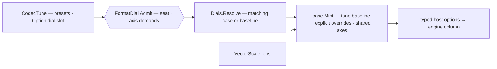

# [RASM_RHINO_OPTIONS]

`FormatDial` owns per-codec option policy. `Admit` proves codec-phase correspondence and every requested capability axis once at the entry gate, each case then mints one complete Rhino carrier, and polymorphic `Dials.Resolve` applies the selected case without a format-named resolver roster.

## [01]-[INDEX]

- [02]-[SHARED_AXES]: the cross-host capability vocabularies (`MeshEmission`, `SceneCarry`, `UnreferencedImport`, `CsvColumn`) with `HostAxis` the one prove-and-seat owner, `SubDForm`/`AxisConvention`/`PlyEncoding` the shared enum rosters, `DracoDial` and `ObjNgonDial` the admitted clusters, `IgesIdentity`/`IgesFitPolicy`/`IgesSurfaceForm`/`VdaHeader` the header and policy sub-records, and `PolicyMap` the one generated transcription.
- [03]-[DIAL_FAMILY]: `FormatDial` — the closed per-format case family with one `Mint` per case, the `Seat` correspondence, `Admit` the one refusal door over seat and axis demands, and `Emitted` the one baseline builder over the content axes.
- [04]-[DIAL_BINDING]: `Dials.Resolve` — the polymorphic case resolver and scale-lens composition.

## [02]-[SHARED_AXES]

- Owner: `MeshEmission`, `SceneCarry`, `UnreferencedImport`, and `CsvColumn` are the cross-host capability vocabularies — one row per emitted content axis, each carrying one nullable setter column per host option type it reaches, so a per-format boolean roster is set algebra over one vocabulary and the null lives only on the roster row, admitted into `Option` at its single read. `HostAxis<TRow, THost>` is their ONE owner — the static value a case declares once per axis, carrying the axis name and the column, deriving `Legal` once behind a lazy, proving `Refusal(requested, key)` for the door, and writing `Seat(host, requested, baseline)` for the mint, so the door and the mint read the SAME case field. `SubDForm` `[SmartEnum<int>]` carries the SubD tessellation columns for both host `SubDMeshing` rosters; `AxisConvention` carries the Z-up/Y-up swap in BOTH directions off one row; `PlyEncoding` carries the ASCII-and-precision matrix two independent booleans were spelling. `DracoDial` and `ObjNgonDial` — admitted values for the host's clamped compression bands and n-gon cluster. `IgesIdentity`, `IgesFitPolicy`, `IgesSurfaceForm`, and `VdaHeader` — structural policy products, each carrying its own all-defaults `Standard` value; the fit policy is one shape serving both IGES entity slots because the host columns share semantics and defaults, and both unstated slots read the same `Standard` instance.
- Law: a shared vocabulary is earned only by two or more host surfaces sharing one axis — `MeshEmission`, `SceneCarry`, `UnreferencedImport`, `SubDForm`, and `AxisConvention` qualify; a single-host boolean rides its case field directly as boundary material, because a one-to-one `[SmartEnum]` mirror restates host truth (`FileStlWriteOptions.BinaryFile`, `FileLwoWriteOptions.WriteVersion6`, and `FileTxtWriteOptions.SurroundWithDoubleQuotes` therefore carry no row).
- Law: the COLUMN is the legality. A capability row carrying no setter for a host cannot be written there, so `HostAxis.Legal` DERIVES each host's admissible set from the roster itself and no case declares a second hand-kept legal subset — `MeshEmission.VertexColors` reaching PLY, glTF, VRML, and X3D-V but not OBJ is the column roster's own shape. `FormatDial.Admit` REFUSES every requested row outside that set through the kernel's typed `CapabilitySet.Require` twin, which carries the shortfall; the prior seat wrote the legal rows and dropped the rest, so a caller asking OBJ for vertex colours received a silent nothing where the column law says refusal.
- Law: `HostAxis.Seat` writes EVERY column the host owns on every mint, so an unstated axis writes its baseline value rather than leaving the host's own default standing under a different name; the write is TOTAL because the door already refused every requested row the host cannot carry. `FieldOverride` gate-pair writes ride the Document owner's own two arms — result-typed `Apply` for write-time admission, total `Through` for a payload its own type admitted at construction — so no Exchange page holds a gate-pair twin.
- Law: a dial field wraps the Document tier's `FieldOverride<T>` in `Option`, so an unstated field and a stated `Keep` both leave the baseline standing; `default` is `None` and never `Keep`, because the override is class-shaped and a defaulted field carries no case to dispatch. The payload type carries its own admission — an unweld angle is a `Tolerance` on its own lane, a face ceiling a `Dimension` — so the gate write is total and no `Mint` discards a result.
- Law: the CSV column set is the ONE row where the tune's baseline diverges from the host's own default, and it does so by design — column membership derives from the tune's grouping, ordering, and fidelity axes, so the layer, object-name, description, and user-string columns the host turns on by default appear only when an axis names them, while the measured mass-property columns the host leaves off appear whenever the fidelity is measured. A dial-free CSV write is therefore a policy-shaped table rather than the host's default table, and a caller wanting the host's own column set states `Columns` explicitly.
- Law: DRAWING STANDARDS are the kernel's, and no dial derives one from a fidelity axis. A DWG layer name is `HostLayerScheme` — `AutoCadFlat` writes the standard's own formatted text and `RhinoPath` the `::`-joined path, so `FullLayerPath` DERIVES from the declared scheme; a DWG pen regime is `PlotStyleTable` — a `Ctb` names an AutoCAD Colour Index table, so `ColorMethod` and `UseColor` BOTH derive from whether one is declared; a DWG import's layer nesting is a `LayerStandard`, so the flat name re-admits through `LayerName.Parse` and projects through `HostLayerScheme.RhinoPath` rather than riding a bare `NestLayers` boolean (D33, D34, D54, D91, D92).
- Law: `PolicyMap` generates every name-mirrored transcription as an existing-target mapping under Source-side completeness, so a new `IgesIdentity`, `IgesSurfaceForm`, `VdaHeader`, `DracoDial`, or `ObjNgonDial` member with no host slot breaks the build; the value-object columns cross through per-type `[UserMapping]` converters rather than a generic unwrap the generator refuses (RMG001), and `IgesFitPolicy` stays hand-seated because one shape fills the `Curve*` and `Surface*` host prefixes BY SLOT — a slot-dependent rename no single mapping expresses. `FileObjWriteOptions.CreateNgons` stays one stated line because it DERIVES from `Mode` rather than mirroring a source member.
- Packages: Thinktecture.Runtime.Extensions (`[SmartEnum]`, `[ComplexValueObject]`, `[ValidationError]`, `[UseDelegateFromConstructor]`, `[KeyMemberEqualityComparer]`), Riok.Mapperly (`[Mapper]`, `[MapProperty]`, `[MappingTarget]`, `[UserMapping]`, `RequiredMappingStrategy.Source`), LanguageExt.Core (`Fin`, `Option`, `Validation` applicative, `Seq`), `Domain/validation` (`ICapability`, `CapabilitySet`, `CapabilitySet.Require<TFault>`, `Op.AcceptValidated`), `Domain/results` (`Op`), `Domain/context` (`Tolerance`, `ToleranceLane`), `Exchange/operations` (`ExchangeFault`), `Rasm.Drawing` (`HostLayerScheme`, `LayerStandard`, `PlotStyleTable`), `Document/geometry` (`FieldOverride<T>`, `Apply`/`Through`), `Document/session` (`DraftFault`); RhinoCommon `Rhino.FileIO` option surfaces per `.api/api-rhinocommon-fileio.md`.
- Growth: a new cross-host axis is one capability row with one column per host it reaches; a new host joining an existing axis is one column and one static `HostAxis` at the owning case, which the door and the mint read together; a new cluster is one sub-record and its `PolicyMap` seat.
- Boundary: each `Mint` block is a host-mutation capsule; object initialization and the ordered `Seat`/`Through`/`Apply` statements are the platform-forced statement exemption.

```csharp
// --- [IMPORTS] -------------------------------------------------------------------------
using Rasm.Domain;
using Rasm.Drawing;
using Rasm.Numerics;
using Rasm.Rhino.Document;
using Rhino;
using Rhino.FileIO;
using Rhino.Geometry;
using Riok.Mapperly.Abstractions;
using System.Runtime.InteropServices;

namespace Rasm.Rhino.Exchange;

// --- [TYPES] ---------------------------------------------------------------------------
[SmartEnum<int>]
public sealed partial class SubDForm {
    public static readonly SubDForm Surface = new(key: 0,
        obj: FileObjWriteOptions.SubDMeshing.Surface, gltf: FileGltfWriteOptions.SubDMeshing.Surface);
    public static readonly SubDForm ControlNet = new(key: 1,
        obj: FileObjWriteOptions.SubDMeshing.ControlNet, gltf: FileGltfWriteOptions.SubDMeshing.ControlNet);

    internal FileObjWriteOptions.SubDMeshing Obj { get; }
    internal FileGltfWriteOptions.SubDMeshing Gltf { get; }
}

[SmartEnum<int>]
public sealed partial class AxisConvention {
    public static readonly AxisConvention Native = new(key: 0, swaps: false);
    public static readonly AxisConvention YUp = new(key: 1, swaps: true);

    internal bool Swaps { get; }
}

[SmartEnum<int>]
public sealed partial class PlyEncoding {
    public static readonly PlyEncoding BinarySingle = new(key: 0, ascii: false, doubles: false);
    public static readonly PlyEncoding AsciiSingle = new(key: 1, ascii: true, doubles: false);
    public static readonly PlyEncoding AsciiDouble = new(key: 2, ascii: true, doubles: true);

    internal bool Ascii { get; }
    internal bool Doubles { get; }

    internal static PlyEncoding For(CodecFidelity fidelity) =>
        fidelity == CodecFidelity.Small ? BinarySingle : fidelity.IsModel ? AsciiDouble : AsciiSingle;
}

[SmartEnum<string>]
[KeyMemberEqualityComparer<ComparerAccessors.StringOrdinal, string>]
public sealed partial class MeshEmission : ICapability<MeshEmission> {
    public static readonly MeshEmission Normals = new(key: "normals",
        obj: static (o, v) => o.ExportNormals = v, ply: static (o, v) => o.ExportNormals = v,
        gltf: static (o, v) => o.ExportVertexNormals = v, vrml: static (o, v) => o.ExportVertexNormals = v,
        x3dv: static (o, v) => o.ExportVertexNormals = v, fbx: static (o, v) => o.SaveVertexNormals = v);
    public static readonly MeshEmission TextureCoordinates = new(key: "texture-coordinates",
        obj: static (o, v) => o.ExportTcs = v, ply: null,
        gltf: static (o, v) => o.ExportTextureCoordinates = v, vrml: static (o, v) => o.ExportTextureCoordinates = v,
        x3dv: static (o, v) => o.ExportTextureCoordinates = v, fbx: null);
    public static readonly MeshEmission VertexColors = new(key: "vertex-colors",
        obj: null, ply: static (o, v) => o.ExportColors = v,
        gltf: static (o, v) => o.ExportVertexColors = v, vrml: static (o, v) => o.ExportVertexColors = v,
        x3dv: static (o, v) => o.ExportVertexColors = v, fbx: null);
    public static readonly MeshEmission OpenMeshes = new(key: "open-meshes",
        obj: static (o, v) => o.ExportOpenMeshes = v, ply: null,
        gltf: static (o, v) => o.ExportOpenMeshes = v, vrml: null, x3dv: null, fbx: null);
    public static readonly MeshEmission Materials = new(key: "materials",
        obj: static (o, v) => o.ExportMaterialDefinitions = v, ply: static (o, v) => o.ExportMaterial = v,
        gltf: static (o, v) => o.ExportMaterials = v, vrml: null, x3dv: null, fbx: null);

    internal Action<FileObjWriteOptions, bool>? Obj { get; }
    internal Action<FilePlyWriteOptions, bool>? Ply { get; }
    internal Action<FileGltfWriteOptions, bool>? Gltf { get; }
    internal Action<FileVrmlWriteOptions, bool>? Vrml { get; }
    internal Action<FileX3dvWriteOptions, bool>? X3dv { get; }
    internal Action<FileFbxWriteOptions, bool>? Fbx { get; }
}

[SmartEnum<string>]
[KeyMemberEqualityComparer<ComparerAccessors.StringOrdinal, string>]
public sealed partial class SceneCarry : ICapability<SceneCarry> {
    public static readonly SceneCarry Views = new(key: "views",
        threeDsWrite: static (o, v) => o.SaveViews = v, threeDsRead: null,
        fbxWrite: static (o, v) => o.SaveViews = v, fbxRead: null,
        dgnRead: static (o, v) => o.ImportViews = v);
    public static readonly SceneCarry Lights = new(key: "lights",
        threeDsWrite: static (o, v) => o.SaveLights = v, threeDsRead: static (o, v) => o.ImportLights = v,
        fbxWrite: static (o, v) => o.SaveLights = v, fbxRead: static (o, v) => o.ImportLights = v,
        dgnRead: null);
    public static readonly SceneCarry Cameras = new(key: "cameras",
        threeDsWrite: null, threeDsRead: static (o, v) => o.ImportCameras = v,
        fbxWrite: null, fbxRead: static (o, v) => o.ImportCameras = v,
        dgnRead: null);

    internal Action<File3dsWriteOptions, bool>? ThreeDsWrite { get; }
    internal Action<File3dsReadOptions, bool>? ThreeDsRead { get; }
    internal Action<FileFbxWriteOptions, bool>? FbxWrite { get; }
    internal Action<FileFbxReadOptions, bool>? FbxRead { get; }
    internal Action<FileDgnReadOptions, bool>? DgnRead { get; }
}

[SmartEnum<string>]
[KeyMemberEqualityComparer<ComparerAccessors.StringOrdinal, string>]
public sealed partial class UnreferencedImport : ICapability<UnreferencedImport> {
    public static readonly UnreferencedImport Layers = new(key: "layers",
        dwg: static (o, v) => o.ImportUnreferencedLayers = v, dgn: static (o, v) => o.ImportUnreferencedLayers = v);
    public static readonly UnreferencedImport Blocks = new(key: "blocks",
        dwg: static (o, v) => o.ImportUnreferencedBlocks = v, dgn: static (o, v) => o.ImportUnreferencedBlocks = v);
    public static readonly UnreferencedImport Linetypes = new(key: "linetypes",
        dwg: static (o, v) => o.ImportUnreferencedLinetypes = v, dgn: static (o, v) => o.ImportUnreferencedLineStyles = v);

    internal Action<FileDwgReadOptions, bool>? Dwg { get; }
    internal Action<FileDgnReadOptions, bool>? Dgn { get; }
}

[SmartEnum<string>]
[KeyMemberEqualityComparer<ComparerAccessors.StringOrdinal, string>]
public sealed partial class CsvColumn : ICapability<CsvColumn> {
    public static readonly CsvColumn Header = new(key: "header", selected: static _ => true, write: static (o, v) => o.Header = v);
    public static readonly CsvColumn LayerName = new(key: "layer-name", selected: Layered, write: static (o, v) => o.LayerName = v);
    public static readonly CsvColumn LayerIndex = new(key: "layer-index", selected: Layered, write: static (o, v) => o.LayerIndex = v);
    public static readonly CsvColumn LayerColor = new(key: "layer-color", selected: Layered, write: static (o, v) => o.LayerColor = v);
    public static readonly CsvColumn LayerHierarchy = new(key: "layer-hierarchy", selected: Layered, write: static (o, v) => o.LayerHierarchy = v);
    public static readonly CsvColumn GroupName = new(key: "group-name", selected: Blocked, write: static (o, v) => o.GroupName = v);
    public static readonly CsvColumn GroupIndexes = new(key: "group-indexes", selected: Blocked, write: static (o, v) => o.GroupIndexes = v);
    public static readonly CsvColumn ObjectName = new(key: "object-name", selected: static tune => tune.Grouped(CodecAxis.ObjectName), write: static (o, v) => o.ObjectName = v);
    public static readonly CsvColumn ObjectID = new(key: "object-id", selected: static _ => true, write: static (o, v) => o.ObjectID = v);
    public static readonly CsvColumn ObjectColor = new(key: "object-color", selected: static tune => tune.Order == CodecAxis.ObjectType, write: static (o, v) => o.ObjectColor = v);
    public static readonly CsvColumn ObjectMaterial = new(key: "object-material", selected: static tune => tune.Grouped(CodecAxis.Material), write: static (o, v) => o.ObjectMaterial = v);
    public static readonly CsvColumn ObjectDescription = new(key: "object-description", selected: UserStrings, write: static (o, v) => o.ObjectDescription = v);
    public static readonly CsvColumn Length = new(key: "length", selected: Measured, write: static (o, v) => o.Length = v);
    public static readonly CsvColumn Perimeter = new(key: "perimeter", selected: Measured, write: static (o, v) => o.Perimeter = v);
    public static readonly CsvColumn Area = new(key: "area", selected: Measured, write: static (o, v) => o.Area = v);
    public static readonly CsvColumn Volume = new(key: "volume", selected: Measured, write: static (o, v) => o.Volume = v);
    public static readonly CsvColumn AreaCentroid = new(key: "area-centroid", selected: Measured, write: static (o, v) => o.AreaCentroid = v);
    public static readonly CsvColumn VolumeCentroid = new(key: "volume-centroid", selected: Measured, write: static (o, v) => o.VolumeCentroid = v);
    public static readonly CsvColumn AreaMoments = new(key: "area-moments", selected: Measured, write: static (o, v) => o.AreaMoments = v);
    public static readonly CsvColumn VolumeMoments = new(key: "volume-moments", selected: Measured, write: static (o, v) => o.VolumeMoments = v);
    public static readonly CsvColumn CumulativeMassProperties = new(key: "cumulative-mass-properties", selected: Measured, write: static (o, v) => o.CumulativeMassProperties = v);
    public static readonly CsvColumn AttributesKeys = new(key: "attributes-keys", selected: UserStrings, write: static (o, v) => o.AttributesKeys = v);
    public static readonly CsvColumn AttributesTexts = new(key: "attributes-texts", selected: UserStrings, write: static (o, v) => o.AttributesTexts = v);
    public static readonly CsvColumn ObjectKeys = new(key: "object-keys", selected: UserStrings, write: static (o, v) => o.ObjectKeys = v);
    public static readonly CsvColumn ObjectsTexts = new(key: "objects-texts", selected: UserStrings, write: static (o, v) => o.ObjectsTexts = v);

    [UseDelegateFromConstructor]
    private partial bool Selected(CodecTune tune);

    internal Action<FileCsvWriteOptions, bool>? Csv => Write;

    [UseDelegateFromConstructor]
    private partial void Write(FileCsvWriteOptions host, bool value);

    internal static CapabilitySet<CsvColumn> Baseline(CodecTune tune) =>
        CapabilitySet<CsvColumn>.Of([.. toSeq(Items).Filter(row => row.Selected(tune: tune))]);

    private static bool Layered(CodecTune tune) => tune.Grouped(CodecAxis.Layer);

    private static bool Blocked(CodecTune tune) => tune.Grouped(CodecAxis.Block);

    private static bool Measured(CodecTune tune) => tune.Fidelity.Measured;

    private static bool UserStrings(CodecTune tune) => tune.Group == CodecAxis.UserString;
}

// --- [MODELS] --------------------------------------------------------------------------
[ComplexValueObject]
[ValidationError]
[StructLayout(LayoutKind.Auto)]
public readonly partial struct DracoDial {
    public Rasm.Numerics.Dimension Level { get; }
    public Rasm.Numerics.Dimension PositionBits { get; }
    public Rasm.Numerics.Dimension NormalBits { get; }
    public Rasm.Numerics.Dimension TextureBits { get; }

    static partial void ValidateFactoryArguments(
        ref ValidationError? validationError,
        ref Rasm.Numerics.Dimension level,
        ref Rasm.Numerics.Dimension positionBits,
        ref Rasm.Numerics.Dimension normalBits,
        ref Rasm.Numerics.Dimension textureBits) =>
        validationError = Banded(label: nameof(Level), value: level.Value, floor: 1, ceiling: 10)
            ?? Banded(label: nameof(PositionBits), value: positionBits.Value, floor: 8, ceiling: 32)
            ?? Banded(label: nameof(NormalBits), value: normalBits.Value, floor: 8, ceiling: 32)
            ?? Banded(label: nameof(TextureBits), value: textureBits.Value, floor: 8, ceiling: 32);

    private static ValidationError? Banded(string label, int value, int floor, int ceiling) =>
        value >= floor && value <= ceiling
            ? null
            : new ValidationError(string.Join(" | ", new object?[] {
                label, value, $"a Draco value in [{floor}, {ceiling}]" }));

    public static Fin<DracoDial> Of(int level, int positionBits, int normalBits, int textureBits, Op? key = null) =>
        key.OrDefault().AcceptValidated<DracoDial>(
            fault: Validate(
                level: Rasm.Numerics.Dimension.Create(value: level),
                positionBits: Rasm.Numerics.Dimension.Create(value: positionBits),
                normalBits: Rasm.Numerics.Dimension.Create(value: normalBits),
                textureBits: Rasm.Numerics.Dimension.Create(value: textureBits),
                item: out DracoDial value),
            value: value);
}

[ComplexValueObject]
[ValidationError]
[StructLayout(LayoutKind.Auto)]
public readonly partial struct ObjNgonDial {
    public FileObjWriteOptions.NGons Mode { get; }
    public Rasm.Numerics.Dimension MinFaces { get; }
    public bool IncludeUnweldedEdges { get; }
    public bool CullInteriorVertexes { get; }

    static partial void ValidateFactoryArguments(
        ref ValidationError? validationError,
        ref FileObjWriteOptions.NGons mode,
        ref Rasm.Numerics.Dimension minFaces,
        ref bool includeUnweldedEdges,
        ref bool cullInteriorVertexes) =>
        validationError = !Enum.IsDefined(value: mode)
            ? new ValidationError(string.Join(" | ", new object?[] { nameof(Mode), "an n-gon mode the host roster publishes" }))
            : minFaces.Value < 2
                ? new ValidationError(string.Join(" | ", new object?[] { nameof(MinFaces), minFaces.Value, "at least two faces per n-gon" }))
                : null;

    public static Fin<ObjNgonDial> Of(
        FileObjWriteOptions.NGons mode,
        int minFaces,
        bool includeUnweldedEdges = true,
        bool cullInteriorVertexes = true,
        Op? key = null) =>
        key.OrDefault().AcceptValidated<ObjNgonDial>(
            fault: Validate(
                mode: mode,
                minFaces: Rasm.Numerics.Dimension.Create(value: minFaces),
                includeUnweldedEdges: includeUnweldedEdges,
                cullInteriorVertexes: cullInteriorVertexes,
                item: out ObjNgonDial value),
            value: value);

    internal Unit Apply(FileObjWriteOptions host) {
        PolicyMap.Apply(this, host);
        host.CreateNgons = Mode == FileObjWriteOptions.NGons.Create;
        return unit;
    }
}

public sealed record IgesIdentity(
    string Author = "",
    string Organization = "",
    string Sender = "",
    string Receiver = "",
    bool NotesInStartSection = true) {
    public static IgesIdentity Standard { get; } = new();
}

public sealed record IgesFitPolicy(
    FileIgsWriteOptions.MaxDegreeMode MaxDegree = FileIgsWriteOptions.MaxDegreeMode.MdNoLimit,
    bool Simplify = false,
    bool FitRational = false,
    bool ClampEndKnots = false,
    bool UseParentLabel = true,
    bool ForceBezierKnots = false,
    bool FlagDependentAs03 = false) {
    public static IgesFitPolicy Standard { get; } = new();
}

public sealed record IgesSurfaceForm(
    FileIgsWriteOptions.SurfacesMode Surfaces = FileIgsWriteOptions.SurfacesMode.Srf143,
    FileIgsWriteOptions.PolySurfacesMode PolySurfaces = FileIgsWriteOptions.PolySurfacesMode.PsrfSeparate,
    FileIgsWriteOptions.SolidsMode Solids = FileIgsWriteOptions.SolidsMode.SldSeparate,
    FileIgsWriteOptions.MeshesMode Meshes = FileIgsWriteOptions.MeshesMode.MeshNone,
    bool SplitClosed = false,
    bool SplitBiPolar = false,
    bool ForceTrimmed = false,
    bool WriteNonPlanarUnitNormal = true) {
    public static IgesSurfaceForm Standard { get; } = new();
}

public sealed record VdaHeader(
    string SendingCompany = "",
    string SendersName = "",
    string TelephoneNumber = "",
    string Address = "",
    string ProjectName = "",
    string ObjectCode = "",
    string Variant = "",
    string Confidentiality = "",
    string DateEffective = "",
    string CompanyName = "",
    string ReceivingDepartment = "") {
    public static VdaHeader Standard { get; } = new();
}

// --- [OPERATIONS] ----------------------------------------------------------------------
internal sealed class HostAxis<TRow, THost>(string axis, Func<TRow, Action<THost, bool>?> column)
    where TRow : notnull, ICapability<TRow> {
    private readonly Lazy<CapabilitySet<TRow>> legal = new(() =>
        CapabilitySet<TRow>.Of([.. toSeq(CapabilitySet<TRow>.All.Held).Filter(row => column(row) is not null)]));

    internal CapabilitySet<TRow> Legal => legal.Value;

    internal Option<ValidationClause> Refusal(Option<CapabilitySet<TRow>> requested, Op key) =>
        requested.Bind(demanded => Legal.AdmitsAll(demanded)
            ? Option<ValidationClause>.None
            : Some(new ValidationClause(string.Join(" | ", new object?[] { key, axis, $"axis rows {typeof(THost).Name} writes <{Legal.Wire}>; unwritable <{Legal.Missing(demanded).Wire}>" }))));

    internal Unit Seat(THost host, Option<CapabilitySet<TRow>> requested, CapabilitySet<TRow> baseline) {
        CapabilitySet<TRow> held = requested.IfNone(baseline);
        return toSeq(Legal.Held).Iter(row => Optional(column(row)).Iter(write => write(host, held.Admits(row))));
    }
}

[Mapper(
    RequiredMappingStrategy = RequiredMappingStrategy.Source,
    EnabledConversions = MappingConversionType.All & ~MappingConversionType.ExplicitCast)]
internal static partial class PolicyMap {
    public static partial void Apply(IgesIdentity identity, [MappingTarget] FileIgsWriteOptions host);

    [MapProperty(nameof(IgesSurfaceForm.Surfaces), nameof(FileIgsWriteOptions.SurfaceType))]
    [MapProperty(nameof(IgesSurfaceForm.PolySurfaces), nameof(FileIgsWriteOptions.PolySurfaceType))]
    [MapProperty(nameof(IgesSurfaceForm.Solids), nameof(FileIgsWriteOptions.SolidType))]
    [MapProperty(nameof(IgesSurfaceForm.Meshes), nameof(FileIgsWriteOptions.MeshType))]
    [MapProperty(nameof(IgesSurfaceForm.SplitClosed), nameof(FileIgsWriteOptions.SplitClosedSurfaces))]
    [MapProperty(nameof(IgesSurfaceForm.SplitBiPolar), nameof(FileIgsWriteOptions.SplitBiPolarSurfaces))]
    [MapProperty(nameof(IgesSurfaceForm.ForceTrimmed), nameof(FileIgsWriteOptions.ForceTrimmedSurfaces))]
    public static partial void Apply(IgesSurfaceForm surfaces, [MappingTarget] FileIgsWriteOptions host);

    public static partial void Apply(VdaHeader header, [MappingTarget] FileVdaWriteOptions host);

    [MapProperty(nameof(DracoDial.Level), nameof(FileGltfWriteOptions.DracoCompressionLevel))]
    [MapProperty(nameof(DracoDial.PositionBits), nameof(FileGltfWriteOptions.DracoQuantizationBitsPosition))]
    [MapProperty(nameof(DracoDial.NormalBits), nameof(FileGltfWriteOptions.DracoQuantizationBitsNormal))]
    [MapProperty(nameof(DracoDial.TextureBits), nameof(FileGltfWriteOptions.DracoQuantizationBitsTextureCoordinate))]
    public static partial void Apply(DracoDial draco, [MappingTarget] FileGltfWriteOptions host);

    [MapProperty(nameof(ObjNgonDial.Mode), nameof(FileObjWriteOptions.NgonMode))]
    [MapProperty(nameof(ObjNgonDial.MinFaces), nameof(FileObjWriteOptions.MinNgonFaceCount))]
    [MapProperty(nameof(ObjNgonDial.IncludeUnweldedEdges), nameof(FileObjWriteOptions.IncludeUnweldedEdgesInNgons))]
    [MapProperty(nameof(ObjNgonDial.CullInteriorVertexes), nameof(FileObjWriteOptions.CullUnnecessaryVertexesInNgons))]
    public static partial void Apply(ObjNgonDial ngons, [MappingTarget] FileObjWriteOptions host);

    [UserMapping(Default = true)]
    private static int Native(Rasm.Numerics.Dimension value) => value.Value;
}
```

## [03]-[DIAL_FAMILY]

- Owner: `FormatDial` — one case per format direction with an option surface beyond the scale lens, closed under the private root constructor alone; the generated union surface deletes as decoration, because no page reads a forty-seven-arm `Switch` and dispatch is `Dials.Resolve`'s seat-proved shape probe. Every field is an explicit override — `Option<T>` for value members, `Option<CapabilitySet<T>>` for a content axis, `Option<FieldOverride<T>>` for enable-plus-value pairs, or an admitted cluster value — and `None`/`Keep` means the baseline, never a second host default. Each case's `Mint` constructs the host option object in one object initializer naming every content-shaping host member with its baseline, then seats its axes and clusters; the fence is the roster. `Admit` is the family's ONE refusal door and `Emitted` the one baseline builder every mesh-writing case reads.
- Law: baselines are two-tier — where the codec matrix previously derived a member from `CodecTune` (fidelity, grouping, ordering, materials, resources), that derivation IS the baseline; every other member's baseline is the verified host default, so a dial-free call is byte-identical to the pre-dial matrix. A capability axis states its baseline as the SET that derivation names, so the tier survives the collapse.
- Law: a raw host enum field is BOUNDARY MATERIAL the codec seat carries, and exactly one — `ObjNgonDial.Mode` — probes `Enum.IsDefined`, because it alone feeds a derived host gate. The discriminant is WHAT READS the field: a host enum feeding DOMAIN logic — a gate, a dispatch, a derived value — admits (`Enum.IsDefined` or the kernel `Op.Row` arm) at its one read; a field the codec seat carries straight into a host options write is pass-through material whose admission would be the re-validation ceremony the boundary law deletes, so the remaining thirty-six fields stay raw BY LAW, not by omission.
- Law: host dialog and plumbing members (`UseSimpleDialog`, `ActualFilePathOnMac`, `IsDefault`, `Name`) never enter a case — they carry host UI state, not content policy — and immutable host members (`FileObjWriteOptions.AngleTolRadians`) are unreachable by construction.
- Law: `DialSeat` is an inert `(codec, phase)` pair each case constructor declares beside its option body — every pair is a compile-time constant no call site can vary, so the seat carries no admission of its own and `Admit`'s live clause (dispatched codec equals seat codec, dispatched phase equals seat phase) is the whole contract, proved against the runtime request rather than a second time at declaration. `Codecs.Apply` keeps the ability clause, owning the codec row the dial never sees.
- Law: `Admit` is the ONE door and fires before minting; `FactoryValidation` accumulates seat correspondence and requested axes into one kernel refusal. Mints stay total, and the refusal names the host option type, its legal roster, and the shortfall rows.
- Law: host redundancies collapse at `Mint` — `FileObjWriteOptions.CreateNgons` derives from `ObjNgonDial.Mode`, each `FileDwgWriteOptions` curve-fit gate derives from its adjacent `Option<FieldOverride<Tolerance>>`, `FileStpReadOptions.LimitFaces` derives from `FaceCap`, `FullLayerPath` derives from the declared `HostLayerScheme`, and `ColorMethod` with `UseColor` derive TOGETHER from whether a `PlotStyleTable` is declared, so no consumer supplies a second gate and no fidelity axis decides a drawing standard.
- Law: an override payload admits at its own TYPE — an unweld or curve-fit angle is a `Tolerance` on its named lane, a face ceiling a `Dimension`, a compression cluster a `DracoDial` — so the Document owner's total `FieldOverride.Through` writes the host gate-plus-value pair without a result and no `Mint` discards one it cannot thread.
- Law: `PolicyMap` reaches the name-mirrored SUB-RECORDS and stops there — a per-case `Mint` is not a transcription a mapper can generate, because its baselines are per-format expressions the tune decides (`Geometry` reading `tune.Fidelity.IsModel && !carrier.WriteGeometryOnly`, `ExportGroupNameLayerNames` folding a three-way `tune.Group` verdict), and a Mapperly source-to-target rule expressing one of them costs more configuration than the line it replaces. The collapse this family admits is the APPLICATOR, not the mapper: `HostAxis.Seat`, `FieldOverride.Through`, and `Emitted` fold the axis, gate-pair, and emission repetitions the forty-seven bodies were re-spelling, and what remains is one assignment per host member — the roster the fence is.
- Law: `MeshingParameters.Default` stays read at each mesh-writing `Mint` and a shared baseline row is REFUSED: the host property mints a fresh mutable carrier per read and every option surface taking one HOLDS that reference, so one shared instance aliases a single carrier across sixteen host option types and lets one format's host-side mutation reach another's. Each site also writes a different host type's own property, so no fold, gate, or mapper collapses them further.
- Boundary: `FileObjWriteOptions`/`FileObjReadOptions`/`FilePlyWriteOptions` construct over the host `FileWriteOptions`/`FileReadOptions` carrier, so their `Mint` takes the carrier the engine column already holds; `FileXamlWriteOptions` projects through `ToDictionary()` into `RhinoDoc.Export` inside its codec row, and the dial never learns the transport.
- Packages: Generator.Equals (`[Equatable]`, `[OrderedEquality]`), LanguageExt.Core (`Fin`, `Option`, `Validation`, `Seq`), `Domain/validation` (`CapabilitySet`, `FactoryValidation`), `Domain/results` (`Op`), `Domain/context` (`Tolerance`, `ToleranceLane`), `Rasm.Drawing` (`HostLayerScheme`, `LayerStandard`, `PlotStyleTable`), `Document/geometry` (`FieldOverride<T>`); RhinoCommon `Rhino.FileIO` per `.api/api-rhinocommon-fileio.md`.
- Growth: a new host knob is one override field with its baseline line in `Mint`; a new format direction is one case and one codec engine expression, and a case carrying a capability axis adds one static `HostAxis` its `RefusalsFor` override proves — the door itself never grows an arm.

```csharp
// --- [TYPES] ---------------------------------------------------------------------------
public readonly record struct DialSeat(FileCodec Codec, CodecPhase Phase);

public abstract partial record FormatDial {
    private FormatDial(FileCodec codec, CodecPhase phase) => Seat = new DialSeat(Codec: codec, Phase: phase);

    internal DialSeat Seat { get; }

    private protected virtual Seq<ValidationClause> RefusalsFor(Op key) => Seq<ValidationClause>();

    internal Fin<Unit> Admit(FileCodec codec, CodecPhase phase, Op key) =>
        FactoryValidation.Admit(
            FactoryValidation.Violated(
                (Seat.Codec != codec || Seat.Phase != phase, () => new ValidationClause(string.Join(" | ", new object?[] { key, nameof(CodecTune.Dial), $"a dial seated at '{codec.Key}' in the '{phase.Key}' phase;"
                        + $" got '{Seat.Codec.Key}' in '{Seat.Phase.Key}'" }))))
            + RefusalsFor(key: key));

    public sealed record ThreeDsWriteCase(
        Option<CapabilitySet<SceneCarry>> Scene = default,
        Option<MeshingParameters> Mesh = default) : FormatDial(FileCodec.ThreeDs, CodecPhase.Export) {
        private static readonly HostAxis<SceneCarry, File3dsWriteOptions> SceneAxis =
            new(axis: nameof(Scene), column: static row => row.ThreeDsWrite);

        private protected override Seq<ValidationClause> RefusalsFor(Op key) => SceneAxis.Refusal(Scene, key).ToSeq();

        internal File3dsWriteOptions Mint(CodecTune tune) {
            File3dsWriteOptions host = new() { MeshingParameters = Mesh.IfNone(() => MeshingParameters.Default) };
            _ = SceneAxis.Seat(
                host: host,
                requested: Scene,
                baseline: tune.Fidelity.IsModel ? CapabilitySet<SceneCarry>.Of(SceneCarry.Views, SceneCarry.Lights) : CapabilitySet<SceneCarry>.None);
            return host;
        }
    }

    public sealed record ThreeDsReadCase(
        Option<FieldOverride<Tolerance>> Unweld = default,
        Option<CapabilitySet<SceneCarry>> Scene = default) : FormatDial(FileCodec.ThreeDs, CodecPhase.Import) {
        private static readonly HostAxis<SceneCarry, File3dsReadOptions> SceneAxis =
            new(axis: nameof(Scene), column: static row => row.ThreeDsRead);

        private protected override Seq<ValidationClause> RefusalsFor(Op key) => SceneAxis.Refusal(Scene, key).ToSeq();

        internal File3dsReadOptions Mint() {
            File3dsReadOptions host = new();
            _ = SceneAxis.Seat(
                host: host,
                requested: Scene,
                baseline: CapabilitySet<SceneCarry>.Of(SceneCarry.Lights, SceneCarry.Cameras));
            _ = Unweld.Iter(field => field.Through(
                host: host,
                gate: static (o, v) => o.Unweld = v,
                value: static (o, v) => o.UnweldAngle = v.Value));
            return host;
        }
    }

    [Equatable]
    public sealed partial record ThreeMfWriteCase(
        Option<string> Title = default,
        Option<string> Designer = default,
        Option<string> Description = default,
        Option<string> Copyright = default,
        Option<string> LicenseTerms = default,
        Option<string> Rating = default,
        Option<bool> MoveToPositiveOctant = default,
        [property: OrderedEquality] Seq<(string Key, string Value)> Metadata = default) : FormatDial(FileCodec.ThreeMf, CodecPhase.Export) {
        internal File3mfWriteOptions Mint() {
            File3mfWriteOptions host = new() {
                Title = Title.IfNone(string.Empty),
                Designer = Designer.IfNone(string.Empty),
                Description = Description.IfNone(string.Empty),
                Copyright = Copyright.IfNone(string.Empty),
                LicenseTerms = LicenseTerms.IfNone(string.Empty),
                Rating = Rating.IfNone(string.Empty),
                MoveOutputToPositiveXYZOctant = MoveToPositiveOctant.IfNone(true),
            };
            _ = Metadata.Iter(pair => host.Metadata[pair.Key] = pair.Value);
            return host;
        }
    }

    public sealed record AiWriteCase(
        Option<bool> UseCmyk = default,
        Option<bool> ExportViewBoundary = default,
        Option<bool> HatchesAsSolidFills = default,
        Option<HostLayerScheme> LayerScheme = default) : FormatDial(FileCodec.Ai, CodecPhase.Export) {
        internal FileAiWriteOptions Mint(CodecTune tune) => new() {
            PreserveModelScale = tune.Fidelity.IsModel,
            UseCMYK = UseCmyk.IfNone(false),
            ExportViewBoundary = ExportViewBoundary.IfNone(false),
            ExportHatchesAsSolidFills = HatchesAsSolidFills.IfNone(true),
            OrderLayers = LayerScheme.IsSome,
        };
    }

    public sealed record AmfWriteCase(Option<MeshingParameters> Mesh = default) : FormatDial(FileCodec.Amf, CodecPhase.Export) {
        internal FileAmfWriteOptions Mint() => new() { MeshingParameters = Mesh.IfNone(() => MeshingParameters.Default) };
    }

    public sealed record ObjWriteCase(
        Option<FileObjWriteOptions.GeometryType> Geometry = default,
        Option<FileObjWriteOptions.ObjObjectNames> ObjectNames = default,
        Option<FileObjWriteOptions.ObjGroupNames> GroupNames = default,
        Option<FileObjWriteOptions.AsciiEol> Eol = default,
        Option<FileObjWriteOptions.CurveType> TrimCurves = default,
        Option<FileObjWriteOptions.PolylineExportType> Polylines = default,
        Option<FileObjWriteOptions.VertexWelding> Welding = default,
        Option<SubDForm> SubD = default,
        Option<Rasm.Numerics.Dimension> SubDDensity = default,
        Option<CapabilitySet<MeshEmission>> Emission = default,
        Option<bool> DisplayColorMaterial = default,
        Option<bool> RenderMeshes = default,
        Option<bool> SortGroups = default,
        Option<bool> MergeNestedGroups = default,
        Option<AxisConvention> Axes = default,
        Option<Rasm.Numerics.Dimension> Digits = default,
        Option<bool> WrapLongLines = default,
        Option<bool> Triangulate = default,
        Option<bool> UnderbarMaterialNames = default,
        Option<bool> RelativeIndexing = default,
        Option<FieldOverride<int>> VertexColors = default,
        Option<ObjNgonDial> Ngons = default,
        Option<MeshingParameters> Mesh = default) : FormatDial(FileCodec.Obj, CodecPhase.Export) {
        private static readonly HostAxis<MeshEmission, FileObjWriteOptions> EmissionAxis =
            new(axis: nameof(Emission), column: static row => row.Obj);

        private protected override Seq<ValidationClause> RefusalsFor(Op key) => EmissionAxis.Refusal(Emission, key).ToSeq();

        internal FileObjWriteOptions Mint(CodecTune tune, FileWriteOptions carrier) {
            FileObjWriteOptions host = new(carrier) {
                ObjectType = Geometry.IfNone(tune.Fidelity.IsModel && !carrier.WriteGeometryOnly
                    ? FileObjWriteOptions.GeometryType.Nurbs : FileObjWriteOptions.GeometryType.Mesh),
                ExportObjectNames = ObjectNames.IfNone(tune.Group == CodecAxis.ObjectName
                    ? FileObjWriteOptions.ObjObjectNames.ObjectAsObject : FileObjWriteOptions.ObjObjectNames.NoObjects),
                ExportGroupNameLayerNames = GroupNames.IfNone(tune.Group == CodecAxis.Layer
                    ? FileObjWriteOptions.ObjGroupNames.LayerAsGroup
                    : tune.Group == CodecAxis.Block
                        ? FileObjWriteOptions.ObjGroupNames.GroupAsGroup
                        : FileObjWriteOptions.ObjGroupNames.NoGroups),
                EolType = Eol.IfNone(FileObjWriteOptions.AsciiEol.Crlf),
                TrimCurveType = TrimCurves.IfNone(FileObjWriteOptions.CurveType.Nurbs),
                PolylineType = Polylines.IfNone(FileObjWriteOptions.PolylineExportType.Bspline),
                MeshType = Welding.IfNone(FileObjWriteOptions.VertexWelding.Normal),
                SubDMeshType = SubD.Map(static row => row.Obj).IfNone(FileObjWriteOptions.SubDMeshing.Surface),
                SubDSurfaceMeshingDensity = SubDDensity.Map(static value => value.Value).IfNone(4),
                UseDisplayColorForMaterial = DisplayColorMaterial.IfNone(tune.Materials),
                UseRenderMeshes = RenderMeshes.IfNone(tune.Fidelity == CodecFidelity.Small || carrier.IncludeRenderMeshes),
                SortObjGroups = SortGroups.IfNone(tune.Order == CodecAxis.Layer || tune.Order == CodecAxis.Block),
                MergeNestedGroupingNames = MergeNestedGroups.IfNone(tune.Group == CodecAxis.Layer),
                MapZtoY = Axes.IfNone(AxisConvention.Native).Swaps,
                SignificantDigits = Digits.Map(static value => value.Value).IfNone(17),
                WrapLongLines = WrapLongLines.IfNone(false),
                ExportAsTriangles = Triangulate.IfNone(false),
                UnderbarMaterialNames = UnderbarMaterialNames.IfNone(false),
                UseRelativeIndexing = RelativeIndexing.IfNone(false),
                MeshParameters = Mesh.IfNone(() => MeshingParameters.Default),
            };
            _ = EmissionAxis.Seat(
                host: host,
                requested: Emission,
                baseline: Emitted(
                    materials: tune.Materials && carrier.WriteUserData,
                    textures: tune.Materials,
                    normals: tune.Fidelity.Measured,
                    open: true));
            _ = VertexColors.Iter(field => field.Through(
                host: host,
                gate: static (o, v) => o.ExportVcs = v,
                value: static (o, v) => o.VcsFormat = v));
            _ = Ngons.Iter(dial => dial.Apply(host: host));
            return host;
        }
    }

    public sealed record ObjReadCase(
        Option<FileObjReadOptions.UseObjGsAs> Groups = default,
        Option<FileObjReadOptions.UseObjOsAs> Objects = default,
        Option<AxisConvention> Axes = default,
        Option<bool> MorphTargetOnly = default,
        Option<bool> ReverseGroupOrder = default,
        Option<bool> IgnoreTextures = default,
        Option<bool> DisplayColorFromMaterial = default,
        Option<bool> Split32BitTextures = default) : FormatDial(FileCodec.Obj, CodecPhase.Import) {
        internal FileObjReadOptions Mint(FileReadOptions carrier) => new(carrier) {
            UseObjGroupsAs = Groups.IfNone(FileObjReadOptions.UseObjGsAs.ObjGroupsAsObjects),
            UseObjObjectsAs = Objects.IfNone(FileObjReadOptions.UseObjOsAs.IgnoreObjObjects),
            MapYtoZ = Axes.IfNone(AxisConvention.Native).Swaps,
            MorphTargetOnly = MorphTargetOnly.IfNone(false),
            ReverseGroupOrder = ReverseGroupOrder.IfNone(false),
            IgnoreTextures = IgnoreTextures.IfNone(false),
            DisplayColorFromObjMaterial = DisplayColorFromMaterial.IfNone(true),
            Split32BitTextures = Split32BitTextures.IfNone(false),
        };
    }

    public sealed record PlyWriteCase(
        Option<PlyEncoding> Encoding = default,
        Option<CapabilitySet<MeshEmission>> Emission = default,
        Option<MeshingParameters> Mesh = default) : FormatDial(FileCodec.Ply, CodecPhase.Export) {
        private static readonly HostAxis<MeshEmission, FilePlyWriteOptions> EmissionAxis =
            new(axis: nameof(Emission), column: static row => row.Ply);

        private protected override Seq<ValidationClause> RefusalsFor(Op key) => EmissionAxis.Refusal(Emission, key).ToSeq();

        internal FilePlyWriteOptions Mint(CodecTune tune, FileWriteOptions carrier) {
            PlyEncoding encoding = Encoding.IfNone(PlyEncoding.For(fidelity: tune.Fidelity));
            FilePlyWriteOptions host = new(carrier) {
                ExportASCII = encoding.Ascii,
                ExportDoubles = encoding.Doubles,
                MeshingParameters = Mesh.IfNone(() => MeshingParameters.Default),
            };
            _ = EmissionAxis.Seat(
                host: host,
                requested: Emission,
                baseline: Emitted(
                    materials: tune.Resources == CodecResource.Embed,
                    colors: tune.Materials,
                    normals: tune.Fidelity.Measured));
            return host;
        }
    }

    public sealed record PlyReadCase(Option<UnitSystem> Units = default) : FormatDial(FileCodec.Ply, CodecPhase.Import) {
        internal FilePlyReadOptions Mint() => new() { PLYModelUnits = Units.IfNone(UnitSystem.Millimeters) };
    }

    public sealed record CdWriteCase(Option<MeshingParameters> Mesh = default) : FormatDial(FileCodec.Cd, CodecPhase.Export) {
        internal FileCdWriteOptions Mint() => new() { MeshingParameters = Mesh.IfNone(() => MeshingParameters.Default) };
    }

    public sealed record DgnReadCase(
        Option<CapabilitySet<UnreferencedImport>> Unreferenced = default,
        Option<CapabilitySet<SceneCarry>> Scene = default,
        Option<bool> GroupCellHeaders = default) : FormatDial(FileCodec.Dgn, CodecPhase.Import) {
        private static readonly HostAxis<UnreferencedImport, FileDgnReadOptions> UnreferencedAxis =
            new(axis: nameof(Unreferenced), column: static row => row.Dgn);

        private static readonly HostAxis<SceneCarry, FileDgnReadOptions> SceneAxis =
            new(axis: nameof(Scene), column: static row => row.DgnRead);

        private protected override Seq<ValidationClause> RefusalsFor(Op key) =>
            UnreferencedAxis.Refusal(Unreferenced, key).ToSeq() + SceneAxis.Refusal(Scene, key).ToSeq();

        internal FileDgnReadOptions Mint() {
            FileDgnReadOptions host = new() { GroupCellHeaders = GroupCellHeaders.IfNone(true) };
            _ = UnreferencedAxis.Seat(
                host: host,
                requested: Unreferenced,
                baseline: CapabilitySet<UnreferencedImport>.Of(UnreferencedImport.Linetypes));
            _ = SceneAxis.Seat(host: host, requested: Scene, baseline: CapabilitySet<SceneCarry>.None);
            return host;
        }
    }

    public sealed record DstReadCase(Option<bool> ImportJumps = default) : FormatDial(FileCodec.Dst, CodecPhase.Import) {
        internal FileDstReadOptions Mint() => new() { ImportJumps = ImportJumps.IfNone(false) };
    }

    public sealed record DwgWriteCase(
        Option<FileDwgWriteOptions.AutocadVersion> Version = default,
        Option<FileDwgWriteOptions.ExportSurfaceMode> SurfacesAs = default,
        Option<FileDwgWriteOptions.ExportMeshMode> MeshesAs = default,
        Option<FileDwgWriteOptions.ExportLineMode> LinesAs = default,
        Option<FileDwgWriteOptions.ExportArcMode> ArcsAs = default,
        Option<FileDwgWriteOptions.ExportSplineMode> SplinesAs = default,
        Option<FileDwgWriteOptions.ExportPolylineMode> PolylinesAs = default,
        Option<FileDwgWriteOptions.ExportPolycurveMode> PolycurvesAs = default,
        Option<FileDwgWriteOptions.FlattenMode> Flatten = default,
        Option<PlotStyleTable> Styles = default,
        Option<HostLayerScheme> LayerScheme = default,
        Option<bool> UseLWPolylines = default,
        Option<Tolerance> SimplifyTolerance = default,
        Option<Tolerance> MinPointDistance = default,
        Option<bool> SplitPolycurves = default,
        Option<bool> SplitSplines = default,
        Option<bool> Simplify = default,
        Option<bool> NoDxfHeader = default,
        Option<bool> PreserveArcNormals = default,
        Option<bool> WriteThickCurves = default,
        Option<FieldOverride<Tolerance>> CurveMaxAngle = default,
        Option<FieldOverride<Tolerance>> CurveChordHeight = default,
        Option<FieldOverride<Tolerance>> CurveSegmentLength = default) : FormatDial(FileCodec.Dwg, CodecPhase.Export) {
        internal FileDwgWriteOptions Mint(CodecTune tune) {
            FileDwgWriteOptions host = new() {
                Version = Version.IfNone(FileDwgWriteOptions.AutocadVersion.Acad2018),
                ExportSurfacesAs = SurfacesAs.IfNone(tune.Fidelity == CodecFidelity.GeometryOnly
                    ? FileDwgWriteOptions.ExportSurfaceMode.Meshes : FileDwgWriteOptions.ExportSurfaceMode.Curves),
                ExportMeshesAs = MeshesAs.IfNone(FileDwgWriteOptions.ExportMeshMode.Meshes),
                ExportLinesAs = LinesAs.IfNone(FileDwgWriteOptions.ExportLineMode.Lines),
                ExportArcsAs = ArcsAs.IfNone(FileDwgWriteOptions.ExportArcMode.Arcs),
                ExportSplinesAs = SplinesAs.IfNone(FileDwgWriteOptions.ExportSplineMode.Splines),
                ExportPolylinesAs = PolylinesAs.IfNone(FileDwgWriteOptions.ExportPolylineMode.Polylines),
                ExportPolycurvesAs = PolycurvesAs.IfNone(FileDwgWriteOptions.ExportPolycurveMode.Splines),
                Flatten = Flatten.IfNone(FileDwgWriteOptions.FlattenMode.None),
                ColorMethod = Styles.IsSome
                    ? FileDwgWriteOptions.ColorMethodType.ACI : FileDwgWriteOptions.ColorMethodType.RGB,
                UseColor = Styles.IsSome
                    ? FileDwgWriteOptions.UseColorType.USEPRINT : FileDwgWriteOptions.UseColorType.USEDISPLAY,
                FullLayerPath = LayerScheme.IfNone(HostLayerScheme.AutoCadFlat) == HostLayerScheme.RhinoPath,
                UseLWPolylines = UseLWPolylines.IfNone(!tune.Fidelity.IsModel),
                SimplifyTolerance = SimplifyTolerance.Map(static row => row.Value).IfNone(0.05),
                MinPointDistance = MinPointDistance.Map(static row => row.Value).IfNone(1e-06),
                SplitPolycurves = SplitPolycurves.IfNone(true),
                SplitSplines = SplitSplines.IfNone(false),
                Simplify = Simplify.IfNone(false),
                NoDxfHeader = NoDxfHeader.IfNone(false),
                PreserveArcNormals = PreserveArcNormals.IfNone(true),
                WriteThickCurves = WriteThickCurves.IfNone(false),
            };
            _ = CurveMaxAngle.Iter(field => field.Through(
                host: host,
                gate: static (o, v) => o.CurveUseMaxAngle = v,
                value: static (o, v) => o.CurveMaxAngleDegrees = double.RadiansToDegrees(v.Value)));
            _ = CurveChordHeight.Iter(field => field.Through(
                host: host,
                gate: static (o, v) => o.CurveUseChordHeight = v,
                value: static (o, v) => o.CurveChordHeight = v.Value));
            _ = CurveSegmentLength.Iter(field => field.Through(
                host: host,
                gate: static (o, v) => o.CurveUseSegmentLength = v,
                value: static (o, v) => o.CurveSegmentLength = v.Value));
            return host;
        }
    }

    public sealed record DwgReadCase(
        Option<CapabilitySet<UnreferencedImport>> Unreferenced = default,
        Option<bool> WidePolylinesAsSurfaces = default,
        Option<bool> IgnoreThickness = default,
        Option<bool> RegionsAsCurves = default,
        Option<bool> MakeExtrusions = default,
        Option<FileDwgReadOptions.MeshPrecisionMode> MeshPrecision = default,
        Option<UnitSystem> ModelUnits = default,
        Option<UnitSystem> LayoutUnits = default,
        Option<bool> LayerMaterialFromColor = default,
        Option<LayerStandard> Nesting = default) : FormatDial(FileCodec.Dwg, CodecPhase.Import) {
        private static readonly HostAxis<UnreferencedImport, FileDwgReadOptions> UnreferencedAxis =
            new(axis: nameof(Unreferenced), column: static row => row.Dwg);

        private protected override Seq<ValidationClause> RefusalsFor(Op key) => UnreferencedAxis.Refusal(Unreferenced, key).ToSeq();

        internal FileDwgReadOptions Mint() {
            FileDwgReadOptions host = new() {
                ConvertWidePolylinesToSurfaces = WidePolylinesAsSurfaces.IfNone(false),
                IgnoreThickness = IgnoreThickness.IfNone(false),
                ConvertRegionsToCurves = RegionsAsCurves.IfNone(false),
                MakeExtrusions = MakeExtrusions.IfNone(true),
                MeshPrecision = MeshPrecision.IfNone(FileDwgReadOptions.MeshPrecisionMode.Automatic),
                ModelUnits = ModelUnits.IfNone(UnitSystem.Millimeters),
                LayoutUnits = LayoutUnits.IfNone(UnitSystem.Millimeters),
                SetLayerMaterialToLayerColor = LayerMaterialFromColor.IfNone(false),
                NestLayers = Nesting.IsSome,
            };
            _ = UnreferencedAxis.Seat(host: host, requested: Unreferenced, baseline: CapabilitySet<UnreferencedImport>.All);
            return host;
        }
    }

    public sealed record StlWriteCase(
        Option<bool> Binary = default,
        Option<bool> ExportOpenObjects = default,
        Option<MeshingParameters> Mesh = default) : FormatDial(FileCodec.Stl, CodecPhase.Export) {
        internal FileStlWriteOptions Mint() => new() {
            BinaryFile = Binary.IfNone(true),
            ExportOpenObjects = ExportOpenObjects.IfNone(true),
            MeshingParameters = Mesh.IfNone(() => MeshingParameters.Default),
        };
    }

    public sealed record StlReadCase(
        Option<FieldOverride<Tolerance>> Weld = default,
        Option<bool> SplitDisjointMeshes = default,
        Option<UnitSystem> Units = default) : FormatDial(FileCodec.Stl, CodecPhase.Import) {
        internal FileStlReadOptions Mint() {
            FileStlReadOptions host = new() {
                SplitDisjointMeshes = SplitDisjointMeshes.IfNone(true),
                STLModelUnits = Units.IfNone(UnitSystem.Millimeters),
            };
            _ = Weld.Iter(field => field.Through(
                host: host,
                gate: static (o, v) => o.Weld = v,
                value: static (o, v) => o.WeldAngle = v.Value));
            return host;
        }
    }

    public sealed record StpWriteCase(
        Option<FileStpWriteOptions.StepSchema> Schema = default,
        Option<bool> Export2dCurves = default,
        Option<bool> ExportBlack = default,
        Option<bool> SplitClosedSurfaces = default) : FormatDial(FileCodec.Stp, CodecPhase.Export) {
        internal FileStpWriteOptions Mint() => new() {
            Schema = Schema.IfNone(FileStpWriteOptions.StepSchema.SF_203),
            Export2dCurves = Export2dCurves.IfNone(false),
            ExportBlack = ExportBlack.IfNone(true),
            SplitClosedSurfaces = SplitClosedSurfaces.IfNone(false),
        };
    }

    public sealed record StpReadCase(
        Option<bool> JoinSurfaces = default,
        Option<FieldOverride<Rasm.Numerics.Dimension>> FaceCap = default) : FormatDial(FileCodec.Stp, CodecPhase.Import) {
        internal FileStpReadOptions Mint() {
            FileStpReadOptions host = new() { JoinSurfaces = JoinSurfaces.IfNone(true) };
            _ = FaceCap.Iter(field => field.Through(
                host: host,
                gate: static (o, v) => o.LimitFaces = v,
                value: static (o, v) => o.MaxFaceCount = v.Value));
            return host;
        }
    }

    public sealed record FbxWriteCase(
        Option<FileFbxWriteOptions.ObjectType> SaveObjectsAs = default,
        Option<FileFbxWriteOptions.MaterialType> SaveMaterialsAs = default,
        Option<FileFbxWriteOptions.FileType> SaveFileAs = default,
        Option<CapabilitySet<SceneCarry>> Scene = default,
        Option<CapabilitySet<MeshEmission>> Emission = default,
        Option<AxisConvention> Axes = default,
        Option<MeshingParameters> Mesh = default) : FormatDial(FileCodec.Fbx, CodecPhase.Export) {
        private static readonly HostAxis<SceneCarry, FileFbxWriteOptions> SceneAxis =
            new(axis: nameof(Scene), column: static row => row.FbxWrite);

        private static readonly HostAxis<MeshEmission, FileFbxWriteOptions> EmissionAxis =
            new(axis: nameof(Emission), column: static row => row.Fbx);

        private protected override Seq<ValidationClause> RefusalsFor(Op key) =>
            SceneAxis.Refusal(Scene, key).ToSeq() + EmissionAxis.Refusal(Emission, key).ToSeq();

        internal FileFbxWriteOptions Mint(CodecTune tune) {
            FileFbxWriteOptions host = new() {
                SaveObjectsAs = SaveObjectsAs.IfNone(tune.Fidelity.IsModel
                    ? FileFbxWriteOptions.ObjectType.Nurbs : FileFbxWriteOptions.ObjectType.Mesh),
                SaveMaterialsAs = SaveMaterialsAs.IfNone(FileFbxWriteOptions.MaterialType.Phong),
                SaveFileAs = SaveFileAs.IfNone(FileFbxWriteOptions.FileType.Binary7),
                MapRhinoZtoFbxY = Axes.IfNone(AxisConvention.Native).Swaps,
                MeshingParameters = Mesh.IfNone(() => MeshingParameters.Default),
            };
            _ = SceneAxis.Seat(
                host: host,
                requested: Scene,
                baseline: tune.Fidelity.IsModel ? CapabilitySet<SceneCarry>.Of(SceneCarry.Views, SceneCarry.Lights) : CapabilitySet<SceneCarry>.None);
            _ = EmissionAxis.Seat(host: host, requested: Emission, baseline: Emitted(normals: tune.Fidelity.Measured));
            return host;
        }
    }

    public sealed record FbxReadCase(
        Option<FieldOverride<Tolerance>> Unweld = default,
        Option<bool> MeshesAsSubD = default,
        Option<CapabilitySet<SceneCarry>> Scene = default,
        Option<AxisConvention> Axes = default) : FormatDial(FileCodec.Fbx, CodecPhase.Import) {
        private static readonly HostAxis<SceneCarry, FileFbxReadOptions> SceneAxis =
            new(axis: nameof(Scene), column: static row => row.FbxRead);

        private protected override Seq<ValidationClause> RefusalsFor(Op key) => SceneAxis.Refusal(Scene, key).ToSeq();

        internal FileFbxReadOptions Mint() {
            FileFbxReadOptions host = new() {
                ImportMeshesAsSubD = MeshesAsSubD.IfNone(false),
                MapFbxYtoRhinoZ = Axes.IfNone(AxisConvention.Native).Swaps,
            };
            _ = SceneAxis.Seat(host: host, requested: Scene, baseline: CapabilitySet<SceneCarry>.Of(SceneCarry.Lights, SceneCarry.Cameras));
            _ = Unweld.Iter(field => field.Through(
                host: host,
                gate: static (o, v) => o.Unweld = v,
                value: static (o, v) => o.UnweldAngle = v.Value));
            return host;
        }
    }

    public sealed record GhsReadCase(
        Option<FileGHSReadOptions.ReadViewType> ViewType = default,
        Option<bool> AttachGhsData = default,
        Option<bool> RemoveColinearPoints = default) : FormatDial(FileCodec.Ghs, CodecPhase.Import) {
        internal FileGHSReadOptions Mint() => new() {
            ViewType = ViewType.IfNone(FileGHSReadOptions.ReadViewType.Solid),
            AttachGhsData = AttachGhsData.IfNone(true),
            RemoveColinearPoints = RemoveColinearPoints.IfNone(true),
        };
    }

    public sealed record GtsWriteCase(Option<MeshingParameters> Mesh = default) : FormatDial(FileCodec.Gts, CodecPhase.Export) {
        internal FileGtsWriteOptions Mint() => new() { MeshingParameters = Mesh.IfNone(() => MeshingParameters.Default) };
    }

    public sealed record IgsWriteCase(
        Option<IgesIdentity> Identity = default,
        Option<UnitSystem> Units = default,
        Option<Tolerance> Fit = default,
        Option<FileIgsWriteOptions.IgeswVersionMode> Version = default,
        Option<FileIgsWriteOptions.EolMode> Eol = default,
        Option<FileIgsWriteOptions.IgesStringTypeMode> Text = default,
        Option<FileIgsWriteOptions.PointObjectsMode> Points = default,
        Option<IgesFitPolicy> Curves = default,
        Option<bool> CompositeCurves = default,
        Option<IgesFitPolicy> SurfaceFit = default,
        Option<IgesSurfaceForm> Surfaces = default,
        Option<double> Scale = default,
        Option<bool> HideDependentObjects = default,
        Option<bool> DoublesUseE = default,
        Option<bool> NoZerosInTSection = default,
        Option<bool> RenderColorAsIgesColor = default,
        Option<(Rasm.Numerics.Dimension Version, double Tolsize)> Catia = default) : FormatDial(FileCodec.Igs, CodecPhase.Export) {
        internal FileIgsWriteOptions Mint() {
            IgesIdentity identity = Identity.IfNone(IgesIdentity.Standard);
            IgesFitPolicy curves = Curves.IfNone(IgesFitPolicy.Standard);
            IgesFitPolicy surfaceFit = SurfaceFit.IfNone(IgesFitPolicy.Standard);
            IgesSurfaceForm surfaces = Surfaces.IfNone(IgesSurfaceForm.Standard);
            FileIgsWriteOptions host = new() {
                Units = Units.IfNone(UnitSystem.Millimeters),
                Tolerance = Fit.Map(static row => row.Value).IfNone(0.001),
                IgesVersion = Version.IfNone(FileIgsWriteOptions.IgeswVersionMode.Igv52),
                EolType = Eol.IfNone(FileIgsWriteOptions.EolMode.Crlf),
                IgesStringType = Text.IfNone(FileIgsWriteOptions.IgesStringTypeMode.Unicode),
                PointType = Points.IfNone(FileIgsWriteOptions.PointObjectsMode.PoSeparate),
                CompositeCurvesAsSingleBsplines = CompositeCurves.IfNone(false),
                CurveMaxDegree = curves.MaxDegree,
                SimplifyCurves = curves.Simplify,
                FitRationalCurves = curves.FitRational,
                ClampCurveEndKnots = curves.ClampEndKnots,
                UseParentLabelOnCurves = curves.UseParentLabel,
                ForceBezierKnotsOnCurves = curves.ForceBezierKnots,
                FlagDependentCurvesAs03 = curves.FlagDependentAs03,
                MaxSurfaceDegree = surfaceFit.MaxDegree,
                SimplifySurfaces = surfaceFit.Simplify,
                FitRationalSurfaces = surfaceFit.FitRational,
                ClampSurfaceEndKnots = surfaceFit.ClampEndKnots,
                UseParentLabelOnSurfaces = surfaceFit.UseParentLabel,
                ForceBezierKnotsOnSurfaces = surfaceFit.ForceBezierKnots,
                FlagDependentSurfacesAs03 = surfaceFit.FlagDependentAs03,
                Scale = Scale.IfNone(1.0),
                HideDependentObjects = HideDependentObjects.IfNone(false),
                DoublesUseE = DoublesUseE.IfNone(false),
                NoZerosInTSection = NoZerosInTSection.IfNone(false),
                RenderColorAsIgesColor = RenderColorAsIgesColor.IfNone(false),
            };
            PolicyMap.Apply(identity, host);
            PolicyMap.Apply(surfaces, host);
            _ = Catia.Iter(pair => { host.CatiaVersion = pair.Version.Value; host.CatiaTolsize = pair.Tolsize; });
            return host;
        }
    }

    public sealed record LwoWriteCase(
        Option<bool> WriteVersion6 = default,
        Option<MeshingParameters> Mesh = default) : FormatDial(FileCodec.Lwo, CodecPhase.Export) {
        internal FileLwoWriteOptions Mint() => new() {
            WriteVersion6 = WriteVersion6.IfNone(true),
            MeshingParameters = Mesh.IfNone(() => MeshingParameters.Default),
        };
    }

    public sealed record LwoReadCase(Option<FieldOverride<Tolerance>> Unweld = default) : FormatDial(FileCodec.Lwo, CodecPhase.Import) {
        internal FileLwoReadOptions Mint() {
            FileLwoReadOptions host = new();
            _ = Unweld.Iter(field => field.Through(
                host: host,
                gate: static (o, v) => o.Unweld = v,
                value: static (o, v) => o.UnweldAngle = v.Value));
            return host;
        }
    }

    public sealed record NwdWriteCase(
        Option<NavisWorksVersion> Version = default,
        Option<MeshingParameters> Mesh = default) : FormatDial(FileCodec.Nwd, CodecPhase.Export) {
        internal FileNwdWriteOptions Mint() => new() {
            Version = Version.IfNone(NavisWorksVersion.Navisworks2016),
            MeshingParameters = Mesh.IfNone(() => MeshingParameters.Default),
        };
    }

    public sealed record PovWriteCase(
        Option<bool> ExportAsOneFile = default,
        Option<MeshingParameters> Mesh = default) : FormatDial(FileCodec.Pov, CodecPhase.Export) {
        internal FilePovWriteOptions Mint() => new() {
            ExportAsOneFile = ExportAsOneFile.IfNone(true),
            MeshingParameters = Mesh.IfNone(() => MeshingParameters.Default),
        };
    }

    public sealed record RawWriteCase(Option<MeshingParameters> Mesh = default) : FormatDial(FileCodec.Raw, CodecPhase.Export) {
        internal FileRawWriteOptions Mint() => new() { MeshingParameters = Mesh.IfNone(() => MeshingParameters.Default) };
    }

    public sealed record RawReadCase(Option<UnitSystem> Units = default) : FormatDial(FileCodec.Raw, CodecPhase.Import) {
        internal FileRawReadOptions Mint() => new() { RawModelUnits = Units.IfNone(UnitSystem.Millimeters) };
    }

    public sealed record SatWriteCase(Option<FileSatWriteOptions.SatTypes> Type = default) : FormatDial(FileCodec.Sat, CodecPhase.Export) {
        internal FileSatWriteOptions Mint() => new() { Type = Type.IfNone(FileSatWriteOptions.SatTypes.Default) };
    }

    public sealed record SkpWriteCase(
        Option<FileSkpWriteOptions.SketchUpVersion> Version = default,
        Option<bool> PlanarRegionsAsPolygons = default,
        Option<bool> GroupObjects = default,
        Option<double> MaxAngle = default) : FormatDial(FileCodec.Skp, CodecPhase.Export) {
        internal FileSkpWriteOptions Mint(CodecTune tune) => new() {
            Version = Version.IfNone(FileSkpWriteOptions.SketchUpVersion.SketchUp2021),
            ExportPlanarRegionsAsPolygons = PlanarRegionsAsPolygons.IfNone(true),
            GroupObjects = GroupObjects.IfNone(tune.Group == CodecAxis.Layer || tune.Group == CodecAxis.Block),
            MaxAngle = MaxAngle.IfNone(15.0),
        };
    }

    public sealed record SkpReadCase(
        Option<bool> FacesAsMeshes = default,
        Option<bool> ImportCurves = default,
        Option<bool> JoinEdges = default,
        Option<bool> JoinFaces = default,
        Option<FieldOverride<Tolerance>> Weld = default,
        Option<bool> UseGroupLayers = default,
        Option<bool> AddObjectsToGroups = default,
        Option<bool> EmbedTextures = default,
        Option<bool> UseSketchUpTextureWriter = default,
        Option<int> DisplayColorBy = default) : FormatDial(FileCodec.Skp, CodecPhase.Import) {
        internal FileSkpReadOptions Mint() {
            FileSkpReadOptions host = new() {
                ImportFacesAsMeshes = FacesAsMeshes.IfNone(true),
                ImportCurves = ImportCurves.IfNone(false),
                JoinEdges = JoinEdges.IfNone(true),
                JoinFaces = JoinFaces.IfNone(true),
                UseGroupLayers = UseGroupLayers.IfNone(false),
                AddObjectsToGroups = AddObjectsToGroups.IfNone(true),
                EmbedTexturesInModel = EmbedTextures.IfNone(false),
                UseSketchUpTextureWriter = UseSketchUpTextureWriter.IfNone(false),
                DisplayColorBy = DisplayColorBy.IfNone(0),
            };
            _ = Weld.Iter(field => field.Through(
                host: host,
                gate: static (o, v) => o.Weld = v,
                value: static (o, v) => o.WeldAngle = v.Value));
            return host;
        }
    }

    public sealed record SlcWriteCase(
        Option<Point3d> Start = default,
        Option<Point3d> End = default,
        Option<double> SliceDistance = default,
        Option<bool> UseMeshes = default,
        Option<double> SegmentAngleDegrees = default) : FormatDial(FileCodec.Slc, CodecPhase.Export) {
        internal FileSlcWriteOptions Mint() => new() {
            StartPoint = Start.IfNone(new Point3d(x: 0.0, y: 0.0, z: 0.0)),
            EndPoint = End.IfNone(new Point3d(x: 0.0, y: 0.0, z: 1.0)),
            SliceDistance = SliceDistance.IfNone(0.0381),
            UseMeshes = UseMeshes.IfNone(true),
            AngleBetweenSegmentsDegrees = SegmentAngleDegrees.IfNone(5.0),
        };
    }

    public sealed record SwReadCase(
        Option<bool> PartsAsBlocks = default,
        Option<bool> RotateYtoZ = default,
        Option<bool> ImportConstructionGeometry = default) : FormatDial(FileCodec.Sw, CodecPhase.Import) {
        internal FileSwReadOptions Mint() => new() {
            ImportPartsAsBlocks = PartsAsBlocks.IfNone(false),
            RotateYtoZ = RotateYtoZ.IfNone(true),
            ImportConstructionGeometry = ImportConstructionGeometry.IfNone(false),
        };
    }

    public sealed record UdoWriteCase(Option<MeshingParameters> Mesh = default) : FormatDial(FileCodec.Udo, CodecPhase.Export) {
        internal FileUdoWriteOptions Mint() => new() { MeshingParameters = Mesh.IfNone(() => MeshingParameters.Default) };
    }

    public sealed record VdaWriteCase(
        Option<VdaHeader> Header = default,
        Option<bool> PointDeviationHairsAsMdi = default) : FormatDial(FileCodec.Vda, CodecPhase.Export) {
        internal FileVdaWriteOptions Mint() {
            FileVdaWriteOptions host = new() { PointDeviationHairsAsMDI = PointDeviationHairsAsMdi.IfNone(false) };
            PolicyMap.Apply(Header.IfNone(VdaHeader.Standard), host);
            return host;
        }
    }

    public sealed record VrmlWriteCase(
        Option<int> Version = default,
        Option<CapabilitySet<MeshEmission>> Emission = default,
        Option<MeshingParameters> Mesh = default) : FormatDial(FileCodec.Vrml, CodecPhase.Export) {
        private static readonly HostAxis<MeshEmission, FileVrmlWriteOptions> EmissionAxis =
            new(axis: nameof(Emission), column: static row => row.Vrml);

        private protected override Seq<ValidationClause> RefusalsFor(Op key) => EmissionAxis.Refusal(Emission, key).ToSeq();

        internal FileVrmlWriteOptions Mint(CodecTune tune) {
            FileVrmlWriteOptions host = new() {
                Version = Version.IfNone(1),
                MeshingParameters = Mesh.IfNone(() => MeshingParameters.Default),
            };
            _ = EmissionAxis.Seat(
                host: host,
                requested: Emission,
                baseline: Emitted(textures: tune.Materials, normals: tune.Fidelity.IsModel));
            return host;
        }
    }

    public sealed record X3dvWriteCase(
        Option<CapabilitySet<MeshEmission>> Emission = default,
        Option<MeshingParameters> Mesh = default) : FormatDial(FileCodec.X3dv, CodecPhase.Export) {
        private static readonly HostAxis<MeshEmission, FileX3dvWriteOptions> EmissionAxis =
            new(axis: nameof(Emission), column: static row => row.X3dv);

        private protected override Seq<ValidationClause> RefusalsFor(Op key) => EmissionAxis.Refusal(Emission, key).ToSeq();

        internal FileX3dvWriteOptions Mint(CodecTune tune) {
            FileX3dvWriteOptions host = new() { MeshingParameters = Mesh.IfNone(() => MeshingParameters.Default) };
            _ = EmissionAxis.Seat(
                host: host,
                requested: Emission,
                baseline: Emitted(textures: tune.Materials, normals: tune.Fidelity.IsModel));
            return host;
        }
    }

    public sealed record XamlWriteCase(
        Option<bool> UseExistingRenderMeshes = default,
        Option<bool> AddRotationScrollbars = default,
        Option<bool> UseOriginForRotationCenter = default,
        Option<bool> AddRotationAnimation = default,
        Option<FileXamlWriteOptions.AnimationMode> AnimationAxis = default,
        Option<MeshingParameters> Mesh = default) : FormatDial(FileCodec.Xaml, CodecPhase.Export) {
        internal FileXamlWriteOptions Mint(CodecTune tune) => new() {
            UseExistingRenderMeshes = UseExistingRenderMeshes.IfNone(tune.Fidelity.IsModel),
            AddRotationScrollbars = AddRotationScrollbars.IfNone(false),
            UseOriginForRotationCenter = UseOriginForRotationCenter.IfNone(true),
            AddRotationAnimation = AddRotationAnimation.IfNone(false),
            AnimationAxis = AnimationAxis.IfNone(FileXamlWriteOptions.AnimationMode.X),
            MeshingParameters = Mesh.IfNone(() => MeshingParameters.Default),
        };
    }

    public sealed record XTWriteCase(Option<FileX_TWriteOptions.X_T_Types> Type = default) : FormatDial(FileCodec.XT, CodecPhase.Export) {
        internal FileX_TWriteOptions Mint() => new() { Type = Type.IfNone(FileX_TWriteOptions.X_T_Types.Default) };
    }

    public sealed record TxtWriteCase(
        Option<FileTxtWriteOptions.DelimiterMode> Delimiter = default,
        Option<char> Custom = default,
        Option<Rasm.Numerics.Dimension> Precision = default,
        Option<bool> VertexColors = default,
        Option<bool> Quoted = default) : FormatDial(FileCodec.Txt, CodecPhase.Export) {
        internal FileTxtWriteOptions Mint(CodecTune tune) => new() {
            Delimiter = Delimiter.IfNone(FileTxtWriteOptions.DelimiterMode.Comma),
            DelimiterCharacter = Custom.IfNone(','),
            Precision = Precision.Map(static value => value.Value).IfNone(16),
            ExportVertexColors = VertexColors.IfNone(true),
            SurroundWithDoubleQuotes = Quoted.IfNone(tune.Group != CodecAxis.Document),
        };
    }

    public sealed record TxtReadCase(
        Option<FileTxtReadOptions.DelimiterMode> Delimiter = default,
        Option<char> Custom = default,
        Option<bool> CreatePointCloud = default) : FormatDial(FileCodec.Txt, CodecPhase.Import) {
        internal FileTxtReadOptions Mint() => new() {
            Delimiter = Delimiter.IfNone(FileTxtReadOptions.DelimiterMode.Automatic),
            DelimiterCharacter = Custom.IfNone(','),
            CreatePointCloud = CreatePointCloud.IfNone(true),
        };
    }

    public sealed record CsvWriteCase(
        Option<CapabilitySet<CsvColumn>> Columns = default,
        Option<bool> QuotedPoints = default) : FormatDial(FileCodec.Csv, CodecPhase.Export) {
        private static readonly HostAxis<CsvColumn, FileCsvWriteOptions> ColumnAxis =
            new(axis: nameof(Columns), column: static row => row.Csv);

        private protected override Seq<ValidationClause> RefusalsFor(Op key) => ColumnAxis.Refusal(Columns, key).ToSeq();

        internal FileCsvWriteOptions Mint(CodecTune tune) {
            FileCsvWriteOptions host = new() { SurroundPointsWithDoubleQuotes = QuotedPoints.IfNone(true) };
            _ = ColumnAxis.Seat(host: host, requested: Columns, baseline: CsvColumn.Baseline(tune: tune));
            return host;
        }
    }

    public sealed record GltfWriteCase(
        Option<AxisConvention> Axes = default,
        Option<bool> CullBackfaces = default,
        Option<bool> DisplayColorForUnsetMaterials = default,
        Option<SubDForm> SubD = default,
        Option<Rasm.Numerics.Dimension> SubDDensity = default,
        Option<CapabilitySet<MeshEmission>> Emission = default,
        Option<bool> Layers = default,
        Option<FieldOverride<DracoDial>> Draco = default) : FormatDial(FileCodec.Gltf, CodecPhase.Export) {
        private static readonly HostAxis<MeshEmission, FileGltfWriteOptions> EmissionAxis =
            new(axis: nameof(Emission), column: static row => row.Gltf);

        private protected override Seq<ValidationClause> RefusalsFor(Op key) => EmissionAxis.Refusal(Emission, key).ToSeq();

        internal FileGltfWriteOptions Mint(CodecTune tune) {
            Option<DracoDial> draco = Draco
                .Map(field => field.Switch(
                    tune.Fidelity.Draco,
                    keep: static (baseline, _) => baseline,
                    set: static (_, setting) => Some(setting.Value),
                    clear: static (_, _) => Option<DracoDial>.None))
                .IfNone(tune.Fidelity.Draco);
            FileGltfWriteOptions host = new() {
                MapZToY = Axes.IfNone(AxisConvention.YUp).Swaps,
                CullBackfaces = CullBackfaces.IfNone(true),
                UseDisplayColorForUnsetMaterials = DisplayColorForUnsetMaterials.IfNone(true),
                SubDMeshType = SubD.Map(static row => row.Gltf).IfNone(FileGltfWriteOptions.SubDMeshing.Surface),
                SubDSurfaceMeshingDensity = SubDDensity.Map(static value => value.Value).IfNone(4),
                ExportLayers = Layers.IfNone(tune.Group == CodecAxis.Layer),
                UseDracoCompression = draco.IsSome,
            };
            _ = EmissionAxis.Seat(
                host: host,
                requested: Emission,
                baseline: Emitted(
                    materials: tune.Materials,
                    textures: tune.Materials,
                    normals: tune.Fidelity.Measured,
                    open: true));
            _ = draco.Iter(dial => PolicyMap.Apply(dial, host));
            return host;
        }
    }

    public sealed record UsdWriteCase(
        Option<USDExportBlockHandling> BlockHandling = default,
        Option<string> DefaultLayer = default,
        Option<string> ModelName = default,
        Option<bool> ForceMeshes = default,
        Option<bool> IncludeUserStrings = default,
        Option<MeshingParameters> Mesh = default) : FormatDial(FileCodec.Usd, CodecPhase.Export) {
        internal FileUsdWriteOptions Mint(CodecTune tune) {
            FileUsdWriteOptions host = new() {
                BlockHandling = BlockHandling.IfNone(tune.Resources.Switch(
                    reference: static () => USDExportBlockHandling.Ignore,
                    embed: static () => USDExportBlockHandling.Embedded,
                    copy: static () => USDExportBlockHandling.SeparateFiles)),
                DefaultLayer = DefaultLayer.IfNone(tune.Group == CodecAxis.Layer ? "Layers" : "World"),
                ModelName = ModelName.IfNone(tune.Group == CodecAxis.Document ? string.Empty : "Model"),
                ForceMeshes = ForceMeshes.IfNone(!tune.Fidelity.IsModel),
                IncludeUserStrings = IncludeUserStrings.IfNone(tune.Group == CodecAxis.UserString),
            };
            _ = Mesh.Iter(value => host.MeshingParameters = value);
            return host;
        }
    }

    public sealed record PdfReadCase(
        Option<bool> FillsAsHatches = default,
        Option<bool> LoadText = default) : FormatDial(FileCodec.Pdf, CodecPhase.Import) {
        internal FilePdfReadOptions Mint(CodecTune tune) => new() {
            PreserveModelScale = tune.Fidelity.IsModel,
            ImportFillsAsHatches = FillsAsHatches.IfNone(tune.Fidelity.Measured),
            LoadText = LoadText.IfNone(tune.Fidelity.IsModel || tune.Group == CodecAxis.UserString),
        };
    }

    public sealed record SvgReadCase(
        Option<bool> RetainGrouping = default,
        Option<bool> GroupMultiCurvePaths = default,
        Option<FileSvgReadOptions.ImportFillMode> Fills = default) : FormatDial(FileCodec.Svg, CodecPhase.Import) {
        internal FileSvgReadOptions Mint() => new() {
            RetainGrouping = RetainGrouping.IfNone(false),
            GroupMultiCurvePaths = GroupMultiCurvePaths.IfNone(false),
            ImportFilledObjectAs = Fills.IfNone(FileSvgReadOptions.ImportFillMode.AsCurves),
        };
    }

    private static CapabilitySet<MeshEmission> Emitted(
        bool normals = false,
        bool textures = false,
        bool colors = false,
        bool open = false,
        bool materials = false) =>
        CapabilitySet<MeshEmission>.Of([..
            Seq((Held: normals, Row: MeshEmission.Normals),
                (textures, MeshEmission.TextureCoordinates),
                (colors, MeshEmission.VertexColors),
                (open, MeshEmission.OpenMeshes),
                (materials, MeshEmission.Materials))
            .Filter(static row => row.Held)
            .Map(static row => row.Row)]);
}
```

## [04]-[DIAL_BINDING]

- Owner: `Dials.Resolve` extracts one requested case or constructs its baseline, then threads one caller state through the supplied case projection. `Dials.Scale` composes vector scale after option minting.
- Law: `Codecs.Apply` binds `FormatDial.Admit` on a `Some` dial before host or filesystem contact — seat correspondence and every requested capability axis in one accumulated refusal — and refuses a `Some` scale against a codec lacking `CodecAbility.Vector` at the same gate. `None` selects the supplied baseline case, and the shape probe inside `Resolve` is the SAME correspondence the door already proved — so its fall-through is reachable only where a caller bypassed the gate, which the codec row's own dispatch forecloses. `Resolve` therefore stays TOTAL: every refusal this family carries has already fired upstream, the forty-seven `(codec, phase)` seats are pairwise distinct with exactly one engine column referencing each case, and a `Some` dial past the door IS the row's own case — the baseline arm on a matched-but-foreign shape is unreachable by that injectivity, not merely rare.
- Law: the baseline closure rides the CODEC ROW, not a second roster here. A case's all-defaults construction is not expressible as a `new()` constraint — C# admits that constraint only for a declared parameterless constructor, and every case declares an all-optional primary one instead — so a baseline roster on this page MOVES forty-seven closures rather than collapsing them, and the row that already names the case is where the closure belongs.
- Law: `AiRead` and `EpsRead` are lens-only rows — their host surfaces carry nothing beyond the scale axes, so they mint directly with the `PreserveModelScale` fidelity baseline and no case exists to misconfigure.
- Packages: LanguageExt.Core (`Option`, `Bind`, `Map`, `IfNone`); `Exchange/formats` (`CodecTune`, `VectorLens`, `VectorScale`).
- Boundary: `Dials` returns bare host option objects only into the codec engine columns — the one internal boundary already holding the raw `RhinoDoc` — and nothing above the matrix ever sees a host options type.

```csharp
// --- [OPERATIONS] ----------------------------------------------------------------------
internal static class Dials {
    internal static TOptions Resolve<TCase, TState, TOptions>(
        CodecTune tune,
        TState state,
        Func<TCase> baseline,
        Func<TCase, CodecTune, TState, TOptions> mint) where TCase : FormatDial =>
        tune.Dial
            .Bind(static dial => dial is TCase match ? Some(match) : Option<TCase>.None)
            .Map(dial => mint(dial, tune, state))
            .IfNone(() => mint(baseline(), tune, state));

    internal static TOptions Scale<TOptions>(TOptions options, CodecTune tune, VectorLens<TOptions> lens) where TOptions : class =>
        tune.Scale.Map(scale => scale.Apply(options: options, lens: lens)).IfNone(options);
}
```



## [05]-[RESEARCH]

<!-- source-only: research row template:
[TOKEN]-[OPEN|BLOCKED]: <exact question>; <verification route>.
-->

(none)
