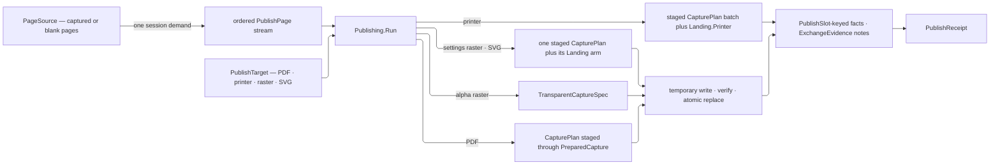

# [RASM_RHINO_PUBLISH]

`Publishing.Run` owns deterministic page resolution, capture, stamping, encoding, spooling, atomic artifact landing, and typed egress evidence. Closed frame, raster-policy, source, target, mark, page, and evidence families preserve modality from admission through settlement; the request supplies one render instant for the complete ordered stream.

## [01]-[INDEX]

- [02]-[RASTER_ROWS]: `RasterCodec` the encoder rows, `TiffCompression` the compression vocabulary, `RasterPolicy` the encoding policy, and the one bitmap-save fold.
- [03]-[STAMP_ALGEBRA]: `StampToken`/`StampScope`/`StampText` — the interpolation rows over the kernel title block and the one template scan; `PdfMark` — the closed stamp family over the `FilePdf` draw surface, drawn at kernel plot magnitudes.
- [04]-[SOURCE_AND_TARGET]: `CaptureFrame`, `PageSource` → captured-or-blank `PublishPage` resolution, and the typed target family.
- [05]-[PUBLISH_RAIL]: `PdfPolicy`, `PublishRequest`, `Landing` the delivery family, `PublishSlot`/`PublishBody`/`PublishReceipt`, and `Publishing.Run`.

## [02]-[RASTER_ROWS]

- Owner: `TiffCompression` carries the TIFF encoder vocabulary. `RasterCodec` carries image format, alpha capability, and the owning `FileCodec`. `RasterPolicy` is the closed encoder-program family: opaque and transparent PNG/TIFF cases, `JpegCase`, and `BmpCase` carry only parameters their codec consumes and derive codec, transparency, and encoder rows exhaustively.
- Law: `RasterPolicy.Transparent` exists only on alpha-capable cases — a structural fact of the case set, so admission never re-tests alpha. JPEG quality and TIFF compression cannot coexist, and neither can leak into PNG or BMP admission; codec, transparency, and encoder parameters derive from one `Row` correspondence, never three parallel case walks.
- Law: the artifact extension derives from the encoder row's `Extension` column, so an extension/encoder mismatch is unrepresentable and a dispatch re-mapping encoder rows onto codec rows beside the column is the deleted form; `Artifact` is that column's one reader and admits it against `CodecAbility.Raster`, so a row re-pointed at a non-pixel codec refuses at delivery rather than landing a raster under a modelling extension.
- Packages: `Exchange/formats` (`FileCodec`, `CodecAbility`), `Domain/rails` (`Op`, `Fault`, `Fin`), LanguageExt.Core (`Option`, `Seq`, `guard`), Thinktecture.Runtime.Extensions (`[SmartEnum]`, `[Union]`, `[ValueObject]`, `[ValidationError]`, `[BoundaryAdapter]`), System.Drawing.Imaging (`ImageFormat`, `Encoder`, `EncoderValue`, `EncoderParameters`), System.Collections.Frozen.
- Growth: a new raster format is one `RasterCodec` row carrying its image format, alpha capability, and owning `FileCodec`, beside the `RasterPolicy` case whose parameters that encoder consumes; a new TIFF compression is one `TiffCompression` row.

```csharp signature
// --- [RUNTIME_PRELUDE] ----------------------------------------------------------------------
using System.Collections.Frozen;
using System.Drawing.Imaging;
using System.Globalization;
using System.Runtime.CompilerServices;
using System.Text.RegularExpressions;
using NodaTime;
using NodaTime.Text;
using Rasm.Domain;
using Rasm.Drawing;
using Rasm.Interaction;
using Rasm.Numerics;
using Rasm.Parametric;
using Rasm.Rhino.Annotation;
using Rasm.Rhino.Document;
using Rasm.Rhino.Viewport;
using Rhino.Display;
using Rhino.DocObjects;
using Rhino.FileIO;
using UnitsNet;

namespace Rasm.Rhino.Exchange;

// --- [TYPES] --------------------------------------------------------------------------------
[SmartEnum]
public sealed partial class TiffCompression {
    public static readonly TiffCompression Default = new(value: Option<long>.None);
    public static readonly TiffCompression None = new(value: Some((long)EncoderValue.CompressionNone));
    public static readonly TiffCompression Lzw = new(value: Some((long)EncoderValue.CompressionLZW));
    public static readonly TiffCompression Ccitt3 = new(value: Some((long)EncoderValue.CompressionCCITT3));
    public static readonly TiffCompression Ccitt4 = new(value: Some((long)EncoderValue.CompressionCCITT4));
    public static readonly TiffCompression Rle = new(value: Some((long)EncoderValue.CompressionRle));

    public Option<long> Value { get; }
}

[SmartEnum<int>]
public sealed partial class RasterCodec {
    public static readonly RasterCodec Png = new(key: 0, image: ImageFormat.Png, alpha: true, extension: FileCodec.Png);
    public static readonly RasterCodec Jpeg = new(key: 1, image: ImageFormat.Jpeg, alpha: false, extension: FileCodec.Jpeg);
    public static readonly RasterCodec Tiff = new(key: 2, image: ImageFormat.Tiff, alpha: true, extension: FileCodec.Tiff);
    public static readonly RasterCodec Bmp = new(key: 3, image: ImageFormat.Bmp, alpha: false, extension: FileCodec.Bmp);

    public ImageFormat Image { get; }
    public bool Alpha { get; }
    public FileCodec Extension { get; }

    internal Fin<FileCodec> Artifact(Op key) =>
        guard(Extension.Has(CodecAbility.Raster), key.InvalidResult()).ToFin().Map(_ => Extension);
}

[ValueObject<int>]
[ValidationError]
public readonly partial struct JpegQuality {
    [BoundaryAdapter]
    static partial void ValidateFactoryArguments(ref ValidationError? validationError, ref int value) =>
        validationError = value is >= 1 and <= 100
            ? null
            : new ValidationError(string.Join(" | ", new object?[] { nameof(JpegQuality), value, "a JPEG quality in [1, 100]" }));

    internal int Native => Value;
}

// --- [MODELS] -------------------------------------------------------------------------------
[Union(ConversionFromValue = ConversionOperatorsGeneration.None)]
public abstract partial record RasterPolicy {
    private RasterPolicy() { }
    public sealed record PngCase : RasterPolicy;
    public sealed record TransparentPngCase : RasterPolicy;
    public sealed record JpegCase(JpegQuality Quality) : RasterPolicy;
    public sealed record TiffCase(TiffCompression Compression) : RasterPolicy;
    public sealed record TransparentTiffCase(TiffCompression Compression) : RasterPolicy;
    public sealed record BmpCase : RasterPolicy;

    public static RasterPolicy Screen { get; } = new PngCase();

    public RasterCodec Codec => Row.Codec;

    public bool Transparent => Row.Transparent;

    internal Seq<(Encoder Key, long Value)> Parameters() => Row.Rows;

    internal Fin<RasterPolicy> Admit(Op op) => Switch(
        op,
        pngCase: static (_, policy) => Fin.Succ<RasterPolicy>(value: policy),
        transparentPngCase: static (_, policy) => Fin.Succ<RasterPolicy>(value: policy),
        jpegCase: static (key, policy) => guard(policy.Quality != default, key.InvalidInput()).ToFin().Map(_ => (RasterPolicy)policy),
        tiffCase: static (key, policy) => key.Need(policy.Compression).Map(_ => (RasterPolicy)policy),
        transparentTiffCase: static (key, policy) => key.Need(policy.Compression).Map(_ => (RasterPolicy)policy),
        bmpCase: static (_, policy) => Fin.Succ<RasterPolicy>(value: policy));

    private (RasterCodec Codec, bool Transparent, Seq<(Encoder Key, long Value)> Rows) Row => Switch(
        pngCase: static _ => (RasterCodec.Png, false, Seq<(Encoder, long)>()),
        transparentPngCase: static _ => (RasterCodec.Png, true, Seq<(Encoder, long)>()),
        jpegCase: static policy => (RasterCodec.Jpeg, false, Seq((Encoder.Quality, (long)policy.Quality.Native))),
        tiffCase: static policy => (RasterCodec.Tiff, false, Compressed(policy.Compression)),
        transparentTiffCase: static policy => (RasterCodec.Tiff, true, Compressed(policy.Compression)),
        bmpCase: static _ => (RasterCodec.Bmp, false, Seq<(Encoder, long)>()));

    private static Seq<(Encoder Key, long Value)> Compressed(TiffCompression compression) =>
        compression.Value.Map(static value => Seq((Encoder.Compression, value))).IfNone(Seq<(Encoder, long)>());
}

// --- [OPERATIONS] ---------------------------------------------------------------------------
internal static class Rasters {
    internal static Fin<Unit> Save(System.Drawing.Bitmap bitmap, RasterPolicy policy, string path, Op key) =>
        policy.Parameters() switch {
            { IsEmpty: true } => key.Catch(() => {
                bitmap.Save(filename: path, format: policy.Codec.Image);
                return Fin.Succ(value: unit);
            }),
            var rows => key.Catch(() => toSeq(ImageCodecInfo.GetImageEncoders())
                .Find(codec => codec.FormatID == policy.Codec.Image.Guid)
                .ToFin(Fail: key.InvalidResult())
                .Bind(codec => key.Catch(() => {
                    using EncoderParameters parameters = new(count: rows.Count);
                    _ = rows.Map(static (row, index) => (row, index)).Iter(entry =>
                        parameters.Param[entry.index] = new EncoderParameter(encoder: entry.row.Key, value: entry.row.Value));
                    bitmap.Save(filename: path, encoder: codec, encoderParams: parameters);
                    return Fin.Succ(value: unit);
                }))),
        };
}
```

## [03]-[STAMP_ALGEBRA]

- Owner: `StampScope` carries the host page facts, the ISSUED sheet — a `TitleBlock` under its `SheetStandard` — and the caller-admitted render time. `StampToken` projects each interpolation row and `StampText` owns the one template scan. `PdfImageBytes` copies encoded ingress, and `PdfImageBudget` bounds bytes and decoded pixels before any PDF page or draw allocation. `PdfMark` closes text, line, polyline, and admitted-image drawing over `FilePdf`.
- Law: the title-block half of the token vocabulary is ISO 7200's, not this page's. A row naming a `TitleField` answers through `TitleField.Read(block, standard)` whenever the request carries an issued block, so `%scale%` renders `DrawingScale.Render(ScaleNotation.For(standard))`, `%number%` renders `SheetNumber.Text`, and `%sheet%` renders `SheetOfGrammar.For(standard).Render(n, m)` — nine free-string rows that were a strict subset of ISO 7200 now read the standard's own field roster, and the host half (page name, view name, document path) stays this page's because no drawing standard names it (D12, D28, D67).
- Law: a block-less request still stamps. Each row carries its HOST fallback beside its optional field, so a publication with no issued sheet renders the host fact and a publication with one renders the standard's, with no second token vocabulary and no empty span in place of a field.
- Law: interpolation is one scan per render — the generated token pattern walks the template once and each matched span answers off the frozen key index, so a per-token replacement walk repeated for every page and every artifact name is the deleted form. Interpolation stays total over unknown tokens: an unindexed span answers with its own matched text, so an unmatched `%word%` survives verbatim, because stamp templates travel through foreign title blocks whose literal `%` text is legitimate content.
- Law: a mark carries admitted owners only, and its PLOTTED magnitudes are the drawing standard's. Stroke widths are `LineWidth` rows off the ISO 128-24 ladder and text is a `TextHeight` row under a `LetteringForm` off ISO 3098-1, both projected into PDF points through the one `Points` fold that composes `ModelUnit.ScaleTo` — a seventh free-magnitude regime in PDF points and an OS UI `TypeRole` on a plotted sheet are the two deleted forms (D46, D61). Colour is `PerceptualColor`, seat and placement are page-space `Point2d` and `DetailFrame`, rotation is `VectorAngle`, and alignment rides the `TextAlignAcross`/`TextAlignDown` rows. `System.Drawing.Color`, `PointF`, `Rhino.DocObjects.Font`, and the host alignment enums materialize inside the draw arms alone, so `Admit` re-tests only what the owners cannot state.
- Law: the drafting FACE resolves at the host under the standard's form — `LetteringForm` names ISO 3098-1 Type A or B and its slant, and `Typefaces.Resolve` over a `FaceQuery` binds the installed letterform; the kernel owner names no font file and this page names no OS UI role.
- Law: mark coordinates are page points with the page's own DPI — the mark family draws in `FilePdf` page space and never reaches through to model space; a model-space annotation is document content, not a stamp.
- Packages: `Rasm.Drawing` (`TitleBlock`, `TitleField`, `SheetStandard`, `SheetNumber`, `SheetOfGrammar`, `DrawingScale`, `ScaleNotation`, `LineWidth`, `TextHeight`, `LetteringForm`, `DraftingMetrics`), `Domain/context` (`ModelUnit`, `UnitSystem`), `Numerics/atoms` (`PerceptualColor.ToDrawing`, `VectorAngle`), NodaTime (`LocalDatePattern.Iso`), `Annotation/typeface` (`FaceForm`, `FaceQuery`, `Typefaces.Resolve`), Thinktecture.Runtime.Extensions, LanguageExt.Core, System.Text.RegularExpressions (`[GeneratedRegex]`), System.Collections.Frozen.
- Growth: a new draw member on the host PDF surface is one `PdfMark` case with its draw arm; a new stamp variable is one `StampToken` row naming its `TitleField` or its host fallback, reaching both the scan and the index with no second edit.

```csharp signature
// --- [MODELS] -------------------------------------------------------------------------------
// The issued sheet rides as ONE optional pair, so a token reading the standard's field roster and a token reading a
// host fact never disagree about which standard is in force; absence is a publication no drawing set governs.
public sealed record StampScope(
    Option<string> DocumentName,
    Option<string> DocumentPathText,
    string PageName,
    int PageOrdinal,
    int PageCount,
    string ViewName,
    Option<DrawingScale> Scale,
    Option<TitleBlock> Issue,
    Instant Instant) {
    // The issuing standard DERIVES off the block's own declared units, so a scope cannot name one standard while
    // its block reads another.
    internal SheetStandard Standard => Issue.Map(static block => block.Units.Standard).IfNone(SheetStandard.Iso);

    internal Option<string> Read(TitleField field) =>
        Issue.Map(block => field.Read(block: block, standard: Standard));

    internal string Rendered(DrawingScale scale) => scale.Render(notation: ScaleNotation.For(Standard));
}

// Each row names the ISO 7200 field it answers from and the host fact it falls back to, so ONE roster serves an
// issued sheet and a bare capture — `Field` absent means no drawing standard names the variable at all.
[SmartEnum<string>]
[KeyMemberEqualityComparer<ComparerAccessors.StringOrdinal, string>]
public sealed partial class StampToken {
    public static readonly StampToken Date = new("date", field: Some(TitleField.Date),
        host: static scope => LocalDatePattern.Iso.Format(scope.Instant.InUtc().Date));
    public static readonly StampToken Time = new("time", field: None,
        host: static scope => LocalTimePattern.CreateWithInvariantCulture("HH:mm").Format(scope.Instant.InUtc().TimeOfDay));
    public static readonly StampToken DocName = new("document", field: Some(TitleField.Title),
        host: static scope => scope.DocumentName.IfNone(string.Empty));
    public static readonly StampToken DocPath = new("path", field: None,
        host: static scope => scope.DocumentPathText.IfNone(string.Empty));
    public static readonly StampToken Page = new("page", field: None, host: static scope => scope.PageName);
    public static readonly StampToken Number = new("number", field: Some(TitleField.Number), host: static scope => scope.PageName);
    public static readonly StampToken PageNumber = new("pagenumber", field: None,
        host: static scope => scope.PageOrdinal.ToString(provider: CultureInfo.InvariantCulture));
    public static readonly StampToken PageCount = new("pagecount", field: None,
        host: static scope => scope.PageCount.ToString(provider: CultureInfo.InvariantCulture));
    public static readonly StampToken Sheet = new("sheet", field: Some(TitleField.Sheet),
        host: static scope => SheetOfGrammar.For(scope.Standard).Render(scope.PageOrdinal, scope.PageCount));
    public static readonly StampToken View = new("view", field: None, host: static scope => scope.ViewName);
    public static readonly StampToken Scale = new("scale", field: Some(TitleField.Scale),
        host: static scope => scope.Scale.Map(scope.Rendered).IfNone(string.Empty));
    public static readonly StampToken Revision = new("revision", field: Some(TitleField.Revision), host: static _ => string.Empty);
    public static readonly StampToken Discipline = new("discipline", field: Some(TitleField.Discipline), host: static _ => string.Empty);
    public static readonly StampToken Owner = new("owner", field: Some(TitleField.Owner), host: static _ => string.Empty);
    public static readonly StampToken Project = new("project", field: Some(TitleField.Project), host: static _ => string.Empty);
    public static readonly StampToken Client = new("client", field: Some(TitleField.Client), host: static _ => string.Empty);
    public static readonly StampToken Drawn = new("drawn", field: Some(TitleField.Drawn), host: static _ => string.Empty);
    public static readonly StampToken Checked = new("checked", field: Some(TitleField.Checked), host: static _ => string.Empty);
    public static readonly StampToken Approved = new("approved", field: Some(TitleField.Approved), host: static _ => string.Empty);
    public static readonly StampToken Units = new("units", field: Some(TitleField.Units), host: static _ => string.Empty);

    internal Option<TitleField> Field { get; }

    [UseDelegateFromConstructor]
    private partial string Host(StampScope scope);

    // The issued block wins wherever the standard names the variable; the host fact answers a publication no
    // drawing set governs, so neither path leaves an empty span the other could have filled.
    internal string Expand(StampScope scope) =>
        Field.Bind(scope.Read).Filter(static text => text.Length > 0).IfNone(() => Host(scope: scope));
}

public static partial class StampText {
    private static readonly Lazy<FrozenDictionary<string, StampToken>> ByKey = new(static () =>
        toSeq(StampToken.Items).ToFrozenDictionary(
            keySelector: static row => row.Key,
            comparer: StringComparer.OrdinalIgnoreCase));

    public static string Render(string template, StampScope scope) =>
        Tokens().Replace(
            input: template,
            evaluator: match => ByKey.Value.TryGetValue(key: match.Groups[1].Value, out StampToken? row)
                ? row.Expand(scope: scope)
                : match.Value);

    // One compiled alternation over `%name%` spans: token keys are lower-case letters, the index is
    // case-insensitive, and an unindexed span returns its own matched text so foreign `%` prose survives.
    [GeneratedRegex(pattern: "%([A-Za-z]+)%", options: RegexOptions.CultureInvariant)]
    private static partial Regex Tokens();
}

[ComplexValueObject]
[ValidationError]
public sealed partial class PdfImageBytes {
    public ReadOnlyMemory<byte> Value { get; }

    [BoundaryAdapter]
    static partial void ValidateFactoryArguments(
        ref ValidationError? validationError,
        ref ReadOnlyMemory<byte> value) {
        byte[] owned = value.ToArray();
        if (owned.Length == 0) {
            validationError = new ValidationError(string.Join(" | ", new object?[] { nameof(PdfImageBytes), "at least one encoded image byte" }));
        }
        value = owned;
    }
}

[ComplexValueObject]
[ValidationError]
public sealed partial class PdfImageBudget {
    public Rasm.Numerics.Dimension EncodedBytes { get; }
    public Rasm.Numerics.Dimension Pixels { get; }

    // Both bounds gate an in-process decode of caller-supplied bytes before any PDF page allocates: 16 MiB is the
    // encoded ceiling above which a stamp image is a document asset rather than a mark, and 100 megapixels is the
    // decoded ceiling at which a single 32-bit surface still fits one contiguous managed allocation.
    public static Rasm.Numerics.Dimension EncodedCeiling { get; } = Rasm.Numerics.Dimension.Create(value: 16 * 1024 * 1024);

    public static Rasm.Numerics.Dimension PixelCeiling { get; } = Rasm.Numerics.Dimension.Create(value: 100_000_000);

    public static PdfImageBudget Standard { get; } = Create(encodedBytes: EncodedCeiling, pixels: PixelCeiling);

    // Each bound refuses on its OWN scalar, so a caller learns which ceiling it broke rather than reading one
    // collapsed message across two columns.
    [BoundaryAdapter]
    static partial void ValidateFactoryArguments(
        ref ValidationError? validationError,
        ref Rasm.Numerics.Dimension encodedBytes,
        ref Rasm.Numerics.Dimension pixels) =>
        validationError = Banded(label: nameof(EncodedBytes), value: encodedBytes, ceiling: EncodedCeiling)
            ?? Banded(label: nameof(Pixels), value: pixels, ceiling: PixelCeiling);

    private static ValidationError? Banded(string label, Rasm.Numerics.Dimension value, Rasm.Numerics.Dimension ceiling) =>
        value.Value > 0 && value.Value <= ceiling.Value
            ? null
            : new ValidationError(string.Join(" | ", new object?[] {
                label, value.Value, $"a positive budget at or under {ceiling.Value}" }));
}

// --- [TYPES] --------------------------------------------------------------------------------
[Union(ConversionFromValue = ConversionOperatorsGeneration.None)]
public abstract partial record PdfMark {
    private PdfMark() { }
    public sealed record TextCase(
        string Template, Point2d Seat, TextHeight Height, LetteringForm Form, ResourceName Family,
        PerceptualColor Fill, Option<(PerceptualColor Color, LineWidth Width)> Stroke, VectorAngle Angle,
        TextAlignAcross Across, TextAlignDown Down) : PdfMark;
    public sealed record LineCase(Point2d From, Point2d To, PerceptualColor Stroke, LineWidth Width) : PdfMark;
    public sealed record PolylineCase(Seq<Point2d> Points, Option<PerceptualColor> Fill, PerceptualColor Stroke, LineWidth Width) : PdfMark;
    public sealed record ImageCase(PdfImageBytes Image, DetailFrame Placement, VectorAngle Angle) : PdfMark;

    internal Fin<PdfMark> Admit(PdfImageBudget images, Op op) => Switch(
        (Images: images, Op: op),
        textCase: static (ctx, mark) =>
            from _template in ctx.Op.AcceptText(value: mark.Template)
            from _shape in guard(
                mark.Seat.IsValid
                && mark.Height is not null
                && mark.Form is not null
                && mark.Family is not null
                && mark.Fill is not null
                && mark.Across is not null
                && mark.Down is not null
                && mark.Stroke.ForAll(static stroke => stroke.Color is not null && stroke.Width is not null),
                ctx.Op.InvalidInput()).ToFin()
            select (PdfMark)mark,
        lineCase: static (ctx, mark) => guard(
            mark.From.IsValid && mark.To.IsValid && mark.Stroke is not null,
            ctx.Op.InvalidInput()).ToFin().Map(_ => (PdfMark)mark),
        polylineCase: static (ctx, mark) => guard(
            mark.Points.Count >= 2
            && mark.Points.ForAll(static point => point.IsValid)
            && mark.Stroke is not null
            && mark.Fill.ForAll(static fill => fill is not null),
            ctx.Op.InvalidInput()).ToFin().Map(_ => (PdfMark)mark),
        imageCase: static (ctx, mark) =>
            from _shape in guard(
                mark.Image is not null && mark.Placement.IsValid,
                ctx.Op.InvalidInput()).ToFin()
            from _bytes in guard(
                mark.Image.Value.Length <= ctx.Images.EncodedBytes.Value,
                ctx.Op.InvalidInput()).ToFin()
            from _decoded in ctx.Op.Catch(() => {
                using System.IO.MemoryStream stream = new(buffer: mark.Image.Value.ToArray(), writable: false);
                using System.Drawing.Bitmap decoded = new(stream: stream);
                long pixels = (long)decoded.Width * decoded.Height;
                return guard(
                    decoded.Width > 0 && decoded.Height > 0 && pixels <= ctx.Images.Pixels.Value,
                    ctx.Op.InvalidInput()).ToFin();
            })
            select (PdfMark)mark);

    internal Fin<Unit> Draw(FilePdf pdf, int page, StampScope scope, Op op) => Switch(
        (Pdf: pdf, Page: page, Scope: scope, Op: op),
        textCase: static (ctx, mark) =>
            from face in Face(family: mark.Family, form: mark.Form, op: ctx.Op)
            from height in Points(length: mark.Height.Height, op: ctx.Op)
            from stroke in mark.Stroke
                .Map(row => Points(length: row.Width.Width, op: ctx.Op).Map(width => (Ink: row.Color, Width: width)))
                .Sequence()
                .As()
            from fill in mark.Fill.ToDrawing(key: ctx.Op)
            from ink in stroke.Map(row => row.Ink.ToDrawing(key: ctx.Op)).Sequence().As()
            from _drawn in ctx.Op.Catch(() => {
                ctx.Pdf.DrawText(
                    pageNumber: ctx.Page,
                    text: StampText.Render(template: mark.Template, scope: ctx.Scope),
                    x: mark.Seat.X, y: mark.Seat.Y, heightPoints: height, onfont: face,
                    fillColor: fill,
                    strokeColor: ink.IfNone(System.Drawing.Color.Empty),
                    strokeWidth: stroke.Map(static row => row.Width).IfNone(noneValue: 0f),
                    angleDegrees: (float)double.RadiansToDegrees(mark.Angle.Value),
                    horizontalAlignment: (TextHorizontalAlignment)mark.Across.Key,
                    verticalAlignment: (TextVerticalAlignment)mark.Down.Key);
                return Fin.Succ(value: unit);
            })
            select unit,
        lineCase: static (ctx, mark) =>
            from stroke in mark.Stroke.ToDrawing(key: ctx.Op)
            from width in Points(length: mark.Width.Width, op: ctx.Op)
            from _drawn in ctx.Op.Catch(() => {
                ctx.Pdf.DrawLine(
                    pageNumber: ctx.Page, from: Dot(point: mark.From), to: Dot(point: mark.To),
                    strokeColor: stroke, strokeWidth: width);
                return Fin.Succ(value: unit);
            })
            select unit,
        polylineCase: static (ctx, mark) =>
            from stroke in mark.Stroke.ToDrawing(key: ctx.Op)
            from fill in mark.Fill.Map(row => row.ToDrawing(key: ctx.Op)).Sequence().As()
            from width in Points(length: mark.Width.Width, op: ctx.Op)
            from _drawn in ctx.Op.Catch(() => {
                ctx.Pdf.DrawPolyline(
                    pageNumber: ctx.Page, polyline: mark.Points.Map(Dot).ToArray(),
                    fillColor: fill.IfNone(System.Drawing.Color.Empty),
                    strokeColor: stroke, strokeWidth: width);
                return Fin.Succ(value: unit);
            })
            select unit,
        imageCase: static (ctx, mark) => ctx.Op.Catch(() => {
            using System.IO.MemoryStream stream = new(buffer: mark.Image.Value.ToArray(), writable: false);
            using System.Drawing.Bitmap decoded = new(stream: stream);
            using System.Drawing.Bitmap detached = new(image: decoded);
            ctx.Pdf.DrawBitmap(
                pageNumber: ctx.Page, bitmap: detached,
                left: (float)mark.Placement.X, top: (float)mark.Placement.Y,
                width: (float)mark.Placement.Width, height: (float)mark.Placement.Height,
                rotationInDegrees: (float)RhinoMath.ToDegrees(radians: mark.Angle.Value));
            return Fin.Succ(value: unit);
        }));

    internal static Fin<Unit> DrawAll(
        Seq<PdfMark> marks, FilePdf pdf, int page, StampScope scope, Op op) =>
        from _drawn in marks.TraverseM(mark => mark.Draw(pdf: pdf, page: page, scope: scope, op: op)).As()
        select unit;

    // The standard's LETTERING FORM fixes the SLANT (ISO 3098-1 §4: upright or 15° italic) and the family names the
    // installed letterform that realizes it, so the two axes never disagree and the Annotation rail's own admission
    // resolves the face; a family the host cannot resolve refuses here rather than handing `DrawText` a null, and
    // no OS UI role reaches a plotted sheet.
    private static Fin<Font> Face(ResourceName family, LetteringForm form, Op op) =>
        from query in FaceQuery.Of(
            form: new FaceForm.Axes(
                Family: family.Value,
                Weight: FaceWeight.Normal,
                Slant: form.Slant.Value > 0.0 ? FaceSlant.Italic : FaceSlant.Upright,
                Stretch: FaceStretch.Medium,
                Decorations: CapabilitySet<FaceDecoration>.None),
            key: op)
        from face in query.Mint(key: op)
        select face;

    // The ONE paper-to-points projection: printer points are an admitted `ModelUnit` regime the kernel scales onto
    // the millimetre base, so no site carries a 72/25.4 constant beside a plotted magnitude.
    private static Fin<float> Points(Length length, Op op) =>
        from millimetres in ModelUnit.Of(value: UnitSystem.Millimeters, key: op)
        from points in ModelUnit.Of(value: UnitSystem.PrinterPoints, key: op)
        from scale in millimetres.ScaleTo(target: points, key: op)
        select (float)(length.Millimeters * scale);

    private static System.Drawing.PointF Dot(Point2d point) => new(x: (float)point.X, y: (float)point.Y);
}
```

## [04]-[SOURCE_AND_TARGET]

- Owner: `CaptureFrame` closes settings-driven and transparent capture intent. `SettingsCase` carries plan axes and an optional viewport extent; `TransparentCase` carries the required extent and the facade feature set. `PageSource` resolves sheets, details, named views, one viewport, or blank SHEETS into a closed `PublishPage` stream; `Admit` is total over every case payload, so a malformed public case refuses typed before any resolution dereference.
- Law: the frame is CAPTURE intent and the kernel `Interaction/chrome` `PageFrame` is PRINT geometry — a page size, a printer's own settings, a bounded rectangle, or an issued sheet. Two owners under one name across two strata is the collision this rename closes, and no fence composes the other's cases.
- Law: page order is evidence order — the resolved stream fixes ordinal and count before any egress, so `%pagenumber%`/`%pagecount%` tokens, PDF page indices, and per-page artifact names all read one numbering.
- Law: SCALE evidence is per-source and typed — a detail page carries the detail's live `DrawingScale` so `%scale%` renders through the issued standard's own `ScaleNotation`, while whole-page, named-view, viewport, and blank sources carry none and the token falls to its host answer; a host-formatted `1:n` string is the lowering the render performs, never the evidence it carries.
- Law: a blank page is a SHEET. The source names a `SheetSize` under its standard and the frame's admitted DPI resolves the host's dot extent, so `SheetSize.In(unit, key)` is the one projection and a caller-supplied pixel pair that no sheet series admits is unrepresentable (D3, D4).
- Law: a multi-page raster or vector target lands one atomic artifact per page — the page's file name derives from the target stem through the token fold (`stem-%pagenumber%`, or `stem-%number%` where an issued block names a `SheetNumber`), and `OutputPolicy` settles each destination before a same-directory temporary artifact replaces it (D28).
- Law: frame modality is structural. `Plan` accepts only `SettingsCase`, and `TransparentSpec` accepts only `TransparentCase`; no boolean or absent field reconstructs capture intent.
- Law: resolution is the admitted `CaptureDpi` the capture rail owns, carried on both frame cases and read once — every downstream site consumes the admitted value instead of re-running `CaptureDpi.Of` over a raw double, and `CaptureFrame.Plot` seats the kernel `PlotResolution.Plot` row through the capture rail's own output-class arity, so the one DPI a frameless request inherits is a rostered output class rather than a literal (D80, D81).
- Law: `Dots` is the ONE integral-DPI admission — `CaptureDpi` admits any finite positive double while the blank-page host member takes an `int`, so integrality and range refuse typed at the frame instead of overflowing a conversion at the page mint; the blank-page arm and the request's blank-page contract are its two readers, and a second inline truncation beside either is the deleted form.
- Packages: `Rasm.Drawing` (`SheetSize`, `SheetStandard`, `SheetOrientation`, `PlotResolution`, `DrawingScale`), `Domain/context` (`ModelUnit`, `UnitSystem`), `Viewport/capture` (`CaptureDpi`, `Size2i`, `CaptureSubject`, `CapturePlan`, `CaptureFeature`, `TransparentCaptureSpec`), NodaTime (`Instant`), LanguageExt.Core, Thinktecture.Runtime.Extensions.
- Boundary: named-view publication captures the named view's addressed viewport as it stands; a restore-then-capture sequence is the camera rail composed BEFORE publication, never a hidden restore inside the page resolver.

```csharp signature
// --- [MODELS] -------------------------------------------------------------------------------
[Union(ConversionFromValue = ConversionOperatorsGeneration.None)]
public abstract partial record CaptureFrame {
    private CaptureFrame() { }
    internal sealed record SettingsCase(
        CaptureDpi DotsPerInch,
        Option<Size2i> ViewportExtent,
        Option<CaptureArea> Area,
        Option<CaptureScale> Scale,
        Option<MediaLayout> Layout,
        Option<CaptureDecor> Decor) : CaptureFrame;
    internal sealed record TransparentCase(
        CaptureDpi DotsPerInch,
        Size2i Extent,
        Option<CapabilitySet<CaptureFeature>> Facade,
        Option<Rasm.Numerics.Dimension> RealtimePasses) : CaptureFrame;

    // The one default every frameless request inherits is the kernel's PLOT output class, admitted through the
    // capture rail's own output-class arity — a rostered row, never a literal a second consumer could disagree with.
    public static CaptureFrame Plot { get; } = new SettingsCase(
        DotsPerInch: CaptureDpi.Of(resolution: PlotResolution.Plot).ThrowIfFail(),
        ViewportExtent: None, Area: None, Scale: None, Layout: None, Decor: None);

    public CaptureDpi Dpi => Switch(
        settingsCase: static frame => frame.DotsPerInch,
        transparentCase: static frame => frame.DotsPerInch);

    internal Fin<int> Dots(Op? key = null) {
        Op op = key.OrDefault();
        return (double)Dpi switch {
            var value when value <= int.MaxValue && value == Math.Truncate(d: value) => Fin.Succ(value: (int)value),
            _ => Fin.Fail<int>(error: op.InvalidInput()),
        };
    }

    public Option<Size2i> Pixels => Switch(
        settingsCase: static frame => frame.ViewportExtent,
        transparentCase: static frame => Some(frame.Extent));

    public bool IsTransparent => this is TransparentCase;

    public static Fin<CaptureFrame> Settings(
        double dpi,
        Option<Size2i> pixels = default,
        Option<CaptureArea> area = default,
        Option<CaptureScale> scale = default,
        Option<MediaLayout> layout = default,
        Option<CaptureDecor> decor = default,
        Op? key = null) {
        Op op = key.OrDefault();
        return from admitted in CaptureDpi.Of(value: dpi, key: op)
               from _pixels in pixels.Map(value => guard(value.IsValid, op.InvalidInput()).ToFin())
                   .IfNone(Fin.Succ(value: unit))
               select (CaptureFrame)new SettingsCase(
                   DotsPerInch: admitted,
                   ViewportExtent: pixels,
                   Area: area,
                   Scale: scale,
                   Layout: layout,
                   Decor: decor);
    }

    public static Fin<CaptureFrame> Transparent(
        double dpi,
        Size2i pixels,
        Option<CapabilitySet<CaptureFeature>> facade = default,
        Option<Rasm.Numerics.Dimension> realtimePasses = default,
        Op? key = null) {
        Op op = key.OrDefault();
        return from admitted in CaptureDpi.Of(value: dpi, key: op)
               from _pixels in guard(pixels.IsValid, op.InvalidInput()).ToFin()
               select (CaptureFrame)new TransparentCase(
                   DotsPerInch: admitted, Extent: pixels, Facade: facade, RealtimePasses: realtimePasses);
    }

    internal Fin<CapturePlan> Plan(CaptureSubject subject, Op key) => Switch(
        (Subject: subject, Op: key),
        settingsCase: static (ctx, frame) => CapturePlan.Of(
            subject: ctx.Subject,
            area: frame.Area,
            scale: frame.Scale,
            layout: frame.Layout,
            decor: frame.Decor,
            key: ctx.Op),
        transparentCase: static (ctx, _) => Fin.Fail<CapturePlan>(error: ctx.Op.InvalidInput()));

    internal Fin<TransparentCaptureSpec> TransparentSpec(ViewportTarget target, Op key) => Switch(
        (Target: target, Op: key),
        settingsCase: static (ctx, _) => Fin.Fail<TransparentCaptureSpec>(error: ctx.Op.InvalidInput()),
        transparentCase: static (ctx, frame) => TransparentCaptureSpec.Of(
            target: ctx.Target,
            extent: frame.Extent,
            features: frame.Facade,
            realtimePasses: frame.RealtimePasses,
            key: ctx.Op));
}

[Union(ConversionFromValue = ConversionOperatorsGeneration.None)]
internal abstract partial record PublishPage {
    private PublishPage() { }

    internal sealed record CapturedCase(ViewportTarget Target, CaptureSubject Subject, StampScope Stamp) : PublishPage;
    internal sealed record BlankCase(Size2i Extent, StampScope Stamp) : PublishPage;

    internal StampScope Evidence => Switch(
        capturedCase: static page => page.Stamp,
        blankCase: static page => page.Stamp);
}

// --- [TYPES] --------------------------------------------------------------------------------
[Union(ConversionFromValue = ConversionOperatorsGeneration.None)]
public abstract partial record PageSource {
    private PageSource() { }
    public sealed record SheetsCase(SheetSelect Sheets) : PageSource;
    public sealed record DetailsCase(SheetSelect Sheets, DetailSelect Details) : PageSource;
    public sealed record NamedCase(Seq<string> Names) : PageSource;
    public sealed record ViewportCase(ViewportTarget Target) : PageSource;
    // A blank page is an ISSUED SHEET, not a caller pixel pair: the size names its series seat or its custom extent
    // under a standard, and the frame's admitted DPI resolves the host dot extent at mint (D3, D4).
    public sealed record BlankCase(SheetSize Size, SheetOrientation Orientation, Rasm.Numerics.Dimension Count) : PageSource;

    internal Fin<PageSource> Admit(Op op) => Switch(
        op,
        sheetsCase: static (key, source) => Optional(source.Sheets)
            .ToFin(Fail: key.InvalidInput())
            .Map(_ => (PageSource)source),
        detailsCase: static (key, source) =>
            from _sheets in key.Need(source.Sheets)
            from _details in key.Need(source.Details)
            select (PageSource)source,
        namedCase: static (key, source) =>
            from names in source.Names
                .Traverse(name => key.AcceptText(value: name).ToValidation())
                .As()
                .ToFin()
            from _count in guard(!names.IsEmpty, key.InvalidInput()).ToFin()
            select (PageSource)new NamedCase(Names: names),
        viewportCase: static (key, source) => Optional(source.Target)
            .ToFin(Fail: key.InvalidInput())
            .Map(_ => (PageSource)source),
        blankCase: static (key, source) => guard(
            source.Size is { IsValid: true } && source.Orientation is not null && source.Count.Value > 0,
            key.InvalidInput()).ToFin().Map(_ => (PageSource)source));

    internal Fin<Seq<PublishPage>> Resolve(RhinoDoc document, CaptureFrame frame, Option<TitleBlock> issue, Instant instant, Op op) => Switch(
        (Document: document, Frame: frame, Issue: issue, Instant: instant, Op: op),
        sheetsCase: static (ctx, source) =>
            from pages in source.Sheets.Resolve(document: ctx.Document, op: ctx.Op)
            let dpi = ctx.Frame.Dpi
            from captured in pages.Map(static (page, index) => (Page: page, Index: index)).TraverseM(row =>
                from target in ViewportTarget.Page(pageViewId: row.Page.MainViewport.Id, key: ctx.Op)
                from subject in CaptureSubject.Page(target: target, dpi: dpi, key: ctx.Op)
                select Page(
                    target: target, subject: subject, document: ctx.Document, issue: ctx.Issue,
                    pageName: row.Page.PageName, viewName: row.Page.MainViewport.Name,
                    scale: None,
                    ordinal: row.Index + 1, count: pages.Count, instant: ctx.Instant)).As()
            select captured,
        detailsCase: static (ctx, source) =>
            from pixels in ctx.Frame.Pixels.ToFin(Fail: ctx.Op.InvalidInput())
            let dpi = ctx.Frame.Dpi
            from pages in source.Sheets.Resolve(document: ctx.Document, op: ctx.Op)
            from rows in pages
                .TraverseM(page => source.Details.Resolve(page: page, op: ctx.Op).Map(details =>
                    details.Map(detail => (Page: page, Detail: detail))))
                .As()
            let flat = rows.Bind(identity)
            from captured in flat.Map(static (row, index) => (Row: row, Index: index)).TraverseM(entry =>
                from target in ViewportTarget.Detail(
                    pageViewId: entry.Row.Page.MainViewport.Id,
                    detailId: entry.Row.Detail.Id,
                    key: ctx.Op)
                from subject in CaptureSubject.View(target: target, pixels: pixels, dpi: dpi, key: ctx.Op)
                select Page(
                    target: target, subject: subject, document: ctx.Document, issue: ctx.Issue,
                    pageName: entry.Row.Page.PageName, viewName: entry.Row.Detail.Viewport.Name,
                    scale: SheetScale.Live(detail: entry.Row.Detail),
                    ordinal: entry.Index + 1, count: flat.Count, instant: ctx.Instant)).As()
            select captured,
        namedCase: static (ctx, source) =>
            from pixels in ctx.Frame.Pixels.ToFin(Fail: ctx.Op.InvalidInput())
            let dpi = ctx.Frame.Dpi
            from captured in source.Names.Map(static (name, index) => (Name: name, Index: index)).TraverseM(row =>
                from target in ViewportTarget.Named(name: row.Name, key: ctx.Op)
                from subject in CaptureSubject.View(target: target, pixels: pixels, dpi: dpi, key: ctx.Op)
                select Page(
                    target: target, subject: subject, document: ctx.Document, issue: ctx.Issue,
                    pageName: row.Name, viewName: row.Name,
                    scale: None,
                    ordinal: row.Index + 1, count: source.Names.Count, instant: ctx.Instant)).As()
            select captured,
        viewportCase: static (ctx, source) =>
            from pixels in ctx.Frame.Pixels.ToFin(Fail: ctx.Op.InvalidInput())
            let dpi = ctx.Frame.Dpi
            from subject in CaptureSubject.View(target: source.Target, pixels: pixels, dpi: dpi, key: ctx.Op)
            select Seq(Page(
                target: source.Target, subject: subject, document: ctx.Document, issue: ctx.Issue,
                pageName: string.Empty, viewName: string.Empty, scale: None,
                ordinal: 1, count: 1, instant: ctx.Instant)),
        // The sheet's own extent resolves ONCE, in printer points at the frame's admitted resolution, so the host
        // dot pair is a projection of the issued size rather than a caller figure nothing admitted.
        blankCase: static (ctx, source) =>
            from dots in ctx.Frame.Dots(key: ctx.Op)
            from inches in ModelUnit.Of(value: UnitSystem.Inches, key: ctx.Op)
            from extent in source.Size.In(unit: inches, key: ctx.Op)
            let oriented = source.Orientation == SheetOrientation.Landscape
                ? (Width: extent.Height, Height: extent.Width)
                : (extent.Width, extent.Height)
            from pixels in Size2i.Of(
                width: (int)Math.Round(oriented.Width * dots),
                height: (int)Math.Round(oriented.Height * dots),
                key: ctx.Op)
            select toSeq(Range(1, source.Count.Value)).Map(ordinal => (PublishPage)new PublishPage.BlankCase(
                Extent: pixels,
                Stamp: ScopeOf(
                    document: ctx.Document, issue: ctx.Issue, pageName: source.Size.Key, viewName: string.Empty,
                    scale: None, ordinal: ordinal, count: source.Count.Value, instant: ctx.Instant))));

    private static PublishPage Page(
        ViewportTarget target,
        CaptureSubject subject,
        RhinoDoc document,
        Option<TitleBlock> issue,
        string pageName,
        string viewName,
        Option<DrawingScale> scale,
        int ordinal,
        int count,
        Instant instant) =>
        new PublishPage.CapturedCase(
            Target: target,
            Subject: subject,
            Stamp: ScopeOf(
                document: document,
                issue: issue,
                pageName: pageName,
                viewName: viewName,
                scale: scale,
                ordinal: ordinal,
                count: count,
                instant: instant));

    private static StampScope ScopeOf(
        RhinoDoc document,
        Option<TitleBlock> issue,
        string pageName,
        string viewName,
        Option<DrawingScale> scale,
        int ordinal,
        int count,
        Instant instant) =>
        // A host name or path is ABSENT on an unsaved document, and absence is an Option — never the empty string a
        // stamp would render as a blank field indistinguishable from a legitimately empty one.
        new(DocumentName: Optional(document.Name).Filter(static text => text.Length > 0),
            DocumentPathText: Optional(document.Path).Filter(static text => text.Length > 0),
            PageName: pageName, PageOrdinal: ordinal, PageCount: count, ViewName: viewName,
            Scale: scale, Issue: issue, Instant: instant);
}

[Union(ConversionFromValue = ConversionOperatorsGeneration.None)]
public abstract partial record PublishTarget {
    private PublishTarget() { }
    public sealed record PdfCase(DocumentPath Target, PdfPolicy Policy, OutputPolicy Output) : PublishTarget;
    public sealed record PrinterCase(string PrinterName, Rasm.Numerics.Dimension Copies) : PublishTarget;
    public sealed record RasterCase(DocumentPath Target, RasterPolicy Policy, OutputPolicy Output) : PublishTarget;
    public sealed record SvgCase(DocumentPath Target, OutputPolicy Output) : PublishTarget;

    internal Fin<PublishTarget> Admit(Op op) => Switch(
        op,
        pdfCase: static (key, target) =>
            from _shape in guard(target.Target != default && target.Output is not null, key.InvalidInput()).ToFin()
            from _policy in key.Need(target.Policy).Bind(policy => policy.Admit(op: key))
            select (PublishTarget)target,
        // `Dimension` bands its factory at a closed floor of one, but the value object admits `default(Rasm.Numerics.Dimension)`
        // past that floor, so the copy count is re-gated here rather than trusted from the struct's shape alone.
        printerCase: static (key, target) => guard(
            !string.IsNullOrWhiteSpace(value: target.PrinterName) && target.Copies.Value >= 1,
            key.InvalidInput()).ToFin().Map(_ => (PublishTarget)target),
        rasterCase: static (key, target) =>
            from _shape in guard(target.Target != default && target.Output is not null, key.InvalidInput()).ToFin()
            from _policy in key.Need(target.Policy).Bind(policy => policy.Admit(op: key))
            select (PublishTarget)target,
        svgCase: static (key, target) => guard(
            target.Target != default && target.Output is not null,
            key.InvalidInput()).ToFin().Map(_ => (PublishTarget)target));
}
```

## [05]-[PUBLISH_RAIL]

- Owner: `Landing` is the S4 delivery family every leg of this rail dispatches on — raster, vector, printer, and the `Save` seam Display's framebuffer egress writes through. `PdfPolicy` carries the issued plot policy, one parameterized image budget, page marks, final marks, and custom printed-page definitions. `PublishRequest` admits source, target, frame modality, the optionally issued title block, and one render instant. `PublishSlot`/`PublishBody` join the Document fact stream, and `PublishReceipt` names that closed instantiation.
- Law: this page CONFORMS to the Document fact stream and re-mints nothing — the slot-keyed accumulation, the cross-product gate, and the projections are `Document/facts`'s; this page contributes a slot vocabulary, a body union, and one extension block. NAMED LOSS: the former `PageEvidence` union's two-case exhaustive fold and the `PublishTargetKind` roster — bought back as the SLOT, which is the delivery leg a fact landed under, so a printed page and a landed artifact are two slots over one body family rather than two shapes a consumer must switch on; witness — every `PublishReceipt` reader projects on its slot and gains `FactCount` for free.
- Law: PDF conformance, plot resolution, layer emission, orientation, and the issued scale are the kernel `PlotPolicy`'s columns, not this page's. `PdfPolicy.Plot` carries one optional `PlotPolicy` and `Emission` DERIVES from it, so `LayersAsOptionalContentGroups` reads `LayerEmission.OptionalContent` off the issued policy rather than a boolean nothing keys to a standard (D79, D84, D94).
- Entry: `Publishing.Run(DocumentSession, MonotonicTimeline, PublishRequest, Op?) : Fin<PublishReceipt>` — page resolution proves `SessionNeed.Read` and `SessionNeed.Export` once, and each page capture proves `SessionNeed.Redraw` through the capture rail's own demand; the load-root timeline reaches transparent capture unchanged.
- Law: the PDF arm owns `FilePdf.Create`, host-minted page indices, page marks, custom pages, final marks, and `Write`. `FilePdf` is a plain abstract host class the plug-in lookup vends and never an `IDisposable`, so the arm holds it as an ordinary value across the page fold — its one custody obligation is the null return the lookup can give, which `Optional(...).ToFin(...)` refuses; bracketing it leases a type with nothing to release. `LayersAsOptionalContentGroups` is document-level state on the `FilePdf` instance — the policy value is hoisted once after `Create`, before any page mints, because a per-page set inside the page fold leaves only the last write effective and silently strips earlier pages' layer groups. A captured page derives one `CapturePlan`, enters `Captures.Stage`, and consumes the sole prepared settings row through `PreparedCapture.Use` inside that bracket, whose gate refuses once the bracket releases; blank pages use only the dots overload.
- Law: `PublishTarget` stays the ADMITTED request vocabulary and `Landing` the DELIVERY family it projects onto — the rail constructs the matching `Landing` arm at its own dispatch, so a target case names what a caller asked for and a landing case names what the egress does; `PdfCase` is the one target keeping its own `FilePdf` arm, because a PDF is minted page by page rather than delivered from a prepared settings row.
- Law: printer publication derives the complete `Seq<CapturePlan>`, enters ONE `Captures.Stage` window, and dispatches the whole prepared batch through `ViewCapture.SendToPrinter` under `Landing.Printer`. `SendToPrinter` answers a bare `bool`, never a page tally, so the dispatched-page count the law demands is proved INSIDE the window by the prepared-row arity equalling the plan count — a driver-reported count is unreadable here, and a receipt claiming one fabricates it. Raster and SVG pair each plan with its own `Landing` arm through the same staged window, one prepared row per page; alpha raster uses only `TransparentCaptureSpec`, whose facade-side transparency no settings row can express.
- Law: every file delivery stages through `OutputPolicy.Land` — the operations rail's one atomic staging kernel — so temporary write, nonempty verification, byte-identical commit, and content keying are the folder's single spelling. A failed encoder, PDF write, SVG write, empty artifact, or move leaves no new partial destination and emits no landed evidence. The ONE exception is `Landing.Save`: its writer is a host member dispatching format on the destination extension, so it takes its settled `Resolve` path directly per the operations rail's own carve-out and content-keys the landed bytes through the rail's `Keyed` spelling.
- Law: publication proves `Read` and `Export` and mutates no document, so landed evidence carries the native landing row and the `Landed` slot alone — an `ExchangeEvidence.MutationCase` on a filesystem landing claims a document change with no undo serial behind it and is the deleted form; the document-mutation rows stay on the exchange rail, where a real `DocumentCommit.Sealed` bracket supplies the serial. This receipt therefore declares no undo slot, and the stream's undo stamp is unreachable here by construction.
- Law: request admission accumulates — the six source, target, frame, and issue contracts fold applicatively through `Validation`, each rule minting its own `Op`-keyed refusal from its own name, so a caller learns every contract it broke instead of one collapsed input fault.
- Law: the three `CaptureArtifact` consumers each state the SUBSET they admit rather than closing the union. `Landed` mints a raster or a vector arm and refuses the printer and save arms by name; the raster and vector deliveries admit their own case alone; the depth and sequence arms belong to modalities this rail never requests, and a catch-all over the Viewport-owned family turns a new capture modality from a compile break into a silent refusal at run time.
- Boundary: `PdfGate` serializes THIS rail's replace-write-restore window over the process-global custom-page roster, so two concurrent `Publishing.Run` calls never interleave rosters. A `System.Threading.Lock` is the owner here and an atom is not: the window is MUTUAL EXCLUSION across two host calls, while `Cell.Step` is a compare-and-swap that lets a second writer install its roster between this one's replace and restore. The roster belongs to the host process, not the gate: a host-internal PDF export running outside this rail reads whichever roster the window has installed, and that exposure is unclosable from here because `FilePdf.SetCustomPages` carries no scope. Custom pages therefore ride only the blank-source contract, where the window is one write long. `Restored` attempts roster restoration after every body outcome and combines a write fault with a restoration fault instead of replacing either failure.
- Packages: `Rasm.Drawing` (`PlotPolicy`, `PlotResolution`, `LayerEmission`, `TitleBlock`, `SheetSize`), `Rasm.Parametric` (`MonotonicTimeline`), `Document/facts` (`IFactSlot`, `IFactBody`, `FactStream`, `Fact`), `Document/session` (`DocumentSession`, `SessionNeed`), `Viewport/capture` (`Captures.Stage`, `PreparedCapture`, `CaptureArtifact`, `CapturePlan`), `Exchange/operations` (`OutputPolicy.Land`, `OutputPolicy.Resolve`, `Exchanges.Keyed`, `ExchangeEvidence`), `Domain/validation` (`CapabilitySet`, `ICapability`), LanguageExt.Core (`Validation` applicative, `TraverseM`, `Fin`), NodaTime (`Instant`), Thinktecture.Runtime.Extensions.

```csharp signature
// --- [RUNTIME_PRELUDE] ------------------------------------------------------------------------
// `PublishReceipt` names the Document tier's shared stream under this page's own identity: two declarations and one
// extension block carry the whole join, per the facts page's conformance law.
global using PublishReceipt = Rasm.Rhino.Document.FactStream<Rasm.Rhino.Exchange.PublishSlot, Rasm.Rhino.Exchange.PublishBody>;

// --- [MODELS] -------------------------------------------------------------------------------
[Equatable]
public sealed record PdfPolicy(
    Option<PlotPolicy> Plot,
    PdfImageBudget Images,
    [property: OrderedEquality] Seq<PdfMark> PageMarks,
    [property: OrderedEquality] Seq<PdfMark> FinalMarks,
    [property: OrderedEquality] Seq<PrintedPageDefinition> CustomPages) {
    public static PdfPolicy Plain { get; } = new(
        Plot: None,
        Images: PdfImageBudget.Standard,
        PageMarks: Seq<PdfMark>(),
        FinalMarks: Seq<PdfMark>(),
        CustomPages: Seq<PrintedPageDefinition>());

    // The issued policy DECIDES layer emission; an unissued publication falls to the host's own grouping default,
    // which is the one place a literal is the truth rather than a standard's row.
    internal LayerEmission Emission => Plot.Map(static row => row.Emission).IfNone(LayerEmission.OptionalContent);

    internal Fin<PdfPolicy> Admit(Op op) =>
        from images in op.Need(Images)
        from _custom in guard(CustomPages.ForAll(static page => page is not null), op.InvalidInput()).ToFin()
        from _marks in (PageMarks + FinalMarks)
            .TraverseM(mark => op.Need(mark)
                .Bind(candidate => candidate.Admit(images: images, op: op)))
            .As()
        select this;
}

public sealed record PublishRequest {
    private PublishRequest(
        PublishTarget target, PageSource source, CaptureFrame frame, Option<TitleBlock> issue, Instant instant) =>
        (Target, Source, Frame, Issue, Instant) = (target, source, frame, issue, instant);

    public PublishTarget Target { get; }
    public PageSource Source { get; }
    public CaptureFrame Frame { get; }
    // The issued sheet is the publication's, not the page's: one title block governs every page of a drawing set,
    // and the sheet ordinal each page carries is the block's own `Sheet`/`SheetCount` pair rendered per page.
    public Option<TitleBlock> Issue { get; }
    public Instant Instant { get; }

    public static Fin<PublishRequest> Of(
        PublishTarget target,
        PageSource source,
        Instant instant,
        Option<CaptureFrame> frame = default,
        Option<TitleBlock> issue = default,
        Op? key = null) {
        Op op = key.OrDefault();
        return from carrier in op.Need(target).Bind(candidate => candidate.Admit(op: op))
               from origin in op.Need(source).Bind(candidate => candidate.Admit(op: op))
               let resolvedFrame = frame.IfNone(CaptureFrame.Plot)
               from _contract in Contract(carrier: carrier, origin: origin, frame: resolvedFrame, issue: issue)
               select new PublishRequest(
                   target: carrier, source: origin, frame: resolvedFrame, issue: issue, instant: instant);
    }

    private static Fin<Unit> Contract(
        PublishTarget carrier, PageSource origin, CaptureFrame frame, Option<TitleBlock> issue) => (
            BlankPagesTakeIntegralPdf(carrier: carrier, origin: origin, frame: frame),
            ViewSourcesDeclarePixels(origin: origin, frame: frame),
            RasterAlphaMatchesFrame(carrier: carrier, frame: frame),
            TransparencyTakesRaster(carrier: carrier, frame: frame),
            CustomPagesTakeBlankSource(carrier: carrier, origin: origin),
            IssuedSheetMatchesBlank(origin: origin, issue: issue))
        .Apply(static (_, _, _, _, _, _) => unit)
        .As()
        .ToFin();

    private static K<Validation<Error>, Unit> BlankPagesTakeIntegralPdf(PublishTarget carrier, PageSource origin, CaptureFrame frame) =>
        Rule(origin is not PageSource.BlankCase || (carrier is PublishTarget.PdfCase && frame.Dots().IsSucc));

    private static K<Validation<Error>, Unit> ViewSourcesDeclarePixels(PageSource origin, CaptureFrame frame) =>
        Rule(origin is not (PageSource.DetailsCase or PageSource.NamedCase or PageSource.ViewportCase)
            || frame.Pixels.IsSome);

    private static K<Validation<Error>, Unit> RasterAlphaMatchesFrame(PublishTarget carrier, CaptureFrame frame) =>
        Rule(carrier is not PublishTarget.RasterCase raster || raster.Policy.Transparent == frame.IsTransparent);

    private static K<Validation<Error>, Unit> TransparencyTakesRaster(PublishTarget carrier, CaptureFrame frame) =>
        Rule(carrier is PublishTarget.RasterCase || !frame.IsTransparent);

    private static K<Validation<Error>, Unit> CustomPagesTakeBlankSource(PublishTarget carrier, PageSource origin) =>
        Rule(carrier is not PublishTarget.PdfCase { Policy.CustomPages.IsEmpty: false } || origin is PageSource.BlankCase);

    // A blank source names its own sheet extent, so an issued block must agree with it: the block's `Sheet` ordinal
    // ceiling is the page count the source declares, and a set claiming five sheets while emitting three is a
    // contradiction no downstream stamp can detect.
    private static K<Validation<Error>, Unit> IssuedSheetMatchesBlank(PageSource origin, Option<TitleBlock> issue) =>
        Rule(origin is not PageSource.BlankCase blank
            || issue.ForAll(block => block.SheetCount >= blank.Count.Value));

    private static K<Validation<Error>, Unit> Rule(bool held, [CallerMemberName] string rule = "") =>
        guard(held, Op.Of(name: rule).InvalidInput()).ToFin().ToValidation();
}

// --- [TYPES] --------------------------------------------------------------------------------
// The body-kind vocabulary the slot roster declares its admission over: a landed artifact and a spooled page are
// two consequences of one publication, and the slot names WHICH delivery leg produced each.
[SmartEnum<string>]
[KeyMemberEqualityComparer<ComparerAccessors.StringOrdinal, string>]
public sealed partial class PublishBodyKind : ICapability<PublishBodyKind> {
    public static readonly PublishBodyKind Artifact = new(key: "artifact");
    public static readonly PublishBodyKind Spool = new(key: "spool");
    public static readonly PublishBodyKind Note = new(key: "note");
}

[Union(ConversionFromValue = ConversionOperatorsGeneration.None)]
public abstract partial record PublishBody : IFactBody<PublishBodyKind> {
    private PublishBody() { }
    public sealed record ArtifactCase(StampScope Scope, DocumentPath Artifact, UInt128 ContentKey) : PublishBody;
    public sealed record SpoolCase(StampScope Scope, Rasm.Numerics.Dimension Copies) : PublishBody;
    // Host-surface notes ride the SAME stream: a receipt carrying two parallel sequences made a reader fold twice
    // and let a note land under no delivery leg at all.
    public sealed record NoteCase(ExchangeEvidence Value) : PublishBody;

    PublishBodyKind IFactBody<PublishBodyKind>.Kind => Switch(
        artifactCase: static _ => PublishBodyKind.Artifact,
        spoolCase: static _ => PublishBodyKind.Spool,
        noteCase: static _ => PublishBodyKind.Note);
}

// The former `PublishTargetKind` roster and the `PageEvidence` union collapse INTO these rows: the delivery leg is
// the slot, so a reader projects on it and a body carries only what its leg produced.
[SmartEnum<int>]
public sealed partial class PublishSlot : IFactSlot<PublishBody, PublishBodyKind> {
    public static readonly PublishSlot Pdf = new(key: 0, seated: static () => Artifacts);
    public static readonly PublishSlot Native = new(key: 5, seated: static () => Notes);
    public static readonly PublishSlot Raster = new(key: 1, seated: static () => Artifacts);
    public static readonly PublishSlot Vector = new(key: 2, seated: static () => Artifacts);
    public static readonly PublishSlot Printed = new(key: 3, seated: static () => Spools);
    public static readonly PublishSlot Saved = new(key: 4, seated: static () => Artifacts);

    [UseDelegateFromConstructor]
    private partial CapabilitySet<PublishBodyKind> Seated();

    public CapabilitySet<PublishBodyKind> Bodies => Seated();

    private static CapabilitySet<PublishBodyKind> Artifacts => CapabilitySet<PublishBodyKind>.Of(PublishBodyKind.Artifact);

    private static CapabilitySet<PublishBodyKind> Spools => CapabilitySet<PublishBodyKind>.Of(PublishBodyKind.Spool);

    private static CapabilitySet<PublishBodyKind> Notes => CapabilitySet<PublishBodyKind>.Of(PublishBodyKind.Note);
}

// --- [OPERATIONS] ---------------------------------------------------------------------------
// This page's mint factories and readers over the closed instantiation — the two-declaration join the stream law
// promises, with the projections it gains for free.
public static class PublishFacts {
    extension(PublishReceipt receipt) {
        public static Fin<PublishReceipt> Artifact(
            PublishSlot slot, StampScope scope, DocumentPath artifact, UInt128 key, Op op) =>
            PublishReceipt.Of(
                slot: slot,
                body: new PublishBody.ArtifactCase(Scope: scope, Artifact: artifact, ContentKey: key),
                key: op);

        public static Fin<PublishReceipt> Spooled(Seq<StampScope> scopes, Rasm.Numerics.Dimension copies, Op op) =>
            PublishReceipt.All(
                slot: PublishSlot.Printed,
                bodies: scopes.Map(scope => (PublishBody)new PublishBody.SpoolCase(Scope: scope, Copies: copies)),
                key: op);

        public static Fin<PublishReceipt> Noted(Seq<ExchangeEvidence> notes, Op op) =>
            PublishReceipt.All(
                slot: PublishSlot.Native,
                bodies: notes.Map(static note => (PublishBody)new PublishBody.NoteCase(Value: note)),
                key: op);

        public Seq<ExchangeEvidence> Notes =>
            receipt.Project(
                slot: PublishSlot.Native,
                select: static body => body is PublishBody.NoteCase row ? Some(row.Value) : Option<ExchangeEvidence>.None);

        public Seq<(DocumentPath Path, UInt128 Key)> Landed(PublishSlot slot) =>
            receipt.Project(
                slot: slot,
                select: static body => body is PublishBody.ArtifactCase row
                    ? Some((row.Artifact, row.ContentKey))
                    : Option<(DocumentPath, UInt128)>.None);
    }
}

// `Landing` owns S4 delivery: every leg is a CASE built ARMS-UP over the sink-free capture rail, so no page below
// this stratum carries a delivery shape. `Raster` and `Vector` consume ONE prepared settings row per page,
// `Printer` consumes the whole prepared batch, and `Save` is the Display seam settling `OutputPolicy` into the
// staged write before any host op is built.
[Union(ConversionFromValue = ConversionOperatorsGeneration.None)]
public abstract partial record Landing {
    private Landing() { }
    public sealed record Raster(DocumentPath Target, RasterPolicy Policy, OutputPolicy Output) : Landing;
    public sealed record Vector(DocumentPath Target, OutputPolicy Output) : Landing;
    public sealed record Printer(string PrinterName, Rasm.Numerics.Dimension Copies) : Landing;
    public sealed record Save(DocumentPath Target, OutputPolicy Output, FileCodec Codec) : Landing;
}

// --- [OPERATIONS] ---------------------------------------------------------------------------
public static class Publishing {
    private static readonly System.Threading.Lock PdfGate = new();

    public static Fin<PublishReceipt> Run(
        DocumentSession session, MonotonicTimeline timeline, PublishRequest request, Op? key = null) {
        Op op = key.OrDefault();
        return from active in op.Need(session)
               from clock in op.Need(timeline)
               from publication in op.Need(request)
               from pages in active.Demand(
                   use: document => publication.Source.Resolve(
                       document: document,
                       frame: publication.Frame,
                       issue: publication.Issue,
                       instant: publication.Instant,
                       op: op)
                       .Map(static resolved => new ResolvedPages(Pages: resolved)),
                   key: op,
                   needs: [SessionNeed.Read, SessionNeed.Export])
               from _count in guard(!pages.Pages.IsEmpty, op.InvalidInput()).ToFin()
               from receipt in publication.Target.Switch(
                   (Session: active, Timeline: clock, Request: publication, Pages: pages.Pages, Op: op),
                   pdfCase: static (ctx, target) => Pdf(session: ctx.Session, request: ctx.Request, target: target, pages: ctx.Pages, op: ctx.Op),
                   printerCase: static (ctx, target) => Printer(
                       session: ctx.Session, frame: ctx.Request.Frame,
                       landing: new Landing.Printer(PrinterName: target.PrinterName, Copies: target.Copies),
                       pages: ctx.Pages, op: ctx.Op),
                   rasterCase: static (ctx, target) => Fanned(
                       pages: ctx.Pages, slot: PublishSlot.Raster, op: ctx.Op,
                       capture: target.Policy.Transparent
                           ? page => Transparent(
                               session: ctx.Session, timeline: ctx.Timeline,
                               frame: ctx.Request.Frame, page: page, op: ctx.Op)
                           : page => Planned(
                               session: ctx.Session, frame: ctx.Request.Frame,
                               landing: new Landing.Raster(Target: target.Target, Policy: target.Policy, Output: target.Output),
                               page: page, op: ctx.Op),
                       artifact: (page, capture, op2) => Raster(
                           capture: capture, page: page, target: target.Target, output: target.Output,
                           policy: target.Policy, op: op2)),
                   svgCase: static (ctx, target) => Fanned(
                       pages: ctx.Pages, slot: PublishSlot.Vector, op: ctx.Op,
                       capture: page => Planned(
                           session: ctx.Session, frame: ctx.Request.Frame,
                           landing: new Landing.Vector(Target: target.Target, Output: target.Output),
                           page: page, op: ctx.Op),
                       artifact: (page, capture, op2) => Vector(capture: capture, page: page, target: target.Target, output: target.Output, op: op2)))
               select receipt;
    }

    private sealed record ResolvedPages(Seq<PublishPage> Pages) : IDetachedDocumentResult;

    internal sealed record LandedArtifact(DocumentPath Path, UInt128 Key, Seq<ExchangeEvidence> Evidence);

    // ONE staged window for the whole program: the batch reaches the driver as a single spool submission, and the
    // arity guard inside the window is the dispatched-page proof, because `SendToPrinter` answers a bare `bool`.
    private static Fin<PublishReceipt> Printer(
        DocumentSession session,
        CaptureFrame frame,
        Landing.Printer landing,
        Seq<PublishPage> pages,
        Op op) =>
        from captured in pages.TraverseM(page => Captured(page: page, op: op)).As()
        from plans in captured.TraverseM(page => frame.Plan(subject: page.Subject, key: op)).As()
        from _spooled in Captures.Stage(
            session: session,
            plans: plans.ToArray(),
            consume: prepared => prepared.Use(
                body: rows =>
                    from _arity in guard(rows.Count == plans.Count, op.InvalidResult()).ToFin()
                    from _sent in op.Catch(() => op.Confirm(success: ViewCapture.SendToPrinter(
                        printerName: landing.PrinterName,
                        settings: [.. rows],
                        copies: landing.Copies.Value)))
                    select unit,
                key: op),
            key: op)
        from spooled in PublishReceipt.Spooled(
            scopes: captured.Map(static page => page.Stamp), copies: landing.Copies, key: op)
        from noted in PublishReceipt.Noted(
            notes: Seq<ExchangeEvidence>(
                new ExchangeEvidence.NativeCase(
                    Surface: nameof(ViewCapture.SendToPrinter),
                    Succeeded: true,
                    Detail: $"{plans.Count} prepared pages dispatched with {landing.Copies.Value} copies."),
                new ExchangeEvidence.HostDefaultsCase(
                    Surface: nameof(ViewCapture.SendToPrinter),
                    Detail: "The selected printer driver owns device capabilities outside ViewCaptureSettings.")),
            op: op)
        select spooled + noted;

    private static Fin<PublishReceipt> Fanned(
        Seq<PublishPage> pages,
        PublishSlot slot,
        Func<PublishPage.CapturedCase, Fin<CaptureArtifact>> capture,
        Func<PublishPage.CapturedCase, CaptureArtifact, Op, Fin<LandedArtifact>> artifact,
        Op op) =>
        from landed in pages.TraverseM(page =>
            from capturedPage in Captured(page: page, op: op)
            from delivered in capture(arg: capturedPage).Bind(art => artifact(capturedPage, art, op))
            from fact in PublishReceipt.Artifact(
                slot: slot, scope: capturedPage.Stamp, artifact: delivered.Path, key: delivered.Key, op: op)
            from noted in PublishReceipt.Noted(notes: delivered.Evidence, op: op)
            select fact + noted).As()
        select landed.Fold(PublishReceipt.Empty, static (held, next) => held + next);

    private static Fin<CaptureArtifact> Planned(
        DocumentSession session,
        CaptureFrame frame,
        Landing landing,
        PublishPage.CapturedCase page,
        Op op) =>
        from plan in frame.Plan(subject: page.Subject, key: op)
        from artifact in Captures.Stage(
            session: session,
            plans: [plan],
            consume: prepared => prepared.Use(
                body: rows =>
                    from _arity in guard(rows.Count == 1, op.InvalidResult()).ToFin()
                    from row in rows.Head.ToFin(Fail: op.MissingContext())
                    from minted in Landed(landing: landing, row: row, op: op)
                    select minted,
                key: op),
            key: op)
        select artifact;

    // `ViewCaptureSettings.MediaSize` IS the extent authority — it answers the media the plan seated, and a page
    // subject declares no pixel extent of its own — so the size reads BEFORE the mint and custody opens over a
    // figure nothing downstream can refuse. Printer and save deliver no per-page artifact and refuse here.
    private static Fin<CaptureArtifact> Landed(Landing landing, ViewCaptureSettings row, Op op) => landing.Switch(
        (Row: row, Op: op),
        raster: static (ctx, _) => Size2i
            .Of(width: ctx.Row.MediaSize.Width, height: ctx.Row.MediaSize.Height, key: ctx.Op)
            .Bind(extent => CaptureArtifact.Raster(
                mint: () => ViewCapture.CaptureToBitmap(settings: ctx.Row),
                extent: extent,
                coverage: AlphaLayout.Opaque,
                key: ctx.Op)),
        vector: static (ctx, _) => ctx.Op
            .Catch(() => Optional(ViewCapture.CaptureToSvg(settings: ctx.Row)).ToFin(Fail: ctx.Op.InvalidResult()))
            .Map(static svg => (CaptureArtifact)new CaptureArtifact.VectorCase(Svg: svg)),
        printer: static (ctx, _) => Fin.Fail<CaptureArtifact>(error: ctx.Op.InvalidInput()),
        save: static (ctx, _) => Fin.Fail<CaptureArtifact>(error: ctx.Op.InvalidInput()));

    private static Fin<CaptureArtifact> Transparent(
        DocumentSession session, MonotonicTimeline timeline, CaptureFrame frame, PublishPage.CapturedCase page, Op op) =>
        from spec in frame.TransparentSpec(target: page.Target, key: op)
        from request in CaptureRequest.Transparent(spec: spec, key: op)
        from capture in Captures.Run(session: session, timeline: timeline, request: request, key: op)
        select capture;

    private static Fin<PublishPage.CapturedCase> Captured(PublishPage page, Op op) =>
        page is PublishPage.CapturedCase captured
            ? Fin.Succ(value: captured)
            : Fin.Fail<PublishPage.CapturedCase>(error: op.InvalidInput());

    private static Fin<LandedArtifact> Raster(
        CaptureArtifact capture,
        PublishPage.CapturedCase page,
        DocumentPath target,
        OutputPolicy output,
        RasterPolicy policy,
        Op op) => capture switch {
            CaptureArtifact.RasterCase raster => policy.Codec.Artifact(key: op).Bind(codec => Deliver(
                target: target,
                scope: page.Stamp,
                output: output,
                codec: codec,
                surface: nameof(Rasters.Save),
                write: temporary => raster.Pixels.Use(bitmap =>
                    Rasters.Save(bitmap: bitmap, policy: policy, path: temporary, key: op)),
                op: op)),
            _ => Fin.Fail<LandedArtifact>(error: op.InvalidResult()),
        };

    private static Fin<LandedArtifact> Vector(
        CaptureArtifact capture,
        PublishPage.CapturedCase page,
        DocumentPath target,
        OutputPolicy output,
        Op op) => capture switch {
            CaptureArtifact.VectorCase vector => Deliver(
                target: target,
                scope: page.Stamp,
                output: output,
                codec: FileCodec.Svg,
                surface: nameof(System.Xml.XmlDocument.Save),
                write: temporary => op.Catch(() => {
                    vector.Svg.Save(filename: temporary);
                    return Fin.Succ(value: unit);
                }),
                op: op),
            _ => Fin.Fail<LandedArtifact>(error: op.InvalidResult()),
        };

    private static Fin<LandedArtifact> Deliver(
        DocumentPath target,
        StampScope scope,
        OutputPolicy output,
        FileCodec codec,
        string surface,
        Func<string, Fin<Unit>> write,
        Op op) =>
        from named in op.Catch(() => Fin.Succ(value: DocumentPath.Create(value: StampText.Render(
            template: PageStem(target: target, scope: scope), scope: scope))))
        from landed in output.Land(target: named, codec: codec, stage: write, key: op)
        select new LandedArtifact(
            Path: landed.Target,
            Key: landed.ContentKey,
            Evidence: LandedEvidence(surface: surface, target: landed.Target));

    // Display hands the writer DOWN as sink-free capability; the settle is this owner's alone, so a
    // `WindowOp.SaveAs` only ever sees a path this rail settled and no Display fence re-enters the Exchange settle.
    // The writer is a host member dispatching format on the DESTINATION EXTENSION, so it takes the settled path
    // directly under the operations rail's carve-out — a `.partial` staging name would fork the host's own format
    // dispatch — and the content key reads the landed bytes through the rail's one `Keyed` spelling.
    internal static Fin<LandedArtifact> Land(Landing.Save landing, Func<DocumentPath, Fin<Unit>> write, Op op) =>
        from writer in op.Need(value: write)
        from settled in landing.Output.Resolve(target: landing.Target, codec: Some(landing.Codec), key: op)
        from _written in writer(arg: settled)
        from keyed in Exchanges.Keyed(path: settled.Value, op: op)
        select new LandedArtifact(
            Path: settled,
            Key: keyed,
            Evidence: LandedEvidence(surface: nameof(Landing.Save), target: settled));

    private static Seq<ExchangeEvidence> LandedEvidence(string surface, DocumentPath target) => Seq<ExchangeEvidence>(
        new ExchangeEvidence.NativeCase(
            Surface: surface,
            Succeeded: true,
            Detail: "The temporary artifact was verified nonempty and byte-identical before commit.",
            Target: Some(target)));

    // The per-page stem is a TOKEN, so it renders through the one scan every stamp reads: an issued set spells the
    // sheet number the standard's grammar admits and a bare capture falls to the page ordinal, with no second
    // interpolation beside the mark grammar (D28).
    private static string PageStem(DocumentPath target, StampScope scope) =>
        scope.PageCount <= 1
            ? target.Value
            : System.IO.Path.Join(
                System.IO.Path.GetDirectoryName(target.Value) ?? string.Empty,
                string.Concat(
                    System.IO.Path.GetFileNameWithoutExtension(target.Value),
                    scope.Issue.IsSome ? "-%number%" : "-%pagenumber%",
                    System.IO.Path.GetExtension(target.Value)));

    private static Fin<PublishReceipt> Pdf(
        DocumentSession session, PublishRequest request, PublishTarget.PdfCase target, Seq<PublishPage> pages, Op op) =>
        from pdf in op.Catch(() => Optional(FilePdf.Create()).ToFin(Fail: op.InvalidResult()))
        from _grouping in op.Catch(() => {
            pdf.LayersAsOptionalContentGroups = target.Policy.Emission == LayerEmission.OptionalContent;
            return Fin.Succ(value: unit);
        })
        from minted in pages.TraverseM(page =>
            from index in AddPage(session: session, frame: request.Frame, pdf: pdf, page: page, op: op)
            from _marks in PdfMark.DrawAll(
                marks: target.Policy.PageMarks,
                pdf: pdf,
                page: index,
                scope: page.Evidence,
                op: op)
            select (Page: index, Scope: page.Evidence)).As()
        from _final in minted
            .TraverseM(row => PdfMark.DrawAll(
                marks: target.Policy.FinalMarks,
                pdf: pdf,
                page: row.Page,
                scope: row.Scope,
                op: op))
            .As()
        from landed in target.Output.Land(
            target: target.Target,
            codec: FileCodec.Pdf,
            stage: temporary => Flush(pdf: pdf, target: target, path: temporary, op: op),
            key: op)
        from facts in minted
            .TraverseM(row => PublishReceipt.Artifact(
                slot: PublishSlot.Pdf, scope: row.Scope, artifact: landed.Target, key: landed.ContentKey, op: op))
            .As()
        from noted in PublishReceipt.Noted(
            notes: LandedEvidence(surface: nameof(FilePdf.Write), target: landed.Target), op: op)
        select facts.Fold(PublishReceipt.Empty, static (held, next) => held + next) + noted;

    private static Fin<int> AddPage(
        DocumentSession session,
        CaptureFrame frame,
        FilePdf pdf,
        PublishPage page,
        Op op) => page.Switch(
            (Session: session, Frame: frame, Pdf: pdf, Op: op),
            blankCase: static (ctx, blank) =>
                from dots in ctx.Frame.Dots(key: ctx.Op)
                from minted in ctx.Op.Catch(() => {
                    int page = ctx.Pdf.AddPage(
                        widthInDots: blank.Extent.Width,
                        heightInDots: blank.Extent.Height,
                        dotsPerInch: dots);
                    return guard(page >= 0, ctx.Op.InvalidResult()).ToFin().Map(_ => page);
                })
                select minted,
            capturedCase: static (ctx, captured) =>
                from plan in ctx.Frame.Plan(subject: captured.Subject, key: ctx.Op)
                from minted in Captures.Stage(
                    session: ctx.Session,
                    plans: [plan],
                    consume: prepared => prepared.Use(
                        body: settings =>
                            from _arity in guard(settings.Count == 1, ctx.Op.InvalidResult()).ToFin()
                            from row in settings.Head.ToFin(Fail: ctx.Op.MissingContext())
                            from added in ctx.Op.Catch(() => {
                                int pageIndex = ctx.Pdf.AddPage(settings: row);
                                return guard(pageIndex >= 0, ctx.Op.InvalidResult()).ToFin().Map(_ => pageIndex);
                            })
                            select added,
                        key: ctx.Op),
                    key: ctx.Op)
                select minted);

    private static Fin<Unit> Flush(
        FilePdf pdf,
        PublishTarget.PdfCase target,
        string path,
        Op op) => op.Catch(() => {
            lock (PdfGate) {
                PrintedPageDefinition[] prior = FilePdf.GetCustomPages();
                return Restored(
                    body: () => op.Catch(() => {
                        FilePdf.SetCustomPages(pages: target.Policy.CustomPages.AsIterable());
                        pdf.Write(filename: path);
                        return Fin.Succ(value: unit);
                    }),
                    restore: () => op.Catch(() => {
                        FilePdf.SetCustomPages(pages: prior);
                        return Fin.Succ(value: unit);
                    }));
            }
        });

    private static Fin<T> Restored<T>(Func<Fin<T>> body, Func<Fin<Unit>> restore) =>
        body().Match(
            Succ: value => restore().Map(_ => value),
            Fail: primary => restore().Match(
                Succ: _ => Fin.Fail<T>(error: primary),
                Fail: restoration => Fin.Fail<T>(error: primary + restoration)));
}
```



## [06]-[RESEARCH]

<!-- source-only: research row template:
[TOKEN]-[OPEN|BLOCKED]: <exact question>; <verification route>.
[SPLIT_MEMBER]-[OPEN]: does `shape-core` expose `split_all`; verify against the member rail.
-->

(none)
