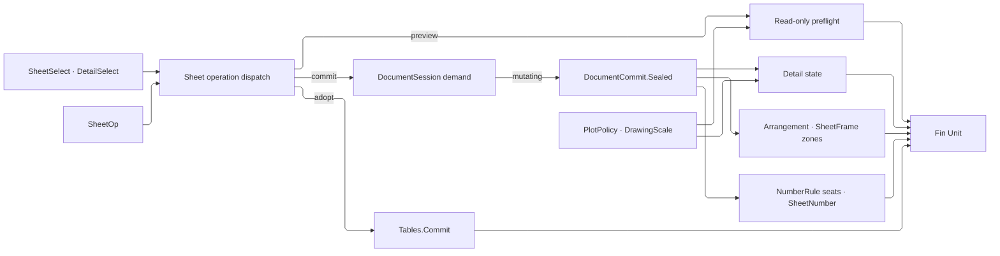

# [RASM_RHINO_SHEETS]

`Sheets.Commit` and `Sheets.Preview` own sheet and detail selection, scale admission, desired-state programs, validation, and undo/redraw settlement. One closed detail-axis family derives validation and write behavior, and every live page or detail remains inside the consuming document demand.

## [01]-[INDEX]

- [02]-[SELECTORS]: `SheetSelect` and `DetailSelect` — page and detail resolution as data.
- [03]-[SCALE_AND_VEILS]: host-native scale parsing, per-detail layer veils over the `Document` override owner, and clipping participation.
- [04]-[DETAIL_STATE]: detail creation, arrangement, and the closed desired-state program.
- [05]-[TRANSACTION_PIPELINE]: issued sheet specs and number rules, sheet operations, `Sheets.Preview`, and `Sheets.Commit`.

## [02]-[SELECTORS]

- Owner: `SheetSelect` — page addressing as one value: id, name, and volume membership compose conjunctively, and the empty selector is the whole page roster in `PageNumber` order. `DetailSelect` — detail addressing with the same grammar and the projection axis; `Single` proves exactly one match for operations whose host member admits one detail. `ProjectionForm` is the ONE parallel-versus-perspective discriminant this page reads.
- Law: every selector axis is a VALUE. A stored `Func<…, bool>` cannot replay, hash, or answer what it selected, and a page-addressing value crosses publication and the transaction pipeline unchanged. `Parallel` and `Perspective` are `ProjectionForm` leaves, and a condition no axis expresses is a new axis rather than a closure.
- Law: sheet-set membership is a NAMING FIELD, not a free string — a page view group names the `NamingField.Volume` value of the BS EN ISO 19650-2 container identifier, so a selector addresses the volume its drawing set publishes and the host group name is that field's text (D26).
- Law: selection is read-only — a selector never activates, mutates, or redraws; it resolves live host objects inside the demand window that consumes them and hands them onward within that window.
- Law: name matching is ordinal-case-insensitive to match the host's page-name semantics.
- Packages: `Rasm.Drawing` (`NamingField`, `NamingStandard`, `SheetNumber`), `Domain/results` (`Op`, `Fault`), LanguageExt.Core (`Fin`, `Option`, `Seq`), Thinktecture.Runtime.Extensions (`[SmartEnum]`); RhinoCommon `RhinoPageView`/`DetailViewObject` per `.api/api-rhinocommon-display.md`.

```csharp
using System.Globalization;
using Rasm.Domain;
using Rasm.Drawing;
using Rasm.Numerics;
using Rasm.Rhino.Document;

namespace Rasm.Rhino.Exchange;

// --- [TYPES] ---------------------------------------------------------------------------
[SmartEnum<string>]
[KeyMemberEqualityComparer<ComparerAccessors.StringOrdinal, string>]
public sealed partial class ProjectionForm {
    public static readonly ProjectionForm Parallel = new(key: "parallel", scaled: true);
    public static readonly ProjectionForm Perspective = new(key: "perspective", scaled: false);

    public bool Scaled { get; }

    internal static ProjectionForm Of(DetailViewObject detail) =>
        detail.DetailGeometry is { IsParallelProjection: true } ? Parallel : Perspective;

    internal static ProjectionForm Of(Rhino.Display.DefinedViewportProjection projection) =>
        projection is Rhino.Display.DefinedViewportProjection.Perspective
            or Rhino.Display.DefinedViewportProjection.TwoPointPerspective
            ? Perspective
            : Parallel;
}

// --- [MODELS] --------------------------------------------------------------------------
public readonly record struct SheetSelect(
    Option<Guid> Id = default,
    Option<string> Name = default,
    Option<string> Volume = default) {
    public static SheetSelect All => default;
    public static SheetSelect Named(string name) => new(Name: Some(name));

    public static Fin<SheetSelect> InVolume(SheetNumber number, Op? key = null) =>
        number.Fields.Find(static pair => pair.Field.Equals(NamingField.Volume))
            .Map(static pair => new SheetSelect(Volume: Some(pair.Value)))
            .ToFin(new KernelFault.InvalidValue(
                Label: nameof(Volume),
                Requirement: "a sheet number whose standard sequences a volume field",
                Key: Some(key.OrDefault())));

    internal Fin<Seq<RhinoPageView>> Resolve(RhinoDoc document, Op op) {
        SheetSelect self = this;
        return op.Catch(() => {
            Option<int> volume = self.Volume.Bind(name =>
                Optional(document.PageViewGroups.FindName(name: name)).Map(static found => found.Index));
            Seq<RhinoPageView> pages = toSeq(document.Views.GetPageViews())
                .Filter(page =>
                    self.Id.Map(id => page.MainViewport.Id == id).IfNone(noneValue: true)
                    && self.Name.Map(name => string.Equals(a: page.PageName, b: name, comparisonType: StringComparison.OrdinalIgnoreCase)).IfNone(noneValue: true)
                    && volume.Map(index => page.IsInPageViewGroup(pageViewGroupIndex: index)).IfNone(noneValue: true))
                .OrderBy(static page => page.PageNumber)
                .AsIterable()
                .ToSeq();
            return Fin.Succ(value: pages);
        });
    }

    internal Fin<RhinoPageView> Single(RhinoDoc document, Op op) =>
        Resolve(document: document, op: op).Bind(pages => pages switch {
            [var only] => Fin.Succ(value: only),
            _ => Fin.Fail<RhinoPageView>(error: op.InvalidInput()),
        });
}

public readonly record struct DetailSelect(
    Option<Guid> Id = default,
    Option<string> Name = default,
    Option<ProjectionForm> Projection = default) {
    public static DetailSelect All => default;
    public static DetailSelect Named(string name) => new(Name: Some(name));
    public static DetailSelect Parallel => new(Projection: Some(ProjectionForm.Parallel));
    public static DetailSelect Perspective => new(Projection: Some(ProjectionForm.Perspective));

    internal static Option<string> NameOf(DetailViewObject detail) =>
        Optional(detail.Attributes.Name).Filter(static text => !string.IsNullOrWhiteSpace(value: text))
        | Optional(detail.Viewport.Name).Filter(static text => !string.IsNullOrWhiteSpace(value: text));

    internal Fin<Seq<DetailViewObject>> Resolve(RhinoPageView page, Op op) {
        DetailSelect self = this;
        return op.Catch(() => Fin.Succ(value: toSeq(page.GetDetailViews())
            .Filter(detail =>
                self.Id.Map(id => detail.Id == id || detail.Viewport.Id == id).IfNone(noneValue: true)
                && self.Name.Map(name => NameOf(detail: detail).Map(found =>
                    string.Equals(a: found, b: name, comparisonType: StringComparison.OrdinalIgnoreCase)).IfNone(noneValue: false)).IfNone(noneValue: true)
                && self.Projection.Map(form => ProjectionForm.Of(detail: detail) == form).IfNone(noneValue: true))));
    }

    internal Fin<DetailViewObject> Single(RhinoPageView page, Op op) =>
        Resolve(page: page, op: op).Bind(details => details switch {
            [var only] => Fin.Succ(value: only),
            _ => Fin.Fail<DetailViewObject>(error: op.InvalidInput()),
        });
}
```

## [03]-[SCALE_AND_VEILS]

- Owner: `SheetScale` — the page-to-model scale owner and the kernel `DrawingScale`'s HOST LOWERING: `RatioCase(DrawingScale)` carries an admitted ratio off the standard's own ladder, `LengthsCase` the two-unit length pair the Rhino 9 `DetailView.SetScale` overload takes, and `NamedCase` the operator-typed spelling. `LayerVeil` binds one addressed layer to a per-detail override program, and `SheetClip` seats the document-attached half of the Document tier's `ClipOp` algebra.
- Law: a declared ratio is a `DrawingScale` — a reduced positive integer pair the standard's `ScaleLadder` decides preferredness for — so any positive double no longer admits as a drawing scale and `1:97` reaches the ladder's `Nearest` rather than a detail (D14). `Ratio` is the one derived double every fold reads, and `Render(ScaleNotation.For(standard))` the one rendering (D16).
- Law: `NamedCase` admits through the KERNEL notations first — `DrawingScale.Admit(text)` parses `1:50`, `1/4"=1'-0"`, and `1"=20'` and hands back the ADMITTING notation, so a set issued in an architectural spelling renders back in it. The host `ScaleValue.Create` grammar is the fallback for the operator spellings Rhino publishes and the kernel does not, and it stays the host lowering it is (D15).
- Law: `Live(detail)` re-admits the host's own `ScaleFormat.OneToModelLength` rendering through `DrawingScale.Admit`, so detail publishing stamps an admitted `DrawingScale` rather than copying a formatted host string (D16, D88).
- Law: a scale applies only to a parallel projection — `ProjectionForm.Scaled` is the ONE admission.
- Law: the per-detail-viewport override family belongs to `Document`, so a veil declares no field vocabulary of its own — it carries a `LayerRef`, a reset flag, and viewport-late-bound `LayerOverride` writes, and folds them into ONE `LayerOp.Amend` whose staged copy lands through the owner's single `Modify`. Every host per-viewport setter self-commits on a table-bound `Layer`, so a direct live-table write publishes each field the instant it is set and a program failing on the third layer has already published the first two; the amend path stages, applies, and lands per layer instead, and the reset rides `LayerOverride.Purge` rather than a second `DeletePerViewportSettings` spelling.
- Law: a veil write is a VALUE, not a delegate. `LayerVeil` carries the `LayerOverride` edits it lands and the viewport binds at program time, so a veil replays and hashes where the former `Func<Guid, Fin<LayerOverride>>` alias did neither.
- Law: veil precedence is write order over one staged copy — reset first, then each declared write, so the last write of a field wins with no merge machinery, and a second veil naming the same layer stages afresh off the landed state.
- Law: `Document/geometry` owns the clipping algebra whole. `SheetClip` names the DOCUMENT-ATTACHED half — minting a plane in the document table, attaching and detaching this detail's viewport, and pruning planes the detail alone serves — and every scope, depth, and viewport EDIT is a `ClipOp` the owner applies, so `SetClipParticipation` is written in exactly one place in the folder and the three-state depth is the owner's own `FieldOverride<double>`.
- Law: `SheetScale` also carries the paper↔model length correspondence as two operations of the one scale owner over the host's `TryGetPaperLength`/`TryGetModelLength` pair — the same owner answers both directions, and a false host return is a typed refusal, never a zero length.
- Packages: `Rasm.Drawing` (`DrawingScale`, `ScaleNotation`, `ScaleLadder`, `SheetStandard`), `Domain/context` (`ModelUnit`, `Tolerance`, `ToleranceLane`, `EpsilonPolicy`), `Document/geometry` (`ClipOp`, `ClipScope`, `ClipSet`, `ViewportOp`, `FieldOverride<T>`), `Document/layers` (`LayerRef`, `LayerOp.Amend`, `LayerEdit.Override`, `LayerOverride`), LanguageExt.Core, Thinktecture.Runtime.Extensions; RhinoCommon `ScaleValue`/`LengthValue`/`DetailViewObject` per `.api/api-rhinocommon-display.md`.

```csharp
// --- [TYPES] ---------------------------------------------------------------------------
[Equatable]
public readonly partial record struct LayerVeil(
    LayerRef Layer,
    [property: OrderedEquality] Seq<LayerOverride> Writes,
    bool Resets) {
    public static LayerVeil Of(LayerRef layer, params ReadOnlySpan<LayerOverride> writes) =>
        new(Layer: layer, Writes: toSeq(writes.ToArray()), Resets: false);

    public static LayerVeil Reset(LayerRef layer, params ReadOnlySpan<LayerOverride> writes) =>
        new(Layer: layer, Writes: toSeq(writes.ToArray()), Resets: true);

    internal bool Applies => Resets || !Writes.IsEmpty;

    internal Fin<LayerOp> Program(Guid viewport, Op op) =>
        from purge in Resets
            ? LayerOverride.Purge(viewport: viewport).Map(static cleared => Seq(cleared))
            : Fin.Succ(value: Seq<LayerOverride>())
        from bound in Writes.TraverseM(write => write.At(viewport: viewport, key: op)).As()
        from program in LayerOp.Amend(
            target: Layer,
            edits: (purge + bound).Map(LayerEdit.Override).ToArray())
        select program;
}

[Union(ConversionFromValue = ConversionOperatorsGeneration.None)]
public abstract partial record SheetClip {
    private SheetClip() { }
    public sealed record AddCase(Plane Plane, Tolerance U, Tolerance V, Seq<ClipOp> Program) : SheetClip;
    public sealed record AttachCase(Guid PlaneId) : SheetClip;
    public sealed record DetachCase(Guid PlaneId) : SheetClip;
    public sealed record AmendCase(Guid PlaneId, Seq<ClipOp> Program) : SheetClip;
    public sealed record PruneCase : SheetClip;

    public static Fin<SheetClip> Add(Plane plane, Tolerance u, Tolerance v, params ReadOnlySpan<ClipOp> program) =>
        Fin.Succ<SheetClip>(new AddCase(Plane: plane, U: u, V: v, Program: toSeq(program.ToArray())));
}

[Union(ConversionFromValue = ConversionOperatorsGeneration.None)]
public abstract partial record SheetScale {
    private SheetScale() { }
    public sealed record RatioCase(DrawingScale Scale) : SheetScale;
    public sealed record LengthsCase(double PageLength, LengthUnit PageUnit, double ModelLength, LengthUnit ModelUnit) : SheetScale;
    public sealed record NamedCase(string Spelling) : SheetScale;

    public static Fin<SheetScale> Ratio(DrawingScale scale, Op? key = null) =>
        key.OrDefault().Need(value: scale).Map(static admitted => (SheetScale)new RatioCase(Scale: admitted));

    public static Fin<SheetScale> Ratio(int paper, int model, SheetStandard standard, Op? key = null) =>
        from admitted in DrawingScale.Of(paper: paper, model: model, key: key)
        select (SheetScale)new RatioCase(Scale: ScaleLadder.For(standard).Nearest(scale: admitted));

    internal static Option<DrawingScale> Live(DetailViewObject detail) =>
        Format(detail: detail).Bind(static text => DrawingScale.Admit(text: text).ToOption().Map(static row => row.Scale));

    public static Fin<SheetScale> Lengths(
        double pageLength,
        LengthUnit pageUnit,
        double modelLength,
        LengthUnit modelUnit,
        Op? key = null) {
        Op op = key.OrDefault();
        return from _page in op.Positive(value: pageLength)
               from _model in op.Positive(value: modelLength)
               from _pageUnit in ModelUnit.Of(value: pageUnit, key: op)
               from _modelUnit in ModelUnit.Of(value: modelUnit, key: op)
               select (SheetScale)new LengthsCase(
                   PageLength: pageLength, PageUnit: pageUnit,
                   ModelLength: modelLength, ModelUnit: modelUnit);
    }

    internal static Option<string> Format(DetailViewObject detail) =>
        detail.GetFormattedScale(format: DetailViewObject.ScaleFormat.OneToModelLength, value: out string formatted)
            ? Optional(formatted)
            : Option<string>.None;

    internal Fin<(double PageLength, LengthUnit PageUnit, double ModelLength, LengthUnit ModelUnit)> Resolve(RhinoDoc document, Op op) => Switch(
        (Document: document, Op: op),
        ratioCase: static (ctx, scale) =>
            from _pageUnit in ModelUnit.Of(value: ctx.Document.PageUnits, key: ctx.Op)
            from _modelUnit in ModelUnit.Of(value: ctx.Document.ModelUnits, key: ctx.Op)
            select ((double)scale.Scale.Paper, ctx.Document.PageUnits, (double)scale.Scale.Model, ctx.Document.ModelUnits),
        lengthsCase: static (ctx, scale) =>
            from admitted in Lengths(
                pageLength: scale.PageLength, pageUnit: scale.PageUnit,
                modelLength: scale.ModelLength, modelUnit: scale.ModelUnit,
                key: ctx.Op)
            select (scale.PageLength, scale.PageUnit, scale.ModelLength, scale.ModelUnit),
        namedCase: static (ctx, scale) => Parse(spelling: scale.Spelling, document: ctx.Document, op: ctx.Op));

    internal Fin<Unit> Apply(DetailViewObject detail, RhinoDoc document, Op op) =>
        from _parallel in guard(ProjectionForm.Of(detail: detail).Scaled, op.InvalidInput()).ToFin()
        from resolved in Resolve(document: document, op: op)
        from _scaled in op.Confirm(success:
            detail.DetailGeometry.SetScale(
                modelLength: resolved.ModelLength, modelUnits: resolved.ModelUnit,
                pageLength: resolved.PageLength, pageUnits: resolved.PageUnit))
        select unit;

    internal Fin<double> PageToModel(RhinoDoc document, Op op) =>
        from resolved in Resolve(document: document, op: op)
        from pageSource in ModelUnit.Of(value: resolved.PageUnit, key: op)
        from pageTarget in ModelUnit.Of(value: document.PageUnits, key: op)
        from pageFactor in pageSource.ScaleTo(target: pageTarget, key: op)
        from modelSource in ModelUnit.Of(value: resolved.ModelUnit, key: op)
        from modelTarget in ModelUnit.Of(value: document.ModelUnits, key: op)
        from modelFactor in modelSource.ScaleTo(target: modelTarget, key: op)
        let ratio = (resolved.PageLength * pageFactor) / (resolved.ModelLength * modelFactor)
        from admitted in double.IsFinite(ratio) && ratio > 0.0
            ? Fin.Succ(value: ratio)
            : Fin.Fail<double>(error: op.InvalidResult())
        select admitted;

    internal Fin<DrawingScale> Declared(RhinoDoc document, Op op) => Switch(
        (Document: document, Op: op),
        ratioCase: static (_, scale) => Fin.Succ(value: scale.Scale),
        lengthsCase: static (ctx, scale) => Reduced(scale: scale, document: ctx.Document, op: ctx.Op),
        namedCase: static (ctx, scale) =>
            from text in ctx.Op.AcceptText(value: scale.Spelling)
            from admitted in DrawingScale.Admit(text: text, key: ctx.Op)
            select admitted.Scale);

    private static Fin<DrawingScale> Reduced(SheetScale scale, RhinoDoc document, Op op) =>
        from ratio in scale.PageToModel(document: document, op: op)
        let terms = ratio <= 1.0 ? (Paper: 1.0, Model: 1.0 / ratio) : (Paper: ratio, Model: 1.0)
        from paper in Whole(value: terms.Paper, op: op)
        from model in Whole(value: terms.Model, op: op)
        from admitted in DrawingScale.Of(paper: paper, model: model, key: op)
        select admitted;

    private static Fin<int> Whole(double value, Op op) =>
        Math.Round(a: value) is var rounded
        && rounded is > 0.0 and <= int.MaxValue
        && Math.Abs(value: value - rounded) <= EpsilonPolicy.SqrtEpsilon * Math.Max(val1: 1.0, val2: Math.Abs(value: value))
            ? Fin.Succ(value: (int)rounded)
            : Fin.Fail<int>(error: op.InvalidInput());

    private static Fin<(double, LengthUnit, double, LengthUnit)> Parse(string spelling, RhinoDoc document, Op op) =>
        from text in op.AcceptText(value: spelling)
        from resolved in DrawingScale.Admit(text: text, key: op).Match(
            Succ: row => Fin.Succ<(double, LengthUnit, double, LengthUnit)>(
                (row.Scale.Paper, document.PageUnits, row.Scale.Model, document.ModelUnits)),
            Fail: _ => Hosted(text: text, document: document, op: op))
        select resolved;

    private static Fin<(double, LengthUnit, double, LengthUnit)> Hosted(string text, RhinoDoc document, Op op) =>
        op.Catch(() => {
            using ScaleValue? candidate = ScaleValue.Create(
                s: text,
                ps: global::Rhino.Input.StringParserSettings.DefaultParseSettings);
            return Optional(candidate)
                .Filter(static value => !value.IsUnset())
                .ToFin(Fail: op.InvalidInput())
                .Bind(scale => {
                    using LengthValue page = scale.LeftLengthValue();
                    using LengthValue model = scale.RightLengthValue();
                    LengthUnit pageUnit = LengthUnit.IsNone(in page.Units) ? document.PageUnits : page.Units;
                    LengthUnit modelUnit = LengthUnit.IsNone(in model.Units) ? document.ModelUnits : model.Units;
                    double pageLength = page.Length();
                    double modelLength = model.Length();
                    return Lengths(
                        pageLength: pageLength,
                        pageUnit: pageUnit,
                        modelLength: modelLength,
                        modelUnit: modelUnit,
                        key: op)
                        .Map(_ => (pageLength, pageUnit, modelLength, modelUnit));
                });
        });

    public static Fin<double> PaperLength(DetailViewObject detail, double modelLength, Op? key = null) {
        Op op = key.OrDefault();
        return from _length in op.Positive(value: modelLength)
               from paper in op.Catch(() => detail.TryGetPaperLength(modelLength, out double paperLength)
                   ? Fin.Succ(value: paperLength)
                   : Fin.Fail<double>(error: op.InvalidResult()))
               select paper;
    }

    public static Fin<double> ModelLength(DetailViewObject detail, double paperLength, Op? key = null) {
        Op op = key.OrDefault();
        return from _length in op.Positive(value: paperLength)
               from model in op.Catch(() => detail.TryGetModelLength(paperLength, out double modelLength)
                   ? Fin.Succ(value: modelLength)
                   : Fin.Fail<double>(error: op.InvalidResult()))
               select model;
    }
}
```

## [04]-[DETAIL_STATE]

- Owner: `DetailSpec` admits detail creation before activation. `DetailArrangement` derives page-space frames INSIDE the standard's own drawing field, and each `DetailState` case carries one mutation axis whose validation, write, and commit contribution share one exhaustive dispatch.
- Law: placement is the SHEET's geometry, not a caller's arithmetic. The framed drawing field is the sheet extent inset by `SheetFrame.For(standard).Margin(size)` — ISO 5457's binding-and-edge quad, never four equal insets — and the grid pitch is the standard's own reference-grid module through `SheetFrame.Zones(size, orientation)`, so a free `double Gutter` and a live `page.PageWidth`/`PageHeight` read both delete: the layout answers the same figures the sheet was issued at whether or not the host page happens to match (D10).
- Law: `DetailAnchor` is a PAIR of one-dimensional axes, not nine rows. A 3×3 placement convention is two three-row rosters and the nine corners derive, so a fourth horizontal seat is one row rather than three.
- Law: program admission folds the final projection before any write, refuses every declared scale when that projection is nonparallel through `ProjectionForm.Scaled`, and orders admitted scale rows behind projection rows.
- Law: frame changes transform `detail.Geometry` from its current bounding frame into the target frame, then contribute the `DetailCommit.Geometry` capability. Detail object identity remains stable; a document-table transform cannot replace the object behind the retained detail handle.
- Law: the two lock axes are one `CapabilitySet<DetailLock>`. Projection lock and camera lock are independent host toggles a caller sets together and a spec declared as a bare boolean beside a case, so the SET is the vocabulary and the case carries what a program wants held — a spec boolean and two sibling cases were three spellings of one axis.
- Law: `DetailFrame` carries `IValidityEvidence`, so its finiteness and positivity fold through `ValidityClaim.All` like every other admitted extent and no site re-spells four `double.IsFinite` probes.
- Law: viewport-side commits precede geometry-side commits — `DetailCommit.Precedence` orders the folded commit set so `CommitViewportChanges` runs before `CommitChanges`, because the viewport re-snapshot otherwise clobbers an uncommitted geometry edit when one program carries both a viewport axis (`DisplayModeCase`, `ProjectionCase`, `LocksCase`) and a geometry axis (`ScaleCase`, `FrameCase`).
- Packages: `Rasm.Drawing` (`SheetSize`, `SheetFrame`, `SheetMargin`, `SheetOrientation`, `ZoneGrid`, `DrawingScale`), `Numerics/atoms` (`UnitInterval`, `Point2d`), `Domain/results` (`ValidityClaim`, `Op`), `Domain/validation` (`CapabilitySet`, `ICapability`), `Document/geometry` (`ClipOp`, `ClipScope`, `ClipSet`, `ViewportOp`), LanguageExt.Core (`Validation` applicative, `Fin`), Thinktecture.Runtime.Extensions.
- Boundary: camera pose inside a detail is the viewport camera pipeline addressed at `ViewportTarget.DetailCase`; `DetailState` owns scale, locks, naming, display mode, veils, and clips — the split keeps one camera algebra in the package. `VeilsCase` contributes no `DetailCommit`, because the layer program lands through `Document`'s own staged `Modify` and the detail object carries nothing to re-commit.

```csharp
// --- [TYPES] ---------------------------------------------------------------------------
[SmartEnum<int>]
public sealed partial class AnchorAcross {
    public static readonly AnchorAcross Left = new(key: 0, factor: UnitInterval.Create(value: 0.0));
    public static readonly AnchorAcross Center = new(key: 1, factor: UnitInterval.Create(value: 0.5));
    public static readonly AnchorAcross Right = new(key: 2, factor: UnitInterval.Create(value: 1.0));

    public UnitInterval Factor { get; }
}

[SmartEnum<int>]
public sealed partial class AnchorDown {
    public static readonly AnchorDown Bottom = new(key: 0, factor: UnitInterval.Create(value: 0.0));
    public static readonly AnchorDown Middle = new(key: 1, factor: UnitInterval.Create(value: 0.5));
    public static readonly AnchorDown Top = new(key: 2, factor: UnitInterval.Create(value: 1.0));

    public UnitInterval Factor { get; }
}

public readonly record struct DetailAnchor(AnchorAcross Across, AnchorDown Down) {
    public static DetailAnchor Center { get; } = new(Across: AnchorAcross.Center, Down: AnchorDown.Middle);

    internal double X => (double)Across.Factor;

    internal double Y => (double)Down.Factor;
}

[SmartEnum<string>]
[KeyMemberEqualityComparer<ComparerAccessors.StringOrdinal, string>]
public sealed partial class DetailLock : ICapability<DetailLock> {
    public static readonly DetailLock Projection = new(key: "projection",
        write: static (detail, held) => detail.DetailGeometry.IsProjectionLocked = held,
        commit: DetailCommit.Geometry);
    public static readonly DetailLock Camera = new(key: "camera",
        write: static (detail, held) => detail.Viewport.LockedProjection = held,
        commit: DetailCommit.Viewport);

    internal DetailCommit Commit { get; }

    [UseDelegateFromConstructor]
    internal partial void Write(DetailViewObject detail, bool held);

    internal static CapabilitySet<DetailLock> On(DetailViewObject detail) =>
        CapabilitySet<DetailLock>.Of([..
            Seq((Held: detail.DetailGeometry.IsProjectionLocked, Row: Projection),
                (detail.Viewport.LockedProjection, Camera))
            .Filter(static row => row.Held)
            .Map(static row => row.Row)]);
}

public readonly record struct DetailFrame(double X, double Y, double Width, double Height) : IValidityEvidence {
    public bool IsValid => ValidityClaim.All(
        ValidityClaim.Finite(X), ValidityClaim.Finite(Y), Width > 0.0, Height > 0.0,
        ValidityClaim.Finite(Width), ValidityClaim.Finite(Height));

    internal Point2d Anchored(DetailAnchor anchor, Point2d offset) =>
        new(x: X + (Width * anchor.X) + offset.X, y: Y + (Height * anchor.Y) + offset.Y);

    internal Fin<DetailFrame> Admitted(Op key) =>
        IsValid ? Fin.Succ(value: this) : Fin.Fail<DetailFrame>(error: key.InvalidResult());
}

internal readonly record struct LayoutContext(
    DetailFrame Current, DetailFrame Field, ZoneGrid Zones,
    DetailAnchor Anchor, Point2d Offset, int Index, int Count, Op Key);

[SmartEnum]
public sealed partial class DetailArrangement {
    public static readonly DetailArrangement Grid = new(frame: static ctx => {
        int columns = Math.Min(ctx.Zones.Columns, Math.Max(1, ctx.Count));
        int rows = (ctx.Count + columns - 1) / columns;
        double cellWidth = ctx.Field.Width / columns;
        double cellHeight = ctx.Field.Height / rows;
        return new DetailFrame(
            X: ctx.Field.X + ((ctx.Index % columns) * cellWidth),
            Y: ctx.Field.Y + ctx.Field.Height - (((ctx.Index / columns) + 1) * cellHeight),
            Width: cellWidth, Height: cellHeight).Admitted(key: ctx.Key);
    });
    public static readonly DetailArrangement FitPage = new(frame: static ctx => ctx.Field.Admitted(key: ctx.Key));
    public static readonly DetailArrangement AlignAnchor = new(frame: static ctx =>
        ctx.Field.Anchored(anchor: ctx.Anchor, offset: ctx.Offset) is var seat
            ? (ctx.Current with {
                X = seat.X - (ctx.Current.Width * ctx.Anchor.X),
                Y = seat.Y - (ctx.Current.Height * ctx.Anchor.Y),
            }).Admitted(key: ctx.Key)
            : Fin.Fail<DetailFrame>(error: ctx.Key.InvalidResult()));
    public static readonly DetailArrangement DistributeHorizontal = new(frame: static ctx =>
        ctx.Field.Width / ctx.Count is var step
            ? (ctx.Current with { X = ctx.Field.X + (ctx.Index * step) + ((step - ctx.Current.Width) / 2.0) })
                .Admitted(key: ctx.Key)
            : Fin.Fail<DetailFrame>(error: ctx.Key.InvalidResult()));
    public static readonly DetailArrangement DistributeVertical = new(frame: static ctx =>
        ctx.Field.Height / ctx.Count is var step
            ? (ctx.Current with { Y = ctx.Field.Y + (ctx.Index * step) + ((step - ctx.Current.Height) / 2.0) })
                .Admitted(key: ctx.Key)
            : Fin.Fail<DetailFrame>(error: ctx.Key.InvalidResult()));

    [UseDelegateFromConstructor]
    internal partial Fin<DetailFrame> Frame(LayoutContext context);

    internal static Fin<(DetailFrame Field, ZoneGrid Zones)> Field(
        SheetSize size, SheetOrientation orientation, ModelUnit units, Op key) =>
        from frame in Fin.Succ(value: SheetFrame.For(standard: size.Standard))
        from margin in frame.Margin(size: size, key: key)
        from zones in frame.Zones(size: size, orientation: orientation, key: key)
        from extent in size.In(unit: units, key: key)
        from insets in margin.In(unit: units, key: key)
        let oriented = orientation == SheetOrientation.Landscape
            ? (Width: extent.Height, Height: extent.Width)
            : (extent.Width, extent.Height)
        from field in new DetailFrame(
            X: insets.Left,
            Y: insets.Bottom,
            Width: oriented.Width - insets.Left - insets.Right,
            Height: oriented.Height - insets.Top - insets.Bottom).Admitted(key: key)
        select (field, zones);
}

// --- [MODELS] --------------------------------------------------------------------------
public sealed record DetailSpec(
    string Name,
    Point2d Corner,
    Point2d Opposite,
    Rhino.Display.DefinedViewportProjection Projection,
    Option<Guid> DisplayMode,
    Option<SheetScale> Scale,
    CapabilitySet<DetailLock> Locks) {
    internal Fin<string> Validate(RhinoDoc document, Op op) {
        K<Validation<Error>, string> name = op.AcceptText(value: Name).ToValidation();
        K<Validation<Error>, Unit> corners = guard(
            Corner.IsValid && Opposite.IsValid && Corner != Opposite,
            op.InvalidInput()).ToFin().ToValidation();
        K<Validation<Error>, Unit> projection = guard(
            Enum.IsDefined(value: Projection) && Projection != Rhino.Display.DefinedViewportProjection.None,
            op.InvalidInput()).ToFin().ToValidation();
        K<Validation<Error>, Unit> mode = DisplayMode
            .Map(id => Optional(Rhino.Display.DisplayModeDescription.GetDisplayMode(id: id))
                .ToFin(Fail: op.InvalidInput()).Map(static _ => unit))
            .IfNone(Fin.Succ(value: unit))
            .ToValidation();
        K<Validation<Error>, Unit> scaleProjection = guard(
            Scale.IsNone || ProjectionForm.Of(projection: Projection).Scaled,
            op.InvalidInput()).ToFin().ToValidation();
        K<Validation<Error>, Unit> scale = Scale
            .Map(value => value.Resolve(document: document, op: op).Map(static _ => unit))
            .IfNone(Fin.Succ(value: unit))
            .ToValidation();
        return (name, corners, projection, mode, scaleProjection, scale)
            .Apply(static (admitted, _, _, _, _, _) => admitted)
            .As()
            .ToFin();
    }
}

[SmartEnum]
public sealed partial class NamedDetailMode {
    public static readonly NamedDetailMode Save = new(changesViewport: false, apply: static (document, detail, name, op) =>
        op.Confirm(success: document.NamedViews.Add(name: name, viewportId: detail.Viewport.Id) >= 0));
    public static readonly NamedDetailMode Restore = new(changesViewport: true, apply: static (document, detail, name, op) =>
        document.NamedViews.FindByName(name) is var index && index >= 0
            ? op.Confirm(success: document.NamedViews.RestoreWithAspectRatio(index: index, viewport: detail.Viewport))
            : Fin.Fail<Unit>(error: op.InvalidInput()));

    internal bool ChangesViewport { get; }

    [UseDelegateFromConstructor]
    internal partial Fin<Unit> Apply(RhinoDoc document, DetailViewObject detail, string name, Op key);
}

[SmartEnum]
public sealed partial class DetailCommit {
    public static readonly DetailCommit Viewport = new(precedence: 0, apply: static (detail, op) =>
        op.Confirm(success: detail.CommitViewportChanges()));
    public static readonly DetailCommit Geometry = new(precedence: 1, apply: static (detail, op) =>
        op.Confirm(success: detail.CommitChanges()));

    internal int Precedence { get; }

    [UseDelegateFromConstructor]
    internal partial Fin<Unit> Apply(DetailViewObject detail, Op key);
}

[Union(ConversionFromValue = ConversionOperatorsGeneration.None)]
public abstract partial record DetailState {
    private DetailState() { }
    public sealed record NameCase(string Name) : DetailState;
    public sealed record LocksCase(CapabilitySet<DetailLock> Held) : DetailState;
    public sealed record DisplayModeCase(Guid Id) : DetailState;
    public sealed record ProjectionCase(Rhino.Display.DefinedViewportProjection Projection) : DetailState;
    public sealed record ScaleCase(SheetScale Scale) : DetailState;
    public sealed record FrameCase(DetailFrame Frame) : DetailState;
    public sealed record NamedViewCase(string Name, NamedDetailMode Mode) : DetailState;
    public sealed record VeilsCase(Seq<LayerVeil> Veils) : DetailState;
    public sealed record ClipCase(SheetClip Clip) : DetailState;
    public sealed record ActivateCase : DetailState;
    public sealed record DeactivateCase : DetailState;

    internal Seq<DetailCommit> Commits => Switch(
        nameCase: static _ => Seq<DetailCommit>(),
        locksCase: static _ => toSeq(CapabilitySet<DetailLock>.All.Held).Map(static row => row.Commit),
        displayModeCase: static _ => Seq(DetailCommit.Viewport),
        projectionCase: static _ => Seq(DetailCommit.Viewport),
        scaleCase: static _ => Seq(DetailCommit.Geometry),
        frameCase: static _ => Seq(DetailCommit.Geometry),
        namedViewCase: static state => state.Mode.ChangesViewport ? Seq(DetailCommit.Viewport) : Seq<DetailCommit>(),
        veilsCase: static _ => Seq<DetailCommit>(),
        clipCase: static _ => Seq<DetailCommit>(),
        activateCase: static _ => Seq<DetailCommit>(),
        deactivateCase: static _ => Seq<DetailCommit>());

    private Fin<Unit> ValidateAxis(RhinoDoc document, DetailViewObject detail, Op op) => Switch(
        (Document: document, Detail: detail, Op: op),
        nameCase: static (ctx, state) => ctx.Op.AcceptText(value: state.Name).Map(static _ => unit),
        locksCase: static (ctx, state) => ctx.Op.Need(value: state.Held).Map(static _ => unit),
        displayModeCase: static (ctx, state) => Optional(Rhino.Display.DisplayModeDescription.GetDisplayMode(id: state.Id))
            .ToFin(Fail: ctx.Op.InvalidInput()).Map(static _ => unit),
        projectionCase: static (ctx, state) => guard(
            Enum.IsDefined(value: state.Projection) && state.Projection != Rhino.Display.DefinedViewportProjection.None,
            ctx.Op.InvalidInput()).ToFin(),
        scaleCase: static (ctx, state) =>
            from _resolved in ctx.Op.Need(state.Scale)
                .Bind(scale => scale.Resolve(document: ctx.Document, op: ctx.Op))
            select unit,
        frameCase: static (ctx, state) =>
            from _valid in guard(state.Frame.IsValid, ctx.Op.InvalidInput()).ToFin()
            from _current in DetailFrameOf(detail: ctx.Detail, op: ctx.Op)
            select unit,
        namedViewCase: static (ctx, state) =>
            from mode in ctx.Op.Need(state.Mode)
            from name in ctx.Op.AcceptText(value: state.Name)
            from _exists in mode == NamedDetailMode.Restore
                ? guard(ctx.Document.NamedViews.FindByName(name) >= 0, ctx.Op.InvalidInput()).ToFin()
                : Fin.Succ(value: unit)
            select unit,
        veilsCase: static (ctx, state) =>
            from _veils in guard(
                state.Veils.ForAll(static veil => veil.Layer is not null && veil.Writes.ForAll(static write => write is not null)),
                ctx.Op.InvalidInput()).ToFin()

            from _layers in state.Veils
                .Filter(static veil => veil.Applies)
                .TraverseM(veil => veil.Layer.Index(document: ctx.Document, includeDeleted: false, key: ctx.Op))
                .As()
            select unit,
        clipCase: static (ctx, state) => ctx.Op.Need(state.Clip)
            .Bind(clip => Clips.Validate(clip: clip, document: ctx.Document, detail: ctx.Detail, op: ctx.Op)),
        activateCase: static (_, _) => Fin.Succ(value: unit),
        deactivateCase: static (_, _) => Fin.Succ(value: unit));

    internal Fin<Unit> Write(RhinoDoc document, RhinoPageView page, DetailViewObject detail, Op op) => Switch(
        (Document: document, Page: page, Detail: detail, Op: op),
        nameCase: static (ctx, state) => ctx.Op.Catch(() => {
            using ObjectAttributes? attributes = ctx.Detail.Attributes.Duplicate();
            return Optional(attributes).ToFin(Fail: ctx.Op.InvalidResult()).Bind(owned => {
                owned.Name = state.Name;
                return ctx.Op.Confirm(success: ctx.Document.Objects.ModifyAttributes(
                    objectId: ctx.Detail.Id,
                    newAttributes: owned,
                    quiet: true));
            });
        }),
        locksCase: static (ctx, state) => ctx.Op.Catch(() => {
            _ = toSeq(CapabilitySet<DetailLock>.All.Held)
                .Iter(row => row.Write(detail: ctx.Detail, held: state.Held.Admits(capability: row)));
            return Fin.Succ(value: unit);
        }),
        displayModeCase: static (ctx, state) => Optional(Rhino.Display.DisplayModeDescription.GetDisplayMode(id: state.Id))
            .ToFin(Fail: ctx.Op.InvalidInput())
            .Bind(mode => ctx.Op.Catch(() => {
                ctx.Detail.Viewport.DisplayMode = mode;
                return Fin.Succ(value: unit);
            })),
        projectionCase: static (ctx, state) => ctx.Op.Confirm(success: ctx.Detail.Viewport.SetProjection(
            projection: state.Projection,
            viewName: ctx.Detail.Viewport.Name,
            updateConstructionPlane: false)),
        scaleCase: static (ctx, state) => state.Scale.Apply(
            detail: ctx.Detail,
            document: ctx.Document,
            op: ctx.Op),
        frameCase: static (ctx, state) =>
            from current in DetailFrameOf(detail: ctx.Detail, op: ctx.Op)
            from _moved in ctx.Op.Catch(() => {
                Transform toOrigin = Transform.Translation(new Vector3d(-current.X, -current.Y, 0.0));
                Transform resize = Transform.Scale(
                    plane: Plane.WorldXY,
                    xScaleFactor: state.Frame.Width / current.Width,
                    yScaleFactor: state.Frame.Height / current.Height,
                    zScaleFactor: 1.0);
                Transform toSeat = Transform.Translation(new Vector3d(state.Frame.X, state.Frame.Y, 0.0));
                return ctx.Op.Confirm(success: ctx.Detail.Geometry.Transform(xform: toSeat * resize * toOrigin));
            })
            select unit,
        namedViewCase: static (ctx, state) => state.Mode.Apply(
            document: ctx.Document,
            detail: ctx.Detail,
            name: state.Name,
            key: ctx.Op),
        veilsCase: static (ctx, state) => Veils(
            veils: state.Veils,
            document: ctx.Document,
            detail: ctx.Detail,
            op: ctx.Op),
        clipCase: static (ctx, state) => Clips.Apply(
            clip: state.Clip,
            document: ctx.Document,
            page: ctx.Page,
            detail: ctx.Detail,
            op: ctx.Op),
        activateCase: static (ctx, _) => ctx.Op.Confirm(success: ctx.Page.SetActiveDetail(detailId: ctx.Detail.Id)),
        deactivateCase: static (ctx, _) => ctx.Op.Catch(() => {
            ctx.Page.SetPageAsActive();
            return Fin.Succ(value: unit);
        }));

    internal static Fin<Unit> Validate(
        Seq<DetailState> program,
        RhinoDoc document,
        DetailViewObject detail,
        Op op) =>
        from _program in guard(!program.IsEmpty && program.ForAll(static state => state is not null), op.InvalidInput()).ToFin()
        let settled = program.Fold(
            ProjectionForm.Of(detail: detail),
            static (form, state) => state is ProjectionCase projection ? ProjectionForm.Of(projection: projection.Projection) : form)
        from _finalScale in guard(
            settled.Scaled || !program.Exists(static state => state is ScaleCase),
            op.InvalidInput())
        from _axes in program
            .Traverse(state => state.ValidateAxis(document: document, detail: detail, op: op).ToValidation())
            .As()
            .ToFin()
        select unit;

    internal static Fin<Seq<DetailCommit>> Apply(
        Seq<DetailState> program,
        RhinoDoc document,
        RhinoPageView page,
        DetailViewObject detail,
        Op op) =>
        from _valid in Validate(program: program, document: document, detail: detail, op: op)
        let ordered = program
            .OrderBy(static state => state is ScaleCase ? 1 : 0)
            .AsIterable()
            .ToSeq()
        from commits in ordered.TraverseM(state => state.Write(document: document, page: page, detail: detail, op: op)
            .Map(_ => state.Commits)).As()
        let folded = toSeq(commits.Bind(identity).Distinct().OrderBy(static commit => commit.Precedence).AsIterable())
        from _committed in folded.TraverseM(commit => commit.Apply(detail: detail, key: op)).As()
        select folded;

    private static Fin<Unit> Veils(Seq<LayerVeil> veils, RhinoDoc document, DetailViewObject detail, Op op) =>
        veils
            .Filter(static veil => veil.Applies)
            .TraverseM(veil =>
                from program in veil.Program(viewport: detail.Viewport.Id, op: op)
                from _landed in program.Apply(document: document, op: op)
                select unit)
            .As()
            .Map(static _ => unit);

    internal static Fin<DetailFrame> DetailFrameOf(DetailViewObject detail, Op op) =>
        op.Catch(() => {
            BoundingBox bounds = detail.Geometry.GetBoundingBox(accurate: true);
            DetailFrame frame = new(X: bounds.Min.X, Y: bounds.Min.Y, Width: bounds.Max.X - bounds.Min.X, Height: bounds.Max.Y - bounds.Min.Y);
            return frame.Admitted(key: op);
        });
}

// --- [OPERATIONS] ----------------------------------------------------------------------
internal static class Clips {
    internal static Fin<Unit> Validate(SheetClip clip, RhinoDoc document, DetailViewObject detail, Op op) => clip.Switch(
        (Document: document, Detail: detail, Op: op),
        addCase: static (ctx, seed) =>
            from _plane in guard(seed.Plane.IsValid, ctx.Op.InvalidInput()).ToFin()
            from _program in guard(seed.Program.ForAll(static edit => edit is not null), ctx.Op.InvalidInput())
            select unit,
        attachCase: static (ctx, seat) => Plane(document: ctx.Document, id: seat.PlaneId, op: ctx.Op).Map(static _ => unit),
        detachCase: static (ctx, seat) => Plane(document: ctx.Document, id: seat.PlaneId, op: ctx.Op).Map(static _ => unit),
        amendCase: static (ctx, seat) =>
            from _plane in Plane(document: ctx.Document, id: seat.PlaneId, op: ctx.Op)
            from _program in guard(
                !seat.Program.IsEmpty && seat.Program.ForAll(static edit => edit is not null),
                ctx.Op.InvalidInput())
            select unit,
        pruneCase: static (_, _) => Fin.Succ(value: unit));

    internal static Fin<Unit> Apply(SheetClip clip, RhinoDoc document, RhinoPageView page, DetailViewObject detail, Op op) => clip.Switch(
        (Document: document, Page: page, Detail: detail, Op: op),
        addCase: static (ctx, seed) =>
            from id in ctx.Op.Catch(() => {
                using ObjectAttributes attributes = new();
                return ctx.Op.AcceptValue(value: ctx.Document.Objects.AddClippingPlane(
                    plane: seed.Plane,
                    uMagnitude: seed.U.Value,
                    vMagnitude: seed.V.Value,
                    clippedViewportIds: Seq(ctx.Detail.Viewport.Id).AsIterable(),
                    attributes: attributes));
            })
            from _minted in guard(id != Guid.Empty, ctx.Op.InvalidResult())
            from _programmed in Programmed(document: ctx.Document, id: id, program: seed.Program, op: ctx.Op)
            select unit,
        attachCase: static (ctx, seat) => Membership(
            document: ctx.Document, id: seat.PlaneId,
            edit: viewports => new ViewportOp.Add(Ids: viewports), page: ctx.Page, detail: ctx.Detail, op: ctx.Op),
        detachCase: static (ctx, seat) => Membership(
            document: ctx.Document, id: seat.PlaneId,
            edit: viewports => new ViewportOp.Remove(Ids: viewports), page: ctx.Page, detail: ctx.Detail, op: ctx.Op),
        amendCase: static (ctx, seat) => Programmed(
            document: ctx.Document, id: seat.PlaneId, program: seat.Program, op: ctx.Op),
        pruneCase: static (ctx, _) =>
            toSeq(ctx.Document.Objects.FindClippingPlanesForViewport(viewport: ctx.Detail.Viewport))
                .TraverseM(plane =>
                    from geometry in Optional(plane.ClippingPlaneGeometry).ToFin(Fail: ctx.Op.InvalidResult())
                    from _pruned in geometry.ViewportIds() is [Guid only] && only == ctx.Detail.Viewport.Id
                        ? ctx.Op.Confirm(success: ctx.Document.Objects.Delete(objectId: plane.Id, quiet: true))
                        : Membership(
                            document: ctx.Document, id: plane.Id,
                            edit: viewports => new ViewportOp.Remove(Ids: viewports), page: ctx.Page, detail: ctx.Detail, op: ctx.Op)
                    select unit)
                .As()
                .Map(static _ => unit));

    private static Fin<ClippingPlaneObject> Plane(RhinoDoc document, Guid id, Op op) =>
        Optional(document.Objects.FindId(objectId: id) as ClippingPlaneObject).ToFin(Fail: op.InvalidInput());

    private static Fin<Unit> Programmed(RhinoDoc document, Guid id, Seq<ClipOp> program, Op op) =>
        from plane in Plane(document: document, id: id, op: op)
        from geometry in op.Need(value: plane.ClippingPlaneGeometry)
        from _applied in program.TraverseM(edit => edit.Apply(geometry: geometry, key: op)).As()
        from _committed in program.IsEmpty ? Fin.Succ(value: unit) : op.Confirm(success: plane.CommitChanges())
        select unit;

    private static Fin<Unit> Membership(
        RhinoDoc document, Guid id, Func<Seq<Guid>, ViewportOp> edit, RhinoPageView page, DetailViewObject detail, Op op) =>
        from address in ViewportTarget.Detail(pageViewId: page.MainViewport.Id, detailId: detail.Id, key: op)
        from proven in ViewportOp.Proven(document, address)
        from _programmed in Programmed(
            document: document,
            id: id,
            program: Seq<ClipOp>(new ClipOp.Viewports(Value: edit(proven))),
            op: op)
        select unit;
}
```

## [05]-[TRANSACTION_PIPELINE]

- Owner: a sheet is an ISSUED PLOT POLICY — the kernel `PlotPolicy` binding extent, orientation, frame, scale, line group, plot-style table, posture, resolution, layer emission, and PDF conformance into one admitted value — so `SheetSpec` names a policy rather than a loose extent and `PageExtent` projects that policy's own oriented pair into `RhinoDoc.PageUnits`. `ClonePolicy` and `GroupPolicy` carry host mutation choices as values. `SheetProgramBudget` bounds the node-and-depth charge that walks operation trees and nested detail-state programs against the same limits. `NumberRule.Seats` computes every sheet number, zero-based host page number, and collision-free temporary seat before mutation.
- Law: an ISSUED sheet carries every column the standard decides, not just an extent. `PlotPolicy.Issue(size, key)` reads the size's own standard's `IssuePosture` — orientation, nominal scale snapped onto that standard's ladder, plot posture, resolution, layer emission, and archival conformance — so a sheet minted from a size alone is a fully issued sheet and a caller overriding one column states it at `PlotPolicy.Of` (D2). An absent policy is a host-default page and says so.
- Law: the page extent reads the policy's ORIENTATION. `SheetOrientation.Extent(size)` swaps the published portrait pair, so a rotated A1 is one row rather than a caller transposing two doubles, and the extent a page is created at is the extent its issued policy declares (D87).
- Entry: `Sheets.Commit(DocumentSession, SheetOp, SheetProgramBudget, Op?) : Fin<Unit>` demands the admitted profile's host capabilities and seals mutation inside one undo bracket. `Sheets.Preview(DocumentSession, SheetOp, SheetProgramBudget, Op?) : Fin<Unit>` validates the same policy, detail program, arrangement, and numbering owners under `Read`.
- Law: `EnsureCase` applies creation and configuration through the same field fold. Preview composes the same policy, detail-program, arrangement, and numbering-seat owners as execution.
- Law: sheet identity is a `SheetNumber`, not a template string. `NumberRule` names the `NamingStandard` its set is issued under and the field values that standard sequences; the numbering position is that standard's LAST field, so the ordinal advances the field the grammar reserves for it and the rendered name is `SheetNumber.Text` — a two-token `%pagenumber%`/`%page%` replacement pair with no field grammar, no designator, and no way to parse its own output back is the deleted form (D22, D23). The `n of m` display reads `SheetOfGrammar.For(standard)`, so `1/3` and `SHEET 1 OF 3` are the standard's own spelling rather than an interpolation (D25).
- Law: `AddDetailView` runs inside the active-view bracket — prior active view captured, page activated, and the prior view restored on every exit including failure.
- Law: ordering is total — `OrderCase` seats the named pages first in given order, retains every unnamed page in current order behind them, and renumbers the whole roster through per-page `PageNumber` rebinds (the host exposes no reorder member on `ViewTable`). Each rebind rides its own page-named key on the pipeline, so a mid-roster refusal states which page the host rejected instead of failing the pass anonymously; the landed roster order verifies as one postcondition after the whole pass because the host cascades renumbering across siblings, and duplicate names refuse at admission.
- Law: `NumberCase` carries the same landed-roster postcondition, and for the same reason — its collision safety is pre-computed from a census the first cascading `PageNumber` rebind invalidates, so after the final pass it re-reads `GetPageViews()` and proves both halves at once: every seat holds its own `(PageName, PageNumber)`, and no page outside the selection sits on a seated number.
- Law: every mutating program uses `DocumentCommit.Sealed`, so a failed page, detail, clip, group, or numbering writer rolls the owned record back. Delegated adoption composes the table transaction's own undo settlement without copying its serial.
- Law: program admission is `Charged`, a depth-carrying recursion over the operation tree that charges each node and each nested detail-state row against `SheetProgramBudget` before descending — the depth ceiling is proved at entry, so the recursion's own stack is bounded by the declared budget it enforces and no explicit worklist stands beside it.
- Boundary: a page-unit regime change is the document session's regime surface; this pipeline reads `RhinoDoc.PageUnits` as found.
- Boundary: the free `SheetSize(LengthUnit, double, double)` struct this page once carried is DELETED onto the kernel owner — its `Custom` arm is the caller-override the struct existed for, its `Of` overloads admit the host `(double, double, LengthUnit)` triple once, and `IsValid` carries the positivity the local `Resolve` re-guarded. `SheetSpec` now names a standard-issued or caller-issued extent rather than three loose host fields.
- Packages: `Rasm.Drawing` (`PlotPolicy`, `SheetSize`, `SheetOrientation`, `SheetStandard`, `SheetNumber`, `NamingStandard`, `NamingField`, `SheetOfGrammar`, `DrawingScale`), `Document/session` (`DocumentSession`, `SessionNeed`, `DocumentCommit`, `RedrawPolicy`), `Document/tables` (`Tables.Commit`, `TableOp.ImportPage`, `TableTransaction`), `Domain/context` (`ModelUnit`, `EpsilonPolicy`), LanguageExt.Core (`Validation` applicative, `TraverseM`, `Fin`, `Seq`, `HashMap`), Thinktecture.Runtime.Extensions (`[SmartEnum]`, `[Union]`, `[ComplexValueObject]`, `[UseDelegateFromConstructor]`); RhinoCommon `RhinoPageView`/`PageViewGroup`/`DetailViewObject` per `.api/api-rhinocommon-display.md`.
- Growth: a new operation is one `SheetOp` case with its admission/profile row and its arms in the `Preview` and `Apply` dispatches.

```csharp
// --- [TYPES] ---------------------------------------------------------------------------
[SmartEnum]
public sealed partial class ClonePolicy {
    public static readonly ClonePolicy Sheet = new(includesGeometry: false);
    public static readonly ClonePolicy Geometry = new(includesGeometry: true);

    public bool IncludesGeometry { get; }
}

[SmartEnum]
public sealed partial class GroupPolicy {
    public static readonly GroupPolicy Additive = new(isExclusive: false);
    public static readonly GroupPolicy Exclusive = new(isExclusive: true);

    public bool IsExclusive { get; }
}

[ComplexValueObject]
public sealed partial record SheetProgramBudget {
    public Rasm.Numerics.Dimension Nodes { get; }
    public Rasm.Numerics.Dimension Depth { get; }

    public static Rasm.Numerics.Dimension NodeCeiling { get; } = Rasm.Numerics.Dimension.Create(value: 4096);

    public static Rasm.Numerics.Dimension DepthCeiling { get; } = Rasm.Numerics.Dimension.Create(value: 64);

    public static SheetProgramBudget Standard { get; } = Create(nodes: NodeCeiling, depth: DepthCeiling);

    static partial void ValidateFactoryArguments(
        ref ValidationError? validationError,
        ref Rasm.Numerics.Dimension nodes,
        ref Rasm.Numerics.Dimension depth) =>
        validationError = nodes.Value <= 0 || depth.Value <= 0
            ? new ValidationError("Sheet program budget requires positive node and depth bounds.")
            : null;
}

internal sealed record SheetProfile(Seq<SessionNeed> Needs, bool Mutates, bool Sessioned) {
    internal static SheetProfile Empty { get; } = new(Needs: Seq<SessionNeed>(), Mutates: false, Sessioned: false);

    public static SheetProfile operator +(SheetProfile left, SheetProfile right) => new(
        Needs: (left.Needs + right.Needs).Distinct(),
        Mutates: left.Mutates || right.Mutates,
        Sessioned: left.Sessioned || right.Sessioned);
}

internal readonly record struct SheetCharge(int Nodes, SheetProfile Profile);

[Union(ConversionFromValue = ConversionOperatorsGeneration.None)]
public abstract partial record SheetOp {
    private SheetOp() { }
    public sealed record EnsureCase(SheetSpec Spec) : SheetOp;
    public sealed record CloneCase(SheetSelect Sheets, ClonePolicy Policy) : SheetOp;
    public sealed record RetireCase(SheetSelect Sheets) : SheetOp;
    public sealed record AdoptCase(DocumentPath Source, Guid SourceViewportId, string Name) : SheetOp;
    public sealed record OrderCase(Seq<string> Names) : SheetOp {
        internal Fin<(Seq<string> Names, Seq<RhinoPageView> Pages)> Named(RhinoDoc document, Op op) =>
            from names in Names.TraverseM(name => op.AcceptText(value: name)).As()
            from _unique in guard(
                names.Map(static name => name.ToUpperInvariant()).Distinct().Count == names.Count,
                op.InvalidInput())
            from pages in names.TraverseM(name => SheetSelect.Named(name: name).Single(document: document, op: op)).As()
            select (Names: names, Pages: pages);
    }
    public sealed record GroupCase(SheetSelect Sheets, SheetNumber Volume, GroupPolicy Policy) : SheetOp;
    public sealed record SpawnCase(SheetSelect Sheet, DetailSpec Spec) : SheetOp;
    public sealed record StateCase(SheetSelect Sheets, DetailSelect Details, Seq<DetailState> Program) : SheetOp;
    public sealed record ArrangeCase(SheetSelect Sheets, DetailSelect Details, DetailArrangement Arrangement, DetailAnchor Anchor, Point2d Offset, SheetSize Size, SheetOrientation Orientation) : SheetOp;
    public sealed record NumberCase(SheetSelect Sheets, NumberRule Rule) : SheetOp;
    public sealed record BatchCase(Seq<SheetOp> Program) : SheetOp;

    internal Fin<SheetProfile> Admit(SheetProgramBudget budget, Op op) =>
        from limit in op.Need(budget)
        from charged in Charged(
            node: this,
            limit: limit,
            depth: 0,
            state: new SheetCharge(Nodes: 0, Profile: SheetProfile.Empty),
            op: op)
        select charged.Profile;

    private static Fin<SheetCharge> Charged(SheetOp node, SheetProgramBudget limit, int depth, SheetCharge state, Op op) =>
        from _bounds in guard(depth <= limit.Depth.Value && state.Nodes < limit.Nodes.Value, op.InvalidInput()).ToFin()
        let entered = state with { Nodes = state.Nodes + 1 }
        from charged in node is BatchCase batch
            ? from _rows in guard(
                  !batch.Program.IsEmpty && batch.Program.ForAll(static child => child is not null),
                  op.InvalidInput()).ToFin()
              from folded in batch.Program.Fold(
                  Fin.Succ(value: entered),
                  (result, child) => result.Bind(carried => Charged(
                      node: child, limit: limit, depth: depth + 1, state: carried, op: op)))
              select folded
            : from _leaf in guard(node.IsLeafAdmitted(), op.InvalidInput()).ToFin()
              let nested = node is StateCase program ? program.Program.Count : 0
              from _nested in guard(
                  (nested == 0 || depth < limit.Depth.Value) && entered.Nodes + nested <= limit.Nodes.Value,
                  op.InvalidInput())
              select new SheetCharge(Nodes: entered.Nodes + nested, Profile: entered.Profile + node.LeafProfile)
        select charged;

    private bool IsLeafAdmitted() => Switch(
        ensureCase: static ensure =>
            ensure.Spec is not null
            && !string.IsNullOrWhiteSpace(ensure.Spec.Name)
            && ensure.Spec.Plot.ForAll(static policy => policy.IsValid)
            && ensure.Spec.Volume.ForAll(static volume => volume is not null)
            && ensure.Spec.Ordinal.ForAll(static ordinal => ordinal.Value > 0),
        cloneCase: static clone => clone.Policy is not null,
        retireCase: static _ => true,
        adoptCase: static adopt => adopt.Source != default
            && adopt.SourceViewportId != Guid.Empty
            && !string.IsNullOrWhiteSpace(adopt.Name),
        orderCase: static order => !order.Names.IsEmpty
            && order.Names.ForAll(static name => !string.IsNullOrWhiteSpace(name))
            && order.Names.Map(static name => name.ToUpperInvariant()).Distinct().Count == order.Names.Count,
        groupCase: static group => group.Policy is not null && group.Volume is not null,
        spawnCase: static spawn =>
            spawn.Spec is not null
            && !string.IsNullOrWhiteSpace(spawn.Spec.Name)
            && spawn.Spec.Corner.IsValid
            && spawn.Spec.Opposite.IsValid
            && spawn.Spec.Corner != spawn.Spec.Opposite
            && Enum.IsDefined(value: spawn.Spec.Projection)
            && spawn.Spec.Projection != Rhino.Display.DefinedViewportProjection.None
            && spawn.Spec.Scale.ForAll(static scale => scale is not null)
            && spawn.Spec.Locks is not null,
        stateCase: static state => !state.Program.IsEmpty && state.Program.ForAll(static axis => axis is not null),
        arrangeCase: static arrange =>
            arrange.Arrangement is not null
            && arrange.Anchor.Across is not null
            && arrange.Anchor.Down is not null
            && arrange.Offset.IsValid
            && arrange.Size is { IsValid: true }
            && arrange.Orientation is not null,
        numberCase: static number =>
            number.Rule is not null
            && number.Rule.Standard is not null
            && !number.Rule.Fields.IsEmpty
            && number.Rule.Start.Value > 0,
        batchCase: static _ => true);

    private SheetProfile LeafProfile => Switch(
        ensureCase: static _ => new SheetProfile(Recording, true, false),
        cloneCase: static _ => new SheetProfile(Recording, true, false),
        retireCase: static _ => new SheetProfile(Recording, true, false),
        adoptCase: static _ => new SheetProfile(Recording, true, true),
        orderCase: static _ => new SheetProfile(Recording, true, false),
        groupCase: static _ => new SheetProfile(Recording, true, false),
        spawnCase: static _ => new SheetProfile(Recording, true, false),
        stateCase: static _ => new SheetProfile(Recording, true, false),
        arrangeCase: static _ => new SheetProfile(Recording, true, false),
        numberCase: static _ => new SheetProfile(Recording, true, false),
        batchCase: static _ => new SheetProfile(Seq<SessionNeed>(), false, false));

    private static readonly Seq<SessionNeed> Recording = SessionNeed.Mutation(undo: true, redraw: RedrawPolicy.Continuous);
}

// --- [MODELS] --------------------------------------------------------------------------
public sealed record SheetSpec(string Name, Option<PlotPolicy> Plot, Option<SheetNumber> Volume, Option<Rasm.Numerics.Dimension> Ordinal);

internal sealed record NumberSeat(
    RhinoPageView Page,
    SheetNumber Number,
    string Name,
    int Ordinal,
    int PageNumber,
    string TemporaryName,
    int TemporaryPageNumber);

public sealed record NumberRule(NamingStandard Standard, Seq<(NamingField Field, string Value)> Fields, Rasm.Numerics.Dimension Start) {
    public static string TemporaryPrefix { get; } = "__rasm_sheet_";

    private NamingField Seat => Standard.Sequence.Last;

    private string Rendered(int ordinal) =>
        Fields.Find(pair => pair.Field.Equals(Seat))
            .Map(static pair => pair.Value.Length)
            .IfNone(noneValue: 1) is var width
            ? ordinal.ToString(format: new string('0', Math.Max(width, 1)), provider: CultureInfo.InvariantCulture)
            : string.Empty;

    internal Fin<Seq<NumberSeat>> Seats(RhinoDoc document, Seq<RhinoPageView> pages, Op op) =>
        from _standard in op.Need(value: Standard)
        from _fields in guard(Fields.Map(static pair => pair.Field).Equals(Standard.Sequence), op.InvalidInput())
        from _pages in guard(!pages.IsEmpty, op.InvalidInput())
        from _start in guard(Start.Value > 0, op.InvalidInput())
        let all = toSeq(document.Views.GetPageViews())
        let selected = toHashSet(pages.Map(static page => page.MainViewport.Id))
        let untouched = all.Filter(page => !selected.Contains(page.MainViewport.Id))
        let maximum = all.Map(static page => page.PageNumber).Fold(-1, static (highest, value) => Math.Max(highest, value))
        from temporaryBase in op.Catch(() => Fin.Succ(value: checked(
            Math.Max(maximum, checked(Start.Value + pages.Count - 2)) + 1)))
        from seats in pages.Map(static (page, index) => (Page: page, Index: index)).TraverseM(row =>
            from ordinal in op.Catch(() => Fin.Succ(value: checked(Start.Value + row.Index)))
            from number in SheetNumber.Of(
                standard: Standard,
                fields: Fields.Map(pair => pair.Field.Equals(Seat) ? (pair.Field, Rendered(ordinal: ordinal)) : pair),
                key: op)
            from seat in op.Catch(() => Fin.Succ(value: new NumberSeat(
                Page: row.Page,
                Number: number,
                Name: number.Text,
                Ordinal: ordinal,
                PageNumber: checked(ordinal - 1),
                TemporaryName: $"{TemporaryPrefix}{row.Page.MainViewport.Id:N}",
                TemporaryPageNumber: checked(temporaryBase + row.Index))))
            select seat).As()
        from _names in guard(
            seats.Map(static seat => seat.Name.ToUpperInvariant()).Distinct().Count == seats.Count,
            op.InvalidInput())
        from _temporaryFinals in guard(
            !seats.Exists(seat => seats.Exists(other => string.Equals(
                a: seat.Name,
                b: other.TemporaryName,
                comparisonType: StringComparison.OrdinalIgnoreCase))),
            op.InvalidInput())
        from _untouched in guard(
            !untouched.Exists(page => seats.Exists(seat =>
                page.PageNumber == seat.PageNumber
                || string.Equals(a: page.PageName, b: seat.Name, comparisonType: StringComparison.OrdinalIgnoreCase)
                || string.Equals(a: page.PageName, b: seat.TemporaryName, comparisonType: StringComparison.OrdinalIgnoreCase))),
            op.InvalidInput())
        select seats;
}

// --- [OPERATIONS] ----------------------------------------------------------------------
public static class Sheets {
    public static Fin<Unit> Commit(
        DocumentSession session,
        SheetOp request,
        SheetProgramBudget budget,
        Op? key = null) {
        Op op = key.OrDefault();
        return from admission in (
                   op.Need(session).ToValidation(),
                   op.Need(request).ToValidation(),
                   op.Need(budget).ToValidation())
                   .Apply(static (active, operation, limit) => (Session: active, Operation: operation, Budget: limit))
                   .As()
                   .ToFin()
               from profile in admission.Operation.Admit(budget: admission.Budget, op: op)
               from _sessioned in guard(admission.Operation is SheetOp.AdoptCase || !profile.Sessioned, op.InvalidInput())
               from _committed in admission.Operation switch {
                   SheetOp.AdoptCase adopt => Adopt(session: admission.Session, adopt: adopt, op: op),
                   _ => admission.Session.Demand(
                       use: document => Recorded(document: document, request: admission.Operation, profile: profile, op: op),
                       key: op,
                       needs: [.. profile.Needs]),
               }
               select unit;
    }

    public static Fin<Unit> Preview(
        DocumentSession session,
        SheetOp request,
        SheetProgramBudget budget,
        Op? key = null) {
        Op op = key.OrDefault();
        return from admission in (
                   op.Need(session).ToValidation(),
                   op.Need(request).ToValidation(),
                   op.Need(budget).ToValidation())
                   .Apply(static (active, operation, limit) => (Session: active, Operation: operation, Budget: limit))
                   .As()
                   .ToFin()
               from profile in admission.Operation.Admit(budget: admission.Budget, op: op)
               from _sessioned in guard(!profile.Sessioned, op.InvalidInput())
               from _stable in guard(admission.Operation is not SheetOp.BatchCase || !profile.Mutates, op.InvalidInput())
               from _previewed in admission.Session.Demand(
                   use: document => Preflight(document: document, request: admission.Operation, op: op),
                   key: op,
                   needs: [SessionNeed.Read])
               select unit;
    }

    private static Fin<Unit> Preflight(RhinoDoc document, SheetOp request, Op op) =>
        request.Switch(
            (Document: document, Op: op),
            ensureCase: static (ctx, edit) =>
                from name in ctx.Op.AcceptText(value: edit.Spec.Name)
                from existing in SheetSelect.Named(name: name).Resolve(document: ctx.Document, op: ctx.Op)
                from _extent in edit.Spec.Plot.Map(policy => PageExtent(policy: policy, document: ctx.Document, op: ctx.Op).Map(static _ => unit)).IfNone(Fin.Succ(value: unit))
                from _ordinal in edit.Spec.Ordinal.Map(value => PageNumber(
                    document: ctx.Document,
                    owner: existing.Head.Map(static page => page.MainViewport.Id),
                    ordinal: value,
                    op: ctx.Op).Map(static _ => unit)).IfNone(Fin.Succ(value: unit))
                from _unique in guard(existing.Count <= 1, ctx.Op.InvalidInput())
                select unit,
            cloneCase: static (ctx, edit) =>
                from _policy in ctx.Op.Need(edit.Policy)
                from _pages in edit.Sheets.Resolve(document: ctx.Document, op: ctx.Op)
                select unit,
            retireCase: static (ctx, edit) =>
                from _pages in edit.Sheets.Resolve(document: ctx.Document, op: ctx.Op)
                select unit,
            adoptCase: static (ctx, _) => Fin.Fail<Unit>(error: ctx.Op.InvalidInput()),
            orderCase: static (ctx, edit) =>
                from _named in edit.Named(document: ctx.Document, op: ctx.Op)
                select unit,
            groupCase: static (ctx, edit) =>
                from _policy in ctx.Op.Need(edit.Policy)
                from _pages in edit.Sheets.Resolve(document: ctx.Document, op: ctx.Op)
                select unit,
            spawnCase: static (ctx, edit) =>
                from _page in edit.Sheet.Single(document: ctx.Document, op: ctx.Op)
                from _name in edit.Spec.Validate(document: ctx.Document, op: ctx.Op)
                select unit,
            stateCase: static (ctx, edit) =>
                from _changes in PerDetail(document: ctx.Document, sheets: edit.Sheets, details: edit.Details, op: ctx.Op, row: (_, detail, _, _) =>
                    DetailState.Validate(
                        program: edit.Program,
                        document: ctx.Document,
                        detail: detail,
                        op: ctx.Op))
                select unit,
            arrangeCase: static (ctx, edit) =>
                from units in ModelUnit.Of(value: ctx.Document.PageUnits, key: ctx.Op)
                from field in DetailArrangement.Field(size: edit.Size, orientation: edit.Orientation, units: units, key: ctx.Op)
                from _changes in PerDetail(document: ctx.Document, sheets: edit.Sheets, details: edit.Details, op: ctx.Op, row: (_, detail, index, count) =>
                    from current in DetailState.DetailFrameOf(detail: detail, op: ctx.Op)
                    from _frame in edit.Arrangement.Frame(context: new LayoutContext(
                        Current: current, Field: field.Field, Zones: field.Zones,
                        Anchor: edit.Anchor, Offset: edit.Offset, Index: index, Count: count, Key: ctx.Op))
                    select unit)
                select unit,
            numberCase: static (ctx, edit) =>
                from pages in edit.Sheets.Resolve(document: ctx.Document, op: ctx.Op)
                from _seats in edit.Rule.Seats(document: ctx.Document, pages: pages, op: ctx.Op)
                select unit,
            batchCase: static (ctx, edit) =>
                edit.Program
                    .TraverseM(inner => Preflight(document: ctx.Document, request: inner, op: ctx.Op))
                    .As()
                    .Map(static _ => unit));

    private static Fin<Unit> Recorded(RhinoDoc document, SheetOp request, SheetProfile profile, Op op) {
        if (!profile.Mutates) {
            return Apply(document: document, request: request, op: op);
        }
        return DocumentCommit.Sealed(
            document: document,
            name: nameof(Sheets),
            recordsUndo: true,
            redraw: RedrawPolicy.Continuous,
            run: () => Apply(document: document, request: request, op: op),
            project: Fin.Succ,
            op: op);
    }

    private static Fin<(double Width, double Height)> PageExtent(PlotPolicy policy, RhinoDoc document, Op op) =>
        from target in ModelUnit.Of(value: document.PageUnits, key: op)
        from extent in policy.Size.In(unit: target, key: op)
        select policy.Orientation == SheetOrientation.Landscape
            ? (Width: extent.Height, Height: extent.Width)
            : extent;

    private static Fin<int> PageNumber(RhinoDoc document, Option<Guid> owner, Rasm.Numerics.Dimension ordinal, Op op) =>
        from _positive in guard(ordinal.Value > 0, op.InvalidInput()).ToFin()
        let number = ordinal.Value - 1
        from _available in guard(
            !toSeq(document.Views.GetPageViews()).Exists(page =>
                owner.Map(id => page.MainViewport.Id != id).IfNone(noneValue: true)
                    && page.PageNumber == number),
            op.InvalidInput())
        select number;

    private static Fin<Unit> Adopt(DocumentSession session, SheetOp.AdoptCase adopt, Op op) =>
        from name in op.AcceptText(value: adopt.Name)
        from row in TableOp.ImportPage(path: adopt.Source, mainViewportId: adopt.SourceViewportId, pageName: name)
        from transaction in TableTransaction.Recorded(nameof(Sheets), RedrawPolicy.Deferred, Seq<TableCustomUndo>(), row)
        from _delegated in Tables.Commit(session: session, transaction: transaction, key: op)
        select unit;

    private static Fin<Unit> Apply(RhinoDoc document, SheetOp request, Op op) =>
        request.Switch(
            (Document: document, Op: op),
            ensureCase: static (ctx, edit) =>
                from name in ctx.Op.AcceptText(value: edit.Spec.Name)
                from existing in SheetSelect.Named(name: name).Resolve(document: ctx.Document, op: ctx.Op)
                from page in existing switch {
                    [var found] => Fin.Succ(value: found),
                    [] =>
                        from size in edit.Spec.Plot.Map(policy => PageExtent(policy: policy, document: ctx.Document, op: ctx.Op).Map(Some)).IfNone(Fin.Succ(value: Option<(double, double)>.None))
                        from minted in ctx.Op.Catch(() => Optional(size.Case switch {
                            (double width, double height) => ctx.Document.Views.AddPageView(title: name, pageWidth: width, pageHeight: height),
                            _ => ctx.Document.Views.AddPageView(title: name),
                        }).ToFin(Fail: ctx.Op.InvalidResult()))
                        select minted,
                    _ => Fin.Fail<RhinoPageView>(error: ctx.Op.InvalidInput()),
                }
                from _extent in edit.Spec.Plot.Map(policy =>
                    PageExtent(policy: policy, document: ctx.Document, op: ctx.Op).Bind(resolved => ctx.Op.Catch(() => {
                        page.PageWidth = resolved.Width;
                        page.PageHeight = resolved.Height;
                        return Fin.Succ(value: unit);
                    }))).IfNone(Fin.Succ(value: unit))
                from _volume in edit.Spec.Volume.Map(volume =>
                    Seated(
                        document: ctx.Document,
                        pages: Seq(page),
                        volume: volume,
                        policy: GroupPolicy.Additive,
                        op: ctx.Op)).IfNone(Fin.Succ(value: unit))
                from _ordinal in edit.Spec.Ordinal.Map(ordinal =>
                    from number in PageNumber(
                        document: ctx.Document,
                        owner: Some(page.MainViewport.Id),
                        ordinal: ordinal,
                        op: ctx.Op)
                    from _set in ctx.Op.Catch(() => {
                        page.PageNumber = number;
                        return page.PageNumber == number
                            ? Fin.Succ(value: unit)
                            : Fin.Fail<Unit>(error: ctx.Op.InvalidResult());
                    })
                    select unit).IfNone(Fin.Succ(value: unit))
                select unit,
            cloneCase: static (ctx, edit) =>
                from policy in ctx.Op.Need(edit.Policy)
                from pages in edit.Sheets.Resolve(document: ctx.Document, op: ctx.Op)
                from _copies in pages.TraverseM(page =>
                    ctx.Op.Catch(() => Optional(page.Duplicate(duplicatePageGeometry: policy.IncludesGeometry)).ToFin(Fail: ctx.Op.InvalidResult()))).As()
                select unit,
            retireCase: static (ctx, edit) =>
                from pages in edit.Sheets.Resolve(document: ctx.Document, op: ctx.Op)
                from _removed in pages.TraverseM(page =>
                    from _pruned in DetailSelect.All.Resolve(page: page, op: ctx.Op).Bind(details =>
                        details.TraverseM(detail => Clips.Apply(clip: new SheetClip.PruneCase(), document: ctx.Document, page: page, detail: detail, op: ctx.Op)).As().Map(static _ => unit))
                    from _closed in ctx.Op.Confirm(success: ctx.Document.Views.Delete(page))
                    select unit).As()
                select unit,
            adoptCase: static (ctx, _) => Fin.Fail<Unit>(error: ctx.Op.InvalidInput()),
            orderCase: static (ctx, edit) =>
                from named in edit.Named(document: ctx.Document, op: ctx.Op)
                from roster in ctx.Op.Catch(() => {
                    Seq<RhinoPageView> current = toSeq(toSeq(ctx.Document.Views.GetPageViews()).OrderBy(static page => page.PageNumber).AsIterable());
                    LanguageExt.HashSet<Guid> seated = toHashSet(named.Pages.Map(static page => page.MainViewport.Id));
                    return Fin.Succ(value: named.Pages + current.Filter(page => !seated.Contains(page.MainViewport.Id)));
                })
                from _rebound in roster
                    .Map(static (page, index) => (Page: page, Index: index))
                    .TraverseM(static row => Renumbered(page: row.Page, number: row.Index))
                    .As()
                from _landed in ctx.Op.Catch(() => guard(
                    toSeq(ctx.Document.Views.GetPageViews())
                        .OrderBy(static page => page.PageNumber)
                        .Select(static page => page.MainViewport.Id)
                        .AsIterable()
                        .ToSeq() == roster.Map(static page => page.MainViewport.Id),
                    ctx.Op.InvalidResult()).ToFin())
                select unit,
            groupCase: static (ctx, edit) =>
                from pages in edit.Sheets.Resolve(document: ctx.Document, op: ctx.Op)
                from policy in ctx.Op.Need(edit.Policy)
                from _seated in Seated(
                    document: ctx.Document,
                    pages: pages,
                    volume: edit.Volume,
                    policy: policy,
                    op: ctx.Op)
                select unit,
            spawnCase: static (ctx, edit) =>
                from page in edit.Sheet.Single(document: ctx.Document, op: ctx.Op)
                from name in edit.Spec.Validate(document: ctx.Document, op: ctx.Op)
                from prior in ctx.Op.Catch(() => Fin.Succ(Optional(ctx.Document.Views.ActiveView)))
                from _spawned in ctx.Op.Catch(() => {
                        ctx.Document.Views.ActiveView = page;
                        page.SetPageAsActive();
                        return from detail in Optional(page.AddDetailView(
                                   title: name, corner0: edit.Spec.Corner, corner1: edit.Spec.Opposite, initialProjection: edit.Spec.Projection))
                                   .ToFin(Fail: ctx.Op.InvalidResult())
                               let program = Seq<DetailState>(
                                       new DetailState.NameCase(Name: name),
                                       new DetailState.ProjectionLockCase(Locked: edit.Spec.ProjectionLocked))
                                   + edit.Spec.DisplayMode.Map(static id => (DetailState)new DetailState.DisplayModeCase(Id: id)).ToSeq()
                                   + edit.Spec.Scale.Map(static scale => (DetailState)new DetailState.ScaleCase(Scale: scale)).ToSeq()
                               from commit in DetailState.Apply(
                                   program: program,
                                   document: ctx.Document,
                                   page: page,
                                   detail: detail,
                                   op: ctx.Op)
                               select unit;
                    })
                    .Settled(
                        held: prior.ToSeq(),
                        release: view => ctx.Op.Catch(() => Fin.Succ(value: Op.Side(() => ctx.Document.Views.ActiveView = view))),
                        key: ctx.Op)
                select unit,
            stateCase: static (ctx, edit) =>
                from _rows in PerDetail(document: ctx.Document, sheets: edit.Sheets, details: edit.Details, op: ctx.Op, row: (page, detail, _, _) =>
                    DetailState.Apply(
                        program: edit.Program,
                        document: ctx.Document,
                        page: page,
                        detail: detail,
                        op: ctx.Op))
                select unit,
            arrangeCase: static (ctx, edit) =>
                from units in ModelUnit.Of(value: ctx.Document.PageUnits, key: ctx.Op)
                from field in DetailArrangement.Field(size: edit.Size, orientation: edit.Orientation, units: units, key: ctx.Op)
                from _rows in PerDetail(document: ctx.Document, sheets: edit.Sheets, details: edit.Details, op: ctx.Op, row: (page, detail, index, count) =>
                    from current in DetailState.DetailFrameOf(detail: detail, op: ctx.Op)
                    from frame in edit.Arrangement.Frame(context: new LayoutContext(
                        Current: current, Field: field.Field, Zones: field.Zones,
                        Anchor: edit.Anchor, Offset: edit.Offset, Index: index, Count: count, Key: ctx.Op))
                    from _moved in DetailState.Apply(
                        program: Seq<DetailState>(new DetailState.FrameCase(Frame: frame)),
                        document: ctx.Document,
                        page: page,
                        detail: detail,
                        op: ctx.Op)
                    select unit)
                select unit,
            numberCase: static (ctx, edit) =>
                from pages in edit.Sheets.Resolve(document: ctx.Document, op: ctx.Op)
                from seats in edit.Rule.Seats(document: ctx.Document, pages: pages, op: ctx.Op)
                let untouched = toSeq(ctx.Document.Views.GetPageViews())
                    .Filter(page => !pages.Exists(seated => seated.MainViewport.Id == page.MainViewport.Id))
                    .Map(static page => page.MainViewport.Id)
                from _temporary in seats.TraverseM(seat => Seat(seat: seat, name: seat.TemporaryName, number: seat.TemporaryPageNumber, op: ctx.Op)).As()
                from _final in seats.TraverseM(seat =>
                    Seat(seat: seat, name: seat.Name, number: seat.PageNumber, op: ctx.Op)).As()
                from _landed in Landed(document: ctx.Document, seats: seats, untouched: untouched, op: ctx.Op)
                select unit,
            batchCase: static (ctx, edit) =>
                edit.Program
                    .TraverseM(inner => Apply(document: ctx.Document, request: inner, op: ctx.Op))
                    .As()
                    .Map(static _ => unit));

    private static Fin<Unit> Landed(RhinoDoc document, Seq<NumberSeat> seats, Seq<Guid> untouched, Op op) =>
        op.Catch(() => {
            HashMap<Guid, (string Name, int Number)> landed = toHashMap(toSeq(document.Views.GetPageViews())
                .Map(static page => (page.MainViewport.Id, (page.PageName, page.PageNumber))));
            LanguageExt.HashSet<int> seated = toHashSet(seats.Map(static seat => seat.PageNumber));
            return (
                    guard(seats.ForAll(seat => landed.Find(seat.Page.MainViewport.Id)
                        .Map(row => string.Equals(a: row.Name, b: seat.Name, comparisonType: StringComparison.Ordinal)
                            && row.Number == seat.PageNumber)
                        .IfNone(noneValue: false)), op.InvalidResult()).ToFin().ToValidation(),
                    guard(untouched.ForAll(id => landed.Find(id)
                        .Map(row => !seated.Contains(row.Number))
                        .IfNone(noneValue: true)), op.InvalidResult()).ToFin().ToValidation())
                .Apply(static (_, _) => unit)
                .As()
                .ToFin();
        });

    private static Fin<Unit> Renumbered(RhinoPageView page, int number) =>
        Op.Of(name: $"{nameof(SheetOp.OrderCase)}:{page.PageName}").Catch(() => {
            page.PageNumber = number;
            return Fin.Succ(value: unit);
        });

    private static Fin<Unit> Seat(NumberSeat seat, string name, int number, Op op) => op.Catch(() => {
        seat.Page.PageName = name;
        seat.Page.PageNumber = number;
        return string.Equals(a: seat.Page.PageName, b: name, comparisonType: StringComparison.Ordinal)
               && seat.Page.PageNumber == number
            ? Fin.Succ(value: unit)
            : Fin.Fail<Unit>(error: op.InvalidResult());
    });

    private static Fin<Seq<TRow>> PerDetail<TRow>(
        RhinoDoc document,
        SheetSelect sheets,
        DetailSelect details,
        Op op,
        Func<RhinoPageView, DetailViewObject, int, int, Fin<TRow>> row) =>
        sheets.Resolve(document: document, op: op).Bind(pages =>
            pages.TraverseM(page => details.Resolve(page: page, op: op).Bind(found =>
                found.Map(static (detail, index) => (Detail: detail, Index: index))
                    .TraverseM(entry => row(page, entry.Detail, entry.Index, found.Count))
                    .As()))
                .As()
                .Map(static rows => rows.Bind(identity)));

    private static Fin<Unit> Seated(
        RhinoDoc document,
        Seq<RhinoPageView> pages,
        SheetNumber volume,
        GroupPolicy policy,
        Op op) =>
        from admittedGroup in op.AcceptText(value: volume.Text)
        from _pages in guard(!pages.IsEmpty, op.InvalidInput())
        from pageGroup in op.Catch(() => document.PageViewGroups.FindName(name: admittedGroup) switch {
            PageViewGroup existing => Fin.Succ(value: existing),
            _ => document.PageViewGroups.Add(new PageViewGroup { Name = admittedGroup }, pages.AsIterable()) switch {
                int index when index >= 0 => Optional(document.PageViewGroups.FindIndex(index: index)).ToFin(Fail: op.InvalidResult()),
                _ => Fin.Fail<PageViewGroup>(error: op.InvalidResult()),
            },
        })
        from _seated in pages.TraverseM(page =>
            from _removed in policy.IsExclusive
                ? toSeq(page.GetPageViewGroupList())
                    .Filter(index => index != pageGroup.Index)
                    .TraverseM(index => op.Confirm(success: page.RemoveFromPageViewGroup(pageViewGroupIndex: index)))
                    .As()
                    .Map(static _ => unit)
                : Fin.Succ(value: unit)
            from _removedPostcondition in guard(
                !policy.IsExclusive || toSeq(page.GetPageViewGroupList()).ForAll(index => index == pageGroup.Index),
                op.InvalidResult())
            from _added in page.IsInPageViewGroup(pageViewGroupIndex: pageGroup.Index)
                ? Fin.Succ(value: unit)
                : op.Confirm(success: page.AddToPageViewGroup(pageViewGroupIndex: pageGroup.Index))
            from _addedPostcondition in guard(
                page.IsInPageViewGroup(pageViewGroupIndex: pageGroup.Index),
                op.InvalidResult())
            select unit).As()
        select unit;
}
```


