# [RASM_RHINO_PLUGIN_LIFECYCLE]

`RasmPlugIn` is the boundary's ONE `Rhino.PlugIns.PlugIn` derivation and this package's LOAD ROOT. It quarantines host subclassing exactly as `HostUi/shell#RUNTIME`'s `ShellSkin : Skin` and `Commands/command#HOST_ADAPTER`'s `RasmCommand<TSelf,TState> : Command` do: every override is sealed, chains its base member first, projects the host moment onto one `PluginPhase` case, and hands that case to the program's single hook. A hook fault parks on the adapter's bounded refusal ring and settles at the host's required return shape, so no refusal re-enters the host load sequence as an exception.

`OnLoad` is the only moment inside `libs/` that holds the plug-in `Assembly`, so it is where the package's process-lifetime composition happens: identity, the one timeline, the registry prerequisites, the settings node, the shell capsule's mounts, and the telemetry contributor port resolve in one fold and land as `PluginRoot`. Everything above this page that needs a process seat — the seven `*Hooks.Mount` folds, the marshal ledger, the block vault, the render engines — reaches it as a declared `ShellMount` row rather than as a call nobody makes; the `apps/<app>/` plugin shell stays the OUT-of-package root and binds `PluginRoot` for the AppHost lacing it alone may reference.

`PluginKey` (`Document/events#HOOK_REGISTRY`) is the one plugin identity; this page mints no second identity type. `LoadVerdict` mirrors `LoadReturnCode` so the load refusal code is a declared program value rather than a collapse of `Fin`'s two arms. Page-collection callbacks and the three document-participation overrides are `PluginPhase` cases whose grants belong to `HostUi/pages#MOUNT` and `document#CROSSING`; the adapter mints no page owner and no crossing. The licensing arm continues the same partial class at `licensing#ACQUISITION`, because `PlugIn`'s entitlement members are `protected` and only a derivation reaches them.

## [01]-[INDEX]

- [02]-[PHASE]: `LoadVerdict`, `PluginFault`, `PluginPhase`, `PhaseAnswer`, `RegistrarState`, and `CommandRegistrar` close the host-invoked moments, the boundary's fault family, and the window-scoped command seat.
- [03]-[PROGRAM]: `IPluginCapability`, `PluginCapability<TContract>`, `PluginBoot`, and `PluginProgram` carry the published capability and the whole plug-in declaration as one admitted value.
- [04]-[LOAD_ROOT]: `PluginRoot` and `RasmPlugIn.Boot` resolve identity, timeline, prerequisites, settings, capsule, and telemetry in the one host moment that can.
- [05]-[ADAPTER]: `RasmPlugIn` seats every override, chains its base member, routes the phase, and retains page-mount custody until shutdown.
- [06]-[DIAGNOSTICS]: `LoadEvidence`, `PluginFaults`, and `LoadReport` hold the capture window and the one reader of the refusal ring; the unload-flush obligation and the two dispatch boundaries route to their owners.
- [07]-[SURFACE_LEDGER]: owner-to-ingress-to-state-to-egress roster across the adapter, the program, and the boot fold.

## [02]-[PHASE]

- Owner: `PluginPhase` is the closed set of host moments the plug-in base invokes on a derivation — load, command creation, shutdown, message-box reset, help, and the three page-collection callbacks.
- Law: the three page callbacks are PHASE CASES, not a second request union over a second delegate column — one moment vocabulary means one hook, one router, and one place a new host callback lands.
- Law: `Icon(Size)` earns no case — the host member is a NON-virtual instance read forwarding to `PlugInInfo.Icon`, so no icon hook exists; the plug-in icon is a registry read at `census#DESCRIPTOR`.
- Law: `LoadVerdict` is keyed on `LoadReturnCode`, so the refusal code is data on the program and `OnLoad` never guesses between the two failure codes.
- Owner: `PluginFault` is this boundary's plug-in admission family on `FaultBand.HostPlugin 4960/5` — the folder ruling seats ONE fault family per band row at the band's owner page, and `census#ADMISSION`, `document#CROSSING`, and `licensing#PIPELINE` all code on it. `Unreachable` is the only case overriding `Retriability`, because the Zoo and CloudZoo arms are the only network-backed host calls in the domain and a terminal classification there would refuse a retry the caller is entitled to.
- Law: `CommandRegistrar` is window-scoped — the adapter mints it for the `CreateCommands` call and closes it on return, because `RegisterCommand` is meaningless once the host has finished command creation; the seat state is a closed `RegistrarState` stepped through `Cell.Step`, so a closed registrar refuses typed instead of consulting a boolean latch.
- Boundary: `RegisterCommand(Command)` stays behind the registrar, so a consumer hands a `RasmCommand<TSelf,TState>` leaf and never a bare host delegate.
- Packages: Thinktecture.Runtime.Extensions (`libs/dotnet/.api/api-thinktecture-runtime-extensions.md` — `[SmartEnum<THostEnum>]`, `[Union]`, `[ComplexValueObject]`, `[ValidationError]`, `[IgnoreMember]`); LanguageExt.Core (`api-languageext.md` — `Fin`, `Option`, `Seq`, `Atom`); kernel `Domain/results` (`Op`, `HostEdge.Side`, `HostEdge.Text`, `Lease<T>`, `Cell`, `Transition`, `FaultBand`, `Retriability`, `ValidityClaim`, `Custody`), `Domain/hooks` (`Ring<T>`), `Domain/frame` (`PackageIdentity<TKey,THostFact>`), `Parametric/projections` (`MonotonicTimeline`); RhinoCommon plug-ins (`Rasm.Rhino/.api/api-rhinocommon-plugins.md:53` — `LoadReturnCode`; `:81` — `OnLoad`/`OnShutdown`/`ResetMessageBoxes`).

```csharp
// --- [IMPORTS] -------------------------------------------------------------------------
using Rasm.Domain;
using Rasm.Numerics;
using Rasm.Parametric;
using Rasm.Rhino.Document;
using Rasm.Rhino.HostUi;
using Rasm.Rhino.Persistence;
using Rhino;
using Rhino.Commands;
using Rhino.FileIO;
using Rhino.PlugIns;
using Rhino.UI;

namespace Rasm.Rhino.Plugin;

// --- [TYPES] ---------------------------------------------------------------------------
[SmartEnum<LoadReturnCode>]
public sealed partial class LoadVerdict {
    public static readonly LoadVerdict Loaded = new(key: LoadReturnCode.Success);
    public static readonly LoadVerdict RefusedLoudly = new(key: LoadReturnCode.ErrorShowDialog);
    public static readonly LoadVerdict RefusedQuietly = new(key: LoadReturnCode.ErrorNoDialog);

    public bool Refuses => Key != LoadReturnCode.Success;
}

[Union(ConversionFromValue = ConversionOperatorsGeneration.None)]
public abstract partial record PluginPhase {
    private PluginPhase() { }
    public sealed record Loading(PluginRoot Root) : PluginPhase;
    public sealed record CommandsCreating(CommandRegistrar Registrar) : PluginPhase;
    public sealed record ShuttingDown : PluginPhase;
    public sealed record MessageBoxReset : PluginPhase;
    public sealed record HelpAsked(nint Window) : PluginPhase;
    public sealed record OptionsPages(PageBasket Basket) : PluginPhase;
    public sealed record DocumentPages(DocKey Document, PageBasket Basket) : PluginPhase;
    public sealed record ObjectPages(PageBasket Basket) : PluginPhase;
}

[Union(ConversionFromValue = ConversionOperatorsGeneration.None)]
public abstract partial record PhaseAnswer {
    private PhaseAnswer() { }
    public sealed record Observed : PhaseAnswer;
    public sealed record Mounted(MountedPages Pages) : PhaseAnswer;
}

[Union(ConversionFromValue = ConversionOperatorsGeneration.None)]
public abstract partial record RegistrarState {
    private RegistrarState() { }
    public sealed record Open : RegistrarState;
    public sealed record Closed : RegistrarState;
}

// --- [ERRORS] --------------------------------------------------------------------------
[Union(ConversionFromValue = ConversionOperatorsGeneration.None)]
public abstract partial record PluginFault : Fault {
    private static readonly FaultBand FamilyBand = FaultBand.HostPlugin;
    private PluginFault() { }

    [FaultCase(0)] public sealed partial record Unbound(string Member) : PluginFault;
    [FaultCase(1)] public sealed partial record HostRefused(string Member, string Detail) : PluginFault;
    [FaultCase(2)] public sealed partial record Unreachable(string Member) : PluginFault {
        public override Retriability Retriability => Retriability.Transient;
    }
    [FaultCase(3)] public sealed partial record Dismissed(string Member) : PluginFault;
    [FaultCase(4)] public sealed partial record SeatTaken(string Seat) : PluginFault;

    public sealed override string Message => Switch(
        unbound: static fault => $"Plugin member '{fault.Member}' is unbound for '{fault.Key}'.",
        hostRefused: static fault => $"Plugin host member '{fault.Member}' refused '{fault.Key}': {fault.Detail}",
        unreachable: static fault => $"Plugin member '{fault.Member}' is unreachable for '{fault.Key}'.",
        dismissed: static fault => $"Plugin member '{fault.Member}' was dismissed for '{fault.Key}'.",
        seatTaken: static fault => $"Plugin seat '{fault.Seat}' is already taken for '{fault.Key}'.");
}

// --- [SERVICES] ------------------------------------------------------------------------
public sealed class CommandRegistrar {
    private readonly Atom<RegistrarState> state = Atom<RegistrarState>(new RegistrarState.Open());
    private readonly Func<Command, bool> seat;

    internal CommandRegistrar(Func<Command, bool> seat) {
        this.seat = seat;
        this.op = op;
    }

    public Fin<Unit> Add(Command command) =>
        from _ in guard(state.Value is RegistrarState.Open, new KernelFault.InvalidContext()).ToFin()
        from row in Admit.Need(command)
        from seated in Try.lift(() => seat(arg: row)
            ? Fin.Succ(value: unit)
            : Fin.Fail<Unit>(error: new PluginFault.HostRefused(Member: nameof(PlugIn.RegisterCommand), Detail: row.EnglishName))).Run().Bind(static inner => inner)
        select seated;

    internal Transition<RegistrarState> Close() => Cell.Step(
        cell: state,
        step: static held => held is RegistrarState.Open ? Some<RegistrarState>(new RegistrarState.Closed()) : None,
        declined: new KernelFault.InvalidValue(nameof(CommandRegistrar), "an open registrar to close"));
}
```

## [03]-[PROGRAM]

- Owner: `PluginProgram` is the complete plug-in declaration — identity, refusal code, the boot program, the phase hook, document participation, and the optional published capability.
- Owner: `PluginBoot` is what the load root PERFORMS, declared as data: the registry prerequisites it commits, the settings children it addresses, the `ShellMount` rows the capsule seats, and the `TimeProvider` the one timeline reads. A new load-time act is one row in a declared sequence, never a new column on the program and never a new statement inside an override.
- Owner: `PluginCapability<TContract>` behind the internal `IPluginCapability` floor is the typed form of `GetPlugInObject` — the published instance IS its contract by construction, so the host's bare `object` return is a projection at the host edge and no runtime type witness survives.
- Law: `Refusal` admits only a refusing `LoadVerdict`; a program declaring `Loaded` as its failure code is unrepresentable rather than silently loading on a fault.
- Law: admission accumulates — every column reports its own absence through `ValidityClaim.All` under `[ValidationError]`, and `Key` is admitted rather than skipped, so a leaf learns WHICH column it left out instead of reading one incomplete-program sentence.
- Law: `[IgnoreMember]` rides the delegate column — equality and `ToString` over a captured closure compare references and render a compiler-generated type name, which is neither the program's identity nor a diagnostic.
- Boundary: the phase hook answers a `PhaseAnswer`, so page custody is `HostUi/pages#MOUNT`'s and the adapter only retains the `MountedPages` for release.
- Packages: Thinktecture.Runtime.Extensions (`[ComplexValueObject]`, `[ValidationError]`, `[IgnoreMember]`); LanguageExt.Core (`Fin`, `Option`, `Seq`); kernel `Domain/results` (`Op`, `ValidityClaim`); `Persistence/settings` (`SettingKey`); `HostUi/shell` (`ShellMount`); `Plugin/census` (`PluginAct`); `Plugin/document` (`IParticipant`).

```csharp
// --- [SERVICES] ------------------------------------------------------------------------
internal interface IPluginCapability {
    Type Contract { get; }
    Fin<object> Publish();
}

public sealed record PluginCapability<TContract>(Func< Fin<TContract>> Publish) : IPluginCapability
    where TContract : class {
    Type IPluginCapability.Contract => typeof(TContract);

    Fin<object> IPluginCapability.Publish() =>
        Try.lift(() => Publish(arg: key)).Run().Bind(static inner => inner).Map(static published => (object)published);
}

// --- [MODELS] --------------------------------------------------------------------------
[ComplexValueObject]
[ValidationError]
public sealed partial class PluginBoot {
    public Seq<PluginAct> Prerequisites { get; }
    public Seq<SettingKey> Settings { get; }
    public Seq<ShellMount> Mounts { get; }
    public TimeProvider Clock { get; }

    static partial void ValidateFactoryArguments(
        ref ValidationError? validationError,
        ref Seq<PluginAct> prerequisites,
        ref Seq<SettingKey> settings,
        ref Seq<ShellMount> mounts,
        ref TimeProvider clock) =>
        validationError = ValidityClaim.All(
            prerequisites.ForAll(static act => act is not null),
            settings.ForAll(static child => child is not null),
            mounts.ForAll(static mount => mount is not null),
            clock is not null)
            ? validationError
            : new ValidationError(string.Join(" | ", new object?[] { nameof(PluginBoot), "complete prerequisite, settings, and mount rosters beside a time provider" }));

    public static Fin<PluginBoot> Of(
        Seq<PluginAct> prerequisites, Seq<SettingKey> settings, Seq<ShellMount> mounts, TimeProvider clock) =>
        key.OrDefault().AcceptValidated<PluginBoot>(
            fault: Validate(prerequisites, settings, mounts, clock, out PluginBoot? admitted),
            admitted: admitted);
}

[ComplexValueObject]
[ValidationError]
public sealed partial class PluginProgram {
    public PluginKey Key { get; }
    public LoadVerdict Refusal { get; }
    public PluginBoot Boot { get; }
    [IgnoreMember] public Func<PluginPhase, Fin<PhaseAnswer>> Phase { get; }
    public IParticipant Archive { get; }
    public Option<IPluginCapability> Capability { get; }

    static partial void ValidateFactoryArguments(
        ref ValidationError? validationError,
        ref PluginKey key,
        ref LoadVerdict refusal,
        ref PluginBoot boot,
        ref Func<PluginPhase, Fin<PhaseAnswer>> phase,
        ref IParticipant archive,
        ref Option<IPluginCapability> capability) =>
        validationError = ValidityClaim.All(
            key.ToValue() != Guid.Empty,
            refusal is { Refuses: true },
            boot is not null,
            phase is not null,
            archive is not null,
            capability.Map(static row => row.Contract is not null).IfNone(true))
            ? validationError
            : new ValidationError(string.Join(" | ", new object?[] {
                nameof(PluginProgram), "an admitted key, a refusing verdict, and a complete boot, hook, and archive declaration" }));
}
```

## [04]-[LOAD_ROOT]

- Owner: `PluginRoot` is what one load resolved — the S14 package identity, the session's ONE `MonotonicTimeline`, the telemetry contributor port, the seated shell capsule, the plug-in settings node, and the `PluginOutcome` of every registry prerequisite the load committed.
- Entry: `RasmPlugIn.Root` publishes it once the load settled; the `apps/<app>/` plugin shell reads it and binds the AppHost lacing that only that assembly may reference.
- Law: `PackageIdentity<PluginKey, HostSnapshot>.Resolve` runs HERE because `GetType().Assembly` is the plug-in root assembly and nothing else inside `libs/` holds it; `ShellIdentity` and a second identity resolve are the deleted forms.
- Law: the boundary's ONE `MonotonicTimeline` mints in this fold and is threaded from `PluginRoot` forever after — a gate minting its own timeline forks the causal order, and the provider comes off `PluginBoot.Clock` so a test root supplies a fake without a second boundary (folder RULINGS `[02]`).
- Law: prerequisites commit BEFORE the capsule opens, because a prerequisite load runs another plug-in's own `OnLoad` and a mount roster seated first would be observed by a plug-in this one has not finished loading.
- Law: the fold is sequential, not accumulating — each step consumes the previous step's product (identity feeds telemetry and the capsule, the capsule feeds every mount), so a refusal stops the load rather than reporting six independent absences.
- Boundary: telemetry is DECLARED here and OPENED at the app root — this page mints the contributor port off the resolved version and holds no meter, provider, or `PluginTelemetryHost`, per `HostUi/shell#TELEMETRY_ROOT`.
- Boundary: `ShellCapsule.Open` is the one process-lifetime seat table and `ShellMount` its one case roster (`HostUi/shell#COMPOSITION_CAPSULE`); the block vault rides `ShellMount.Vault` (`Blocks/lifecycle`) and the render engines ride `ShellMount.Engines` (`Display/render`), so neither owner waits for an `apps/` shell to reach it.
- Law: render-content serializer seating is a DECLARED `ShellMount.Hooks` row, never a call beside the fold — the row's `(PluginKey, Op?) -> Fin<IDisposable>` body runs `Registry.Run(RegistryCommand.RegisterSerializer(...))` per `SerializerProgram` column (`Render/registry#FACTORY_REGISTRY`), and its release drains the serializer ring's `Parked`/`Shed`/`Lost` tallies into the load report before the adapter unregisters — a serializer registered outside this row leaks its failure evidence at ALC unload.
- Packages: LanguageExt.Core (`Fin`, `Seq`, `Traverse`); kernel `Domain/frame` (`PackageIdentity<TKey,THostFact>.Resolve`), `Domain/results` (`Op`, `Lease<T>`), `Parametric/projections` (`MonotonicTimeline.Of`); `Document/events` (`RhinoInstruments.Telemetry`, `PluginKey`); `HostUi/shell` (`ShellCapsule.Open`, `ShellMount`, `HostFacts.Process`, `HostSnapshot`); `Persistence/settings` (`SettingPath`); `Plugin/census` (`PluginRegistry.Commit`, `PluginOutcome`); `Plugin/document` (`PluginSettings.Commit`, `SettingsBridge.Root`, `SettingsLoad`).

```csharp
// --- [MODELS] --------------------------------------------------------------------------
public sealed record PluginRoot(
    PackageIdentity<PluginKey, HostSnapshot> Identity,
    MonotonicTimeline Timeline,
    TelemetryContributorPort Telemetry,
    Lease<ShellCapsule> Capsule,
    SettingPath Settings,
    Seq<PluginOutcome> Registry);
```

## [05]-[ADAPTER]

- Owner: `RasmPlugIn` is the ONLY `PlugIn` derivation in the boundary; a second one forks host binding and is the deleted form.
- Law: `Program` is an abstract property, not a constructor argument — the plug-in manager constructs the leaf through a parameterless path, exactly as `RasmCommand<TSelf,TState>` reads `Policy`.
- Law: every override chains its base member FIRST, then routes; `CreateCommands`'s base implementation already seats every publicly exported command type, so the phase carries only the dynamic remainder.
- Law: two routers, each named by its DESTINATION owner — `Route` reaches the program's own hook for every moment the program answers, and `Cross` reaches `document#CROSSING`, which owns the archive crossing and is not the program's to answer. A third router keyed on which column an override happened to read is the deleted form.
- Law: a hook fault parks on the refusal ring and settles at the host's own return shape — `void` swallows, `bool` answers false, `OnLoad` answers the declared refusal code and writes `errorMessage`; no fault crosses back into the host loader.
- Law: page mounts accumulate on the adapter and release in reverse at shutdown, because `MountedPages` holds live registration custody that outlives the callback that made it; the drain is `Cell.Take`, so the roster a release sweeps is the roster that transition removed and a concurrent mount cannot vanish between a read and a clear.
- Law: the reverse sweep runs every disposer through kernel `Custody.Release`, because a mount that refuses release must not strand the mounts behind it.
- Boundary: the obsolete `ObjectPropertiesPages(List<ObjectPropertiesPage>)` overload stays unoverridden — `PageBasket` seats `ObjectPropertiesPageCollection` alone, and the host marks the list form obsolete in favour of it.
- Boundary: `GetPlugInObject` falls back to the base answer when the program publishes no capability or the published instance refuses; both reasons park distinctly on the ring, and the host's `object` return carries neither, which is the host's shape and not a collapse this page chose.
- Packages: LanguageExt.Core (`Fin`, `Option`, `Seq`, `Atom`); kernel `Domain/results` (`Op`, `Op.Catch`, `Op.Need`, `Cell.Take`, `Cell.Seat`, `Transition`, `Lease<T>.Use`, `Custody.Release`), `Domain/hooks` (`Ring<T>`); `HostUi/pages` (`PageBasket`, `MountedPages`); `Document/session` (`DocKey.Of`); `Plugin/document` (`Participation.Cross`, `ParticipationAsk`, `ParticipationAnswer`); RhinoCommon plug-ins (`Rasm.Rhino/.api/api-rhinocommon-plugins.md:81` — `OnLoad`, `OnShutdown`, `ResetMessageBoxes`; `:60` — `Id`, `Version`), RhinoCommon file I/O (`api-rhinocommon-fileio.md` — `BinaryArchiveWriter`, `BinaryArchiveReader`, `FileWriteOptions`, `FileReadOptions`).

```csharp
// --- [SERVICES] ------------------------------------------------------------------------
public abstract partial class RasmPlugIn : PlugIn {
    private readonly Ring<Error> refusals = new(cap: PluginFaults.Retention);
    private readonly Atom<Option<LoadEvidence>> load = Atom(Option<LoadEvidence>.None);
    private readonly Atom<Option<PluginRoot>> root = Atom(Option<PluginRoot>.None);
    private readonly Atom<Seq<MountedPages>> mounts = Atom(Seq<MountedPages>());

    protected abstract PluginProgram Program { get; }

    public Option<PluginRoot> Root => root.Value;

    public LoadReport Report => new(
        Load: load.Value,
        Root: root.Value,
        Refusals: refusals.Parked,
        Shed: refusals.Shed,
        Lost: refusals.Lost);

    protected sealed override LoadReturnCode OnLoad(ref string errorMessage) {
        LoadEvidence evidence = Held().Bind(program => Boot(program: program, op: op)).Match(
            Succ: static _ => new LoadEvidence(Verdict: LoadVerdict.Loaded, Message: string.Empty, Fault: None),
            Fail: error => new LoadEvidence(
                Verdict: Optional(Program).Map(static program => program.Refusal).IfNone(LoadVerdict.RefusedLoudly),
                Message: error.Message,
                Fault: Some(error)));
        _ = Cell.Seat(cell: load, mint: () => evidence);
        errorMessage = evidence.Message;
        return evidence.Verdict.Key;
    }

    private Fin<PluginRoot> Boot(PluginProgram program) => Record(outcome:
        from identity in PackageIdentity<PluginKey, HostSnapshot>.Resolve(
            pluginRoot: GetType().Assembly,
            plugin: program.Key,
            host: Some<Func< Fin<Option<HostSnapshot>>>>(key => HostFacts.Process().Map(Some)))
        from timeline in MonotonicTimeline.Of(provider: program.Boot.Clock)
        from registry in program.Boot.Prerequisites
            .Traverse(act => PluginRegistry.Commit(act: act))
            .As()
        from seated in PluginSettings.Commit(
            bridge: new SettingsBridge.Root(
                Plugin: program.Key, Load: SettingsLoad.Deferred, Children: program.Boot.Settings))
        from settings in seated.Path()
        from capsule in ShellCapsule.Open(
            identity: identity, timeline: timeline, mounts: program.Boot.Mounts.ToArray())
        let resolved = new PluginRoot(
            Identity: identity,
            Timeline: timeline,
            Telemetry: RhinoInstruments.Telemetry(version: identity.Version.ToString()),
            Capsule: capsule,
            Settings: settings,
            Registry: registry.Strict())
        from _ in Admit.Confirm(success: Cell.Seat(cell: root, mint: () => resolved) is Transition<Option<PluginRoot>>.Committed)
        from __ in Route(phase: new PluginPhase.Loading(Root: resolved))
        select resolved);

    protected sealed override void CreateCommands() {
        base.CreateCommands();
        CommandRegistrar registrar = new(seat: RegisterCommand, op: op);
        ignore(Route(phase: new PluginPhase.CommandsCreating(Registrar: registrar), op: op));
        ignore(registrar.Close());
    }

    protected sealed override void OnShutdown() {
        base.OnShutdown();
        ignore(Route(phase: new PluginPhase.ShuttingDown(), op: op));
        ignore(Release());
    }

    protected sealed override void ResetMessageBoxes() {
        base.ResetMessageBoxes();
        ignore(Route(phase: new PluginPhase.MessageBoxReset(), op: op));
    }

    public sealed override bool DisplayHelp(nint windowHandle) {
        bool handled = base.DisplayHelp(windowHandle: windowHandle);
        return handled || Route(phase: new PluginPhase.HelpAsked(Window: windowHandle), op: op).IsSucc;
    }

    public sealed override object GetPlugInObject() {
        object fallback = base.GetPlugInObject();
        return Record(outcome:
            from program in Held()
            from capability in program.Capability.ToFin(Fail: new PluginFault.Unbound(Key: op, Member: nameof(GetPlugInObject)))
            from published in capability.Publish()
            select published)
            .Match(Succ: static value => value, Fail: _ => fallback);
    }

    protected sealed override void OptionsDialogPages(List<OptionsDialogPage> pages) {
        base.OptionsDialogPages(pages: pages);
        ignore(Admit.Need(pages).Bind(seat => Route(
            phase: new PluginPhase.OptionsPages(
                Basket: new PageBasket.Stacked(Pages: seat, Seat: PageSeat.Options)), op: op)));
    }

    protected sealed override void DocumentPropertiesDialogPages(RhinoDoc doc, List<OptionsDialogPage> pages) {
        base.DocumentPropertiesDialogPages(doc: doc, pages: pages);
        ignore(
            from seat in Admit.Need(pages)
            from document in DocKey.Of(document: doc, key: op)
            from answer in Route(
                phase: new PluginPhase.DocumentPages(
                    Document: document, Basket: new PageBasket.Stacked(Pages: seat, Seat: PageSeat.Document)),
                op: op)
            select answer);
    }

    protected sealed override void ObjectPropertiesPages(ObjectPropertiesPageCollection collection) {
        base.ObjectPropertiesPages(collection: collection);
        ignore(Admit.Need(collection).Bind(seat => Route(
            phase: new PluginPhase.ObjectPages(Basket: new PageBasket.Properties(Pages: seat)), op: op)));
    }

    protected sealed override bool ShouldCallWriteDocument(FileWriteOptions options) {
        bool declared = base.ShouldCallWriteDocument(options: options);
        return declared || Cross(
            ask: program => new ParticipationAsk.Declared(Participant: program.Archive, Options: options),
            op: op).Match(
                Succ: static answer => answer is ParticipationAnswer.DeclaredCase row && row.Writes,
                Fail: static _ => false);
    }

    protected sealed override void WriteDocument(RhinoDoc doc, BinaryArchiveWriter archive, FileWriteOptions options) {
        base.WriteDocument(doc: doc, archive: archive, options: options);
        ignore(Cross(
            ask: program => new ParticipationAsk.WriteCase(
                Participant: program.Archive, Document: doc, Writer: archive, Options: options),
            op: op));
    }

    protected sealed override void ReadDocument(RhinoDoc doc, BinaryArchiveReader archive, FileReadOptions options) {
        base.ReadDocument(doc: doc, archive: archive, options: options);
        ignore(Cross(
            ask: program => new ParticipationAsk.ReadCase(
                Participant: program.Archive, Document: doc, Reader: archive, Options: options),
            op: op));
    }

    private Fin<PluginProgram> Held() =>
        Optional(Program).ToFin(Fail: new PluginFault.Unbound(Member: nameof(Program)));

    private Fin<PhaseAnswer> Route(PluginPhase phase) => Record(outcome:
        from program in Held()
        from answer in Try.lift(() => program.Phase(arg: phase)).Run().Bind(static inner => inner)
        from _ in Retain(answer: answer)
        select answer);

    private Fin<Unit> Retain(PhaseAnswer answer) => answer.Switch(
        state: mounts,
        observed: static (_, _) => Fin.Succ(value: unit),
        mounted: static (cell, row) => Fin.Succ(value: ignore(cell.Swap(held => held.Add(value: row.Outcome)))));

    private Fin<ParticipationAnswer> Cross(Func<PluginProgram, ParticipationAsk> ask) => Record(outcome:
        from program in Held()
        from answer in Participation.Cross(ask: ask(arg: program))
        select answer);

    private Fin<Unit> Release() => Record(outcome:
        from held in Cell.Take(cell: mounts).Switch(
            state: op,
            committed: static (_, row) => Fin.Succ(value: row.State),
            ceded: static (_, row) => Fin.Succ(value: row.State),
            refused: static (_, row) => Fin.Fail<Seq<MountedPages>>(error: row.Cause),
            contended: static (_) => Fin.Fail<Seq<MountedPages>>(
                error: new PluginFault.HostRefused(Member: nameof(Release), Detail: nameof(Cell.Take))))
        from settled in Custody.Release(
            releases: held.Rev()
                .Map(mounted => (Func<Fin<Unit>>)(() => Try.lift(() => mounted.Release()).Run().Bind(static inner => inner)))
                + root.Value.Map(row => (Func<Fin<Unit>>)(() =>
                    row.Capsule.Use(static _ => Fin.Succ(value: unit)))).ToSeq())
        select settled);

    private Fin<T> Record<T>(Fin<T> outcome) => outcome.MapFail(error => {
        _ = refusals.Park(item: error);
        return error;
    });
}
```

## [06]-[DIAGNOSTICS]

- Owner: `LoadEvidence` is the load-time capture — the verdict actually returned, the message actually written into the host's slot, and the originating `Error`.
- Owner: `PluginFaults` declares the ONE retention bound for the adapter's refusal ring; `LoadReport` is the ring's named reader and the only public read of the capture window, so the evidence a `void` override discarded reaches a support surface as parked rows, a shed count, and a lost count rather than as nothing.
- Law: the ledger is the kernel `Ring<Error>` under a declared cap — a boundary re-declaring cap, oldest-out, and a shed counter over its own payload is the deleted form (kernel `Domain/hooks`), and `Commands`' `CommandFaults` is a different stream at a lower stratum whose folding would erase which surface refused.
- Boundary: unload flush is the app-root capsule's obligation — the plugin `AssemblyLoadContext`'s `Unloading` hook owns `ForceFlush` then `Dispose` for every meter, log, and telemetry lifetime under `HostUi/shell#TELEMETRY_ROOT`'s `PluginTelemetryHost` law; this boundary mints no telemetry provider and only declares the contributor port `[04]` resolved.
- Boundary: file-dialog dispatch is NOT seated here — `FileImportPlugIn` and `FileExportPlugIn` derivations and their `FileTypeList` registration live at `Exchange/formats#CODEC` under `CodecImportPort`/`CodecExportPort`.
- Boundary: page realization, custody, and registration are `HostUi/pages#REALIZATION` and `#MOUNT`; this domain owns the callback routing alone and no second page seat.
- Packages: kernel `Domain/hooks` (`Ring<T>`), `Numerics/atoms` (`Dimension`); LanguageExt.Core (`Seq`, `Option`, `Error`).

```csharp
// --- [POLICIES] ------------------------------------------------------------------------
public static class PluginFaults {
    internal static readonly Rasm.Numerics.Dimension Retention = Rasm.Numerics.Dimension.Create(value: 256);
}

// --- [MODELS] --------------------------------------------------------------------------
public sealed record LoadEvidence(LoadVerdict Verdict, string Message, Option<Error> Fault);

public sealed record LoadReport(
    Option<LoadEvidence> Load,
    Option<PluginRoot> Root,
    Seq<Error> Refusals,
    long Shed,
    long Lost);
```



```mermaid
---
config:
  layout: elk
  flowchart:
    curve: linear
    padding: 25
---
flowchart LR
    accTitle: Rasm.Rhino plugin load root and hook custody
    accDescr: The host load sequence entering one sealed RasmPlugIn override, which chains the PlugIn base member first and then either runs the boot fold that resolves package identity, the session timeline, registry prerequisites, the settings node, and the shell capsule into one PluginRoot, or routes a typed PluginPhase onto the program hook. Both settle either as the native success shape or as a refusal that parks its error on the adapter refusal ring and answers the declared LoadVerdict refusal code, so every path returns to the host and no hook fault re-enters the loader.
    Host([Host load sequence]) e1@--> Override[[Sealed RasmPlugIn override]]
    Override e2@--> Base[[PlugIn base member]]
    Base e3@--> Kind{Load moment?}
    Kind e4@-->|"load"| Boot[[Boot fold: identity, timeline, prerequisites, settings, capsule]]
    Kind e5@-->|"other"| Phase[[PluginPhase route]]
    Boot e6@--> Root[(PluginRoot)]
    Root e7@--> Phase
    Phase e8@--> Hook[[PluginProgram.Phase]]
    Hook e9@--> Settled{Result settled?}
    Settled f1@-->|"succeeded"| Native[Native success shape]
    Settled f2@-->|"refused"| Ledger[(Bounded refusal ring)]
    Ledger f3@--> Refusal[Declared LoadVerdict refusal]
    Native f4@--> Return([Host continues])
    Refusal f5@--> Return
```

## [07]-[SURFACE_LEDGER]

| [INDEX] | [OWNER]               | [INGRESS]                    | [STATE]                         | [EGRESS]                       |
| :-----: | :-------------------- | :--------------------------- | :------------------------------ | :----------------------------- |
|  [01]   | `RasmPlugIn`          | eleven sealed host overrides | `Ring<Error>` · three cells     | native shapes · `Report`       |
|  [02]   | `RasmPlugIn.Boot`     | `OnLoad`, assembly in hand   | `Cell.Seat` root cell           | `PluginRoot`                   |
|  [03]   | `PluginProgram`       | leaf declaration at `apps/`  | generated admission             | hook · archive · capability    |
|  [04]   | `PluginBoot`          | leaf declaration             | generated admission             | prerequisites · settings       |
|  [05]   | `PluginCapability<T>` | `GetPlugInObject`            | none — the parameter proves it  | published contract instance    |
|  [06]   | `CommandRegistrar`    | `CreateCommands` window      | `Cell.Step` on `RegistrarState` | seated host commands           |
|  [07]   | `PluginFault`         | every refusal on this domain | `FaultBand.HostPlugin` offsets  | result errors · `Retriability` |
|  [08]   | `LoadReport`          | `Report` read                | parked rows · shed · lost       | evidence · root · refusals     |

## [08]-[RESEARCH]

<!-- source-only: research row template:
[TOKEN]-[OPEN|BLOCKED]: <exact question>; <verification route>.
-->

(none)
