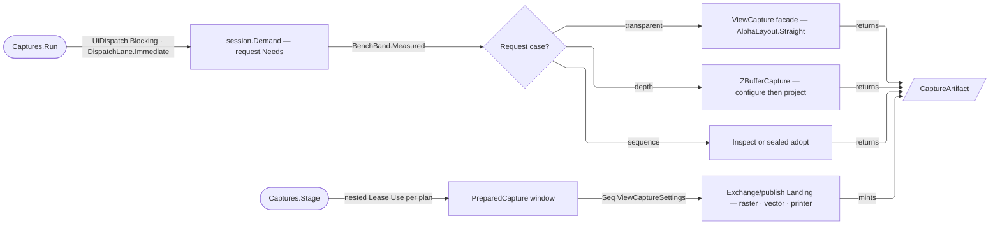

# [RASM_RHINO_CAPTURE]

Capture ownership (`Rasm.Rhino.Viewport`) prepares native `ViewCaptureSettings` batches, drives the transparent-raster, depth, and frame-sequence host facades, and converges every product on one `CaptureArtifact` family. The page is sink-FREE: preparation, measurement, and the artifact vocabulary live here, while raster, vector, and printer DELIVERY are cases of `Exchange/publish`'s `Landing` — an S4 owner this S3 page never names and never reaches upward for.

`ViewportFault` seats here as the sub-domain's refusal family, coded on the kernel `FaultBand.HostViewport` row; every generated owner across `Viewport/*` stamps `[ValidationError]`. Measurement stays a column on successful artifacts, while failures preserve their exact cause without a measured-fault wrapper.

Drawing STANDARDS are the kernel's whole: margins come from `SheetFrame`, model scale from `DrawingScale`, plotted magnitudes from `LineGroup`/`Terminator`/`TextHeight`, output resolution from `PlotResolution`, and the sun study's north bearing from `NorthPosture` over the model's own declination — this page authors no standards figure of its own.

## [01]-[INDEX]

- [02]-[FAULT]: `ViewportFault` — the sub-domain's one refusal family on the kernel band registry, and the folder law that seats it.
- [03]-[SPEC_AXES]: admitted extents, origins, resolution, subject, area, scale, media layout, and the `CaptureFeature` capability table with its per-surface rosters.
- [04]-[ARTIFACT_ROWS]: the transparent and depth request specifications, the depth projection/payload pair, and the one `CaptureArtifact` family with its coverage carriage.
- [05]-[FRAME_SEQUENCE]: document-custodied animation capture — sequence kinds, the `SunWindow` calendar family, output rows, the generated host transcription, and the sequence outcome.
- [06]-[RUN_PIPELINE]: sink-free plans, the modality union with its own demand and identity, the nested preparation bracket, and the one measured execution fold.

## [02]-[FAULT]

- Owner: `ViewportFault` is the direct host-boundary family on `FaultBand.HostViewport`; generated-value refusals cross the kernel validation bridge.
- Cases: `HostRefused` is the semantic viewport refusal; `KernelFault` owns generated admission and foreign host failures retain their original `Error`.
- Law: one fault family per kernel band row. `DraftFault` never codes viewport failures, and generated owners stamp only `[ValidationError]`.
- Law: the generated fault-case identity supplies the numeric code, while this root's total `Message` switch supplies presentation.
- Law: measurement decorates a successful artifact; failure preserves the original cause without minting a viewport wrapper.
- Law: no category or string identity is stored or wired; telemetry projects the numeric identity only for domain faults.
- Packages: `Domain/results` for `FaultBand` and the result carrier; Thinktecture.Runtime.Extensions for generated unions and values; `Modeling/solids` for `BenchEvidence`.
- Growth: a new refusal class is one case, one offset row, and one message row inside the band's span; the band's own span guard throws at type init when the span is spent.
- Boundary: `ViewportFault` is the Viewport family alone — Exchange, Render, Plugin, and Persistence each mint their own on their own band row, and the kernel `UiFault` stays the one UI refusal family.

```csharp
// --- [IMPORTS] -------------------------------------------------------------------------
using Rasm.Domain;
using Rasm.Rhino.Modeling;
using Thinktecture;

namespace Rasm.Rhino.Viewport;

// --- [ERRORS] --------------------------------------------------------------------------
[Union(ConversionFromValue = ConversionOperatorsGeneration.None)]
public abstract partial record ViewportFault : Fault {
    private static readonly FaultBand FamilyBand = FaultBand.HostViewport;
    private ViewportFault() { }

    [FaultCase(0)] public sealed partial record HostRefused(string Member, string Detail) : ViewportFault;

    public sealed override string Message => Switch(
        hostRefused: static fault => $"Viewport host member '{fault.Member}' refused '{fault.Key}': {fault.Detail}");
}
```

## [03]-[SPEC_AXES]

- Owner: `Size2i`, `Offset2i`, and `CaptureDpi` are the generated pixel-extent, pixel-origin, and resolution values; `CaptureAnchor` and `CaptureColor` mirror their host enums keyed on the host ordinal itself; `TargetReach` carries the two address regimes a capture admits; `CaptureSubject`, `CaptureArea`, `CaptureScale`, and `MediaLayout` close the request axes; `CaptureFeature` is the host toggle vocabulary as a kernel capability, `CaptureSurface` the three projection surfaces that read it, and `CaptureDecor` the settings-side decoration.
- Entry: `Size2i.Of` / `Offset2i.Of` / `CaptureDpi.Of` admit through the generated `Validate`; `CaptureDpi.Of(PlotResolution)` is the output-class arity, so no capture request spells a DPI literal. `CaptureSubject.View`/`Page`/`Preview` admit a scalar address through `TargetReach`; `MediaLayout.Viewport`/`Crop`/`Margins`/`Maximize` admit the media frame, and `Margins` takes either an authored `SheetMargin` or the `SheetSize` whose standard publishes one.
- Auto: a `CaptureSurface` row's ROSTER derives by filtering the feature table on that surface's own column, and its DEFAULT derives from a declared seed — so a new host toggle joins every surface it names by declaring that surface's column, and no per-surface roster is hand-kept beside the table it mirrors. The three `FrozenSet`-wrapping value objects the prior page carried, each with its own `All(column is not null)` roster guard, have no successor: `CaptureSurface.Depth.Roster` IS the former `Everything`, `CapabilitySet<CaptureFeature>.None` the former `Surfaces`, and the remaining named preset is the surface's own `Default`.
- Law: drawing figures are the kernel's. `MediaLayout.Margins(SheetSize, …)` reads `SheetFrame.For(size.Standard).Margin(size, key)` — the standard's own binding-and-edge quad, ISO 5457's 20 mm binding against 10 mm elsewhere included; `CaptureScale.ToValue` takes a reduced `DrawingScale` pair and lowers its `Ratio` at the one host member; `PrintFidelity.For(size, …)` derives the default print width from `LineGroup.For(size)`'s narrow rung, the arrowhead from `Terminator.Size(group.Wide)`, and the text-dot point size from `TextHeight.For(size)`. Five free doubles, four free margin doubles, and a free scale double all delete for rungs a standard publishes.
- Law: a unit regime crosses this page as the kernel `ModelUnit` and lowers `.System` only at the host member that takes a `UnitSystem`; `UnitSystem.CustomUnits` refuses at admission because a custom scale lives on `LengthUnit`, which no margin or offset member accepts.
- Law: a host `bool` never leaves its row. `OffsetOrigin`, `AspectPolicy`, and `PrintWidthPolicy` each carry a delegate column performing their own host write, so the two-row vocabulary IS the lowering and no consumer reads the flag; each names one INDEPENDENT host parameter with no legal-corner law between them, which is why they stay three rows rather than folding into a capability set.
- Law: absence at construction is unrepresentable, not guarded per use. `Size2i` and `CaptureDpi` refuse the default struct outright, `Offset2i` names its legal default `Origin` because a zero pixel origin is a real address, and the eleven `IsValid` re-probes the prior page carried against `default(T)` ghosts have no successor.
- Law: native `System.Drawing.Size` and `Rectangle` values mint only through the owners' own projections — `Size2i.Native` and `Offset2i.Window(Size2i)` — and an integer position never rides the extent type.

```csharp
// --- [IMPORTS] -------------------------------------------------------------------------
using Rasm.Domain;
using Rasm.Drawing;
using Rasm.Interaction;
using Rasm.Numerics;
using Rasm.Parametric;
using Rasm.Rhino.Document;
using Rasm.Rhino.HostUi;
using Rasm.Rhino.Modeling;
using System.Collections.Frozen;
using System.Globalization;
using System.Runtime.InteropServices;
using Thinktecture;
using UnitsNet.Units;

namespace Rasm.Rhino.Viewport;

// --- [TYPES] ---------------------------------------------------------------------------
[ComplexValueObject]
[ValidationError]
[StructLayout(LayoutKind.Auto)]
public readonly partial struct Size2i : IDisallowDefaultValue {
    public int Width { get; }
    public int Height { get; }

    static partial void ValidateFactoryArguments(ref ValidationError? validationError, ref int width, ref int height) =>
        validationError = ValidityClaim.All(width > 0, height > 0, (long)width * height <= int.MaxValue)
            ? validationError
            : new ValidationError(string.Join(" | ", new object?[] { nameof(Size2i), "positive pixel extents whose area fits an int" }));

    public static Fin<Size2i> Of(int width, int height) =>
        FactoryBridge.Accept<Size2i>(fault: Validate(width, height, out Size2i admitted), admitted: admitted);

    internal System.Drawing.Size Native => new(Width, Height);
}

[ComplexValueObject(AllowDefaultStructs = true, DefaultInstancePropertyName = "Origin")]
[ValidationError]
[StructLayout(LayoutKind.Auto)]
public readonly partial struct Offset2i {
    public int X { get; }
    public int Y { get; }

    static partial void ValidateFactoryArguments(ref ValidationError? validationError, ref int x, ref int y) =>
        validationError = ValidityClaim.All(x >= 0, y >= 0)
            ? validationError
            : new ValidationError(string.Join(" | ", new object?[] { nameof(Offset2i), "nonnegative pixel coordinates" }));

    public static Fin<Offset2i> Of(int x, int y) =>
        FactoryBridge.Accept<Offset2i>(fault: Validate(x, y, out Offset2i admitted), admitted: admitted);

    internal System.Drawing.Rectangle Window(Size2i extent) => new(X, Y, extent.Width, extent.Height);
}

[ValueObject<double>]
[ValidationError]
public readonly partial struct CaptureDpi : IDisallowDefaultValue {
    static partial void ValidateFactoryArguments(ref ValidationError? validationError, ref double value) =>
        validationError = ValidityClaim.All(ValidityClaim.Finite(value), value > 0.0)
            ? validationError
            : new ValidationError(string.Join(" | ", new object?[] { nameof(CaptureDpi), value, "a finite positive resolution" }));

    public static Fin<CaptureDpi> Of(double value) =>
        FactoryBridge.Accept<CaptureDpi>(candidate: value);

    public static Fin<CaptureDpi> Of(PlotResolution resolution) {
        return Admit.Need(value: resolution).Bind(row => Of(value: row.Dpi.Value));
    }
}

[SmartEnum<int>]
public sealed partial class CaptureAnchor {
    public static readonly CaptureAnchor LowerLeft = new(key: (int)ViewCaptureSettings.AnchorLocation.LowerLeft);
    public static readonly CaptureAnchor LowerRight = new(key: (int)ViewCaptureSettings.AnchorLocation.LowerRight);
    public static readonly CaptureAnchor UpperLeft = new(key: (int)ViewCaptureSettings.AnchorLocation.UpperLeft);
    public static readonly CaptureAnchor UpperRight = new(key: (int)ViewCaptureSettings.AnchorLocation.UpperRight);
    public static readonly CaptureAnchor Center = new(key: (int)ViewCaptureSettings.AnchorLocation.Center);

    internal ViewCaptureSettings.AnchorLocation Native => (ViewCaptureSettings.AnchorLocation)Key;
}

[SmartEnum<int>]
public sealed partial class CaptureColor {
    public static readonly CaptureColor Display = new(key: (int)ViewCaptureSettings.ColorMode.DisplayColor);
    public static readonly CaptureColor Print = new(key: (int)ViewCaptureSettings.ColorMode.PrintColor);
    public static readonly CaptureColor Monochrome = new(key: (int)ViewCaptureSettings.ColorMode.BlackAndWhite);

    internal ViewCaptureSettings.ColorMode Native => (ViewCaptureSettings.ColorMode)Key;
}

[SmartEnum<int>]
internal sealed partial class TargetReach {
    internal static readonly TargetReach Row = new(
        key: 0, admits: static target => target is not ViewportTarget.EveryCase);
    internal static readonly TargetReach View = new(
        key: 1, admits: static target => target is not ViewportTarget.EveryCase and not ViewportTarget.DetailCase);

    [UseDelegateFromConstructor]
    internal partial bool Admits(ViewportTarget target);

    internal Fin<ViewportTarget> Admit(ViewportTarget target) =>
        from held in Admit.Need(value: target)
        from _reach in guard(Admits(target: held), new KernelFault.InvalidInput())
        select held;
}

[Union(ConversionFromValue = ConversionOperatorsGeneration.None)]
public abstract partial record CaptureSubject {
    private CaptureSubject() { }

    internal sealed record ViewCase(ViewportTarget Target, Size2i Pixels, CaptureDpi Dpi) : CaptureSubject;
    internal sealed record PageCase(ViewportTarget Target, CaptureDpi Dpi) : CaptureSubject;
    internal sealed record PreviewCase(CaptureSubject Source, Size2i Pixels) : CaptureSubject;

    public static Fin<CaptureSubject> View(ViewportTarget target, Size2i pixels, CaptureDpi dpi) {
        return TargetReach.Row.Admit(target: target)
            .Map(valid => (CaptureSubject)new ViewCase(Target: valid, Pixels: pixels, Dpi: dpi));
    }

    public static Fin<CaptureSubject> Page(ViewportTarget target, CaptureDpi dpi) {
        return from valid in Admit.Need(value: target)
               from _page in guard(valid is ViewportTarget.PageCase, new KernelFault.InvalidInput())
               select (CaptureSubject)new PageCase(Target: valid, Dpi: dpi);
    }

    public static Fin<CaptureSubject> Preview(CaptureSubject source, Size2i pixels) {
        return from valid in Admit.Need(value: source)
               from _source in guard(valid is ViewCase or PageCase, new KernelFault.InvalidInput())
               select (CaptureSubject)new PreviewCase(Source: valid, Pixels: pixels);
    }

    internal ViewportTarget Address => Switch(
        viewCase: static view => view.Target,
        pageCase: static page => page.Target,
        previewCase: static preview => preview.Source.Address);

    internal Fin<Lease<ViewCaptureSettings>> Realize(ViewportRef row) => Switch(
        row,
        viewCase: static (ctx, view) => Lease<ViewCaptureSettings>.Acquire(
            mint: () => new ViewCaptureSettings(ctx.View, view.Pixels.Native, (double)view.Dpi)),
        pageCase: static (ctx, page) => Admit.Need(ctx.View as RhinoPageView).Bind(view =>
            Lease<ViewCaptureSettings>.Acquire(mint: () => new ViewCaptureSettings(view, (double)page.Dpi))),
        previewCase: static (ctx, preview) => preview.Source.Realize(row: ctx)
            .Bind(basis => basis.Use(
                body: held => Lease<ViewCaptureSettings>.Acquire(
                    mint: () => held.CreatePreviewSettings(preview.Pixels.Native)))));
}

[Union(ConversionFromValue = ConversionOperatorsGeneration.None)]
public abstract partial record CaptureArea {
    private CaptureArea() { }

    internal sealed record FullViewCase : CaptureArea;
    internal sealed record ExtentsCase : CaptureArea;
    internal sealed record ScreenWindowCase(Point2d A, Point2d B) : CaptureArea;
    internal sealed record WorldWindowCase(Point3d A, Point3d B) : CaptureArea;

    public static CaptureArea FullView { get; } = new FullViewCase();
    public static CaptureArea Extents { get; } = new ExtentsCase();

    public static Fin<CaptureArea> ScreenWindow(Point2d a, Point2d b) =>
        guard(ValidityClaim.All(a.IsValid, b.IsValid, a != b), new KernelFault.InvalidInput()).ToFin()
            .Map(_ => (CaptureArea)new ScreenWindowCase(A: a, B: b));

    public static Fin<CaptureArea> WorldWindow(Point3d a, Point3d b) =>
        guard(ValidityClaim.All(a.IsValid, b.IsValid, a != b), new KernelFault.InvalidInput()).ToFin()
            .Map(_ => (CaptureArea)new WorldWindowCase(A: a, B: b));

    internal Fin<Unit> Apply(ViewCaptureSettings settings) => Switch(
        settings,
        fullViewCase: static (ctx, _) => Try.lift(() => ctx.ViewArea = ViewCaptureSettings.ViewAreaMapping.View).Run().Bind(static inner => inner),
        extentsCase: static (ctx, _) => Try.lift(() => ctx.ViewArea = ViewCaptureSettings.ViewAreaMapping.Extents).Run().Bind(static inner => inner),
        screenWindowCase: static (ctx, area) => Try.lift(() => {
            ctx.ViewArea = ViewCaptureSettings.ViewAreaMapping.Window;
            ctx.SetWindowRect(screenPoint1: area.A, screenPoint2: area.B);
        }).Run().Bind(static inner => inner),
        worldWindowCase: static (ctx, area) => Try.lift(() => {
            ctx.ViewArea = ViewCaptureSettings.ViewAreaMapping.Window;
            ctx.SetWindowRect(worldPoint1: area.A, worldPoint2: area.B);
        }).Run().Bind(static inner => inner));
}

[Union(ConversionFromValue = ConversionOperatorsGeneration.None)]
public abstract partial record CaptureScale {
    private CaptureScale() { }

    internal sealed record NativeCase : CaptureScale;
    internal sealed record ToValueCase(DrawingScale Scale) : CaptureScale;
    internal sealed record ToFitCase : CaptureScale;

    public static CaptureScale Native { get; } = new NativeCase();
    public static CaptureScale ToFit { get; } = new ToFitCase();

    public static Fin<CaptureScale> ToValue(DrawingScale scale) =>
        Admit.Need(value: scale).Map(static admitted => (CaptureScale)new ToValueCase(Scale: admitted));

    internal Fin<Unit> Apply(ViewCaptureSettings settings) => Switch(
        settings,
        nativeCase: static (_, _) => Fin.Succ(value: unit),
        toValueCase: static (ctx, value) => Try.lift(() => ctx.SetModelScaleToValue(scale: value.Scale.Ratio)).Run().Bind(static inner => inner),
        toFitCase: static (ctx, _) => Try.lift(() => ctx.SetModelScaleToFit(promptOnChange: false)).Run().Bind(static inner => inner));
}

// --- [POLICIES] ------------------------------------------------------------------------
[SmartEnum<int>]
public sealed partial class OffsetOrigin {
    public static readonly OffsetOrigin Margin = new(key: 0, seat: static (settings, offset) =>
        HostEdge.Side(() => settings.SetOffset(lengthUnits: offset.Units.System, fromMargin: true, x: offset.X, y: offset.Y)));
    public static readonly OffsetOrigin Media = new(key: 1, seat: static (settings, offset) =>
        HostEdge.Side(() => settings.SetOffset(lengthUnits: offset.Units.System, fromMargin: false, x: offset.X, y: offset.Y)));

    [UseDelegateFromConstructor]
    internal partial Unit Seat(ViewCaptureSettings settings, CaptureOffset offset);
}

[SmartEnum<int>]
public sealed partial class AspectPolicy {
    public static readonly AspectPolicy MatchViewport = new(key: 0,
        apply: static (settings, key) => Try.lift(() => settings.MatchViewportAspectRatio()
            ? Fin.Succ(value: unit)
            : Fin.Fail<Unit>(new ViewportFault.HostRefused(Member: nameof(ViewCaptureSettings.MatchViewportAspectRatio), Detail: "answered false"))).Run().Bind(static inner => inner));
    public static readonly AspectPolicy PreserveMedia = new(key: 1,
        apply: static (_, _) => Fin.Succ(value: unit));

    [UseDelegateFromConstructor]
    internal partial Fin<Unit> Apply(ViewCaptureSettings settings);
}

[SmartEnum<int>]
public sealed partial class PrintWidthPolicy {
    public static readonly PrintWidthPolicy Model = new(key: 0, seat: static settings => HostEdge.Side(() => settings.UsePrintWidths = true));
    public static readonly PrintWidthPolicy Screen = new(key: 1, seat: static settings => HostEdge.Side(() => settings.UsePrintWidths = false));

    [UseDelegateFromConstructor]
    internal partial Unit Seat(ViewCaptureSettings settings);
}

// --- [MODELS] --------------------------------------------------------------------------
[ComplexValueObject]
[ValidationError]
public sealed partial class CaptureCrop {
    public Size2i Media { get; }
    public Offset2i Origin { get; }
    public Size2i Extent { get; }

    static partial void ValidateFactoryArguments(
        ref ValidationError? validationError,
        ref Size2i media,
        ref Offset2i origin,
        ref Size2i extent) =>
        validationError = ValidityClaim.All(
            (long)origin.X + extent.Width <= media.Width,
            (long)origin.Y + extent.Height <= media.Height)
            ? validationError
            : new ValidationError(string.Join(" | ", new object?[] { nameof(CaptureCrop), "a crop window inside the media extent" }));

    public static Fin<CaptureCrop> Of(Size2i media, Offset2i origin, Size2i extent) =>
        FactoryBridge.Accept<CaptureCrop>(fault: Validate(media, origin, extent, out CaptureCrop? admitted), admitted: admitted);
}

[ComplexValueObject]
[ValidationError]
public sealed partial class CaptureOffset {
    public ModelUnit Units { get; }
    public OffsetOrigin Origin { get; }
    public double X { get; }
    public double Y { get; }

    static partial void ValidateFactoryArguments(
        ref ValidationError? validationError,
        ref ModelUnit units,
        ref OffsetOrigin origin,
        ref double x,
        ref double y) =>
        validationError = ValidityClaim.All(
            units is { System: not UnitSystem.CustomUnits },
            ValidityClaim.Finite([x, y]), x >= 0.0, y >= 0.0)
            ? validationError
            : new ValidationError(string.Join(" | ", new object?[] {
                nameof(CaptureOffset), "a non-custom unit regime and finite nonnegative offsets" }));

    public static Fin<CaptureOffset> Of(ModelUnit units, OffsetOrigin origin, double x, double y) =>
        FactoryBridge.Accept<CaptureOffset>(fault: Validate(units, origin, x, y, out CaptureOffset? admitted), admitted: admitted);
}

[ComplexValueObject]
[ValidationError]
public sealed partial class CaptureBanner {
    public string Header { get; }
    public string Footer { get; }

    static partial void ValidateFactoryArguments(
        ref ValidationError? validationError,
        ref string header,
        ref string footer) {
        header = header?.Trim() ?? string.Empty;
        footer = footer?.Trim() ?? string.Empty;
        validationError = header.Length > 0 || footer.Length > 0
            ? validationError
            : new ValidationError(string.Join(" | ", new object?[] { nameof(CaptureBanner) }));
    }

    public static Fin<CaptureBanner> Of(string header, string footer) =>
        FactoryBridge.Accept<CaptureBanner>(fault: Validate(header, footer, out CaptureBanner? admitted), admitted: admitted);
}

[ComplexValueObject]
public sealed partial class PrintFidelity {
    public PrintWidthPolicy Widths { get; }
    public LineGroup Group { get; }
    public Terminator Arrowhead { get; }
    public TextHeight Dot { get; }
    public LineWidth Point { get; }
    public PositiveMagnitude WireScale { get; }

    public static Fin<PrintFidelity> For(
        SheetSize size,
        PrintWidthPolicy widths,
        Option<Terminator> arrowhead = default,
        Option<PositiveMagnitude> wireScale = default) {
        return from admittedWidths in Admit.Need(value: widths)
               from group in LineGroup.For(size: size)
               from dot in TextHeight.For(size: size)
               from scale in wireScale.Match(Some: Fin.Succ, None: () => FactoryBridge.Accept<PositiveMagnitude>(candidate: 1.0))
               select Create(
                   widths: admittedWidths,
                   group: group,
                   arrowhead: arrowhead.IfNone(Terminator.ClosedArrow),
                   dot: dot,
                   point: group.Wide,
                   wireScale: scale);
    }

    internal Unit Seat(ViewCaptureSettings settings) {
        _ = Widths.Seat(settings: settings);
        settings.WireThicknessScale = (double)WireScale;
        settings.PointSizeMillimeters = Point.Width.Millimeters;
        settings.ArrowheadSizeMillimeters = Arrowhead.Size(width: Group.Wide).Millimeters;
        settings.TextDotPointSize = Dot.Height.As(LengthUnit.DtpPoint);
        settings.DefaultPrintWidthMillimeters = Group.Narrow.Width.Millimeters;
        return unit;
    }
}

[ComplexValueObject]
public sealed partial class MediaPlacement {
    public static MediaPlacement Default { get; } = Create(
        offset: None,
        anchor: None,
        aspect: AspectPolicy.MatchViewport);

    public Option<CaptureOffset> Offset { get; }
    public Option<CaptureAnchor> Anchor { get; }
    public AspectPolicy Aspect { get; }

    internal Fin<Unit> Apply(ViewCaptureSettings settings) => Try.lift(() => {
        MediaPlacement self = this;
        _ = self.Offset.Iter(offset => offset.Origin.Seat(settings: settings, offset: offset));
        _ = self.Anchor.Iter(anchor => settings.OffsetAnchor = anchor.Native);
        return self.Aspect.Apply(settings: settings);
    }).Run().Bind(static inner => inner);
}

[Union(ConversionFromValue = ConversionOperatorsGeneration.None)]
public abstract partial record MediaLayout {
    private MediaLayout() { }
    internal sealed record ViewportCase(MediaPlacement Placement) : MediaLayout;
    internal sealed record CropCase(CaptureCrop Crop, MediaPlacement Placement) : MediaLayout;
    internal sealed record MarginsCase(SheetMargin Margins, ModelUnit Units, MediaPlacement Placement) : MediaLayout;
    internal sealed record MaximizeCase(MediaPlacement Placement) : MediaLayout;

    public static MediaLayout Default { get; } = new ViewportCase(Placement: MediaPlacement.Default);

    public static Fin<MediaLayout> Viewport(Option<MediaPlacement> placement = default) =>
        Placed(placement: placement)
            .Map(static admitted => (MediaLayout)new ViewportCase(Placement: admitted));

    public static Fin<MediaLayout> Crop(CaptureCrop crop, Option<MediaPlacement> placement = default) {
        return from admittedCrop in Admit.Need(value: crop)
               from admittedPlacement in Placed(placement: placement)
               select (MediaLayout)new CropCase(Crop: admittedCrop, Placement: admittedPlacement);
    }

    public static Fin<MediaLayout> Margins(SheetMargin margins, ModelUnit units, Option<MediaPlacement> placement = default) {
        return from admittedMargins in Admit.Need(value: margins)
               from admittedUnits in Admit.Need(value: units)
               from admittedPlacement in Placed(placement: placement)
               select (MediaLayout)new MarginsCase(Margins: admittedMargins, Units: admittedUnits, Placement: admittedPlacement);
    }

    public static Fin<MediaLayout> Margins(SheetSize size, ModelUnit units, Option<MediaPlacement> placement = default) {
        return from admittedSize in Admit.Need(value: size)
               from frame in SheetFrame.For(standard: admittedSize.Standard).Margin(size: admittedSize)
               from layout in Margins(margins: frame, units: units, placement: placement)
               select layout;
    }

    public static Fin<MediaLayout> Maximize(Option<MediaPlacement> placement = default) =>
        Placed(placement: placement)
            .Map(static admitted => (MediaLayout)new MaximizeCase(Placement: admitted));

    internal Fin<Unit> Apply(ViewCaptureSettings settings) => Switch(
        settings,
        viewportCase: static (ctx, layout) => layout.Placement.Apply(settings: ctx),
        cropCase: static (ctx, layout) => Try.lift(() => {
            ctx.SetLayout(mediaSize: layout.Crop.Media.Native, cropRectangle: layout.Crop.Origin.Window(extent: layout.Crop.Extent));
            return layout.Placement.Apply(settings: ctx);
        }).Run().Bind(static inner => inner),
        marginsCase: static (ctx, layout) =>
            from inset in layout.Margins.In(unit: layout.Units)
            from _seated in Try.lift(() => ctx.SetMargins(
                    lengthUnits: layout.Units.System,
                    left: inset.Left,
                    top: inset.Top,
                    right: inset.Right,
                    bottom: inset.Bottom)
                ? Fin.Succ(value: unit)
                : Fin.Fail<Unit>(new ViewportFault.HostRefused(Member: nameof(ViewCaptureSettings.SetMargins), Detail: "answered false"))).Run().Bind(static inner => inner)
            from placed in layout.Placement.Apply(settings: ctx)
            select placed,
        maximizeCase: static (ctx, layout) => Try.lift(() => {
            ctx.MaximizePrintableArea();
            return layout.Placement.Apply(settings: ctx);
        }).Run().Bind(static inner => inner));

    private static Fin<MediaPlacement> Placed(Option<MediaPlacement> placement) =>
        Admit.Need(value: placement.IfNone(MediaPlacement.Default));
}

// --- [CAPABILITY] ----------------------------------------------------------------------
[SmartEnum<string>]
[KeyMemberEqualityComparer<ComparerAccessors.StringOrdinal, string>]
public sealed partial class CaptureFeature : ICapability<CaptureFeature> {
    public static readonly CaptureFeature Grid = Row(key: "grid",
        settings: static (target, on) => target.DrawGrid = on,
        transparent: static (target, on) => target.DrawGrid = on);
    public static readonly CaptureFeature Axes = Row(key: "axes",
        settings: static (target, on) => target.DrawAxis = on,
        transparent: static (target, on) => target.DrawAxes = on);
    public static readonly CaptureFeature Raster = Row(key: "raster",
        settings: static (target, on) => target.RasterMode = on);
    public static readonly CaptureFeature Background = Row(key: "background",
        settings: static (target, on) => target.DrawBackground = on);
    public static readonly CaptureFeature BackgroundBitmap = Row(key: "background-bitmap",
        settings: static (target, on) => target.DrawBackgroundBitmap = on);
    public static readonly CaptureFeature Wallpaper = Row(key: "wallpaper",
        settings: static (target, on) => target.DrawWallpaper = on);
    public static readonly CaptureFeature LockedObjects = Row(key: "locked",
        settings: static (target, on) => target.DrawLockedObjects = on);
    public static readonly CaptureFeature SelectedOnly = Row(key: "selected-only",
        settings: static (target, on) => target.DrawSelectedObjectsOnly = on);
    public static readonly CaptureFeature ClippingPlanes = Row(key: "clipping",
        settings: static (target, on) => target.DrawClippingPlanes = on);
    public static readonly CaptureFeature Lights = Row(key: "lights",
        settings: static (target, on) => target.DrawLights = on,
        depth: static (target, on) => target.ShowLights(on: on));
    public static readonly CaptureFeature MarginLines = Row(key: "margins",
        settings: static (target, on) => target.DrawMargins = on);
    public static readonly CaptureFeature GridAxes = Row(key: "grid-axes",
        transparent: static (target, on) => target.DrawGridAxes = on);
    public static readonly CaptureFeature ScaleScreenItems = Row(key: "scale-screen-items",
        transparent: static (target, on) => target.ScaleScreenItems = on);
    public static readonly CaptureFeature Isocurves = Row(key: "isocurves",
        depth: static (target, on) => target.ShowIsocurves(on: on));
    public static readonly CaptureFeature MeshWires = Row(key: "mesh-wires",
        depth: static (target, on) => target.ShowMeshWires(on: on));
    public static readonly CaptureFeature Curves = Row(key: "curves",
        depth: static (target, on) => target.ShowCurves(on: on));
    public static readonly CaptureFeature Points = Row(key: "points",
        depth: static (target, on) => target.ShowPoints(on: on));
    public static readonly CaptureFeature Text = Row(key: "text",
        depth: static (target, on) => target.ShowText(on: on));
    public static readonly CaptureFeature Annotations = Row(key: "annotations",
        depth: static (target, on) => target.ShowAnnotations(on: on));

    internal Option<Action<ViewCaptureSettings, bool>> Settings { get; }
    internal Option<Action<ViewCapture, bool>> Transparent { get; }
    internal Option<Action<ZBufferCapture, bool>> Depth { get; }

    internal static Unit Apply<TTarget>(
        TTarget target,
        Func<CaptureFeature, Option<Action<TTarget, bool>>> column,
        CapabilitySet<CaptureFeature> held) =>
        toSeq(Items).Iter(feature => column(feature).Iter(write => write(target, held.Admits(capability: feature))));

    private static CaptureFeature Row(
        string key,
        Action<ViewCaptureSettings, bool>? settings = null,
        Action<ViewCapture, bool>? transparent = null,
        Action<ZBufferCapture, bool>? depth = null) =>
        new(settings: Optional(settings), transparent: Optional(transparent), depth: Optional(depth));
}

[SmartEnum<int>]
public sealed partial class CaptureSurface {
    public static readonly CaptureSurface Settings = new(
        key: 0,
        holds: static feature => feature.Settings.IsSome,
        seed: static () => Seq(CaptureFeature.Background, CaptureFeature.LockedObjects, CaptureFeature.ClippingPlanes, CaptureFeature.Lights));
    public static readonly CaptureSurface Transparent = new(
        key: 1,
        holds: static feature => feature.Transparent.IsSome,
        seed: static () => Seq(CaptureFeature.ScaleScreenItems));
    public static readonly CaptureSurface Depth = new(
        key: 2,
        holds: static feature => feature.Depth.IsSome,
        seed: static () => Seq(CaptureFeature.Isocurves, CaptureFeature.MeshWires, CaptureFeature.Curves, CaptureFeature.Points));

    [UseDelegateFromConstructor]
    internal partial bool Holds(CaptureFeature feature);

    [UseDelegateFromConstructor]
    internal partial Seq<CaptureFeature> Seed();

    public CapabilitySet<CaptureFeature> Roster => Rosters.Value[this].Roster;
    public CapabilitySet<CaptureFeature> Default => Rosters.Value[this].Default;

    private static readonly Lazy<FrozenDictionary<CaptureSurface, (CapabilitySet<CaptureFeature> Roster, CapabilitySet<CaptureFeature> Default)>> Rosters =
        new(static () => Items.ToFrozenDictionary(
            static row => row,
            static row => (
                Roster: CapabilitySet<CaptureFeature>.Of(toSeq(CaptureFeature.Items).Filter(row.Holds).ToArray()),
                Default: CapabilitySet<CaptureFeature>.Of(row.Seed().ToArray()))));

    internal Fin<CapabilitySet<CaptureFeature>> Admit(Option<CapabilitySet<CaptureFeature>> held) {
        CapabilitySet<CaptureFeature> requested = held.IfNone(Default);
        return Roster
            .Require(demanded: requested, refuse: missing => new KernelFault.InvalidValue(nameof(CaptureSurface), string.Join(" | ", new object?[] { key, $"capture features this surface projects; unprojected <{missing.Wire}>" })))
            .Map(_ => requested);
    }
}

[ComplexValueObject]
public sealed partial class CaptureDecor {
    public static CaptureDecor Plain { get; } = Create(
        features: CaptureSurface.Settings.Default,
        outputColor: CaptureColor.Display,
        banner: None,
        fidelity: None);

    public CapabilitySet<CaptureFeature> Features { get; }
    public CaptureColor OutputColor { get; }
    public Option<CaptureBanner> Banner { get; }
    public Option<PrintFidelity> Fidelity { get; }

    public static Fin<CaptureDecor> Of(
        Option<CapabilitySet<CaptureFeature>> features = default,
        Option<CaptureColor> outputColor = default,
        Option<CaptureBanner> banner = default,
        Option<PrintFidelity> fidelity = default) {
        return CaptureSurface.Settings.Admit(held: features).Map(held => Create(
            features: held,
            outputColor: outputColor.IfNone(CaptureColor.Display),
            banner: banner,
            fidelity: fidelity));
    }

    internal Fin<Unit> Apply(ViewCaptureSettings settings) => Try.lift(() => {
        CaptureDecor self = this;
        settings.OutputColor = self.OutputColor.Native;
        _ = CaptureFeature.Apply(target: settings, column: static row => row.Settings, held: self.Features);
        _ = self.Banner.Iter(banner => {
            settings.HeaderText = banner.Header;
            settings.FooterText = banner.Footer;
        });
        _ = self.Fidelity.Iter(row => row.Seat(settings: settings));
        return Fin.Succ(value: unit);
    }).Run().Bind(static inner => inner);
}
```

- Packages: Thinktecture.Runtime.Extensions (`[SmartEnum]`, `[Union]`, `[ValueObject]`, `[ComplexValueObject]`, `[ValidationError]`, `[UseDelegateFromConstructor]`, `IDisallowDefaultValue`); LanguageExt.Core (`Fin`, `Option`, `Seq`, `guard`); UnitsNet (`Length.As(LengthUnit)`, `LengthUnit.DtpPoint`, `Length.Millimeters`); `Rasm/Drawing/sheet` (`SheetSize`, `SheetMargin`, `SheetFrame`, `DrawingScale`, `LineGroup`, `LineWidth`, `Terminator`, `TextHeight`, `PlotResolution`); `Rasm/Domain/validation` (`ICapability`, `CapabilitySet`, `Require`); `Rasm/Domain/results` (`Lease<T>`, `ValidityClaim`, `FaultBand`); `Rasm.Rhino/.api/api-rhinocommon-display.md` (`ViewCaptureSettings`, `ViewCapture`, `ZBufferCapture`); `Rasm.Rhino/.api/api-rhinocommon-document.md` (`AnimationProperties`).
- Growth: a new host toggle is one `CaptureFeature` row declaring the surfaces it writes; a new projection surface is one `CaptureSurface` row and one `Apply` column argument; a new media frame is one `MediaLayout` case.

## [04]-[ARTIFACT_ROWS]

- Owner: `TransparentCaptureSpec` and `DepthCaptureSpec` are the two facade requests this page drives; `DepthProjection` is the depth REQUEST vocabulary and `DepthPayload` the RESULT it produces, one shape per side of the same three questions; `DepthField` joins the payload to the buffer census; `CaptureArtifact` is the one result family, and `RunOutcome` its neutral shell projection.
- Entry: `TransparentCaptureSpec.Of` and `DepthCaptureSpec.Of` admit their address through `TargetReach` and their feature set through `CaptureSurface`; `CaptureArtifact.Raster(mint, extent, coverage, key)` takes custody of a host raster at the moment it is minted.
- Law: the depth PROJECTION and the depth PAYLOAD are two vocabularies over three questions, not one declared twice — `DepthProjection.SamplesCase` carries the pixels a caller asked about and `DepthPayload.SamplesCase` the samples the buffer answered. Each site names which side it is on: one family carries a request column absent from every result beside a result column absent from every request, so the two vocabularies stay two.
- Law: depth configuration precedes projection — `SetDisplayMode` and every `Show*` write invalidate the native grayscale cache, so the depth pipeline applies mode and channels once, then projects. `MinZ`/`MaxZ`/`ZValueAt` return `float` host precision carried unwidened; `WorldPointAt` is the per-pixel screen-to-world unprojection a single-distance camera read cannot answer; `GrayscaleDib` returns the capture-cached bitmap, which SURVIVES capsule disposal, so the grayscale row is its ONE caller and hands it straight into a lease — a sampling arm reaching it for pixel bounds pays a full grayscale render and leaks that bitmap, so sample bounds read the bound viewport's own `Size` instead.
- Law: a raster leaves under kernel custody with its coverage carriage DECLARED. `RasterCase` carries `Lease<System.Drawing.Bitmap>` and the `AlphaLayout` its request implies — `Straight` where the transparent facade was asked for an alpha background, `Opaque` where the settings pipeline draws none, because transparency exists only on the instance facade — so a consumer reads pixels through `PixelLease`'s GDI arities against a carriage it was handed rather than one it guessed. The `owned = null` try/finally the prior page spelled at two sites has no successor: the extent is the REQUEST's own, so nothing between acquisition and construction can fail.
- Law: vector egress is exactly the formats the host writes — `ViewCaptureWriter` is not a delivery row, on the catalogued unreachability (`api-rhinocommon-runtime.md` `[ENTRYPOINT_SCOPE]`): its one drive entry is `Draw(nint constPtrPrintInfo, RhinoDoc)`, `ViewCaptureSettings.ConstPointer()` is `internal`, and no public `ViewCapture` member accepts a writer, so a subclass compiles and never receives a frame. The refusal is host-shaped, not permanent, and the catalog row is where a bundle publishing a public frame source surfaces.
- Boundary: DELIVERY is not here. `Exchange/publish` owns the `Landing` union whose raster, vector, and printer arms consume `Captures.Stage`'s prepared batch and mint the matching `CaptureArtifact` cases; this page publishes the sink-free preparation and the artifact vocabulary, so Viewport (S3) never names Exchange (S4) and the forbidden upward edge cannot exist.
- Boundary: `CaptureArtifact.Summary` is the neutral run projection the shell's completion-notice row consumes; the artifact family itself never reaches a notification surface, because every announce operand beyond the outcome — the localized label, the observer that receives the reply, the timeline that stamps it — belongs to the caller, and a scripted or bridge-run capture must reach no notification surface at all.

```csharp
// --- [TYPES] ---------------------------------------------------------------------------
public readonly record struct DepthSample(Offset2i Pixel, float Z, Point3d World);

public readonly record struct DepthRange(float MinZ, float MaxZ);

[Union(ConversionFromValue = ConversionOperatorsGeneration.None)]
public abstract partial record DepthPayload {
    private DepthPayload() { }
    public sealed record StatsCase : DepthPayload;
    public sealed record SamplesCase(Seq<DepthSample> Rows) : DepthPayload;
    public sealed record GrayscaleCase(Lease<System.Drawing.Bitmap> Pixels) : DepthPayload;
}

[Union(ConversionFromValue = ConversionOperatorsGeneration.None)]
public abstract partial record DepthProjection {
    private DepthProjection() { }

    internal sealed record StatsCase : DepthProjection;
    internal sealed record SamplesCase(Seq<Offset2i> Pixels) : DepthProjection;
    internal sealed record GrayscaleCase : DepthProjection;

    public static DepthProjection Stats { get; } = new StatsCase();
    public static DepthProjection Grayscale { get; } = new GrayscaleCase();

    public static Fin<DepthProjection> Samples(ReadOnlySpan<Offset2i> pixels) =>
        guard(pixels.Length > 0, new KernelFault.InvalidInput()).ToFin()
            .Map(_ => (DepthProjection)new SamplesCase(Pixels: toSeq(pixels.ToArray()).Strict()));

    internal Fin<DepthPayload> Project(ZBufferCapture capture, Size2i extent) => Switch(
        (Capture: capture, Extent: extent),
        statsCase: static (_, _) => Fin.Succ(value: (DepthPayload)new DepthPayload.StatsCase()),
        samplesCase: static (ctx, projection) => projection.Pixels
            .TraverseM(pixel => guard(pixel.X < ctx.Extent.Width && pixel.Y < ctx.Extent.Height, new KernelFault.InvalidInput())
                .ToFin()
                .Bind(_ => Try.lift(() => Fin.Succ(new DepthSample(
                    Pixel: pixel,
                    Z: ctx.Capture.ZValueAt(x: pixel.X, y: pixel.Y),
                    World: ctx.Capture.WorldPointAt(x: pixel.X, y: pixel.Y)))).Run().Bind(static inner => inner)))
            .As()
            .Map(static rows => (DepthPayload)new DepthPayload.SamplesCase(Rows: rows.Strict())),
        grayscaleCase: static (ctx, _) => Try.lift(() => Optional(ctx.Capture.GrayscaleDib()).ToFin(Fail: new ViewportFault.HostRefused(Member: nameof(ZBufferCapture.GrayscaleDib), Detail: "returned no bitmap"))).Run().Bind(static inner => inner)
            .Bind(bitmap => Lease<System.Drawing.Bitmap>.Acquire(mint: () => bitmap))
            .Map(static pixels => (DepthPayload)new DepthPayload.GrayscaleCase(Pixels: pixels)));
}

// --- [MODELS] --------------------------------------------------------------------------
public sealed record DepthField(int Hits, Option<DepthRange> Range, DepthPayload Payload);

[Union(ConversionFromValue = ConversionOperatorsGeneration.None)]
public abstract partial record CaptureArtifact : IDetachedDocumentResult {
    private CaptureArtifact() { }

    public Option<BenchEvidence> Bench { get; init; }

    public sealed record RasterCase(Lease<System.Drawing.Bitmap> Pixels, Size2i Extent, AlphaLayout Coverage) : CaptureArtifact;
    public sealed record VectorCase(System.Xml.XmlDocument Svg) : CaptureArtifact;
    public sealed record PrintedCase(Rasm.Numerics.Dimension Pages) : CaptureArtifact;
    public sealed record DepthCase(DepthField Field) : CaptureArtifact;
    public sealed record SequenceCase(SequenceOutcome Outcome) : CaptureArtifact;

    internal static Fin<CaptureArtifact> Raster(Func<System.Drawing.Bitmap> mint, Size2i extent, AlphaLayout coverage) =>
        Lease<System.Drawing.Bitmap>.Acquire(mint: mint)
            .Map(pixels => (CaptureArtifact)new RasterCase(Pixels: pixels, Extent: extent, Coverage: coverage));

    public RunOutcome Summary(HostText label) => Switch(
        state: label,
        rasterCase: static (text, row) => (RunOutcome)new RunOutcome.Completed(Label: text, Scale: Scale(nameof(RasterCase.Extent), $"{row.Extent.Width}x{row.Extent.Height}")),
        vectorCase: static (text, _) => new RunOutcome.Completed(Label: text, Scale: FrozenDictionary<string, string>.Empty),
        printedCase: static (text, row) => new RunOutcome.Completed(Label: text, Scale: Scale(nameof(PrintedCase.Pages), row.Pages.Value.ToString(CultureInfo.InvariantCulture))),
        depthCase: static (text, row) => new RunOutcome.Completed(Label: text, Scale: Scale(nameof(DepthField.Hits), row.Field.Hits.ToString(CultureInfo.InvariantCulture))),
        sequenceCase: static (text, row) => new RunOutcome.Completed(Label: text, Scale: Scale(nameof(SequenceOutcome), row.Outcome.Echo.HtmlFileName)));

    private static FrozenDictionary<string, string> Scale(string field, string value) =>
        new Dictionary<string, string>(StringComparer.Ordinal) { [field] = value }.ToFrozenDictionary(StringComparer.Ordinal);
}

public sealed record TransparentCaptureSpec(
    ViewportTarget Target,
    Size2i Extent,
    CapabilitySet<CaptureFeature> Features,
    Option<Rasm.Numerics.Dimension> RealtimePasses) {

    public static Fin<TransparentCaptureSpec> Of(
        ViewportTarget target,
        Size2i extent,
        Option<CapabilitySet<CaptureFeature>> features = default,
        Option<Rasm.Numerics.Dimension> realtimePasses = default) {
        return from address in TargetReach.View.Admit(target: target)
               from held in CaptureSurface.Transparent.Admit(held: features)
               from _passes in guard(realtimePasses.ForAll(static passes => passes.Value >= 1), new KernelFault.InvalidInput())
               select new TransparentCaptureSpec(
                   Target: address,
                   Extent: extent,
                   Features: held,
                   RealtimePasses: realtimePasses);
    }

    internal ViewCapture Facade() {
        ViewCapture facade = new() { Width = Extent.Width, Height = Extent.Height, TransparentBackground = true };
        _ = CaptureFeature.Apply(target: facade, column: static row => row.Transparent, held: Features);
        _ = RealtimePasses.Iter(passes => facade.RealtimeRenderPasses = passes.Value);
        return facade;
    }
}

public sealed record DepthCaptureSpec(
    ViewportTarget Target,
    Option<ResourceId> Mode,
    CapabilitySet<CaptureFeature> Channels,
    DepthProjection Projection) {

    public static Fin<DepthCaptureSpec> Of(
        ViewportTarget target,
        Option<Guid> mode = default,
        Option<CapabilitySet<CaptureFeature>> channels = default,
        Option<DepthProjection> projection = default) {
        return from address in TargetReach.Row.Admit(target: target)
               from held in CaptureSurface.Depth.Admit(held: channels)
               select new DepthCaptureSpec(
                   Target: address,
                   Mode: mode.Bind(ResourceId.Maybe),
                   Channels: held,
                   Projection: projection.IfNone(DepthProjection.Stats));
    }
}
```

- Packages: `Rasm/Domain/results` (`Lease<T>`); `Rasm/Interaction/paint` (`AlphaLayout`, `PixelLease` GDI arities); `Rasm/Numerics` (`Dimension`); `Rasm.Rhino/HostUi/shell` (`RunOutcome`, `HostText`); `Rasm.Rhino/Modeling/solids` (`BenchEvidence`); BCL `System.Xml` (`XmlDocument`), `System.Drawing` (`Bitmap`).
- Growth: a new artifact modality is one `CaptureArtifact` case with every `Summary` arm loudly broken; a new depth question is one `DepthProjection` case and one `DepthPayload` case landing together.

## [05]-[FRAME_SEQUENCE]

- Owner: `SequenceKind` closes the four motion cases — turntable, dual-track path, single-track flythrough, and a sun study over one `SunWindow`; `SequenceTrack` carries a track as a path-curve id or an admitted point row set, written through the `TrackSlot` setter columns so camera and target share one dispatch; `SunPlace` composes the kernel `SolarSite` with the bearing a `NorthPosture` row answers; `SunWindow` closes the two calendar windows; `SequenceOutput`, `SequenceFidelity`, and `FrameSequenceSpec` carry the output and fidelity axes; `SequenceOutcome` is the host read-back; `SequenceMap` is the generated host transcription.
- Entry: `CaptureRequest.Sequence(SequenceOp)` enters `Captures.Run`, so sequence custody and sequence evidence share the capture dispatch and return `CaptureArtifact.SequenceCase`.
- Auto: the name-mirrored halves of the host write are GENERATED. `SequenceMap` transcribes `SequenceOutput`, `SequenceFidelity`, and the twelve-column read-back through Mapperly under `RequiredMappingStrategy.Source`, so a new column with no host slot is a build break rather than a silently dropped field. What stays hand-written is what no name correspondence expresses: the `TrackSlot` slot dispatch, and the calendar DECOMPOSITION of one `LocalDate`/`LocalTime` pair into twelve host integer members.
- Law: geodetic site and compass bearing are the kernel's. `SunPlace` carries `SolarSite` — latitude, longitude, NodaTime `Offset` fixed standard offset, and elevation, all admitted at their published bands — beside the `NorthPosture` row and the model's own declination, so the bearing DERIVES rather than riding a free `northAngle` double. NAMED GAIN: standard offset and elevation become required, which is what exposed that the host animation solves sun angles carrying no offset at all.
- Law: the sun window carries NodaTime shapes because `AnimationProperties`'s Start/End slots are a zone-free WALL CLOCK — `LocalDate`, `LocalTime`, `Duration`, and `Period` are the carriers that spelling names, and a `DateTimeOffset` here attaches an offset the host does not store. NAMED LOSS: `SequenceKind.DaySun` and `Season` stop being separately nameable cases; bought back because the WINDOW case is the name, both arms write the same Start/End slots, and the window's own `CaptureType` column answers which host study runs.
- Law: `RhinoDoc.AnimationProperties` GET mints a detached native copy and SET commits it — in-place mutation without the set-back is inert. Adopt is one copy-edit-commit inside the shared undo bracket: the fresh copy preserves every member the spec leaves unstated, the spec writes land, the property set commits, and `SequenceOutcome.Echo` re-reads committed state.
- Law: the spec configures and the host animation tools record — `Images`, `Dates`, and `CurrentFrame` are host-written columns read back on `SequenceEcho`, never spec inputs. A day study spaces frames by `MinutesBetweenFrames` and a seasonal study by `DaysBetweenFrames`; each window writes only its own spacing member.
- Law: `SequenceOutput` admits extension, animation name, and HTML name as canonical filename components through an ACCUMULATING `Validation`, so a caller with three broken components learns all three; separators, special dot components, platform-invalid characters, and trailing dots or spaces never reach native output metadata.

```csharp
// --- [IMPORTS] -------------------------------------------------------------------------
using NodaTime;
using Rasm.Domain;
using Rasm.Drawing;
using Rasm.Numerics;
using Rasm.Rhino.Document;
using Riok.Mapperly.Abstractions;
using Thinktecture;

namespace Rasm.Rhino.Viewport;

// --- [TYPES] ---------------------------------------------------------------------------
[SmartEnum<int>]
internal sealed partial class TrackSlot {
    internal static readonly TrackSlot Camera = new(
        key: 0,
        curve: static (native, id) => { native.CameraPathId = id; return unit; },
        points: static (native, points) => { native.CameraPoints = points; return unit; });
    internal static readonly TrackSlot Target = new(
        key: 1,
        curve: static (native, id) => { native.TargetPathId = id; return unit; },
        points: static (native, points) => { native.TargetPoints = points; return unit; });

    [UseDelegateFromConstructor]
    internal partial Unit Curve(AnimationProperties native, Guid id);

    [UseDelegateFromConstructor]
    internal partial Unit Points(AnimationProperties native, Point3d[] points);
}

[Union(ConversionFromValue = ConversionOperatorsGeneration.None)]
public abstract partial record SequenceTrack {
    private SequenceTrack() { }

    internal sealed record CurveCase(ResourceId PathId) : SequenceTrack;
    internal sealed record PointsCase(Seq<Point3d> Rows) : SequenceTrack;

    public static Fin<SequenceTrack> Curve(Guid pathId) {
        return ResourceId.Admit(value: pathId).Map(static id => (SequenceTrack)new CurveCase(PathId: id));
    }

    public static Fin<SequenceTrack> Points(ReadOnlySpan<Point3d> points) {
        Seq<Point3d> rows = toSeq(points.ToArray()).Strict();
        return guard(rows.Count >= 2 && rows.ForAll(static point => point.IsValid), new KernelFault.InvalidInput()).ToFin()
            .Map(_ => (SequenceTrack)new PointsCase(Rows: rows));
    }

    internal Unit Seat(AnimationProperties native, TrackSlot slot) => Switch(
        (Native: native, Slot: slot),
        curveCase: static (ctx, track) => ctx.Slot.Curve(native: ctx.Native, id: track.PathId.Value),
        pointsCase: static (ctx, track) => ctx.Slot.Points(native: ctx.Native, points: track.Rows.ToArray()));
}

[SmartEnum<int>]
public sealed partial class SequenceMode {
    public static readonly SequenceMode Path = new(key: (int)AnimationProperties.CaptureTypes.Path);
    public static readonly SequenceMode Turntable = new(key: (int)AnimationProperties.CaptureTypes.Turntable);
    public static readonly SequenceMode Flythrough = new(key: (int)AnimationProperties.CaptureTypes.Flythrough);
    public static readonly SequenceMode DaySun = new(key: (int)AnimationProperties.CaptureTypes.DaySunStudy);
    public static readonly SequenceMode Season = new(key: (int)AnimationProperties.CaptureTypes.SeasonalSunStudy);
    public static readonly SequenceMode Unset = new(key: (int)AnimationProperties.CaptureTypes.None);

    internal AnimationProperties.CaptureTypes Native => (AnimationProperties.CaptureTypes)Key;
}

[SmartEnum<int>]
public sealed partial class SequenceFidelity {
    public static readonly SequenceFidelity Draft = new(key: 0, captureMethod: Preview, renderFull: false, renderPreview: false);
    public static readonly SequenceFidelity Recorded = new(key: 1, captureMethod: Full, renderFull: false, renderPreview: false);
    public static readonly SequenceFidelity RenderedPreview = new(key: 2, captureMethod: Full, renderFull: false, renderPreview: true);
    public static readonly SequenceFidelity Rendered = new(key: 3, captureMethod: Full, renderFull: true, renderPreview: false);

    internal const string Preview = "preview";
    internal const string Full = "full";

    internal string CaptureMethod { get; }
    internal bool RenderFull { get; }
    internal bool RenderPreview { get; }
}

// --- [MODELS] --------------------------------------------------------------------------
public sealed record SunPlace(SolarSite Site, NorthPosture Posture, VectorAngle Declination) {
    public static Fin<SunPlace> Of(SolarSite site, NorthPosture posture, Option<VectorAngle> declination = default) {
        return from admittedSite in Admit.Need(value: site)
               from admittedPosture in Admit.Need(value: posture)
               from bearing in declination.Match(Some: Fin.Succ, None: () => FactoryBridge.Accept<VectorAngle>(candidate: 0.0))
               select new SunPlace(Site: admittedSite, Posture: admittedPosture, Declination: bearing);
    }

    public VectorAngle North => Posture.Rotation(declination: Declination);
}

[Union(ConversionFromValue = ConversionOperatorsGeneration.None)]
public abstract partial record SunWindow {
    private SunWindow() { }

    internal sealed record DayCase(LocalDate Date, LocalTime From, LocalTime Until, Duration Step) : SunWindow;
    internal sealed record SeasonCase(LocalDate From, LocalDate Until, Period Step) : SunWindow;

    internal const int FirstYear = 1800;
    internal const int LastYear = 2199;

    public static Fin<SunWindow> Day(LocalDate date, LocalTime from, LocalTime until, Duration step) {
        return guard(Admits(date) && from < until && step > Duration.Zero, new KernelFault.InvalidInput()).ToFin()
            .Map(_ => (SunWindow)new DayCase(Date: date, From: from, Until: until, Step: step));
    }

    public static Fin<SunWindow> Season(LocalDate from, LocalDate until, Period step) {
        return guard(Admits(from) && Admits(until) && from < until && step.Days >= 1, new KernelFault.InvalidInput()).ToFin()
            .Map(_ => (SunWindow)new SeasonCase(From: from, Until: until, Step: step));
    }

    internal SequenceMode Mode => Switch(
        dayCase: static _ => SequenceMode.DaySun,
        seasonCase: static _ => SequenceMode.Season);

    internal Unit Seat(AnimationProperties native) => Switch(
        native,
        dayCase: static (host, window) => {
            (host.StartYear, host.StartMonth, host.StartDay) = (window.Date.Year, window.Date.Month, window.Date.Day);
            (host.EndYear, host.EndMonth, host.EndDay) = (window.Date.Year, window.Date.Month, window.Date.Day);
            (host.StartHour, host.StartMinutes, host.StartSeconds) = (window.From.Hour, window.From.Minute, window.From.Second);
            (host.EndHour, host.EndMinutes, host.EndSeconds) = (window.Until.Hour, window.Until.Minute, window.Until.Second);
            host.MinutesBetweenFrames = (int)window.Step.TotalMinutes;
            return unit;
        },
        seasonCase: static (host, window) => {
            (host.StartYear, host.StartMonth, host.StartDay) = (window.From.Year, window.From.Month, window.From.Day);
            (host.EndYear, host.EndMonth, host.EndDay) = (window.Until.Year, window.Until.Month, window.Until.Day);
            host.DaysBetweenFrames = window.Step.Days;
            return unit;
        });

    private static bool Admits(LocalDate date) => date.Year is >= FirstYear and <= LastYear;
}

[Union(ConversionFromValue = ConversionOperatorsGeneration.None)]
public abstract partial record SequenceKind {
    private SequenceKind() { }

    internal sealed record TurntableCase : SequenceKind;
    internal sealed record PathCase(SequenceTrack Camera, SequenceTrack Focus) : SequenceKind;
    internal sealed record FlythroughCase(SequenceTrack Track) : SequenceKind;
    internal sealed record SunCase(SunPlace Place, SunWindow Window) : SequenceKind;

    public static SequenceKind Turntable { get; } = new TurntableCase();

    public static Fin<SequenceKind> Path(SequenceTrack camera, SequenceTrack focus) {
        return from lens in Admit.Need(value: camera)
               from aim in Admit.Need(value: focus)
               select (SequenceKind)new PathCase(Camera: lens, Focus: aim);
    }

    public static Fin<SequenceKind> Flythrough(SequenceTrack track) =>
        Admit.Need(value: track)
            .Map(static admitted => (SequenceKind)new FlythroughCase(Track: admitted));

    public static Fin<SequenceKind> Sun(SunPlace place, SunWindow window) {
        return from site in Admit.Need(value: place)
               from span in Admit.Need(value: window)
               select (SequenceKind)new SunCase(Place: site, Window: span);
    }

    internal SequenceMode Mode => Switch(
        turntableCase: static _ => SequenceMode.Turntable,
        pathCase: static _ => SequenceMode.Path,
        flythroughCase: static _ => SequenceMode.Flythrough,
        sunCase: static kind => kind.Window.Mode);

    internal Unit Seat(AnimationProperties native) {
        native.CaptureType = Mode.Native;
        return Switch(
            native,
            turntableCase: static (_, _) => unit,
            pathCase: static (host, kind) => {
                _ = kind.Camera.Seat(native: host, slot: TrackSlot.Camera);
                return kind.Focus.Seat(native: host, slot: TrackSlot.Target);
            },
            flythroughCase: static (host, kind) => kind.Track.Seat(native: host, slot: TrackSlot.Camera),
            sunCase: static (host, kind) => {
                _ = SequenceMap.Apply(place: kind.Place, host: host);
                return kind.Window.Seat(native: host);
            });
    }
}

public sealed record SequenceOutput(DocumentPath Folder, string Extension, string Name, Option<string> HtmlFileName) {
    public static Fin<SequenceOutput> Of(
        DocumentPath folder,
        string extension,
        string name,
        Option<string> htmlFileName = default) {
        return from admittedFolder in Admit.Need(value: folder)
               from ext in Acceptance.Text(value: extension)
               from parts in (
                       Component(value: ext.Trim().TrimStart('.')).ToValidation(),
                       Component(value: name).ToValidation(),
                       htmlFileName.Traverse(value => Component(value: value)).As().ToValidation())
                   .Apply(static (admittedExtension, label, html) => (Extension: admittedExtension, Name: label, Html: html))
                   .As()
                   .ToFin()
               select new SequenceOutput(
                   Folder: admittedFolder,
                   Extension: parts.Extension,
                   Name: parts.Name,
                   HtmlFileName: parts.Html);
    }

    private static Fin<string> Component(string value) =>
        from admitted in Acceptance.Text(value: value)
        let component = admitted.Trim()
        from _clauses in (
                guard(component is not "." and not "..", new KernelFault.InvalidInput(Axis: Some("dot component"))).ToFin().ToValidation(),
                guard(component.IndexOfAny(System.IO.Path.GetInvalidFileNameChars()) < 0, new KernelFault.InvalidInput(Axis: Some("invalid character"))).ToFin().ToValidation(),
                guard(component.IndexOfAny(['/', '\\']) < 0, new KernelFault.InvalidInput(Axis: Some("separator"))).ToFin().ToValidation(),
                guard(!component.EndsWith('.') && !component.EndsWith(' '), new KernelFault.InvalidInput(Axis: Some("trailing dot or space"))).ToFin().ToValidation())
            .Apply(static (_, _, _, _) => unit)
            .As()
            .ToFin()
        select component;
}

public sealed record FrameSequenceSpec(
    SequenceKind Kind,
    Rasm.Numerics.Dimension Frames,
    ViewportTarget Target,
    Option<ResourceId> Mode,
    Option<SequenceOutput> Output,
    Option<SequenceFidelity> Fidelity) {

    public static Fin<FrameSequenceSpec> Of(
        SequenceKind kind,
        Rasm.Numerics.Dimension frames,
        ViewportTarget target,
        Option<Guid> mode = default,
        Option<SequenceOutput> output = default,
        Option<SequenceFidelity> fidelity = default) {
        return from motion in Admit.Need(value: kind)
               from _frames in guard(frames.Value >= 1, new KernelFault.InvalidInput())
               from address in TargetReach.Row.Admit(target: target)
               select new FrameSequenceSpec(
                   Kind: motion,
                   Frames: frames,
                   Target: address,
                   Mode: mode.Bind(ResourceId.Maybe),
                   Output: output,
                   Fidelity: fidelity);
    }

    internal Unit Seat(AnimationProperties native, RhinoViewport viewport) {
        _ = Kind.Seat(native: native);
        native.FrameCount = Frames.Value;
        native.ViewportName = viewport.Name;
        _ = Mode.Iter(id => native.DisplayMode = id.Value);
        _ = Output.Iter(rows => SequenceMap.Apply(output: rows, host: native));
        return Fidelity.Iter(row => SequenceMap.Apply(fidelity: row, host: native));
    }
}

public sealed record SequenceEcho(
    int Frames,
    int CurrentFrame,
    string ViewportName,
    Option<ResourceId> DisplayMode,
    string Folder,
    string Extension,
    string Name,
    string HtmlFileName,
    string HtmlPath,
    Seq<string> Images,
    Seq<string> Dates);

public sealed record SequenceOutcome(
    SequenceMode Mode,
    SequenceEcho Echo,
    Option<uint> UndoRecord = default) : IDetachedDocumentResult {

    internal SequenceOutcome Stamp(uint undoRecord) => this with { UndoRecord = Some(undoRecord) };
}

[Union(ConversionFromValue = ConversionOperatorsGeneration.None)]
public abstract partial record SequenceOp {
    private SequenceOp() { }

    internal sealed record InspectCase : SequenceOp;
    internal sealed record AdoptCase(FrameSequenceSpec Spec) : SequenceOp;

    public static SequenceOp Inspect { get; } = new InspectCase();

    public static Fin<SequenceOp> Adopt(FrameSequenceSpec spec) =>
        Admit.Need(value: spec)
            .Map(static admitted => (SequenceOp)new AdoptCase(Spec: admitted));

    internal Seq<SessionNeed> Needs => Switch(
        inspectCase: static _ => Seq(SessionNeed.Read),
        adoptCase: static _ => SessionNeed.Mutation(custody: UndoCustody.Recorded, redraw: RedrawPolicy.None));

    internal long Scale => Switch(
        inspectCase: static _ => 1L,
        adoptCase: static adopt => adopt.Spec.Frames.Value);
}

// --- [OPERATIONS] ----------------------------------------------------------------------
[Mapper(RequiredMappingStrategy = RequiredMappingStrategy.Source)]
internal static partial class SequenceMap {
    [MapProperty(nameof(SequenceOutput.Folder), nameof(AnimationProperties.FolderName))]
    [MapProperty(nameof(SequenceOutput.Extension), nameof(AnimationProperties.FileExtension))]
    [MapProperty(nameof(SequenceOutput.Name), nameof(AnimationProperties.AnimationName))]
    public static partial void Apply(SequenceOutput output, [MappingTarget] AnimationProperties host);

    public static partial void Apply(SequenceFidelity fidelity, [MappingTarget] AnimationProperties host);

    [MapProperty([nameof(SunPlace.Site), nameof(SolarSite.LatitudeDeg)], [nameof(AnimationProperties.Latitude)])]
    [MapProperty([nameof(SunPlace.Site), nameof(SolarSite.LongitudeDeg)], [nameof(AnimationProperties.Longitude)])]
    [MapProperty(nameof(SunPlace.North), nameof(AnimationProperties.NorthAngle))]
    public static partial void Apply(SunPlace place, [MappingTarget] AnimationProperties host);

    [MapProperty(nameof(AnimationProperties.FrameCount), nameof(SequenceEcho.Frames))]
    [MapProperty(nameof(AnimationProperties.FolderName), nameof(SequenceEcho.Folder))]
    [MapProperty(nameof(AnimationProperties.FileExtension), nameof(SequenceEcho.Extension))]
    [MapProperty(nameof(AnimationProperties.AnimationName), nameof(SequenceEcho.Name))]
    [MapProperty(nameof(AnimationProperties.HtmlFullPath), nameof(SequenceEcho.HtmlPath))]
    public static partial SequenceEcho Read(AnimationProperties host);

    [UserMapping]
    private static string Path(DocumentPath folder) => folder.Value;

    [UserMapping]
    private static double Bearing(VectorAngle north) => double.RadiansToDegrees((double)north);

    [UserMapping]
    private static Option<ResourceId> Addressed(Guid value) => ResourceId.Maybe(value);

    [UserMapping]
    private static Seq<string> Rows(string[] values) => toSeq(values).Strict();
}
```

- Packages: NodaTime (`LocalDate`, `LocalTime`, `Duration`, `Period`); Riok.Mapperly (`[Mapper]`, `[MapProperty]`, `[MappingTarget]`, `[UserMapping]`, `RequiredMappingStrategy.Source`); Thinktecture.Runtime.Extensions; LanguageExt.Core (`Validation`, `.Apply`, `Traverse`); `Rasm/Numerics/calculus` (`SolarSite`); `Rasm/Drawing/sheet` (`NorthPosture`); `Rasm/Domain/results` ; `Rasm.Rhino/.api/api-rhinocommon-document.md` (`AnimationProperties`).
- Growth: a new motion study is one `SequenceKind` case and one `SequenceMode` row on the host ordinal; a new calendar window is one `SunWindow` case; a new output column is one member with its `[MapProperty]` row.

## [06]-[RUN_PIPELINE]

- Owner: `CapturePlan` is the sink-free preparation value the whole module shares; `CaptureRequest` closes the three modalities this page executes and answers its OWN session demand and bench identity; `PrepareGate` and `PreparedCapture` are the prepared-program window; `Captures` is the one run pipeline.
- Entry: `Captures.Run(DocumentSession, MonotonicTimeline, CaptureRequest) : Fin<CaptureArtifact>` is the sole public execution entry; `CaptureRequest.Transparent`/`Depth`/`Sequence` admit each modality; internal `Captures.Stage(session, plans, consume, key)` shares settings acquisition with the Exchange landing without exposing `ViewCaptureSettings`.
- Auto: the crossing DERIVES from the request — `Needs` answers the session demand, `Identity` the bench operation and input scale — so `Run` is one marshal, one measurement, and one three-armed dispatch, where the prior page carried four near-identical `*Run` helpers differing only in those two columns.
- Law: preparation is a NEST, not a fold with hand compensation. Each plan's native settings enter under `Lease<ViewCaptureSettings>` and the next plan prepares INSIDE that lease's `Use`, so a refusal partway through unwinds the frames already entered, each releasing its own row through the kernel's ruled aggregation — a cleanup fault ALWAYS appends to the primary and never rides a discard. Reverse release order and partial-batch compensation are consequences of the nesting, so neither a `Rev()` nor a merge fold survives on this page.
- Law: the prepared window is a CLOSED state, not a boolean. `PrepareGate` steps `Live → Released` through `Cell.Step` when the nest unwinds, so a `Use` after release reads a typed `InvalidContext` and a second release is a declined step rather than a repeated teardown.
- Law: preparation applies viewport → area → layout → scale → decoration exactly once, then derives a preview from that completed basis when requested. Viewport binding precedes window projection, aspect matching, and fit scaling, and the bound viewport is the resolved row's own — a page address resolves to `RhinoPageView.MainViewport` and a detail address to `DetailViewObject.Viewport` at the target resolution, so no capture-side re-addressing exists. A settings handle never appears on a public signature.
- Law: bench identity spells the REQUEST factory (`nameof(CaptureRequest.<verb>)`), never the private staging helper that happens to share the verb's name — an unqualified `nameof` binds the helper and re-keys every recorded row the moment that helper is renamed.
- Law: run-pipeline timing stamps `CaptureArtifact.Bench` on success; failure keeps the original cause, and no second measurement fault exists.
- Boundary: every entry crosses the kernel dispatch on the immediate lane and proves its own `SessionNeed` set inside the same window — `UiThread.Run(new UiDispatch<T>.Blocking(() => Admit.Demand(…)), DispatchLane.Immediate)` — so the crossing asserts the thread and the demand serializes the host call, and neither authority is re-derived at a call site. Target resolution, host work, and release stay inside that scope.

```csharp
// --- [IMPORTS] -------------------------------------------------------------------------
using Rasm.Domain;
using Rasm.Interaction;
using Rasm.Numerics;
using Rasm.Rhino.Document;
using Rasm.Rhino.Modeling;
using Thinktecture;

namespace Rasm.Rhino.Viewport;

// --- [TYPES] ---------------------------------------------------------------------------
[Union(ConversionFromValue = ConversionOperatorsGeneration.None)]
internal abstract partial record PrepareGate {
    private PrepareGate() { }
    internal sealed record Live : PrepareGate;
    internal sealed record Released : PrepareGate;
}

// --- [MODELS] --------------------------------------------------------------------------
public sealed record CapturePlan(CaptureSubject Subject, CaptureArea Area, CaptureScale Scale, MediaLayout Layout, CaptureDecor Decor) {
    public static Fin<CapturePlan> Of(
        CaptureSubject subject,
        Option<CaptureArea> area = default,
        Option<CaptureScale> scale = default,
        Option<MediaLayout> layout = default,
        Option<CaptureDecor> decor = default) =>
        Admit.Need(value: subject).Map(origin => new CapturePlan(
            Subject: origin,
            Area: area.IfNone(CaptureArea.FullView),
            Scale: scale.IfNone(CaptureScale.Native),
            Layout: layout.IfNone(MediaLayout.Default),
            Decor: decor.IfNone(CaptureDecor.Plain)));

    internal Fin<Unit> Seat(ViewportRef row, ViewCaptureSettings settings) =>
        from _bind in Try.lift(() => settings.SetViewport(viewport: row.Viewport)).Run().Bind(static inner => inner)
        from _area in Area.Apply(settings: settings)
        from _layout in Layout.Apply(settings: settings)
        from _scale in Scale.Apply(settings: settings)
        from _decor in Decor.Apply(settings: settings)
        from _valid in Try.lift(() => settings.IsValid
            ? Fin.Succ(value: unit)
            : Fin.Fail<Unit>(new ViewportFault.HostRefused(Member: nameof(ViewCaptureSettings.IsValid), Detail: "settings are invalid"))).Run().Bind(static inner => inner)
        select unit;
}

[Union(ConversionFromValue = ConversionOperatorsGeneration.None)]
public abstract partial record CaptureRequest {
    private CaptureRequest() { }
    internal sealed record TransparentCase(TransparentCaptureSpec Spec) : CaptureRequest;
    internal sealed record DepthCase(DepthCaptureSpec Spec) : CaptureRequest;
    internal sealed record SequenceCase(SequenceOp Operation) : CaptureRequest;

    public static Fin<CaptureRequest> Transparent(TransparentCaptureSpec spec) =>
        Admit.Need(value: spec).Map(static admitted => (CaptureRequest)new TransparentCase(Spec: admitted));

    public static Fin<CaptureRequest> Depth(DepthCaptureSpec spec) =>
        Admit.Need(value: spec).Map(static admitted => (CaptureRequest)new DepthCase(Spec: admitted));

    public static Fin<CaptureRequest> Sequence(SequenceOp operation) =>
        Admit.Need(value: operation).Map(static admitted => (CaptureRequest)new SequenceCase(Operation: admitted));

    internal Seq<SessionNeed> Needs => Switch(
        transparentCase: static _ => Seq(SessionNeed.Redraw),
        depthCase: static _ => Seq(SessionNeed.Redraw),
        sequenceCase: static row => row.Operation.Needs);

    internal (string Operation, long Scale) Identity => Switch(
        transparentCase: static row => (nameof(Transparent), (long)row.Spec.Extent.Width * row.Spec.Extent.Height),
        depthCase: static row => (nameof(Depth), row.Spec.Projection is DepthProjection.SamplesCase samples ? samples.Pixels.Count : 1L),
        sequenceCase: static row => (nameof(Sequence), row.Operation.Scale));
}

// --- [RESOURCES] -----------------------------------------------------------------------
internal sealed class PreparedCapture : IDisposable {
    private readonly Seq<ViewCaptureSettings> rows;
    private readonly Atom<PrepareGate> gate = Atom<PrepareGate>(new PrepareGate.Live());

    private PreparedCapture(Seq<ViewCaptureSettings> rows) => (this.rows, this.key) = (rows);

    internal static Fin<TOut> Bracket<TOut>(Seq<ViewCaptureSettings> rows, Func<PreparedCapture, Fin<TOut>> body) =>
        Lease<PreparedCapture>.Acquire(mint: () => new PreparedCapture(rows: rows))
            .Bind(window => window.Use(body: body));

    internal Fin<TOut> Use<TOut>(Func<Seq<ViewCaptureSettings>, Fin<TOut>> body) =>
        from consumer in Admit.Need(value: body)
        from _live in guard(gate.Value is PrepareGate.Live, new KernelFault.InvalidContext())
        from output in Try.lift(() => consumer(rows)).Run().Bind(static inner => inner)
        select output;

    public void Dispose() => _ = Cell.Step(
        gate,
        static held => held is PrepareGate.Live ? Some<PrepareGate>(new PrepareGate.Released()) : None,
        new KernelFault.InvalidContext());
}

// --- [OPERATIONS] ----------------------------------------------------------------------
public static class Captures {
    public static Fin<CaptureArtifact> Run(
        DocumentSession session, MonotonicTimeline timeline, CaptureRequest request) {
        return from owner in Optional(session).ToFin(Fail: new KernelFault.MissingContext())
               from clock in Admit.Need(timeline)
               from admitted in Admit.Need(value: request)
               from artifact in Crossed(
                   session: owner,
                   timeline: clock,
                   needs: admitted.Needs,
                   identity: admitted.Identity,
                   body: document => admitted.Switch(
                       document,
                       transparentCase: static (ctx, row) => Transparent(document: ctx, spec: row.Spec),
                       depthCase: static (ctx, row) => Depth(document: ctx, spec: row.Spec),
                       sequenceCase: static (ctx, row) => Sequenced(document: ctx, request: row.Operation)))
               select artifact;
    }

    private static Fin<CaptureArtifact> Crossed(
        DocumentSession session,
        MonotonicTimeline timeline,
        Seq<SessionNeed> needs,
        (string Operation, long Scale) identity,
        Func<RhinoDoc, Fin<CaptureArtifact>> body) =>
        UiThread.Run(
            new UiDispatch<CaptureArtifact>.Blocking(() => Admit.Demand(
                use: document => Measured(timeline: timeline, identity: identity, run: () => body(document)),
                needs: needs.ToArray())),
            DispatchLane.Immediate);

    private static Fin<CaptureArtifact> Measured(
        MonotonicTimeline timeline,
        (string Operation, long Scale) identity,
        Func<Fin<CaptureArtifact>> run) => BenchBand.Measured(
            timeline: timeline,
            operation: identity.Operation,
            inputScale: identity.Scale,
            run: run)
        .Bind(measured => measured.Outcome.Map(artifact => artifact with { Bench = Some(measured.Evidence) }));

    internal static Fin<TOut> Stage<TOut>(
        DocumentSession session,
        ReadOnlySpan<CapturePlan> plans,
        Func<PreparedCapture, Fin<TOut>> consume) {
        Seq<CapturePlan> requested = toSeq(plans.ToArray()).Strict();
        return from owner in Optional(session).ToFin(Fail: new KernelFault.MissingContext())
               from body in Admit.Need(value: consume)
               from _rows in guard(!requested.IsEmpty, new KernelFault.InvalidInput())
               from output in UiThread.Run(
                   new UiDispatch<TOut>.Blocking(() => Admit.Demand(
                       use: document => Prepared(document: document, plans: requested, body: body),
                       needs: [SessionNeed.Redraw])),
                   DispatchLane.Immediate)
               select output;
    }

    private static Fin<TOut> Prepared<TOut>(RhinoDoc document, Seq<CapturePlan> plans, Func<PreparedCapture, Fin<TOut>> body) =>
        plans.Rev().Fold(
            (Func<Seq<ViewCaptureSettings>, Fin<TOut>>)(held => PreparedCapture.Bracket(rows: held, body: body)),
            (inner, plan) => held => PrepareOne(document: document, plan: plan)
                .Bind(lease => lease.Use(body: native => inner(held.Add(native)))))(Seq<ViewCaptureSettings>());

    private static Fin<Lease<ViewCaptureSettings>> PrepareOne(RhinoDoc document, CapturePlan plan) =>
        from admitted in Admit.Need(value: plan)
        from row in admitted.Subject.Address.ResolveOne(document: document)
        from settings in admitted.Subject.Realize(row: row)
        from _seated in admitted.Seat(row: row, settings: settings.Resource)
        select settings;

    private static Fin<CaptureArtifact> Transparent(RhinoDoc document, TransparentCaptureSpec spec) =>
        from row in spec.Target.ResolveOne(document: document)
        from facade in Try.lift(() => Fin.Succ(value: spec.Facade())).Run().Bind(static inner => inner)
        from artifact in CaptureArtifact.Raster(
            mint: () => facade.CaptureToBitmap(sourceView: row.View),
            extent: spec.Extent,
            coverage: AlphaLayout.Straight)
        select artifact;

    private static Fin<CaptureArtifact> Depth(RhinoDoc document, DepthCaptureSpec spec) =>
        from viewport in spec.Target.ResolveViewport(document: document)
        from extent in Try.lift(() => Fin.Succ(value: viewport.Size)).Run().Bind(static inner => inner)
            .Bind(size => Size2i.Of(width: size.Width, height: size.Height))
        from capture in Lease<ZBufferCapture>.Acquire(mint: () => new ZBufferCapture(viewport: viewport))
        from field in capture.Use(
            body: held => Try.lift(() => Fin.Succ(value: Configured(capture: held, spec: spec))).Run().Bind(static inner => inner)
                .Bind(_ => spec.Projection.Project(capture: held, extent: extent))
                .Bind(payload => Try.lift(() => Fin.Succ(value: Field(capture: held, payload: payload))).Run().Bind(static inner => inner)))
        select (CaptureArtifact)new CaptureArtifact.DepthCase(Field: field);

    private static Unit Configured(ZBufferCapture capture, DepthCaptureSpec spec) {
        _ = spec.Mode.Iter(id => capture.SetDisplayMode(modeId: id.Value));
        return CaptureFeature.Apply(target: capture, column: static row => row.Depth, held: spec.Channels);
    }

    private static DepthField Field(ZBufferCapture capture, DepthPayload payload) {
        int hits = capture.HitCount();
        float min = capture.MinZ();
        float max = capture.MaxZ();
        return new DepthField(
            Hits: hits,
            Range: ValidityClaim.All(hits > 0, float.IsFinite(min), float.IsFinite(max), min <= max)
                ? Some(new DepthRange(MinZ: min, MaxZ: max))
                : None,
            Payload: payload);
    }

    private static Fin<CaptureArtifact> Sequenced(RhinoDoc document, SequenceOp request) =>
        request.Switch(
            document,
            inspectCase: static (ctx, _) => Read(document: ctx)
                .Map(static outcome => (CaptureArtifact)new CaptureArtifact.SequenceCase(Outcome: outcome)),
            adoptCase: static (ctx, adopt) => DocumentCommit.Sealed(
                document: ctx,
                name: nameof(CaptureRequest.Sequence),
                recordsUndo: true,
                redraw: RedrawPolicy.None,
                run: () =>
                    from viewport in adopt.Spec.Target.ResolveViewport(document: ctx)
                    from native in Lease<AnimationProperties>.Acquire(mint: () => ctx.AnimationProperties)
                    from _commit in native.Use(
                        body: held => Try.lift(() => {
                            _ = adopt.Spec.Seat(native: held, viewport: viewport);
                            ctx.AnimationProperties = held;
                            return Fin.Succ(value: unit);
                        }).Run().Bind(static inner => inner))
                    from outcome in Read(document: ctx)
                    select outcome,
                stamp: static (outcome, serial) => outcome.Stamp(undoRecord: serial),
                project: static outcome => Fin.Succ((CaptureArtifact)new CaptureArtifact.SequenceCase(Outcome: outcome))));

    private static Fin<SequenceOutcome> Read(RhinoDoc document) =>
        Lease<AnimationProperties>.Acquire(mint: () => document.AnimationProperties)
            .Bind(native => native.Use(
                body: held => from mode in FactoryBridge.Row<AnimationProperties.CaptureTypes, SequenceMode>(
                                  candidate: held.CaptureType, ordinal: static value => (int)value)
                              from echo in Try.lift(() => Fin.Succ(value: SequenceMap.Read(host: held))).Run().Bind(static inner => inner)
                              select new SequenceOutcome(Mode: mode, Echo: echo)));
}
```

- Packages: `Rasm/Interaction/dispatch` (`UiThread.Run`, `UiDispatch<T>.Blocking`, `DispatchLane.Immediate`); `Rasm/Domain/results` (`Lease<T>`, `Cell.Step`, `Transition<T>`); `Rasm/Parametric/projections` (`MonotonicTimeline`); `Rasm.Rhino/Document/session` (`DocumentSession.Demand`, `SessionNeed`, `UndoCustody`); `Rasm.Rhino/Document/commit` (`DocumentCommit.Sealed`, `RedrawPolicy`); `Rasm.Rhino/Document/tables` (`ViewportTarget`, `ViewportRef`); `Rasm.Rhino/Modeling/solids` (`BenchBand.Measured`, `BenchEvidence`); LanguageExt.Core (`Atom`, `Fold`, `guard`).
- Growth: a new capture modality is one `CaptureRequest` case answering its own `Needs` and `Identity`, and one `Run` arm — the marshal, the demand window, and the measurement are untouched.

Question: how does each admitted `Run` request reach one `CaptureArtifact` while every native handle stays leased?



## [07]-[RESEARCH]

<!-- source-only: research row template:
[TOKEN]-[OPEN|BLOCKED]: <exact question>; <verification route>.
-->

(none)
