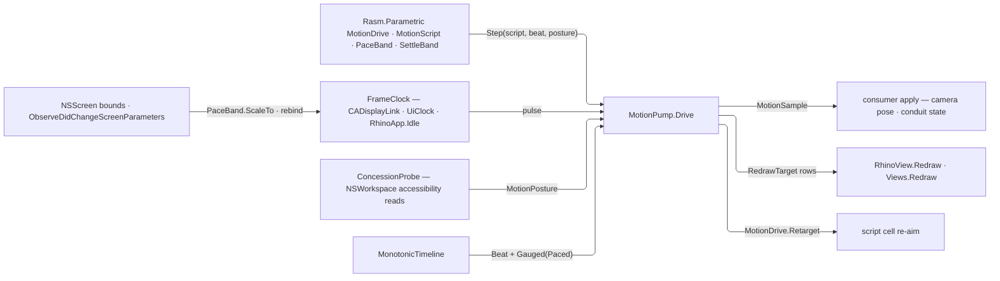

# [RASM_RHINO_MOTION]

Host motion-pacing adapter (`Rasm.Rhino.Viewport`). The sampling algebra is the kernel's whole: `MotionScript`, `MotionSample`, `MotionDrive`, `MotionPosture`, `PaceBand`, and `SettleBand` arrive from `Rasm.Parametric`, and this page computes no motion value — its tick body is ONE `MotionDrive.Step` call. What is genuinely host lives here alone: the display-link, timer, and idle clock leases, the accessibility-concession PROBE that fills the kernel posture, the redraw landing, and the drive capsule that owns pause, resume, retarget, and disposal over one clock attachment. The apply closure is the consumer's and stays host-side — the kernel owns the algebra, never the landing (E-G25).

Temporal identity is the kernel's too: every tick advances one `MonotonicTimeline` beat chain per drive, so a motion frame and a gauged span order against one clock, and the display link's `TargetTimestamp` — a presentation prediction, not a monotonic counter — never leaves the pacer that reads it. Device density is a display fact: a consumer wanting hairline width or hit slop reads the kernel `DisplayFacts` scale, and no tick carries a per-frame DPI column.

## [01]-[INDEX]

- [02]-[REDRAW_TARGETS]: `RedrawTarget` — the frame-landing rows and their one invalidation dispatch.
- [03]-[CLOCKS]: `FrameClock`, `ConcessionProbe`, `MotionAttachment`, `MacPacer` — the three host clock leases, the posture producer, and the macOS display-link pacer with screen-parameter rebinding.
- [04]-[DRIVE]: `DriveGate`, `MotionLease`, `MotionPump` — the drive capsule over one kernel `MotionDrive.Step` tick and the reduce-motion collapse.

## [02]-[REDRAW_TARGETS]

- Owner: `RedrawTarget` `[Union]` owns frame landing: no redraw, one addressed view, or every document view. A conduit-bound overlay uses the view case because the host repaints per view.
- Entry: `Invalidate(DocumentSession, Op) : Fin<Unit>` — the one dispatch; view-addressed rows resolve through the `ViewportLease` per invalidation so a closed view refuses instead of redrawing a dead handle.
- Law: a target is data on the drive, never a branch in the tick body — the pump invalidates whatever row it holds, and adding a landing surface is one case with the pump untouched. The former canvas case is DELETED: zero sites composed it, and an Eto canvas repaint is the kernel paint surface's own `Swap`-and-`Redraw` lease, never a closure smuggled through a viewport union.
- Law: the document-wide row marshals through the kernel dispatch on the immediate lane and proves `SessionNeed.Redraw` inside the same window — the session demand serializes the host call and the crossing asserts the thread, so neither authority is re-derived at a call site.
- Boundary: invalidation requests a repaint and returns; paint itself happens on the host's draw pass — a target that blocks until pixels land inverts the host contract and is unrepresentable here.

```csharp
// --- [RUNTIME_PRELUDE] -----------------------------------------------------------------
using AppKit;
using CoreAnimation;
using Foundation;
using Rasm.Domain;
using Rasm.Interaction;
using Rasm.Numerics;
using Rasm.Parametric;
using Rasm.Rhino.Document;

namespace Rasm.Rhino.Viewport;

// --- [TYPES] ---------------------------------------------------------------------------
[Union(ConversionFromValue = ConversionOperatorsGeneration.None)]
public abstract partial record RedrawTarget {
    private RedrawTarget() { }
    public sealed record NoneCase : RedrawTarget;
    public sealed record ViewCase(ViewportTarget Target) : RedrawTarget;
    public sealed record DocumentCase : RedrawTarget;

    internal Fin<Unit> Invalidate(DocumentSession session, Op key) =>
        Switch(
            (Session: session, Op: key),
            noneCase: static (_, _) => Fin.Succ(unit),
            viewCase: static (ctx, target) => ViewportLease.Of(session: ctx.Session, target: target.Target, key: ctx.Op)
                .Bind(lease => lease.Read(project: static row => Fin.Succ(value: Op.Side(row.View.Redraw)), key: ctx.Op)),
            documentCase: static (ctx, _) => UiThread.Run(
                new UiDispatch<Unit>.Blocking(() => ctx.Session.Demand(
                    use: static document => Fin.Succ(value: Op.Side(document.Views.Redraw)),
                    key: ctx.Op,
                    needs: [SessionNeed.Redraw])),
                DispatchLane.Immediate,
                ctx.Op));
}
```

## [03]-[CLOCKS]

- Owner: `FrameClock` `[Union]` owns display-link, timer, and idle pacing rows; `ConcessionProbe` is the PRODUCER filling the kernel `MotionPosture` — the five `NSWorkspace` accessibility reads land as `CapabilitySet<MotionConcession>` rows and the pace as a `PaceBand`; `MotionAttachment` is the pause/resume/dispose lease every row answers; `MacPacer` is the one `Microsoft.macOS` crossing.
- Entry: `FrameClock.Resolve(Option<PaceBand>, Op?) : Fin<FrameClock>` admits a pace band and selects display link or timer off ONE anchor probe crossing `UiThread` — the probe is an AppKit window walk, so the row decision runs UI-affine inside the `Fin` funnel; `FrameClock.Idle()` admits background-tolerant pacing explicitly; `Start(onTick, onFault, Op) : Fin<MotionAttachment>` returns one lifecycle whose tick is a bare PULSE — the drive mints its own kernel beat per pulse, so no clock row carries a timestamp column.
- Law: the tick is a PULSE, never a stamped value. The drive owns the one `MonotonicTimeline` beat chain (seed → `Beat(seed, cadence, key)` per tick), so timer, idle, and display-link rows all advance one temporal identity and the deleted `FrameTick` carrier — timestamp, delta, and a per-frame `BackingScale` column — has no successor: elapsed and delta ride the kernel beat, and density rides the kernel `DisplayFacts` a consumer reads once per drive, not per frame.
- Law: the timer row is the kernel `UiClock` — `UiClock.Of(cadence, beat, posture, faults, clock, key)` over the drive's own timeline — so cadence, drift, missed-beat counting, and observer isolation are the kernel's and this page adds only the `MotionAttachment` projection over the lease's `Pause`/`Resume`/`Stop`. A page-local timer wrapper re-deriving drift beside that owner is the deleted form; the former Eto `Pulse` composition retired with the Eto sub-domain.
- Law: the display link is built from a WINDOW-DERIVED screen — `NSScreen.GetDisplayLink(target, selector)` on the key window's screen, falling to the first application window that resolves one — and `NSScreen.MainScreen` is the deleted form: it names the application main screen, not the paced surface's, so a second-display target paces against the wrong refresh ceiling. No window resolving a screen is a typed refusal that selects the timer row, never a substituted anchor.
- Law: `GetDisplayLink` carries `SupportedOSPlatform("macos14.0")` and declares non-null while the native result still needs validation, so the row admits on `OperatingSystem.IsMacOSVersionAtLeast(14)` — never the OS family — and every vended link crosses `Optional(...).ToFin(...)` before it is configured or attached.
- Law: the link lifecycle is create → `AddToRunLoop(NSRunLoop.Main, NSRunLoopMode.Common)` → `Paused` toggling → `RemoveFromRunLoop` → `Invalidate` → `Dispose` — teardown is the exact inverse of attachment and an invalidated link is dead and rebuilt, never resumed. Every link mutation runs ON the main run loop; release marshals through the kernel dispatch because a drive is disposed from whatever lane owns it. `ObserveDidChangeScreenParameters` re-reads the panel bounds and rebinds the link, so a monitor swap re-rates a running animation instead of orphaning it.
- Law: the panel bounds the requested range from BOTH ends — `MaximumFramesPerSecond` is the ceiling and `MaximumRefreshInterval` its reciprocal the floor — and the requested band is the kernel `PaceBand`, scaled onto the panel through the band's own `ScaleTo` rather than a hand clamp ladder: the band owns its ladder and the panel supplies the reference, so re-rating is two reads and no second frame-rate table survives on this page.
- Law: tick delivery is already on the UI loop for every row — the display link attaches to the main run loop, the kernel clock's timer raises there, and `RhinoApp.Idle` is main-thread by contract — so the drive body never marshals and the consumer apply's own session demand takes its inline main-thread branch.
- Law: the concession probe reads the live workspace per DRIVE, never a cached census — an accessibility flip mid-session lands on the next drive — and a non-macOS host answers the empty set, which is a measured absence because the platform publishes no accommodation surface at all.
- Boundary: `Microsoft.macOS` members live only inside the platform-gated pacer; portable code holds `FrameClock` values and kernel beats, never an `NSScreen`, `CADisplayLink`, or `nint`.

```csharp
// --- [TYPES] ---------------------------------------------------------------------------
internal static class ConcessionProbe {
    private static readonly Seq<(MotionConcession Row, Func<bool> Active)> Reads = Seq<(MotionConcession, Func<bool>)>(
        (MotionConcession.ReduceMotion, static () => NSWorkspace.SharedWorkspace.AccessibilityDisplayShouldReduceMotion),
        (MotionConcession.IncreaseContrast, static () => NSWorkspace.SharedWorkspace.AccessibilityDisplayShouldIncreaseContrast),
        (MotionConcession.DifferentiateColour, static () => NSWorkspace.SharedWorkspace.AccessibilityDisplayShouldDifferentiateWithoutColor),
        (MotionConcession.ReduceTransparency, static () => NSWorkspace.SharedWorkspace.AccessibilityDisplayShouldReduceTransparency),
        (MotionConcession.InvertColors, static () => NSWorkspace.SharedWorkspace.AccessibilityDisplayShouldInvertColors));

    internal static MotionPosture Posture(PaceBand pace) => new(
        Concessions: OperatingSystem.IsMacOS()
            ? CapabilitySet<MotionConcession>.Of(Reads.Filter(static read => read.Active()).Map(static read => read.Row).ToArray())
            : CapabilitySet<MotionConcession>.None,
        Pace: pace);
}

internal interface MotionAttachment : IDisposable {
    Unit Pause();
    Unit Resume();
}

[Union(ConversionFromValue = ConversionOperatorsGeneration.None)]
public abstract partial record FrameClock {
    private FrameClock() { }
    public sealed record DisplayLinkCase(PaceBand Pace) : FrameClock;
    public sealed record TimerCase(PaceBand Pace) : FrameClock;
    public sealed record IdleCase : FrameClock;

    public static Fin<FrameClock> Resolve(Option<PaceBand> pace = default, Op? key = null) {
        Op op = key.OrDefault();
        PaceBand band = pace.IfNone(PaceBand.Portable);
        return UiThread.Run(new UiDispatch<FrameClock>.Blocking(() => op.Catch(() => MacPacer.ScreenReachable
            ? Fin.Succ<FrameClock>(new DisplayLinkCase(Pace: band))
            : Fin.Succ<FrameClock>(new TimerCase(Pace: band)))), DispatchLane.Immediate, op);
    }

    public static FrameClock Idle() => new IdleCase();

    public PaceBand Pace => Switch(
        displayLinkCase: static clock => clock.Pace,
        timerCase: static clock => clock.Pace,
        idleCase: static _ => PaceBand.Portable);

    internal Fin<MotionAttachment> Start(Action onTick, Action<Error> onFault, MonotonicTimeline timeline, FaultCell faults, Op key) =>
        from _ in UiThread.Run(new UiDispatch<Unit>.Current(() => Fin.Succ(unit)), DispatchLane.Immediate, key)
        from attachment in Switch(
            (OnTick: onTick, OnFault: onFault, Timeline: timeline, Faults: faults, Op: key),
            displayLinkCase: static (ctx, clock) => MacPacer.Start(pace: clock.Pace, onTick: ctx.OnTick, onFault: ctx.OnFault, key: ctx.Op),
            timerCase: static (ctx, clock) =>
                from cadence in ctx.Op.AcceptValidated<PositiveMagnitude>(candidate: clock.Pace.Period.TotalSeconds)
                from lease in UiClock.Of(
                    cadence: cadence,
                    beat: _ => ctx.Op.Catch(() => { ctx.OnTick(); return Fin.Succ(unit); }),
                    posture: Some(FaultPosture.Continue),
                    faults: Some(ctx.Faults),
                    clock: Some(ctx.Timeline),
                    key: ctx.Op)
                from started in lease.Use(clock => clock.Start(key: ctx.Op), key: ctx.Op)
                select (MotionAttachment)Attachment.Clocked(lease: lease, key: ctx.Op),
            idleCase: static (ctx, _) => ctx.Op.Catch(() => Fin.Succ<MotionAttachment>(Attachment.Idle(beat: ctx.OnTick))))
        select attachment;
}

internal sealed class Attachment(Func<Unit> pause, Func<Unit> resume, Action release) : MotionAttachment {
    internal static readonly Attachment Completed = new(static () => unit, static () => unit, static () => { });

    internal static Attachment Clocked(Lease<UiClock> lease, Op key) => new(
        pause: () => ignore(lease.Use(clock => clock.Pause(key: key), key: key)),
        resume: () => ignore(lease.Use(clock => clock.Resume(key: key), key: key)),
        release: lease.Dispose);

    internal static Attachment Idle(Action beat) {
        int attached = 0;
        EventHandler handler = (_, _) => beat();
        Unit On() => Interlocked.Exchange(ref attached, 1) is 0 ? fun(() => RhinoApp.Idle += handler)() : unit;
        Unit Off() => Interlocked.Exchange(ref attached, 0) is 1 ? fun(() => RhinoApp.Idle -= handler)() : unit;
        return (On(), new Attachment(pause: Off, resume: On, release: () => _ = Off())).Item2;
    }

    public Unit Pause() => pause();
    public Unit Resume() => resume();
    public void Dispose() => release();
}

// --- [SERVICES] ------------------------------------------------------------------------
internal sealed class MacPacer : NSObject, MotionAttachment {
    private static readonly Selector TickSelector = new("pacerTick:");
    private readonly Action onTick;
    private readonly Action<Error> onFault;
    private readonly PaceBand pace;
    private readonly Op key;
    private CADisplayLink? link;
    private NSObject? screenObserver;

    private MacPacer(Action onTick, Action<Error> onFault, PaceBand pace, Op key) {
        this.onTick = onTick;
        this.onFault = onFault;
        this.pace = pace;
        this.key = key;
    }

    private Unit Guarded(Fin<Unit> outcome) => outcome.Match(
        Succ: static _ => unit,
        Fail: error => {
            _ = Optional(link).Map(held => held.Paused = true);
            onFault(error);
            return unit;
        });

    private static Option<NSScreen> Anchor() =>
        OperatingSystem.IsMacOSVersionAtLeast(14)
            ? Optional(NSApplication.SharedApplication.KeyWindow?.Screen)
                .Match(Some: Some, None: () => toSeq(NSApplication.SharedApplication.Windows).Choose(window => Optional(window.Screen)).Head)
            : None;

    internal static bool ScreenReachable => Anchor().IsSome;

    internal static Fin<MotionAttachment> Start(PaceBand pace, Action onTick, Action<Error> onFault, Op key) =>
        from pacer in key.Catch(() => Fin.Succ(new MacPacer(onTick: onTick, onFault: onFault, pace: pace, key: key)))
        from armed in Anchor().ToFin(Fail: key.MissingContext())
            .Bind(screen => pacer.Arm(screen: screen))
            .Match(Succ: _ => Fin.Succ<MotionAttachment>(pacer), Fail: fault => { pacer.Dispose(); return Fin.Fail<MotionAttachment>(fault); })
        select armed;

    private Fin<Unit> Arm(NSScreen screen) => key.Catch(() =>
        Optional(screen.GetDisplayLink(this, TickSelector)).ToFin(Fail: key.InvalidResult()).Bind(vended =>
            Configured(link: vended, screen: screen).Map(configured => {
                link = configured;
                link.AddToRunLoop(NSRunLoop.Main, NSRunLoopMode.Common);
                screenObserver = NSApplication.Notifications.ObserveDidChangeScreenParameters((_, _) =>
                    _ = Guarded(key.Catch(() => Fin.Succ(Op.Side(Rebind)))));
                return unit;
            })));

    public Unit Pause() => Paused(true);
    public Unit Resume() => Paused(false);

    private Unit Paused(bool value) => Optional(link).Match(Some: held => Op.Side(() => held.Paused = value), None: () => unit);

    [Export("pacerTick:")]
    public void Tick(CADisplayLink sender) => _ = Guarded(key.Catch(() => {
        onTick();
        return Fin.Succ(unit);
    }));

    private Fin<CADisplayLink> Configured(CADisplayLink link, NSScreen screen) =>
        from ceiling in key.AcceptValidated<PositiveMagnitude>(candidate: Math.Max(1.0, (double)screen.MaximumFramesPerSecond))
        from scaled in pace.ScaleTo(reference: ceiling, key: key)
        select (CADisplayLink)(link.PreferredFrameRateRange = CAFrameRateRange.Create(
                minimum: (float)scaled.Minimum,
                maximum: (float)scaled.Maximum,
                preferred: (float)scaled.Preferred),
            link).Item2;

    private void Rebind() {
        _ = Anchor().Bind(screen => Optional(screen.GetDisplayLink(this, TickSelector)).Map(vended => (Screen: screen, Vended: vended)))
            .Map(held => Configured(link: held.Vended, screen: held.Screen).Map(replaced => {
                replaced.Paused = Optional(link).Match(Some: static prior => prior.Paused, None: static () => false);
                replaced.AddToRunLoop(NSRunLoop.Main, NSRunLoopMode.Common);
                _ = Optional(link).Map(prior => { Detach(prior); return unit; });
                link = replaced;
                return unit;
            }));
    }

    private static void Detach(CADisplayLink held) {
        held.RemoveFromRunLoop(NSRunLoop.Main, NSRunLoopMode.Common);
        held.Invalidate();
        held.Dispose();
    }

    protected override void Dispose(bool disposing) {
        if (disposing) {
            _ = Guarded(UiThread.Run(new UiDispatch<Unit>.Blocking(() => key.Catch(() => {
                _ = Optional(link).Map(held => { Detach(held); return unit; });
                link = null;
                screenObserver?.Dispose();
                screenObserver = null;
                return Fin.Succ(value: unit);
            })), DispatchLane.Immediate, key));
        }
        base.Dispose(disposing);
    }
}
```

## [04]-[DRIVE]

- Owner: `DriveGate` `[Union]` — the drive lifecycle as a closed state the CAS verdict reads; `MotionLease` — the drive capsule owning pause, resume, retarget, completion, and disposal over one clock attachment (RENAMED from the former `MotionDrive` class: the kernel owns that name for the sampler, `ARCHITECTURE.md`'s bare-name law resolves the collision, and the census witness already spells `Fin<MotionLease> Drive(...)`); `MotionPump` — the one drive entry.
- Entry: `MotionPump.Drive(session, script, target, timeline, apply, clock?, key?) : Fin<MotionLease>` — the timeline is the session's ONE injected `MonotonicTimeline` (the folder ruling), the script admits through the kernel's own `MotionDrive.Admit`, and the tick body is sample → apply → invalidate with the sample computed by ONE `MotionDrive.Step(script, beat, posture, key)` call.
- Law: the tick body computes nothing — the kernel steps, the consumer applies, the target row invalidates; a numeric expression in the pump beyond beat minting is the deleted form this page's history exists to warn about. Settling is the kernel's own verdict: `Step` answers `(Sample, Continues)` and the drive terminates when `Continues` reads false, so no band probe, iteration guess, or elapsed comparison survives host-side.
- Law: the drive's temporal identity is one kernel beat chain — a per-drive `BeatSeed` cell advanced through `MonotonicTimeline.Beat(seed, cadence, key)` on every pulse, guarded by `Cell.Step` on the observed seed exactly as the kernel clock's own cursor law demands — and each tick body runs GAUGED on `DispatchLane.Paced`, whose one-frame budget reads the seated pace band, so an over-budget tick is a pulse with a breached span rather than an invisible stall.
- Law: reduced motion is a collapse, not a skip — when the probed posture admits `MotionConcession.ReduceMotion`, the drive applies the TERMINAL sample once (the eased curve at its end, the spring at its settled target, the glide at its projected rest — each read off the kernel case's own columns), invalidates once, and completes; perceivable state changes still land, motion does not.
- Law: the lifecycle is a CLOSED state the CAS reads — `Running → Stopping → Released` through `Cell.Step` on one `Atom<DriveGate>` — so a tick that raced a disposal reads its `Ceded`/`Refused` verdict and settles without host work, a second disposal reads `Refused` rather than re-running teardown, and the two hand booleans the prior page serialized under a lock have no successor. Terminal custody is one fold: pause, release, and the primary outcome merge with every cleanup fault APPENDING through the `Error` monoid — never `ignore`d — before any waiter resumes.
- Law: `Retarget` is the kernel's own — the script cell commits `MotionDrive.Retarget(script, lastSample, goal, key)` so a running spring re-aims mid-flight through the algebra that owns the composition, and a retarget on a script the kernel refuses (an eased tween, a coasting glide) lands the kernel's typed refusal untouched. The last sample rides its own cell because the retarget seam is the one consumer of it.
- Law: the apply closure and the invalidation are HOST-SIDE by decision (E-G25) — the kernel samples and the boundary lands, at both boundaries identically — and a driven spring (`FieldIntegrator`) has NO consumer and is REFUSED: no integrator parameter survives, and the kernel's fixed stepper is the whole spring arithmetic.
- Boundary: one drive owns one clock attachment; concurrent drives on one target coexist because invalidation coalesces at the host — the pump never de-duplicates redraws across drives.

```csharp
// --- [TYPES] ---------------------------------------------------------------------------
[Union(ConversionFromValue = ConversionOperatorsGeneration.None)]
internal abstract partial record DriveGate {
    private DriveGate() { }
    internal sealed record Running : DriveGate;
    internal sealed record Stopping : DriveGate;
    internal sealed record Released : DriveGate;
}

// --- [SERVICES] ------------------------------------------------------------------------
public sealed class MotionLease : IDisposable {
    private readonly Atom<DriveGate> gate;
    private readonly MotionAttachment clock;
    private readonly Atom<MotionScript> script;
    private readonly Atom<Option<MotionSample>> last;
    private readonly Func<Fin<Unit>, Fin<Unit>> finish;
    private readonly Op key;

    internal MotionLease(
        Atom<DriveGate> gate,
        MotionAttachment clock,
        Atom<MotionScript> script,
        Atom<Option<MotionSample>> last,
        Task<Fin<Unit>> completion,
        Func<Fin<Unit>, Fin<Unit>> finish,
        Op key) {
        this.gate = gate;
        this.clock = clock;
        this.script = script;
        this.last = last;
        this.finish = finish;
        this.key = key;
        Completion = completion;
    }

    public Task<Fin<Unit>> Completion { get; }

    public Fin<Unit> Pause(Op? key = null) => Live(key.OrDefault(), () => Fin.Succ(clock.Pause()));

    public Fin<Unit> Resume(Op? key = null) => Live(key.OrDefault(), () => Fin.Succ(clock.Resume()));

    public Fin<Unit> Retarget(double goal, Op? key = null) {
        Op op = key.OrDefault();
        return Live(op, () =>
            from sample in last.Value.ToFin(Fail: op.InvalidContext())
            from moved in MotionDrive.Retarget(script: script.Value, from: sample, to: goal, key: op)
            select ignore(script.Swap(_ => moved)));
    }

    private Fin<Unit> Live(Op op, Func<Fin<Unit>> body) =>
        gate.Value is DriveGate.Running && !Completion.IsCompleted
            ? op.Catch(body)
            : Fin.Fail<Unit>(op.InvalidContext());

    public void Dispose() => _ = finish(Fin.Succ(value: unit));
}

// --- [OPERATIONS] ----------------------------------------------------------------------
public static class MotionPump {
    public static Fin<MotionLease> Drive(
        DocumentSession session,
        MotionScript script,
        RedrawTarget target,
        MonotonicTimeline timeline,
        Func<MotionSample, Fin<Unit>> apply,
        Option<FrameClock> clock = default,
        Op? key = null) {
        Op op = key.OrDefault();
        return from owner in Optional(session).ToFin(Fail: op.MissingContext())
               from beats in Optional(timeline).ToFin(Fail: op.MissingContext())
               from landing in op.Need(value: target)
               from consumer in op.Need(value: apply)
               from admitted in MotionDrive.Admit(script: script, key: op)
               from selected in clock.Match(Some: Fin.Succ, None: () => FrameClock.Resolve(key: op))
               let posture = ConcessionProbe.Posture(pace: selected.Pace)
               from drive in posture.Concessions.Admits(capability: MotionConcession.ReduceMotion)
                   ? Collapsed(session: owner, script: admitted, posture: posture, landing: landing, apply: consumer, key: op)
                   : Running(session: owner, script: admitted, posture: posture, landing: landing, timeline: beats, apply: consumer, clock: selected, key: op)
               select drive;
    }

    private static Fin<MotionLease> Collapsed(
        DocumentSession session, MotionScript script, MotionPosture posture, RedrawTarget landing,
        Func<MotionSample, Fin<Unit>> apply, Op key) =>
        from terminal in script.Switch(
            state: (Posture: posture, Op: key),
            eased: static (ctx, plan) => ctx.Op
                .AcceptValidated<UnitInterval>(candidate: 1.0)
                .Map(end => (MotionSample)new MotionSample.Eased(
                    Value: plan.Curve.Evaluate(t: end), Posture: plan.Cycle.Terminal, Motion: ctx.Posture)),
            sprung: static (ctx, plan) => Fin.Succ((MotionSample)new MotionSample.Sprung(
                State: new SpringState(Position: plan.To, Velocity: 0.0), Motion: ctx.Posture)),
            glided: static (ctx, plan) => plan.Decay
                .Project(velocity: plan.Velocity, key: ctx.Op)
                .Map(rest => (MotionSample)new MotionSample.Glided(Value: plan.Origin + rest, Motion: ctx.Posture)))
        from _ in key.Catch(() => apply(terminal))
        from __ in landing.Invalidate(session: session, key: key)
        select new MotionLease(
            gate: Atom<DriveGate>(new DriveGate.Released()),
            clock: Attachment.Completed,
            script: Atom(script),
            last: Atom(Some(terminal)),
            completion: Task.FromResult(Fin.Succ(value: unit)),
            finish: static outcome => outcome,
            key: key);

    private static Fin<MotionLease> Running(
        DocumentSession session, MotionScript script, MotionPosture posture, RedrawTarget landing,
        MonotonicTimeline timeline, Func<MotionSample, Fin<Unit>> apply, FrameClock clock, Op key) {
        TaskCompletionSource<Fin<Unit>> done = new(TaskCreationOptions.RunContinuationsAsynchronously);
        Atom<DriveGate> gate = Atom<DriveGate>(new DriveGate.Running());
        Atom<MotionScript> plan = Atom(script);
        Atom<Option<MotionSample>> last = Atom(Option<MotionSample>.None);
        Atom<Option<MotionAttachment>> mounted = Atom(Option<MotionAttachment>.None);
        FaultCell faults = new(cap: Rasm.Numerics.Dimension.Create(value: 16), clock: TimeProvider.System);
        return from cadence in key.AcceptValidated<PositiveMagnitude>(candidate: clock.Pace.Period.TotalSeconds)
               from origin in timeline.Capture(key: key)
               let seed = Atom((BeatSeed)origin)
               from attachment in clock.Start(
                   onTick: () => Tick(
                       session: session, plan: plan, last: last, posture: posture, landing: landing, apply: apply,
                       timeline: timeline, seed: seed, cadence: cadence, gate: gate, finish: Finish, key: key),
                   onFault: error => { _ = Finish(Fin.Fail<Unit>(error)); },
                   timeline: timeline,
                   faults: faults,
                   key: key)
               from _ in Fin.Succ(ignore(mounted.Swap(_ => Some(attachment))))
               select new MotionLease(
                   gate: gate, clock: attachment, script: plan, last: last,
                   completion: done.Task, finish: Finish, key: key);

        Fin<Unit> Finish(Fin<Unit> primary) {
            if (Cell.Step(gate, static held => held is DriveGate.Running ? Some<DriveGate>(new DriveGate.Stopping()) : None, key.InvalidContext())
                is not Transition<DriveGate>.Committed) {
                return done.Task.IsCompleted ? done.Task.Result : primary;
            }
            Fin<Unit> pause = mounted.Value.Match(
                Some: held => key.Catch(() => Fin.Succ(held.Pause())),
                None: static () => Fin.Succ(unit));
            Fin<Unit> release = mounted.Value.Match(
                Some: held => key.Catch(() => { held.Dispose(); return Fin.Succ(unit); }),
                None: static () => Fin.Succ(unit));
            _ = mounted.Swap(static _ => None);
            _ = Cell.Step(gate, static held => held is DriveGate.Stopping ? Some<DriveGate>(new DriveGate.Released()) : None, key.InvalidContext());
            Fin<Unit> settled = Append(Append(primary, pause), release);
            _ = done.TrySetResult(settled);
            return settled;
        }

        static Fin<Unit> Append(Fin<Unit> primary, Fin<Unit> side) => side.Match(
            Succ: _ => primary,
            Fail: fault => primary.Match(
                Succ: _ => Fin.Fail<Unit>(error: fault),
                Fail: first => Fin.Fail<Unit>(error: first + fault)));
    }

    private static void Tick(
        DocumentSession session, Atom<MotionScript> plan, Atom<Option<MotionSample>> last, MotionPosture posture,
        RedrawTarget landing, Func<MotionSample, Fin<Unit>> apply, MonotonicTimeline timeline, Atom<BeatSeed> seed,
        PositiveMagnitude cadence, Atom<DriveGate> gate, Func<Fin<Unit>, Fin<Unit>> finish, Op key) {
        if (gate.Value is not DriveGate.Running) { return; }
        Fin<(Fin<bool> Value, GaugedSpan<DispatchLane> Span)> gauged = timeline.Gauged<bool, DispatchLane>(
            lane: DispatchLane.Paced,
            work: key,
            body: () =>
                from held in Fin.Succ(seed.Value)
                from beat in timeline.Beat(seed: held, cadence: cadence, key: key)
                from seated in Cell.Step(seed, next => next == held ? Some(BeatSeed.Previous(beat)) : None, key.InvalidResult())
                        is Transition<BeatSeed>.Committed
                    ? Fin.Succ(unit)
                    : Fin.Fail<Unit>(key.InvalidResult())
                from stepped in MotionDrive.Step(script: plan.Value, beat: beat, posture: posture, key: key)
                from _ in Fin.Succ(ignore(last.Swap(_ => Some(stepped.Sample))))
                from applied in key.Catch(() => apply(stepped.Sample))
                from invalidated in landing.Invalidate(session: session, key: key)
                select stepped.Continues);
        _ = gauged.Bind(static held => held.Value).Match(
            Succ: continues => { if (!continues) { _ = finish(Fin.Succ(value: unit)); } },
            Fail: error => { _ = finish(Fin.Fail<Unit>(error)); });
    }
}
```



- Packages: `RhinoCommon` (`Rasm.Rhino/.api/api-rhinocommon-display.md` — redraw targets, view pipeline); `AppKit`/`CoreAnimation` (`Rasm.Rhino/.api/api-macos-native.md` — the display-link pulse the drive gates); `Thinktecture.Runtime.Extensions` (`libs/dotnet/.api/api-thinktecture-runtime-extensions.md` — `[Union]` motion verbs); kernel `Parametric` (`MotionDrive`, `MotionScript`, `MotionSample`, `MotionPosture`, `SpringState`, `PaceBand`, `SettleBand`, `MonotonicTimeline` one-timeline law) + `Interaction/clock` (the kernel tick floor).

## [05]-[RESEARCH]

<!-- source-only: research row template:
[TOKEN]-[OPEN|BLOCKED]: <exact question>; <verification route>.
-->

(none)
