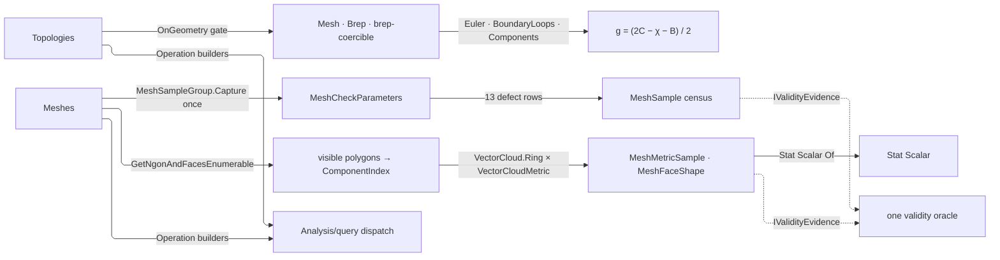

# [RASM_ANALYSIS_INSPECT]

Inspection owns the measured-query runtime's topology-scalar and mesh-quality diagnostics: `Topologies` `[Union]` closes structural interrogation over both Brep and Mesh, and `Meshes` `[Union]` closes mesh census, per-polygon metrics, and boundary extraction. Brep/mesh polymorphism collapses into one `OnGeometry` gate lowering brep-coercible inputs through the leased brep form, so every scalar, orientation, containment, and component fold is written once and a per-operation geometry switch is the deleted repetition. Both unions publish their operation builders on THEMSELVES — the `Analyze` facade lives once on `Analysis/query` and this page adds no fragment to it.

Rebuilds compose law legislated elsewhere: ring-metric mathematics is `Spatial/cloud` law projected through `VectorCloudMetric.Project`, direction and dihedral admission `Numerics/atoms` law through `Direction.Of` and `VectorAngle.Of`, the streaming moment fold is `Domain/stats` law on the `Scalar` carrier, and the `Kind` web, the `BrepForm`/`SurfaceForm` leases, and the `TopologyProjection` carrier are `Domain/normalization` law. Every carrier declares `IValidityEvidence`, admitted through the one `Domain/validation` acceptance oracle `Analysis/query` owns, and each family union exposes `internal Operation<TGeometry, TOut> Operation<TGeometry, TOut>()` as that dispatch entry.

## [01]-[INDEX]

- [02]-[TOPOLOGY]: `Topologies` structural interrogation and the `TopologyScalar` rows over the one `OnGeometry` mesh/brep gate — Euler, genus, boundary, and component folds, solid orientation, point containment, and kind classification.
- [03]-[MESH]: `Meshes` mesh inspection — the `MeshSampleGroup` census over its `Capture` column, `MeshMetric` visible-polygon measurement over the `Spatial/cloud` ring, and the `MeshSample`/`MeshMetricSample`/`MeshFaceShape` evidence carriers.
- [04]-[DENSITY_BAR]: one owner per axis; a new scalar, sample, or metric is a row, never a sibling surface.

## [02]-[TOPOLOGY]

- Owner: `Topologies` `[Union]` closes structural interrogation over any admitted geometry — classification, interval domains, solid orientation, connected components, point containment, and the scalar family — its public cases being the construction surface; `TopologyScalar` `[SmartEnum<string>]` names each scalar by its generated key, and binds it to an `OutputBinding` column and an `Extract` delegate folding through the one `OnGeometry` gate, the count rows sharing one `CountOf` projection over mesh or brep. `MeasuredValue` `[Union]` is the measurement carrier both rosters answer on — flag, count, signed, or statistic — so no row publishes an `object`.
- Cases: the structural-interrogation cases with `ScalarCase` carrying a `TopologyScalar` row; a consumer constructs the case directly, a flat factory roster beside the cases being the deleted forwarding layer, and the fence declares both closed sets.
- Entry: `Topologies.Operation<TGeometry, TOut>()` is the family entry every arm gates at build — `Capability.EvaluateTopology` admits scalar, orientation, and containment; curve-or-surface form admits domains; output type is checked per arm. Context is demanded only where read: classification and containment declare it, the scalar, domain, orientation, and component rows run scope-less, and an operation demanding context it never reads is the deleted over-requirement.
- Auto: `OnGeometry` is the one mesh/brep gate — `Mesh` and `Brep` dispatch directly, brep-coercible natives lower through `Capability.BrepForm`, everything else rejects — so brep-like admission is written once and every scalar, orientation, containment, and component fold routes through it; its third arity takes ONE `GeometryBase` delegate for folds polymorphic over the lowered geometry, collapsing `GenusOf` to a single body. Genus folds the primitive Euler, boundary-loop, and component counts through one applicative `Apply` gated on `OrientableOf`, derives its numerator in `long`, and admits parity, sign, and `int` range before narrowing — a truncating division certifies inconsistent evidence as a genus; `PieceCount` brackets the disposal of every piece it counts.
- Output: scalars project onto scalar, interval, kind, orientation, and geometry values through the acceptance oracle; `Components` re-emits owned `GeometryBase` pieces.
- Packages: RhinoCommon (`Mesh`/`Brep` topology, loop, and orientation surface), `Rasm.Domain` (`Kind` capability web, `BrepForm`/`SurfaceForm` leases, `Requirement.SolidTopology`, `Fault` types), Thinktecture.Runtime.Extensions, LanguageExt.Core.
- Growth: a new topology scalar is one `TopologyScalar` row — name key, output, and extract delegate over the same `OnGeometry` fold; a new structural interrogation is one `Topologies` case with its `Key` arm; a new geometry family entering the gate is one `OnGeometry` arm serving every row at once.
- Boundary: brep/mesh polymorphism lives in one gate — a per-operation `is Mesh`/`is Brep` switch is the deleted repetition, and a fold identical on both families takes the `onAny` arity rather than two drifting delegates; release brackets the ACQUISITION at both piece folds, so a throw mid-projection frees what a failure-path `BindFail` never reaches; genus is derived from three primitive rows — a stored genus beside the formula, or a planar `boundaries − components` hole count named as a universal scalar, is the killed form; Euler reads cell counts alone and answers `Signed`, so a manifold guard on the Brep arm and a nonnegative floor on the value are both refused double admission, and a closed mesh answers zero boundary loops before any naked-edge read; `Capability.EvaluateTopology` is the single topology-evaluation admission row, containment escalating through `Requirement.SolidTopology` and admitting its point ONCE at build, never per evaluation; the orientation arm maps the mesh orientation int onto `BrepSolidOrientation` so both families answer in one enum, never a mesh-specific parallel vocabulary; the vertex, edge, and Euler rows count one welded topological complex, never the unwelded vertex buffer; classification answers `Kind` or `Topology` alone — a string projection is a host-boundary format, never an output arm; component extraction owns its disposal — a piece failing the typed projection is disposed before the fault leaves.

```csharp
// --- [IMPORTS] -------------------------------------------------------------------------
using System;
using System.Linq;
using LanguageExt;
using Rasm.Domain;
using Rhino.Geometry;
using Thinktecture;
using static LanguageExt.Prelude;

namespace Rasm.Analysis;

// --- [TYPES] ---------------------------------------------------------------------------
[Union]
public abstract partial record Topologies {
    private Topologies() { }
    public sealed record KindCase : Topologies;
    public sealed record DomainsCase : Topologies;
    public sealed record SolidOrientationCase : Topologies;
    public sealed record ComponentsCase : Topologies;
    public sealed record ContainsPointCase(Point3d Point) : Topologies;
    public sealed record ScalarCase(TopologyScalar Scalar) : Topologies;
    internal Operation<TGeometry, TOut> Operation<TGeometry, TOut>() where TGeometry : notnull => Switch(
        state: Key,
        kindCase: static (key, _) =>
            (Capability.Universal(type: typeof(TGeometry)) || Rasm.Domain.Kind.Of(type: typeof(TGeometry)).IsSome)
                ? typeof(TOut) switch {
                    Type t when t == typeof(Kind) => Lift<TGeometry, Kind>(state: key, extract: static (op, g, ctx) => g.KindOf(context: ctx).Bind(k => Acceptance.Rows(value: k)), requiresContext: true).As<TGeometry, TOut>(),
                    Type t when t == typeof(Topology) => Lift<TGeometry, Topology>(state: key, extract: static (op, g, ctx) => g.KindOf(context: ctx).Bind(k => Acceptance.Rows(value: k.Topology)), requiresContext: true).As<TGeometry, TOut>(),
                    _ => new KernelFault.Unsupported(),
                }
                : new KernelFault.Unsupported(),
        domainsCase: static (key, _) => typeof(TOut) == typeof(Interval) && (Capability.CurveForm.Admits(type: typeof(TGeometry)) || Capability.SurfaceForm.Admits(type: typeof(TGeometry)))
            ? Lift<TGeometry, Interval>(state: key, extract: static (op, g, _) => DomainsOf(geometry: g).Bind(domains => Acceptance.Rows(values: domains))).As<TGeometry, TOut>()
            : new KernelFault.Unsupported(),
        solidOrientationCase: static (key, _) => typeof(TOut) == typeof(BrepSolidOrientation) && Capability.EvaluateTopology.Admits(type: typeof(TGeometry))
            ? Lift<TGeometry, BrepSolidOrientation>(state: key, extract: static (op, g, _) => OnGeometry(geometry: g,
                onMesh: mesh => Fin.Succ(mesh.SolidOrientation() switch { 1 => BrepSolidOrientation.Outward, -1 => BrepSolidOrientation.Inward, _ => BrepSolidOrientation.None }),
                onBrep: brep => Fin.Succ(brep.SolidOrientation)).Bind(orientation => Acceptance.Rows(value: orientation))).As<TGeometry, TOut>()
            : new KernelFault.Unsupported(),
        componentsCase: static (key, _) =>
            (typeof(TOut) == typeof(Brep) || typeof(TOut) == typeof(Mesh))
            && (Capability.Universal(type: typeof(TGeometry)) || typeof(TOut).IsAssignableFrom(c: typeof(TGeometry)))
                ? Lift<TGeometry, TOut>(state: key, extract: static (op, g, _) => ComponentsOf(geometry: g).Bind(components => ProjectPieces<TOut>(components: components))).As<TGeometry, TOut>()
                : new KernelFault.Unsupported(),
        containsPointCase: static (key, cp) =>
            ValidityClaim.Finite(cp.Point).Holds && typeof(TOut) == typeof(bool) && Capability.EvaluateTopology.Admits(type: typeof(TGeometry))
                ? Lift<TGeometry, bool, (Point3d Target)>(state: (Key: key, Target: cp.Point), requirement: Some(Requirement.SolidTopology),
                    extract: static (s, g, ctx) => OnGeometry(geometry: g,
                        onMesh: mesh => Fin.Succ(mesh.IsPointInside(point: s.Target, tolerance: ctx.For(lane: ToleranceLane.Distance).Value, strictlyIn: false)),
                        onBrep: brep => Fin.Succ(brep.IsPointInside(point: s.Target, tolerance: ctx.For(lane: ToleranceLane.Distance).Value, strictlyIn: false)))
                        .Bind(contained => Acceptance.Rows(value: contained))).As<TGeometry, TOut>()
                : new KernelFault.Unsupported(),
        scalarCase: static (_, scalar) => {
            return scalar.Scalar.Output.Serves<TOut>() && Capability.EvaluateTopology.Admits(type: typeof(TGeometry))
                ? Lift<TGeometry, TOut, (TopologyScalar Row)>(state: (scalar.Scalar),
                    extract: static (state, g, _) => OnGeometry(geometry: g, onAny: native => state.Row.Extract(geometry: native))
                        .Bind(value => state.Row.Output.Admit<TOut>(values: Seq(value.Boxed))))
                : new KernelFault.Unsupported();
        });

    internal static Fin<Seq<Interval>> DomainsOf<TGeometry>(TGeometry geometry) where TGeometry : notnull =>
        Optional(geometry).ToFin(new KernelFault.InvalidInput()).Bind(g => g switch {
            Curve curve => Fin.Succ(Seq(curve.Domain)),
            Surface surface => Fin.Succ(Seq(surface.Domain(direction: 0), surface.Domain(direction: 1))),
            object surfaceLike when Capability.SurfaceForm.Admits(type: surfaceLike.GetType()) => Normalization.SurfaceForm(source: surfaceLike).Bind(lease => lease.Use(surface => DomainsOf(geometry: surface))),
            _ => Fin.Fail<Seq<Interval>>(new KernelFault.Unsupported(g.GetType(), typeof(Interval))),
        });
    internal static Fin<Seq<GeometryBase>> ComponentsOf<TGeometry>(TGeometry geometry) where TGeometry : notnull =>
        Optional(geometry).ToFin(new KernelFault.InvalidInput()).Bind(g => g switch {
            Mesh mesh => Fin.Succ(toSeq(mesh.SplitDisjointPieces().Cast<GeometryBase>())),
            Brep brep => BrepPieces(brep: brep),
            GeometryBase { HasBrepForm: true } native => Normalization.BrepForm(source: native).Bind(lease => lease.Use(brep => BrepPieces(brep: brep))),
            _ => Fin.Fail<Seq<GeometryBase>>(new KernelFault.Unsupported(g.GetType(), typeof(Seq<GeometryBase>))),
        });
    internal static Fin<bool> ManifoldOf<TG>(TG geometry) where TG : notnull =>
        OnGeometry(geometry: geometry,
            onMesh: static m => Fin.Succ(m.IsManifold(topologicalTest: true, isOriented: out bool _, hasBoundary: out bool _)),
            onBrep: static b => Fin.Succ(b.IsManifold));
    internal static Fin<int> EulerOf<TG>(TG geometry) where TG : notnull =>
        OnGeometry(geometry: geometry,
            onMesh: static m => Fin.Succ(m.TopologyVertices.Count - m.TopologyEdges.Count + m.Faces.Count),
            onBrep: static b => Fin.Succ(b.Vertices.Count - b.Edges.Count + b.Faces.Count));
    internal static Fin<int> BoundaryLoopsOf<TG>(TG geometry) where TG : notnull =>
        OnGeometry(geometry: geometry,
            onMesh: m => m.IsClosed ? Fin.Succ(0) : Optional(m.GetNakedEdges()).ToFin(new KernelFault.InvalidResult()).Map(static loops => loops.Length),
            onBrep: static b => Fin.Succ(toSeq(b.Loops).Filter(static loop =>
                (loop.LoopType is BrepLoopType.Outer or BrepLoopType.Inner) && toSeq(loop.Trims).Exists(static trim => trim.Edge is { Valence: EdgeAdjacency.Naked })).Count));
    internal static Fin<bool> OrientableOf<TG>(TG geometry) where TG : notnull =>
        OnGeometry(geometry: geometry,
            onMesh: static m => Fin.Succ(m.IsManifold(topologicalTest: true, isOriented: out bool oriented, hasBoundary: out bool _) && oriented),
            onBrep: static b => Fin.Succ(b.IsManifold));
    internal static Fin<int> GenusOf<TG>(TG geometry) where TG : notnull =>
        OnGeometry(geometry: geometry, onAny: native =>
            OrientableOf(geometry: native).Bind(orientable => orientable
                ? (EulerOf(geometry: native), BoundaryLoopsOf(geometry: native), PieceCount(geometry: native))
                    .Apply(static (euler, boundaries, components) => (2L * components) - euler - boundaries).As()
                    .Bind(numerator => guard(numerator >= 0 && numerator % 2 == 0 && numerator / 2 <= int.MaxValue, new KernelFault.InvalidResult()).ToFin().Map(_ => (int)(numerator / 2)))
                : Fin.Fail<int>(new KernelFault.Unsupported(InputType: native.GetType(), OutputType: typeof(int)))));
    internal static Fin<int> CountOf<TG>(TG geometry, Func<Mesh, int> meshCount, Func<Brep, int> brepCount) where TG : notnull =>
        OnGeometry(geometry: geometry, onMesh: m => Fin.Succ(meshCount(arg: m)), onBrep: b => Fin.Succ(brepCount(arg: b)));

    private static Operation<TGeometry, TValue> Lift<TGeometry, TValue, TState>(TState state, Func<TState, TGeometry, Context, Fin<Seq<TValue>>> extract, Option<Requirement> requirement = default, bool requiresContext = false) where TGeometry : notnull =>
        Analysis.Operation<TGeometry, TValue>.Build(requirement: requirement, requiresContext: requiresContext, state: (State: state, Extract: extract),
            evaluator: static (s, geometry) =>
                from context in Env.Asks
                from result in s.Extract(arg1: s.State, arg2: geometry, arg3: context).ToEff()
                select result);
    private static Fin<TResult> OnGeometry<TGeometry, TResult>(TGeometry geometry, Func<Mesh, Fin<TResult>> onMesh, Func<Brep, Fin<TResult>> onBrep) where TGeometry : notnull =>
        Optional(geometry).ToFin(new KernelFault.InvalidInput()).Bind(g => g switch {
            Mesh mesh => onMesh(arg: mesh),
            Brep brep => onBrep(arg: brep),
            object brepLike when Capability.BrepForm.Admits(type: brepLike.GetType()) => Normalization.BrepForm(source: brepLike).Bind(lease => lease.Use(project: onBrep)),
            _ => Fin.Fail<TResult>(new KernelFault.Unsupported(g.GetType(), typeof(TResult))),
        });
    private static Fin<TResult> OnGeometry<TGeometry, TResult>(TGeometry geometry, Func<GeometryBase, Fin<TResult>> onAny) where TGeometry : notnull =>
        OnGeometry(geometry: geometry, onMesh: mesh => onAny(arg: mesh), onBrep: brep => onAny(arg: brep));
    private static Fin<Seq<GeometryBase>> BrepPieces(Brep brep) =>
        brep.GetConnectedComponents() switch {
            Brep[] components when components.Length > 0 => Fin.Succ(toSeq(components.Cast<GeometryBase>())),
            _ when brep.IsValid => Acceptance.Value(brep).Map(static valid => Seq((GeometryBase)valid.DuplicateBrep())),
            _ => Fin.Fail<Seq<GeometryBase>>(new KernelFault.InvalidResult()),
        };
    private static Fin<Seq<TOut>> ProjectPieces<TOut>(Seq<GeometryBase> components) =>
        IO.pure(components).Bracket(
            Use: owned => IO.lift(() => owned.TraverseM(component => component is TOut typed
                ? Fin.Succ(typed)
                : Fin.Fail<TOut>(new KernelFault.Unsupported(InputType: component.GetType(), OutputType: typeof(TOut)))).As()),
            Fin: static owned => IO.lift(() => owned.Filter(static component => component is not TOut).Iter(static component => component.Dispose())))
            .Run();
    private static Fin<int> PieceCount<TGeometry>(TGeometry geometry) where TGeometry : notnull =>
        ComponentsOf(geometry: geometry).Bind(components => IO.pure(components).Bracket(
                Use: owned => IO.lift(() => owned.Count > 0 ? Fin.Succ(owned.Count) : Fin.Fail<int>(new KernelFault.InvalidResult())),
                Fin: static owned => IO.lift(() => owned.Iter(static component => component.Dispose())))
            .Run());
}

[Union]
public abstract partial record MeasuredValue {
    private MeasuredValue() { }
    public sealed record FlagCase(bool Value) : MeasuredValue;
    public sealed record CountCase(int Value) : MeasuredValue;
    public sealed record SignedCase(int Value) : MeasuredValue;
    public sealed record StatisticCase(double Value) : MeasuredValue;
    public static MeasuredValue Flag(bool held) => new FlagCase(Value: held);
    public static MeasuredValue Count(int tally) => new CountCase(Value: tally);
    public static MeasuredValue Signed(int value) => new SignedCase(Value: value);
    public static MeasuredValue Statistic(double value) => new StatisticCase(Value: value);
    internal object Boxed => Switch(
        flagCase: static row => (object)row.Value,
        countCase: static row => (object)row.Value,
        signedCase: static row => (object)row.Value,
        statisticCase: static row => (object)row.Value);
    internal ValidityClaim Admissible => Switch(
        flagCase: static _ => new ValidityClaim(Holds: true),
        countCase: static row => ValidityClaim.CountAtLeast(count: row.Value, floor: 0),
        signedCase: static _ => new ValidityClaim(Holds: true),
        statisticCase: static row => ValidityClaim.Finite(row.Value));
}

[SmartEnum<string>][KeyMemberEqualityComparer<ComparerAccessors.StringOrdinal, string>]
public sealed partial class TopologyScalar {
    public static readonly TopologyScalar Manifold = new(key: nameof(Manifold), output: OutputBinding.Of<bool>(), extract: static (g, op) => Topologies.ManifoldOf(geometry: g).Map(MeasuredValue.Flag));
    public static readonly TopologyScalar Euler = new(key: nameof(Euler), output: OutputBinding.Of<int>(), extract: static (g, op) => Topologies.EulerOf(geometry: g).Map(MeasuredValue.Signed));
    public static readonly TopologyScalar BoundaryLoops = new(key: nameof(BoundaryLoops), output: OutputBinding.Of<int>(), extract: static (g, op) => Topologies.BoundaryLoopsOf(geometry: g).Map(MeasuredValue.Count));
    public static readonly TopologyScalar Genus = new(key: nameof(Genus), output: OutputBinding.Of<int>(), extract: static (g, op) => Topologies.GenusOf(geometry: g).Map(MeasuredValue.Count));
    public static readonly TopologyScalar FaceCount = new(key: nameof(FaceCount), output: OutputBinding.Of<int>(), extract: static (g, op) => Topologies.CountOf(geometry: g, meshCount: static m => m.Faces.Count, brepCount: static b => b.Faces.Count).Map(MeasuredValue.Count));
    public static readonly TopologyScalar EdgeCount = new(key: nameof(EdgeCount), output: OutputBinding.Of<int>(), extract: static (g, op) => Topologies.CountOf(geometry: g, meshCount: static m => m.TopologyEdges.Count, brepCount: static b => b.Edges.Count).Map(MeasuredValue.Count));
    public static readonly TopologyScalar VertexCount = new(key: nameof(VertexCount), output: OutputBinding.Of<int>(), extract: static (g, op) => Topologies.CountOf(geometry: g, meshCount: static m => m.TopologyVertices.Count, brepCount: static b => b.Vertices.Count).Map(MeasuredValue.Count));
    public OutputBinding Output { get; }
    [UseDelegateFromConstructor] internal partial Fin<MeasuredValue> Extract(GeometryBase geometry);
}
```

## [03]-[MESH]

- Owner: `MeshSampleGroup` keyless `[SmartEnum]` bands the sample census and carries the `Capture` delegate deciding where the band's `MeshCheckParameters` come from; `Census` derives the band's rows by one filter over `MeshSampleKind.Items` at build, never a per-census rescan or a frozen band index. `MeshSampleKind` `[SmartEnum<string>]` names each row by its generated key, carries its `Group` as one column, and binds a `Sample(Mesh, MeshCheckParameters)` delegate across validity flags, census counts (the topology rows reusing the `TopologyScalar` extractors), defect counters reading the threaded capture, and valence-quality folds. `MeshMetric` keyless `[SmartEnum]` binds each face metric to a measure delegate over one visible polygon and publishes ONE `Measure` builder whose `OutputBinding` pair picks the terminal fold. `Meshes` `[Union]` closes sample groups, face quality and shape, visible-polygon addressing and count, naked edges, and plane outlines, its public cases the construction surface.
- Cases: the mesh-inspection cases with `SamplesCase` carrying a `MeshSampleGroup` and `FaceQualityCase` a `MeshMetric` named explicitly; a consumer constructs the case directly, a factory roster beside the cases being the deleted forwarding layer, and the fence declares the band rows and metric rows.
- Entry: `Meshes.Operation<TGeometry, TOut>()` lifts every arm through `Lift` — the mesh specialization applying a typed `Operation<Mesh, TValue>` to any geometry that is a mesh and rejecting the rest — so the family accepts `object`-typed pipelines and stays mesh-strict at evaluation.
- Law: absence is `Option`, never a null-object row — `AtVisiblePolygonCase` carries `Option<int>` and reads the first polygon at evaluation, `FaceQualityCase` names its metric with no absent-metric default, and the census `MeshMetric.None`, `MeshSampleGroup.None`, and `MeshSampleKind.None` rows — each existing only to be rejected — DELETE with the `Equals(None)` guards that read them.
- Auto: each `MeshSampleGroup` row decides its capture with one delegate column — `Defect` runs `Requirement.MeshReport` once per census and every other band answers the host defaults — so the standalone check operation and its nested `Apply` hop delete and every band row reads one capture. Visible-polygon resolution maps an ngon-or-face onto the canonical `ComponentIndex` (`MeshNgon` for ngon members, `MeshFace` otherwise) and extracts its boundary ring, so every per-polygon metric addresses one component vocabulary. Metric measurement reads host fast paths where they exist — the stored face-normal buffer and `GetFaceAspectRatio` on a face — and folds the `Spatial/cloud` ring metric everywhere else, never `ComputeFaceNormals`, so inspection leaves the mesh untouched; face moments cache per census in one `AtomHashMap` keyed by face; ngon area sums constituent faces, ngon normals area-weight constituent normals, and the dihedral fold walks ngon-external adjacency for the maximum inter-polygon angle at `ToleranceLane.Angle`. Every per-polygon fold reads the runtime cancellation token between polygons, returning `Errors.Cancelled` mid-census rather than finishing a stale sweep; `Requirement.MeshCheck` gates every metric operation so no defective mesh reaches a measurement.
- Output: `MeshSample`, `MeshMetricSample`, and `MeshFaceShape` carry the sample, the addressed measurement, and the addressed `Spatial/cloud` shape classification; each declares `IValidityEvidence` through the `Domain/results` `ValidityClaim` fold.
- Packages: RhinoCommon (`Mesh.Check`/`MeshCheckParameters`, `MeshNgon` census, face and ngon accessors, outlines, `ComponentIndex`), `Rasm.Spatial` (`VectorCloud` ring metrics through `VectorCloudMetric.Project`), `Rasm.Numerics` (`Direction.Of`, `VectorAngle.Of`), `Rasm.Domain` (`Requirement.MeshCheck`/`MeshReport`, `Scalar`/`Stat`, `Tolerance`, `TopologyProjection`, `Fault` types), Thinktecture.Runtime.Extensions, LanguageExt.Core.
- Growth: a new mesh sample is one `MeshSampleKind` row naming its group, the census and sample machinery untouched; a new face metric is one `MeshMetric` row binding a measure delegate over the same polygon resolution, and a new metric OUTPUT is one `OutputBinding` arm on `Measure` over the same census; a new capture source is one `Capture` delegate on its band row; a new polygon-level extraction is one `Meshes` case lifted through `Lift`.
- Boundary: a row names its band as ONE column and the census derives its rows by one filter at build — a decade classifier over the key, a frozen band index, or a label column beside the generated key was a second authority one edit could contradict; defect rows read the one threaded `MeshCheckParameters` capture and a per-row `Mesh.Check` re-run is the killed N-fold host cost; face metrics measure visible polygons through the canonical `ComponentIndex` addressing, never a triangle-level parallel family, and edge aspect dispatches on that component kind — a `BindFail` retrying a different algorithm on an invalid address is the deleted form; ring measurement routes through the `Spatial/cloud` metric surface exclusively, never a local perimeter/skewness/area loop; an absent host outline or naked-edge array is an empty successful result, never an invalid collection; `AtVisiblePolygonCase` re-emits the `Domain/normalization` `TopologyProjection` carrier on its `Fin` result so downstream extraction shares the corpus transfer/disposal protocol.

```csharp
// --- [IMPORTS] -------------------------------------------------------------------------
using System;
using System.Linq;
using System.Runtime.InteropServices;
using LanguageExt;
using Rasm.Domain;
using Rasm.Numerics;
using Rasm.Spatial;
using Rhino.Geometry;
using Thinktecture;
using static LanguageExt.Prelude;

namespace Rasm.Analysis;

// --- [TYPES] ---------------------------------------------------------------------------
[Union]
public abstract partial record Meshes {
    private Meshes() { }
    public sealed record SamplesCase(MeshSampleGroup Group) : Meshes;
    public sealed record FaceQualityCase(MeshMetric Metric) : Meshes;
    public sealed record FaceShapeCase : Meshes;
    public sealed record AtVisiblePolygonCase(Option<int> Value) : Meshes;
    public sealed record VisiblePolygonCountCase : Meshes;
    public sealed record NakedEdgesCase : Meshes;
    public sealed record OutlineCase(Plane Plane) : Meshes;
    internal Operation<TGeometry, TOut> Operation<TGeometry, TOut>() where TGeometry : notnull => Switch(
        state: Key,
        samplesCase: static (key, s) => Lift<TGeometry, TOut, MeshSample>(source: s.Group.Census()),
        faceQualityCase: static (key, fq) => fq.Metric.Measure<TGeometry, TOut>(),
        faceShapeCase: static (key, _) => typeof(TOut) == typeof(MeshFaceShape)
            ? Lift<TGeometry, TOut, MeshFaceShape>(source: MeshMetric.Shapes())
            : new KernelFault.Unsupported(),
        atVisiblePolygonCase: static (key, at) => Lift<TGeometry, TOut, TopologyProjection>(source: Analysis.Operation<Mesh, TopologyProjection>.Build(state: (Key: key, Selector: at.Value),
                evaluator: static (state, geometry) => PolygonsOf(mesh: geometry).Bind(polygons => (Source: polygons, Index: state.Selector.IfNone(0)) switch {
                    (Seq<MeshNgon> source, _) when source.Count == 0 => Fin.Fail<Seq<TopologyProjection>>(new KernelFault.InvalidResult()),
                    (Seq<MeshNgon> source, int selected) when selected < 0 || selected >= source.Count => Fin.Fail<Seq<TopologyProjection>>(new KernelFault.InvalidInput()),
                    (Seq<MeshNgon> source, int selected) => SourceOf(mesh: geometry, polygon: source[selected])
                        .Bind(component => TopologyProjection.Of(mesh: geometry, source: component))
                        .Bind(projection => Acceptance.Rows(value: projection)),
                }).ToEff())),
        visiblePolygonCountCase: static (key, _) => Lift<TGeometry, TOut, int>(source:
            Analysis.Operation<Mesh, int>.Build(state: key, evaluator: static (op, mesh) => Acceptance.Rows(value: mesh.GetNgonAndFacesCount()).ToEff())),
        nakedEdgesCase: static (key, _) => Lift<TGeometry, TOut, Polyline>(source:
            Analysis.Operation<Mesh, Polyline>.Build(state: key, evaluator: static (op, mesh) => Optional(mesh.GetNakedEdges()).Map(loops => Acceptance.Rows(values: loops)).IfNone(Fin.Succ(Seq<Polyline>())).ToEff())),
        outlineCase: static (key, o) => Lift<TGeometry, TOut, Polyline>(source: o.Plane.IsValid
            ? Analysis.Operation<Mesh, Polyline>.Build(state: (Key: key, Plane: o.Plane), evaluator: static (state, mesh) =>
                Optional(mesh.GetOutlines(plane: state.Plane)).Map(outlines => Acceptance.Rows(values: outlines)).IfNone(Fin.Succ(Seq<Polyline>())).ToEff())
            : Analysis.Operation<Mesh, Polyline>.Reject(fault: new KernelFault.InvalidInput())));

    internal static Fin<ComponentIndex> SourceOf(Mesh mesh, MeshNgon polygon) =>
        Optional(polygon.BoundaryVertexIndexList()).Filter(static vertices => vertices.Length >= 3).ToFin(new KernelFault.InvalidResult())
            .Bind(_ => Optional(polygon.FaceIndexList()).ToFin(new KernelFault.InvalidResult()).Bind(faces => faces switch {
                uint[] values when values.Length == 1 && values[0] <= int.MaxValue && mesh.Ngons.NgonIndexFromFaceIndex((int)values[0]) < 0 => Fin.Succ(new ComponentIndex(ComponentIndexType.MeshFace, (int)values[0])),
                uint[] values when values.Length > 0 && values[0] <= int.MaxValue && mesh.Ngons.NgonIndexFromFaceIndex((int)values[0]) is >= 0 and int ngon => Fin.Succ(new ComponentIndex(ComponentIndexType.MeshNgon, ngon)),
                _ => Fin.Fail<ComponentIndex>(new KernelFault.InvalidInput()),
            }));
    internal static Fin<Seq<MeshNgon>> PolygonsOf(Mesh mesh) =>
        Optional(mesh.GetNgonAndFacesEnumerable()).ToFin(new KernelFault.InvalidResult()).Map(static polygons => toSeq(polygons));

    internal static Operation<TGeometry, TOut> Lift<TGeometry, TOut, TValue>(Operation<Mesh, TValue> source) where TGeometry : notnull =>
        Analysis.Operation<TGeometry, TOut>.Native<Mesh, TValue, Operation<Mesh, TValue>>(state: source, requirement: Some(source.Requirement), requiresContext: source.RequiresContext,
            project: static (operation, mesh) => operation.Apply(geometry: Seq(mesh)));
}

[SmartEnum]
public sealed partial class MeshSampleGroup {
    public static readonly MeshSampleGroup Validity = new(capture: static _ => Fin.Succ(MeshCheckParameters.Defaults()));
    public static readonly MeshSampleGroup Count = new(capture: static _ => Fin.Succ(MeshCheckParameters.Defaults()));
    public static readonly MeshSampleGroup Defect = new(capture: static mesh => Requirement.MeshReport(mesh: mesh, check: nameof(Defect)));
    public static readonly MeshSampleGroup Quality = new(capture: static _ => Fin.Succ(MeshCheckParameters.Defaults()));
    [UseDelegateFromConstructor] internal partial Fin<MeshCheckParameters> Capture(Mesh mesh);
    internal Operation<Mesh, MeshSample> Census() =>
        Operation<Mesh, MeshSample>.Build(state: (Kinds: toSeq(MeshSampleKind.Items).Filter(kind => kind.Group.Equals(this)), Group: this),
            evaluator: static (state, mesh) =>
                from parameters in Error.New(mesh: mesh.Message, mesh: mesh).ToEff()
                from samples in state.Kinds.TraverseM(kind => kind.Sample(mesh: mesh, parameters: parameters).Bind(value => Acceptance.Value(value: new MeshSample(Kind: kind, Value: value)))).As().ToEff()
                select samples);
}

[SmartEnum<string>][KeyMemberEqualityComparer<ComparerAccessors.StringOrdinal, string>]
public sealed partial class MeshSampleKind {
    public static readonly MeshSampleKind Valid = new(key: nameof(Valid), group: MeshSampleGroup.Validity, sample: static (m, _, _) => Fin.Succ(MeasuredValue.Flag(m.IsValid)));
    public static readonly MeshSampleKind Closed = new(key: nameof(Closed), group: MeshSampleGroup.Validity, sample: static (m, _, _) => Fin.Succ(MeasuredValue.Flag(m.IsClosed)));
    public static readonly MeshSampleKind Oriented = new(key: nameof(Oriented), group: MeshSampleGroup.Validity, sample: static (m, _, _) => Fin.Succ(MeasuredValue.Flag(m.IsManifold(topologicalTest: true, isOriented: out bool oriented, hasBoundary: out bool _) && oriented)));
    public static readonly MeshSampleKind Solid = new(key: nameof(Solid), group: MeshSampleGroup.Validity, sample: static (m, _, _) => Fin.Succ(MeasuredValue.Flag(m.IsSolid)));
    public static readonly MeshSampleKind Manifold = new(key: nameof(Manifold), group: MeshSampleGroup.Validity, sample: static (m, _, key) => Topologies.ManifoldOf(geometry: m).Map(MeasuredValue.Flag));
    public static readonly MeshSampleKind BoundaryFree = new(key: nameof(BoundaryFree), group: MeshSampleGroup.Validity, sample: static (m, _, _) => Fin.Succ(MeasuredValue.Flag(m.IsManifold(topologicalTest: true, isOriented: out bool _, hasBoundary: out bool boundary) && !boundary)));
    public static readonly MeshSampleKind Vertices = new(key: nameof(Vertices), group: MeshSampleGroup.Count, sample: static (m, _, key) => TopologyScalar.VertexCount.Extract(geometry: m));
    public static readonly MeshSampleKind Faces = new(key: nameof(Faces), group: MeshSampleGroup.Count, sample: static (m, _, key) => TopologyScalar.FaceCount.Extract(geometry: m));
    public static readonly MeshSampleKind Triangles = new(key: nameof(Triangles), group: MeshSampleGroup.Count, sample: static (m, _, _) => Fin.Succ(MeasuredValue.Count(m.Faces.TriangleCount)));
    public static readonly MeshSampleKind Quads = new(key: nameof(Quads), group: MeshSampleGroup.Count, sample: static (m, _, _) => Fin.Succ(MeasuredValue.Count(m.Faces.QuadCount)));
    public static readonly MeshSampleKind Edges = new(key: nameof(Edges), group: MeshSampleGroup.Count, sample: static (m, _, key) => TopologyScalar.EdgeCount.Extract(geometry: m));
    public static readonly MeshSampleKind Euler = new(key: nameof(Euler), group: MeshSampleGroup.Count, sample: static (m, _, key) => TopologyScalar.Euler.Extract(geometry: m));
    public static readonly MeshSampleKind VisiblePolygons = new(key: nameof(VisiblePolygons), group: MeshSampleGroup.Count, sample: static (m, _, _) => Fin.Succ(MeasuredValue.Count(m.GetNgonAndFacesCount())));
    public static readonly MeshSampleKind DegenerateFaces = new(key: nameof(DegenerateFaces), group: MeshSampleGroup.Defect, sample: static (_, p, _) => Fin.Succ(MeasuredValue.Count(p.DegenerateFaceCount)));
    public static readonly MeshSampleKind DisjointMeshes = new(key: nameof(DisjointMeshes), group: MeshSampleGroup.Defect, sample: static (_, p, _) => Fin.Succ(MeasuredValue.Count(p.DisjointMeshCount)));
    public static readonly MeshSampleKind DuplicateFaces = new(key: nameof(DuplicateFaces), group: MeshSampleGroup.Defect, sample: static (_, p, _) => Fin.Succ(MeasuredValue.Count(p.DuplicateFaceCount)));
    public static readonly MeshSampleKind ExtremelyShortEdges = new(key: nameof(ExtremelyShortEdges), group: MeshSampleGroup.Defect, sample: static (_, p, _) => Fin.Succ(MeasuredValue.Count(p.ExtremelyShortEdgeCount)));
    public static readonly MeshSampleKind InvalidNgons = new(key: nameof(InvalidNgons), group: MeshSampleGroup.Defect, sample: static (_, p, _) => Fin.Succ(MeasuredValue.Count(p.InvalidNgonCount)));
    public static readonly MeshSampleKind NakedEdges = new(key: nameof(NakedEdges), group: MeshSampleGroup.Defect, sample: static (_, p, _) => Fin.Succ(MeasuredValue.Count(p.NakedEdgeCount)));
    public static readonly MeshSampleKind NonManifoldEdges = new(key: nameof(NonManifoldEdges), group: MeshSampleGroup.Defect, sample: static (_, p, _) => Fin.Succ(MeasuredValue.Count(p.NonManifoldEdgeCount)));
    public static readonly MeshSampleKind NonUnitVectorNormals = new(key: nameof(NonUnitVectorNormals), group: MeshSampleGroup.Defect, sample: static (_, p, _) => Fin.Succ(MeasuredValue.Count(p.NonUnitVectorNormalCount)));
    public static readonly MeshSampleKind RandomFaceNormals = new(key: nameof(RandomFaceNormals), group: MeshSampleGroup.Defect, sample: static (_, p, _) => Fin.Succ(MeasuredValue.Count(p.RandomFaceNormalCount)));
    public static readonly MeshSampleKind SelfIntersectingPairs = new(key: nameof(SelfIntersectingPairs), group: MeshSampleGroup.Defect, sample: static (_, p, _) => Fin.Succ(MeasuredValue.Count(p.SelfIntersectingPairsCount)));
    public static readonly MeshSampleKind UnusedVertices = new(key: nameof(UnusedVertices), group: MeshSampleGroup.Defect, sample: static (_, p, _) => Fin.Succ(MeasuredValue.Count(p.UnusedVertexCount)));
    public static readonly MeshSampleKind VertexFaceNormalsDiffer = new(key: nameof(VertexFaceNormalsDiffer), group: MeshSampleGroup.Defect, sample: static (_, p, _) => Fin.Succ(MeasuredValue.Count(p.VertexFaceNormalsDifferCount)));
    public static readonly MeshSampleKind ZeroLengthNormals = new(key: nameof(ZeroLengthNormals), group: MeshSampleGroup.Defect, sample: static (_, p, _) => Fin.Succ(MeasuredValue.Count(p.ZeroLengthNormalCount)));
    public static readonly MeshSampleKind MaximumValence = new(key: nameof(MaximumValence), group: MeshSampleGroup.Quality, sample: static (m, _, key) => Valence(mesh: m, project: static stat => MeasuredValue.Count((int)stat.Maximum.Value)));
    public static readonly MeshSampleKind MinimumValence = new(key: nameof(MinimumValence), group: MeshSampleGroup.Quality, sample: static (m, _, key) => Valence(mesh: m, project: static stat => MeasuredValue.Count((int)stat.Minimum.Value)));
    public static readonly MeshSampleKind BoundaryLoopCount = new(key: nameof(BoundaryLoopCount), group: MeshSampleGroup.Quality, sample: static (m, _, key) => TopologyScalar.BoundaryLoops.Extract(geometry: m));
    public static readonly MeshSampleKind Genus = new(key: nameof(Genus), group: MeshSampleGroup.Quality, sample: static (m, _, key) => TopologyScalar.Genus.Extract(geometry: m));
    public static readonly MeshSampleKind AverageValence = new(key: nameof(AverageValence), group: MeshSampleGroup.Quality, sample: static (m, _, key) => Valence(mesh: m, project: static stat => MeasuredValue.Statistic(stat.Mean)));
    internal MeshSampleGroup Group { get; }
    [UseDelegateFromConstructor] internal partial Fin<MeasuredValue> Sample(Mesh mesh, MeshCheckParameters parameters);
    private static Fin<MeasuredValue> Valence(Mesh mesh, Func<Stat<Scalar>, MeasuredValue> project) =>
        toSeq(Enumerable.Range(0, mesh.TopologyVertices.Count).Select(mesh.TopologyVertices.ConnectedEdgesCount)) switch {
            { IsEmpty: true } => Fin.Fail<MeasuredValue>(new KernelFault.InvalidResult()),
            Seq<int> valences => Stat<Scalar>.Of(values: valences.Map(static valence => (Scalar)(double)valence)).Map(project),
        };
}

internal readonly record struct PolygonProbe(Mesh Mesh, ComponentIndex Source, Option<Seq<Point3d>> Vertices, AtomHashMap<int, (Vector3d Normal, double Area)> Moments) {
    internal PolygonProbe AtFace(int face) => this with { Source = new ComponentIndex(ComponentIndexType.MeshFace, face), Vertices = None };
}

[SmartEnum]
public sealed partial class MeshMetric {
    public static readonly MeshMetric EdgeAspect = new(measure: EdgeAspectOf);
    public static readonly MeshMetric Area = new(measure: AreaOf);
    public static readonly MeshMetric Perimeter = new(measure: static (probe, context, key) => Ring<double>(metric: VectorCloudMetric.Perimeter, probe: probe, context: context));
    public static readonly MeshMetric Skewness = new(measure: static (probe, context, key) => Ring<double>(metric: VectorCloudMetric.Skewness, probe: probe, context: context));
    public static readonly MeshMetric DihedralAngle = new(measure: DihedralOf);
    [UseDelegateFromConstructor] private partial Fin<double> Measure(PolygonProbe probe, Context context);
    private static readonly OutputBinding SampleBinding = OutputBinding.Of<MeshMetricSample>();
    private static readonly OutputBinding SummaryBinding = OutputBinding.Of<Stat<Scalar>>();
    internal Operation<TGeometry, TOut> Measure<TGeometry, TOut>() where TGeometry : notnull =>
        SampleBinding.Serves<TOut>()
            ? Meshes.Lift<TGeometry, TOut, MeshMetricSample>(source: Folded(terminal: static (samples, _) => Fin.Succ(samples)))
        : SummaryBinding.Serves<TOut>()
            ? Meshes.Lift<TGeometry, TOut, Stat<Scalar>>(source: Folded(terminal: static (samples, op) =>
                Stat<Scalar>.Of(values: samples.Map(static sample => (Scalar)sample.Value)).Bind(stat => Acceptance.Rows(value: stat))))
        : new KernelFault.Unsupported();
    private Operation<Mesh, TValue> Folded<TValue>(Func<Seq<MeshMetricSample>, Fin<Seq<TValue>>> terminal) where TValue : notnull =>
        Operation<Mesh, TValue>.Build(state: (Metric: this, Terminal: terminal), requirement: Some(Requirement.MeshCheck), requiresContext: true,
            evaluator: static (state, mesh) =>
                from runtime in Env.EnvAsks
                let moments = AtomHashMap(HashMap<int, (Vector3d Normal, double Area)>())
                from values in Meshes.PolygonsOf(mesh: mesh)
                    .Bind(polygons => polygons.TraverseM(polygon => runtime.Cancellation.IsCancellationRequested
                        ? Fin.Fail<MeshMetricSample>(Errors.Cancelled)
                        : state.Metric.Sample(mesh: mesh, polygon: polygon, moments: moments, context: runtime.Context)).As())
                    .Bind(samples => state.Terminal(arg1: samples, arg2: state.Key)).ToEff()
                select values);
    internal static Operation<Mesh, MeshFaceShape> Shapes() =>
        Operation<Mesh, MeshFaceShape>.Build(state: key, requirement: Some(Requirement.MeshCheck), requiresContext: true,
            evaluator: static (mesh) =>
                from runtime in Env.EnvAsks
                let moments = AtomHashMap(HashMap<int, (Vector3d Normal, double Area)>())
                from shapes in Meshes.PolygonsOf(mesh: mesh)
                    .Bind(polygons => polygons.TraverseM(polygon => runtime.Cancellation.IsCancellationRequested
                        ? Fin.Fail<MeshFaceShape>(Errors.Cancelled)
                        : Probe(mesh: mesh, polygon: polygon, moments: moments)
                            .Bind(probe => Ring<VectorCloudShape>(metric: VectorCloudMetric.Shape, probe: probe, context: runtime.Context)
                                .Map(shape => new MeshFaceShape(Source: probe.Source, Shape: shape)))).As()).ToEff()
                select shapes);
    internal Fin<MeshMetricSample> Sample(Mesh mesh, MeshNgon polygon, AtomHashMap<int, (Vector3d Normal, double Area)> moments, Context context) =>
        Probe(mesh: mesh, polygon: polygon, moments: moments)
            .Bind(probe => Measure(probe: probe, context: context).Map(value => (probe.Source, Value: value)))
            .Bind(state => Acceptance.Value(value: new MeshMetricSample(Source: state.Source, Value: state.Value)));
    private static Fin<PolygonProbe> Probe(Mesh mesh, MeshNgon polygon, AtomHashMap<int, (Vector3d Normal, double Area)> moments) =>
        Meshes.SourceOf(mesh: mesh, polygon: polygon)
            .Bind(source => VerticesOf(mesh: mesh, source: source)
                .Map(vertices => new PolygonProbe(Mesh: mesh, Source: source, Vertices: Some(vertices), Moments: moments)));
    private static Fin<Seq<Point3d>> VerticesOf(Mesh mesh, ComponentIndex source) => source switch {
        { ComponentIndexType: ComponentIndexType.MeshFace, Index: int face } when face >= 0 && face < mesh.Faces.Count =>
            mesh.Faces.GetFaceVertices(face, out Point3f a, out Point3f b, out Point3f c, out Point3f d) switch {
                true when mesh.Faces[face].IsQuad => Fin.Succ(Seq((Point3d)a, (Point3d)b, (Point3d)c, (Point3d)d)),
                true => Fin.Succ(Seq((Point3d)a, (Point3d)b, (Point3d)c)),
                false => Fin.Fail<Seq<Point3d>>(new KernelFault.InvalidResult()),
            },
        { ComponentIndexType: ComponentIndexType.MeshNgon, Index: int ngon } when ngon >= 0 && ngon < mesh.Ngons.Count =>
            Optional(mesh.Ngons.NgonBoundaryVertexList(ngon: mesh.Ngons[ngon], bAppendStartPoint: false)).ToFin(new KernelFault.InvalidResult()).Map(static points => toSeq(points)),
        _ => Fin.Fail<Seq<Point3d>>(new KernelFault.InvalidInput()),
    };
    private static Fin<Seq<int>> FaceIndicesOf(Mesh mesh, int ngon) =>
        Optional(mesh.Ngons[ngon].FaceIndexList()).ToFin(new KernelFault.InvalidResult())
            .Bind(faces => toSeq(faces).TraverseM(face => face <= int.MaxValue && (int)face < mesh.Faces.Count ? Fin.Succ((int)face) : Fin.Fail<int>(new KernelFault.InvalidResult())).As()
                .Bind(indices => indices.IsEmpty ? Fin.Fail<Seq<int>>(new KernelFault.InvalidResult()) : Fin.Succ(indices)));
    private static Fin<TOut> Ring<TOut>(VectorCloudMetric metric, PolygonProbe probe, Context context) =>
        probe.Vertices.Match(Some: Fin.Succ, None: () => VerticesOf(mesh: probe.Mesh, source: probe.Source))
            .Bind(points => VectorCloud.Ring(points: points, context: context))
            .Bind(cloud => metric.Project<TOut>(cloud: cloud, policy: Option<NeighborhoodPolicy>.None));
    private static Fin<Vector3d> NormalOf(PolygonProbe probe, Context context) => probe.Source switch {
        { ComponentIndexType: ComponentIndexType.MeshFace, Index: int face } when face >= 0 && face < probe.Mesh.Faces.Count =>
            FaceMomentOf(probe: probe, face: face, context: context).Map(static moment => moment.Normal),
        { ComponentIndexType: ComponentIndexType.MeshNgon, Index: int ngon } when ngon >= 0 && ngon < probe.Mesh.Ngons.Count =>
            FaceIndicesOf(mesh: probe.Mesh, ngon: ngon)
                .Bind(faces => probe.Mesh.FaceNormals.Count >= probe.Mesh.Faces.Count
                    ? faces.TraverseM(face => FaceMomentOf(probe: probe, face: face, context: context)).As()
                        .Bind(moments => Rasm.Numerics.Direction.Of(value: moments.Fold(initialState: Vector3d.Zero, f: static (sum, moment) => sum + (moment.Normal * moment.Area)), context: context).Map(static direction => direction.Value))
                    : Ring<Vector3d>(metric: VectorCloudMetric.Normal, probe: probe, context: context)),
        _ => Fin.Fail<Vector3d>(new KernelFault.InvalidInput()),
    };
    private static Fin<(Vector3d Normal, double Area)> FaceMomentOf(PolygonProbe probe, int face, Context context) =>
        probe.Moments.Find(face).Map(static moment => Fin.Succ(moment)).IfNone(() =>
            (probe.Mesh.FaceNormals.Count >= probe.Mesh.Faces.Count
                ? from normal in Rasm.Numerics.Direction.Of(value: new Vector3d(probe.Mesh.FaceNormals[face]), context: context).Map(static direction => direction.Value)
                  from area in Ring<double>(metric: VectorCloudMetric.Area, probe: probe.AtFace(face: face), context: context)
                  select (Normal: normal, Area: area)
                : (Ring<Vector3d>(metric: VectorCloudMetric.Normal, probe: probe.AtFace(face: face), context: context),
                   Ring<double>(metric: VectorCloudMetric.Area, probe: probe.AtFace(face: face), context: context))
                    .Apply(static (normal, area) => (Normal: normal, Area: area)).As())
            .Map(moment => probe.Moments.FindOrMaybeAdd(face, () => Some(moment)).IfNone(moment)));
    private static Fin<double> EdgeAspectOf(PolygonProbe probe, Context context) => probe.Source switch {
        { ComponentIndexType: ComponentIndexType.MeshFace, Index: int face } when face >= 0 && face < probe.Mesh.Faces.Count =>
            Fin.Succ(probe.Mesh.Faces.GetFaceAspectRatio(index: face)),
        { ComponentIndexType: ComponentIndexType.MeshNgon, Index: int ngon } when ngon >= 0 && ngon < probe.Mesh.Ngons.Count =>
            Ring<double>(metric: VectorCloudMetric.EdgeAspect, probe: probe, context: context),
        _ => Fin.Fail<double>(new KernelFault.InvalidInput()),
    };
    private static Fin<double> AreaOf(PolygonProbe probe, Context context) =>
        probe.Source switch {
            { ComponentIndexType: ComponentIndexType.MeshNgon, Index: int ngon } when ngon >= 0 && ngon < probe.Mesh.Ngons.Count =>
                FaceIndicesOf(mesh: probe.Mesh, ngon: ngon)
                    .Bind(faces => faces.TraverseM(face => FaceMomentOf(probe: probe, face: face, context: context)).As())
                    .Map(static moments => moments.Fold(initialState: 0.0, f: static (total, moment) => total + moment.Area)),
            _ => Ring<double>(metric: VectorCloudMetric.Area, probe: probe, context: context),
        };
    private static Fin<double> DihedralOf(PolygonProbe probe, Context context) =>
        NormalOf(probe: probe, context: context).Bind(normal =>
            (probe.Source switch {
                { ComponentIndexType: ComponentIndexType.MeshFace, Index: int face } when face >= 0 && face < probe.Mesh.Faces.Count => Fin.Succ(toSeq(probe.Mesh.Faces.AdjacentFaces(faceIndex: face))),
                { ComponentIndexType: ComponentIndexType.MeshNgon, Index: int ngon } when ngon >= 0 && ngon < probe.Mesh.Ngons.Count =>
                    FaceIndicesOf(mesh: probe.Mesh, ngon: ngon)
                        .Map((Seq<int> parts) => parts.Bind((int face) => toSeq(probe.Mesh.Faces.AdjacentFaces(faceIndex: face))).Filter((int other) => !parts.Exists((int face) => face == other)).Distinct()),
                _ => Fin.Fail<Seq<int>>(new KernelFault.InvalidInput()),
            }).Bind((Seq<int> neighbours) => neighbours
                .TraverseM(other => NormalOf(probe: probe.AtFace(face: other), context: context)
                    .Bind(neighbour => VectorAngle.Of(a: normal, b: neighbour, context: context).Map(static angle => angle.Value))).As()
                .Bind(angles => Stat.Extrema(items: angles, projection: static angle => angle, band: context.For(lane: ToleranceLane.Angle), direction: ExtremumDirection.Maximum)
                    .Head.ToFin(new KernelFault.InvalidResult()))));
}

// --- [MODELS] --------------------------------------------------------------------------
[StructLayout(LayoutKind.Auto)]
public readonly record struct MeshSample(MeshSampleKind Kind, MeasuredValue Value) : IValidityEvidence {
    public bool IsValid => Value is MeasuredValue measured && measured.Admissible;
}

[StructLayout(LayoutKind.Auto)]
public readonly record struct MeshMetricSample(ComponentIndex Source, double Value) : IValidityEvidence {
    public bool IsValid => ValidityClaim.All(
        Source is { ComponentIndexType: not ComponentIndexType.InvalidType, Index: >= 0 },
        ValidityClaim.Nonnegative(Value));
}

[StructLayout(LayoutKind.Auto)]
public readonly record struct MeshFaceShape(ComponentIndex Source, VectorCloudShape Shape) : IValidityEvidence {
    public bool IsValid => ValidityClaim.All(Source is { ComponentIndexType: not ComponentIndexType.InvalidType, Index: >= 0 });
}
```



## [04]-[DENSITY_BAR]

One owner per axis; a new scalar, sample, or metric is a row, never a sibling surface.

| [INDEX] | [CONCERN]          | [OWNER]               | [KIND]                                         | [RESULT]                          | [CASES] |
| :-----: | :----------------- | :-------------------- | :--------------------------------------------- | :-------------------------------- | :-----: |
|  [01]   | Structural queries | `Topologies`          | `[Union]` structural-query algebra             | `Operation → Eff<Env, Seq<TOut>>` |    6    |
|  [02]   | Topology scalars   | `TopologyScalar`      | `[SmartEnum<string>]` delegate extract rows    | `Fin<MeasuredValue>` at op gate   |    7    |
|  [03]   | Mesh queries       | `Meshes`              | `[Union]` mesh-inspection algebra              | `Operation → Eff<Env, Seq<TOut>>` |    7    |
|  [04]   | Census capture     | `MeshSampleGroup`     | keyless `[SmartEnum]` capture delegate         | `Fin<MeshCheckParameters>`        |    4    |
|  [05]   | Sample census      | `MeshSampleKind`      | `[SmartEnum<string>]` — 4 bands, delegate rows | `Fin<MeasuredValue>` per row      |   31    |
|  [06]   | Face metrics       | `MeshMetric`          | keyless `[SmartEnum]` ngon measure delegates   | `Measure → Operation<TG, TOut>`   |    5    |
|  [07]   | Measured value     | `MeasuredValue`       | `[Union]` flag/count/signed/statistic carrier  | total `Switch` + one boxed exit   |    4    |
|  [08]   | Samples            | `MeshSample` carriers | evidence `readonly record struct`              | `IValidityEvidence` carrier       |    —    |

## [05]-[RESEARCH]

<!-- source-only: research row template:
[TOKEN]-[OPEN|BLOCKED]: <exact question>; <verification route>.
-->

(none)
