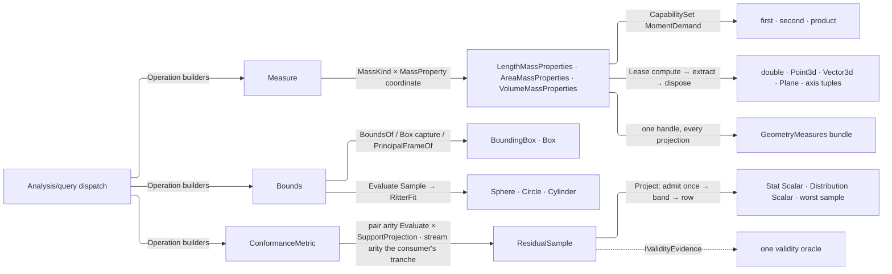

# [RASM_ANALYSIS_MEASURE]

`Measure`, `Bounds`, and `ConformanceMetric` own the metrology surface of the measured-query runtime — mass properties, enclosing bounds, and sampled conformance residuals over host geometry, each folding to one dispatch the `Analysis/query` entry forwards. Every mass answer is a `(MassKind, MassProperty)` coordinate, every bounding modality a union case, and every conformance a policy row over one sampling fold, so a new metrology answer lands as a row and never a sibling operation family. Each family union publishes its builders on ITSELF — the `Analyze` facade lives once on `Analysis/query` and this page adds no fragment to it.

Every native mass-properties handle leases through the `Domain/results` `Lease<T>` discipline — computed, projected, disposed, never escaped — and the aggregate fold disposes every non-surviving handle after summing siblings through the host `Sum` mutator. Statistics compose `Domain/stats` on the `Scalar` carrier, conformance distances the `Spatial/support` `SupportSpace.Closest` + `SupportProjection.Project` pair, exact curve deviation the `Analysis/relations` kernel, and two-operand admission the `Domain/validation` `RequirementContext.Pair` combinator; every carrier carries `IValidityEvidence` and admits through the folder's one acceptance gate.

## [01]-[INDEX]

- [02]-[MEASURE]: `Measure` `[Union]` over `MassKind` compute/aggregate rows and `MassProperty` moment-demand rows; the polymorphic `LengthOf`/`CentroidOf` scalar folds, `MassKind.PrincipalFrameOf` frame recovery, `GeometryMeasures` the one single-domain aggregate metrology bundle, and `MeasureBundle` the kind-keyed multi-domain takeoff carrier.
- [03]-[BOUNDS]: `Bounds` `[Union]` — box modalities, metrics through one `Metric` builder, principal-frame OBB, and enclosing solids through one `RitterFit` fold with `Enclosing` sampling fallback.
- [04]-[CONFORMANCE]: `ConformanceMetric` `[SmartEnum<int>]` over the `ResidualSample` evidence; the residual pipeline's two arities — sampled pair with its exact curve-deviation short-circuit, and measured stream — over one admission and one band derivation.

## [02]-[MEASURE]

- Owner: `MassKind` and `MassProperty` `[SmartEnum<int>]` policy rows drive the `Measure` `[Union]` — a `MassKind` binds its `Requirement`, its compute and aggregate delegates, its moment escalation, and the three host-handle reads `CentroidOf`/`AxesOf`/`MomentsOf`; a `MassProperty` binds its `OutputBinding`, its base demand set, the escalation it serves, and one projection. `KindOf` resolves the solid-aware domain, `PrincipalFrameOf` recovers the centroid-anchored principal plane, and three `Measure` cases carry eleven factories minting `(MassKind, MassProperty)` coordinates. `MeasureBundle` is the kind-keyed multi-domain takeoff carrier beside the single-domain `GeometryMeasures` moment bundle — `MassKind` conforms `ICapability<MassKind>` so the demanded-domain set rides `CapabilitySet<MassKind>` as one value.
- Entry: `Measure.Operation<TGeometry, TOut>()` builds the op the `Analysis/query` entry forwards; `MassProperty` always builds the AGGREGATE op, so a single geometry is the one-item degenerate case and per-item and batch answers ride one leased handle whose projections extract once. `GeometryMeasures.Of(GeometryBase, Context, Op?)` is the bundle entry the AEC import edge binds: `KindOf` resolves the solid-aware domain, one aggregate fold computes with every moment demand held, and every projection extracts from that one handle — a takeoff over a thousand elements pays one mass computation each, never eight. `MeasureBundle.Of(GeometryBase, CapabilitySet<MassKind>, Context, Op?)` measures every demanded kind through its own leased handle and `MeasureBundle.Of(Seq<(MassKind, double)>, Op?)` admits already-resolved magnitudes; `Magnitude(MassKind)` answers `Option<double>`, so an unheld domain is honest absence and never a zero.
- Law: absence is `Option`, never a null-object row. `KindOf` answers `Option<MassKind>` and the census `MassKind.None` row — whose two delegates existed only to fail — DELETES; a geometry no mass domain admits has no kind to report and the refusal is the caller's `ToFin`, stated once.
- Law: the three moment-demand bools are ONE `CapabilitySet<MomentDemand>` column, so a demand set travels as a value through `compute`, `aggregate`, and every host call instead of three positional bools six signatures re-spelled in order. NAMED LOSS: per-demand compile-time exhaustiveness; bought back by the row being the only mint site and every host bridge reading `Admits` at its own call.
- Law: host-handle discrimination has ONE site, the `MassKind` row that mints the shape — `CentroidOf`, `AxesOf`, and `MomentsOf` are its columns, so no consumer spells a three-arm `LengthMassProperties`/`AreaMassProperties`/`VolumeMassProperties` switch and a fourth mass domain lands as one row.
- Law: `Bounds.Key` reads its own case roster, so no build site re-derives a union-case name.
- Auto: `LengthOf` short-circuits analytic primitives before the tolerance `Curve.GetLength` fold; `CentroidOf` routes analytic carriers to their exact center and every mass-bearing `GeometryBase` through one `MassCentroid` arm reading `KindOf`, so the solid-vs-planar decision is the value's, never a caller flag; the aggregate fold acquires every lease, brackets the release on that acquisition so a throwing host mutator reclaims all of them, transfers exactly the summed handle to the caller, and routes a homogeneous curve set through the native multi-curve overload.
- Output: measures project onto host value types admitted through the acceptance gate; the principal-axis `(Moment, Axis)` tuple is oracle-validated per element — finite non-negative moment, non-tiny axis.
- Packages: RhinoCommon mass-properties `Compute`/`Sum`/moment accessors and `IsSolid`; `Rasm.Domain` `Requirement`, `Lease<T>`, `Op`, `Capability`, `CapabilitySet`, and `Normalization` owners.
- Growth: a new mass projection is one `MassProperty` row, a new mass domain one `MassKind` row binding its requirement and delegates, a new analytic centroid carrier one `CentroidOf` arm, a new moment demand one `MomentDemand` row — zero operation edits; `MeasureBundle` widens by that same data, since a new domain row is immediately demandable through the capability set.
- Boundary: eleven measures are three cases over two policy enums — a `MeasureLength`/`MeasureArea`/`MeasureVolume` sibling-operation family is the proliferation this coordinate design deletes; every mass handle is leased and an escaped `Compute` handle is the resource-leak defect; the demand set requests exactly the moments the extraction reads; the area path threads model tolerances and a hardcoded tolerance literal is the deleted form. `GeometryMeasures` carries `Kind` beside one `Magnitude` because `Kind` already names WHICH domain answered — three mutually exclusive length, area, and volume COLUMNS re-derived that discriminant, left `Kind = Area` holding a volume representable, and stay the deleted form; the clause once read further — that every multi-kind need decomposes into repeated single-domain asks — and that premise fell to four consumers needing SIMULTANEOUS multi-kind takeoff (`Rasm.Compute` `Analysis/aggregator`'s per-ply area+volume distribution and `Analysis/lifecycle`'s `TakeoffOf`, `Rasm.Bim` `Semantics/properties`' base-quantity derivation and `Planning/cost`'s 5D/6D quantity joins), where one-bundle-per-domain re-paid the mass computation per domain and every per-domain `Option` collapse forged a zero at the absent-kind edge; the lawful multi-kind form is `MeasureBundle`'s kind-keyed pair set — the `Kind` discriminant survives on EVERY row, reads are `Option`, and sibling per-kind columns remain unrepresentable; every `GeometryMeasures` slot is measured, so a refused principal-frame solve refuses the bundle rather than publishing an absence. Measures leave as bare `double` — `MeasureValue` is Element's dimensioned carrier and the `Domain/context` unit bridge stays orthogonal.

```csharp
// --- [IMPORTS] -------------------------------------------------------------------------
using System;
using System.Collections.Frozen;
using System.Collections.Generic;
using System.Linq;
using System.Runtime.InteropServices;
using LanguageExt;
using Rasm.Domain;
using Rhino.Geometry;
using Thinktecture;
using static LanguageExt.Prelude;

namespace Rasm.Analysis;

// --- [TYPES] ---------------------------------------------------------------------------
[SmartEnum<string>][KeyMemberEqualityComparer<ComparerAccessors.StringOrdinal, string>]
public sealed partial class MomentDemand : ICapability<MomentDemand> {
    public static readonly MomentDemand First = new(key: "first", rank: 0);
    public static readonly MomentDemand Second = new(key: "second", rank: 1);
    public static readonly MomentDemand Product = new(key: "product", rank: 2);
    public int Rank { get; }
}

[Union]
public abstract partial record Measure {
    private Measure() { }
    public sealed record LengthCase : Measure;
    public sealed record SpatialMidpointCase : Measure;
    public sealed record MassPropertyCase(MassKind Mass, MassProperty Property) : Measure;
    public static Measure Length => new LengthCase();
    public static Measure SpatialMidpoint => new SpatialMidpointCase();
    public static Measure Area => new MassPropertyCase(Mass: MassKind.Area, Property: MassProperty.Magnitude);
    public static Measure Volume => new MassPropertyCase(Mass: MassKind.Volume, Property: MassProperty.Magnitude);
    public static Measure MassError(MassKind mass) => new MassPropertyCase(Mass: mass, Property: MassProperty.MagnitudeError);
    public static Measure Centroid(MassKind mass) => new MassPropertyCase(Mass: mass, Property: MassProperty.Centroid);
    public static Measure CentroidError(MassKind mass) => new MassPropertyCase(Mass: mass, Property: MassProperty.CentroidError);
    public static Measure Radii(MassKind mass) => new MassPropertyCase(Mass: mass, Property: MassProperty.Radii);
    public static Measure PrincipalAxes(MassKind mass) => new MassPropertyCase(Mass: mass, Property: MassProperty.PrincipalAxes);
    public static Measure Inertia(MassKind mass) => new MassPropertyCase(Mass: mass, Property: MassProperty.Inertia);
    public static Measure InertiaProducts(MassKind mass) => new MassPropertyCase(Mass: mass, Property: MassProperty.InertiaProducts);
    internal Operation<TGeometry, TOut> Operation<TGeometry, TOut>() where TGeometry : notnull => Switch(
        lengthCase: static _ => Extent<TGeometry, TOut>(),
        spatialMidpointCase: static _ => Midpoint<TGeometry, TOut>(),
        massPropertyCase: static p => Mass<TGeometry, TOut>(mass: p.Mass, property: p.Property));

    private static readonly Lazy<FrozenDictionary<(MassKind Mass, MassProperty Property), Op>> MassKeys = new(static () =>
        MassKind.Items.SelectMany(static _ => MassProperty.Items, static (mass, property) => (Mass: mass, Property: property))
            .ToFrozenDictionary(static row => row, static row => Op.Of(name: $"{row.Mass.Label}{row.Property.Label}")));
    private static readonly Op ExtentKey = Op.Of(name: nameof(Extent)), MidpointKey = Op.Of(name: nameof(Midpoint));

    private static Operation<TGeometry, TOut> Extent<TGeometry, TOut>() where TGeometry : notnull =>
        typeof(TOut) == typeof(double) && Capability.CurveForm.Admits(type: typeof(TGeometry))
            ? Analysis.Operation<TGeometry, double>.Build(key: ExtentKey, requirement: Some(Requirement.CurveLength), requiresContext: true, state: ExtentKey,
                evaluator: static (op, geometry) =>
                    from context in Env.Asks
                    from length in MassKind.LengthOf(geometry: geometry, context: context, op: op).ToEff()
                    from result in op.Accept(value: length).ToEff()
                    select result).As<TGeometry, TOut>(key: ExtentKey)
            : ExtentKey.Unsupported<TGeometry, TOut>();
    private static Operation<TGeometry, TOut> Midpoint<TGeometry, TOut>() where TGeometry : notnull =>
        typeof(TOut) == typeof(Point3d) && Capability.Bound.Admits(type: typeof(TGeometry))
            ? Analysis.Operation<TGeometry, Point3d>.Build(key: MidpointKey, requiresContext: true, state: MidpointKey,
                evaluator: static (op, geometry) =>
                    from context in Env.Asks
                    from centroid in MassKind.CentroidOf(geometry: geometry, context: context, op: op).ToEff()
                    from result in op.Accept(value: centroid).ToEff()
                    select result).As<TGeometry, TOut>(key: MidpointKey)
            : MidpointKey.Unsupported<TGeometry, TOut>();
    private static Operation<TGeometry, TOut> Mass<TGeometry, TOut>(MassKind mass, MassProperty property) where TGeometry : notnull {
        Op key = MassKeys.Value[(mass, property)];
        return property.Output.Serves<TOut>()
            ? Analysis.Operation<TGeometry, TOut>.Aggregate(
                key: key, requirement: Some(mass.Requirement), requiresContext: true,
                project: geometry =>
                    from context in Env.Asks
                    from summed in mass.Aggregate(geometry: geometry.Map(static item => (object)item).AsIterable(), context: context, demands: property.Demands(mass: mass), op: key).ToEff()
                    from values in new Lease<IDisposable>.Owned(Value: summed).Use(handle => property.Extract<TOut>(key: key, mass: mass, handle: handle)).ToEff()
                    select values)
            : key.Unsupported<TGeometry, TOut>();
    }
}

[SmartEnum<int>]
public sealed partial class MassKind : ICapability<MassKind> {
    public static readonly MassKind Length = new(key: 1, label: nameof(Length), requirement: Requirement.CurveLength,
        escalation: CapabilitySet<MomentDemand>.Of(MomentDemand.Second), compute: LengthMass, aggregate: LengthBatch,
        centroidOf: static (handle, key) => Held<LengthMassProperties>(handle: handle, key: key).Map(static held => held.Centroid),
        axesOf: static (handle, key) => Held<LengthMassProperties>(handle: handle, key: key).Bind(held => AxesFrom(key: key,
            solved: held.WorldCoordinatesPrincipalMomentsOfInertia(x: out double x, xaxis: out Vector3d xAxis, y: out double y, yaxis: out Vector3d yAxis, z: out double z, zaxis: out Vector3d zAxis),
            x: x, xAxis: xAxis, y: y, yAxis: yAxis, z: z, zAxis: zAxis)),
        momentsOf: static (handle, key) => Held<LengthMassProperties>(handle: handle, key: key).Map(static held => new MassMoments(
            Magnitude: held.Length, MagnitudeError: held.LengthError, Centroid: held.Centroid, CentroidError: held.CentroidError,
            Radii: held.CentroidCoordinatesRadiiOfGyration, Inertia: held.WorldCoordinatesMomentsOfInertia, Products: held.WorldCoordinatesProductMoments)));
    public static readonly MassKind Area = new(key: 2, label: nameof(Area), requirement: Requirement.AreaMass,
        escalation: CapabilitySet<MomentDemand>.None, compute: AreaMass,
        aggregate: static (self, geometry, context, demands, op) => SumBatch<AreaMassProperties>(geometry: geometry, context: context, mass: self, demands: demands, op: op, sum: static (total, summands) => total.Sum(summands: summands, bAddTo: true)),
        centroidOf: static (handle, key) => Held<AreaMassProperties>(handle: handle, key: key).Map(static held => held.Centroid),
        axesOf: static (handle, key) => Held<AreaMassProperties>(handle: handle, key: key).Bind(held => AxesFrom(key: key,
            solved: held.WorldCoordinatesPrincipalMomentsOfInertia(x: out double x, xaxis: out Vector3d xAxis, y: out double y, yaxis: out Vector3d yAxis, z: out double z, zaxis: out Vector3d zAxis),
            x: x, xAxis: xAxis, y: y, yAxis: yAxis, z: z, zAxis: zAxis)),
        momentsOf: static (handle, key) => Held<AreaMassProperties>(handle: handle, key: key).Map(static held => new MassMoments(
            Magnitude: held.Area, MagnitudeError: held.AreaError, Centroid: held.Centroid, CentroidError: held.CentroidError,
            Radii: held.CentroidCoordinatesRadiiOfGyration, Inertia: held.WorldCoordinatesMomentsOfInertia, Products: held.WorldCoordinatesProductMoments)));
    public static readonly MassKind Volume = new(key: 3, label: nameof(Volume), requirement: Requirement.VolumeMass,
        escalation: CapabilitySet<MomentDemand>.None, compute: VolumeMass,
        aggregate: static (self, geometry, context, demands, op) => SumBatch<VolumeMassProperties>(geometry: geometry, context: context, mass: self, demands: demands, op: op, sum: static (total, summands) => total.Sum(summands: summands, bAddTo: true)),
        centroidOf: static (handle, key) => Held<VolumeMassProperties>(handle: handle, key: key).Map(static held => held.Centroid),
        axesOf: static (handle, key) => Held<VolumeMassProperties>(handle: handle, key: key).Bind(held => AxesFrom(key: key,
            solved: held.WorldCoordinatesPrincipalMomentsOfInertia(x: out double x, xaxis: out Vector3d xAxis, y: out double y, yaxis: out Vector3d yAxis, z: out double z, zaxis: out Vector3d zAxis),
            x: x, xAxis: xAxis, y: y, yAxis: yAxis, z: z, zAxis: zAxis)),
        momentsOf: static (handle, key) => Held<VolumeMassProperties>(handle: handle, key: key).Map(static held => new MassMoments(
            Magnitude: held.Volume, MagnitudeError: held.VolumeError, Centroid: held.Centroid, CentroidError: held.CentroidError,
            Radii: held.CentroidCoordinatesRadiiOfGyration, Inertia: held.WorldCoordinatesMomentsOfInertia, Products: held.WorldCoordinatesProductMoments)));
    private readonly Func<object, Context, CapabilitySet<MomentDemand>, Op, Fin<IDisposable>> compute;
    private readonly Func<MassKind, IEnumerable<object>, Context, CapabilitySet<MomentDemand>, Op, Fin<IDisposable>> aggregate;
    public string Label { get; }
    string ICapability<MassKind>.Key => Label;
    internal Requirement Requirement { get; }
    internal CapabilitySet<MomentDemand> Escalation { get; }
    [UseDelegateFromConstructor] internal partial Fin<Point3d> CentroidOf(IDisposable handle, Op key);
    [UseDelegateFromConstructor] internal partial Fin<Seq<(double Moment, Vector3d Axis)>> AxesOf(IDisposable handle, Op key);
    [UseDelegateFromConstructor] internal partial Fin<MassMoments> MomentsOf(IDisposable handle, Op key);
    internal Fin<IDisposable> Aggregate(IEnumerable<object> geometry, Context context, CapabilitySet<MomentDemand> demands, Op op) =>
        aggregate(this, geometry, context, demands, op);
    private static Fin<TMass> Held<TMass>(IDisposable handle, Op key) where TMass : class, IDisposable =>
        Optional(handle as TMass).ToFin(key.InvalidResult(detail: typeof(TMass).Name));
    internal static Option<MassKind> KindOf(GeometryBase geometry) => geometry switch {
        Curve => Some(Length),
        Brep brep => Some(brep.IsSolid ? Volume : Area),
        Mesh mesh => Some(mesh.IsSolid ? Volume : Area),
        Extrusion extrusion => Some(extrusion.IsSolid ? Volume : Area),
        Surface surface => Some(surface.IsSolid ? Volume : Area),
        _ => Option<MassKind>.None,
    };
    internal static Fin<Plane> PrincipalFrameOf(GeometryBase geometry, Context context, Op key) =>
        KindOf(geometry: geometry).ToFin(key.Unsupported(inputType: geometry.GetType(), outputType: typeof(Plane)))
            .Bind(kind => kind.compute(geometry, context, CapabilitySet<MomentDemand>.All, key)
                .Bind(handle => new Lease<IDisposable>.Owned(Value: handle).Use(mass => kind.PrincipalFrameOf(handle: mass, key: key))));
    internal Fin<Plane> PrincipalFrameOf(IDisposable handle, Op key) =>
        from centroid in CentroidOf(handle: handle, key: key)
        from axes in AxesOf(handle: handle, key: key)
        from frame in (axes.Count, centroid.IsValid) switch {
            ( >= 2, true) => key.AcceptValue(value: new Plane(origin: centroid, xDirection: axes[0].Axis, yDirection: axes[1].Axis)),
            _ => Fin.Fail<Plane>(key.InvalidResult()),
        }
        select frame;
    internal static Fin<double> LengthOf<TGeometry>(TGeometry geometry, Context context, Op op) where TGeometry : notnull =>
        Optional(geometry).ToFin(op.InvalidInput()).Bind(g => g switch {
            Line line => Fin.Succ(line.Length),
            Polyline polyline => Fin.Succ(polyline.Length),
            Circle circle => Fin.Succ(circle.Circumference),
            Arc arc => Fin.Succ(arc.Length),
            Ellipse ellipse => Optional(ellipse.ToNurbsCurve()).ToFin(op.InvalidResult()).Bind(curve => new Lease<Curve>.Owned(Value: curve).Use(native => LengthOf(geometry: native, context: context, op: op))),
            Curve curve => curve.GetLength(context.Fractional) switch {
                double length when ValidityClaim.Nonnegative(length).Holds => Fin.Succ(length),
                _ => Fin.Fail<double>(op.InvalidResult()),
            },
            _ => Fin.Fail<double>(op.Unsupported(g.GetType(), typeof(double))),
        });
    internal static Fin<Point3d> CentroidOf<TGeometry>(TGeometry geometry, Context context, Op op) where TGeometry : notnull =>
        Optional(geometry).ToFin(op.InvalidInput()).Bind(g => g switch {
            Point3d point => Fin.Succ(point),
            Point point => Fin.Succ(point.Location),
            Line line => Fin.Succ(line.PointAt(t: 0.5)),
            Polyline polyline => Fin.Succ(polyline.CenterPoint()),
            BoundingBox box => Fin.Succ(box.Center),
            Box box => Fin.Succ(box.Center),
            Curve curve => (curve.IsClosed, curve.TryGetPlane(plane: out Plane _, tolerance: context.Absolute.Value)) switch {
                (false, _) => Optional(LengthMassProperties.Compute(curve)).ToFin(op.InvalidResult()).Map(static m => new Lease<LengthMassProperties>.Owned(Value: m).Use(static handle => handle.Centroid)),
                (true, true) => Optional(AreaMassProperties.Compute(curve, context.Absolute.Value)).ToFin(op.InvalidResult()).Map(static m => new Lease<AreaMassProperties>.Owned(Value: m).Use(static handle => handle.Centroid)),
                _ => Fin.Fail<Point3d>(op.InvalidResult()),
            },
            SubD subd => Optional(subd.ToBrep(SubDToBrepOptions.Default)).ToFin(op.InvalidResult()).Bind(brep => new Lease<Brep>.Owned(Value: brep).Use(owned => MassCentroid(geometry: owned, context: context, op: op))),
            GeometryBase native when KindOf(geometry: native).IsSome => MassCentroid(geometry: native, context: context, op: op),
            _ => Fin.Fail<Point3d>(op.Unsupported(g.GetType(), typeof(Point3d))),
        });
    private static Fin<Seq<(double Moment, Vector3d Axis)>> AxesFrom(Op key, bool solved, double x, Vector3d xAxis, double y, Vector3d yAxis, double z, Vector3d zAxis) =>
        solved
            ? Fin.Succ(Seq((Moment: x, Axis: xAxis), (Moment: y, Axis: yAxis), (Moment: z, Axis: zAxis)))
            : Fin.Fail<Seq<(double Moment, Vector3d Axis)>>(key.InvalidResult());
    private static Fin<Point3d> MassCentroid(GeometryBase geometry, Context context, Op op) =>
        KindOf(geometry: geometry).ToFin(op.Unsupported(inputType: geometry.GetType(), outputType: typeof(Point3d)))
            .Bind(kind => kind.Aggregate(geometry: [geometry], context: context, demands: CapabilitySet<MomentDemand>.Of(MomentDemand.First), op: op)
                .Bind(handle => new Lease<IDisposable>.Owned(Value: handle).Use(owned => kind.CentroidOf(handle: owned, key: op))));
    private static Fin<IDisposable> Done<TMass>(TMass? mass) where TMass : class, IDisposable =>
        Optional(mass).ToFin(op.InvalidResult($"mass properties unavailable for {typeof(TMass).Name}")).Map(static handle => (IDisposable)handle);
    private static Fin<IDisposable> LengthMass(object geometry, Context _, CapabilitySet<MomentDemand> demands, Op op) =>
        Normalization.CurveForm(source: geometry, key: op).Bind(lease => lease.Use(curve =>
            Done(LengthMassProperties.Compute(curve, length: true, firstMoments: demands.Admits(MomentDemand.First), secondMoments: demands.Admits(MomentDemand.Second), productMoments: demands.Admits(MomentDemand.Product)))));
    private static Fin<IDisposable> AreaMass(object geometry, Context context, CapabilitySet<MomentDemand> demands, Op op) => geometry switch {
        Mesh mesh => Done(AreaMassProperties.Compute(mesh, area: true, firstMoments: demands.Admits(MomentDemand.First), secondMoments: demands.Admits(MomentDemand.Second), productMoments: demands.Admits(MomentDemand.Product))),
        Curve curve => Done(AreaMassProperties.Compute(curve, context.Absolute.Value)),
        object curveLike when Capability.CurveForm.Admits(type: curveLike.GetType()) => Normalization.CurveForm(source: curveLike, key: op).Bind(lease => lease.Use(curve => AreaMass(geometry: curve, context: context, demands: demands, op: op))),
        Brep brep => Done(AreaMassProperties.Compute(brep, area: true, firstMoments: demands.Admits(MomentDemand.First), secondMoments: demands.Admits(MomentDemand.Second), productMoments: demands.Admits(MomentDemand.Product), relativeTolerance: context.Fractional, absoluteTolerance: context.Absolute.Value)),
        Surface surface => Done(AreaMassProperties.Compute(surface, area: true, firstMoments: demands.Admits(MomentDemand.First), secondMoments: demands.Admits(MomentDemand.Second), productMoments: demands.Admits(MomentDemand.Product))),
        GeometryBase { HasBrepForm: true } or Box or BoundingBox or Sphere or Cylinder or Cone or Torus =>
            Normalization.BrepForm(source: geometry, key: op).Bind(lease => lease.Use(brep => AreaMass(geometry: brep, context: context, demands: demands, op: op))),
        _ => Fin.Fail<IDisposable>(op.Unsupported(geometry.GetType(), typeof(AreaMassProperties))),
    };
    private static Fin<IDisposable> VolumeMass(object geometry, Context context, CapabilitySet<MomentDemand> demands, Op op) => geometry switch {
        Mesh mesh => Done(VolumeMassProperties.Compute(mesh, volume: true, firstMoments: demands.Admits(MomentDemand.First), secondMoments: demands.Admits(MomentDemand.Second), productMoments: demands.Admits(MomentDemand.Product))),
        Brep brep => Done(VolumeMassProperties.Compute(brep, volume: true, firstMoments: demands.Admits(MomentDemand.First), secondMoments: demands.Admits(MomentDemand.Second), productMoments: demands.Admits(MomentDemand.Product), relativeTolerance: context.Fractional, absoluteTolerance: context.Absolute.Value)),
        Surface surface => Done(VolumeMassProperties.Compute(surface, volume: true, firstMoments: demands.Admits(MomentDemand.First), secondMoments: demands.Admits(MomentDemand.Second), productMoments: demands.Admits(MomentDemand.Product))),
        GeometryBase { HasBrepForm: true } or Box or BoundingBox or Sphere or Cylinder or Cone or Torus =>
            Normalization.BrepForm(source: geometry, key: op).Bind(lease => lease.Use(brep => VolumeMass(geometry: brep, context: context, demands: demands, op: op))),
        _ => Fin.Fail<IDisposable>(op.Unsupported(geometry.GetType(), typeof(VolumeMassProperties))),
    };
    private static Fin<IDisposable> LengthBatch(MassKind self, IEnumerable<object> geometry, Context context, CapabilitySet<MomentDemand> demands, Op op) =>
        toSeq(geometry) switch {
            Seq<object> items when items.ForAll(static item => item is Curve) =>
                Done(LengthMassProperties.Compute(curves: items.AsIterable().Cast<Curve>(), length: true, firstMoments: demands.Admits(MomentDemand.First), secondMoments: demands.Admits(MomentDemand.Second), productMoments: demands.Admits(MomentDemand.Product))),
            Seq<object> items => SumBatch<LengthMassProperties>(geometry: items.AsIterable(), context: context, mass: self, demands: demands, op: op, sum: static (total, summands) => total.Sum(summands: summands, bAddTo: true)),
        };
    private static Fin<IDisposable> SumBatch<TMass>(IEnumerable<object> geometry, Context context, MassKind mass, CapabilitySet<MomentDemand> demands, Op op, Func<TMass, IEnumerable<TMass>, bool> sum) where TMass : class, IDisposable {
        Atom<Option<IDisposable>> transferred = Atom(value: Option<IDisposable>.None);
        return IO.lift(() => Acquire(geometry: geometry, context: context, mass: mass, demands: demands, op: op))
            .Bracket(
                Use: batch => IO.lift(() => Summed(batch: batch, mass: mass, op: op, sum: sum)
                    .Map(active => { _ = transferred.Swap(f: _ => Some(active)); return active; })),
                Catch: static (Error error) => IO.fail<IDisposable>(error),
                Fin: batch => IO.lift(() => {
                    batch.Owned
                        .Filter(resource => transferred.Value.Map(active => !ReferenceEquals(objA: active, objB: resource)).IfNone(noneValue: true))
                        .Iter(static resource => resource.Dispose());
                    return unit;
                }))
            .Run();
    }
    private static (Seq<IDisposable> Owned, Option<Error> Refused) Acquire(IEnumerable<object> geometry, Context context, MassKind mass, CapabilitySet<MomentDemand> demands, Op op) =>
        toSeq(geometry).Fold(
            (Owned: Seq<IDisposable>(), Refused: Option<Error>.None),
            (state, item) => state.Refused.IsSome
                ? state
                : mass.compute(item, context, demands, op).Match(
                    Succ: computed => state with { Owned = state.Owned.Add(computed) },
                    Fail: error => state with { Refused = Some(error) }));
    private static Fin<IDisposable> Summed<TMass>((Seq<IDisposable> Owned, Option<Error> Refused) batch, MassKind mass, Op op, Func<TMass, IEnumerable<TMass>, bool> sum) where TMass : class, IDisposable =>
        batch.Refused.Match(
            Some: Fin.Fail<IDisposable>,
            None: () => toSeq(batch.Owned.AsIterable().Cast<TMass>()) switch {
                { Count: 0 } => Fin.Fail<IDisposable>(op.InvalidInput(axis: "geometry")),
                { Count: 1 } single => Fin.Succ<IDisposable>(single[0]),
                Seq<TMass> masses when sum(arg1: masses[0], arg2: masses.Tail.AsIterable()) => Fin.Succ<IDisposable>(masses[0]),
                _ => Fin.Fail<IDisposable>(op.InvalidResult(detail: mass.Label)),
            });
}

[SmartEnum<int>]
public sealed partial class MassProperty {
    public static readonly MassProperty Magnitude = new(key: 0, label: nameof(Magnitude), output: OutputBinding.Of<double>(),
        baseDemands: CapabilitySet<MomentDemand>.None, escalates: CapabilitySet<MomentDemand>.None,
        project: static (mass, handle, key) => mass.MomentsOf(handle: handle, key: key).Map(static moments => Seq((object)moments.Magnitude)));
    public static readonly MassProperty MagnitudeError = new(key: 1, label: nameof(MagnitudeError), output: OutputBinding.Of<double>(),
        baseDemands: CapabilitySet<MomentDemand>.None, escalates: CapabilitySet<MomentDemand>.Of(MomentDemand.Second),
        project: static (mass, handle, key) => mass.MomentsOf(handle: handle, key: key).Map(static moments => Seq((object)moments.MagnitudeError)));
    public static readonly MassProperty Centroid = new(key: 2, label: nameof(Centroid), output: OutputBinding.Of<Point3d>(),
        baseDemands: CapabilitySet<MomentDemand>.Of(MomentDemand.First), escalates: CapabilitySet<MomentDemand>.Of(MomentDemand.Second),
        project: static (mass, handle, key) => mass.MomentsOf(handle: handle, key: key).Map(static moments => Seq((object)moments.Centroid)));
    public static readonly MassProperty CentroidError = new(key: 3, label: nameof(CentroidError), output: OutputBinding.Of<Vector3d>(),
        baseDemands: CapabilitySet<MomentDemand>.Of(MomentDemand.First), escalates: CapabilitySet<MomentDemand>.Of(MomentDemand.Second),
        project: static (mass, handle, key) => mass.MomentsOf(handle: handle, key: key).Map(static moments => Seq((object)moments.CentroidError)));
    public static readonly MassProperty Radii = new(key: 4, label: nameof(Radii), output: OutputBinding.Of<Vector3d>(),
        baseDemands: CapabilitySet<MomentDemand>.Of(MomentDemand.First, MomentDemand.Second), escalates: CapabilitySet<MomentDemand>.None,
        project: static (mass, handle, key) => mass.MomentsOf(handle: handle, key: key).Map(static moments => Seq((object)moments.Radii)));
    public static readonly MassProperty PrincipalAxes = new(key: 5, label: nameof(PrincipalAxes), output: OutputBinding.Of<ValueTuple<double, Vector3d>>(),
        baseDemands: CapabilitySet<MomentDemand>.All, escalates: CapabilitySet<MomentDemand>.None,
        project: static (mass, handle, key) => mass.AxesOf(handle: handle, key: key).Map(static axes => axes.Map(static axis => (object)axis)));
    public static readonly MassProperty Inertia = new(key: 6, label: nameof(Inertia), output: OutputBinding.Of<Vector3d>(),
        baseDemands: CapabilitySet<MomentDemand>.All, escalates: CapabilitySet<MomentDemand>.None,
        project: static (mass, handle, key) => mass.MomentsOf(handle: handle, key: key).Map(static moments => Seq((object)moments.Inertia)));
    public static readonly MassProperty InertiaProducts = new(key: 7, label: nameof(InertiaProducts), output: OutputBinding.Of<Vector3d>(),
        baseDemands: CapabilitySet<MomentDemand>.All, escalates: CapabilitySet<MomentDemand>.None,
        project: static (mass, handle, key) => mass.MomentsOf(handle: handle, key: key).Map(static moments => Seq((object)moments.Products)));
    public string Label { get; }
    public OutputBinding Output { get; }
    internal CapabilitySet<MomentDemand> BaseDemands { get; }
    internal CapabilitySet<MomentDemand> Escalates { get; }
    [UseDelegateFromConstructor] private partial Fin<Seq<object>> Project(MassKind mass, IDisposable handle, Op key);
    internal CapabilitySet<MomentDemand> Demands(MassKind mass) =>
        mass.Escalation.Held.Where(demand => Escalates.Admits(capability: demand))
            .Aggregate(seed: BaseDemands, func: static (set, demand) => set.With(capability: demand));
    internal Fin<Seq<TValue>> Extract<TValue>(Op key, MassKind mass, IDisposable handle) =>
        Project(mass: mass, handle: handle, key: key).Bind(values => Output.Admit<TValue>(values: values, key: key));
}

// --- [MODELS] --------------------------------------------------------------------------
[StructLayout(LayoutKind.Auto)]
public readonly record struct MassMoments(
    double Magnitude, double MagnitudeError, Point3d Centroid, Vector3d CentroidError,
    Vector3d Radii, Vector3d Inertia, Vector3d Products);

[StructLayout(LayoutKind.Auto)]
public readonly record struct GeometryMeasures(
    MassKind Kind, double Magnitude, double MagnitudeError, Point3d Centroid,
    Vector3d Radii, Vector3d Inertia, Vector3d InertiaProducts, Plane PrincipalFrame) : IValidityEvidence {
    public bool IsValid => ValidityClaim.All(
        Kind is not null,
        ValidityClaim.Nonnegative(Magnitude),
        ValidityClaim.Finite(MagnitudeError),
        ValidityClaim.Finite(Centroid),
        ValidityClaim.Finite(Radii),
        ValidityClaim.Finite(Inertia),
        ValidityClaim.Finite(InertiaProducts),
        PrincipalFrame.IsValid);

    public static Fin<GeometryMeasures> Of(GeometryBase geometry, Context context, Op? key = null) {
        Op op = key.OrDefault();
        return MassKind.KindOf(geometry: geometry).ToFin(op.Unsupported(inputType: geometry.GetType(), outputType: typeof(GeometryMeasures)))
            .Bind(kind => kind.Aggregate(geometry: [geometry], context: context, demands: CapabilitySet<MomentDemand>.All, op: op)
                .Bind(handle => new Lease<IDisposable>.Owned(Value: handle).Use(mass =>
                    from moments in kind.MomentsOf(handle: mass, key: op)
                    from frame in kind.PrincipalFrameOf(handle: mass, key: op)
                    from bundle in op.AcceptValue(value: new GeometryMeasures(
                        Kind: kind, Magnitude: moments.Magnitude, MagnitudeError: moments.MagnitudeError,
                        Centroid: moments.Centroid, Radii: moments.Radii, Inertia: moments.Inertia,
                        InertiaProducts: moments.Products, PrincipalFrame: frame))
                    select bundle)));
    }
}

[StructLayout(LayoutKind.Auto)]
public readonly record struct MeasureBundle(Seq<(MassKind Kind, double Magnitude)> Measures) : IValidityEvidence {
    public CapabilitySet<MassKind> Coverage => CapabilitySet<MassKind>.Of([.. Measures.Map(static row => row.Kind)]);
    public Option<double> Magnitude(MassKind kind) => Measures.Find(row => row.Kind.Equals(kind)).Map(static row => row.Magnitude);
    public bool IsValid => ValidityClaim.All(
        ValidityClaim.CountAtLeast(count: Measures.Count, floor: 1),
        Measures.Map(static row => row.Kind).Distinct().Count == Measures.Count,
        Measures.ForAll(static row => row.Kind is not null && ValidityClaim.Nonnegative(row.Magnitude).Holds));

    public static Fin<MeasureBundle> Of(Seq<(MassKind Kind, double Magnitude)> measures, Op? key = null) =>
        key.OrDefault().AcceptValue(value: new MeasureBundle(Measures: measures));

    public static Fin<MeasureBundle> Of(GeometryBase geometry, CapabilitySet<MassKind> kinds, Context context, Op? key = null) {
        Op op = key.OrDefault();
        return toSeq(MassKind.Items).Filter(kinds.Admits)
            .TraverseM(kind => kind
                .Aggregate(geometry: [geometry], context: context, demands: CapabilitySet<MomentDemand>.None, op: op)
                .Bind(handle => new Lease<IDisposable>.Owned(Value: handle).Use(mass => kind.MomentsOf(handle: mass, key: op).Map(static moments => moments.Magnitude)))
                .Map(magnitude => (kind, magnitude)))
            .As()
            .Bind(rows => Of(measures: rows, key: op));
    }
}
```

## [03]-[BOUNDS]

- Owner: `Bounds` `[Union]` closes four modality clusters — box recovery, box projections, box metrics through one `Metric` builder, and enclosing solids — over one gate roster, one sampling fold, and one generic `RitterFit` parameterized by the constructed solid. `CornerSet` carries the corner-read law as rows and `SampleSource` the sampling provenance, so both tolerance and provenance travel with the row that wants them.
- Cases: box recovery `AxisAligned`/`Oriented`/`Transformed`/`Principal`, projections `Center`/`Corners`/`Edges`, metrics `Area`/`Volume`/`Diagonal`/`AspectRatio`/`Tightness`, and enclosing solids `EnclosingSphere`/`EnclosingCircle`/`EnclosingCylinder`.
- Entry: `Bounds.Operation<TGeometry, TOut>()` — one generated `Switch` whose arms carry evaluators alone; the `Gates` roster holds each case's declared `OutputBinding`, ingress predicate, and derived `Op` key, and `Admitted` reads it once, rejecting onto `KernelFault.Unsupported` at build time.
- Auto: `Enclosing` samples the surface through `Domain/evaluation`'s `Evaluate` verb and reports WHICH source answered, degrading to the eight box corners only where the case admits `SampleSource.BoxCorners`; an absent budget derives off the chord lane against the bound diagonal; `RitterFit` is one generic two-pass fold shared verbatim by sphere and cylinder-disc; the cylinder admits its axis through `Numerics/atoms` `Direction.Of` and folds the exact axial extent, and the enclosing circle delegates to the host exact smallest-enclosing-circle in the projection plane.
- Packages: RhinoCommon box accessors, oriented capture, and `Circle.TrySmallestEnclosingCircle`; `Rasm.Domain` `BoundsOf`/`Evaluate` entries, `ToleranceLane` rows, and `Capability` rows; `Rasm.Numerics` `Direction.Of` axis admission.
- Growth: a new box metric is one `Metric` arm plus one `Gates` row, a new enclosing solid composes the same sampling and fit machinery, a new recovery frame one case arm, a new corner posture one `CornerSet` row, a new sampling source one `SampleSource` row — never a `BoundsCalculator` sibling.
- Boundary: fifteen modalities live on one union under one `Switch` — a `BoundingBoxOps`/`OrientedBoxOps`/`EnclosingSolidOps` class family is the fragmentation this owner deletes; every box metric reads the length band the model carries, so the aspect denominator floors on a lane and the tightness gate compares a volume against that band CUBED rather than a length-scale anchor; `CornerSet.Unique` deduplicates at `ToleranceLane.Weld`, never a literal epsilon or a bare model tolerance; enclosing fits are measured approximations by contract, every sample enclosed rather than a minimal-ball claim, and the provenance rides out beside the sites so a corner-derived fit is never mistaken for a sampled one; box-metric ops accept box VALUES while recovery ops accept geometry, the gate roster keeping the two altitudes disjoint.

```csharp
// --- [IMPORTS] -------------------------------------------------------------------------
using System;
using System.Collections.Frozen;
using System.Collections.Generic;
using System.Linq;
using LanguageExt;
using Rasm.Domain;
using Rhino.Geometry;
using Thinktecture;
using static LanguageExt.Prelude;

namespace Rasm.Analysis;

// --- [TYPES] ---------------------------------------------------------------------------
[SmartEnum<string>][KeyMemberEqualityComparer<ComparerAccessors.StringOrdinal, string>]
public sealed partial class CornerSet {
    public static readonly CornerSet All = new(key: "all", read: static (box, _) => toSeq(box.GetCorners()));
    public static readonly CornerSet Unique = new(key: "unique", read: static (box, band) => toSeq(Point3d.CullDuplicates(points: box.GetCorners(), tolerance: band.Value)));
    [UseDelegateFromConstructor] internal partial Seq<Point3d> Read(BoundingBox box, Tolerance band);
}

[SmartEnum<string>][KeyMemberEqualityComparer<ComparerAccessors.StringOrdinal, string>]
public sealed partial class SampleSource : ICapability<SampleSource> {
    public static readonly SampleSource Measured = new(key: "measured", rank: 0);
    public static readonly SampleSource BoxCorners = new(key: "box-corners", rank: 1);
    public int Rank { get; }
}

[Union]
public abstract partial record Bounds {
    private Bounds() { }
    public sealed record AxisAlignedCase : Bounds;
    public sealed record InPlaneCase(Plane Plane) : Bounds;
    public sealed record TransformedCase(Transform Xform) : Bounds;
    public sealed record PrincipalFrameCase : Bounds;
    public sealed record CenterCase : Bounds;
    public sealed record CornersCase(CornerSet Set) : Bounds;
    public sealed record EdgesCase : Bounds;
    public sealed record AreaCase : Bounds;
    public sealed record VolumeCase : Bounds;
    public sealed record DiagonalCase : Bounds;
    public sealed record AspectRatioCase : Bounds;
    public sealed record TightnessCase : Bounds;
    public sealed record EnclosingSphereCase(Option<int> Count, CapabilitySet<SampleSource> Sources) : Bounds;
    public sealed record EnclosingCircleCase(Plane Plane, Option<int> Count, CapabilitySet<SampleSource> Sources) : Bounds;
    public sealed record EnclosingCylinderCase(Vector3d Axis, Option<int> Count, CapabilitySet<SampleSource> Sources) : Bounds;
    public static Bounds AxisAligned => new AxisAlignedCase();
    public static Bounds Oriented(Plane plane) => new InPlaneCase(Plane: plane);
    public static Bounds Transformed(Transform transform) => new TransformedCase(Xform: transform);
    public static Bounds Principal => new PrincipalFrameCase();
    public static Bounds Center => new CenterCase();
    public static Bounds Corners(Option<CornerSet> set = default) => new CornersCase(Set: set.IfNone(CornerSet.All));
    public static Bounds Edges => new EdgesCase();
    public static Bounds Area => new AreaCase();
    public static Bounds Volume => new VolumeCase();
    public static Bounds Diagonal => new DiagonalCase();
    public static Bounds AspectRatio => new AspectRatioCase();
    public static Bounds Tightness => new TightnessCase();
    public static Bounds EnclosingSphere(Option<int> count = default, Option<CapabilitySet<SampleSource>> sources = default) =>
        new EnclosingSphereCase(Count: count, Sources: sources.IfNone(MeasuredOnly));
    public static Bounds EnclosingCircle(Plane plane, Option<int> count = default, Option<CapabilitySet<SampleSource>> sources = default) =>
        new EnclosingCircleCase(Plane: plane, Count: count, Sources: sources.IfNone(MeasuredOnly));
    public static Bounds EnclosingCylinder(Vector3d axis, Option<int> count = default, Option<CapabilitySet<SampleSource>> sources = default) =>
        new EnclosingCylinderCase(Axis: axis, Count: count, Sources: sources.IfNone(MeasuredOnly));
    private static CapabilitySet<SampleSource> MeasuredOnly => CapabilitySet<SampleSource>.Of(SampleSource.Measured);

    private readonly record struct BoundsGate(OutputBinding Output, Func<Type, bool> Ingress, Op Key);
    private static readonly Lazy<FrozenDictionary<Type, BoundsGate>> Gates = new(static () => new Dictionary<Type, BoundsGate> {
        [typeof(AxisAlignedCase)] = Gate<BoundingBox>(name: nameof(AxisAlignedCase), ingress: static type => Capability.Bound.Admits(type: type)),
        [typeof(InPlaneCase)] = Gate<Box>(name: nameof(InPlaneCase), ingress: static type => typeof(GeometryBase).IsAssignableFrom(c: type)),
        [typeof(TransformedCase)] = Gate<BoundingBox>(name: nameof(TransformedCase), ingress: static type => typeof(GeometryBase).IsAssignableFrom(c: type)),
        [typeof(PrincipalFrameCase)] = Gate<Box>(name: nameof(PrincipalFrameCase), ingress: static type => Capability.OrientedBound.Admits(type: type)),
        [typeof(CenterCase)] = Gate<Point3d>(name: nameof(CenterCase), ingress: static type => Capability.Bound.Admits(type: type)),
        [typeof(CornersCase)] = Gate<Point3d>(name: nameof(CornersCase), ingress: static type => Capability.Bound.Admits(type: type)),
        [typeof(EdgesCase)] = Gate<Line>(name: nameof(EdgesCase), ingress: static type => type == typeof(BoundingBox)),
        [typeof(AreaCase)] = Gate<double>(name: nameof(AreaCase), ingress: BoxValue),
        [typeof(VolumeCase)] = Gate<double>(name: nameof(VolumeCase), ingress: BoxValue),
        [typeof(DiagonalCase)] = Gate<double>(name: nameof(DiagonalCase), ingress: BoxValue),
        [typeof(AspectRatioCase)] = Gate<double>(name: nameof(AspectRatioCase), ingress: BoxValue),
        [typeof(TightnessCase)] = Gate<double>(name: nameof(TightnessCase), ingress: static type => Capability.OrientedBound.Admits(type: type) && typeof(GeometryBase).IsAssignableFrom(c: type)),
        [typeof(EnclosingSphereCase)] = Gate<Sphere>(name: nameof(EnclosingSphereCase), ingress: static type => Capability.Bound.Admits(type: type)),
        [typeof(EnclosingCircleCase)] = Gate<Circle>(name: nameof(EnclosingCircleCase), ingress: static type => Capability.Bound.Admits(type: type)),
        [typeof(EnclosingCylinderCase)] = Gate<Cylinder>(name: nameof(EnclosingCylinderCase), ingress: static type => Capability.Bound.Admits(type: type)),
    }.ToFrozenDictionary());
    private static BoundsGate Gate<TOut>(string name, Func<Type, bool> ingress) =>
        new(Output: OutputBinding.Of<TOut>(), Ingress: ingress, Key: Op.Of(name: name[..^"Case".Length]));
    private static bool BoxValue(Type type) => type == typeof(BoundingBox) || type == typeof(Box);
    private Operation<TGeometry, TOut> Admitted<TGeometry, TOut>(Func<Op, Operation<TGeometry, TOut>> build) where TGeometry : notnull =>
        Gates.Value[GetType()] switch {
            BoundsGate gate when gate.Output.Serves<TOut>() && gate.Ingress(arg: typeof(TGeometry)) => build(arg: gate.Key),
            BoundsGate gate => gate.Key.Unsupported<TGeometry, TOut>(),
        };

    internal Operation<TGeometry, TOut> Operation<TGeometry, TOut>() where TGeometry : notnull => Switch(
        axisAlignedCase: static c => c.Admitted<TGeometry, TOut>(build: static key =>
            Analysis.Operation<TGeometry, BoundingBox>.Build(key: key, state: key,
                evaluator: static (op, geometry) => geometry.BoundsOf(key: op).Bind(box => op.Accept(value: box)).ToEff()).As<TGeometry, TOut>(key: key)),
        inPlaneCase: static p => p.Admitted<TGeometry, TOut>(build: key =>
            Analysis.Operation<TGeometry, TOut>.Native<GeometryBase, Box, (Op Key, Plane Plane)>(key: key, state: (key, p.Plane),
                project: static (state, native) => state.Key.Accept(value: new Box(state.Plane, native)).ToEff())),
        transformedCase: static t => t.Admitted<TGeometry, TOut>(build: key =>
            Analysis.Operation<TGeometry, TOut>.Native<GeometryBase, BoundingBox, (Op Key, Transform Xform)>(key: key, state: (Key: key, t.Xform),
                project: static (state, native) => state.Key.Accept(value: native.GetBoundingBox(xform: state.Xform)).ToEff())),
        principalFrameCase: static c => c.Admitted<TGeometry, TOut>(build: static key =>
            Analysis.Operation<TGeometry, TOut>.Native<GeometryBase, Box, Op>(key: key, state: key, requirement: Some(Requirement.Basic),
                project: static (state, native) =>
                    from context in Env.Asks
                    from frame in MassKind.PrincipalFrameOf(geometry: native, context: context, key: state).ToEff()
                    from box in state.AcceptValue(value: new Box(frame, native)).ToEff()
                    from result in state.Accept(value: box).ToEff()
                    select result)),
        centerCase: static c => c.Admitted<TGeometry, TOut>(build: static key =>
            Analysis.Operation<TGeometry, Point3d>.Build(key: key, state: key,
                evaluator: static (op, geometry) => geometry.BoundsOf(key: op).Bind(box => op.Accept(value: box.Center)).ToEff()).As<TGeometry, TOut>(key: key)),
        cornersCase: static c => c.Admitted<TGeometry, TOut>(build: key =>
            Analysis.Operation<TGeometry, Point3d>.Build(key: key, requiresContext: true, state: (Key: key, c.Set),
                evaluator: static (state, geometry) =>
                    from context in Env.Asks
                    from box in geometry.BoundsOf(key: state.Key).ToEff()
                    from result in state.Key.Accept(values: state.Set.Read(box: box, band: context.For(lane: ToleranceLane.Weld))).ToEff()
                    select result).As<TGeometry, TOut>(key: key)),
        edgesCase: static c => c.Admitted<TGeometry, TOut>(build: static key =>
            Analysis.Operation<BoundingBox, Line>.Build(key: key, state: key,
                evaluator: static (op, geometry) => op.Accept(values: geometry.GetEdges()).ToEff()).As<TGeometry, TOut>(key: key)),
        areaCase: static c => c.Metric<TGeometry, TOut>(boundingBox: static (box, _) => box.Area, box: static (box, _) => box.Area),
        volumeCase: static c => c.Metric<TGeometry, TOut>(boundingBox: static (box, _) => box.Volume, box: static (box, _) => box.Volume),
        diagonalCase: static c => c.Metric<TGeometry, TOut>(boundingBox: static (box, _) => box.Diagonal.Length, box: static (box, _) => box.BoundingBox.Diagonal.Length),
        aspectRatioCase: static c => c.Metric<TGeometry, TOut>(
            boundingBox: static (box, band) => AspectOf(extents: box.Diagonal, band: band),
            box: static (box, band) => AspectOf(extents: new Vector3d(box.X.Length, box.Y.Length, box.Z.Length), band: band)),
        tightnessCase: static c => c.Admitted<TGeometry, TOut>(build: static key =>
            Analysis.Operation<TGeometry, TOut>.Native<GeometryBase, double, Op>(key: key, state: key, requirement: Some(Requirement.Basic),
                project: static (state, native) =>
                    from context in Env.Asks
                    from frame in MassKind.PrincipalFrameOf(geometry: native, context: context, key: state).ToEff()
                    from obb in state.AcceptValue(value: new Box(frame, native)).ToEff()
                    from aabb in native.BoundsOf(key: state).ToEff()
                    let floor = Math.Pow(x: context.For(lane: ToleranceLane.Length).Value, y: 3.0)
                    from result in (obb.Volume > floor ? state.Accept(value: aabb.Volume / obb.Volume) : Fin.Fail<Seq<double>>(state.InvalidResult())).ToEff()
                    select result)),
        enclosingSphereCase: static s => s.Admitted<TGeometry, TOut>(build: key =>
            Analysis.Operation<TGeometry, Sphere>.Build(key: key, requiresContext: true, state: (Key: key, s.Count, s.Sources),
                evaluator: static (state, geometry) =>
                    from context in Env.Asks
                    from sites in Enclosing(geometry: geometry, count: state.Count, sources: state.Sources, context: context, key: state.Key).ToEff()
                    from result in RitterFit(samples: sites.Sites, key: state.Key,
                        construct: (center, radius) => state.Key.AcceptValue(value: new Sphere(center: center, radius: radius))).ToEff()
                    from accepted in state.Key.Accept(value: result).ToEff()
                    select accepted).As<TGeometry, TOut>(key: key)),
        enclosingCircleCase: static c => c.Admitted<TGeometry, TOut>(build: key =>
            Analysis.Operation<TGeometry, Circle>.Build(key: key, requiresContext: true, state: (Key: key, c.Plane, c.Count, c.Sources),
                evaluator: static (state, geometry) =>
                    from context in Env.Asks
                    from sites in Enclosing(geometry: geometry, count: state.Count, sources: state.Sources, context: context, key: state.Key).ToEff()
                    from projected in Fin.Succ(sites.Sites.Choose(p => state.Plane.ClosestParameter(testPoint: p, s: out double s, t: out double t) ? Some(new Point2d(x: s, y: t)) : Option<Point2d>.None)).ToEff()
                    from result in ((projected.Count, Circle.TrySmallestEnclosingCircle(points: projected.AsIterable(), tolerance: context.For(lane: ToleranceLane.Match).Value, circle: out Circle circle, indicesOnCircle: out int[] _), circle) switch {
                        ( > 0, true, { IsValid: true } planar) => Fin.Succ(new Circle(plane: new Plane(origin: state.Plane.PointAt(u: planar.Center.X, v: planar.Center.Y), xDirection: state.Plane.XAxis, yDirection: state.Plane.YAxis), radius: planar.Radius)),
                        _ => Fin.Fail<Circle>(state.Key.InvalidResult()),
                    }).ToEff()
                    from accepted in state.Key.Accept(value: result).ToEff()
                    select accepted).As<TGeometry, TOut>(key: key)),
        enclosingCylinderCase: static cy => cy.Admitted<TGeometry, TOut>(build: key =>
            Analysis.Operation<TGeometry, Cylinder>.Build(key: key, requiresContext: true, state: (Key: key, cy.Axis, cy.Count, cy.Sources),
                evaluator: static (state, geometry) =>
                    from context in Env.Asks
                    from axis in Rasm.Numerics.Direction.Of(value: state.Axis, context: context, key: state.Key).Map(static direction => direction.Value).ToEff()
                    from sites in Enclosing(geometry: geometry, count: state.Count, sources: state.Sources, context: context, key: state.Key).ToEff()
                    let plane = new Plane(origin: Point3d.Origin, normal: axis)
                    from projected in Fin.Succ(sites.Sites.Map(plane.ClosestPoint)).ToEff()
                    from disc in RitterFit(samples: projected, key: state.Key,
                        construct: static (center, radius) => Fin.Succ((Center: center, Radius: radius))).ToEff()
                    let extent = sites.Sites.Fold(initialState: (Min: double.PositiveInfinity, Max: double.NegativeInfinity, Axis: axis), f: static (s, p) => ((p - Point3d.Origin) * s.Axis) switch {
                        double d => (Min: Math.Min(val1: s.Min, val2: d), Max: Math.Max(val1: s.Max, val2: d), s.Axis),
                    })
                    from result in state.Key.Accept(value: new Cylinder(baseCircle: new Circle(plane: new Plane(origin: disc.Center + (axis * extent.Min), normal: axis), radius: disc.Radius), height: extent.Max - extent.Min)).ToEff()
                    select result).As<TGeometry, TOut>(key: key)));

    private Operation<TGeometry, TOut> Metric<TGeometry, TOut>(Func<BoundingBox, Tolerance, double> boundingBox, Func<Box, Tolerance, double> box) where TGeometry : notnull =>
        Admitted<TGeometry, TOut>(build: key => typeof(TGeometry) == typeof(BoundingBox)
            ? Analysis.Operation<BoundingBox, double>.Build(key: key, requiresContext: true, state: (Key: key, Project: boundingBox),
                evaluator: static (state, value) =>
                    from context in Env.Asks
                    from validated in state.Key.AcceptValue(value: value).ToEff()
                    from result in state.Key.Accept(value: state.Project(arg1: validated, arg2: context.For(lane: ToleranceLane.Length))).ToEff()
                    select result).As<TGeometry, TOut>(key: key)
            : Analysis.Operation<Box, double>.Build(key: key, requiresContext: true, state: (Key: key, Project: box),
                evaluator: static (state, value) =>
                    from context in Env.Asks
                    from validated in state.Key.AcceptValue(value: value).ToEff()
                    from result in state.Key.Accept(value: state.Project(arg1: validated, arg2: context.For(lane: ToleranceLane.Length))).ToEff()
                    select result).As<TGeometry, TOut>(key: key));
    private static double AspectOf(Vector3d extents, Tolerance band) {
        double ax = Math.Abs(extents.X), ay = Math.Abs(extents.Y), az = Math.Abs(extents.Z);
        return Math.Max(Math.Max(ax, ay), az) / Math.Max(Math.Min(Math.Min(ax, ay), az), band.Value);
    }
    private const int SampleFloor = 4, SampleCeiling = 4096;
    private static Fin<(Seq<Point3d> Sites, SampleSource Source)> Enclosing<TGeometry>(TGeometry geometry, Option<int> count, CapabilitySet<SampleSource> sources, Context context, Op key) where TGeometry : notnull =>
        geometry.BoundsOf(key: key)
            .Bind(box => guard(box.IsValid, key.InvalidInput()).ToFin().Map(_ => box))
            .Bind(box => geometry.Evaluate<Seq<Point3d>>(request: new EvaluationRequest.Sample(Count: count.IfNone(() => Budget(box: box, context: context)), Model: context), key: key)
                .Map(static sites => (Sites: sites, Source: SampleSource.Measured))
                .BindFail(error => (error, sources.Admits(capability: SampleSource.BoxCorners)) switch {
                    (KernelFault.Unsupported, true) => Fin.Succ((Sites: toSeq(box.GetCorners()), Source: SampleSource.BoxCorners)),
                    _ => Fin.Fail<(Seq<Point3d> Sites, SampleSource Source)>(error),
                }));
    private static int Budget(BoundingBox box, Context context) =>
        (int)Math.Clamp(value: Math.Ceiling(a: box.Diagonal.Length / context.For(lane: ToleranceLane.Chord).Value), min: SampleFloor, max: SampleCeiling);
    private static Point3d FarthestFrom(Seq<Point3d> samples, Point3d anchor) =>
        samples.Fold(
            initialState: (Best: anchor, Anchor: anchor, SqDist: 0.0),
            f: static (state, p) => ((p - state.Anchor) * (p - state.Anchor)) switch {
                double sq when sq > state.SqDist => state with { Best = p, SqDist = sq },
                _ => state,
            }).Best;
    private static Fin<T> RitterFit<T>(Seq<Point3d> samples, Op key, Func<Point3d, double, Fin<T>> construct) =>
        (samples.Count switch {
            0 => Fin.Fail<(Point3d Center, double Radius)>(key.InvalidResult()),
            1 => Fin.Succ((Center: samples[0], Radius: 0.0)),
            _ => Fin.Succ(FarthestFrom(samples: samples, anchor: samples[0]) switch {
                Point3d p1 => FarthestFrom(samples: samples, anchor: p1) switch {
                    Point3d p2 => samples.Fold(
                        initialState: (Center: new Point3d(x: (p1.X + p2.X) * 0.5, y: (p1.Y + p2.Y) * 0.5, z: (p1.Z + p2.Z) * 0.5), Radius: p1.DistanceTo(other: p2) * 0.5),
                        f: static (state, p) => p.DistanceTo(other: state.Center) switch {
                            double d when d <= state.Radius => state,
                            double d => (Center: state.Center + ((p - state.Center) * ((d - state.Radius) * 0.5 / d)), Radius: (state.Radius + d) * 0.5),
                        }),
                },
            }),
        }).Bind(result => construct(arg1: result.Center, arg2: result.Radius));
}
```

## [04]-[CONFORMANCE]

- Owner: `ConformanceMetric` `[SmartEnum<int>]` policy rows drive one residual pipeline — each row binds its `OutputBinding`, one `CapabilitySet<ResidualTrait>` admission column, and its projection folding the residual stream; `ResidualSample` is the per-sample carrier declaring `IValidityEvidence` and carrying the admitted `Tolerance` it was measured against.
- Cases: `Distance`, `Rms`, `WithinTolerance`, `Summary`, `Maximum`, `SignedResidual`, `Containment`, `Distribution`.
- Entry: the `Analysis/query` `Conformance` case is one entry over two arities the INPUT SHAPE selects — `ConformanceMetric.Sampled<TGeometry, TTarget, TOut>(metric, count, percentiles, key)` for a `(geometry, target)` pair that samples its own residuals, `ConformanceMetric.Measured<TGeometry, TOut>(metric, percentiles, key)` for a consumer arriving with the residuals already measured; build-time gates reject a sampling budget the arity cannot consume, an inadmissible kind pair, and an output mismatch.
- Law: the three former bool columns are ONE `CapabilitySet<ResidualTrait>` over `Signed`/`Containment`/`Exact`, and the legal corners are the roster's own closed data on this page: `Containment` never appears without `Signed`, because a containment residual is a signed one whose sign the enclosing solid decides. NAMED LOSS: per-trait compile-time exhaustiveness; the row set is the single mint site and `AcceptsTarget` the single reader.
- Auto: pair admission is data-driven — `AcceptsTarget` reads the trait set and resolves every target class through a live `Capability` row, `TargetRequirement` escalates containment targets to solid topology, all through `RequirementContext.Pair` before any sample; a curve-vs-curve pair under an `Exact` metric SHORT-CIRCUITS to `Relations.DeviationOf`, one host call replacing N samples, while every other pair samples N points through the support-projection gate, reading the runtime token between samples so a cancelled run faults mid-stream rather than passing a truncated set as complete. `Project` is where both arities meet: it admits every sample through the oracle once, derives the band off the admitted stream, then runs the row's projection.
- Law: `ResidualSample` is evidence-carrying and admitted through the acceptance gate; aggregate metrics re-emit `Stat<Scalar>`/`Distribution<Scalar>` constructed WITH `StatContext.Band`, so the band verdict rides the sample from birth and no consumer re-stamps a summary after the fold.
- Packages: `Rasm.Spatial` `SupportSpace.Closest` and `SupportProjection.Project`, `Rasm.Domain` `Scalar`/`Stat`/`Distribution`/`StatContext`/`Tolerance`/`RequirementContext`/`Evaluate`/`Capability` owners, RhinoCommon geometry payloads.
- Growth: a new conformance metric is one row — key, output, trait set, one projection; a new target admission class is one `ResidualTrait` row `AcceptsTarget` reads; a new residual SOURCE is one arity on the same entry — zero pipeline edits.
- Boundary: the residual pipeline is one fold parameterized by the metric row — a `DistanceConformance`/`ContainmentConformance`/`SignedConformance` family, or a residual-stream entrypoint beside the pair one, are the deleted forms; distance routes through the `Spatial/support` projection gate exclusively, a local closest-point switch beside it the killed parallel proximity path; every sample's `WithinBand` is DERIVED from the `Tolerance` it carries, so the evidence law makes an inconsistent sample unrepresentable past the oracle; the BAND is the stream's own, so a tranche measured against a probe band summarizes against that band and a tranche mixing bands refuses rather than folding two populations under one verdict; `Maximum` ranks on `|Distance|` because the band the sample carries is the same magnitude claim; percentiles reach only the `Distribution` row.

```csharp
// --- [IMPORTS] -------------------------------------------------------------------------
using System;
using System.Runtime.InteropServices;
using System.Threading;
using LanguageExt;
using Rasm.Domain;
using Rasm.Spatial;
using Rhino.Geometry;
using Thinktecture;
using static LanguageExt.Prelude;

namespace Rasm.Analysis;

// --- [TYPES] ---------------------------------------------------------------------------
[SmartEnum<string>][KeyMemberEqualityComparer<ComparerAccessors.StringOrdinal, string>]
public sealed partial class ResidualTrait : ICapability<ResidualTrait> {
    public static readonly ResidualTrait Signed = new(key: "signed", rank: 0);
    public static readonly ResidualTrait Containment = new(key: "containment", rank: 1);
    public static readonly ResidualTrait Exact = new(key: "exact", rank: 2);
    public int Rank { get; }
}

[SmartEnum<int>]
public sealed partial class ConformanceMetric {
    public static readonly ConformanceMetric Distance = new(key: 0, output: OutputBinding.Of<double>(), traits: CapabilitySet<ResidualTrait>.None,
        projection: static (residuals, _, _, _) => Fin.Succ(residuals.Map(static sample => (object)sample.Distance)));
    public static readonly ConformanceMetric Rms = new(key: 1, output: OutputBinding.Of<double>(), traits: CapabilitySet<ResidualTrait>.None,
        projection: static (residuals, _, band, key) => Moments(samples: residuals, band: band, key: key).Map(static stat => Seq((object)stat.Rms)));
    public static readonly ConformanceMetric WithinTolerance = new(key: 2, output: OutputBinding.Of<bool>(), traits: CapabilitySet<ResidualTrait>.Of(ResidualTrait.Exact),
        projection: static (residuals, _, band, key) => Moments(samples: residuals, band: band, key: key).Map(static stat => Seq((object)stat.WithinBand.Holds)));
    public static readonly ConformanceMetric Summary = new(key: 3, output: OutputBinding.Of<Stat<Scalar>>(), traits: CapabilitySet<ResidualTrait>.None,
        projection: static (residuals, _, band, key) => Moments(samples: residuals, band: band, key: key).Map(static stat => Seq((object)stat)));
    public static readonly ConformanceMetric Maximum = new(key: 4, output: OutputBinding.Of<ResidualSample>(), traits: CapabilitySet<ResidualTrait>.Of(ResidualTrait.Exact),
        projection: static (residuals, _, band, key) => Worst(samples: residuals, band: band, key: key).Map(static sample => Seq((object)sample)));
    public static readonly ConformanceMetric SignedResidual = new(key: 5, output: OutputBinding.Of<ResidualSample>(), traits: CapabilitySet<ResidualTrait>.Of(ResidualTrait.Signed),
        projection: static (residuals, _, _, _) => Fin.Succ(residuals.Map(static sample => (object)sample)));
    public static readonly ConformanceMetric Containment = new(key: 6, output: OutputBinding.Of<ResidualSample>(), traits: CapabilitySet<ResidualTrait>.Of(ResidualTrait.Signed, ResidualTrait.Containment),
        projection: static (residuals, _, _, _) => Fin.Succ(residuals.Map(static sample => (object)sample)));
    public static readonly ConformanceMetric Distribution = new(key: 7, output: OutputBinding.Of<Distribution<Scalar>>(), traits: CapabilitySet<ResidualTrait>.None,
        projection: static (residuals, percentiles, band, key) => Spread(samples: residuals, percentiles: percentiles, band: band, key: key).Map(static result => Seq((object)result)));
    internal delegate Fin<Seq<object>> ConformanceProjection(Seq<ResidualSample> residuals, Seq<double> percentiles, Tolerance band, Op key);
    public OutputBinding Output { get; }
    internal CapabilitySet<ResidualTrait> Traits { get; }
    internal ConformanceProjection Projection { get; }
    internal bool AcceptsTarget(Type geometry, Type target) =>
        (Traits.Admits(ResidualTrait.Containment) && Capability.EvaluateTopology.Admits(type: target))
        || (Traits.Admits(ResidualTrait.Signed) && !Traits.Admits(ResidualTrait.Containment) && Capability.SignedDistance.Admits(type: target))
        || (!Traits.Admits(ResidualTrait.Signed) && (Capability.Closest.Admits(type: target)
            || (Capability.CurveForm.Admits(type: geometry) && Capability.CurveForm.Admits(type: target))));
    internal Requirement TargetRequirement(Kind kind) =>
        Traits.Admits(ResidualTrait.Containment) && (kind.Topology == Topology.Brep || kind.Topology == Topology.Mesh) ? Requirement.SolidTopology : Requirement.None;
    internal Fin<Seq<TOut>> Project<TOut>(Seq<ResidualSample> residuals, Seq<double> percentiles, Op key) =>
        residuals.TraverseM(sample => key.AcceptValue(value: sample)).As()
            .Bind(admitted => Banded(samples: admitted, key: key).Map(band => (Samples: admitted, Band: band)))
            .Bind(stream => Projection(residuals: stream.Samples, percentiles: percentiles, band: stream.Band, key: key))
            .Bind(values => Output.Admit<TOut>(values: values, key: key));

    internal static Operation<(TGeometry Geometry, TTarget Target), TOut> Sampled<TGeometry, TTarget, TOut>(ConformanceMetric metric, Option<int> count, Seq<double> percentiles, Op key) where TGeometry : notnull where TTarget : notnull =>
        (count.Filter(static budget => budget > 0).Case, Admits(metric: metric, geometry: typeof(TGeometry), target: typeof(TTarget)) && metric.Output.Serves<TOut>()) switch {
            (int budget, true) => Build<TGeometry, TTarget, TOut>(metric: metric, count: budget, percentiles: percentiles, key: key),
            (not int, _) => Analysis.Operation<(TGeometry Geometry, TTarget Target), TOut>.Reject(key: key, fault: key.InvalidInput()),
            _ => key.Unsupported<(TGeometry Geometry, TTarget Target), TOut>(),
        };
    internal static Operation<TGeometry, TOut> Measured<TGeometry, TOut>(ConformanceMetric metric, Seq<double> percentiles, Op key) where TGeometry : notnull =>
        (typeof(TGeometry) == typeof(ResidualSample) && metric.Output.Serves<TOut>())
            ? Analysis.Operation<ResidualSample, TOut>.Aggregate(key: key,
                project: samples => metric.Project<TOut>(residuals: samples, percentiles: percentiles, key: key).ToEff())
                .As<TGeometry, TOut>(key: key)
            : key.Unsupported<TGeometry, TOut>();

    private static Fin<Tolerance> Banded(Seq<ResidualSample> samples, Op key) =>
        samples.Map(static sample => sample.Band).Distinct() switch {
            Seq<Tolerance> bands when bands.Count == 1 => Fin.Succ(bands[0]),
            _ => Fin.Fail<Tolerance>(key.InvalidInput()),
        };
    private static Fin<Stat<Scalar>> Moments(Seq<ResidualSample> samples, Tolerance band, Op key) =>
        Stat<Scalar>.Of(values: samples.Map(static sample => (Scalar)sample.Distance), key: key, context: Some((StatContext)band));
    private static Fin<ResidualSample> Worst(Seq<ResidualSample> samples, Tolerance band, Op key) =>
        Stat.Extrema(items: samples, projection: static sample => Math.Abs(sample.Distance), band: band, direction: ExtremumDirection.Maximum)
            .Head.ToFin(key.InvalidResult());
    private static Fin<Distribution<Scalar>> Spread(Seq<ResidualSample> samples, Seq<double> percentiles, Tolerance band, Op key) =>
        Distribution<Scalar>.Of(values: samples.Map(static sample => (Scalar)sample.Distance), percentiles: percentiles, key: key, context: Some((StatContext)band));
    private static bool Admits(ConformanceMetric metric, Type geometry, Type target) =>
        Capability.Universal(type: geometry) || Capability.Universal(type: target)
        || (Capability.CurveForm.Admits(type: geometry) && metric.AcceptsTarget(geometry: geometry, target: target))
        || (Capability.SurfaceForm.Admits(type: geometry) && metric.AcceptsTarget(geometry: geometry, target: target));
    private static Fin<double> DistanceTo(ConformanceMetric metric, object target, Point3d point, Context context, Op key) =>
        from space in SupportSpace.Of(value: target, key: key)
        let projection = metric.Traits.Admits(ResidualTrait.Containment) ? SupportProjection.ContainmentDistance
            : metric.Traits.Admits(ResidualTrait.Signed) ? SupportProjection.SignedDistance
            : SupportProjection.Distance
        from hit in space.Closest(sample: point, key: key)
        from distance in projection.Project<double>(space: space, hit: hit, sample: point, context: context, key: key)
        select distance;
    private static Fin<Seq<ResidualSample>> Residuals<TGeometry, TPrimitive>(TGeometry geometry, TPrimitive primitive, int count, Context context, Op key, CancellationToken cancel, Func<TGeometry, int, Context, Op, Fin<Seq<Point3d>>> sampler, Func<TPrimitive, Point3d, Context, Fin<double>> distance) where TGeometry : notnull where TPrimitive : notnull =>
        sampler(arg1: geometry, arg2: count, arg3: context, arg4: key)
            .Bind(points => points.Map((p, i) => cancel.IsCancellationRequested
                ? Fin.Fail<ResidualSample>(Errors.Cancelled)
                : distance(arg1: primitive, arg2: p, arg3: context).Map(d => new ResidualSample(Index: i, Location: p, Distance: d, Band: context.For(lane: ToleranceLane.Deviation)))).TraverseM(identity).As());
    private static Fin<Seq<ResidualSample>> Sample<TGeometry, TTarget>(ConformanceMetric metric, int count, TGeometry geometry, TTarget target, Context context, Op key, CancellationToken cancel) where TGeometry : notnull where TTarget : notnull =>
        (geometry, target) switch {
            (object curveLike, object targetCurveLike) when Capability.CurveForm.Admits(type: curveLike.GetType()) && Capability.CurveForm.Admits(type: targetCurveLike.GetType()) && metric.Traits.Admits(ResidualTrait.Exact) =>
                Normalization.CurveForm(source: curveLike, key: key).Bind(leftLease => Normalization.CurveForm(source: targetCurveLike, key: key).Bind(rightLease => leftLease.Use(left => rightLease.Use(right =>
                    Relations.DeviationOf(left: left, right: right, context: context, op: key)
                        .Map(static d => Seq(new ResidualSample(Index: 0, Location: d.MaximumA, Distance: d.MaximumDistance, Band: d.Band))))))),
            (object curveLike, _) when Capability.CurveForm.Admits(type: curveLike.GetType()) =>
                Normalization.CurveForm(source: curveLike, key: key).Bind(lease => lease.Use(curve => Residuals(curve, target, count, context, key, cancel,
                    sampler: static (c, n, ctx, op) => c.Evaluate<Seq<Point3d>>(request: new EvaluationRequest.Sample(Count: n, Model: ctx), key: op),
                    distance: (t, pt, model) => DistanceTo(metric: metric, target: t, point: pt, context: model, key: key)))),
            (object surfaceLike, _) when Capability.SurfaceForm.Admits(type: surfaceLike.GetType()) =>
                Normalization.SurfaceForm(source: surfaceLike, key: key).Bind(lease => lease.Use(surface => Residuals(surface, target, count, context, key, cancel,
                    sampler: static (s, n, ctx, op) => s.Evaluate<Seq<Point3d>>(request: new EvaluationRequest.Sample(Count: n, Model: ctx), key: op),
                    distance: (t, pt, model) => DistanceTo(metric: metric, target: t, point: pt, context: model, key: key)))),
            _ => Fin.Fail<Seq<ResidualSample>>(key.Unsupported(typeof(TGeometry), typeof(ResidualSample))),
        };
    private static Operation<(TGeometry Geometry, TTarget Target), TValue> Build<TGeometry, TTarget, TValue>(ConformanceMetric metric, int count, Seq<double> percentiles, Op key) where TGeometry : notnull where TTarget : notnull =>
        Analysis.Operation<(TGeometry Geometry, TTarget Target), TValue>.Build(
            key: key, requiresContext: true, state: (Metric: metric, Count: count, Percentiles: percentiles, Key: key),
            evaluator: static (state, pair) =>
                from runtime in Env.EnvAsks
                from resolved in runtime.Context.Pair(a: pair.Geometry, b: pair.Target, op: state.Key, requirements: (op, kindG, kindT) =>
                    guard(kindG.Topology == Topology.Curve || kindG.Topology == Topology.Surface, op.Unsupported(inputType: kindG.Type, outputType: typeof(ResidualSample))).ToFin()
                        .Map(_ => (A: Requirement.ForKind(kind: kindG), B: state.Metric.TargetRequirement(kind: kindT))), cancel: runtime.Cancellation).ToFin().ToEff()
                from residuals in Sample(metric: state.Metric, count: state.Count, geometry: resolved.A, target: resolved.B, context: runtime.Context, key: state.Key, cancel: runtime.Cancellation).ToEff()
                from result in state.Metric.Project<TValue>(residuals: residuals, percentiles: state.Percentiles, key: state.Key).ToEff()
                select result);
}

// --- [MODELS] --------------------------------------------------------------------------
[StructLayout(LayoutKind.Auto)]
public readonly record struct ResidualSample(int Index, Point3d Location, double Distance, Tolerance Band) : IValidityEvidence {
    public ValidityClaim WithinBand => Math.Abs(Distance) <= Band.Value;
    public bool IsValid => ValidityClaim.All(
        Index >= 0,
        ValidityClaim.Finite(Location),
        ValidityClaim.Finite(Distance),
        ValidityClaim.Evidence(Some(Band)));
}
```



## [05]-[RESEARCH]

<!-- source-only: research row template:
[TOKEN]-[OPEN|BLOCKED]: <exact question>; <verification route>.
-->

(none)
