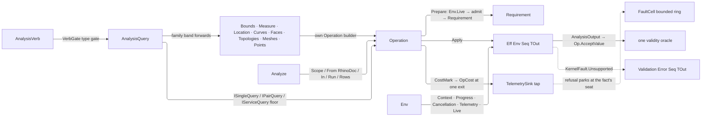

# [RASM_ANALYSIS_QUERY]

`AnalysisQuery` `[Union]` is the kernel's one public request algebra, `AnalysisVerb` its executable roster, and `Analyze` its execution facade — the measured-query runtime every host consumer enters. Call arity is recovered from the case through the `Single`/`Pair`/`Service` dispatchers reading the arity floor it realizes, never a name suffix, a verb sibling, or a mode knob, and the geometry band absorbs the geometry-request vocabulary as first-class cases: a second request ADT re-dispatched through a mapping switch into the same operations is the killed form, and a factory forwarding to another factory in two hops resolves in one instead. `Analyze.From(RhinoDoc)` is the surface's one doc-coupled adapter.

`Analyze` is ONE class on this page, not a facade fragmented across five: `Analysis/measure`, `Analysis/inspect`, `Analysis/select`, `Analysis/relations`, and `Parametric/locate` publish their operation builders on their OWN owners — `Measure`, `Bounds`, `ConformanceMetric`, `Topologies`, `Meshes`, `Curves`, `Faces`, `Points`, `Relations` — and this page reaches them through the union's arity dispatch alone. `Operation<TGeometry, TOut>` carries the effect algebra over `Eff<Env, _>`, threading `Op` as the value key while `Env` holds the ambient runtime from `Domain/results`; acceptance delegates to the one `Domain/validation` oracle `Op.AcceptValue`, and the host re-enters against frozen spellings a rename breaks.

## [01]-[INDEX]

- [02]-[REQUEST_ALGEBRA]: `AnalysisBand`, `QueryArity`, the three arity floors, `VerbGate`, `AnalysisVerb` the keyed roster, and `AnalysisQuery` the floor-dispatched request `[Union]` with its geometry and spatial band builders.
- [03]-[OPERATION_RUNTIME]: `Operation<TGeometry, TOut>` the effect algebra, `Env` the runtime, and `Analyze` the facade over `Validation`.
- [04]-[DENSITY_BAR]: one owner per concern, each returning on the type its row names.

## [02]-[REQUEST_ALGEBRA]

- Owner: `AnalysisVerb` `[SmartEnum<string>]` is the ENUMERABLE roster — one row per request case carrying its `AnalysisBand` and its `VerbGate` type gate, with `Arities` DERIVED off the case rather than declared. `ISingleQuery`/`IPairQuery`/`IServiceQuery` are the three arity floors a case realizes; `VerbGate` closes owned-versus-delegated admission; `AnalysisQuery` `[Union]` mints the request vocabulary across those four bands, request cases being data rather than operations, so the union carries no `[GenerateUnionOps]`.
- Cases: geometry `Coerce` `CurveForm` `Vertices` `SamplePoints` `SurfaceUv` `Closest` `SignedDistance`; family `Bounds` `Measure` `Location` `Curves` `Faces` `Topologies` `Meshes` `Points`; relation `Intersections` `Classification` `CurveDeviation` `SelfIntersection` `Ray` `Conformance`; spatial `SearchBox` `SearchSphere` `Overlap` `PointPairs`. `Conformance` is the one case realizing two floors — the input shape, never a second case or a mode, decides whether the runtime samples a pair or folds a stream of residuals the consumer measured.
- Law: the CASE is the authority and the row its declared metadata — a case cannot compile without naming its `Verb`, so a new operation is one case and one row. Arity is the FLOOR a case realizes, never a set a row declares: a case claiming a shape it cannot build fails to compile, and `Arities` reads back off those floors, so the declaration bug the virtual `Build` triple once surfaced as a runtime `Unsupported` has no spelling left.
- Law: the case↔row correspondence is PROVED at type init through the `Covered` accessor `Analyze.Rows` publishes — a verb row no case names, and two cases naming one verb, both raise there rather than reaching a caller as `Unsupported`.
- Law: admission delegation is a declared `VerbGate` VALUE — the family, relation, and conformance rows carry `DelegatedCase` because the table deciding their admission is the owner union's own (`Bounds`, `ConformanceMetric`, `Relations`) and duplicating eight tables here mints a second authority, while a row that FORGOT its gate cannot compile.
- Auto: the three dispatchers gate once — the arity floor, then the row's `Admits` — so the twenty output-type ternaries the arms once repeated live as eleven owned gates; parameterless `Bounds()` defaults to `Bounds.AxisAligned` through the `Option` tail, and `Conformance` REFUSES percentiles on any metric but `ConformanceMetric.Distribution` rather than dropping the argument it was handed, its absent sampling budget being what a measured-residual caller spells.
- Packages: Thinktecture.Runtime.Extensions (`[Union]`, `[SmartEnum<string>]`, generated `Switch`), LanguageExt.Core (`Fin`/`Option`/`Seq`/`Eff`), `Rasm.Domain` (the `Op`/`Fault`/`Requirement`/`Context` types, `CapabilitySet`, `RosterFold.Collisions`, the coercion and evaluation tables), `Rasm.Spatial` (the `Spatial/neighbors` substrate), RhinoCommon (`Point3d`/`Point2d`/`BoundingBox`/`Sphere` payload values), BCL inbox (`RuntimeHelpers.GetUninitializedObject` at the coverage proof alone).
- Growth: a new query modality is one case realizing its arity floors, one factory, and one `AnalysisVerb` row; a family page gaining a capability adds a case to ITS union with this algebra untouched, a new relation forwards to a `Relations` builder, a new spatial probe is one `NeighborQuery` case on the `Spatial/neighbors` owner, and a new band is one `AnalysisBand` row admitted by charter amendment.
- Boundary: the row's type gate rejects onto `KernelFault.Unsupported`, the host binding's probe discriminant, while spatial value defects reject `KernelFault.InvalidInput` at build; the geometry band composes the `Domain/normalization` coercion table and the `Domain/evaluation` `Evaluate` verb union rather than re-implementing either locally; the spatial band rides one service spine forwarding to the `Spatial/neighbors` owner's `NeighborIndex.Query` and projecting its `NeighborAnswer` through the substrate's own total `Switch`, the `Graph` arm refusing `Unsupported` by name because this spine publishes element sequences — pair-probe admission is the substrate's law, so a query-side probe whitelist, RTree wrapper, or second answer vocabulary is the deleted parallel path.

```csharp
// --- [IMPORTS] -------------------------------------------------------------------------
using System;
using System.Collections.Frozen;
using System.Globalization;
using System.Runtime.CompilerServices;
using System.Threading;
using LanguageExt;
using Rasm.Domain;
using Rasm.Parametric;
using Rasm.Spatial;
using Rhino.Geometry;
using Thinktecture;
using static LanguageExt.Prelude;

namespace Rasm.Analysis;

// --- [TYPES] ---------------------------------------------------------------------------
[SmartEnum<string>][KeyMemberEqualityComparer<ComparerAccessors.StringOrdinal, string>]
public sealed partial class AnalysisBand {
    public static readonly AnalysisBand Geometry = new(key: "geometry");
    public static readonly AnalysisBand Family = new(key: "family");
    public static readonly AnalysisBand Relation = new(key: "relation");
    public static readonly AnalysisBand Spatial = new(key: "spatial");
}

[SmartEnum<string>][KeyMemberEqualityComparer<ComparerAccessors.StringOrdinal, string>]
public sealed partial class QueryArity : ICapability<QueryArity> {
    public static readonly QueryArity Single = new(key: "single", rank: 0);
    public static readonly QueryArity Pair = new(key: "pair", rank: 1);
    public static readonly QueryArity Service = new(key: "service", rank: 2);
    public int Rank { get; }
}

internal interface ISingleQuery {
    Operation<TGeometry, TOut> Build<TGeometry, TOut>(Op key) where TGeometry : notnull where TOut : notnull;
}
internal interface IPairQuery {
    Operation<(TA A, TB B), TOut> Build<TA, TB, TOut>(Op key) where TA : notnull where TB : notnull where TOut : notnull;
}
internal interface IServiceQuery {
    Operation<Unit, TOut> Build<TOut>(Op key) where TOut : notnull;
}

[Union]
public abstract partial record VerbGate {
    private VerbGate() { }
    public sealed record OwnedCase(Func<Type, Type, bool> Admits) : VerbGate;
    public sealed record DelegatedCase : VerbGate;
}

[SmartEnum<string>][KeyMemberEqualityComparer<ComparerAccessors.StringOrdinal, string>]
public sealed partial class AnalysisVerb {
    private static readonly VerbGate Delegated = new VerbGate.DelegatedCase();

    // --- [GEOMETRY_BAND]
    public static readonly AnalysisVerb Coerce = new(key: "coerce", band: AnalysisBand.Geometry, gate: new VerbGate.OwnedCase(Admits: static (g, o) => Capability.Coercible(source: g, target: o)));
    public static readonly AnalysisVerb CurveForm = new(key: "curve-form", band: AnalysisBand.Geometry, gate: new VerbGate.OwnedCase(Admits: static (_, o) => o == typeof(Rasm.Domain.CurveForm)));
    public static readonly AnalysisVerb Vertices = new(key: "vertices", band: AnalysisBand.Geometry, gate: new VerbGate.OwnedCase(Admits: static (_, o) => o == typeof(Point3d)));
    public static readonly AnalysisVerb Samples = new(key: "sample-points", band: AnalysisBand.Geometry, gate: new VerbGate.OwnedCase(Admits: static (_, o) => o == typeof(Point3d)));
    public static readonly AnalysisVerb SurfaceUv = new(key: "surface-uv", band: AnalysisBand.Geometry, gate: new VerbGate.OwnedCase(Admits: static (_, o) => o == typeof(Point2d)));
    public static readonly AnalysisVerb Closest = new(key: "closest", band: AnalysisBand.Geometry, gate: new VerbGate.OwnedCase(Admits: static (_, o) => o == typeof(ClosestHit)));
    public static readonly AnalysisVerb Signed = new(key: "signed-distance", band: AnalysisBand.Geometry, gate: new VerbGate.OwnedCase(Admits: static (_, o) => o == typeof(double)));

    // --- [FAMILY_BAND]
    public static readonly AnalysisVerb Bounds = new(key: "bounds", band: AnalysisBand.Family, gate: Delegated);
    public static readonly AnalysisVerb Measure = new(key: "measure", band: AnalysisBand.Family, gate: Delegated);
    public static readonly AnalysisVerb Location = new(key: "location", band: AnalysisBand.Family, gate: Delegated);
    public static readonly AnalysisVerb Curves = new(key: "curves", band: AnalysisBand.Family, gate: Delegated);
    public static readonly AnalysisVerb Faces = new(key: "faces", band: AnalysisBand.Family, gate: Delegated);
    public static readonly AnalysisVerb Topologies = new(key: "topologies", band: AnalysisBand.Family, gate: Delegated);
    public static readonly AnalysisVerb Meshes = new(key: "meshes", band: AnalysisBand.Family, gate: Delegated);
    public static readonly AnalysisVerb Points = new(key: "points", band: AnalysisBand.Family, gate: Delegated);

    // --- [RELATION_BAND]
    public static readonly AnalysisVerb Intersections = new(key: "intersections", band: AnalysisBand.Relation, gate: Delegated);
    public static readonly AnalysisVerb Classification = new(key: "classification", band: AnalysisBand.Relation, gate: Delegated);
    public static readonly AnalysisVerb Deviation = new(key: "curve-deviation", band: AnalysisBand.Relation, gate: Delegated);
    public static readonly AnalysisVerb SelfIntersection = new(key: "self-intersection", band: AnalysisBand.Relation, gate: Delegated);
    public static readonly AnalysisVerb Ray = new(key: "ray", band: AnalysisBand.Relation, gate: Delegated);
    public static readonly AnalysisVerb Conformance = new(key: "conformance", band: AnalysisBand.Relation, gate: Delegated);

    // --- [SPATIAL_BAND]
    public static readonly AnalysisVerb SearchBox = new(key: "search-box", band: AnalysisBand.Spatial, gate: new VerbGate.OwnedCase(Admits: static (_, o) => o == typeof(NeighborHit)));
    public static readonly AnalysisVerb SearchSphere = new(key: "search-sphere", band: AnalysisBand.Spatial, gate: new VerbGate.OwnedCase(Admits: static (_, o) => o == typeof(NeighborHit)));
    public static readonly AnalysisVerb Overlap = new(key: "overlap", band: AnalysisBand.Spatial, gate: new VerbGate.OwnedCase(Admits: static (_, o) => o == typeof(NeighborPair)));
    public static readonly AnalysisVerb PointPairs = new(key: "point-pairs", band: AnalysisBand.Spatial, gate: new VerbGate.OwnedCase(Admits: static (_, o) => o == typeof(NeighborPair)));

    public AnalysisBand Band { get; }
    public VerbGate Gate { get; }
    public bool Admits(Type geometry, Type output) => Gate.Switch(
        state: (Geometry: geometry, Output: output),
        ownedCase: static (types, owned) => owned.Admits(arg1: types.Geometry, arg2: types.Output),
        delegatedCase: static (_, _) => true);
    public CapabilitySet<QueryArity> Arities => Coverage.Value[this];
    public Op Op => Keys.Value[this];
    public static Seq<AnalysisVerb> Covered => Coverage.Value.Keys.AsIterable().ToSeq();
    private static readonly Lazy<FrozenDictionary<AnalysisVerb, Op>> Keys =
        new(static () => Items.ToFrozenDictionary(static row => row, static row => Op.Of(name: row.Key)));

    private static readonly Lazy<FrozenDictionary<AnalysisVerb, CapabilitySet<QueryArity>>> Coverage = new(static () => {
        Seq<(AnalysisVerb Verb, CapabilitySet<QueryArity> Arities)> claimed = toSeq(typeof(AnalysisQuery).GetNestedTypes())
            .Filter(static candidate => candidate.IsSealed && typeof(AnalysisQuery).IsAssignableFrom(candidate))
            .Map(static candidate => (AnalysisQuery)RuntimeHelpers.GetUninitializedObject(type: candidate))
            .Map(static instance => (instance.Verb, Arities: CapabilitySet<QueryArity>.Of(Floors(query: instance).ToArray())))
            .Strict();
        Seq<AnalysisVerb> twinned = claimed.Collisions(static row => row.Verb);
        return claimed.Count == Items.Count && twinned.IsEmpty
            ? claimed.ToFrozenDictionary(static row => row.Verb, static row => row.Arities)
            : throw new InvalidOperationException(message: string.Create(provider: CultureInfo.InvariantCulture,
                $"AnalysisVerb holds {Items.Count} rows against {claimed.Count} cases, twinned on [{string.Join(',', twinned.Map(static row => row.Key))}]."));
    }, LazyThreadSafetyMode.ExecutionAndPublication);

    private static Seq<QueryArity> Floors(AnalysisQuery query) =>
        Seq(
            query is ISingleQuery ? Some(QueryArity.Single) : Option<QueryArity>.None,
            query is IPairQuery ? Some(QueryArity.Pair) : Option<QueryArity>.None,
            query is IServiceQuery ? Some(QueryArity.Service) : Option<QueryArity>.None)
        .Choose(static candidate => candidate);
}

[Union]
public abstract partial record AnalysisQuery {
    private AnalysisQuery() { }
    public abstract AnalysisVerb Verb { get; }

    // --- [GEOMETRY_BAND]
    public sealed record CoerceCase(Type Output) : AnalysisQuery, ISingleQuery {
        public override AnalysisVerb Verb => AnalysisVerb.Coerce;
        Operation<TGeometry, TOut> ISingleQuery.Build<TGeometry, TOut>(Op key) => Cast<TGeometry, TOut>(output: Output, key: key);
    }
    public sealed record CurveFormCase : AnalysisQuery, ISingleQuery {
        public override AnalysisVerb Verb => AnalysisVerb.CurveForm;
        Operation<TGeometry, TOut> ISingleQuery.Build<TGeometry, TOut>(Op key) => Form<TGeometry, TOut>(key: key);
    }
    public sealed record VerticesCase : AnalysisQuery, ISingleQuery {
        public override AnalysisVerb Verb => AnalysisVerb.Vertices;
        Operation<TGeometry, TOut> ISingleQuery.Build<TGeometry, TOut>(Op key) => Nodes<TGeometry, TOut>(key: key);
    }
    public sealed record SamplePointsCase(int Count) : AnalysisQuery, ISingleQuery {
        public override AnalysisVerb Verb => AnalysisVerb.Samples;
        Operation<TGeometry, TOut> ISingleQuery.Build<TGeometry, TOut>(Op key) => Sampled<TGeometry, TOut>(count: Count, key: key);
    }
    public sealed record SurfaceUvCase(Point2d Uv) : AnalysisQuery, ISingleQuery {
        public override AnalysisVerb Verb => AnalysisVerb.SurfaceUv;
        Operation<TGeometry, TOut> ISingleQuery.Build<TGeometry, TOut>(Op key) => Uv<TGeometry, TOut>(uv: Uv, key: key);
    }
    public sealed record ClosestCase(Point3d Target) : AnalysisQuery, ISingleQuery {
        public override AnalysisVerb Verb => AnalysisVerb.Closest;
        Operation<TGeometry, TOut> ISingleQuery.Build<TGeometry, TOut>(Op key) => Nearest<TGeometry, TOut>(target: Target, key: key);
    }
    public sealed record SignedDistanceCase(Point3d Sample) : AnalysisQuery, ISingleQuery {
        public override AnalysisVerb Verb => AnalysisVerb.Signed;
        Operation<TGeometry, TOut> ISingleQuery.Build<TGeometry, TOut>(Op key) => Signed<TGeometry, TOut>(sample: Sample, key: key);
    }

    // --- [FAMILY_BAND]
    public sealed record BoundsCase(Bounds Query) : AnalysisQuery, ISingleQuery {
        public override AnalysisVerb Verb => AnalysisVerb.Bounds;
        Operation<TGeometry, TOut> ISingleQuery.Build<TGeometry, TOut>(Op key) => Query.Operation<TGeometry, TOut>();
    }
    public sealed record MeasureCase(Measure Query) : AnalysisQuery, ISingleQuery {
        public override AnalysisVerb Verb => AnalysisVerb.Measure;
        Operation<TGeometry, TOut> ISingleQuery.Build<TGeometry, TOut>(Op key) => Query.Operation<TGeometry, TOut>();
    }
    public sealed record LocationCase(Location Query) : AnalysisQuery, ISingleQuery {
        public override AnalysisVerb Verb => AnalysisVerb.Location;
        Operation<TGeometry, TOut> ISingleQuery.Build<TGeometry, TOut>(Op key) => Query.Operation<TGeometry, TOut>();
    }
    public sealed record CurvesCase(Curves Query) : AnalysisQuery, ISingleQuery {
        public override AnalysisVerb Verb => AnalysisVerb.Curves;
        Operation<TGeometry, TOut> ISingleQuery.Build<TGeometry, TOut>(Op key) => Query.Operation<TGeometry, TOut>();
    }
    public sealed record FacesCase(Faces Query) : AnalysisQuery, ISingleQuery {
        public override AnalysisVerb Verb => AnalysisVerb.Faces;
        Operation<TGeometry, TOut> ISingleQuery.Build<TGeometry, TOut>(Op key) => Query.Operation<TGeometry, TOut>();
    }
    public sealed record TopologyCase(Topologies Query) : AnalysisQuery, ISingleQuery {
        public override AnalysisVerb Verb => AnalysisVerb.Topologies;
        Operation<TGeometry, TOut> ISingleQuery.Build<TGeometry, TOut>(Op key) => Query.Operation<TGeometry, TOut>();
    }
    public sealed record MeshesCase(Meshes Query) : AnalysisQuery, ISingleQuery {
        public override AnalysisVerb Verb => AnalysisVerb.Meshes;
        Operation<TGeometry, TOut> ISingleQuery.Build<TGeometry, TOut>(Op key) => Query.Operation<TGeometry, TOut>();
    }
    public sealed record PointsCase(Points Query) : AnalysisQuery, ISingleQuery {
        public override AnalysisVerb Verb => AnalysisVerb.Points;
        Operation<TGeometry, TOut> ISingleQuery.Build<TGeometry, TOut>(Op key) => Query.Operation<TGeometry, TOut>();
    }

    // --- [RELATION_BAND]
    public sealed record IntersectionsCase : AnalysisQuery, IPairQuery {
        public override AnalysisVerb Verb => AnalysisVerb.Intersections;
        Operation<(TA A, TB B), TOut> IPairQuery.Build<TA, TB, TOut>(Op key) => Relations.Intersect<TA, TB, TOut>(key: key);
    }
    public sealed record ClassificationCase : AnalysisQuery, IPairQuery {
        public override AnalysisVerb Verb => AnalysisVerb.Classification;
        Operation<(TA A, TB B), TOut> IPairQuery.Build<TA, TB, TOut>(Op key) => Relations.Classify<TA, TB, TOut>(key: key);
    }
    public sealed record CurveDeviationCase : AnalysisQuery, IPairQuery {
        public override AnalysisVerb Verb => AnalysisVerb.Deviation;
        Operation<(TA A, TB B), TOut> IPairQuery.Build<TA, TB, TOut>(Op key) => Relations.Deviate<TA, TB, TOut>(key: key);
    }
    public sealed record SelfIntersectionCase : AnalysisQuery, ISingleQuery {
        public override AnalysisVerb Verb => AnalysisVerb.SelfIntersection;
        Operation<TGeometry, TOut> ISingleQuery.Build<TGeometry, TOut>(Op key) => Relations.SelfIntersect<TGeometry, TOut>(key: key);
    }
    public sealed record RayCase(RayQuery Query) : AnalysisQuery, ISingleQuery {
        public override AnalysisVerb Verb => AnalysisVerb.Ray;
        Operation<TGeometry, TOut> ISingleQuery.Build<TGeometry, TOut>(Op key) => Relations.Cast<TGeometry, TOut>(query: Query, key: key);
    }
    public sealed record ConformanceCase(ConformanceMetric Metric, Option<int> Count, Seq<double> Percentiles) : AnalysisQuery, ISingleQuery, IPairQuery {
        public override AnalysisVerb Verb => AnalysisVerb.Conformance;
        Operation<TGeometry, TOut> ISingleQuery.Build<TGeometry, TOut>(Op key) =>
            Count.IsNone ? ConformanceMetric.Measured<TGeometry, TOut>(metric: Metric, percentiles: Percentiles, key: key) : key.Unsupported<TGeometry, TOut>();
        Operation<(TA A, TB B), TOut> IPairQuery.Build<TA, TB, TOut>(Op key) =>
            ConformanceMetric.Sampled<TA, TB, TOut>(metric: Metric, count: Count, percentiles: Percentiles, key: key);
    }

    // --- [SPATIAL_BAND]
    public sealed record SearchBoxCase(NeighborIndex Index, BoundingBox Box) : AnalysisQuery, IServiceQuery {
        public override AnalysisVerb Verb => AnalysisVerb.SearchBox;
        Operation<Unit, TOut> IServiceQuery.Build<TOut>(Op key) =>
            Box.IsValid
                ? Spine<TOut>(key: key, resolve: _ => Fin.Succ(Index), query: new NeighborQuery.BoxCase(Bounds: Box), anchor: Box.Center)
                : Operation<Unit, TOut>.Reject(key: key, fault: key.InvalidInput());
    }
    public sealed record SearchSphereCase(NeighborIndex Index, Sphere Sphere) : AnalysisQuery, IServiceQuery {
        public override AnalysisVerb Verb => AnalysisVerb.SearchSphere;
        Operation<Unit, TOut> IServiceQuery.Build<TOut>(Op key) =>
            Sphere.IsValid
                ? Spine<TOut>(key: key, resolve: _ => Fin.Succ(Index), query: new NeighborQuery.BallCase(Ball: Sphere), anchor: Sphere.Center)
                : Operation<Unit, TOut>.Reject(key: key, fault: key.InvalidInput());
    }
    public sealed record OverlapCase(NeighborIndex Left, NeighborIndex Right, Tolerance Band) : AnalysisQuery, IServiceQuery {
        public override AnalysisVerb Verb => AnalysisVerb.Overlap;
        Operation<Unit, TOut> IServiceQuery.Build<TOut>(Op key) =>
            Spine<TOut>(key: key, resolve: _ => Fin.Succ(Left), query: new NeighborQuery.OverlapsCase(Other: Right, Tolerance: Band.Value), anchor: Point3d.Origin);
    }
    public sealed record PointPairsCase(Seq<Point3d> Points, Seq<Point3d> Needles, NeighborQuery Probe) : AnalysisQuery, IServiceQuery {
        public override AnalysisVerb Verb => AnalysisVerb.PointPairs;
        Operation<Unit, TOut> IServiceQuery.Build<TOut>(Op key) =>
            Spine<TOut>(key: key, resolve: op => NeighborIndex.Of(source: new NeighborSource.PointsCase(Values: Points), key: op), query: new NeighborQuery.PairsCase(Needles: Needles, Probe: Probe), anchor: Point3d.Origin);
    }

    // --- [FACTORIES]
    public static AnalysisQuery Coerce(Type output) => new CoerceCase(Output: output);
    public static AnalysisQuery CurveForm => new CurveFormCase();
    public static AnalysisQuery Vertices => new VerticesCase();
    public static AnalysisQuery SamplePoints(int count) => new SamplePointsCase(Count: count);
    public static AnalysisQuery SurfaceUv(Point2d uv) => new SurfaceUvCase(Uv: uv);
    public static AnalysisQuery Closest(Point3d target) => new ClosestCase(Target: target);
    public static AnalysisQuery SignedDistance(Point3d sample) => new SignedDistanceCase(Sample: sample);
    public static AnalysisQuery Bounds(Option<Bounds> query = default) => new BoundsCase(Query: query.IfNone(Analysis.Bounds.AxisAligned));
    public static AnalysisQuery Measure(Measure query) => new MeasureCase(Query: query);
    public static AnalysisQuery Location(Location query) => new LocationCase(Query: query);
    public static AnalysisQuery Selection(Curves query) => new CurvesCase(Query: query);
    public static AnalysisQuery Selection(Faces query) => new FacesCase(Query: query);
    public static AnalysisQuery Selection(Topologies query) => new TopologyCase(Query: query);
    public static AnalysisQuery MeshPointSpatial(Meshes query) => new MeshesCase(Query: query);
    public static AnalysisQuery MeshPointSpatial(Points query) => new PointsCase(Query: query);
    public static AnalysisQuery Intersections => new IntersectionsCase();
    public static AnalysisQuery Classification => new ClassificationCase();
    public static AnalysisQuery CurveDeviation => new CurveDeviationCase();
    public static AnalysisQuery SelfIntersection => new SelfIntersectionCase();
    public static AnalysisQuery Ray(RayQuery query) => new RayCase(Query: query);
    public static Fin<AnalysisQuery> Conformance(ConformanceMetric metric, Option<int> count = default, params ReadOnlySpan<double> percentiles) {
        Seq<double> requested = Iterable<double>.FromSpan(percentiles).ToSeq();
        return requested.IsEmpty || metric.Equals(ConformanceMetric.Distribution)
            ? Fin.Succ<AnalysisQuery>(new ConformanceCase(Metric: metric, Count: count, Percentiles: requested))
            : Fin.Fail<AnalysisQuery>(AnalysisVerb.Conformance.Op.InvalidInput(axis: nameof(percentiles)));
    }
    public static AnalysisQuery Search(NeighborIndex index, BoundingBox box) => new SearchBoxCase(Index: index, Box: box);
    public static AnalysisQuery Search(NeighborIndex index, Sphere sphere) => new SearchSphereCase(Index: index, Sphere: sphere);
    public static AnalysisQuery Overlaps(NeighborIndex left, NeighborIndex right, Tolerance band) => new OverlapCase(Left: left, Right: right, Band: band);
    public static AnalysisQuery PointPairs(ReadOnlySpan<Point3d> points, ReadOnlySpan<Point3d> needles, NeighborQuery probe) =>
        new PointPairsCase(Points: Seq(points), Needles: Seq(needles), Probe: probe);

    // --- [ARITY_DISPATCH]
    internal Operation<TGeometry, TOut> Single<TGeometry, TOut>(Op key) where TGeometry : notnull where TOut : notnull =>
        this is ISingleQuery single && Verb.Admits(geometry: typeof(TGeometry), output: typeof(TOut))
            ? single.Build<TGeometry, TOut>(key: key)
            : key.Unsupported<TGeometry, TOut>();
    internal Operation<(TA A, TB B), TOut> Pair<TA, TB, TOut>(Op key) where TA : notnull where TB : notnull where TOut : notnull =>
        this is IPairQuery pair && Verb.Admits(geometry: typeof(TA), output: typeof(TOut))
            ? pair.Build<TA, TB, TOut>(key: key)
            : key.Unsupported<(TA A, TB B), TOut>();
    internal Operation<Unit, TOut> Service<TOut>(Op key) where TOut : notnull =>
        this is IServiceQuery served && Verb.Admits(geometry: typeof(Unit), output: typeof(TOut))
            ? served.Build<TOut>(key: key)
            : key.Unsupported<Unit, TOut>();

    // --- [GEOMETRY_BAND_BUILDERS]
    private static Operation<TGeometry, TOut> Cast<TGeometry, TOut>(Type output, Op key) where TGeometry : notnull where TOut : notnull =>
        output == typeof(TOut)
            ? Operation<TGeometry, TOut>.Build(key: key, requirement: Some(Requirement.Basic), requiresContext: true, state: key,
                evaluator: static (op, geometry) =>
                    from context in Env.Asks
                    from value in geometry.CoerceTo<TOut>(context: context, key: op).ToEff()
                    from admitted in new AnalysisOutput<TOut>(Key: op).One(value: value).ToEff()
                    select admitted)
            : key.Unsupported<TGeometry, TOut>();
    private static Operation<TGeometry, TOut> Form<TGeometry, TOut>(Op key) where TGeometry : notnull where TOut : notnull =>
        Operation<TGeometry, Rasm.Domain.CurveForm>.Build(key: key, requirement: Some(Requirement.Basic), requiresContext: true, state: key,
            evaluator: static (op, geometry) =>
                from context in Env.Asks
                from form in Normalization.CurveForm(source: geometry, key: op).Bind(lease => lease.Use(curve => Normalization.CurveFormOf(curve: curve, context: context))).ToEff()
                from admitted in new AnalysisOutput<Rasm.Domain.CurveForm>(Key: op).One(value: form).ToEff()
                select admitted)
            .As<TGeometry, TOut>(key: key);
    private static Operation<TGeometry, TOut> Nodes<TGeometry, TOut>(Op key) where TGeometry : notnull where TOut : notnull =>
        Operation<TGeometry, Point3d>.Build(key: key, state: key,
            evaluator: static (op, geometry) =>
                from answer in geometry.Evaluate(request: new EvaluationRequest.Vertices(), key: op).ToEff()
                from points in answer.Sites(key: op).ToEff()
                from admitted in new AnalysisOutput<Point3d>(Key: op).Many(values: points).ToEff()
                select admitted)
            .As<TGeometry, TOut>(key: key);
    private static Operation<TGeometry, TOut> Sampled<TGeometry, TOut>(int count, Op key) where TGeometry : notnull where TOut : notnull =>
        Operation<TGeometry, Point3d>.Build(key: key, requiresContext: true, state: (Key: key, Count: count),
            evaluator: static (state, geometry) =>
                from context in Env.Asks
                from answer in geometry.Evaluate(request: new EvaluationRequest.Sample(Count: state.Count, Model: context), key: state.Key).ToEff()
                from points in answer.Sites(key: state.Key).ToEff()
                from admitted in new AnalysisOutput<Point3d>(Key: state.Key).Many(values: points).ToEff()
                select admitted)
            .As<TGeometry, TOut>(key: key);
    private static Operation<TGeometry, TOut> Uv<TGeometry, TOut>(Point2d uv, Op key) where TGeometry : notnull where TOut : notnull =>
        Operation<TGeometry, Point2d>.Build(key: key, requirement: Some(Requirement.SurfaceEvaluation), requiresContext: true, state: (Key: key, Uv: uv),
            evaluator: static (state, geometry) =>
                from context in Env.Asks
                from result in Normalization.SurfaceForm(source: geometry, key: state.Key).Bind(lease => lease.Use(surface => Evaluation.SurfaceUv(surface: surface, uv: state.Uv, context: context, key: state.Key))).ToEff()
                from admitted in new AnalysisOutput<Point2d>(Key: state.Key).One(value: result).ToEff()
                select admitted)
            .As<TGeometry, TOut>(key: key);
    private static Operation<TGeometry, TOut> Nearest<TGeometry, TOut>(Point3d target, Op key) where TGeometry : notnull where TOut : notnull =>
        Operation<TGeometry, ClosestHit>.Build(key: key, state: (Key: key, Target: target),
            evaluator: static (state, geometry) =>
                from answer in geometry.Evaluate(request: new EvaluationRequest.Closest(Target: state.Target), key: state.Key).ToEff()
                from hit in answer.Hit(key: state.Key).ToEff()
                from admitted in new AnalysisOutput<ClosestHit>(Key: state.Key).One(value: hit).ToEff()
                select admitted)
            .As<TGeometry, TOut>(key: key);
    private static Operation<TGeometry, TOut> Signed<TGeometry, TOut>(Point3d sample, Op key) where TGeometry : notnull where TOut : notnull =>
        Operation<TGeometry, double>.Build(key: key, state: (Key: key, Sample: sample),
            evaluator: static (state, geometry) =>
                from answer in geometry.Evaluate(request: new EvaluationRequest.Signed(Sample: state.Sample), key: state.Key).ToEff()
                from distance in answer.Span(key: state.Key).ToEff()
                from admitted in new AnalysisOutput<double>(Key: state.Key).One(value: distance).ToEff()
                select admitted)
            .As<TGeometry, TOut>(key: key);

    // --- [SPATIAL_BAND_BUILDERS]
    private static Operation<Unit, TOut> Spine<TOut>(Op key, Func<Op, Fin<NeighborIndex>> resolve, NeighborQuery query, Point3d anchor) where TOut : notnull =>
        Operation<Unit, TOut>.Service(key: key, state: (Key: key, Resolve: resolve, Query: query, Anchor: anchor), evaluate: static state =>
            from runtime in Env.EnvAsks
            from index in state.Resolve(state.Key).ToEff()
            from answer in index.Query(query: state.Query, anchor: state.Anchor, key: state.Key, cancel: runtime.Cancellation).ToEff()
            from projected in Answer<TOut>(answer: answer, key: state.Key).ToEff()
            select projected);
    private static Fin<Seq<TOut>> Answer<TOut>(NeighborAnswer answer, Op key) => answer.Switch(
        state: key,
        hits: static (op, found) => new AnalysisOutput<TOut>(Key: op).Many(values: found.Values),
        pairsFound: static (op, found) => new AnalysisOutput<TOut>(Key: op).Many(values: found.Values),
        graph: static (op, _) => Fin.Fail<Seq<TOut>>(op.Unsupported(inputType: typeof(NeighborhoodGraph), outputType: typeof(TOut))));
}
```

## [03]-[OPERATION_RUNTIME]

- Owner: `Env` is the `Eff` reader runtime, its record shape host-frozen — the Grasshopper binding constructs it positionally and the sink is the defaulted trailing field, so every frozen construction spelling survives a new runtime field — and `Env.Live` is the ONE cancellation gate all four bodies bind. `Operation<TGeometry, TOut>` is the operation algebra behind a private `Body` `[Union]` (`Rejected`/`PerItem`/`Aggregate`/`Service`) with one constructor per case, a `Prepare` gate ahead of every input-bearing evaluator, and one `Apply` fold over the `Body` `Switch` opening a `CostMark` before the fold and charging one `OpCost` capsule at ONE exit. `Analyze` is the ONE facade — `Scope` binding context, progress, cancellation, and sink; `From(RhinoDoc)` the one doc adapter; host-neutral `In` scope builders; `Query` closing three arities, `Run` four overloads over `Validation<Error, Seq<TOut>>`, and `Rows` publishing the proved verb roster. `AnalysisOutput<TOut>` is the typed projection gate admitting every value through `Op.AcceptValue`, the one oracle; a row publishing a runtime-typed output reads the `Domain/validation` `OutputBinding` owner instead.
- Entry: `Analyze.Run<…>` closes single-query, pair-query, service-query, and already-built-operation inputs onto `Validation<Error, Seq<TOut>>` — one entry family discriminated by query and input shape, no `RunMany`/`RunPair`/`RunService` verb siblings; scoped execution threads `Analyze.In(…).With(progress).With(cancel).Run(operation, input)` and `With(factory, version, faults)` is the one sink mint, so a host never constructs a `TelemetrySink` beside the scope that carries it.
- Auto: `Prepare` binds `Env.Live` first (`Errors.Cancelled`), absence second (`KernelFault.MissingGeometry`), then the `Requirement` matrix — an empty requirement still routes `GeometryBase` values through the validity-oracle admission so no geometry reaches an evaluator unvetted, while non-geometry service payloads pass untouched; a `Service` body carries no input and so reaches none of that fold, binding the same `Env.Live` ahead of its evaluator, so all four bodies refuse a cancelled run on the one direct-poll cancellation value the advertised `With(cancel)` surface promises and no second `IsCancellationRequested` ladder exists to forget the token; scope-less `Run` fails `KernelFault.MissingContext` when an operation `NeedsContext` and otherwise defaults to `Context.Of(units: UnitSystem.Millimeters)`; `Apply` flattens per-item chunks, feeds aggregates the whole prepared `Seq`, and lifts a `Rejected` body's fault onto the effect type, rejection staying data until execution.
- Law: `Charge` is ONE member reading ONE exit value — `Match` collapses both legs of the fold onto that `Fin` and the outcome row and fault payload both derive from it, so cost evidence and fault evidence cannot name different verdicts for one call. Per-item evaluation distributes over input concatenation on the VALUE channel alone, because `Apply`'s cost capsule is an aggregation point billing one `OpCost` per call.
- Law: a sink refusal PARKS on the composition's own bounded evidence cell at the fact's declared seat, never `ignore`d (branch RULINGS `[02]`) — telemetry can no more fail the analysis than it can vanish, and a full ring counts the loss as a number.
- Output: `Validation<Error, Seq<TOut>>` is the public result carrier; faults accumulate the `Domain/results` `Fault` union, `KernelFault.Unsupported` the host probe discriminant.
- Packages: LanguageExt.Core (the `Validation`/`Fin` types and `TraverseM`), Thinktecture.Runtime.Extensions (the `Body` `[Union]` and generated `Switch`), `Rasm.Domain` (`Context.Of` builders, `Requirement.Apply`, `TelemetrySink`/`SignalFact`/`CostMark`/`Outcome`, the `Op`/`Fault` types), RhinoCommon (`RhinoDoc` at the one `From` adapter, `UnitSystem`).
- Growth: a new execution modality is one `Body` case with one constructor on the same owner, never a second operation class; a new scope source is one `In`/`From` overload minting a `Context`; a new runtime capability is one field on `Env` threaded by the reader with zero operation edits.
- Boundary: `Analyze.From(RhinoDoc)` is the one document-coupled adapter in the folder, so a second `RhinoDoc` reach anywhere in the analysis surface is the boundary violation; a folder-local `ValidityOf` switch re-declaring result arms beside `Op.AcceptValue` is the killed parallel oracle; `Build` and `Service` evaluators receive state by value through `static` lambdas over an explicit state record, keeping operations allocation-lean and referentially transparent; the `As` object-lift is the sanctioned type-erasure bridge, rejecting onto `KernelFault.Unsupported` rather than casting unsafely; `OperationLift` is the one host for the type bridges C# cannot declare inside a generic owner, and host machinery that throws is wrapped at its owning boundary through `Op.Catch`.

```csharp
// --- [IMPORTS] -------------------------------------------------------------------------
using System;
using System.Diagnostics.Metrics;
using System.Runtime.InteropServices;
using System.Threading;
using LanguageExt;
using LanguageExt.Common;
using Rasm.Domain;
using Rhino;
using Rhino.Geometry;
using Thinktecture;
using static LanguageExt.Prelude;

namespace Rasm.Analysis;

// --- [MODELS] --------------------------------------------------------------------------
public sealed record Env(Context Context, Option<IProgress<double>> Progress, CancellationToken Cancellation, Option<TelemetrySink> Telemetry = default) {
    public static readonly Eff<Env, Env> EnvAsks = Eff.runtime<Env>().As();
    public static readonly Eff<Env, Context> Asks = Eff.runtime<Env>().Map(static env => env.Context).As();
    public static readonly Eff<Env, Option<TelemetrySink>> Taps = Eff.runtime<Env>().Map(static env => env.Telemetry).As();
    public static readonly Eff<Env, Unit> Live = EnvAsks.Bind(static runtime => (runtime.Cancellation.IsCancellationRequested switch {
        true => Fin.Fail<Unit>(Errors.Cancelled),
        false => Fin.Succ(unit),
    }).ToEff()).As();
}

[StructLayout(LayoutKind.Auto)]
internal readonly record struct AnalysisOutput<TOut>(Op Key) {
    public Fin<Seq<TOut>> One<TValue>(TValue value) => Many(values: Seq(value));
    public Fin<Seq<TOut>> Many<TValue>(Seq<TValue> values) => Project(key: Key, values: values);
    private static Fin<Seq<TOut>> Project<TValue>(Op key, Seq<TValue> values) =>
        typeof(TOut) == typeof(TValue)
            ? values.TraverseM(value => key.AcceptValue(value: value)).As().Map(static admitted => admitted.Map(static value => (TOut)(object)value!))
            : Fin.Fail<Seq<TOut>>(key.Unsupported(inputType: typeof(TValue), outputType: typeof(TOut)));
}

// --- [SERVICES] ------------------------------------------------------------------------
public sealed partial record Operation<TGeometry, TOut> where TGeometry : notnull {
    [Union]
    private abstract partial record Body {
        private Body() { }
        internal sealed record Rejected(Error Fault) : Body;
        internal sealed record PerItem(Func<TGeometry, Eff<Env, Seq<TOut>>> Evaluate) : Body;
        internal sealed record Aggregate(Func<Seq<TGeometry>, Eff<Env, Seq<TOut>>> Evaluate) : Body;
        internal sealed record Service(Func<Eff<Env, Seq<TOut>>> Evaluate) : Body;
    }
    private Operation(Op key, Requirement requirement, bool requiresContext, Body body) {
        Key = key;
        Requirement = requirement;
        RequiresContext = requiresContext;
        Execution = body;
    }
    public Op Key { get; }
    internal Requirement Requirement { get; init; }
    internal bool RequiresContext { get; init; }
    private Body Execution { get; init; }
    internal bool NeedsContext => RequiresContext || !Requirement.IsEmpty;
    internal static Operation<TGeometry, TOut> Build<TState>(Op key, TState state, Func<TState, TGeometry, Eff<Env, Seq<TOut>>> evaluator, Option<Requirement> requirement = default, bool requiresContext = false) {
        Requirement active = requirement.IfNone(Requirement.None);
        return new Operation<TGeometry, TOut>(key: key, requirement: active, requiresContext: requiresContext,
            body: new Body.PerItem(Evaluate: geometry =>
                from prepared in Prepare(geometry: geometry, requirement: active)
                from value in evaluator(arg1: state, arg2: prepared)
                select value));
    }
    internal static Operation<TGeometry, TOut> Aggregate(Op key, Func<Seq<TGeometry>, Eff<Env, Seq<TOut>>> project, Option<Requirement> requirement = default, bool requiresContext = false) {
        Requirement active = requirement.IfNone(Requirement.None);
        return new Operation<TGeometry, TOut>(key: key, requirement: active, requiresContext: requiresContext,
            body: new Body.Aggregate(Evaluate: geometry =>
                from resolved in geometry.TraverseM(item => Prepare(geometry: item, requirement: active)).As()
                from result in project(arg: resolved)
                select result));
    }
    internal static Operation<TGeometry, TOut> Reject(Op key, Error fault) =>
        new(key: key, requirement: Requirement.None, requiresContext: false, body: new Body.Rejected(Fault: fault));
    internal static Operation<TGeometry, TOut> Service<TState>(Op key, TState state, Func<TState, Eff<Env, Seq<TOut>>> evaluate, bool requiresContext = false) =>
        new(key: key, requirement: Requirement.None, requiresContext: requiresContext, body: new Body.Service(Evaluate: () =>
            from _ in Env.Live
            from result in evaluate(arg: state)
            select result));
    internal static Operation<TGeometry, TOut> Native<TNative, TValue, TState>(Op key, TState state, Func<TState, TNative, Eff<Env, Seq<TValue>>> project, Option<Requirement> requirement = default, bool requiresContext = false) where TNative : notnull =>
        Operation<TGeometry, TValue>.Build(
            key: key, requirement: requirement, requiresContext: requiresContext, state: (Key: key, State: state, Project: project),
            evaluator: static (carried, geometry) => geometry switch {
                TNative native => carried.Project(arg1: carried.State, arg2: native),
                _ => Fin.Fail<Seq<TValue>>(carried.Key.Unsupported(inputType: geometry.GetType(), outputType: typeof(TValue))).ToEff(),
            }).As<TGeometry, TOut>(key: key);
    public Eff<Env, Seq<TOut>> Apply(Seq<TGeometry> geometry) =>
        from runtime in Env.EnvAsks
        from mark in Fin.Succ(CostMark.Start()).ToEff()
        from exit in Folded(geometry: geometry).Match(
            Succ: static value => Fin.Succ(value),
            Fail: static error => Fin.Fail<Seq<TOut>>(error))
        from _ in Fin.Succ(Charge(runtime: runtime, key: Key, mark: mark, items: geometry.Count, exit: exit)).ToEff()
        from result in exit.ToEff()
        select result;
    private static Unit Charge(Env runtime, Op key, CostMark mark, int items, Fin<Seq<TOut>> exit) =>
        runtime.Telemetry.Match(
            Some: sink => Facts(key: key, mark: mark, items: items, exit: exit)
                .Choose(fact => sink.Tap(fact: fact, key: key).Match(
                    Succ: static _ => Option<(HookId Seat, Error Cause)>.None,
                    Fail: cause => Some((Seat: fact.At.Id, Cause: cause))))
                .Iter(parked => ignore(sink.Signals.Hooks.Faults.Park(point: parked.Seat, cause: parked.Cause))),
            None: static () => unit);
    private static Seq<SignalFact> Facts(Op key, CostMark mark, int items, Fin<Seq<TOut>> exit) =>
        Seq(
            Some(SignalFact.Cost(cost: mark.Stop(key: key, domain: KernelDomain.Analysis, items: items,
                outcome: exit.IsSucc ? Outcome.Succeeded : Outcome.Failed))),
            exit.Match(
                Succ: static _ => Option<SignalFact>.None,
                Fail: error => Some(SignalFact.Fault(domain: KernelDomain.Analysis, key: key, fault: error))))
        .Choose(static candidate => candidate);
    private Eff<Env, Seq<TOut>> Folded(Seq<TGeometry> geometry) =>
        Execution.Switch(
            state: geometry,
            rejected: static (_, r) => Fin.Fail<Seq<TOut>>(r.Fault).ToEff(),
            perItem: static (items, i) => items.TraverseM(i.Evaluate).As().Map(static chunks => chunks.Bind(static chunk => chunk)),
            aggregate: static (items, a) => a.Evaluate(arg: items),
            service: static (_, s) => s.Evaluate());
    internal Fin<Operation<TGeometry, TOut>> Supported() =>
        Execution.Switch(
            state: this,
            rejected: static (_, r) => Fin.Fail<Operation<TGeometry, TOut>>(r.Fault),
            perItem: static (self, _) => Fin.Succ(self),
            aggregate: static (self, _) => Fin.Succ(self),
            service: static (self, _) => Fin.Succ(self));
    private static Eff<Env, TGeometry> Prepare(TGeometry geometry, Requirement requirement) =>
        from runtime in Env.EnvAsks
        from _ in Env.Live
        from ready in Optional(geometry).ToFin(new KernelFault.MissingGeometry()).ToEff()
        from validated in requirement.IsEmpty && ready is not GeometryBase
            ? Fin.Succ(ready).ToEff()
            : requirement.Apply(context: runtime.Context, value: ready, cancel: runtime.Cancellation).ToFin().ToEff().Map(_ => ready)
        select validated;
}

// --- [OPERATIONS] ----------------------------------------------------------------------
public static class Analyze {
    public sealed record Scope {
        public Fin<Context> Context { get; }
        public Option<IProgress<double>> Progress { get; init; }
        public CancellationToken Cancellation { get; init; }
        public Option<TelemetrySink> Telemetry { get; init; }
        internal Scope(Fin<Context> context) => Context = context;
        public Scope With(IProgress<double> progress) => this with { Progress = Some(progress) };
        public Scope With(CancellationToken cancellation) => this with { Cancellation = cancellation };
        public Scope With(TelemetrySink telemetry) => this with { Telemetry = Some(telemetry) };
        public Fin<Scope> With(IMeterFactory factory, string version, FaultCell faults, Op? key = null) {
            Scope self = this;
            return TelemetrySink.Of(factory: factory, version: version, faults: faults, key: key.OrDefault())
                .Map(sink => self with { Telemetry = Some(sink) });
        }
        public Validation<Error, Seq<TOut>> Run<TGeometry, TOut>(Operation<TGeometry, TOut>? operation, params ReadOnlySpan<TGeometry> input) where TGeometry : notnull =>
            Analyze.Run(operation: operation, scope: Some(this), input: input);
    }
    public static Seq<AnalysisVerb> Rows => AnalysisVerb.Covered;
    public static Scope From(RhinoDoc? doc) => new(context: Context.Of(doc: doc).ToFin());
    public static Scope In(UnitSystem units) => new(context: Context.Of(units: units).ToFin());
    public static Scope In(double absolute, double relative, double angle, UnitSystem units) =>
        new(context: Context.Of(absolute: absolute, relative: relative, angle: angle, units: units).ToFin());
    public static Scope In(Context context) => new(context: Optional(context).ToFin(Op.Of(name: nameof(Scope)).MissingContext()));

    public static Operation<TGeometry, TOut> Query<TGeometry, TOut>(AnalysisQuery? query, Op? key = null) where TGeometry : notnull where TOut : notnull {
        Op active = key.OrDefault();
        return Optional(query).Map(q => q.Single<TGeometry, TOut>(key: active)).IfNone(Operation<TGeometry, TOut>.Reject(key: active, fault: active.InvalidInput()));
    }
    public static Operation<(TA A, TB B), TOut> Query<TA, TB, TOut>(AnalysisQuery? query, Op? key = null) where TA : notnull where TB : notnull where TOut : notnull {
        Op active = key.OrDefault();
        return Optional(query).Map(q => q.Pair<TA, TB, TOut>(key: active)).IfNone(Operation<(TA A, TB B), TOut>.Reject(key: active, fault: active.InvalidInput()));
    }
    public static Operation<Unit, TOut> Query<TOut>(AnalysisQuery? query, Op? key = null) where TOut : notnull {
        Op active = key.OrDefault();
        return Optional(query).Map(q => q.Service<TOut>(key: active)).IfNone(Operation<Unit, TOut>.Reject(key: active, fault: active.InvalidInput()));
    }

    public static Validation<Error, Seq<TOut>> Run<TGeometry, TOut>(AnalysisQuery query, params ReadOnlySpan<TGeometry> input) where TGeometry : notnull where TOut : notnull =>
        Run(operation: Query<TGeometry, TOut>(query: query), input: input);
    public static Validation<Error, Seq<TOut>> Run<TA, TB, TOut>(AnalysisQuery query, params ReadOnlySpan<(TA A, TB B)> input) where TA : notnull where TB : notnull where TOut : notnull =>
        Run(operation: Query<TA, TB, TOut>(query: query), input: input);
    public static Validation<Error, Seq<TOut>> Run<TOut>(AnalysisQuery query) where TOut : notnull =>
        Run(operation: Query<TOut>(query: query), input: Unit.Default);
    public static Validation<Error, Seq<TOut>> Run<TGeometry, TOut>(Operation<TGeometry, TOut>? operation, params ReadOnlySpan<TGeometry> input) where TGeometry : notnull =>
        Run(operation: operation, scope: Option<Scope>.None, input: input);

    private static Validation<Error, Seq<TOut>> Run<TGeometry, TOut>(Operation<TGeometry, TOut>? operation, Option<Scope> scope, ReadOnlySpan<TGeometry> input) where TGeometry : notnull {
        TGeometry[] inputValues = input.ToArray();
        (Option<IProgress<double>> progress, CancellationToken cancellation, Option<TelemetrySink> telemetry) = scope.Match(
            Some: static active => (active.Progress, active.Cancellation, active.Telemetry),
            None: static () => (Option<IProgress<double>>.None, CancellationToken.None, Option<TelemetrySink>.None));
        return (
            from active in Optional(operation).ToFin(new KernelFault.MissingOperation())
            from accepted in active.Supported()
            from context in scope.Match(
                Some: static provided => provided.Context,
                None: () => accepted.NeedsContext switch {
                    true => Fin.Fail<Context>(accepted.Key.MissingContext()),
                    false => Context.Of(units: UnitSystem.Millimeters).ToFin(),
                })
            from result in accepted.Apply(geometry: inputValues.AsIterable().ToSeq()).Run(env: new Env(Context: context, Progress: progress, Cancellation: cancellation, Telemetry: telemetry))
            select result).ToValidation();
    }
}

internal static class OperationLift {
    extension(Op key) {
        internal Operation<TGeometry, TOut> Unsupported<TGeometry, TOut>() where TGeometry : notnull =>
            Operation<TGeometry, TOut>.Reject(key: key, fault: key.Unsupported(inputType: typeof(TGeometry), outputType: typeof(TOut)));
    }
    extension(object operation) {
        internal Operation<TGeometry, TOut> As<TGeometry, TOut>(Op key) where TGeometry : notnull => operation switch {
            Operation<TGeometry, TOut> typed => typed,
            _ => Operation<TGeometry, TOut>.Reject(key: key, fault: key.Unsupported(inputType: typeof(TGeometry), outputType: typeof(TOut))),
        };
    }
    extension(EvaluationResult result) {
        internal Fin<ClosestHit> Hit(Op key) => result.Switch(
            state: key,
            hit: static (_, value) => Fin.Succ(value.Value),
            distance: static (op, _) => Fin.Fail<ClosestHit>(op.InvalidResult()),
            points: static (op, _) => Fin.Fail<ClosestHit>(op.InvalidResult()));
        internal Fin<double> Span(Op key) => result.Switch(
            state: key,
            hit: static (op, _) => Fin.Fail<double>(op.InvalidResult()),
            distance: static (_, value) => Fin.Succ(value.Value),
            points: static (op, _) => Fin.Fail<double>(op.InvalidResult()));
        internal Fin<Seq<Point3d>> Sites(Op key) => result.Switch(
            state: key,
            hit: static (op, _) => Fin.Fail<Seq<Point3d>>(op.InvalidResult()),
            distance: static (op, _) => Fin.Fail<Seq<Point3d>>(op.InvalidResult()),
            points: static (_, value) => Fin.Succ(value.Value));
    }
}
```



## [04]-[DENSITY_BAR]

Each concern homes at one owner returning on the type its row names.

| [INDEX] | [CONCERN]           | [OWNER]                       | [KIND]                        | [RESULT]                       |
| :-----: | :------------------ | :---------------------------- | :---------------------------- | :----------------------------- |
|  [01]   | Verb roster         | `AnalysisVerb`                | `[SmartEnum<string>]` 25 rows | `VerbGate` + derived `Arities` |
|  [02]   | Request vocabulary  | `AnalysisQuery`               | floor-dispatched `[Union]`    | `Operation` dispatch           |
|  [03]   | Arity floor         | `ISingleQuery` + two siblings | internal builder interfaces   | compile-time arity claim       |
|  [04]   | Operation algebra   | `Operation<TGeometry, TOut>`  | `Body` union + `Prepare`      | `Eff<Env, _>`                  |
|  [05]   | Runtime environment | `Env`                         | reader                        | `Eff<Env, _>` + `Live` gate    |
|  [06]   | Execution facade    | `Analyze`                     | `static class`                | `Validation<Error, Seq<TOut>>` |
|  [07]   | Output projection   | `AnalysisOutput<TOut>`        | `readonly record struct`      | `Fin<Seq<TOut>>`, one oracle   |

## [05]-[RESEARCH]

<!-- source-only: research row template:
[TOKEN]-[OPEN|BLOCKED]: <exact question>; <verification route>.
-->

(none)
