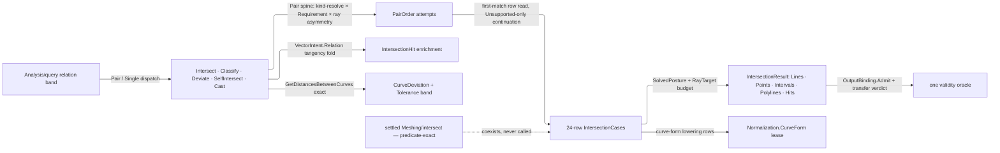

# [RASM_ANALYSIS_RELATIONS]

`Relations` owns pairwise geometric relation across the RhinoCommon-native intersection surface — intersection, classification, deviation, self-intersection, and ray casting. One data-driven table binds each type-pair to an admission predicate, a result shape, and a host-`Intersection` compute delegate taking the `Analysis/query` `Env` whole, so a new geometry pair is one row, never an `IntersectXxYy` method family. It is the host-parametric altitude, capturing the host's tolerance-banded machinery. This page's own static class owns it — the `Analyze` facade lives once on `Analysis/query` and this page adds no fragment to it.

Every relation answer is oracle-admitted evidence: the hit `[Union]`, the `RayQuery` request, and `CurveDeviation` declare `IValidityEvidence` and register with the one `Domain/validation` oracle. Curve-like operands recover through the `Domain/normalization` `CurveForm` lease, tangency classification folds the `Processing/intent` `VectorIntent.Relation` verb onto the intersection answer, mesh work reads `ToleranceLane.MeshIntersection`, and every pair builder shares the one `Pair` admission spine — with `IntersectionHit` and `RayQuery` the frozen boundary spellings the Grasshopper surface re-enters by name.

## [01]-[INDEX]

- [02]-[RELATION_EVIDENCE]: kind and tangency vocabularies, `RayQuery`, `CurveDeviation`, and `IntersectionHit` under the `HitProjection` roster.
- [03]-[INTERSECTION_TABLE]: `IntersectionResult` shapes, the `PairOrder`/`SolvedPosture`/`RayTarget` rows, and the first-match `Relations` table.
- [04]-[RELATION_OPERATIONS]: relation builders, deviation, and self-intersection kernels on the same owner over the one `Pair` admission spine.
- [05]-[DENSITY_BAR]: one owner per axis; a new pair, shape, or relation is a row, a case, or a builder over the one spine.

## [02]-[RELATION_EVIDENCE]

- Owner: `IntersectionKind` and `IntersectionTangency` `[SmartEnum<int>]` — the result-geometry discriminant and the curve-pair contact classification every projection answers; `RayQuery` `readonly record struct` — a ray and a reflection floor admitted through the oracle, its CEILING riding the `RayTarget` family that can serve it; `CurveDeviation` `readonly record struct` — the exact min/max deviation with witness points, the admitted `Tolerance` it was measured against, and a DERIVED verdict; `IntersectionHit` `[Union]` — point, curve, and overlap contact behind facet accessors, with `HitProjection` the roster binding each admitted output to its projection and transfer verdict.
- Cases: `IntersectionHit` closes on point, curve, and overlap contact; `HitProjection` rosters the six admitted outputs, and `Project<TOut>` admits exactly the rows it carries.
- Entry: `IntersectionHit.Project<TOut>` is the one batch projection — it validity-gates the whole batch through each hit's evidence, resolves the `HitProjection` row, and applies that row's transfer verdict: curve payloads survive under the hit and curve outputs alone, every other output and EVERY failure releasing them. Hits and deviations construct only through the table and the deviation kernel.
- Law: `IntersectionKind` carries THREE rows because three producers exist — the point, curve, and overlap answers. Census `Unknown` has no producer at all (`Kind` reads `Point`, the case's own `CurveKind`, or `Overlap`), so it is a reachable spelling nothing means; it DELETES. `IntersectionTangency.Unknown` STAYS: an unclassifiable contact is a real third answer the tangency probe returns when its projection refuses.
- Law: `CurveDeviation.WithinBand` is derived off the carried `Tolerance`, so the stored verdict and the coherence conjunct that re-proved it both die — an incoherent deviation is unrepresentable rather than checked.
- Auto: hit evidence is per-case — a point hit demands a finite point, a curve hit a live valid curve tagged `Curve` or `Overlap`, an overlap hit finite endpoints with valid intervals and any carried sub-curve valid; the batch projection short-circuits on the first invalid hit, so a poisoned table answer never half-projects. `RayQuery` demands a valid anchored direction above tolerance and at least one reflection, its upper bound answering at the `RayTarget` row.
- Law: all three carriers register with the one `Domain/validation` oracle through their `IValidityEvidence` arm.
- Packages: RhinoCommon (`Ray3d`, `Curve`, `Interval`, `Point3d`), `Rasm.Numerics` (`EpsilonPolicy.ZeroTolerance`), `Rasm.Domain` (`Op`/`Fault`, `IValidityEvidence`/`ValidityClaim`, `Tolerance`, the oracle), Thinktecture.Runtime.Extensions, LanguageExt.Core.
- Growth: a new hit facet is one field, one facet accessor, and one claim conjunct; a new projectable output is ONE `HitProjection` row carrying its binding, transfer verdict, and element projection; a new tangency refinement is one `IntersectionTangency` row fed by the enrichment fold.
- Boundary: `IntersectionHit` and `RayQuery` are frozen boundary spellings the host re-enters against by docID. Curve payloads are host resources: a projection that drops a curve without disposing it is the named leak, one that disposes a transferred curve the named use-after-free. Validity is the `ValidityClaim` fold per the `Domain/results` law, never a hand-rolled `&&`-chain; a reflection budget is a `RayTarget` column, never a page-global literal no consumer honours.

```csharp
// --- [IMPORTS] -------------------------------------------------------------------------
using System;
using System.Collections.Frozen;
using System.Runtime.InteropServices;
using LanguageExt;
using Rasm.Domain;
using Rasm.Numerics;
using Rhino.Geometry;
using Thinktecture;
using static LanguageExt.Prelude;

namespace Rasm.Analysis;

// --- [TYPES] ---------------------------------------------------------------------------
[SmartEnum<int>]
public sealed partial class IntersectionKind {
    public static readonly IntersectionKind Point = new(key: 0);
    public static readonly IntersectionKind Overlap = new(key: 1);
    public static readonly IntersectionKind Curve = new(key: 2);
}

[SmartEnum<int>]
public sealed partial class IntersectionTangency {
    public static readonly IntersectionTangency Unknown = new(key: 0);
    public static readonly IntersectionTangency Transversal = new(key: 1);
    public static readonly IntersectionTangency Tangent = new(key: 2);
}

// --- [MODELS] --------------------------------------------------------------------------
[StructLayout(LayoutKind.Auto)]
public readonly record struct RayQuery(Ray3d Ray, int MaxReflections = 1) : IValidityEvidence {
    public static Fin<RayQuery> Of(Ray3d ray, Option<int> maxReflections = default, Op? key = null) =>
        key.OrDefault().AcceptValue(value: new RayQuery(Ray: ray, MaxReflections: maxReflections.IfNone(noneValue: 1)));
    public bool IsValid => ValidityClaim.All(
        ValidityClaim.Finite(Ray.Position),
        ValidityClaim.Finite(Ray.Direction),
        Ray.Direction.SquareLength > EpsilonPolicy.ZeroTolerance * EpsilonPolicy.ZeroTolerance,
        ValidityClaim.CountAtLeast(count: MaxReflections, floor: 1));
}

[StructLayout(LayoutKind.Auto)]
public readonly record struct CurveDeviation(
    double MinimumDistance,
    Point3d MinimumA,
    Point3d MinimumB,
    double MaximumDistance,
    Point3d MaximumA,
    Point3d MaximumB,
    Tolerance Band) : IValidityEvidence {
    public ValidityClaim WithinBand => MaximumDistance <= Band.Value;
    public bool IsValid => ValidityClaim.All(
        ValidityClaim.Nonnegative(MinimumDistance),
        ValidityClaim.Ordered(lower: MinimumDistance, upper: MaximumDistance),
        ValidityClaim.Finite(MinimumA),
        ValidityClaim.Finite(MinimumB),
        ValidityClaim.Finite(MaximumA),
        ValidityClaim.Finite(MaximumB),
        ValidityClaim.Evidence(Some(Band)));
}

[Union]
public abstract partial record IntersectionHit : IValidityEvidence {
    private IntersectionHit() { }
    public sealed record PointCase(Point3d Point, IntersectionTangency Tangency) : IntersectionHit;
    public sealed record CurveCase(Curve Curve, IntersectionKind CurveKind) : IntersectionHit;
    public sealed record OverlapCase(Point3d Start, Point3d End, Interval OverlapA, Interval OverlapB, Option<Curve> Curve) : IntersectionHit;
    public IntersectionKind Kind => Switch(pointCase: static _ => IntersectionKind.Point, curveCase: static c => c.CurveKind, overlapCase: static _ => IntersectionKind.Overlap);
    public IntersectionTangency Tangency => Switch(
        pointCase: static p => p.Tangency,
        curveCase: static _ => IntersectionTangency.Unknown,
        overlapCase: static _ => IntersectionTangency.Unknown);
    public Seq<Curve> Curves => Switch(pointCase: static _ => Seq<Curve>(), curveCase: static c => Seq(c.Curve), overlapCase: static o => o.Curve.ToSeq());
    public Seq<Point3d> Points => Switch(pointCase: static p => Seq(p.Point), curveCase: static _ => Seq<Point3d>(), overlapCase: static o => Seq(o.Start, o.End));
    public Seq<Interval> Intervals => Switch(pointCase: static _ => Seq<Interval>(), curveCase: static _ => Seq<Interval>(), overlapCase: static o => Seq(o.OverlapA, o.OverlapB));
    public static IntersectionHit At(Point3d point, Option<IntersectionTangency> tangency = default) => new PointCase(Point: point, Tangency: tangency.IfNone(IntersectionTangency.Unknown));
    public static IntersectionHit Along(Curve curve, IntersectionKind kind) => new CurveCase(Curve: curve, CurveKind: kind);
    public static IntersectionHit Overlap(Point3d start, Point3d end, Interval overlapA, Interval overlapB, Option<Curve> curve = default) =>
        new OverlapCase(Start: start, End: end, OverlapA: overlapA, OverlapB: overlapB, Curve: curve);
    public bool IsValid => Switch(
        pointCase: static p => ValidityClaim.Finite(p.Point),
        curveCase: static c => ValidityClaim.All(
            c.CurveKind.Equals(IntersectionKind.Curve) || c.CurveKind.Equals(IntersectionKind.Overlap),
            Optional(c.Curve).Map(static curve => curve.IsValid).IfNone(noneValue: false)),
        overlapCase: static o => ValidityClaim.All(
            ValidityClaim.Finite(o.Start),
            ValidityClaim.Finite(o.End),
            o.OverlapA.IsValid,
            o.OverlapB.IsValid,
            o.Curve.Map(static curve => curve.IsValid).IfNone(noneValue: true)));
    internal Unit Dispose() => Curves.Iter(static curve => curve.Dispose());
    internal static bool CanProjectTo(Type output) => HitProjection.For(output: output).IsSome;
    internal static Fin<Seq<TOut>> Project<TOut>(Seq<IntersectionHit> hits, Op key) =>
        hits.ForAll(static hit => hit.IsValid)
            ? HitProjection.For(output: typeof(TOut))
                .ToFin(key.Unsupported(inputType: typeof(IntersectionHit), outputType: typeof(TOut)))
                .Match(
                    Succ: row => Releasing(hits: hits, transfers: row.Transfers, result: row.Binding.Admit<TOut>(values: row.Of(hits: hits), key: key)),
                    Fail: cause => DropCurves(hits: hits, result: Fin.Fail<Seq<TOut>>(cause)))
            : DropCurves(hits: hits, result: Fin.Fail<Seq<TOut>>(key.InvalidResult()));
    private static Fin<Seq<TOut>> Releasing<TOut>(Seq<IntersectionHit> hits, bool transfers, Fin<Seq<TOut>> result) =>
        transfers && result.IsSucc ? result : DropCurves(hits: hits, result: result);
    private static Fin<Seq<TOut>> DropCurves<TOut>(Seq<IntersectionHit> hits, Fin<Seq<TOut>> result) {
        _ = hits.Iter(static hit => hit.Dispose());
        return result;
    }
}

[SmartEnum<string>][KeyMemberEqualityComparer<ComparerAccessors.StringOrdinal, string>]
internal sealed partial class HitProjection {
    public static readonly HitProjection Hits = new(key: "hits", binding: OutputBinding.Of<IntersectionHit>(), transfers: true,
        of: static hits => hits.Map(static hit => (object)hit));
    public static readonly HitProjection Curves = new(key: "curves", binding: OutputBinding.Of<Curve>(), transfers: true,
        of: static hits => hits.Bind(static hit => hit.Curves).Map(static curve => (object)curve));
    public static readonly HitProjection Points = new(key: "points", binding: OutputBinding.Of<Point3d>(), transfers: false,
        of: static hits => hits.Bind(static hit => hit.Points).Map(static point => (object)point));
    public static readonly HitProjection Intervals = new(key: "intervals", binding: OutputBinding.Of<Interval>(), transfers: false,
        of: static hits => hits.Bind(static hit => hit.Intervals).Map(static interval => (object)interval));
    public static readonly HitProjection Kinds = new(key: "kinds", binding: OutputBinding.Of<IntersectionKind>(), transfers: false,
        of: static hits => hits.Map(static hit => (object)hit.Kind));
    public static readonly HitProjection Tangencies = new(key: "tangencies", binding: OutputBinding.Of<IntersectionTangency>(), transfers: false,
        of: static hits => hits.Map(static hit => (object)hit.Tangency));
    public OutputBinding Binding { get; }
    public bool Transfers { get; }
    [UseDelegateFromConstructor] internal partial Seq<object> Of(Seq<IntersectionHit> hits);
    private static readonly Lazy<FrozenDictionary<Type, HitProjection>> ByOutput =
        new(static () => Items.ToFrozenDictionary(static row => row.Binding.Declared));
    internal static Option<HitProjection> For(Type output) => ByOutput.Value.TryGetValue(key: output, out HitProjection? row) ? Some(row) : None;
}
```

## [03]-[INTERSECTION_TABLE]

- Owner: `IntersectionResult` internal `[Union]` carries the result shape each table row declares, with `Supports` the static admission probe reading `Capability.Universal` for erased ingress, `Native` the per-shape `OutputBinding` both the output test and the unbox read, and `Tag` the whole-result kind the shapes carrying no per-element one publish. `PairOrder` `[SmartEnum<string>]` carries the operand permutation the scan tries and `SolvedPosture` `[SmartEnum<string>]` the host-success reading each row demands. `Relations` internal static is the page's own owner — `IntersectionCase` its row model (an admission predicate, a declared shape, and a compute delegate), `Pair<TL, TR>` the typed factory whose one `Supports` column serves both the build-time probe and the runtime scan, `RayTarget` the ray-family roster carrying each target's bounce budget, and `IntersectionCases` the table.
- Cases: rows group in bands by derivation — the value-primitive band clamps to finite segments; the curve band derives hits from host events; the solid band derives from solved arrays with join-curves on; the mesh band runs under `ToleranceLane.MeshIntersection`, the plane row leasing a `MeshIntersectionCache` and the mesh/mesh row a `TextLog` with cancellation and progress threading; the ray band is ONE row over the `RayTarget` roster, whose rows carry mesh single-cast, surface multi-reflection, and trim-aware brep casting with the bounce budget each can serve; the lowering band recovers analytic curve-likes through `Normalization.CurveForm` and re-enters the ordered scan exactly once.
- Entry: `Relations.IntersectionOf` is the one compute entry — admit both operands, then fold the `PairOrder` row's attempt sequence, each attempt reading the table for the FIRST row whose `Supports` column accepts the runtime pair, that row alone computing. `Relations.ShapeOf` is the build-time shape probe the operation builders gate on, folding the same row's TYPE permutation.
- Law: `PairOrder` carries two delegate columns — the type permutation the build-time probe folds and the value permutation the runtime scan folds. They are ONE permutation over two carriers and move as one edit: a row spelling them differently lets a pair pass the probe and find no row at execution.
- Law: only a MISSING ROW admits the next attempt. Scans seed on `KernelFault.Unsupported` and continue solely while the settled cause is that fault, so a cancelled mesh/mesh pair or an invalid ray stops the fold rather than being masked by a second lookup that also has no row.
- Auto: finite-segment discipline is per-row — line/line demands both parameters in `[0, 1]`, line/circle and line/sphere filter to the finite segment at `ToleranceLane.Distance`, line/box clamps the interval against `[0, 1]` preserving direction. Event-derived rows lease the host event set and convert overlap events under the re-parameterization law: when a `Line` proxy clamps, the A-interval re-derives through the B-interval's normalized clamp so both intervals describe the same clamped overlap, trimming the sub-curve off the source; the clamping band travels WITH the line in one `Option` pair, so a band riding no line is unrepresentable. Solved-array rows read `SolvedPosture` — `Total` demands the host flag, `Partial` accepts found geometry a false-returning host still reports — and tag curves `Curve` or `Overlap` per the row's semantic. Trim-aware ray rows size a proxy `LineCurve` by the target's bounding diagonal and keep only forward hits (`(p − origin) · direction ≥ 0`). Host intersectors taking an OVERLAP tolerance beside their distance tolerance read two lanes — `ToleranceLane.Distance` and the coincidence lane `ToleranceLane.Weld` — so neither axis rides the other's value.
- Packages: RhinoCommon (`Intersection.LineLine`/`LinePlane`/`PlanePlane`/`LineCircle`/`LineSphere`/`LineBox`/`CurveLine`/`CurveCurve`/`CurvePlane`/`CurveBrepFace`/`CurveBrep`/`CurveSurface`/`SurfaceSurface`/`BrepPlane`/`BrepSurface`/`BrepBrep`/`MeshLineSorted`/`MeshPlane`/`MeshMesh`/`MeshRay`/`RayShoot`, `CurveIntersections`, `MeshIntersectionCache`, `LineCircleIntersection`/`LineSphereIntersection`, `TextLog`), `Rasm.Domain` (`ToleranceLane` rows, `Normalization.CurveForm`, `Capability` rows, `Lease`, `Op.ToHostSlot`, `Op`/`Fault`), LanguageExt.Core, Thinktecture.Runtime.Extensions.
- Growth: a new geometry pair is ONE row — admission, shape, compute — and every relation operation, output gate, and consumer reads it with zero edits; a new result shape is one `IntersectionResult` case + its `Native`, `Tag`, and `Elements` arms, `CanProject` and `Project` reading them; a new host-success reading is one `SolvedPosture` row; a new host intersector (a SubD band when the host ships one) is rows, never a parallel dispatcher.
- Boundary: the table IS the dispatch — a `switch` over type pairs or an `IntersectAB` method family beside it is the deleted form. Every host-minted disposable is leased under `using` or `Lease`, and a host-minted ARRAY the row does not transfer into a hit carrier releases on every non-transferring exit; a bare host handle crossing an expression boundary is the named leak. Mesh rows thread `ToleranceLane.MeshIntersection` and return `Errors.Cancelled` on a direct token poll, never an empty result. This table captures the host's parametric machinery and never re-mints the predicate-exact robust computation.

```csharp
// --- [IMPORTS] -------------------------------------------------------------------------
using System;
using System.Linq;
using System.Threading;
using LanguageExt;
using Rasm.Domain;
using Rasm.Numerics;
using Rhino.FileIO;
using Rhino.Geometry;
using Rhino.Geometry.Intersect;
using Thinktecture;
using static LanguageExt.Prelude;

namespace Rasm.Analysis;

// --- [TYPES] ---------------------------------------------------------------------------
[SmartEnum<string>][KeyMemberEqualityComparer<ComparerAccessors.StringOrdinal, string>]
public sealed partial class PairOrder {
    public static readonly PairOrder Ordered = new(key: "ordered",
        orders: static (l, r) => Seq((Left: l, Right: r)),
        attempts: static (l, r) => Seq((Left: l, Right: r)));
    public static readonly PairOrder Unordered = new(key: "unordered",
        orders: static (l, r) => Seq((Left: l, Right: r), (Left: r, Right: l)),
        attempts: static (l, r) => Seq((Left: l, Right: r), (Left: r, Right: l)));
    [UseDelegateFromConstructor] internal partial Seq<(Type Left, Type Right)> Orders(Type left, Type right);
    [UseDelegateFromConstructor] internal partial Seq<(object Left, object Right)> Attempts(object left, object right);
}

[SmartEnum<string>][KeyMemberEqualityComparer<ComparerAccessors.StringOrdinal, string>]
public sealed partial class SolvedPosture {
    public static readonly SolvedPosture Total = new(key: "total", accepts: static (solved, _) => solved);
    public static readonly SolvedPosture Partial = new(key: "partial", accepts: static (solved, found) => solved || found);
    [UseDelegateFromConstructor] internal partial bool Accepts(bool solved, bool found);
}

[SmartEnum<string>][KeyMemberEqualityComparer<ComparerAccessors.StringOrdinal, string>]
internal sealed partial class RayTarget {
    public static readonly RayTarget MeshCast = new(key: "mesh-cast", reflections: Dimension.Create(value: 1),
        admits: static type => typeof(Mesh).IsAssignableFrom(c: type),
        shoot: static (query, target, _, _) => Fin.Succ((IntersectionResult)new IntersectionResult.Hits(
            Intersection.MeshRay(mesh: (Mesh)target, ray: query.Ray) switch {
                double t when ValidityClaim.Nonnegative(value: t).Holds => Seq(IntersectionHit.At(point: query.Ray.PointAt(t: t))),
                _ => Seq<IntersectionHit>(),
            })));
    public static readonly RayTarget SurfaceWalk = new(key: "surface-walk", reflections: Dimension.Create(value: 1000),
        admits: static type => typeof(Surface).IsAssignableFrom(c: type),
        shoot: static (query, target, _, _) => Fin.Succ((IntersectionResult)new IntersectionResult.Hits(
            toSeq(Intersection.RayShoot(Seq((GeometryBase)target).AsIterable(), query.Ray, query.MaxReflections) ?? [])
                .Map(static hit => IntersectionHit.At(point: hit.Point)))));
    public static readonly RayTarget BrepTrim = new(key: "brep-trim", reflections: Dimension.Create(value: 1),
        admits: static type => typeof(Brep).IsAssignableFrom(c: type) || Capability.BrepForm.Admits(type: type),
        shoot: static (query, target, env, op) => target is Brep brep
            ? Relations.TrimAwareRay(query: query, brep: brep, env: env, op: op)
            : Normalization.BrepForm(source: target, key: op).Bind(lease => lease.Use(body: lowered => Relations.TrimAwareRay(query: query, brep: lowered, env: env, op: op), key: op)));
    public Dimension Reflections { get; }
    [UseDelegateFromConstructor] internal partial bool Admits(Type type);
    [UseDelegateFromConstructor] internal partial Fin<IntersectionResult> Shoot(RayQuery query, object target, Env env, Op op);
    internal static Option<RayTarget> For(Type target) => toSeq(Items).Find(predicate: row => row.Admits(type: target));
    internal Fin<RayQuery> Admit(RayQuery query, Op op) =>
        query.MaxReflections <= Reflections.Value ? Fin.Succ(query) : Fin.Fail<RayQuery>(op.InvalidInput(axis: nameof(RayQuery.MaxReflections)));
}

[Union]
internal abstract partial record IntersectionResult {
    private IntersectionResult() { }
    public sealed record Lines(Seq<Line> Values) : IntersectionResult;
    public sealed record Points(Seq<Point3d> Values) : IntersectionResult;
    public sealed record Intervals(Seq<Interval> Values) : IntersectionResult;
    public sealed record Polylines(Seq<(Polyline Curve, IntersectionKind Kind)> Values) : IntersectionResult;
    public sealed record Hits(Seq<IntersectionHit> Values) : IntersectionResult;
    internal static readonly IntersectionResult LinesShape = new Lines(Values: Seq<Line>());
    internal static readonly IntersectionResult PointsShape = new Points(Values: Seq<Point3d>());
    internal static readonly IntersectionResult IntervalsShape = new Intervals(Values: Seq<Interval>());
    internal static readonly IntersectionResult PolylinesShape = new Polylines(Values: Seq<(Polyline Curve, IntersectionKind Kind)>());
    internal static readonly IntersectionResult HitsShape = new Hits(Values: Seq<IntersectionHit>());
    internal static bool CanProjectAny(Type output) =>
        Seq(LinesShape, PointsShape, IntervalsShape, PolylinesShape, HitsShape).Exists(shape => shape.CanProject(output: output));
    internal static bool Supports(Type left, Type right, Type output, PairOrder order) =>
        Capability.Universal(type: left) || Capability.Universal(type: right)
            ? CanProjectAny(output: output)
            : Relations.ShapeOf(left: left, right: right, output: output, order: order).IsSome;
    internal OutputBinding Native => Switch(
        lines: static _ => OutputBinding.Of<Line>(),
        points: static _ => OutputBinding.Of<Point3d>(),
        intervals: static _ => OutputBinding.Of<Interval>(),
        polylines: static _ => OutputBinding.Of<Polyline>(),
        hits: static _ => OutputBinding.Of<IntersectionHit>());
    private Seq<object> Elements => Switch(
        lines: static l => l.Values.Map(static value => (object)value),
        points: static p => p.Values.Map(static value => (object)value),
        intervals: static i => i.Values.Map(static value => (object)value),
        polylines: static p => p.Values.Map(static row => (object)row.Curve),
        hits: static h => h.Values.Map(static value => (object)value));
    internal bool CanProject(Type output) => Switch(
        state: output,
        lines: Serves, points: Serves, intervals: Serves,
        polylines: static (o, p) => o == typeof(IntersectionKind) || Serves(output: o, shape: p),
        hits: static (o, _) => IntersectionHit.CanProjectTo(output: o));
    internal Fin<Seq<TOut>> Project<TOut>(Op key) => Switch(
        state: key,
        lines: Uniform<TOut>, points: Uniform<TOut>, intervals: Uniform<TOut>,
        polylines: static (k, p) => typeof(TOut) == typeof(IntersectionKind)
            ? OutputBinding.Of<IntersectionKind>().Admit<TOut>(values: p.Values.Map(static row => (object)row.Kind), key: k)
            : Uniform<TOut>(key: k, shape: p),
        hits: static (k, h) => IntersectionHit.Project<TOut>(hits: h.Values, key: k));
    private static bool Serves(Type output, IntersectionResult shape) => shape.Native.Declared == output;
    private static Fin<Seq<TOut>> Uniform<TOut>(Op key, IntersectionResult shape) =>
        shape.Native.Admit<TOut>(values: shape.Elements, key: key);
}

// --- [OPERATIONS] ----------------------------------------------------------------------
internal static partial class Relations {
    private readonly record struct IntersectionCase(
        Func<Type, Type, bool> Supports,
        IntersectionResult Shape,
        Func<object, object, Env, Op, Fin<IntersectionResult>> Compute) {
        internal bool CanProject(Type left, Type right, Type output) => Supports(arg1: left, arg2: right) && Shape.CanProject(output: output);
        internal bool Admits(object left, object right) => Supports(arg1: left.GetType(), arg2: right.GetType());
        internal static IntersectionCase Pair<TL, TR>(IntersectionResult shape, Func<TL, TR, Env, Op, Fin<IntersectionResult>> compute) where TL : notnull where TR : notnull =>
            new(
                Supports: static (l, r) => typeof(TL).IsAssignableFrom(l) && typeof(TR).IsAssignableFrom(r),
                Shape: shape,
                Compute: (left, right, env, op) => compute(arg1: (TL)left, arg2: (TR)right, arg3: env, arg4: op));
    }
    private static readonly Seq<IntersectionCase> IntersectionCases = Seq(
        IntersectionCase.Pair<Line, Line>(IntersectionResult.PointsShape, static (a, b, env, _) =>
            Fin.Succ((IntersectionResult)new IntersectionResult.Points(Intersection.LineLine(lineA: a, lineB: b, a: out double ta, b: out double _, tolerance: env.Context.For(lane: ToleranceLane.Distance).Value, finiteSegments: true) ? Seq(a.PointAt(t: ta)) : Seq<Point3d>()))),
        IntersectionCase.Pair<Line, Plane>(IntersectionResult.PointsShape, static (a, b, _, _) =>
            Fin.Succ((IntersectionResult)new IntersectionResult.Points(Intersection.LinePlane(a, b, out double t) && t is >= 0.0 and <= 1.0 ? Seq(a.PointAt(t: t)) : Seq<Point3d>()))),
        IntersectionCase.Pair<Plane, Plane>(IntersectionResult.LinesShape, static (a, b, _, _) =>
            Fin.Succ((IntersectionResult)new IntersectionResult.Lines(Intersection.PlanePlane(a, b, out Line line) ? Seq(line) : Seq<Line>()))),
        IntersectionCase.Pair<Line, Circle>(IntersectionResult.PointsShape, static (a, b, _, _) =>
            Fin.Succ((IntersectionResult)new IntersectionResult.Points(Intersection.LineCircle(a, b, out double t1, out Point3d p1, out double t2, out Point3d p2) switch {
                LineCircleIntersection.Single when t1 is >= 0.0 and <= 1.0 => Seq(p1),
                LineCircleIntersection.Multiple => Seq((T: t1, Point: p1), (T: t2, Point: p2)).Filter(static hit => hit.T is >= 0.0 and <= 1.0).Map(static hit => hit.Point),
                _ => Seq<Point3d>(),
            }))),
        IntersectionCase.Pair<Line, Sphere>(IntersectionResult.PointsShape, static (a, b, env, _) =>
            Fin.Succ((IntersectionResult)new IntersectionResult.Points(Intersection.LineSphere(a, b, out Point3d p1, out Point3d p2) switch {
                LineSphereIntersection.Single when OnFiniteLine(line: a, point: p1, band: env.Context.For(lane: ToleranceLane.Distance)) => Seq(p1),
                LineSphereIntersection.Multiple => Seq(p1, p2).Filter(point => OnFiniteLine(line: a, point: point, band: env.Context.For(lane: ToleranceLane.Distance))),
                _ => Seq<Point3d>(),
            }))),
        IntersectionCase.Pair<Line, BoundingBox>(IntersectionResult.IntervalsShape, static (a, b, env, _) =>
            Fin.Succ((IntersectionResult)new IntersectionResult.Intervals(Intersection.LineBox(a, b, env.Context.For(lane: ToleranceLane.Distance).Value, out Interval interval) ? SegmentInterval(interval: interval) : Seq<Interval>()))),
        IntersectionCase.Pair<Line, Box>(IntersectionResult.IntervalsShape, static (a, b, env, _) =>
            Fin.Succ((IntersectionResult)new IntersectionResult.Intervals(Intersection.LineBox(a, b, env.Context.For(lane: ToleranceLane.Distance).Value, out Interval interval) ? SegmentInterval(interval: interval) : Seq<Interval>()))),
        IntersectionCase.Pair<Line, Curve>(IntersectionResult.HitsShape, static (a, b, env, op) =>
            CurveAgainst(a: b, b: a, env: env, op: op, intersect: static (curve, line, tolerance, overlap) => Intersection.CurveLine(curve, line, tolerance, overlap), clamp: Some((Line: a, Band: env.Context.For(lane: ToleranceLane.Distance))))),
        IntersectionCase.Pair<Curve, Curve>(IntersectionResult.HitsShape, static (a, b, env, op) =>
            new Lease<CurveIntersections>.Owned(Value: Intersection.CurveCurve(a, b, env.Context.For(lane: ToleranceLane.Distance).Value, env.Context.For(lane: ToleranceLane.Weld).Value)).Use(hits =>
                env.Cancellation.IsCancellationRequested ? Fin.Fail<IntersectionResult>(Errors.Cancelled) : HitsFromEvents(hits: Optional(hits), key: op, source: Some(a)))),
        IntersectionCase.Pair<Curve, Plane>(IntersectionResult.HitsShape, static (a, b, env, op) =>
            CurveAgainst(a: a, b: b, env: env, op: op, intersect: static (curve, plane, tolerance, _) => Intersection.CurvePlane(curve, plane, tolerance))),
        IntersectionCase.Pair<Curve, Line>(IntersectionResult.HitsShape, static (a, b, env, op) =>
            CurveAgainst(a: a, b: b, env: env, op: op, intersect: static (curve, line, tolerance, overlap) => Intersection.CurveLine(curve, line, tolerance, overlap), clamp: Some((Line: b, Band: env.Context.For(lane: ToleranceLane.Distance))))),
        IntersectionCase.Pair<Curve, BrepFace>(IntersectionResult.HitsShape, static (a, b, env, op) =>
            Solved(posture: SolvedPosture.Total, solved: Intersection.CurveBrepFace(a, b, env.Context.For(lane: ToleranceLane.Distance).Value, out Curve[] curves, out Point3d[] points), curves: Optional(curves), points: Optional(points), kind: IntersectionKind.Overlap, op: op, cancel: env.Cancellation)),
        IntersectionCase.Pair<Curve, Brep>(IntersectionResult.HitsShape, static (a, b, env, op) =>
            Solved(posture: SolvedPosture.Partial, solved: Intersection.CurveBrep(a, b, env.Context.For(lane: ToleranceLane.Distance).Value, out Curve[] curves, out Point3d[] points), curves: Optional(curves), points: Optional(points), kind: IntersectionKind.Overlap, op: op, cancel: env.Cancellation)),
        IntersectionCase.Pair<Curve, Surface>(IntersectionResult.HitsShape, static (a, b, env, op) =>
            CurveAgainst(a: a, b: b, env: env, op: op, intersect: static (curve, surface, tolerance, overlap) => Intersection.CurveSurface(curve, surface, tolerance, overlap))),
        IntersectionCase.Pair<Surface, Surface>(IntersectionResult.HitsShape, static (a, b, env, op) =>
            Solved(posture: SolvedPosture.Total, solved: Intersection.SurfaceSurface(a, b, env.Context.For(lane: ToleranceLane.Distance).Value, out Curve[] curves, out Point3d[] points), curves: Optional(curves), points: Optional(points), kind: IntersectionKind.Curve, op: op, cancel: env.Cancellation)),
        IntersectionCase.Pair<Brep, Plane>(IntersectionResult.HitsShape, static (a, b, env, op) =>
            Solved(posture: SolvedPosture.Total, solved: Intersection.BrepPlane(a, b, env.Context.For(lane: ToleranceLane.Distance).Value, out Curve[] curves, out Point3d[] points), curves: Optional(curves), points: Optional(points), kind: IntersectionKind.Curve, op: op, cancel: env.Cancellation)),
        IntersectionCase.Pair<Brep, Surface>(IntersectionResult.HitsShape, static (a, b, env, op) =>
            Solved(posture: SolvedPosture.Total, solved: Intersection.BrepSurface(brep: a, surface: b, tolerance: env.Context.For(lane: ToleranceLane.Distance).Value, joinCurves: true, intersectionCurves: out Curve[] curves, intersectionPoints: out Point3d[] points), curves: Optional(curves), points: Optional(points), kind: IntersectionKind.Curve, op: op, cancel: env.Cancellation)),
        IntersectionCase.Pair<Brep, Brep>(IntersectionResult.HitsShape, static (a, b, env, op) =>
            Solved(posture: SolvedPosture.Total, solved: Intersection.BrepBrep(brepA: a, brepB: b, tolerance: env.Context.For(lane: ToleranceLane.Distance).Value, joinCurves: true, intersectionCurves: out Curve[] curves, intersectionPoints: out Point3d[] points), curves: Optional(curves), points: Optional(points), kind: IntersectionKind.Curve, op: op, cancel: env.Cancellation)),
        IntersectionCase.Pair<Mesh, Line>(IntersectionResult.PointsShape, static (a, b, _, _) =>
            Fin.Succ((IntersectionResult)new IntersectionResult.Points(toSeq(Intersection.MeshLineSorted(a, b, out int[] _) ?? [])))),
        IntersectionCase.Pair<Mesh, Plane>(IntersectionResult.PolylinesShape, static (a, b, env, _) =>
            new Lease<MeshIntersectionCache>.Owned(Value: new MeshIntersectionCache()).Use(cache =>
                Fin.Succ((IntersectionResult)new IntersectionResult.Polylines(
                    toSeq(Optional(Intersection.MeshPlane(mesh: a, cache: cache, plane: b, tolerance: env.Context.For(lane: ToleranceLane.MeshIntersection).Value, overlaps: true)).ToSeq().Bind(static found => found))
                        .Map(static polyline => (Curve: polyline, Kind: IntersectionKind.Curve)))))),
        IntersectionCase.Pair<Mesh, Mesh>(IntersectionResult.PolylinesShape, static (a, b, env, op) =>
            new Lease<TextLog>.Owned(Value: new TextLog()).Use(log =>
                Intersection.MeshMesh(meshes: [a, b], tolerance: env.Context.For(lane: ToleranceLane.MeshIntersection).Value, intersections: out Polyline[] crossings, overlapsPolylines: true, overlapsPolylinesResult: out Polyline[] overlaps, overlapsMesh: false, overlapsMeshResult: out Mesh _, textLog: log, cancel: env.Cancellation, progress: Op.ToHostSlot(env.Progress)) switch {
                    true => Fin.Succ((IntersectionResult)new IntersectionResult.Polylines(
                        toSeq(Optional(crossings).ToSeq().Bind(static found => found)).Map(static polyline => (Curve: polyline, Kind: IntersectionKind.Curve))
                        + toSeq(Optional(overlaps).ToSeq().Bind(static found => found)).Map(static polyline => (Curve: polyline, Kind: IntersectionKind.Overlap)))),
                    false when env.Cancellation.IsCancellationRequested => Fin.Fail<IntersectionResult>(Errors.Cancelled),
                    false => Fin.Fail<IntersectionResult>(op.InvalidResult()),
                })),
        new IntersectionCase(
            Supports: static (l, r) => l == typeof(RayQuery) && RayTarget.For(target: r).IsSome,
            Shape: IntersectionResult.HitsShape,
            Compute: static (left, right, env, op) =>
                RayTarget.For(target: right.GetType()).ToFin(op.Unsupported(inputType: right.GetType(), outputType: typeof(IntersectionResult)))
                    .Bind(row => row.Admit(query: (RayQuery)left, op: op).Bind(query => row.Shoot(query: query, target: right, env: env, op: op)))),
        new IntersectionCase(
            Supports: static (l, r) => l != typeof(Curve) && !typeof(Curve).IsAssignableFrom(c: l) && Capability.CurveForm.Admits(type: l)
                && (Capability.CurveForm.Admits(type: r) || r == typeof(Plane) || r == typeof(Line) || typeof(Surface).IsAssignableFrom(r) || typeof(Brep).IsAssignableFrom(r) || typeof(BrepFace).IsAssignableFrom(r)),
            Shape: IntersectionResult.HitsShape,
            Compute: static (left, right, env, op) =>
                Normalization.CurveForm(source: left, key: op).Bind(lease => lease.Use(body: curve => Scan(left: curve, right: right, env: env, op: op), key: op))),
        new IntersectionCase(
            Supports: static (l, r) => r != typeof(Curve) && !typeof(Curve).IsAssignableFrom(c: r) && Capability.CurveForm.Admits(type: r)
                && (Capability.CurveForm.Admits(type: l) || l == typeof(Plane) || l == typeof(Line) || typeof(Surface).IsAssignableFrom(l) || typeof(Brep).IsAssignableFrom(l) || typeof(BrepFace).IsAssignableFrom(l)),
            Shape: IntersectionResult.HitsShape,
            Compute: static (left, right, env, op) =>
                Normalization.CurveForm(source: right, key: op).Bind(lease => lease.Use(body: curve => Scan(left: left, right: curve, env: env, op: op), key: op))));

    internal static Option<IntersectionResult> ShapeOf(Type left, Type right, Type output, PairOrder order) =>
        order.Orders(left: left, right: right).Fold(
            initialState: Option<IntersectionResult>.None,
            f: (found, row) => found.IsSome ? found : IntersectionCases.Find(predicate: entry => entry.CanProject(left: row.Left, right: row.Right, output: output)).Map(static entry => entry.Shape));
    internal static Fin<IntersectionResult> IntersectionOf<TL, TR>(TL left, TR right, Env env, Op op, PairOrder order) where TL : notnull where TR : notnull =>
        (Optional(left).ToFin(op.InvalidInput()), Optional(right).ToFin(op.InvalidInput())).Apply(static (l, r) => (L: (object)l, R: (object)r)).As()
            .Bind(pair => order.Attempts(left: pair.L, right: pair.R).Fold(
                initialState: Fin.Fail<IntersectionResult>(op.Unsupported(pair.L.GetType(), pair.R.GetType())),
                f: (settled, attempt) => settled.Match(
                    Succ: static value => Fin.Succ(value),
                    Fail: cause => cause is KernelFault.Unsupported
                        ? Scan(left: attempt.Left, right: attempt.Right, env: env, op: op)
                        : Fin.Fail<IntersectionResult>(cause))));
    internal static Fin<IntersectionResult> ClassifiedOf<TL, TR>(TL left, TR right, Env env, Op op) where TL : notnull where TR : notnull =>
        Normalization.CurveForm(source: left, key: op).Bind(leftLease => leftLease.Use(
            body: leftCurve => Normalization.CurveForm(source: right, key: op).Bind(rightLease => rightLease.Use(
                body: rightCurve => IntersectionOf(left: leftCurve, right: rightCurve, env: env, op: op, order: PairOrder.Unordered)
                    .Bind(result => result.Switch(
                        state: (Env: env, Op: op, Left: leftCurve, Right: rightCurve),
                        lines: Unenriched, points: Unenriched, intervals: Unenriched, polylines: Unenriched,
                        hits: static (s, h) => EnrichTangency(hits: h.Values, left: s.Left, right: s.Right, context: s.Env.Context, key: s.Op)
                            .Map(static enriched => (IntersectionResult)new IntersectionResult.Hits(Values: enriched)))),
                key: op)),
            key: op));
    private static Fin<IntersectionResult> Unenriched<TState>(TState _, IntersectionResult shape) => Fin.Succ(shape);
    private static Fin<IntersectionResult> Scan(object left, object right, Env env, Op op) =>
        env.Cancellation.IsCancellationRequested
            ? Fin.Fail<IntersectionResult>(Errors.Cancelled)
            : IntersectionCases.Find(predicate: row => row.Admits(left: left, right: right))
                .ToFin(op.Unsupported(left.GetType(), right.GetType()))
                .Bind(row => row.Compute(arg1: left, arg2: right, arg3: env, arg4: op));
    private static bool OnFiniteLine(Line line, Point3d point, Tolerance band) =>
        ValidityClaim.Finite(point).Holds && point.DistanceTo(other: line.ClosestPoint(testPoint: point, limitToFiniteSegment: true)) <= band.Value;
    private static Seq<Interval> SegmentInterval(Interval interval) =>
        (Math.Min(interval.T0, interval.T1), Math.Max(interval.T0, interval.T1)) switch {
            (double min, double max) when Math.Max(min, 0.0) <= Math.Min(max, 1.0) => Seq(new Interval(
                t0: interval.T0 <= interval.T1 ? Math.Max(min, 0.0) : Math.Min(max, 1.0),
                t1: interval.T0 <= interval.T1 ? Math.Min(max, 1.0) : Math.Max(min, 0.0))),
            _ => Seq<Interval>(),
        };
    private static Fin<IntersectionResult> HitsFromEvents(Option<CurveIntersections> hits, Op key, Option<Curve> source = default, Option<(Line Line, Tolerance Band)> clamp = default) =>
        hits.Match(
            Some: native => toSeq(native.AsIterable()).Partition(predicate: static hit => hit.IsPoint || hit.IsOverlap) switch {
                (_, Seq<IntersectionEvent> foreign) when !foreign.IsEmpty => Fin.Fail<IntersectionResult>(key.InvalidResult(detail: nameof(IntersectionEvent))),
                (Seq<IntersectionEvent> modelled, _) => Fin.Succ((IntersectionResult)new IntersectionResult.Hits(Values: modelled.Bind(hit => hit switch {
                    { IsPoint: true } => clamp.Map(c => OnFiniteLine(line: c.Line, point: hit.PointB, band: c.Band)).IfNone(noneValue: true)
                        ? Seq(IntersectionHit.At(point: hit.PointA))
                        : Seq<IntersectionHit>(),
                    _ => (clamp.IsSome
                        ? SegmentInterval(interval: hit.OverlapB).Head.Map(clamped => (A: new Interval(t0: hit.OverlapA.ParameterAt(hit.OverlapB.NormalizedParameterAt(clamped.T0)), t1: hit.OverlapA.ParameterAt(hit.OverlapB.NormalizedParameterAt(clamped.T1))), B: clamped))
                        : Some((A: hit.OverlapA, B: hit.OverlapB))).Map(overlap => source
                            .Map(curve => IntersectionHit.Overlap(start: curve.PointAt(t: overlap.A.T0), end: curve.PointAt(t: overlap.A.T1), overlapA: overlap.A, overlapB: overlap.B, curve: Optional(curve.Trim(domain: overlap.A))))
                            .IfNone(IntersectionHit.Overlap(start: hit.PointA, end: hit.PointA2, overlapA: overlap.A, overlapB: overlap.B))).ToSeq(),
                }))),
            },
            None: static () => Fin.Succ((IntersectionResult)new IntersectionResult.Hits(Values: Seq<IntersectionHit>())));
    private static Fin<IntersectionResult> Solved(SolvedPosture posture, bool solved, Option<Curve[]> curves, Option<Point3d[]> points, IntersectionKind kind, Op op, CancellationToken cancel) =>
        (Curves: toSeq(curves.IfNone([])), Points: toSeq(points.IfNone([]))) switch {
            (Seq<Curve> found, Seq<Point3d> hits) => (posture.Accepts(solved: solved, found: !found.IsEmpty || !hits.IsEmpty), cancel.IsCancellationRequested) switch {
                (_, true) => Releasing(owned: found, result: Fin.Fail<IntersectionResult>(Errors.Cancelled)),
                (true, _) => Fin.Succ((IntersectionResult)new IntersectionResult.Hits(Values: found.Map(curve => IntersectionHit.Along(curve: curve, kind: kind)) + hits.Map(static point => IntersectionHit.At(point: point)))),
                _ => Releasing(owned: found, result: Fin.Fail<IntersectionResult>(op.InvalidResult())),
            },
        };
    private static Fin<IntersectionResult> Releasing(Seq<Curve> owned, Fin<IntersectionResult> result) {
        _ = owned.Iter(static curve => curve.Dispose());
        return result;
    }
    private static Fin<IntersectionResult> CurveAgainst<TRight>(Curve a, TRight b, Env env, Op op, Func<Curve, TRight, double, double, CurveIntersections?> intersect, Option<(Line Line, Tolerance Band)> clamp = default) {
        using CurveIntersections? hits = intersect(
            arg1: a, arg2: b,
            arg3: env.Context.For(lane: ToleranceLane.Distance).Value,
            arg4: env.Context.For(lane: ToleranceLane.Weld).Value);
        return HitsFromEvents(hits: Optional(hits), key: op, source: Some(a), clamp: clamp);
    }
    private static Fin<Seq<IntersectionHit>> EnrichTangency(Seq<IntersectionHit> hits, Curve left, Curve right, Context context, Op key) =>
        hits.TraverseM(hit => hit switch {
            IntersectionHit.PointCase point when point.Tangency.Equals(IntersectionTangency.Unknown) =>
                TangencyAt(left: left, right: right, point: point.Point, context: context, key: key)
                    .Map(tangency => IntersectionHit.At(point: point.Point, tangency: Some(tangency))),
            _ => Fin.Succ(hit),
        }).As();
    private static Fin<IntersectionTangency> TangencyAt(Curve left, Curve right, Point3d point, Context context, Op key) =>
        (left.ClosestPoint(testPoint: point, t: out double tl), right.ClosestPoint(testPoint: point, t: out double tr)) switch {
            (true, true) => Rasm.Processing.VectorIntent.Relation(a: left.TangentAt(t: tl), b: right.TangentAt(t: tr))
                .Project<Rasm.Numerics.VectorRelation>(context: context, key: key)
                .Map(static relation => relation.Equals(Rasm.Numerics.VectorRelation.Parallel) || relation.Equals(Rasm.Numerics.VectorRelation.AntiParallel)
                    ? IntersectionTangency.Tangent
                    : IntersectionTangency.Transversal)
                .BindFail(static cause => cause is KernelFault.Unsupported or KernelFault.InvalidResult
                    ? Fin.Succ(IntersectionTangency.Unknown)
                    : Fin.Fail<IntersectionTangency>(cause)),
            _ => Fin.Succ(IntersectionTangency.Unknown),
        };
    internal static Fin<IntersectionResult> TrimAwareRay(RayQuery query, Brep brep, Env env, Op op) {
        BoundingBox box = brep.GetBoundingBox(accurate: true);
        using LineCurve ray = new(line: new Line(
            start: query.Ray.Position,
            direction: query.Ray.Direction,
            length: query.Ray.Position.DistanceTo(other: box.Center) + box.Diagonal.Length));
        return (query.IsValid, box) switch {
            (true, { IsValid: true }) => Solved(
                posture: SolvedPosture.Partial,
                solved: Intersection.CurveBrep(ray, brep, env.Context.For(lane: ToleranceLane.Distance).Value, out Curve[] curves, out Point3d[] points),
                curves: Optional(curves),
                points: Some<Point3d[]>([.. points.Where(point => (point - query.Ray.Position) * query.Ray.Direction >= 0.0)]),
                kind: IntersectionKind.Overlap,
                op: op,
                cancel: env.Cancellation),
            (true, _) => Fin.Fail<IntersectionResult>(op.InvalidResult()),
            _ => Fin.Fail<IntersectionResult>(op.InvalidInput()),
        };
    }
}
```

## [04]-[RELATION_OPERATIONS]

- Owner: the same `Relations` owner's operations half — `Intersect` the unordered table pair, `Classify` the curve-pair table with tangency enrichment, `Deviate` the exact curve-deviation pair, `SelfIntersect` curve self-events and mesh perforation capture, `Cast` the admitted `RayQuery` against a single target — over one `Pair` admission spine shared by every pair builder and the deviation and self-intersection kernels.
- Entry: each builder is the target of an `Analysis/query` relation-band case, `Pair`- or `Single`-dispatched; build-time gates read `IntersectionResult.Supports`, `CanDeviate`, and `CanSelfIntersect`, so an inadmissible combination rejects onto `KernelFault.Unsupported` before any geometry is touched.
- Auto: `Pair` resolves the pair through `RequirementContext.Pair` — kind-resolve both operands, apply `Requirement.Basic`, under cancellation — except when one operand is a `RayQuery`: the ray is a request value, not geometry, so it admits through `Op.AcceptInput` while the geometry operand alone runs the readiness gate on whichever side it rides. `Deviate` escalates both operands to `Requirement.CurveLength`, since a below-tolerance curve carries no meaningful deviation. `SelfIntersect` runs under `Requirement.Basic` and discriminates curve (leased `Intersection.CurveSelf` events) from mesh (`GetSelfIntersections` at `ToleranceLane.MeshIntersection`, perforations tagged `Curve`, overlaps `Overlap`), a direct cancellation poll returning `Errors.Cancelled`. Every builder projects through the shape's `Project<TOut>`, so the output gate, oracle, and curve-disposal law apply uniformly.
- Law: `CurveDeviation` constructs only through applicative acceptance of every field so a non-finite host answer never assembles one, and its band is the admitted `ToleranceLane.Deviation` `Tolerance` the verdict derives from; intersection answers carry no side carrier — the typed hits ARE the evidence, each oracle-admitted.
- Packages: RhinoCommon (`Curve.GetDistancesBetweenCurves`/`ClosestPoint`/`TangentAt`/`Trim`/`PointAt`, `Intersection.CurveSelf`, `Mesh.GetSelfIntersections`, `CurveIntersections`, `TextLog`), `Rasm.Domain` (`RequirementContext.Pair`, `Requirement` rows, `Normalization.CurveForm`, `Capability.CurveForm`, `Tolerance`/`ToleranceLane`, `Lease`, `Op.ToHostSlot`, `Op`/`Fault`), `Rasm.Processing` (`VectorIntent.Relation` — the tangency verb), `Rasm.Numerics` (`VectorRelation`), Thinktecture.Runtime.Extensions, LanguageExt.Core.
- Growth: a new pairwise relation (a clearance query, a minimal-distance witness pair) is one builder over the same `Pair` spine with its kernel — admission, preparation, and projection are inherited; a new self-intersecting form is one `SelfIntersectionOf` arm with its `CanSelfIntersect` disjunct.
- Boundary: `Pair` is the one pair-admission spine — a builder re-deriving kind resolution, readiness, or ray asymmetry locally is the deleted repetition. Classification never re-intersects and never re-leases: it opens the curve pair ONCE and hands the live natives to both the scan and the enrichment, a second curve-pair intersector or a second form recovery for tangency being the killed form; the tangency probe degrades to `Unknown` on the projection's OWN refusal — `KernelFault.Unsupported` and `KernelFault.InvalidResult` alone — since an unclassifiable contact is still a contact, while a cancellation or bad input rides out as itself rather than reading as a verdict. Deviation is exact by contract — the host extremum computation, never a sampled estimate, and `Analysis/measure`'s sampled conformance pipeline short-circuits to `DeviationOf` when exactness is demanded. Self-intersection disposal is total: event sets lease, and mesh polylines lift into owned curves the hit carriers dispose under the projection law.

```csharp
// --- [IMPORTS] -------------------------------------------------------------------------
using LanguageExt;
using Rasm.Domain;
using Rhino.FileIO;
using Rhino.Geometry;
using Rhino.Geometry.Intersect;
using static LanguageExt.Prelude;

namespace Rasm.Analysis;

// --- [OPERATIONS] ----------------------------------------------------------------------
internal static partial class Relations {
    internal static Operation<(TA A, TB B), TOut> Intersect<TA, TB, TOut>(Op key) where TA : notnull where TB : notnull =>
        Pair<TA, TB, TOut>(
            key: key,
            supported: IntersectionResult.Supports(left: typeof(TA), right: typeof(TB), output: typeof(TOut), order: PairOrder.Unordered),
            compute: static (a, b, env, op) => IntersectionOf(left: a, right: b, env: env, op: op, order: PairOrder.Unordered));
    internal static Operation<(TA A, TB B), TOut> Classify<TA, TB, TOut>(Op key) where TA : notnull where TB : notnull =>
        Pair<TA, TB, TOut>(
            key: key,
            supported: Capability.CurveForm.Admits(type: typeof(TA)) && Capability.CurveForm.Admits(type: typeof(TB))
                       && IntersectionResult.Supports(left: typeof(TA), right: typeof(TB), output: typeof(TOut), order: PairOrder.Unordered)
                       && (typeof(TOut) == typeof(IntersectionHit) || typeof(TOut) == typeof(IntersectionTangency)),
            compute: static (a, b, env, op) => ClassifiedOf(left: a, right: b, env: env, op: op));
    internal static Operation<(TA A, TB B), TOut> Deviate<TA, TB, TOut>(Op key) where TA : notnull where TB : notnull =>
        (CanDeviate(left: typeof(TA), right: typeof(TB)) && typeof(TOut) == typeof(CurveDeviation))
            ? Operation<(TA A, TB B), TOut>.Build(
                key: key, requiresContext: true, state: key,
                evaluator: static (op, pair) =>
                    from runtime in Env.EnvAsks
                    from resolved in runtime.Context.Pair(a: pair.A, b: pair.B, op: op, requirements: static (_, _, _) => Fin.Succ((A: Requirement.CurveLength, B: Requirement.CurveLength)), cancel: runtime.Cancellation).ToEff()
                    from deviation in DeviationOf(left: resolved.A, right: resolved.B, context: runtime.Context, op: op).ToEff()
                    from result in new AnalysisOutput<TOut>(Key: op).Many(values: Seq(deviation)).ToEff()
                    select result)
            : key.Unsupported<(TA A, TB B), TOut>();
    internal static Operation<TGeometry, TOut> SelfIntersect<TGeometry, TOut>(Op key) where TGeometry : notnull =>
        (CanSelfIntersect(geometry: typeof(TGeometry)) && IntersectionResult.HitsShape.CanProject(output: typeof(TOut)))
            ? Operation<TGeometry, TOut>.Build(
                key: key, requirement: Some(Requirement.Basic), state: key,
                evaluator: static (op, geometry) =>
                    from runtime in Env.EnvAsks
                    from result in SelfIntersectionOf(geometry: geometry, env: runtime, op: op).ToEff()
                    from typed in result.Project<TOut>(key: op).ToEff()
                    select typed)
            : key.Unsupported<TGeometry, TOut>();
    internal static Operation<TGeometry, TOut> Cast<TGeometry, TOut>(RayQuery query, Op key) where TGeometry : notnull =>
        IntersectionResult.Supports(left: typeof(RayQuery), right: typeof(TGeometry), output: typeof(TOut), order: PairOrder.Ordered)
            ? Operation<TGeometry, TOut>.Build(
                key: key, requiresContext: true, state: (Key: key, Query: query),
                evaluator: static (state, geometry) =>
                    from runtime in Env.EnvAsks
                    from ray in state.Key.AcceptInput(value: state.Query).ToEff()
                    from ready in Requirement.Basic.Apply(context: runtime.Context, value: geometry, cancel: runtime.Cancellation).ToEff()
                    from result in IntersectionOf(left: ray, right: ready, env: runtime, op: state.Key, order: PairOrder.Ordered).ToEff()
                    from typed in result.Project<TOut>(key: state.Key).ToEff()
                    select typed)
            : key.Unsupported<TGeometry, TOut>();

    internal static bool CanDeviate(Type left, Type right) =>
        Capability.CurveForm.Admits(type: left) && Capability.CurveForm.Admits(type: right);
    internal static bool CanSelfIntersect(Type geometry) =>
        geometry == typeof(object) || typeof(Curve).IsAssignableFrom(c: geometry) || typeof(Mesh).IsAssignableFrom(c: geometry);
    internal static Fin<CurveDeviation> DeviationOf<TL, TR>(TL left, TR right, Context context, Op op) where TL : notnull where TR : notnull =>
        Normalization.CurveForm(source: left, key: op)
            .Bind(leftLease => leftLease.Use(leftCurve => Normalization.CurveForm(source: right, key: op)
                .Bind(rightLease => rightLease.Use(rightCurve => DeviationOf(left: leftCurve, right: rightCurve, context: context, op: op)))));
    internal static Fin<CurveDeviation> DeviationOf(Curve left, Curve right, Context context, Op op) {
        Tolerance band = context.For(lane: ToleranceLane.Deviation);
        return Curve.GetDistancesBetweenCurves(curveA: left, curveB: right, tolerance: band.Value, maxDistance: out double maxDistance, maxDistanceParameterA: out double maxA, maxDistanceParameterB: out double maxB, minDistance: out double minDistance, minDistanceParameterA: out double minA, minDistanceParameterB: out double minB) switch {
            true => (op.AcceptValue(value: minDistance), op.AcceptValue(value: maxDistance), op.AcceptValue(value: left.PointAt(t: minA)), op.AcceptValue(value: right.PointAt(t: minB)), op.AcceptValue(value: left.PointAt(t: maxA)), op.AcceptValue(value: right.PointAt(t: maxB)))
                .Apply((minValue, maxValue, minPointA, minPointB, maxPointA, maxPointB) => new CurveDeviation(
                    MinimumDistance: minValue, MinimumA: minPointA, MinimumB: minPointB,
                    MaximumDistance: maxValue, MaximumA: maxPointA, MaximumB: maxPointB,
                    Band: band))
                .As()
                .Bind(deviation => deviation.IsValid ? Fin.Succ(deviation) : Fin.Fail<CurveDeviation>(op.InvalidResult())),
            false => Fin.Fail<CurveDeviation>(op.InvalidResult()),
        };
    }
    internal static Fin<IntersectionResult> SelfIntersectionOf<TGeometry>(TGeometry geometry, Env env, Op op) where TGeometry : notnull =>
        Optional(geometry).ToFin(op.InvalidInput()).Bind(g => (env.Cancellation.IsCancellationRequested, g) switch {
            (true, _) => Fin.Fail<IntersectionResult>(Errors.Cancelled),
            (_, Curve curve) => new Lease<CurveIntersections>.Owned(Value: Intersection.CurveSelf(curve: curve, tolerance: env.Context.For(lane: ToleranceLane.Distance).Value)).Use(hits => HitsFromEvents(hits: Optional(hits), key: op, source: Some(curve))),
            (_, Mesh mesh) => new Lease<TextLog>.Owned(Value: new TextLog()).Use(log =>
                mesh.GetSelfIntersections(tolerance: env.Context.For(lane: ToleranceLane.MeshIntersection).Value, perforations: out Polyline[] perforations, overlapsPolylines: true, overlapsPolylinesResult: out Polyline[] overlaps, overlapsMesh: false, overlapsMeshResult: out Mesh _, textLog: log, cancel: env.Cancellation, progress: Op.ToHostSlot(env.Progress)) switch {
                    true => Fin.Succ((IntersectionResult)new IntersectionResult.Hits(Values:
                        toSeq(Optional(perforations).ToSeq().Bind(static found => found)).Map(static polyline => IntersectionHit.Along(curve: polyline.ToNurbsCurve(), kind: IntersectionKind.Curve))
                        + toSeq(Optional(overlaps).ToSeq().Bind(static found => found)).Map(static polyline => IntersectionHit.Along(curve: polyline.ToNurbsCurve(), kind: IntersectionKind.Overlap)))),
                    false when env.Cancellation.IsCancellationRequested => Fin.Fail<IntersectionResult>(Errors.Cancelled),
                    false => Fin.Fail<IntersectionResult>(op.InvalidResult()),
                }),
            _ => Fin.Fail<IntersectionResult>(op.Unsupported(g.GetType(), typeof(IntersectionResult))),
        });
    private static Operation<(TA A, TB B), TOut> Pair<TA, TB, TOut>(Op key, bool supported, Func<TA, TB, Env, Op, Fin<IntersectionResult>> compute) where TA : notnull where TB : notnull =>
        supported switch {
            true => Operation<(TA A, TB B), TOut>.Build(
                key: key, requiresContext: true, state: (Key: key, Compute: compute),
                evaluator: static (state, pair) =>
                    from runtime in Env.EnvAsks
                    from resolved in (RayRole(a: pair.A, b: pair.B).Case switch {
                        (RayQuery query, GeometryBase target, bool rayLeads) =>
                            (state.Key.AcceptInput(value: query), Requirement.Basic.Apply(context: runtime.Context, value: target, cancel: runtime.Cancellation).ToFin())
                                .Apply((admitted, ready) => rayLeads
                                    ? (A: (TA)(object)admitted, B: (TB)(object)ready)
                                    : (A: (TA)(object)ready, B: (TB)(object)admitted)).As(),
                        _ => runtime.Context.Pair(a: pair.A, b: pair.B, op: state.Key, requirements: static (_, _, _) => Fin.Succ((A: Requirement.Basic, B: Requirement.Basic)), cancel: runtime.Cancellation)
                            .ToFin()
                            .Map(static resolved => (resolved.A, resolved.B)),
                    }).ToEff()
                    from result in state.Compute(resolved.A, resolved.B, runtime, state.Key).ToEff()
                    from typed in result.Project<TOut>(key: state.Key).ToEff()
                    select typed),
            false => key.Unsupported<(TA A, TB B), TOut>(),
        };
    private static Option<(RayQuery Query, GeometryBase Target, bool RayLeads)> RayRole<TA, TB>(TA a, TB b) =>
        (a, b) switch {
            (RayQuery query, GeometryBase target) => Some((Query: query, Target: target, RayLeads: true)),
            (GeometryBase target, RayQuery query) => Some((Query: query, Target: target, RayLeads: false)),
            _ => Option<(RayQuery Query, GeometryBase Target, bool RayLeads)>.None,
        };
}
```



## [05]-[DENSITY_BAR]

One owner per axis; a new pair, shape, or relation is a row, a case, or a builder over the one spine — never a sibling dispatcher. Every evidence carrier registers with the one validity oracle through `IValidityEvidence`.

| [INDEX] | [CONCERN]           | [OWNER]                | [KIND]                                | [RESULT]                          | [CASES] |
| :-----: | :------------------ | :--------------------- | :------------------------------------ | :-------------------------------- | :-----: |
|  [01]   | Contact kind        | `IntersectionKind`     | `[SmartEnum<int>]` result kind        | row (pure)                        |    3    |
|  [02]   | Contact tangency    | `IntersectionTangency` | `[SmartEnum<int>]` curve-pair contact | row (pure)                        |    3    |
|  [03]   | Operand permutation | `PairOrder`            | `[SmartEnum<string>]` two-column row  | `Seq` of attempts (pure)          |    2    |
|  [04]   | Host success        | `SolvedPosture`        | `[SmartEnum<string>]` accepts column  | `bool` (pure)                     |    2    |
|  [05]   | Ray request         | `RayQuery`             | `record struct`, admitted `Of`        | `Fin<RayQuery>` → oracle          |    —    |
|  [06]   | Deviation           | `CurveDeviation`       | 7-field carrier, derived verdict      | evidence → oracle                 |    —    |
|  [07]   | Hit evidence        | `IntersectionHit`      | `[Union]` + facets + `HitProjection`  | `Fin<Seq<TOut>>` gate             |    3    |
|  [08]   | Result shape        | `IntersectionResult`   | internal `[Union]` + `OutputBinding`  | generated `Switch` → output gate  |    5    |
|  [09]   | Pair dispatch       | `Relations`            | 24-row table + `Find` + attempt fold  | `Fin<IntersectionResult>`         |   24    |
|  [10]   | Relation operations | `Relations`            | 5 `Pair` builders + kernels           | `Operation → Eff<Env, Seq<TOut>>` |    5    |

`RequirementContext.Pair`, the `Requirement` rows, and the oracle are `Domain/validation` law; the form recoveries are `Domain/normalization` law; the tangency relation is `Numerics/atoms` and `Processing/intent` law — composed here, legislated there.

## [06]-[RESEARCH]

<!-- source-only: research row template:
[TOKEN]-[OPEN|BLOCKED]: <exact question>; <verification route>.
-->

(none)
