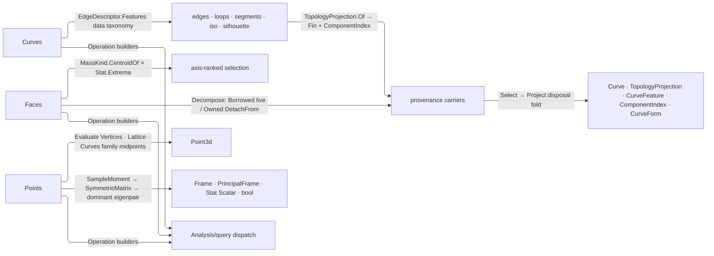

# [RASM_ANALYSIS_SELECT]

Selection unions decompose host sub-geometry for the measured-query runtime: `Curves`, `Faces`, and `Points` name which curves, faces, and points a geometry yields, each selected by feature, rank, or index and projected onto a typed output through the `Domain/normalization` `TopologyProjection` carrier under a leak-free transfer fold. Edge selection is data-driven — an internal `EdgeDescriptor` describes what an edge is and one `Features` projection derives the `EdgeFeature` rows it carries, so selection tests membership through `Matches(descriptor)`, never a per-source branch, and each extraction arm gates on the feature SET it serves. Each union publishes its operation builders on ITSELF — the `Analyze` facade lives once on `Analysis/query` and this page adds no fragment to it.

Every projection duplicating host geometry travels as a `TopologyProjection` minted on the `Fin` result carrying its source `ComponentIndex`, so selection, repair, and host drains address one component space and a carrier that fails its own admission releases what it took; the carrier's `Project` fold releases every non-transferred duplicate and the `Domain/results` `Lease` with `DetachFrom` decides ownership, never a caller flag. Capability admission rides the `Domain/normalization` row vocabulary, evaluation composes `Domain/evaluation`'s `Evaluate` verb union, statistics `Domain/stats` on the `Scalar` carrier, the spread eigendecomposition `Numerics/matrix`, and direction with planar decomposition the `Processing/intent` `VectorIntent` verb. Factory spellings bind the Grasshopper component surface by name, so a rename breaks the host contract.

## [01]-[INDEX]

- [02]-[CURVES]: `Curves` `[Union]` selection over the `EdgeFeature`/`EdgeDescriptor` taxonomy, the `SegmentPosture` rows, and the `Project` disposal fold.
- [03]-[FACES]: `Faces` `[Union]` decomposition fanned across typed projections on one builder, lease-aware through `DetachFrom`.
- [04]-[POINTS]: `Points` `[Union]` extraction over a derived key index and the `SpreadAspect` spread family, each row carrying its `OutputBinding` and `Fit`.
- [05]-[DENSITY_BAR]: one owner per axis; a new feature, projection, or aspect is a row, a case, or a fan arm.

## [02]-[CURVES]

- Owner: `CurveFeature` `[SmartEnum<int>]` is the closed curve-provenance vocabulary — every extracted curve names what it was on the source, so downstream filtering reads a row rather than re-deriving adjacency. `EdgeFeature` is its ADJACENCY subset, the roster an edge descriptor can derive and an edge request can name, each row carrying the `CurveFeature` it publishes. `SilhouetteTrait` rosters the host capture kinds as a `CapabilitySet` column. `EdgeDescriptor` internal `[Union]` describes an edge; its one `Features` projection derives the `EdgeFeature` rows the edge carries and `IsSelectableEdge` names the selectable subset. `SegmentPosture` `[SmartEnum<string>]` carries the two segment readings as rows — the host piece call and the emitted feature travel together. `Curves` `[Union]` resolves the emitted feature per source stratum through `Feature(Topology)`, tests selection through the data-driven `Matches(EdgeDescriptor)`, and applies the shared index law through `Select`.
- Cases: the eight edge-feature spellings are one `EdgesCase` parameterized by `EdgeFeature`, and silhouette and draft share one `SilhouetteCase` whose draft-angle presence selects the host call and whose trait set names the captured kinds; a new selection spelling is a factory over an existing case, never a sibling case.
- Entry: `Curves.Operation<TGeometry, TOut>()` is the family entry `Analysis/query` forwards to; admission gates through `CanProject` (universal ingress, else `Kind.Of` topology dispatch against the case's source table), and the output type discriminates the projection one `Project` builder fans.
- Law: `bool smooth` is not a knob — `SegmentPosture` is the row, so the host call (`DuplicateSegments` vs `GetSubCurves`) and the provenance feature (`Segment` vs `SubCurve`) cannot drift apart, and every other optional rides `Option<T>` with the policy owner naming the fallback at one site.
- Law: extraction admission reads a SET, never a mode flag — each arm names the `EdgeFeature` rows it serves and an absent kind asks for that arm's whole run, so a loops-only arm declines it by roster rather than by an `allowNone` argument; the draft angle is required because a zero-angle draft is a silhouette wearing the wrong provenance.
- Auto: one fold owns extraction, selection, projection, and disposal — `Project` resolves the source kind, derives the emitted feature, extracts every candidate, applies `Select`, projects the chosen subset, and releases every non-transferred projection through `TopologyProjection.Project`, so a leaked duplicate is impossible on the success and failure branches alike; the per-source extraction table and the trim-aware iso kernel live in the fence.
- Packages: RhinoCommon supplies brep, mesh, and SubD topology, iso extraction, and silhouette capture; `Rasm.Domain` supplies the capability vocabulary, form recoveries, the `TopologyProjection` carrier and its `Project` fold, `ToleranceLane` rows, and the `Lease`; `Rasm.Processing` supplies `VectorIntent`; Thinktecture.Runtime.Extensions and LanguageExt.Core the union and result substrate.
- Growth: a new edge feature is one `EdgeFeature` row with its provenance column and one `Features` arm; a new extraction source is one table arm emitting `TopologyProjection`s; a new typed output is one projection row on the fan; a new segment reading is one `SegmentPosture` row — selection, projection, and disposal untouched.
- Boundary: the edge taxonomy is data — `EdgeDescriptor.Features` is the one place adjacency becomes provenance, and a per-source feature `if` ladder is the wrong move it forecloses; every duplicate rides `TopologyProjection` with its true `ComponentIndex` so host drains and repair pages address one component space; owned lowering (`Surface`/`SubD` to brep) disposes through the `Lease` window on every branch; `Select` rejects an out-of-range index through the one `IndexSelection.At` fold both the curve and face families dispatch, so a family-local re-spelling of the empty/first/out-of-range arms is the wrong move; every `Curves` fold — `CanProject`, `Feature`, `Matches`, `Select` — is the generated total `Switch`, so a new case breaks all four loudly at compile time where a discard arm answers for it silently, and `EdgeDescriptor.Features` folds the same way with each host-enum tail stating its own emptiness; a projection that DECLINES refuses typed rather than vanishing under a `Choose`, so a caller asking for five curves and receiving three learns which arm refused; the silhouette arm is host capture beside the `Drawing/view` robust owner, so a local hidden-line kernel here is the altitude violation.

```csharp
// --- [IMPORTS] -------------------------------------------------------------------------
using System;
using System.Collections.Generic;
using System.Linq;
using System.Threading;
using LanguageExt;
using Rasm.Domain;
using Rasm.Processing;
using Rhino.Geometry;
using Thinktecture;
using static LanguageExt.Prelude;

namespace Rasm.Analysis;

// --- [TYPES] ---------------------------------------------------------------------------
[SmartEnum<int>]
public sealed partial class CurveFeature {
    public static readonly CurveFeature Input = new(key: 0);
    public static readonly CurveFeature Segment = new(key: 1);
    public static readonly CurveFeature Edge = new(key: 2);
    public static readonly CurveFeature Boundary = new(key: 3);
    public static readonly CurveFeature NakedOuter = new(key: 4);
    public static readonly CurveFeature NakedInner = new(key: 5);
    public static readonly CurveFeature Interior = new(key: 6);
    public static readonly CurveFeature NonManifold = new(key: 7);
    public static readonly CurveFeature OuterLoop = new(key: 8);
    public static readonly CurveFeature InnerLoop = new(key: 9);
    public static readonly CurveFeature Iso = new(key: 10);
    public static readonly CurveFeature Silhouette = new(key: 11);
    public static readonly CurveFeature SubCurve = new(key: 12);
    public static readonly CurveFeature Draft = new(key: 13);
}

[SmartEnum<string>][KeyMemberEqualityComparer<ComparerAccessors.StringOrdinal, string>]
public sealed partial class EdgeFeature : ICapability<EdgeFeature> {
    public static readonly EdgeFeature Boundary = new(key: "boundary", rank: 0, provenance: CurveFeature.Boundary);
    public static readonly EdgeFeature NakedOuter = new(key: "naked-outer", rank: 1, provenance: CurveFeature.NakedOuter);
    public static readonly EdgeFeature NakedInner = new(key: "naked-inner", rank: 2, provenance: CurveFeature.NakedInner);
    public static readonly EdgeFeature Interior = new(key: "interior", rank: 3, provenance: CurveFeature.Interior);
    public static readonly EdgeFeature NonManifold = new(key: "non-manifold", rank: 4, provenance: CurveFeature.NonManifold);
    public static readonly EdgeFeature OuterLoop = new(key: "outer-loop", rank: 5, provenance: CurveFeature.OuterLoop);
    public static readonly EdgeFeature InnerLoop = new(key: "inner-loop", rank: 6, provenance: CurveFeature.InnerLoop);

    public int Rank { get; }
    public CurveFeature Provenance { get; }
}

[SmartEnum<string>][KeyMemberEqualityComparer<ComparerAccessors.StringOrdinal, string>]
public sealed partial class SilhouetteTrait : ICapability<SilhouetteTrait> {
    public static readonly SilhouetteTrait Projecting = new(key: "projecting", rank: 0, bit: (int)SilhouetteType.Projecting);
    public static readonly SilhouetteTrait TangentProjects = new(key: "tangent-projects", rank: 1, bit: (int)SilhouetteType.TangentProjects);
    public static readonly SilhouetteTrait Tangent = new(key: "tangent", rank: 2, bit: (int)SilhouetteType.Tangent);
    public static readonly SilhouetteTrait Crease = new(key: "crease", rank: 3, bit: (int)SilhouetteType.Crease);
    public static readonly SilhouetteTrait Boundary = new(key: "boundary", rank: 4, bit: (int)SilhouetteType.Boundary);

    public int Rank { get; }
    public int Bit { get; }
    public static int MaskOf(CapabilitySet<SilhouetteTrait> traits) => traits.Mask(bit: static trait => trait.Bit);
}

[SmartEnum<string>][KeyMemberEqualityComparer<ComparerAccessors.StringOrdinal, string>]
public sealed partial class SegmentPosture {
    public static readonly SegmentPosture Whole = new(key: "whole", feature: CurveFeature.Segment, pieces: static curve => Optional(curve.DuplicateSegments()));
    public static readonly SegmentPosture Smooth = new(key: "smooth", feature: CurveFeature.SubCurve, pieces: static curve => Optional(curve.GetSubCurves()));
    internal CurveFeature Feature { get; }
    [UseDelegateFromConstructor] internal partial Option<Curve[]> Pieces(Curve curve);
}

[Union]
internal abstract partial record EdgeDescriptor {
    private EdgeDescriptor() { }
    public sealed record OfBrep(EdgeAdjacency Valence, Seq<BrepLoopType> Loops) : EdgeDescriptor;
    public sealed record OfMesh(int ConnectedFaces) : EdgeDescriptor;
    public sealed record OfLoop(BrepLoopType LoopType) : EdgeDescriptor;
    internal bool IsSelectableEdge => Switch(
        ofBrep: static _ => true,
        ofMesh: static mesh => mesh.ConnectedFaces > 0,
        ofLoop: static _ => false);
    internal Seq<EdgeFeature> Features => Switch(
        ofBrep: static brep => brep.Valence switch {
            EdgeAdjacency.Naked => Seq(EdgeFeature.Boundary) + brep.Loops.Choose(static loop =>
                loop == BrepLoopType.Outer ? Some(EdgeFeature.NakedOuter) : loop == BrepLoopType.Inner ? Some(EdgeFeature.NakedInner) : Option<EdgeFeature>.None),
            EdgeAdjacency.Interior => Seq(EdgeFeature.Interior),
            EdgeAdjacency.NonManifold => Seq(EdgeFeature.NonManifold),
            _ => Seq<EdgeFeature>(),
        },
        ofMesh: static mesh => mesh.ConnectedFaces switch {
            1 => Seq(EdgeFeature.Boundary),
            2 => Seq(EdgeFeature.Interior),
            > 2 => Seq(EdgeFeature.NonManifold),
            _ => Seq<EdgeFeature>(),
        },
        ofLoop: static loop => loop.LoopType switch {
            BrepLoopType.Outer => Seq(EdgeFeature.OuterLoop),
            BrepLoopType.Inner => Seq(EdgeFeature.InnerLoop),
            _ => Seq<EdgeFeature>(),
        });
}

[Union]
public abstract partial record Curves {
    private Curves() { }
    public sealed record EdgesCase(Option<EdgeFeature> Kind) : Curves;
    public sealed record SegmentsCase(SegmentPosture Posture) : Curves;
    public sealed record IsoCase(IsoStatus Direction, double Normalized) : Curves;
    public sealed record SilhouetteCase(Option<Vector3d> Direction, Option<double> DraftAngle, CapabilitySet<SilhouetteTrait> Traits) : Curves;
    public sealed record AtCase(Option<int> Value) : Curves;
    public sealed record FormCase(Option<int> Index) : Curves;
    internal static readonly Op Key = Op.Of(name: nameof(Curves));
    public static Curves All => new EdgesCase(Kind: Option<EdgeFeature>.None);
    public static Curves Boundary => new EdgesCase(Kind: Some(EdgeFeature.Boundary));
    public static Curves NakedOuter => new EdgesCase(Kind: Some(EdgeFeature.NakedOuter));
    public static Curves NakedInner => new EdgesCase(Kind: Some(EdgeFeature.NakedInner));
    public static Curves Interior => new EdgesCase(Kind: Some(EdgeFeature.Interior));
    public static Curves NonManifold => new EdgesCase(Kind: Some(EdgeFeature.NonManifold));
    public static Curves OuterLoop => new EdgesCase(Kind: Some(EdgeFeature.OuterLoop));
    public static Curves InnerLoop => new EdgesCase(Kind: Some(EdgeFeature.InnerLoop));
    public static Curves Segments(Option<SegmentPosture> posture = default) => new SegmentsCase(Posture: posture.IfNone(SegmentPosture.Whole));
    public static Curves Iso(IsoStatus direction, double normalized = 0.5) => new IsoCase(Direction: direction, Normalized: normalized);
    public static Curves Silhouette(Option<Vector3d> direction = default, Option<CapabilitySet<SilhouetteTrait>> traits = default) =>
        new SilhouetteCase(Direction: direction, DraftAngle: Option<double>.None, Traits: traits.IfNone(CapabilitySet<SilhouetteTrait>.All));
    public static Curves Draft(double angle, Option<Vector3d> direction = default) => new SilhouetteCase(Direction: direction, DraftAngle: Some(angle), Traits: CapabilitySet<SilhouetteTrait>.All);
    public static Curves At(Option<int> index = default) => new AtCase(Value: index);
    public static Curves Form(Option<int> index = default) => new FormCase(Index: index);

    internal Operation<TGeometry, TOut> Operation<TGeometry, TOut>() where TGeometry : notnull =>
        CanProject(type: typeof(TGeometry)) switch {
            false => Key.Unsupported<TGeometry, TOut>(),
            true => typeof(TOut) switch {
                Type t when t == typeof(Curve) => Project<TGeometry, TOut, Curve>(key: Key, aspect: this, project: static (p, _, _, op) => p.As<Curve>(key: op)),
                Type t when t == typeof(TopologyProjection) => Project<TGeometry, TOut, TopologyProjection>(key: Key, aspect: this, project: static (p, _, _, _) => Fin.Succ(p)),
                Type t when t == typeof(CurveFeature) => Project<TGeometry, TOut, CurveFeature>(key: Key, aspect: this, project: static (_, feature, _, _) => Fin.Succ(feature)),
                Type t when t == typeof(ComponentIndex) => Project<TGeometry, TOut, ComponentIndex>(key: Key, aspect: this, project: static (p, _, _, _) => Fin.Succ(p.Source)),
                Type t when t == typeof(CurveForm) && this is FormCase => Project<TGeometry, TOut, CurveForm>(key: Key, aspect: this, project: static (p, _, context, op) => Classify(projection: p, context: context, op: op)),
                _ => Key.Unsupported<TGeometry, TOut>(),
            },
        };

    internal bool CanProject(Type type) =>
        Capability.Universal(type: type)
        || Kind.Of(type: type).Map(kind => CanProject(topology: kind.Topology, type: type)).IfNone(noneValue: false);
    private bool CanProject(Topology topology, Type type) => Switch(
        state: (Topology: topology, Type: type),
        edgesCase: static (state, e) => e.Kind.Case switch {
            null => Capability.CurveForm.Admits(type: state.Type) || Capability.BrepForm.Admits(type: state.Type) || Capability.Native(state.Type, state.Topology, (Topology.Mesh, typeof(Mesh)), (Topology.SubD, typeof(SubD))),
            EdgeFeature feature when feature.Equals(EdgeFeature.Boundary) => Capability.CurveForm.Admits(type: state.Type) || Capability.BrepForm.Admits(type: state.Type) || Capability.Native(state.Type, state.Topology, (Topology.Mesh, typeof(Mesh))),
            EdgeFeature feature when FeatureIsAny(feature, EdgeFeature.NakedOuter, EdgeFeature.NakedInner, EdgeFeature.OuterLoop, EdgeFeature.InnerLoop) => Capability.Native(state.Type, state.Topology, (Topology.Brep, typeof(Brep))),
            _ => Capability.Native(state.Type, state.Topology, (Topology.Brep, typeof(Brep)), (Topology.Mesh, typeof(Mesh))),
        },
        segmentsCase: static (state, _) => Capability.CurveForm.Admits(type: state.Type) || Capability.Native(state.Type, state.Topology, (Topology.SubD, typeof(SubD))),
        isoCase: static (state, _) => Capability.Native(state.Type, state.Topology, (Topology.Brep, typeof(Brep))) || Capability.SurfaceForm.Admits(type: state.Type),
        silhouetteCase: static (state, _) =>
            Capability.SurfaceForm.Admits(type: state.Type) || typeof(Extrusion).IsAssignableFrom(c: state.Type)
            || Capability.Native(state.Type, state.Topology, (Topology.Brep, typeof(Brep)), (Topology.Mesh, typeof(Mesh)), (Topology.SubD, typeof(SubD)), (Topology.Extrusion, typeof(Extrusion))),
        atCase: static (state, _) =>
            Capability.CurveForm.Admits(type: state.Type) || Capability.SurfaceForm.Admits(type: state.Type) || Capability.Native(state.Type, state.Topology, (Topology.Brep, typeof(Brep)), (Topology.Mesh, typeof(Mesh)), (Topology.SubD, typeof(SubD))),
        formCase: static (state, _) =>
            Capability.CurveForm.Admits(type: state.Type) || Capability.Native(state.Type, state.Topology, (Topology.Brep, typeof(Brep)), (Topology.Mesh, typeof(Mesh)), (Topology.SubD, typeof(SubD))));

    internal Fin<Seq<TopologyProjection>> Select(Seq<TopologyProjection> curves) => Switch(
        state: curves,
        edgesCase: static (items, _) => Fin.Succ(items),
        segmentsCase: static (items, _) => Fin.Succ(items),
        isoCase: static (items, _) => Fin.Succ(items),
        silhouetteCase: static (items, _) => Fin.Succ(items),
        atCase: static (items, at) => items.At(index: at.Value, key: Key),
        formCase: static (items, form) => form.Index.IsSome ? items.At(index: form.Index, key: Key) : Fin.Succ(items));
    internal CurveFeature Feature(Topology topology) => Switch(
        state: topology,
        edgesCase: static (t, e) => e.Kind.Map(static row => row.Provenance).IfNone(EdgeFeatureFor(topology: t)),
        segmentsCase: static (_, s) => s.Posture.Feature,
        isoCase: static (_, _) => CurveFeature.Iso,
        silhouetteCase: static (_, s) => s.DraftAngle.IsSome ? CurveFeature.Draft : CurveFeature.Silhouette,
        atCase: static (t, _) => EdgeFeatureFor(topology: t),
        formCase: static (t, _) => EdgeFeatureFor(topology: t));
    internal bool Matches(EdgeDescriptor descriptor) => Switch(
        state: descriptor,
        edgesCase: static (row, e) => e.Kind.Case switch {
            EdgeFeature feature => row.Features.Exists(candidate => candidate.Equals(feature)),
            _ => row.IsSelectableEdge,
        },
        segmentsCase: static (_, _) => false,
        isoCase: static (_, _) => false,
        silhouetteCase: static (_, _) => false,
        atCase: static (row, _) => row.IsSelectableEdge,
        formCase: static (row, _) => row.IsSelectableEdge);

    internal static bool Serves(Curves aspect, CapabilitySet<EdgeFeature> served) =>
        aspect is EdgesCase edges
        && (edges.Kind.Case is EdgeFeature feature ? served.Admits(capability: feature) : served.Admits(capability: EdgeFeature.Boundary));
    internal static bool ServesRun(Curves aspect, CapabilitySet<EdgeFeature> served) =>
        Serves(aspect: aspect, served: served) || aspect is AtCase or FormCase;

    private static readonly CapabilitySet<EdgeFeature> BoundaryRun = CapabilitySet<EdgeFeature>.Of(EdgeFeature.Boundary);
    private static readonly CapabilitySet<EdgeFeature> BrepEdgeRun = CapabilitySet<EdgeFeature>.Of(
        EdgeFeature.Boundary, EdgeFeature.NakedOuter, EdgeFeature.NakedInner, EdgeFeature.Interior, EdgeFeature.NonManifold);
    private static readonly CapabilitySet<EdgeFeature> BrepLoopRun = CapabilitySet<EdgeFeature>.Of(EdgeFeature.OuterLoop, EdgeFeature.InnerLoop);
    private static readonly CapabilitySet<EdgeFeature> MeshEdgeRun = CapabilitySet<EdgeFeature>.Of(
        EdgeFeature.Boundary, EdgeFeature.Interior, EdgeFeature.NonManifold);

    // --- [BUILDERS]
    internal static Operation<TGeometry, TOut> Project<TGeometry, TOut, TValue>(Op key, Curves aspect, Func<TopologyProjection, CurveFeature, Context, Op, Fin<TValue>> project) where TGeometry : notnull =>
        Analysis.Operation<TGeometry, TValue>.Build(
            key: key, state: (Key: key, Aspect: aspect, Project: project), requiresContext: true,
            evaluator: static (state, geometry) =>
                from runtime in Env.EnvAsks
                from kind in geometry.KindOf(context: runtime.Context).ToEff()
                let feature = state.Aspect.Feature(topology: kind.Topology)
                from curves in Extract(geometry: geometry, aspect: state.Aspect, context: runtime.Context, op: state.Key, cancel: runtime.Cancellation).ToEff()
                from chosen in state.Aspect.Select(curves: curves).ToEff()
                from result in TopologyProjection.Project(all: curves, chosen: chosen, project: values => values.TraverseM(projection => state.Project(arg1: projection, arg2: feature, arg3: runtime.Context, arg4: state.Key)).As().Bind(projected => state.Key.Accept(values: projected))).ToEff()
                select result).As<TGeometry, TOut>(key: key);

    internal static Fin<Seq<TopologyProjection>> Extract<TGeometry>(TGeometry geometry, Curves aspect, Context context, Op op, CancellationToken cancel) where TGeometry : notnull =>
        Optional(geometry).ToFin(op.InvalidInput()).Bind(g => (g, aspect) switch {
            (Curve or Line or Polyline or Circle or Arc or Ellipse, Curves candidate) when ServesRun(candidate, BoundaryRun) || candidate is SegmentsCase =>
                Input(source: g, aspect: aspect, op: op),
            (Brep brep, Curves candidate) when ServesRun(candidate, BrepEdgeRun) => BrepEdges(brep: brep, selector: aspect),
            (Brep brep, Curves candidate) when Serves(candidate, BrepLoopRun) =>
                Matching(source: brep.Loops, selector: aspect,
                    describe: static loop => new EdgeDescriptor.OfLoop(LoopType: loop.LoopType),
                    project: loop => Optional(loop.To3dCurve()).Map(curve => TopologyProjection.Of(curve: curve, source: new ComponentIndex(ComponentIndexType.BrepLoop, loop.LoopIndex)))),
            (Brep brep, IsoCase iso) =>
                toSeq(brep.Faces).TraverseM(face => Isolines(surface: face, iso: iso.Direction, normalized: iso.Normalized, op: op)
                    .Bind(curves => curves.TraverseM(curve => TopologyProjection.Of(curve: curve, source: new ComponentIndex(ComponentIndexType.BrepFace, face.FaceIndex))).As())).As()
                    .Map(static nested => nested.Bind(static seq => seq)),
            (BrepFace face, Curves candidate) when ServesRun(candidate, BoundaryRun) => FaceEdges(face: face, selector: aspect),
            (Mesh mesh, Curves candidate) when ServesRun(candidate, MeshEdgeRun) =>
                Matching(source: Enumerable.Range(start: 0, count: mesh.TopologyEdges.Count), selector: aspect,
                    describe: i => new EdgeDescriptor.OfMesh(ConnectedFaces: mesh.TopologyEdges.GetConnectedFaces(topologyEdgeIndex: i).Length),
                    project: i => Some(TopologyProjection.Of(curve: mesh.TopologyEdges.EdgeLine(topologyEdgeIndex: i).ToNurbsCurve(), source: new ComponentIndex(ComponentIndexType.MeshTopologyEdge, i)))),
            (Surface surface, IsoCase iso) => SurfaceIso(surface: surface, iso: iso, op: op),
            (object surfaceLike, IsoCase iso) when Capability.SurfaceForm.Admits(type: surfaceLike.GetType()) =>
                Normalization.SurfaceForm(source: surfaceLike, key: op).Bind(lease => lease.Use(surface => SurfaceIso(surface: surface, iso: iso, op: op))),
            (object brepLike, Curves candidate) when ServesRun(candidate, BoundaryRun) && Capability.BrepForm.Admits(type: brepLike.GetType()) =>
                Normalization.BrepForm(source: brepLike, key: op).Bind(lease => lease.Use(brep => BrepEdges(brep: brep, selector: aspect))),
            (SubD subd, EdgesCase { Kind.Case: null } or AtCase or SegmentsCase or FormCase) => SubDEdges(subd: subd),
            (GeometryBase native, SilhouetteCase silhouette) => Silhouettes(geometry: native, silhouette: silhouette, context: context, op: op, cancel: cancel),
            _ => Fin.Fail<Seq<TopologyProjection>>(op.Unsupported(g.GetType(), typeof(Curve))),
        });

    internal static Fin<Seq<Curve>> Isolines(Surface surface, IsoStatus iso, double normalized, Op op) => (iso, normalized is >= 0.0 and <= 1.0) switch {
        (IsoStatus.West, _) when surface is BrepFace face => Fin.Succ(toSeq(face.TrimAwareIsoCurve(1, face.Domain(0).T0))),
        (IsoStatus.East, _) when surface is BrepFace face => Fin.Succ(toSeq(face.TrimAwareIsoCurve(1, face.Domain(0).T1))),
        (IsoStatus.South, _) when surface is BrepFace face => Fin.Succ(toSeq(face.TrimAwareIsoCurve(0, face.Domain(1).T0))),
        (IsoStatus.North, _) when surface is BrepFace face => Fin.Succ(toSeq(face.TrimAwareIsoCurve(0, face.Domain(1).T1))),
        (IsoStatus.West or IsoStatus.South or IsoStatus.East or IsoStatus.North, _) => Optional(surface.IsoCurve(iso)).ToFin(op.InvalidResult()).Map(static curve => Seq(curve)),
        (IsoStatus.X or IsoStatus.Y, true) when surface.Domain(iso == IsoStatus.X ? 0 : 1) is { IsValid: true } domain =>
            surface is BrepFace face
                ? Fin.Succ(toSeq(face.TrimAwareIsoCurve(iso == IsoStatus.X ? 1 : 0, domain.ParameterAt(normalized))))
                : Optional(surface.IsoCurve(iso, domain.ParameterAt(normalized))).ToFin(op.InvalidResult()).Map(static curve => Seq(curve)),
        _ => Fin.Fail<Seq<Curve>>(op.InvalidInput()),
    };
    internal static Fin<CurveForm> Classify(TopologyProjection projection, Context context, Op op) =>
        projection.As<Curve>(key: op).Bind(curve => Normalization.CurveFormOf(curve: curve, context: context));

    private static CurveFeature EdgeFeatureFor(Topology topology) =>
        topology == Topology.Curve ? CurveFeature.Input : topology == Topology.Surface ? CurveFeature.Boundary : CurveFeature.Edge;
    private static bool FeatureIsAny(EdgeFeature feature, params ReadOnlySpan<EdgeFeature> features) =>
        features.Contains(feature);
    private static Fin<Seq<TopologyProjection>> BrepEdges(Brep brep, Curves selector) =>
        Matching(source: brep.Edges, selector: selector,
            describe: static edge => new EdgeDescriptor.OfBrep(Valence: edge.Valence, Loops: toSeq(edge.TrimIndices()).Choose(t => Optional(edge.Brep.Trims[t].Loop).Map(static loop => loop.LoopType))),
            project: edge => Optional(edge.DuplicateCurve()).Map(curve => TopologyProjection.Of(curve: curve, source: new ComponentIndex(ComponentIndexType.BrepEdge, edge.EdgeIndex))));
    private static Fin<Seq<TopologyProjection>> SurfaceIso(Surface surface, IsoCase iso, Op op) =>
        Isolines(surface: surface, iso: iso.Direction, normalized: iso.Normalized, op: op)
            .Bind(curves => curves.TraverseM(curve => TopologyProjection.Of(curve: curve, source: new ComponentIndex(ComponentIndexType.NoType, 0))).As());
    private static Fin<Seq<TopologyProjection>> Input(object source, Curves aspect, Op op) =>
        Normalization.CurveForm(source: source, key: op).Bind(lease => lease.Use(native => aspect switch {
            Curves candidate when Serves(candidate, BoundaryRun) && native.TryGetPolyline(polyline: out Polyline polyline) && polyline.SegmentCount > 0 =>
                toSeq(polyline.GetSegments().Select((segment, i) => TopologyProjection.Of(curve: new LineCurve(segment), source: new ComponentIndex(ComponentIndexType.PolycurveSegment, i)))).TraverseM(identity).As(),
            SegmentsCase segments => segments.Posture.Pieces(curve: native) switch {
                Option<Curve[]> pieces when pieces.Case is Curve[] found && found.Length > 0 =>
                    toSeq(found.Select((piece, i) => TopologyProjection.Of(curve: piece, source: new ComponentIndex(ComponentIndexType.PolycurveSegment, i)))).TraverseM(identity).As(),
                _ => Optional(native.DuplicateCurve()).ToFin(op.InvalidResult()).Bind(whole => TopologyProjection.Of(curve: whole, source: new ComponentIndex(ComponentIndexType.PolycurveSegment, 0)).Map(static p => Seq(p))),
            },
            _ => Optional(native.DuplicateCurve()).ToFin(op.InvalidResult()).Bind(whole => TopologyProjection.Of(curve: whole, source: new ComponentIndex(ComponentIndexType.NoType, 0)).Map(static p => Seq(p))),
        }));
    private static Fin<Seq<TopologyProjection>> Matching<TPrimitive>(IEnumerable<TPrimitive> source, Curves selector, Func<TPrimitive, EdgeDescriptor> describe, Func<TPrimitive, Option<Fin<TopologyProjection>>> project) =>
        toSeq(source).Choose(item => selector.Matches(descriptor: describe(arg: item)) ? project(arg: item) : Option<Fin<TopologyProjection>>.None).TraverseM(identity).As();
    private static Fin<Seq<TopologyProjection>> FaceEdges(BrepFace face, Curves selector) =>
        toSeq(face.Loops).Bind(loop => toSeq(loop.Trims).Choose(trim => (selector, trim.Edge) switch {
            (Curves candidate, BrepEdge edge) when ServesRun(candidate, BoundaryRun) =>
                Optional(edge.DuplicateCurve()).Map(curve => TopologyProjection.Of(curve: curve, source: new ComponentIndex(ComponentIndexType.BrepEdge, edge.EdgeIndex))),
            _ => Option<Fin<TopologyProjection>>.None,
        })).TraverseM(identity).As();
    private static Fin<Seq<TopologyProjection>> SubDEdges(SubD subd) {
        _ = subd.UpdateSurfaceMeshCache(lazyUpdate: true);
        return toSeq(subd.DuplicateEdgeCurves().Select((curve, i) => TopologyProjection.Of(curve: curve, source: new ComponentIndex(type: ComponentIndexType.SubdEdge, index: i)))).TraverseM(identity).As();
    }
    private static Fin<Seq<TopologyProjection>> Silhouettes(GeometryBase geometry, SilhouetteCase silhouette, Context context, Op op, CancellationToken cancel) =>
        cancel.IsCancellationRequested
            ? Fin.Fail<Seq<TopologyProjection>>(Errors.Cancelled)
            : VectorIntent.Direction(value: silhouette.Direction.IfNone(Vector3d.ZAxis)).Project<Vector3d>(context: context, key: op)
                .Bind(direction => (geometry switch {
                    Brep or BrepFace or Mesh or Extrusion => Fin.Succ<Lease<GeometryBase>>(new Lease<GeometryBase>.Borrowed(Value: geometry)),
                    Surface surface => Optional(surface.ToBrep()).ToFin(op.InvalidResult()).Map(static brep => (Lease<GeometryBase>)new Lease<GeometryBase>.Owned(Value: brep)),
                    SubD subd => Optional(subd.ToBrep(SubDToBrepOptions.Default)).ToFin(op.InvalidResult()).Map(static brep => (Lease<GeometryBase>)new Lease<GeometryBase>.Owned(Value: brep)),
                    _ => Fin.Fail<Lease<GeometryBase>>(op.Unsupported(geometry.GetType(), typeof(Curve))),
                }).Bind(lease => lease.Use(shape =>
                    Optional(silhouette.DraftAngle.Case switch {
                        double angle => Rhino.Geometry.Silhouette.ComputeDraftCurve(shape, angle, direction, context.For(lane: ToleranceLane.Deviation).Value, context.For(lane: ToleranceLane.Orientation).Value, cancel),
                        _ => Rhino.Geometry.Silhouette.Compute(shape, (SilhouetteType)SilhouetteTrait.MaskOf(traits: silhouette.Traits), direction, context.For(lane: ToleranceLane.Deviation).Value, context.For(lane: ToleranceLane.Orientation).Value, [], cancel),
                    }).ToFin(cancel.IsCancellationRequested ? Errors.Cancelled : op.InvalidResult())
                    .Bind(found => toSeq(found).TraverseM(sil => TopologyProjection.Of(curve: sil.Curve, source: sil.GeometryComponentIndex)).As()))));
}

internal static class IndexSelection {
    extension(Seq<TopologyProjection> items) {
        internal Fin<Seq<TopologyProjection>> At(Option<int> index, Op key) =>
            (items.Count, index.Case) switch {
                (0, int) => Fin.Fail<Seq<TopologyProjection>>(key.InvalidInput()),
                (0, _) => Fin.Succ(Seq<TopologyProjection>()),
                (int count, int at) when at < 0 || at >= count => Fin.Fail<Seq<TopologyProjection>>(key.InvalidInput()),
                (_, int at) => Fin.Succ(Seq(items[at])),
                _ => Fin.Succ(Seq(items[0])),
            };
    }
}
```

## [03]-[FACES]

- Owner: `Faces` `[Union]` decomposes a geometry's faces by all, axis-rank, or index — top and bottom are one `RankedCase` whose `Domain/stats` `ExtremumDirection` sign selects the extremum, never two operations. One `Build` fan carries the union across the typed projection rows, each row binding its own `Requirement` — `SurfaceEvaluation` where it evaluates the face surface, `None` where it reads structure.
- Cases: three selection cases — `AllCase`, `RankedCase` (axis and direction), `AtCase` — fanned across the typed projection rows one builder owns; the eight outputs are projections of one operation.
- Entry: `Faces.Operation<TGeometry, TOut>()` is the family entry; admission gates through `Capability.DecomposeFaces.Admits` (universal ingress, `BrepFace` directly, any brep-coercible kind), and the output type selects the projection row at build time.
- Auto: `Decompose` derives ownership from the `Lease` case — a borrowed brep yields carriers addressing the live `BrepFace` list, an owned brep (coerced) yields carriers detached through `TopologyProjection.DetachFrom` before the lease disposes at scope exit, so ownership never rides a caller flag; ranking admits the axis through `VectorIntent.Direction`, scores each mass-centroid against it, and selects through the one `Stat.Extrema` fold at `ToleranceLane.Project`, so every coplanar-tie face returns; `FrameAt` composes `Analysis/measure`'s `MassKind.CentroidOf` and `Domain/evaluation`'s `FrameAt`, and the `Interval` row reads `Analysis/inspect`'s `Topologies.DomainsOf`.
- Packages: RhinoCommon supplies brep face access and the closest-point pull-back; `Rasm.Domain` supplies the decompose capability, form coercion, the carrier with `DetachFrom` and `Project`, the frame evaluation, `ToleranceLane` rows, and the extremum fold; `Rasm.Processing` supplies `VectorIntent`; Thinktecture.Runtime.Extensions and LanguageExt.Core the union and result substrate.
- Growth: a new face projection is one output arm on the fan; a new selection strategy is one case whose score projection feeds the same `Stat.Extrema` fold — zero new operations.
- Boundary: eight outputs ride one builder — a `FacePlanes`/`FaceCentroids`/`FaceNormals` operation family is the proliferation this fan forecloses; the borrowed/owned asymmetry is the resource law, borrowed carriers transferring live faces and owned decompositions detaching so no emitted face dangles after the coerced brep disposes; ranking and index reject an out-of-range index through the same `IndexSelection.At` fold the curve family dispatches; the centroid frame composes `Analysis/measure` and `Domain/evaluation`, so a local mass or frame computation here is the wrong move.

```csharp
// --- [IMPORTS] -------------------------------------------------------------------------
using System;
using System.Linq;
using LanguageExt;
using Rasm.Domain;
using Rasm.Processing;
using Rhino.Geometry;
using Thinktecture;
using static LanguageExt.Prelude;

namespace Rasm.Analysis;

// --- [TYPES] ---------------------------------------------------------------------------
[Union]
public abstract partial record Faces {
    private Faces() { }
    public sealed record AllCase : Faces;
    public sealed record RankedCase(Vector3d Axis, ExtremumDirection Direction) : Faces;
    public sealed record AtCase(Option<int> Value) : Faces;
    internal static readonly Op Key = Op.Of(name: nameof(Faces));
    public static Faces All => new AllCase();
    public static Faces Top(Option<Vector3d> axis = default) => new RankedCase(Axis: axis.IfNone(Vector3d.ZAxis), Direction: ExtremumDirection.Maximum);
    public static Faces Bottom(Option<Vector3d> axis = default) => new RankedCase(Axis: axis.IfNone(Vector3d.ZAxis), Direction: ExtremumDirection.Minimum);
    public static Faces At(Option<int> index = default) => new AtCase(Value: index);
    internal Operation<TGeometry, TOut> Operation<TGeometry, TOut>() where TGeometry : notnull =>
        Capability.DecomposeFaces.Admits(type: typeof(TGeometry)) switch {
            false => Key.Unsupported<TGeometry, TOut>(),
            true => typeof(TOut) switch {
                Type t when t == typeof(Brep) => Build<TGeometry, TOut, Brep>(key: Key, selector: this, requirement: Requirement.None,
                    project: static (chosen, _) => Key.Accept(values: chosen.Choose(static face => face.As<Brep>()))),
                Type t when t == typeof(TopologyProjection) => Build<TGeometry, TOut, TopologyProjection>(key: Key, selector: this, requirement: Requirement.None,
                    project: static (chosen, _) => Key.Accept(values: chosen)),
                Type t when t == typeof(Plane) => Build<TGeometry, TOut, Plane>(key: Key, selector: this, requirement: Requirement.SurfaceEvaluation,
                    project: static (chosen, runtime) => chosen.TraverseM(face => face.As<BrepFace>(key: Key).Bind(native => FrameAt(face: native, context: runtime, op: Key))).As()),
                Type t when t == typeof(Point3d) => Build<TGeometry, TOut, Point3d>(key: Key, selector: this, requirement: Requirement.SurfaceEvaluation,
                    project: static (chosen, runtime) => chosen.TraverseM(face => face.As<BrepFace>(key: Key).Bind(native => MassKind.CentroidOf(geometry: native, context: runtime, op: Key))).As()),
                Type t when t == typeof(Vector3d) => Build<TGeometry, TOut, Vector3d>(key: Key, selector: this, requirement: Requirement.SurfaceEvaluation,
                    project: static (chosen, runtime) => chosen.TraverseM(face => face.As<BrepFace>(key: Key)
                        .Bind(native => FrameAt(face: native, context: runtime, op: Key))
                        .Bind(frame => VectorIntent.Direction(value: frame.ZAxis).Project<Vector3d>(context: runtime, key: Key))).As()),
                Type t when t == typeof(ComponentIndex) => Build<TGeometry, TOut, ComponentIndex>(key: Key, selector: this, requirement: Requirement.None,
                    project: static (chosen, _) => Key.Accept(values: chosen.Map(static face => face.Source))),
                Type t when t == typeof(int) => Build<TGeometry, TOut, int>(key: Key, selector: this, requirement: Requirement.None,
                    project: static (chosen, _) => Key.Accept(values: chosen.Map(static face => face.Source.Index))),
                Type t when t == typeof(Interval) => Build<TGeometry, TOut, Interval>(key: Key, selector: this, requirement: Requirement.SurfaceEvaluation,
                    project: static (chosen, _) => chosen.TraverseM(face => face.As<BrepFace>(key: Key).Bind(native => Topologies.DomainsOf(geometry: native, op: Key))).As().Map(static nested => nested.Bind(static domains => domains))),
                _ => Key.Unsupported<TGeometry, TOut>(),
            },
        };

    private const double UnboundedSearch = 0.0;

    internal static Fin<Plane> FrameAt(BrepFace face, Context context, Op op) =>
        MassKind.CentroidOf(geometry: face, context: context, op: op).Bind(centroid =>
            face.ClosestPointOnFace(testPoint: centroid, u: out double u, v: out double v, maximumDistance: UnboundedSearch)
                ? Evaluation.FrameAt(surface: face, uv: new Point2d(x: u, y: v), key: op)
                : Fin.Fail<Plane>(op.InvalidResult()));

    private static Operation<TGeometry, TOut> Build<TGeometry, TOut, TValue>(Op key, Faces selector, Requirement requirement, Func<Seq<TopologyProjection>, Context, Fin<Seq<TValue>>> project) where TGeometry : notnull =>
        Analysis.Operation<TGeometry, TValue>.Build(
            key: key, state: (Key: key, Selector: selector, Project: project), requirement: Some(requirement), requiresContext: true,
            evaluator: static (state, geometry) =>
                from context in Env.Asks
                from faces in Decompose(key: state.Key, geometry: geometry).ToEff()
                from chosen in Choose(key: state.Key, faces: faces, selector: state.Selector, runtime: context).ToEff()
                from result in TopologyProjection.Project(all: faces, chosen: chosen, project: values => state.Project(arg1: values, arg2: context)).ToEff()
                select result).As<TGeometry, TOut>(key: key);
    private static Fin<Seq<TopologyProjection>> Decompose<TGeometry>(Op key, TGeometry geometry) where TGeometry : notnull =>
        Optional(geometry).ToFin(key.InvalidInput()).Bind(g => g switch {
            BrepFace face => TopologyProjection.Of(face: face).Map(static projection => Seq(projection)),
            object brepLike when Capability.BrepForm.Admits(type: brepLike.GetType()) => Normalization.BrepForm(source: brepLike, key: key).Bind(lease => lease.Switch(
                borrowed: static borrowed => toSeq(borrowed.Value.Faces.Select(static face => TopologyProjection.Of(face: face)).ToArray()).TraverseM(identity).As(),
                owned: static owned => owned.Project(static brep => toSeq(brep.Faces.Select(static face => TopologyProjection.Of(face: face)).ToArray()).TraverseM(identity).As()
                    .Bind(faces => faces.TraverseM(face => face.DetachFrom(source: brep)).As())))),
            _ => Fin.Fail<Seq<TopologyProjection>>(key.Unsupported(g.GetType(), typeof(Seq<TopologyProjection>))),
        });
    private static Fin<Seq<TopologyProjection>> Choose(Op key, Seq<TopologyProjection> faces, Faces selector, Context runtime) => selector.Switch(
        state: (Key: key, Faces: faces, Runtime: runtime),
        allCase: static (s, _) => Fin.Succ(s.Faces),
        rankedCase: static (s, ranked) => Ranked(state: s, axis: ranked.Axis, direction: ranked.Direction),
        atCase: static (s, at) => s.Faces.At(index: at.Value, key: s.Key));
    private static Fin<Seq<TopologyProjection>> Ranked((Op Key, Seq<TopologyProjection> Faces, Context Runtime) state, Vector3d axis, ExtremumDirection direction) =>
        state.Faces.IsEmpty switch {
            true => Fin.Succ(Seq<TopologyProjection>()),
            false => from vector in VectorIntent.Direction(value: axis).Project<Vector3d>(context: state.Runtime, key: state.Key)
                     from ranked in state.Faces.TraverseM(face => face.As<BrepFace>(key: state.Key)
                         .Bind(native => MassKind.CentroidOf(geometry: native, context: state.Runtime, op: state.Key))
                         .Map(point => (Face: face, Score: new Vector3d(x: point.X, y: point.Y, z: point.Z) * vector))).As()
                     select Stat.Extrema(items: ranked, projection: static item => item.Score, band: state.Runtime.For(lane: ToleranceLane.Project), direction: direction).Map(static item => item.Face),
        };
}
```

## [04]-[POINTS]

- Owner: `SpreadAspect` `[SmartEnum<int>]` asks what a point set's spread is, each row binding its own `OutputBinding` (`Plane`, `Stat<Scalar>`, or `bool`) and its own `Fit` body. `Points` `[Union]` extracts directional extrema, edge midpoints, vertices, control points, or spread — one case per extraction kind, its operation key derived from the case name.
- Cases: five extraction cases; `ExtremaCase` admits caller directions or derives the world quadrant set, and `SpreadCase` carries its `SpreadAspect`; a new aspect is a `SpreadAspect` row, a new extraction a case.
- Entry: `Points.Operation<TGeometry, TOut>()` is the family entry; every arm gates capability through the `Domain/normalization` vocabulary — `Capability.ReadEdges` and `Capability.ReadControlPoints` are the rows, never a `Kind` bool column — and the output type before building.
- Auto: extrema resolves directions through `VectorIntent.Axes` (planar curves collapse to the in-plane pair, absent directions derive the quadrant set) then folds `Curve.ExtremeParameters` through the one `Stat.Extrema` fold at `ToleranceLane.Project`; edge midpoints composes the `Curves` family so the edge walk lives once in the curve family; vertices routes `Domain/evaluation`'s `Evaluate` vertex verb; control points unfolds NURBS nets, lowering non-NURBS sources through owned leases; spread reads vertices and each aspect row runs its own `Fit`, folding centroid distances into `Stat<Scalar>.Of` or fitting a plane and deriving frame, principal frame, coplanarity, or collinearity — the principal angle is the PCA of the fit-plane coordinates, every point decomposing through `VectorIntent.Components`, the rows folding through `Domain/stats`'s `SampleMoment` covariance into a `Numerics/matrix` `SymmetricMatrix`, and the dominant eigenpair (selected by `Stat.Extrema` over eigenvalues, independent of decomposition return order) giving the axis; degeneracy answers ahead of the fit, so a plane-fit refusal never doubles as a coplanarity verdict.
- Packages: RhinoCommon supplies curve extrema, NURBS control nets, and plane fitting; `Rasm.Domain` supplies the capability rows, the evaluation verb union, statistics on the `Scalar` carrier, `ToleranceLane` rows, and the lease; `Rasm.Processing` supplies `VectorIntent`; `Rasm.Numerics` supplies `SymmetricMatrix`; Thinktecture.Runtime.Extensions and LanguageExt.Core the union and result substrate.
- Growth: a new spread aspect is one `SpreadAspect` row carrying its `OutputBinding` and its `Fit` delegate over the same moment fold; a new extraction source is one table arm; a new extremum policy is a `ToleranceLane` row on the existing fold.
- Boundary: spread mathematics is composed — `SampleMoment` owns the covariance, `SymmetricMatrix` owns the spectrum, `Stat.Extrema` owns the dominant-pair selection; a local covariance accumulation or eigen-ordering assumption is the double-owner defect, and selecting the dominant eigenvalue keeps the result order-independent where a first-returned-pair convention couples correctness to an upstream sort; planar-coordinate projection failures abort the fold, since a zero-row substitution biases the covariance toward the origin; `EdgeMidpoints` composes the `Curves` family, so a second topology-edge walker is the wrong move; control-point extraction leases every minted NURBS form so conversion never leaks. `Lattice` dispatches an ERASED `TGeometry` runtime value, not a closed family, so its discard arm is the boundary refusal the open ingress owes — it mints the typed `Unsupported` naming both the runtime type and the output, and collapsing it onto a generated `Switch` is unspellable where no union owns the input.

```csharp
// --- [IMPORTS] -------------------------------------------------------------------------
using System;
using System.Collections.Frozen;
using System.Linq;
using LanguageExt;
using Rasm.Domain;
using Rasm.Numerics;
using Rasm.Processing;
using Rhino.Geometry;
using Thinktecture;
using static LanguageExt.Prelude;
using Dimension = Rasm.Numerics.Dimension;

namespace Rasm.Analysis;

// --- [TYPES] ---------------------------------------------------------------------------
[SmartEnum<int>]
public sealed partial class SpreadAspect {
    public static readonly SpreadAspect Frame = new(key: 0, output: OutputBinding.Of<Plane>(),
        fit: static (points, _, _, op) => Fitted(points: points, op: op).Map(static fit => Seq<object>(fit.Plane)));
    public static readonly SpreadAspect PrincipalFrame = new(key: 1, output: OutputBinding.Of<Plane>(),
        fit: static (points, _, context, op) => Fitted(points: points, op: op)
            .Bind(fit => Oriented(fit: fit.Plane, points: points, context: context, op: op)).Map(static plane => Seq<object>(plane)));
    public static readonly SpreadAspect Distribution = new(key: 2, output: OutputBinding.Of<Stat<Scalar>>(),
        fit: static (points, geometry, context, op) => MassKind.CentroidOf(geometry: geometry, context: context, op: op)
            .Bind(centroid => Stat<Scalar>.Of(values: points.Map(point => (Scalar)point.DistanceTo(other: centroid)), key: op))
            .Map(static stat => Seq<object>(stat)));
    public static readonly SpreadAspect Collinear = new(key: 3, output: OutputBinding.Of<bool>(),
        fit: static (points, _, context, op) => points.Count <= 2
            ? Fin.Succ(Seq<object>(true))
            : Fitted(points: points, op: op)
                .Bind(fit => Minor(fit: fit.Plane, points: points, context: context, op: op))
                .Map(spread => Seq<object>(spread <= context.For(lane: ToleranceLane.Collinear).Value)));
    public static readonly SpreadAspect Coplanar = new(key: 4, output: OutputBinding.Of<bool>(),
        fit: static (points, _, context, op) => points.Count <= 2
            ? Fin.Succ(Seq<object>(true))
            : Fitted(points: points, op: op).Map(fit => Seq<object>(fit.Deviation <= context.For(lane: ToleranceLane.PlaneDistance).Value)));

    public OutputBinding Output { get; }
    [UseDelegateFromConstructor] internal partial Fin<Seq<object>> Fit(Seq<Point3d> points, object geometry, Context context, Op op);

    private static Fin<(Plane Plane, double Deviation)> Fitted(Seq<Point3d> points, Op op) =>
        (Plane.FitPlaneToPoints(points: points.AsIterable(), plane: out Plane fit, maximumDeviation: out double deviation), fit.IsValid) switch {
            (PlaneFitResult.Success, true) => Fin.Succ((Plane: fit, Deviation: deviation)),
            _ => Fin.Fail<(Plane, double)>(op.InvalidResult()),
        };
    private static Fin<double> Principal(Seq<Point3d> points, Plane fit, Context context, Op op) =>
        points.TraverseM(point => VectorIntent.Components(anchor: fit.Origin, value: point - fit.Origin, frame: fit).Project<(double X, double Y)>(context: context, key: op)).As()
            .Map(static planar => planar.Map(static row => Seq(row.X, row.Y)))
            .Bind(rows => SampleMoment.Of(rows: rows, key: op))
            .Bind(moment => SymmetricMatrix.Of(dim: Dimension.Create(value: moment.Dimension), upper: moment.UpperCovariance, key: op)
                .Bind(covariance => covariance.DecomposeEigenDetailed(key: op)).Map(static solved => solved.Pairs))
            .Bind(pairs => Stat.Extrema(items: pairs, projection: static pair => pair.Eigenvalue, band: context.For(lane: ToleranceLane.Residual), direction: ExtremumDirection.Maximum).Head.ToFin(op.InvalidResult()))
            .Map(static dominant => Math.Atan2(y: dominant.Eigenvector[1], x: dominant.Eigenvector[0]));
    private static Fin<Plane> Oriented(Plane fit, Seq<Point3d> points, Context context, Op op) =>
        from angle in Principal(points: points, fit: fit, context: context, op: op)
        from xAxis in VectorIntent.Direction(value: (fit.XAxis * Math.Cos(d: angle)) + (fit.YAxis * Math.Sin(a: angle))).Project<Vector3d>(context: context, key: op)
        from yAxis in VectorIntent.Direction(value: Vector3d.CrossProduct(a: fit.ZAxis, b: xAxis)).Project<Vector3d>(context: context, key: op)
        from plane in op.AcceptValue(value: new Plane(origin: fit.Origin, xDirection: xAxis, yDirection: yAxis))
        select plane;
    private static Fin<double> Minor(Plane fit, Seq<Point3d> points, Context context, Op op) =>
        from angle in Principal(points: points, fit: fit, context: context, op: op)
        from offsets in points.TraverseM(point => VectorIntent.Components(anchor: fit.Origin, value: point - fit.Origin, frame: fit)
            .Project<(double X, double Y)>(context: context, key: op)
            .Map(components => Math.Abs(value: (components.X * -Math.Sin(a: angle)) + (components.Y * Math.Cos(d: angle))))).As()
        from spread in Stat.Extrema(items: offsets, projection: static offset => offset, band: context.For(lane: ToleranceLane.Project), direction: ExtremumDirection.Maximum).Head.ToFin(op.InvalidResult())
        select spread;
}

[Union]
public abstract partial record Points {
    private Points() { }
    public sealed record ExtremaCase(Option<Seq<Vector3d>> Directions) : Points;
    public sealed record EdgeMidpointsCase : Points;
    public sealed record VerticesCase : Points;
    public sealed record ControlPointsCase : Points;
    public sealed record SpreadCase(SpreadAspect Aspect) : Points;
    private static readonly Lazy<FrozenDictionary<Type, Op>> Keys = new(static () =>
        typeof(Points).GetNestedTypes().Where(static shape => shape.IsSubclassOf(c: typeof(Points)))
            .ToFrozenDictionary(static shape => shape, static shape => Op.Of(name: shape.Name)));
    internal Op Key => Keys.Value[GetType()];
    public static Points Quadrants => new ExtremaCase(Directions: Option<Seq<Vector3d>>.None);
    public static Points Extrema(Seq<Vector3d> directions) => new ExtremaCase(Directions: Some(value: directions));
    public static Points EdgeMidpoints => new EdgeMidpointsCase();
    public static Points Vertices => new VerticesCase();
    public static Points ControlPoints => new ControlPointsCase();
    public static Points Spread(SpreadAspect aspect) => new SpreadCase(Aspect: aspect);

    internal Operation<TGeometry, TOut> Operation<TGeometry, TOut>() where TGeometry : notnull => Switch(
        extremaCase: static c => typeof(TOut) == typeof(Point3d) && Capability.CurveForm.Admits(type: typeof(TGeometry))
            ? Analysis.Operation<TGeometry, Point3d>.Build(
                key: c.Key, requirement: Some(Requirement.Basic), requiresContext: true, state: (Key: c.Key, c.Directions),
                evaluator: static (state, geometry) =>
                    from context in Env.Asks
                    from lease in Normalization.CurveForm(source: geometry, key: state.Key).ToEff()
                    from points in lease.Use((Curve curve) => curve.IsValid switch {
                        false => Fin.Fail<Seq<Point3d>>(state.Key.InvalidInput()),
                        true => VectorIntent.Axes(
                                values: state.Directions,
                                rank: curve.IsPlanar(tolerance: context.For(lane: ToleranceLane.PlaneDistance).Value) ? Some(Dimension.Create(value: 2)) : Option<Dimension>.None)
                            .Project<Seq<Vector3d>>(context: context, key: state.Key)
                            .Bind((Seq<Vector3d> directions) => directions.TraverseM((Vector3d direction) => Stat.Extrema(
                                    items: toSeq(curve.ExtremeParameters(direction: direction) ?? []).Map(curve.PointAt),
                                    projection: point => (Vector3d)point * direction,
                                    band: context.For(lane: ToleranceLane.Project),
                                    direction: ExtremumDirection.Maximum)
                                .Head.ToFin(state.Key.InvalidResult()))
                            .As()),
                    }).ToEff()
                    select points).As<TGeometry, TOut>(key: c.Key)
            : c.Key.Unsupported<TGeometry, TOut>(),
        edgeMidpointsCase: static c => typeof(TOut) == typeof(Point3d) && Capability.ReadEdges.Admits(type: typeof(TGeometry))
            ? Analysis.Operation<TGeometry, Point3d>.Build(
                key: c.Key, requiresContext: true, state: c.Key,
                evaluator: static (op, geometry) => Curves.Project<TGeometry, Point3d, Point3d>(
                    key: op,
                    aspect: Curves.All,
                    project: static (projection, _, _, key) => projection.As<Curve>(key: key).Map(static curve => curve.PointAtNormalizedLength(length: 0.5)))
                    .Apply(geometry: Seq(geometry))).As<TGeometry, TOut>(key: c.Key)
            : c.Key.Unsupported<TGeometry, TOut>(),
        verticesCase: static c => typeof(TOut) == typeof(Point3d) && Capability.ReadVertices.Admits(type: typeof(TGeometry))
            ? Analysis.Operation<TGeometry, Point3d>.Build(
                key: c.Key, state: c.Key,
                evaluator: static (op, geometry) =>
                    from answer in geometry.Evaluate(request: new EvaluationRequest.Vertices(), key: op).ToEff()
                    from points in answer.Sites(key: op).ToEff()
                    from result in op.Accept(values: points).ToEff()
                    select result).As<TGeometry, TOut>(key: c.Key)
            : c.Key.Unsupported<TGeometry, TOut>(),
        controlPointsCase: static c => typeof(TOut) == typeof(Point3d) && Capability.ReadControlPoints.Admits(type: typeof(TGeometry))
            ? Analysis.Operation<TGeometry, Point3d>.Build(
                key: c.Key, state: c.Key,
                evaluator: static (op, geometry) =>
                    from points in Lattice(geometry: geometry, op: op).ToEff()
                    from result in op.Accept(values: points).ToEff()
                    select result).As<TGeometry, TOut>(key: c.Key)
            : c.Key.Unsupported<TGeometry, TOut>(),
        spreadCase: static s => s.Aspect.Output.Serves<TOut>() && Capability.ReadVertices.Admits(type: typeof(TGeometry))
            ? Analysis.Operation<TGeometry, TOut>.Build(
                key: s.Key, requiresContext: true, state: (Key: s.Key, s.Aspect),
                evaluator: static (state, geometry) =>
                    from context in Env.Asks
                    from answer in geometry.Evaluate(request: new EvaluationRequest.Vertices(), key: state.Key).ToEff()
                    from points in answer.Sites(key: state.Key).ToEff()
                    from fitted in state.Aspect.Fit(points: points, geometry: geometry, context: context, op: state.Key).ToEff()
                    from result in state.Aspect.Output.Admit<TOut>(values: fitted, key: state.Key).ToEff()
                    select result)
            : s.Key.Unsupported<TGeometry, TOut>());

    private static Fin<Seq<Point3d>> Lattice<TGeometry>(TGeometry geometry, Op op) where TGeometry : notnull =>
        Optional(geometry).ToFin(op.InvalidInput()).Bind(g => g switch {
            NurbsCurve nurbs => Fin.Succ(NetOf(curve: nurbs)),
            Curve curve => Optional(curve.ToNurbsCurve()).ToFin(op.InvalidResult())
                .Map(static minted => new Lease<NurbsCurve>.Owned(Value: minted).Use(static owned => NetOf(curve: owned))),
            NurbsSurface nurbs => Fin.Succ(NetOf(surface: nurbs)),
            Surface surface => Optional(surface.ToNurbsSurface()).ToFin(op.InvalidResult())
                .Map(static minted => new Lease<NurbsSurface>.Owned(Value: minted).Use(static owned => NetOf(surface: owned))),
            Brep brep => toSeq(brep.Faces).TraverseM(face => Optional(face.ToNurbsSurface()).ToFin(op.InvalidResult())
                .Map(static minted => new Lease<NurbsSurface>.Owned(Value: minted).Use(static owned => NetOf(surface: owned)))).As()
                .Map(static nested => nested.Bind(static points => points)),
            object surfaceLike when Capability.SurfaceForm.Admits(type: surfaceLike.GetType()) =>
                Normalization.SurfaceForm(source: surfaceLike, key: op).Bind(lease => lease.Use(surface => Lattice(geometry: surface, op: op))),
            _ => Fin.Fail<Seq<Point3d>>(op.Unsupported(g.GetType(), typeof(Point3d))),
        });
    private static Seq<Point3d> NetOf(NurbsCurve curve) =>
        toSeq(Enumerable.Range(0, curve.Points.Count).Select(i => curve.Points[i].Location).ToArray());
    private static Seq<Point3d> NetOf(NurbsSurface surface) =>
        toSeq(Enumerable.Range(0, surface.Points.CountU)
            .SelectMany(u => Enumerable.Range(0, surface.Points.CountV).Select(v => surface.Points.GetControlPoint(u, v).Location)).ToArray());
}
```



## [05]-[DENSITY_BAR]

One owner per axis; a new feature, projection, or aspect is a row, a case, or a fan arm — never a sibling surface.

| [INDEX] | [CONCERN]         | [OWNER]           | [KIND]                                          | [RESULT]                          | [CASES] |
| :-----: | :---------------- | :---------------- | :---------------------------------------------- | :-------------------------------- | :-----: |
|  [01]   | Curve provenance  | `CurveFeature`    | `[SmartEnum<int>]` closed provenance vocabulary | row (pure)                        |   14    |
|  [02]   | Edge adjacency    | `EdgeFeature`     | `[SmartEnum<string>]` + `ICapability` + column  | `CapabilitySet<EdgeFeature>` gate |    7    |
|  [03]   | Segment reading   | `SegmentPosture`  | `[SmartEnum<string>]` pieces + feature columns  | `Option<Curve[]>` (host call)     |    2    |
|  [04]   | Silhouette kinds  | `SilhouetteTrait` | `[SmartEnum<string>]` + `ICapability` + bit col | `Mask → SilhouetteType`           |    5    |
|  [05]   | Edge taxonomy     | `EdgeDescriptor`  | internal `[Union]` + the `Features` derivation  | `Matches → bool` (data-driven)    |    3    |
|  [06]   | Curve selection   | `Curves`          | `[Union]` selection over the feature taxonomy   | `Operation → Eff<Env, Seq<TOut>>` |    6    |
|  [07]   | Face selection    | `Faces`           | `[Union]` fanned across projection rows         | `Operation → Eff<Env, Seq<TOut>>` |    3    |
|  [08]   | Point extraction  | `Points`          | `[Union]` extraction family + derived key index | `Operation → Eff<Env, Seq<TOut>>` |    5    |
|  [09]   | Spread vocabulary | `SpreadAspect`    | `[SmartEnum<int>]` + `OutputBinding` + `Fit`    | `Fit → Fin<Seq<object>>`          |    5    |

## [06]-[RESEARCH]

<!-- source-only: research row template:
[TOKEN]-[OPEN|BLOCKED]: <exact question>; <verification route>.
-->

(none)
